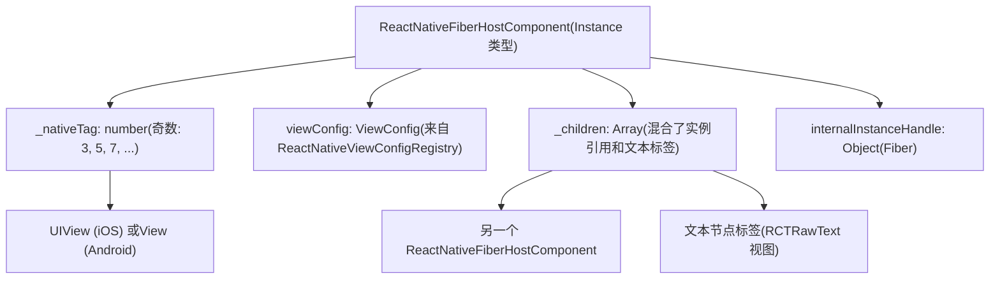
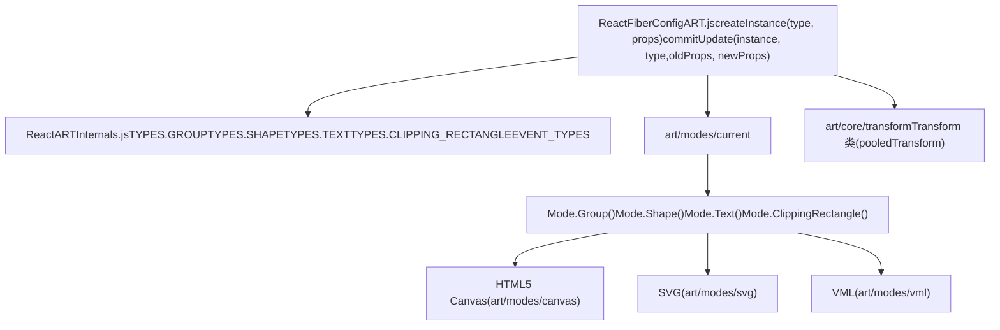

# React Native 与其他渲染器

相关源文件

-   [packages/react-art/src/ReactFiberConfigART.js](https://github.com/facebook/react/blob/65eec428/packages/react-art/src/ReactFiberConfigART.js)
-   [packages/react-dom-bindings/src/client/ReactFiberConfigDOM.js](https://github.com/facebook/react/blob/65eec428/packages/react-dom-bindings/src/client/ReactFiberConfigDOM.js)
-   [packages/react-native-renderer/src/ReactFiberConfigFabric.js](https://github.com/facebook/react/blob/65eec428/packages/react-native-renderer/src/ReactFiberConfigFabric.js)
-   [packages/react-native-renderer/src/ReactFiberConfigNative.js](https://github.com/facebook/react/blob/65eec428/packages/react-native-renderer/src/ReactFiberConfigNative.js)
-   [packages/react-noop-renderer/src/createReactNoop.js](https://github.com/facebook/react/blob/65eec428/packages/react-noop-renderer/src/createReactNoop.js)
-   [packages/react-reconciler/src/ReactFiberConfigWithNoMutation.js](https://github.com/facebook/react/blob/65eec428/packages/react-reconciler/src/ReactFiberConfigWithNoMutation.js)
-   [packages/react-reconciler/src/ReactFiberGestureScheduler.js](https://github.com/facebook/react/blob/65eec428/packages/react-reconciler/src/ReactFiberGestureScheduler.js)
-   [packages/react-reconciler/src/\_\_tests\_\_/ReactFiberHostContext-test.internal.js](https://github.com/facebook/react/blob/65eec428/packages/react-reconciler/src/__tests__/ReactFiberHostContext-test.internal.js)
-   [packages/react-reconciler/src/forks/ReactFiberConfig.custom.js](https://github.com/facebook/react/blob/65eec428/packages/react-reconciler/src/forks/ReactFiberConfig.custom.js)
-   [packages/react-test-renderer/src/ReactFiberConfigTestHost.js](https://github.com/facebook/react/blob/65eec428/packages/react-test-renderer/src/ReactFiberConfigTestHost.js)

## 目的与范围

本文档解释了 React 如何通过宿主配置（Host Configuration）实现来针对非 DOM 平台。内容涵盖了 React Native 的两种渲染架构（使用持久化模式的 Fabric 和使用变动模式的 Legacy）、React ART 画布渲染器、测试渲染器，以及构建自定义渲染器的模式。有关抽象宿主配置接口的信息，请参阅第 3.3 页。有关 DOM 特定渲染的信息，请参阅第 4.1 页。

---

## 变动模式 vs 持久化模式渲染策略

协调器支持两种根本不同的策略来将更新应用到宿主实例。每个渲染器通过其宿主配置中的 `supportsMutation` 和 `supportsPersistence` 导出项来声明其策略。

### 策略概述

```mermaid
flowchart TD
    PersConfig["宿主配置导出"]
    cloneInstance["cloneInstance(instance, type,oldProps, newProps,keepChildren, children)"]
    createContainerChildSet["createContainerChildSet()"]
    appendChildToContainerChildSet["appendChildToContainerChildSet(childSet, child)"]
    replaceContainerChildren["replaceContainerChildren(container, childSet)"]
    MutConfig["宿主配置导出"]
    appendChild["appendChild(parent, child)"]
    commitUpdate["commitUpdate(instance, type,oldProps, newProps)"]
    removeChild["removeChild(parent, child)"]
    insertBefore["insertBefore(parent, child,beforeChild)"]
    commitTextUpdate["commitTextUpdate(textInstance,oldText, newText)"]
    ReactFiberWorkLoop["ReactFiberWorkLoop.jscommitMutationEffects() 或commitMutationEffectsOnFiber()"]

    ReactFiberWorkLoop --> MutationStrategy
    ReactFiberWorkLoop --> PersistenceStrategy
    PersConfig --> cloneInstance
    PersConfig --> createContainerChildSet
    PersConfig --> appendChildToContainerChildSet
    PersConfig --> replaceContainerChildren
    MutConfig --> appendChild
    MutConfig --> commitUpdate
    MutConfig --> removeChild
    MutConfig --> insertBefore
    MutConfig --> commitTextUpdate
```


**来源：** [packages/react-reconciler/src/ReactFiberConfigWithNoMutation.js22-60](https://github.com/facebook/react/blob/65eec428/packages/react-reconciler/src/ReactFiberConfigWithNoMutation.js#L22-L60) [packages/react-dom-bindings/src/client/ReactFiberConfigDOM.js806](https://github.com/facebook/react/blob/65eec428/packages/react-dom-bindings/src/client/ReactFiberConfigDOM.js#L806-L806) [packages/react-native-renderer/src/ReactFiberConfigFabric.js445](https://github.com/facebook/react/blob/65eec428/packages/react-native-renderer/src/ReactFiberConfigFabric.js#L445-L445)

### 变动策略（Mutation Strategy）

使用变动策略的渲染器在提交阶段（commit phase）原位（in-place）修改宿主实例。协调器调用 `appendChild`、`commitUpdate` 和 `removeChild` 等方法直接变动实例树。这种方式较为简单，但将渲染与宿主环境耦合得更紧。

| 操作 | 目的 | 渲染器示例 |
| --- | --- | --- |
| `appendChild(parent, child)` | 向父节点添加子节点 | DOM, React Native Legacy, React ART |
| `insertBefore(parent, child, before)` | 在兄弟节点前插入子节点 | DOM, React Native Legacy |
| `removeChild(parent, child)` | 从父节点移除子节点 | DOM, React Native Legacy, React ART |
| `commitUpdate(instance, type, oldProps, newProps)` | 更新实例属性 | DOM, React Native Legacy, React ART |
| `commitTextUpdate(textInstance, oldText, newText)` | 更新文本内容 | DOM, React Native Legacy |

**来源：** [packages/react-dom-bindings/src/client/ReactFiberConfigDOM.js945-1127](https://github.com/facebook/react/blob/65eec428/packages/react-dom-bindings/src/client/ReactFiberConfigDOM.js#L945-L1127) [packages/react-native-renderer/src/ReactFiberConfigNative.js379-467](https://github.com/facebook/react/blob/65eec428/packages/react-native-renderer/src/ReactFiberConfigNative.js#L379-L467) [packages/react-art/src/ReactFiberConfigART.js417-467](https://github.com/facebook/react/blob/65eec428/packages/react-art/src/ReactFiberConfigART.js#L417-L467)

### 持久化策略（Persistence Strategy）

使用持久化策略的渲染器将实例视为不可变的。在更新期间，协调器会克隆带有新 props 的实例，在内存中构建完整的子节点集（child set），并原子级地（atomically）替换整棵树。这实现了结构共享（structural sharing），并且在创建新实例成本较低的环境中可以提高性能。

| 操作 | 目的 | 渲染器示例 |
| --- | --- | --- |
| `cloneInstance(instance, type, oldProps, newProps, keepChildren, children)` | 克隆带有新 props 的实例 | React Native Fabric, React Noop |
| `createContainerChildSet()` | 创建用于构建新树的空子节点集 | React Native Fabric, React Noop |
| `appendChildToContainerChildSet(childSet, child)` | 向子节点集添加子节点 | React Native Fabric, React Noop |
| `finalizeContainerChildren(container, childSet)` | 为提交准备子节点集 | React Native Fabric, React Noop |
| `replaceContainerChildren(container, childSet)` | 原子级地交换子节点 | React Native Fabric, React Noop |

**来源：** [packages/react-native-renderer/src/ReactFiberConfigFabric.js447-557](https://github.com/facebook/react/blob/65eec428/packages/react-native-renderer/src/ReactFiberConfigFabric.js#L447-L557) [packages/react-noop-renderer/src/createReactNoop.js903-941](https://github.com/facebook/react/blob/65eec428/packages/react-noop-renderer/src/createReactNoop.js#L903-L941)

---

## React Native Fabric (持久化模式)

React Native 的 Fabric 架构是使用持久化策略的现代渲染系统。它通过 `nativeFabricUIManager` 全局变量与 C++ Fabric UI 管理器集成。

### 架构概述


```mermaid
flowchart TD
    ReactFiberConfigFabric["ReactFiberConfigFabric.jscreateInstance()cloneInstance()replaceContainerChildren()"]
    ReactFabricEventEmitter["ReactFabricEventEmitter.jsdispatchEvent()"]
    ReactFabricComponentTree["ReactFabricComponentTree.jsgetClosestInstanceFromNode()"]
    ReactNativeViewConfigRegistry["ReactNativeViewConfigRegistryget(type) → ViewConfig"]
    nativeFabricUIManager["nativeFabricUIManager"]
    createNode["createNode(tag, viewName,rootTag, props, handle)"]
    cloneNodeWithNewProps["cloneNodeWithNewProps(node, updatePayload)"]
    cloneNodeWithNewChildren["cloneNodeWithNewChildren(node, childSet?)"]
    cloneNodeWithNewChildrenAndProps["cloneNodeWithNewChildrenAndProps(node, childSet?, updatePayload)"]
    completeRoot["completeRoot(containerTag,childSet)"]
    registerEventHandler["registerEventHandler(dispatchEvent)"]
    ShadowNodeTree["影子节点树(Yoga 布局)"]
    UIThread["主 UI 线程平台视图"]

    ReactFiberConfigFabric --> ReactNativeViewConfigRegistry
    ReactFiberConfigFabric --> createNode
    ReactFiberConfigFabric --> cloneNodeWithNewProps
    ReactFiberConfigFabric --> cloneNodeWithNewChildren
    ReactFiberConfigFabric --> cloneNodeWithNewChildrenAndProps
    ReactFiberConfigFabric --> completeRoot
    ReactFabricEventEmitter --> registerEventHandler
    createNode --> ShadowNodeTree
    cloneNodeWithNewProps --> ShadowNodeTree
    cloneNodeWithNewChildren --> ShadowNodeTree
    cloneNodeWithNewChildrenAndProps --> ShadowNodeTree
    completeRoot --> UIThread
```

**来源：** [packages/react-native-renderer/src/ReactFiberConfigFabric.js44-59](https://github.com/facebook/react/blob/65eec428/packages/react-native-renderer/src/ReactFiberConfigFabric.js#L44-L59) [packages/react-native-renderer/src/ReactFiberConfigFabric.js15](https://github.com/facebook/react/blob/65eec428/packages/react-native-renderer/src/ReactFiberConfigFabric.js#L15-L15) [packages/react-native-renderer/src/ReactFabricEventEmitter.js](https://github.com/facebook/react/blob/65eec428/packages/react-native-renderer/src/ReactFabricEventEmitter.js) [packages/react-native-renderer/src/ReactFabricComponentTree.js61](https://github.com/facebook/react/blob/65eec428/packages/react-native-renderer/src/ReactFabricComponentTree.js#L61-L61)

### 实例结构

Fabric 实例（ReactFiberConfigFabric.js 中的 `Instance` 类型）维护一个在所有克隆中共享的 `canonical` 引用，从而实现高效的结构共享：

**来源：** [packages/react-native-renderer/src/ReactFiberConfigFabric.js92-112](https://github.com/facebook/react/blob/65eec428/packages/react-native-renderer/src/ReactFiberConfigFabric.js#L92-L112) [packages/react-native-renderer/src/ReactFiberConfigFabric.js496-499](https://github.com/facebook/react/blob/65eec428/packages/react-native-renderer/src/ReactFiberConfigFabric.js#    L496-L499)

每个 `Instance` 包含：

-   `node`：对由 `createNode()` 创建的原生影子节点（shadow node）的引用。
-   `canonical`：包含以下内容的共享状态对象：
    -   `nativeTag`：视图的唯一标识符（仅限偶数）。
    -   `viewConfig`：来自 `ReactNativeViewConfigRegistry` 的视图类型元数据。
    -   `currentProps`：当前 props（在渲染阶段更新，用于事件处理程序）。
    -   `internalInstanceHandle`：用于 DevTools 和事件处理的 Fiber 引用。
    -   `publicInstance`：通过 refs 暴露的延迟创建的公共实例。

**来源：** [packages/react-native-renderer/src/ReactFiberConfigFabric.js205-215](https://github.com/facebook/react/blob/65eec428/packages/react-native-renderer/src/ReactFiberConfigFabric.js#L205-L215) [packages/react-native-renderer/src/ReactFiberConfigFabric.js289-302](https://github.com/facebook/react/blob/65eec428/packages/react-native-renderer/src/ReactFiberConfigFabric.js#L289-L302)

### 关键操作

#### 实例创建

[packages/react-native-renderer/src/ReactFiberConfigFabric.js172-216](https://github.com/facebook/react/blob/65eec428/packages/react-native-renderer/src/ReactFiberConfigFabric.js#L172-L216)

```
createInstance(type, props, rootContainer, hostContext, internalInstanceHandle)
  1. 分配唯一 tag (nextReactTag += 2, 确保为偶数)
  2. 从 ReactNativeViewConfigRegistry 获取该类型的 ViewConfig
  3. 使用 createAttributePayload() 从 props 创建属性载荷
  4. 调用 nativeFabricUIManager.createNode() 创建影子节点
  5. 返回带有节点引用和 canonical 状态的 Instance
```
#### 更新时的克隆

[packages/react-native-renderer/src/ReactFiberConfigFabric.js447-500](https://github.com/facebook/react/blob/65eec428/packages/react-native-renderer/src/ReactFiberConfigFabric.js#L447-L500)

```
cloneInstance(instance, type, oldProps, newProps, keepChildren, newChildSet)
  1. 从 instance.canonical.viewConfig 获取 viewConfig
  2. 比较 (Diff) props：updatePayload = diffAttributePayloads(oldProps, newProps, validAttributes)
  3. 更新 canonical.currentProps = newProps (供事件处理程序使用)
  4. 选择克隆策略：
     - 如果 keepChildren && updatePayload !== null: cloneNodeWithNewProps()
     - 如果 keepChildren && updatePayload === null: 返回 instance (无变化)
     - 如果 !keepChildren && newChildSet != null: cloneNodeWithNewChildrenAndProps()
     - 如果 !keepChildren && newChildSet == null: cloneNodeWithNewChildren()
  5. 返回带有克隆节点且共享 canonical 引用的新 Instance
```
`passChildrenWhenCloningPersistedNodes` 特性标志控制子节点是作为数组传递还是通过单独的子节点集结构传递。

**来源：** [packages/react-native-renderer/src/ReactFiberConfigFabric.js70](https://github.com/facebook/react/blob/65eec428/packages/react-native-renderer/src/ReactFiberConfigFabric.js#L70-L70) [packages/react-native-renderer/src/ReactFiberConfigFabric.js476-493](https://github.com/facebook/react/blob/65eec428/packages/react-native-renderer/src/ReactFiberConfigFabric.js#L476-L493)

#### 提交阶段（Commit Phase）

[packages/react-native-renderer/src/ReactFiberConfigFabric.js526-557](https://github.com/facebook/react/blob/65eec428/packages/react-native-renderer/src/ReactFiberConfigFabric.js#L526-L557)

```
持久化提交序列：
  1. createContainerChildSet() → 创建空数组或 NodeSet
  2. appendChildToContainerChildSet(childSet, child) → 将 child.node 添加到集合
  3. finalizeContainerChildren(container, childSet) → 无操作 (验证点)
  4. replaceContainerChildren(container, childSet) → completeRoot(containerTag, childSet)
```
`completeRoot()` 调用同步地将影子树刷新到原生 UI 线程，使所有更改原子级地可见。

**来源：** [packages/react-native-renderer/src/ReactFiberConfigFabric.js552-557](https://github.com/facebook/react/blob/65eec428/packages/react-native-renderer/src/ReactFiberConfigFabric.js#L552-L557)

---

## React Native Legacy (变动模式)

旧版（Legacy）React Native 渲染器使用变动策略，配合旧的 `UIManager` 命令式 API。该渲染器仍用于旧版本的 React Native 以及尚未迁移到 Fabric 的应用中。

### 架构概述


```mermaid
flowchart TD
    ReactFiberConfigNative["ReactFiberConfigNative.jscreateInstance()appendChild()commitUpdate()"]
    ReactNativeFiberHostComponent["ReactNativeFiberHostComponent.js具有 _nativeTag,viewConfig, _children 的类"]
    ReactNativeComponentTree["ReactNativeComponentTree.jsprecacheFiberNode()updateFiberProps()"]
    ReactNativeAttributePayload["ReactNativeAttributePayload.jscreate(props, validAttributes)diff(oldProps, newProps, validAttributes)"]
    ReactNativeViewConfigRegistry["ReactNativeViewConfigRegistryget(type) → ViewConfig"]
    UIManager["UIManager"]
    createView["createView(tag, viewName,rootTag, props)"]
    updateView["updateView(tag, viewName,props)"]
    manageChildren["manageChildren(containerTag,moveFromIndices, moveToIndices,addChildReactTags, addAtIndices,removeAtIndices)"]
    setChildren["setChildren(containerTag,childTags)"]
    NativeViews["UIView (iOS) /View (Android)"]
    MainThread["主 UI 线程(同步更新)"]

    ReactFiberConfigNative --> ReactNativeViewConfigRegistry
    ReactFiberConfigNative --> ReactNativeFiberHostComponent
    ReactFiberConfigNative --> ReactNativeComponentTree
    ReactFiberConfigNative --> ReactNativeAttributePayload
    ReactFiberConfigNative --> createView
    ReactFiberConfigNative --> updateView
    ReactFiberConfigNative --> manageChildren
    ReactFiberConfigNative --> setChildren
    createView --> NativeViews
    updateView --> NativeViews
    manageChildren --> MainThread
    setChildren --> MainThread
```

**来源：** [packages/react-native-renderer/src/ReactFiberConfigNative.js14-20](https://github.com/facebook/react/blob/65eec428/packages/react-native-renderer/src/ReactFiberConfigNative.js#L14-L20) [packages/react-native-renderer/src/ReactFiberConfigNative.js29](https://github.com/facebook/react/blob/65eec428/packages/react-native-renderer/src/ReactFiberConfigNative.js#L29-L29) [packages/react-native-renderer/src/ReactNativeComponentTree.js24-27](https://github.com/facebook/react/blob/65eec428/packages/react-native-renderer/src/ReactNativeComponentTree.js#L24-L27) [packages/react-native-renderer/src/ReactNativeAttributePayload.js22](https://github.com/facebook/react/blob/65eec428/packages/react-native-renderer/src/ReactNativeAttributePayload.js#L22-L22)

### 实例结构

旧版实例是 `ReactNativeFiberHostComponent` 类的实例，该类维护子引用并通过数字标签（numeric tags）与原生视图通信：


**来源：** [packages/react-native-renderer/src/ReactFiberConfigNative.js65-66](https://github.com/facebook/react/blob/65eec428/packages/react-native-renderer/src/ReactFiberConfigNative.js#L65-L66) [packages/react-native-renderer/src/ReactNativeFiberHostComponent.js](https://github.com/facebook/react/blob/65eec428/packages/react-native-renderer/src/ReactNativeFiberHostComponent.js) [packages/react-native-renderer/src/ReactFiberConfigNative.js157-161](https://github.com/facebook/react/blob/65eec428/packages/react-native-renderer/src/ReactFiberConfigNative.js#L157-L161)

标签分配确保旧版标签永远不会与 Fabric 标签重叠：

-   旧版标签从 3 开始并以 2 为步长递增（全部为奇数：3, 5, 7, ...）。
-   根标签以 1 结尾（11, 21, 31, ...）。
-   Fabric 标签为偶数（2, 4, 6, ...）。

**来源：** [packages/react-native-renderer/src/ReactFiberConfigNative.js91-102](https://github.com/facebook/react/blob/65eec428/packages/react-native-renderer/src/ReactFiberConfigNative.js#L91-L102)

### 关键操作

#### 实例创建

[packages/react-native-renderer/src/ReactFiberConfigNative.js130-169](https://github.com/facebook/react/blob/65eec428/packages/react-native-renderer/src/ReactFiberConfigNative.js#L130-L169)

```
createInstance(type, props, rootContainer, hostContext, internalInstanceHandle)
  1. 分配 tag (使用 nextReactTag, 如果 % 10 === 1 则跳过, 步长为 2)
  2. 从 ReactNativeViewConfigRegistry 获取 ViewConfig
  3. 创建更新载荷: updatePayload = create(props, validAttributes)
  4. 调用 UIManager.createView(tag, uiViewClassName, rootTag, updatePayload)
  5. 创建新的 ReactNativeFiberHostComponent(tag, viewConfig, handle)
  6. 缓存映射: precacheFiberNode(handle, tag) 以及 updateFiberProps(tag, props)
  7. 返回实例
```
来自 `ReactNativeAttributePayload` 的 `create()` 函数将 React props 转换为原生属性格式，并应用平台特定的转换。

**来源：** [packages/react-native-renderer/src/ReactNativeAttributePayload.js](https://github.com/facebook/react/blob/65eec428/packages/react-native-renderer/src/ReactNativeAttributePayload.js)

#### 变动操作

[packages/react-native-renderer/src/ReactFiberConfigNative.js379-410](https://github.com/facebook/react/blob/65eec428/packages/react-native-renderer/src/ReactFiberConfigNative.js#L379-L410)

```
appendChild(parentInstance, child)
  1. 提取 childTag (数字或 child._nativeTag)
  2. 检查子节点是否已在 parent._children 中
  3. 如果是：使用 manageChildren(moveFromIndices, moveToIndices) 移动到末尾
  4. 如果否：使用 manageChildren(addChildReactTags, addAtIndices) 添加到末尾
```
`manageChildren()` API 虽然复杂但非常强大，支持在单次调用中同时进行移动、添加和移除：

**来源：** [packages/react-native-renderer/src/ReactFiberConfigNative.js379-410](https://github.com/facebook/react/blob/65eec428/packages/react-native-renderer/src/ReactFiberConfigNative.js#L379-L410)

[packages/react-native-renderer/src/ReactFiberConfigNative.js470-507](https://github.com/facebook/react/blob/65eec428/packages/react-native-renderer/src/ReactFiberConfigNative.js#L470-L507)

```
insertBefore(parentInstance, child, beforeChild)
  1. 在 parent._children 中查找 child 和 beforeChild 的索引
  2. 如果 child 存在：从旧位置移除，在主位置插入
  3. 构建带有 moveFromIndices/moveToIndices 或 addChildReactTags/addAtIndices 的 manageChildren() 调用
```
[packages/react-native-renderer/src/ReactFiberConfigNative.js445-468](https://github.com/facebook/react/blob/65eec428/packages/react-native-renderer/src/ReactFiberConfigNative.js#L445-L468)

```
commitUpdate(instance, type, oldProps, newProps, internalInstanceHandle)
  1. 更新缓存的 props: updateFiberProps(instance._nativeTag, newProps)
  2. 比较 (Diff) props: updatePayload = diff(oldProps, newProps, validAttributes)
  3. 如果 updatePayload != null: UIManager.updateView(tag, uiViewClassName, updatePayload)
```
null 检查优化避免了在 props 未发生变化时进行昂贵的桥接（bridge）调用。

**来源：** [packages/react-native-renderer/src/ReactFiberConfigNative.js456-467](https://github.com/facebook/react/blob/65eec428/packages/react-native-renderer/src/ReactFiberConfigNative.js#L456-L467)

#### 子节点管理

[packages/react-native-renderer/src/ReactFiberConfigNative.js237-262](https://github.com/facebook/react/blob/65eec428/packages/react-native-renderer/src/ReactFiberConfigNative.js#L237-L262)

```
finalizeInitialChildren(parentInstance, type, props, hostContext)
  1. 将 parent._children 映射为原生标签 (数字)
  2. 调用 UIManager.setChildren(parent._nativeTag, childTags)
  3. 返回 false (不需要提交时的工作)
```
与 DOM 的 `appendChild` 不同，React Native 会在整棵子树构建完成后，通过单次 `setChildren()` 调用批量添加所有子节点。

**来源：** [packages/react-native-renderer/src/ReactFiberConfigNative.js237-262](https://github.com/facebook/react/blob/65eec428/packages/react-native-renderer/src/ReactFiberConfigNative.js#L237-L262)

---

## React ART 渲染器

React ART 使用 ART 库渲染到基于画布（canvas）的矢量图形。它支持变动模式，并提供了一套用于绘制形状、路径和文本的声明式 API。

### 架构概述


**来源：** [packages/react-art/src/ReactFiberConfigART.js10-13](https://github.com/facebook/react/blob/65eec428/packages/react-art/src/ReactFiberConfigART.js#L10-L13) [packages/react-art/src/ReactARTInternals.js](https://github.com/facebook/react/blob/65eec428/packages/react-art/src/ReactARTInternals.js) [packages/react-art/src/ReactFiberConfigART.js26](https://github.com/facebook/react/blob/65eec428/packages/react-art/src/ReactFiberConfigART.js#L26-L26)

### 实例类型

React ART 支持五种元素类型，每种都映射到一个 ART 类：

| React 类型 | ART 类 | 目的 | Props |
| --- | --- | --- | --- |
| `CLIPPING_RECTANGLE` | `Mode.ClippingRectangle()` | 定义裁剪区域 | `width`, `height`, `x`, `y` |
| `GROUP` | `Mode.Group()` | 带有变换的容器 | `width`, `height`, 变换 props |
| `SHAPE` | `Mode.Shape()` | 矢量路径 | `d` (路径), `width`, `height`, 填充, 描边 |
| `TEXT` | `Mode.Text()` | 渲染文本 | `children` (字符串), `font`, `alignment`, `path` |
| `SURFACE` | 外部创建 | 根画布 | 不适用 (由 React ART 入口点创建) |

**来源：** [packages/react-art/src/ReactFiberConfigART.js13](https://github.com/facebook/react/blob/65eec428/packages/react-art/src/ReactFiberConfigART.js#L13-L13) [packages/react-art/src/ReactFiberConfigART.js269-303](https://github.com/facebook/react/blob/65eec428/packages/react-art/src/ReactFiberConfigART.js#L269-L303)

### 变换系统（Transform System）

[packages/react-art/src/ReactFiberConfigART.js140-163](https://github.com/facebook/react/blob/65eec428/packages/react-art/src/ReactFiberConfigART.js#L140-L163)

所有 ART 节点都支持一套丰富的变换系统，使用一个池化实例（pooled instance）`Transform` 来减少分配：

```
applyNodeProps(instance, props)
  1. 计算 scaleX 和 scaleY (来自 scale 或单个 props)
  2. 将 pooledTransform 重置为单位矩阵
  3. 按顺序应用变换：
     - move(x || 0, y || 0)
     - rotate(rotation || 0, originX, originY)
     - scale(scaleX, scaleY, originX, originY)
     - 如果存在 props.transform 则应用变换
  4. 检查变换是否发生变化 (比较矩阵值)
  5. 如果发生变化：instance.transformTo(pooledTransform)
```
这确保了变换能一致地应用到所有节点类型，同时避免了不必要的更新。

**来源：** [packages/react-art/src/ReactFiberConfigART.js26](https://github.com/facebook/react/blob/65eec428/packages/react-art/src/ReactFiberConfigART.js#L26-L26) [packages/react-art/src/ReactFiberConfigART.js140-163](https://github.com/facebook/react/blob/65eec428/packages/react-art/src/ReactFiberConfigART.js#L140-L163)

### 事件处理

[packages/react-art/src/ReactFiberConfigART.js37-86](https://github.com/facebook/react/blob/65eec428/packages/react-art/src/ReactFiberConfigART.js#L37-L86)

ART 通过订阅机制实现其自身的事件系统：

```
事件处理生命周期：
  1. addEventListeners(instance, type, listener)
     - 将监听器存储在 instance._listeners[type] 中
     - 订阅：instance._subscriptions[type] = instance.subscribe(type, handler, instance)

  2. 由 ART 调用 handleEvent(event)
     - 查找监听器 listener = instance._listeners[event.type]
     - 调用 listener.call(instance, event) 或 listener.handleEvent(event)

  3. destroyEventListeners(instance)
     - 取消所有订阅：instance._subscriptions[type]()
     - 清除引用
```
`EVENT_TYPES` 中定义的受支持事件：`onClick`, `onMouseMove`, `onMouseOver`, `onMouseOut`, `onMouseUp`, `onMouseDown`。

**来源：** [packages/react-art/src/ReactARTInternals.js](https://github.com/facebook/react/blob/65eec428/packages/react-art/src/ReactARTInternals.js) [packages/react-art/src/ReactFiberConfigART.js181-183](https://github.com/facebook/react/blob/65eec428/packages/react-art/src/ReactFiberConfigART.js#L181-L183)

### 实例创建与更新

[packages/react-art/src/ReactFiberConfigART.js269-303](https://github.com/facebook/react/blob/65eec428/packages/react-art/src/ReactFiberConfigART.js#L269-L303)

```
createInstance(type, props, internalInstanceHandle)
  1. 根据类型选择：
     - CLIPPING_RECTANGLE: instance = Mode.ClippingRectangle()
       instance._applyProps = applyClippingRectangleProps
     - GROUP: instance = Mode.Group()
       instance._applyProps = applyGroupProps
     - SHAPE: instance = Mode.Shape()
       instance._applyProps = applyShapeProps
     - TEXT: instance = Mode.Text(children, font, alignment, path)
       instance._applyProps = applyTextProps
  2. instance._applyProps(instance, props)
  3. 返回实例
```
每种实例类型都将其更新函数存储在 `_applyProps` 中，该函数在创建和更新时都会被调用：

[packages/react-art/src/ReactFiberConfigART.js465-467](https://github.com/facebook/react/blob/65eec428/packages/react-art/src/ReactFiberConfigART.js#L465-L467)

```
commitUpdate(instance, type, oldProps, newProps)
  instance._applyProps(instance, newProps, oldProps)
```
**来源：** [packages/react-art/src/ReactFiberConfigART.js126-250](https://github.com/facebook/react/blob/65eec428/packages/react-art/src/ReactFiberConfigART.js#L126-L250) [packages/react-art/src/ReactFiberConfigART.js465-467](https://github.com/facebook/react/blob/65eec428/packages/react-art/src/ReactFiberConfigART.js#L465-L467)

---

## 自定义与第三方渲染器

React 将协调器作为 `react-reconciler` npm 包公开，使开发者能够为任何平台构建自定义渲染器。协调器以一个接受宿主配置作为参数的包（bundle）形式分发。

### 宿主配置适配层 (Host Configuration Shim)

`react-reconciler` npm 包使用包装函数（wrapper function）模式以允许自定义宿主配置。协调器被打包为一个接受配置对象的函数。

[packages/react-reconciler/src/forks/ReactFiberConfig.custom.js1-285](https://github.com/facebook/react/blob/65eec428/packages/react-reconciler/src/forks/ReactFiberConfig.custom.js#L1-L285)

```
包包装器结构：
  module.exports = function ($$$config) {
    // 所有协调器代码都被包装在此函数中
    // ReactFiberConfig 导入会解析到 ReactFiberConfig.custom.js
    // 该文件从 $$$config 重新导出内容
    return {
      createContainer,
      updateContainer,
      // ... 公共协调器 API
    };
  }

ReactFiberConfig.custom.js 导出项：
  export const rendererPackageName = $$$config.rendererPackageName;
  export const rendererVersion = $$$config.rendererVersion;
  export const createInstance = $$$config.createInstance;
  export const appendChild = $$$config.appendChild;
  export const commitUpdate = $$$config.commitUpdate;
  // ... 约 100 多个宿主配置方法导出
```
这种间接方式允许协调器代码从 `'./ReactFiberConfig'` 使用静态导入，而具体实现则是在调用包时在运行时提供的。

**来源：** [packages/react-reconciler/src/forks/ReactFiberConfig.custom.js10-24](https://github.com/facebook/react/blob/65eec428/packages/react-reconciler/src/forks/ReactFiberConfig.custom.js#L10-L24) [packages/react-reconciler/src/forks/ReactFiberConfig.custom.js26-285](https://github.com/facebook/react/blob/65eec428/packages/react-reconciler/src/forks/ReactFiberConfig.custom.js#L26-L285)

### 必需的宿主配置方法

一个最小化的渲染器必须实现这些核心方法：

| 类别 | 必需的方法 | 可选 |
| --- | --- | --- |
| **上下文** | `getRootHostContext()`, `getChildHostContext()` |  |
| **实例生命周期** | `createInstance()`, `createTextInstance()`, `appendInitialChild()`, `finalizeInitialChildren()` | `cloneMutableInstance()`, `cloneMutableTextInstance()` |
| **提交准备** | `prepareForCommit()`, `resetAfterCommit()` |  |
| **Props** | `shouldSetTextContent()` |  |
| **公共 API** | `getPublicInstance()` |  |
| **调度** | `scheduleTimeout()`, `cancelTimeout()`, `noTimeout`, `now()` | `supportsMicrotasks`, `scheduleMicrotask()` |
| **优先级** | `getCurrentUpdatePriority()`, `setCurrentUpdatePriority()`, `resolveUpdatePriority()` |  |
| **渲染器元数据** | `isPrimaryRenderer`, `warnsIfNotActing` |  |
| **能力** | 选择: `supportsMutation` 异或 `supportsPersistence` | `supportsHydration`, `supportsResources`, `supportsSingletons` |

**来源：** [packages/react-reconciler/src/forks/ReactFiberConfig.custom.js26-285](https://github.com/facebook/react/blob/65eec428/packages/react-reconciler/src/forks/ReactFiberConfig.custom.js#L26-L285)

### 变动策略 vs 持久化策略的权衡

**变动策略 (Mutation Strategy):**

-   ✅ 实现更简单 (方法更少)。
-   ✅ 直接操作 (更易于调试)。
-   ✅ 适用于具有可变宿主对象的平台。
-   ❌ 将渲染与宿主环境状态耦合。
-   ❌ 无法使用结构共享优化。

**持久化策略 (Persistence Strategy):**

-   ✅ 启用结构共享 (性能更好)。
-   ✅ 不可变更新 (更易于推理)。
-   ✅ 原子级提交 (全有或全无更新)。
-   ❌ 实现更复杂 (克隆逻辑)。
-   ❌ 需要创建实例的成本较低。

**来源：** [packages/react-reconciler/src/ReactFiberConfigWithNoMutation.js10-19](https://github.com/facebook/react/blob/65eec428/packages/react-reconciler/src/ReactFiberConfigWithNoMutation.js#L10-L19)

### 示例：测试渲染器 (Test Renderer)

测试渲染器（`react-test-renderer` 包）展示了一个使用普通 JavaScript 对象作为实例的最小化变动模式实现：

#### 实例类型

[packages/react-test-renderer/src/ReactFiberConfigTestHost.js28-46](https://github.com/facebook/react/blob/65eec428/packages/react-test-renderer/src/ReactFiberConfigTestHost.js#L28-L46)

```
Instance 类型 (标签: 'INSTANCE'):
  {
    type: string,                     // 元素类型
    props: Object,                    // 当前 props
    isHidden: boolean,               // 用于 Offscreen/Suspense
    children: Array<Instance | TextInstance>,
    internalInstanceHandle: Object,  // Fiber 引用
    rootContainerInstance: Container,
    tag: 'INSTANCE',                // 鉴别器
  }

TextInstance 类型 (标签: 'TEXT'):
  {
    text: string,                    // 文本内容
    isHidden: boolean,              // 用于 Offscreen/Suspense
    tag: 'TEXT',                   // 鉴别器
  }

Container 类型 (标签: 'CONTAINER'):
  {
    children: Array<Instance | TextInstance>,
    createNodeMock: Function,       // 用于 ref 模拟
    tag: 'CONTAINER',
  }
```
#### 关键操作

[packages/react-test-renderer/src/ReactFiberConfigTestHost.js158-174](https://github.com/facebook/react/blob/65eec428/packages/react-test-renderer/src/ReactFiberConfigTestHost.js#L158-L174)

```
createInstance(type, props, rootContainer, hostContext, internalInstanceHandle):
  return {
    type,
    props,
    isHidden: false,
    children: [],
    internalInstanceHandle,
    rootContainerInstance,
    tag: 'INSTANCE',
  };
```
[packages/react-test-renderer/src/ReactFiberConfigTestHost.js90-109](https://github.com/facebook/react/blob/65eec428/packages/react-test-renderer/src/ReactFiberConfigTestHost.js#L90-L109)

```
appendChild(parentInstance, child):
  1. 检查子节点是否已在 parent.children 中
  2. 如果找到：使用 splice(index, 1) 从旧位置移除
  3. 将子节点推入 parent.children 数组末尾

这允许在不重新创建子节点的情况下移动它们。
```
[packages/react-test-renderer/src/ReactFiberConfigTestHost.js280-289](https://github.com/facebook/react/blob/65eec428/packages/react-test-renderer/src/ReactFiberConfigTestHost.js#L280-L289)

```
commitUpdate(instance, type, oldProps, newProps, internalInstanceHandle):
  instance.type = type;
  instance.props = newProps;

直接变动实例对象。
```
测试渲染器对所有实例使用普通 JavaScript 对象，使其在测试中易于快照（snapshot）和断言渲染后的树结构。

**来源：** [packages/react-test-renderer/src/ReactFiberConfigTestHost.js28-46](https://github.com/facebook/react/blob/65eec428/packages/react-test-renderer/src/ReactFiberConfigTestHost.js#L28-L46) [packages/react-test-renderer/src/ReactFiberConfigTestHost.js158-174](https://github.com/facebook/react/blob/65eec428/packages/react-test-renderer/src/ReactFiberConfigTestHost.js#L158-L174) [packages/react-test-renderer/src/ReactFiberConfigTestHost.js90-109](https://github.com/facebook/react/blob/65eec428/packages/react-test-renderer/src/ReactFiberConfigTestHost.js#L90-L109) [packages/react-test-renderer/src/ReactFiberConfigTestHost.js280-289](https://github.com/facebook/react/blob/65eec428/packages/react-test-renderer/src/ReactFiberConfigTestHost.js#L280-L289)

---

## 关键实现差异

### 实例表示

```mermaid
flowchart TD
    ARTInstance["Instance = Mode.Group() |Mode.Shape() | Mode.Text() |Mode.ClippingRectangle()"]
    ARTText["TextInstance = 字符串(在创建期间展平)"]
    ARTInstanceNote["ART 库实例带有 _applyProps 方法"]
    TestInstance["Instance = {  type: string,  props: Object,  children: Array,  tag: 'INSTANCE'}"]
    TestText["TextInstance = {  text: string,  tag: 'TEXT'}"]
    TestInstanceNote["用于测试快照的普通 JS 对象"]
    LegacyInstance["Instance =ReactNativeFiberHostComponent{  _nativeTag: number,  viewConfig: ViewConfig,  _children: Array}"]
    LegacyText["TextInstance = 数字(仅为标签)"]
    LegacyInstanceNote["UIManager 使用标签来识别视图"]
    FabricInstance["Instance = {  node: 节点,  canonical: {    nativeTag, viewConfig,    currentProps, publicInstance  }}"]
    FabricText["TextInstance = {  node: 节点,  publicInstance?: PublicTextInstance}"]
    FabricInstanceNote["来自 createNode() 的节点canonical 在克隆之间共享"]
    DOMInstance["Instance = Element(HTMLElement | SVGElement)"]
    DOMText["TextInstance = Text(DOM 文本节点)"]
    DOMInstanceNote["Fiber 中的 .stateNode 直接指向 DOM 节点"]
```


**来源：** [packages/react-dom-bindings/src/client/ReactFiberConfigDOM.js214-216](https://github.com/facebook/react/blob/65eec428/packages/react-dom-bindings/src/client/ReactFiberConfigDOM.js#L214-L216) [packages/react-native-renderer/src/ReactFiberConfigFabric.js94-119](https://github.com/facebook/react/blob/65eec428/packages/react-native-renderer/src/ReactFiberConfigFabric.js#L94-L119) [packages/react-native-renderer/src/ReactFiberConfigNative.js65-66](https://github.com/facebook/react/blob/65eec428/packages/react-native-renderer/src/ReactFiberConfigNative.js#L65-L66) [packages/react-test-renderer/src/ReactFiberConfigTestHost.js28-46](https://github.com/facebook/react/blob/65eec428/packages/react-test-renderer/src/ReactFiberConfigTestHost.js#L28-L46) [packages/react-art/src/ReactFiberConfigART.js269-303](https://github.com/facebook/react/blob/65eec428/packages/react-art/src/ReactFiberConfigART.js#L269-L303)

### 提交阶段 (Commit Phase) 模式

| 渲染器 | 策略 | 提交根节点 | 备注 |
| --- | --- | --- | --- |
| **React DOM** | 变动模式 | 通过 `appendChild`, `insertBefore`, `removeChild` 命令式变动 DOM | 在提交期间直接操作 DOM |
| **React Native Fabric** | 持久化模式 | `completeRoot(containerTag, childSet)` | 影子树原子级替换 |
| **React Native Legacy** | 变动模式 | `setChildren(containerTag, childTags)` | 通过 UIManager 批量处理所有子节点 |
| **React ART** | 变动模式 | `child.inject(parentInstance)` | ART 库管理树结构 |
| **React Noop** | 两者兼有 | 变动: `appendChild`, 持久化: `replaceContainerChildren` | 用于测试两种模式 |
| **测试渲染器** | 变动模式 | 普通数组操作 | 内存中的 JavaScript 对象 |

**来源：** [packages/react-dom-bindings/src/client/ReactFiberConfigDOM.js995-1045](https://github.com/facebook/react/blob/65eec428/packages/react-dom-bindings/src/client/ReactFiberConfigDOM.js#L995-L1045) [packages/react-native-renderer/src/ReactFiberConfigFabric.js552-557](https://github.com/facebook/react/blob/65eec428/packages/react-native-renderer/src/ReactFiberConfigFabric.js#L552-L557) [packages/react-native-renderer/src/ReactFiberConfigNative.js413-422](https://github.com/facebook/react/blob/65eec428/packages/react-native-renderer/src/ReactFiberConfigNative.js#L413-L422) [packages/react-art/src/ReactFiberConfigART.js417-429](https://github.com/facebook/react/blob/65eec428/packages/react-art/src/ReactFiberConfigART.js#L417-L429)

### 宿主上下文 (Host Context) 用法

不同的渲染器出于不同目的使用宿主上下文：

**React DOM:** 跟踪 SVG/MathML 的 XML 命名空间：

-   [packages/react-dom-bindings/src/client/ReactFiberConfigDOM.js279-283](https://github.com/facebook/react/blob/65eec428/packages/react-dom-bindings/src/client/ReactFiberConfigDOM.js#L279-L283)
-   `HostContextNamespaceNone`, `HostContextNamespaceSvg`, `HostContextNamespaceMath`
-   影响 `createElement` 与 `createElementNS` 的调用。

**React Native Fabric/Legacy:** 跟踪文本父节点状态：

-   [packages/react-native-renderer/src/ReactFiberConfigFabric.js127-129](https://github.com/facebook/react/blob/65eec428/packages/react-native-renderer/src/ReactFiberConfigFabric.js#L127-L129)
-   [packages/react-native-renderer/src/ReactFiberConfigNative.js69-71](https://github.com/facebook/react/blob/65eec428/packages/react-native-renderer/src/ReactFiberConfigNative.js#L69-L71)
-   `{ isInAParentText: boolean }`
-   文本字符串必须是 Text 组件的子节点。

**React ART:** 返回常量 `NO_CONTEXT`:

-   [packages/react-art/src/ReactFiberConfigART.js28-30](https://github.com/facebook/react/blob/65eec428/packages/react-art/src/ReactFiberConfigART.js#L28-L30)
-   ART 不需要上下文跟踪。

**测试渲染器:** 返回常量 `NO_CONTEXT`:

-   [packages/react-test-renderer/src/ReactFiberConfigTestHost.js66-70](https://github.com/facebook/react/blob/65eec428/packages/react-test-renderer/src/ReactFiberConfigTestHost.js#L66-L70)
-   不需要平台特定的上下文。

**来源：** [packages/react-dom-bindings/src/client/ReactFiberConfigDOM.js297-350](https://github.com/facebook/react/blob/65eec428/packages/react-dom-bindings/src/client/ReactFiberConfigDOM.js#L297-L350) [packages/react-native-renderer/src/ReactFiberConfigFabric.js265-287](https://github.com/facebook/react/blob/65eec428/packages/react-native-renderer/src/ReactFiberConfigFabric.js#L265-L287) [packages/react-native-renderer/src/ReactFiberConfigNative.js270-287](https://github.com/facebook/react/blob/65eec428/packages/react-native-renderer/src/ReactFiberConfigNative.js#L270-L287)

### 事件优先级解析

渲染器以不同方式将平台事件映射到 React 优先级：

[packages/react-native-renderer/src/ReactFiberConfigFabric.js391-415](https://github.com/facebook/react/blob/65eec428/packages/react-native-renderer/src/ReactFiberConfigFabric.js#L391-L415)

```
Fabric resolveUpdatePriority():
  1. 如果 currentUpdatePriority !== NoEventPriority: 返回它
  2. 从原生环境获取 fabricGetCurrentEventPriority()
  3. 将 Fabric 优先级映射到 React 优先级:
     - FabricDiscretePriority → DiscreteEventPriority
     - FabricContinuousPriority → ContinuousEventPriority
     - FabricIdlePriority → IdleEventPriority
     - FabricDefaultPriority → DefaultEventPriority
  4. 如果为 null 则返回 DefaultEventPriority
```
[packages/react-dom-bindings/src/client/ReactFiberConfigDOM.js41-45](https://github.com/facebook/react/blob/65eec428/packages/react-dom-bindings/src/client/ReactFiberConfigDOM.js#L41-L45)

```
DOM: 使用 ReactDOMUpdatePriority.js 映射 DOM 事件:
  - 离散 (Discrete): click, keydown 等
  - 连续 (Continuous): scroll, mousemove 等
  - 默认 (Default): 大多数其他事件
```
[packages/react-native-renderer/src/ReactFiberConfigNative.js352-357](https://github.com/facebook/react/blob/65eec428/packages/react-native-renderer/src/ReactFiberConfigNative.js#L352-L357) [packages/react-art/src/ReactFiberConfigART.js391-393](https://github.com/facebook/react/blob/65eec428/packages/react-art/src/ReactFiberConfigART.js#L391-L393)

```
旧版 RN 与 ART: 始终返回 DefaultEventPriority
  (无原生事件优先级系统)
```
**来源：** [packages/react-dom-bindings/src/client/ReactDOMUpdatePriority.js](https://github.com/facebook/react/blob/65eec428/packages/react-dom-bindings/src/client/ReactDOMUpdatePriority.js) [packages/react-native-renderer/src/ReactFiberConfigFabric.js391-415](https://github.com/facebook/react/blob/65eec428/packages/react-native-renderer/src/ReactFiberConfigFabric.js#L391-L415)

### Fragment 实例支持

React Native Fabric 实现了 Fragment 实例，用于向多个子节点转发 ref：

[packages/react-native-renderer/src/ReactFiberConfigFabric.js654-801](https://github.com/facebook/react/blob/65eec428/packages/react-native-renderer/src/ReactFiberConfigFabric.js#L654-L801)

```
FragmentInstance:
  - _fragmentFiber: Fiber 引用
  - _observers: Set<IntersectionObserver>
  - observeUsing(observer): 观察所有子节点
  - unobserveUsing(observer): 取消观察所有子节点
  - compareDocumentPosition(otherNode): 比较位置
  - getRootNode(options): 获取根节点
  - getClientRects(): 获取子节点的边界矩形
```
其他渲染器对 Fragment 实例返回 `null`:

-   [packages/react-dom-bindings/src/client/ReactFiberConfigDOM.js](https://github.com/facebook/react/blob/65eec428/packages/react-dom-bindings/src/client/ReactFiberConfigDOM.js) - 不支持 Fragment
-   [packages/react-native-renderer/src/ReactFiberConfigNative.js210-214](https://github.com/facebook/react/blob/65eec428/packages/react-native-renderer/src/ReactFiberConfigNative.js#L210-L214)
-   [packages/react-art/src/ReactFiberConfigART.js323-340](https://github.com/facebook/react/blob/65eec428/packages/react-art/src/ReactFiberConfigART.js#L323-L340)
-   [packages/react-test-renderer/src/ReactFiberConfigTestHost.js472-497](https://github.com/facebook/react/blob/65eec428/packages/react-test-renderer/src/ReactFiberConfigTestHost.js#L472-L497)

**来源：** [packages/react-native-renderer/src/ReactFiberConfigFabric.js642-801](https://github.com/facebook/react/blob/65eec428/packages/react-native-renderer/src/ReactFiberConfigFabric.js#L642-L801)

### Suspense 提交特性

只有 React DOM 和 React Noop 实现了加载资源时的带有 Suspense 的提交（Suspenseful commits）：

[packages/react-dom-bindings/src/client/ReactFiberConfigDOM.js92-97](https://github.com/facebook/react/blob/65eec428/packages/react-dom-bindings/src/client/ReactFiberConfigDOM.js#L92-L97)

```
DOM 渲染器:
  maySuspendCommit(type, props): 检查 img/link/script 是否可能挂起
  preloadInstance(instance, type, props): 预加载资源, 返回是否准备就绪
  startSuspendingCommit(): 创建 SuspendedState 订阅
  suspendInstance(state, instance, type, props): 附加加载监听器
  waitForCommitToBeReady(state, timeoutOffset): 返回提交回调
```
React Native 渲染器对这些方法始终返回 false/null/无操作:

-   [packages/react-native-renderer/src/ReactFiberConfigFabric.js583-640](https://github.com/facebook/react/blob/65eec428/packages/react-native-renderer/src/ReactFiberConfigFabric.js#L583-L640)
-   [packages/react-native-renderer/src/ReactFiberConfigNative.js766-791](https://github.com/facebook/react/blob/65eec428/packages/react-native-renderer/src/ReactFiberConfigNative.js#L766-L791)

**来源：** [packages/react-dom-bindings/src/client/ReactFiberConfigDOM.js](https://github.com/facebook/react/blob/65eec428/packages/react-dom-bindings/src/client/ReactFiberConfigDOM.js) [packages/react-noop-renderer/src/createReactNoop.js618-710](https://github.com/facebook/react/blob/65eec428/packages/react-noop-renderer/src/createReactNoop.js#L618-L710)
