# Hydration 系统

相关源文件

-   [packages/react-art/src/ReactFiberConfigART.js](https://github.com/facebook/react/blob/65eec428/packages/react-art/src/ReactFiberConfigART.js)
-   [packages/react-dom-bindings/src/client/ReactDOMComponentTree.js](https://github.com/facebook/react/blob/65eec428/packages/react-dom-bindings/src/client/ReactDOMComponentTree.js)
-   [packages/react-dom-bindings/src/client/ReactFiberConfigDOM.js](https://github.com/facebook/react/blob/65eec428/packages/react-dom-bindings/src/client/ReactFiberConfigDOM.js)
-   [packages/react-dom-bindings/src/server/ReactFizzConfigDOM.js](https://github.com/facebook/react/blob/65eec428/packages/react-dom-bindings/src/server/ReactFizzConfigDOM.js)
-   [packages/react-dom-bindings/src/server/ReactFizzConfigDOMLegacy.js](https://github.com/facebook/react/blob/65eec428/packages/react-dom-bindings/src/server/ReactFizzConfigDOMLegacy.js)
-   [packages/react-dom-bindings/src/shared/ReactDOMResourceValidation.js](https://github.com/facebook/react/blob/65eec428/packages/react-dom-bindings/src/shared/ReactDOMResourceValidation.js)
-   [packages/react-dom/src/__tests__/ReactDOMFizzServer-test.js](https://github.com/facebook/react/blob/65eec428/packages/react-dom/src/__tests__/ReactDOMFizzServer-test.js)
-   [packages/react-dom/src/__tests__/ReactDOMFizzServerBrowser-test.js](https://github.com/facebook/react/blob/65eec428/packages/react-dom/src/__tests__/ReactDOMFizzServerBrowser-test.js)
-   [packages/react-dom/src/__tests__/ReactDOMFizzServerNode-test.js](https://github.com/facebook/react/blob/65eec428/packages/react-dom/src/__tests__/ReactDOMFizzServerNode-test.js)
-   [packages/react-dom/src/__tests__/ReactDOMFizzStatic-test.js](https://github.com/facebook/react/blob/65eec428/packages/react-dom/src/__tests__/ReactDOMFizzStatic-test.js)
-   [packages/react-dom/src/__tests__/ReactDOMFizzStaticBrowser-test.js](https://github.com/facebook/react/blob/65eec428/packages/react-dom/src/__tests__/ReactDOMFizzStaticBrowser-test.js)
-   [packages/react-dom/src/__tests__/ReactDOMFizzStaticNode-test.js](https://github.com/facebook/react/blob/65eec428/packages/react-dom/src/__tests__/ReactDOMFizzStaticNode-test.js)
-   [packages/react-dom/src/__tests__/ReactDOMFizzSuppressHydrationWarning-test.js](https://github.com/facebook/react/blob/65eec428/packages/react-dom/src/__tests__/ReactDOMFizzSuppressHydrationWarning-test.js)
-   [packages/react-dom/src/__tests__/ReactDOMFloat-test.js](https://github.com/facebook/react/blob/65eec428/packages/react-dom/src/__tests__/ReactDOMFloat-test.js)
-   [packages/react-dom/src/__tests__/ReactDOMHydrationDiff-test.js](https://github.com/facebook/react/blob/65eec428/packages/react-dom/src/__tests__/ReactDOMHydrationDiff-test.js)
-   [packages/react-dom/src/__tests__/ReactDOMServerPartialHydration-test.internal.js](https://github.com/facebook/react/blob/65eec428/packages/react-dom/src/__tests__/ReactDOMServerPartialHydration-test.internal.js)
-   [packages/react-dom/src/__tests__/ReactDOMSingletonComponents-test.js](https://github.com/facebook/react/blob/65eec428/packages/react-dom/src/__tests__/ReactDOMSingletonComponents-test.js)
-   [packages/react-dom/src/__tests__/ReactRenderDocument-test.js](https://github.com/facebook/react/blob/65eec428/packages/react-dom/src/__tests__/ReactRenderDocument-test.js)
-   [packages/react-dom/src/__tests__/ReactServerRenderingHydration-test.js](https://github.com/facebook/react/blob/65eec428/packages/react-dom/src/__tests__/ReactServerRenderingHydration-test.js)
-   [packages/react-dom/src/server/ReactDOMFizzServerBrowser.js](https://github.com/facebook/react/blob/65eec428/packages/react-dom/src/server/ReactDOMFizzServerBrowser.js)
-   [packages/react-dom/src/server/ReactDOMFizzServerBun.js](https://github.com/facebook/react/blob/65eec428/packages/react-dom/src/server/ReactDOMFizzServerBun.js)
-   [packages/react-dom/src/server/ReactDOMFizzServerEdge.js](https://github.com/facebook/react/blob/65eec428/packages/react-dom/src/server/ReactDOMFizzServerEdge.js)
-   [packages/react-dom/src/server/ReactDOMFizzServerNode.js](https://github.com/facebook/react/blob/65eec428/packages/react-dom/src/server/ReactDOMFizzServerNode.js)
-   [packages/react-dom/src/server/ReactDOMFizzStaticBrowser.js](https://github.com/facebook/react/blob/65eec428/packages/react-dom/src/server/ReactDOMFizzStaticBrowser.js)
-   [packages/react-dom/src/server/ReactDOMFizzStaticEdge.js](https://github.com/facebook/react/blob/65eec428/packages/react-dom/src/server/ReactDOMFizzStaticEdge.js)
-   [packages/react-dom/src/server/ReactDOMFizzStaticNode.js](https://github.com/facebook/react/blob/65eec428/packages/react-dom/src/server/ReactDOMFizzStaticNode.js)
-   [packages/react-markup/src/ReactFizzConfigMarkup.js](https://github.com/facebook/react/blob/65eec428/packages/react-markup/src/ReactFizzConfigMarkup.js)
-   [packages/react-native-renderer/src/ReactFiberConfigFabric.js](https://github.com/facebook/react/blob/65eec428/packages/react-native-renderer/src/ReactFiberConfigFabric.js)
-   [packages/react-native-renderer/src/ReactFiberConfigNative.js](https://github.com/facebook/react/blob/65eec428/packages/react-native-renderer/src/ReactFiberConfigNative.js)
-   [packages/react-noop-renderer/src/ReactNoopServer.js](https://github.com/facebook/react/blob/65eec428/packages/react-noop-renderer/src/ReactNoopServer.js)
-   [packages/react-noop-renderer/src/createReactNoop.js](https://github.com/facebook/react/blob/65eec428/packages/react-noop-renderer/src/createReactNoop.js)
-   [packages/react-reconciler/src/ReactFiberConfigWithNoMutation.js](https://github.com/facebook/react/blob/65eec428/packages/react-reconciler/src/ReactFiberConfigWithNoMutation.js)
-   [packages/react-reconciler/src/ReactFiberGestureScheduler.js](https://github.com/facebook/react/blob/65eec428/packages/react-reconciler/src/ReactFiberGestureScheduler.js)
-   [packages/react-reconciler/src/ReactFiberHydrationContext.js](https://github.com/facebook/react/blob/65eec428/packages/react-reconciler/src/ReactFiberHydrationContext.js)
-   [packages/react-reconciler/src/__tests__/ReactFiberHostContext-test.internal.js](https://github.com/facebook/react/blob/65eec428/packages/react-reconciler/src/__tests__/ReactFiberHostContext-test.internal.js)
-   [packages/react-reconciler/src/forks/ReactFiberConfig.custom.js](https://github.com/facebook/react/blob/65eec428/packages/react-reconciler/src/forks/ReactFiberConfig.custom.js)
-   [packages/react-server-dom-fb/src/__tests__/ReactDOMServerFB-test.internal.js](https://github.com/facebook/react/blob/65eec428/packages/react-server-dom-fb/src/__tests__/ReactDOMServerFB-test.internal.js)
-   [packages/react-server/src/ReactFizzServer.js](https://github.com/facebook/react/blob/65eec428/packages/react-server/src/ReactFizzServer.js)
-   [packages/react-server/src/forks/ReactFizzConfig.custom.js](https://github.com/facebook/react/blob/65eec428/packages/react-server/src/forks/ReactFizzConfig.custom.js)
-   [packages/react-test-renderer/src/ReactFiberConfigTestHost.js](https://github.com/facebook/react/blob/65eec428/packages/react-test-renderer/src/ReactFiberConfigTestHost.js)

本文档描述了 React 的 Hydration（注水/注能）系统，该系统将 React 附加到服务器渲染的 HTML 上，将静态标记转换为交互式应用程序。Hydration 复用现有的 DOM 节点而不是创建新节点，并验证服务器和客户端渲染的内容是否一致。

有关服务器端渲染的基础知识，请参阅 [React Fizz (Streaming SSR)](/facebook/react/5.1-react-fizz-(streaming-ssr))。有关更广泛的 React DOM 渲染概念，请参阅 [React DOM](/facebook/react/4.1-fiber-architecture-and-data-structures)。有关底层协调机制，请参阅 [Fiber Architecture and Work Loop](/facebook/react/3.1-build-pipeline-and-module-forking)。

## Hydration 概述

Hydration 是将 React 的事件监听器和内部状态附加到服务器渲染的 HTML 的过程。React 不是创建新的 DOM 节点，而是遍历现有的 DOM 树，将 Fiber 节点附加到现有的元素上，并验证客户端渲染是否与服务器渲染匹配。

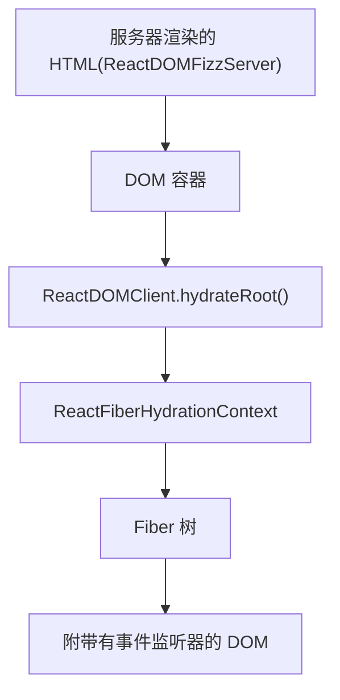
**Hydration 流程**

来源：[packages/react-dom-bindings/src/client/ReactFiberConfigDOM.js1-1500](https://github.com/facebook/react/blob/65eec428/packages/react-dom-bindings/src/client/ReactFiberConfigDOM.js#L1-L1500) [packages/react-reconciler/src/ReactFiberHydrationContext.js1-100](https://github.com/facebook/react/blob/65eec428/packages/react-reconciler/src/ReactFiberHydrationContext.js#L1-L100)

## Hydration 上下文状态

React 在 `ReactFiberHydrationContext` 中维护 Hydration 状态，跟踪 DOM 树中的当前位置以及 Hydration 是否正在进行。

| 状态变量 |
| --- |
| `hydrationParentFiber` |
| `nextHydratableInstance` |
| `isHydrating` |
| `didSuspendOrErrorDEV` |
| `hydrationDiffRootDEV` |
| `hydrationErrors` |

| 类型 |
| --- |
| 
Fiber | null 
|
| 
HydratableInstance | null 
|
| `boolean` |
| `boolean` |
| 
HydrationDiffNode | null 
|
| 
Array | null 
|

| 目的 |
| --- |
| 当前正在进行 Hydration 的父级 Fiber |
| 下一个可进行 Hydration 的实例 |
| 当前是否正在进行 Hydration |
| 在错误后抑制警告（仅限开发环境） |
| Hydration 差异根节点（仅限开发环境） |
| Hydration 错误数组 |

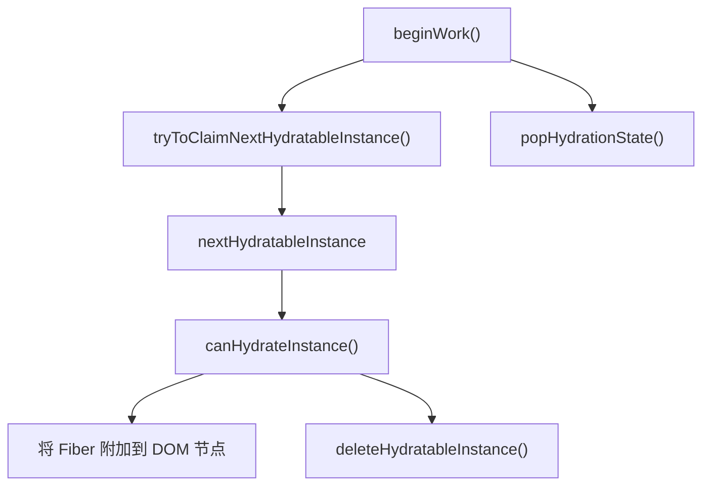
**Hydration 状态管理**

来源：[packages/react-reconciler/src/ReactFiberHydrationContext.js78-95](https://github.com/facebook/react/blob/65eec428/packages/react-reconciler/src/ReactFiberHydrationContext.js#L78-L95) [packages/react-reconciler/src/ReactFiberHydrationContext.js135-200](https://github.com/facebook/react/blob/65eec428/packages/react-reconciler/src/ReactFiberHydrationContext.js#L135-L200)

## Hydration 过程

在 Hydration 期间，React 并行遍历 Fiber 树和 DOM 树，尝试将每个 Fiber 与现有的 DOM 节点匹配。

### 宿主组件（Host Component）Hydration

对于宿主组件（DOM 元素），React 会验证标签名和 props，并将现有的 DOM 节点附加到 Fiber 上。

> **[Mermaid 序列图]**
> *(图表结构无法解析)*

**宿主组件 Hydration 序列**

来源：[packages/react-reconciler/src/ReactFiberHydrationContext.js400-500](https://github.com/facebook/react/blob/65eec428/packages/react-reconciler/src/ReactFiberHydrationContext.js#L400-L500) [packages/react-dom-bindings/src/client/ReactFiberConfigDOM.js1200-1350](https://github.com/facebook/react/blob/65eec428/packages/react-dom-bindings/src/client/ReactFiberConfigDOM.js#L1200-L1350)

### 文本节点（Text Node）Hydration

文本节点会直接进行比较。如果文本内容不同，React 会记录一个警告，但仍使用现有的节点。

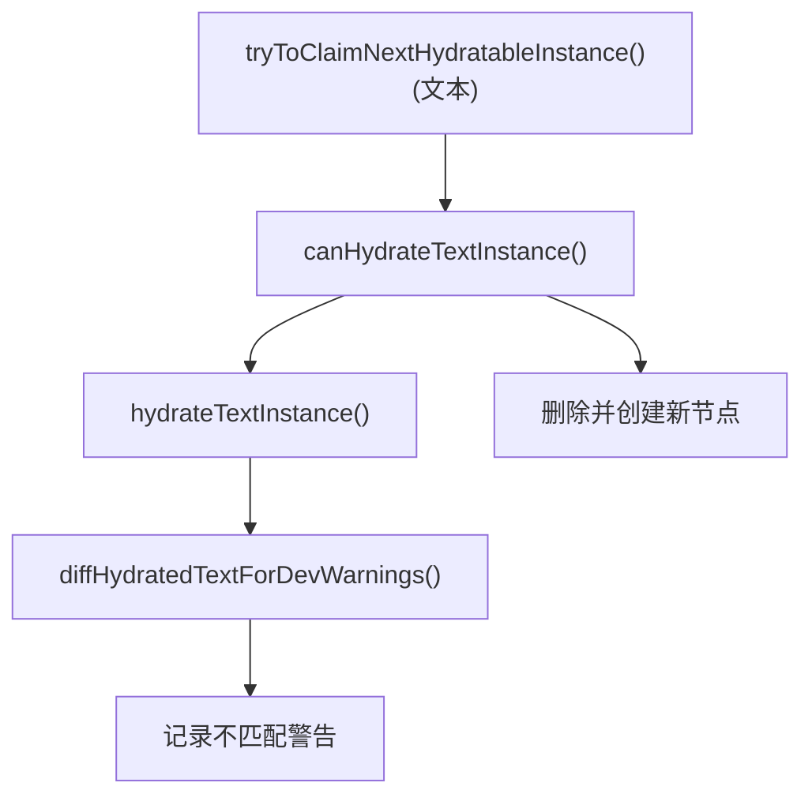
**文本节点 Hydration**

来源：[packages/react-reconciler/src/ReactFiberHydrationContext.js500-550](https://github.com/facebook/react/blob/65eec428/packages/react-reconciler/src/ReactFiberHydrationContext.js#L500-L550) [packages/react-dom-bindings/src/client/ReactFiberConfigDOM.js1350-1400](https://github.com/facebook/react/blob/65eec428/packages/react-dom-bindings/src/client/ReactFiberConfigDOM.js#L1350-L1400)

## 不匹配检测与恢复

当 React 检测到服务器渲染的 HTML 与客户端渲染之间存在不匹配（Mismatch）时，它会尝试通过删除不匹配的服务器节点并创建正确的客户端节点来进行恢复。

### 不匹配类型

| 不匹配类型 |
| --- |
| 标签名不匹配 |
| 文本不匹配 |
| 缺少子节点 |
| 多余的 DOM 节点 |
| 属性不匹配 |

| 检测方法 |
| --- |
| `canHydrateInstance()` 返回 false |
| `diffHydratedText()` 比较字符串 |
| Fiber 子节点没有对应的 DOM 节点 |
| DOM 节点没有对应的 Fiber |
| `diffHydratedProperties()` |

| 恢复策略 |
| --- |
| 删除服务器节点，插入客户端节点 |
| 使用服务器文本，记录警告 |
| 插入客户端渲染的子节点 |
| 删除多余节点 |
| 应用客户端 props，记录警告 |

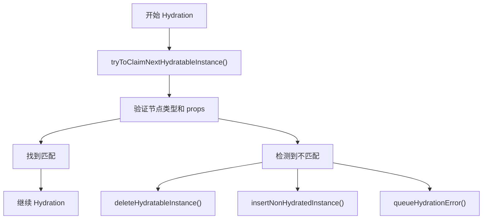
**不匹配恢复流程**

来源：[packages/react-reconciler/src/ReactFiberHydrationContext.js300-400](https://github.com/facebook/react/blob/65eec428/packages/react-reconciler/src/ReactFiberHydrationContext.js#L300-L400) [packages/react-dom-bindings/src/client/ReactFiberConfigDOM.js1400-1500](https://github.com/facebook/react/blob/65eec428/packages/react-dom-bindings/src/client/ReactFiberConfigDOM.js#L1400-L1500)

### Hydration 差异跟踪（仅限开发环境）

在开发环境下，React 会构建一个 Hydration 差异树，以提供带有组件堆栈（component stacks）的详细错误消息。

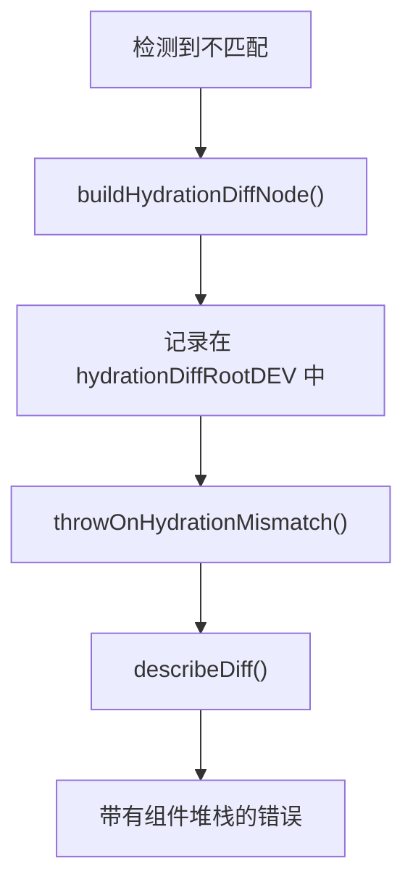
**Hydration 差异报告**

来源：[packages/react-reconciler/src/ReactFiberHydrationContext.js96-135](https://github.com/facebook/react/blob/65eec428/packages/react-reconciler/src/ReactFiberHydrationContext.js#L96-L135) [packages/react-reconciler/src/ReactFiberHydrationDiffs.js1-200](https://github.com/facebook/react/blob/65eec428/packages/react-reconciler/src/ReactFiberHydrationDiffs.js#L1-L200)

## 脱水的（Dehydrated）Suspense 边界

当 React Fizz 服务器渲染一个挂起的 Suspense 边界时，它会发出特殊的 HTML 注释标记来指示脱水内容。这些标记允许客户端跳过 Hydration 后备内容（fallback）并等待真实内容。

### Suspense 边界标记

React 使用特定的注释节点数据在 SSR 输出中标记 Suspense 边界：

| 标记 |
| --- |
| 挂起开始 |
| 后备内容开始 |
| 完成开始 |
| 结束 |

| 数据属性 |
| --- |
| `$?` |
| `$!` |
| `$` |
| `/$` |

| 目的 |
| --- |
| 尚未解析的 Suspense |
| 显示后备内容的 Suspense |
| 已完成的 Suspense |
| Suspense 边界结束 |

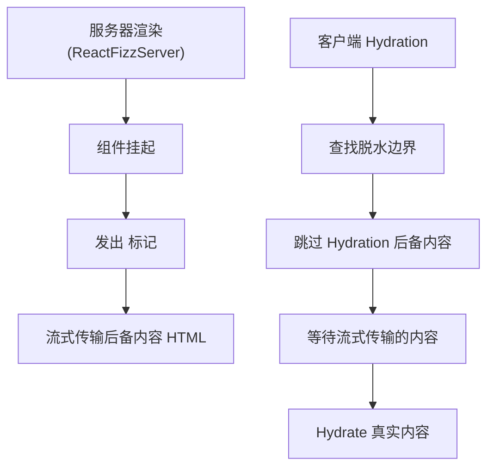
**脱水的 Suspense 边界流程**

来源：[packages/react-server/src/ReactFizzServer.js262-274](https://github.com/facebook/react/blob/65eec428/packages/react-server/src/ReactFizzServer.js#L262-L274) [packages/react-dom-bindings/src/client/ReactFiberConfigDOM.js262-274](https://github.com/facebook/react/blob/65eec428/packages/react-dom-bindings/src/client/ReactFiberConfigDOM.js#L262-L274)

### Suspense 实例识别

客户端通过检查注释节点的数据属性来识别脱水的 Suspense 边界。

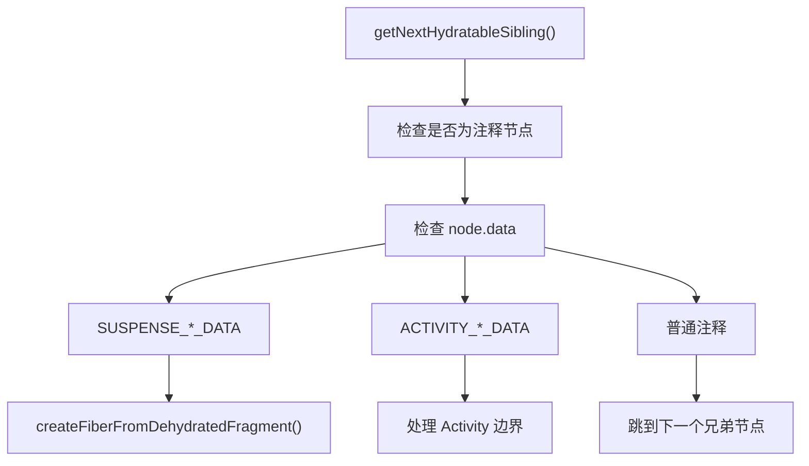
**Suspense 实例识别**

来源：[packages/react-dom-bindings/src/client/ReactFiberConfigDOM.js1120-1180](https://github.com/facebook/react/blob/65eec428/packages/react-dom-bindings/src/client/ReactFiberConfigDOM.js#L1120-L1180) [packages/react-reconciler/src/ReactFiberHydrationContext.js550-650](https://github.com/facebook/react/blob/65eec428/packages/react-reconciler/src/ReactFiberHydrationContext.js#L550-L650)

### 对脱水边界进行 Hydration

当 React 遇到一个脱水的 Suspense 边界时，它会创建一个 `DehydratedFragment` fiber 并跳过初始内容，等待服务器流完成。

> **[Mermaid 序列图]**
> *(图表结构无法解析)*

**脱水 Fragment Hydration**

来源：[packages/react-reconciler/src/ReactFiber.js800-850](https://github.com/facebook/react/blob/65eec428/packages/react-reconciler/src/ReactFiber.js#L800-L850) [packages/react-reconciler/src/ReactFiberHydrationContext.js700-800](https://github.com/facebook/react/blob/65eec428/packages/react-reconciler/src/ReactFiberHydrationContext.js#L700-L800)

## 选择性 Hydration (Selective Hydration)

选择性 Hydration 允许 React 根据用户交互优先对 Suspense 边界进行 Hydration，从而提高感知性能。

### 基于优先级的 Hydration

当用户与脱水边界交互时，React 会立即以更高的优先级为该边界调度 Hydration。

| 交互类型 |
| --- |
| 点击、聚焦、提交 |
| 悬停、滚动 |
| 无交互 |

| 优先级 |
| --- |
| 离散 (Discrete) |
| 连续 (Continuous) |
| 默认 |

| 调度方式 |
| --- |
| 同步 Hydration |
| 高优先级 |
| 普通优先级 |

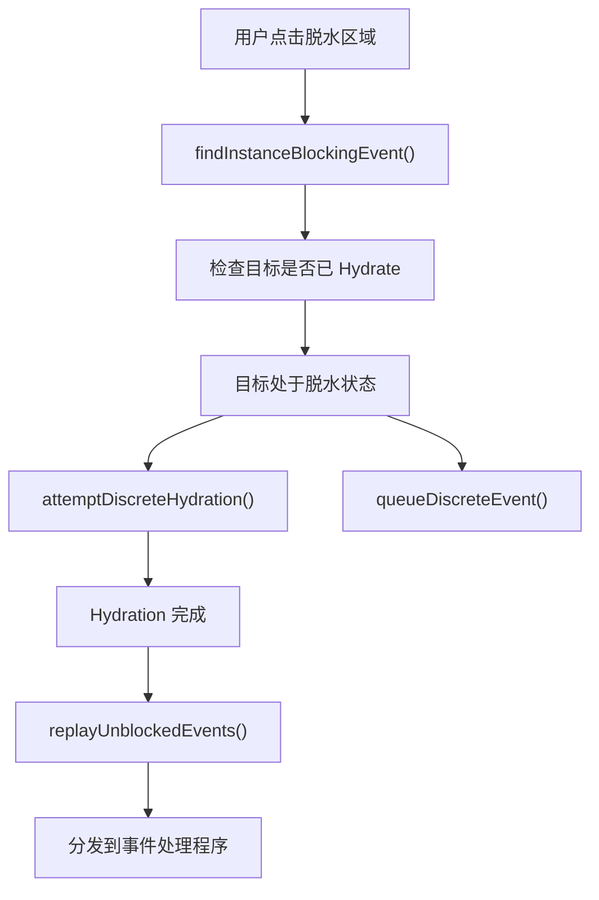
**带有事件重放的选择性 Hydration**

来源：[packages/react-dom-bindings/src/events/ReactDOMEventReplaying.js1-300](https://github.com/facebook/react/blob/65eec428/packages/react-dom-bindings/src/events/ReactDOMEventReplaying.js#L1-L300) [packages/react-dom/src/__tests__/ReactDOMServerPartialHydration-test.internal.js146-200](https://github.com/facebook/react/blob/65eec428/packages/react-dom/src/__tests__/ReactDOMServerPartialHydration-test.internal.js#L146-L200)

### 事件排队与重放 (Replay)

针对脱水内容的事件会被排队，直到 Hydration 完成，然后进行重放，以确保它们得到正确处理。

> **[Mermaid 序列图]**
> *(图表结构无法解析)*

**事件重放流程**

来源：[packages/react-dom-bindings/src/events/ReactDOMEventReplaying.js150-250](https://github.com/facebook/react/blob/65eec428/packages/react-dom-bindings/src/events/ReactDOMEventReplaying.js#L150-L250) [packages/react-dom/src/__tests__/ReactDOMServerPartialHydration-test.internal.js728-850](https://github.com/facebook/react/blob/65eec428/packages/react-dom/src/__tests__/ReactDOMServerPartialHydration-test.internal.js#L728-L850)

### 多个边界的优先级划分

当有多个 Suspense 边界处于脱水状态时，React 会优先处理用户首先交互的那个边界，推迟其他边界。

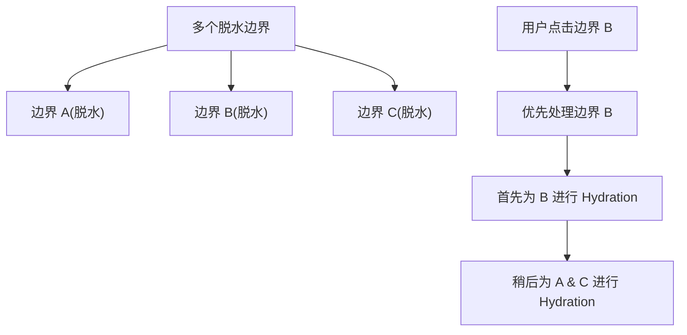
**多边界优先级划分**

来源：[packages/react-dom/src/__tests__/ReactDOMServerPartialHydration-test.internal.js300-400](https://github.com/facebook/react/blob/65eec428/packages/react-dom/src/__tests__/ReactDOMServerPartialHydration-test.internal.js#L300-L400)

## 错误处理与恢复

React 的 Hydration 系统包含了全面的错误处理，以从不匹配中恢复并提供有用的诊断信息。

### 可恢复错误

Hydration 不匹配被视为可恢复错误。React 会通过 `onRecoverableError` 回调记录错误，但会继续渲染。

| 错误类型 |
| --- |
| 标签不匹配 |
| 文本不匹配 |
| 属性缺失 |
| 多余的 DOM 节点 |

| 恢复策略 |
| --- |
| 客户端渲染子树 |
| 使用服务器文本 |
| 应用客户端属性 |
| 删除多余节点 |

| 对用户的影响 |
| --- |
| 替换期间的闪烁 |
| 仅限开发环境警告 |
| 属性更新 |
| 从 DOM 中移除 |

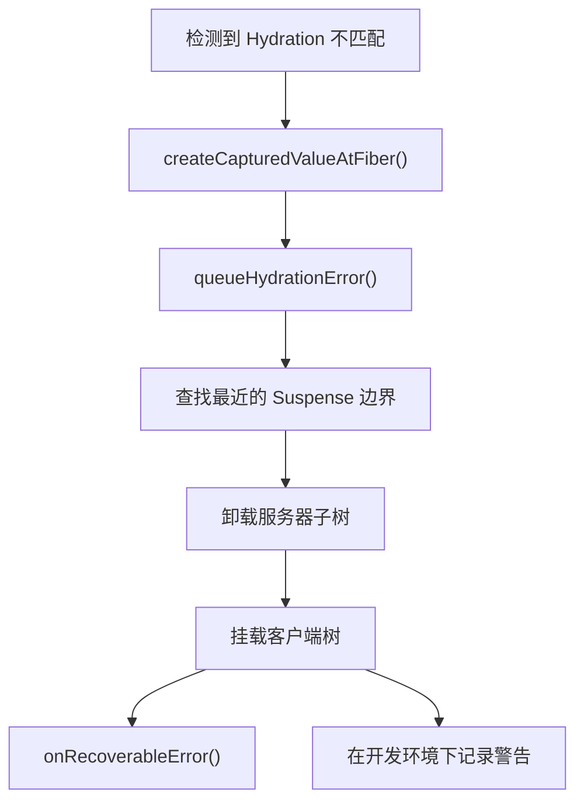
**错误恢复过程**

来源：[packages/react-reconciler/src/ReactFiberHydrationContext.js850-950](https://github.com/facebook/react/blob/65eec428/packages/react-reconciler/src/ReactFiberHydrationContext.js#L850-L950) [packages/react-reconciler/src/ReactCapturedValue.js1-50](https://github.com/facebook/react/blob/65eec428/packages/react-reconciler/src/ReactCapturedValue.js#L1-L50)

### HydrationMismatchException

在开发环境下，React 会抛出带有详细组件堆栈和差异信息的 `HydrationMismatchException`。

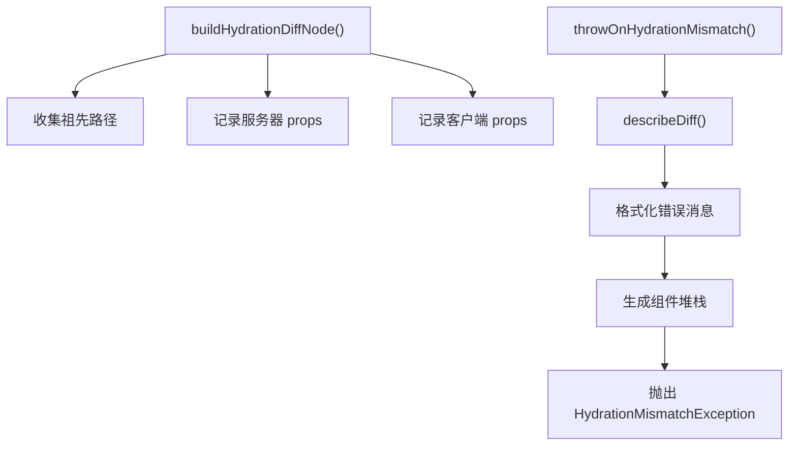
**HydrationMismatchException 生成**

来源：[packages/react-reconciler/src/ReactFiberHydrationContext.js950-1050](https://github.com/facebook/react/blob/65eec428/packages/react-reconciler/src/ReactFiberHydrationContext.js#L950-L1050) [packages/react-reconciler/src/ReactFiberHydrationDiffs.js50-150](https://github.com/facebook/react/blob/65eec428/packages/react-reconciler/src/ReactFiberHydrationDiffs.js#L50-L150)

## 集成点

DOM 事件系统和选择性 Hydration 协同工作，在服务器渲染的应用程序中提供无缝的交互性：

1.  **事件检测**：事件系统识别应触发 Hydration 的用户交互。
2.  **优先级分配**：不同的事件类型接收不同的 Hydration 优先级。
3.  **边界定位**：事件针对特定的 Suspense 边界进行 Hydration。
4.  **事件排队**：原始事件在 Hydration 期间排队。
5.  **重放执行**：事件在 Hydration 完成后进行重放。

这种集成确保了服务器渲染的应用程序在通过战略性 Hydration 优化初始加载性能的同时，仍能感受到响应性。

来源：[packages/react-dom/src/__tests__/ReactDOMServerSelectiveHydration-test.internal.js1-2200](https://github.com/facebook/react/blob/65eec428/packages/react-dom/src/__tests__/ReactDOMServerSelectiveHydration-test.internal.js#L1-L2200) [packages/react-dom/src/events/__tests__/DOMPluginEventSystem-test.internal.js1-2000](https://github.com/facebook/react/blob/65eec428/packages/react-dom/src/events/__tests__/DOMPluginEventSystem-test.internal.js#L1-L2000)

```