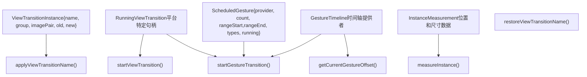
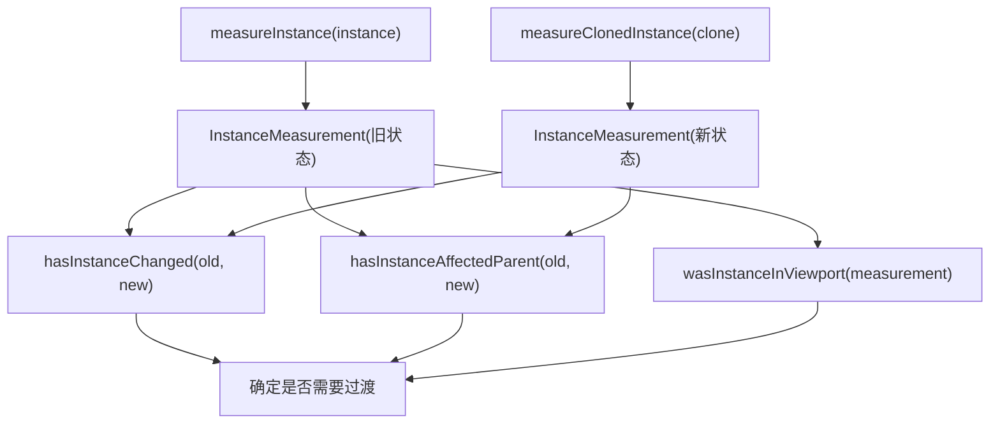
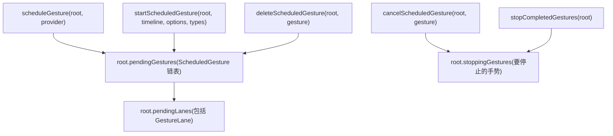
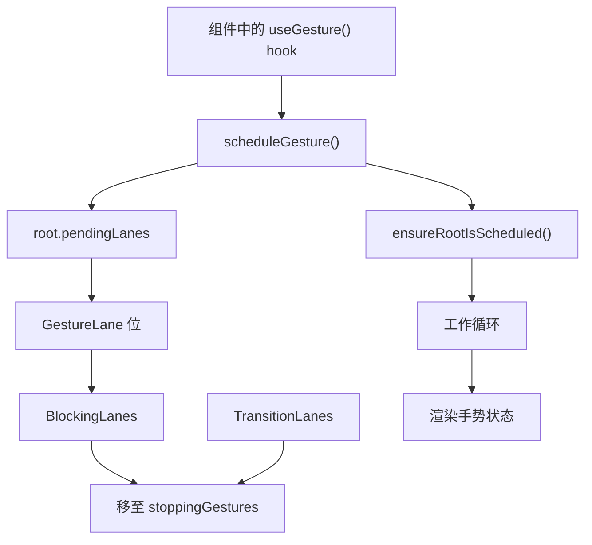

# 视图过渡与手势调度

相关源文件

-   [packages/react-art/src/ReactFiberConfigART.js](https://github.com/facebook/react/blob/65eec428/packages/react-art/src/ReactFiberConfigART.js)
-   [packages/react-dom-bindings/src/client/ReactFiberConfigDOM.js](https://github.com/facebook/react/blob/65eec428/packages/react-dom-bindings/src/client/ReactFiberConfigDOM.js)
-   [packages/react-native-renderer/src/ReactFiberConfigFabric.js](https://github.com/facebook/react/blob/65eec428/packages/react-native-renderer/src/ReactFiberConfigFabric.js)
-   [packages/react-native-renderer/src/ReactFiberConfigNative.js](https://github.com/facebook/react/blob/65eec428/packages/react-native-renderer/src/ReactFiberConfigNative.js)
-   [packages/react-noop-renderer/src/createReactNoop.js](https://github.com/facebook/react/blob/65eec428/packages/react-noop-renderer/src/createReactNoop.js)
-   [packages/react-reconciler/src/ReactFiberConfigWithNoMutation.js](https://github.com/facebook/react/blob/65eec428/packages/react-reconciler/src/ReactFiberConfigWithNoMutation.js)
-   [packages/react-reconciler/src/ReactFiberGestureScheduler.js](https://github.com/facebook/react/blob/65eec428/packages/react-reconciler/src/ReactFiberGestureScheduler.js)
-   [packages/react-reconciler/src/\_\_tests\_\_/ReactFiberHostContext-test.internal.js](https://github.com/facebook/react/blob/65eec428/packages/react-reconciler/src/__tests__/ReactFiberHostContext-test.internal.js)
-   [packages/react-reconciler/src/forks/ReactFiberConfig.custom.js](https://github.com/facebook/react/blob/65eec428/packages/react-reconciler/src/forks/ReactFiberConfig.custom.js)
-   [packages/react-test-renderer/src/ReactFiberConfigTestHost.js](https://github.com/facebook/react/blob/65eec428/packages/react-test-renderer/src/ReactFiberConfigTestHost.js)

## 目的与范围

本文档描述了 React 的视图过渡（View Transition）和手势调度（Gesture Scheduling）系统，它们负责协调平滑动画、手势驱动的更新与 React 渲染生命周期的同步。视图过渡系统与浏览器的 View Transition API 集成，以在 UI 状态之间实现动画效果；而手势调度系统通过在手势时间轴的特定点调度渲染，来管理手势驱动的动画（例如滚动链接动画或基于拖动的动画）。

有关一般协调器架构和提交阶段的信息，请参阅 [React Reconciler](/facebook/react/4-react-reconciler)。有关基于 Lane 的调度和优先级的信息，请参阅 [Lane-Based Scheduling and Priorities](/facebook/react/4.4-lane-based-scheduling-and-priorities)。

---

## 概述

React 的视图过渡和手势调度系统提供了宿主配置（Host Configuration）API，允许渲染器执行以下操作：

1.  **协调视图过渡**：应用 `view-transition-name` CSS 属性，测量 DOM 更改，并管理浏览器视图过渡的生命周期。
2.  **调度手势驱动的渲染**：对手势进行排队，跟踪它们在时间轴上的进度，并在特定的动画偏移处进行渲染。
3.  **检测视觉变化**：测量实例的尺寸和位置，以确定更新期间发生了哪些变化。
4.  **管理过渡生命周期**：配合 React 的提交阶段开始、停止和取消过渡。

这些系统主要针对 DOM 渲染器实现，在 React Native 和测试渲染器中提供存根（stub）实现。

来源：[packages/react-dom-bindings/src/client/ReactFiberConfigDOM.js](https://github.com/facebook/react/blob/65eec428/packages/react-dom-bindings/src/client/ReactFiberConfigDOM.js) [packages/react-reconciler/src/ReactFiberGestureScheduler.js](https://github.com/facebook/react/blob/65eec428/packages/react-reconciler/src/ReactFiberGestureScheduler.js)

---

## 宿主配置接口

### 核心类型与数据结构


**ViewTransitionInstance 结构**

`ViewTransitionInstance` 代表一个带有可动画伪元素的视图过渡元素：

| 字段 | 类型 | 描述 |
| --- | --- | --- |
| `name` | `string` | 标识该元素的 view-transition-name |
| `group` | `mixin$Animatable` | ::view-transition-group 伪元素 |
| `imagePair` | `mixin$Animatable` | ::view-transition-image-pair 伪元素 |
| `old` | `mixin$Animatable` | ::view-transition-old 伪元素 |
| `new` | `mixin$Animatable` | ::view-transition-new 伪元素 |

**ScheduledGesture 结构**

手势以每个 Fiber 根节点的链表形式排队和跟踪：

| 字段 | 类型 | 描述 |
| --- | --- | --- |
| `provider` | `GestureTimeline` | 时间轴提供者（例如滚动时间轴） |
| `count` | `number` | 该提供者的活动启动计数 |
| `rangeStart` | `number` | 当前状态的开始百分比 (0-100) |
| `rangeEnd` | `number` | 目标状态的结束百分比 (0-100) |
| `types` | `null | TransitionTypes` | 过渡类型注解 |
| `running` | `null | RunningViewTransition` | 活动的过渡句柄 |
| `prev` | `null | ScheduledGesture` | 队列中的前一个手势 |
| `next` | `null | ScheduledGesture` | 队列中的后一个手势 |

来源：[packages/react-dom-bindings/src/client/ReactFiberConfigDOM.js252-258](https://github.com/facebook/react/blob/65eec428/packages/react-dom-bindings/src/client/ReactFiberConfigDOM.js#L252-L258) [packages/react-reconciler/src/ReactFiberGestureScheduler.js24-33](https://github.com/facebook/react/blob/65eec428/packages/react-reconciler/src/ReactFiberGestureScheduler.js#L24-L33)

---

## 视图过渡生命周期

### 应用与管理视图过渡名称

> **[Mermaid 序列图]**
> *(图表结构无法解析)*

**关键方法：**

-   **`applyViewTransitionName(instance, name, className)`**：在 DOM 元素上设置 `view-transition-name` 和可选的 `view-transition-class` CSS 属性。
-   **`restoreViewTransitionName(instance, props)`**：在过渡后从 props 中恢复 view-transition-name。
-   **`cancelViewTransitionName(instance, name, props)`**：从元素中移除 view-transition-name。
-   **`cancelRootViewTransitionName(rootContainer)`**：取消根容器上的视图过渡名称。
-   **`restoreRootViewTransitionName(rootContainer)`**：恢复根容器的视图过渡名称。

来源：[packages/react-dom-bindings/src/client/ReactFiberConfigDOM.js](https://github.com/facebook/react/blob/65eec428/packages/react-dom-bindings/src/client/ReactFiberConfigDOM.js) [packages/react-noop-renderer/src/createReactNoop.js799-826](https://github.com/facebook/react/blob/65eec428/packages/react-noop-renderer/src/createReactNoop.js#L799-L826)

### 开始与停止视图过渡

`startViewTransition` 方法将视图过渡与 React 的提交阶段协调一致：

```
startViewTransition(
  rootContainer: Container,
  transitionTypes: null | TransitionTypes,
  mutationCallback: () => void,
  layoutCallback: () => void,
  afterMutationCallback: () => void,
  spawnedWorkCallback: () => void,
  passiveCallback: () => mixed,
  errorCallback: mixed => void,
  blockedCallback: string => void,
  finishedAnimation: () => void
): null | RunningViewTransition
```
**回调执行顺序：**

1.  **`mutationCallback()`**：在变动（mutation）阶段调用以应用 DOM 更改。
2.  **`layoutCallback()`**：在变动后的布局阶段调用。
3.  **`afterMutationCallback()`**：变动完成后调用（可能会跳过）。
4.  **`spawnedWorkCallback()`**：当生成的工作（spawned work）需要调度时调用。
5.  **`passiveCallback()`**：在被动（passive）副作用阶段调用（可能会跳过）。
6.  **`finishedAnimation()`**：动画完成时调用（仅用于分析）。

该方法返回一个 `RunningViewTransition` 句柄，可以传递给 `stopViewTransition(transition)` 以提前取消过渡。

来源：[packages/react-noop-renderer/src/createReactNoop.js854-872](https://github.com/facebook/react/blob/65eec428/packages/react-noop-renderer/src/createReactNoop.js#L854-L872) [packages/react-native-renderer/src/ReactFiberConfigNative.js668-690](https://github.com/facebook/react/blob/65eec428/packages/react-native-renderer/src/ReactFiberConfigNative.js#L668-L690)

---

## 测量系统

### 实例测量与变化检测

React 测量实例的位置和尺寸，以确定过渡期间发生了哪些变化：


**测量 API 方法：**

| 方法 | 目的 |
| --- | --- |
| `measureInstance(instance)` | 在更改前捕获实例的位置和尺寸 |
| `measureClonedInstance(instance)` | 测量克隆的实例（用于过渡快照） |
| `wasInstanceInViewport(measurement)` | 如果测量的实例在视口中，则返回 `true` |
| `hasInstanceChanged(oldMeasurement, newMeasurement)` | 如果测量值之间的位置/尺寸发生变化，则返回 `true` |
| `hasInstanceAffectedParent(oldMeasurement, newMeasurement)` | 如果变化影响了父级布局，则返回 `true` |

**根容器克隆：**

对于视图过渡，React 可能需要克隆根容器：

-   **`cloneRootViewTransitionContainer(rootContainer)`**：创建根容器的快照克隆。
-   **`removeRootViewTransitionClone(rootContainer, clone)`**：移除克隆的快照。

来源：[packages/react-noop-renderer/src/createReactNoop.js828-852](https://github.com/facebook/react/blob/65eec428/packages/react-noop-renderer/src/createReactNoop.js#L828-L852) [packages/react-native-renderer/src/ReactFiberConfigNative.js639-666](https://github.com/facebook/react/blob/65eec428/packages/react-native-renderer/src/ReactFiberConfigNative.js#L639-L666)

---

## 手势调度系统

### 手势队列与生命周期


### 调度手势

**`scheduleGesture(root, provider)`**：将手势添加到待处理队列或返回现有手势：

1.  在 `root.pendingGestures` 链表中搜索匹配的 `provider`。
2.  如果找到，返回现有的 `ScheduledGesture`。
3.  如果未找到，创建一个带有初始状态的新 `ScheduledGesture`。
4.  追加到链表。
5.  调用 `ensureRootIsScheduled(root)` 以调度渲染工作。

**`startScheduledGesture(root, gestureTimeline, gestureOptions, transitionTypes)`**：激活手势：

1.  从 `gestureOptions.rangeStart` 或 `getCurrentGestureOffset(gestureTimeline)` 计算 `rangeStart`。
2.  从 `gestureOptions.rangeEnd` 或启发式（从 0 翻转到 100，或反之）计算 `rangeEnd`。
3.  在 `root.pendingGestures` 中查找匹配的手势。
4.  增加 `gesture.count`。
5.  更新 `gesture.rangeStart`、`gesture.rangeEnd` 和 `gesture.types`。
6.  返回 `ScheduledGesture` 用于跟踪。

> **[Mermaid 序列图]**
> *(图表结构无法解析)*

来源：[packages/react-reconciler/src/ReactFiberGestureScheduler.js35-117](https://github.com/facebook/react/blob/65eec428/packages/react-reconciler/src/ReactFiberGestureScheduler.js#L35-L117)

### 取消与停止手势

**`cancelScheduledGesture(root, gesture)`**：减少手势的引用计数并处理清理工作：

1.  减少 `gesture.count`。
2.  如果 `count === 0`：
    -   从 `pendingGestures` 队列中删除手势。
    -   如果存在 `gesture.running`（活动视图过渡）：
        -   如果有待处理的阻塞/过渡 Lane，则将手势移至 `root.stoppingGestures` 以推迟停止。
        -   否则，立即调用 `stopViewTransition(gesture.running)`。

**`deleteScheduledGesture(root, gesture)`**：从链表中移除手势：

1.  更新链表指针（`prev.next`, `next.prev`）。
2.  如果移除的是头节点，更新 `root.pendingGestures`。
3.  如果队列变空，从 `root.pendingLanes` 中清除 `GestureLane`。

**`stopCompletedGestures(root)`**：提交后调用以停止推迟的手势：

1.  遍历 `root.stoppingGestures` 链表。
2.  为每个手势调用 `stopViewTransition(gesture.running)`。
3.  清空列表。

来源：[packages/react-reconciler/src/ReactFiberGestureScheduler.js119-198](https://github.com/facebook/react/blob/65eec428/packages/react-reconciler/src/ReactFiberGestureScheduler.js#L119-L198)

---

## 手势时间轴集成

### 开始手势过渡

`startGestureTransition` 方法启动一个手势驱动的视图过渡：

```
startGestureTransition(
  rootContainer: Container,
  timeline: GestureTimeline,
  rangeStart: number,
  rangeEnd: number,
  transitionTypes: null | TransitionTypes,
  mutationCallback: () => void,
  animateCallback: () => void,
  errorCallback: mixed => void,
  finishedAnimation: () => void
): null | RunningViewTransition
```
**执行流程：**

1.  调用 `mutationCallback()` 以应用 DOM 变动。
2.  调用 `animateCallback()` 以沿时间轴设置动画。
3.  可选调用 `finishedAnimation()` 进行分析。
4.  返回句柄以取消手势过渡。

**`getCurrentGestureOffset(provider)`**：查询沿手势时间轴的当前位置（0-100 百分比）。

来源：[packages/react-noop-renderer/src/createReactNoop.js874-897](https://github.com/facebook/react/blob/65eec428/packages/react-noop-renderer/src/createReactNoop.js#L874-L897) [packages/react-native-renderer/src/ReactFiberConfigNative.js694-730](https://github.com/facebook/react/blob/65eec428/packages/react-native-renderer/src/ReactFiberConfigNative.js#L694-L730)

---

## 平台特定实现

### DOM 渲染器实现

DOM 渲染器通过浏览器的 View Transition API 提供完整的视图过渡支持：

-   **视图过渡名称**：通过 `element.style.viewTransitionName` CSS 属性应用。
-   **视图过渡类**：通过 `element.style.viewTransitionClass` 应用以进行分组。
-   **测量**：使用 `getBoundingClientRect()` 和视口交集检查。
-   **原生 API**：包装 `document.startViewTransition()` 以实现平滑过渡。

额外的 DOM 特定功能：

-   **`shouldAttemptEagerTransition()`**：在 popstate 事件期间返回 `true`，以同步渲染过渡。
-   **`trackSchedulerEvent()`**：为事件驱动的调度捕获 `window.event`。
-   **`resolveEventType()`**：返回当前事件类型用于优先级解析。
-   **`resolveEventTimeStamp()`**：返回当前事件的时间戳。

来源：[packages/react-dom-bindings/src/client/ReactFiberConfigDOM.js709-747](https://github.com/facebook/react/blob/65eec428/packages/react-dom-bindings/src/client/ReactFiberConfigDOM.js#L709-L747)

### React Native 实现

React Native 渲染器（Fabric 和 Legacy）提供了存根（stub）实现：

```
// 所有方法均已实现，但大多为无操作
applyViewTransitionName(instance, name, className) {
  // 尚未实现
}

startViewTransition(...callbacks) {
  mutationCallback();
  layoutCallback();
  spawnedWorkCallback();
  finishedAnimation(); // 如果启用了分析
  return null; // 无过渡句柄
}

startGestureTransition(...callbacks) {
  mutationCallback();
  animateCallback();
  finishedAnimation(); // 如果启用了分析
  return null; // 无过渡句柄
}

getCurrentGestureOffset(provider) {
  throw new Error('startGestureTransition 在 React Native 中尚不支持。');
}
```
回调仍会执行以确保 React 的提交阶段正确完成，但不会发生实际动画。

来源：[packages/react-native-renderer/src/ReactFiberConfigNative.js593-730](https://github.com/facebook/react/blob/65eec428/packages/react-native-renderer/src/ReactFiberConfigNative.js#L593-L730) [packages/react-native-renderer/src/ReactFiberConfigFabric.js](https://github.com/facebook/react/blob/65eec428/packages/react-native-renderer/src/ReactFiberConfigFabric.js)

### 测试渲染器实现

测试渲染器（react-test-renderer）提供类似于 React Native 的无操作实现，允许测试在不触发实际动画的情况下执行。noop 渲染器（用于 React 内部测试）具有稍复杂的存根，可跟踪调用以进行测试。

来源：[packages/react-test-renderer/src/ReactFiberConfigTestHost.js335-511](https://github.com/facebook/react/blob/65eec428/packages/react-test-renderer/src/ReactFiberConfigTestHost.js#L335-L511) [packages/react-noop-renderer/src/createReactNoop.js799-897](https://github.com/facebook/react/blob/65eec428/packages/react-noop-renderer/src/createReactNoop.js#L799-L897)

---

## 与协调器的集成

### 手势 Lane 调度

手势使用专用 Lane 进行调度：

-   **`GestureLane`**：用于手势驱动渲染的特定 Lane 位。
-   当手势被调度时，`GestureLane` 会被添加到 `root.pendingLanes`。
-   协调器在处理手势更新时在 `GestureLane` 上进行渲染。
-   当手势队列变空时，从 `pendingLanes` 中清除该 Lane。


来源：[packages/react-reconciler/src/ReactFiberGestureScheduler.js15-19](https://github.com/facebook/react/blob/65eec428/packages/react-reconciler/src/ReactFiberGestureScheduler.js#L15-L19) [packages/react-reconciler/src/ReactFiberGestureScheduler.js134-148](https://github.com/facebook/react/blob/65eec428/packages/react-reconciler/src/ReactFiberGestureScheduler.js#L134-L148)

### 提交阶段集成

视图过渡与 React 的提交阶段协调：

1.  **变动前**：测量实例状态，准备过渡。
2.  **变动（Mutation）**：应用 DOM 更改（mutationCallback）。
3.  **布局（Layout）**：执行布局副作用（layoutCallback）。
4.  **变动后**：协调生成的工作（afterMutationCallback, spawnedWorkCallback）。
5.  **被动（Passive）**：执行被动副作用（passiveCallback）。
6.  **停止手势**：调用 `stopCompletedGestures(root)` 以进行清理。

手势调度器确保在提交后，如果过渡已完成但因待处理工作而推迟停止，则将其停止。

来源：[packages/react-reconciler/src/ReactFiberGestureScheduler.js185-198](https://github.com/facebook/react/blob/65eec428/packages/react-reconciler/src/ReactFiberGestureScheduler.js#L185-L198)

---

## 总结

React 的视图过渡和手势调度系统提供：

| 组件 | 目的 | 关键类型 | 关键方法 |
| --- | --- | --- | --- |
| **视图过渡** | 浏览器 API 集成 | `ViewTransitionInstance`, `RunningViewTransition` | `startViewTransition`, `applyViewTransitionName`, 测量方法 |
| **手势调度** | 时间轴驱动的动画 | `ScheduledGesture`, `GestureTimeline` | `scheduleGesture`, `startScheduledGesture`, `cancelScheduledGesture` |
| **测量** | 变化检测 | `InstanceMeasurement` | `measureInstance`, `hasInstanceChanged`, `wasInstanceInViewport` |
| **宿主配置** | 平台抽象 | 平台特定句柄 | 按平台实现的所有方法 |

DOM 渲染器提供对这些功能的完整支持，而 React Native 和测试渲染器提供保持 API 兼容性但不产生实际动画的存根实现。

来源：[packages/react-reconciler/src/ReactFiberGestureScheduler.js](https://github.com/facebook/react/blob/65eec428/packages/react-reconciler/src/ReactFiberGestureScheduler.js) [packages/react-dom-bindings/src/client/ReactFiberConfigDOM.js](https://github.com/facebook/react/blob/65eec428/packages/react-dom-bindings/src/client/ReactFiberConfigDOM.js) [packages/react-noop-renderer/src/createReactNoop.js](https://github.com/facebook/react/blob/65eec428/packages/react-noop-renderer/src/createReactNoop.js)
