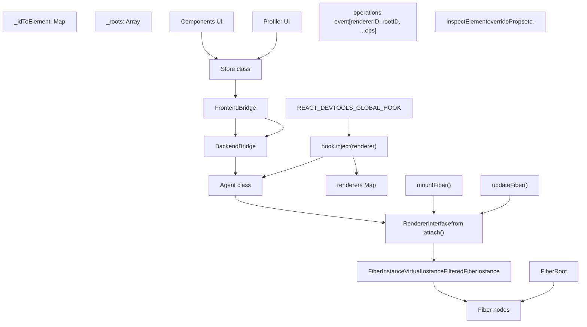
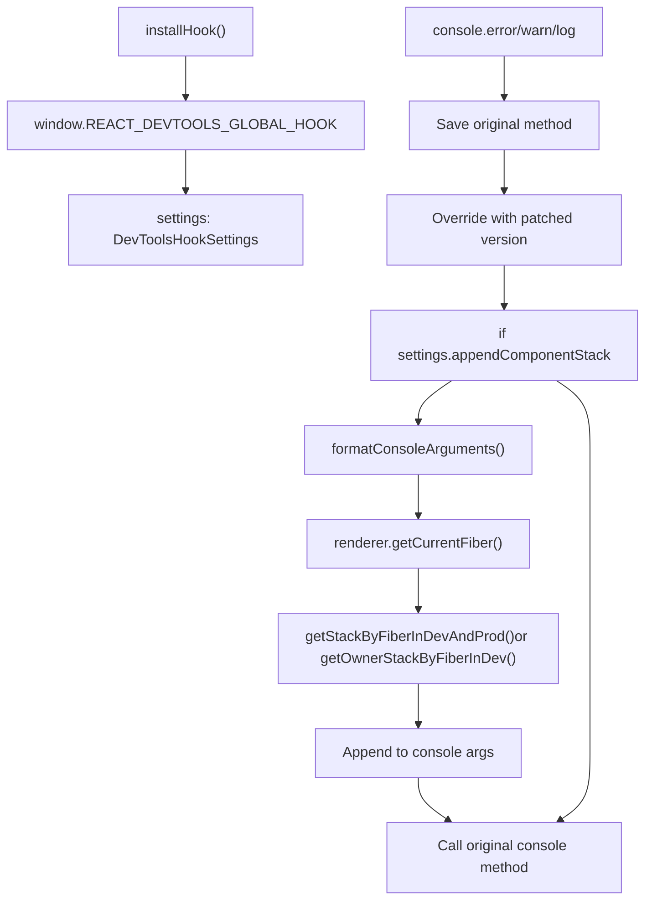
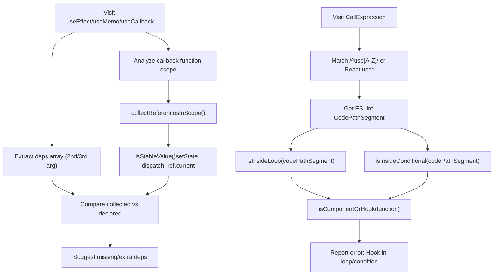
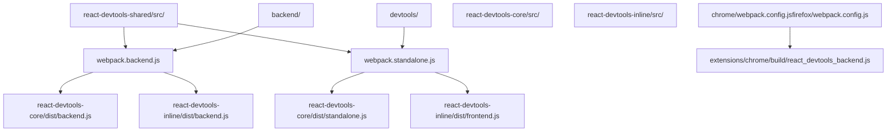

# 开发者工具与调试

相关源文件

-   [CHANGELOG.md](https://github.com/facebook/react/blob/65eec428/CHANGELOG.md)
-   [fixtures/devtools/standalone/index.html](https://github.com/facebook/react/blob/65eec428/fixtures/devtools/standalone/index.html)
-   [packages/eslint-plugin-react-hooks/CHANGELOG.md](https://github.com/facebook/react/blob/65eec428/packages/eslint-plugin-react-hooks/CHANGELOG.md)
-   [packages/eslint-plugin-react-hooks/README.md](https://github.com/facebook/react/blob/65eec428/packages/eslint-plugin-react-hooks/README.md)
-   [packages/eslint-plugin-react-hooks/\_\_tests\_\_/ESLintRuleExhaustiveDeps-test.js](https://github.com/facebook/react/blob/65eec428/packages/eslint-plugin-react-hooks/__tests__/ESLintRuleExhaustiveDeps-test.js)
-   [packages/eslint-plugin-react-hooks/\_\_tests\_\_/ESLintRulesOfHooks-test.js](https://github.com/facebook/react/blob/65eec428/packages/eslint-plugin-react-hooks/__tests__/ESLintRulesOfHooks-test.js)
-   [packages/eslint-plugin-react-hooks/babel.config.js](https://github.com/facebook/react/blob/65eec428/packages/eslint-plugin-react-hooks/babel.config.js)
-   [packages/eslint-plugin-react-hooks/index.js](https://github.com/facebook/react/blob/65eec428/packages/eslint-plugin-react-hooks/index.js)
-   [packages/eslint-plugin-react-hooks/jest.config.js](https://github.com/facebook/react/blob/65eec428/packages/eslint-plugin-react-hooks/jest.config.js)
-   [packages/eslint-plugin-react-hooks/npm/index.js](https://github.com/facebook/react/blob/65eec428/packages/eslint-plugin-react-hooks/npm/index.js)
-   [packages/eslint-plugin-react-hooks/src/rules/ExhaustiveDeps.ts](https://github.com/facebook/react/blob/65eec428/packages/eslint-plugin-react-hooks/src/rules/ExhaustiveDeps.ts)
-   [packages/eslint-plugin-react-hooks/src/rules/RulesOfHooks.ts](https://github.com/facebook/react/blob/65eec428/packages/eslint-plugin-react-hooks/src/rules/RulesOfHooks.ts)
-   [packages/eslint-plugin-react-hooks/src/shared/Utils.ts](https://github.com/facebook/react/blob/65eec428/packages/eslint-plugin-react-hooks/src/shared/Utils.ts)
-   [packages/eslint-plugin-react-hooks/src/types/estree.d.ts](https://github.com/facebook/react/blob/65eec428/packages/eslint-plugin-react-hooks/src/types/estree.d.ts)
-   [packages/eslint-plugin-react-hooks/src/types/global.d.ts](https://github.com/facebook/react/blob/65eec428/packages/eslint-plugin-react-hooks/src/types/global.d.ts)
-   [packages/eslint-plugin-react-hooks/tsconfig.json](https://github.com/facebook/react/blob/65eec428/packages/eslint-plugin-react-hooks/tsconfig.json)
-   [packages/react-devtools-shared/src/\_\_tests\_\_/inspectedElement-test.js](https://github.com/facebook/react/blob/65eec428/packages/react-devtools-shared/src/__tests__/inspectedElement-test.js)
-   [packages/react-devtools-shared/src/\_\_tests\_\_/legacy/inspectElement-test.js](https://github.com/facebook/react/blob/65eec428/packages/react-devtools-shared/src/__tests__/legacy/inspectElement-test.js)
-   [packages/react-devtools-shared/src/\_\_tests\_\_/store-test.js](https://github.com/facebook/react/blob/65eec428/packages/react-devtools-shared/src/__tests__/store-test.js)
-   [packages/react-devtools-shared/src/backend/StyleX/\_\_tests\_\_/utils-test.js](https://github.com/facebook/react/blob/65eec428/packages/react-devtools-shared/src/backend/StyleX/__tests__/utils-test.js)
-   [packages/react-devtools-shared/src/backend/StyleX/utils.js](https://github.com/facebook/react/blob/65eec428/packages/react-devtools-shared/src/backend/StyleX/utils.js)
-   [packages/react-devtools-shared/src/backend/agent.js](https://github.com/facebook/react/blob/65eec428/packages/react-devtools-shared/src/backend/agent.js)
-   [packages/react-devtools-shared/src/backend/fiber/renderer.js](https://github.com/facebook/react/blob/65eec428/packages/react-devtools-shared/src/backend/fiber/renderer.js)
-   [packages/react-devtools-shared/src/backend/legacy/renderer.js](https://github.com/facebook/react/blob/65eec428/packages/react-devtools-shared/src/backend/legacy/renderer.js)
-   [packages/react-devtools-shared/src/backend/types.js](https://github.com/facebook/react/blob/65eec428/packages/react-devtools-shared/src/backend/types.js)
-   [packages/react-devtools-shared/src/backend/views/Highlighter/index.js](https://github.com/facebook/react/blob/65eec428/packages/react-devtools-shared/src/backend/views/Highlighter/index.js)
-   [packages/react-devtools-shared/src/backendAPI.js](https://github.com/facebook/react/blob/65eec428/packages/react-devtools-shared/src/backendAPI.js)
-   [packages/react-devtools-shared/src/bridge.js](https://github.com/facebook/react/blob/65eec428/packages/react-devtools-shared/src/bridge.js)
-   [packages/react-devtools-shared/src/constants.js](https://github.com/facebook/react/blob/65eec428/packages/react-devtools-shared/src/constants.js)
-   [packages/react-devtools-shared/src/devtools/constants.js](https://github.com/facebook/react/blob/65eec428/packages/react-devtools-shared/src/devtools/constants.js)
-   [packages/react-devtools-shared/src/devtools/store.js](https://github.com/facebook/react/blob/65eec428/packages/react-devtools-shared/src/devtools/store.js)
-   [packages/react-devtools-shared/src/devtools/views/ButtonIcon.js](https://github.com/facebook/react/blob/65eec428/packages/react-devtools-shared/src/devtools/views/ButtonIcon.js)
-   [packages/react-devtools-shared/src/devtools/views/Components/InspectedElement.js](https://github.com/facebook/react/blob/65eec428/packages/react-devtools-shared/src/devtools/views/Components/InspectedElement.js)
-   [packages/react-devtools-shared/src/devtools/views/Components/InspectedElementContextTree.js](https://github.com/facebook/react/blob/65eec428/packages/react-devtools-shared/src/devtools/views/Components/InspectedElementContextTree.js)
-   [packages/react-devtools-shared/src/devtools/views/Components/InspectedElementErrorsAndWarningsTree.js](https://github.com/facebook/react/blob/65eec428/packages/react-devtools-shared/src/devtools/views/Components/InspectedElementErrorsAndWarningsTree.js)
-   [packages/react-devtools-shared/src/devtools/views/Components/InspectedElementPropsTree.js](https://github.com/facebook/react/blob/65eec428/packages/react-devtools-shared/src/devtools/views/Components/InspectedElementPropsTree.js)
-   [packages/react-devtools-shared/src/devtools/views/Components/InspectedElementSharedStyles.css](https://github.com/facebook/react/blob/65eec428/packages/react-devtools-shared/src/devtools/views/Components/InspectedElementSharedStyles.css)
-   [packages/react-devtools-shared/src/devtools/views/Components/InspectedElementStateTree.js](https://github.com/facebook/react/blob/65eec428/packages/react-devtools-shared/src/devtools/views/Components/InspectedElementStateTree.js)
-   [packages/react-devtools-shared/src/devtools/views/Components/InspectedElementStyleXPlugin.js](https://github.com/facebook/react/blob/65eec428/packages/react-devtools-shared/src/devtools/views/Components/InspectedElementStyleXPlugin.js)
-   [packages/react-devtools-shared/src/devtools/views/Components/InspectedElementSuspendedBy.js](https://github.com/facebook/react/blob/65eec428/packages/react-devtools-shared/src/devtools/views/Components/InspectedElementSuspendedBy.js)
-   [packages/react-devtools-shared/src/devtools/views/Components/InspectedElementView.css](https://github.com/facebook/react/blob/65eec428/packages/react-devtools-shared/src/devtools/views/Components/InspectedElementView.css)
-   [packages/react-devtools-shared/src/devtools/views/Components/InspectedElementView.js](https://github.com/facebook/react/blob/65eec428/packages/react-devtools-shared/src/devtools/views/Components/InspectedElementView.js)
-   [packages/react-devtools-shared/src/devtools/views/Profiler/CommitTreeBuilder.js](https://github.com/facebook/react/blob/65eec428/packages/react-devtools-shared/src/devtools/views/Profiler/CommitTreeBuilder.js)
-   [packages/react-devtools-shared/src/devtools/views/Settings/SettingsContext.js](https://github.com/facebook/react/blob/65eec428/packages/react-devtools-shared/src/devtools/views/Settings/SettingsContext.js)
-   [packages/react-devtools-shared/src/devtools/views/SuspenseTab/SuspenseBreadcrumbs.js](https://github.com/facebook/react/blob/65eec428/packages/react-devtools-shared/src/devtools/views/SuspenseTab/SuspenseBreadcrumbs.js)
-   [packages/react-devtools-shared/src/devtools/views/SuspenseTab/SuspenseEnvironmentColors.css](https://github.com/facebook/react/blob/65eec428/packages/react-devtools-shared/src/devtools/views/SuspenseTab/SuspenseEnvironmentColors.css)
-   [packages/react-devtools-shared/src/devtools/views/SuspenseTab/SuspenseEnvironmentColors.js](https://github.com/facebook/react/blob/65eec428/packages/react-devtools-shared/src/devtools/views/SuspenseTab/SuspenseEnvironmentColors.js)
-   [packages/react-devtools-shared/src/devtools/views/SuspenseTab/SuspenseRects.css](https://github.com/facebook/react/blob/65eec428/packages/react-devtools-shared/src/devtools/views/SuspenseTab/SuspenseRects.css)
-   [packages/react-devtools-shared/src/devtools/views/SuspenseTab/SuspenseRects.js](https://github.com/facebook/react/blob/65eec428/packages/react-devtools-shared/src/devtools/views/SuspenseTab/SuspenseRects.js)
-   [packages/react-devtools-shared/src/devtools/views/SuspenseTab/SuspenseScrubber.css](https://github.com/facebook/react/blob/65eec428/packages/react-devtools-shared/src/devtools/views/SuspenseTab/SuspenseScrubber.css)
-   [packages/react-devtools-shared/src/devtools/views/SuspenseTab/SuspenseScrubber.js](https://github.com/facebook/react/blob/65eec428/packages/react-devtools-shared/src/devtools/views/SuspenseTab/SuspenseScrubber.js)
-   [packages/react-devtools-shared/src/devtools/views/SuspenseTab/SuspenseTab.css](https://github.com/facebook/react/blob/65eec428/packages/react-devtools-shared/src/devtools/views/SuspenseTab/SuspenseTab.css)
-   [packages/react-devtools-shared/src/devtools/views/SuspenseTab/SuspenseTab.js](https://github.com/facebook/react/blob/65eec428/packages/react-devtools-shared/src/devtools/views/SuspenseTab/SuspenseTab.js)
-   [packages/react-devtools-shared/src/devtools/views/SuspenseTab/SuspenseTimeline.css](https://github.com/facebook/react/blob/65eec428/packages/react-devtools-shared/src/devtools/views/SuspenseTab/SuspenseTimeline.css)
-   [packages/react-devtools-shared/src/devtools/views/SuspenseTab/SuspenseTimeline.js](https://github.com/facebook/react/blob/65eec428/packages/react-devtools-shared/src/devtools/views/SuspenseTab/SuspenseTimeline.js)
-   [packages/react-devtools-shared/src/devtools/views/SuspenseTab/SuspenseTreeContext.js](https://github.com/facebook/react/blob/65eec428/packages/react-devtools-shared/src/devtools/views/SuspenseTab/SuspenseTreeContext.js)
-   [packages/react-devtools-shared/src/devtools/views/Toggle.css](https://github.com/facebook/react/blob/65eec428/packages/react-devtools-shared/src/devtools/views/Toggle.css)
-   [packages/react-devtools-shared/src/devtools/views/hooks.js](https://github.com/facebook/react/blob/65eec428/packages/react-devtools-shared/src/devtools/views/hooks.js)
-   [packages/react-devtools-shared/src/devtools/views/root.css](https://github.com/facebook/react/blob/65eec428/packages/react-devtools-shared/src/devtools/views/root.css)
-   [packages/react-devtools-shared/src/devtools/views/useInferredName.js](https://github.com/facebook/react/blob/65eec428/packages/react-devtools-shared/src/devtools/views/useInferredName.js)
-   [packages/react-devtools-shared/src/devtools/views/utils.js](https://github.com/facebook/react/blob/65eec428/packages/react-devtools-shared/src/devtools/views/utils.js)
-   [packages/react-devtools-shared/src/frontend/types.js](https://github.com/facebook/react/blob/65eec428/packages/react-devtools-shared/src/frontend/types.js)
-   [packages/react-devtools-shared/src/hydration.js](https://github.com/facebook/react/blob/65eec428/packages/react-devtools-shared/src/hydration.js)
-   [packages/react-devtools-shared/src/utils.js](https://github.com/facebook/react/blob/65eec428/packages/react-devtools-shared/src/utils.js)
-   [packages/react-devtools-shell/src/app/InspectableElements/SimpleValues.js](https://github.com/facebook/react/blob/65eec428/packages/react-devtools-shell/src/app/InspectableElements/SimpleValues.js)
-   [packages/react-devtools-shell/src/app/InspectableElements/SymbolKeys.js](https://github.com/facebook/react/blob/65eec428/packages/react-devtools-shell/src/app/InspectableElements/SymbolKeys.js)
-   [packages/react-devtools-shell/src/app/InspectableElements/UnserializableProps.js](https://github.com/facebook/react/blob/65eec428/packages/react-devtools-shell/src/app/InspectableElements/UnserializableProps.js)
-   [packages/shared/ReactIODescription.js](https://github.com/facebook/react/blob/65eec428/packages/shared/ReactIODescription.js)

React 仓库提供了两个主要面向开发者的工具：

1.  **React DevTools**：一个运行时调试界面，可作为浏览器扩展、独立应用程序或内联 UI 使用，用于检查组件树、分析性能和调试状态。
2.  **eslint-plugin-react-hooks**：一个 ESLint 插件，用于静态验证 Hooks 规则和依赖项数组。

此外，仓库还包括控制台修补（console patching）基础设施、组件堆栈生成和浏览器性能面板集成。

## 概览

React 的开发者工具在开发生命周期的不同阶段运行：

| 工具 | 阶段 | 关键实现 |
| --- | --- | --- |
| **eslint-plugin-react-hooks** | 编辑/构建时 | [RulesOfHooks.ts1-800](https://github.com/facebook/react/blob/65eec428/RulesOfHooks.ts#L1-L800) [ExhaustiveDeps.ts](https://github.com/facebook/react/blob/65eec428/ExhaustiveDeps.ts) |
| **React DevTools** | 运行时 | [renderer.js1006-1102](https://github.com/facebook/react/blob/65eec428/renderer.js#L1006-L1102) (`attach()`) + [store.js143-348](https://github.com/facebook/react/blob/65eec428/store.js#L143-L348) (`Store`) |
| **Console Patching** | 运行时 | [hook.js110-267](https://github.com/facebook/react/blob/65eec428/hook.js#L110-L267) via `__REACT_DEVTOOLS_GLOBAL_HOOK__` |
| **Performance Tracks** | 运行时 | [renderer.js1106-1119](https://github.com/facebook/react/blob/65eec428/renderer.js#L1106-L1119) (`injectProfilingHooks`) |

DevTools 后端通过 `__REACT_DEVTOOLS_GLOBAL_HOOK__` 附加到 React 渲染器，这是一个在 React 初始化之前安装的全局对象。当像 ReactDOM 这样的渲染器加载时，它会调用 `hook.inject()` [hook.js58-86](https://github.com/facebook/react/blob/65eec428/hook.js#L58-L86)，这会触发后端的 `attach()` 函数 [renderer.js1006-1102](https://github.com/facebook/react/blob/65eec428/renderer.js#L1006-L1102)。前端通过版本化的桥接协议与后端通信，为了性能，该协议将树操作序列化为紧凑的整数数组。

**来源：**

-   [packages/react-devtools-shared/src/hook.js58-86](https://github.com/facebook/react/blob/65eec428/packages/react-devtools-shared/src/hook.js#L58-L86)
-   [packages/react-devtools-shared/src/backend/fiber/renderer.js1006-1102](https://github.com/facebook/react/blob/65eec428/packages/react-devtools-shared/src/backend/fiber/renderer.js#L1006-L1102)
-   [packages/react-devtools-shared/src/devtools/store.js143-348](https://github.com/facebook/react/blob/65eec428/packages/react-devtools-shared/src/devtools/store.js#L143-L348)
-   [packages/react-devtools-shared/src/bridge.js47-73](https://github.com/facebook/react/blob/65eec428/packages/react-devtools-shared/src/bridge.js#L47-L73)

## React DevTools

React DevTools 通过经由消息桥接连接的前端-后端架构提供 React 应用程序的运行时检查。

### 架构概览

DevTools 后端-前端通信


**关键实现细节：**

| 组件 | 文件路径 | 用途 |
| --- | --- | --- |
| `__REACT_DEVTOOLS_GLOBAL_HOOK__` | [hook.js58-86](https://github.com/facebook/react/blob/65eec428/hook.js#L58-L86) | 在 React 之前安装，提供用于注册的 `inject(renderer)` |
| `attach()` | [renderer.js1006-1102](https://github.com/facebook/react/blob/65eec428/renderer.js#L1006-L1102) | 返回带有 `getFiberIDForNative()`, `findNativeNodesForFiberID()` 的 `RendererInterface` |
| `Store` | [store.js143-348](https://github.com/facebook/react/blob/65eec428/store.js#L143-L348) | 维护 `_idToElement`, `_roots`，处理 `operations` 事件 |
| `Agent` | [agent.js263-1061](https://github.com/facebook/react/blob/65eec428/agent.js#L263-L1061) | 路由 `inspectElement`, `overrideProps`，管理 `_rendererInterfaces` |
| Bridge Protocol | [bridge.js47-73](https://github.com/facebook/react/blob/65eec428/bridge.js#L47-L73) | 协议版本 2，操作码：`TREE_OPERATION_ADD=1`, `TREE_OPERATION_REMOVE=2` |

后端创建包装 Fiber 节点的 `DevToolsInstance` 对象：

-   `FiberInstance` [renderer.js191-218](https://github.com/facebook/react/blob/65eec428/renderer.js#L191-L218) - 包装客户端组件 Fiber 对
-   `VirtualInstance` [renderer.js259-291](https://github.com/facebook/react/blob/65eec428/renderer.js#L259-L291) - 包装服务端组件或优化掉的组件
-   `FilteredFiberInstance` [renderer.js221-252](https://github.com/facebook/react/blob/65eec428/renderer.js#L221-L252) - DevTools 隐藏但为宿主实例映射而跟踪的已过滤 Fiber

这些实例具有由 `getUID()` 生成的稳定 `id` 值，这些值在渲染之间持久存在，使前端能够跟踪组件而不暴露原始 Fiber 引用。

详细的架构覆盖请见页面 \[7.1\]。

**来源：**

-   [packages/react-devtools-shared/src/hook.js58-615](https://github.com/facebook/react/blob/65eec428/packages/react-devtools-shared/src/hook.js#L58-L615)
-   [packages/react-devtools-shared/src/backend/fiber/renderer.js1006-1102](https://github.com/facebook/react/blob/65eec428/packages/react-devtools-shared/src/backend/fiber/renderer.js#L1006-L1102)
-   [packages/react-devtools-shared/src/backend/fiber/renderer.js183-292](https://github.com/facebook/react/blob/65eec428/packages/react-devtools-shared/src/backend/fiber/renderer.js#L183-L292)
-   [packages/react-devtools-shared/src/devtools/store.js143-348](https://github.com/facebook/react/blob/65eec428/packages/react-devtools-shared/src/devtools/store.js#L143-L348)
-   [packages/react-devtools-shared/src/backend/agent.js263-1061](https://github.com/facebook/react/blob/65eec428/packages/react-devtools-shared/src/backend/agent.js#L263-L1061)
-   [packages/react-devtools-shared/src/bridge.js47-73](https://github.com/facebook/react/blob/65eec428/packages/react-devtools-shared/src/bridge.js#L47-L73)

### 核心能力

**组件树检查**

Store 使用多个映射维护组件树：

-   `_idToElement: Map<number, Element>` - 元素元数据（displayName, type, key, 错误/警告计数）
-   `_ownersMap: Map<number, Set<number>>` - 所有者堆栈跟踪的所有权关系
-   `_roots: Array<number>` - 根元素 ID
-   组件过滤器（例如 `ComponentFilterElementType`）默认隐藏宿主组件

来自后端的树突变被编码为带有操作码的操作数组，如 `TREE_OPERATION_ADD` (1), `TREE_OPERATION_REMOVE` (2), `TREE_OPERATION_REORDER_CHILDREN` (3) [constants.js20-27](https://github.com/facebook/react/blob/65eec428/constants.js#L20-L27)

**Props, State 和 Hooks 检查**

后端使用 `react-debug-tools` 中的 `inspectHooksOfFiber()` 来提取 hook 信息 [renderer.js100](https://github.com/facebook/react/blob/65eec428/renderer.js#L100-L100)。Hook 检查返回一个 `HooksTree` 结构，包含 hook 名称、值和子 hook。值通过 `cleanForBridge()` 序列化，该函数处理不可序列化的值（函数、Symbol）和循环引用 [utils.js72-77](https://github.com/facebook/react/blob/65eec428/utils.js#L72-L77)。

可编辑的值通过桥接命令进行修改：

-   `overrideValueAtPath` - 设置 props/state/context 值
-   `overrideHookState` - 修改 hook 值
-   路径是像 `['props', 'user', 'name']` 这样的数组，用于导航嵌套对象

**性能分析 (Performance Profiling)**

后端通过 `injectProfilingHooks()` 注入性能分析 hooks [renderer.js1106-1119](https://github.com/facebook/react/blob/65eec428/renderer.js#L1106-L1119)。分析数据包括：

-   `fiberActualDurations` - 渲染每个 Fiber 花费的时间
-   `fiberSelfDurations` - 排除子组件的时间
-   `effectDuration` / `passiveEffectDuration` - 布局/被动副作用时间
-   提交数据序列化为 `ProfilingDataBackend` 并发送到前端的 `ProfilerStore`

**Suspense 和异步调试**

Suspense 选项卡 (React 19+) 使用以下内容可视化挂起状态：

-   `_idToSuspense: Map<number, SuspenseNode>` - 将 Suspense 边界映射到其挂起数据
-   `SuspenseNode.suspendedBy` - 跟踪 `ReactIOInfo` 对象（promise、数据获取）
-   `SuspenseRects` 组件使用 `_rtree: RBush<Rect>` 进行点击测试，在空间上可视化边界
-   时间轴通过 `SuspenseTimelineStep` 条目显示挂起的进程

**来源：**

-   [packages/react-devtools-shared/src/devtools/store.js143-258](https://github.com/facebook/react/blob/65eec428/packages/react-devtools-shared/src/devtools/store.js#L143-L258)
-   [packages/react-devtools-shared/src/constants.js20-27](https://github.com/facebook/react/blob/65eec428/packages/react-devtools-shared/src/constants.js#L20-L27)
-   [packages/react-devtools-shared/src/backend/fiber/renderer.js100](https://github.com/facebook/react/blob/65eec428/packages/react-devtools-shared/src/backend/fiber/renderer.js#L100-L100)
-   [packages/react-devtools-shared/src/backend/utils.js72-77](https://github.com/facebook/react/blob/65eec428/packages/react-devtools-shared/src/backend/utils.js#L72-L77)
-   [packages/react-devtools-shared/src/backend/fiber/renderer.js1106-1119](https://github.com/facebook/react/blob/65eec428/packages/react-devtools-shared/src/backend/fiber/renderer.js#L1106-L1119)
-   [packages/react-devtools-shared/src/devtools/views/SuspenseTab/SuspenseRects.js80-242](https://github.com/facebook/react/blob/65eec428/packages/react-devtools-shared/src/devtools/views/SuspenseTab/SuspenseRects.js#L80-L242)

### 部署模型

React DevTools 可以通过三种方式部署：

| 模型 | 包 | 用例 |
| --- | --- | --- |
| **独立应用** | `react-devtools` | 通过 WebSocket 连接的 Electron 应用程序，用于 React Native 或自定义环境 |
| **浏览器扩展** | `react-devtools-extensions` | 集成原生 DevTools 的 Chrome/Firefox/Edge 扩展 |
| **内联/嵌入式** | `react-devtools-inline` | 嵌入在自定义工具或 IDE 中的 UI |

这三种模型共享相同的后端实现，但在前端与后端通信的方式上有所不同：

-   **独立应用**：端口 8097 上的 WebSocket 连接
-   **扩展**：Chrome 扩展消息传递 API
-   **内联**：同一上下文中的直接 JavaScript 函数调用

**来源：**

-   [packages/react-devtools/package.json1-32](https://github.com/facebook/react/blob/65eec428/packages/react-devtools/package.json#L1-L32)
-   [packages/react-devtools-extensions/chrome/manifest.json1-65](https://github.com/facebook/react/blob/65eec428/packages/react-devtools-extensions/chrome/manifest.json#L1-L65)
-   [packages/react-devtools-inline/package.json1-52](https://github.com/facebook/react/blob/65eec428/packages/react-devtools-inline/package.json#L1-L52)

## 控制台集成与调试工具

除了 DevTools UI 之外，React 还提供了一些运行时调试工具，以增强浏览器控制台体验。

### 控制台修补 (Console Patching)

控制台修补实现 (hook.js)


该 hook 在 [hook.js110-267](https://github.com/facebook/react/blob/65eec428/hook.js#L110-L267) 中修补控制台方法。关键实现细节：

-   **设置**：`DevToolsHookSettings` 控制行为
    -   `appendComponentStack` - 是否附加堆栈（默认：dev 中为 true）
    -   `breakOnConsoleErrors` - 错误时的调试器断点
-   **堆栈提取**：调用 `renderer.getCurrentFiber()` 获取活动 Fiber，然后调用 `getStackByFiberInDevAndProd()` 或 `getOwnerStackByFiberInDev()` [renderer.js133-138](https://github.com/facebook/react/blob/65eec428/renderer.js#L133-L138)
-   **格式化**：`formatConsoleArguments()` 为变暗的组件堆栈插入 ANSI/CSS 样式

### 组件堆栈 (Component Stacks)

React 19.1+ 支持 **所有者堆栈 (Owner Stacks)**，它显示逻辑组件所有权而不是渲染树层级结构：

-   `captureOwnerStack()` - 在任何点捕获所有者堆栈的公共 API [CHANGELOG.md98](https://github.com/facebook/react/blob/65eec428/CHANGELOG.md#L98-L98)
-   `supportsOwnerStacks()` - 后端检查所有者堆栈支持 [DevToolsFiberComponentStack.js136-137](https://github.com/facebook/react/blob/65eec428/DevToolsFiberComponentStack.js#L136-L137)
-   `getOwnerStackByFiberInDev()` - 从 Fiber 提取所有者链 [DevToolsFiberComponentStack.js135-138](https://github.com/facebook/react/blob/65eec428/DevToolsFiberComponentStack.js#L135-L138)
-   `formatOwnerStack()` - 格式化所有者堆栈以进行显示 [DevToolsOwnerStack.js](https://github.com/facebook/react/blob/65eec428/DevToolsOwnerStack.js)

所有者堆栈与传统组件堆栈不同：

-   显示哪个组件创建了元素（所有者），而不是哪个组件渲染了它（父级）
-   对于所有权 ≠ 父子关系的 HOC 和 render props 很有用
-   在 Server Components 中的服务端-客户端边界均可工作

### 性能追踪 (Performance Tracks)

React 19.2+ 发出出现在性能面板中的 User Timing API 标记 [CHANGELOG.md12](https://github.com/facebook/react/blob/65eec428/CHANGELOG.md#L12-L12)：

-   通过 `injectProfilingHooks()` 注入分析 hooks [renderer.js1106-1119](https://github.com/facebook/react/blob/65eec428/renderer.js#L1106-L1119)
-   为以下内容创建标记：
    -   组件渲染开始/结束
    -   提交阶段开始/结束
    -   被动副作用开始/结束
-   `supportsPerformanceTracks` 能力标志 [store.js86](https://github.com/facebook/react/blob/65eec428/store.js#L86-L86)

**来源：**

-   [packages/react-devtools-shared/src/hook.js110-267](https://github.com/facebook/react/blob/65eec428/packages/react-devtools-shared/src/hook.js#L110-L267)
-   [packages/react-devtools-shared/src/backend/fiber/renderer.js133-138](https://github.com/facebook/react/blob/65eec428/packages/react-devtools-shared/src/backend/fiber/renderer.js#L133-L138)
-   [packages/react-devtools-shared/src/backend/fiber/renderer.js1106-1119](https://github.com/facebook/react/blob/65eec428/packages/react-devtools-shared/src/backend/fiber/renderer.js#L1106-L1119)
-   [packages/react-devtools-shared/src/devtools/store.js86](https://github.com/facebook/react/blob/65eec428/packages/react-devtools-shared/src/devtools/store.js#L86-L86)
-   [CHANGELOG.md12](https://github.com/facebook/react/blob/65eec428/CHANGELOG.md#L12-L12)
-   [CHANGELOG.md86](https://github.com/facebook/react/blob/65eec428/CHANGELOG.md#L86-L86)

## 用于 React Hooks 的 ESLint 插件

`eslint-plugin-react-hooks` 包通过静态 AST 分析强制执行 Hook 使用模式。有关详细实现，请参阅 [用于 React Hooks 的 ESLint 插件](/facebook/react/6.2-react-native-renderers)。

### 规则概览

| 规则 | 严重程度 | 实现 |
| --- | --- | --- |
| `rules-of-hooks` | error | 使用 ESLint `CodePathSegment` 分析来检测条件/循环上下文 [RulesOfHooks.ts1-800](https://github.com/facebook/react/blob/65eec428/RulesOfHooks.ts#L1-L800) |
| `exhaustive-deps` | warn | 分析闭包作用域，检测缺失的依赖项 [ExhaustiveDeps test cases](https://github.com/facebook/react/blob/65eec428/ExhaustiveDeps test cases) |

ESLint 插件实现 (RulesOfHooks.ts, ExhaustiveDeps.ts)


### 配置

**Flat Config (ESLint 9+)**:

```
import reactHooks from 'eslint-plugin-react-hooks';
export default [
  reactHooks.configs.flat.recommended, // or recommended-latest
];
```
**选项**:

-   `additionalHooks` - 匹配自定义 hook（如 `useMyEffect`）的模式 [README.md77-87](https://github.com/facebook/react/blob/65eec428/README.md#L77-L87)
-   `enableDangerousAutofixThreshold` - 启用依赖项的自动修复（谨慎使用）

### 实现细节

**rules-of-hooks 实现** [RulesOfHooks.ts1-800](https://github.com/facebook/react/blob/65eec428/RulesOfHooks.ts#L1-L800)：

-   `CallExpression` AST 节点的访问者模式
-   模式匹配：`/^use[A-Z]/` 或 `/^React\.use[A-Z]/` 或 `React.use`
-   使用 ESLint `CodePath` API 跟踪控制流段
-   检测有问题的上下文：
    -   循环：`ForStatement`, `WhileStatement`, `DoWhileStatement`
    -   条件：`IfStatement`, `ConditionalExpression`, `LogicalExpression`
    -   提前返回：检查 Hook 是否出现在无条件返回之后
-   验证调用者：`isComponentOrHook()` 检查函数名称是否为 PascalCase 或 `use*`

**exhaustive-deps 实现** [ExhaustiveDeps tests](https://github.com/facebook/react/blob/65eec428/ExhaustiveDeps tests)：

-   目标：`useEffect`, `useMemo`, `useCallback`, `useImperativeHandle`, `useLayoutEffect`
-   从第 2 个参数（对于 `useImperativeHandle` 是第 3 个）提取依赖项数组
-   遍历回调函数体以执行 `collectReferencesInScope()`
-   通过 `isStableValue()` 过滤稳定值：
    -   来自解构 `useState` 的 `setState`
    -   来自解构 `useReducer` 的 `dispatch`
    -   `ref.current` 属性访问
    -   常量：字面量、导入值、带有字面量初始化器的 `const` 声明
-   将收集到的引用与声明的依赖项进行比较
-   可通过 `enableDangerousAutofixThreshold` 选项使用自动修复

**来源：**

-   [packages/eslint-plugin-react-hooks/README.md1-150](https://github.com/facebook/react/blob/65eec428/packages/eslint-plugin-react-hooks/README.md#L1-L150)
-   [packages/eslint-plugin-react-hooks/README.md77-87](https://github.com/facebook/react/blob/65eec428/packages/eslint-plugin-react-hooks/README.md#L77-L87)
-   [packages/eslint-plugin-react-hooks/\_\_tests\_\_/ESLintRulesOfHooks-test.js39-600](https://github.com/facebook/react/blob/65eec428/packages/eslint-plugin-react-hooks/__tests__/ESLintRulesOfHooks-test.js#L39-L600)
-   [packages/eslint-plugin-react-hooks/\_\_tests\_\_/ESLintRuleExhaustiveDeps-test.js40-1000](https://github.com/facebook/react/blob/65eec428/packages/eslint-plugin-react-hooks/__tests__/ESLintRuleExhaustiveDeps-test.js#L40-L1000)

## 构建与分发

### 包结构

DevTools 代码库组织成几个 npm 包：

| 包 | 用途 | 主要导出 |
| --- | --- | --- |
| `react-devtools` | 独立 Electron 应用程序 | Binary: `bin.js` |
| `react-devtools-core` | 后端 + WebSocket 服务器 | `backend.js`, `standalone.js` |
| `react-devtools-inline` | 可嵌入的 UI | `backend.js`, `frontend.js` |
| `react-devtools-extensions` | 浏览器扩展 | 不发布到 npm |
| `react-devtools-shared` | 共享工具 | 仅限内部 |
| `eslint-plugin-react-hooks` | ESLint 规则 | 插件导出 |

**来源：**

-   [packages/react-devtools/package.json1-32](https://github.com/facebook/react/blob/65eec428/packages/react-devtools/package.json#L1-L32)
-   [packages/react-devtools-core/package.json1-38](https://github.com/facebook/react/blob/65eec428/packages/react-devtools-core/package.json#L1-L38)
-   [packages/react-devtools-inline/package.json1-52](https://github.com/facebook/react/blob/65eec428/packages/react-devtools-inline/package.json#L1-L52)

### 构建过程

DevTools 构建系统 (Webpack)


**构建环境变量**：

| 变量 | 值 | 影响 |
| --- | --- | --- |
| `NODE_ENV` | `development`, `production` | 影响 `__DEV__` 检查、压缩 |
| `FEATURE_FLAG_TARGET` | `core`, `backend-fb` | 启用 Meta 内部功能 |
| Source Maps | 为 inline/extension 构建生成 | webpack 配置中的 `devtool: 'source-map'` |

**打包目标**：

-   **backend.js**：在应用程序上下文中运行，导出 `initialize()` [backend/index.js](https://github.com/facebook/react/blob/65eec428/backend/index.js)
-   **frontend.js**：带有 React DevTools 组件的 UI 包
-   **standalone.js**：带有 WebSocket 客户端的组合前端

构建系统使用 Webpack DefinePlugin 内联特定于环境的常量，并使用 BabelPlugin 进行 JSX 转换。

**来源：**

-   [packages/react-devtools-core/package.json17-25](https://github.com/facebook/react/blob/65eec428/packages/react-devtools-core/package.json#L17-L25)
-   [packages/react-devtools-inline/package.json19-21](https://github.com/facebook/react/blob/65eec428/packages/react-devtools-inline/package.json#L19-L21)

### 版本兼容性

DevTools 通过以下方式保持向后和向前兼容性：

1.  **桥接协议版本控制**：当前版本为 2 [bridge.js66-69](https://github.com/facebook/react/blob/65eec428/bridge.js#L66-L69)
2.  **不支持的渲染器检测**：对过旧的 React 版本显示警告
3.  **NPM 版本范围**：协议包含 `minNpmVersion` 和 `maxNpmVersion` [bridge.js32-34](https://github.com/facebook/react/blob/65eec428/bridge.js#L32-L34)

当版本不匹配时：

-   较新的后端 → 较旧的前端：后端发送 `minNpmVersion`，前端显示升级提示
-   较旧的后端 → 较新的前端：前端使用嵌入的版本映射来显示降级说明

**来源：**

-   [packages/react-devtools-shared/src/bridge.js47-73](https://github.com/facebook/react/blob/65eec428/packages/react-devtools-shared/src/bridge.js#L47-L73)
-   [packages/react-devtools-shared/src/devtools/store.js169-220](https://github.com/facebook/react/blob/65eec428/packages/react-devtools-shared/src/devtools/store.js#L169-L220)
