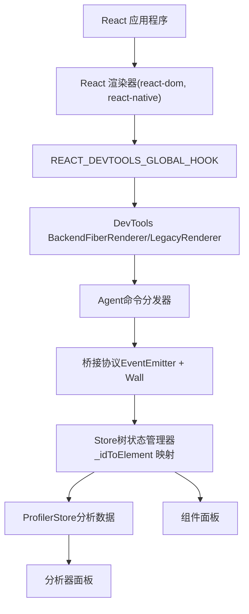
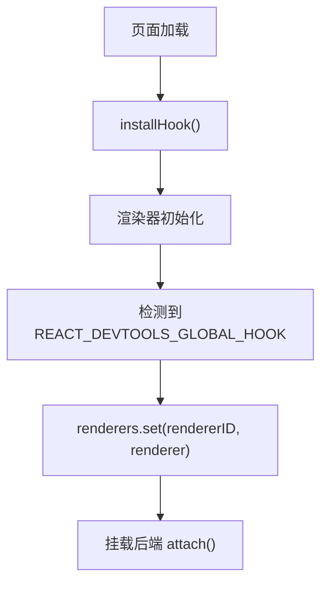
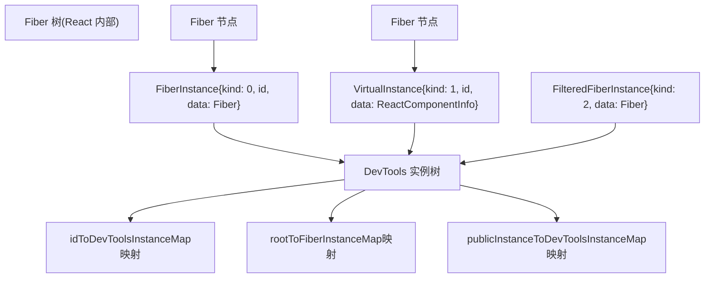
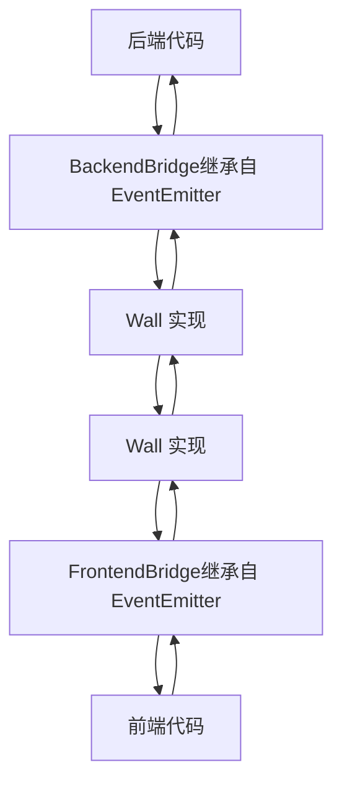
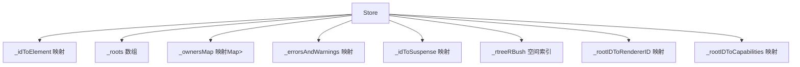
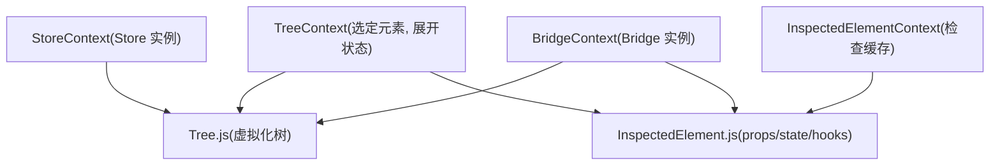
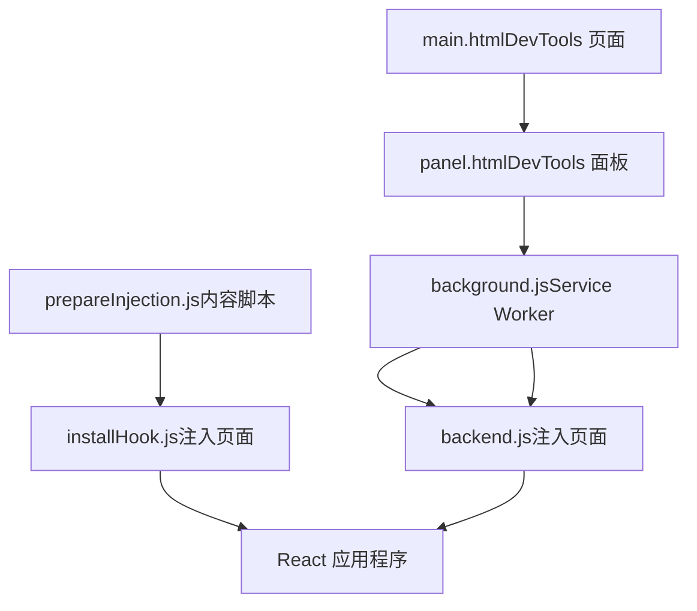
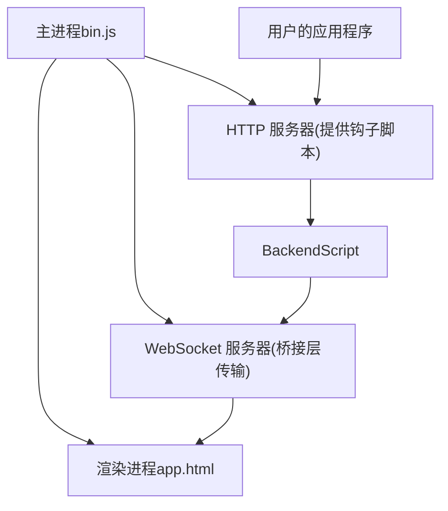

# React DevTools 架构

相关源文件

-   [fixtures/devtools/standalone/index.html](https://github.com/facebook/react/blob/65eec428/fixtures/devtools/standalone/index.html)
-   [packages/react-devtools-shared/src/\_\_tests\_\_/inspectedElement-test.js](https://github.com/facebook/react/blob/65eec428/packages/react-devtools-shared/src/__tests__/inspectedElement-test.js)
-   [packages/react-devtools-shared/src/\_\_tests\_\_/legacy/inspectElement-test.js](https://github.com/facebook/react/blob/65eec428/packages/react-devtools-shared/src/__tests__/legacy/inspectElement-test.js)
-   [packages/react-devtools-shared/src/\_\_tests\_\_/store-test.js](https://github.com/facebook/react/blob/65eec428/packages/react-devtools-shared/src/__tests__/store-test.js)
-   [packages/react-devtools-shared/src/backend/StyleX/\_\_tests\_\_/utils-test.js](https://github.com/facebook/react/blob/65eec428/packages/react-devtools-shared/src/backend/StyleX/__tests__/utils-test.js)
-   [packages/react-devtools-shared/src/backend/StyleX/utils.js](https://github.com/facebook/react/blob/65eec428/packages/react-devtools-shared/src/backend/StyleX/utils.js)
-   [packages/react-devtools-shared/src/backend/agent.js](https://github.com/facebook/react/blob/65eec428/packages/react-devtools-shared/src/backend/agent.js)
-   [packages/react-devtools-shared/src/backend/fiber/renderer.js](https://github.com/facebook/react/blob/65eec428/packages/react-devtools-shared/src/backend/fiber/renderer.js)
-   [packages/react-devtools-shared/src/backend/legacy/renderer.js](https://github.com/facebook/react/blob/65eec428/packages/react-devtools-shared/src/backend/legacy/renderer.js)
-   [packages/react-devtools-shared/src/backend/types.js](https://github.com/facebook/react/blob/65eec428/packages/react-devtools-shared/src/backend/types.js)
-   [packages/react-devtools-shared/src/backend/views/Highlighter/index.js](https://github.com/facebook/react/blob/65eec428/packages/react-devtools-shared/src/backend/views/Highlighter/index.js)
-   [packages/react-devtools-shared/src/backendAPI.js](https://github.com/facebook/react/blob/65eec428/packages/react-devtools-shared/src/backendAPI.js)
-   [packages/react-devtools-shared/src/bridge.js](https://github.com/facebook/react/blob/65eec428/packages/react-devtools-shared/src/bridge.js)
-   [packages/react-devtools-shared/src/constants.js](https://github.com/facebook/react/blob/65eec428/packages/react-devtools-shared/src/constants.js)
-   [packages/react-devtools-shared/src/devtools/constants.js](https://github.com/facebook/react/blob/65eec428/packages/react-devtools-shared/src/devtools/constants.js)
-   [packages/react-devtools-shared/src/devtools/store.js](https://github.com/facebook/react/blob/65eec428/packages/react-devtools-shared/src/devtools/store.js)
-   [packages/react-devtools-shared/src/devtools/views/ButtonIcon.js](https://github.com/facebook/react/blob/65eec428/packages/react-devtools-shared/src/devtools/views/ButtonIcon.js)
-   [packages/react-devtools-shared/src/devtools/views/Components/InspectedElement.js](https://github.com/facebook/react/blob/65eec428/packages/react-devtools-shared/src/devtools/views/Components/InspectedElement.js)
-   [packages/react-devtools-shared/src/devtools/views/Components/InspectedElementContextTree.js](https://github.com/facebook/react/blob/65eec428/packages/react-devtools-shared/src/devtools/views/Components/InspectedElementContextTree.js)
-   [packages/react-devtools-shared/src/devtools/views/Components/InspectedElementErrorsAndWarningsTree.js](https://github.com/facebook/react/blob/65eec428/packages/react-devtools-shared/src/devtools/views/Components/InspectedElementErrorsAndWarningsTree.js)
-   [packages/react-devtools-shared/src/devtools/views/Components/InspectedElementPropsTree.js](https://github.com/facebook/react/blob/65eec428/packages/react-devtools-shared/src/devtools/views/Components/InspectedElementPropsTree.js)
-   [packages/react-devtools-shared/src/devtools/views/Components/InspectedElementSharedStyles.css](https://github.com/facebook/react/blob/65eec428/packages/react-devtools-shared/src/devtools/views/Components/InspectedElementSharedStyles.css)
-   [packages/react-devtools-shared/src/devtools/views/Components/InspectedElementStateTree.js](https://github.com/facebook/react/blob/65eec428/packages/react-devtools-shared/src/devtools/views/Components/InspectedElementStateTree.js)
-   [packages/react-devtools-shared/src/devtools/views/Components/InspectedElementStyleXPlugin.js](https://github.com/facebook/react/blob/65eec428/packages/react-devtools-shared/src/devtools/views/Components/InspectedElementStyleXPlugin.js)
-   [packages/react-devtools-shared/src/devtools/views/Components/InspectedElementSuspendedBy.js](https://github.com/facebook/react/blob/65eec428/packages/react-devtools-shared/src/devtools/views/Components/InspectedElementSuspendedBy.js)
-   [packages/react-devtools-shared/src/devtools/views/Components/InspectedElementView.css](https://github.com/facebook/react/blob/65eec428/packages/react-devtools-shared/src/devtools/views/Components/InspectedElementView.css)
-   [packages/react-devtools-shared/src/devtools/views/Components/InspectedElementView.js](https://github.com/facebook/react/blob/65eec428/packages/react-devtools-shared/src/devtools/views/Components/InspectedElementView.js)
-   [packages/react-devtools-shared/src/devtools/views/Profiler/CommitTreeBuilder.js](https://github.com/facebook/react/blob/65eec428/packages/react-devtools-shared/src/devtools/views/Profiler/CommitTreeBuilder.js)
-   [packages/react-devtools-shared/src/devtools/views/Settings/SettingsContext.js](https://github.com/facebook/react/blob/65eec428/packages/react-devtools-shared/src/devtools/views/Settings/SettingsContext.js)
-   [packages/react-devtools-shared/src/devtools/views/SuspenseTab/SuspenseBreadcrumbs.js](https://github.com/facebook/react/blob/65eec428/packages/react-devtools-shared/src/devtools/views/SuspenseTab/SuspenseBreadcrumbs.js)
-   [packages/react-devtools-shared/src/devtools/views/SuspenseTab/SuspenseEnvironmentColors.css](https://github.com/facebook/react/blob/65eec428/packages/react-devtools-shared/src/devtools/views/SuspenseTab/SuspenseEnvironmentColors.css)
-   [packages/react-devtools-shared/src/devtools/views/SuspenseTab/SuspenseEnvironmentColors.js](https://github.com/facebook/react/blob/65eec428/packages/react-devtools-shared/src/devtools/views/SuspenseTab/SuspenseEnvironmentColors.js)
-   [packages/react-devtools-shared/src/devtools/views/SuspenseTab/SuspenseRects.css](https://github.com/facebook/react/blob/65eec428/packages/react-devtools-shared/src/devtools/views/SuspenseTab/SuspenseRects.css)
-   [packages/react-devtools-shared/src/devtools/views/SuspenseTab/SuspenseRects.js](https://github.com/facebook/react/blob/65eec428/packages/react-devtools-shared/src/devtools/views/SuspenseTab/SuspenseRects.js)
-   [packages/react-devtools-shared/src/devtools/views/SuspenseTab/SuspenseScrubber.css](https://github.com/facebook/react/blob/65eec428/packages/react-devtools-shared/src/devtools/views/SuspenseTab/SuspenseScrubber.css)
-   [packages/react-devtools-shared/src/devtools/views/SuspenseTab/SuspenseScrubber.js](https://github.com/facebook/react/blob/65eec428/packages/react-devtools-shared/src/devtools/views/SuspenseTab/SuspenseScrubber.js)
-   [packages/react-devtools-shared/src/devtools/views/SuspenseTab/SuspenseTab.css](https://github.com/facebook/react/blob/65eec428/packages/react-devtools-shared/src/devtools/views/SuspenseTab/SuspenseTab.css)
-   [packages/react-devtools-shared/src/devtools/views/SuspenseTab/SuspenseTab.js](https://github.com/facebook/react/blob/65eec428/packages/react-devtools-shared/src/devtools/views/SuspenseTab/SuspenseTab.js)
-   [packages/react-devtools-shared/src/devtools/views/SuspenseTab/SuspenseTimeline.css](https://github.com/facebook/react/blob/65eec428/packages/react-devtools-shared/src/devtools/views/SuspenseTab/SuspenseTimeline.css)
-   [packages/react-devtools-shared/src/devtools/views/SuspenseTab/SuspenseTimeline.js](https://github.com/facebook/react/blob/65eec428/packages/react-devtools-shared/src/devtools/views/SuspenseTab/SuspenseTimeline.js)
-   [packages/react-devtools-shared/src/devtools/views/SuspenseTab/SuspenseTreeContext.js](https://github.com/facebook/react/blob/65eec428/packages/react-devtools-shared/src/devtools/views/SuspenseTab/SuspenseTreeContext.js)
-   [packages/react-devtools-shared/src/devtools/views/Toggle.css](https://github.com/facebook/react/blob/65eec428/packages/react-devtools-shared/src/devtools/views/Toggle.css)
-   [packages/react-devtools-shared/src/devtools/views/hooks.js](https://github.com/facebook/react/blob/65eec428/packages/react-devtools-shared/src/devtools/views/hooks.js)
-   [packages/react-devtools-shared/src/devtools/views/root.css](https://github.com/facebook/react/blob/65eec428/packages/react-devtools-shared/src/devtools/views/root.css)
-   [packages/react-devtools-shared/src/devtools/views/useInferredName.js](https://github.com/facebook/react/blob/65eec428/packages/react-devtools-shared/src/devtools/views/useInferredName.js)
-   [packages/react-devtools-shared/src/devtools/views/utils.js](https://github.com/facebook/react/blob/65eec428/packages/react-devtools-shared/src/devtools/views/utils.js)
-   [packages/react-devtools-shared/src/frontend/types.js](https://github.com/facebook/react/blob/65eec428/packages/react-devtools-shared/src/frontend/types.js)
-   [packages/react-devtools-shared/src/hydration.js](https://github.com/facebook/react/blob/65eec428/packages/react-devtools-shared/src/hydration.js)
-   [packages/react-devtools-shared/src/utils.js](https://github.com/facebook/react/blob/65eec428/packages/react-devtools-shared/src/utils.js)
-   [packages/react-devtools-shell/src/app/InspectableElements/SimpleValues.js](https://github.com/facebook/react/blob/65eec428/packages/react-devtools-shell/src/app/InspectableElements/SimpleValues.js)
-   [packages/react-devtools-shell/src/app/InspectableElements/SymbolKeys.js](https://github.com/facebook/react/blob/65eec428/packages/react-devtools-shell/src/app/InspectableElements/SymbolKeys.js)
-   [packages/react-devtools-shell/src/app/InspectableElements/UnserializableProps.js](https://github.com/facebook/react/blob/65eec428/packages/react-devtools-shell/src/app/InspectableElements/UnserializableProps.js)
-   [packages/shared/ReactIODescription.js](https://github.com/facebook/react/blob/65eec428/packages/shared/ReactIODescription.js)

## 目的与范围

本文档描述了 React DevTools 的架构，这是针对 React 应用程序的调试和分析工具。内容涵盖了三层架构（Backend、Bridge、Frontend）、插桩（Instrumentation）机制、用于跨上下文通信的桥接协议，以及各种发布渠道（浏览器扩展、独立应用、内联嵌入）。

有关 React hooks 的 ESLint 插件信息，请参阅 [7.2](/facebook/react/7.2-devtools-distribution-and-integration)。有关 DevTools 插桩的 React 内部协调器和 Fiber 架构的详细信息，请参阅 [4.1](/facebook/react/4.1-fiber-architecture-and-data-structures)。

---

## 高层架构

React DevTools 采用了**三层架构**，将应用程序插桩、通信和用户界面之间的关注点分离：


**来源：**

-   [packages/react-devtools-shared/src/backend/fiber/renderer.js1007-1014](https://github.com/facebook/react/blob/65eec428/packages/react-devtools-shared/src/backend/fiber/renderer.js#L1007-L1014)
-   [packages/react-devtools-shared/src/backend/agent.js263-276](https://github.com/facebook/react/blob/65eec428/packages/react-devtools-shared/src/backend/agent.js#L263-L276)
-   [packages/react-devtools-shared/src/devtools/store.js143-169](https://github.com/facebook/react/blob/65eec428/packages/react-devtools-shared/src/devtools/store.js#L143-L169)
-   [packages/react-devtools-shared/src/hook.js58-68](https://github.com/facebook/react/blob/65eec428/packages/react-devtools-shared/src/hook.js#L58-L68)

该架构实现了关注点分离：

-   **Backend（后端）**：运行在与 React 应用程序相同的 JavaScript 上下文中，对协调器进行插桩。
-   **Bridge（桥接层）**：提供后端和前端之间版本无关的消息传递。
-   **Frontend（前端）**：运行在独立的上下文中（扩展面板、独立窗口或嵌入的 iframe），并提供用户界面。

---

## 后端（Backend）架构

### 全局钩子注入 (Global Hook Injection)

DevTools 后端使用安装在 `window.__REACT_DEVTOOLS_GLOBAL_HOOK__` 上的全局钩子来拦截 React 渲染器的初始化。该钩子是 React 渲染器在初始化期间检测并调用的事实上的公共 API。


**来源：**

-   [packages/react-devtools-shared/src/hook.js58-68](https://github.com/facebook/react/blob/65eec428/packages/react-devtools-shared/src/hook.js#L58-L68)
-   [packages/react-devtools-shared/src/backend/fiber/renderer.js1007-1028](https://github.com/facebook/react/blob/65eec428/packages/react-devtools-shared/src/backend/fiber/renderer.js#L1007-L1028)

钩子在 React 加载之前及早安装，安装方式包括：

-   **浏览器扩展**：通过内容脚本注入 [packages/react-devtools-extensions/chrome/manifest.json54-64](https://github.com/facebook/react/blob/65eec428/packages/react-devtools-extensions/chrome/manifest.json#L54-L64)
-   **独立应用**：从本地 HTTP 服务器提供 [packages/react-devtools-core/package.json12-16](https://github.com/facebook/react/blob/65eec428/packages/react-devtools-core/package.json#L12-L16)
-   **内联嵌入**：包含在页面包中 [packages/react-devtools-inline/package.json12-17](https://github.com/facebook/react/blob/65eec428/packages/react-devtools-inline/package.json#L12-L17)

### 后端渲染器接口 (Backend Renderer Interface)

后端提供了一个 `RendererInterface`，用于处理与特定 React 渲染器的所有交互：

| 方法 | 目的 |
| --- | --- |
| `flushInitialOperations()` | 将初始树状态发送到前端 |
| `findHostInstancesForElementID()` | 将 DevTools 元素 ID 映射到 DOM/宿主实例 |
| `inspectElement()` | 获取元素的详细 props/state/hooks |
| `overrideProps()` / `overrideHookState()` | 实时编辑组件数据 |
| `getProfilingData()` | 收集分析测量值 |
| `setTraceUpdatesEnabled()` | 启用/禁用渲染高亮显示 |

**来源：**

-   [packages/react-devtools-shared/src/backend/types.js412-455](https://github.com/facebook/react/blob/65eec428/packages/react-devtools-shared/src/backend/types.js#L412-L455)
-   [packages/react-devtools-shared/src/backend/fiber/renderer.js1007-1425](https://github.com/facebook/react/blob/65eec428/packages/react-devtools-shared/src/backend/fiber/renderer.js#L1007-L1425)

### Fiber 树插桩 (Fiber Tree Instrumentation)

后端通过创建一个镜像组件树的并行数据结构来对 React 的 Fiber 协调器进行插桩。对于每个 Fiber，后端会创建一个 `FiberInstance`、`VirtualInstance` 或 `FilteredFiberInstance`：


**来源：**

-   [packages/react-devtools-shared/src/backend/fiber/renderer.js185-293](https://github.com/facebook/react/blob/65eec428/packages/react-devtools-shared/src/backend/fiber/renderer.js#L185-L293)
-   [packages/react-devtools-shared/src/backend/fiber/renderer.js864-888](https://github.com/facebook/react/blob/65eec428/packages/react-devtools-shared/src/backend/fiber/renderer.js#L864-L888)

实例类型：

-   **FiberInstance** (`kind: 0`)：代表客户端组件的有状态 Fiber 对（current/work-in-progress）。
-   **VirtualInstance** (`kind: 1`)：代表服务器组件或由于优化而被消除（不创建 Fiber）的组件。
-   **FilteredFiberInstance** (`kind: 2`)：被组件过滤器隐藏，但仍被跟踪以寻找宿主实例。

### 树操作协议 (Tree Operations Protocol)

后端将树的变动作为紧凑的数值数组（称为**操作**，operations）发送到前端。每个操作都以操作代码为前缀：

| 操作代码 | 常量 | 目的 |
| --- | --- | --- |
| `1` | `TREE_OPERATION_ADD` | 向树中添加新元素 |
| `2` | `TREE_OPERATION_REMOVE` | 从树中移除元素 |
| `3` | `TREE_OPERATION_REORDER_CHILDREN` | 重新排序元素的子节点 |
| `4` | `TREE_OPERATION_UPDATE_TREE_BASE_DURATION` | 更新分析时长 |
| `5` | `TREE_OPERATION_UPDATE_ERRORS_OR_WARNINGS` | 更新错误/警告计数 |
| `7` | `TREE_OPERATION_SET_SUBTREE_MODE` | 更新 StrictMode 状态 |
| `8` | `SUSPENSE_TREE_OPERATION_ADD` | 添加 Suspense 边界 |
| `12` | `SUSPENSE_TREE_OPERATION_SUSPENDERS` | 更新 Suspense 状态 |

**来源：**

-   [packages/react-devtools-shared/src/constants.js20-32](https://github.com/facebook/react/blob/65eec428/packages/react-devtools-shared/src/constants.js#L20-L32)
-   [packages/react-devtools-shared/src/utils.js224-464](https://github.com/facebook/react/blob/65eec428/packages/react-devtools-shared/src/utils.js#L224-L464)

操作中包含一个字符串表（string table）以避免重复：

```
[rendererID, rootID, stringTableSize, ...encodedStrings, ...operations]
```
这种紧凑的格式在跨桥接层发送树更新时，最大程度地减少了序列化开销。

**来源：**

-   [packages/react-devtools-shared/src/backend/fiber/renderer.js1426-1600](https://github.com/facebook/react/blob/65eec428/packages/react-devtools-shared/src/backend/fiber/renderer.js#L1426-L1600)

---

## 桥接层（Bridge）协议

### 协议版本控制

桥接层使用版本化协议来处理不同 DevTools 版本之间的兼容性。协议版本在连接时协商：

> **[Mermaid 序列图]**
> *(图表结构无法解析)*

**来源：**

-   [packages/react-devtools-shared/src/bridge.js36-73](https://github.com/facebook/react/blob/65eec428/packages/react-devtools-shared/src/bridge.js#L36-L73)
-   [packages/react-devtools-shared/src/devtools/store.js273-320](https://github.com/facebook/react/blob/65eec428/packages/react-devtools-shared/src/devtools/store.js#L273-L320)

`BRIDGE_PROTOCOL` 数组定义了带有 NPM 版本范围的版本历史：

```
// 协议版本 2 增加了对 StrictMode 的支持
{
  version: 2,
  minNpmVersion: '4.22.0',
  maxNpmVersion: null,
}
```
**来源：**

-   [packages/react-devtools-shared/src/bridge.js47-70](https://github.com/facebook/react/blob/65eec428/packages/react-devtools-shared/src/bridge.js#L47-L70)

### 消息传递

桥接层建立在两个抽象之上：

-   **EventEmitter**：用于通过 `addListener()` / `emit()` 进行类型化的事件处理。
-   **Wall**：用于通过 `send()` / `listen()` 进行底层消息传输。


**来源：**

-   [packages/react-devtools-shared/src/bridge.js1-10](https://github.com/facebook/react/blob/65eec428/packages/react-devtools-shared/src/bridge.js#L1-L10)
-   [packages/react-devtools-shared/src/backend/agent.js307-356](https://github.com/facebook/react/blob/65eec428/packages/react-devtools-shared/src/backend/agent.js#L307-L356)

### 传输层实现

Wall 抽象为不同环境启用了不同的传输机制：

| 环境 | Wall 实现 | 传输机制 |
| --- | --- | --- |
| 浏览器扩展 | `chrome.runtime.connect()` | Chrome 扩展消息传递 |
| 独立应用 | WebSocket | 通过 localhost 的 TCP 套接字 |
| 内联嵌入 | `window.postMessage()` | 同页面的 iframe 消息传递 |
| React Native | WebSocket 或 Metro | RN 调试协议 |

**来源：**

-   [packages/react-devtools-extensions/chrome/manifest.json1-65](https://github.com/facebook/react/blob/65eec428/packages/react-devtools-extensions/chrome/manifest.json#L1-L65)
-   [packages/react-devtools-core/package.json1-38](https://github.com/facebook/react/blob/65eec428/packages/react-devtools-core/package.json#L1-L38)
-   [packages/react-devtools-inline/package.json1-52](https://github.com/facebook/react/blob/65eec428/packages/react-devtools-inline/package.json#L1-L52)

---

## 前端（Frontend）架构

### Store（存储器）

`Store` 类是前端组件树状态的唯一事实来源。它处理来自后端的“操作”并维护多个映射：


**来源：**

-   [packages/react-devtools-shared/src/devtools/store.js143-272](https://github.com/facebook/react/blob/65eec428/packages/react-devtools-shared/src/devtools/store.js#L143-L272)
-   [packages/react-devtools-shared/src/devtools/store.js197-236](https://github.com/facebook/react/blob/65eec428/packages/react-devtools-shared/src/devtools/store.js#L197-L236)

Store 在 `onBridgeOperations()` 中处理操作：

1.  从操作数组解析字符串表。
2.  遍历操作。
3.  对于每种操作类型（ADD, REMOVE 等），更新内部映射。
4.  发出 `mutated` 事件以触发 UI 更新。

**来源：**

-   [packages/react-devtools-shared/src/devtools/store.js1139-1784](https://github.com/facebook/react/blob/65eec428/packages/react-devtools-shared/src/devtools/store.js#L1139-L1784)

### 元素检查系统 (Inspected Element System)

元素检查使用带有缓存和 Hydration（注水）的请求-响应模式：

> **[Mermaid 序列图]**
> *(图表结构无法解析)*

**来源：**

-   [packages/react-devtools-shared/src/backend/fiber/renderer.js2700-3200](https://github.com/facebook/react/blob/65eec428/packages/react-devtools-shared/src/backend/fiber/renderer.js#L2700-L3200)
-   [packages/react-devtools-shared/src/backendAPI.js1-300](https://github.com/facebook/react/blob/65eec428/packages/react-devtools-shared/src/backendAPI.js#L1-L300)
-   [packages/react-devtools-shared/src/hydration.js1-500](https://github.com/facebook/react/blob/65eec428/packages/react-devtools-shared/src/hydration.js#L1-L500)

检查系统使用 **Dehydration（脱水）**来延迟加载嵌套数据：

-   初始检查返回带有 `Dehydrated` 占位符的浅层数据。
-   用户展开路径 → 前端请求该特定路径。
-   后端填充该路径并发送 `hydrated-path` 响应。

**来源：**

-   [packages/react-devtools-shared/src/hydration.js65-250](https://github.com/facebook/react/blob/65eec428/packages/react-devtools-shared/src/hydration.js#L65-L250)

### UI 组件

前端 UI 组织为几个主要面板：

| 面板 | 组件 | 目的 |
| --- | --- | --- |
| Components（组件） | `Components.js` | 树视图 + 元素检查器 |
| Profiler（分析器） | `Profiler.js` | 提交时间轴 + 火焰图 |
| Settings（设置） | `Settings/` | DevTools 配置 |
| Suspense | `SuspenseTab/` | Suspense 边界可视化（实验性） |

**来源：**

-   [packages/react-devtools-shared/src/devtools/views/Components/](https://github.com/facebook/react/blob/65eec428/packages/react-devtools-shared/src/devtools/views/Components/)
-   [packages/react-devtools-shared/src/devtools/views/Profiler/](https://github.com/facebook/react/blob/65eec428/packages/react-devtools-shared/src/devtools/views/Profiler/)

组件面板使用 React Context 进行状态管理：


**来源：**

-   [packages/react-devtools-shared/src/devtools/views/Components/TreeContext.js](https://github.com/facebook/react/blob/65eec428/packages/react-devtools-shared/src/devtools/views/Components/TreeContext.js)
-   [packages/react-devtools-shared/src/devtools/views/Components/InspectedElementContext.js](https://github.com/facebook/react/blob/65eec428/packages/react-devtools-shared/src/devtools/views/Components/InspectedElementContext.js)
-   [packages/react-devtools-shared/src/devtools/views/context.js](https://github.com/facebook/react/blob/65eec428/packages/react-devtools-shared/src/devtools/views/context.js)

---

## 发布渠道

React DevTools 通过多个渠道发布，每个渠道都有不同的架构：

### 浏览器扩展

浏览器扩展使用带有 Service Worker 后端的 Manifest V3：


**来源：**

-   [packages/react-devtools-extensions/chrome/manifest.json40-64](https://github.com/facebook/react/blob/65eec428/packages/react-devtools-extensions/chrome/manifest.json#L40-L64)
-   [packages/react-devtools-extensions/firefox/manifest.json45-69](https://github.com/facebook/react/blob/65eec428/packages/react-devtools-extensions/firefox/manifest.json#L45-L69)

扩展特定功能：

-   图标根据 React 构建类型（开发/生产）更改颜色。
-   如果未检测到 React，弹出窗口会发出警告。
-   与浏览器 Elements 面板集成，用于 DOM 节点选择。

**来源：**

-   [packages/react-devtools-extensions/chrome/manifest.json14-22](https://github.com/facebook/react/blob/65eec428/packages/react-devtools-extensions/chrome/manifest.json#L14-L22)

### 独立应用程序

独立应用是一个 Electron 应用程序，它启动一个本地 WebSocket 服务器：


**来源：**

-   [packages/react-devtools/package.json11-23](https://github.com/facebook/react/blob/65eec428/packages/react-devtools/package.json#L11-L23)
-   [packages/react-devtools-core/package.json1-38](https://github.com/facebook/react/blob/65eec428/packages/react-devtools-core/package.json#L1-L38)

用户在页面中添加一个脚本标签：

```
<script src="http://localhost:8097"></script>
```
这将加载钩子和后端，它们通过 WebSocket 连接回来。

**来源：**

-   [packages/react-devtools-core/](https://github.com/facebook/react/blob/65eec428/packages/react-devtools-core/)

### 内联嵌入 (Inline Embedding)

内联包允许直接在网页中嵌入 DevTools：

```
import {initialize} from 'react-devtools-inline/frontend';
import {activate} from 'react-devtools-inline/backend';

// 在应用程序上下文中
activate(window);

// 在 DevTools UI 上下文中
const DevTools = initialize(window);
```
这用于演示、在线沙箱以及 React Native 调试。

**来源：**

-   [packages/react-devtools-inline/package.json12-17](https://github.com/facebook/react/blob/65eec428/packages/react-devtools-inline/package.json#L12-L17)

### React Native 集成

React Native 嵌入了 DevTools 后端，并通过 Metro 打包器的 WebSocket 连接或自定义的 RN 调试桥进行连接。

**来源：**

-   [packages/react-devtools-shared/src/backend/views/Highlighter/index.js1-20](https://github.com/facebook/react/blob/65eec428/packages/react-devtools-shared/src/backend/views/Highlighter/index.js#L1-L20)

---

## 数据流示例

### 组件树更新

当组件更新时，会发生以下流程：

> **[Mermaid 序列图]**
> *(图表结构无法解析)*

**来源：**

-   [packages/react-devtools-shared/src/backend/fiber/renderer.js1426-1600](https://github.com/facebook/react/blob/65eec428/packages/react-devtools-shared/src/backend/fiber/renderer.js#L1426-L1600)
-   [packages/react-devtools-shared/src/backend/agent.js567-700](https://github.com/facebook/react/blob/65eec428/packages/react-devtools-shared/src/backend/agent.js#L567-L700)
-   [packages/react-devtools-shared/src/devtools/store.js1139-1784](https://github.com/facebook/react/blob/65eec428/packages/react-devtools-shared/src/devtools/store.js#L1139-L1784)

### 元素检查

当用户检查元素时：

> **[Mermaid 序列图]**
> *(图表结构无法解析)*

**来源：**

-   [packages/react-devtools-shared/src/backend/fiber/renderer.js2700-3200](https://github.com/facebook/react/blob/65eec428/packages/react-devtools-shared/src/backend/fiber/renderer.js#L2700-L3200)
-   [packages/react-devtools-shared/src/backend/agent.js423-500](https://github.com/facebook/react/blob/65eec428/packages/react-devtools-shared/src/backend/agent.js#L423-L500)
-   [packages/react-devtools-shared/src/backendAPI.js50-200](https://github.com/facebook/react/blob/65eec428/packages/react-devtools-shared/src/backendAPI.js#L50-L200)

### 分析会话 (Profiling Session)

分析流程在后端和前端之间协调：

> **[Mermaid 序列图]**
> *(图表结构无法解析)*

**来源：**

-   [packages/react-devtools-shared/src/backend/fiber/renderer.js1105-1300](https://github.com/facebook/react/blob/65eec428/packages/react-devtools-shared/src/backend/fiber/renderer.js#L1105-L1300)
-   [packages/react-devtools-shared/src/devtools/ProfilerStore.js](https://github.com/facebook/react/blob/65eec428/packages/react-devtools-shared/src/devtools/ProfilerStore.js)

---

## 关键设计决策

### 为什么采用三层架构？

Backend、Bridge 和 Frontend 的分离实现了：

-   **安全隔离**：DevTools UI 在不同的上下文中运行，具有不同的权限。
-   **版本独立性**：协议版本控制允许较新的后端与较旧的前端配合使用。
-   **多个传输层**：同样的代码可以在扩展、独立应用、内联嵌入和 React Native 中运行。

### 为什么采用操作数组 (Operations Arrays)？

紧凑的数值数组最大程度地减少了序列化开销：

-   字符串通过字符串表进行去重。
-   树的变化编码为整数。
-   没有 JSON 解析开销。
-   能很好地配合 `postMessage()` 结构化克隆算法。

**来源：**

-   [packages/react-devtools-shared/src/utils.js224-464](https://github.com/facebook/react/blob/65eec428/packages/react-devtools-shared/src/utils.js#L224-L464)

### 为什么采用 Dehydration（脱水）？

对嵌套数据进行延迟加载：

-   初始检查发送浅层表示。
-   深层嵌套的对象表示为 `{inspectable: true}`。
-   用户展开会触发特定路径的获取。
-   减少了大型组件树的初始负载大小。

**来源：**

-   [packages/react-devtools-shared/src/hydration.js65-250](https://github.com/facebook/react/blob/65eec428/packages/react-devtools-shared/src/hydration.js#L65-L250)

### 为什么使用 WeakMap 进行 Fiber 跟踪？

对 `internalInstanceToIDMap` 使用 WeakMap 可以防止内存泄漏：

-   Fiber 可以被垃圾回收而不需要显式清理。
-   DevTools 不会持有对已卸载组件的强引用。

**来源：**

-   [packages/react-devtools-shared/src/backend/fiber/renderer.js864-873](https://github.com/facebook/react/blob/65eec428/packages/react-devtools-shared/src/backend/fiber/renderer.js#L864-L873)
