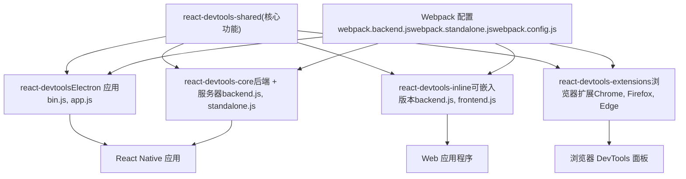
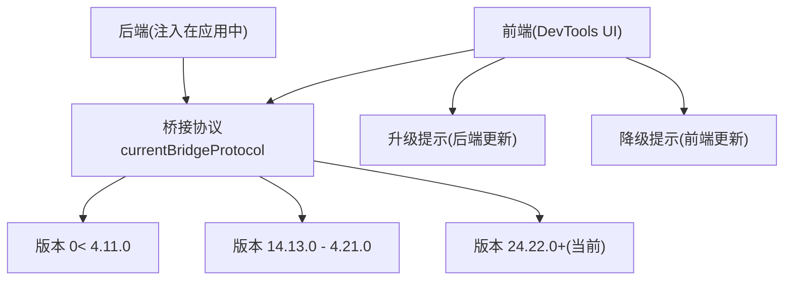
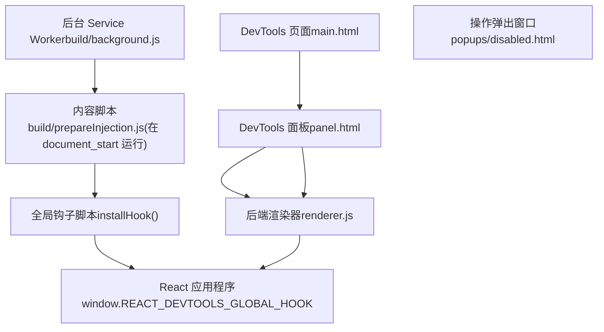
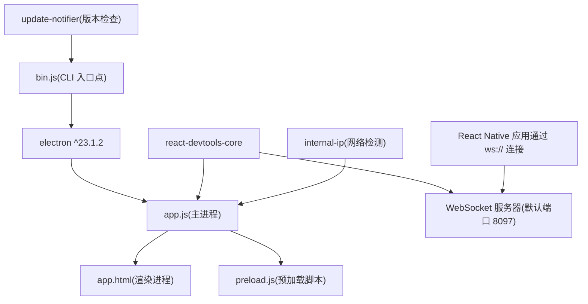
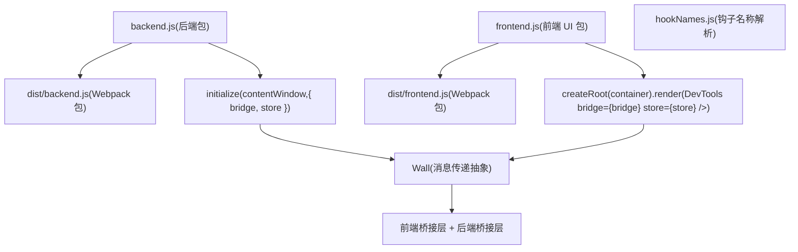
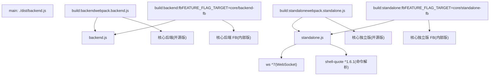
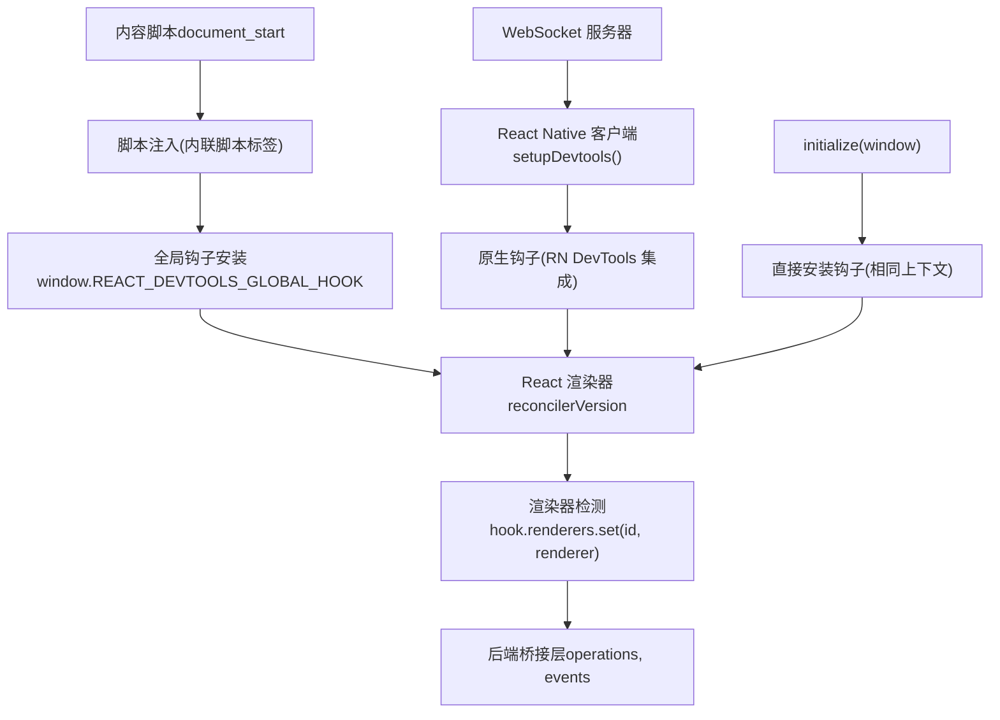
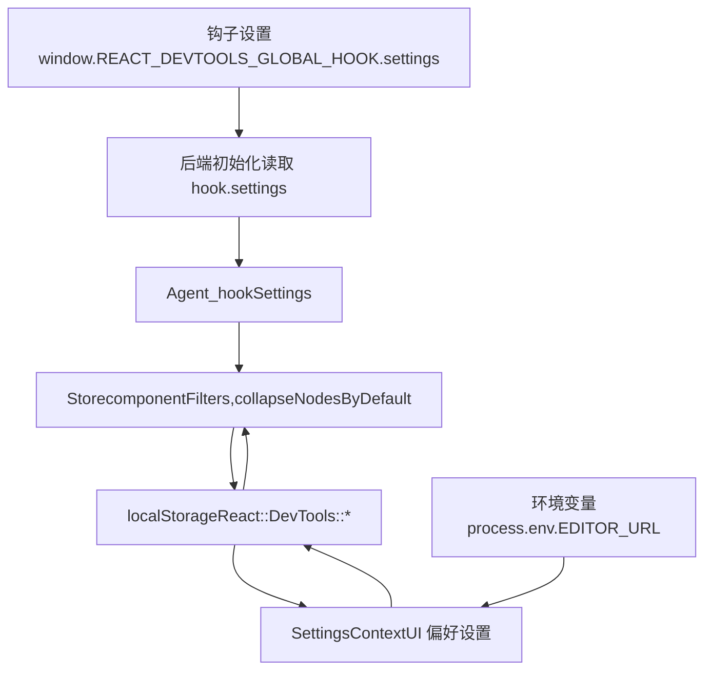

# DevTools 发布与集成

相关源文件

-   [fixtures/devtools/standalone/index.html](https://github.com/facebook/react/blob/65eec428/fixtures/devtools/standalone/index.html)
-   [packages/react-devtools-core/package.json](https://github.com/facebook/react/blob/65eec428/packages/react-devtools-core/package.json)
-   [packages/react-devtools-extensions/chrome/manifest.json](https://github.com/facebook/react/blob/65eec428/packages/react-devtools-extensions/chrome/manifest.json)
-   [packages/react-devtools-extensions/edge/manifest.json](https://github.com/facebook/react/blob/65eec428/packages/react-devtools-extensions/edge/manifest.json)
-   [packages/react-devtools-extensions/firefox/manifest.json](https://github.com/facebook/react/blob/65eec428/packages/react-devtools-extensions/firefox/manifest.json)
-   [packages/react-devtools-inline/package.json](https://github.com/facebook/react/blob/65eec428/packages/react-devtools-inline/package.json)
-   [packages/react-devtools-shared/package.json](https://github.com/facebook/react/blob/65eec428/packages/react-devtools-shared/package.json)
-   [packages/react-devtools-shared/src/\_\_tests\_\_/inspectedElement-test.js](https://github.com/facebook/react/blob/65eec428/packages/react-devtools-shared/src/__tests__/inspectedElement-test.js)
-   [packages/react-devtools-shared/src/\_\_tests\_\_/legacy/inspectElement-test.js](https://github.com/facebook/react/blob/65eec428/packages/react-devtools-shared/src/__tests__/legacy/inspectElement-test.js)
-   [packages/react-devtools-shared/src/\_\_tests\_\_/store-test.js](https://github.com/facebook/react/blob/65eec428/packages/react-devtools-shared/src/__tests__/store-test.js)
-   [packages/react-devtools-shared/src/backend/StyleX/\_\_tests\_\_/utils-test.js](https://github.com/facebook/react/blob/65eec428/packages/react-devtools-shared/src/backend/StyleX/__tests__/utils-test.js)
-   [packages/react-devtools-shared/src/backend/StyleX/utils.js](https://github.com/facebook/react/blob/65eec428/packages/react-devtools-shared/src/backend/StyleX/utils.js)
-   [packages/react-devtools-shared/src/backend/agent.js](https://github.com/facebook/react/blob/65eec428/packages/react-devtools-shared/src/backend/agent.js)
-   [packages/react-devtools-shared/src/backend/fiber/renderer.js](https://github.com/facebook/react/blob/65eec428/packages/react-devtools-shared/src/backend/fiber/renderer.js)
-   [packages/react-devtools-shared/src/backend/legacy/renderer.js](https://github.com/facebook/react/blob/65eec428/packages/react-devtools-shared/src/backend/legacy/renderer.js)
-   [packages/react-devtools-shared/src/backend/types.js](https://github.com/facebook/react/blob/65eec428/packages/react-devtools-shared/src/backend/types.js)
-   [packages/react-devtools-shared/src/backend/views/Highlighter/index.js](https://github.com/facebook/react/blob/65eec428/packages/react-devtools-shared/src/backend/views/Highlighter/index.js)
-   [packages/react-devtools-shared/src/backendAPI.js](https://github.com/facebook/react/blob/65eec428/packages/react-devtools-shared/src/backendAPI.js)
-   [packages/react-devtools-shared/src/bridge.js](https://github.com/facebook/react/blob/65eec428/packages/react-devtools-shared/src/bridge.js)
-   [packages/react-devtools-shared/src/constants.js](https://github.com/facebook/react/blob/65eec428/packages/react-devtools-shared/src/constants.js)
-   [packages/react-devtools-shared/src/devtools/constants.js](https://github.com/facebook/react/blob/65eec428/packages/react-devtools-shared/src/devtools/constants.js)
-   [packages/react-devtools-shared/src/devtools/store.js](https://github.com/facebook/react/blob/65eec428/packages/react-devtools-shared/src/devtools/store.js)
-   [packages/react-devtools-shared/src/devtools/views/ButtonIcon.js](https://github.com/facebook/react/blob/65eec428/packages/react-devtools-shared/src/devtools/views/ButtonIcon.js)
-   [packages/react-devtools-shared/src/devtools/views/Components/InspectedElement.js](https://github.com/facebook/react/blob/65eec428/packages/react-devtools-shared/src/devtools/views/Components/InspectedElement.js)
-   [packages/react-devtools-shared/src/devtools/views/Components/InspectedElementContextTree.js](https://github.com/facebook/react/blob/65eec428/packages/react-devtools-shared/src/devtools/views/Components/InspectedElementContextTree.js)
-   [packages/react-devtools-shared/src/devtools/views/Components/InspectedElementErrorsAndWarningsTree.js](https://github.com/facebook/react/blob/65eec428/packages/react-devtools-shared/src/devtools/views/Components/InspectedElementErrorsAndWarningsTree.js)
-   [packages/react-devtools-shared/src/devtools/views/Components/InspectedElementPropsTree.js](https://github.com/facebook/react/blob/65eec428/packages/react-devtools-shared/src/devtools/views/Components/InspectedElementPropsTree.js)
-   [packages/react-devtools-shared/src/devtools/views/Components/InspectedElementSharedStyles.css](https://github.com/facebook/react/blob/65eec428/packages/react-devtools-shared/src/devtools/views/Components/InspectedElementSharedStyles.css)
-   [packages/react-devtools-shared/src/devtools/views/Components/InspectedElementStateTree.js](https://github.com/facebook/react/blob/65eec428/packages/react-devtools-shared/src/devtools/views/Components/InspectedElementStateTree.js)
-   [packages/react-devtools-shared/src/devtools/views/Components/InspectedElementStyleXPlugin.js](https://github.com/facebook/react/blob/65eec428/packages/react-devtools-shared/src/devtools/views/Components/InspectedElementStyleXPlugin.js)
-   [packages/react-devtools-shared/src/devtools/views/Components/InspectedElementSuspendedBy.js](https://github.com/facebook/react/blob/65eec428/packages/react-devtools-shared/src/devtools/views/Components/InspectedElementSuspendedBy.js)
-   [packages/react-devtools-shared/src/devtools/views/Components/InspectedElementView.css](https://github.com/facebook/react/blob/65eec428/packages/react-devtools-shared/src/devtools/views/Components/InspectedElementView.css)
-   [packages/react-devtools-shared/src/devtools/views/Components/InspectedElementView.js](https://github.com/facebook/react/blob/65eec428/packages/react-devtools-shared/src/devtools/views/Components/InspectedElementView.js)
-   [packages/react-devtools-shared/src/devtools/views/Profiler/CommitTreeBuilder.js](https://github.com/facebook/react/blob/65eec428/packages/react-devtools-shared/src/devtools/views/Profiler/CommitTreeBuilder.js)
-   [packages/react-devtools-shared/src/devtools/views/Settings/SettingsContext.js](https://github.com/facebook/react/blob/65eec428/packages/react-devtools-shared/src/devtools/views/Settings/SettingsContext.js)
-   [packages/react-devtools-shared/src/devtools/views/SuspenseTab/SuspenseBreadcrumbs.js](https://github.com/facebook/react/blob/65eec428/packages/react-devtools-shared/src/devtools/views/SuspenseTab/SuspenseBreadcrumbs.js)
-   [packages/react-devtools-shared/src/devtools/views/SuspenseTab/SuspenseEnvironmentColors.css](https://github.com/facebook/react/blob/65eec428/packages/react-devtools-shared/src/devtools/views/SuspenseTab/SuspenseEnvironmentColors.css)
-   [packages/react-devtools-shared/src/devtools/views/SuspenseTab/SuspenseEnvironmentColors.js](https://github.com/facebook/react/blob/65eec428/packages/react-devtools-shared/src/devtools/views/SuspenseTab/SuspenseEnvironmentColors.js)
-   [packages/react-devtools-shared/src/devtools/views/SuspenseTab/SuspenseRects.css](https://github.com/facebook/react/blob/65eec428/packages/react-devtools-shared/src/devtools/views/SuspenseTab/SuspenseRects.css)
-   [packages/react-devtools-shared/src/devtools/views/SuspenseTab/SuspenseRects.js](https://github.com/facebook/react/blob/65eec428/packages/react-devtools-shared/src/devtools/views/SuspenseTab/SuspenseRects.js)
-   [packages/react-devtools-shared/src/devtools/views/SuspenseTab/SuspenseScrubber.css](https://github.com/facebook/react/blob/65eec428/packages/react-devtools-shared/src/devtools/views/SuspenseTab/SuspenseScrubber.css)
-   [packages/react-devtools-shared/src/devtools/views/SuspenseTab/SuspenseScrubber.js](https://github.com/facebook/react/blob/65eec428/packages/react-devtools-shared/src/devtools/views/SuspenseTab/SuspenseScrubber.js)
-   [packages/react-devtools-shared/src/devtools/views/SuspenseTab/SuspenseTab.css](https://github.com/facebook/react/blob/65eec428/packages/react-devtools-shared/src/devtools/views/SuspenseTab/SuspenseTab.css)
-   [packages/react-devtools-shared/src/devtools/views/SuspenseTab/SuspenseTab.js](https://github.com/facebook/react/blob/65eec428/packages/react-devtools-shared/src/devtools/views/SuspenseTab/SuspenseTab.js)
-   [packages/react-devtools-shared/src/devtools/views/SuspenseTab/SuspenseTimeline.css](https://github.com/facebook/react/blob/65eec428/packages/react-devtools-shared/src/devtools/views/SuspenseTab/SuspenseTimeline.css)
-   [packages/react-devtools-shared/src/devtools/views/SuspenseTab/SuspenseTimeline.js](https://github.com/facebook/react/blob/65eec428/packages/react-devtools-shared/src/devtools/views/SuspenseTab/SuspenseTimeline.js)
-   [packages/react-devtools-shared/src/devtools/views/SuspenseTab/SuspenseTreeContext.js](https://github.com/facebook/react/blob/65eec428/packages/react-devtools-shared/src/devtools/views/SuspenseTab/SuspenseTreeContext.js)
-   [packages/react-devtools-shared/src/devtools/views/Toggle.css](https://github.com/facebook/react/blob/65eec428/packages/react-devtools-shared/src/devtools/views/Toggle.css)
-   [packages/react-devtools-shared/src/devtools/views/hooks.js](https://github.com/facebook/react/blob/65eec428/packages/react-devtools-shared/src/devtools/views/hooks.js)
-   [packages/react-devtools-shared/src/devtools/views/root.css](https://github.com/facebook/react/blob/65eec428/packages/react-devtools-shared/src/devtools/views/root.css)
-   [packages/react-devtools-shared/src/devtools/views/useInferredName.js](https://github.com/facebook/react/blob/65eec428/packages/react-devtools-shared/src/devtools/views/useInferredName.js)
-   [packages/react-devtools-shared/src/devtools/views/utils.js](https://github.com/facebook/react/blob/65eec428/packages/react-devtools-shared/src/devtools/views/utils.js)
-   [packages/react-devtools-shared/src/frontend/types.js](https://github.com/facebook/react/blob/65eec428/packages/react-devtools-shared/src/frontend/types.js)
-   [packages/react-devtools-shared/src/hydration.js](https://github.com/facebook/react/blob/65eec428/packages/react-devtools-shared/src/hydration.js)
-   [packages/react-devtools-shared/src/utils.js](https://github.com/facebook/react/blob/65eec428/packages/react-devtools-shared/src/utils.js)
-   [packages/react-devtools-shell/src/app/InspectableElements/SimpleValues.js](https://github.com/facebook/react/blob/65eec428/packages/react-devtools-shell/src/app/InspectableElements/SimpleValues.js)
-   [packages/react-devtools-shell/src/app/InspectableElements/SymbolKeys.js](https://github.com/facebook/react/blob/65eec428/packages/react-devtools-shell/src/app/InspectableElements/SymbolKeys.js)
-   [packages/react-devtools-shell/src/app/InspectableElements/UnserializableProps.js](https://github.com/facebook/react/blob/65eec428/packages/react-devtools-shell/src/app/InspectableElements/UnserializableProps.js)
-   [packages/react-devtools-timeline/package.json](https://github.com/facebook/react/blob/65eec428/packages/react-devtools-timeline/package.json)
-   [packages/react-devtools/CHANGELOG.md](https://github.com/facebook/react/blob/65eec428/packages/react-devtools/CHANGELOG.md)
-   [packages/react-devtools/package.json](https://github.com/facebook/react/blob/65eec428/packages/react-devtools/package.json)
-   [packages/react-dom/src/\_\_tests\_\_/ReactErrorLoggingRecovery-test.js](https://github.com/facebook/react/blob/65eec428/packages/react-dom/src/__tests__/ReactErrorLoggingRecovery-test.js)
-   [packages/shared/ReactIODescription.js](https://github.com/facebook/react/blob/65eec428/packages/shared/ReactIODescription.js)
-   [packages/shared/forks/ReactFeatureFlags.readonly.js](https://github.com/facebook/react/blob/65eec428/packages/shared/forks/ReactFeatureFlags.readonly.js)
-   [scripts/jest/config.build-devtools.js](https://github.com/facebook/react/blob/65eec428/scripts/jest/config.build-devtools.js)
-   [scripts/jest/config.build.js](https://github.com/facebook/react/blob/65eec428/scripts/jest/config.build.js)

## 目的与范围

本文档描述了 React DevTools（开发人员工具）如何在不同平台上进行打包和发布，以及各个发布版本如何与 React 应用程序集成。DevTools 以多种形式存在——浏览器扩展、独立的 Electron 应用程序以及可嵌入的内联库——它们共享通用的后端，但使用不同的集成策略。

有关 DevTools 架构以及前端和后端之间通信协议的信息，请参阅 [React DevTools 架构](/facebook/react/7.1-react-devtools-architecture)。

## 发布包概览

React DevTools 以四个不同的 npm 包发布，每个包服务于不同的用例：

| 包名 | 目的 | 主要用例 |
| --- | --- | --- |
| `react-devtools` | 独立的 Electron 应用 | 调试 React Native 应用 |
| `react-devtools-core` | 后端和独立服务器 | 自定义集成、React Native |
| `react-devtools-inline` | 可嵌入的前端 + 后端 | 集成在 Web 应用中的开发工具 |
| `react-devtools-extensions` | 浏览器扩展 | 在 Chrome、Firefox、Edge 中调试 Web 应用 |

每个包都共享 `react-devtools-shared` 代码库，但针对其目标环境进行了不同的打包。

**图表：发布包架构**


来源：[packages/react-devtools/package.json1-32](https://github.com/facebook/react/blob/65eec428/packages/react-devtools/package.json#L1-L32) [packages/react-devtools-core/package.json1-38](https://github.com/facebook/react/blob/65eec428/packages/react-devtools-core/package.json#L1-L38) [packages/react-devtools-inline/package.json1-52](https://github.com/facebook/react/blob/65eec428/packages/react-devtools-inline/package.json#L1-L52)

## 桥接协议与版本兼容性

所有 DevTools 发布版本都使用 `BRIDGE_PROTOCOL` 中定义的版本化桥接协议（bridge protocol）进行通信。这实现了前端和后端之间版本不匹配时的优雅处理。

**协议版本管理**

桥接协议使用语义化版本控制（semantic versioning）来跟踪破坏性更改：


协议版本在初始化期间进行检查。每个版本包括：

-   `version`：协议版本号
-   `minNpmVersion`：兼容的最小 npm 包版本
-   `maxNpmVersion`：兼容的最大 npm 包版本

当检测到不兼容时，Store 会设置 `_unsupportedBridgeProtocolDetected`，并且 UI 会显示相应的信息。

来源：[packages/react-devtools-shared/src/bridge.js26-73](https://github.com/facebook/react/blob/65eec428/packages/react-devtools-shared/src/bridge.js#L26-L73) [packages/react-devtools-shared/src/devtools/store.js254-256](https://github.com/facebook/react/blob/65eec428/packages/react-devtools-shared/src/devtools/store.js#L254-L256)

## 浏览器扩展

Chrome、Firefox 和 Edge 的浏览器扩展遵循 Manifest V3 规范，并在适配浏览器特定 API 的同时共享大部分代码。

**扩展架构**


**Manifest 结构**

每个浏览器都有略微不同的 manifest 配置：

| 属性 | Chrome/Edge | Firefox | 目的 |
| --- | --- | --- | --- |
| `manifest_version` | 3 | 3 | 所有浏览器均采用 Manifest V3 |
| `background` | `service_worker` | `scripts` | 后台脚本执行模型 |
| `permissions` | tabs, storage, scripting | tabs, storage, scripting, clipboardWrite | 必需的权限 |
| `optional_permissions` | clipboardWrite | \- | 用户授予的权限 |
| `browser_specific_settings` | \- | gecko.id, strict\_min\_version | Firefox 特有的元数据 |

**内容脚本注入**

扩展程序在 `document_start` 时注入 `prepareInjection.js`，以确保全局钩子在 React 加载前可用：

1.  内容脚本在页面加载时立即运行。
2.  将全局钩子注入到页面上下文中。
3.  钩子拦截 React 渲染器的注册。
4.  当 DevTools 面板打开时，后端连接到钩子。

来源：[packages/react-devtools-extensions/chrome/manifest.json1-65](https://github.com/facebook/react/blob/65eec428/packages/react-devtools-extensions/chrome/manifest.json#L1-L65) [packages/react-devtools-extensions/firefox/manifest.json1-70](https://github.com/facebook/react/blob/65eec428/packages/react-devtools-extensions/firefox/manifest.json#L1-L70) [packages/react-devtools-extensions/edge/manifest.json1-65](https://github.com/facebook/react/blob/65eec428/packages/react-devtools-extensions/edge/manifest.json#L1-L65)

## 独立的 Electron 应用程序

`react-devtools` 包提供了一个独立的 Electron 应用程序，用于调试 React Native 应用程序。

**包结构**


**启动流程**

从命令行运行 `react-devtools` 时：

1.  `bin.js` 通过 `update-notifier` 检查更新。
2.  以 `app.js` 为入口点启动 Electron。
3.  `app.js` 使用 `react-devtools-core` 启动一个 WebSocket 服务器。
4.  创建加载 `app.html` 的 Electron 窗口。
5.  React Native 应用连接到 WebSocket 服务器。
6.  前端和后端通过 WebSocket 桥接层进行通信。

**命令行选项**

独立应用支持以下选项：

-   `--port`：WebSocket 服务器端口（默认：8097）。
-   `--host`：要绑定的主机（默认：localhost）。
-   `--https`：使用 HTTPS 进行安全连接。
-   `--react-devtools-port`：备用端口规范。

来源：[packages/react-devtools/package.json1-32](https://github.com/facebook/react/blob/65eec428/packages/react-devtools/package.json#L1-L32) [packages/react-devtools-core/package.json1-38](https://github.com/facebook/react/blob/65eec428/packages/react-devtools-core/package.json#L1-L38)

## 内联可嵌入库 (Inline Embeddable Library)

`react-devtools-inline` 包允许将 DevTools 直接嵌入到 Web 应用程序中，这对于开发环境和内部工具非常有用。

**包导出内容**


**集成示例**

内联嵌入 DevTools：

```
// 后端初始化 (在目标 iframe/窗口中)
import {initialize as initBackend} from 'react-devtools-inline/backend';

// 前端渲染 (在宿主页面中)
import {initialize as initFrontend} from 'react-devtools-inline/frontend';
import {createRoot} from 'react-dom/client';

// 创建桥接层
const wall = {
  listen(listener) { /* 处理消息 */ },
  send(event, payload) { /* 发送消息 */ }
};

// 在目标窗口初始化后端
initBackend(targetWindow, { wall });

// 渲染前端
const {bridge, store} = initFrontend(wall);
const container = document.getElementById('devtools');
createRoot(container).render(<DevTools bridge={bridge} store={store} />);
```
内联库将所有共享代码打包成可以独立加载的自包含产物（artifacts）。

来源：[packages/react-devtools-inline/package.json1-52](https://github.com/facebook/react/blob/65eec428/packages/react-devtools-inline/package.json#L1-L52)

## 用于自定义集成的核心库

`react-devtools-core` 包为自定义 DevTools 集成提供了后端和独立服务器，主要由 React Native 使用。

**包导出与构建目标**


**集成模式**

核心库支持两种集成模式：

1.  **仅后端**：导入 `backend.js` 将后端注入到自定义环境中。
2.  **独立服务器**：导入 `standalone.js` 启动用于远程连接的 WebSocket 服务器。

**WebSocket 服务器 API**

独立服务器暴露了这些方法：

```
import {initialize} from 'react-devtools-core/standalone';

const server = await initialize({
  port: 8097,
  host: 'localhost',
  httpsOptions: null, // 可选的 TLS 配置
  onDisconnect: () => { /* 清理 */ },
  onError: (error) => { /* 错误处理 */ }
});

// 服务器提供：
// - server.close() - 停止服务器
// - server.port - 实际端口 (对端口 0 很有用)
```
React Native 通过在开发期间连接到此 WebSocket 服务器进行集成。

来源：[packages/react-devtools-core/package.json1-38](https://github.com/facebook/react/blob/65eec428/packages/react-devtools-core/package.json#L1-L38)

## 后端注入机制

DevTools 后端必须在 React 加载之前注入到目标应用程序中。不同的发布版本使用不同的注入策略。

**按发布版本划分的注入策略**


**全局钩子接口**

所有注入机制都会安装一个具有此接口的全局钩子：

```
window.__REACT_DEVTOOLS_GLOBAL_HOOK__ = {
  renderers: Map<RendererID, ReactRenderer>,
  supportsFiber: true,
  inject(renderer) { /* 由 React 调用 */ },
  onCommitFiberRoot(rendererID, root, priorityLevel) { /* fiber 提交 */ },
  onCommitFiberUnmount(rendererID, fiber) { /* fiber 卸载 */ },
  // 后端连接
  backends: Map<RendererID, RendererInterface>,
  // 来自 DevTools 的设置
  settings: DevToolsHookSettings
}
```
钩子必须在 React 加载之前同步安装，以拦截渲染器注册。

**后端初始化序列**

> **[Mermaid 序列图]**
> *(图表结构无法解析)*

后端使用 `Agent` 来协调多个 `RendererInterface` 实例（每个 React 渲染器一个），并通过 `Bridge` 与前端通信。

来源：[packages/react-devtools-shared/src/backend/fiber/renderer.js1007-1014](https://github.com/facebook/react/blob/65eec428/packages/react-devtools-shared/src/backend/fiber/renderer.js#L1007-L1014) [packages/react-devtools-shared/src/backend/agent.js1-694](https://github.com/facebook/react/blob/65eec428/packages/react-devtools-shared/src/backend/agent.js#L1-L694)

## 设置与配置

DevTools 设置可以在两个地方配置：

1.  **钩子设置 (Hook Settings)**：在 React 加载前通过 `window.__REACT_DEVTOOLS_GLOBAL_HOOK__.settings` 注入。
2.  **前端设置 (Frontend Settings)**：存储在 localStorage 中并通过桥接层进行同步。

**设置流**


**可配置设置**

关键设置及其存储位置：

| 设置项 | 存储位置 | 默认值 | 目的 |
| --- | --- | --- | --- |
| `componentFilters` | localStorage | `[{type: ElementType, isEnabled: true}]` | 组件树过滤 |
| `collapseNodesByDefault` | localStorage | `true` | 自动折叠树节点 |
| `recordChangeDescriptions` | localStorage | `false` | 分析更改描述 |
| `EDITOR_URL` | process.env | `'vscode://file/{path}:{line}:{column}'` | 在编辑器中打开的 URL 模式 |
| `appendComponentStack` | hook.settings | 视情况而定 | 向控制台附加堆栈 |
| `breakOnConsoleErrors` | hook.settings | 视情况而定 | 在 console.error 时中断 |
| `showInlineWarningsAndErrors` | hook.settings | 视情况而定 | 显示内联错误 |
| `hideConsoleLogsInStrictMode` | hook.settings | 视情况而定 | 变暗重复日志 |

设置可以在后端初始化时提供：

```
import {installHook} from 'react-devtools-core/backend';

installHook(window, {
  appendComponentStack: true,
  breakOnConsoleErrors: false,
  showInlineWarningsAndErrors: true,
  hideConsoleLogsInStrictMode: true
});
```
来源：[packages/react-devtools-shared/src/backend/types.js519-534](https://github.com/facebook/react/blob/65eec428/packages/react-devtools-shared/src/backend/types.js#L519-L534) [packages/react-devtools-shared/src/devtools/store.js273-320](https://github.com/facebook/react/blob/65eec428/packages/react-devtools-shared/src/devtools/store.js#L273-L320) [packages/react-devtools-shared/src/devtools/views/Settings/SettingsContext.js1-196](https://github.com/facebook/react/blob/65eec428/packages/react-devtools-shared/src/devtools/views/Settings/SettingsContext.js#L1-L196)

## 发布文件大小与依赖关系

每个发布版本都有不同的尺寸限制和依赖要求：

**包依赖关系**

| 包名 | 运行时依赖 | 开发依赖 | 关键外部依赖 |
| --- | --- | --- | --- |
| `react-devtools` | electron, react-devtools-core, internal-ip | \- | 较大 (Electron 应用) |
| `react-devtools-core` | ws, shell-quote | webpack, workerize-loader | 极小 |
| `react-devtools-inline` | @jridgewell/sourcemap-codec, source-map-js | webpack, babel, playwright | 中等 |
| `react-devtools-extensions` | \- | webpack, babel | 无 (已打包) |

**构建产物大小**（约计）：

-   浏览器扩展：约 1-2 MB（已打包）
-   独立应用：约 100 MB（包含 Electron）
-   核心后端：约 500 KB（已打包）
-   内联库：约 1 MB（前端 + 后端）

由于 Chrome 网上应用店有尺寸限制，扩展程序必须尽量减小包大小。构建过程在生产构建中使用 Closure Compiler 进行激进的压缩和 Tree-shake（摇树优化）。

来源：[packages/react-devtools/package.json24-30](https://github.com/facebook/react/blob/65eec428/packages/react-devtools/package.json#L24-L30) [packages/react-devtools-core/package.json27-37](https://github.com/facebook/react/blob/65eec428/packages/react-devtools-core/package.json#L27-L37) [packages/react-devtools-inline/package.json24-51](https://github.com/facebook/react/blob/65eec428/packages/react-devtools-inline/package.json#L24-L51)
