# 用于 React Hooks 的 ESLint 插件

相关源文件

-   [CHANGELOG.md](https://github.com/facebook/react/blob/65eec428/CHANGELOG.md)
-   [packages/eslint-plugin-react-hooks/CHANGELOG.md](https://github.com/facebook/react/blob/65eec428/packages/eslint-plugin-react-hooks/CHANGELOG.md)
-   [packages/eslint-plugin-react-hooks/README.md](https://github.com/facebook/react/blob/65eec428/packages/eslint-plugin-react-hooks/README.md)
-   [packages/eslint-plugin-react-hooks/\_\_tests\_\_/ESLintRuleExhaustiveDeps-test.js](https://github.com/facebook/react/blob/65eec428/packages/eslint-plugin-react-hooks/__tests__/ESLintRuleExhaustiveDeps-test.js)
-   [packages/eslint-plugin-react-hooks/\_\_tests\_\_/ESLintRulesOfHooks-test.js](https://github.com/facebook/react/blob/65eec428/packages/eslint-plugin-react-hooks/__tests__/ESLintRulesOfHooks-test.js)
-   [packages/eslint-plugin-react-hooks/babel.config.js](https://github.com/facebook/react/blob/65eec428/packages/eslint-plugin-react-hooks/babel.config.js)
-   [packages/eslint-plugin-react-hooks/index.js](https://github.com/facebook/react/blob/65eec428/packages/eslint-plugin-react-hooks/index.js)
-   [packages/eslint-plugin-react-hooks/jest.config.js](https://github.com/facebook/react/blob/65eec428/packages/eslint-plugin-react-hooks/jest.config.js)
-   [packages/eslint-plugin-react-hooks/npm/index.js](https://github.com/facebook/react/blob/65eec428/packages/eslint-plugin-react-hooks/npm/index.js)
-   [packages/eslint-plugin-react-hooks/src/rules/ExhaustiveDeps.ts](https://github.com/facebook/react/blob/65eec428/packages/eslint-plugin-react-hooks/src/rules/ExhaustiveDeps.ts)
-   [packages/eslint-plugin-react-hooks/src/rules/RulesOfHooks.ts](https://github.com/facebook/react/blob/65eec428/packages/eslint-plugin-react-hooks/src/rules/RulesOfHooks.ts)
-   [packages/eslint-plugin-react-hooks/src/shared/Utils.ts](https://github.com/facebook/react/blob/65eec428/packages/eslint-plugin-react-hooks/src/shared/Utils.ts)
-   [packages/eslint-plugin-react-hooks/src/types/estree.d.ts](https://github.com/facebook/react/blob/65eec428/packages/eslint-plugin-react-hooks/src/types/estree.d.ts)
-   [packages/eslint-plugin-react-hooks/src/types/global.d.ts](https://github.com/facebook/react/blob/65eec428/packages/eslint-plugin-react-hooks/src/types/global.d.ts)
-   [packages/eslint-plugin-react-hooks/tsconfig.json](https://github.com/facebook/react/blob/65eec428/packages/eslint-plugin-react-hooks/tsconfig.json)

## 目的与范围

本文档涵盖了 `eslint-plugin-react-hooks` 包，这是一个官方的 ESLint 插件，通过对 React 代码进行静态分析来强制执行 [Hooks 规则](https://react.dev/reference/rules/rules-of-hooks) 并验证 Hook 的依赖项数组。该插件提供了两个核心规则（`rules-of-hooks` 和 `exhaustive-deps`），通过分析组件和 Hook 的代码路径，在运行时之前捕获常见错误。

有关运行时 Hooks 的实现和分发器（dispatcher）机制的信息，请参阅 [React Hooks 系统](/facebook/react/4.3-react-hooks-system)。有关在运行时观察 Hooks 的 DevTools 集成，请参阅 [React DevTools 架构](/facebook/react/7.1-react-devtools-architecture)。

## 插件架构与入口点

该插件的结构是一个标准的 ESLint 插件，包含规则、配置和共享工具。它通过单一入口点导出规则、预设（presets）和元数据。

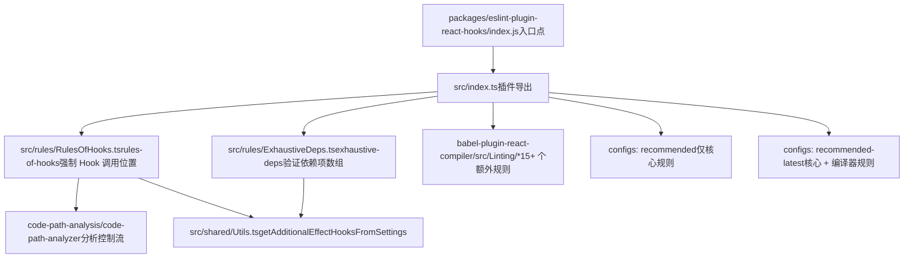
**来源：** [packages/eslint-plugin-react-hooks/index.js1](https://github.com/facebook/react/blob/65eec428/packages/eslint-plugin-react-hooks/index.js#L1-L1) [packages/eslint-plugin-react-hooks/README.md1-152](https://github.com/facebook/react/blob/65eec428/packages/eslint-plugin-react-hooks/README.md#L1-L152)

该插件可以在两种配置模式下使用：

| 配置类型 | 文件 | 用法 |
| --- | --- | --- |
| Flat Config (ESLint 9+) | `eslint.config.js` | `import reactHooks from 'eslint-plugin-react-hooks'` |
| 旧版配置 (Legacy Config) | `.eslintrc` | `"extends": ["plugin:react-hooks/recommended"]` |

**来源：** [packages/eslint-plugin-react-hooks/README.md17-53](https://github.com/facebook/react/blob/65eec428/packages/eslint-plugin-react-hooks/README.md#L17-L53)

## Rules of Hooks 规则

### 目的与检测策略

`rules-of-hooks` 规则强制要求 Hooks 只能在 React 组件或自定义 Hook 的顶层调用，绝不能在条件语句、循环或嵌套函数内部调用。它使用 ESLint 的代码路径分析（code path analysis）来检测条件分支或循环执行路径。

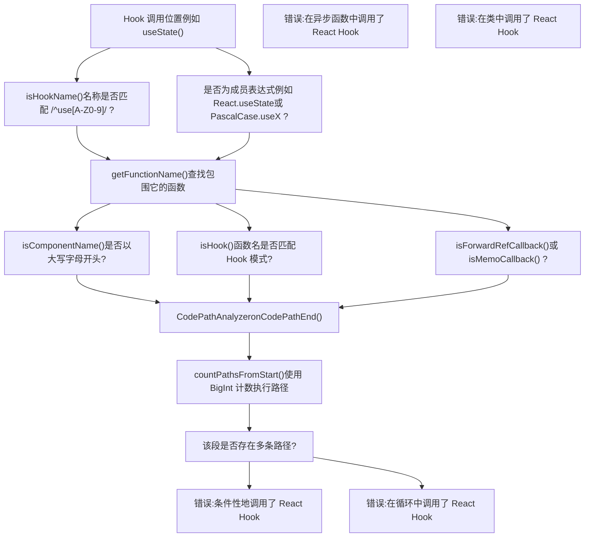
**来源：** [packages/eslint-plugin-react-hooks/src/rules/RulesOfHooks.ts29-51](https://github.com/facebook/react/blob/65eec428/packages/eslint-plugin-react-hooks/src/rules/RulesOfHooks.ts#L29-L51) [packages/eslint-plugin-react-hooks/src/rules/RulesOfHooks.ts306-565](https://github.com/facebook/react/blob/65eec428/packages/eslint-plugin-react-hooks/src/rules/RulesOfHooks.ts#L306-L565)

### Hook 识别逻辑

该规则通过函数名称的模式匹配来识别 Hook：

| 模式 | 示例 | 是否为 Hook ? |
| --- | --- | --- |
| `use[A-Z0-9].*` | `useState`, `useEffect`, `use3D` | 是 |
| `React.use[A-Z0-9].*` | `React.useState` | 是 |
| `PascalCase.use[A-Z0-9].*` | `MyLib.useCustom` | 是 |
| `use` (精确匹配) | `use` | 是 |
| `user.*` | `userFetch`, `user.name` | 否 |
| `_use.*` | `_useState` | 否 |

**来源：** [packages/eslint-plugin-react-hooks/src/rules/RulesOfHooks.ts26-31](https://github.com/facebook/react/blob/65eec428/packages/eslint-plugin-react-hooks/src/rules/RulesOfHooks.ts#L26-L31) [packages/eslint-plugin-react-hooks/src/rules/RulesOfHooks.ts37-51](https://github.com/facebook/react/blob/65eec428/packages/eslint-plugin-react-hooks/src/rules/RulesOfHooks.ts#L37-L51)

### 组件与 Hook 检测

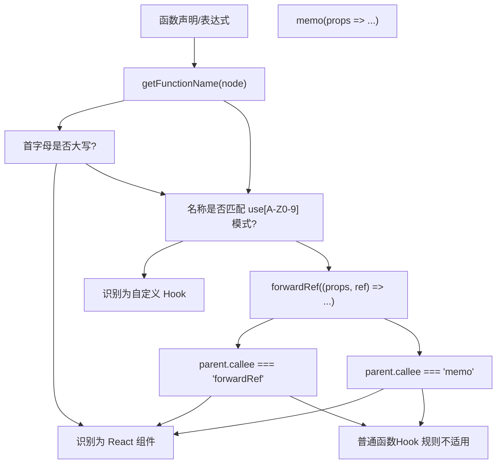
**来源：** [packages/eslint-plugin-react-hooks/src/rules/RulesOfHooks.ts54-96](https://github.com/facebook/react/blob/65eec428/packages/eslint-plugin-react-hooks/src/rules/RulesOfHooks.ts#L54-L96) [packages/eslint-plugin-react-hooks/src/rules/RulesOfHooks.ts98-112](https://github.com/facebook/react/blob/65eec428/packages/eslint-plugin-react-hooks/src/rules/RulesOfHooks.ts#L98-L112)

### 使用 BigInt 的代码路径分析

该规则使用了一套复杂的代码路径分析系统，利用 `BigInt` 计数执行路径，以处理复杂的控制流而不会出现数值溢出：

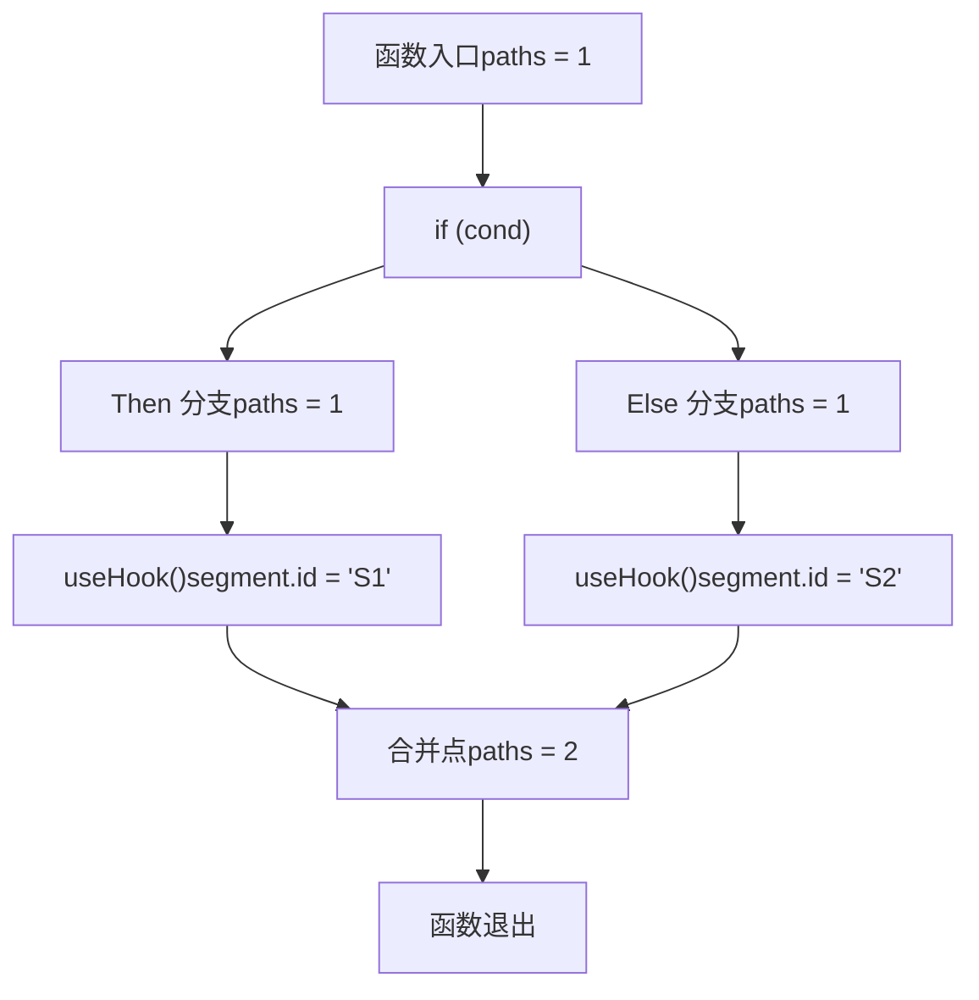
在 `countPathsFromStart()` 和 `countPathsToEnd()` 中实现的算法：

1.  **缓存**：每个分段（segment）的路径计数使用 `Map<string, bigint>` 进行缓存。
2.  **循环检测**：在 `pathHistory: Set<string>` 中跟踪已访问的分段以检测循环。
3.  **路径计数**：递归累加来自所有前置/后继分段的路径。
4.  **验证**：检查是否 `countPathsFromStart(segment) * countPathsToEnd(segment) !== allPathsFromStartToEnd`。

**来源：** [packages/eslint-plugin-react-hooks/src/rules/RulesOfHooks.ts314-455](https://github.com/facebook/react/blob/65eec428/packages/eslint-plugin-react-hooks/src/rules/RulesOfHooks.ts#L314-L455)

### 特殊情况：useEffectEvent 与 use()

该规则对 React 19+ 的 API 进行了特殊处理：

| API | 行为 | 规则 |
| --- | --- | --- |
| `useEffectEvent()` | 返回可在 effect 中调用的函数 | 可以在 effect 中条件性地调用 |
| `use()` | 在 Promise 上挂起 | 可以在任何地方条件性地调用 |
| `React.use()` | 与 `use()` 相同 | 可以在任何地方条件性地调用 |

**来源：** [packages/eslint-plugin-react-hooks/src/rules/RulesOfHooks.ts170-172](https://github.com/facebook/react/blob/65eec428/packages/eslint-plugin-react-hooks/src/rules/RulesOfHooks.ts#L170-L172) [packages/eslint-plugin-react-hooks/src/rules/RulesOfHooks.ts190-192](https://github.com/facebook/react/blob/65eec428/packages/eslint-plugin-react-hooks/src/rules/RulesOfHooks.ts#L190-L192) [packages/eslint-plugin-react-hooks/src/rules/RulesOfHooks.ts564-756](https://github.com/facebook/react/blob/65eec428/packages/eslint-plugin-react-hooks/src/rules/RulesOfHooks.ts#L564-L756)

`useEffectEvent` 验证确保 Event 函数只能在 effect 内部调用：

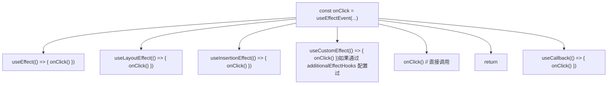
**来源：** [packages/eslint-plugin-react-hooks/src/rules/RulesOfHooks.ts226-250](https://github.com/facebook/react/blob/65eec428/packages/eslint-plugin-react-hooks/src/rules/RulesOfHooks.ts#L226-L250) [packages/eslint-plugin-react-hooks/src/rules/RulesOfHooks.ts757-906](https://github.com/facebook/react/blob/65eec428/packages/eslint-plugin-react-hooks/src/rules/RulesOfHooks.ts#L757-L906)

## Exhaustive Dependencies 规则

### 目的与架构

`exhaustive-deps` 规则验证 Hook 依赖项数组（针对 `useEffect`, `useCallback`, `useMemo` 等）是否包含了 Hook 回调内部引用的来自组件作用域的所有值。它执行静态分析以检测缺失、不必要或过时的依赖项。

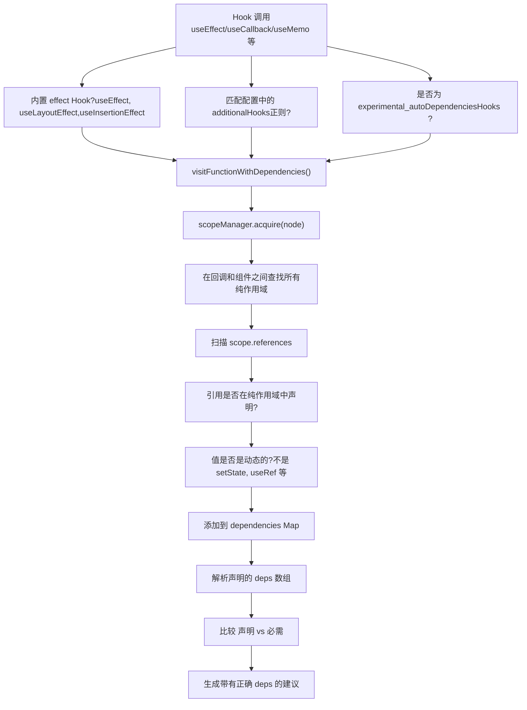
**来源：** [packages/eslint-plugin-react-hooks/src/rules/ExhaustiveDeps.ts79-124](https://github.com/facebook/react/blob/65eec428/packages/eslint-plugin-react-hooks/src/rules/ExhaustiveDeps.ts#L79-L124) [packages/eslint-plugin-react-hooks/src/rules/ExhaustiveDeps.ts182-248](https://github.com/facebook/react/blob/65eec428/packages/eslint-plugin-react-hooks/src/rules/ExhaustiveDeps.ts#L182-L248)

### 依赖项分类

该规则将依赖项分为稳定值和动态值：

| 值类型 | 示例 | 是否稳定? | 原因 |
| --- | --- | --- | --- |
| `useState` 的 `setState` | `const [x, setX] = useState()` | 是 | React 保证其身份（identity）稳定 |
| `useReducer` 的 `dispatch` | `const [x, d] = useReducer()` | 是 | React 保证其身份稳定 |
| `useActionState` 的 `dispatch` | `const [x, d] = useActionState()` | 是 | React 保证其身份稳定 |
| `useTransition` 的 `startTransition` | `const [p, st] = useTransition()` | 是 | React 保证其身份稳定 |
| `useRef` 的 `ref` | `const ref = useRef()` | 是 | `.current` 是可变的 |
| `useEffectEvent` 的 Event | `const e = useEffectEvent()` | 是 | 不应包含在 deps 中 |
| 基元字面量 | `const x = 42` | 是 | 常量值 |
| 状态变量 | `const [x, _] = useState()` | 否 | 在渲染时会改变 |
| Props | `function MyComponent(props)` | 否 | 可能改变 |
| 其他变量 | `const x = someFunc()` | 否 | 假定为动态的 |

**来源：** [packages/eslint-plugin-react-hooks/src/rules/ExhaustiveDeps.ts254-404](https://github.com/facebook/react/blob/65eec428/packages/eslint-plugin-react-hooks/src/rules/ExhaustiveDeps.ts#L254-L404)

### 稳定值检测逻辑

`isStableKnownHookValue()` 函数实现了一个记忆化检查：

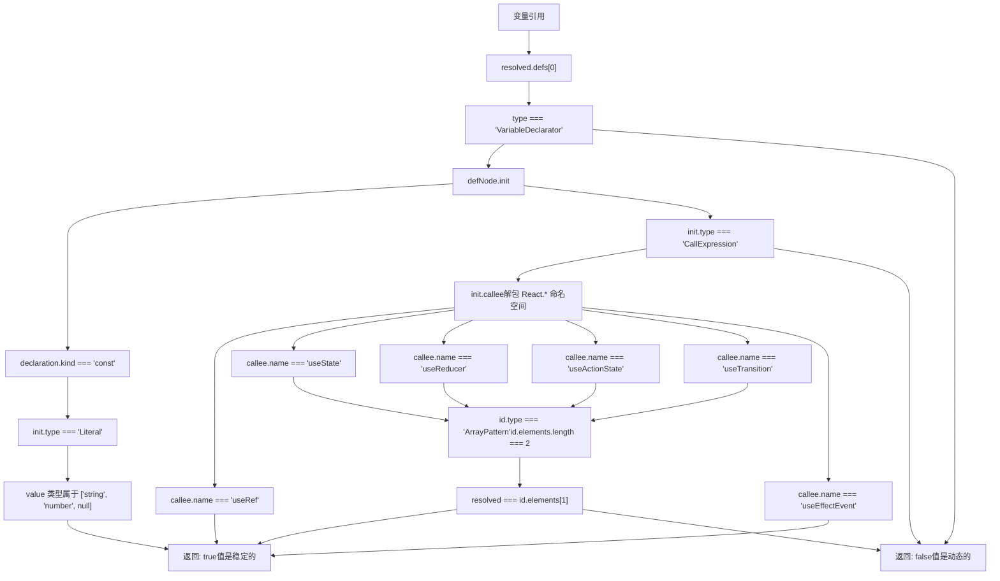
**来源：** [packages/eslint-plugin-react-hooks/src/rules/ExhaustiveDeps.ts267-404](https://github.com/facebook/react/blob/65eec428/packages/eslint-plugin-react-hooks/src/rules/ExhaustiveDeps.ts#L267-L404)

### 作用域与纯作用域（Pure Scope）分析

该规则识别“纯作用域”——即在每次渲染时都会重新执行的作用域，其中的依赖项可能会变得过时：

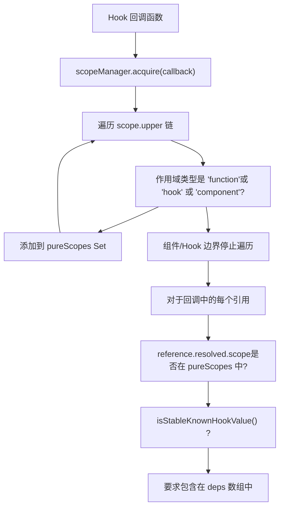
**来源：** [packages/eslint-plugin-react-hooks/src/rules/ExhaustiveDeps.ts216-248](https://github.com/facebook/react/blob/65eec428/packages/eslint-plugin-react-hooks/src/rules/ExhaustiveDeps.ts#L216-L248)

### 依赖树构建

对于带有属性访问的复杂对象，该规则会构建一棵依赖树：

| 代码模式 | 依赖树 | 必需的 deps |
| --- | --- | --- |
| `obj.foo` | `{obj: {foo: {isUsed: true}}}` | `obj.foo` 或 `obj` |
| `obj.foo.bar` | `{obj: {foo: {bar: {isUsed: true}}}}` | `obj.foo.bar`, `obj.foo`, 或 `obj` |
| `obj.foo` 和 `obj.bar` | `{obj: {foo: {isUsed: true}, bar: {isUsed: true}}}` | `obj` (覆盖两者) |
| `obj?.foo` | `{obj: {foo: {isUsed: true}}}` | `obj.foo` 或 `obj` |

该树结构使用 `DependencyTreeNode`：

```
type DependencyTreeNode = {
  isUsed: boolean;              // 如果在代码中被访问则为 true
  isSatisfiedRecursively: boolean;  // 如果在 deps 中则为 true
  isSubtreeUsed: boolean;       // 如果有任何子节点被使用则为 true
  children: Map<string, DependencyTreeNode>;
};
```
**来源：** [packages/eslint-plugin-react-hooks/src/rules/ExhaustiveDeps.ts36-41](https://github.com/facebook/react/blob/65eec428/packages/eslint-plugin-react-hooks/src/rules/ExhaustiveDeps.ts#L36-L41)

### 错误报告与建议

该规则提供了详细的错误消息以及自动修复建议：

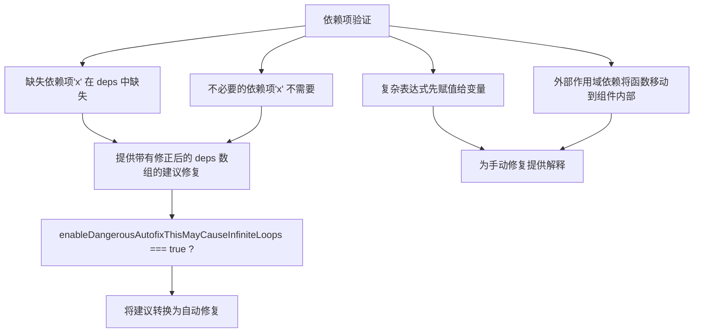
**来源：** [packages/eslint-plugin-react-hooks/src/rules/ExhaustiveDeps.ts111-124](https://github.com/facebook/react/blob/65eec428/packages/eslint-plugin-react-hooks/src/rules/ExhaustiveDeps.ts#L111-L124)

### 配置选项

该规则接受几个配置选项：

| 选项 | 类型 | 目的 | 默认值 |
| --- | --- | --- | --- |
| `additionalHooks` | `string` (正则) | 匹配需要验证的自定义 Hook 的模式 | `undefined` |
| `enableDangerousAutofixThisMayCauseInfiniteLoops` | `boolean` | 启用自动修复而非仅提供建议 | `false` |
| `experimental_autoDependenciesHooks` | `string[]` | 带有自动依赖跟踪功能的 Hook | `[]` |
| `requireExplicitEffectDeps` | `boolean` | 即便是自动跟踪的 Hook 也要求显式声明 deps | `false` |

**来源：** [packages/eslint-plugin-react-hooks/src/rules/ExhaustiveDeps.ts54-77](https://github.com/facebook/react/blob/65eec428/packages/eslint-plugin-react-hooks/src/rules/ExhaustiveDeps.ts#L54-L77) [packages/eslint-plugin-react-hooks/src/rules/ExhaustiveDeps.ts79-109](https://github.com/facebook/react/blob/65eec428/packages/eslint-plugin-react-hooks/src/rules/ExhaustiveDeps.ts#L79-L109)

此外，该插件支持通过 `settings['react-hooks'].additionalEffectHooks` 进行共享设置：

**来源：** [packages/eslint-plugin-react-hooks/src/shared/Utils.ts10-22](https://github.com/facebook/react/blob/65eec428/packages/eslint-plugin-react-hooks/src/shared/Utils.ts#L10-L22)

## 发布与配置

### 包结构

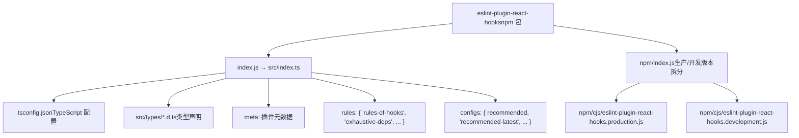
**来源：** [packages/eslint-plugin-react-hooks/index.js1](https://github.com/facebook/react/blob/65eec428/packages/eslint-plugin-react-hooks/index.js#L1-L1) [packages/eslint-plugin-react-hooks/npm/index.js1-26](https://github.com/facebook/react/blob/65eec428/packages/eslint-plugin-react-hooks/npm/index.js#L1-L26)

### 配置预设 (Presets)

该插件提供了两个主要的配置预设：

| 预设 | 启用的规则 | 用例 |
| --- | --- | --- |
| `recommended` | `rules-of-hooks`: error<br>`exhaustive-deps`: warn | 核心 React Hooks 规则的生产环境使用 |
| `recommended-latest` | 所有 `recommended` 规则<br>+ React 编译器规则 | 实验性的 React 编译器支持 |

两个预设都提供了平面配置（flat config）和旧版配置格式。

**来源：** [packages/eslint-plugin-react-hooks/README.md19-41](https://github.com/facebook/react/blob/65eec428/packages/eslint-plugin-react-hooks/README.md#L19-L41) [packages/eslint-plugin-react-hooks/CHANGELOG.md8-12](https://github.com/facebook/react/blob/65eec428/packages/eslint-plugin-react-hooks/CHANGELOG.md#L8-L12)

### 版本历史与破坏性更改

主要版本里程碑：

| 版本 | 关键更改 |
| --- | --- |
| 7.0.0 | 移除了旧版预设，默认启用所有编译器规则 |
| 6.1.0 | 要求 Node.js 18+，默认使用平面配置 |
| 5.0.0 | 组件名称必须以大写字母开头（不仅是非小写） |
| 4.0.0 | 检查 `PascalCase.useFoo()` 调用，检查回调主体 |
| 3.0.0 | 禁止从类（classes）中调用 Hooks |

**来源：** [packages/eslint-plugin-react-hooks/CHANGELOG.md1-161](https://github.com/facebook/react/blob/65eec428/packages/eslint-plugin-react-hooks/CHANGELOG.md#L1-L161)

最近的新增内容包括：

-   `useEffectEvent` 验证 (React 19)
-   `use()` 条件调用支持 (React 19)
-   基于 settings 的 `additionalEffectHooks` 配置
-   Flow 组件/hook 语法支持

**来源：** [packages/eslint-plugin-react-hooks/CHANGELOG.md14-34](https://github.com/facebook/react/blob/65eec428/packages/eslint-plugin-react-hooks/CHANGELOG.md#L14-L34)

### 高级配置示例

对于具有自定义 effect Hook 的项目：

```
// eslint.config.js (flat config)
export default [{
  settings: {
    'react-hooks': {
      additionalEffectHooks: '(useMyEffect|useServerEffect)',
    },
  },
  rules: {
    'react-hooks/rules-of-hooks': 'error',
    'react-hooks/exhaustive-deps': ['warn', {
      additionalHooks: '(useMyCustomHook|useAnotherHook)',
    }],
  },
}];
```
**来源：** [packages/eslint-plugin-react-hooks/README.md128-145](https://github.com/facebook/react/blob/65eec428/packages/eslint-plugin-react-hooks/README.md#L128-L145)

## 代码路径分析基础设施

规则依赖于 ESLint 内部的代码路径分析，包装在一个自定义的 `CodePathAnalyzer` 中：

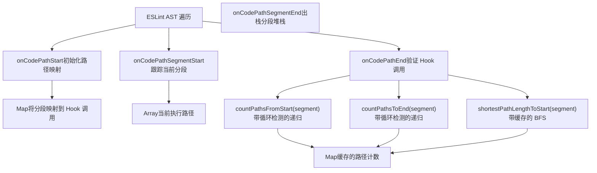
**来源：** [packages/eslint-plugin-react-hooks/src/rules/RulesOfHooks.ts290-301](https://github.com/facebook/react/blob/65eec428/packages/eslint-plugin-react-hooks/src/rules/RulesOfHooks.ts#L290-L301)

该分析器维护：

-   **代码路径映射堆栈**：`Array<Map<CodePathSegment, Array<Node>>>` —— 每个代码路径一个映射。
-   **分段堆栈**：`Array<CodePathSegment>` —— 遍历期间的当前位置。
-   **路径计数缓存**：`Map<string, bigint>` —— 为了性能而记忆化的路径计数。

**来源：** [packages/eslint-plugin-react-hooks/src/rules/RulesOfHooks.ts221-224](https://github.com/facebook/react/blob/65eec428/packages/eslint-plugin-react-hooks/src/rules/RulesOfHooks.ts#L221-L224) [packages/eslint-plugin-react-hooks/src/rules/RulesOfHooks.ts514-516](https://github.com/facebook/react/blob/65eec428/packages/eslint-plugin-react-hooks/src/rules/RulesOfHooks.ts#L514-L516)

### 针对大型控制流使用 BigInt

该插件使用 `BigInt` 而非 `Number` 来处理具有许多条件分支的组件，以防止溢出：

```
// 示例：具有 40+ 条件的组件会产生 2^40+ 条路径
// 使用 Number 会在 2^53 处溢出
// BigInt 可以处理任意精度
let paths = BigInt('0');
for (const prevSegment of segment.prevSegments) {
  paths += countPathsFromStart(prevSegment, pathList);
}
```
**来源：** [packages/eslint-plugin-react-hooks/src/rules/RulesOfHooks.ts341-388](https://github.com/facebook/react/blob/65eec428/packages/eslint-plugin-react-hooks/src/rules/RulesOfHooks.ts#L341-L388)

这可以防止在大型组件中出现漏报（false negatives），否则数值溢出可能会导致算法错误地将条件性的 Hook 调用分类为非条件性的。

**来源：** [packages/eslint-plugin-react-hooks/\_\_tests\_\_/ESLintRulesOfHooks-test.js412-481](https://github.com/facebook/react/blob/65eec428/packages/eslint-plugin-react-hooks/__tests__/ESLintRulesOfHooks-test.js#L412-L481)
