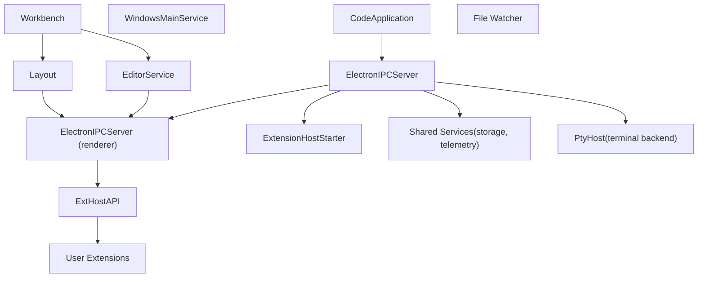
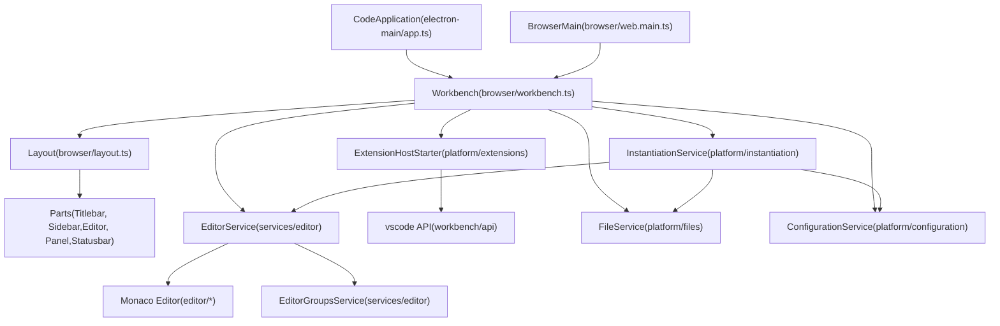
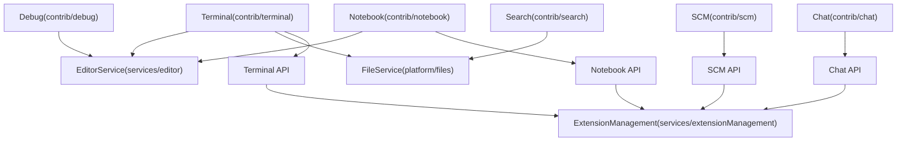
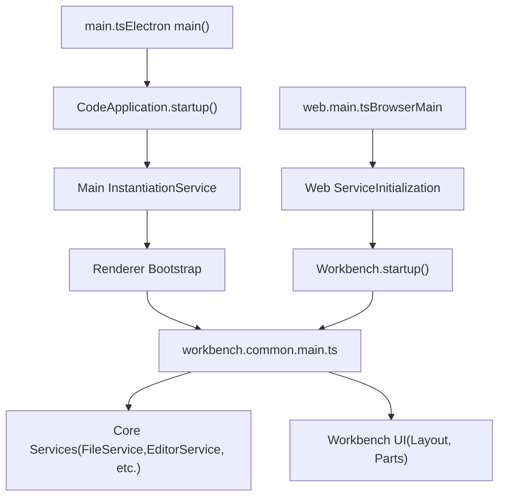
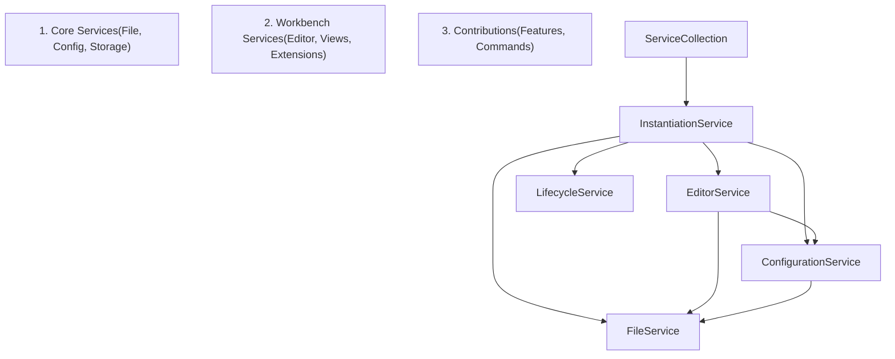

# Overview

Relevant source files

-   [.npmrc](https://github.com/microsoft/vscode/blob/1be3088d/.npmrc)
-   [.nvmrc](https://github.com/microsoft/vscode/blob/1be3088d/.nvmrc)
-   [build/.moduleignore](https://github.com/microsoft/vscode/blob/1be3088d/build/.moduleignore)
-   [build/.webignore](https://github.com/microsoft/vscode/blob/1be3088d/build/.webignore)
-   [build/azure-pipelines/linux/setup-env.sh](https://github.com/microsoft/vscode/blob/1be3088d/build/azure-pipelines/linux/setup-env.sh)
-   [build/checksums/electron.txt](https://github.com/microsoft/vscode/blob/1be3088d/build/checksums/electron.txt)
-   [build/checksums/nodejs.txt](https://github.com/microsoft/vscode/blob/1be3088d/build/checksums/nodejs.txt)
-   [build/lib/i18n.resources.json](https://github.com/microsoft/vscode/blob/1be3088d/build/lib/i18n.resources.json)
-   [build/linux/dependencies-generator.ts](https://github.com/microsoft/vscode/blob/1be3088d/build/linux/dependencies-generator.ts)
-   [build/npm/gyp/package-lock.json](https://github.com/microsoft/vscode/blob/1be3088d/build/npm/gyp/package-lock.json)
-   [build/package-lock.json](https://github.com/microsoft/vscode/blob/1be3088d/build/package-lock.json)
-   [build/package.json](https://github.com/microsoft/vscode/blob/1be3088d/build/package.json)
-   [cgmanifest.json](https://github.com/microsoft/vscode/blob/1be3088d/cgmanifest.json)
-   [cli/src/bin/code/legacy\_args.rs](https://github.com/microsoft/vscode/blob/1be3088d/cli/src/bin/code/legacy_args.rs)
-   [eslint.config.js](https://github.com/microsoft/vscode/blob/1be3088d/eslint.config.js)
-   [extensions/git/package-lock.json](https://github.com/microsoft/vscode/blob/1be3088d/extensions/git/package-lock.json)
-   [extensions/github-authentication/package-lock.json](https://github.com/microsoft/vscode/blob/1be3088d/extensions/github-authentication/package-lock.json)
-   [extensions/notebook-renderers/package-lock.json](https://github.com/microsoft/vscode/blob/1be3088d/extensions/notebook-renderers/package-lock.json)
-   [extensions/package-lock.json](https://github.com/microsoft/vscode/blob/1be3088d/extensions/package-lock.json)
-   [extensions/package.json](https://github.com/microsoft/vscode/blob/1be3088d/extensions/package.json)
-   [package-lock.json](https://github.com/microsoft/vscode/blob/1be3088d/package-lock.json)
-   [package.json](https://github.com/microsoft/vscode/blob/1be3088d/package.json)
-   [remote/.npmrc](https://github.com/microsoft/vscode/blob/1be3088d/remote/.npmrc)
-   [remote/package-lock.json](https://github.com/microsoft/vscode/blob/1be3088d/remote/package-lock.json)
-   [remote/package.json](https://github.com/microsoft/vscode/blob/1be3088d/remote/package.json)
-   [remote/web/package-lock.json](https://github.com/microsoft/vscode/blob/1be3088d/remote/web/package-lock.json)
-   [remote/web/package.json](https://github.com/microsoft/vscode/blob/1be3088d/remote/web/package.json)
-   [resources/completions/bash/code](https://github.com/microsoft/vscode/blob/1be3088d/resources/completions/bash/code)
-   [resources/completions/zsh/\_code](https://github.com/microsoft/vscode/blob/1be3088d/resources/completions/zsh/_code)
-   [src/vs/base/node/terminalEncoding.ts](https://github.com/microsoft/vscode/blob/1be3088d/src/vs/base/node/terminalEncoding.ts)
-   [src/vs/base/parts/contextmenu/electron-main/contextmenu.ts](https://github.com/microsoft/vscode/blob/1be3088d/src/vs/base/parts/contextmenu/electron-main/contextmenu.ts)
-   [src/vs/code/browser/workbench/workbench-dev.html](https://github.com/microsoft/vscode/blob/1be3088d/src/vs/code/browser/workbench/workbench-dev.html)
-   [src/vs/code/browser/workbench/workbench.html](https://github.com/microsoft/vscode/blob/1be3088d/src/vs/code/browser/workbench/workbench.html)
-   [src/vs/code/browser/workbench/workbench.ts](https://github.com/microsoft/vscode/blob/1be3088d/src/vs/code/browser/workbench/workbench.ts)
-   [src/vs/code/electron-main/app.ts](https://github.com/microsoft/vscode/blob/1be3088d/src/vs/code/electron-main/app.ts)
-   [src/vs/code/electron-main/main.ts](https://github.com/microsoft/vscode/blob/1be3088d/src/vs/code/electron-main/main.ts)
-   [src/vs/code/node/cli.ts](https://github.com/microsoft/vscode/blob/1be3088d/src/vs/code/node/cli.ts)
-   [src/vs/code/node/cliProcessMain.ts](https://github.com/microsoft/vscode/blob/1be3088d/src/vs/code/node/cliProcessMain.ts)
-   [src/vs/platform/action/common/action.ts](https://github.com/microsoft/vscode/blob/1be3088d/src/vs/platform/action/common/action.ts)
-   [src/vs/platform/actions/browser/actionViewItemService.ts](https://github.com/microsoft/vscode/blob/1be3088d/src/vs/platform/actions/browser/actionViewItemService.ts)
-   [src/vs/platform/actions/browser/menuEntryActionViewItem.css](https://github.com/microsoft/vscode/blob/1be3088d/src/vs/platform/actions/browser/menuEntryActionViewItem.css)
-   [src/vs/platform/actions/browser/menuEntryActionViewItem.ts](https://github.com/microsoft/vscode/blob/1be3088d/src/vs/platform/actions/browser/menuEntryActionViewItem.ts)
-   [src/vs/platform/actions/browser/toolbar.ts](https://github.com/microsoft/vscode/blob/1be3088d/src/vs/platform/actions/browser/toolbar.ts)
-   [src/vs/platform/actions/common/actions.ts](https://github.com/microsoft/vscode/blob/1be3088d/src/vs/platform/actions/common/actions.ts)
-   [src/vs/platform/actions/common/menuService.ts](https://github.com/microsoft/vscode/blob/1be3088d/src/vs/platform/actions/common/menuService.ts)
-   [src/vs/platform/editor/common/editor.ts](https://github.com/microsoft/vscode/blob/1be3088d/src/vs/platform/editor/common/editor.ts)
-   [src/vs/platform/environment/common/argv.ts](https://github.com/microsoft/vscode/blob/1be3088d/src/vs/platform/environment/common/argv.ts)
-   [src/vs/platform/environment/common/environment.ts](https://github.com/microsoft/vscode/blob/1be3088d/src/vs/platform/environment/common/environment.ts)
-   [src/vs/platform/environment/common/environmentService.ts](https://github.com/microsoft/vscode/blob/1be3088d/src/vs/platform/environment/common/environmentService.ts)
-   [src/vs/platform/environment/electron-main/environmentMainService.ts](https://github.com/microsoft/vscode/blob/1be3088d/src/vs/platform/environment/electron-main/environmentMainService.ts)
-   [src/vs/platform/environment/node/argv.ts](https://github.com/microsoft/vscode/blob/1be3088d/src/vs/platform/environment/node/argv.ts)
-   [src/vs/platform/environment/node/argvHelper.ts](https://github.com/microsoft/vscode/blob/1be3088d/src/vs/platform/environment/node/argvHelper.ts)
-   [src/vs/platform/environment/node/environmentService.ts](https://github.com/microsoft/vscode/blob/1be3088d/src/vs/platform/environment/node/environmentService.ts)
-   [src/vs/platform/environment/node/stdin.ts](https://github.com/microsoft/vscode/blob/1be3088d/src/vs/platform/environment/node/stdin.ts)
-   [src/vs/platform/environment/test/node/nativeModules.integrationTest.ts](https://github.com/microsoft/vscode/blob/1be3088d/src/vs/platform/environment/test/node/nativeModules.integrationTest.ts)
-   [src/vs/platform/extensionManagement/common/extensionManagementCLI.ts](https://github.com/microsoft/vscode/blob/1be3088d/src/vs/platform/extensionManagement/common/extensionManagementCLI.ts)
-   [src/vs/platform/observable/common/platformObservableUtils.ts](https://github.com/microsoft/vscode/blob/1be3088d/src/vs/platform/observable/common/platformObservableUtils.ts)
-   [src/vs/server/node/remoteExtensionHostAgentCli.ts](https://github.com/microsoft/vscode/blob/1be3088d/src/vs/server/node/remoteExtensionHostAgentCli.ts)
-   [src/vs/server/node/server.cli.ts](https://github.com/microsoft/vscode/blob/1be3088d/src/vs/server/node/server.cli.ts)
-   [src/vs/server/node/serverEnvironmentService.ts](https://github.com/microsoft/vscode/blob/1be3088d/src/vs/server/node/serverEnvironmentService.ts)
-   [src/vs/server/node/serverServices.ts](https://github.com/microsoft/vscode/blob/1be3088d/src/vs/server/node/serverServices.ts)
-   [src/vs/workbench/browser/actions/layoutActions.ts](https://github.com/microsoft/vscode/blob/1be3088d/src/vs/workbench/browser/actions/layoutActions.ts)
-   [src/vs/workbench/browser/actions/quickAccessActions.ts](https://github.com/microsoft/vscode/blob/1be3088d/src/vs/workbench/browser/actions/quickAccessActions.ts)
-   [src/vs/workbench/browser/contextkeys.ts](https://github.com/microsoft/vscode/blob/1be3088d/src/vs/workbench/browser/contextkeys.ts)
-   [src/vs/workbench/browser/dnd.ts](https://github.com/microsoft/vscode/blob/1be3088d/src/vs/workbench/browser/dnd.ts)
-   [src/vs/workbench/browser/layout.ts](https://github.com/microsoft/vscode/blob/1be3088d/src/vs/workbench/browser/layout.ts)
-   [src/vs/workbench/browser/parts/auxiliarybar/auxiliaryBarActions.ts](https://github.com/microsoft/vscode/blob/1be3088d/src/vs/workbench/browser/parts/auxiliarybar/auxiliaryBarActions.ts)
-   [src/vs/workbench/browser/parts/editor/auxiliaryEditorPart.ts](https://github.com/microsoft/vscode/blob/1be3088d/src/vs/workbench/browser/parts/editor/auxiliaryEditorPart.ts)
-   [src/vs/workbench/browser/parts/editor/editor.contribution.ts](https://github.com/microsoft/vscode/blob/1be3088d/src/vs/workbench/browser/parts/editor/editor.contribution.ts)
-   [src/vs/workbench/browser/parts/editor/editor.ts](https://github.com/microsoft/vscode/blob/1be3088d/src/vs/workbench/browser/parts/editor/editor.ts)
-   [src/vs/workbench/browser/parts/editor/editorActions.ts](https://github.com/microsoft/vscode/blob/1be3088d/src/vs/workbench/browser/parts/editor/editorActions.ts)
-   [src/vs/workbench/browser/parts/editor/editorCommands.ts](https://github.com/microsoft/vscode/blob/1be3088d/src/vs/workbench/browser/parts/editor/editorCommands.ts)
-   [src/vs/workbench/browser/parts/editor/editorDropTarget.ts](https://github.com/microsoft/vscode/blob/1be3088d/src/vs/workbench/browser/parts/editor/editorDropTarget.ts)
-   [src/vs/workbench/browser/parts/editor/editorGroupView.ts](https://github.com/microsoft/vscode/blob/1be3088d/src/vs/workbench/browser/parts/editor/editorGroupView.ts)
-   [src/vs/workbench/browser/parts/editor/editorPart.ts](https://github.com/microsoft/vscode/blob/1be3088d/src/vs/workbench/browser/parts/editor/editorPart.ts)
-   [src/vs/workbench/browser/parts/editor/editorParts.ts](https://github.com/microsoft/vscode/blob/1be3088d/src/vs/workbench/browser/parts/editor/editorParts.ts)
-   [src/vs/workbench/browser/parts/panel/panelActions.ts](https://github.com/microsoft/vscode/blob/1be3088d/src/vs/workbench/browser/parts/panel/panelActions.ts)
-   [src/vs/workbench/browser/parts/titlebar/commandCenterControl.ts](https://github.com/microsoft/vscode/blob/1be3088d/src/vs/workbench/browser/parts/titlebar/commandCenterControl.ts)
-   [src/vs/workbench/browser/parts/titlebar/media/titlebarpart.css](https://github.com/microsoft/vscode/blob/1be3088d/src/vs/workbench/browser/parts/titlebar/media/titlebarpart.css)
-   [src/vs/workbench/browser/parts/titlebar/titlebarActions.ts](https://github.com/microsoft/vscode/blob/1be3088d/src/vs/workbench/browser/parts/titlebar/titlebarActions.ts)
-   [src/vs/workbench/browser/parts/titlebar/titlebarPart.ts](https://github.com/microsoft/vscode/blob/1be3088d/src/vs/workbench/browser/parts/titlebar/titlebarPart.ts)
-   [src/vs/workbench/browser/parts/titlebar/windowTitle.ts](https://github.com/microsoft/vscode/blob/1be3088d/src/vs/workbench/browser/parts/titlebar/windowTitle.ts)
-   [src/vs/workbench/browser/web.api.ts](https://github.com/microsoft/vscode/blob/1be3088d/src/vs/workbench/browser/web.api.ts)
-   [src/vs/workbench/browser/web.factory.ts](https://github.com/microsoft/vscode/blob/1be3088d/src/vs/workbench/browser/web.factory.ts)
-   [src/vs/workbench/browser/web.main.ts](https://github.com/microsoft/vscode/blob/1be3088d/src/vs/workbench/browser/web.main.ts)
-   [src/vs/workbench/browser/workbench.contribution.ts](https://github.com/microsoft/vscode/blob/1be3088d/src/vs/workbench/browser/workbench.contribution.ts)
-   [src/vs/workbench/browser/workbench.ts](https://github.com/microsoft/vscode/blob/1be3088d/src/vs/workbench/browser/workbench.ts)
-   [src/vs/workbench/common/contextkeys.ts](https://github.com/microsoft/vscode/blob/1be3088d/src/vs/workbench/common/contextkeys.ts)
-   [src/vs/workbench/common/editor.ts](https://github.com/microsoft/vscode/blob/1be3088d/src/vs/workbench/common/editor.ts)
-   [src/vs/workbench/contrib/chat/browser/widget/chatContentParts/chatInlineAnchorWidget.ts](https://github.com/microsoft/vscode/blob/1be3088d/src/vs/workbench/contrib/chat/browser/widget/chatContentParts/chatInlineAnchorWidget.ts)
-   [src/vs/workbench/contrib/chat/browser/widget/chatContentParts/chatMarkdownDecorationsRenderer.ts](https://github.com/microsoft/vscode/blob/1be3088d/src/vs/workbench/contrib/chat/browser/widget/chatContentParts/chatMarkdownDecorationsRenderer.ts)
-   [src/vs/workbench/contrib/chat/browser/widget/chatContentParts/media/chatInlineAnchorWidget.css](https://github.com/microsoft/vscode/blob/1be3088d/src/vs/workbench/contrib/chat/browser/widget/chatContentParts/media/chatInlineAnchorWidget.css)
-   [src/vs/workbench/contrib/chat/browser/widget/media/chatViewWelcome.css](https://github.com/microsoft/vscode/blob/1be3088d/src/vs/workbench/contrib/chat/browser/widget/media/chatViewWelcome.css)
-   [src/vs/workbench/contrib/debug/browser/statusbarColorProvider.ts](https://github.com/microsoft/vscode/blob/1be3088d/src/vs/workbench/contrib/debug/browser/statusbarColorProvider.ts)
-   [src/vs/workbench/electron-browser/desktop.main.ts](https://github.com/microsoft/vscode/blob/1be3088d/src/vs/workbench/electron-browser/desktop.main.ts)
-   [src/vs/workbench/services/actions/common/menusExtensionPoint.ts](https://github.com/microsoft/vscode/blob/1be3088d/src/vs/workbench/services/actions/common/menusExtensionPoint.ts)
-   [src/vs/workbench/services/editor/browser/editorService.ts](https://github.com/microsoft/vscode/blob/1be3088d/src/vs/workbench/services/editor/browser/editorService.ts)
-   [src/vs/workbench/services/editor/common/editorGroupsService.ts](https://github.com/microsoft/vscode/blob/1be3088d/src/vs/workbench/services/editor/common/editorGroupsService.ts)
-   [src/vs/workbench/services/editor/common/editorService.ts](https://github.com/microsoft/vscode/blob/1be3088d/src/vs/workbench/services/editor/common/editorService.ts)
-   [src/vs/workbench/services/editor/test/browser/editorGroupsService.test.ts](https://github.com/microsoft/vscode/blob/1be3088d/src/vs/workbench/services/editor/test/browser/editorGroupsService.test.ts)
-   [src/vs/workbench/services/editor/test/browser/editorService.test.ts](https://github.com/microsoft/vscode/blob/1be3088d/src/vs/workbench/services/editor/test/browser/editorService.test.ts)
-   [src/vs/workbench/services/environment/browser/environmentService.ts](https://github.com/microsoft/vscode/blob/1be3088d/src/vs/workbench/services/environment/browser/environmentService.ts)
-   [src/vs/workbench/services/environment/common/environmentService.ts](https://github.com/microsoft/vscode/blob/1be3088d/src/vs/workbench/services/environment/common/environmentService.ts)
-   [src/vs/workbench/services/environment/electron-browser/environmentService.ts](https://github.com/microsoft/vscode/blob/1be3088d/src/vs/workbench/services/environment/electron-browser/environmentService.ts)
-   [src/vs/workbench/services/extensions/electron-browser/nativeExtensionService.ts](https://github.com/microsoft/vscode/blob/1be3088d/src/vs/workbench/services/extensions/electron-browser/nativeExtensionService.ts)
-   [src/vs/workbench/services/layout/browser/layoutService.ts](https://github.com/microsoft/vscode/blob/1be3088d/src/vs/workbench/services/layout/browser/layoutService.ts)
-   [src/vs/workbench/test/browser/workbenchTestServices.ts](https://github.com/microsoft/vscode/blob/1be3088d/src/vs/workbench/test/browser/workbenchTestServices.ts)
-   [src/vs/workbench/workbench.common.main.ts](https://github.com/microsoft/vscode/blob/1be3088d/src/vs/workbench/workbench.common.main.ts)
-   [src/vs/workbench/workbench.desktop.main.ts](https://github.com/microsoft/vscode/blob/1be3088d/src/vs/workbench/workbench.desktop.main.ts)
-   [src/vs/workbench/workbench.web.main.ts](https://github.com/microsoft/vscode/blob/1be3088d/src/vs/workbench/workbench.web.main.ts)
-   [test/automation/package-lock.json](https://github.com/microsoft/vscode/blob/1be3088d/test/automation/package-lock.json)
-   [test/automation/package.json](https://github.com/microsoft/vscode/blob/1be3088d/test/automation/package.json)
-   [test/integration/browser/package-lock.json](https://github.com/microsoft/vscode/blob/1be3088d/test/integration/browser/package-lock.json)
-   [test/integration/browser/package.json](https://github.com/microsoft/vscode/blob/1be3088d/test/integration/browser/package.json)
-   [test/smoke/package-lock.json](https://github.com/microsoft/vscode/blob/1be3088d/test/smoke/package-lock.json)
-   [test/smoke/package.json](https://github.com/microsoft/vscode/blob/1be3088d/test/smoke/package.json)
-   [test/smoke/src/areas/accessibility/accessibility.test.ts](https://github.com/microsoft/vscode/blob/1be3088d/test/smoke/src/areas/accessibility/accessibility.test.ts)

**Purpose**: This document introduces VS Code's overall architecture, explaining the multi-process structure, core platform components, and major subsystems. It provides a roadmap to the rest of the wiki and establishes fundamental architectural concepts used throughout the codebase.

**Scope**: High-level architectural patterns, process model, and key subsystems. For specific subsystems, refer to their dedicated pages: build system ([#2](https://github.com/microsoft/vscode/blob/1be3088d/#2)), application lifecycle ([#3](https://github.com/microsoft/vscode/blob/1be3088d/#3)), Monaco Editor ([#4](https://github.com/microsoft/vscode/blob/1be3088d/#4)), Workbench ([#5](https://github.com/microsoft/vscode/blob/1be3088d/#5)), Extension System ([#6](https://github.com/microsoft/vscode/blob/1be3088d/#6)), Terminal ([#7](https://github.com/microsoft/vscode/blob/1be3088d/#7)), Chat ([#8](https://github.com/microsoft/vscode/blob/1be3088d/#8)), Notebooks ([#9](https://github.com/microsoft/vscode/blob/1be3088d/#9)), SCM ([#10](https://github.com/microsoft/vscode/blob/1be3088d/#10)), and Git ([#11](https://github.com/microsoft/vscode/blob/1be3088d/#11)).

---

## Multi-Process Architecture

VS Code runs as multiple coordinated processes to ensure stability, security, and extensibility. Extensions run in isolated processes, preventing them from crashing the main UI or accessing sensitive resources directly.

### Process Architecture Diagram

**Sources**: [src/vs/code/electron-main/app.ts132-629](https://github.com/microsoft/vscode/blob/1be3088d/src/vs/code/electron-main/app.ts#L132-L629) [src/vs/workbench/browser/workbench.ts](https://github.com/microsoft/vscode/blob/1be3088d/src/vs/workbench/browser/workbench.ts) [src/vs/platform/extensions/electron-main/extensionHostStarter.ts](https://github.com/microsoft/vscode/blob/1be3088d/src/vs/platform/extensions/electron-main/extensionHostStarter.ts)

### Key Processes

| Process | Entry Point | Primary Responsibilities |
| --- | --- | --- |
| **Main Process** | `CodeApplication` in [src/vs/code/electron-main/app.ts132](https://github.com/microsoft/vscode/blob/1be3088d/src/vs/code/electron-main/app.ts#L132-L132) | Window management, native menus, protocol handling, process lifecycle |
| **Renderer Process** | `Workbench` in [src/vs/workbench/browser/workbench.ts](https://github.com/microsoft/vscode/blob/1be3088d/src/vs/workbench/browser/workbench.ts) | UI rendering, editor management, view layout |
| **Extension Host** | `ExtensionHostStarter` in [src/vs/platform/extensions/electron-main/extensionHostStarter.ts](https://github.com/microsoft/vscode/blob/1be3088d/src/vs/platform/extensions/electron-main/extensionHostStarter.ts) | Isolated extension execution, API surface |
| **Shared Process** | `SharedProcess` in [src/vs/platform/sharedProcess/electron-main/sharedProcess.ts](https://github.com/microsoft/vscode/blob/1be3088d/src/vs/platform/sharedProcess/electron-main/sharedProcess.ts) | Storage, telemetry, extension scanning |
| **PTY Host** | `PtyHostService` in [src/vs/platform/terminal/node/ptyHostService.ts](https://github.com/microsoft/vscode/blob/1be3088d/src/vs/platform/terminal/node/ptyHostService.ts) | Terminal process management |

**Sources**: [src/vs/code/electron-main/app.ts532-628](https://github.com/microsoft/vscode/blob/1be3088d/src/vs/code/electron-main/app.ts#L532-L628) [src/vs/workbench/browser/workbench.ts](https://github.com/microsoft/vscode/blob/1be3088d/src/vs/workbench/browser/workbench.ts)

### Inter-Process Communication

Processes communicate through two primary mechanisms:

1.  **IPC (Inter-Process Communication)**: Electron's native IPC for main-renderer communication via `ElectronIPCServer` ([src/vs/base/parts/ipc/electron-main/ipc.electron.ts](https://github.com/microsoft/vscode/blob/1be3088d/src/vs/base/parts/ipc/electron-main/ipc.electron.ts))
2.  **RPC (Remote Procedure Call)**: Channel-based RPC for extension host communication via `ProxyChannel` and `StaticRouter` ([src/vs/base/parts/ipc/common/ipc.ts](https://github.com/microsoft/vscode/blob/1be3088d/src/vs/base/parts/ipc/common/ipc.ts))

**Sources**: [src/vs/code/electron-main/app.ts560-571](https://github.com/microsoft/vscode/blob/1be3088d/src/vs/code/electron-main/app.ts#L560-L571) [src/vs/base/parts/ipc/electron-main/ipc.electron.ts](https://github.com/microsoft/vscode/blob/1be3088d/src/vs/base/parts/ipc/electron-main/ipc.electron.ts) [src/vs/base/parts/ipc/common/ipc.ts](https://github.com/microsoft/vscode/blob/1be3088d/src/vs/base/parts/ipc/common/ipc.ts)

---

## Core Platform Components

The core platform consists of foundational systems that all other features build upon.

### Platform Component Hierarchy

**Sources**: [src/vs/code/electron-main/app.ts532-628](https://github.com/microsoft/vscode/blob/1be3088d/src/vs/code/electron-main/app.ts#L532-L628) [src/vs/workbench/browser/workbench.ts](https://github.com/microsoft/vscode/blob/1be3088d/src/vs/workbench/browser/workbench.ts) [src/vs/workbench/browser/layout.ts138-305](https://github.com/microsoft/vscode/blob/1be3088d/src/vs/workbench/browser/layout.ts#L138-L305)

### Monaco Editor

The Monaco Editor is the text editing engine powering all code editing in VS Code. It provides:

-   Text model management (`ITextModel`)
-   View rendering and scrolling
-   Rich language features (syntax highlighting, IntelliSense, etc.)
-   Diff editing capabilities

**Primary Location**: `src/vs/editor/`

**Key Classes**:

-   `CodeEditorService` - Editor instance management
-   `ModelService` - Text model registry
-   `ITextModel` - Document abstraction

**Details**: See [Monaco Editor](/microsoft/vscode/4-monaco-editor)

**Sources**: [src/vs/editor/browser/services/codeEditorService.ts](https://github.com/microsoft/vscode/blob/1be3088d/src/vs/editor/browser/services/codeEditorService.ts) [src/vs/editor/common/services/model.ts](https://github.com/microsoft/vscode/blob/1be3088d/src/vs/editor/common/services/model.ts)

### Workbench

The Workbench is the application shell that contains all UI parts and manages layout. It orchestrates:

-   Part layout (titlebar, sidebar, editor area, panel, statusbar)
-   Window chrome and native integration
-   View containers and panes
-   Activity bar and global actions

**Primary Location**: `src/vs/workbench/browser/`

**Key Classes**:

-   `Workbench` - Main workbench initialization ([src/vs/workbench/browser/workbench.ts](https://github.com/microsoft/vscode/blob/1be3088d/src/vs/workbench/browser/workbench.ts))
-   `Layout` - Part positioning and sizing ([src/vs/workbench/browser/layout.ts138](https://github.com/microsoft/vscode/blob/1be3088d/src/vs/workbench/browser/layout.ts#L138-L138))
-   `SerializableGrid` - Grid-based layout system

**Details**: See [Workbench Architecture](/microsoft/vscode/5-workbench-architecture)

**Sources**: [src/vs/workbench/browser/workbench.ts](https://github.com/microsoft/vscode/blob/1be3088d/src/vs/workbench/browser/workbench.ts) [src/vs/workbench/browser/layout.ts138-305](https://github.com/microsoft/vscode/blob/1be3088d/src/vs/workbench/browser/layout.ts#L138-L305)

### Extension Host

Extensions run in an isolated process to prevent them from affecting editor stability. The Extension Host:

-   Loads and activates extensions
-   Provides the `vscode.*` API surface
-   Marshals calls between extension and main thread via RPC

**Primary Location**: `src/vs/workbench/api/`, `src/vs/platform/extensions/`

**Key Classes**:

-   `ExtensionHostStarter` - Process management
-   `ExtHostAPI` - API implementation
-   `MainThreadAPI` - UI-side API handlers

**Details**: See [Extension System](/microsoft/vscode/6-extension-system)

**Sources**: [src/vs/platform/extensions/electron-main/extensionHostStarter.ts](https://github.com/microsoft/vscode/blob/1be3088d/src/vs/platform/extensions/electron-main/extensionHostStarter.ts) [src/vs/workbench/api/common/extHost.api.impl.ts](https://github.com/microsoft/vscode/blob/1be3088d/src/vs/workbench/api/common/extHost.api.impl.ts)

---

## Major Subsystems

### Feature Subsystem Mapping

**Sources**: [src/vs/workbench/contrib/](https://github.com/microsoft/vscode/blob/1be3088d/src/vs/workbench/contrib/) [src/vs/workbench/services/](https://github.com/microsoft/vscode/blob/1be3088d/src/vs/workbench/services/)

### Integrated Terminal

Manages terminal instances with shell integration. Uses a multi-process architecture where terminal processes run in an isolated PTY Host.

**Location**: `src/vs/workbench/contrib/terminal/`

**Key Classes**:

-   `TerminalService` - Terminal instance management
-   `PtyHostService` - Backend process manager
-   `XtermTerminal` - xterm.js integration

**Details**: See [Integrated Terminal](/microsoft/vscode/7-integrated-terminal)

**Sources**: [src/vs/workbench/contrib/terminal/browser/terminalService.ts](https://github.com/microsoft/vscode/blob/1be3088d/src/vs/workbench/contrib/terminal/browser/terminalService.ts) [src/vs/platform/terminal/node/ptyHostService.ts](https://github.com/microsoft/vscode/blob/1be3088d/src/vs/platform/terminal/node/ptyHostService.ts)

### Notebooks

Interactive document editor supporting multiple cell types (code, markdown) with kernel execution.

**Location**: `src/vs/workbench/contrib/notebook/`

**Key Classes**:

-   `NotebookEditorWidget` - Editor UI
-   `NotebookTextModel` - Document model
-   `INotebookKernel` - Execution backend

**Details**: See [Notebooks](/microsoft/vscode/9-notebooks)

**Sources**: [src/vs/workbench/contrib/notebook/browser/notebookEditorWidget.ts](https://github.com/microsoft/vscode/blob/1be3088d/src/vs/workbench/contrib/notebook/browser/notebookEditorWidget.ts) [src/vs/workbench/contrib/notebook/common/notebookCommon.ts](https://github.com/microsoft/vscode/blob/1be3088d/src/vs/workbench/contrib/notebook/common/notebookCommon.ts)

### Source Control (SCM)

Abstract source control provider system with built-in Git integration.

**Location**: `src/vs/workbench/contrib/scm/`

**Key Interfaces**:

-   `ISCMProvider` - Provider abstraction
-   `ISCMService` - Repository registry
-   `ISCMRepository` - Repository model

**Details**: See [Source Control Management](/microsoft/vscode/10-source-control-management), [Git Extension](/microsoft/vscode/11-git-extension)

**Sources**: [src/vs/workbench/contrib/scm/common/scm.ts](https://github.com/microsoft/vscode/blob/1be3088d/src/vs/workbench/contrib/scm/common/scm.ts) [extensions/git/](https://github.com/microsoft/vscode/blob/1be3088d/extensions/git/)

### Chat and AI Integration

AI-powered chat interface with agent support and inline editing.

**Location**: `src/vs/workbench/contrib/chat/`

**Key Classes**:

-   `ChatService` - Session management
-   `IChatAgent` - Agent interface
-   `ChatWidget` - UI component

**Details**: See [Chat and AI Integration](/microsoft/vscode/8-chat-and-ai-integration)

**Sources**: [src/vs/workbench/contrib/chat/browser/chatWidget.ts](https://github.com/microsoft/vscode/blob/1be3088d/src/vs/workbench/contrib/chat/browser/chatWidget.ts) [src/vs/workbench/contrib/chat/common/chatService.ts](https://github.com/microsoft/vscode/blob/1be3088d/src/vs/workbench/contrib/chat/common/chatService.ts)

---

## Execution Modes

VS Code supports multiple execution environments, each with a different bootstrap process:

### Execution Mode Comparison

| Mode | Entry Point | Use Case | Key Differences |
| --- | --- | --- | --- |
| **Desktop (Electron)** | [src/vs/code/electron-main/main.ts](https://github.com/microsoft/vscode/blob/1be3088d/src/vs/code/electron-main/main.ts) | Native application | Full filesystem access, native modules, multi-window |
| **Web** | [src/vs/workbench/browser/web.main.ts122](https://github.com/microsoft/vscode/blob/1be3088d/src/vs/workbench/browser/web.main.ts#L122-L122) | Browser-based | Virtual filesystem, service workers, single window |
| **Remote** | Server runs desktop mode | Remote development | Split architecture: server (file access) + client (UI) |
| **CLI** | [src/vs/code/node/cliProcessMain.ts](https://github.com/microsoft/vscode/blob/1be3088d/src/vs/code/node/cliProcessMain.ts) | Command-line tools | Headless, extension management, tunnels |

**Sources**: [src/vs/code/electron-main/main.ts](https://github.com/microsoft/vscode/blob/1be3088d/src/vs/code/electron-main/main.ts) [src/vs/workbench/browser/web.main.ts102-143](https://github.com/microsoft/vscode/blob/1be3088d/src/vs/workbench/browser/web.main.ts#L102-L143) [src/vs/code/node/cliProcessMain.ts](https://github.com/microsoft/vscode/blob/1be3088d/src/vs/code/node/cliProcessMain.ts)

### Desktop vs. Web Bootstrap

**Sources**: [src/vs/code/electron-main/main.ts](https://github.com/microsoft/vscode/blob/1be3088d/src/vs/code/electron-main/main.ts) [src/vs/workbench/browser/web.main.ts122-143](https://github.com/microsoft/vscode/blob/1be3088d/src/vs/workbench/browser/web.main.ts#L122-L143) [src/vs/workbench/workbench.common.main.ts](https://github.com/microsoft/vscode/blob/1be3088d/src/vs/workbench/workbench.common.main.ts)

---

## Dependency Management and Build System

VS Code uses a monorepo structure with Yarn for dependency management and a custom build pipeline.

### Package Structure

| Package | Purpose | Location |
| --- | --- | --- |
| **Root** | Main application | [package.json1-242](https://github.com/microsoft/vscode/blob/1be3088d/package.json#L1-L242) |
| **Remote** | Remote server | [remote/package.json](https://github.com/microsoft/vscode/blob/1be3088d/remote/package.json) |
| **Remote Web** | Web server | [remote/web/package.json](https://github.com/microsoft/vscode/blob/1be3088d/remote/web/package.json) |
| **Build** | Build tooling | [build/package.json](https://github.com/microsoft/vscode/blob/1be3088d/build/package.json) |
| **Extensions** | Shared extension deps | [extensions/package.json](https://github.com/microsoft/vscode/blob/1be3088d/extensions/package.json) |

**Key Dependencies**:

-   **Electron** (`39.2.7`) - Native runtime ([package.json164](https://github.com/microsoft/vscode/blob/1be3088d/package.json#L164-L164))
-   **Monaco Editor** - Embedded as source in `src/vs/editor/`
-   **xterm.js** (`@xterm/xterm`) - Terminal emulator ([package.json103](https://github.com/microsoft/vscode/blob/1be3088d/package.json#L103-L103))
-   **TypeScript** (`^6.0.0-dev`) - Language and compiler ([package.json217](https://github.com/microsoft/vscode/blob/1be3088d/package.json#L217-L217))

**Sources**: [package.json1-242](https://github.com/microsoft/vscode/blob/1be3088d/package.json#L1-L242) [remote/package.json](https://github.com/microsoft/vscode/blob/1be3088d/remote/package.json) [build/package.json](https://github.com/microsoft/vscode/blob/1be3088d/build/package.json)

### Build Pipeline Overview

The build system compiles TypeScript, bundles modules, and produces platform-specific packages.

**Key Scripts** ([package.json12-73](https://github.com/microsoft/vscode/blob/1be3088d/package.json#L12-L73)):

-   `compile` - Compile TypeScript to JavaScript
-   `watch` - Watch mode for development
-   `gulp` - Build orchestration
-   `compile-web` - Web-specific compilation
-   `minify-vscode` - Production minification

**Details**: See [Build System and Development](/microsoft/vscode/2-build-system-and-development)

**Sources**: [package.json12-73](https://github.com/microsoft/vscode/blob/1be3088d/package.json#L12-L73) [build/](https://github.com/microsoft/vscode/blob/1be3088d/build/)

---

## Service Initialization and Dependency Injection

VS Code uses dependency injection throughout. Services are registered with the `InstantiationService` and resolved on-demand.

### Service Initialization Flow

**Key Patterns**:

-   Constructor injection via `@IServiceName` decorators
-   `SyncDescriptor` for lazy instantiation
-   Service registration in `*.contribution.ts` files
-   Scoped services for multi-window support

**Details**: See [Service Initialization and Dependency Injection](/microsoft/vscode/3.5-service-initialization-and-dependency-injection)

**Sources**: [src/vs/platform/instantiation/common/instantiation.ts](https://github.com/microsoft/vscode/blob/1be3088d/src/vs/platform/instantiation/common/instantiation.ts) [src/vs/platform/instantiation/common/serviceCollection.ts](https://github.com/microsoft/vscode/blob/1be3088d/src/vs/platform/instantiation/common/serviceCollection.ts) [src/vs/workbench/browser/workbench.ts](https://github.com/microsoft/vscode/blob/1be3088d/src/vs/workbench/browser/workbench.ts)

---

## Configuration System

Configuration is managed through a layered system:

1.  **Default settings** - Built-in defaults
2.  **User settings** - Global user preferences
3.  **Workspace settings** - Per-workspace overrides
4.  **Folder settings** - Multi-root workspace folder settings

Settings are accessed via `IConfigurationService` and can be schema-validated. Extensions contribute configuration schemas via the `configuration` extension point.

**Key Files**:

-   [src/vs/platform/configuration/common/configuration.ts](https://github.com/microsoft/vscode/blob/1be3088d/src/vs/platform/configuration/common/configuration.ts) - Service interface
-   [src/vs/workbench/services/configuration/browser/configurationService.ts](https://github.com/microsoft/vscode/blob/1be3088d/src/vs/workbench/services/configuration/browser/configurationService.ts) - Implementation
-   [src/vs/workbench/browser/workbench.contribution.ts](https://github.com/microsoft/vscode/blob/1be3088d/src/vs/workbench/browser/workbench.contribution.ts) - Configuration schema registration

**Details**: See [Configuration and Preferences](/microsoft/vscode/12-configuration-and-preferences)

**Sources**: [src/vs/platform/configuration/common/configuration.ts](https://github.com/microsoft/vscode/blob/1be3088d/src/vs/platform/configuration/common/configuration.ts) [src/vs/workbench/services/configuration/browser/configurationService.ts](https://github.com/microsoft/vscode/blob/1be3088d/src/vs/workbench/services/configuration/browser/configurationService.ts)

---

## Navigation Guide

This wiki is organized hierarchically. Use these links to explore specific subsystems:

-   **[Build System and Development](/microsoft/vscode/2-build-system-and-development)** - Package structure, compilation, CI/CD pipeline
-   **[Application Lifecycle](/microsoft/vscode/3-application-lifecycle-and-bootstrap)** - Startup sequence, process management, shutdown
-   **[Monaco Editor](/microsoft/vscode/4-monaco-editor)** - Text editing engine, models, rendering
-   **[Workbench](/microsoft/vscode/5-workbench-architecture)** - Layout system, parts, views, actions
-   **[Extension System](/microsoft/vscode/6-extension-system)** - API implementation, extension host, lifecycle
-   **[Integrated Terminal](/microsoft/vscode/7-integrated-terminal)** - Terminal architecture, PTY management, shell integration
-   **[Chat and AI](/microsoft/vscode/8-chat-and-ai-integration)** - Chat interface, agents, AI integration
-   **[Notebooks](/microsoft/vscode/9-notebooks)** - Notebook editor, kernels, cell execution
-   **[Source Control](/microsoft/vscode/10-source-control-management)** - SCM framework, provider system
-   **[Git Extension](/microsoft/vscode/11-git-extension)** - Built-in Git implementation
-   **[Configuration](/microsoft/vscode/12-configuration-and-preferences)** - Settings system, preferences UI, keybindings

**Sources**: Table of contents structure
