# SCM Views and UI Components

Relevant source files

-   [extensions/git/src/historyProvider.ts](https://github.com/microsoft/vscode/blob/1be3088d/extensions/git/src/historyProvider.ts)
-   [src/vs/workbench/api/browser/mainThreadSCM.ts](https://github.com/microsoft/vscode/blob/1be3088d/src/vs/workbench/api/browser/mainThreadSCM.ts)
-   [src/vs/workbench/api/common/extHostSCM.ts](https://github.com/microsoft/vscode/blob/1be3088d/src/vs/workbench/api/common/extHostSCM.ts)
-   [src/vs/workbench/contrib/scm/browser/activity.ts](https://github.com/microsoft/vscode/blob/1be3088d/src/vs/workbench/contrib/scm/browser/activity.ts)
-   [src/vs/workbench/contrib/scm/browser/media/scm.css](https://github.com/microsoft/vscode/blob/1be3088d/src/vs/workbench/contrib/scm/browser/media/scm.css)
-   [src/vs/workbench/contrib/scm/browser/menus.ts](https://github.com/microsoft/vscode/blob/1be3088d/src/vs/workbench/contrib/scm/browser/menus.ts)
-   [src/vs/workbench/contrib/scm/browser/scm.contribution.ts](https://github.com/microsoft/vscode/blob/1be3088d/src/vs/workbench/contrib/scm/browser/scm.contribution.ts)
-   [src/vs/workbench/contrib/scm/browser/scmHistory.ts](https://github.com/microsoft/vscode/blob/1be3088d/src/vs/workbench/contrib/scm/browser/scmHistory.ts)
-   [src/vs/workbench/contrib/scm/browser/scmHistoryViewPane.ts](https://github.com/microsoft/vscode/blob/1be3088d/src/vs/workbench/contrib/scm/browser/scmHistoryViewPane.ts)
-   [src/vs/workbench/contrib/scm/browser/scmRepositoriesViewPane.ts](https://github.com/microsoft/vscode/blob/1be3088d/src/vs/workbench/contrib/scm/browser/scmRepositoriesViewPane.ts)
-   [src/vs/workbench/contrib/scm/browser/scmRepositoryRenderer.ts](https://github.com/microsoft/vscode/blob/1be3088d/src/vs/workbench/contrib/scm/browser/scmRepositoryRenderer.ts)
-   [src/vs/workbench/contrib/scm/browser/scmViewPane.ts](https://github.com/microsoft/vscode/blob/1be3088d/src/vs/workbench/contrib/scm/browser/scmViewPane.ts)
-   [src/vs/workbench/contrib/scm/browser/scmViewService.ts](https://github.com/microsoft/vscode/blob/1be3088d/src/vs/workbench/contrib/scm/browser/scmViewService.ts)
-   [src/vs/workbench/contrib/scm/browser/util.ts](https://github.com/microsoft/vscode/blob/1be3088d/src/vs/workbench/contrib/scm/browser/util.ts)
-   [src/vs/workbench/contrib/scm/browser/workingSet.ts](https://github.com/microsoft/vscode/blob/1be3088d/src/vs/workbench/contrib/scm/browser/workingSet.ts)
-   [src/vs/workbench/contrib/scm/common/history.ts](https://github.com/microsoft/vscode/blob/1be3088d/src/vs/workbench/contrib/scm/common/history.ts)
-   [src/vs/workbench/contrib/scm/common/scm.ts](https://github.com/microsoft/vscode/blob/1be3088d/src/vs/workbench/contrib/scm/common/scm.ts)
-   [src/vs/workbench/contrib/scm/test/browser/scmHistory.test.ts](https://github.com/microsoft/vscode/blob/1be3088d/src/vs/workbench/contrib/scm/test/browser/scmHistory.test.ts)
-   [src/vscode-dts/vscode.proposed.scmHistoryProvider.d.ts](https://github.com/microsoft/vscode/blob/1be3088d/src/vscode-dts/vscode.proposed.scmHistoryProvider.d.ts)

## Purpose and Scope

This document describes the user interface components and views that make up the Source Control Management (SCM) system in VS Code. It covers the visual presentation layer including the main SCM views, tree renderers, input components, and menus. For information about the underlying SCM provider system and data models, see [SCM Framework Architecture](/microsoft/vscode/9.1-notebook-architecture-overview). For details about the SCM extension API, see [SCM Extension API](/microsoft/vscode/9.5-notebook-extension-api).

**Sources:** [src/vs/workbench/contrib/scm/browser/scmViewPane.ts1-100](https://github.com/microsoft/vscode/blob/1be3088d/src/vs/workbench/contrib/scm/browser/scmViewPane.ts#L1-L100)

## View Architecture Overview

The SCM UI consists of three primary view panes, all registered in the Source Control view container:

| View Pane | ID | Purpose |
| --- | --- | --- |
| **Changes View** | `workbench.scm` | Displays repository input boxes, action buttons, resource groups, and changed files |
| **Repositories View** | `workbench.scm.repositories` | Lists all available repositories and allows repository selection |
| **Graph View** | `workbench.scm.history` | Shows commit history as a graph with branches and commits |

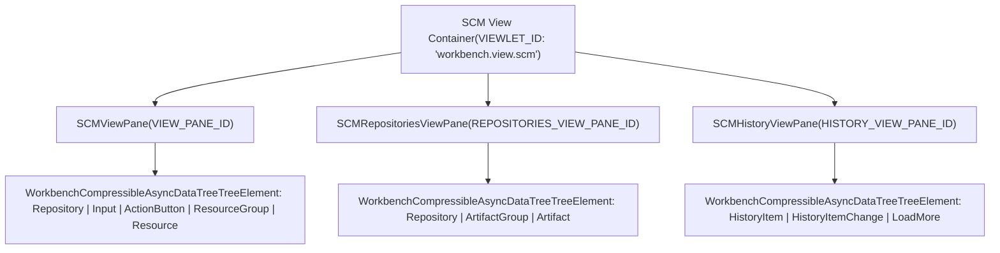
**Sources:** [src/vs/workbench/contrib/scm/browser/scm.contribution.ts103-158](https://github.com/microsoft/vscode/blob/1be3088d/src/vs/workbench/contrib/scm/browser/scm.contribution.ts#L103-L158) [src/vs/workbench/contrib/scm/browser/scmViewPane.ts115-125](https://github.com/microsoft/vscode/blob/1be3088d/src/vs/workbench/contrib/scm/browser/scmViewPane.ts#L115-L125)

## SCM View Pane (Changes View)

### Tree Structure and Data Source

The `SCMViewPane` displays a hierarchical tree structure where each repository can contain:

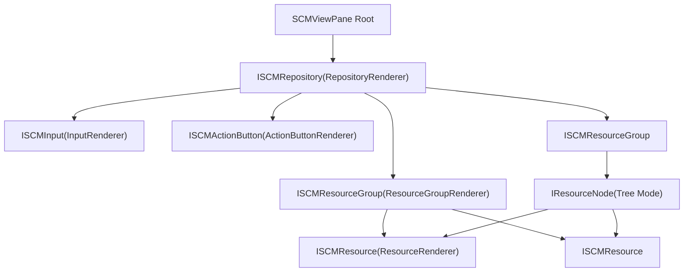
The tree uses an async data source implementation that provides children based on element type:

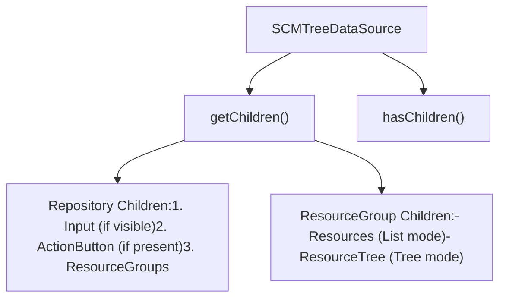
**Sources:** [src/vs/workbench/contrib/scm/browser/scmViewPane.ts1120-1248](https://github.com/microsoft/vscode/blob/1be3088d/src/vs/workbench/contrib/scm/browser/scmViewPane.ts#L1120-L1248)

### SCM Input Widget

The `SCMInputWidget` is a specialized editor component for commit message input:

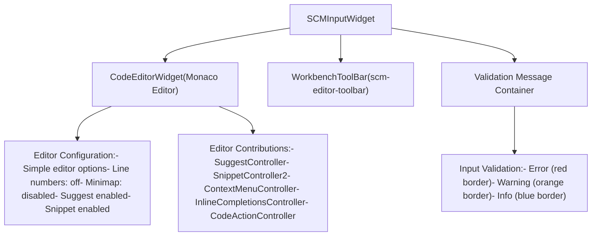
The input widget provides:

-   Multi-line text editing with syntax highlighting for commit messages
-   Configurable placeholder text
-   Input validation with visual feedback
-   Toolbar for actions (visible on scroll or focus)
-   Support for suggestions and snippets
-   Auto-resizing based on content height

**Sources:** [src/vs/workbench/contrib/scm/browser/scmViewPane.ts1562-1911](https://github.com/microsoft/vscode/blob/1be3088d/src/vs/workbench/contrib/scm/browser/scmViewPane.ts#L1562-L1911) [src/vs/workbench/contrib/scm/browser/scmViewPane.ts296-416](https://github.com/microsoft/vscode/blob/1be3088d/src/vs/workbench/contrib/scm/browser/scmViewPane.ts#L296-L416)

### Action Button Component

The `SCMActionButton` renders primary actions for a repository (e.g., "Commit", "Publish Branch"):

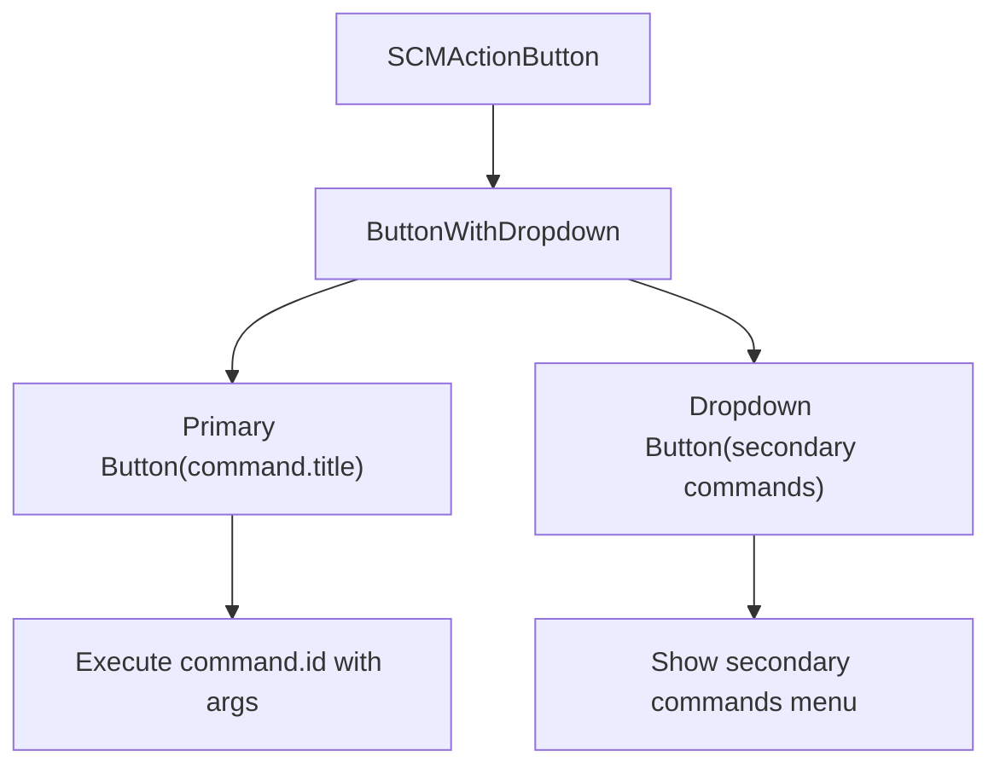
**Sources:** [src/vs/workbench/contrib/scm/browser/scmViewPane.ts1913-2170](https://github.com/microsoft/vscode/blob/1be3088d/src/vs/workbench/contrib/scm/browser/scmViewPane.ts#L1913-L2170)

### Resource Groups and Resources

Resource groups organize changed files by category (e.g., "Changes", "Staged Changes"):

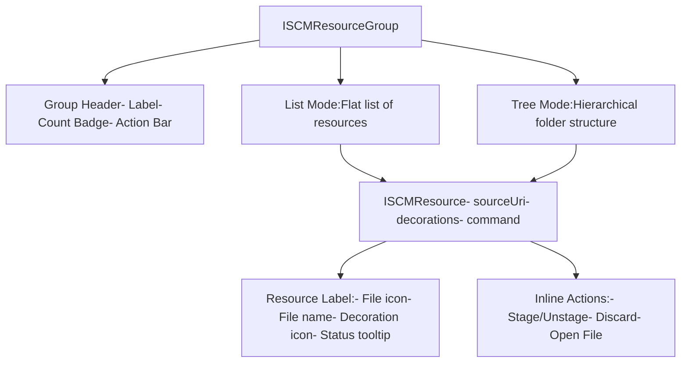
**Sources:** [src/vs/workbench/contrib/scm/browser/scmViewPane.ts418-482](https://github.com/microsoft/vscode/blob/1be3088d/src/vs/workbench/contrib/scm/browser/scmViewPane.ts#L418-L482) [src/vs/workbench/contrib/scm/browser/scmViewPane.ts484-706](https://github.com/microsoft/vscode/blob/1be3088d/src/vs/workbench/contrib/scm/browser/scmViewPane.ts#L484-L706)

## Tree Renderers

### Renderer Type Hierarchy

The SCM view uses multiple specialized renderers for different tree element types:

| Renderer | Template ID | Element Type | Key UI Elements |
| --- | --- | --- | --- |
| `RepositoryRenderer` | `'repository'` | `ISCMRepository` | Icon, label, count badge, toolbar |
| `InputRenderer` | `'input'` | `ISCMInput` | SCMInputWidget |
| `ActionButtonRenderer` | `'actionButton'` | `ISCMActionButton` | SCMActionButton |
| `ResourceGroupRenderer` | `'resource group'` | `ISCMResourceGroup` | Name, count, action bar |
| `ResourceRenderer` | `'resource'` | `ISCMResource` | File label, decoration icon, actions |

**Sources:** [src/vs/workbench/contrib/scm/browser/scmViewPane.ts708-737](https://github.com/microsoft/vscode/blob/1be3088d/src/vs/workbench/contrib/scm/browser/scmViewPane.ts#L708-L737)

### Resource Rendering Details

The `ResourceRenderer` handles both individual resources and folder nodes in tree mode:

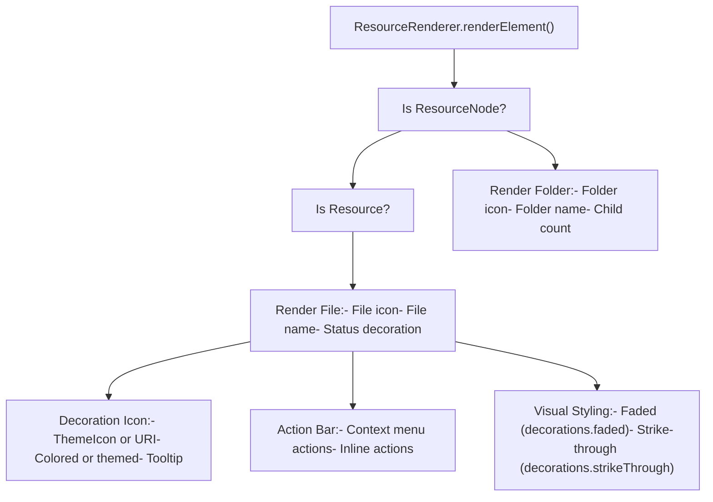
**Sources:** [src/vs/workbench/contrib/scm/browser/scmViewPane.ts524-706](https://github.com/microsoft/vscode/blob/1be3088d/src/vs/workbench/contrib/scm/browser/scmViewPane.ts#L524-L706)

### Repository Renderer

The `RepositoryRenderer` displays repository headers with dynamic visibility indicators:

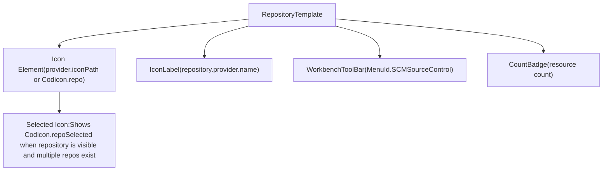
**Sources:** [src/vs/workbench/contrib/scm/browser/scmRepositoryRenderer.ts68-148](https://github.com/microsoft/vscode/blob/1be3088d/src/vs/workbench/contrib/scm/browser/scmRepositoryRenderer.ts#L68-L148)

## SCM History View Pane

The `SCMHistoryViewPane` displays commit history as a visual graph:

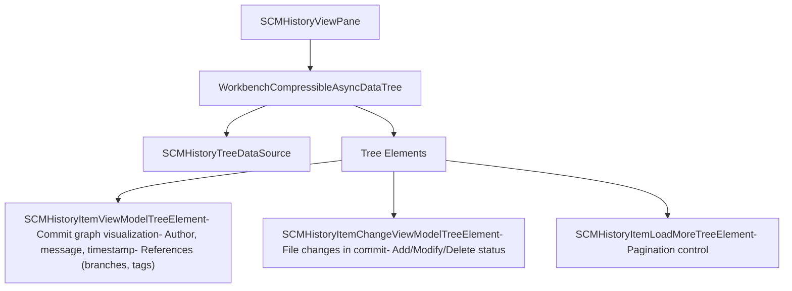
**Sources:** [src/vs/workbench/contrib/scm/browser/scmHistoryViewPane.ts79-286](https://github.com/microsoft/vscode/blob/1be3088d/src/vs/workbench/contrib/scm/browser/scmHistoryViewPane.ts#L79-L286)

### History Item Renderer

The `HistoryItemRenderer` creates complex visualizations for commits:

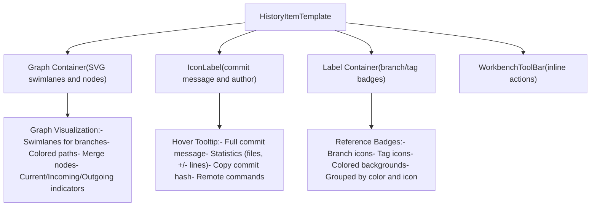
**Sources:** [src/vs/workbench/contrib/scm/browser/scmHistoryViewPane.ts439-638](https://github.com/microsoft/vscode/blob/1be3088d/src/vs/workbench/contrib/scm/browser/scmHistoryViewPane.ts#L439-L638) [src/vs/workbench/contrib/scm/browser/scmHistory.ts1-100](https://github.com/microsoft/vscode/blob/1be3088d/src/vs/workbench/contrib/scm/browser/scmHistory.ts#L1-L100)

## SCM Repositories View Pane

The `SCMRepositoriesViewPane` provides repository management and artifact browsing:

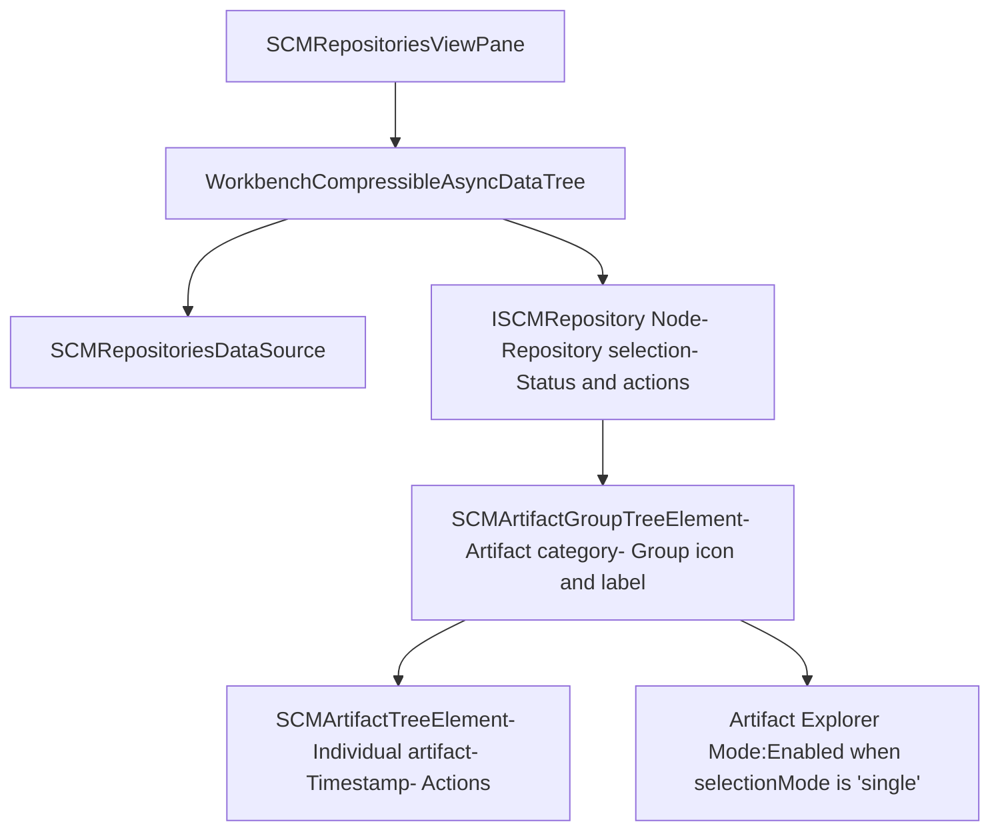
When `scm.repositories.explorer` is enabled and selection mode is "single", the repositories view shows artifacts (like GitHub Actions runs or Azure Pipelines builds) for the selected repository.

**Sources:** [src/vs/workbench/contrib/scm/browser/scmRepositoriesViewPane.ts51-450](https://github.com/microsoft/vscode/blob/1be3088d/src/vs/workbench/contrib/scm/browser/scmRepositoriesViewPane.ts#L51-L450)

### Artifact Renderers

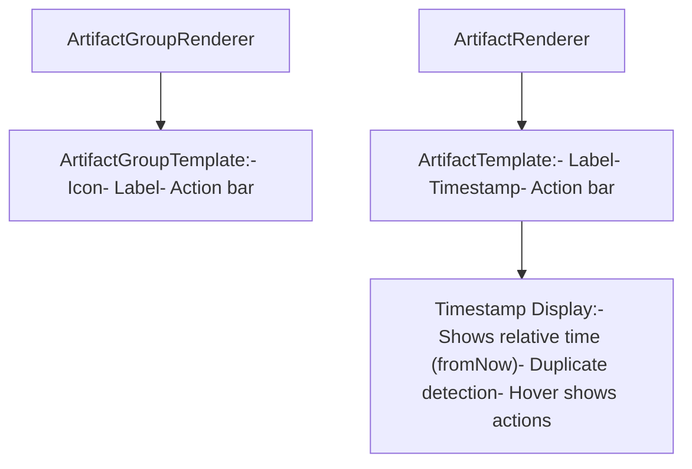
**Sources:** [src/vs/workbench/contrib/scm/browser/scmRepositoriesViewPane.ts80-256](https://github.com/microsoft/vscode/blob/1be3088d/src/vs/workbench/contrib/scm/browser/scmRepositoriesViewPane.ts#L80-L256)

## Menu System

The SCM menu system provides context-sensitive actions throughout the UI:

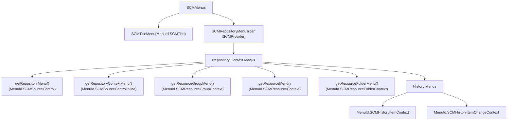
Menu items are context-aware based on:

-   `scmResourceState` context key (for resource context value)
-   `scmResourceGroupState` context key (for group context value)
-   `scmProvider` context key (for provider-specific actions)

**Sources:** [src/vs/workbench/contrib/scm/browser/menus.ts1-250](https://github.com/microsoft/vscode/blob/1be3088d/src/vs/workbench/contrib/scm/browser/menus.ts#L1-L250)

### Action View Item Provider

The `getActionViewItemProvider()` function creates custom action view items for specific SCM actions:

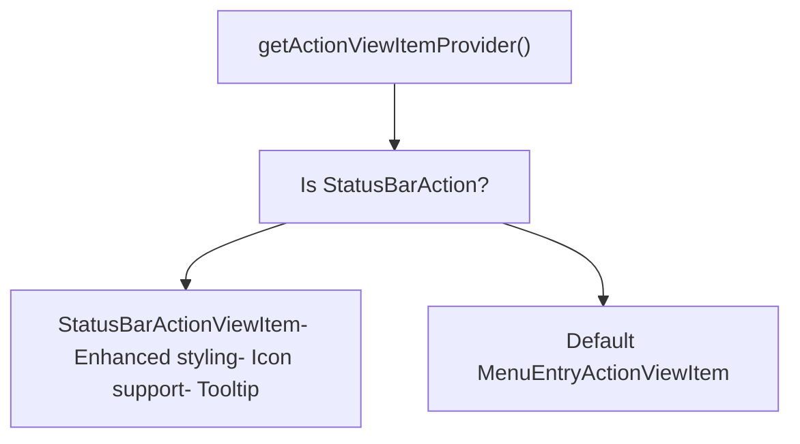
**Sources:** [src/vs/workbench/contrib/scm/browser/util.ts109-139](https://github.com/microsoft/vscode/blob/1be3088d/src/vs/workbench/contrib/scm/browser/util.ts#L109-L139)

## Drag and Drop Support

The SCM tree supports drag and drop operations for resources:

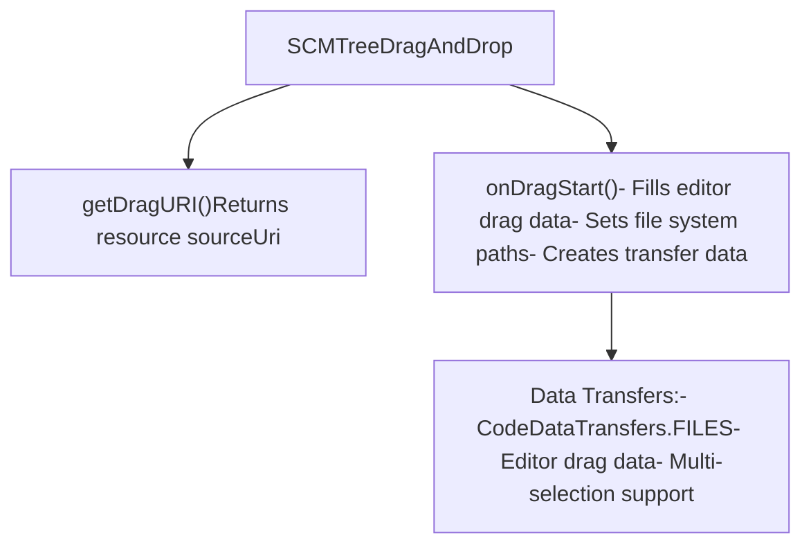
**Sources:** [src/vs/workbench/contrib/scm/browser/scmViewPane.ts236-287](https://github.com/microsoft/vscode/blob/1be3088d/src/vs/workbench/contrib/scm/browser/scmViewPane.ts#L236-L287)

## View State Persistence

The SCM views persist their state across sessions:

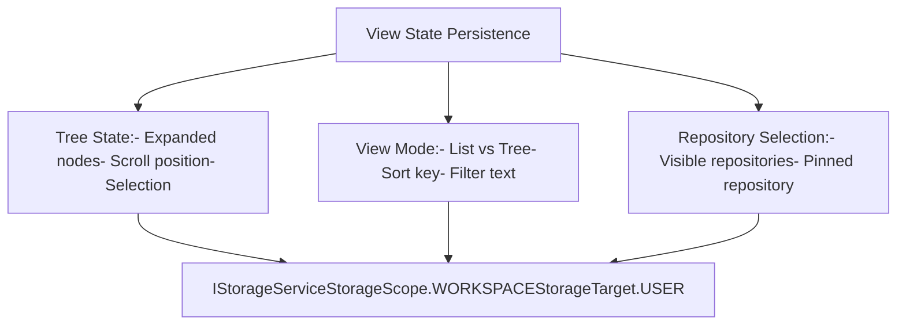
**Sources:** [src/vs/workbench/contrib/scm/browser/scmViewPane.ts2539-2582](https://github.com/microsoft/vscode/blob/1be3088d/src/vs/workbench/contrib/scm/browser/scmViewPane.ts#L2539-L2582)

## CSS Styling Structure

The SCM views use a comprehensive CSS structure defined in `scm.css`:

| CSS Class | Purpose |
| --- | --- |
| `.scm-view` | Main container for all SCM views |
| `.scm-provider` | Repository header styling |
| `.scm-input` | Input box container |
| `.scm-editor` | Editor widget styling with border and validation states |
| `.resource-group` | Resource group header |
| `.resource` | Individual resource item |
| `.history-item` | History item with graph visualization |
| `.button-container` | Action button container |

Validation states for the input box:

-   `.validation-info` - Blue border and background
-   `.validation-warning` - Orange border and background
-   `.validation-error` - Red border and background

**Sources:** [src/vs/workbench/contrib/scm/browser/media/scm.css1-100](https://github.com/microsoft/vscode/blob/1be3088d/src/vs/workbench/contrib/scm/browser/media/scm.css#L1-L100) [src/vs/workbench/contrib/scm/browser/media/scm.css439-521](https://github.com/microsoft/vscode/blob/1be3088d/src/vs/workbench/contrib/scm/browser/media/scm.css#L439-L521)

## Context Keys

The SCM views expose and consume various context keys for conditional behavior:

| Context Key | Type | Purpose |
| --- | --- | --- |
| `scmRepository` | string | Current repository ID |
| `scmProvider` | string | Current provider ID |
| `scmResourceGroup` | string | Current resource group ID |
| `scmResourceState` | string | Resource context value |
| `scmResourceGroupState` | string | Group context value |
| `scm.providerCount` | number | Total number of providers |
| `scmActiveResourceHasChanges` | boolean | Active editor resource has changes |

**Sources:** [src/vs/workbench/contrib/scm/browser/scmViewPane.ts116-125](https://github.com/microsoft/vscode/blob/1be3088d/src/vs/workbench/contrib/scm/browser/scmViewPane.ts#L116-L125) [src/vs/workbench/contrib/scm/browser/activity.ts199-217](https://github.com/microsoft/vscode/blob/1be3088d/src/vs/workbench/contrib/scm/browser/activity.ts#L199-L217)
