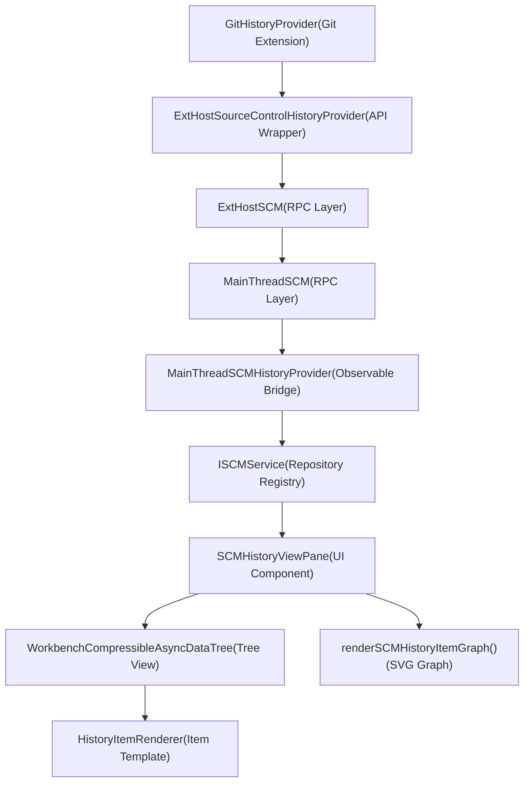
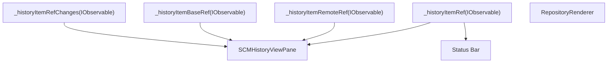
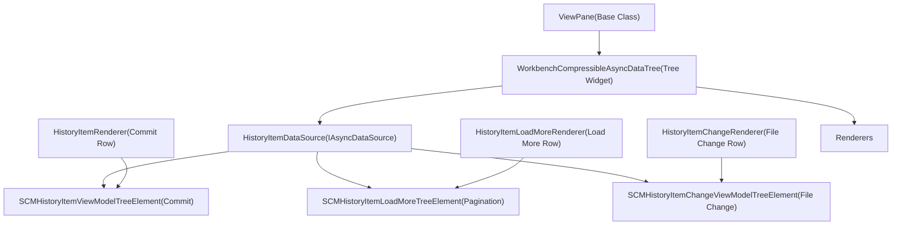
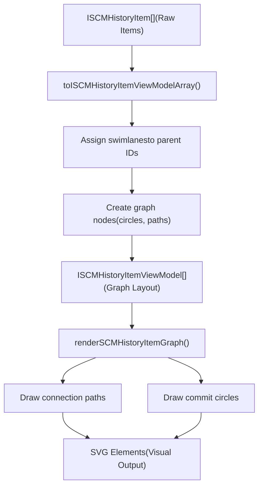
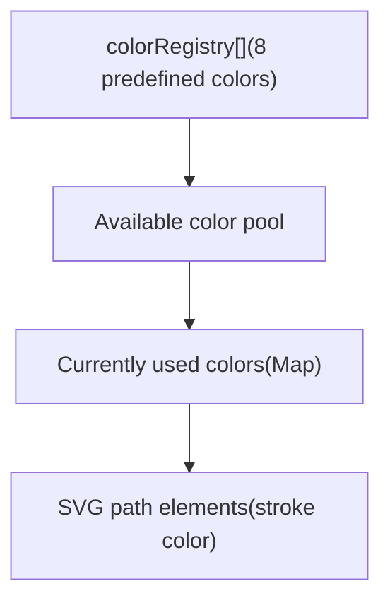
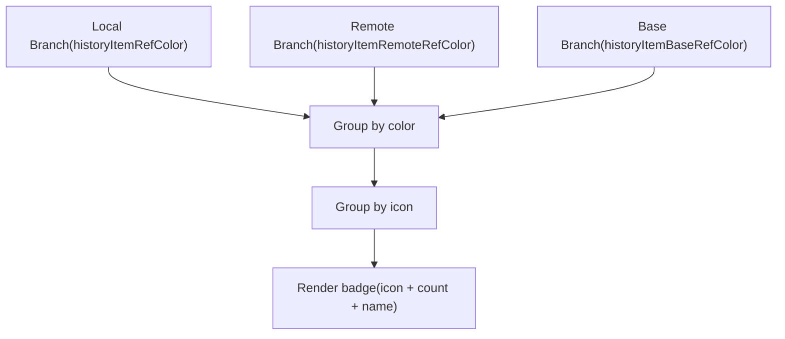
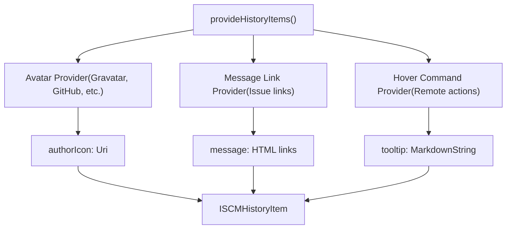

# SCM History Provider

Relevant source files

-   [extensions/git/src/historyProvider.ts](https://github.com/microsoft/vscode/blob/1be3088d/extensions/git/src/historyProvider.ts)
-   [src/vs/workbench/api/browser/mainThreadSCM.ts](https://github.com/microsoft/vscode/blob/1be3088d/src/vs/workbench/api/browser/mainThreadSCM.ts)
-   [src/vs/workbench/api/common/extHostSCM.ts](https://github.com/microsoft/vscode/blob/1be3088d/src/vs/workbench/api/common/extHostSCM.ts)
-   [src/vs/workbench/contrib/scm/browser/activity.ts](https://github.com/microsoft/vscode/blob/1be3088d/src/vs/workbench/contrib/scm/browser/activity.ts)
-   [src/vs/workbench/contrib/scm/browser/media/scm.css](https://github.com/microsoft/vscode/blob/1be3088d/src/vs/workbench/contrib/scm/browser/media/scm.css)
-   [src/vs/workbench/contrib/scm/browser/menus.ts](https://github.com/microsoft/vscode/blob/1be3088d/src/vs/workbench/contrib/scm/browser/menus.ts)
-   [src/vs/workbench/contrib/scm/browser/scm.contribution.ts](https://github.com/microsoft/vscode/blob/1be3088d/src/vs/workbench/contrib/scm/browser/scm.contribution.ts)
-   [src/vs/workbench/contrib/scm/browser/scmHistory.ts](https://github.com/microsoft/vscode/blob/1be3088d/src/vs/workbench/contrib/scm/browser/scmHistory.ts)
-   [src/vs/workbench/contrib/scm/browser/scmHistoryViewPane.ts](https://github.com/microsoft/vscode/blob/1be3088d/src/vs/workbench/contrib/scm/browser/scmHistoryViewPane.ts)
-   [src/vs/workbench/contrib/scm/browser/scmRepositoriesViewPane.ts](https://github.com/microsoft/vscode/blob/1be3088d/src/vs/workbench/contrib/scm/browser/scmRepositoriesViewPane.ts)
-   [src/vs/workbench/contrib/scm/browser/scmRepositoryRenderer.ts](https://github.com/microsoft/vscode/blob/1be3088d/src/vs/workbench/contrib/scm/browser/scmRepositoryRenderer.ts)
-   [src/vs/workbench/contrib/scm/browser/scmViewPane.ts](https://github.com/microsoft/vscode/blob/1be3088d/src/vs/workbench/contrib/scm/browser/scmViewPane.ts)
-   [src/vs/workbench/contrib/scm/browser/scmViewService.ts](https://github.com/microsoft/vscode/blob/1be3088d/src/vs/workbench/contrib/scm/browser/scmViewService.ts)
-   [src/vs/workbench/contrib/scm/browser/util.ts](https://github.com/microsoft/vscode/blob/1be3088d/src/vs/workbench/contrib/scm/browser/util.ts)
-   [src/vs/workbench/contrib/scm/browser/workingSet.ts](https://github.com/microsoft/vscode/blob/1be3088d/src/vs/workbench/contrib/scm/browser/workingSet.ts)
-   [src/vs/workbench/contrib/scm/common/history.ts](https://github.com/microsoft/vscode/blob/1be3088d/src/vs/workbench/contrib/scm/common/history.ts)
-   [src/vs/workbench/contrib/scm/common/scm.ts](https://github.com/microsoft/vscode/blob/1be3088d/src/vs/workbench/contrib/scm/common/scm.ts)
-   [src/vs/workbench/contrib/scm/test/browser/scmHistory.test.ts](https://github.com/microsoft/vscode/blob/1be3088d/src/vs/workbench/contrib/scm/test/browser/scmHistory.test.ts)
-   [src/vscode-dts/vscode.proposed.scmHistoryProvider.d.ts](https://github.com/microsoft/vscode/blob/1be3088d/src/vscode-dts/vscode.proposed.scmHistoryProvider.d.ts)

The SCM History Provider system enables source control extensions to expose version control history (commits, branches, tags) in VS Code's Source Control Graph view. It provides a standardized interface for displaying commit graphs, navigating history, and viewing changes between commits.

For information about the broader SCM system and resource management, see [SCM Framework Architecture](/microsoft/vscode/10.1-scm-framework-architecture). For details about the SCM UI components, see [SCM Views and UI Components](/microsoft/vscode/10.3-scm-views-and-ui-components).

## Purpose and Scope

The SCM History Provider system provides:

-   **History Item Retrieval** - Fetching commits with metadata (author, timestamp, message, statistics)
-   **Reference Management** - Tracking branches, tags, and their relationships (HEAD, remote, base refs)
-   **Change Visualization** - Displaying file changes for individual commits or commit ranges
-   **Graph Rendering** - Visual representation of commit history with branches and merges
-   **Extension API** - Enabling SCM extensions to provide history through a standardized interface

The system operates in VS Code's multi-process architecture, with history providers running in the extension host process and the UI rendering in the main workbench process.

Sources: [src/vs/workbench/contrib/scm/common/history.ts1-99](https://github.com/microsoft/vscode/blob/1be3088d/src/vs/workbench/contrib/scm/common/history.ts#L1-L99) [src/vscode-dts/vscode.proposed.scmHistoryProvider.d.ts1-92](https://github.com/microsoft/vscode/blob/1be3088d/src/vscode-dts/vscode.proposed.scmHistoryProvider.d.ts#L1-L92)

## Architecture Overview

The architecture follows VS Code's standard extension pattern with isolation between the extension host and main thread. History providers run in the extension host and communicate through RPC, while the UI components in the main thread reactively update based on observable state.

Sources: [src/vs/workbench/contrib/scm/browser/scmHistoryViewPane.ts1-100](https://github.com/microsoft/vscode/blob/1be3088d/src/vs/workbench/contrib/scm/browser/scmHistoryViewPane.ts#L1-L100) [src/vs/workbench/api/browser/mainThreadSCM.ts204-279](https://github.com/microsoft/vscode/blob/1be3088d/src/vs/workbench/api/browser/mainThreadSCM.ts#L204-L279) [extensions/git/src/historyProvider.ts42-82](https://github.com/microsoft/vscode/blob/1be3088d/extensions/git/src/historyProvider.ts#L42-L82)

## Core Interfaces and Data Types

### ISCMHistoryProvider Interface

The `ISCMHistoryProvider` interface defines the contract that all history providers must implement:

| Method | Purpose |
| --- | --- |
| `provideHistoryItemRefs()` | Fetch available branches, tags, and other references |
| `provideHistoryItems()` | Fetch commit history with pagination and filtering |
| `provideHistoryItemChanges()` | Get file changes for a specific commit |
| `resolveHistoryItem()` | Load full details for a single commit |
| `resolveHistoryItemRefsCommonAncestor()` | Find merge base between references |

Sources: [src/vs/workbench/contrib/scm/common/history.ts17-31](https://github.com/microsoft/vscode/blob/1be3088d/src/vs/workbench/contrib/scm/common/history.ts#L17-L31) [src/vs/workbench/contrib/scm/common/history.ts63-99](https://github.com/microsoft/vscode/blob/1be3088d/src/vs/workbench/contrib/scm/common/history.ts#L63-L99)

### History Item References

The system tracks three key references for each repository:

| Reference Type | Property | Purpose |
| --- | --- | --- |
| **Current Ref** | `historyItemRef` | The current HEAD (checked out branch/commit) |
| **Remote Ref** | `historyItemRemoteRef` | The upstream tracking branch |
| **Base Ref** | `historyItemBaseRef` | The merge base for three-way comparisons |

These references are exposed as observables and automatically update when the repository state changes (e.g., after commit, checkout, fetch):

Sources: [src/vs/workbench/contrib/scm/common/history.ts17-22](https://github.com/microsoft/vscode/blob/1be3088d/src/vs/workbench/contrib/scm/common/history.ts#L17-L22) [src/vs/workbench/api/browser/mainThreadSCM.ts204-222](https://github.com/microsoft/vscode/blob/1be3088d/src/vs/workbench/api/browser/mainThreadSCM.ts#L204-L222)

## Extension Host to Main Thread Communication

### RPC Protocol Flow

The history provider communicates between the extension host and main thread using a bidirectional RPC protocol:

> **[Mermaid sequence]**
> *(图表结构无法解析)*

### Type Conversions

The system performs type conversions at the boundary between extension API types and internal types:

| Extension API Type | Internal Type | Converter |
| --- | --- | --- |
| `SourceControlHistoryItem` | `ISCMHistoryItem` | `toISCMHistoryItem()` |
| `SourceControlHistoryItemRef` | `ISCMHistoryItemRef` | `toISCMHistoryItemRef()` |
| `SourceControlHistoryItem` (to DTO) | `SCMHistoryItemDto` | `toSCMHistoryItemDto()` |

Sources: [src/vs/workbench/api/browser/mainThreadSCM.ts48-60](https://github.com/microsoft/vscode/blob/1be3088d/src/vs/workbench/api/browser/mainThreadSCM.ts#L48-L60) [src/vs/workbench/api/common/extHostSCM.ts76-91](https://github.com/microsoft/vscode/blob/1be3088d/src/vs/workbench/api/common/extHostSCM.ts#L76-L91) [src/vs/workbench/api/browser/mainThreadSCM.ts264-278](https://github.com/microsoft/vscode/blob/1be3088d/src/vs/workbench/api/browser/mainThreadSCM.ts#L264-L278)

### Observable State Management

The `MainThreadSCMHistoryProvider` uses observables to propagate state changes efficiently:

The observables use structural equality checks to minimize unnecessary updates:

Sources: [src/vs/workbench/api/browser/mainThreadSCM.ts204-224](https://github.com/microsoft/vscode/blob/1be3088d/src/vs/workbench/api/browser/mainThreadSCM.ts#L204-L224) [src/vs/workbench/api/browser/mainThreadSCM.ts264-278](https://github.com/microsoft/vscode/blob/1be3088d/src/vs/workbench/api/browser/mainThreadSCM.ts#L264-L278)

## History View Pane

### View Pane Architecture

The `SCMHistoryViewPane` is the primary UI component for displaying commit history:

### Tree Data Source

The `HistoryItemDataSource` implements `IAsyncDataSource` to lazily load history items:

| Method | Purpose |
| --- | --- |
| `hasChildren()` | Determines if an element has children (history items have changes) |
| `getChildren()` | Fetches children (history items for root, changes for history item) |

The data source supports two view modes:

-   **List Mode** - Flat list of file changes for each commit
-   **Tree Mode** - Hierarchical folder tree of file changes

Sources: [src/vs/workbench/contrib/scm/browser/scmHistoryViewPane.ts700-850](https://github.com/microsoft/vscode/blob/1be3088d/src/vs/workbench/contrib/scm/browser/scmHistoryViewPane.ts#L700-L850) [src/vs/workbench/contrib/scm/browser/scmHistoryViewPane.ts255-286](https://github.com/microsoft/vscode/blob/1be3088d/src/vs/workbench/contrib/scm/browser/scmHistoryViewPane.ts#L255-L286)

### Pagination and Load More

The view pane supports incremental loading of history:

> **[Mermaid sequence]**
> *(图表结构无法解析)*

Sources: [src/vs/workbench/contrib/scm/browser/scmHistoryViewPane.ts750-800](https://github.com/microsoft/vscode/blob/1be3088d/src/vs/workbench/contrib/scm/browser/scmHistoryViewPane.ts#L750-L800) [src/vs/workbench/contrib/scm/common/history.ts33-38](https://github.com/microsoft/vscode/blob/1be3088d/src/vs/workbench/contrib/scm/common/history.ts#L33-L38)

### Repository and Ref Selection

The view pane provides UI for selecting repositories and filtering by refs:

| Action | Command ID | Purpose |
| --- | --- | --- |
| Pick Repository | `workbench.scm.action.graph.pickRepository` | Switch between repositories |
| Pick History Item Refs | `workbench.scm.action.graph.pickHistoryItemRefs` | Filter by branch/tag |
| Reveal Current Item | `workbench.scm.action.graph.revealCurrentHistoryItem` | Scroll to HEAD |

Sources: [src/vs/workbench/contrib/scm/browser/scmHistoryViewPane.ts163-231](https://github.com/microsoft/vscode/blob/1be3088d/src/vs/workbench/contrib/scm/browser/scmHistoryViewPane.ts#L163-L231) [src/vs/workbench/contrib/scm/browser/scmHistoryViewPane.ts1013-1116](https://github.com/microsoft/vscode/blob/1be3088d/src/vs/workbench/contrib/scm/browser/scmHistoryViewPane.ts#L1013-L1116)

## Graph Visualization

### Commit Graph Rendering

The system renders commit graphs as SVG elements using a swimlane-based layout algorithm:

### Swimlane Algorithm

Each commit's parent relationships determine its input and output swimlanes:

| Graph Element | Dimensions | Purpose |
| --- | --- | --- |
| Swimlane Width | 11px | Horizontal space per branch |
| Swimlane Height | 22px | Vertical space per commit |
| Circle Radius | 4px | Commit node size |
| Curve Radius | 5px | Merge path curve |

The algorithm assigns colors to swimlanes to distinguish branches:

Sources: [src/vs/workbench/contrib/scm/browser/scmHistory.ts20-25](https://github.com/microsoft/vscode/blob/1be3088d/src/vs/workbench/contrib/scm/browser/scmHistory.ts#L20-L25) [src/vs/workbench/contrib/scm/browser/scmHistory.ts72-379](https://github.com/microsoft/vscode/blob/1be3088d/src/vs/workbench/contrib/scm/browser/scmHistory.ts#L72-L379) [src/vs/workbench/contrib/scm/browser/scmHistory.ts381-537](https://github.com/microsoft/vscode/blob/1be3088d/src/vs/workbench/contrib/scm/browser/scmHistory.ts#L381-L537)

### History Item References Display

The graph displays references (branches, tags) as colored badges next to commits:

Badge rendering is controlled by the `scm.graph.badges` configuration:

-   `all` - Show all badges
-   `filter` - Show only badges used as filter

Sources: [src/vs/workbench/contrib/scm/browser/scmHistory.ts29-31](https://github.com/microsoft/vscode/blob/1be3088d/src/vs/workbench/contrib/scm/browser/scmHistory.ts#L29-L31) [src/vs/workbench/contrib/scm/browser/scmHistoryViewPane.ts512-556](https://github.com/microsoft/vscode/blob/1be3088d/src/vs/workbench/contrib/scm/browser/scmHistoryViewPane.ts#L512-L556)

## Git Implementation

### GitHistoryProvider Implementation

The Git extension implements the history provider interface in `GitHistoryProvider`:

### Reference Tracking

The Git provider tracks three types of references:

**Current Ref (HEAD):**

-   For branches: `refs/heads/{branchName}`
-   For tags: `refs/tags/{tagName}`
-   For detached: commit hash

**Remote Ref (Upstream):**

-   For tracked branches: `refs/remotes/{remote}/{branch}`
-   For local tracking: `refs/heads/{branch}`
-   Undefined if no upstream

**Base Ref (Merge Base):**

-   Computed when branch changes
-   Points to common ancestor with merge base branch
-   Used for three-way merge visualization

Sources: [extensions/git/src/historyProvider.ts92-223](https://github.com/microsoft/vscode/blob/1be3088d/extensions/git/src/historyProvider.ts#L92-L223) [extensions/git/src/historyProvider.ts110-187](https://github.com/microsoft/vscode/blob/1be3088d/extensions/git/src/historyProvider.ts#L110-L187)

### History Item Fetching

The Git provider uses the Git CLI to fetch commit history:

| Git Operation | Method | Options |
| --- | --- | --- |
| `git log` | `provideHistoryItems()` | `--skip`, `--max-count`, `--shortstat` |
| `git log -S` | `_searchHistoryItems()` | Search commits by content |
| `git show` | `provideHistoryItemChanges()` | Get file changes |
| `git merge-base` | `resolveHistoryItemRefsCommonAncestor()` | Find common ancestor |

### Incoming/Outgoing Changes

The Git provider supports special synthetic history items for incoming and outgoing changes:

| Special Item ID | Purpose |
| --- | --- |
| `scm-graph-incoming-changes` | Changes in remote not yet pulled |
| `scm-graph-outgoing-changes` | Local changes not yet pushed |

These are computed by comparing the current branch with its upstream:

Sources: [extensions/git/src/historyProvider.ts248-335](https://github.com/microsoft/vscode/blob/1be3088d/extensions/git/src/historyProvider.ts#L248-L335) [src/vs/workbench/contrib/scm/common/history.ts14-15](https://github.com/microsoft/vscode/blob/1be3088d/src/vs/workbench/contrib/scm/common/history.ts#L14-L15)

### Avatar and Enrichment Providers

The Git provider integrates with external enrichment providers for additional metadata:

Sources: [extensions/git/src/historyProvider.ts291-327](https://github.com/microsoft/vscode/blob/1be3088d/extensions/git/src/historyProvider.ts#L291-L327) [extensions/git/src/historyItemDetailsProvider.ts1-50](https://github.com/microsoft/vscode/blob/1be3088d/extensions/git/src/historyItemDetailsProvider.ts#L1-L50)

## Context Menu Actions

The system provides context menu actions for history items:

| Action ID | Menu | Purpose |
| --- | --- | --- |
| `workbench.scm.action.graph.viewChanges` | `MenuId.SCMHistoryItemContext` | Open multi-diff editor |
| `workbench.scm.action.graph.openFile` | `MenuId.SCMHistoryItemChangeContext` | Open file from history |
| `workbench.scm.action.graph.refresh` | `MenuId.SCMHistoryTitle` | Refresh history |

Actions are registered using the Action2 pattern and are context-aware based on the selected repository and history item:

Sources: [src/vs/workbench/contrib/scm/browser/scmHistoryViewPane.ts288-408](https://github.com/microsoft/vscode/blob/1be3088d/src/vs/workbench/contrib/scm/browser/scmHistoryViewPane.ts#L288-L408) [src/vs/workbench/contrib/scm/browser/scm.contribution.ts98-101](https://github.com/microsoft/vscode/blob/1be3088d/src/vs/workbench/contrib/scm/browser/scm.contribution.ts#L98-L101)

## Configuration

The SCM History Provider system is configured through VS Code settings:

| Setting | Type | Default | Purpose |
| --- | --- | --- | --- |
| `scm.graph.pageOnScroll` | boolean | `true` | Auto-load next page on scroll |
| `scm.graph.pageSize` | number | `50` | Items per page |
| `scm.graph.badges` | string | `filter` | Badge display mode |
| `scm.graph.showIncomingChanges` | boolean | `true` | Show incoming changes item |
| `scm.graph.showOutgoingChanges` | boolean | `true` | Show outgoing changes item |
| `scm.defaultViewMode` | string | `list` | Default view mode (list/tree) |

Sources: [src/vs/workbench/contrib/scm/browser/scm.contribution.ts398-429](https://github.com/microsoft/vscode/blob/1be3088d/src/vs/workbench/contrib/scm/browser/scm.contribution.ts#L398-L429)
