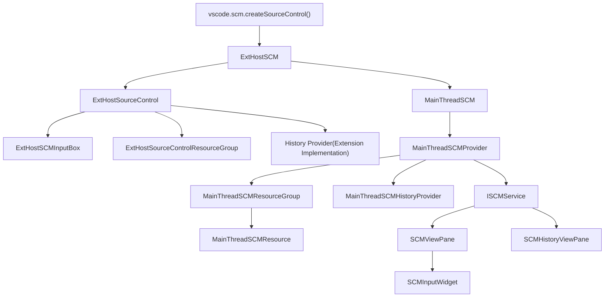
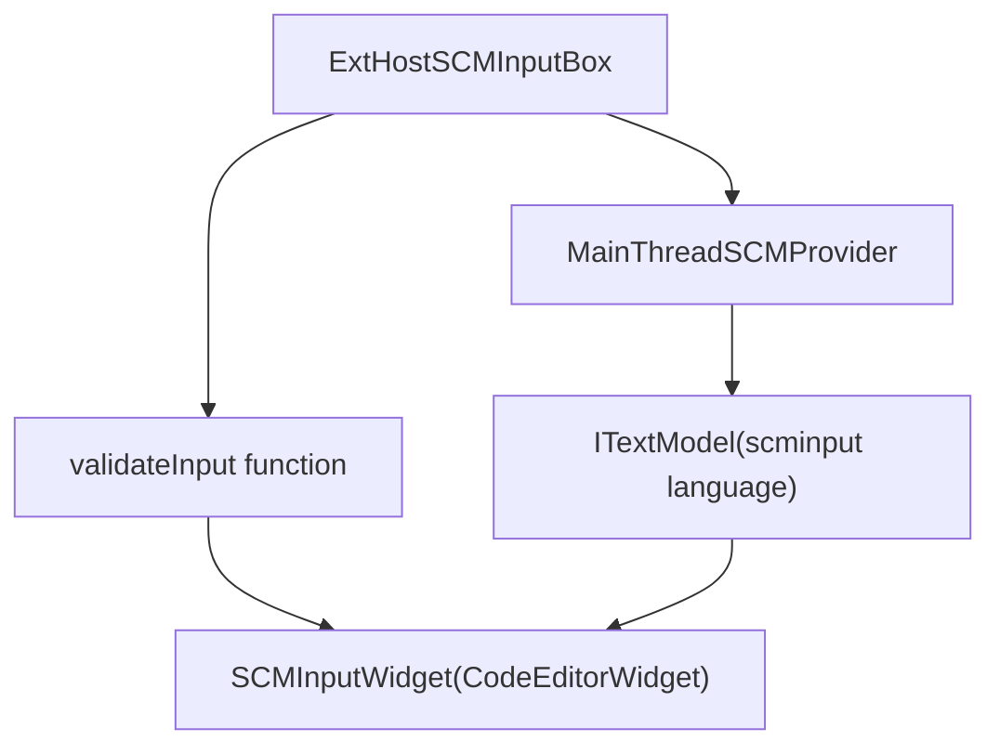
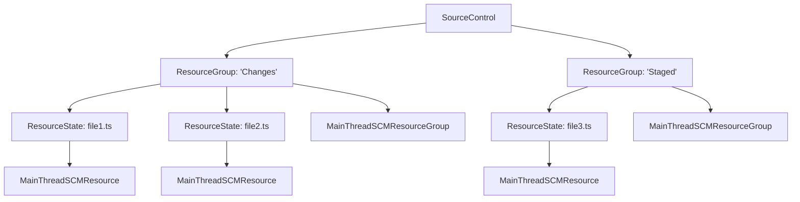
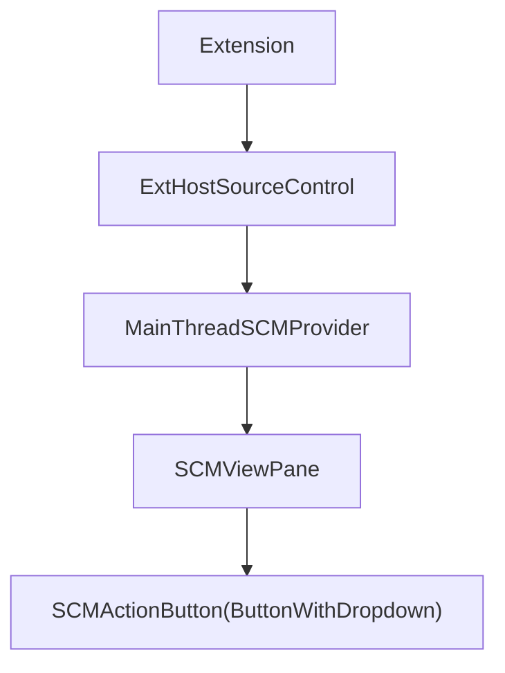
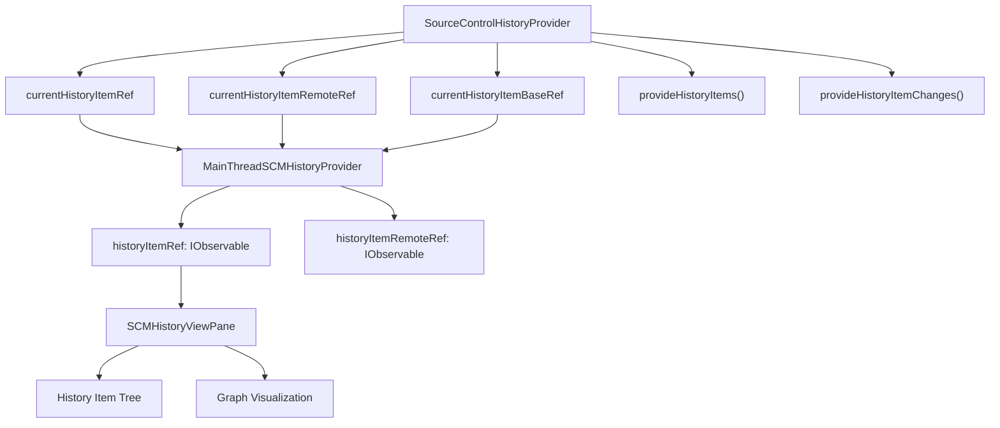
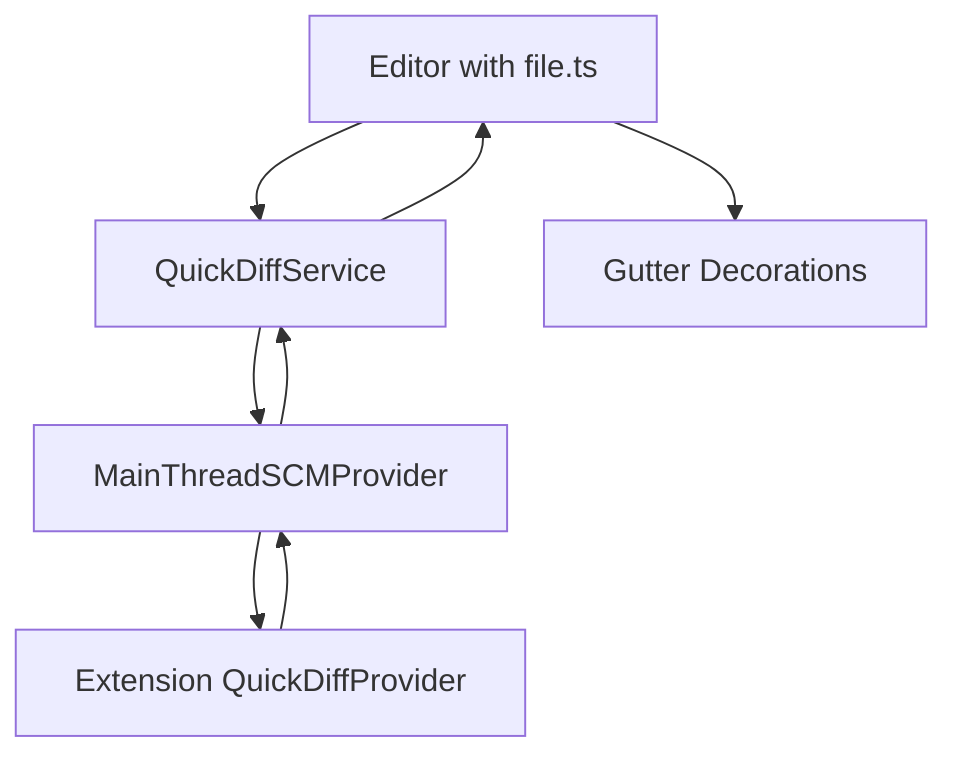
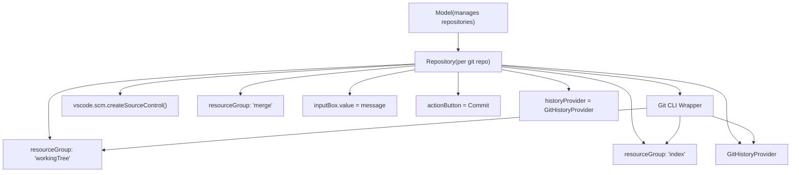

# SCM Extension API

Relevant source files

-   [extensions/git/src/historyProvider.ts](https://github.com/microsoft/vscode/blob/1be3088d/extensions/git/src/historyProvider.ts)
-   [src/vs/workbench/api/browser/mainThreadSCM.ts](https://github.com/microsoft/vscode/blob/1be3088d/src/vs/workbench/api/browser/mainThreadSCM.ts)
-   [src/vs/workbench/api/common/extHostSCM.ts](https://github.com/microsoft/vscode/blob/1be3088d/src/vs/workbench/api/common/extHostSCM.ts)
-   [src/vs/workbench/contrib/scm/browser/activity.ts](https://github.com/microsoft/vscode/blob/1be3088d/src/vs/workbench/contrib/scm/browser/activity.ts)
-   [src/vs/workbench/contrib/scm/browser/media/scm.css](https://github.com/microsoft/vscode/blob/1be3088d/src/vs/workbench/contrib/scm/browser/media/scm.css)
-   [src/vs/workbench/contrib/scm/browser/menus.ts](https://github.com/microsoft/vscode/blob/1be3088d/src/vs/workbench/contrib/scm/browser/menus.ts)
-   [src/vs/workbench/contrib/scm/browser/scm.contribution.ts](https://github.com/microsoft/vscode/blob/1be3088d/src/vs/workbench/contrib/scm/browser/scm.contribution.ts)
-   [src/vs/workbench/contrib/scm/browser/scmHistory.ts](https://github.com/microsoft/vscode/blob/1be3088d/src/vs/workbench/contrib/scm/browser/scmHistory.ts)
-   [src/vs/workbench/contrib/scm/browser/scmHistoryViewPane.ts](https://github.com/microsoft/vscode/blob/1be3088d/src/vs/workbench/contrib/scm/browser/scmHistoryViewPane.ts)
-   [src/vs/workbench/contrib/scm/browser/scmRepositoriesViewPane.ts](https://github.com/microsoft/vscode/blob/1be3088d/src/vs/workbench/contrib/scm/browser/scmRepositoriesViewPane.ts)
-   [src/vs/workbench/contrib/scm/browser/scmRepositoryRenderer.ts](https://github.com/microsoft/vscode/blob/1be3088d/src/vs/workbench/contrib/scm/browser/scmRepositoryRenderer.ts)
-   [src/vs/workbench/contrib/scm/browser/scmViewPane.ts](https://github.com/microsoft/vscode/blob/1be3088d/src/vs/workbench/contrib/scm/browser/scmViewPane.ts)
-   [src/vs/workbench/contrib/scm/browser/scmViewService.ts](https://github.com/microsoft/vscode/blob/1be3088d/src/vs/workbench/contrib/scm/browser/scmViewService.ts)
-   [src/vs/workbench/contrib/scm/browser/util.ts](https://github.com/microsoft/vscode/blob/1be3088d/src/vs/workbench/contrib/scm/browser/util.ts)
-   [src/vs/workbench/contrib/scm/browser/workingSet.ts](https://github.com/microsoft/vscode/blob/1be3088d/src/vs/workbench/contrib/scm/browser/workingSet.ts)
-   [src/vs/workbench/contrib/scm/common/history.ts](https://github.com/microsoft/vscode/blob/1be3088d/src/vs/workbench/contrib/scm/common/history.ts)
-   [src/vs/workbench/contrib/scm/common/scm.ts](https://github.com/microsoft/vscode/blob/1be3088d/src/vs/workbench/contrib/scm/common/scm.ts)
-   [src/vs/workbench/contrib/scm/test/browser/scmHistory.test.ts](https://github.com/microsoft/vscode/blob/1be3088d/src/vs/workbench/contrib/scm/test/browser/scmHistory.test.ts)
-   [src/vscode-dts/vscode.proposed.scmHistoryProvider.d.ts](https://github.com/microsoft/vscode/blob/1be3088d/src/vscode-dts/vscode.proposed.scmHistoryProvider.d.ts)

This document describes the Source Control Management (SCM) Extension API that allows extensions to integrate source control providers into VS Code. This API enables extensions to create custom SCM implementations (like Git, Mercurial, SVN, etc.) by implementing a standardized interface.

For information about the SCM framework that powers the UI, see [SCM Framework Architecture](/microsoft/vscode/10.1-scm-framework-architecture). For details on the SCM views and UI components, see [SCM Views and UI Components](/microsoft/vscode/10.3-scm-views-and-ui-components).

## Overview

The SCM Extension API allows extensions to:

-   Register source control providers with custom labels and icons
-   Display files with decorations in resource groups (staging, working tree, etc.)
-   Provide an input box for commit messages with validation
-   Expose action buttons for common operations (commit, sync, etc.)
-   Show repository history through the proposed History Provider API
-   Track changes against a baseline to show diff decorations in the editor

The API follows a dual-process architecture where extensions run in an isolated Extension Host process and communicate with the main UI thread via RPC (Remote Procedure Call).

Sources: [src/vs/workbench/api/common/extHostSCM.ts1-1000](https://github.com/microsoft/vscode/blob/1be3088d/src/vs/workbench/api/common/extHostSCM.ts#L1-L1000) [src/vs/workbench/api/browser/mainThreadSCM.ts1-100](https://github.com/microsoft/vscode/blob/1be3088d/src/vs/workbench/api/browser/mainThreadSCM.ts#L1-L100) [src/vs/workbench/contrib/scm/common/scm.ts1-100](https://github.com/microsoft/vscode/blob/1be3088d/src/vs/workbench/contrib/scm/common/scm.ts#L1-L100)

## API Architecture


**Extension API Architecture**

The SCM Extension API uses a proxy pattern where extension-side objects (ExtHost\*) synchronize their state with main thread counterparts (MainThread\*) via RPC messages.

Sources: [src/vs/workbench/api/common/extHostSCM.ts50-150](https://github.com/microsoft/vscode/blob/1be3088d/src/vs/workbench/api/common/extHostSCM.ts#L50-L150) [src/vs/workbench/api/browser/mainThreadSCM.ts280-350](https://github.com/microsoft/vscode/blob/1be3088d/src/vs/workbench/api/browser/mainThreadSCM.ts#L280-L350)

## Creating a Source Control Provider

Extensions create SCM providers by calling `vscode.scm.createSourceControl()`:

> **[Mermaid sequence]**
> *(图表结构无法解析)*

**Source Control Creation Flow**

The creation process involves:

1.  **Extension calls API**: `vscode.scm.createSourceControl(id, label, rootUri?)`
2.  **ExtHostSCM creates wrapper**: Instantiates `ExtHostSourceControl` with a unique handle
3.  **RPC registration**: Sends `$registerSourceControl` with provider features
4.  **Main thread registration**: Creates `MainThreadSCMProvider` implementing `ISCMProvider`
5.  **Service registration**: Registers with `ISCMService` to appear in the UI

Sources: [src/vs/workbench/api/common/extHostSCM.ts844-899](https://github.com/microsoft/vscode/blob/1be3088d/src/vs/workbench/api/common/extHostSCM.ts#L844-L899) [src/vs/workbench/api/browser/mainThreadSCM.ts454-492](https://github.com/microsoft/vscode/blob/1be3088d/src/vs/workbench/api/browser/mainThreadSCM.ts#L454-L492)

### Key Provider Properties

| Property | Type | Description |
| --- | --- | --- |
| `id` | `string` | Unique identifier for the provider |
| `label` | `string` | Display name shown in the UI |
| `rootUri` | `Uri?` | Root directory of the repository |
| `inputBox` | `SourceControlInputBox` | Commit message input |
| `count` | `number?` | Badge count shown in activity bar |
| `statusBarCommands` | `Command[]?` | Commands shown in status bar |
| `acceptInputCommand` | `Command?` | Command executed on Ctrl+Enter |
| `commitTemplate` | `string` | Template text for commits |

Sources: [src/vs/workbench/api/common/extHostSCM.ts700-800](https://github.com/microsoft/vscode/blob/1be3088d/src/vs/workbench/api/common/extHostSCM.ts#L700-L800) [src/vs/workbench/contrib/scm/common/scm.ts72-97](https://github.com/microsoft/vscode/blob/1be3088d/src/vs/workbench/contrib/scm/common/scm.ts#L72-L97)

## Input Box API

The input box provides a text editor for commit messages with validation support:


**Input Box Architecture**

The input box is implemented as a full Monaco editor instance with the `scminput` language mode, providing rich editing features.

Sources: [src/vs/workbench/api/common/extHostSCM.ts277-388](https://github.com/microsoft/vscode/blob/1be3088d/src/vs/workbench/api/common/extHostSCM.ts#L277-L388) [src/vs/workbench/contrib/scm/browser/scmViewPane.ts1400-1600](https://github.com/microsoft/vscode/blob/1be3088d/src/vs/workbench/contrib/scm/browser/scmViewPane.ts#L1400-L1600)

### Input Box Properties and Methods

| Member | Type | Description |
| --- | --- | --- |
| `value` | `string` | Current input text content |
| `placeholder` | `string` | Placeholder text when empty |
| `enabled` | `boolean` | Whether input is editable |
| `visible` | `boolean` | Whether input is shown |
| `validateInput` | `function` | Validation function (proposed API) |
| `showValidationMessage()` | `method` | Display validation message (proposed API) |
| `onDidChange` | `Event<string>` | Fires when value changes |

The validation function has this signature:

```
(value: string, cursorPosition: number) =>
  ProviderResult<SourceControlInputBoxValidation | undefined | null>
```
Sources: [src/vs/workbench/api/common/extHostSCM.ts273-388](https://github.com/microsoft/vscode/blob/1be3088d/src/vs/workbench/api/common/extHostSCM.ts#L273-L388) [src/vscode-dts/vscode.proposed.scmValidation.d.ts1-50](https://github.com/microsoft/vscode/blob/1be3088d/src/vscode-dts/vscode.proposed.scmValidation.d.ts#L1-L50)

## Resource Groups and Resources

Resources represent files with changes, organized into groups (like "Changes", "Staged Changes", etc.):


**Resource Group Structure**

Extensions create groups with `sourceControl.createResourceGroup(id, label)` and add resources by setting the `resourceStates` array.

Sources: [src/vs/workbench/api/common/extHostSCM.ts390-600](https://github.com/microsoft/vscode/blob/1be3088d/src/vs/workbench/api/common/extHostSCM.ts#L390-L600) [src/vs/workbench/api/browser/mainThreadSCM.ts81-143](https://github.com/microsoft/vscode/blob/1be3088d/src/vs/workbench/api/browser/mainThreadSCM.ts#L81-L143)

### Resource State Properties

```
interface SourceControlResourceState {
  readonly resourceUri: Uri;
  readonly decorations?: SourceControlResourceDecorations;
  readonly command?: Command;
  readonly contextValue?: string;
  readonly multiDiffEditorOriginalUri?: Uri;
  readonly multiDiffEditorModifiedUri?: Uri;
}
```
**Key Properties:**

| Property | Description |
| --- | --- |
| `resourceUri` | URI of the file |
| `decorations.iconPath` | Icon (URI, ThemeIcon, or light/dark pair) |
| `decorations.tooltip` | Tooltip text |
| `decorations.strikeThrough` | Strike through the file name |
| `decorations.faded` | Dim the file name |
| `command` | Command executed on click |
| `contextValue` | Used for context menu contributions |

Sources: [src/vs/workbench/api/common/extHostSCM.ts150-250](https://github.com/microsoft/vscode/blob/1be3088d/src/vs/workbench/api/common/extHostSCM.ts#L150-L250) [src/vs/workbench/contrib/scm/common/scm.ts37-54](https://github.com/microsoft/vscode/blob/1be3088d/src/vs/workbench/contrib/scm/common/scm.ts#L37-L54)

### Resource Synchronization

Resources are synchronized via splice operations to efficiently update large lists:

> **[Mermaid sequence]**
> *(图表结构无法解析)*

**Resource State Synchronization**

The splice mechanism sends minimal diffs rather than entire arrays, improving performance for repositories with many files.

Sources: [src/vs/workbench/api/common/extHostSCM.ts450-550](https://github.com/microsoft/vscode/blob/1be3088d/src/vs/workbench/api/common/extHostSCM.ts#L450-L550) [src/vs/workbench/api/browser/mainThreadSCM.ts127-132](https://github.com/microsoft/vscode/blob/1be3088d/src/vs/workbench/api/browser/mainThreadSCM.ts#L127-L132)

## Action Buttons

Action buttons appear at the top of the SCM view for primary operations:

```
interface SourceControlActionButton {
  command: Command & { shortTitle?: string };
  secondaryCommands?: Command[][];
  enabled: boolean;
}
```
Extensions set the action button via `sourceControl.actionButton`:


**Action Button Flow**

The button supports a primary command and optional secondary commands shown in a dropdown.

Sources: [src/vs/workbench/api/common/extHostSCM.ts750-780](https://github.com/microsoft/vscode/blob/1be3088d/src/vs/workbench/api/common/extHostSCM.ts#L750-L780) [src/vs/workbench/contrib/scm/browser/scmViewPane.ts2100-2300](https://github.com/microsoft/vscode/blob/1be3088d/src/vs/workbench/contrib/scm/browser/scmViewPane.ts#L2100-L2300)

## History Provider API

The History Provider API (proposed) allows extensions to expose repository history:


**History Provider Architecture**

The History Provider exposes commit history with graph visualization and change details.

Sources: [src/vs/workbench/api/browser/mainThreadSCM.ts204-279](https://github.com/microsoft/vscode/blob/1be3088d/src/vs/workbench/api/browser/mainThreadSCM.ts#L204-L279) [src/vs/workbench/contrib/scm/common/history.ts1-100](https://github.com/microsoft/vscode/blob/1be3088d/src/vs/workbench/contrib/scm/common/history.ts#L1-L100) [src/vscode-dts/vscode.proposed.scmHistoryProvider.d.ts1-100](https://github.com/microsoft/vscode/blob/1be3088d/src/vscode-dts/vscode.proposed.scmHistoryProvider.d.ts#L1-L100)

### History Provider Interface

```
interface SourceControlHistoryProvider {
  // Current refs (local, remote, base)
  readonly currentHistoryItemRef: SourceControlHistoryItemRef | undefined;
  readonly currentHistoryItemRemoteRef: SourceControlHistoryItemRef | undefined;
  readonly currentHistoryItemBaseRef: SourceControlHistoryItemRef | undefined;

  // Events
  readonly onDidChangeCurrentHistoryItemRefs: Event<void>;
  readonly onDidChangeHistoryItemRefs: Event<SourceControlHistoryItemRefsChangeEvent>;

  // Methods
  provideHistoryItemRefs(refs?: string[], token: CancellationToken):
    ProviderResult<SourceControlHistoryItemRef[]>;

  provideHistoryItems(options: SourceControlHistoryOptions, token: CancellationToken):
    ProviderResult<SourceControlHistoryItem[]>;

  provideHistoryItemChanges(historyItemId: string, parentId: string | undefined, token: CancellationToken):
    ProviderResult<SourceControlHistoryItemChange[]>;

  resolveHistoryItem(historyItemId: string, token: CancellationToken):
    ProviderResult<SourceControlHistoryItem>;
}
```
Sources: [src/vscode-dts/vscode.proposed.scmHistoryProvider.d.ts13-37](https://github.com/microsoft/vscode/blob/1be3088d/src/vscode-dts/vscode.proposed.scmHistoryProvider.d.ts#L13-L37)

### History Item Structure

```
interface SourceControlHistoryItem {
  readonly id: string;                    // Commit hash/ID
  readonly parentIds: string[];           // Parent commit IDs
  readonly subject: string;               // Commit subject line
  readonly message: string;               // Full commit message
  readonly displayId?: string;            // Short hash
  readonly author?: string;               // Author name
  readonly authorEmail?: string;          // Author email
  readonly authorIcon?: IconPath;         // Author avatar
  readonly timestamp?: number;            // Commit timestamp
  readonly statistics?: {                 // File statistics
    files: number;
    insertions: number;
    deletions: number;
  };
  readonly references?: SourceControlHistoryItemRef[];  // Tags, branches
}
```
Sources: [src/vscode-dts/vscode.proposed.scmHistoryProvider.d.ts52-65](https://github.com/microsoft/vscode/blob/1be3088d/src/vscode-dts/vscode.proposed.scmHistoryProvider.d.ts#L52-L65) [src/vs/workbench/contrib/scm/common/history.ts63-76](https://github.com/microsoft/vscode/blob/1be3088d/src/vs/workbench/contrib/scm/common/history.ts#L63-L76)

### History Provider Example Flow

> **[Mermaid sequence]**
> *(图表结构无法解析)*

**History Items Request Flow**

The UI requests history items, which are fetched from the extension and converted to internal DTOs.

Sources: [src/vs/workbench/contrib/scm/browser/scmHistoryViewPane.ts800-900](https://github.com/microsoft/vscode/blob/1be3088d/src/vs/workbench/contrib/scm/browser/scmHistoryViewPane.ts#L800-L900) [src/vs/workbench/api/common/extHostSCM.ts1400-1500](https://github.com/microsoft/vscode/blob/1be3088d/src/vs/workbench/api/common/extHostSCM.ts#L1400-L1500) [extensions/git/src/historyProvider.ts248-335](https://github.com/microsoft/vscode/blob/1be3088d/extensions/git/src/historyProvider.ts#L248-L335)

## Quick Diff and Baseline Resources

Extensions can provide baseline resources for diff decorations in the editor:

```
interface SourceControl {
  quickDiffProvider?: QuickDiffProvider;
  stagedQuickDiffProvider?: QuickDiffProvider;
}

interface QuickDiffProvider {
  provideOriginalResource(uri: Uri, token: CancellationToken):
    ProviderResult<Uri>;
}
```
The quick diff system:

1.  **Extension provides baseline**: Returns URI of the original/baseline version
2.  **Main thread registers**: `MainThreadSCMProvider` registers with `IQuickDiffService`
3.  **Editor decorations**: Gutter decorations show additions, modifications, deletions


**Quick Diff Flow**

Sources: [src/vs/workbench/api/browser/mainThreadSCM.ts340-380](https://github.com/microsoft/vscode/blob/1be3088d/src/vs/workbench/api/browser/mainThreadSCM.ts#L340-L380) [src/vs/workbench/api/common/extHostSCM.ts750-800](https://github.com/microsoft/vscode/blob/1be3088d/src/vs/workbench/api/common/extHostSCM.ts#L750-L800) [src/vs/workbench/contrib/scm/common/quickDiff.ts1-50](https://github.com/microsoft/vscode/blob/1be3088d/src/vs/workbench/contrib/scm/common/quickDiff.ts#L1-L50)

## RPC Protocol and DTOs

Communication between Extension Host and Main Thread uses typed DTOs:

| DTO Type | Purpose | Key Fields |
| --- | --- | --- |
| `SCMProviderFeatures` | Provider capabilities | `count`, `commitTemplate`, `contextValue`, `acceptInputCommand`, `statusBarCommands`, `actionButton` |
| `SCMGroupFeatures` | Resource group settings | `hideWhenEmpty`, `contextValue` |
| `SCMRawResource` | Resource state data | `handle`, `sourceUri`, `decorations`, `command`, `contextValue` |
| `SCMRawResourceSplice` | Resource array updates | `start`, `deleteCount`, `rawResources` |
| `SCMHistoryItemDto` | History item data | `id`, `parentIds`, `subject`, `message`, `author`, `timestamp`, `statistics`, `references` |
| `SCMActionButtonDto` | Action button data | `command`, `secondaryCommands`, `enabled` |

Sources: [src/vs/workbench/api/common/extHost.protocol.ts1800-2000](https://github.com/microsoft/vscode/blob/1be3088d/src/vs/workbench/api/common/extHost.protocol.ts#L1800-L2000) [src/vs/workbench/api/common/extHostSCM.ts75-150](https://github.com/microsoft/vscode/blob/1be3088d/src/vs/workbench/api/common/extHostSCM.ts#L75-L150)

### Key RPC Methods

**Extension Host → Main Thread:**

| Method | Purpose |
| --- | --- |
| `$registerSourceControl(handle, features)` | Register new SCM provider |
| `$updateSourceControl(handle, features)` | Update provider features |
| `$unregisterSourceControl(handle)` | Unregister provider |
| `$registerGroup(handle, id, label)` | Create resource group |
| `$spliceResourceStates(handle, splices)` | Update resources |
| `$setInputBoxValue(handle, value)` | Set input text |

**Main Thread → Extension Host:**

| Method | Purpose |
| --- | --- |
| `$provideOriginalResource(handle, uri, token)` | Get baseline for quick diff |
| `$onInputBoxValueChange(handle, value)` | Input text changed |
| `$validateInput(handle, value, cursorPos)` | Validate commit message |
| `$provideHistoryItems(handle, options, token)` | Fetch history items |
| `$provideHistoryItemChanges(handle, id, parentId, token)` | Get file changes for commit |

Sources: [src/vs/workbench/api/common/extHost.protocol.ts2050-2200](https://github.com/microsoft/vscode/blob/1be3088d/src/vs/workbench/api/common/extHost.protocol.ts#L2050-L2200) [src/vs/workbench/api/browser/mainThreadSCM.ts500-700](https://github.com/microsoft/vscode/blob/1be3088d/src/vs/workbench/api/browser/mainThreadSCM.ts#L500-L700)

## Extension Example: Git

The built-in Git extension demonstrates a complete SCM implementation:


**Git Extension Architecture**

The Git extension creates resource groups for working tree, index (staged), and merge conflicts, updating them based on `git status` output.

Sources: [extensions/git/src/repository.ts1-500](https://github.com/microsoft/vscode/blob/1be3088d/extensions/git/src/repository.ts#L1-L500) [extensions/git/src/historyProvider.ts1-200](https://github.com/microsoft/vscode/blob/1be3088d/extensions/git/src/historyProvider.ts#L1-L200)

## Summary

The SCM Extension API provides:

1.  **Provider Registration**: `vscode.scm.createSourceControl()` creates a provider
2.  **Input Box**: Rich text editor for commit messages with validation
3.  **Resource Groups**: Organize changed files into categories
4.  **Resources**: Individual files with decorations and commands
5.  **Action Buttons**: Primary operations with dropdown secondaries
6.  **History Provider**: Proposed API for commit history and graph
7.  **Quick Diff**: Baseline resources for editor diff decorations
8.  **RPC Architecture**: Extension Host ↔ Main Thread communication

The API follows VS Code's observable-based architecture, where state changes automatically propagate from extensions to the UI through the RPC layer.

Sources: [src/vs/workbench/api/common/extHostSCM.ts800-900](https://github.com/microsoft/vscode/blob/1be3088d/src/vs/workbench/api/common/extHostSCM.ts#L800-L900) [src/vs/workbench/api/browser/mainThreadSCM.ts1-100](https://github.com/microsoft/vscode/blob/1be3088d/src/vs/workbench/api/browser/mainThreadSCM.ts#L1-L100) [src/vs/workbench/contrib/scm/common/scm.ts1-267](https://github.com/microsoft/vscode/blob/1be3088d/src/vs/workbench/contrib/scm/common/scm.ts#L1-L267)
