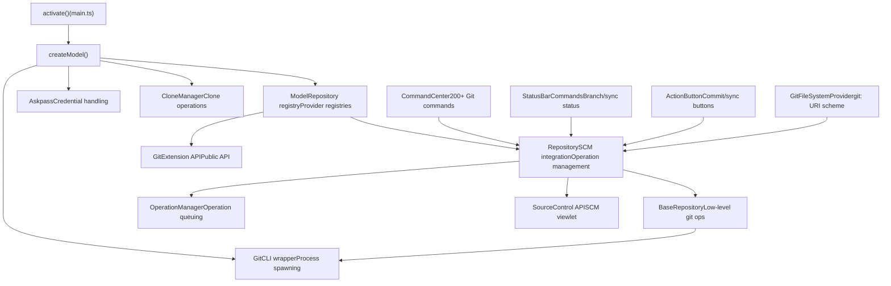
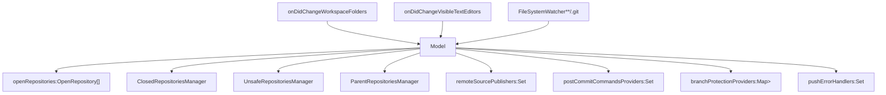
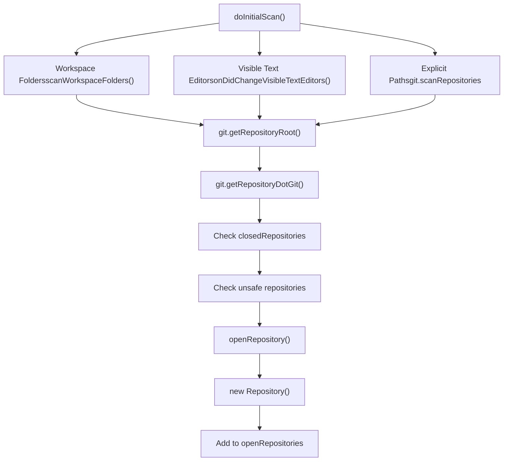
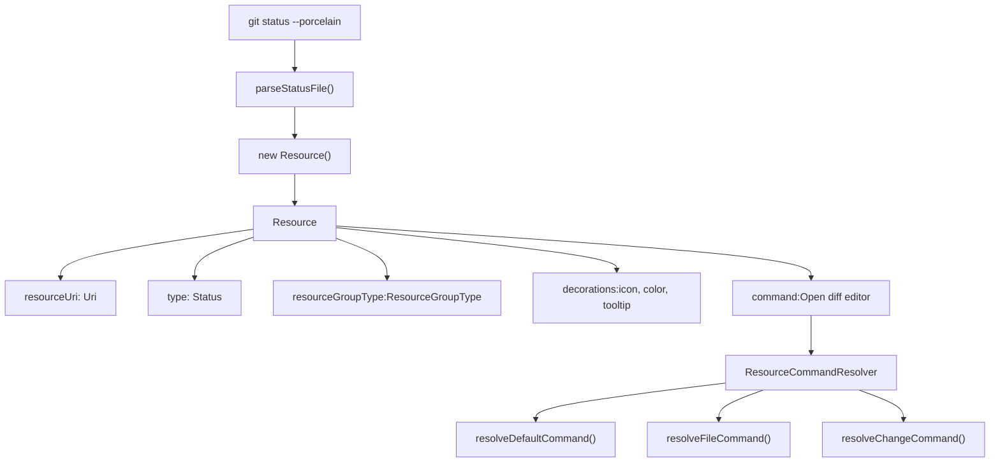
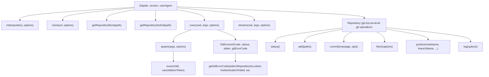
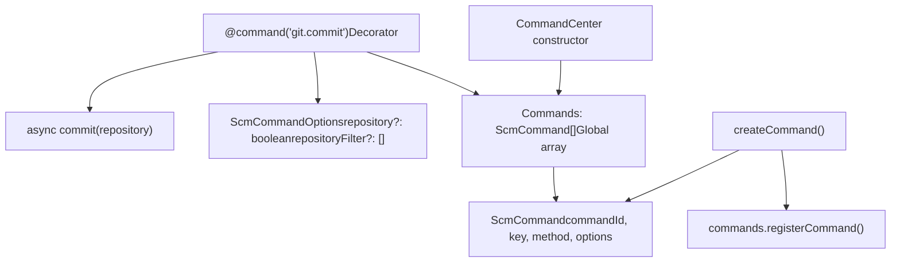
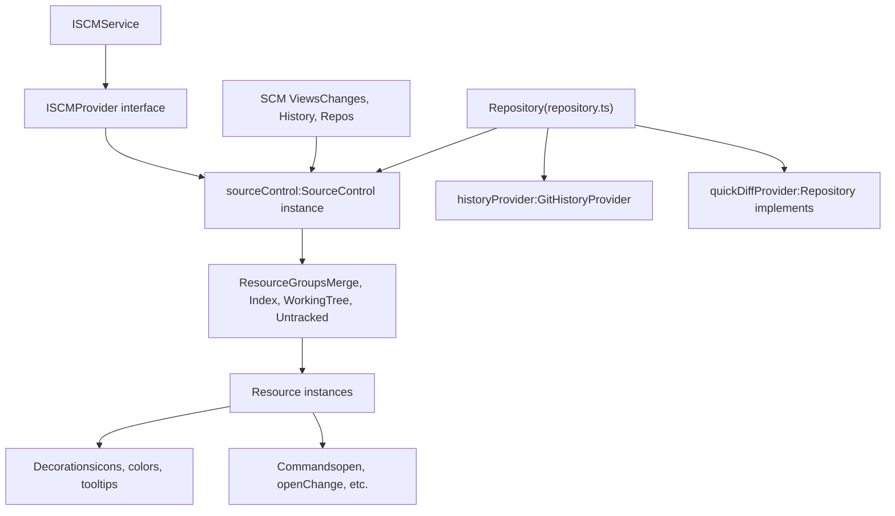
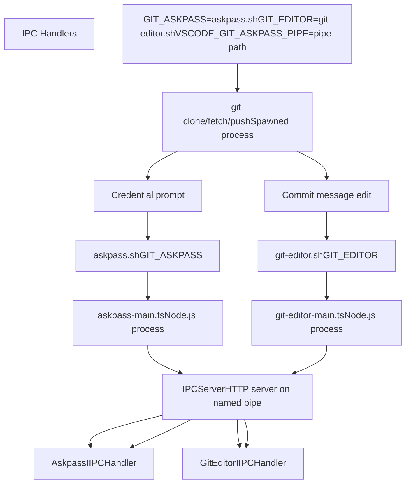
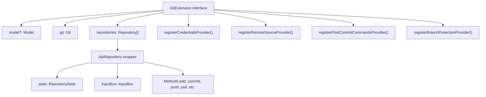

# Git Extension Architecture

Relevant source files

-   [extensions/git/package.json](https://github.com/microsoft/vscode/blob/1be3088d/extensions/git/package.json)
-   [extensions/git/package.nls.json](https://github.com/microsoft/vscode/blob/1be3088d/extensions/git/package.nls.json)
-   [extensions/git/src/actionButton.ts](https://github.com/microsoft/vscode/blob/1be3088d/extensions/git/src/actionButton.ts)
-   [extensions/git/src/api/api1.ts](https://github.com/microsoft/vscode/blob/1be3088d/extensions/git/src/api/api1.ts)
-   [extensions/git/src/api/git.d.ts](https://github.com/microsoft/vscode/blob/1be3088d/extensions/git/src/api/git.d.ts)
-   [extensions/git/src/askpass-empty.sh](https://github.com/microsoft/vscode/blob/1be3088d/extensions/git/src/askpass-empty.sh)
-   [extensions/git/src/askpass-main.ts](https://github.com/microsoft/vscode/blob/1be3088d/extensions/git/src/askpass-main.ts)
-   [extensions/git/src/askpass.sh](https://github.com/microsoft/vscode/blob/1be3088d/extensions/git/src/askpass.sh)
-   [extensions/git/src/askpass.ts](https://github.com/microsoft/vscode/blob/1be3088d/extensions/git/src/askpass.ts)
-   [extensions/git/src/autofetch.ts](https://github.com/microsoft/vscode/blob/1be3088d/extensions/git/src/autofetch.ts)
-   [extensions/git/src/cloneManager.ts](https://github.com/microsoft/vscode/blob/1be3088d/extensions/git/src/cloneManager.ts)
-   [extensions/git/src/commands.ts](https://github.com/microsoft/vscode/blob/1be3088d/extensions/git/src/commands.ts)
-   [extensions/git/src/git.ts](https://github.com/microsoft/vscode/blob/1be3088d/extensions/git/src/git.ts)
-   [extensions/git/src/gitEditor.ts](https://github.com/microsoft/vscode/blob/1be3088d/extensions/git/src/gitEditor.ts)
-   [extensions/git/src/ipc/ipcClient.ts](https://github.com/microsoft/vscode/blob/1be3088d/extensions/git/src/ipc/ipcClient.ts)
-   [extensions/git/src/ipc/ipcServer.ts](https://github.com/microsoft/vscode/blob/1be3088d/extensions/git/src/ipc/ipcServer.ts)
-   [extensions/git/src/main.ts](https://github.com/microsoft/vscode/blob/1be3088d/extensions/git/src/main.ts)
-   [extensions/git/src/model.ts](https://github.com/microsoft/vscode/blob/1be3088d/extensions/git/src/model.ts)
-   [extensions/git/src/operation.ts](https://github.com/microsoft/vscode/blob/1be3088d/extensions/git/src/operation.ts)
-   [extensions/git/src/postCommitCommands.ts](https://github.com/microsoft/vscode/blob/1be3088d/extensions/git/src/postCommitCommands.ts)
-   [extensions/git/src/protocolHandler.ts](https://github.com/microsoft/vscode/blob/1be3088d/extensions/git/src/protocolHandler.ts)
-   [extensions/git/src/repository.ts](https://github.com/microsoft/vscode/blob/1be3088d/extensions/git/src/repository.ts)
-   [extensions/git/src/repositoryCache.ts](https://github.com/microsoft/vscode/blob/1be3088d/extensions/git/src/repositoryCache.ts)
-   [extensions/git/src/ssh-askpass-empty.sh](https://github.com/microsoft/vscode/blob/1be3088d/extensions/git/src/ssh-askpass-empty.sh)
-   [extensions/git/src/ssh-askpass.sh](https://github.com/microsoft/vscode/blob/1be3088d/extensions/git/src/ssh-askpass.sh)
-   [extensions/git/src/statusbar.ts](https://github.com/microsoft/vscode/blob/1be3088d/extensions/git/src/statusbar.ts)
-   [extensions/git/src/terminal.ts](https://github.com/microsoft/vscode/blob/1be3088d/extensions/git/src/terminal.ts)
-   [extensions/git/src/test/repositoryCache.test.ts](https://github.com/microsoft/vscode/blob/1be3088d/extensions/git/src/test/repositoryCache.test.ts)
-   [extensions/git/src/util.ts](https://github.com/microsoft/vscode/blob/1be3088d/extensions/git/src/util.ts)
-   [extensions/git/tsconfig.json](https://github.com/microsoft/vscode/blob/1be3088d/extensions/git/tsconfig.json)
-   [test/automation/src/statusbar.ts](https://github.com/microsoft/vscode/blob/1be3088d/test/automation/src/statusbar.ts)

## Purpose and Scope

This document describes the architecture of VS Code's built-in Git extension, which provides Git source control integration. The extension wraps the Git command-line interface and exposes Git functionality through VS Code's UI and API. It manages repository discovery, command execution, and integration with the SCM platform.

For information about the abstract SCM framework that Git integrates with, see [SCM Framework Architecture](/microsoft/vscode/10.1-scm-framework-architecture). For details about Git command implementations and UI actions, see [Git Commands and Actions](/microsoft/vscode/11.3-git-commands-and-actions). For the Git history provider implementation, see [Git History Provider](/microsoft/vscode/11.4-git-history-provider).

## Overall Architecture

The Git extension follows a layered architecture with clear separation between Git CLI operations, repository management, and VS Code integration.

**Sources:** [extensions/git/src/main.ts192-264](https://github.com/microsoft/vscode/blob/1be3088d/extensions/git/src/main.ts#L192-L264) [extensions/git/src/model.ts186-308](https://github.com/microsoft/vscode/blob/1be3088d/extensions/git/src/model.ts#L186-L308) [extensions/git/src/repository.ts699-1500](https://github.com/microsoft/vscode/blob/1be3088d/extensions/git/src/repository.ts#L699-L1500) [extensions/git/src/commands.ts780-799](https://github.com/microsoft/vscode/blob/1be3088d/extensions/git/src/commands.ts#L780-L799)

## Model: Repository Registry and Service Orchestration

The `Model` class serves as the central registry for all open Git repositories and coordinates extension-wide services.

### Model Responsibilities

| Responsibility | Implementation |
| --- | --- |
| Repository Discovery | Scans workspace folders and parent directories |
| Repository Lifecycle | Opens, closes, and disposes repositories |
| Provider Registries | Manages credential, push error, branch protection providers |
| State Management | Tracks closed, unsafe, and parent repositories |
| API Coordination | Publishes events and coordinates with VS Code APIs |

**Sources:** [extensions/git/src/model.ts186-308](https://github.com/microsoft/vscode/blob/1be3088d/extensions/git/src/model.ts#L186-L308) [extensions/git/src/model.ts310-350](https://github.com/microsoft/vscode/blob/1be3088d/extensions/git/src/model.ts#L310-L350) [extensions/git/src/model.ts357-488](https://github.com/microsoft/vscode/blob/1be3088d/extensions/git/src/model.ts#L357-L488)

### Repository Discovery

The Model implements multi-level repository discovery:

1.  **Workspace Folders**: Scans subfolders up to configured depth (`git.repositoryScanMaxDepth`)
2.  **Open Editors**: Discovers repositories containing currently open files
3.  **Parent Directories**: Optionally discovers repositories in parent folders of workspace
4.  **Explicit Paths**: Scans paths listed in `git.scanRepositories` configuration

**Sources:** [extensions/git/src/model.ts310-350](https://github.com/microsoft/vscode/blob/1be3088d/extensions/git/src/model.ts#L310-L350) [extensions/git/src/model.ts357-448](https://github.com/microsoft/vscode/blob/1be3088d/extensions/git/src/model.ts#L357-L448) [extensions/git/src/model.ts490-650](https://github.com/microsoft/vscode/blob/1be3088d/extensions/git/src/model.ts#L490-L650)

## Repository: SCM Integration and State Management

The `Repository` class represents a single Git repository and provides the bridge between low-level Git operations and VS Code's SCM UI.

### Repository Architecture

```mermaid
flowchart TD
    Repo["Repository"]
    State["RepositoryStateIdle | Disposed"]
    DotGit["dotGit: IDotGitpath, commonPath, superProjectPath"]
    SourceControl["sourceControl:SourceControl"]
    InputBox["inputBox:SourceControlInputBox"]
    ResourceGroups["Resource Groups"]
    MergeGroup["mergeGroup:GitResourceGroup"]
    IndexGroup["indexGroup:GitResourceGroup"]
    WorkingTreeGroup["workingTreeGroup:GitResourceGroup"]
    UntrackedGroup["untrackedGroup:GitResourceGroup"]
    HEAD["HEAD: Branch | undefined"]
    Remotes["remotes: Remote[]"]
    Submodules["submodules: Submodule[]"]
    OpMgr["operations:OperationManager"]
    AutoFetcher["autoFetcher:AutoFetcher"]
    HistoryProvider["historyProvider:GitHistoryProvider"]
    StatusBar["statusBar:StatusBarCommands"]
    ActionButton["actionButton:ActionButton"]

    Repo --> SourceControl
    Repo --> DotGit
    Repo --> State
    SourceControl --> InputBox
    SourceControl --> ResourceGroups
    ResourceGroups --> MergeGroup
    ResourceGroups --> IndexGroup
    ResourceGroups --> WorkingTreeGroup
    ResourceGroups --> UntrackedGroup
    Repo --> HEAD
    Repo --> Remotes
    Repo --> Submodules
    Repo --> OpMgr
    Repo --> AutoFetcher
    Repo --> HistoryProvider
    Repo --> StatusBar
    Repo --> ActionButton
```

**Sources:** [extensions/git/src/repository.ts699-1500](https://github.com/microsoft/vscode/blob/1be3088d/extensions/git/src/repository.ts#L699-L1500) [extensions/git/src/repository.ts40-50](https://github.com/microsoft/vscode/blob/1be3088d/extensions/git/src/repository.ts#L40-L50) [extensions/git/src/repository.ts345-354](https://github.com/microsoft/vscode/blob/1be3088d/extensions/git/src/repository.ts#L345-L354)

### Resource Groups and State

Resources represent files with Git status and are organized into four groups:

| Group Type | Enum Value | Purpose |
| --- | --- | --- |
| Merge | `ResourceGroupType.Merge` | Conflicted files during merge/rebase |
| Index | `ResourceGroupType.Index` | Staged changes |
| WorkingTree | `ResourceGroupType.WorkingTree` | Modified tracked files |
| Untracked | `ResourceGroupType.Untracked` | Untracked files |

**Sources:** [extensions/git/src/repository.ts52-343](https://github.com/microsoft/vscode/blob/1be3088d/extensions/git/src/repository.ts#L52-L343) [extensions/git/src/repository.ts501-683](https://github.com/microsoft/vscode/blob/1be3088d/extensions/git/src/repository.ts#L501-L683) [extensions/git/src/repository.ts1502-2500](https://github.com/microsoft/vscode/blob/1be3088d/extensions/git/src/repository.ts#L1502-L2500)

## Git CLI Wrapper

The `Git` class wraps the Git command-line interface, handling process spawning, output parsing, and error handling.

### Two-Level Git Abstraction

**Sources:** [extensions/git/src/git.ts385-614](https://github.com/microsoft/vscode/blob/1be3088d/extensions/git/src/git.ts#L385-L614) [extensions/git/src/git.ts282-319](https://github.com/microsoft/vscode/blob/1be3088d/extensions/git/src/git.ts#L282-L319) [extensions/git/src/git.ts328-363](https://github.com/microsoft/vscode/blob/1be3088d/extensions/git/src/git.ts#L328-L363) [extensions/git/src/git.ts616-3000](https://github.com/microsoft/vscode/blob/1be3088d/extensions/git/src/git.ts#L616-L3000)

### Git Process Management

The Git class spawns child processes and manages their lifecycle:

1.  **Process Spawning**: Uses `child_process.spawn()` with configured environment
2.  **Stream Handling**: Captures stdout/stderr through buffers and event listeners
3.  **Cancellation**: Supports `CancellationToken` for aborting operations
4.  **Error Parsing**: Extracts Git error codes from stderr patterns

**Sources:** [extensions/git/src/git.ts209-269](https://github.com/microsoft/vscode/blob/1be3088d/extensions/git/src/git.ts#L209-L269) [extensions/git/src/git.ts614-670](https://github.com/microsoft/vscode/blob/1be3088d/extensions/git/src/git.ts#L614-L670)

## Command Center: Command Registration and Execution

The `CommandCenter` class implements 200+ Git commands using a decorator-based registration pattern.

### Command Registration Pattern

**Command Execution Flow:**

> **[Mermaid sequence]**
> *(图表结构无法解析)*

**Sources:** [extensions/git/src/commands.ts373-383](https://github.com/microsoft/vscode/blob/1be3088d/extensions/git/src/commands.ts#L373-L383) [extensions/git/src/commands.ts780-799](https://github.com/microsoft/vscode/blob/1be3088d/extensions/git/src/commands.ts#L780-L799) [extensions/git/src/commands.ts800-3000](https://github.com/microsoft/vscode/blob/1be3088d/extensions/git/src/commands.ts#L800-L3000)

### Repository Resolution

Commands can operate on repositories using multiple resolution strategies:

| Strategy | Description | Configuration |
| --- | --- | --- |
| Explicit | Repository passed as parameter | N/A |
| SCM Selection | Currently selected SCM provider | `options.repository = true` |
| Active Editor | Repository containing active file | Default fallback |
| Quick Pick | User selection from repository list | Multiple repositories |
| Filtered | Submodule/worktree filtering | `options.repositoryFilter` |

**Sources:** [extensions/git/src/commands.ts3000-3100](https://github.com/microsoft/vscode/blob/1be3088d/extensions/git/src/commands.ts#L3000-L3100)

## SCM Platform Integration

The Git extension integrates with VS Code's generic SCM platform through the `SourceControl` API.

**Sources:** [extensions/git/src/repository.ts699-1500](https://github.com/microsoft/vscode/blob/1be3088d/extensions/git/src/repository.ts#L699-L1500) [extensions/git/src/repository.ts1502-2000](https://github.com/microsoft/vscode/blob/1be3088d/extensions/git/src/repository.ts#L1502-L2000)

## Process Architecture: IPC and Helper Processes

The Git extension uses inter-process communication (IPC) for credential handling and Git editor integration.

### IPC Server and Handlers

**Sources:** [extensions/git/src/ipc/ipcServer.ts1-120](https://github.com/microsoft/vscode/blob/1be3088d/extensions/git/src/ipc/ipcServer.ts#L1-L120) [extensions/git/src/askpass.ts13-80](https://github.com/microsoft/vscode/blob/1be3088d/extensions/git/src/askpass.ts#L13-L80) [extensions/git/src/askpass-main.ts1-44](https://github.com/microsoft/vscode/blob/1be3088d/extensions/git/src/askpass-main.ts#L1-L44) [extensions/git/src/gitEditor.ts1-150](https://github.com/microsoft/vscode/blob/1be3088d/extensions/git/src/gitEditor.ts#L1-L150)

### Askpass Flow

The Askpass system handles Git credential prompts:

1.  **Git Process**: Git CLI needs credentials and invokes `GIT_ASKPASS`
2.  **Shell Script**: `askpass.sh` creates a named pipe and spawns Node.js process
3.  **IPC Client**: `askpass-main.ts` connects to IPC server via `VSCODE_GIT_ASKPASS_PIPE`
4.  **Handler**: `Askpass.handle()` shows VS Code credential prompt
5.  **Response**: Credentials written to pipe, read by shell script, returned to Git

**Sources:** [extensions/git/src/askpass.ts51-130](https://github.com/microsoft/vscode/blob/1be3088d/extensions/git/src/askpass.ts#L51-L130) [extensions/git/src/askpass-main.ts15-41](https://github.com/microsoft/vscode/blob/1be3088d/extensions/git/src/askpass-main.ts#L15-L41) [extensions/git/src/askpass.sh1-6](https://github.com/microsoft/vscode/blob/1be3088d/extensions/git/src/askpass.sh#L1-L6)

## Extension Lifecycle and Initialization

### Activation Sequence

> **[Mermaid sequence]**
> *(图表结构无法解析)*

**Sources:** [extensions/git/src/main.ts192-264](https://github.com/microsoft/vscode/blob/1be3088d/extensions/git/src/main.ts#L192-L264) [extensions/git/src/main.ts41-142](https://github.com/microsoft/vscode/blob/1be3088d/extensions/git/src/main.ts#L41-L142) [extensions/git/src/model.ts286-308](https://github.com/microsoft/vscode/blob/1be3088d/extensions/git/src/model.ts#L286-L308) [extensions/git/src/model.ts310-350](https://github.com/microsoft/vscode/blob/1be3088d/extensions/git/src/model.ts#L310-L350)

### Repository Opening

When a Git repository is discovered, it goes through this initialization:

1.  **Discovery**: Path identified via workspace scan, editor, or explicit config
2.  **Validation**: `git.getRepositoryRoot()` and `git.getRepositoryDotGit()` called
3.  **Repository Creation**: `new Repository()` with Git instance and paths
4.  **SCM Registration**: `scm.createSourceControl()` registers with VS Code
5.  **Status Refresh**: Initial `git status` populates resource groups
6.  **Auto-fetcher**: Starts periodic fetch if configured
7.  **Event Subscription**: Watches `.git` directory and workspace files

**Sources:** [extensions/git/src/model.ts490-650](https://github.com/microsoft/vscode/blob/1be3088d/extensions/git/src/model.ts#L490-L650) [extensions/git/src/repository.ts699-1500](https://github.com/microsoft/vscode/blob/1be3088d/extensions/git/src/repository.ts#L699-L1500)

## Configuration and Extension Settings

Key configuration options that control Git extension behavior:

| Configuration | Default | Purpose |
| --- | --- | --- |
| `git.enabled` | `true` | Master switch for Git extension |
| `git.path` | Auto-detected | Path to git executable |
| `git.autoRepositoryDetection` | `true` | When to auto-discover repositories |
| `git.autofetch` | `false` | Auto-fetch from remotes |
| `git.enableSmartCommit` | `false` | Commit all when no staged changes |
| `git.confirmSync` | `true` | Confirm before sync operation |
| `git.branchProtection` | `[]` | List of protected branch patterns |
| `git.postCommitCommand` | `none` | Command to run after commit |

**Sources:** [extensions/git/package.json160-300](https://github.com/microsoft/vscode/blob/1be3088d/extensions/git/package.json#L160-L300)

## Extension API

The Git extension exposes a public API through `GitExtension`:

**Sources:** [extensions/git/src/api/git.d.ts1-450](https://github.com/microsoft/vscode/blob/1be3088d/extensions/git/src/api/git.d.ts#L1-L450) [extensions/git/src/api/api1.ts1-400](https://github.com/microsoft/vscode/blob/1be3088d/extensions/git/src/api/api1.ts#L1-L400) [extensions/git/src/api/extension.ts1-200](https://github.com/microsoft/vscode/blob/1be3088d/extensions/git/src/api/extension.ts#L1-L200)

---

**Summary**: The Git extension is structured as a layered system with clear separation between CLI operations (`Git` and `BaseRepository`), repository management (`Repository` and `Model`), command handling (`CommandCenter`), and VS Code integration (SCM providers, IPC handlers). This architecture enables the extension to manage multiple repositories, handle complex Git workflows, and provide a rich UI experience while maintaining stability through operation queuing and process isolation.
