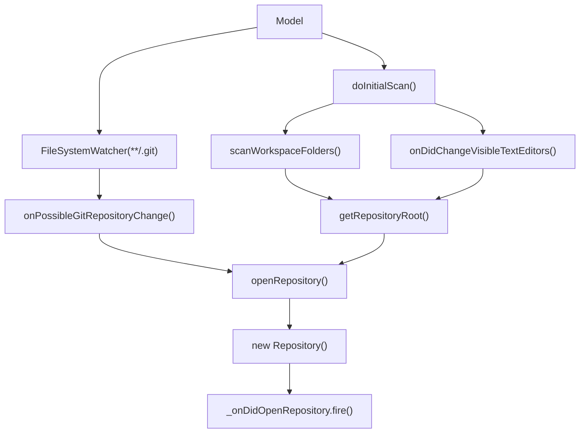
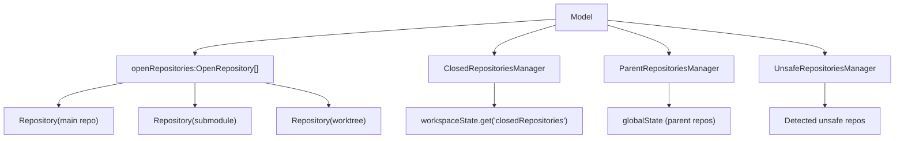
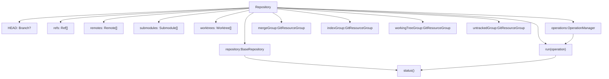
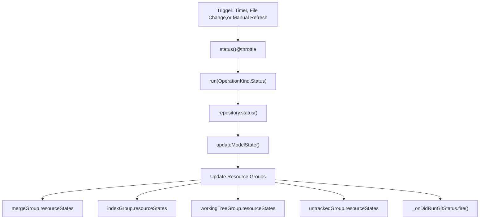
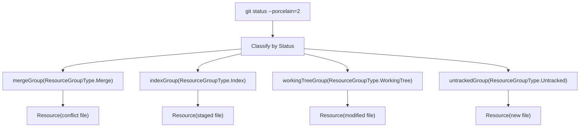
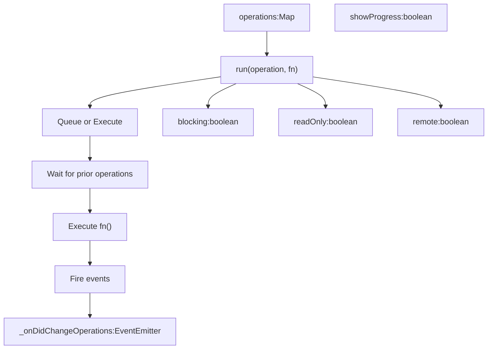
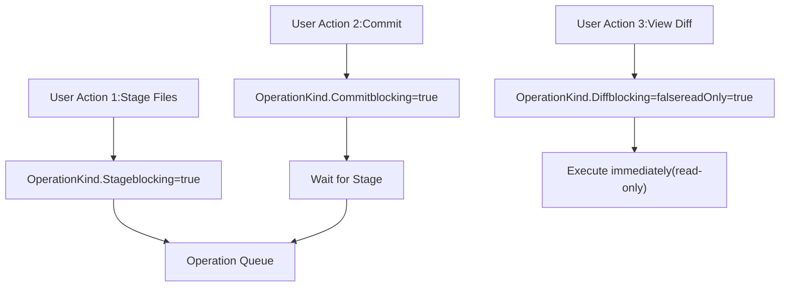
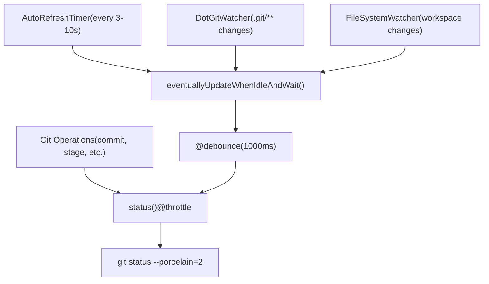
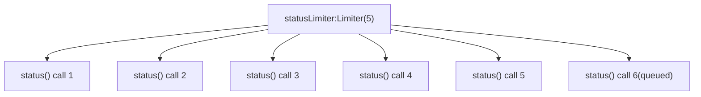
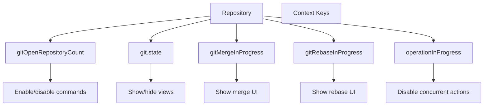

# Repository and Operation Management

Relevant source files

-   [extensions/git/package.json](https://github.com/microsoft/vscode/blob/1be3088d/extensions/git/package.json)
-   [extensions/git/package.nls.json](https://github.com/microsoft/vscode/blob/1be3088d/extensions/git/package.nls.json)
-   [extensions/git/src/actionButton.ts](https://github.com/microsoft/vscode/blob/1be3088d/extensions/git/src/actionButton.ts)
-   [extensions/git/src/api/api1.ts](https://github.com/microsoft/vscode/blob/1be3088d/extensions/git/src/api/api1.ts)
-   [extensions/git/src/api/git.d.ts](https://github.com/microsoft/vscode/blob/1be3088d/extensions/git/src/api/git.d.ts)
-   [extensions/git/src/askpass-empty.sh](https://github.com/microsoft/vscode/blob/1be3088d/extensions/git/src/askpass-empty.sh)
-   [extensions/git/src/askpass-main.ts](https://github.com/microsoft/vscode/blob/1be3088d/extensions/git/src/askpass-main.ts)
-   [extensions/git/src/askpass.sh](https://github.com/microsoft/vscode/blob/1be3088d/extensions/git/src/askpass.sh)
-   [extensions/git/src/askpass.ts](https://github.com/microsoft/vscode/blob/1be3088d/extensions/git/src/askpass.ts)
-   [extensions/git/src/autofetch.ts](https://github.com/microsoft/vscode/blob/1be3088d/extensions/git/src/autofetch.ts)
-   [extensions/git/src/cloneManager.ts](https://github.com/microsoft/vscode/blob/1be3088d/extensions/git/src/cloneManager.ts)
-   [extensions/git/src/commands.ts](https://github.com/microsoft/vscode/blob/1be3088d/extensions/git/src/commands.ts)
-   [extensions/git/src/git.ts](https://github.com/microsoft/vscode/blob/1be3088d/extensions/git/src/git.ts)
-   [extensions/git/src/gitEditor.ts](https://github.com/microsoft/vscode/blob/1be3088d/extensions/git/src/gitEditor.ts)
-   [extensions/git/src/ipc/ipcClient.ts](https://github.com/microsoft/vscode/blob/1be3088d/extensions/git/src/ipc/ipcClient.ts)
-   [extensions/git/src/ipc/ipcServer.ts](https://github.com/microsoft/vscode/blob/1be3088d/extensions/git/src/ipc/ipcServer.ts)
-   [extensions/git/src/main.ts](https://github.com/microsoft/vscode/blob/1be3088d/extensions/git/src/main.ts)
-   [extensions/git/src/model.ts](https://github.com/microsoft/vscode/blob/1be3088d/extensions/git/src/model.ts)
-   [extensions/git/src/operation.ts](https://github.com/microsoft/vscode/blob/1be3088d/extensions/git/src/operation.ts)
-   [extensions/git/src/postCommitCommands.ts](https://github.com/microsoft/vscode/blob/1be3088d/extensions/git/src/postCommitCommands.ts)
-   [extensions/git/src/protocolHandler.ts](https://github.com/microsoft/vscode/blob/1be3088d/extensions/git/src/protocolHandler.ts)
-   [extensions/git/src/repository.ts](https://github.com/microsoft/vscode/blob/1be3088d/extensions/git/src/repository.ts)
-   [extensions/git/src/repositoryCache.ts](https://github.com/microsoft/vscode/blob/1be3088d/extensions/git/src/repositoryCache.ts)
-   [extensions/git/src/ssh-askpass-empty.sh](https://github.com/microsoft/vscode/blob/1be3088d/extensions/git/src/ssh-askpass-empty.sh)
-   [extensions/git/src/ssh-askpass.sh](https://github.com/microsoft/vscode/blob/1be3088d/extensions/git/src/ssh-askpass.sh)
-   [extensions/git/src/statusbar.ts](https://github.com/microsoft/vscode/blob/1be3088d/extensions/git/src/statusbar.ts)
-   [extensions/git/src/terminal.ts](https://github.com/microsoft/vscode/blob/1be3088d/extensions/git/src/terminal.ts)
-   [extensions/git/src/test/repositoryCache.test.ts](https://github.com/microsoft/vscode/blob/1be3088d/extensions/git/src/test/repositoryCache.test.ts)
-   [extensions/git/src/util.ts](https://github.com/microsoft/vscode/blob/1be3088d/extensions/git/src/util.ts)
-   [extensions/git/tsconfig.json](https://github.com/microsoft/vscode/blob/1be3088d/extensions/git/tsconfig.json)
-   [test/automation/src/statusbar.ts](https://github.com/microsoft/vscode/blob/1be3088d/test/automation/src/statusbar.ts)

This page documents how the Git extension discovers, manages, and tracks Git repositories, as well as how it coordinates concurrent Git operations to ensure data consistency and proper sequencing.

For information about the overall Git extension architecture and the Model/Repository/Git abstraction layers, see [Git Extension Architecture](/microsoft/vscode/10.1-scm-framework-architecture). For details about specific user-facing Git commands, see [Git Commands and Actions](/microsoft/vscode/10.3-scm-views-and-ui-components).

## Overview

The Git extension manages multiple repositories simultaneously, each represented by a `Repository` instance. The extension handles:

-   **Repository Discovery**: Scanning workspace folders and open files to find Git repositories
-   **Repository Lifecycle**: Opening, closing, and tracking repository state
-   **Operation Coordination**: Ensuring Git operations run in the correct order and don't conflict
-   **Status Management**: Periodically updating repository state and resource groups

The key classes are:

-   `Model` ([extensions/git/src/model.ts186-785](https://github.com/microsoft/vscode/blob/1be3088d/extensions/git/src/model.ts#L186-L785)): Manages all repositories and coordinates discovery
-   `Repository` ([extensions/git/src/repository.ts699-2294](https://github.com/microsoft/vscode/blob/1be3088d/extensions/git/src/repository.ts#L699-L2294)): Represents a single Git repository
-   `OperationManager` ([extensions/git/src/operation.ts120-371](https://github.com/microsoft/vscode/blob/1be3088d/extensions/git/src/operation.ts#L120-L371)): Coordinates concurrent Git operations

Sources: [extensions/git/src/model.ts186-785](https://github.com/microsoft/vscode/blob/1be3088d/extensions/git/src/model.ts#L186-L785) [extensions/git/src/repository.ts699-2294](https://github.com/microsoft/vscode/blob/1be3088d/extensions/git/src/repository.ts#L699-L2294) [extensions/git/src/operation.ts1-371](https://github.com/microsoft/vscode/blob/1be3088d/extensions/git/src/operation.ts#L1-L371)

## Repository Discovery and Lifecycle

### Discovery Process

The `Model` class orchestrates repository discovery through multiple mechanisms:

**Initial Scan**: When the extension activates, `doInitialScan()` ([extensions/git/src/model.ts310-350](https://github.com/microsoft/vscode/blob/1be3088d/extensions/git/src/model.ts#L310-L350)) performs three parallel scans:

1.  **Workspace Folders**: `scanWorkspaceFolders()` ([extensions/git/src/model.ts357-432](https://github.com/microsoft/vscode/blob/1be3088d/extensions/git/src/model.ts#L357-L432)) scans each workspace folder up to `git.repositoryScanMaxDepth` levels deep
2.  **Open Editors**: `onDidChangeVisibleTextEditors()` ([extensions/git/src/model.ts673-699](https://github.com/microsoft/vscode/blob/1be3088d/extensions/git/src/model.ts#L673-L699)) checks if any open files are in Git repositories
3.  **Watch for Changes**: A `FileSystemWatcher` monitors `**/.git` paths to detect new repositories

Sources: [extensions/git/src/model.ts310-432](https://github.com/microsoft/vscode/blob/1be3088d/extensions/git/src/model.ts#L310-L432) [extensions/git/src/model.ts673-699](https://github.com/microsoft/vscode/blob/1be3088d/extensions/git/src/model.ts#L673-L699)

### Repository States

> **[Mermaid stateDiagram]**
> *(图表结构无法解析)*

The `RepositoryState` enum ([extensions/git/src/repository.ts40-43](https://github.com/microsoft/vscode/blob/1be3088d/extensions/git/src/repository.ts#L40-L43)) defines two states:

-   **Idle**: Repository is active and processing operations
-   **Disposed**: Repository has been closed and cleaned up

Sources: [extensions/git/src/repository.ts40-43](https://github.com/microsoft/vscode/blob/1be3088d/extensions/git/src/repository.ts#L40-L43)

### Repository Management

The `Model` maintains several repository collections:

**Open Repositories** ([extensions/git/src/model.ts200-201](https://github.com/microsoft/vscode/blob/1be3088d/extensions/git/src/model.ts#L200-L201)): Active `Repository` instances wrapped in `OpenRepository` objects with their disposables

**Closed Repositories** ([extensions/git/src/model.ts64-98](https://github.com/microsoft/vscode/blob/1be3088d/extensions/git/src/model.ts#L64-L98)): The `ClosedRepositoriesManager` tracks repositories that users have explicitly closed, stored in workspace state

**Parent Repositories** ([extensions/git/src/model.ts100-141](https://github.com/microsoft/vscode/blob/1be3088d/extensions/git/src/model.ts#L100-L141)): The `ParentRepositoriesManager` tracks repositories found in parent folders (above workspace root), requiring explicit user confirmation to open

**Unsafe Repositories** ([extensions/git/src/model.ts143-184](https://github.com/microsoft/vscode/blob/1be3088d/extensions/git/src/model.ts#L143-L184)): The `UnsafeRepositoriesManager` tracks repositories that Git considers unsafe due to ownership issues

Sources: [extensions/git/src/model.ts64-184](https://github.com/microsoft/vscode/blob/1be3088d/extensions/git/src/model.ts#L64-L184) [extensions/git/src/model.ts200-201](https://github.com/microsoft/vscode/blob/1be3088d/extensions/git/src/model.ts#L200-L201)

## Repository Class Architecture

### Core Structure

The `Repository` class represents a single Git repository and manages its state, operations, and resource groups:

**Key Components**:

-   **State Properties** ([extensions/git/src/repository.ts709-719](https://github.com/microsoft/vscode/blob/1be3088d/extensions/git/src/repository.ts#L709-L719)): Current branch (`HEAD`), refs, remotes, submodules, and worktrees
-   **OperationManager** ([extensions/git/src/repository.ts766](https://github.com/microsoft/vscode/blob/1be3088d/extensions/git/src/repository.ts#L766-L766)): Coordinates all Git operations
-   **Resource Groups** ([extensions/git/src/repository.ts732-735](https://github.com/microsoft/vscode/blob/1be3088d/extensions/git/src/repository.ts#L732-L735)): SCM resource groups for merge conflicts, staged changes, working tree changes, and untracked files
-   **BaseRepository** ([extensions/git/src/repository.ts711](https://github.com/microsoft/vscode/blob/1be3088d/extensions/git/src/repository.ts#L711-L711)): Low-level Git command wrapper from `git.ts`

Sources: [extensions/git/src/repository.ts699-800](https://github.com/microsoft/vscode/blob/1be3088d/extensions/git/src/repository.ts#L699-L800)

### Repository Initialization

> **[Mermaid sequence]**
> *(图表结构无法解析)*

When a repository is opened ([extensions/git/src/repository.ts773-824](https://github.com/microsoft/vscode/blob/1be3088d/extensions/git/src/repository.ts#L773-L824)):

1.  Creates the `BaseRepository` wrapper for Git commands
2.  Registers a VS Code `SourceControl` instance
3.  Creates four resource groups (merge, index, working tree, untracked)
4.  Initializes `AutoFetcher` for periodic fetching
5.  Sets up `ProgressManager` for operation progress indicators
6.  Runs initial `status()` to populate state

Sources: [extensions/git/src/repository.ts773-824](https://github.com/microsoft/vscode/blob/1be3088d/extensions/git/src/repository.ts#L773-L824)

### Status Update Flow

The `status()` method ([extensions/git/src/repository.ts1108-1250](https://github.com/microsoft/vscode/blob/1be3088d/extensions/git/src/repository.ts#L1108-L1250)) is the core of repository state management:

1.  **Throttled Execution**: Uses `@throttle` decorator to prevent excessive calls
2.  **Operation Wrapping**: Executes through `run()` to coordinate with other operations
3.  **Git Status**: Calls `BaseRepository.status()` to get current repository state
4.  **State Update**: `updateModelState()` ([extensions/git/src/repository.ts848-1033](https://github.com/microsoft/vscode/blob/1be3088d/extensions/git/src/repository.ts#L848-L1033)) processes the status into:
    -   HEAD branch information
    -   Refs (branches, tags, remote heads)
    -   Remotes
    -   Submodules and worktrees
    -   Merge/rebase state
5.  **Resource Groups**: Updates the four SCM resource groups with current file changes
6.  **Event Notification**: Fires `onDidRunGitStatus` for UI updates

Sources: [extensions/git/src/repository.ts1108-1250](https://github.com/microsoft/vscode/blob/1be3088d/extensions/git/src/repository.ts#L1108-L1250) [extensions/git/src/repository.ts848-1033](https://github.com/microsoft/vscode/blob/1be3088d/extensions/git/src/repository.ts#L848-L1033)

### Resource Groups and File States

Each file in the repository is represented as a `Resource` ([extensions/git/src/repository.ts52-343](https://github.com/microsoft/vscode/blob/1be3088d/extensions/git/src/repository.ts#L52-L343)) and placed in one of four groups:

-   **Merge Group** ([extensions/git/src/repository.ts732](https://github.com/microsoft/vscode/blob/1be3088d/extensions/git/src/repository.ts#L732-L732)): Files with merge conflicts (`BOTH_MODIFIED`, `ADDED_BY_US`, etc.)
-   **Index Group** ([extensions/git/src/repository.ts733](https://github.com/microsoft/vscode/blob/1be3088d/extensions/git/src/repository.ts#L733-L733)): Staged changes (`INDEX_MODIFIED`, `INDEX_ADDED`, `INDEX_DELETED`)
-   **Working Tree Group** ([extensions/git/src/repository.ts734](https://github.com/microsoft/vscode/blob/1be3088d/extensions/git/src/repository.ts#L734-L734)): Unstaged changes (`MODIFIED`, `DELETED`, `TYPE_CHANGED`)
-   **Untracked Group** ([extensions/git/src/repository.ts735](https://github.com/microsoft/vscode/blob/1be3088d/extensions/git/src/repository.ts#L735-L735)): New files not tracked by Git (`UNTRACKED`)

The `Resource` class provides:

-   **Status Letters**: Single-character status codes (`M`, `A`, `D`, `R`, etc.)
-   **Status Colors**: Theme colors for different file states
-   **Icons**: Light/dark icons for each status type
-   **Commands**: Default actions when clicking a resource

Sources: [extensions/git/src/repository.ts52-343](https://github.com/microsoft/vscode/blob/1be3088d/extensions/git/src/repository.ts#L52-L343) [extensions/git/src/repository.ts732-735](https://github.com/microsoft/vscode/blob/1be3088d/extensions/git/src/repository.ts#L732-L735)

## Operation Management

### OperationManager Architecture

The `OperationManager` ([extensions/git/src/operation.ts120-371](https://github.com/microsoft/vscode/blob/1be3088d/extensions/git/src/operation.ts#L120-L371)) ensures Git operations execute safely without conflicts:

**Core Responsibilities**:

1.  **Operation Tracking**: Maintains a map of currently executing operations by kind
2.  **Sequencing**: Ensures operations that modify state don't run concurrently
3.  **Progress**: Shows progress indicators for long-running operations
4.  **Cancellation**: Supports canceling operations that are safe to cancel

Sources: [extensions/git/src/operation.ts120-371](https://github.com/microsoft/vscode/blob/1be3088d/extensions/git/src/operation.ts#L120-L371)

### Operation Kinds and Properties

Each operation has a kind ([extensions/git/src/operation.ts9-67](https://github.com/microsoft/vscode/blob/1be3088d/extensions/git/src/operation.ts#L9-L67)) and properties ([extensions/git/src/operation.ts79-258](https://github.com/microsoft/vscode/blob/1be3088d/extensions/git/src/operation.ts#L79-L258)) that control its execution:

| Property | Purpose | Example |
| --- | --- | --- |
| **blocking** | Operation modifies state, blocks other blocking operations | `Commit: true` |
| **readOnly** | Operation only reads state, can run concurrently | `Show: true` |
| **remote** | Operation involves network communication | `Fetch: true` |
| **retry** | Operation can be automatically retried on failure | `Status: true` |
| **showProgress** | Show progress indicator in UI | `Push: true` |

Examples:

-   **Commit** ([extensions/git/src/operation.ts128](https://github.com/microsoft/vscode/blob/1be3088d/extensions/git/src/operation.ts#L128-L128)): `blocking=true, readOnly=false` - modifies repository
-   **Status** ([extensions/git/src/operation.ts237](https://github.com/microsoft/vscode/blob/1be3088d/extensions/git/src/operation.ts#L237-L237)): `blocking=false, readOnly=true` - only reads state
-   **Fetch** ([extensions/git/src/operation.ts167](https://github.com/microsoft/vscode/blob/1be3088d/extensions/git/src/operation.ts#L167-L167)): `blocking=false, remote=true` - network operation
-   **Push** ([extensions/git/src/operation.ts207](https://github.com/microsoft/vscode/blob/1be3088d/extensions/git/src/operation.ts#L207-L207)): `blocking=true, remote=true` - modifies and uses network

Sources: [extensions/git/src/operation.ts9-67](https://github.com/microsoft/vscode/blob/1be3088d/extensions/git/src/operation.ts#L9-L67) [extensions/git/src/operation.ts79-258](https://github.com/microsoft/vscode/blob/1be3088d/extensions/git/src/operation.ts#L79-L258)

### Operation Execution Flow

> **[Mermaid sequence]**
> *(图表结构无法解析)*

The `run()` method ([extensions/git/src/operation.ts300-371](https://github.com/microsoft/vscode/blob/1be3088d/extensions/git/src/operation.ts#L300-L371)) coordinates operation execution:

1.  **Check for Conflicts**: If a blocking operation is running and this operation is also blocking, queue it
2.  **Register Operation**: Add to the `operations` map
3.  **Execute Function**: Call the provided function (e.g., `repository.commit()`)
4.  **Handle Errors**: Wrap errors with operation context
5.  **Unregister**: Remove from operations map
6.  **Fire Events**: Notify listeners via `onDidChangeOperations` and `onDidRunOperation`

Sources: [extensions/git/src/operation.ts300-371](https://github.com/microsoft/vscode/blob/1be3088d/extensions/git/src/operation.ts#L300-L371)

### Operation Coordination Example

**Concurrent Execution**: Read-only operations like `Diff` or `Show` can run while blocking operations are executing

**Sequential Execution**: Blocking operations like `Stage` and `Commit` run one at a time

**Retry Logic**: Some operations (like `Status`) automatically retry on transient failures

Sources: [extensions/git/src/operation.ts260-290](https://github.com/microsoft/vscode/blob/1be3088d/extensions/git/src/operation.ts#L260-L290)

## Status Updates and Refresh Mechanisms

### Automatic Status Updates

The `Repository` class triggers status updates through multiple mechanisms:

**Auto-Refresh Timer** ([extensions/git/src/repository.ts1278-1310](https://github.com/microsoft/vscode/blob/1be3088d/extensions/git/src/repository.ts#L1278-L1310)): When `git.autorefresh` is enabled, status updates run every 3-10 seconds (randomized to spread load)

**File Watchers**:

-   **DotGitWatcher** ([extensions/git/src/repository.ts449-499](https://github.com/microsoft/vscode/blob/1be3088d/extensions/git/src/repository.ts#L449-L499)): Watches `.git` directory for ref changes, ignoring temporary files like `index.lock`
-   **Workspace Watcher** ([extensions/git/src/repository.ts1330-1354](https://github.com/microsoft/vscode/blob/1be3088d/extensions/git/src/repository.ts#L1330-L1354)): Watches for file changes in the working tree

**Operation Triggers**: Operations like `commit()`, `stage()`, and `clean()` explicitly call `status()` after completion

**Throttling**:

-   `@throttle` decorator on `status()` prevents excessive calls
-   `@debounce` decorator on file watcher handlers delays status updates by 1 second

Sources: [extensions/git/src/repository.ts1278-1354](https://github.com/microsoft/vscode/blob/1be3088d/extensions/git/src/repository.ts#L1278-L1354) [extensions/git/src/repository.ts449-499](https://github.com/microsoft/vscode/blob/1be3088d/extensions/git/src/repository.ts#L449-L499)

### Status Update Optimization

The `Limiter` ([extensions/git/src/util.ts442-461](https://github.com/microsoft/vscode/blob/1be3088d/extensions/git/src/util.ts#L442-L461)) restricts concurrent status operations to 5 at a time. This prevents overloading Git when multiple repositories are open.

**Smart Update**: When idle and waiting (`eventuallyUpdateWhenIdleAndWait()`), the repository waits for:

1.  All running operations to complete
2.  A 5-second idle period
3.  Then runs status update

This ensures status updates don't interfere with user actions.

Sources: [extensions/git/src/repository.ts1367-1377](https://github.com/microsoft/vscode/blob/1be3088d/extensions/git/src/repository.ts#L1367-L1377) [extensions/git/src/util.ts442-461](https://github.com/microsoft/vscode/blob/1be3088d/extensions/git/src/util.ts#L442-L461)

### Repository Context Keys

The repository exposes several context keys for conditional UI behavior:

Key context keys set by the repository ([extensions/git/src/repository.ts835-847](https://github.com/microsoft/vscode/blob/1be3088d/extensions/git/src/repository.ts#L835-L847)):

-   `operationInProgress`: When any operation is running
-   `gitOpenRepositoryCount`: Number of open repositories
-   `gitMergeInProgress`: When in merge state
-   `gitRebaseInProgress`: When rebasing

These control command enablement in `package.json`.

Sources: [extensions/git/src/repository.ts835-847](https://github.com/microsoft/vscode/blob/1be3088d/extensions/git/src/repository.ts#L835-L847) [extensions/git/package.json78-1022](https://github.com/microsoft/vscode/blob/1be3088d/extensions/git/package.json#L78-L1022)
