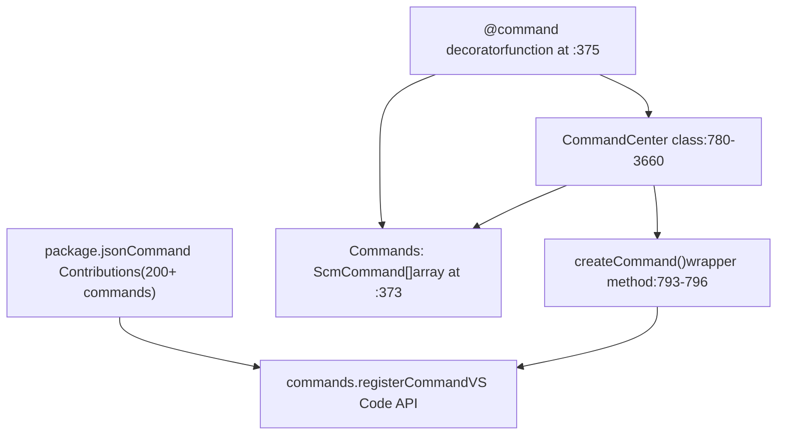
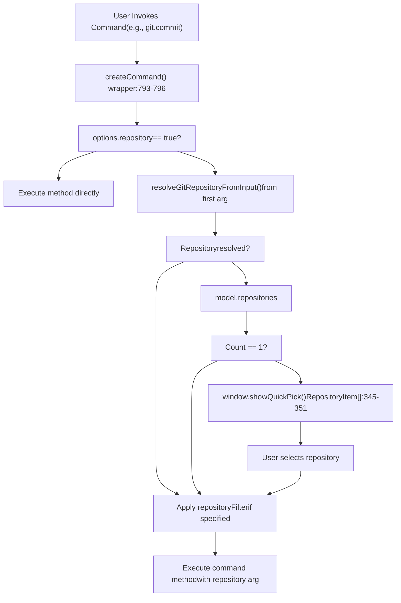
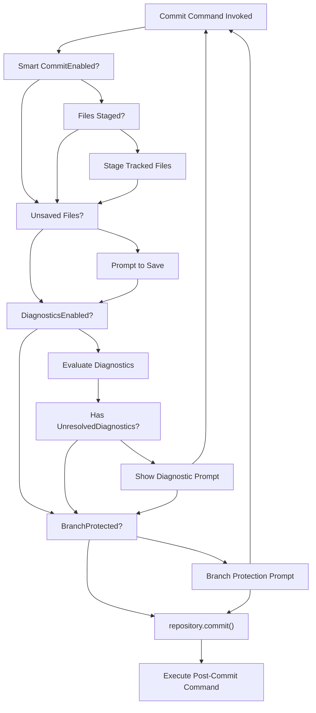
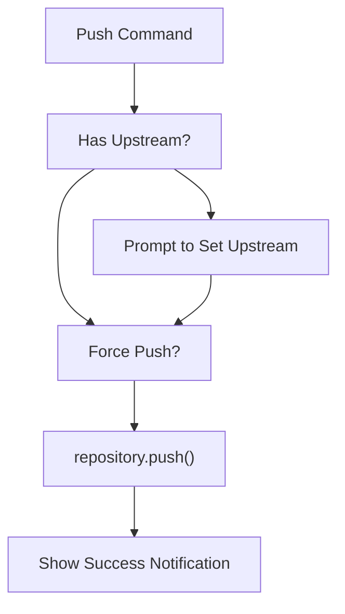

# Git Commands and Actions

Relevant source files

-   [extensions/git/package.json](https://github.com/microsoft/vscode/blob/1be3088d/extensions/git/package.json)
-   [extensions/git/package.nls.json](https://github.com/microsoft/vscode/blob/1be3088d/extensions/git/package.nls.json)
-   [extensions/git/src/actionButton.ts](https://github.com/microsoft/vscode/blob/1be3088d/extensions/git/src/actionButton.ts)
-   [extensions/git/src/api/api1.ts](https://github.com/microsoft/vscode/blob/1be3088d/extensions/git/src/api/api1.ts)
-   [extensions/git/src/api/git.d.ts](https://github.com/microsoft/vscode/blob/1be3088d/extensions/git/src/api/git.d.ts)
-   [extensions/git/src/askpass-empty.sh](https://github.com/microsoft/vscode/blob/1be3088d/extensions/git/src/askpass-empty.sh)
-   [extensions/git/src/askpass-main.ts](https://github.com/microsoft/vscode/blob/1be3088d/extensions/git/src/askpass-main.ts)
-   [extensions/git/src/askpass.sh](https://github.com/microsoft/vscode/blob/1be3088d/extensions/git/src/askpass.sh)
-   [extensions/git/src/askpass.ts](https://github.com/microsoft/vscode/blob/1be3088d/extensions/git/src/askpass.ts)
-   [extensions/git/src/autofetch.ts](https://github.com/microsoft/vscode/blob/1be3088d/extensions/git/src/autofetch.ts)
-   [extensions/git/src/cloneManager.ts](https://github.com/microsoft/vscode/blob/1be3088d/extensions/git/src/cloneManager.ts)
-   [extensions/git/src/commands.ts](https://github.com/microsoft/vscode/blob/1be3088d/extensions/git/src/commands.ts)
-   [extensions/git/src/git.ts](https://github.com/microsoft/vscode/blob/1be3088d/extensions/git/src/git.ts)
-   [extensions/git/src/gitEditor.ts](https://github.com/microsoft/vscode/blob/1be3088d/extensions/git/src/gitEditor.ts)
-   [extensions/git/src/ipc/ipcClient.ts](https://github.com/microsoft/vscode/blob/1be3088d/extensions/git/src/ipc/ipcClient.ts)
-   [extensions/git/src/ipc/ipcServer.ts](https://github.com/microsoft/vscode/blob/1be3088d/extensions/git/src/ipc/ipcServer.ts)
-   [extensions/git/src/main.ts](https://github.com/microsoft/vscode/blob/1be3088d/extensions/git/src/main.ts)
-   [extensions/git/src/model.ts](https://github.com/microsoft/vscode/blob/1be3088d/extensions/git/src/model.ts)
-   [extensions/git/src/operation.ts](https://github.com/microsoft/vscode/blob/1be3088d/extensions/git/src/operation.ts)
-   [extensions/git/src/postCommitCommands.ts](https://github.com/microsoft/vscode/blob/1be3088d/extensions/git/src/postCommitCommands.ts)
-   [extensions/git/src/protocolHandler.ts](https://github.com/microsoft/vscode/blob/1be3088d/extensions/git/src/protocolHandler.ts)
-   [extensions/git/src/repository.ts](https://github.com/microsoft/vscode/blob/1be3088d/extensions/git/src/repository.ts)
-   [extensions/git/src/repositoryCache.ts](https://github.com/microsoft/vscode/blob/1be3088d/extensions/git/src/repositoryCache.ts)
-   [extensions/git/src/ssh-askpass-empty.sh](https://github.com/microsoft/vscode/blob/1be3088d/extensions/git/src/ssh-askpass-empty.sh)
-   [extensions/git/src/ssh-askpass.sh](https://github.com/microsoft/vscode/blob/1be3088d/extensions/git/src/ssh-askpass.sh)
-   [extensions/git/src/statusbar.ts](https://github.com/microsoft/vscode/blob/1be3088d/extensions/git/src/statusbar.ts)
-   [extensions/git/src/terminal.ts](https://github.com/microsoft/vscode/blob/1be3088d/extensions/git/src/terminal.ts)
-   [extensions/git/src/test/repositoryCache.test.ts](https://github.com/microsoft/vscode/blob/1be3088d/extensions/git/src/test/repositoryCache.test.ts)
-   [extensions/git/src/util.ts](https://github.com/microsoft/vscode/blob/1be3088d/extensions/git/src/util.ts)
-   [extensions/git/tsconfig.json](https://github.com/microsoft/vscode/blob/1be3088d/extensions/git/tsconfig.json)
-   [test/automation/src/statusbar.ts](https://github.com/microsoft/vscode/blob/1be3088d/test/automation/src/statusbar.ts)

This document describes the command infrastructure of the Git extension, focusing on the `CommandCenter` class that implements all user-facing Git commands and the supporting classes that enable interactive command flows such as branch checkout, commit operations, and remote management.

For information about the underlying Git operations and repository state management, see [Repository and Operation Management](/microsoft/vscode/10.2-scm-provider-system). For details about the Git history interface, see [Git History Provider](/microsoft/vscode/10.4-scm-history-provider).

## Command Center Architecture

The `CommandCenter` class in [extensions/git/src/commands.ts780-799](https://github.com/microsoft/vscode/blob/1be3088d/extensions/git/src/commands.ts#L780-L799) serves as the central hub for all Git command implementations. It is instantiated with dependencies:

| Dependency | Type | Purpose |
| --- | --- | --- |
| `git` | `Git` | Git CLI wrapper for executing git commands |
| `model` | `Model` | Repository model containing all open repositories |
| `globalState` | `Memento` | Extension global state storage |
| `logger` | `LogOutputChannel` | Logging output channel |
| `telemetryReporter` | `TelemetryReporter` | Telemetry reporting |
| `cloneManager` | `CloneManager` | Repository cloning operations |

Commands are registered using the `@command` decorator which collects metadata into the `Commands` array [extensions/git/src/commands.ts373](https://github.com/microsoft/vscode/blob/1be3088d/extensions/git/src/commands.ts#L373-L373) of `ScmCommand` objects. Each command entry contains:

```
interface ScmCommand {
    commandId: string;      // VS Code command ID (e.g., 'git.commit')
    key: string;            // Method name on CommandCenter class
    method: Function;       // Command implementation method
    options: ScmCommandOptions; // Command options
}
```
The `ScmCommandOptions` interface [extensions/git/src/commands.ts361-364](https://github.com/microsoft/vscode/blob/1be3088d/extensions/git/src/commands.ts#L361-L364) specifies:

-   `repository?: boolean` - Whether the command requires a repository context
-   `repositoryFilter?: ('repository' | 'submodule' | 'worktree')[]` - Filter by repository kind


**Diagram: Command Registration Architecture**

The decorator pattern implementation [extensions/git/src/commands.ts375-383](https://github.com/microsoft/vscode/blob/1be3088d/extensions/git/src/commands.ts#L375-L383):

1.  Decorator function validates the target is a method
2.  Extracts method name from `ClassMethodDecoratorContext`
3.  Pushes `ScmCommand` object to `Commands` array
4.  Returns the original method unchanged

The constructor [extensions/git/src/commands.ts793-796](https://github.com/microsoft/vscode/blob/1be3088d/extensions/git/src/commands.ts#L793-L796) maps over the `Commands` array, calling `createCommand()` for each entry to create wrapped command handlers that handle repository resolution automatically.

**Sources:** [extensions/git/src/commands.ts780-799](https://github.com/microsoft/vscode/blob/1be3088d/extensions/git/src/commands.ts#L780-L799) [extensions/git/src/commands.ts373](https://github.com/microsoft/vscode/blob/1be3088d/extensions/git/src/commands.ts#L373-L373) [extensions/git/src/commands.ts375-383](https://github.com/microsoft/vscode/blob/1be3088d/extensions/git/src/commands.ts#L375-L383) [extensions/git/src/commands.ts361-364](https://github.com/microsoft/vscode/blob/1be3088d/extensions/git/src/commands.ts#L361-L364) [extensions/git/src/commands.ts793-796](https://github.com/microsoft/vscode/blob/1be3088d/extensions/git/src/commands.ts#L793-L796)

## Command Helper Classes

The Git extension uses a hierarchy of helper classes to present interactive quick picks for selecting refs, branches, remotes, and other Git entities. These classes implement the `QuickPickItem` interface and provide formatted labels, descriptions, and icons.

### Quick Pick Item Class Hierarchy

```mermaid
flowchart TD
    classId_QuickPickItem_58["«vscode interface»"]
    classId_CheckoutCommandItem_59["«abstract :24-28»"]
    classId_CreateBranchItem_60["«:30-32»"]
    classId_RefItemSeparator_61["«:42-59»"]
    classId_RefItem_62["«:61-121»"]
    classId_BranchItem_63["«:123-140»"]
    classId_CheckoutItem_64["«:142-154»"]
    classId_CheckoutProtectedItem_65["«:156-161»"]
    classId_CheckoutRemoteHeadItem_66["«:163-183»"]
    classId_CheckoutTagItem_67["«:185-194»"]
    classId_BranchDeleteItem_68["«:196-206»"]
    classId_MergeItem_69["«:274-281»"]
    classId_RebaseItem_70["«:283-290»"]
    classId_RemoteItem_71["«:323-333»"]
    classId_StashItem_72["«:353-359»"]
```


**Diagram: Quick Pick Item Class Hierarchy with Code Locations**

Key helper classes include:

| Class | Purpose | Key Properties |
| --- | --- | --- |
| `RefItem` | Base class for Git refs | `ref`, `shortCommit`, `refId`, `buttons` |
| `BranchItem` | Represents branches with ahead/behind info | Extends `RefItem` with sync status |
| `CheckoutItem` | Executable checkout action | `run()` method with checkout options |
| `CheckoutProtectedItem` | Protected branch with lock icon | Override `label` with lock icon |
| `CheckoutRemoteHeadItem` | Remote branch checkout | Creates/checks out tracking branch |
| `CheckoutTagItem` | Tag checkout | Checks out tag reference |
| `BranchDeleteItem` | Branch deletion action | Handles local and remote deletion |
| `MergeItem` / `RebaseItem` | Branch merge/rebase actions | Execute merge/rebase operations |
| `RemoteItem` | Remote fetch action | Represents a remote for fetch |
| `StashItem` | Stash entry | Displays stash index and description |

The `RefProcessor` and `RefItemsProcessor` classes [extensions/git/src/commands.ts470-543](https://github.com/microsoft/vscode/blob/1be3088d/extensions/git/src/commands.ts#L470-L543) transform raw `Ref` objects into appropriate `QuickPickItem` instances based on ref type and context.

**Sources:** [extensions/git/src/commands.ts24-360](https://github.com/microsoft/vscode/blob/1be3088d/extensions/git/src/commands.ts#L24-L360) [extensions/git/src/commands.ts470-543](https://github.com/microsoft/vscode/blob/1be3088d/extensions/git/src/commands.ts#L470-L543) [extensions/git/src/commands.ts562-625](https://github.com/microsoft/vscode/blob/1be3088d/extensions/git/src/commands.ts#L562-L625)

## Repository Selection and Filtering

Commands decorated with `{ repository: true }` require repository context. The `createCommand()` method [extensions/git/src/commands.ts793-796](https://github.com/microsoft/vscode/blob/1be3088d/extensions/git/src/commands.ts#L793-L796) wraps these commands with automatic repository resolution logic.


**Diagram: Repository Resolution Flow in createCommand()**

The `resolveGitRepositoryFromInput()` function extracts repositories from:

| Input Type | Resolution Method |
| --- | --- |
| `SourceControl` | `model.getRepository(sourceControl)` |
| `SourceControlResourceGroup` | `model.getRepository(group.resourceGroup)` |
| `Uri` | `model.getRepository(uri)` - finds repo containing file |
| `string` | Direct lookup by root path |

The `RepositoryItem` class [extensions/git/src/commands.ts345-351](https://github.com/microsoft/vscode/blob/1be3088d/extensions/git/src/commands.ts#L345-L351) formats repository quick pick items:

```
class RepositoryItem implements QuickPickItem {
    label: string;      // Repository name (folder basename)
    description: string; // Full path to repository
    path: string;       // Repository root path
}
```
Repository filtering via `repositoryFilter` option [extensions/git/src/commands.ts361-364](https://github.com/microsoft/vscode/blob/1be3088d/extensions/git/src/commands.ts#L361-L364) allows commands to restrict to specific repository kinds:

-   `'repository'` - Standard repositories only
-   `'submodule'` - Submodule repositories only
-   `'worktree'` - Worktree repositories only

**Sources:** [extensions/git/src/commands.ts793-796](https://github.com/microsoft/vscode/blob/1be3088d/extensions/git/src/commands.ts#L793-L796) [extensions/git/src/commands.ts345-351](https://github.com/microsoft/vscode/blob/1be3088d/extensions/git/src/commands.ts#L345-L351) [extensions/git/src/commands.ts361-364](https://github.com/microsoft/vscode/blob/1be3088d/extensions/git/src/commands.ts#L361-L364)

## Checkout Command Flow

The `checkout()` method [extensions/git/src/commands.ts1262-1301](https://github.com/microsoft/vscode/blob/1be3088d/extensions/git/src/commands.ts#L1262-L1301) demonstrates interactive ref selection using the ref processing infrastructure.

**Diagram: Checkout Command Sequence with Code References**

The `createCheckoutItems()` function [extensions/git/src/commands.ts412-440](https://github.com/microsoft/vscode/blob/1be3088d/extensions/git/src/commands.ts#L412-L440) builds checkout items:

1.  **Read configuration** [extensions/git/src/commands.ts413-415](https://github.com/microsoft/vscode/blob/1be3088d/extensions/git/src/commands.ts#L413-L415):

    -   `git.checkoutType`: `'all'` | `'local'` | `'remote'` | `'tags'` | `string[]`
    -   `git.showReferenceDetails`: Include commit author/date details
2.  **Determine checkout types** [extensions/git/src/commands.ts417-430](https://github.com/microsoft/vscode/blob/1be3088d/extensions/git/src/commands.ts#L417-L430):

    ```
    if (checkoutTypeConfig === 'all' || !checkoutTypeConfig || checkoutTypeConfig.length === 0) {
        checkoutTypes = ['local', 'remote', 'tags'];
    } else if (typeof checkoutTypeConfig === 'string') {
        checkoutTypes = [checkoutTypeConfig];
    } else {
        checkoutTypes = checkoutTypeConfig;
    }
    ```

3.  **Get refs** [extensions/git/src/commands.ts432](https://github.com/microsoft/vscode/blob/1be3088d/extensions/git/src/commands.ts#L432-L432):

    -   Calls `repository.getRefs({ includeCommitDetails: showRefDetails })`
4.  **Create processors** [extensions/git/src/commands.ts433-434](https://github.com/microsoft/vscode/blob/1be3088d/extensions/git/src/commands.ts#L433-L434):

    -   Maps checkout types to `RefProcessor` instances via `getCheckoutRefProcessor()`
    -   `'local'` → `CheckoutRefProcessor` (checks branch protection)
    -   `'remote'` → `RefProcessor` with `CheckoutRemoteHeadItem`
    -   `'tags'` → `RefProcessor` with `CheckoutTagItem`
5.  **Attach buttons** [extensions/git/src/commands.ts436-437](https://github.com/microsoft/vscode/blob/1be3088d/extensions/git/src/commands.ts#L436-L437):

    -   Gets remote source action buttons via `getRemoteRefItemButtons()`
    -   Attaches to remote refs for quick actions (e.g., open in browser)
6.  **Process items** [extensions/git/src/commands.ts437-439](https://github.com/microsoft/vscode/blob/1be3088d/extensions/git/src/commands.ts#L437-L439):

    -   `CheckoutItemsProcessor.processRefs()` transforms refs to quick pick items
    -   Adds `RefItemSeparator` between ref types
    -   Skips `origin/HEAD` refs

The `CheckoutItem.run()` method [extensions/git/src/commands.ts143-154](https://github.com/microsoft/vscode/blob/1be3088d/extensions/git/src/commands.ts#L143-L154) executes checkout:

```
async run(repository: Repository, opts?: { detached?: boolean }): Promise<void> {
    const config = workspace.getConfiguration('git', Uri.file(repository.root));
    const pullBeforeCheckout = config.get<boolean>('pullBeforeCheckout', false) === true;

    const treeish = opts?.detached ? this.ref.commit ?? this.ref.name : this.ref.name;
    await repository.checkout(treeish, { ...opts, pullBeforeCheckout });
}
```
**Sources:** [extensions/git/src/commands.ts1262-1301](https://github.com/microsoft/vscode/blob/1be3088d/extensions/git/src/commands.ts#L1262-L1301) [extensions/git/src/commands.ts412-440](https://github.com/microsoft/vscode/blob/1be3088d/extensions/git/src/commands.ts#L412-L440) [extensions/git/src/commands.ts627-638](https://github.com/microsoft/vscode/blob/1be3088d/extensions/git/src/commands.ts#L627-L638) [extensions/git/src/commands.ts562-625](https://github.com/microsoft/vscode/blob/1be3088d/extensions/git/src/commands.ts#L562-L625) [extensions/git/src/commands.ts143-154](https://github.com/microsoft/vscode/blob/1be3088d/extensions/git/src/commands.ts#L143-L154)

## Commit Command Workflow

The commit commands implement a sophisticated workflow that handles smart commit, amend, signing, verification, and post-commit actions.

### Commit Options and Variants

The Git extension provides multiple commit command variants:

| Command | All Files | Amend | Sign | Verify | Post-Command |
| --- | --- | --- | --- | --- | --- |
| `git.commit` | No | No | No | Yes | Prompt |
| `git.commitStaged` | No | No | No | Yes | Prompt |
| `git.commitAll` | tracked | No | No | Yes | Prompt |
| `git.commitAmend` | No | Yes | No | Yes | Prompt |
| `git.commitSigned` | No | No | Yes | Yes | Prompt |
| `git.commitNoVerify` | No | No | No | No | Prompt |
| `git.commitStagedAmend` | No | Yes | No | Yes | Prompt |
| `git.commitAllAmend` | tracked | Yes | No | Yes | Prompt |

All commit commands funnel through the internal `_commit` method [extensions/git/src/commands.ts1764-1943](https://github.com/microsoft/vscode/blob/1be3088d/extensions/git/src/commands.ts#L1764-L1943) which handles:

1.  **Smart Commit**: When `git.enableSmartCommit` is enabled and no files are staged, automatically stage tracked changes
2.  **Save prompting**: Check for unsaved files based on `git.promptToSaveFilesBeforeCommit`
3.  **Diagnostics checking**: Evaluate `git.diagnosticsCommitHook` to block commits with unresolved diagnostics
4.  **Message validation**: Ensure commit message is not empty or validate via input box validation
5.  **Branch protection**: Check if committing to a protected branch requires user confirmation
6.  **Commit execution**: Execute the commit via `repository.commit(message, options)`
7.  **Post-commit command**: Execute configured post-commit action (push, sync, or custom command)


**Diagram: Commit Command Flow with Validation and Protection**

The `evaluateDiagnosticsCommitHook` function [extensions/git/src/commands.ts694-778](https://github.com/microsoft/vscode/blob/1be3088d/extensions/git/src/commands.ts#L694-L778) evaluates workspace diagnostics for files being committed and blocks the commit if configured severity thresholds are exceeded.

**Sources:** [extensions/git/src/commands.ts1764-1943](https://github.com/microsoft/vscode/blob/1be3088d/extensions/git/src/commands.ts#L1764-L1943) [extensions/git/src/commands.ts694-778](https://github.com/microsoft/vscode/blob/1be3088d/extensions/git/src/commands.ts#L694-L778) [extensions/git/src/commands.ts1710-1762](https://github.com/microsoft/vscode/blob/1be3088d/extensions/git/src/commands.ts#L1710-L1762)

## Push and Pull Commands

Push and pull operations support various modes and configurations:

### Push Operations

The push workflow is implemented through the internal `_push` method [extensions/git/src/commands.ts2265-2435](https://github.com/microsoft/vscode/blob/1be3088d/extensions/git/src/commands.ts#L2265-L2435) which handles:

-   **Push types**: Regular push, push with tags, push tags only
-   **Force push**: Support for force, force-with-lease, and force-if-includes modes
-   **Upstream setup**: Automatic upstream tracking for new branches
-   **Remote selection**: Interactive remote/refspec selection for `git.pushTo`
-   **Silent mode**: Suppress success notifications when configured


**Diagram: Push Command Flow**

Push command variants:

-   `git.push`: Push current branch to upstream
-   `git.pushTo`: Interactive push to selected remote/branch
-   `git.pushForce`: Force push with configured force mode
-   `git.pushTags`: Push tags only
-   `git.pushWithTags`: Push with `--follow-tags`

### Pull Operations

Pull commands [extensions/git/src/commands.ts2523-2628](https://github.com/microsoft/vscode/blob/1be3088d/extensions/git/src/commands.ts#L2523-L2628) include:

-   `git.pull`: Standard pull
-   `git.pullRebase`: Pull with rebase
-   `git.pullFrom`: Interactive pull from remote/branch

The pull configuration includes:

-   `git.fetchOnPull`: Fetch all branches vs. just current
-   `git.pullTags`: Fetch tags during pull
-   `git.autoStash`: Automatically stash/unstash during pull

**Sources:** [extensions/git/src/commands.ts2265-2435](https://github.com/microsoft/vscode/blob/1be3088d/extensions/git/src/commands.ts#L2265-L2435) [extensions/git/src/commands.ts2437-2521](https://github.com/microsoft/vscode/blob/1be3088d/extensions/git/src/commands.ts#L2437-L2521) [extensions/git/src/commands.ts2523-2628](https://github.com/microsoft/vscode/blob/1be3088d/extensions/git/src/commands.ts#L2523-L2628)

## Branch Management Commands

Branch operations include creation, deletion, renaming, and merging:

### Branch Creation

The `branch` command [extensions/git/src/commands.ts1302-1382](https://github.com/microsoft/vscode/blob/1be3088d/extensions/git/src/commands.ts#L1302-L1382) implements:

1.  **Name input**: Prompt for branch name with validation regex
2.  **Smart naming**: Optional random name generation using dictionaries (adjectives, animals, colors, numbers)
3.  **Sanitization**: Clean branch name according to Git rules
4.  **Creation**: Create branch with optional immediate checkout

Branch name sanitization [extensions/git/src/commands.ts649-651](https://github.com/microsoft/vscode/blob/1be3088d/extensions/git/src/commands.ts#L649-L651) removes:

-   Leading dashes
-   Leading/trailing dots
-   Double dots `..`
-   Special characters: `~`, `^`, `:`, `\`, `*`, `[`, `]`
-   `.lock` suffix

### Branch Deletion

The `deleteBranch` command [extensions/git/src/commands.ts1425-1503](https://github.com/microsoft/vscode/blob/1be3088d/extensions/git/src/commands.ts#L1425-L1503) provides:

-   Interactive branch selection with deletion indicators
-   Force deletion option for unmerged branches
-   Support for both local and remote branch deletion
-   Confirmation prompts for destructive operations

### Merge and Rebase

Merge operations [extensions/git/src/commands.ts1596-1697](https://github.com/microsoft/vscode/blob/1be3088d/extensions/git/src/commands.ts#L1596-L1697):

-   Select branch/tag to merge
-   Execute `repository.merge(ref)`
-   Handle merge conflicts through conflict resolution UI
-   `git.mergeAbort` to abort in-progress merge

Rebase operations:

-   Interactive rebase branch selection
-   Execute `repository.rebase(branch)`
-   Continue/abort rebase operations
-   Support for rebase commit handling

**Sources:** [extensions/git/src/commands.ts1302-1382](https://github.com/microsoft/vscode/blob/1be3088d/extensions/git/src/commands.ts#L1302-L1382) [extensions/git/src/commands.ts1425-1503](https://github.com/microsoft/vscode/blob/1be3088d/extensions/git/src/commands.ts#L1425-L1503) [extensions/git/src/commands.ts1596-1697](https://github.com/microsoft/vscode/blob/1be3088d/extensions/git/src/commands.ts#L1596-L1697)

## Remote Management

Remote commands manage remote repositories:

### Remote Operations

| Command | Purpose |
| --- | --- |
| `git.addRemote` | Add new remote with name and URL |
| `git.removeRemote` | Remove existing remote |
| `git.fetch` | Fetch from selected remote |
| `git.fetchAll` | Fetch from all remotes |

The `addRemote` command [extensions/git/src/commands.ts2639-2676](https://github.com/microsoft/vscode/blob/1be3088d/extensions/git/src/commands.ts#L2639-L2676) includes:

-   Remote name input with sanitization
-   URL input (supports remote source providers)
-   Validation and duplicate checking

The fetch commands support:

-   Single remote fetch with optional ref
-   All remotes fetch
-   Prune option to remove stale branches
-   Depth parameter for shallow fetches

**Sources:** [extensions/git/src/commands.ts2639-2676](https://github.com/microsoft/vscode/blob/1be3088d/extensions/git/src/commands.ts#L2639-L2676) [extensions/git/src/commands.ts2733-2819](https://github.com/microsoft/vscode/blob/1be3088d/extensions/git/src/commands.ts#L2733-L2819)

## Staging and Unstaging Commands

The staging workflow implements granular control over the Git index:

### Stage Operations

Staging commands operate on multiple resource granularities:

| Command | Scope | Method |
| --- | --- | --- |
| `git.stage` | Selected resources | `stage()` |
| `git.stageAll` | All changes | `stageAll()` |
| `git.stageAllTracked` | Tracked changes only | `stageAll()` |
| `git.stageAllUntracked` | Untracked files only | `stageAll()` |
| `git.stageAllMerge` | Merge conflict resolutions | `stageAll()` |
| `git.stageSelectedRanges` | Text selection ranges | `stageSelectedRanges()` |
| `git.stageChange` | Single change hunk | Stage via URI |

The `stageSelectedRanges` command [extensions/git/src/commands.ts2041-2098](https://github.com/microsoft/vscode/blob/1be3088d/extensions/git/src/commands.ts#L2041-L2098) implements sophisticated line-level staging:

1.  Get active editor and text selection
2.  Retrieve diff information from repository
3.  Apply selected line changes to index
4.  Update working tree with inverse changes

### Unstage Operations

Unstaging commands mirror the staging interface:

-   `git.unstage`: Unstage selected resources
-   `git.unstageAll`: Unstage all changes
-   `git.unstageSelectedRanges`: Unstage text selection ranges

Both staging and unstaging respect the SCM resource context and can operate on individual files, resource groups, or selections.

**Sources:** [extensions/git/src/commands.ts1985-2098](https://github.com/microsoft/vscode/blob/1be3088d/extensions/git/src/commands.ts#L1985-L2098) [extensions/git/src/commands.ts2099-2168](https://github.com/microsoft/vscode/blob/1be3088d/extensions/git/src/commands.ts#L2099-L2168)

## Stash Commands

Stash operations enable saving and restoring working directory changes:

### Stash Creation

The stash commands [extensions/git/src/commands.ts3100-3189](https://github.com/microsoft/vscode/blob/1be3088d/extensions/git/src/commands.ts#L3100-L3189) include:

-   `git.stash`: Stash tracked changes only
-   `git.stashIncludeUntracked`: Stash including untracked files
-   `git.stashStaged`: Stash staged changes only (Git 2.35+)

Each stash command:

1.  Prompts to save unsaved files (if configured)
2.  Requests optional stash message
3.  Creates stash with specified options
4.  Updates repository state

### Stash Application and Removal

Stash retrieval commands:

-   `git.stashPop`: Apply and remove latest stash
-   `git.stashApply`: Apply stash without removing
-   `git.stashDrop`: Remove stash without applying

The stash selection UI [extensions/git/src/commands.ts3190-3293](https://github.com/microsoft/vscode/blob/1be3088d/extensions/git/src/commands.ts#L3190-L3293) shows:

-   Stash index and description
-   Branch name if available
-   Relative timestamp
-   Author and commit information

**Sources:** [extensions/git/src/commands.ts3100-3293](https://github.com/microsoft/vscode/blob/1be3088d/extensions/git/src/commands.ts#L3100-L3293)

## File and Change Commands

File-level operations provide granular change management:

### Opening Files and Changes

| Command | Opens |
| --- | --- |
| `git.openFile` | Current version of file |
| `git.openFile2` | File from resource context |
| `git.openHEADFile` | HEAD version of file |
| `git.openChange` | Diff view of changes |
| `git.openAllChanges` | All changed files |

The `openChange` command resolves the appropriate diff:

-   Working tree changes: Compare with index (`~`)
-   Staged changes: Compare with HEAD
-   Merge conflicts: Open merge editor or diff view

### Change Reversion

The `clean` and `revert` commands [extensions/git/src/commands.ts2169-2264](https://github.com/microsoft/vscode/blob/1be3088d/extensions/git/src/commands.ts#L2169-L2264) discard changes:

-   `git.clean`: Discard changes in selected files
-   `git.cleanAll`: Discard all changes with scope selection
-   `git.revertSelectedRanges`: Revert text selection ranges

The `discardAllScope` setting controls whether "all" means tracked files only, all files, or prompts for user choice.

**Sources:** [extensions/git/src/commands.ts811-838](https://github.com/microsoft/vscode/blob/1be3088d/extensions/git/src/commands.ts#L811-L838) [extensions/git/src/commands.ts840-959](https://github.com/microsoft/vscode/blob/1be3088d/extensions/git/src/commands.ts#L840-L959) [extensions/git/src/commands.ts2169-2264](https://github.com/microsoft/vscode/blob/1be3088d/extensions/git/src/commands.ts#L2169-L2264)

## Tag Commands

Tag management supports creating and deleting local and remote tags:

### Tag Creation

The `createTag` command [extensions/git/src/commands.ts1698-1748](https://github.com/microsoft/vscode/blob/1be3088d/extensions/git/src/commands.ts#L1698-L1748) implements:

1.  Prompt for tag name
2.  Optional tag message (creates annotated tag)
3.  Optional ref/commit to tag (defaults to HEAD)
4.  Execute `repository.tag(name, message, ref)`

### Tag Deletion

Tag deletion commands:

-   `git.deleteTag`: Delete local tag
-   `git.deleteRemoteTag`: Delete remote tag

Remote tag deletion [extensions/git/src/commands.ts1769-1809](https://github.com/microsoft/vscode/blob/1be3088d/extensions/git/src/commands.ts#L1769-L1809) requires:

1.  Select remote
2.  Select tag from remote refs
3.  Confirm deletion
4.  Execute `repository.deleteRemoteRef(remote, tagName)`

**Sources:** [extensions/git/src/commands.ts1698-1748](https://github.com/microsoft/vscode/blob/1be3088d/extensions/git/src/commands.ts#L1698-L1748) [extensions/git/src/commands.ts1749-1809](https://github.com/microsoft/vscode/blob/1be3088d/extensions/git/src/commands.ts#L1749-L1809)

## Command Error Handling

The command infrastructure includes comprehensive error handling:

### Error Presentation

When Git operations fail, the `CommandCenter` presents errors through:

1.  **Error messages**: Modal dialogs with action buttons
2.  **Output channel**: Detailed error output in Git output channel
3.  **Text documents**: Full error details in temporary documents

The `CommandErrorOutputTextDocumentContentProvider` [extensions/git/src/commands.ts677-692](https://github.com/microsoft/vscode/blob/1be3088d/extensions/git/src/commands.ts#L677-L692) creates virtual text documents for displaying command errors with full stdout/stderr output.

### Error Recovery

Common error scenarios and recovery:

-   **Authentication failures**: Trigger credential provider flow
-   **Merge conflicts**: Open conflict resolution UI
-   **Push rejected**: Suggest pull or force push
-   **Protected branches**: Show branch protection prompt
-   **Network errors**: Suggest retry or offline mode

**Sources:** [extensions/git/src/commands.ts677-692](https://github.com/microsoft/vscode/blob/1be3088d/extensions/git/src/commands.ts#L677-L692)

## Command Categories

Commands are organized into logical categories for menu contributions:

### Repository Lifecycle

-   Initialize, clone, open, close repositories
-   Repository detection and unsafe repository management

### File Operations

-   Stage, unstage, clean, revert changes
-   Open files and diff views
-   Ignore files

### Commit Operations

-   Commit, amend, sign-off commits
-   Undo commits, restore commit templates

### Branch Operations

-   Create, delete, rename, checkout branches
-   Merge, rebase, cherry-pick operations

### Remote Operations

-   Add, remove remotes
-   Fetch, pull, push operations
-   Publish branches

### Stash Operations

-   Create, apply, pop, drop stashes
-   View stash contents

### Tag Operations

-   Create, delete tags (local and remote)

### History and Comparison

-   View commits, timeline, blame
-   Compare refs, merge bases

### Worktree Operations

-   Create, delete, open worktrees
-   Migrate changes between worktrees

All commands are declared in [extensions/git/package.json71-1023](https://github.com/microsoft/vscode/blob/1be3088d/extensions/git/package.json#L71-L1023) with enablement expressions, icons, and category assignments.

**Sources:** [extensions/git/package.json71-1023](https://github.com/microsoft/vscode/blob/1be3088d/extensions/git/package.json#L71-L1023) [extensions/git/src/commands.ts780-3660](https://github.com/microsoft/vscode/blob/1be3088d/extensions/git/src/commands.ts#L780-L3660)
