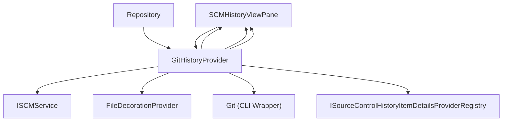
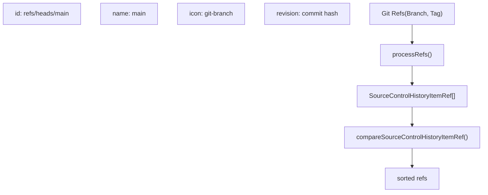
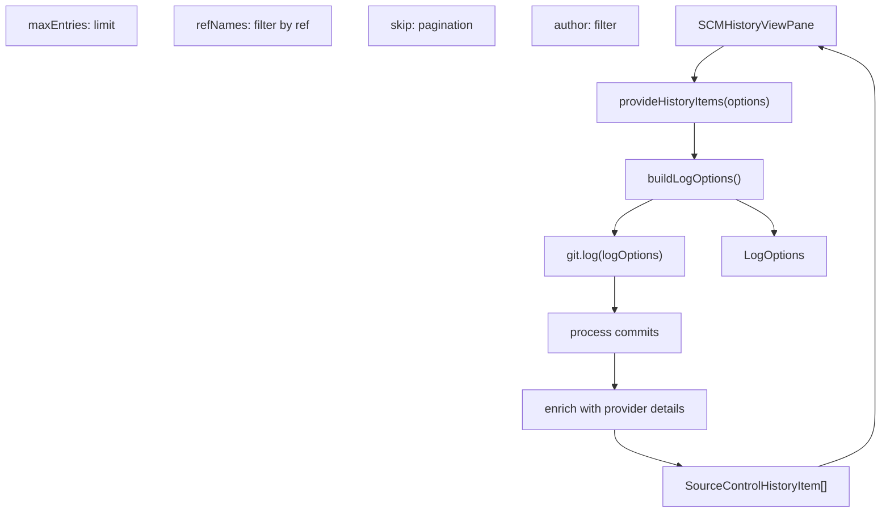
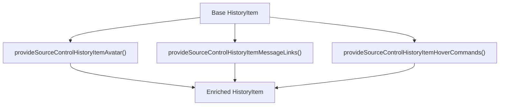
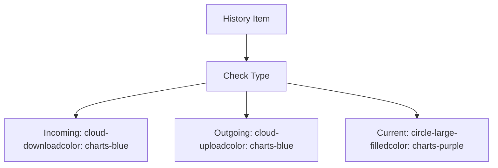
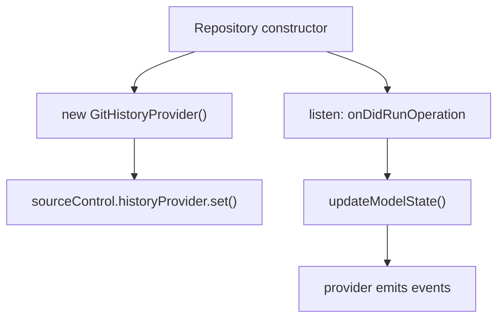
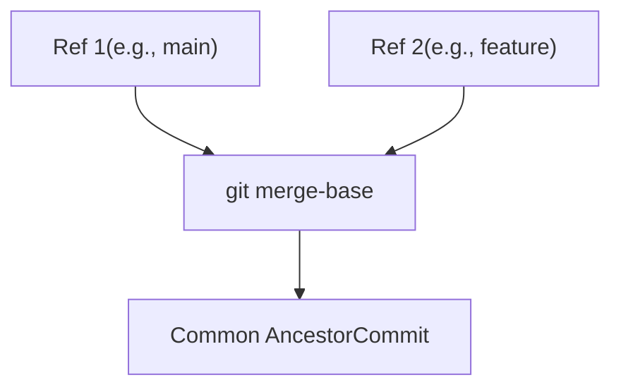

# Git History Provider

Relevant source files

-   [extensions/git/package.json](https://github.com/microsoft/vscode/blob/1be3088d/extensions/git/package.json)
-   [extensions/git/package.nls.json](https://github.com/microsoft/vscode/blob/1be3088d/extensions/git/package.nls.json)
-   [extensions/git/src/actionButton.ts](https://github.com/microsoft/vscode/blob/1be3088d/extensions/git/src/actionButton.ts)
-   [extensions/git/src/api/api1.ts](https://github.com/microsoft/vscode/blob/1be3088d/extensions/git/src/api/api1.ts)
-   [extensions/git/src/api/git.d.ts](https://github.com/microsoft/vscode/blob/1be3088d/extensions/git/src/api/git.d.ts)
-   [extensions/git/src/askpass-empty.sh](https://github.com/microsoft/vscode/blob/1be3088d/extensions/git/src/askpass-empty.sh)
-   [extensions/git/src/askpass-main.ts](https://github.com/microsoft/vscode/blob/1be3088d/extensions/git/src/askpass-main.ts)
-   [extensions/git/src/askpass.sh](https://github.com/microsoft/vscode/blob/1be3088d/extensions/git/src/askpass.sh)
-   [extensions/git/src/askpass.ts](https://github.com/microsoft/vscode/blob/1be3088d/extensions/git/src/askpass.ts)
-   [extensions/git/src/autofetch.ts](https://github.com/microsoft/vscode/blob/1be3088d/extensions/git/src/autofetch.ts)
-   [extensions/git/src/cloneManager.ts](https://github.com/microsoft/vscode/blob/1be3088d/extensions/git/src/cloneManager.ts)
-   [extensions/git/src/commands.ts](https://github.com/microsoft/vscode/blob/1be3088d/extensions/git/src/commands.ts)
-   [extensions/git/src/git.ts](https://github.com/microsoft/vscode/blob/1be3088d/extensions/git/src/git.ts)
-   [extensions/git/src/gitEditor.ts](https://github.com/microsoft/vscode/blob/1be3088d/extensions/git/src/gitEditor.ts)
-   [extensions/git/src/ipc/ipcClient.ts](https://github.com/microsoft/vscode/blob/1be3088d/extensions/git/src/ipc/ipcClient.ts)
-   [extensions/git/src/ipc/ipcServer.ts](https://github.com/microsoft/vscode/blob/1be3088d/extensions/git/src/ipc/ipcServer.ts)
-   [extensions/git/src/main.ts](https://github.com/microsoft/vscode/blob/1be3088d/extensions/git/src/main.ts)
-   [extensions/git/src/model.ts](https://github.com/microsoft/vscode/blob/1be3088d/extensions/git/src/model.ts)
-   [extensions/git/src/operation.ts](https://github.com/microsoft/vscode/blob/1be3088d/extensions/git/src/operation.ts)
-   [extensions/git/src/postCommitCommands.ts](https://github.com/microsoft/vscode/blob/1be3088d/extensions/git/src/postCommitCommands.ts)
-   [extensions/git/src/protocolHandler.ts](https://github.com/microsoft/vscode/blob/1be3088d/extensions/git/src/protocolHandler.ts)
-   [extensions/git/src/repository.ts](https://github.com/microsoft/vscode/blob/1be3088d/extensions/git/src/repository.ts)
-   [extensions/git/src/repositoryCache.ts](https://github.com/microsoft/vscode/blob/1be3088d/extensions/git/src/repositoryCache.ts)
-   [extensions/git/src/ssh-askpass-empty.sh](https://github.com/microsoft/vscode/blob/1be3088d/extensions/git/src/ssh-askpass-empty.sh)
-   [extensions/git/src/ssh-askpass.sh](https://github.com/microsoft/vscode/blob/1be3088d/extensions/git/src/ssh-askpass.sh)
-   [extensions/git/src/statusbar.ts](https://github.com/microsoft/vscode/blob/1be3088d/extensions/git/src/statusbar.ts)
-   [extensions/git/src/terminal.ts](https://github.com/microsoft/vscode/blob/1be3088d/extensions/git/src/terminal.ts)
-   [extensions/git/src/test/repositoryCache.test.ts](https://github.com/microsoft/vscode/blob/1be3088d/extensions/git/src/test/repositoryCache.test.ts)
-   [extensions/git/src/util.ts](https://github.com/microsoft/vscode/blob/1be3088d/extensions/git/src/util.ts)
-   [extensions/git/tsconfig.json](https://github.com/microsoft/vscode/blob/1be3088d/extensions/git/tsconfig.json)
-   [test/automation/src/statusbar.ts](https://github.com/microsoft/vscode/blob/1be3088d/test/automation/src/statusbar.ts)

## Purpose and Scope

The Git History Provider is the implementation of the SCM history system for Git repositories in VS Code. It enables the visualization of commit history, branches, tags, and their relationships in the Source Control view's History pane. This document covers the `GitHistoryProvider` class implementation and its integration with the VS Code SCM framework.

For information about the broader SCM framework and history UI, see [SCM History Provider](/microsoft/vscode/9.4-cell-outputs-and-webview-rendering). For details about the Git extension architecture, see [Git Extension Architecture](/microsoft/vscode/10.1-scm-framework-architecture).

## Architecture Overview

The Git History Provider acts as a bridge between the Git command-line operations and VS Code's SCM history UI. It implements the `SourceControlHistoryProvider` interface and provides commit history, branch/tag references, and visual decorations for history items.

### System Context Diagram

**Sources:** [extensions/git/src/historyProvider.ts1-810](https://github.com/microsoft/vscode/blob/1be3088d/extensions/git/src/historyProvider.ts#L1-L810) [extensions/git/src/repository.ts1-2000](https://github.com/microsoft/vscode/blob/1be3088d/extensions/git/src/repository.ts#L1-L2000) [src/vs/workbench/contrib/scm/common/history.ts1-150](https://github.com/microsoft/vscode/blob/1be3088d/src/vs/workbench/contrib/scm/common/history.ts#L1-L150)

## Key Components

### GitHistoryProvider Class

The `GitHistoryProvider` class [extensions/git/src/historyProvider.ts42-810](https://github.com/microsoft/vscode/blob/1be3088d/extensions/git/src/historyProvider.ts#L42-L810) is the central component that implements both `SourceControlHistoryProvider` and `FileDecorationProvider` interfaces. It manages the state of history item references and provides history data to the UI.

**Sources:** [extensions/git/src/historyProvider.ts42-100](https://github.com/microsoft/vscode/blob/1be3088d/extensions/git/src/historyProvider.ts#L42-L100) [extensions/git/src/repository.ts650-750](https://github.com/microsoft/vscode/blob/1be3088d/extensions/git/src/repository.ts#L650-L750)

### History Item References

History item references represent branches, tags, and other git refs that can be used to filter or scope the commit history display.

| Property | Type | Description |
| --- | --- | --- |
| `currentHistoryItemRef` | `SourceControlHistoryItemRef | undefined` | The currently selected ref (usually HEAD) |
| `currentHistoryItemRemoteRef` | `SourceControlHistoryItemRef | undefined` | The remote tracking ref for the current branch |
| `currentHistoryItemBaseRef` | `SourceControlHistoryItemRef | undefined` | The base ref for comparing changes |
| `_historyItemRefs` | `SourceControlHistoryItemRef[]` | All available refs (branches, tags) |

**Sources:** [extensions/git/src/historyProvider.ts46-62](https://github.com/microsoft/vscode/blob/1be3088d/extensions/git/src/historyProvider.ts#L46-L62)

## History Item Ref Management

The history provider tracks changes to Git refs (branches, tags) and maintains a synchronized view of the current repository state.

### Ref Update Flow

> **[Mermaid sequence]**
> *(图表结构无法解析)*

**Sources:** [extensions/git/src/historyProvider.ts92-200](https://github.com/microsoft/vscode/blob/1be3088d/extensions/git/src/historyProvider.ts#L92-L200)

### Ref Processing

The provider converts Git `Ref` objects to `SourceControlHistoryItemRef` objects [extensions/git/src/historyProvider.ts300-450](https://github.com/microsoft/vscode/blob/1be3088d/extensions/git/src/historyProvider.ts#L300-L450):

The `compareSourceControlHistoryItemRef` function [extensions/git/src/historyProvider.ts19-40](https://github.com/microsoft/vscode/blob/1be3088d/extensions/git/src/historyProvider.ts#L19-L40) sorts refs by type:

1.  Local branches (`refs/heads/`)
2.  Remote branches (`refs/remotes/`)
3.  Tags (`refs/tags/`)

**Sources:** [extensions/git/src/historyProvider.ts19-40](https://github.com/microsoft/vscode/blob/1be3088d/extensions/git/src/historyProvider.ts#L19-L40) [extensions/git/src/historyProvider.ts300-450](https://github.com/microsoft/vscode/blob/1be3088d/extensions/git/src/historyProvider.ts#L300-L450)

## History Item Retrieval

The `provideHistoryItems` method [extensions/git/src/historyProvider.ts475-600](https://github.com/microsoft/vscode/blob/1be3088d/extensions/git/src/historyProvider.ts#L475-L600) is the core function that retrieves commit history from Git and converts it to the format expected by VS Code.

### History Item Retrieval Flow

**Sources:** [extensions/git/src/historyProvider.ts475-600](https://github.com/microsoft/vscode/blob/1be3088d/extensions/git/src/historyProvider.ts#L475-L600)

### Commit Conversion

Each Git `Commit` object is converted to a `SourceControlHistoryItem` [extensions/git/src/historyProvider.ts550-650](https://github.com/microsoft/vscode/blob/1be3088d/extensions/git/src/historyProvider.ts#L550-L650):

| Git Commit Field | History Item Field | Processing |
| --- | --- | --- |
| `hash` | `id` | Short hash (7 chars by default) |
| `message` | `message` | Emojified, truncated, with links |
| `parents` | `parentIds` | Array of short parent hashes |
| `authorName` | `author` | Direct mapping |
| `authorEmail` | Not exposed | Used for avatar lookup |
| `authorDate` | `timestamp` | Unix timestamp in milliseconds |
| Refs at commit | `references` | Converted to `SourceControlHistoryItemRef[]` |
| Statistics | `statistics` | Files changed, insertions, deletions |

**Sources:** [extensions/git/src/historyProvider.ts550-650](https://github.com/microsoft/vscode/blob/1be3088d/extensions/git/src/historyProvider.ts#L550-L650)

### History Item Details Enhancement

The provider uses the `ISourceControlHistoryItemDetailsProviderRegistry` [extensions/git/src/historyProvider.ts580-620](https://github.com/microsoft/vscode/blob/1be3088d/extensions/git/src/historyProvider.ts#L580-L620) to enhance history items with:

1.  **Avatar URLs** - Via `provideSourceControlHistoryItemAvatar()`
2.  **Message Links** - Via `provideSourceControlHistoryItemMessageLinks()` to linkify issue references
3.  **Hover Commands** - Via `provideSourceControlHistoryItemHoverCommands()` for commit hash actions

**Sources:** [extensions/git/src/historyProvider.ts580-620](https://github.com/microsoft/vscode/blob/1be3088d/extensions/git/src/historyProvider.ts#L580-L620) [extensions/git/src/historyItemDetailsProvider.ts1-200](https://github.com/microsoft/vscode/blob/1be3088d/extensions/git/src/historyItemDetailsProvider.ts#L1-L200)

## History Item Changes

The `provideHistoryItemChanges` method [extensions/git/src/historyProvider.ts650-750](https://github.com/microsoft/vscode/blob/1be3088d/extensions/git/src/historyProvider.ts#L650-L750) retrieves the list of files changed in a specific commit.

> **[Mermaid sequence]**
> *(图表结构无法解析)*

Each change includes:

-   `uri` - The file URI with appropriate revision
-   `originalUri` - The original file location (for renames)
-   `renameUri` - The new file location (for renames)
-   `modifiedUri` - URI for the modified version

**Sources:** [extensions/git/src/historyProvider.ts650-750](https://github.com/microsoft/vscode/blob/1be3088d/extensions/git/src/historyProvider.ts#L650-L750)

## File Decorations

The `GitHistoryProvider` implements `FileDecorationProvider` [extensions/git/src/historyProvider.ts760-810](https://github.com/microsoft/vscode/blob/1be3088d/extensions/git/src/historyProvider.ts#L760-L810) to show visual indicators on history items.

### Decoration Types

The special history item IDs used for decorations [extensions/git/src/historyProvider.ts765-790](https://github.com/microsoft/vscode/blob/1be3088d/extensions/git/src/historyProvider.ts#L765-L790):

-   **Incoming changes**: ID ends with `-incoming` - Shows commits in remote that aren't in local
-   **Outgoing changes**: ID ends with `-outgoing` - Shows local commits not pushed to remote
-   **Current HEAD**: Matches the current history item ref revision

**Sources:** [extensions/git/src/historyProvider.ts760-810](https://github.com/microsoft/vscode/blob/1be3088d/extensions/git/src/historyProvider.ts#L760-L810)

## Integration with Repository

The `GitHistoryProvider` is created and registered by the `Repository` class [extensions/git/src/repository.ts650-750](https://github.com/microsoft/vscode/blob/1be3088d/extensions/git/src/repository.ts#L650-L750):

The repository provides the provider with:

-   Access to the `Git` CLI wrapper for executing git commands
-   The repository root path and configuration
-   Events for git operations (commit, fetch, pull, etc.)

**Sources:** [extensions/git/src/repository.ts650-750](https://github.com/microsoft/vscode/blob/1be3088d/extensions/git/src/repository.ts#L650-L750) [extensions/git/src/repository.ts1200-1300](https://github.com/microsoft/vscode/blob/1be3088d/extensions/git/src/repository.ts#L1200-L1300)

## Configuration and Customization

The history provider respects several workspace settings:

| Setting | Default | Purpose |
| --- | --- | --- |
| `git.commitShortHashLength` | 7 | Length of abbreviated commit hashes |
| Various `git.graph.*` settings | \- | Graph visualization options |

**Sources:** [extensions/git/src/historyProvider.ts83-90](https://github.com/microsoft/vscode/blob/1be3088d/extensions/git/src/historyProvider.ts#L83-L90)

## Common Ancestor Resolution

The `resolveHistoryItemRefsCommonAncestor` method [extensions/git/src/historyProvider.ts705-730](https://github.com/microsoft/vscode/blob/1be3088d/extensions/git/src/historyProvider.ts#L705-L730) finds the merge base between two refs, which is used for three-way comparisons:

This is essential for:

-   Three-way merge operations
-   Showing the diff between branches accurately
-   Understanding the relationship between refs

**Sources:** [extensions/git/src/historyProvider.ts705-730](https://github.com/microsoft/vscode/blob/1be3088d/extensions/git/src/historyProvider.ts#L705-L730)

## Error Handling and Logging

The provider includes comprehensive error handling and logging [extensions/git/src/historyProvider.ts92-200](https://github.com/microsoft/vscode/blob/1be3088d/extensions/git/src/historyProvider.ts#L92-L200):

-   All git operations are wrapped in try-catch blocks
-   Errors are logged to the Git output channel
-   The provider gracefully handles repository state inconsistencies
-   Debug-level logging helps troubleshoot history loading issues

**Sources:** [extensions/git/src/historyProvider.ts92-200](https://github.com/microsoft/vscode/blob/1be3088d/extensions/git/src/historyProvider.ts#L92-L200)

## Summary

The Git History Provider is a critical component that bridges Git's command-line interface with VS Code's SCM history UI. It manages the complex state of Git refs, retrieves and processes commit history, and provides rich decorations and details for history items. The provider's design allows for extensibility through the history item details provider registry while maintaining clean separation between the Git-specific logic and the generic SCM framework.
