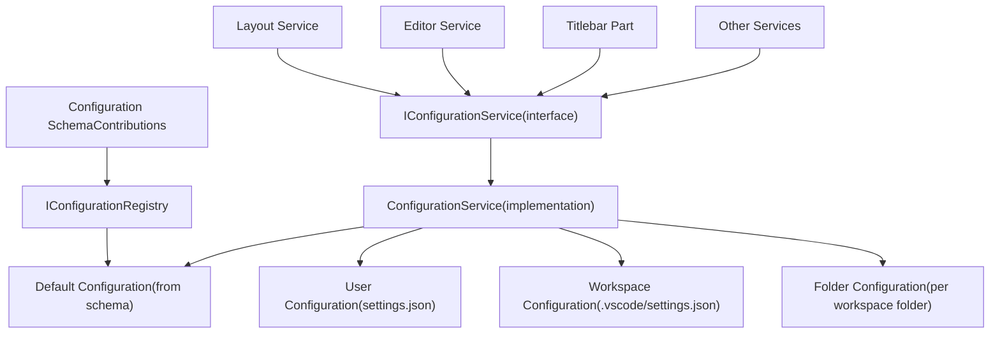
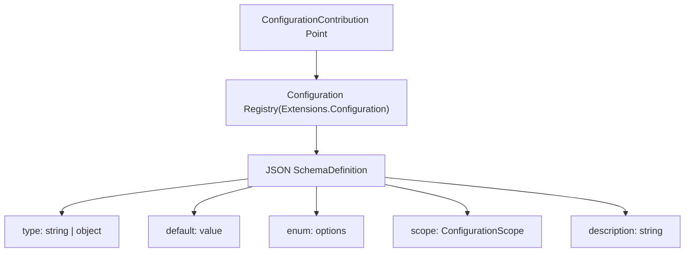
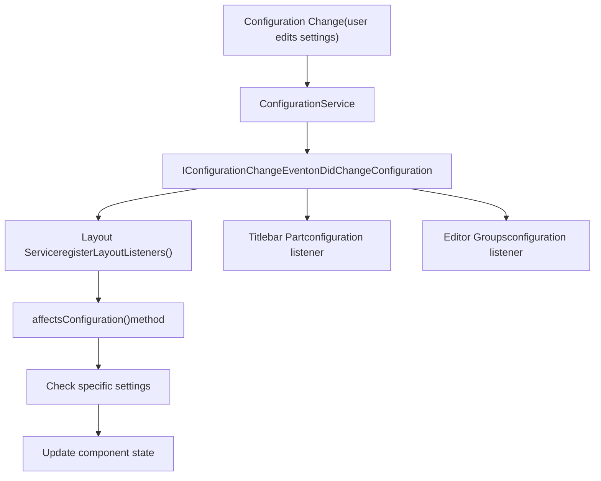
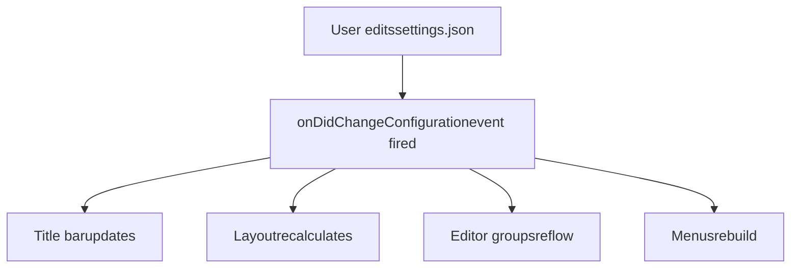

# Configuration and Preferences

Relevant source files

-   [src/vs/platform/action/common/action.ts](https://github.com/microsoft/vscode/blob/1be3088d/src/vs/platform/action/common/action.ts)
-   [src/vs/platform/actions/browser/actionViewItemService.ts](https://github.com/microsoft/vscode/blob/1be3088d/src/vs/platform/actions/browser/actionViewItemService.ts)
-   [src/vs/platform/actions/browser/menuEntryActionViewItem.css](https://github.com/microsoft/vscode/blob/1be3088d/src/vs/platform/actions/browser/menuEntryActionViewItem.css)
-   [src/vs/platform/actions/browser/menuEntryActionViewItem.ts](https://github.com/microsoft/vscode/blob/1be3088d/src/vs/platform/actions/browser/menuEntryActionViewItem.ts)
-   [src/vs/platform/actions/browser/toolbar.ts](https://github.com/microsoft/vscode/blob/1be3088d/src/vs/platform/actions/browser/toolbar.ts)
-   [src/vs/platform/actions/common/actions.ts](https://github.com/microsoft/vscode/blob/1be3088d/src/vs/platform/actions/common/actions.ts)
-   [src/vs/platform/actions/common/menuService.ts](https://github.com/microsoft/vscode/blob/1be3088d/src/vs/platform/actions/common/menuService.ts)
-   [src/vs/platform/editor/common/editor.ts](https://github.com/microsoft/vscode/blob/1be3088d/src/vs/platform/editor/common/editor.ts)
-   [src/vs/platform/observable/common/platformObservableUtils.ts](https://github.com/microsoft/vscode/blob/1be3088d/src/vs/platform/observable/common/platformObservableUtils.ts)
-   [src/vs/workbench/browser/actions/layoutActions.ts](https://github.com/microsoft/vscode/blob/1be3088d/src/vs/workbench/browser/actions/layoutActions.ts)
-   [src/vs/workbench/browser/actions/quickAccessActions.ts](https://github.com/microsoft/vscode/blob/1be3088d/src/vs/workbench/browser/actions/quickAccessActions.ts)
-   [src/vs/workbench/browser/contextkeys.ts](https://github.com/microsoft/vscode/blob/1be3088d/src/vs/workbench/browser/contextkeys.ts)
-   [src/vs/workbench/browser/dnd.ts](https://github.com/microsoft/vscode/blob/1be3088d/src/vs/workbench/browser/dnd.ts)
-   [src/vs/workbench/browser/layout.ts](https://github.com/microsoft/vscode/blob/1be3088d/src/vs/workbench/browser/layout.ts)
-   [src/vs/workbench/browser/parts/auxiliarybar/auxiliaryBarActions.ts](https://github.com/microsoft/vscode/blob/1be3088d/src/vs/workbench/browser/parts/auxiliarybar/auxiliaryBarActions.ts)
-   [src/vs/workbench/browser/parts/editor/auxiliaryEditorPart.ts](https://github.com/microsoft/vscode/blob/1be3088d/src/vs/workbench/browser/parts/editor/auxiliaryEditorPart.ts)
-   [src/vs/workbench/browser/parts/editor/editor.contribution.ts](https://github.com/microsoft/vscode/blob/1be3088d/src/vs/workbench/browser/parts/editor/editor.contribution.ts)
-   [src/vs/workbench/browser/parts/editor/editor.ts](https://github.com/microsoft/vscode/blob/1be3088d/src/vs/workbench/browser/parts/editor/editor.ts)
-   [src/vs/workbench/browser/parts/editor/editorActions.ts](https://github.com/microsoft/vscode/blob/1be3088d/src/vs/workbench/browser/parts/editor/editorActions.ts)
-   [src/vs/workbench/browser/parts/editor/editorCommands.ts](https://github.com/microsoft/vscode/blob/1be3088d/src/vs/workbench/browser/parts/editor/editorCommands.ts)
-   [src/vs/workbench/browser/parts/editor/editorDropTarget.ts](https://github.com/microsoft/vscode/blob/1be3088d/src/vs/workbench/browser/parts/editor/editorDropTarget.ts)
-   [src/vs/workbench/browser/parts/editor/editorGroupView.ts](https://github.com/microsoft/vscode/blob/1be3088d/src/vs/workbench/browser/parts/editor/editorGroupView.ts)
-   [src/vs/workbench/browser/parts/editor/editorPart.ts](https://github.com/microsoft/vscode/blob/1be3088d/src/vs/workbench/browser/parts/editor/editorPart.ts)
-   [src/vs/workbench/browser/parts/editor/editorParts.ts](https://github.com/microsoft/vscode/blob/1be3088d/src/vs/workbench/browser/parts/editor/editorParts.ts)
-   [src/vs/workbench/browser/parts/panel/panelActions.ts](https://github.com/microsoft/vscode/blob/1be3088d/src/vs/workbench/browser/parts/panel/panelActions.ts)
-   [src/vs/workbench/browser/parts/titlebar/commandCenterControl.ts](https://github.com/microsoft/vscode/blob/1be3088d/src/vs/workbench/browser/parts/titlebar/commandCenterControl.ts)
-   [src/vs/workbench/browser/parts/titlebar/media/titlebarpart.css](https://github.com/microsoft/vscode/blob/1be3088d/src/vs/workbench/browser/parts/titlebar/media/titlebarpart.css)
-   [src/vs/workbench/browser/parts/titlebar/titlebarActions.ts](https://github.com/microsoft/vscode/blob/1be3088d/src/vs/workbench/browser/parts/titlebar/titlebarActions.ts)
-   [src/vs/workbench/browser/parts/titlebar/titlebarPart.ts](https://github.com/microsoft/vscode/blob/1be3088d/src/vs/workbench/browser/parts/titlebar/titlebarPart.ts)
-   [src/vs/workbench/browser/parts/titlebar/windowTitle.ts](https://github.com/microsoft/vscode/blob/1be3088d/src/vs/workbench/browser/parts/titlebar/windowTitle.ts)
-   [src/vs/workbench/browser/workbench.contribution.ts](https://github.com/microsoft/vscode/blob/1be3088d/src/vs/workbench/browser/workbench.contribution.ts)
-   [src/vs/workbench/browser/workbench.ts](https://github.com/microsoft/vscode/blob/1be3088d/src/vs/workbench/browser/workbench.ts)
-   [src/vs/workbench/common/contextkeys.ts](https://github.com/microsoft/vscode/blob/1be3088d/src/vs/workbench/common/contextkeys.ts)
-   [src/vs/workbench/common/editor.ts](https://github.com/microsoft/vscode/blob/1be3088d/src/vs/workbench/common/editor.ts)
-   [src/vs/workbench/contrib/chat/browser/widget/chatContentParts/chatInlineAnchorWidget.ts](https://github.com/microsoft/vscode/blob/1be3088d/src/vs/workbench/contrib/chat/browser/widget/chatContentParts/chatInlineAnchorWidget.ts)
-   [src/vs/workbench/contrib/chat/browser/widget/chatContentParts/chatMarkdownDecorationsRenderer.ts](https://github.com/microsoft/vscode/blob/1be3088d/src/vs/workbench/contrib/chat/browser/widget/chatContentParts/chatMarkdownDecorationsRenderer.ts)
-   [src/vs/workbench/contrib/chat/browser/widget/chatContentParts/media/chatInlineAnchorWidget.css](https://github.com/microsoft/vscode/blob/1be3088d/src/vs/workbench/contrib/chat/browser/widget/chatContentParts/media/chatInlineAnchorWidget.css)
-   [src/vs/workbench/contrib/debug/browser/statusbarColorProvider.ts](https://github.com/microsoft/vscode/blob/1be3088d/src/vs/workbench/contrib/debug/browser/statusbarColorProvider.ts)
-   [src/vs/workbench/services/actions/common/menusExtensionPoint.ts](https://github.com/microsoft/vscode/blob/1be3088d/src/vs/workbench/services/actions/common/menusExtensionPoint.ts)
-   [src/vs/workbench/services/editor/browser/editorService.ts](https://github.com/microsoft/vscode/blob/1be3088d/src/vs/workbench/services/editor/browser/editorService.ts)
-   [src/vs/workbench/services/editor/common/editorGroupsService.ts](https://github.com/microsoft/vscode/blob/1be3088d/src/vs/workbench/services/editor/common/editorGroupsService.ts)
-   [src/vs/workbench/services/editor/common/editorService.ts](https://github.com/microsoft/vscode/blob/1be3088d/src/vs/workbench/services/editor/common/editorService.ts)
-   [src/vs/workbench/services/editor/test/browser/editorGroupsService.test.ts](https://github.com/microsoft/vscode/blob/1be3088d/src/vs/workbench/services/editor/test/browser/editorGroupsService.test.ts)
-   [src/vs/workbench/services/editor/test/browser/editorService.test.ts](https://github.com/microsoft/vscode/blob/1be3088d/src/vs/workbench/services/editor/test/browser/editorService.test.ts)
-   [src/vs/workbench/services/layout/browser/layoutService.ts](https://github.com/microsoft/vscode/blob/1be3088d/src/vs/workbench/services/layout/browser/layoutService.ts)
-   [src/vs/workbench/test/browser/workbenchTestServices.ts](https://github.com/microsoft/vscode/blob/1be3088d/src/vs/workbench/test/browser/workbenchTestServices.ts)

## Purpose and Scope

This document describes the configuration and preferences system in VS Code, which manages user settings, workspace settings, and keybindings. The system provides a hierarchical configuration service that resolves settings from multiple scopes, notifies components of changes, and exposes both programmatic and UI-based interfaces for managing preferences.

For detailed information about specific subsystems:

-   Configuration Service implementation details: see [Configuration Service Architecture](/microsoft/vscode/12.1-configuration-service-architecture)
-   Settings Editor UI: see [Settings Editor](/microsoft/vscode/12.2-settings-editor)
-   Keybindings management: see [Keybindings System](/microsoft/vscode/12.3-keybindings-system)

## Configuration System Overview

The configuration system is built around `IConfigurationService`, which provides centralized access to all settings. Configuration values are resolved from multiple scopes (default, user, workspace, folder) with a defined precedence order. Components register configuration schemas that define available settings, their types, defaults, and descriptions.

### Configuration Service Architecture


**Sources:** [src/vs/platform/configuration/common/configuration.ts](https://github.com/microsoft/vscode/blob/1be3088d/src/vs/platform/configuration/common/configuration.ts) [src/vs/workbench/browser/layout.ts17](https://github.com/microsoft/vscode/blob/1be3088d/src/vs/workbench/browser/layout.ts#L17-L17)

### Configuration Scopes and Resolution

Configuration values are resolved using a hierarchical scope system. Each scope has a specific precedence, with more specific scopes overriding more general ones:

| Scope | Storage Location | Precedence | Target |
| --- | --- | --- | --- |
| Default | Extension/Core schema | Lowest | Global defaults |
| User | User settings.json | Low | User-wide settings |
| Workspace | .vscode/settings.json | Medium | Workspace-specific |
| Folder | Per-folder settings | Highest | Folder-specific |

The configuration service provides methods to read values at specific scopes or to get the resolved value considering all scopes:

```
// From IConfigurationService interface
getValue<T>(section?: string, overrides?: ConfigurationTarget): T
inspect<T>(key: string): IConfigurationValue<T>
```
**Sources:** [src/vs/platform/configuration/common/configuration.ts](https://github.com/microsoft/vscode/blob/1be3088d/src/vs/platform/configuration/common/configuration.ts) [src/vs/workbench/browser/workbench.contribution.ts](https://github.com/microsoft/vscode/blob/1be3088d/src/vs/workbench/browser/workbench.contribution.ts)

## Configuration Registration

Extensions and core components register configuration schemas using the `IConfigurationRegistry`. Each registration defines the settings structure, types, defaults, and metadata:


**Sources:** [src/vs/workbench/browser/workbench.contribution.ts18-30](https://github.com/microsoft/vscode/blob/1be3088d/src/vs/workbench/browser/workbench.contribution.ts#L18-L30)

### Example Configuration Registration

The workbench registers hundreds of configuration settings. Here's the pattern used:

```
registry.registerConfiguration({
    ...workbenchConfigurationNodeBase,
    'properties': {
        'workbench.editor.titleScrollbarSizing': {
            type: 'string',
            enum: ['default', 'large'],
            enumDescriptions: [...],
            description: localize('tabScrollbarHeight', '...'),
            default: 'default',
        },
        'workbench.editor.showTabs': {
            'type': 'string',
            'enum': ['multiple', 'single', 'none'],
            'description': localize('showEditorTabs', '...'),
            'default': 'multiple'
        }
    }
});
```
**Sources:** [src/vs/workbench/browser/workbench.contribution.ts30-70](https://github.com/microsoft/vscode/blob/1be3088d/src/vs/workbench/browser/workbench.contribution.ts#L30-L70)

### Configuration Scopes

Settings can be scoped to control where they can be configured:

| Scope Type | Description | Enum Value |
| --- | --- | --- |
| Application | Machine-wide settings | `ConfigurationScope.APPLICATION` |
| Window | Window-specific settings | `ConfigurationScope.WINDOW` |
| Resource | File/folder-specific | `ConfigurationScope.RESOURCE` |
| Language Overridable | Can be overridden per language | `ConfigurationScope.LANGUAGE_OVERRIDABLE` |

**Sources:** [src/vs/platform/configuration/common/configuration.ts](https://github.com/microsoft/vscode/blob/1be3088d/src/vs/platform/configuration/common/configuration.ts) [src/vs/workbench/browser/workbench.contribution.ts173](https://github.com/microsoft/vscode/blob/1be3088d/src/vs/workbench/browser/workbench.contribution.ts#L173-L173)

## Configuration Change Events

The configuration service emits events when settings change, allowing components to react dynamically. The `IConfigurationChangeEvent` provides methods to check which settings were affected:


**Sources:** [src/vs/workbench/browser/layout.ts385-418](https://github.com/microsoft/vscode/blob/1be3088d/src/vs/workbench/browser/layout.ts#L385-L418)

### Reacting to Configuration Changes

Components subscribe to configuration changes and use `affectsConfiguration()` to check if relevant settings changed:

From the Layout service:

```
// Configuration changes
this._register(this.configurationService.onDidChangeConfiguration(e => {
    if ([
        ...TITLE_BAR_SETTINGS,
        LegacyWorkbenchLayoutSettings.SIDEBAR_POSITION,
        LegacyWorkbenchLayoutSettings.STATUSBAR_VISIBLE,
    ].some(setting => e.affectsConfiguration(setting))) {
        // React to configuration change
        this.doUpdateLayoutConfiguration();
    }
}));
```
**Sources:** [src/vs/workbench/browser/layout.ts385-418](https://github.com/microsoft/vscode/blob/1be3088d/src/vs/workbench/browser/layout.ts#L385-L418)

### Title Bar Settings Example

The layout service tracks specific title bar settings that affect the workbench UI:

```
export const TITLE_BAR_SETTINGS = [
    LayoutSettings.ACTIVITY_BAR_LOCATION,
    LayoutSettings.COMMAND_CENTER,
    ...COMMAND_CENTER_SETTINGS,
    LayoutSettings.EDITOR_ACTIONS_LOCATION,
    LayoutSettings.LAYOUT_ACTIONS,
    MenuSettings.MenuBarVisibility,
    TitleBarSetting.TITLE_BAR_STYLE,
    TitleBarSetting.CUSTOM_TITLE_BAR_VISIBILITY,
];
```
**Sources:** [src/vs/workbench/browser/layout.ts124-133](https://github.com/microsoft/vscode/blob/1be3088d/src/vs/workbench/browser/layout.ts#L124-L133)

## Key Configuration Settings

VS Code defines numerous configuration settings across different domains. Major categories include:

### Layout and Appearance Settings

| Setting Key | Type | Purpose |
| --- | --- | --- |
| `workbench.editor.showTabs` | enum | Controls editor tabs display mode |
| `workbench.sideBar.location` | string | Primary sidebar position |
| `workbench.activityBar.visible` | boolean | Activity bar visibility |
| `workbench.statusBar.visible` | boolean | Status bar visibility |
| `workbench.panel.position` | string | Panel position (bottom/left/right) |
| `window.titleBarStyle` | string | Title bar style (native/custom) |

**Sources:** [src/vs/workbench/browser/workbench.contribution.ts60-70](https://github.com/microsoft/vscode/blob/1be3088d/src/vs/workbench/browser/workbench.contribution.ts#L60-L70) [src/vs/workbench/services/layout/browser/layoutService.ts](https://github.com/microsoft/vscode/blob/1be3088d/src/vs/workbench/services/layout/browser/layoutService.ts)

### Editor Configuration

| Setting Key | Type | Purpose |
| --- | --- | --- |
| `workbench.editor.enablePreview` | boolean | Preview mode for editors |
| `workbench.editor.tabSizing` | enum | Tab sizing strategy |
| `workbench.editor.wrapTabs` | boolean | Tab wrapping behavior |
| `workbench.editor.labelFormat` | enum | Editor label display format |
| `workbench.editor.pinnedTabSizing` | enum | Pinned tab sizing |

**Sources:** [src/vs/workbench/browser/workbench.contribution.ts310-320](https://github.com/microsoft/vscode/blob/1be3088d/src/vs/workbench/browser/workbench.contribution.ts#L310-L320)

## Configuration Migration

The system supports configuration migration for renamed or deprecated settings. The `ConfigurationMigrationWorkbenchContribution` handles automatic migration:

```
registerWorkbenchContribution2(
    ConfigurationMigrationWorkbenchContribution.ID,
    ConfigurationMigrationWorkbenchContribution,
    WorkbenchPhase.Eventually
);
```
**Sources:** [src/vs/workbench/browser/workbench.contribution.ts24](https://github.com/microsoft/vscode/blob/1be3088d/src/vs/workbench/browser/workbench.contribution.ts#L24-L24)

## Dynamic Configuration

Some settings trigger immediate UI updates without requiring a restart:


**Sources:** [src/vs/workbench/browser/layout.ts385-418](https://github.com/microsoft/vscode/blob/1be3088d/src/vs/workbench/browser/layout.ts#L385-L418) [src/vs/workbench/browser/parts/titlebar/titlebarPart.ts](https://github.com/microsoft/vscode/blob/1be3088d/src/vs/workbench/browser/parts/titlebar/titlebarPart.ts)

## Menu Configuration

Menu items can be controlled by configuration settings through `when` clauses. The menu system evaluates configuration context keys:

```
MenuRegistry.appendMenuItem(MenuId.MenubarAppearanceMenu, {
    group: '1_toggle_view',
    command: {
        id: 'workbench.action.toggleCenteredLayout',
        title: localize('toggleCenteredLayout', 'Centered Layout')
    },
    when: ContextKeyExpr.equals('config.workbench.editor.showTabs', 'multiple')
});
```
**Sources:** [src/vs/platform/actions/common/actions.ts](https://github.com/microsoft/vscode/blob/1be3088d/src/vs/platform/actions/common/actions.ts) [src/vs/workbench/services/actions/common/menusExtensionPoint.ts](https://github.com/microsoft/vscode/blob/1be3088d/src/vs/workbench/services/actions/common/menusExtensionPoint.ts)

## Configuration Storage

Configuration is stored in JSON files with schema validation:

| File | Scope | Location |
| --- | --- | --- |
| User Settings | User | `~/.config/Code/User/settings.json` |
| Workspace Settings | Workspace | `<workspace>/.vscode/settings.json` |
| Folder Settings | Folder | Per workspace folder |

The storage service manages persistence and provides atomic updates to prevent corruption.

**Sources:** [src/vs/platform/storage/common/storage.ts](https://github.com/microsoft/vscode/blob/1be3088d/src/vs/platform/storage/common/storage.ts) [src/vs/workbench/browser/layout.ts279](https://github.com/microsoft/vscode/blob/1be3088d/src/vs/workbench/browser/layout.ts#L279-L279)

## Configuration and Context Keys

Configuration values can be exposed as context keys for use in `when` clauses. This allows menu items, commands, and UI elements to show/hide based on configuration:

```
// Context key binding
const configValue = this.configurationService.getValue<boolean>('setting.key');
contextKeyService.createKey('settingContext', configValue);
```
**Sources:** [src/vs/platform/contextkey/common/contextkey.ts](https://github.com/microsoft/vscode/blob/1be3088d/src/vs/platform/contextkey/common/contextkey.ts) [src/vs/workbench/browser/contextkeys.ts](https://github.com/microsoft/vscode/blob/1be3088d/src/vs/workbench/browser/contextkeys.ts)

## Accessing Configuration Programmatically

Services access configuration through dependency injection of `IConfigurationService`:

```
constructor(
    @IConfigurationService private readonly configurationService: IConfigurationService
) {
    // Read configuration
    const value = this.configurationService.getValue<string>('workbench.editor.showTabs');

    // Update configuration
    this.configurationService.updateValue('setting.key', newValue);

    // Listen to changes
    this._register(this.configurationService.onDidChangeConfiguration(e => {
        if (e.affectsConfiguration('setting.key')) {
            // React to change
        }
    }));
}
```
**Sources:** [src/vs/workbench/browser/layout.ts311](https://github.com/microsoft/vscode/blob/1be3088d/src/vs/workbench/browser/layout.ts#L311-L311) [src/vs/platform/configuration/common/configuration.ts](https://github.com/microsoft/vscode/blob/1be3088d/src/vs/platform/configuration/common/configuration.ts)
