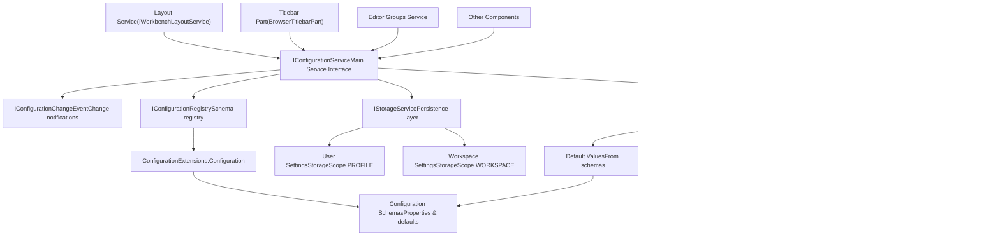

# Configuration Service Architecture

Relevant source files

-   [src/vs/platform/action/common/action.ts](https://github.com/microsoft/vscode/blob/1be3088d/src/vs/platform/action/common/action.ts)
-   [src/vs/platform/actions/browser/actionViewItemService.ts](https://github.com/microsoft/vscode/blob/1be3088d/src/vs/platform/actions/browser/actionViewItemService.ts)
-   [src/vs/platform/actions/browser/menuEntryActionViewItem.css](https://github.com/microsoft/vscode/blob/1be3088d/src/vs/platform/actions/browser/menuEntryActionViewItem.css)
-   [src/vs/platform/actions/browser/menuEntryActionViewItem.ts](https://github.com/microsoft/vscode/blob/1be3088d/src/vs/platform/actions/browser/menuEntryActionViewItem.ts)
-   [src/vs/platform/actions/browser/toolbar.ts](https://github.com/microsoft/vscode/blob/1be3088d/src/vs/platform/actions/browser/toolbar.ts)
-   [src/vs/platform/actions/common/actions.ts](https://github.com/microsoft/vscode/blob/1be3088d/src/vs/platform/actions/common/actions.ts)
-   [src/vs/platform/actions/common/menuService.ts](https://github.com/microsoft/vscode/blob/1be3088d/src/vs/platform/actions/common/menuService.ts)
-   [src/vs/platform/editor/common/editor.ts](https://github.com/microsoft/vscode/blob/1be3088d/src/vs/platform/editor/common/editor.ts)
-   [src/vs/platform/observable/common/platformObservableUtils.ts](https://github.com/microsoft/vscode/blob/1be3088d/src/vs/platform/observable/common/platformObservableUtils.ts)
-   [src/vs/workbench/browser/actions/layoutActions.ts](https://github.com/microsoft/vscode/blob/1be3088d/src/vs/workbench/browser/actions/layoutActions.ts)
-   [src/vs/workbench/browser/actions/quickAccessActions.ts](https://github.com/microsoft/vscode/blob/1be3088d/src/vs/workbench/browser/actions/quickAccessActions.ts)
-   [src/vs/workbench/browser/contextkeys.ts](https://github.com/microsoft/vscode/blob/1be3088d/src/vs/workbench/browser/contextkeys.ts)
-   [src/vs/workbench/browser/dnd.ts](https://github.com/microsoft/vscode/blob/1be3088d/src/vs/workbench/browser/dnd.ts)
-   [src/vs/workbench/browser/layout.ts](https://github.com/microsoft/vscode/blob/1be3088d/src/vs/workbench/browser/layout.ts)
-   [src/vs/workbench/browser/parts/auxiliarybar/auxiliaryBarActions.ts](https://github.com/microsoft/vscode/blob/1be3088d/src/vs/workbench/browser/parts/auxiliarybar/auxiliaryBarActions.ts)
-   [src/vs/workbench/browser/parts/editor/auxiliaryEditorPart.ts](https://github.com/microsoft/vscode/blob/1be3088d/src/vs/workbench/browser/parts/editor/auxiliaryEditorPart.ts)
-   [src/vs/workbench/browser/parts/editor/editor.contribution.ts](https://github.com/microsoft/vscode/blob/1be3088d/src/vs/workbench/browser/parts/editor/editor.contribution.ts)
-   [src/vs/workbench/browser/parts/editor/editor.ts](https://github.com/microsoft/vscode/blob/1be3088d/src/vs/workbench/browser/parts/editor/editor.ts)
-   [src/vs/workbench/browser/parts/editor/editorActions.ts](https://github.com/microsoft/vscode/blob/1be3088d/src/vs/workbench/browser/parts/editor/editorActions.ts)
-   [src/vs/workbench/browser/parts/editor/editorCommands.ts](https://github.com/microsoft/vscode/blob/1be3088d/src/vs/workbench/browser/parts/editor/editorCommands.ts)
-   [src/vs/workbench/browser/parts/editor/editorDropTarget.ts](https://github.com/microsoft/vscode/blob/1be3088d/src/vs/workbench/browser/parts/editor/editorDropTarget.ts)
-   [src/vs/workbench/browser/parts/editor/editorGroupView.ts](https://github.com/microsoft/vscode/blob/1be3088d/src/vs/workbench/browser/parts/editor/editorGroupView.ts)
-   [src/vs/workbench/browser/parts/editor/editorPart.ts](https://github.com/microsoft/vscode/blob/1be3088d/src/vs/workbench/browser/parts/editor/editorPart.ts)
-   [src/vs/workbench/browser/parts/editor/editorParts.ts](https://github.com/microsoft/vscode/blob/1be3088d/src/vs/workbench/browser/parts/editor/editorParts.ts)
-   [src/vs/workbench/browser/parts/panel/panelActions.ts](https://github.com/microsoft/vscode/blob/1be3088d/src/vs/workbench/browser/parts/panel/panelActions.ts)
-   [src/vs/workbench/browser/parts/titlebar/commandCenterControl.ts](https://github.com/microsoft/vscode/blob/1be3088d/src/vs/workbench/browser/parts/titlebar/commandCenterControl.ts)
-   [src/vs/workbench/browser/parts/titlebar/media/titlebarpart.css](https://github.com/microsoft/vscode/blob/1be3088d/src/vs/workbench/browser/parts/titlebar/media/titlebarpart.css)
-   [src/vs/workbench/browser/parts/titlebar/titlebarActions.ts](https://github.com/microsoft/vscode/blob/1be3088d/src/vs/workbench/browser/parts/titlebar/titlebarActions.ts)
-   [src/vs/workbench/browser/parts/titlebar/titlebarPart.ts](https://github.com/microsoft/vscode/blob/1be3088d/src/vs/workbench/browser/parts/titlebar/titlebarPart.ts)
-   [src/vs/workbench/browser/parts/titlebar/windowTitle.ts](https://github.com/microsoft/vscode/blob/1be3088d/src/vs/workbench/browser/parts/titlebar/windowTitle.ts)
-   [src/vs/workbench/browser/workbench.contribution.ts](https://github.com/microsoft/vscode/blob/1be3088d/src/vs/workbench/browser/workbench.contribution.ts)
-   [src/vs/workbench/browser/workbench.ts](https://github.com/microsoft/vscode/blob/1be3088d/src/vs/workbench/browser/workbench.ts)
-   [src/vs/workbench/common/contextkeys.ts](https://github.com/microsoft/vscode/blob/1be3088d/src/vs/workbench/common/contextkeys.ts)
-   [src/vs/workbench/common/editor.ts](https://github.com/microsoft/vscode/blob/1be3088d/src/vs/workbench/common/editor.ts)
-   [src/vs/workbench/contrib/chat/browser/widget/chatContentParts/chatInlineAnchorWidget.ts](https://github.com/microsoft/vscode/blob/1be3088d/src/vs/workbench/contrib/chat/browser/widget/chatContentParts/chatInlineAnchorWidget.ts)
-   [src/vs/workbench/contrib/chat/browser/widget/chatContentParts/chatMarkdownDecorationsRenderer.ts](https://github.com/microsoft/vscode/blob/1be3088d/src/vs/workbench/contrib/chat/browser/widget/chatContentParts/chatMarkdownDecorationsRenderer.ts)
-   [src/vs/workbench/contrib/chat/browser/widget/chatContentParts/media/chatInlineAnchorWidget.css](https://github.com/microsoft/vscode/blob/1be3088d/src/vs/workbench/contrib/chat/browser/widget/chatContentParts/media/chatInlineAnchorWidget.css)
-   [src/vs/workbench/contrib/debug/browser/statusbarColorProvider.ts](https://github.com/microsoft/vscode/blob/1be3088d/src/vs/workbench/contrib/debug/browser/statusbarColorProvider.ts)
-   [src/vs/workbench/services/actions/common/menusExtensionPoint.ts](https://github.com/microsoft/vscode/blob/1be3088d/src/vs/workbench/services/actions/common/menusExtensionPoint.ts)
-   [src/vs/workbench/services/editor/browser/editorService.ts](https://github.com/microsoft/vscode/blob/1be3088d/src/vs/workbench/services/editor/browser/editorService.ts)
-   [src/vs/workbench/services/editor/common/editorGroupsService.ts](https://github.com/microsoft/vscode/blob/1be3088d/src/vs/workbench/services/editor/common/editorGroupsService.ts)
-   [src/vs/workbench/services/editor/common/editorService.ts](https://github.com/microsoft/vscode/blob/1be3088d/src/vs/workbench/services/editor/common/editorService.ts)
-   [src/vs/workbench/services/editor/test/browser/editorGroupsService.test.ts](https://github.com/microsoft/vscode/blob/1be3088d/src/vs/workbench/services/editor/test/browser/editorGroupsService.test.ts)
-   [src/vs/workbench/services/editor/test/browser/editorService.test.ts](https://github.com/microsoft/vscode/blob/1be3088d/src/vs/workbench/services/editor/test/browser/editorService.test.ts)
-   [src/vs/workbench/services/layout/browser/layoutService.ts](https://github.com/microsoft/vscode/blob/1be3088d/src/vs/workbench/services/layout/browser/layoutService.ts)
-   [src/vs/workbench/test/browser/workbenchTestServices.ts](https://github.com/microsoft/vscode/blob/1be3088d/src/vs/workbench/test/browser/workbenchTestServices.ts)

This document describes the architecture of VS Code's configuration management system, which provides centralized access to user settings, workspace settings, and default values. The configuration service is responsible for reading, writing, and monitoring configuration changes across different scopes (user, workspace, folder, etc.).

For information about the Settings Editor UI, see [Settings Editor](/microsoft/vscode/12.2-settings-editor). For keybindings management, see [Keybindings System](/microsoft/vscode/12.3-keybindings-system).

---

## Core Components

The configuration system consists of several key components that work together to provide hierarchical settings management across different scopes.

### IConfigurationService

`IConfigurationService` is the primary service interface that components use to read and update configuration values. It provides methods for accessing configuration values with proper scope resolution and subscribing to configuration changes.

**Key Methods:**

-   `getValue<T>(section: string, scope?: ConfigurationTarget): T` - Retrieves a configuration value
-   `updateValue(key: string, value: any, target?: ConfigurationTarget): Promise<void>` - Updates a configuration value
-   `onDidChangeConfiguration: Event<IConfigurationChangeEvent>` - Event fired when configuration changes
-   `inspect<T>(key: string): IConfigurationValue<T>` - Inspects all scope values for a key

Sources: [src/vs/workbench/browser/layout.ts17](https://github.com/microsoft/vscode/blob/1be3088d/src/vs/workbench/browser/layout.ts#L17-L17) [src/vs/workbench/browser/layout.ts278](https://github.com/microsoft/vscode/blob/1be3088d/src/vs/workbench/browser/layout.ts#L278-L278) [src/vs/workbench/test/browser/workbenchTestServices.ts57](https://github.com/microsoft/vscode/blob/1be3088d/src/vs/workbench/test/browser/workbenchTestServices.ts#L57-L57)

### IConfigurationRegistry

`IConfigurationRegistry` is the registry where configuration schemas are registered. Extensions and workbench components register their configuration contributions here, defining the structure, types, and default values for settings.

**Registration Process:**

```
const registry = Registry.as<IConfigurationRegistry>(ConfigurationExtensions.Configuration);
registry.registerConfiguration({
    properties: {
        'workbench.editor.enablePreview': {
            type: 'boolean',
            default: true,
            description: 'Controls whether preview mode is used...'
        }
    }
});
```
Sources: [src/vs/workbench/browser/workbench.contribution.ts18](https://github.com/microsoft/vscode/blob/1be3088d/src/vs/workbench/browser/workbench.contribution.ts#L18-L18) [src/vs/workbench/browser/workbench.contribution.ts30-785](https://github.com/microsoft/vscode/blob/1be3088d/src/vs/workbench/browser/workbench.contribution.ts#L30-L785)

---

## Configuration Architecture Diagram


Sources: [src/vs/workbench/browser/layout.ts17](https://github.com/microsoft/vscode/blob/1be3088d/src/vs/workbench/browser/layout.ts#L17-L17) [src/vs/workbench/browser/layout.ts385-418](https://github.com/microsoft/vscode/blob/1be3088d/src/vs/workbench/browser/layout.ts#L385-L418) [src/vs/workbench/browser/workbench.contribution.ts9](https://github.com/microsoft/vscode/blob/1be3088d/src/vs/workbench/browser/workbench.contribution.ts#L9-L9) [src/vs/workbench/browser/workbench.contribution.ts18](https://github.com/microsoft/vscode/blob/1be3088d/src/vs/workbench/browser/workbench.contribution.ts#L18-L18) [src/vs/workbench/test/browser/workbenchTestServices.ts57-58](https://github.com/microsoft/vscode/blob/1be3088d/src/vs/workbench/test/browser/workbenchTestServices.ts#L57-L58)

---

## Configuration Scopes and Resolution

The configuration system supports multiple scopes with a well-defined precedence hierarchy. When a configuration value is requested, the service resolves it by checking scopes from most specific to most general.

### Configuration Scope Hierarchy

| Scope | Description | Storage Target | Priority |
| --- | --- | --- | --- |
| **Default** | Values defined in configuration schemas | In-memory from registry | Lowest |
| **User** | Global user settings | `StorageScope.PROFILE` | Low |
| **Workspace** | Workspace-specific settings | `StorageScope.WORKSPACE` | Medium |
| **Folder** | Folder-specific settings (multi-root workspaces) | Workspace folder storage | High |
| **Language** | Language-specific overrides | Various scopes | Highest |

### Configuration Resolution Flow


Sources: [src/vs/workbench/test/browser/workbenchTestServices.ts57](https://github.com/microsoft/vscode/blob/1be3088d/src/vs/workbench/test/browser/workbenchTestServices.ts#L57-L57) [src/vs/platform/storage/common/storage.ts](https://github.com/microsoft/vscode/blob/1be3088d/src/vs/platform/storage/common/storage.ts) (referenced via imports)

### Configuration Value Inspection

The `inspect<T>(key: string)` method returns all scope values for a configuration key, allowing components to understand the complete override hierarchy:

```
interface IConfigurationValue<T> {
    readonly defaultValue?: T;
    readonly userValue?: T;
    readonly workspaceValue?: T;
    readonly workspaceFolderValue?: T;
    readonly value?: T; // The resolved value
}
```
Sources: [src/vs/workbench/test/browser/workbenchTestServices.ts57](https://github.com/microsoft/vscode/blob/1be3088d/src/vs/workbench/test/browser/workbenchTestServices.ts#L57-L57)

---

## Configuration Registration and Schema

Configuration schemas are registered through the `IConfigurationRegistry` and define the structure, types, validation rules, and default values for settings.

### Schema Registration Example


Sources: [src/vs/workbench/browser/workbench.contribution.ts18](https://github.com/microsoft/vscode/blob/1be3088d/src/vs/workbench/browser/workbench.contribution.ts#L18-L18) [src/vs/workbench/browser/workbench.contribution.ts30-785](https://github.com/microsoft/vscode/blob/1be3088d/src/vs/workbench/browser/workbench.contribution.ts#L30-L785)

### Common Configuration Properties

The configuration registration in `workbench.contribution.ts` shows extensive examples of configuration definitions:

**Example - Editor Tab Configuration:**

```
{
    'workbench.editor.showTabs': {
        'type': 'string',
        'enum': ['multiple', 'single', 'none'],
        'enumDescriptions': [...],
        'description': 'Controls whether opened editors...',
        'default': 'multiple'
    }
}
```
**Configuration Scope Types:**

-   `ConfigurationScope.APPLICATION` - Applied globally
-   `ConfigurationScope.WINDOW` - Per window
-   `ConfigurationScope.RESOURCE` - Per resource/file
-   `ConfigurationScope.LANGUAGE_OVERRIDABLE` - Can be overridden per language

Sources: [src/vs/workbench/browser/workbench.contribution.ts60-70](https://github.com/microsoft/vscode/blob/1be3088d/src/vs/workbench/browser/workbench.contribution.ts#L60-L70) [src/vs/workbench/browser/workbench.contribution.ts310-324](https://github.com/microsoft/vscode/blob/1be3088d/src/vs/workbench/browser/workbench.contribution.ts#L310-L324)

---

## Runtime Configuration Changes

The configuration service provides real-time notification of configuration changes through events, allowing components to react dynamically.

### Configuration Change Events

> **[Mermaid sequence]**
> *(图表结构无法解析)*

Sources: [src/vs/workbench/browser/layout.ts385-418](https://github.com/microsoft/vscode/blob/1be3088d/src/vs/workbench/browser/layout.ts#L385-L418) [src/vs/workbench/browser/parts/titlebar/titlebarPart.ts14](https://github.com/microsoft/vscode/blob/1be3088d/src/vs/workbench/browser/parts/titlebar/titlebarPart.ts#L14-L14)

### IConfigurationChangeEvent

Components subscribe to configuration changes and filter for relevant settings using `affectsConfiguration()`:

```
this._register(this.configurationService.onDidChangeConfiguration(e => {
    if (e.affectsConfiguration('workbench.editor.showTabs')) {
        this.updateTitleBarLayout();
    }
    if (e.affectsConfiguration(LayoutSettings.COMMAND_CENTER)) {
        this.updateCommandCenter();
    }
}));
```
**Key Methods:**

-   `affectsConfiguration(section: string): boolean` - Checks if a specific configuration changed
-   `affectedKeys: ReadonlySet<string>` - All configuration keys that changed

Sources: [src/vs/workbench/browser/layout.ts385-418](https://github.com/microsoft/vscode/blob/1be3088d/src/vs/workbench/browser/layout.ts#L385-L418) [src/vs/workbench/browser/parts/titlebar/titlebarPart.ts](https://github.com/microsoft/vscode/blob/1be3088d/src/vs/workbench/browser/parts/titlebar/titlebarPart.ts) (various lines showing configuration change handling)

---

## Integration with Layout and UI Components

The configuration service is deeply integrated with layout and UI components, controlling visual presentation and behavior throughout the workbench.

### Layout Service Integration

The `Layout` class extensively uses configuration to control workbench appearance:


Sources: [src/vs/workbench/browser/layout.ts250](https://github.com/microsoft/vscode/blob/1be3088d/src/vs/workbench/browser/layout.ts#L250-L250) [src/vs/workbench/browser/layout.ts385-418](https://github.com/microsoft/vscode/blob/1be3088d/src/vs/workbench/browser/layout.ts#L385-L418) [src/vs/workbench/browser/workbench.contribution.ts124-133](https://github.com/microsoft/vscode/blob/1be3088d/src/vs/workbench/browser/workbench.contribution.ts#L124-L133)

### Common Layout Settings

The following table shows frequently accessed configuration keys in the layout system:

| Configuration Key | Type | Purpose | File Reference |
| --- | --- | --- | --- |
| `LayoutSettings.COMMAND_CENTER` | boolean | Show/hide command center | [src/vs/workbench/browser/layout.ts250](https://github.com/microsoft/vscode/blob/1be3088d/src/vs/workbench/browser/layout.ts#L250-L250) |
| `LayoutSettings.EDITOR_ACTIONS_LOCATION` | string | Where to show editor actions | [src/vs/workbench/browser/layout.ts404](https://github.com/microsoft/vscode/blob/1be3088d/src/vs/workbench/browser/layout.ts#L404-L404) |
| `LayoutSettings.ACTIVITY_BAR_LOCATION` | string | Activity bar position | [src/vs/workbench/browser/layout.ts407](https://github.com/microsoft/vscode/blob/1be3088d/src/vs/workbench/browser/layout.ts#L407-L407) |
| `LayoutSettings.LAYOUT_ACTIONS` | boolean | Show layout controls | [src/vs/workbench/browser/layout.ts406](https://github.com/microsoft/vscode/blob/1be3088d/src/vs/workbench/browser/layout.ts#L406-L406) |
| `workbench.sideBar.location` | string | Sidebar position | [src/vs/workbench/browser/actions/layoutActions.ts97](https://github.com/microsoft/vscode/blob/1be3088d/src/vs/workbench/browser/actions/layoutActions.ts#L97-L97) |

Sources: [src/vs/workbench/browser/layout.ts250](https://github.com/microsoft/vscode/blob/1be3088d/src/vs/workbench/browser/layout.ts#L250-L250) [src/vs/workbench/browser/layout.ts385-418](https://github.com/microsoft/vscode/blob/1be3088d/src/vs/workbench/browser/layout.ts#L385-L418) [src/vs/workbench/browser/actions/layoutActions.ts97](https://github.com/microsoft/vscode/blob/1be3088d/src/vs/workbench/browser/actions/layoutActions.ts#L97-L97)

---

## Configuration and Context Keys

Configuration values can drive context key states, enabling menu items and commands to be shown/hidden based on configuration settings.

### Context Key Integration Pattern


Common patterns include:

-   `TitleBarVisibleContext` - Driven by title bar visibility settings
-   `EditorTabsVisibleContext` - Driven by editor tabs mode configuration
-   `PanelVisibleContext` - Driven by panel visibility configuration

Sources: [src/vs/workbench/common/contextkeys.ts](https://github.com/microsoft/vscode/blob/1be3088d/src/vs/workbench/common/contextkeys.ts) (various context key definitions), [src/vs/workbench/browser/contextkeys.ts](https://github.com/microsoft/vscode/blob/1be3088d/src/vs/workbench/browser/contextkeys.ts) (context key service usage)

---

## Configuration Update Flow

When configuration values are updated, the system follows a specific flow to ensure consistency across all layers.

> **[Mermaid sequence]**
> *(图表结构无法解析)*

Sources: [src/vs/workbench/browser/layout.ts385-418](https://github.com/microsoft/vscode/blob/1be3088d/src/vs/workbench/browser/layout.ts#L385-L418) [src/vs/platform/storage/common/storage.ts](https://github.com/microsoft/vscode/blob/1be3088d/src/vs/platform/storage/common/storage.ts) (referenced through imports)

---

## Test Configuration Service

For testing, VS Code provides `TestConfigurationService`, which offers an in-memory implementation of `IConfigurationService` with simplified behavior:

```
const configService = new TestConfigurationService({
    files: {
        participants: {
            timeout: 60000
        }
    }
});
```
**Key Characteristics:**

-   In-memory storage without persistence
-   Simplified scope resolution
-   Immediate change event firing
-   Direct value manipulation for test scenarios

Sources: [src/vs/workbench/test/browser/workbenchTestServices.ts285-292](https://github.com/microsoft/vscode/blob/1be3088d/src/vs/workbench/test/browser/workbenchTestServices.ts#L285-L292) [src/vs/platform/configuration/test/common/testConfigurationService.ts](https://github.com/microsoft/vscode/blob/1be3088d/src/vs/platform/configuration/test/common/testConfigurationService.ts) (referenced through imports)

---

## Configuration Service Instantiation

The configuration service is created during workbench startup as a singleton service and registered with the dependency injection container.

### Service Registration

```
// Configuration service is registered as a singleton
@IConfigurationService configurationService: IConfigurationService

// Retrieved via accessor
this.configurationService = accessor.get(IConfigurationService);
```
The service is available throughout the workbench lifecycle and is one of the earliest services initialized to ensure other services can read configuration during their own initialization.

Sources: [src/vs/workbench/browser/layout.ts311](https://github.com/microsoft/vscode/blob/1be3088d/src/vs/workbench/browser/layout.ts#L311-L311) [src/vs/workbench/test/browser/workbenchTestServices.ts292](https://github.com/microsoft/vscode/blob/1be3088d/src/vs/workbench/test/browser/workbenchTestServices.ts#L292-L292)

---

## Summary

The Configuration Service Architecture provides a robust, hierarchical configuration management system that:

1.  **Manages multiple configuration scopes** (default, user, workspace, folder) with clear precedence
2.  **Provides schema-based registration** for type-safe configuration definitions
3.  **Supports real-time change notifications** through event-based APIs
4.  **Integrates deeply with storage** for persistent settings across sessions
5.  **Drives UI and layout decisions** throughout the workbench
6.  **Enables context-sensitive behavior** through context key integration

The architecture ensures that configuration changes propagate efficiently to all interested components while maintaining consistency across different scopes and storage targets.

Sources: [src/vs/workbench/browser/layout.ts](https://github.com/microsoft/vscode/blob/1be3088d/src/vs/workbench/browser/layout.ts) [src/vs/workbench/browser/workbench.contribution.ts](https://github.com/microsoft/vscode/blob/1be3088d/src/vs/workbench/browser/workbench.contribution.ts) [src/vs/workbench/test/browser/workbenchTestServices.ts](https://github.com/microsoft/vscode/blob/1be3088d/src/vs/workbench/test/browser/workbenchTestServices.ts) [src/vs/platform/configuration/common/configuration.ts](https://github.com/microsoft/vscode/blob/1be3088d/src/vs/platform/configuration/common/configuration.ts) (referenced through imports)
