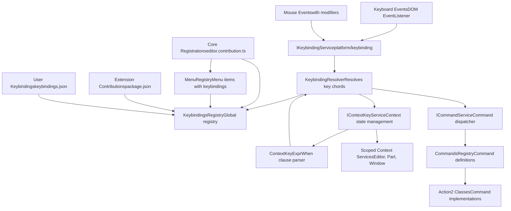
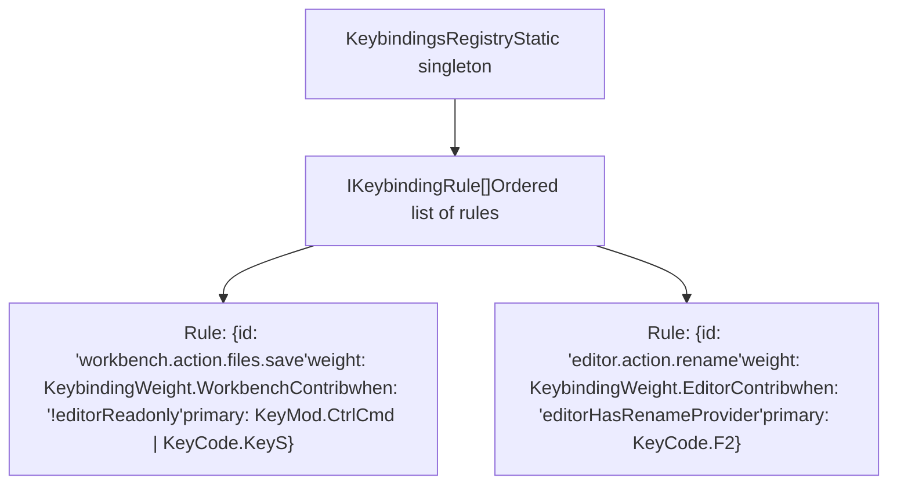
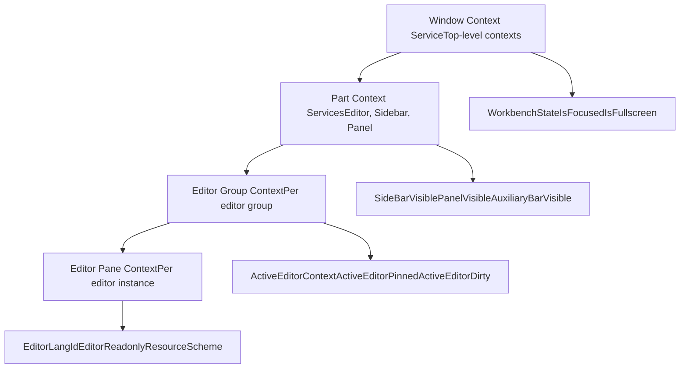
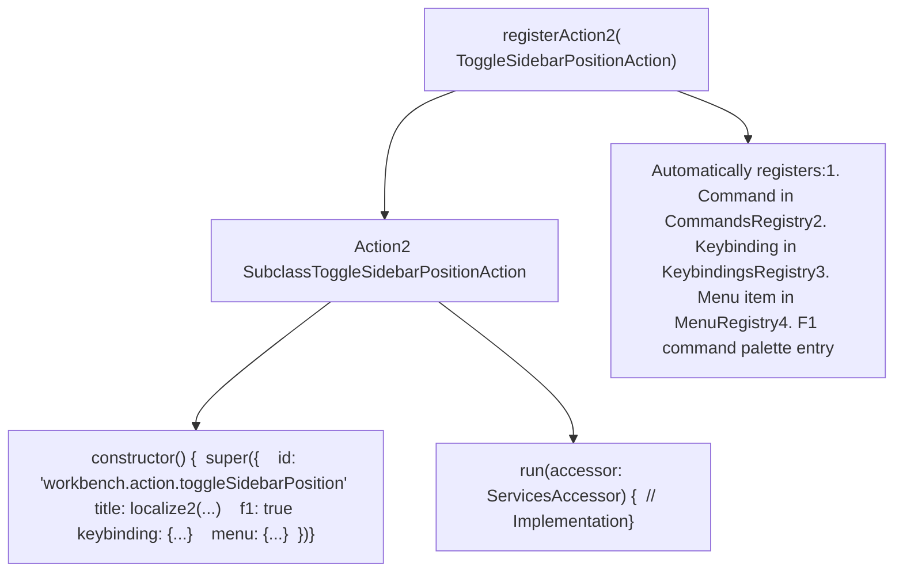
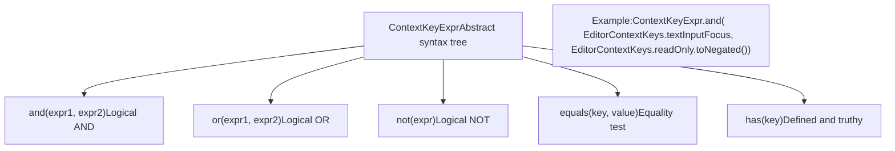
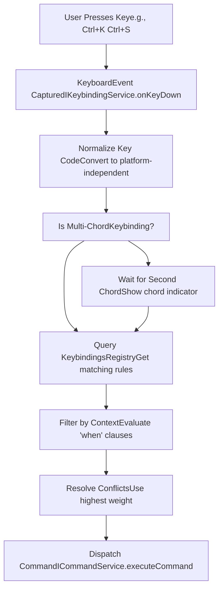
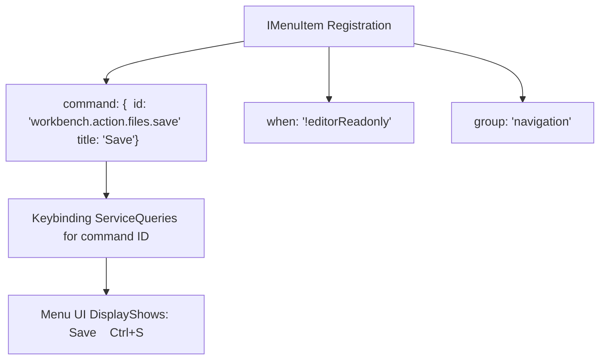
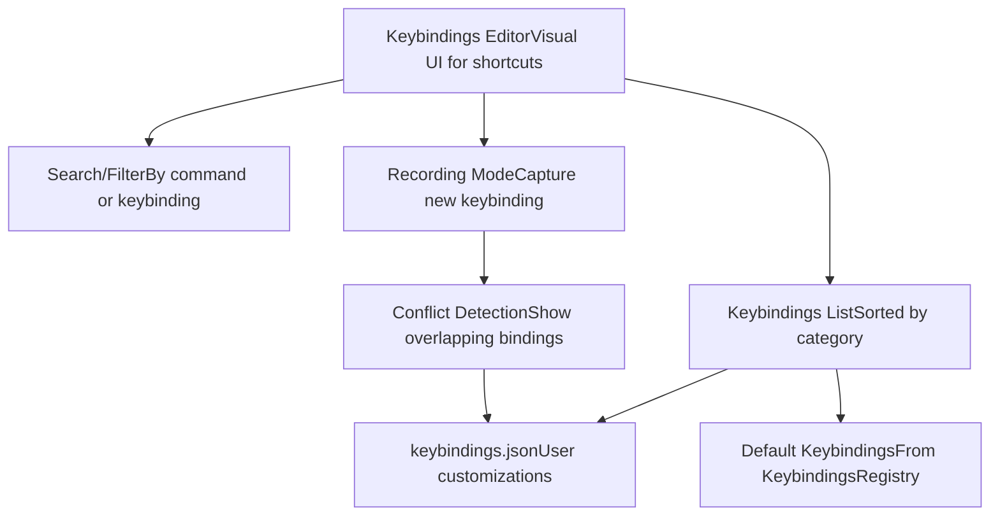

# Keybindings System

Relevant source files

-   [src/vs/platform/action/common/action.ts](https://github.com/microsoft/vscode/blob/1be3088d/src/vs/platform/action/common/action.ts)
-   [src/vs/platform/actions/browser/actionViewItemService.ts](https://github.com/microsoft/vscode/blob/1be3088d/src/vs/platform/actions/browser/actionViewItemService.ts)
-   [src/vs/platform/actions/browser/menuEntryActionViewItem.css](https://github.com/microsoft/vscode/blob/1be3088d/src/vs/platform/actions/browser/menuEntryActionViewItem.css)
-   [src/vs/platform/actions/browser/menuEntryActionViewItem.ts](https://github.com/microsoft/vscode/blob/1be3088d/src/vs/platform/actions/browser/menuEntryActionViewItem.ts)
-   [src/vs/platform/actions/browser/toolbar.ts](https://github.com/microsoft/vscode/blob/1be3088d/src/vs/platform/actions/browser/toolbar.ts)
-   [src/vs/platform/actions/common/actions.ts](https://github.com/microsoft/vscode/blob/1be3088d/src/vs/platform/actions/common/actions.ts)
-   [src/vs/platform/actions/common/menuService.ts](https://github.com/microsoft/vscode/blob/1be3088d/src/vs/platform/actions/common/menuService.ts)
-   [src/vs/platform/editor/common/editor.ts](https://github.com/microsoft/vscode/blob/1be3088d/src/vs/platform/editor/common/editor.ts)
-   [src/vs/platform/observable/common/platformObservableUtils.ts](https://github.com/microsoft/vscode/blob/1be3088d/src/vs/platform/observable/common/platformObservableUtils.ts)
-   [src/vs/workbench/browser/actions/layoutActions.ts](https://github.com/microsoft/vscode/blob/1be3088d/src/vs/workbench/browser/actions/layoutActions.ts)
-   [src/vs/workbench/browser/actions/quickAccessActions.ts](https://github.com/microsoft/vscode/blob/1be3088d/src/vs/workbench/browser/actions/quickAccessActions.ts)
-   [src/vs/workbench/browser/contextkeys.ts](https://github.com/microsoft/vscode/blob/1be3088d/src/vs/workbench/browser/contextkeys.ts)
-   [src/vs/workbench/browser/dnd.ts](https://github.com/microsoft/vscode/blob/1be3088d/src/vs/workbench/browser/dnd.ts)
-   [src/vs/workbench/browser/layout.ts](https://github.com/microsoft/vscode/blob/1be3088d/src/vs/workbench/browser/layout.ts)
-   [src/vs/workbench/browser/parts/auxiliarybar/auxiliaryBarActions.ts](https://github.com/microsoft/vscode/blob/1be3088d/src/vs/workbench/browser/parts/auxiliarybar/auxiliaryBarActions.ts)
-   [src/vs/workbench/browser/parts/editor/auxiliaryEditorPart.ts](https://github.com/microsoft/vscode/blob/1be3088d/src/vs/workbench/browser/parts/editor/auxiliaryEditorPart.ts)
-   [src/vs/workbench/browser/parts/editor/editor.contribution.ts](https://github.com/microsoft/vscode/blob/1be3088d/src/vs/workbench/browser/parts/editor/editor.contribution.ts)
-   [src/vs/workbench/browser/parts/editor/editor.ts](https://github.com/microsoft/vscode/blob/1be3088d/src/vs/workbench/browser/parts/editor/editor.ts)
-   [src/vs/workbench/browser/parts/editor/editorActions.ts](https://github.com/microsoft/vscode/blob/1be3088d/src/vs/workbench/browser/parts/editor/editorActions.ts)
-   [src/vs/workbench/browser/parts/editor/editorCommands.ts](https://github.com/microsoft/vscode/blob/1be3088d/src/vs/workbench/browser/parts/editor/editorCommands.ts)
-   [src/vs/workbench/browser/parts/editor/editorDropTarget.ts](https://github.com/microsoft/vscode/blob/1be3088d/src/vs/workbench/browser/parts/editor/editorDropTarget.ts)
-   [src/vs/workbench/browser/parts/editor/editorGroupView.ts](https://github.com/microsoft/vscode/blob/1be3088d/src/vs/workbench/browser/parts/editor/editorGroupView.ts)
-   [src/vs/workbench/browser/parts/editor/editorPart.ts](https://github.com/microsoft/vscode/blob/1be3088d/src/vs/workbench/browser/parts/editor/editorPart.ts)
-   [src/vs/workbench/browser/parts/editor/editorParts.ts](https://github.com/microsoft/vscode/blob/1be3088d/src/vs/workbench/browser/parts/editor/editorParts.ts)
-   [src/vs/workbench/browser/parts/panel/panelActions.ts](https://github.com/microsoft/vscode/blob/1be3088d/src/vs/workbench/browser/parts/panel/panelActions.ts)
-   [src/vs/workbench/browser/parts/titlebar/commandCenterControl.ts](https://github.com/microsoft/vscode/blob/1be3088d/src/vs/workbench/browser/parts/titlebar/commandCenterControl.ts)
-   [src/vs/workbench/browser/parts/titlebar/media/titlebarpart.css](https://github.com/microsoft/vscode/blob/1be3088d/src/vs/workbench/browser/parts/titlebar/media/titlebarpart.css)
-   [src/vs/workbench/browser/parts/titlebar/titlebarActions.ts](https://github.com/microsoft/vscode/blob/1be3088d/src/vs/workbench/browser/parts/titlebar/titlebarActions.ts)
-   [src/vs/workbench/browser/parts/titlebar/titlebarPart.ts](https://github.com/microsoft/vscode/blob/1be3088d/src/vs/workbench/browser/parts/titlebar/titlebarPart.ts)
-   [src/vs/workbench/browser/parts/titlebar/windowTitle.ts](https://github.com/microsoft/vscode/blob/1be3088d/src/vs/workbench/browser/parts/titlebar/windowTitle.ts)
-   [src/vs/workbench/browser/workbench.contribution.ts](https://github.com/microsoft/vscode/blob/1be3088d/src/vs/workbench/browser/workbench.contribution.ts)
-   [src/vs/workbench/browser/workbench.ts](https://github.com/microsoft/vscode/blob/1be3088d/src/vs/workbench/browser/workbench.ts)
-   [src/vs/workbench/common/contextkeys.ts](https://github.com/microsoft/vscode/blob/1be3088d/src/vs/workbench/common/contextkeys.ts)
-   [src/vs/workbench/common/editor.ts](https://github.com/microsoft/vscode/blob/1be3088d/src/vs/workbench/common/editor.ts)
-   [src/vs/workbench/contrib/chat/browser/widget/chatContentParts/chatInlineAnchorWidget.ts](https://github.com/microsoft/vscode/blob/1be3088d/src/vs/workbench/contrib/chat/browser/widget/chatContentParts/chatInlineAnchorWidget.ts)
-   [src/vs/workbench/contrib/chat/browser/widget/chatContentParts/chatMarkdownDecorationsRenderer.ts](https://github.com/microsoft/vscode/blob/1be3088d/src/vs/workbench/contrib/chat/browser/widget/chatContentParts/chatMarkdownDecorationsRenderer.ts)
-   [src/vs/workbench/contrib/chat/browser/widget/chatContentParts/media/chatInlineAnchorWidget.css](https://github.com/microsoft/vscode/blob/1be3088d/src/vs/workbench/contrib/chat/browser/widget/chatContentParts/media/chatInlineAnchorWidget.css)
-   [src/vs/workbench/contrib/debug/browser/statusbarColorProvider.ts](https://github.com/microsoft/vscode/blob/1be3088d/src/vs/workbench/contrib/debug/browser/statusbarColorProvider.ts)
-   [src/vs/workbench/services/actions/common/menusExtensionPoint.ts](https://github.com/microsoft/vscode/blob/1be3088d/src/vs/workbench/services/actions/common/menusExtensionPoint.ts)
-   [src/vs/workbench/services/editor/browser/editorService.ts](https://github.com/microsoft/vscode/blob/1be3088d/src/vs/workbench/services/editor/browser/editorService.ts)
-   [src/vs/workbench/services/editor/common/editorGroupsService.ts](https://github.com/microsoft/vscode/blob/1be3088d/src/vs/workbench/services/editor/common/editorGroupsService.ts)
-   [src/vs/workbench/services/editor/common/editorService.ts](https://github.com/microsoft/vscode/blob/1be3088d/src/vs/workbench/services/editor/common/editorService.ts)
-   [src/vs/workbench/services/editor/test/browser/editorGroupsService.test.ts](https://github.com/microsoft/vscode/blob/1be3088d/src/vs/workbench/services/editor/test/browser/editorGroupsService.test.ts)
-   [src/vs/workbench/services/editor/test/browser/editorService.test.ts](https://github.com/microsoft/vscode/blob/1be3088d/src/vs/workbench/services/editor/test/browser/editorService.test.ts)
-   [src/vs/workbench/services/layout/browser/layoutService.ts](https://github.com/microsoft/vscode/blob/1be3088d/src/vs/workbench/services/layout/browser/layoutService.ts)
-   [src/vs/workbench/test/browser/workbenchTestServices.ts](https://github.com/microsoft/vscode/blob/1be3088d/src/vs/workbench/test/browser/workbenchTestServices.ts)

The keybindings system manages keyboard shortcuts throughout VS Code, providing a flexible mechanism for binding commands to key combinations with context-aware activation. It handles keybinding registration, resolution, conflict detection, and user customization.

**Scope**: This document covers the keybinding service architecture, registration patterns, context key system, and integration with the actions/commands framework. For configuration service details, see [Configuration Service Architecture](/microsoft/vscode/12.1-configuration-service-architecture). For the visual settings editor, see [Settings Editor](/microsoft/vscode/12.2-settings-editor).

---

## Architecture Overview


**Sources**: [src/vs/workbench/browser/parts/editor/editor.contribution.ts1-800](https://github.com/microsoft/vscode/blob/1be3088d/src/vs/workbench/browser/parts/editor/editor.contribution.ts#L1-L800) [src/vs/platform/actions/common/actions.ts1-500](https://github.com/microsoft/vscode/blob/1be3088d/src/vs/platform/actions/common/actions.ts#L1-L500) [src/vs/workbench/browser/actions/layoutActions.ts1-300](https://github.com/microsoft/vscode/blob/1be3088d/src/vs/workbench/browser/actions/layoutActions.ts#L1-L300)

---

## Core Components

### IKeybindingService

The `IKeybindingService` is the central service for keybinding management. It provides APIs for resolving keybindings, looking up commands by key combination, and converting between keybinding representations.

**Key Responsibilities**:

-   Resolve key sequences to commands
-   Query keybindings for specific commands
-   Handle multi-chord keybindings (e.g., Ctrl+K Ctrl+S)
-   Provide keybinding labels for UI display
-   Manage user vs. default keybindings

**Usage Example** from titlebar: [src/vs/workbench/browser/parts/titlebar/titlebarPart.ts309](https://github.com/microsoft/vscode/blob/1be3088d/src/vs/workbench/browser/parts/titlebar/titlebarPart.ts#L309-L309) - `@IKeybindingService private readonly keybindingService: IKeybindingService`

**Sources**: [src/vs/workbench/browser/parts/titlebar/titlebarPart.ts300-320](https://github.com/microsoft/vscode/blob/1be3088d/src/vs/workbench/browser/parts/titlebar/titlebarPart.ts#L300-L320) [src/vs/workbench/test/browser/workbenchTestServices.ts335-336](https://github.com/microsoft/vscode/blob/1be3088d/src/vs/workbench/test/browser/workbenchTestServices.ts#L335-L336)

### KeybindingsRegistry

Global registry that stores all keybinding rules. Extensions, core code, and users all register keybindings into this registry.


**Registration APIs**:

-   `KeybindingsRegistry.registerKeybindingRule(rule: IKeybindingRule)`
-   `KeybindingsRegistry.registerCommandAndKeybindingRule(desc)`

**Sources**: [src/vs/workbench/browser/parts/editor/editor.contribution.ts530-600](https://github.com/microsoft/vscode/blob/1be3088d/src/vs/workbench/browser/parts/editor/editor.contribution.ts#L530-L600) [src/vs/workbench/browser/actions/layoutActions.ts60-150](https://github.com/microsoft/vscode/blob/1be3088d/src/vs/workbench/browser/actions/layoutActions.ts#L60-L150)

### Context Keys System

Context keys are boolean, string, or numeric values that control when keybindings and menu items are visible/enabled. The `IContextKeyService` maintains a hierarchical tree of context values.

**Context Key Hierarchy**:


**Common Context Keys** (from [src/vs/workbench/common/contextkeys.ts1-300](https://github.com/microsoft/vscode/blob/1be3088d/src/vs/workbench/common/contextkeys.ts#L1-L300)):

| Context Key | Type | Description |
| --- | --- | --- |
| `activeEditorContext` | string | Resource of active editor |
| `activeEditorIsPinned` | boolean | Whether active editor is pinned |
| `activeEditorIsReadonly` | boolean | Whether editor is readonly |
| `editorTextFocus` | boolean | Whether editor has text focus |
| `textCompareEditorActive` | boolean | Whether diff editor is active |
| `sideBarVisible` | boolean | Whether sidebar is visible |
| `panelVisible` | boolean | Whether panel is visible |

**Sources**: [src/vs/workbench/common/contextkeys.ts1-350](https://github.com/microsoft/vscode/blob/1be3088d/src/vs/workbench/common/contextkeys.ts#L1-L350) [src/vs/workbench/browser/contextkeys.ts1-200](https://github.com/microsoft/vscode/blob/1be3088d/src/vs/workbench/browser/contextkeys.ts#L1-L200) [src/vs/workbench/browser/parts/editor/editorGroupView.ts249-273](https://github.com/microsoft/vscode/blob/1be3088d/src/vs/workbench/browser/parts/editor/editorGroupView.ts#L249-L273)

---

## Keybinding Registration Patterns

### Declarative Registration with Action2

The modern approach uses `Action2` classes with declarative metadata. This automatically registers commands, keybindings, and menu items.


**Example** from layout actions [src/vs/workbench/browser/actions/layoutActions.ts138-180](https://github.com/microsoft/vscode/blob/1be3088d/src/vs/workbench/browser/actions/layoutActions.ts#L138-L180):

```
registerAction2(class extends Action2 {
    constructor() {
        super({
            id: 'workbench.action.toggleSidebarPosition',
            title: localize2('toggleSidebarPosition', "Toggle Primary Side Bar Position"),
            keybinding: {
                weight: KeybindingWeight.WorkbenchContrib,
                primary: 0  // No default keybinding
            },
            menu: {
                id: MenuId.CommandPalette
            }
        });
    }

    run(accessor: ServicesAccessor): void {
        const layoutService = accessor.get(IWorkbenchLayoutService);
        const position = layoutService.getSideBarPosition();
        const newPosition = position === Position.LEFT ? Position.RIGHT : Position.LEFT;
        // ... implementation
    }
});
```
**Sources**: [src/vs/workbench/browser/actions/layoutActions.ts100-200](https://github.com/microsoft/vscode/blob/1be3088d/src/vs/workbench/browser/actions/layoutActions.ts#L100-L200) [src/vs/platform/actions/common/actions.ts1-100](https://github.com/microsoft/vscode/blob/1be3088d/src/vs/platform/actions/common/actions.ts#L1-L100)

### Imperative Registration with KeybindingsRegistry

Direct registration for fine-grained control, often used for editor-specific commands.

**Example** from editor contributions [src/vs/workbench/browser/parts/editor/editor.contribution.ts530-600](https://github.com/microsoft/vscode/blob/1be3088d/src/vs/workbench/browser/parts/editor/editor.contribution.ts#L530-L600):

```
KeybindingsRegistry.registerKeybindingRule({
    id: CLOSE_EDITOR_COMMAND_ID,
    weight: KeybindingWeight.WorkbenchContrib,
    when: ContextKeyExpr.and(
        ActiveEditorGroupEmptyContext.toNegated(),
        ActiveEditorStickyContext.toNegated()
    ),
    primary: KeyMod.CtrlCmd | KeyCode.KeyW,
    win: { primary: KeyMod.CtrlCmd | KeyCode.F4, secondary: [KeyMod.CtrlCmd | KeyCode.KeyW] }
});
```
**Sources**: [src/vs/workbench/browser/parts/editor/editor.contribution.ts530-700](https://github.com/microsoft/vscode/blob/1be3088d/src/vs/workbench/browser/parts/editor/editor.contribution.ts#L530-L700) [src/vs/workbench/browser/parts/editor/editorCommands.ts1-200](https://github.com/microsoft/vscode/blob/1be3088d/src/vs/workbench/browser/parts/editor/editorCommands.ts#L1-L200)

### Keybinding Rule Properties

| Property | Type | Description |
| --- | --- | --- |
| `id` | string | Command identifier to execute |
| `weight` | KeybindingWeight | Priority for conflict resolution |
| `when` | ContextKeyExpression | Context condition for activation |
| `primary` | number | Primary keybinding (bitmask) |
| `secondary` | number\[\] | Alternative keybindings |
| `win` / `mac` / `linux` | object | Platform-specific overrides |

**KeybindingWeight Constants**:

-   `EditorCore = 0`
-   `EditorContrib = 100`
-   `WorkbenchContrib = 200`
-   `BuiltinExtension = 300`
-   `ExternalExtension = 400`

**Sources**: [src/vs/workbench/browser/parts/editor/editor.contribution.ts550-650](https://github.com/microsoft/vscode/blob/1be3088d/src/vs/workbench/browser/parts/editor/editor.contribution.ts#L550-L650)

---

## Context Key Expressions and When Clauses

Context key expressions define when keybindings and menu items are active. They use a simple boolean expression language.

### Expression Syntax


**Common Patterns**:

```
// Simple check
when: 'editorTextFocus'

// Negation
when: '!editorReadonly'

// Conjunction
when: 'editorTextFocus && !editorReadonly'

// Disjunction
when: 'sideBarVisible || panelVisible'

// Equality
when: 'activeEditor == workbench.editor.notebook'

// Complex expression
when: 'editorTextFocus && !editorReadonly && editorLangId == typescript'
```
**Sources**: [src/vs/workbench/browser/parts/editor/editorGroupView.ts249-290](https://github.com/microsoft/vscode/blob/1be3088d/src/vs/workbench/browser/parts/editor/editorGroupView.ts#L249-L290) [src/vs/workbench/browser/parts/editor/editor.contribution.ts11-50](https://github.com/microsoft/vscode/blob/1be3088d/src/vs/workbench/browser/parts/editor/editor.contribution.ts#L11-L50)

### Dynamic Context Keys

Context keys are updated dynamically as application state changes. Editor groups maintain their own scoped context services.

**Example from EditorGroupView** [src/vs/workbench/browser/parts/editor/editorGroupView.ts249-275](https://github.com/microsoft/vscode/blob/1be3088d/src/vs/workbench/browser/parts/editor/editorGroupView.ts#L249-L275):

```
private handleGroupContextKeys(): void {
    const groupActiveEditorDirtyContext = this.editorPartsView.bind(ActiveEditorDirtyContext, this);
    const groupActiveEditorPinnedContext = this.editorPartsView.bind(ActiveEditorPinnedContext, this);
    const groupActiveEditorStickyContext = this.editorPartsView.bind(ActiveEditorStickyContext, this);
    const groupEditorsCountContext = this.editorPartsView.bind(EditorGroupEditorsCountContext, this);
    const groupLockedContext = this.editorPartsView.bind(ActiveEditorGroupLockedContext, this);

    // These are updated when editors change
}
```
**Update Triggers**:

-   Active editor changes → Updates `ActiveEditorContext`, `ActiveEditorDirtyContext`, etc.
-   Editor becomes dirty → Updates `ActiveEditorDirtyContext`
-   Editor pins/unpins → Updates `ActiveEditorPinnedContext`
-   Focus changes → Updates `editorTextFocus`, `inputFocus`, etc.

**Sources**: [src/vs/workbench/browser/parts/editor/editorGroupView.ts249-290](https://github.com/microsoft/vscode/blob/1be3088d/src/vs/workbench/browser/parts/editor/editorGroupView.ts#L249-L290) [src/vs/workbench/browser/contextkeys.ts1-200](https://github.com/microsoft/vscode/blob/1be3088d/src/vs/workbench/browser/contextkeys.ts#L1-L200)

---

## Keybinding Resolution Flow


**Conflict Resolution**:

1.  Filter rules by context (evaluate `when` clause)
2.  Sort by `weight` (higher weight wins)
3.  Platform-specific bindings override generic ones
4.  User keybindings override default keybindings

**Sources**: [src/vs/workbench/browser/parts/editor/editor.contribution.ts530-650](https://github.com/microsoft/vscode/blob/1be3088d/src/vs/workbench/browser/parts/editor/editor.contribution.ts#L530-L650) [src/vs/workbench/browser/parts/editor/editorCommands.ts1-300](https://github.com/microsoft/vscode/blob/1be3088d/src/vs/workbench/browser/parts/editor/editorCommands.ts#L1-L300)

---

## Integration with Menus and Actions

Keybindings are tightly integrated with the menu system. Menu items can specify keybindings, and keybindings can appear in menus.

### Menu Item with Keybinding


**Example** from editor title menu [src/vs/workbench/browser/parts/editor/editor.contribution.ts200-300](https://github.com/microsoft/vscode/blob/1be3088d/src/vs/workbench/browser/parts/editor/editor.contribution.ts#L200-L300):

```
MenuRegistry.appendMenuItem(MenuId.EditorTitle, {
    command: {
        id: CLOSE_EDITOR_COMMAND_ID,
        title: localize('close', "Close"),
        icon: Codicon.close
    },
    group: 'navigation',
    when: ContextKeyExpr.and(
        ActiveEditorGroupEmptyContext.toNegated(),
        MultipleEditorsSelectedInGroupContext.toNegated()
    ),
    order: 1000000
});
```
The keybinding service automatically displays the keybinding (Ctrl+W) next to the menu item.

**Sources**: [src/vs/workbench/browser/parts/editor/editor.contribution.ts150-400](https://github.com/microsoft/vscode/blob/1be3088d/src/vs/workbench/browser/parts/editor/editor.contribution.ts#L150-L400) [src/vs/platform/actions/common/actions.ts18-100](https://github.com/microsoft/vscode/blob/1be3088d/src/vs/platform/actions/common/actions.ts#L18-L100)

### MenuId Categories

Common menu locations where keybindings appear:

| MenuId | Description | Example |
| --- | --- | --- |
| `MenuId.CommandPalette` | F1 command palette | All F1-registered actions |
| `MenuId.EditorTitle` | Editor tab actions | Close, Split, Pin |
| `MenuId.EditorContext` | Editor right-click | Cut, Copy, Paste |
| `MenuId.MenubarFileMenu` | File menu in menubar | New File, Save |
| `MenuId.ViewTitle` | View container toolbar | Collapse All |

**Sources**: [src/vs/platform/actions/common/actions.ts65-300](https://github.com/microsoft/vscode/blob/1be3088d/src/vs/platform/actions/common/actions.ts#L65-L300) [src/vs/workbench/services/actions/common/menusExtensionPoint.ts1-200](https://github.com/microsoft/vscode/blob/1be3088d/src/vs/workbench/services/actions/common/menusExtensionPoint.ts#L1-L200)

---

## Keybindings Editor UI

VS Code provides a dedicated keybindings editor for viewing and customizing keyboard shortcuts.

**Access Points**:

-   Command Palette: "Preferences: Open Keyboard Shortcuts"
-   Menu: File > Preferences > Keyboard Shortcuts
-   Keybinding: Ctrl+K Ctrl+S

**Architecture** (reference from configuration patterns):


**Features**:

-   Search by command name, keybinding, or when clause
-   Record new keybindings with conflict detection
-   View/edit `keybindings.json` directly
-   Reset individual or all keybindings
-   Platform-specific keybinding display

**Sources**: [src/vs/workbench/browser/actions/layoutActions.ts1-100](https://github.com/microsoft/vscode/blob/1be3088d/src/vs/workbench/browser/actions/layoutActions.ts#L1-L100) (similar patterns), [src/vs/workbench/browser/workbench.contribution.ts1-100](https://github.com/microsoft/vscode/blob/1be3088d/src/vs/workbench/browser/workbench.contribution.ts#L1-L100)

---

## User Customization

Users can customize keybindings in `keybindings.json`, which has highest priority.

### Keybindings.json Format

```
[
    {
        "key": "ctrl+shift+p",
        "command": "workbench.action.showCommands"
    },
    {
        "key": "ctrl+k ctrl+s",
        "command": "workbench.action.openGlobalKeybindings"
    },
    {
        "key": "ctrl+w",
        "command": "-workbench.action.closeActiveEditor",
        "when": "editorTextFocus"
    }
]
```
**Rule Properties**:

-   `key`: Keybinding string (e.g., "ctrl+k ctrl+s")
-   `command`: Command ID to execute (prefix `-` to unbind)
-   `when`: Optional context expression
-   `args`: Optional arguments to pass to command

**Priority Order** (highest to lowest):

1.  User keybindings (`keybindings.json`)
2.  Extension keybindings (`package.json`)
3.  Workspace keybindings (if any)
4.  Default keybindings (from core)

**Sources**: [src/vs/workbench/browser/parts/editor/editor.contribution.ts1-100](https://github.com/microsoft/vscode/blob/1be3088d/src/vs/workbench/browser/parts/editor/editor.contribution.ts#L1-L100) [src/vs/workbench/browser/workbench.contribution.ts1-100](https://github.com/microsoft/vscode/blob/1be3088d/src/vs/workbench/browser/workbench.contribution.ts#L1-L100)

---

## Key Code Representation

Keybindings use a bitmask representation for efficient storage and comparison.

### KeyCode and KeyMod Constants

```
// From KeyCode enum
KeyCode.KeyA = 31
KeyCode.KeyS = 45
KeyCode.F2 = 113
KeyCode.Escape = 9

// Modifiers as bitmasks
KeyMod.CtrlCmd = 2048   // Ctrl on Windows/Linux, Cmd on Mac
KeyMod.Shift = 1024
KeyMod.Alt = 512
KeyMod.WinCtrl = 256    // Ctrl on Mac, Win on Windows

// Combined example
KeyMod.CtrlCmd | KeyCode.KeyS = 2048 | 45 = 2093
```
**Platform-Specific Handling**:

```
// Same keybinding, different platforms
{
    id: 'editor.action.formatDocument',
    primary: KeyMod.Shift | KeyMod.Alt | KeyCode.KeyF,
    win: { primary: KeyMod.Shift | KeyMod.Alt | KeyCode.KeyF },
    linux: { primary: KeyMod.CtrlCmd | KeyMod.Shift | KeyCode.KeyI },
    mac: { primary: KeyMod.Shift | KeyMod.Alt | KeyCode.KeyF }
}
```
**KeyMod.CtrlCmd** automatically maps to:

-   Ctrl on Windows/Linux
-   Cmd (⌘) on macOS

**Sources**: [src/vs/workbench/browser/parts/editor/editor.contribution.ts28](https://github.com/microsoft/vscode/blob/1be3088d/src/vs/workbench/browser/parts/editor/editor.contribution.ts#L28-L28) [src/vs/workbench/browser/actions/layoutActions.ts13](https://github.com/microsoft/vscode/blob/1be3088d/src/vs/workbench/browser/actions/layoutActions.ts#L13-L13)

---

## Common Registration Patterns

### Pattern 1: Simple Command with Keybinding

```
registerAction2(class extends Action2 {
    constructor() {
        super({
            id: 'workbench.action.togglePanel',
            title: localize2('togglePanel', "Toggle Panel"),
            keybinding: {
                weight: KeybindingWeight.WorkbenchContrib,
                primary: KeyMod.CtrlCmd | KeyCode.KeyJ
            }
        });
    }
    run(accessor: ServicesAccessor): void {
        const layoutService = accessor.get(IWorkbenchLayoutService);
        layoutService.setPartHidden(layoutService.isVisible(Parts.PANEL_PART), Parts.PANEL_PART);
    }
});
```
### Pattern 2: Platform-Specific Keybindings

```
keybinding: {
    weight: KeybindingWeight.WorkbenchContrib,
    when: EditorContextKeys.textInputFocus,
    primary: KeyMod.CtrlCmd | KeyCode.Enter,
    win: { primary: KeyMod.CtrlCmd | KeyCode.Enter },
    mac: { primary: KeyMod.WinCtrl | KeyCode.Enter }
}
```
### Pattern 3: Conditional Keybinding

```
KeybindingsRegistry.registerKeybindingRule({
    id: SPLIT_EDITOR,
    weight: KeybindingWeight.WorkbenchContrib,
    when: ContextKeyExpr.and(
        ActiveEditorCanSplitInGroupContext,
        SideBySideEditorActiveContext.toNegated()
    ),
    primary: KeyMod.CtrlCmd | KeyCode.Backslash
});
```
### Pattern 4: Multi-Chord Keybinding

```
keybinding: {
    weight: KeybindingWeight.WorkbenchContrib,
    primary: KeyChord(
        KeyMod.CtrlCmd | KeyCode.KeyK,
        KeyMod.CtrlCmd | KeyCode.KeyS
    )
}
// Results in: Ctrl+K Ctrl+S
```
**Sources**: [src/vs/workbench/browser/actions/layoutActions.ts60-300](https://github.com/microsoft/vscode/blob/1be3088d/src/vs/workbench/browser/actions/layoutActions.ts#L60-L300) [src/vs/workbench/browser/parts/editor/editor.contribution.ts530-700](https://github.com/microsoft/vscode/blob/1be3088d/src/vs/workbench/browser/parts/editor/editor.contribution.ts#L530-L700) [src/vs/workbench/browser/parts/editor/editorCommands.ts1-300](https://github.com/microsoft/vscode/blob/1be3088d/src/vs/workbench/browser/parts/editor/editorCommands.ts#L1-L300)

---

## Testing and Mock Services

The test infrastructure provides `MockKeybindingService` for unit testing components that depend on keybindings.

**Mock Service** from [src/vs/workbench/test/browser/workbenchTestServices.ts335-336](https://github.com/microsoft/vscode/blob/1be3088d/src/vs/workbench/test/browser/workbenchTestServices.ts#L335-L336):

```
const keybindingService = new MockKeybindingService();
instantiationService.stub(IKeybindingService, keybindingService);
```
The mock service allows tests to:

-   Verify keybinding lookups without full initialization
-   Test context key evaluation
-   Simulate keybinding triggers
-   Test conflict resolution logic

**Sources**: [src/vs/workbench/test/browser/workbenchTestServices.ts280-360](https://github.com/microsoft/vscode/blob/1be3088d/src/vs/workbench/test/browser/workbenchTestServices.ts#L280-L360) [src/vs/workbench/services/editor/test/browser/editorService.test.ts1-50](https://github.com/microsoft/vscode/blob/1be3088d/src/vs/workbench/services/editor/test/browser/editorService.test.ts#L1-L50)
