# Build System and Development

Relevant source files

-   [.npmrc](https://github.com/microsoft/vscode/blob/1be3088d/.npmrc)
-   [.nvmrc](https://github.com/microsoft/vscode/blob/1be3088d/.nvmrc)
-   [build/.cachesalt](https://github.com/microsoft/vscode/blob/1be3088d/build/.cachesalt)
-   [build/.moduleignore](https://github.com/microsoft/vscode/blob/1be3088d/build/.moduleignore)
-   [build/.webignore](https://github.com/microsoft/vscode/blob/1be3088d/build/.webignore)
-   [build/azure-pipelines/alpine/product-build-alpine.yml](https://github.com/microsoft/vscode/blob/1be3088d/build/azure-pipelines/alpine/product-build-alpine.yml)
-   [build/azure-pipelines/common/installPlaywright.js](https://github.com/microsoft/vscode/blob/1be3088d/build/azure-pipelines/common/installPlaywright.js)
-   [build/azure-pipelines/common/publish-artifact.yml](https://github.com/microsoft/vscode/blob/1be3088d/build/azure-pipelines/common/publish-artifact.yml)
-   [build/azure-pipelines/common/publish.ts](https://github.com/microsoft/vscode/blob/1be3088d/build/azure-pipelines/common/publish.ts)
-   [build/azure-pipelines/config/CredScanSuppressions.json](https://github.com/microsoft/vscode/blob/1be3088d/build/azure-pipelines/config/CredScanSuppressions.json)
-   [build/azure-pipelines/config/tsaoptions.json](https://github.com/microsoft/vscode/blob/1be3088d/build/azure-pipelines/config/tsaoptions.json)
-   [build/azure-pipelines/darwin/product-build-darwin-cli-sign.yml](https://github.com/microsoft/vscode/blob/1be3088d/build/azure-pipelines/darwin/product-build-darwin-cli-sign.yml)
-   [build/azure-pipelines/darwin/product-build-darwin-universal.yml](https://github.com/microsoft/vscode/blob/1be3088d/build/azure-pipelines/darwin/product-build-darwin-universal.yml)
-   [build/azure-pipelines/darwin/product-build-darwin.yml](https://github.com/microsoft/vscode/blob/1be3088d/build/azure-pipelines/darwin/product-build-darwin.yml)
-   [build/azure-pipelines/linux/product-build-linux.yml](https://github.com/microsoft/vscode/blob/1be3088d/build/azure-pipelines/linux/product-build-linux.yml)
-   [build/azure-pipelines/linux/setup-env.sh](https://github.com/microsoft/vscode/blob/1be3088d/build/azure-pipelines/linux/setup-env.sh)
-   [build/azure-pipelines/product-build.yml](https://github.com/microsoft/vscode/blob/1be3088d/build/azure-pipelines/product-build.yml)
-   [build/azure-pipelines/product-compile.yml](https://github.com/microsoft/vscode/blob/1be3088d/build/azure-pipelines/product-compile.yml)
-   [build/azure-pipelines/product-publish.yml](https://github.com/microsoft/vscode/blob/1be3088d/build/azure-pipelines/product-publish.yml)
-   [build/azure-pipelines/web/product-build-web.yml](https://github.com/microsoft/vscode/blob/1be3088d/build/azure-pipelines/web/product-build-web.yml)
-   [build/azure-pipelines/win32/product-build-win32-cli-sign.yml](https://github.com/microsoft/vscode/blob/1be3088d/build/azure-pipelines/win32/product-build-win32-cli-sign.yml)
-   [build/azure-pipelines/win32/product-build-win32.yml](https://github.com/microsoft/vscode/blob/1be3088d/build/azure-pipelines/win32/product-build-win32.yml)
-   [build/checksums/electron.txt](https://github.com/microsoft/vscode/blob/1be3088d/build/checksums/electron.txt)
-   [build/checksums/nodejs.txt](https://github.com/microsoft/vscode/blob/1be3088d/build/checksums/nodejs.txt)
-   [build/linux/dependencies-generator.ts](https://github.com/microsoft/vscode/blob/1be3088d/build/linux/dependencies-generator.ts)
-   [build/npm/gyp/package-lock.json](https://github.com/microsoft/vscode/blob/1be3088d/build/npm/gyp/package-lock.json)
-   [build/package-lock.json](https://github.com/microsoft/vscode/blob/1be3088d/build/package-lock.json)
-   [build/package.json](https://github.com/microsoft/vscode/blob/1be3088d/build/package.json)
-   [cgmanifest.json](https://github.com/microsoft/vscode/blob/1be3088d/cgmanifest.json)
-   [cli/.cargo/config.toml](https://github.com/microsoft/vscode/blob/1be3088d/cli/.cargo/config.toml)
-   [cli/CONTRIBUTING.md](https://github.com/microsoft/vscode/blob/1be3088d/cli/CONTRIBUTING.md)
-   [eslint.config.js](https://github.com/microsoft/vscode/blob/1be3088d/eslint.config.js)
-   [extensions/git/package-lock.json](https://github.com/microsoft/vscode/blob/1be3088d/extensions/git/package-lock.json)
-   [extensions/github-authentication/package-lock.json](https://github.com/microsoft/vscode/blob/1be3088d/extensions/github-authentication/package-lock.json)
-   [extensions/notebook-renderers/package-lock.json](https://github.com/microsoft/vscode/blob/1be3088d/extensions/notebook-renderers/package-lock.json)
-   [extensions/package-lock.json](https://github.com/microsoft/vscode/blob/1be3088d/extensions/package-lock.json)
-   [extensions/package.json](https://github.com/microsoft/vscode/blob/1be3088d/extensions/package.json)
-   [package-lock.json](https://github.com/microsoft/vscode/blob/1be3088d/package-lock.json)
-   [package.json](https://github.com/microsoft/vscode/blob/1be3088d/package.json)
-   [remote/.npmrc](https://github.com/microsoft/vscode/blob/1be3088d/remote/.npmrc)
-   [remote/package-lock.json](https://github.com/microsoft/vscode/blob/1be3088d/remote/package-lock.json)
-   [remote/package.json](https://github.com/microsoft/vscode/blob/1be3088d/remote/package.json)
-   [remote/web/package-lock.json](https://github.com/microsoft/vscode/blob/1be3088d/remote/web/package-lock.json)
-   [remote/web/package.json](https://github.com/microsoft/vscode/blob/1be3088d/remote/web/package.json)
-   [src/vs/base/parts/contextmenu/electron-main/contextmenu.ts](https://github.com/microsoft/vscode/blob/1be3088d/src/vs/base/parts/contextmenu/electron-main/contextmenu.ts)
-   [src/vs/platform/environment/test/node/nativeModules.integrationTest.ts](https://github.com/microsoft/vscode/blob/1be3088d/src/vs/platform/environment/test/node/nativeModules.integrationTest.ts)
-   [src/vs/workbench/contrib/chat/browser/widget/media/chatViewWelcome.css](https://github.com/microsoft/vscode/blob/1be3088d/src/vs/workbench/contrib/chat/browser/widget/media/chatViewWelcome.css)
-   [test/automation/package-lock.json](https://github.com/microsoft/vscode/blob/1be3088d/test/automation/package-lock.json)
-   [test/automation/package.json](https://github.com/microsoft/vscode/blob/1be3088d/test/automation/package.json)
-   [test/integration/browser/package-lock.json](https://github.com/microsoft/vscode/blob/1be3088d/test/integration/browser/package-lock.json)
-   [test/integration/browser/package.json](https://github.com/microsoft/vscode/blob/1be3088d/test/integration/browser/package.json)
-   [test/smoke/package-lock.json](https://github.com/microsoft/vscode/blob/1be3088d/test/smoke/package-lock.json)
-   [test/smoke/package.json](https://github.com/microsoft/vscode/blob/1be3088d/test/smoke/package.json)
-   [test/smoke/src/areas/accessibility/accessibility.test.ts](https://github.com/microsoft/vscode/blob/1be3088d/test/smoke/src/areas/accessibility/accessibility.test.ts)

This document describes VS Code's build system architecture, dependency management strategy, and development workflows. It covers the monorepo structure, TypeScript compilation pipeline, native module management, platform-specific build processes, and the Azure DevOps CI/CD pipeline that produces distributable artifacts for Windows, macOS, Linux, Alpine, and Web platforms.

For information about the overall application architecture, see [Overview](/microsoft/vscode/1-overview). For details on specific subsystems like code quality enforcement, see [Code Quality and Linting](/microsoft/vscode/2.4-code-quality-and-linting).

---

## Build System Architecture

VS Code uses a multi-stage build system that compiles TypeScript source code, manages native dependencies, and produces platform-specific distribution packages. The build process is orchestrated through npm scripts defined in `package.json` and Gulp tasks, with platform-specific builds executed in Azure DevOps pipelines.

### Package Structure

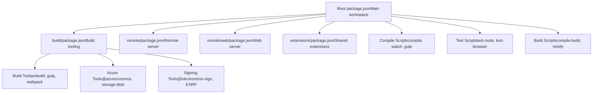
Sources: [package.json1-242](https://github.com/microsoft/vscode/blob/1be3088d/package.json#L1-L242) [build/package.json1-84](https://github.com/microsoft/vscode/blob/1be3088d/build/package.json#L1-L84) [remote/package.json1-50](https://github.com/microsoft/vscode/blob/1be3088d/remote/package.json#L1-L50) [remote/web/package.json1-26](https://github.com/microsoft/vscode/blob/1be3088d/remote/web/package.json#L1-L26) [extensions/package.json1-20](https://github.com/microsoft/vscode/blob/1be3088d/extensions/package.json#L1-L20)

### Dependency Management

VS Code uses a hybrid approach with multiple `package.json` files for different contexts:

| Package | Purpose | Key Dependencies |
| --- | --- | --- |
| **Root** | Main application | Electron (39.2.7), xterm.js (@xterm/xterm), native modules (@parcel/watcher, node-pty, native-keymap) |
| **build/** | Build tooling | @azure/cosmos, @azure/storage-blob, gulp, webpack, esbuild |
| **remote/** | Remote server | Subset of main deps without Electron-specific packages |
| **remote/web/** | Web standalone | Browser-only dependencies (xterm, katex, vscode-textmate) |
| **extensions/** | Extensions shared deps | TypeScript (5.9.3), esbuild, @parcel/watcher |

The root `package.json` defines npm configuration through `.npmrc`:

```
disturl="https://electronjs.org/headers"
target="39.2.7"
runtime="electron"
build_from_source="true"
```
This configuration ensures native modules are compiled against Electron's Node.js headers rather than system Node.js.

Sources: [package.json74-122](https://github.com/microsoft/vscode/blob/1be3088d/package.json#L74-L122) [.npmrc1-7](https://github.com/microsoft/vscode/blob/1be3088d/.npmrc#L1-L7) [remote/package.json5-42](https://github.com/microsoft/vscode/blob/1be3088d/remote/package.json#L5-L42) [remote/web/package.json5-25](https://github.com/microsoft/vscode/blob/1be3088d/remote/web/package.json#L5-L25) [extensions/package.json6-16](https://github.com/microsoft/vscode/blob/1be3088d/extensions/package.json#L6-L16)

---

## Build Scripts and Compilation Pipeline

### Core Build Scripts

The root `package.json` defines the primary build scripts:

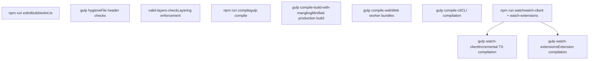
Key compilation scripts from [package.json12-72](https://github.com/microsoft/vscode/blob/1be3088d/package.json#L12-L72):

-   **`compile`**: Main TypeScript compilation via Gulp
-   **`watch`**: Parallel watch mode for client and extensions
-   **`compile-build`**: Production build with code mangling
-   **`compile-web`**: Web-specific bundles
-   **`compile-cli`**: Command-line interface compilation
-   **`eslint`**: Linting via custom ESLint configuration
-   **`valid-layers-check`**: Architectural layer validation

Sources: [package.json12-72](https://github.com/microsoft/vscode/blob/1be3088d/package.json#L12-L72)

### TypeScript Compilation Flow

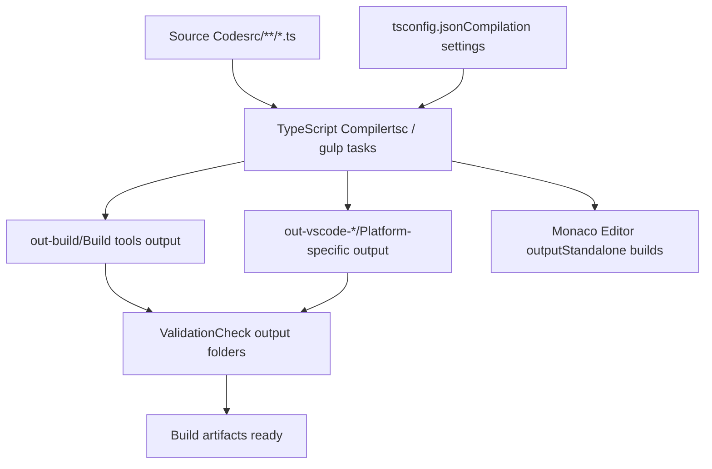
The compilation process is validated in the Azure pipeline:

```
// Verify compilation output exists
[ -d "out-build" ] || exit 1
[ -n "$(find out-build -mindepth 1)" ] || exit 1

ls -d out-vscode-* >/dev/null 2>&1 || exit 1
for folder in out-vscode-*; do
  [ -d "$folder" ] || exit 1
  [ -n "$(find "$folder" -mindepth 1)" ] || exit 1
done
```
Sources: [build/azure-pipelines/product-compile.yml103-118](https://github.com/microsoft/vscode/blob/1be3088d/build/azure-pipelines/product-compile.yml#L103-L118) [package.json47-52](https://github.com/microsoft/vscode/blob/1be3088d/package.json#L47-L52)

---

## Native Modules and Cross-Platform Builds

### Native Module Management

VS Code includes several native Node.js addons that must be compiled for each platform and architecture. The build system manages these through `.moduleignore` cleanup rules and platform-specific compilation.

**Native Modules in Use:**

| Module | Purpose | Platforms |
| --- | --- | --- |
| **@vscode/spdlog** | High-performance logging | Windows, macOS, Linux |
| **@vscode/sqlite3** | Local database | All platforms |
| **@vscode/windows-registry** | Windows registry access | Windows only |
| **native-keymap** | Keyboard layout detection | All desktop platforms |
| **node-pty** | Pseudoterminal support | All platforms |
| **@parcel/watcher** | File system watching | All platforms |
| **kerberos** | Kerberos authentication | Windows, Linux, macOS |

The `.moduleignore` file defines cleanup rules to reduce package size:

```
# Native module cleanup example
@vscode/spdlog/binding.gyp
@vscode/spdlog/build/**
@vscode/spdlog/deps/**
@vscode/spdlog/src/**
!@vscode/spdlog/build/Release/*.node
```
This pattern keeps only the compiled `.node` binaries while removing source files, build configurations, and intermediate build artifacts.

Sources: [build/.moduleignore1-191](https://github.com/microsoft/vscode/blob/1be3088d/build/.moduleignore#L1-L191) [package.json74-91](https://github.com/microsoft/vscode/blob/1be3088d/package.json#L74-L91)

### Platform-Specific Build Configuration

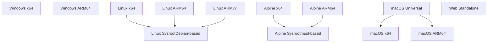
Platform builds are defined in Azure pipeline parameters:

```
parameters:
  - name: VSCODE_BUILD_WIN32
  - name: VSCODE_BUILD_WIN32_ARM64
  - name: VSCODE_BUILD_LINUX
  - name: VSCODE_BUILD_LINUX_ARM64
  - name: VSCODE_BUILD_LINUX_ARMHF
  - name: VSCODE_BUILD_ALPINE
  - name: VSCODE_BUILD_ALPINE_ARM64
  - name: VSCODE_BUILD_MACOS
  - name: VSCODE_BUILD_MACOS_ARM64
  - name: VSCODE_BUILD_MACOS_UNIVERSAL
  - name: VSCODE_BUILD_WEB
```
Sources: [build/azure-pipelines/product-build.yml37-84](https://github.com/microsoft/vscode/blob/1be3088d/build/azure-pipelines/product-build.yml#L37-L84) [build/linux/setup-env.sh1-100](https://github.com/microsoft/vscode/blob/1be3088d/build/linux/setup-env.sh#L1-L100)

### Linux Sysroot Configuration

For Linux builds, the system uses Debian-based sysroots to ensure binary compatibility:

```
#!/usr/bin/env bash
SYSROOT_ARCH=$VSCODE_ARCH
if [ "$SYSROOT_ARCH" == "x64" ]; then
  SYSROOT_ARCH="amd64"
fi

export VSCODE_SYSROOT_DIR=$AGENT_BUILDDIRECTORY/vscode-sysroot-$SYSROOT_ARCH
export VSCODE_SYSROOT_REPO="https://github.com/VSCodium/vscode-linux-build-agent"
```
This ensures native modules are compiled against the correct C library versions for maximum compatibility.

Sources: [build/linux/setup-env.sh1-100](https://github.com/microsoft/vscode/blob/1be3088d/build/linux/setup-env.sh#L1-L100) [build/linux/dependencies-generator.ts1-100](https://github.com/microsoft/vscode/blob/1be3088d/build/linux/dependencies-generator.ts#L1-L100)

---

## Azure DevOps Build Pipeline

### Pipeline Architecture

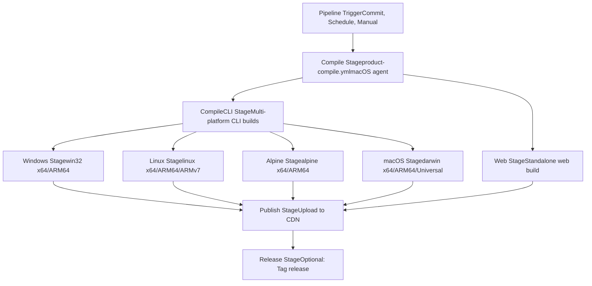
The main pipeline is defined in `build/azure-pipelines/product-build.yml` with stages:

1.  **Compile**: TypeScript compilation, hygiene checks, telemetry extraction
2.  **CompileCLI**: Platform-specific CLI compilation
3.  **Platform Stages**: Windows, Linux, Alpine, macOS, Web builds
4.  **Publish**: Artifact signing and CDN upload
5.  **Release**: Optional release tagging

Sources: [build/azure-pipelines/product-build.yml1-520](https://github.com/microsoft/vscode/blob/1be3088d/build/azure-pipelines/product-build.yml#L1-L520)

### Compile Stage Details

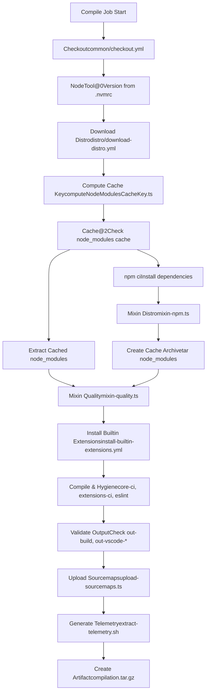
Key steps from [build/azure-pipelines/product-compile.yml12-172](https://github.com/microsoft/vscode/blob/1be3088d/build/azure-pipelines/product-compile.yml#L12-L172):

-   **Node.js Setup**: Uses version from `.nvmrc` (22.21.1)
-   **Dependency Caching**: Caches `node_modules` based on lock file hash
-   **Distro Mixin**: Merges proprietary code from `microsoft/vscode-distro`
-   **Compilation**: Runs `npm-run-all2 -lp core-ci extensions-ci hygiene eslint valid-layers-check`
-   **Artifact Creation**: Produces `compilation.tar.gz` with all compiled outputs

Sources: [build/azure-pipelines/product-compile.yml1-172](https://github.com/microsoft/vscode/blob/1be3088d/build/azure-pipelines/product-compile.yml#L1-L172) [.nvmrc1](https://github.com/microsoft/vscode/blob/1be3088d/.nvmrc#L1-L1)

### Platform Build Stages

Each platform stage downloads the compilation artifact and performs platform-specific builds:

**Windows Build (product-build-win32.yml):**

-   Compiles native modules for x64/ARM64
-   Creates system installer (EXE)
-   Creates user installer (EXE)
-   Creates portable archive (ZIP)
-   Builds server and web archives
-   Signs binaries via ESRP

**Linux Build (product-build-linux.yml):**

-   Compiles with sysroot for compatibility
-   Creates DEB package
-   Creates RPM package
-   Creates Snap package (optional)
-   Creates server and web archives

**macOS Build (product-build-darwin.yml):**

-   Compiles for x64/ARM64
-   Signs with Apple certificates
-   Notarizes application
-   Creates DMG installer
-   Creates Universal binary (combines x64 + ARM64)

Sources: [build/azure-pipelines/win32/product-build-win32.yml1-96](https://github.com/microsoft/vscode/blob/1be3088d/build/azure-pipelines/win32/product-build-win32.yml#L1-L96) [build/azure-pipelines/linux/product-build-linux.yml1-113](https://github.com/microsoft/vscode/blob/1be3088d/build/azure-pipelines/linux/product-build-linux.yml#L1-L113) [build/azure-pipelines/darwin/product-build-darwin.yml1-87](https://github.com/microsoft/vscode/blob/1be3088d/build/azure-pipelines/darwin/product-build-darwin.yml#L1-L87)

---

## Publishing and Distribution

### Artifact Publishing Flow

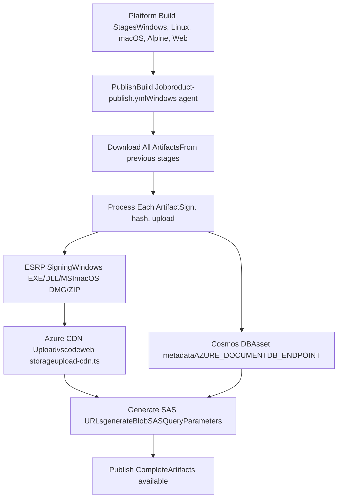
The publish stage is orchestrated by `build/azure-pipelines/product-publish.yml`:

1.  **Artifact Collection**: Downloads all artifacts from platform build stages
2.  **ESRP Signing**: Signs Windows and macOS binaries
3.  **Hash Computation**: Generates SHA256 hashes for integrity
4.  **CDN Upload**: Uploads to Azure Blob Storage (vscodeweb account)
5.  **Metadata Recording**: Records asset info in Cosmos DB
6.  **SAS Generation**: Creates time-limited download URLs

Sources: [build/azure-pipelines/product-publish.yml1-100](https://github.com/microsoft/vscode/blob/1be3088d/build/azure-pipelines/product-publish.yml#L1-L100) [build/azure-pipelines/common/publish.ts1-1000](https://github.com/microsoft/vscode/blob/1be3088d/build/azure-pipelines/common/publish.ts#L1-L1000)

### ESRP Code Signing

VS Code uses Microsoft's Enterprise Signing Release Pipeline (ESRP) for code signing:

```
interface ReleaseSubmitResponse {
  operationId: string;
  esrpCorrelationId: string;
  code?: string;
  message?: string;
}

interface ReleaseActivityInfo {
  activityId: string;
  activityType: string;
  name: string;
  status: string;
  errorCode: number;
  errorMessages: string[];
}
```
The signing process:

1.  Submit artifacts to ESRP service
2.  Poll for operation completion
3.  Download signed artifacts
4.  Verify signatures

Sources: [build/azure-pipelines/common/publish.ts44-73](https://github.com/microsoft/vscode/blob/1be3088d/build/azure-pipelines/common/publish.ts#L44-L73)

### CDN and Distribution

Distribution uses Azure Blob Storage with the `@azure/storage-blob` SDK:

```
import { BlobServiceClient, ContainerClient, generateBlobSASQueryParameters } from '@azure/storage-blob';

// Upload to CDN
const containerClient: ContainerClient;
const blobClient = containerClient.getBlockBlobClient(blobName);
await blobClient.uploadFile(filePath);

// Generate SAS URL
const sasToken = generateBlobSASQueryParameters({
  containerName,
  blobName,
  permissions: ContainerSASPermissions.parse("r"),
  expiresOn: new Date(Date.now() + 86400000)
}, credentials);
```
Assets are uploaded to:

-   **Storage Account**: `vscodeweb`
-   **Container**: Version-specific (e.g., `1.109.0`)
-   **CDN**: Cached via Azure CDN for global distribution

Sources: [build/azure-pipelines/common/publish.ts1-1000](https://github.com/microsoft/vscode/blob/1be3088d/build/azure-pipelines/common/publish.ts#L1-L1000) [build/azure-pipelines/product-build.yml145-146](https://github.com/microsoft/vscode/blob/1be3088d/build/azure-pipelines/product-build.yml#L145-L146)

---

## Code Quality and Development Tools

### ESLint Configuration

VS Code uses a comprehensive ESLint setup with custom rules defined in `.eslint-plugin-local/`:

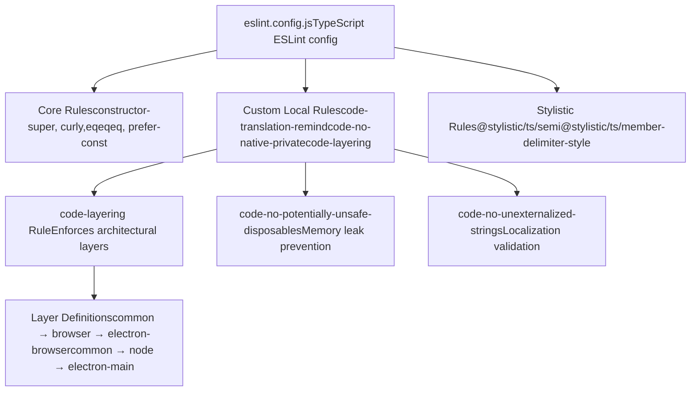
Key custom rules from [eslint.config.js79-120](https://github.com/microsoft/vscode/blob/1be3088d/eslint.config.js#L79-L120):

-   **`code-layering`**: Enforces architectural layer boundaries

    -   `common`: Core logic (no dependencies)
    -   `browser`: Browser-specific code (depends on `common`)
    -   `node`: Node.js-specific code (depends on `common`)
    -   `electron-browser`: Electron renderer (depends on `common`, `browser`)
    -   `electron-main`: Electron main process (depends on `common`, `node`)
-   **`code-no-potentially-unsafe-disposables`**: Prevents memory leaks from undisposed resources

-   **`code-must-use-super-dispose`**: Ensures proper disposal chain in subclasses

-   **`code-declare-service-brand`**: Enforces service identity pattern

-   **`code-no-unexternalized-strings`**: Validates all user-facing strings are localized


Sources: [eslint.config.js1-400](https://github.com/microsoft/vscode/blob/1be3088d/eslint.config.js#L1-L400)

### Build Validation Scripts

The `package.json` includes validation scripts:

| Script | Purpose |
| --- | --- |
| **`valid-layers-check`** | Validates architectural layering via TypeScript projects |
| **`monaco-compile-check`** | Ensures Monaco editor builds standalone |
| **`vscode-dts-compile-check`** | Validates extension API type definitions |
| **`tsec-compile-check`** | Security-focused TypeScript compilation check |
| **`define-class-fields-check`** | Validates class field initialization order |

These checks run in the compilation pipeline to catch architectural violations:

```
// Example: Layer checking via multiple tsconfig files
"valid-layers-check": "node build/checker/layersChecker.ts &&
  tsgo --project build/checker/tsconfig.browser.json &&
  tsgo --project build/checker/tsconfig.node.json &&
  tsgo --project build/checker/tsconfig.electron-main.json"
```
Sources: [package.json47-52](https://github.com/microsoft/vscode/blob/1be3088d/package.json#L47-L52) [build/azure-pipelines/product-compile.yml98](https://github.com/microsoft/vscode/blob/1be3088d/build/azure-pipelines/product-compile.yml#L98-L98)

---

## Development Workflow

### Local Development Setup

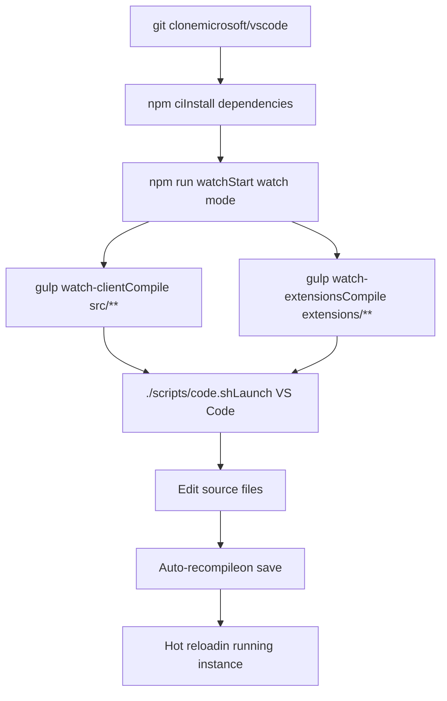
Development commands:

```
# Initial setup
npm ci

# Start watch mode (recommended)
npm run watch

# Alternative: Use deemon for auto-restart
npm run watchd

# Launch VS Code from source
./scripts/code.sh  # macOS/Linux
.\scripts\code.bat  # Windows

# Run tests
npm run test-node      # Node.js unit tests
npm run test-browser   # Browser unit tests
npm run test-extension # Extension tests
```
Sources: [package.json23-35](https://github.com/microsoft/vscode/blob/1be3088d/package.json#L23-L35)

### Smoke Testing

Integration smoke tests validate end-to-end functionality:

```
# Compile and run smoke tests
npm run smoketest

# Skip compilation (if already compiled)
npm run smoketest-no-compile
```
Smoke tests use the automation framework from `test/automation/`:

```
// test/automation/ provides UI automation
import { Application } from './application';
import { Code } from './code';
import { Workbench } from './workbench';

// Test example
const app = new Application({ /* config */ });
await app.start();
const workbench = new Workbench(app);
await workbench.editors.openFile('test.ts');
```
Sources: [package.json43-44](https://github.com/microsoft/vscode/blob/1be3088d/package.json#L43-L44) [test/smoke/package.json1-23](https://github.com/microsoft/vscode/blob/1be3088d/test/smoke/package.json#L1-L23) [test/automation/package.json1-30](https://github.com/microsoft/vscode/blob/1be3088d/test/automation/package.json#L1-L30)

### Performance Profiling

```
# Launch with performance profiling
npm run perf
# Uses scripts/code-perf.js for startup profiling
```
Performance profiling captures:

-   Startup time metrics
-   Extension activation timing
-   Memory usage patterns
-   CPU profiling data

Sources: [package.json71](https://github.com/microsoft/vscode/blob/1be3088d/package.json#L71-L71)

---

## Module Cleanup and Optimization

### Build-time Module Pruning

The build system uses `.moduleignore` to reduce package size by removing unnecessary files from dependencies:

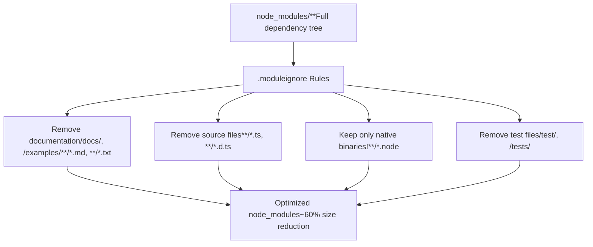
Example patterns from [build/.moduleignore1-191](https://github.com/microsoft/vscode/blob/1be3088d/build/.moduleignore#L1-L191):

```
# Remove all TypeScript source files
**/*.ts

# Keep specific native binaries
node-pty/build/**
!node-pty/build/Release/*.node
!node-pty/build/Release/spawn-helper

# Remove build dependencies
prebuild-install/**/*
@vscode/node-addon-api/**/*
```
For web builds, additional cleanup via `.webignore`:

```
# Web-specific cleanup
**/*.d.ts
**/*.js.map
**/src/**
@xterm/xterm/src/**
```
Sources: [build/.moduleignore1-191](https://github.com/microsoft/vscode/blob/1be3088d/build/.moduleignore#L1-L191) [build/.webignore1-50](https://github.com/microsoft/vscode/blob/1be3088d/build/.webignore#L1-L50)

### Tree Shaking and Bundling

Production builds use esbuild and webpack for code optimization:

```
# Minify all outputs
npm run minify-vscode      # Desktop
npm run minify-vscode-reh  # Remote server
npm run minify-vscode-reh-web  # Web server
```
Build tools from [build/package.json1-84](https://github.com/microsoft/vscode/blob/1be3088d/build/package.json#L1-L84):

-   **esbuild 0.27.2**: Fast JavaScript/TypeScript bundler
-   **webpack 5.x**: Module bundler with code splitting
-   **terser**: JavaScript minification (via webpack)

Sources: [package.json63-65](https://github.com/microsoft/vscode/blob/1be3088d/package.json#L63-L65) [build/package.json51-71](https://github.com/microsoft/vscode/blob/1be3088d/build/package.json#L51-L71)

---

## CI/CD Integration

### Continuous Integration Stages

The pipeline runs different test suites based on build type:

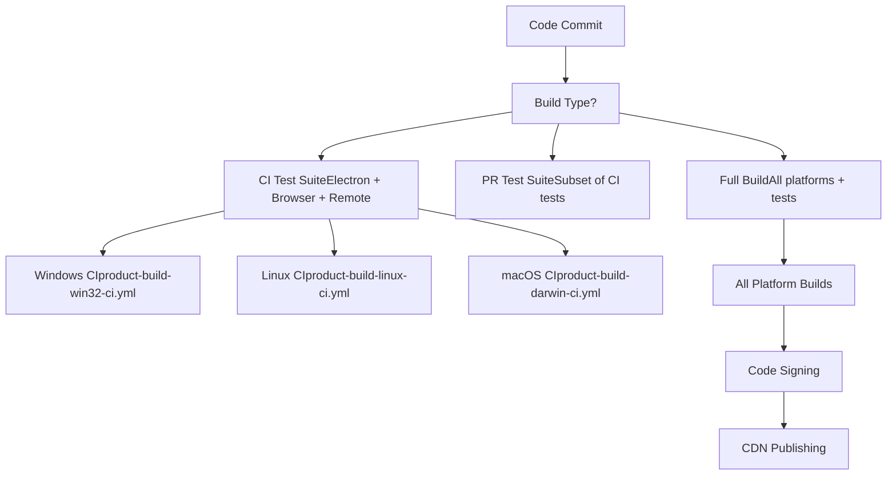
Build type determination from [build/azure-pipelines/product-build.yml121-128](https://github.com/microsoft/vscode/blob/1be3088d/build/azure-pipelines/product-build.yml#L121-L128):

```
variables:
  - name: VSCODE_CIBUILD
    value: ${{ in(variables['Build.Reason'], 'IndividualCI', 'BatchedCI') }}
  - name: VSCODE_PUBLISH
    value: ${{ and(eq(parameters.VSCODE_PUBLISH, true), eq(variables.VSCODE_CIBUILD, false)) }}
  - name: VSCODE_STEP_ON_IT
    value: ${{ eq(parameters.VSCODE_STEP_ON_IT, true) }}
```
Sources: [build/azure-pipelines/product-build.yml102-158](https://github.com/microsoft/vscode/blob/1be3088d/build/azure-pipelines/product-build.yml#L102-L158)

### Scheduled Builds

The pipeline includes scheduled triggers for regular builds:

```
schedules:
  - cron: "0 5 * * Mon-Fri"
    displayName: Mon-Fri at 7:00
    branches:
      include:
        - main
  - cron: "0 17 * * Mon-Fri"
    displayName: Mon-Fri at 19:00
    branches:
      include:
        - main
```
These scheduled builds ensure regular validation even without commits and support continuous integration workflows.

Sources: [build/azure-pipelines/product-build.yml3-13](https://github.com/microsoft/vscode/blob/1be3088d/build/azure-pipelines/product-build.yml#L3-L13)

---

## Summary

The VS Code build system is a sophisticated multi-stage pipeline that:

1.  **Manages Dependencies**: Uses npm workspaces with separate package configurations for desktop, remote server, web, and extensions
2.  **Compiles TypeScript**: Transforms source code into optimized JavaScript with sourcemaps
3.  **Handles Native Modules**: Compiles platform-specific native addons against Electron headers
4.  **Produces Platform Builds**: Creates installers and archives for 11 different platform/architecture combinations
5.  **Enforces Quality**: Runs ESLint with custom rules, layer validation, and comprehensive test suites
6.  **Distributes Artifacts**: Signs binaries, uploads to CDN, and manages release metadata

Key build files and their roles:

-   **package.json**: Root workspace with build scripts and dependencies
-   **build/azure-pipelines/product-build.yml**: Main CI/CD pipeline definition
-   **build/azure-pipelines/product-compile.yml**: Compilation stage with caching
-   **build/azure-pipelines/common/publish.ts**: Publishing logic with ESRP signing
-   **eslint.config.js**: Code quality rules and layer enforcement
-   **build/.moduleignore**: Dependency cleanup for size optimization

Sources: [package.json1-242](https://github.com/microsoft/vscode/blob/1be3088d/package.json#L1-L242) [build/azure-pipelines/product-build.yml1-520](https://github.com/microsoft/vscode/blob/1be3088d/build/azure-pipelines/product-build.yml#L1-L520) [build/azure-pipelines/product-compile.yml1-172](https://github.com/microsoft/vscode/blob/1be3088d/build/azure-pipelines/product-compile.yml#L1-L172) [build/azure-pipelines/common/publish.ts1-1000](https://github.com/microsoft/vscode/blob/1be3088d/build/azure-pipelines/common/publish.ts#L1-L1000) [eslint.config.js1-400](https://github.com/microsoft/vscode/blob/1be3088d/eslint.config.js#L1-L400) [build/.moduleignore1-191](https://github.com/microsoft/vscode/blob/1be3088d/build/.moduleignore#L1-L191)
