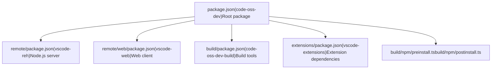
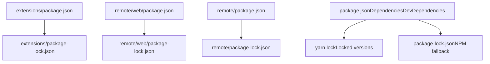
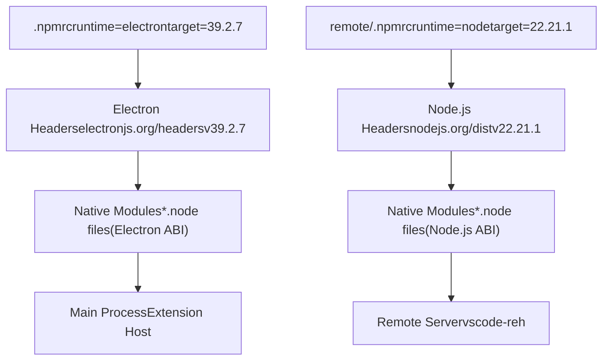
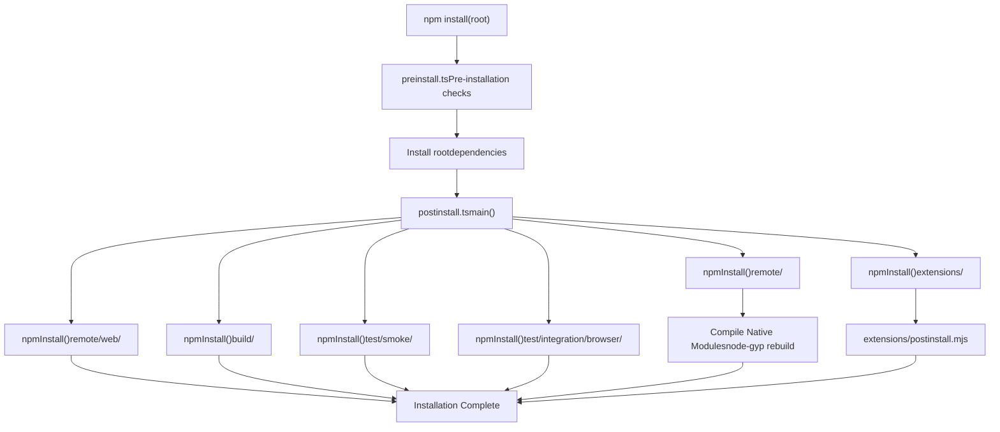
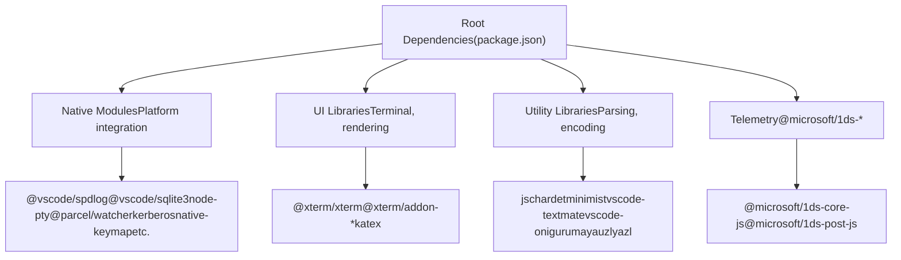

# Package Structure and Dependencies

Relevant source files

-   [.npmrc](https://github.com/microsoft/vscode/blob/1be3088d/.npmrc)
-   [.nvmrc](https://github.com/microsoft/vscode/blob/1be3088d/.nvmrc)
-   [build/.moduleignore](https://github.com/microsoft/vscode/blob/1be3088d/build/.moduleignore)
-   [build/.webignore](https://github.com/microsoft/vscode/blob/1be3088d/build/.webignore)
-   [build/azure-pipelines/linux/setup-env.sh](https://github.com/microsoft/vscode/blob/1be3088d/build/azure-pipelines/linux/setup-env.sh)
-   [build/checksums/electron.txt](https://github.com/microsoft/vscode/blob/1be3088d/build/checksums/electron.txt)
-   [build/checksums/nodejs.txt](https://github.com/microsoft/vscode/blob/1be3088d/build/checksums/nodejs.txt)
-   [build/linux/dependencies-generator.ts](https://github.com/microsoft/vscode/blob/1be3088d/build/linux/dependencies-generator.ts)
-   [build/npm/gyp/package-lock.json](https://github.com/microsoft/vscode/blob/1be3088d/build/npm/gyp/package-lock.json)
-   [build/package-lock.json](https://github.com/microsoft/vscode/blob/1be3088d/build/package-lock.json)
-   [build/package.json](https://github.com/microsoft/vscode/blob/1be3088d/build/package.json)
-   [cgmanifest.json](https://github.com/microsoft/vscode/blob/1be3088d/cgmanifest.json)
-   [eslint.config.js](https://github.com/microsoft/vscode/blob/1be3088d/eslint.config.js)
-   [extensions/git/package-lock.json](https://github.com/microsoft/vscode/blob/1be3088d/extensions/git/package-lock.json)
-   [extensions/github-authentication/package-lock.json](https://github.com/microsoft/vscode/blob/1be3088d/extensions/github-authentication/package-lock.json)
-   [extensions/notebook-renderers/package-lock.json](https://github.com/microsoft/vscode/blob/1be3088d/extensions/notebook-renderers/package-lock.json)
-   [extensions/package-lock.json](https://github.com/microsoft/vscode/blob/1be3088d/extensions/package-lock.json)
-   [extensions/package.json](https://github.com/microsoft/vscode/blob/1be3088d/extensions/package.json)
-   [package-lock.json](https://github.com/microsoft/vscode/blob/1be3088d/package-lock.json)
-   [package.json](https://github.com/microsoft/vscode/blob/1be3088d/package.json)
-   [remote/.npmrc](https://github.com/microsoft/vscode/blob/1be3088d/remote/.npmrc)
-   [remote/package-lock.json](https://github.com/microsoft/vscode/blob/1be3088d/remote/package-lock.json)
-   [remote/package.json](https://github.com/microsoft/vscode/blob/1be3088d/remote/package.json)
-   [remote/web/package-lock.json](https://github.com/microsoft/vscode/blob/1be3088d/remote/web/package-lock.json)
-   [remote/web/package.json](https://github.com/microsoft/vscode/blob/1be3088d/remote/web/package.json)
-   [src/vs/base/parts/contextmenu/electron-main/contextmenu.ts](https://github.com/microsoft/vscode/blob/1be3088d/src/vs/base/parts/contextmenu/electron-main/contextmenu.ts)
-   [src/vs/platform/environment/test/node/nativeModules.integrationTest.ts](https://github.com/microsoft/vscode/blob/1be3088d/src/vs/platform/environment/test/node/nativeModules.integrationTest.ts)
-   [src/vs/workbench/contrib/chat/browser/widget/media/chatViewWelcome.css](https://github.com/microsoft/vscode/blob/1be3088d/src/vs/workbench/contrib/chat/browser/widget/media/chatViewWelcome.css)
-   [test/automation/package-lock.json](https://github.com/microsoft/vscode/blob/1be3088d/test/automation/package-lock.json)
-   [test/automation/package.json](https://github.com/microsoft/vscode/blob/1be3088d/test/automation/package.json)
-   [test/integration/browser/package-lock.json](https://github.com/microsoft/vscode/blob/1be3088d/test/integration/browser/package-lock.json)
-   [test/integration/browser/package.json](https://github.com/microsoft/vscode/blob/1be3088d/test/integration/browser/package.json)
-   [test/smoke/package-lock.json](https://github.com/microsoft/vscode/blob/1be3088d/test/smoke/package-lock.json)
-   [test/smoke/package.json](https://github.com/microsoft/vscode/blob/1be3088d/test/smoke/package.json)
-   [test/smoke/src/areas/accessibility/accessibility.test.ts](https://github.com/microsoft/vscode/blob/1be3088d/test/smoke/src/areas/accessibility/accessibility.test.ts)

This document describes the package structure and dependency management system in VS Code, including the multiple `package.json` files, Yarn-based dependency resolution, and the postinstall script workflow that compiles native modules.

For information about native module compilation and cross-platform builds, see [Native Modules and Cross-Platform Builds](/microsoft/vscode/2.2-native-modules-and-cross-platform-builds). For information about build tasks, see [Build Tasks and Scripts](/microsoft/vscode/2.3-build-pipeline-and-automation).

## Package Hierarchy Overview

VS Code uses a multi-package structure with separate `package.json` files for different contexts. Each package has its own dependency tree and runtime requirements.

### Package.json Files


**Sources:** [package.json1-243](https://github.com/microsoft/vscode/blob/1be3088d/package.json#L1-L243) [remote/package.json1-50](https://github.com/microsoft/vscode/blob/1be3088d/remote/package.json#L1-L50) [remote/web/package.json1-27](https://github.com/microsoft/vscode/blob/1be3088d/remote/web/package.json#L1-L27) [build/package.json1-82](https://github.com/microsoft/vscode/blob/1be3088d/build/package.json#L1-L82) [extensions/package.json1-20](https://github.com/microsoft/vscode/blob/1be3088d/extensions/package.json#L1-L20)

| Package | Name | Purpose | Runtime |
| --- | --- | --- | --- |
| Root | `code-oss-dev` | Main Electron application | Electron 39.2.7 |
| Remote | `vscode-reh` | Remote extension host server | Node.js 22.21.1 |
| Remote Web | `vscode-web` | Web workbench client | Browser |
| Build | `code-oss-dev-build` | Build and packaging tools | Node.js |
| Extensions | `vscode-extensions` | Shared extension dependencies | N/A |

**Sources:** [package.json2-164](https://github.com/microsoft/vscode/blob/1be3088d/package.json#L2-L164) [remote/package.json2-3](https://github.com/microsoft/vscode/blob/1be3088d/remote/package.json#L2-L3) [remote/web/package.json2-3](https://github.com/microsoft/vscode/blob/1be3088d/remote/web/package.json#L2-L3) [build/package.json2-3](https://github.com/microsoft/vscode/blob/1be3088d/build/package.json#L2-L3) [extensions/package.json2-3](https://github.com/microsoft/vscode/blob/1be3088d/extensions/package.json#L2-L3)

## Dependency Management with Yarn

VS Code uses Yarn for dependency management with lock files ensuring deterministic installs across different environments.

### Lock Files and Resolution


**Sources:** [package.json1](https://github.com/microsoft/vscode/blob/1be3088d/package.json#L1-L1) [package-lock.json1-4](https://github.com/microsoft/vscode/blob/1be3088d/package-lock.json#L1-L4) [remote/package-lock.json1-4](https://github.com/microsoft/vscode/blob/1be3088d/remote/package-lock.json#L1-L4) [remote/web/package-lock.json1-4](https://github.com/microsoft/vscode/blob/1be3088d/remote/web/package-lock.json#L1-L4) [extensions/package-lock.json1-4](https://github.com/microsoft/vscode/blob/1be3088d/extensions/package-lock.json#L1-L4)

### Dependency Overrides

The root `package.json` uses overrides to enforce specific versions of transitive dependencies:

```
"overrides": {
  "node-gyp-build": "4.8.1",
  "kerberos@2.1.1": {
    "node-addon-api": "7.1.0"
  }
}
```
**Sources:** [package.json227-232](https://github.com/microsoft/vscode/blob/1be3088d/package.json#L227-L232) [remote/package.json44-49](https://github.com/microsoft/vscode/blob/1be3088d/remote/package.json#L44-L49)

These overrides ensure:

-   Consistent `node-gyp-build` version across all native modules
-   Compatible `node-addon-api` version for the `kerberos` native module

## NPM Configuration for Different Runtimes

Different `.npmrc` files configure npm for compiling native modules against different runtimes.

### Root .npmrc (Electron)

```
disturl="https://electronjs.org/headers"
target="39.2.7"
ms_build_id="13098910"
runtime="electron"
build_from_source="true"
legacy-peer-deps="true"
timeout=180000
```
This configuration tells `node-gyp` to compile native modules against Electron 39.2.7 headers.

**Sources:** [.npmrc1-7](https://github.com/microsoft/vscode/blob/1be3088d/.npmrc#L1-L7)

### Remote .npmrc (Node.js)

```
disturl="https://nodejs.org/dist"
target="22.21.1"
ms_build_id="374314"
runtime="node"
build_from_source="true"
legacy-peer-deps="true"
timeout=180000
```
This configuration tells `node-gyp` to compile native modules against Node.js 22.21.1 headers.

**Sources:** [remote/.npmrc1-7](https://github.com/microsoft/vscode/blob/1be3088d/remote/.npmrc#L1-L7)

### Runtime Configuration Diagram


**Sources:** [.npmrc1-7](https://github.com/microsoft/vscode/blob/1be3088d/.npmrc#L1-L7) [remote/.npmrc1-7](https://github.com/microsoft/vscode/blob/1be3088d/remote/.npmrc#L1-L7)

## Core Dependencies

### Production Dependencies

The root `package.json` contains production dependencies that ship with the application:

**Key Native Modules:**

-   `@vscode/spdlog` (0.15.2) - Logging
-   `@vscode/sqlite3` (5.1.11-vscode) - Database
-   `@vscode/windows-registry` (1.1.0) - Windows registry access
-   `@vscode/windows-process-tree` (0.6.0) - Process management
-   `@parcel/watcher` (2.5.4) - File system watching
-   `node-pty` (1.2.0-beta.6) - Terminal PTY
-   `kerberos` (2.1.1) - Authentication
-   `native-keymap` (3.3.5) - Keyboard layout detection
-   `native-is-elevated` (0.8.0) - Privilege detection

**Key JavaScript Libraries:**

-   `@xterm/xterm` (6.1.0-beta.102) - Terminal emulator
-   `katex` (0.16.22) - Math rendering
-   `vscode-textmate` (9.3.1) - TextMate grammar support
-   `vscode-oniguruma` (1.7.0) - Regular expression engine

**Sources:** [package.json75-122](https://github.com/microsoft/vscode/blob/1be3088d/package.json#L75-L122)

### Development Dependencies

Development dependencies include build tools and testing frameworks:

-   `electron` (39.2.7) - Electron runtime for development
-   `typescript` (6.0.0-dev.20251110) - TypeScript compiler
-   `eslint` (9.36.0) - Linting
-   `webpack` (5.94.0) - Bundling
-   `gulp` (4.0.0) - Task runner
-   `mocha` (10.8.2) - Testing framework

**Sources:** [package.json123-226](https://github.com/microsoft/vscode/blob/1be3088d/package.json#L123-L226)

### Optional Dependencies

```
"optionalDependencies": {
  "windows-foreground-love": "0.5.0"
}
```
The `windows-foreground-love` module is Windows-specific and won't fail installation on other platforms.

**Sources:** [package.json240-242](https://github.com/microsoft/vscode/blob/1be3088d/package.json#L240-L242)

## Postinstall Script Workflow

The postinstall script orchestrates dependency installation across multiple directories and compiles native modules.

### Postinstall Execution Flow


**Sources:** [package.json19-20](https://github.com/microsoft/vscode/blob/1be3088d/package.json#L19-L20) [build/npm/postinstall.ts1-139](https://github.com/microsoft/vscode/blob/1be3088d/build/npm/postinstall.ts#L1-L139)

### Key Functions in postinstall.ts

**`npmInstall(dir, opts)`** - Runs npm install in a specific directory:

```
function npmInstall(dir: string, opts?: child_process.SpawnSyncOptions) {
    opts = {
        env: { ...process.env },
        ...(opts ?? {}),
        cwd: dir,
        stdio: 'inherit',
        shell: true
    };

    const command = process.env['npm_command'] || 'install';
    // ...runs npm command
}
```
**Sources:** [build/npm/postinstall.ts37-60](https://github.com/microsoft/vscode/blob/1be3088d/build/npm/postinstall.ts#L37-L60)

**Installation Order:**

1.  Root dependencies (automatic via npm)
2.  `remote/` - Server dependencies
3.  `remote/web/` - Web client dependencies
4.  `build/` - Build tool dependencies
5.  `extensions/` - Extension dependencies
6.  Test directories - Test runner dependencies

**Sources:** [build/npm/postinstall.ts123-139](https://github.com/microsoft/vscode/blob/1be3088d/build/npm/postinstall.ts#L123-L139)

### Conditional Installation

The postinstall script includes logic for container-based builds:

```
if (process.env['VSCODE_REMOTE_DEPENDENCIES_CONTAINER_NAME'] &&
    /^(.build\/distro\/npm\/)?remote$/.test(dir)) {
    // Install inside Docker container
    run('docker', [
        'exec', '-i', '-w', '/root/vscode',
        process.env['VSCODE_REMOTE_DEPENDENCIES_CONTAINER_NAME'],
        'sh', '-c', `\"npm ci\"`
    ], opts);
}
```
**Sources:** [build/npm/postinstall.ts48-66](https://github.com/microsoft/vscode/blob/1be3088d/build/npm/postinstall.ts#L48-L66)

## Native Module Compilation

Native modules are compiled during postinstall using `node-gyp`. The compilation process varies by platform and target runtime.

### Native Module List

The following native modules are compiled from source:

```mermaid
flowchart TD
    Keymap["native-keymapKeyboard layouts"]
    Elevated["native-is-elevatedPrivilege detection"]
    DeviceId["@vscode/deviceidDevice identification"]
    Watchdog["@vscode/native-watchdogProcess monitoring"]
    Kerberos["kerberosAuthentication"]
    WinReg["@vscode/windows-registryWindows only"]
    WinProc["@vscode/windows-process-treeWindows only"]
    WinMutex["@vscode/windows-mutexWindows only"]
    WinCA["@vscode/windows-ca-certsWindows only"]
    WinFG["windows-foreground-loveWindows only (optional)"]
    Spdlog["@vscode/spdlogLogging (C++)"]
    Sqlite["@vscode/sqlite3Database (C++)"]
    Pty["node-ptyTerminal PTY (C++)"]
    Watcher["@parcel/watcherFile watching (C++)"]
```


**Sources:** [package.json75-93](https://github.com/microsoft/vscode/blob/1be3088d/package.json#L75-L93) [package.json240-241](https://github.com/microsoft/vscode/blob/1be3088d/package.json#L240-L241)

### Module Ignore Patterns

The build process uses `.moduleignore` to exclude unnecessary files from native modules:

```
# Native module cleanup patterns
@vscode/spdlog/binding.gyp
@vscode/spdlog/build/**
@vscode/spdlog/deps/**
@vscode/spdlog/src/**
!@vscode/spdlog/build/Release/*.node

node-pty/binding.gyp
node-pty/build/**
node-pty/src/**
!node-pty/build/Release/*.node
!node-pty/build/Release/spawn-helper
```
This ensures only compiled `.node` files and necessary executables are included in the final package.

**Sources:** [build/.moduleignore1-191](https://github.com/microsoft/vscode/blob/1be3088d/build/.moduleignore#L1-L191)

### Verification of Native Modules

The codebase includes integration tests to verify native modules load correctly:

```
test('native-keymap', async () => {
    const keyMap = await import('native-keymap');
    assert.ok(typeof keyMap.getCurrentKeyboardLayout === 'function',
              testErrorMessage('native-keymap'));
});

test('node-pty', async () => {
    const nodePty = await import('node-pty');
    assert.ok(typeof nodePty.spawn === 'function',
              testErrorMessage('node-pty'));
});
```
**Sources:** [src/vs/platform/environment/test/node/nativeModules.integrationTest.ts43-71](https://github.com/microsoft/vscode/blob/1be3088d/src/vs/platform/environment/test/node/nativeModules.integrationTest.ts#L43-L71)

## Dependency Categories by Package

### Root Package Categories

The root package dependencies are organized by purpose:


**Sources:** [package.json75-122](https://github.com/microsoft/vscode/blob/1be3088d/package.json#L75-L122)

### Remote Package Dependencies

The remote package (`vscode-reh`) includes a subset of dependencies needed for the server:

**Shared with Root:**

-   `@microsoft/1ds-core-js`, `@microsoft/1ds-post-js` (telemetry)
-   `@parcel/watcher` (file watching)
-   `@xterm/xterm`, `@xterm/addon-*` (terminal support)
-   `jschardet`, `katex`, `vscode-textmate`, `vscode-oniguruma`
-   `yauzl`, `yazl` (archive handling)
-   `node-pty` (terminal PTY)
-   `kerberos` (authentication)

**Not Included:**

-   Desktop-specific modules (`@vscode/windows-*`, `native-keymap`, etc.)
-   Electron-specific dependencies

**Sources:** [remote/package.json5-48](https://github.com/microsoft/vscode/blob/1be3088d/remote/package.json#L5-L48)

### Web Package Dependencies

The web package (`vscode-web`) has minimal dependencies for browser environments:

-   `@microsoft/1ds-core-js`, `@microsoft/1ds-post-js` (telemetry)
-   `@xterm/xterm`, `@xterm/addon-*` (terminal emulator)
-   `jschardet` (encoding detection)
-   `katex` (math rendering)
-   `vscode-textmate`, `vscode-oniguruma` (syntax highlighting)
-   `@vscode/tree-sitter-wasm`, `@vscode/vscode-languagedetection` (language features)

**No native modules** - all dependencies are pure JavaScript.

**Sources:** [remote/web/package.json5-25](https://github.com/microsoft/vscode/blob/1be3088d/remote/web/package.json#L5-L25)

### Build Package Dependencies

The build package contains tools for packaging and building:

-   `@vscode/vsce` (extension packaging)
-   `esbuild` (bundling)
-   `@electron/get`, `@electron/osx-sign` (Electron tooling)
-   `@azure/storage-blob`, `@azure/cosmos` (publishing to CDN)
-   `workerpool` (parallel processing)
-   Various `@types/*` packages

**Sources:** [build/package.json5-63](https://github.com/microsoft/vscode/blob/1be3088d/build/package.json#L5-L63)

## Web-Specific Ignore Patterns

The `.webignore` file specifies files to exclude from the web bundle:

```
# Source files not needed in production
**/*.ts
**/*.d.ts
**/*.js.map

# Documentation
**/*.md
**/*.txt

# XTerm source files (only dist needed)
@xterm/xterm/src/**
@xterm/addon-*/src/**

# Telemetry - only minified versions
@microsoft/1ds-core-js/**
!@microsoft/1ds-core-js/dist/ms.core.min.js
```
This reduces bundle size by excluding source files, build artifacts, and documentation.

**Sources:** [build/.webignore1-65](https://github.com/microsoft/vscode/blob/1be3088d/build/.webignore#L1-L65)

## Dependency Installation in Different Contexts

### Local Development

```
npm install              # Installs root deps, runs postinstall
npm run watch            # Development mode
```
### CI/CD Pipeline

```
npm ci                   # Clean install from lock file
npm run compile          # Production compilation
npm run gulp <task>      # Specific build tasks
```
**Sources:** [package.json21-73](https://github.com/microsoft/vscode/blob/1be3088d/package.json#L21-L73)

### Container-Based Remote Build

When building remote dependencies in a container (for Linux builds):

```
if (process.env['VSCODE_REMOTE_DEPENDENCIES_CONTAINER_NAME']) {
    run('docker', ['exec', '-i', '-w', '/root/vscode',
        process.env['VSCODE_REMOTE_DEPENDENCIES_CONTAINER_NAME'],
        'sh', '-c', '"npm ci"'
    ], opts);
}
```
**Sources:** [build/npm/postinstall.ts48-66](https://github.com/microsoft/vscode/blob/1be3088d/build/npm/postinstall.ts#L48-L66)

## Summary

VS Code's package structure uses:

1.  **Multiple package.json files** for different contexts (desktop, remote server, web, build tools, extensions)
2.  **Yarn** for deterministic dependency resolution with lock files
3.  **Separate .npmrc configurations** to compile native modules against Electron or Node.js headers
4.  **Postinstall scripts** that orchestrate installation across multiple directories
5.  **Dependency overrides** to ensure compatible versions of transitive dependencies
6.  **Module ignore patterns** to exclude unnecessary files from production builds
7.  **Integration tests** to verify native modules load correctly

This structure allows VS Code to maintain separate dependency trees for different runtime contexts while sharing common dependencies where appropriate.

**Sources:** [package.json1-243](https://github.com/microsoft/vscode/blob/1be3088d/package.json#L1-L243) [build/npm/postinstall.ts1-139](https://github.com/microsoft/vscode/blob/1be3088d/build/npm/postinstall.ts#L1-L139) [.npmrc1-7](https://github.com/microsoft/vscode/blob/1be3088d/.npmrc#L1-L7) [remote/.npmrc1-7](https://github.com/microsoft/vscode/blob/1be3088d/remote/.npmrc#L1-L7) [build/.moduleignore1-191](https://github.com/microsoft/vscode/blob/1be3088d/build/.moduleignore#L1-L191) [build/.webignore1-65](https://github.com/microsoft/vscode/blob/1be3088d/build/.webignore#L1-L65)
