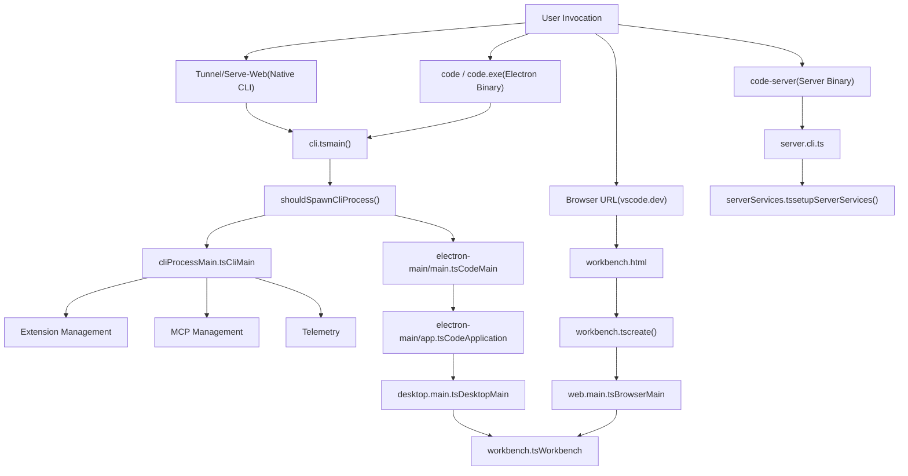
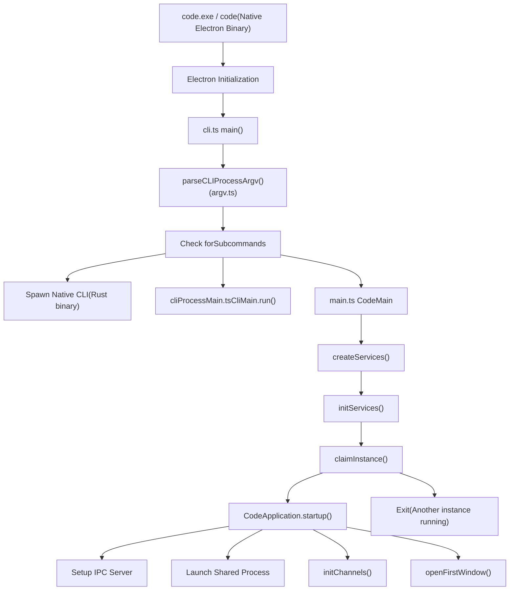
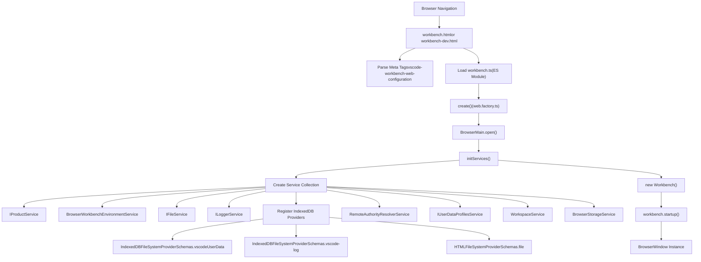
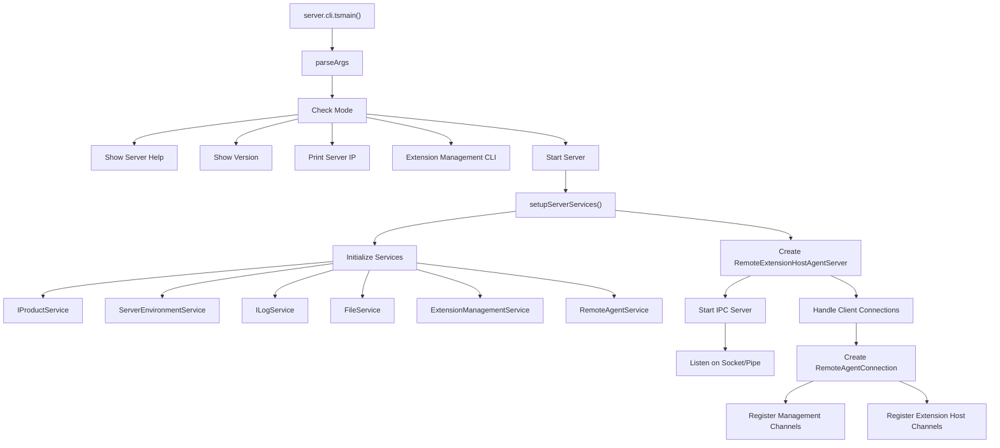
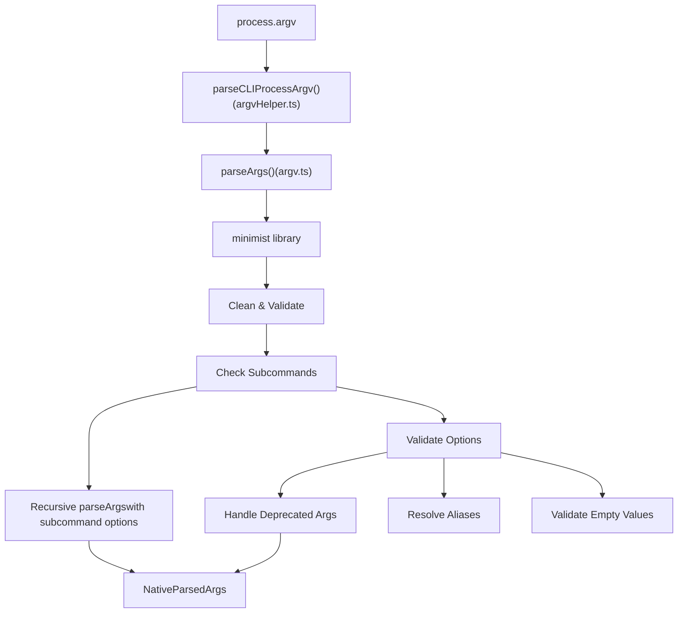
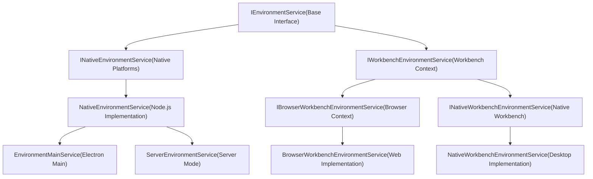

# Entry Points and Execution Modes

Relevant source files

-   [build/lib/i18n.resources.json](https://github.com/microsoft/vscode/blob/1be3088d/build/lib/i18n.resources.json)
-   [cli/src/bin/code/legacy\_args.rs](https://github.com/microsoft/vscode/blob/1be3088d/cli/src/bin/code/legacy_args.rs)
-   [resources/completions/bash/code](https://github.com/microsoft/vscode/blob/1be3088d/resources/completions/bash/code)
-   [resources/completions/zsh/\_code](https://github.com/microsoft/vscode/blob/1be3088d/resources/completions/zsh/_code)
-   [src/vs/base/node/terminalEncoding.ts](https://github.com/microsoft/vscode/blob/1be3088d/src/vs/base/node/terminalEncoding.ts)
-   [src/vs/code/browser/workbench/workbench-dev.html](https://github.com/microsoft/vscode/blob/1be3088d/src/vs/code/browser/workbench/workbench-dev.html)
-   [src/vs/code/browser/workbench/workbench.html](https://github.com/microsoft/vscode/blob/1be3088d/src/vs/code/browser/workbench/workbench.html)
-   [src/vs/code/browser/workbench/workbench.ts](https://github.com/microsoft/vscode/blob/1be3088d/src/vs/code/browser/workbench/workbench.ts)
-   [src/vs/code/electron-main/app.ts](https://github.com/microsoft/vscode/blob/1be3088d/src/vs/code/electron-main/app.ts)
-   [src/vs/code/electron-main/main.ts](https://github.com/microsoft/vscode/blob/1be3088d/src/vs/code/electron-main/main.ts)
-   [src/vs/code/node/cli.ts](https://github.com/microsoft/vscode/blob/1be3088d/src/vs/code/node/cli.ts)
-   [src/vs/code/node/cliProcessMain.ts](https://github.com/microsoft/vscode/blob/1be3088d/src/vs/code/node/cliProcessMain.ts)
-   [src/vs/platform/environment/common/argv.ts](https://github.com/microsoft/vscode/blob/1be3088d/src/vs/platform/environment/common/argv.ts)
-   [src/vs/platform/environment/common/environment.ts](https://github.com/microsoft/vscode/blob/1be3088d/src/vs/platform/environment/common/environment.ts)
-   [src/vs/platform/environment/common/environmentService.ts](https://github.com/microsoft/vscode/blob/1be3088d/src/vs/platform/environment/common/environmentService.ts)
-   [src/vs/platform/environment/electron-main/environmentMainService.ts](https://github.com/microsoft/vscode/blob/1be3088d/src/vs/platform/environment/electron-main/environmentMainService.ts)
-   [src/vs/platform/environment/node/argv.ts](https://github.com/microsoft/vscode/blob/1be3088d/src/vs/platform/environment/node/argv.ts)
-   [src/vs/platform/environment/node/argvHelper.ts](https://github.com/microsoft/vscode/blob/1be3088d/src/vs/platform/environment/node/argvHelper.ts)
-   [src/vs/platform/environment/node/environmentService.ts](https://github.com/microsoft/vscode/blob/1be3088d/src/vs/platform/environment/node/environmentService.ts)
-   [src/vs/platform/environment/node/stdin.ts](https://github.com/microsoft/vscode/blob/1be3088d/src/vs/platform/environment/node/stdin.ts)
-   [src/vs/platform/extensionManagement/common/extensionManagementCLI.ts](https://github.com/microsoft/vscode/blob/1be3088d/src/vs/platform/extensionManagement/common/extensionManagementCLI.ts)
-   [src/vs/server/node/remoteExtensionHostAgentCli.ts](https://github.com/microsoft/vscode/blob/1be3088d/src/vs/server/node/remoteExtensionHostAgentCli.ts)
-   [src/vs/server/node/server.cli.ts](https://github.com/microsoft/vscode/blob/1be3088d/src/vs/server/node/server.cli.ts)
-   [src/vs/server/node/serverEnvironmentService.ts](https://github.com/microsoft/vscode/blob/1be3088d/src/vs/server/node/serverEnvironmentService.ts)
-   [src/vs/server/node/serverServices.ts](https://github.com/microsoft/vscode/blob/1be3088d/src/vs/server/node/serverServices.ts)
-   [src/vs/workbench/browser/web.api.ts](https://github.com/microsoft/vscode/blob/1be3088d/src/vs/workbench/browser/web.api.ts)
-   [src/vs/workbench/browser/web.factory.ts](https://github.com/microsoft/vscode/blob/1be3088d/src/vs/workbench/browser/web.factory.ts)
-   [src/vs/workbench/browser/web.main.ts](https://github.com/microsoft/vscode/blob/1be3088d/src/vs/workbench/browser/web.main.ts)
-   [src/vs/workbench/electron-browser/desktop.main.ts](https://github.com/microsoft/vscode/blob/1be3088d/src/vs/workbench/electron-browser/desktop.main.ts)
-   [src/vs/workbench/services/environment/browser/environmentService.ts](https://github.com/microsoft/vscode/blob/1be3088d/src/vs/workbench/services/environment/browser/environmentService.ts)
-   [src/vs/workbench/services/environment/common/environmentService.ts](https://github.com/microsoft/vscode/blob/1be3088d/src/vs/workbench/services/environment/common/environmentService.ts)
-   [src/vs/workbench/services/environment/electron-browser/environmentService.ts](https://github.com/microsoft/vscode/blob/1be3088d/src/vs/workbench/services/environment/electron-browser/environmentService.ts)
-   [src/vs/workbench/services/extensions/electron-browser/nativeExtensionService.ts](https://github.com/microsoft/vscode/blob/1be3088d/src/vs/workbench/services/extensions/electron-browser/nativeExtensionService.ts)
-   [src/vs/workbench/workbench.common.main.ts](https://github.com/microsoft/vscode/blob/1be3088d/src/vs/workbench/workbench.common.main.ts)
-   [src/vs/workbench/workbench.desktop.main.ts](https://github.com/microsoft/vscode/blob/1be3088d/src/vs/workbench/workbench.desktop.main.ts)
-   [src/vs/workbench/workbench.web.main.ts](https://github.com/microsoft/vscode/blob/1be3088d/src/vs/workbench/workbench.web.main.ts)

This page documents the different entry points through which VS Code starts execution and the various modes in which it can run. VS Code supports multiple execution environments (Electron desktop, web browser, remote server, CLI) and operational modes (GUI, extension development, file operations, etc.).

For information about the subsequent application lifecycle after startup, see [Application Lifecycle and Bootstrap](/microsoft/vscode/3-application-lifecycle-and-bootstrap). For workbench initialization specifically, see [Electron Main Process Startup](/microsoft/vscode/3.2-electron-main-process-startup) and [Web Workbench Bootstrap](/microsoft/vscode/3.4-web-workbench-bootstrap).

---

## Entry Points Overview

VS Code has four primary entry points, each serving different use cases and platforms:


**Sources:** [src/vs/code/node/cli.ts32-144](https://github.com/microsoft/vscode/blob/1be3088d/src/vs/code/node/cli.ts#L32-L144) [src/vs/code/electron-main/main.ts78-160](https://github.com/microsoft/vscode/blob/1be3088d/src/vs/code/electron-main/main.ts#L78-L160) [src/vs/workbench/browser/web.main.ts102-248](https://github.com/microsoft/vscode/blob/1be3088d/src/vs/workbench/browser/web.main.ts#L102-L248) [src/vs/server/node/server.cli.ts1-500](https://github.com/microsoft/vscode/blob/1be3088d/src/vs/server/node/server.cli.ts#L1-L500)

---

## Electron Desktop Entry Point

The Electron desktop application is the primary distribution of VS Code. It starts through a native executable that loads Electron.

### Bootstrap Sequence


### CodeMain Class

The `CodeMain` class in [src/vs/code/electron-main/main.ts86-160](https://github.com/microsoft/vscode/blob/1be3088d/src/vs/code/electron-main/main.ts#L86-L160) orchestrates the main process startup:

1.  **Service Creation** ([main.ts162-227](https://github.com/microsoft/vscode/blob/1be3088d/main.ts#L162-L227)): Instantiates core services like `IFileService`, `IStateService`, `IConfigurationService`, `IUserDataProfilesMainService`
2.  **Service Initialization** ([main.ts335-406](https://github.com/microsoft/vscode/blob/1be3088d/main.ts#L335-L406)): Initializes state service, configuration service, and user data profiles
3.  **Instance Claiming** ([main.ts408-544](https://github.com/microsoft/vscode/blob/1be3088d/main.ts#L408-L544)): Attempts to become the primary instance via IPC lock file
4.  **Application Launch** ([main.ts155](https://github.com/microsoft/vscode/blob/1be3088d/main.ts#L155-L155)): Creates `CodeApplication` and calls `startup()`

**Sources:** [src/vs/code/electron-main/main.ts86-544](https://github.com/microsoft/vscode/blob/1be3088d/src/vs/code/electron-main/main.ts#L86-L544)

### CodeApplication Class

The `CodeApplication` class in [src/vs/code/electron-main/app.ts132-1361](https://github.com/microsoft/vscode/blob/1be3088d/src/vs/code/electron-main/app.ts#L132-L1361) handles the main application lifecycle:

| Lifecycle Phase | Method | Description |
| --- | --- | --- |
| Initialization | `constructor()` | Configures Electron session security, registers listeners |
| Service Setup | `initServices()` | Creates instantiation service with all required services |
| Channel Setup | `initChannels()` | Registers IPC channels for cross-process communication |
| Protocol Setup | `setupProtocolUrlHandlers()` | Handles `vscode://` URL protocol |
| Window Opening | `openFirstWindow()` | Opens windows based on CLI args and restored state |
| Post-Open | `afterWindowOpen()` | Starts shared process, extension host starter |

**Sources:** [src/vs/code/electron-main/app.ts132-628](https://github.com/microsoft/vscode/blob/1be3088d/src/vs/code/electron-main/app.ts#L132-L628)

---

## Web/Browser Entry Point

The web version of VS Code runs entirely in a browser environment, used by vscode.dev and other web-based deployments.

### Web Bootstrap Flow


### BrowserMain Class

The `BrowserMain` class in [src/vs/workbench/browser/web.main.ts102-626](https://github.com/microsoft/vscode/blob/1be3088d/src/vs/workbench/browser/web.main.ts#L102-L626) manages web workbench initialization:

**Key responsibilities:**

-   Resolves workspace from configuration ([web.main.ts607-625](https://github.com/microsoft/vscode/blob/1be3088d/web.main.ts#L607-L625))
-   Registers IndexedDB file system providers ([web.main.ts462-506](https://github.com/microsoft/vscode/blob/1be3088d/web.main.ts#L462-L506))
-   Creates workspace and storage services ([web.main.ts565-593](https://github.com/microsoft/vscode/blob/1be3088d/web.main.ts#L565-L593) [web.main.ts547-563](https://github.com/microsoft/vscode/blob/1be3088d/web.main.ts#L547-L563))
-   Initializes user data profiles ([web.main.ts595-605](https://github.com/microsoft/vscode/blob/1be3088d/web.main.ts#L595-L605))
-   Returns API facade for embedders ([web.main.ts143-247](https://github.com/microsoft/vscode/blob/1be3088d/web.main.ts#L143-L247))

**Sources:** [src/vs/workbench/browser/web.main.ts102-626](https://github.com/microsoft/vscode/blob/1be3088d/src/vs/workbench/browser/web.main.ts#L102-L626)

### Web Configuration

The web workbench receives configuration through the `vscode-workbench-web-configuration` meta tag ([workbench.html20](https://github.com/microsoft/vscode/blob/1be3088d/workbench.html#L20-L20) [workbench-dev.html20](https://github.com/microsoft/vscode/blob/1be3088d/workbench-dev.html#L20-L20)):

```
interface IWorkbenchConstructionOptions {
    workspaceProvider?: IWorkspaceProvider;
    productConfiguration?: Partial<IProductConfiguration>;
    remoteAuthority?: string;
    webSocketFactory?: IWebSocketFactory;
    connectionToken?: string;
    developmentOptions?: {
        logLevel?: LogLevel;
        extensionLogLevel?: [string, LogLevel][];
        extensions?: UriComponents[];
    };
    // ... additional options
}
```
**Sources:** [src/vs/workbench/browser/web.api.ts78-322](https://github.com/microsoft/vscode/blob/1be3088d/src/vs/workbench/browser/web.api.ts#L78-L322) [src/vs/workbench/services/environment/browser/environmentService.ts42-408](https://github.com/microsoft/vscode/blob/1be3088d/src/vs/workbench/services/environment/browser/environmentService.ts#L42-L408)

---

## CLI Entry Point

The CLI handles command-line arguments and determines whether to spawn a GUI window or perform CLI-only operations.

### CLI Argument Routing

```mermaid
flowchart TD
    CliMain["cli.ts main()"]
    ParseArgs["parseCLIProcessArgv()"]
    CheckMode["Check Execution Mode"]
    TunnelSubcommand["Spawn Tunnel CLI(Native Rust Binary)"]
    ServeWebSubcommand["Spawn Serve-Web CLI(Native Rust Binary)"]
    ChatSubcommand["Process Chat ArgsSpawn GUI with Chat"]
    ShowHelp["buildHelpMessage()Exit"]
    ShowVersion["buildVersionMessage()Exit"]
    ShellIntegration["Output Shell Script PathExit"]
    CliProcess["Import cliProcessMain.tsRun CLI Operations"]
    FileWrite["Atomic File WriteExit"]
    ReadStdin["Read from stdinCreate temp file"]
    SpawnGUI["Spawn Electron GUI"]
    ExtMgmt["Extension ManagementExtensionManagementCLI"]
    McpMgmt["MCP ManagementMcpManagementCli"]
    ListExt["--list-extensions"]
    InstallExt["--install-extension"]
    UninstallExt["--uninstall-extension"]
    UpdateExt["--update-extensions"]
    LocateExt["--locate-extension"]
    AddMcp["--add-mcp"]
    ShowTelemetry["--telemetry"]
    ElectronSpawn["spawn() Electron Process"]

    CliMain --> ParseArgs
    ParseArgs --> CheckMode
    CheckMode --> TunnelSubcommand
    CheckMode --> ServeWebSubcommand
    CheckMode --> ChatSubcommand
    CheckMode --> ShowHelp
    CheckMode --> ShowVersion
    CheckMode --> ShellIntegration
    CheckMode --> CliProcess
    CheckMode --> FileWrite
    CheckMode --> ReadStdin
    CheckMode --> SpawnGUI
    CliProcess --> ExtMgmt
    CliProcess --> McpMgmt
    CliProcess --> ListExt
    CliProcess --> InstallExt
    CliProcess --> UninstallExt
    CliProcess --> UpdateExt
    CliProcess --> LocateExt
    CliProcess --> AddMcp
    CliProcess --> ShowTelemetry
    SpawnGUI --> ElectronSpawn
    ReadStdin --> SpawnGUI
```


### shouldSpawnCliProcess Function

The [cli.ts32-41](https://github.com/microsoft/vscode/blob/1be3088d/cli.ts#L32-L41) function determines if CLI-only mode is needed:

```
function shouldSpawnCliProcess(argv: NativeParsedArgs): boolean {
    return !!argv['install-source']
        || !!argv['list-extensions']
        || !!argv['install-extension']
        || !!argv['uninstall-extension']
        || !!argv['update-extensions']
        || !!argv['locate-extension']
        || !!argv['add-mcp']
        || !!argv['telemetry'];
}
```
**Sources:** [src/vs/code/node/cli.ts32-41](https://github.com/microsoft/vscode/blob/1be3088d/src/vs/code/node/cli.ts#L32-L41)

### CliMain Class (CLI Process)

When CLI operations are needed, [src/vs/code/node/cliProcessMain.ts81-369](https://github.com/microsoft/vscode/blob/1be3088d/src/vs/code/node/cliProcessMain.ts#L81-L369) defines the `CliMain` class:

**Service initialization** ([cliProcessMain.ts129-271](https://github.com/microsoft/vscode/blob/1be3088d/cliProcessMain.ts#L129-L271)):

-   Creates product, environment, logger, and file services
-   Initializes configuration and policy services
-   Sets up extension management services
-   Configures MCP (Model Context Protocol) services
-   Initializes telemetry if applicable

**Operation execution** ([cliProcessMain.ts302-369](https://github.com/microsoft/vscode/blob/1be3088d/cliProcessMain.ts#L302-L369)):

-   Extension management via `ExtensionManagementCLI`
-   MCP server management via `McpManagementCli`
-   Telemetry reporting

**Sources:** [src/vs/code/node/cliProcessMain.ts81-369](https://github.com/microsoft/vscode/blob/1be3088d/src/vs/code/node/cliProcessMain.ts#L81-L369) [src/vs/platform/extensionManagement/common/extensionManagementCLI.ts23-424](https://github.com/microsoft/vscode/blob/1be3088d/src/vs/platform/extensionManagement/common/extensionManagementCLI.ts#L23-L424)

---

## Server Entry Point

The server mode runs VS Code as a headless backend for remote development scenarios.

### Server Architecture


### ServerEnvironmentService

The `ServerEnvironmentService` extends `NativeEnvironmentService` with server-specific properties ([src/vs/server/node/serverEnvironmentService.ts18-176](https://github.com/microsoft/vscode/blob/1be3088d/src/vs/server/node/serverEnvironmentService.ts#L18-L176)):

| Property | Description |
| --- | --- |
| `host` | IP address to bind (default: 'localhost') |
| `port` | Port to listen on (default: 8000) |
| `socketPath` | Unix socket path (alternative to host:port) |
| `connectionToken` | Authentication token for connections |
| `serverDataFolderPath` | Server data directory |
| `serverBasePath` | Base path for web resources |
| `logsPath` | Server logs directory |

**Sources:** [src/vs/server/node/serverEnvironmentService.ts18-176](https://github.com/microsoft/vscode/blob/1be3088d/src/vs/server/node/serverEnvironmentService.ts#L18-L176)

### Server Services Setup

The `setupServerServices` function ([src/vs/server/node/serverServices.ts62-337](https://github.com/microsoft/vscode/blob/1be3088d/src/vs/server/node/serverServices.ts#L62-L337)) initializes the complete service collection:

1.  **Core Services** ([serverServices.ts69-120](https://github.com/microsoft/vscode/blob/1be3088d/serverServices.ts#L69-L120)): Product, environment, logger, log, file services
2.  **User Data** ([serverServices.ts125-135](https://github.com/microsoft/vscode/blob/1be3088d/serverServices.ts#L125-L135)): User data profiles, URI identity
3.  **Configuration** ([serverServices.ts137-157](https://github.com/microsoft/vscode/blob/1be3088d/serverServices.ts#L137-L157)): Configuration service, policy service
4.  **Telemetry** ([serverServices.ts159-191](https://github.com/microsoft/vscode/blob/1be3088d/serverServices.ts#L159-L191)): Machine ID resolution, telemetry service
5.  **Extensions** ([serverServices.ts203-223](https://github.com/microsoft/vscode/blob/1be3088d/serverServices.ts#L203-L223)): Extension scanner, management, gallery services
6.  **Remote** ([serverServices.ts225-237](https://github.com/microsoft/vscode/blob/1be3088d/serverServices.ts#L225-L237)): Remote agent service, connection management

**Sources:** [src/vs/server/node/serverServices.ts62-337](https://github.com/microsoft/vscode/blob/1be3088d/src/vs/server/node/serverServices.ts#L62-L337)

---

## Execution Modes

VS Code supports numerous execution modes determined by command-line arguments and environment context.

### Primary Execution Modes

| Mode | CLI Flags | Entry Point | Description |
| --- | --- | --- | --- |
| **GUI (Normal)** | (default) | `CodeApplication` | Standard desktop workbench |
| **Diff** | `--diff <file1> <file2>` | `CodeApplication` | Side-by-side file comparison |
| **Merge** | `--merge <file1> <file2> <base> <result>` | `CodeApplication` | Three-way merge editor |
| **Wait** | `--wait` | `CodeApplication` | Blocks until files are closed |
| **New Window** | `--new-window` or `-n` | `CodeApplication` | Forces new window |
| **Reuse Window** | `--reuse-window` or `-r` | `CodeApplication` | Uses existing window |
| **Add Folder** | `--add <folder>` | `CodeApplication` | Adds folder to workspace |
| **Extension Dev** | `--extensionDevelopmentPath` | `CodeApplication` | Extension development host |
| **Extension Test** | `--extensionTestsPath` | `CodeApplication` | Runs extension tests |
| **Chat** | `chat [prompt]` | `CodeApplication` | Opens with chat session |
| **Web Server** | `serve-web` | Native CLI | Runs web workbench server |
| **Remote Tunnel** | `tunnel` | Native CLI | Creates secure tunnel |
| **CLI Extension Mgmt** | `--install-extension`, etc. | `CliMain` | Extension operations |
| **CLI MCP Mgmt** | `--add-mcp` | `CliMain` | MCP server configuration |
| **Status** | `--status` or `-s` | `CodeApplication` | Prints diagnostics |
| **Profiling** | `--prof-startup` | `CodeApplication` | CPU profiling at startup |

**Sources:** [src/vs/platform/environment/node/argv.ts50-240](https://github.com/microsoft/vscode/blob/1be3088d/src/vs/platform/environment/node/argv.ts#L50-L240) [src/vs/code/node/cli.ts43-268](https://github.com/microsoft/vscode/blob/1be3088d/src/vs/code/node/cli.ts#L43-L268)

### Extension Development Mode

Enabled via `--extensionDevelopmentPath` argument ([argv.ts152](https://github.com/microsoft/vscode/blob/1be3088d/argv.ts#L152-L152)):

**Characteristics:**

-   Debugger can attach to extension host ([argv.ts138-139](https://github.com/microsoft/vscode/blob/1be3088d/argv.ts#L138-L139))
-   Extension source loaded from local path instead of installed location
-   `isExtensionDevelopment` flag set ([environment.ts73](https://github.com/microsoft/vscode/blob/1be3088d/environment.ts#L73-L73))
-   Optional `--extensionTestsPath` for automated testing ([argv.ts154](https://github.com/microsoft/vscode/blob/1be3088d/argv.ts#L154-L154))
-   Breakpoint debugging with `--inspect-brk-extensions` ([argv.ts139](https://github.com/microsoft/vscode/blob/1be3088d/argv.ts#L139-L139))

**Sources:** [src/vs/platform/environment/common/environment.ts72-78](https://github.com/microsoft/vscode/blob/1be3088d/src/vs/platform/environment/common/environment.ts#L72-L78) [src/vs/platform/environment/node/argv.ts138-154](https://github.com/microsoft/vscode/blob/1be3088d/src/vs/platform/environment/node/argv.ts#L138-L154)

### Chat Mode

New in recent versions, the `chat` subcommand ([argv.ts51-63](https://github.com/microsoft/vscode/blob/1be3088d/argv.ts#L51-L63)) provides direct chat integration:

```
chat: {
    type: 'subcommand',
    description: 'Pass in a prompt to run in a chat session...',
    options: {
        _: string[];              // The prompt
        mode?: string;            // 'ask', 'edit', 'agent', or custom
        'add-file'?: string[];    // Context files
        maximize?: boolean;       // Maximize chat view
        'reuse-window'?: boolean; // Force use last window
        'new-window'?: boolean;   // Force new window
        profile?: string;         // Profile name
    }
}
```
**Sources:** [src/vs/platform/environment/node/argv.ts51-63](https://github.com/microsoft/vscode/blob/1be3088d/src/vs/platform/environment/node/argv.ts#L51-L63) [src/vs/code/node/cli.ts98-101](https://github.com/microsoft/vscode/blob/1be3088d/src/vs/code/node/cli.ts#L98-L101)

---

## Command-Line Argument Processing

### Argument Parsing Pipeline


### OPTIONS Constant

The [src/vs/platform/environment/node/argv.ts50-240](https://github.com/microsoft/vscode/blob/1be3088d/src/vs/platform/environment/node/argv.ts#L50-L240) file defines the complete argument schema:

**Subcommands** ([argv.ts48-94](https://github.com/microsoft/vscode/blob/1be3088d/argv.ts#L48-L94)):

-   `tunnel`: Remote tunnel management with user login options
-   `serve-web`: Web server mode with telemetry configuration
-   `chat`: Chat session initiation with mode and file context

**Main Options** ([argv.ts95-240](https://github.com/microsoft/vscode/blob/1be3088d/argv.ts#L95-L240)):

-   File operations: `diff`, `merge`, `add`, `remove`, `goto`
-   Window control: `new-window`, `reuse-window`, `wait`
-   Extension management: `list-extensions`, `install-extension`, `uninstall-extension`, `update-extensions`
-   MCP management: `add-mcp`
-   Debugging: `inspect-extensions`, `inspect-brk-extensions`, various process inspectors
-   Development: `verbose`, `log`, `prof-startup`, `disable-extensions`
-   Configuration: `user-data-dir`, `extensions-dir`, `locale`, `profile`

**Sources:** [src/vs/platform/environment/node/argv.ts50-240](https://github.com/microsoft/vscode/blob/1be3088d/src/vs/platform/environment/node/argv.ts#L50-L240)

### Error Reporting

The `ErrorReporter` interface ([argv.ts242-249](https://github.com/microsoft/vscode/blob/1be3088d/argv.ts#L242-L249)) handles parsing errors:

```
interface ErrorReporter {
    onUnknownOption(id: string): void;
    onMultipleValues(id: string, usedValue: string): void;
    onEmptyValue(id: string): void;
    onDeprecatedOption(deprecatedId: string, message: string): void;
    getSubcommandReporter?(command: string): ErrorReporter;
}
```
**Sources:** [src/vs/platform/environment/node/argv.ts242-249](https://github.com/microsoft/vscode/blob/1be3088d/src/vs/platform/environment/node/argv.ts#L242-L249)

---

## Environment Services

Each execution mode has a corresponding environment service that provides configuration and paths.

### Environment Service Hierarchy


### IEnvironmentService Properties

Core properties shared across all environments ([src/vs/platform/environment/common/environment.ts35-108](https://github.com/microsoft/vscode/blob/1be3088d/src/vs/platform/environment/common/environment.ts#L35-L108)):

| Property Category | Key Properties |
| --- | --- |
| **User Data** | `stateResource`, `userRoamingDataHome`, `keyboardLayoutResource`, `argvResource` |
| **Data Paths** | `untitledWorkspacesHome`, `workspaceStorageHome`, `localHistoryHome`, `cacheHome` |
| **Logging** | `logsHome`, `logLevel`, `extensionLogLevel`, `verbose`, `isBuilt` |
| **Extensions** | `debugExtensionHost`, `isExtensionDevelopment`, `extensionDevelopmentLocationURI`, `extensionTestsLocationURI` |
| **Telemetry** | `disableTelemetry`, `disableExperiments`, `serviceMachineIdResource` |
| **Sync** | `userDataSyncHome`, `sync` |

**Sources:** [src/vs/platform/environment/common/environment.ts35-108](https://github.com/microsoft/vscode/blob/1be3088d/src/vs/platform/environment/common/environment.ts#L35-L108)

### INativeEnvironmentService Extensions

Additional properties for native platforms ([environment.ts114-164](https://github.com/microsoft/vscode/blob/1be3088d/environment.ts#L114-L164)):

| Property | Type | Description |
| --- | --- | --- |
| `args` | `NativeParsedArgs` | Parsed command-line arguments |
| `appRoot` | `string` | JavaScript source root path |
| `userHome` | `URI` | User home directory |
| `userDataPath` | `string` | User data directory path |
| `extensionsPath` | `string` | Extensions installation directory |
| `builtinExtensionsPath` | `string` | Built-in extensions directory |
| `useInMemorySecretStorage` | `boolean` | Whether to use in-memory secrets |

**Sources:** [src/vs/platform/environment/common/environment.ts114-164](https://github.com/microsoft/vscode/blob/1be3088d/src/vs/platform/environment/common/environment.ts#L114-L164)

### BrowserWorkbenchEnvironmentService

Web-specific environment service ([src/vs/workbench/services/environment/browser/environmentService.ts42-408](https://github.com/microsoft/vscode/blob/1be3088d/src/vs/workbench/services/environment/browser/environmentService.ts#L42-L408)):

**Key characteristics:**

-   Reads configuration from meta tag ([environmentService.ts268-280](https://github.com/microsoft/vscode/blob/1be3088d/environmentService.ts#L268-L280))
-   Uses virtual file system schemes (`vscode-userdata`, `vscode-log`)
-   Computes properties from `IWorkbenchConstructionOptions` ([environmentService.ts268-273](https://github.com/microsoft/vscode/blob/1be3088d/environmentService.ts#L268-L273))
-   Extension debug parameters from payload or development options ([environmentService.ts283-344](https://github.com/microsoft/vscode/blob/1be3088d/environmentService.ts#L283-L344))

**Virtual paths** ([environmentService.ts99-149](https://github.com/microsoft/vscode/blob/1be3088d/environmentService.ts#L99-L149)):

-   `windowLogsPath`: Uses `logsHome` parameter
-   `userRoamingDataHome`: `URI.file('/User')` with `vscode-userdata` scheme
-   `argvResource`, `cacheHome`, `workspaceStorageHome`, etc. derived from virtual root

**Sources:** [src/vs/workbench/services/environment/browser/environmentService.ts42-408](https://github.com/microsoft/vscode/blob/1be3088d/src/vs/workbench/services/environment/browser/environmentService.ts#L42-L408)

### NativeWorkbenchEnvironmentService

Desktop workbench environment ([src/vs/workbench/services/environment/electron-browser/environmentService.ts19-272](https://github.com/microsoft/vscode/blob/1be3088d/src/vs/workbench/services/environment/electron-browser/environmentService.ts#L19-L272)):

**Configuration sources:**

-   `INativeWindowConfiguration` from main process ([environmentService.ts100-111](https://github.com/microsoft/vscode/blob/1be3088d/environmentService.ts#L100-L111))
-   Command-line arguments via `args` property
-   Workspace configuration from window config
-   Performance marks for profiling

**Additional properties** ([environmentService.ts113-272](https://github.com/microsoft/vscode/blob/1be3088d/environmentService.ts#L113-L272)):

-   `mainPid`: Main process ID
-   `os`: Operating system info
-   `machineId`, `sqmId`, `devDeviceId`: Machine identifiers
-   `execPath`: Path to Electron executable
-   `perfMarks`: Performance measurement marks
-   `filesToOpenOrCreate`, `filesToDiff`, `filesToMerge`: Files to handle at startup

**Sources:** [src/vs/workbench/services/environment/electron-browser/environmentService.ts19-272](https://github.com/microsoft/vscode/blob/1be3088d/src/vs/workbench/services/environment/electron-browser/environmentService.ts#L19-L272)

---

## Summary

VS Code's architecture supports multiple entry points and execution modes through careful abstraction of environment services and argument processing. The key patterns include:

1.  **Entry Point Separation**: Distinct entry points for Electron (`main.ts`), Web (`web.main.ts`), CLI (`cli.ts`), and Server (`server.cli.ts`)
2.  **Mode Detection**: Command-line argument parsing determines execution flow via `shouldSpawnCliProcess()` and subcommand detection
3.  **Service Abstraction**: Environment services (`IEnvironmentService` hierarchy) provide platform-specific configuration while maintaining common interfaces
4.  **Flexible Startup**: Same codebase supports GUI, CLI, extension development, testing, and server modes through configuration
5.  **Process Isolation**: CLI operations spawn separate processes to avoid GUI overhead; server mode runs headless

**Sources:** [src/vs/code/electron-main/main.ts](https://github.com/microsoft/vscode/blob/1be3088d/src/vs/code/electron-main/main.ts) [src/vs/code/node/cli.ts](https://github.com/microsoft/vscode/blob/1be3088d/src/vs/code/node/cli.ts) [src/vs/workbench/browser/web.main.ts](https://github.com/microsoft/vscode/blob/1be3088d/src/vs/workbench/browser/web.main.ts) [src/vs/server/node/serverServices.ts](https://github.com/microsoft/vscode/blob/1be3088d/src/vs/server/node/serverServices.ts) [src/vs/platform/environment/node/argv.ts](https://github.com/microsoft/vscode/blob/1be3088d/src/vs/platform/environment/node/argv.ts)
