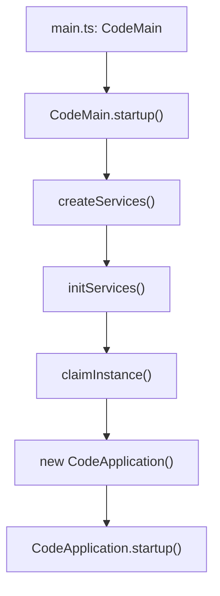
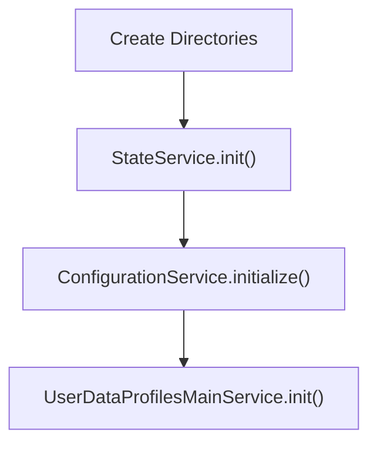
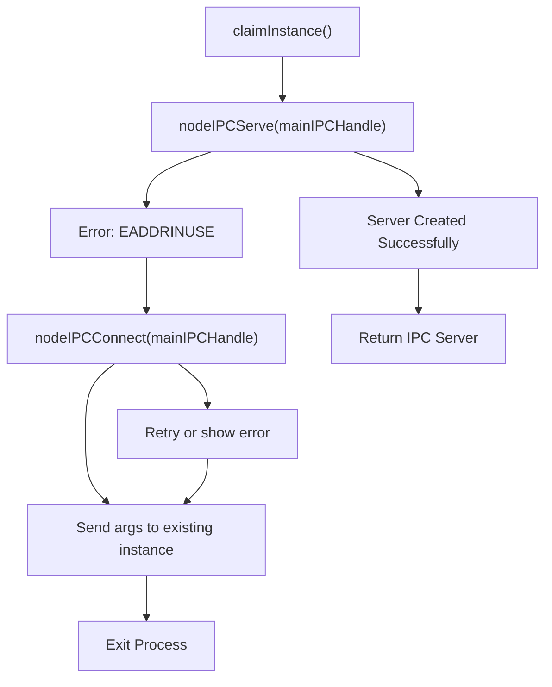
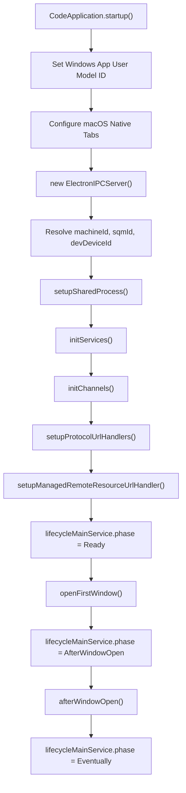
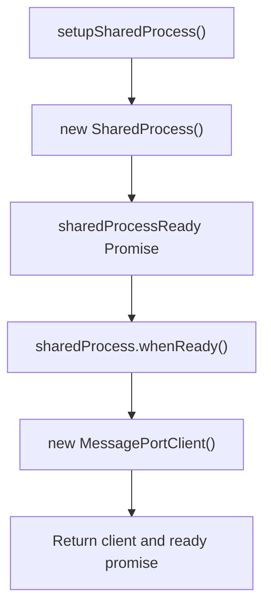
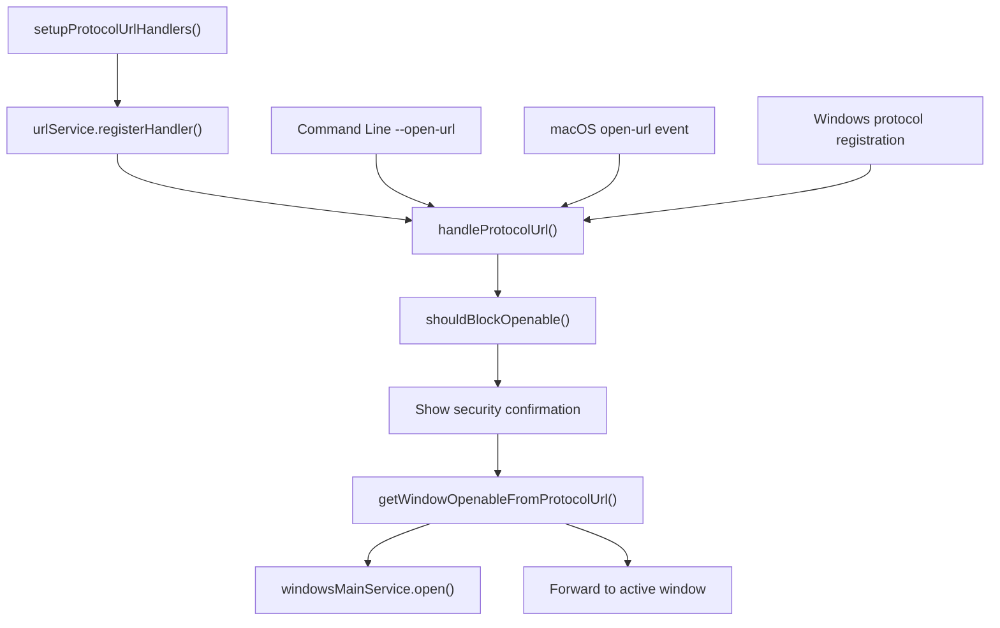
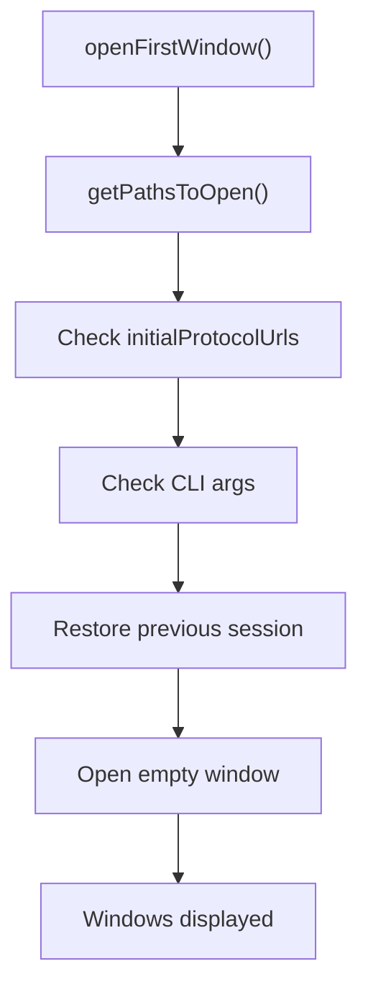

# Electron Main Process Startup

Relevant source files

-   [build/lib/i18n.resources.json](https://github.com/microsoft/vscode/blob/1be3088d/build/lib/i18n.resources.json)
-   [cli/src/bin/code/legacy\_args.rs](https://github.com/microsoft/vscode/blob/1be3088d/cli/src/bin/code/legacy_args.rs)
-   [resources/completions/bash/code](https://github.com/microsoft/vscode/blob/1be3088d/resources/completions/bash/code)
-   [resources/completions/zsh/\_code](https://github.com/microsoft/vscode/blob/1be3088d/resources/completions/zsh/_code)
-   [src/vs/base/node/terminalEncoding.ts](https://github.com/microsoft/vscode/blob/1be3088d/src/vs/base/node/terminalEncoding.ts)
-   [src/vs/code/browser/workbench/workbench-dev.html](https://github.com/microsoft/vscode/blob/1be3088d/src/vs/code/browser/workbench/workbench-dev.html)
-   [src/vs/code/browser/workbench/workbench.html](https://github.com/microsoft/vscode/blob/1be3088d/src/vs/code/browser/workbench/workbench.html)
-   [src/vs/code/browser/workbench/workbench.ts](https://github.com/microsoft/vscode/blob/1be3088d/src/vs/code/browser/workbench/workbench.ts)
-   [src/vs/code/electron-main/app.ts](https://github.com/microsoft/vscode/blob/1be3088d/src/vs/code/electron-main/app.ts)
-   [src/vs/code/electron-main/main.ts](https://github.com/microsoft/vscode/blob/1be3088d/src/vs/code/electron-main/main.ts)
-   [src/vs/code/node/cli.ts](https://github.com/microsoft/vscode/blob/1be3088d/src/vs/code/node/cli.ts)
-   [src/vs/code/node/cliProcessMain.ts](https://github.com/microsoft/vscode/blob/1be3088d/src/vs/code/node/cliProcessMain.ts)
-   [src/vs/platform/environment/common/argv.ts](https://github.com/microsoft/vscode/blob/1be3088d/src/vs/platform/environment/common/argv.ts)
-   [src/vs/platform/environment/common/environment.ts](https://github.com/microsoft/vscode/blob/1be3088d/src/vs/platform/environment/common/environment.ts)
-   [src/vs/platform/environment/common/environmentService.ts](https://github.com/microsoft/vscode/blob/1be3088d/src/vs/platform/environment/common/environmentService.ts)
-   [src/vs/platform/environment/electron-main/environmentMainService.ts](https://github.com/microsoft/vscode/blob/1be3088d/src/vs/platform/environment/electron-main/environmentMainService.ts)
-   [src/vs/platform/environment/node/argv.ts](https://github.com/microsoft/vscode/blob/1be3088d/src/vs/platform/environment/node/argv.ts)
-   [src/vs/platform/environment/node/argvHelper.ts](https://github.com/microsoft/vscode/blob/1be3088d/src/vs/platform/environment/node/argvHelper.ts)
-   [src/vs/platform/environment/node/environmentService.ts](https://github.com/microsoft/vscode/blob/1be3088d/src/vs/platform/environment/node/environmentService.ts)
-   [src/vs/platform/environment/node/stdin.ts](https://github.com/microsoft/vscode/blob/1be3088d/src/vs/platform/environment/node/stdin.ts)
-   [src/vs/platform/extensionManagement/common/extensionManagementCLI.ts](https://github.com/microsoft/vscode/blob/1be3088d/src/vs/platform/extensionManagement/common/extensionManagementCLI.ts)
-   [src/vs/server/node/remoteExtensionHostAgentCli.ts](https://github.com/microsoft/vscode/blob/1be3088d/src/vs/server/node/remoteExtensionHostAgentCli.ts)
-   [src/vs/server/node/server.cli.ts](https://github.com/microsoft/vscode/blob/1be3088d/src/vs/server/node/server.cli.ts)
-   [src/vs/server/node/serverEnvironmentService.ts](https://github.com/microsoft/vscode/blob/1be3088d/src/vs/server/node/serverEnvironmentService.ts)
-   [src/vs/server/node/serverServices.ts](https://github.com/microsoft/vscode/blob/1be3088d/src/vs/server/node/serverServices.ts)
-   [src/vs/workbench/browser/web.api.ts](https://github.com/microsoft/vscode/blob/1be3088d/src/vs/workbench/browser/web.api.ts)
-   [src/vs/workbench/browser/web.factory.ts](https://github.com/microsoft/vscode/blob/1be3088d/src/vs/workbench/browser/web.factory.ts)
-   [src/vs/workbench/browser/web.main.ts](https://github.com/microsoft/vscode/blob/1be3088d/src/vs/workbench/browser/web.main.ts)
-   [src/vs/workbench/electron-browser/desktop.main.ts](https://github.com/microsoft/vscode/blob/1be3088d/src/vs/workbench/electron-browser/desktop.main.ts)
-   [src/vs/workbench/services/environment/browser/environmentService.ts](https://github.com/microsoft/vscode/blob/1be3088d/src/vs/workbench/services/environment/browser/environmentService.ts)
-   [src/vs/workbench/services/environment/common/environmentService.ts](https://github.com/microsoft/vscode/blob/1be3088d/src/vs/workbench/services/environment/common/environmentService.ts)
-   [src/vs/workbench/services/environment/electron-browser/environmentService.ts](https://github.com/microsoft/vscode/blob/1be3088d/src/vs/workbench/services/environment/electron-browser/environmentService.ts)
-   [src/vs/workbench/services/extensions/electron-browser/nativeExtensionService.ts](https://github.com/microsoft/vscode/blob/1be3088d/src/vs/workbench/services/extensions/electron-browser/nativeExtensionService.ts)
-   [src/vs/workbench/workbench.common.main.ts](https://github.com/microsoft/vscode/blob/1be3088d/src/vs/workbench/workbench.common.main.ts)
-   [src/vs/workbench/workbench.desktop.main.ts](https://github.com/microsoft/vscode/blob/1be3088d/src/vs/workbench/workbench.desktop.main.ts)
-   [src/vs/workbench/workbench.web.main.ts](https://github.com/microsoft/vscode/blob/1be3088d/src/vs/workbench/workbench.web.main.ts)

This document describes how VS Code's Electron main process initializes when the application launches. It covers the sequence from the initial entry point through service instantiation, security configuration, IPC server setup, and the eventual opening of windows. For information about the renderer process initialization, see the Workbench Bootstrap section [3.4](/microsoft/vscode/3.4-web-workbench-bootstrap). For multi-process architecture concepts, see [3.3](/microsoft/vscode/3.3-multi-process-architecture).

## Entry Point and Main Flow

VS Code's Electron main process begins execution in the `CodeMain` class, which orchestrates the entire startup sequence before any UI is shown.

**Main Process Entry Point Flow**

The `CodeMain.main()` method initiates startup, which then proceeds through these phases:

1.  **Error Handler Setup** - Sets an unexpected error handler to prevent default Electron error dialogs
2.  **Service Creation** - Instantiates core platform services
3.  **Service Initialization** - Initializes file system, state, and configuration services
4.  **Instance Claiming** - Establishes IPC server to ensure single instance
5.  **Application Creation** - Instantiates `CodeApplication`
6.  **Startup Execution** - Runs the main application lifecycle

Sources: [src/vs/code/electron-main/main.ts88-160](https://github.com/microsoft/vscode/blob/1be3088d/src/vs/code/electron-main/main.ts#L88-L160)

## Service Creation and Instantiation

Before any application logic runs, the main process creates and wires up essential platform services using dependency injection.

```mermaid
flowchart TD
    ProductService["IProductService"]
    EnvService["IEnvironmentMainService"]
    LoggerService["ILoggerMainService"]
    LogService["ILogService"]
    FileService["IFileService"]
    StateService["IStateService"]
    UriIdentityService["IUriIdentityService"]
    UserDataProfilesService["IUserDataProfilesMainService"]
    PolicyService["IPolicyService"]
    ConfigService["IConfigurationService"]
    LifecycleService["ILifecycleMainService"]
    ProtocolService["IProtocolMainService"]
    InstantiationService["InstantiationService"]

    InstantiationService --> ProductService
    InstantiationService --> EnvService
    InstantiationService --> LoggerService
    InstantiationService --> LogService
    InstantiationService --> FileService
    InstantiationService --> StateService
    InstantiationService --> UriIdentityService
    InstantiationService --> UserDataProfilesService
    InstantiationService --> PolicyService
    InstantiationService --> ConfigService
    InstantiationService --> LifecycleService
    InstantiationService --> ProtocolService
```

**Core Services Created During Startup**

The `createServices()` method sets up a `ServiceCollection` with the following key services:

| Service | Implementation | Purpose |
| --- | --- | --- |
| `IProductService` | product constants | Product metadata and configuration |
| `IEnvironmentMainService` | `EnvironmentMainService` | Paths and command-line arguments |
| `ILoggerMainService` | `LoggerMainService` | Logger management |
| `ILogService` | `LogService` with `BufferLogger` | Logging infrastructure |
| `IFileService` | `FileService` with `DiskFileSystemProvider` | File system operations |
| `IStateService` | `StateService` | Persistent state storage |
| `IUserDataProfilesMainService` | `UserDataProfilesMainService` | User profile management |
| `IPolicyService` | Platform-specific policy service | Enterprise policy enforcement |
| `IConfigurationService` | `ConfigurationService` | Settings management |
| `ILifecycleMainService` | `LifecycleMainService` | Application lifecycle events |
| `IProtocolMainService` | `ProtocolMainService` | Protocol URL handling |

The services are registered with `ServiceCollection` and then used to create an `InstantiationService`, which provides dependency injection throughout the application.

Sources: [src/vs/code/electron-main/main.ts162-247](https://github.com/microsoft/vscode/blob/1be3088d/src/vs/code/electron-main/main.ts#L162-L247)

## Service Initialization

After service instances are created, they must be initialized to prepare the application environment.

**Directory and Service Initialization Sequence**

The `initServices()` method performs the following operations:

1.  **Directory Creation** - Creates essential directories if they don't exist:

    -   Extensions path
    -   Code cache path
    -   Logs home
    -   Global storage home
    -   Workspace storage home
    -   Local history home
    -   Backup home
2.  **State Service Initialization** - Loads persistent application state from disk

3.  **Configuration Service Initialization** - Loads user settings

4.  **User Data Profiles Initialization** - Initializes profile system after state is loaded

All these operations run in parallel using `Promises.settled()` to ensure one failure doesn't block others.

Sources: [src/vs/code/electron-main/main.ts267-289](https://github.com/microsoft/vscode/blob/1be3088d/src/vs/code/electron-main/main.ts#L267-L289)

## Instance Claiming and IPC Server

VS Code ensures only one instance runs at a time by attempting to create an IPC server on a known handle.

**Multi-Instance Prevention**

The `claimInstance()` method implements the following logic:

1.  **Attempt Server Creation** - Try to create a `NodeIPCServer` listening on `environmentMainService.mainIPCHandle`

2.  **Success Path** - If successful, this is the first instance:

    -   Register shutdown handler to dispose server
    -   Write process ID to lockfile
    -   Return the server
3.  **Failure Path (EADDRINUSE)** - If the address is already in use:

    -   Connect as a client to the existing instance
    -   Send command-line arguments via IPC
    -   Show warning dialog if connection takes >10 seconds
    -   Exit the process
4.  **Special Cases**:

    -   Extension tests require single instance (error if multiple)
    -   On Linux/macOS, stale pipes may be deleted and retry attempted

Sources: [src/vs/code/electron-main/main.ts303-383](https://github.com/microsoft/vscode/blob/1be3088d/src/vs/code/electron-main/main.ts#L303-L383)

## CodeApplication Initialization

Once services are ready and the instance is claimed, `CodeApplication` is instantiated to manage the application lifecycle.

```mermaid
flowchart TD
    Constructor["CodeApplication constructor"]
    ConfigureSession["configureSession()"]
    RegisterListeners["registerListeners()"]
    Permissions["Permission Handlers"]
    RequestFiltering["Request Filtering"]
    SVGBlocking["SVG Request Blocking"]
    CORSHeaders["CORS Headers for PRSS CDN"]
    CodeCache["Code Cache Path"]
    UNCAllowlist["UNC Host Allowlist (Windows)"]
    Shutdown["onWillShutdown"]
    ContextMenu["Context Menu IPC"]
    Accessibility["Accessibility Changes"]
    MacOSDock["macOS Dock Activate"]
    WebContents["Web Contents Created"]
    OpenFile["macOS Open File"]
    IPCHandlers["Bootstrap IPC Handlers"]

    Constructor --> ConfigureSession
    Constructor --> RegisterListeners
    ConfigureSession --> Permissions
    ConfigureSession --> RequestFiltering
    ConfigureSession --> SVGBlocking
    ConfigureSession --> CORSHeaders
    ConfigureSession --> CodeCache
    ConfigureSession --> UNCAllowlist
    RegisterListeners --> Shutdown
    RegisterListeners --> ContextMenu
    RegisterListeners --> Accessibility
    RegisterListeners --> MacOSDock
    RegisterListeners --> WebContents
    RegisterListeners --> OpenFile
    RegisterListeners --> IPCHandlers
```

**CodeApplication Constructor Actions**

The `CodeApplication` constructor performs two critical setup operations:

1.  **Session Configuration** - Configures Electron's session object for security
2.  **Listener Registration** - Registers event handlers for application lifecycle

Sources: [src/vs/code/electron-main/app.ts141-159](https://github.com/microsoft/vscode/blob/1be3088d/src/vs/code/electron-main/app.ts#L141-L159)

## Session Security Configuration

The `configureSession()` method sets up comprehensive security measures for all web content.

**Permission Management**

VS Code implements strict permission controls based on content origin:

| Permission | Webview | Core Window | Other Origins |
| --- | --- | --- | --- |
| `pointerLock` | ✓ | ✓ | ✗ |
| `notifications` | ✓ | ✓ | ✗ |
| `clipboard-read` | ✓ | ✗ | ✗ |
| `clipboard-sanitized-write` | ✓ | ✗ | ✗ |
| `media` | ✗ | ✓ | ✗ |
| `local-fonts` | ✗ | ✓ | ✗ |

The permission handlers check the requesting URL scheme:

-   `vscode-file://vscode_authority` - Core window content
-   `vscode-webview://` - Webview content
-   All other origins - Denied

**Request Filtering**

The session's `webRequest` handlers block potentially dangerous requests:

1.  **Webview Protection** - Only allows webview index.html to load from main windows
2.  **File Resource Protection** - Only allows `vscode-file:` requests from main windows or shared process
3.  **SVG Blocking** - Blocks SVG loads from unsupported schemes unless from safe contexts (webview or XHR)

**Other Security Measures**

-   **Code Cache Partitioning** - Sets custom code cache path to invalidate caches appropriately
-   **UNC Access Control (Windows)** - Restricts UNC path access based on `security.restrictUNCAccess` and `security.allowedUNCHosts` settings

Sources: [src/vs/code/electron-main/app.ts161-376](https://github.com/microsoft/vscode/blob/1be3088d/src/vs/code/electron-main/app.ts#L161-L376)

## Application Startup Sequence

The `CodeApplication.startup()` method orchestrates the main application initialization after construction.

**Startup Phase Details**

The startup method executes these key steps:

1.  **Windows App User Model ID** - Sets `app.setAppUserModelId()` to associate shortcuts properly on Windows

2.  **macOS Compatibility** - Configures native tabs setting if enabled

3.  **Electron IPC Server** - Creates `ElectronIPCServer` for renderer-to-main IPC communication

4.  **Machine Identification** - Resolves unique identifiers:

    -   `machineId` - Unique machine identifier
    -   `sqmId` - Software Quality Metrics identifier
    -   `devDeviceId` - Development device identifier
5.  **Shared Process Setup** - Initializes the shared process for background services

6.  **Additional Services** - Initializes application-level services (windows, native host, dialogs, etc.)

7.  **IPC Channels** - Registers IPC channels for various services

8.  **Protocol URL Handlers** - Sets up handlers for `vscode://` URLs

9.  **Lifecycle Phases** - Sets lifecycle phases to coordinate startup:

    -   `LifecycleMainPhase.Ready` - Before opening windows
    -   `LifecycleMainPhase.AfterWindowOpen` - After first window opens
    -   `LifecycleMainPhase.Eventually` - Idle period after startup

Sources: [src/vs/code/electron-main/app.ts526-622](https://github.com/microsoft/vscode/blob/1be3088d/src/vs/code/electron-main/app.ts#L526-L622)

## Shared Process Setup

The shared process runs background services that don't need to be in the main process or renderer.

**Shared Process Responsibilities**

The `SharedProcess` is a utility process that hosts services like:

-   Extension management
-   Telemetry collection
-   Update service
-   Storage services
-   User data sync

The main process:

1.  Creates a `SharedProcess` instance with machine IDs
2.  Returns a client (`MessagePortClient`) for IPC communication
3.  Provides a `sharedProcessReady` promise for coordinating initialization

The shared process won't actually spawn until the first window connects to it.

Sources: [src/vs/code/electron-main/app.ts575](https://github.com/microsoft/vscode/blob/1be3088d/src/vs/code/electron-main/app.ts#L575-L575) [src/vs/platform/sharedProcess/electron-main/sharedProcess.ts24-112](https://github.com/microsoft/vscode/blob/1be3088d/src/vs/platform/sharedProcess/electron-main/sharedProcess.ts#L24-L112)

## Service Initialization (Application Level)

After the shared process is configured, `CodeApplication` initializes application-level services.

```mermaid
flowchart TD
    InitServicesMethod["initServices()"]
    WindowsMainService["IWindowsMainService"]
    NativeHostMainService["INativeHostMainService"]
    DialogMainService["IDialogMainService"]
    MenubarMainService["IMenubarMainService"]
    LaunchMainService["ILaunchMainService"]
    StorageMainService["IStorageMainService"]
    ApplicationStorageMainService["IApplicationStorageMainService"]
    BackupMainService["IBackupMainService"]
    ExtensionHostStarter["IExtensionHostStarter"]
    ExternalTerminalService["IExternalTerminalMainService"]
    UpdateService["IUpdateService"]
    URLService["IURLService"]

    InitServicesMethod --> WindowsMainService
    InitServicesMethod --> NativeHostMainService
    InitServicesMethod --> DialogMainService
    InitServicesMethod --> MenubarMainService
    InitServicesMethod --> LaunchMainService
    InitServicesMethod --> StorageMainService
    InitServicesMethod --> ApplicationStorageMainService
    InitServicesMethod --> BackupMainService
    InitServicesMethod --> ExtensionHostStarter
    InitServicesMethod --> ExternalTerminalService
    InitServicesMethod --> UpdateService
    InitServicesMethod --> URLService
```

**Application Services Instantiation**

The `initServices()` method creates instances of high-level application services:

**Window Management**

-   `IWindowsMainService` (`WindowsMainService`) - Manages all application windows
-   `INativeHostMainService` (`NativeHostMainService`) - Provides native OS integration APIs

**UI Services**

-   `IDialogMainService` (`DialogMainService`) - Native file dialogs and message boxes
-   `IMenubarMainService` (`MenubarMainService`) - Application menu management

**Data Services**

-   `IStorageMainService` (`StorageMainService`) - Per-workspace persistent storage
-   `IApplicationStorageMainService` (`ApplicationStorageMainService`) - Application-wide storage
-   `IBackupMainService` (`BackupMainService`) - Backup management for untitled files

**Extension System**

-   `IExtensionHostStarter` (`ExtensionHostStarter`) - Spawns extension host processes

**Platform Services**

-   `IUpdateService` - Platform-specific update service (Darwin/Win32/Linux/Snap)
-   `IExternalTerminalMainService` - Opens external terminal applications
-   `IURLService` (`NativeURLService`) - Handles protocol URLs

All services are created via `instantiationService.createInstance()` or registered as `SyncDescriptor` for lazy instantiation.

Sources: [src/vs/code/electron-main/app.ts578](https://github.com/microsoft/vscode/blob/1be3088d/src/vs/code/electron-main/app.ts#L578-L578)

## IPC Channel Registration

After services are initialized, IPC channels are registered to expose main process functionality to renderer processes.

**Channel Registration Pattern**

Each service that needs to communicate with renderers gets an IPC channel:

| Service | Channel Name | Channel Class |
| --- | --- | --- |
| `IUpdateService` | `'update'` | `UpdateChannel` |
| `IURLService` | `'urlHandler'` | Dynamic routing |
| `IExtensionHostStarter` | `'extensionHostStarter'` | ProxyChannel |
| `ILoggerService` | `'logger'` | `LoggerChannel` |
| `IStorageMainService` | `'storage'` | `StorageDatabaseChannel` |
| `IPolicyService` | `'policy'` | `PolicyChannel` |
| Terminal (Pty) | `'localPtyHost'` | Lazy initialization |

The channels are registered on the `ElectronIPCServer` using `server.registerChannel()`, which allows renderer processes to access main process services via IPC.

Sources: [src/vs/code/electron-main/app.ts590](https://github.com/microsoft/vscode/blob/1be3088d/src/vs/code/electron-main/app.ts#L590-L590)

## Protocol URL Handlers

VS Code handles `vscode://` protocol URLs for extension installation, file opening, and other integrations.

**Protocol URL Processing**

The `setupProtocolUrlHandlers()` method configures handling for `vscode://` URLs:

1.  **ElectronURLListener** - Listens for protocol URLs from:

    -   Command-line arguments (`--open-url`)
    -   macOS `open-url` events
    -   Windows protocol registration
2.  **Security Confirmation** - For `file://` and `vscode-remote://` schemes, shows a confirmation dialog before opening to prevent malicious URLs

3.  **URL Routing**:

    -   File/folder/workspace URLs open new windows
    -   Other URLs are forwarded to the active window for handling (e.g., extension marketplace URLs)
4.  **Initial Protocol URLs** - URLs received before the first window opens are queued and processed after window creation

Sources: [src/vs/code/electron-main/app.ts624-655](https://github.com/microsoft/vscode/blob/1be3088d/src/vs/code/electron-main/app.ts#L624-L655) [src/vs/code/electron-main/app.ts679-773](https://github.com/microsoft/vscode/blob/1be3088d/src/vs/code/electron-main/app.ts#L679-L773)

## Window Opening

The final step of startup is opening the initial windows based on command-line arguments and previous session state.

**Window Opening Logic**

The `openFirstWindow()` method determines what to open:

1.  **Protocol URLs** - If protocol URLs were passed, open the corresponding files/folders/workspaces

2.  **CLI Arguments** - Process command-line arguments:

    -   Files to open
    -   Folders to open
    -   Workspaces to open
    -   `--new-window` flag
3.  **Session Restoration** - On initial startup (not forced new window):

    -   Restore previously opened workspaces
    -   Restore empty windows with backups
    -   Restore untitled workspace windows
4.  **Empty Window** - If nothing else applies and `--new-window` wasn't specified, open an empty window

The `IWindowsMainService.open()` method handles the actual window creation, which creates `CodeWindow` instances and loads the renderer process.

Sources: [src/vs/code/electron-main/app.ts602](https://github.com/microsoft/vscode/blob/1be3088d/src/vs/code/electron-main/app.ts#L602-L602) [src/vs/platform/windows/electron-main/windowsMainService.ts294-456](https://github.com/microsoft/vscode/blob/1be3088d/src/vs/platform/windows/electron-main/windowsMainService.ts#L294-L456)
