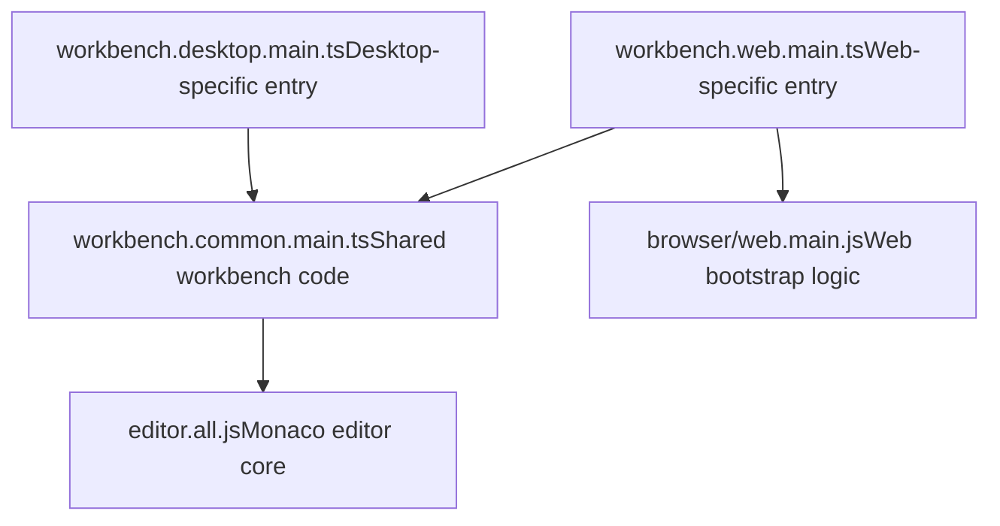
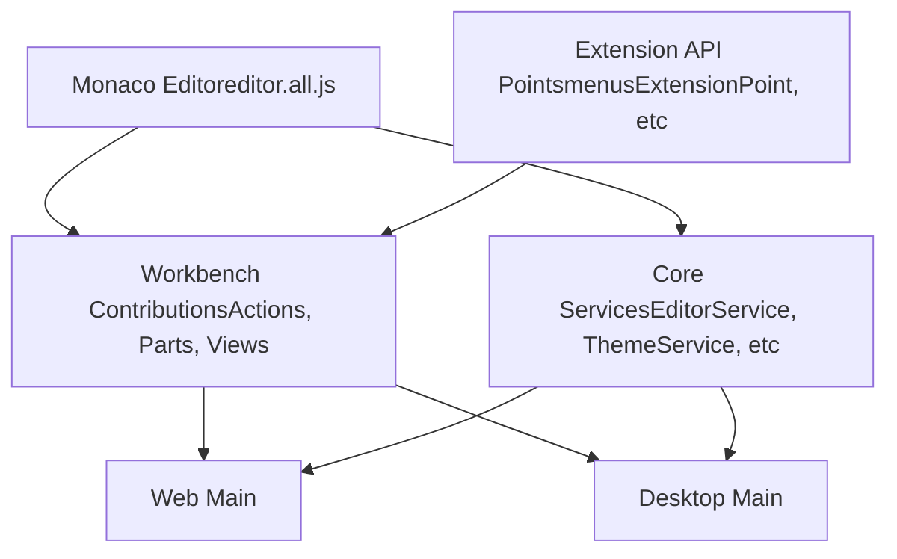
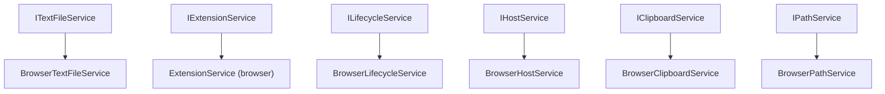
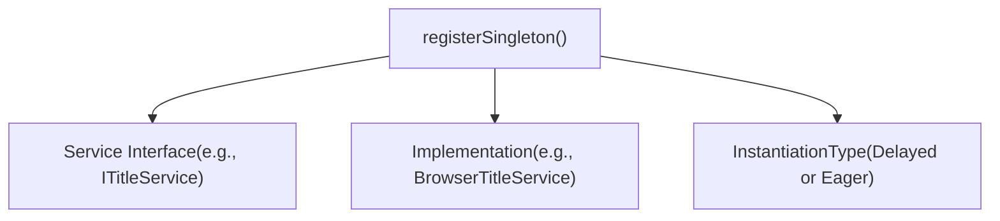
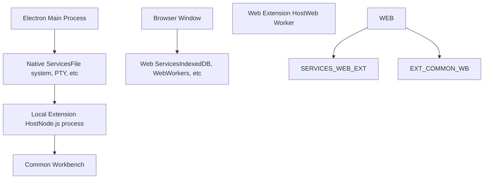
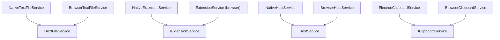
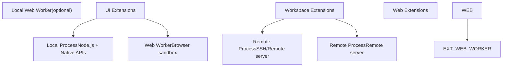

# Web Workbench Bootstrap

Relevant source files

-   [build/lib/i18n.resources.json](https://github.com/microsoft/vscode/blob/1be3088d/build/lib/i18n.resources.json)
-   [cli/src/bin/code/legacy\_args.rs](https://github.com/microsoft/vscode/blob/1be3088d/cli/src/bin/code/legacy_args.rs)
-   [resources/completions/bash/code](https://github.com/microsoft/vscode/blob/1be3088d/resources/completions/bash/code)
-   [resources/completions/zsh/\_code](https://github.com/microsoft/vscode/blob/1be3088d/resources/completions/zsh/_code)
-   [src/vs/base/node/terminalEncoding.ts](https://github.com/microsoft/vscode/blob/1be3088d/src/vs/base/node/terminalEncoding.ts)
-   [src/vs/code/browser/workbench/workbench-dev.html](https://github.com/microsoft/vscode/blob/1be3088d/src/vs/code/browser/workbench/workbench-dev.html)
-   [src/vs/code/browser/workbench/workbench.html](https://github.com/microsoft/vscode/blob/1be3088d/src/vs/code/browser/workbench/workbench.html)
-   [src/vs/code/browser/workbench/workbench.ts](https://github.com/microsoft/vscode/blob/1be3088d/src/vs/code/browser/workbench/workbench.ts)
-   [src/vs/code/electron-main/app.ts](https://github.com/microsoft/vscode/blob/1be3088d/src/vs/code/electron-main/app.ts)
-   [src/vs/code/electron-main/main.ts](https://github.com/microsoft/vscode/blob/1be3088d/src/vs/code/electron-main/main.ts)
-   [src/vs/code/node/cli.ts](https://github.com/microsoft/vscode/blob/1be3088d/src/vs/code/node/cli.ts)
-   [src/vs/code/node/cliProcessMain.ts](https://github.com/microsoft/vscode/blob/1be3088d/src/vs/code/node/cliProcessMain.ts)
-   [src/vs/platform/environment/common/argv.ts](https://github.com/microsoft/vscode/blob/1be3088d/src/vs/platform/environment/common/argv.ts)
-   [src/vs/platform/environment/common/environment.ts](https://github.com/microsoft/vscode/blob/1be3088d/src/vs/platform/environment/common/environment.ts)
-   [src/vs/platform/environment/common/environmentService.ts](https://github.com/microsoft/vscode/blob/1be3088d/src/vs/platform/environment/common/environmentService.ts)
-   [src/vs/platform/environment/electron-main/environmentMainService.ts](https://github.com/microsoft/vscode/blob/1be3088d/src/vs/platform/environment/electron-main/environmentMainService.ts)
-   [src/vs/platform/environment/node/argv.ts](https://github.com/microsoft/vscode/blob/1be3088d/src/vs/platform/environment/node/argv.ts)
-   [src/vs/platform/environment/node/argvHelper.ts](https://github.com/microsoft/vscode/blob/1be3088d/src/vs/platform/environment/node/argvHelper.ts)
-   [src/vs/platform/environment/node/environmentService.ts](https://github.com/microsoft/vscode/blob/1be3088d/src/vs/platform/environment/node/environmentService.ts)
-   [src/vs/platform/environment/node/stdin.ts](https://github.com/microsoft/vscode/blob/1be3088d/src/vs/platform/environment/node/stdin.ts)
-   [src/vs/platform/extensionManagement/common/extensionManagementCLI.ts](https://github.com/microsoft/vscode/blob/1be3088d/src/vs/platform/extensionManagement/common/extensionManagementCLI.ts)
-   [src/vs/server/node/remoteExtensionHostAgentCli.ts](https://github.com/microsoft/vscode/blob/1be3088d/src/vs/server/node/remoteExtensionHostAgentCli.ts)
-   [src/vs/server/node/server.cli.ts](https://github.com/microsoft/vscode/blob/1be3088d/src/vs/server/node/server.cli.ts)
-   [src/vs/server/node/serverEnvironmentService.ts](https://github.com/microsoft/vscode/blob/1be3088d/src/vs/server/node/serverEnvironmentService.ts)
-   [src/vs/server/node/serverServices.ts](https://github.com/microsoft/vscode/blob/1be3088d/src/vs/server/node/serverServices.ts)
-   [src/vs/workbench/browser/web.api.ts](https://github.com/microsoft/vscode/blob/1be3088d/src/vs/workbench/browser/web.api.ts)
-   [src/vs/workbench/browser/web.factory.ts](https://github.com/microsoft/vscode/blob/1be3088d/src/vs/workbench/browser/web.factory.ts)
-   [src/vs/workbench/browser/web.main.ts](https://github.com/microsoft/vscode/blob/1be3088d/src/vs/workbench/browser/web.main.ts)
-   [src/vs/workbench/electron-browser/desktop.main.ts](https://github.com/microsoft/vscode/blob/1be3088d/src/vs/workbench/electron-browser/desktop.main.ts)
-   [src/vs/workbench/services/environment/browser/environmentService.ts](https://github.com/microsoft/vscode/blob/1be3088d/src/vs/workbench/services/environment/browser/environmentService.ts)
-   [src/vs/workbench/services/environment/common/environmentService.ts](https://github.com/microsoft/vscode/blob/1be3088d/src/vs/workbench/services/environment/common/environmentService.ts)
-   [src/vs/workbench/services/environment/electron-browser/environmentService.ts](https://github.com/microsoft/vscode/blob/1be3088d/src/vs/workbench/services/environment/electron-browser/environmentService.ts)
-   [src/vs/workbench/services/extensions/electron-browser/nativeExtensionService.ts](https://github.com/microsoft/vscode/blob/1be3088d/src/vs/workbench/services/extensions/electron-browser/nativeExtensionService.ts)
-   [src/vs/workbench/workbench.common.main.ts](https://github.com/microsoft/vscode/blob/1be3088d/src/vs/workbench/workbench.common.main.ts)
-   [src/vs/workbench/workbench.desktop.main.ts](https://github.com/microsoft/vscode/blob/1be3088d/src/vs/workbench/workbench.desktop.main.ts)
-   [src/vs/workbench/workbench.web.main.ts](https://github.com/microsoft/vscode/blob/1be3088d/src/vs/workbench/workbench.web.main.ts)

This document describes how VS Code initializes in the web browser environment, detailing the specific bootstrap sequence, service registrations, and differences from the desktop version.

For information about the desktop Electron bootstrap process, see [Electron Main Process Startup](/microsoft/vscode/3.2-electron-main-process-startup). For information about multi-process architecture in general, see [Multi-Process Architecture](/microsoft/vscode/3.3-multi-process-architecture). For service initialization patterns, see [Service Initialization and Dependency Injection](/microsoft/vscode/3.5-service-initialization-and-dependency-injection).

## Overview

The web workbench bootstrap is the initialization sequence for VS Code running in a browser (without Electron). This process:

1.  Loads common workbench infrastructure shared with desktop
2.  Registers browser-specific service implementations
3.  Initializes web-compatible extensions and features
4.  Excludes native/Electron-dependent functionality

The web version has significant architectural differences from desktop due to browser security constraints, lack of native Node.js APIs, and different execution environments.

**Sources:** [src/vs/workbench/workbench.web.main.ts1-176](https://github.com/microsoft/vscode/blob/1be3088d/src/vs/workbench/workbench.web.main.ts#L1-L176)

## Entry Point Structure

The web workbench uses a layered entry point architecture where platform-specific code builds upon common infrastructure.

### File Structure


**Sources:** [src/vs/workbench/workbench.web.main.ts16-17](https://github.com/microsoft/vscode/blob/1be3088d/src/vs/workbench/workbench.web.main.ts#L16-L17) [src/vs/workbench/workbench.web.main.ts30-31](https://github.com/microsoft/vscode/blob/1be3088d/src/vs/workbench/workbench.web.main.ts#L30-L31) [src/vs/workbench/workbench.desktop.main.ts15-16](https://github.com/microsoft/vscode/blob/1be3088d/src/vs/workbench/workbench.desktop.main.ts#L15-L16)

### Import Sequence

The web workbench imports follow a strict ordering:

1.  **Common workbench** - Line 16 imports `./workbench.common.main.js`
2.  **Web-specific dialog parts** - Line 23 imports `./browser/parts/dialogs/dialog.web.contribution.js`
3.  **Core web bootstrap** - Line 30 imports `./browser/web.main.js`
4.  **Web-specific services** - Lines 37-72 import browser implementations
5.  **Web-specific contributions** - Lines 127-175 import feature contributions

**Sources:** [src/vs/workbench/workbench.web.main.ts14-32](https://github.com/microsoft/vscode/blob/1be3088d/src/vs/workbench/workbench.web.main.ts#L14-L32) [src/vs/workbench/workbench.web.main.ts35-72](https://github.com/microsoft/vscode/blob/1be3088d/src/vs/workbench/workbench.web.main.ts#L35-L72)

## Common Workbench Foundation

The common workbench (`workbench.common.main.ts`) provides the foundation shared by all platforms.

### Common Infrastructure


**Sources:** [src/vs/workbench/workbench.common.main.ts6-13](https://github.com/microsoft/vscode/blob/1be3088d/src/vs/workbench/workbench.common.main.ts#L6-L13) [src/vs/workbench/workbench.common.main.ts42-50](https://github.com/microsoft/vscode/blob/1be3088d/src/vs/workbench/workbench.common.main.ts#L42-L50) [src/vs/workbench/workbench.common.main.ts53-136](https://github.com/microsoft/vscode/blob/1be3088d/src/vs/workbench/workbench.common.main.ts#L53-L136)

### Core Registrations in Common

The common workbench registers platform-agnostic services:

| Service Interface | Implementation | Type |
| --- | --- | --- |
| `IUserDataSyncLogService` | `UserDataSyncLogService` | Delayed |
| `IContextViewService` | `ContextViewService` | Delayed |
| `IListService` | `ListService` | Delayed |
| `IMarkerService` | `MarkerService` | Delayed |
| `IContextKeyService` | `ContextKeyService` | Delayed |
| `IDownloadService` | `DownloadService` | Delayed |
| `IOpenerService` | `OpenerService` | Delayed |
| `IWebWorkerService` | `WebWorkerService` | Delayed |

**Sources:** [src/vs/workbench/workbench.common.main.ts166-181](https://github.com/microsoft/vscode/blob/1be3088d/src/vs/workbench/workbench.common.main.ts#L166-L181)

## Web-Specific Service Implementations

The web version registers browser-compatible implementations for services that require platform-specific behavior.

### Browser Service Substitutions


**Sources:** [src/vs/workbench/workbench.web.main.ts37-72](https://github.com/microsoft/vscode/blob/1be3088d/src/vs/workbench/workbench.web.main.ts#L37-L72)

### Key Web Services

The following services are specifically imported for web:

| Service File | Purpose |
| --- | --- |
| `services/textfile/browser/browserTextFileService.js` | File handling via browser APIs |
| `services/extensions/browser/extensionService.js` | Extension loading without Node.js |
| `services/host/browser/browserHostService.js` | Browser window management |
| `services/clipboard/browser/clipboardService.js` | Clipboard API integration |
| `services/path/browser/pathService.js` | Path resolution for web URIs |
| `services/lifecycle/browser/lifecycleService.js` | Browser page lifecycle hooks |
| `services/secrets/browser/secretStorageService.js` | Credential storage via browser APIs |
| `services/workingCopy/browser/workingCopyBackupService.js` | In-browser backup mechanism |
| `services/tunnel/browser/tunnelService.js` | Port forwarding for web |

**Sources:** [src/vs/workbench/workbench.web.main.ts39-66](https://github.com/microsoft/vscode/blob/1be3088d/src/vs/workbench/workbench.web.main.ts#L39-L66)

## Service Singleton Registrations

After importing service implementations, the web workbench registers them as singletons via the dependency injection system.

### Registration Pattern


**Sources:** [src/vs/workbench/workbench.web.main.ts74-121](https://github.com/microsoft/vscode/blob/1be3088d/src/vs/workbench/workbench.web.main.ts#L74-L121)

### Web Service Registrations

The web main file registers these platform-specific singletons:

```
// Extension Management - Web-specific
registerSingleton(IWorkbenchExtensionManagementService, ExtensionManagementService, Delayed)

// Accessibility - Browser implementation
registerSingleton(IAccessibilityService, AccessibilityService, Delayed)

// Context Menu - Browser-specific
registerSingleton(IContextMenuService, ContextMenuService, Delayed)

// User Data Sync - Cloud synchronization
registerSingleton(IUserDataSyncStoreService, UserDataSyncStoreService, Delayed)
registerSingleton(IUserDataSyncService, UserDataSyncService, Delayed)
registerSingleton(IUserDataAutoSyncService, UserDataAutoSyncService, Eager)

// Title Service - Browser window title
registerSingleton(ITitleService, BrowserTitleService, Eager)

// Extension Tips
registerSingleton(IExtensionTipsService, ExtensionTipsService, Delayed)

// Null Services (Not available in web)
registerSingleton(ICustomEndpointTelemetryService, NullEndpointTelemetryService, Delayed)
registerSingleton(IDiagnosticsService, NullDiagnosticsService, Delayed)
```
**Sources:** [src/vs/workbench/workbench.web.main.ts103-121](https://github.com/microsoft/vscode/blob/1be3088d/src/vs/workbench/workbench.web.main.ts#L103-L121)

### Eager vs Delayed Instantiation

| Service | Instantiation Type | Reason |
| --- | --- | --- |
| `ITitleService` | Eager | Must control window title immediately |
| `IUserDataAutoSyncService` | Eager | Auto-sync must start on boot |
| `IAccessibilityService` | Delayed | Only needed when accessed |
| `IExtensionManagementService` | Delayed | Heavy, load on demand |
| Most other services | Delayed | Improve startup performance |

**Sources:** [src/vs/workbench/workbench.web.main.ts103-121](https://github.com/microsoft/vscode/blob/1be3088d/src/vs/workbench/workbench.web.main.ts#L103-L121)

## Web-Specific Feature Contributions

After service registration, the web workbench imports feature-specific contributions that are tailored for browser environments.

### Contribution Categories


**Sources:** [src/vs/workbench/workbench.web.main.ts126-175](https://github.com/microsoft/vscode/blob/1be3088d/src/vs/workbench/workbench.web.main.ts#L126-L175)

### Terminal in Web

The web terminal has special considerations:

| Import | Purpose |
| --- | --- |
| `contrib/terminal/browser/terminal.web.contribution.js` | Web-specific terminal features |
| `contrib/terminal/browser/terminalInstanceService.js` | Terminal instance management |
| `contrib/externalTerminal/browser/externalTerminal.contribution.js` | External terminal integration (limited in web) |

The web terminal cannot spawn native PTY processes, so it typically connects to remote terminal backends or uses web-based solutions.

**Sources:** [src/vs/workbench/workbench.web.main.ts152-155](https://github.com/microsoft/vscode/blob/1be3088d/src/vs/workbench/workbench.web.main.ts#L152-L155)

## Web vs Desktop Bootstrap Comparison

Understanding the differences helps clarify what the web bootstrap must handle differently.

### Architecture Differences


**Sources:** [src/vs/workbench/workbench.web.main.ts1-176](https://github.com/microsoft/vscode/blob/1be3088d/src/vs/workbench/workbench.web.main.ts#L1-L176) [src/vs/workbench/workbench.desktop.main.ts1-192](https://github.com/microsoft/vscode/blob/1be3088d/src/vs/workbench/workbench.desktop.main.ts#L1-L192)

### Key Differences

| Aspect | Desktop | Web |
| --- | --- | --- |
| Entry Point | `workbench.desktop.main.ts` | `workbench.web.main.ts` |
| Process Model | Electron multi-process | Browser single-page |
| Native Modules | Full Node.js access | None |
| File System | Direct OS file system | Virtual file system / remote |
| Extension Host | Local Node.js process | Web Worker or remote |
| PTY/Terminal | Native pty via `node-pty` | Remote or web-based |
| Clipboard | Native clipboard API | Browser Clipboard API |
| Title Bar | Native window title | Custom HTML title bar |
| Lifecycle | Electron app lifecycle | Browser page lifecycle |

**Sources:** [src/vs/workbench/workbench.web.main.ts1-176](https://github.com/microsoft/vscode/blob/1be3088d/src/vs/workbench/workbench.web.main.ts#L1-L176) [src/vs/workbench/workbench.desktop.main.ts1-192](https://github.com/microsoft/vscode/blob/1be3088d/src/vs/workbench/workbench.desktop.main.ts#L1-L192)

### Service Implementation Comparison


**Sources:** [src/vs/workbench/workbench.web.main.ts37-66](https://github.com/microsoft/vscode/blob/1be3088d/src/vs/workbench/workbench.web.main.ts#L37-L66) [src/vs/workbench/workbench.desktop.main.ts37-93](https://github.com/microsoft/vscode/blob/1be3088d/src/vs/workbench/workbench.desktop.main.ts#L37-L93)

## Extension System in Web

The web workbench has a fundamentally different extension architecture due to browser limitations.

### Extension Host Differences


**Sources:** [src/vs/workbench/workbench.web.main.ts41-45](https://github.com/microsoft/vscode/blob/1be3088d/src/vs/workbench/workbench.web.main.ts#L41-L45)

### Web Extension Scanner

The web version uses specialized extension scanning:

| Component | Purpose |
| --- | --- |
| `extensionsScannerService.js` (browser) | Scans available extensions |
| `webExtensionsScannerService.js` | Specifically handles web extensions |
| `extensionsProfileScannerService.js` | Profile-specific extension management |
| `extensionGalleryManifestService.js` | Fetches extension manifests from gallery |

These services scan extensions that are:

-   Hosted on CDN/web server
-   Compiled to browser-compatible JavaScript
-   Marked with `"extensionKind": ["web"]` in manifest

**Sources:** [src/vs/workbench/workbench.web.main.ts42-47](https://github.com/microsoft/vscode/blob/1be3088d/src/vs/workbench/workbench.web.main.ts#L42-L47)

## Null and Stub Services

The web version registers "null" implementations for services that don't make sense in a browser environment.

### Unavailable Services

```
// Services that don't exist in web context
registerSingleton(ICustomEndpointTelemetryService, NullEndpointTelemetryService, Delayed)
registerSingleton(IDiagnosticsService, NullDiagnosticsService, Delayed)
registerSingleton(IWebContentExtractorService, NullWebContentExtractorService, Delayed)
registerSingleton(ISharedWebContentExtractorService, NullSharedWebContentExtractorService, Delayed)
```
These services:

-   Have no-op implementations
-   Prevent code paths that depend on them from crashing
-   Allow shared code to work in both desktop and web

**Sources:** [src/vs/workbench/workbench.web.main.ts116-120](https://github.com/microsoft/vscode/blob/1be3088d/src/vs/workbench/workbench.web.main.ts#L116-L120)

### Why Null Services?

| Service | Why Not Available in Web |
| --- | --- |
| `ICustomEndpointTelemetryService` | Requires native network access |
| `IDiagnosticsService` | Needs OS-level diagnostics |
| `IWebContentExtractorService` | Uses native libraries for content extraction |
| `ISharedWebContentExtractorService` | Same as above, shared worker variant |

**Sources:** [src/vs/workbench/workbench.web.main.ts116-120](https://github.com/microsoft/vscode/blob/1be3088d/src/vs/workbench/workbench.web.main.ts#L116-L120)

## Bootstrap Sequence Summary

The complete web workbench bootstrap follows this sequence:

> **[Mermaid sequence]**
> *(图表结构无法解析)*

**Sources:** [src/vs/workbench/workbench.web.main.ts1-176](https://github.com/microsoft/vscode/blob/1be3088d/src/vs/workbench/workbench.web.main.ts#L1-L176)

### Step-by-Step Process

1.  **Load Entry Point** - Browser loads `workbench.web.main.ts`
2.  **Import Common** - Includes all shared workbench infrastructure
3.  **Import Web Services** - Loads browser-specific service implementations
4.  **Register Singletons** - Registers services with dependency injection
5.  **Import Contributions** - Loads web-specific feature contributions
6.  **Execute Bootstrap** - Runs `browser/web.main.js` to actually start the workbench

**Sources:** [src/vs/workbench/workbench.web.main.ts1-176](https://github.com/microsoft/vscode/blob/1be3088d/src/vs/workbench/workbench.web.main.ts#L1-L176)

## Localization and Language Packs

The web workbench includes special handling for language packs.

### Language Pack Service

```
registerSingleton(ILanguagePackService, WebLanguagePacksService, Delayed)
```
The `WebLanguagePacksService` fetches language packs from the server rather than reading them from the local file system.

**Sources:** [src/vs/workbench/workbench.web.main.ts118](https://github.com/microsoft/vscode/blob/1be3088d/src/vs/workbench/workbench.web.main.ts#L118-L118) [src/vs/workbench/workbench.web.main.ts131-132](https://github.com/microsoft/vscode/blob/1be3088d/src/vs/workbench/workbench.web.main.ts#L131-L132)

## Key Takeaways

The web workbench bootstrap:

1.  **Builds on Common Foundation** - Reuses 80%+ of workbench code
2.  **Substitutes Browser Services** - Replaces native implementations
3.  **Uses Null Services** - Stubs unavailable functionality
4.  **Adapts Extension System** - Web workers instead of Node.js processes
5.  **Manages Different Lifecycle** - Page lifecycle vs app lifecycle
6.  **Registers Services Declaratively** - Via `registerSingleton()` pattern

The architecture allows VS Code to run in the browser with minimal code duplication while maintaining the same API surface for extensions and features.

**Sources:** [src/vs/workbench/workbench.web.main.ts1-176](https://github.com/microsoft/vscode/blob/1be3088d/src/vs/workbench/workbench.web.main.ts#L1-L176) [src/vs/workbench/workbench.common.main.ts1-434](https://github.com/microsoft/vscode/blob/1be3088d/src/vs/workbench/workbench.common.main.ts#L1-L434)
