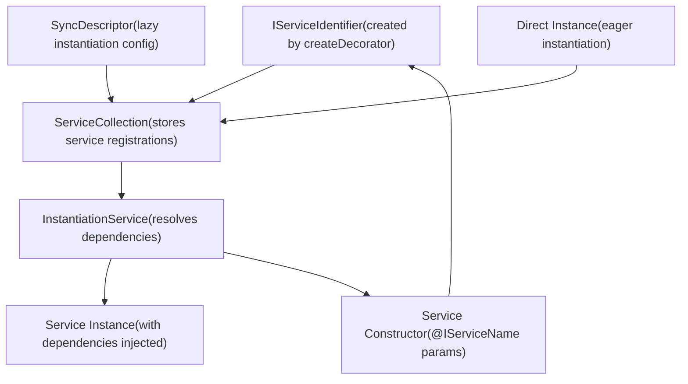
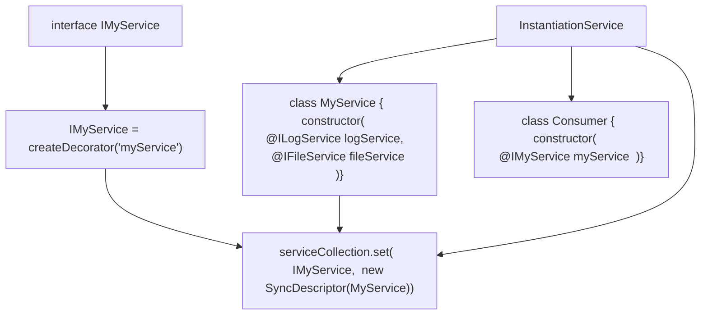
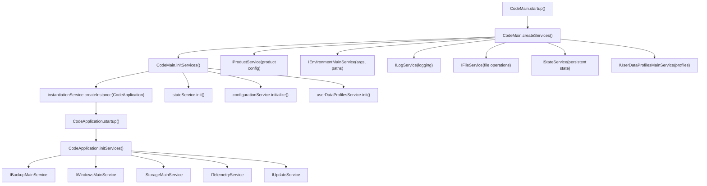
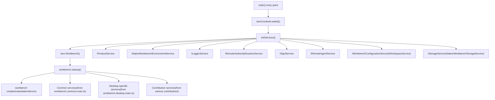
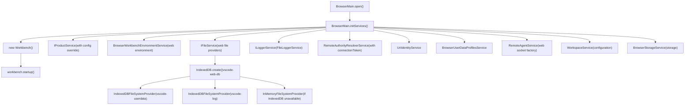
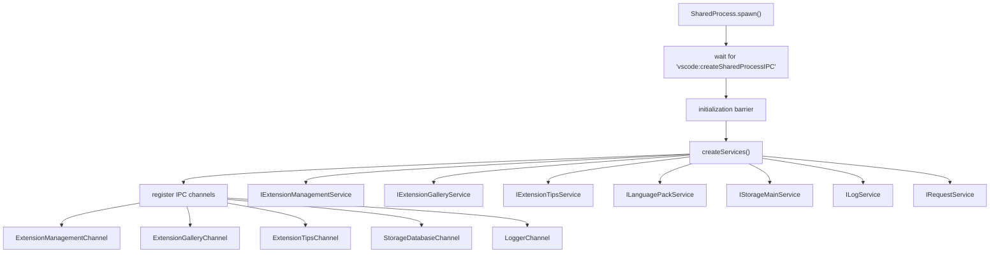

# Service Initialization and Dependency Injection

Relevant source files

-   [build/lib/i18n.resources.json](https://github.com/microsoft/vscode/blob/1be3088d/build/lib/i18n.resources.json)
-   [cli/src/bin/code/legacy\_args.rs](https://github.com/microsoft/vscode/blob/1be3088d/cli/src/bin/code/legacy_args.rs)
-   [resources/completions/bash/code](https://github.com/microsoft/vscode/blob/1be3088d/resources/completions/bash/code)
-   [resources/completions/zsh/\_code](https://github.com/microsoft/vscode/blob/1be3088d/resources/completions/zsh/_code)
-   [src/vs/base/node/terminalEncoding.ts](https://github.com/microsoft/vscode/blob/1be3088d/src/vs/base/node/terminalEncoding.ts)
-   [src/vs/code/browser/workbench/workbench-dev.html](https://github.com/microsoft/vscode/blob/1be3088d/src/vs/code/browser/workbench/workbench-dev.html)
-   [src/vs/code/browser/workbench/workbench.html](https://github.com/microsoft/vscode/blob/1be3088d/src/vs/code/browser/workbench/workbench.html)
-   [src/vs/code/browser/workbench/workbench.ts](https://github.com/microsoft/vscode/blob/1be3088d/src/vs/code/browser/workbench/workbench.ts)
-   [src/vs/code/electron-main/app.ts](https://github.com/microsoft/vscode/blob/1be3088d/src/vs/code/electron-main/app.ts)
-   [src/vs/code/electron-main/main.ts](https://github.com/microsoft/vscode/blob/1be3088d/src/vs/code/electron-main/main.ts)
-   [src/vs/code/node/cli.ts](https://github.com/microsoft/vscode/blob/1be3088d/src/vs/code/node/cli.ts)
-   [src/vs/code/node/cliProcessMain.ts](https://github.com/microsoft/vscode/blob/1be3088d/src/vs/code/node/cliProcessMain.ts)
-   [src/vs/platform/environment/common/argv.ts](https://github.com/microsoft/vscode/blob/1be3088d/src/vs/platform/environment/common/argv.ts)
-   [src/vs/platform/environment/common/environment.ts](https://github.com/microsoft/vscode/blob/1be3088d/src/vs/platform/environment/common/environment.ts)
-   [src/vs/platform/environment/common/environmentService.ts](https://github.com/microsoft/vscode/blob/1be3088d/src/vs/platform/environment/common/environmentService.ts)
-   [src/vs/platform/environment/electron-main/environmentMainService.ts](https://github.com/microsoft/vscode/blob/1be3088d/src/vs/platform/environment/electron-main/environmentMainService.ts)
-   [src/vs/platform/environment/node/argv.ts](https://github.com/microsoft/vscode/blob/1be3088d/src/vs/platform/environment/node/argv.ts)
-   [src/vs/platform/environment/node/argvHelper.ts](https://github.com/microsoft/vscode/blob/1be3088d/src/vs/platform/environment/node/argvHelper.ts)
-   [src/vs/platform/environment/node/environmentService.ts](https://github.com/microsoft/vscode/blob/1be3088d/src/vs/platform/environment/node/environmentService.ts)
-   [src/vs/platform/environment/node/stdin.ts](https://github.com/microsoft/vscode/blob/1be3088d/src/vs/platform/environment/node/stdin.ts)
-   [src/vs/platform/extensionManagement/common/extensionManagementCLI.ts](https://github.com/microsoft/vscode/blob/1be3088d/src/vs/platform/extensionManagement/common/extensionManagementCLI.ts)
-   [src/vs/server/node/remoteExtensionHostAgentCli.ts](https://github.com/microsoft/vscode/blob/1be3088d/src/vs/server/node/remoteExtensionHostAgentCli.ts)
-   [src/vs/server/node/server.cli.ts](https://github.com/microsoft/vscode/blob/1be3088d/src/vs/server/node/server.cli.ts)
-   [src/vs/server/node/serverEnvironmentService.ts](https://github.com/microsoft/vscode/blob/1be3088d/src/vs/server/node/serverEnvironmentService.ts)
-   [src/vs/server/node/serverServices.ts](https://github.com/microsoft/vscode/blob/1be3088d/src/vs/server/node/serverServices.ts)
-   [src/vs/workbench/browser/web.api.ts](https://github.com/microsoft/vscode/blob/1be3088d/src/vs/workbench/browser/web.api.ts)
-   [src/vs/workbench/browser/web.factory.ts](https://github.com/microsoft/vscode/blob/1be3088d/src/vs/workbench/browser/web.factory.ts)
-   [src/vs/workbench/browser/web.main.ts](https://github.com/microsoft/vscode/blob/1be3088d/src/vs/workbench/browser/web.main.ts)
-   [src/vs/workbench/electron-browser/desktop.main.ts](https://github.com/microsoft/vscode/blob/1be3088d/src/vs/workbench/electron-browser/desktop.main.ts)
-   [src/vs/workbench/services/environment/browser/environmentService.ts](https://github.com/microsoft/vscode/blob/1be3088d/src/vs/workbench/services/environment/browser/environmentService.ts)
-   [src/vs/workbench/services/environment/common/environmentService.ts](https://github.com/microsoft/vscode/blob/1be3088d/src/vs/workbench/services/environment/common/environmentService.ts)
-   [src/vs/workbench/services/environment/electron-browser/environmentService.ts](https://github.com/microsoft/vscode/blob/1be3088d/src/vs/workbench/services/environment/electron-browser/environmentService.ts)
-   [src/vs/workbench/services/extensions/electron-browser/nativeExtensionService.ts](https://github.com/microsoft/vscode/blob/1be3088d/src/vs/workbench/services/extensions/electron-browser/nativeExtensionService.ts)
-   [src/vs/workbench/workbench.common.main.ts](https://github.com/microsoft/vscode/blob/1be3088d/src/vs/workbench/workbench.common.main.ts)
-   [src/vs/workbench/workbench.desktop.main.ts](https://github.com/microsoft/vscode/blob/1be3088d/src/vs/workbench/workbench.desktop.main.ts)
-   [src/vs/workbench/workbench.web.main.ts](https://github.com/microsoft/vscode/blob/1be3088d/src/vs/workbench/workbench.web.main.ts)

This document explains how VS Code initializes services and implements dependency injection across different runtime contexts. For information about the multi-process architecture, see [Multi-Process Architecture](/microsoft/vscode/3.3-multi-process-architecture). For details on specific workbench services, see [Workbench Architecture](/microsoft/vscode/4-monaco-editor).

## Overview

VS Code uses a dependency injection (DI) system to manage service instantiation, dependencies, and lifecycle. The system is based on:

-   **ServiceCollection**: A registry mapping service identifiers to implementations
-   **InstantiationService**: Creates service instances and resolves their dependencies
-   **Service Descriptors**: Define how services should be instantiated (immediate vs. lazy)
-   **Service Decorators**: `createDecorator()` creates unique service identifiers

The DI system operates across multiple runtime contexts (main process, renderer, web, CLI, shared process), each with its own service initialization sequence.

## Core Concepts

### Service Collection and Instantiation Service Architecture


Sources: [src/vs/platform/instantiation/common/serviceCollection.ts](https://github.com/microsoft/vscode/blob/1be3088d/src/vs/platform/instantiation/common/serviceCollection.ts) [src/vs/platform/instantiation/common/instantiationService.ts](https://github.com/microsoft/vscode/blob/1be3088d/src/vs/platform/instantiation/common/instantiationService.ts) [src/vs/platform/instantiation/common/descriptors.ts](https://github.com/microsoft/vscode/blob/1be3088d/src/vs/platform/instantiation/common/descriptors.ts)

### Dependency Injection Pattern


Sources: [src/vs/platform/instantiation/common/instantiation.ts](https://github.com/microsoft/vscode/blob/1be3088d/src/vs/platform/instantiation/common/instantiation.ts) [src/vs/platform/instantiation/common/extensions.ts](https://github.com/microsoft/vscode/blob/1be3088d/src/vs/platform/instantiation/common/extensions.ts)

### Service Descriptor Types

| Descriptor Type | Creation Timing | Use Case | Example |
| --- | --- | --- | --- |
| Direct Instance | Immediate (at registration) | Already created, shared instance | `serviceCollection.set(IProductService, productService)` |
| `SyncDescriptor` | Lazy (on first access) | Most services, deferred instantiation | `new SyncDescriptor(FileService)` |
| `SyncDescriptor` with `supportsDelayedInstantiation: true` | Lazy (on first access after delay) | Optional optimization | `new SyncDescriptor(MyService, [], true)` |
| `registerSingleton` | Lazy (global registration) | Common services shared across contexts | `registerSingleton(ILogService, LogService)` |

Sources: [src/vs/platform/instantiation/common/descriptors.ts11-52](https://github.com/microsoft/vscode/blob/1be3088d/src/vs/platform/instantiation/common/descriptors.ts#L11-L52) [src/vs/platform/instantiation/common/extensions.ts53-98](https://github.com/microsoft/vscode/blob/1be3088d/src/vs/platform/instantiation/common/extensions.ts#L53-L98)

## Service Registration Patterns

### Pattern 1: Direct Instance Registration

Used when a service is already instantiated or needs immediate initialization:

```
// Create service immediately
const productService = { _serviceBrand: undefined, ...product };
services.set(IProductService, productService);

// Or with a constructed instance
const environmentService = new EnvironmentMainService(args, productService);
services.set(IEnvironmentMainService, environmentService);
```
Sources: [src/vs/code/electron-main/main.ts168-174](https://github.com/microsoft/vscode/blob/1be3088d/src/vs/code/electron-main/main.ts#L168-L174)

### Pattern 2: Lazy Instantiation with SyncDescriptor

Most services use `SyncDescriptor` for deferred creation:

```
// Service created only when first requested
services.set(IFileService, new SyncDescriptor(FileService, [logService], true));

// Constructor parameters can be provided
services.set(IBackupMainService, new SyncDescriptor(BackupMainService, undefined, true));
```
Sources: [src/vs/code/electron-main/app.ts652-658](https://github.com/microsoft/vscode/blob/1be3088d/src/vs/code/electron-main/app.ts#L652-L658) [src/vs/code/node/cliProcessMain.ts228-237](https://github.com/microsoft/vscode/blob/1be3088d/src/vs/code/node/cliProcessMain.ts#L228-L237)

### Pattern 3: Singleton Registration (Common Services)

Services shared across desktop and web are registered globally using `registerSingleton`:

```
import { registerSingleton } from '../platform/instantiation/common/extensions.js';
import { InstantiationType } from '../platform/instantiation/common/extensions.js';

registerSingleton(IContextKeyService, ContextKeyService, InstantiationType.Delayed);
registerSingleton(IMarkerService, MarkerService, InstantiationType.Delayed);
registerSingleton(IDownloadService, DownloadService, InstantiationType.Delayed);
```
Sources: [src/vs/workbench/workbench.common.main.ts165-181](https://github.com/microsoft/vscode/blob/1be3088d/src/vs/workbench/workbench.common.main.ts#L165-L181)

## Initialization Flows by Runtime Context

### Main Process Service Initialization (Electron)


**Key initialization steps:**

1.  **Bootstrap Services** (`createServices`): Core services that don't have async dependencies
    -   Product service, Environment service, Logger service, File service, State service
2.  **Async Initialization** (`initServices`): Services requiring async setup
    -   State service initialization, Configuration loading, Profile initialization
3.  **Application Services** (`CodeApplication.initServices`): Higher-level services
    -   Backup, Windows management, Storage, Telemetry, Update service

Sources: [src/vs/code/electron-main/main.ts97-160](https://github.com/microsoft/vscode/blob/1be3088d/src/vs/code/electron-main/main.ts#L97-L160) [src/vs/code/electron-main/main.ts162-240](https://github.com/microsoft/vscode/blob/1be3088d/src/vs/code/electron-main/main.ts#L162-L240) [src/vs/code/electron-main/app.ts577-736](https://github.com/microsoft/vscode/blob/1be3088d/src/vs/code/electron-main/app.ts#L577-L736)

### Renderer/Workbench Service Initialization (Desktop)


**Service initialization phases:**

1.  **Early Services**: Created before DOM/workbench, minimal dependencies
2.  **Long-running Services**: Configuration and Storage (require async initialization)
3.  **Workbench Services**: Full service registry created during `workbench.startup()`

Sources: [src/vs/workbench/electron-browser/desktop.main.ts51-160](https://github.com/microsoft/vscode/blob/1be3088d/src/vs/workbench/electron-browser/desktop.main.ts#L51-L160) [src/vs/workbench/browser/workbench.ts89-213](https://github.com/microsoft/vscode/blob/1be3088d/src/vs/workbench/browser/workbench.ts#L89-L213)

### Web Workbench Service Initialization


**Web-specific considerations:**

1.  **IndexedDB for persistence**: User data and logs stored in IndexedDB, with in-memory fallback
2.  **Remote authority resolution**: Connection token management for remote workspaces
3.  **Browser constraints**: No native file system access, different storage mechanisms
4.  **Configuration precedence**: Web configuration overrides product defaults

Sources: [src/vs/workbench/browser/web.main.ts122-444](https://github.com/microsoft/vscode/blob/1be3088d/src/vs/workbench/browser/web.main.ts#L122-L444) [src/vs/workbench/browser/web.main.ts462-506](https://github.com/microsoft/vscode/blob/1be3088d/src/vs/workbench/browser/web.main.ts#L462-L506)

### CLI Process Service Initialization

```mermaid
flowchart TD
    CliMain["CliMain.run()"]
    InitSvc["CliMain.initServices()"]
    InvokeFunc["instantiationService.invokeFunction()"]
    DoRun["CliMain.doRun()"]
    ProductSvc["IProductService"]
    EnvSvc["NativeEnvironmentService(CLI args)"]
    LoggerSvc["ILoggerService"]
    LogSvc["ILogService"]
    FileSvc["IFileService"]
    UriIdentitySvc["IUriIdentityService"]
    StateSvc["StateReadonlyService(read-only state)"]
    ProfilesSvc["UserDataProfilesReadonlyService(read-only profiles)"]
    FileUserDataProvider["FileUserDataProvider(vscode-userdata scheme)"]
    ExtScannerSvc["IExtensionsScannerService"]
    ExtMgmtSvc["INativeServerExtensionManagementService"]
    ExtGallerySvc["IExtensionGalleryService"]
    ExtSignatureSvc["IExtensionSignatureVerificationService"]
    PolicySvc["IPolicyService(platform-specific)"]
    ConfigSvc["ConfigurationService"]
    TelemetrySvc["ITelemetryService(with machine ID)"]
    RequestSvc["IRequestService"]

    CliMain --> InitSvc
    InitSvc --> InvokeFunc
    InvokeFunc --> DoRun
    InitSvc --> ProductSvc
    InitSvc --> EnvSvc
    InitSvc --> LoggerSvc
    InitSvc --> LogSvc
    InitSvc --> FileSvc
    InitSvc --> UriIdentitySvc
    InitSvc --> StateSvc
    InitSvc --> ProfilesSvc
    FileSvc --> FileUserDataProvider
    InitSvc --> ExtScannerSvc
    InitSvc --> ExtMgmtSvc
    InitSvc --> ExtGallerySvc
    InitSvc --> ExtSignatureSvc
    InitSvc --> PolicySvc
    InitSvc --> ConfigSvc
    InitSvc --> TelemetrySvc
    InitSvc --> RequestSvc
```


**CLI-specific patterns:**

1.  **Read-only services**: State and profiles are read-only to avoid conflicts with running instances
2.  **Extension management focus**: CLI primarily manages extensions, so those services are critical
3.  **Minimal UI services**: No workbench or editor services needed
4.  **Platform-specific policy**: Different policy service implementations per platform (Windows registry, macOS defaults, Linux files)

Sources: [src/vs/code/node/cliProcessMain.ts97-269](https://github.com/microsoft/vscode/blob/1be3088d/src/vs/code/node/cliProcessMain.ts#L97-L269)

## Service Registration Order and Dependencies

### Bootstrap Service Order

The initialization order is critical to avoid circular dependencies:

| Phase | Services | Characteristics |
| --- | --- | --- |
| **Phase 1: Foundation** | Product, Environment, Logger | No dependencies, provide configuration |
| **Phase 2: File System** | File Service, File System Providers | Depends on Logger only |
| **Phase 3: State & Profiles** | State Service, URI Identity, User Data Profiles | Depends on File Service |
| **Phase 4: Configuration** | Policy Service, Configuration Service | Depends on File Service, State, Profiles |
| **Phase 5: Remote** | Remote Authority Resolver, Remote Agent | Depends on Configuration |
| **Phase 6: Storage** | Storage Service | Depends on Configuration, Profiles, State |
| **Phase 7: Application** | All other services | Can depend on any earlier phase |

Sources: [src/vs/code/electron-main/main.ts162-240](https://github.com/microsoft/vscode/blob/1be3088d/src/vs/code/electron-main/main.ts#L162-L240) [src/vs/workbench/browser/web.main.ts257-444](https://github.com/microsoft/vscode/blob/1be3088d/src/vs/workbench/browser/web.main.ts#L257-L444)

### Common Service Registration (workbench.common.main.ts)

```mermaid
flowchart TD
    ContextKeyService["IContextKeyServiceContextKeyService"]
    MarkerService["IMarkerServiceMarkerService"]
    DownloadService["IDownloadServiceDownloadService"]
    OpenerService["IOpenerServiceOpenerService"]
    TextResourceConfigService["ITextResourceConfigurationService"]
    MarkerDecorationsService["IMarkerDecorationsService"]
    GlobalExtEnablementService["IGlobalExtensionEnablementService"]
    AllowedExtensionsService["IAllowedExtensionsService"]
    ExtensionStorageService["IExtensionStorageService"]
    UserDataSyncLogService["IUserDataSyncLogService"]
    IgnoredExtensionsMgmtService["IIgnoredExtensionsManagementService"]
    ContextViewService["IContextViewService"]
    ListService["IListService"]
    RegisterSingleton["registerSingleton()(InstantiationType.Delayed)"]

    ContextKeyService --> RegisterSingleton
    MarkerService --> RegisterSingleton
    DownloadService --> RegisterSingleton
    OpenerService --> RegisterSingleton
    TextResourceConfigService --> RegisterSingleton
    MarkerDecorationsService --> RegisterSingleton
    GlobalExtEnablementService --> RegisterSingleton
    AllowedExtensionsService --> RegisterSingleton
    ExtensionStorageService --> RegisterSingleton
    UserDataSyncLogService --> RegisterSingleton
    IgnoredExtensionsMgmtService --> RegisterSingleton
    ContextViewService --> RegisterSingleton
    ListService --> RegisterSingleton
```


These services are registered in `workbench.common.main.ts` and loaded automatically when the workbench starts. They are shared between desktop and web.

Sources: [src/vs/workbench/workbench.common.main.ts136-181](https://github.com/microsoft/vscode/blob/1be3088d/src/vs/workbench/workbench.common.main.ts#L136-L181)

## Service Lifecycle and Access Patterns

### Creating Service Instances

The `InstantiationService` provides multiple ways to create instances:

```
// Method 1: Create an instance with dependencies injected
const myService = instantiationService.createInstance(MyService);

// Method 2: Create with additional arguments
const myService = instantiationService.createInstance(MyService, arg1, arg2);

// Method 3: Invoke a function with service injection
instantiationService.invokeFunction(accessor => {
  const logService = accessor.get(ILogService);
  const fileService = accessor.get(IFileService);
  // Use services...
});

// Method 4: Create a child instantiation service with additional services
const child = instantiationService.createChild(new ServiceCollection([
  [IMyService, myServiceInstance]
]));
```
Sources: [src/vs/platform/instantiation/common/instantiation.ts99-129](https://github.com/microsoft/vscode/blob/1be3088d/src/vs/platform/instantiation/common/instantiation.ts#L99-L129)

### Service Access in Code

Services are accessed via constructor injection or `ServicesAccessor`:

```
// Pattern 1: Constructor injection (preferred)
class MyClass {
  constructor(
    @ILogService private readonly logService: ILogService,
    @IFileService private readonly fileService: IFileService
  ) {
    this.logService.info('MyClass created');
  }
}

// Pattern 2: ServicesAccessor (for functions)
function myFunction(accessor: ServicesAccessor) {
  const logService = accessor.get(ILogService);
  logService.info('Function called');
}

// Pattern 3: Manual service collection access (rare)
const logService = serviceCollection.get(ILogService);
```
Sources: [src/vs/platform/instantiation/common/instantiation.ts69-97](https://github.com/microsoft/vscode/blob/1be3088d/src/vs/platform/instantiation/common/instantiation.ts#L69-L97)

### Shared Process Service Initialization


The shared process runs background services that are shared across all windows. Services are exposed via IPC channels for communication with renderer processes.

Sources: [src/vs/platform/sharedProcess/electron-main/sharedProcess.ts53-145](https://github.com/microsoft/vscode/blob/1be3088d/src/vs/platform/sharedProcess/electron-main/sharedProcess.ts#L53-L145) [src/vs/code/electron-main/app.ts574-576](https://github.com/microsoft/vscode/blob/1be3088d/src/vs/code/electron-main/app.ts#L574-L576)

## Key Implementation Details

### SyncDescriptor Mechanism

`SyncDescriptor` delays service instantiation until first access:

```
// Definition
class SyncDescriptor<T> {
  constructor(
    readonly ctor: new (...args: any[]) => T,
    readonly staticArguments: any[] = [],
    readonly supportsDelayedInstantiation: boolean = false
  ) {}
}

// Usage
services.set(IFileService, new SyncDescriptor(FileService, [logService], true));

// When instantiationService.get(IFileService) is called:
// 1. Reads constructor parameters from FileService
// 2. Resolves each @IServiceName parameter from the service collection
// 3. Calls new FileService(...resolvedDependencies, ...staticArguments)
// 4. Caches the result for subsequent calls
```
Sources: [src/vs/platform/instantiation/common/descriptors.ts11-52](https://github.com/microsoft/vscode/blob/1be3088d/src/vs/platform/instantiation/common/descriptors.ts#L11-L52)

### Service Identifier Creation

Service identifiers are created using decorators:

```
// Create a unique service identifier
export interface IMyService {
  _serviceBrand: undefined;
  doSomething(): void;
}

export const IMyService = createDecorator<IMyService>('myService');

// createDecorator generates:
// 1. A unique symbol for the service
// 2. A decorator function for parameter injection
// 3. Type information for the service
```
Sources: [src/vs/platform/instantiation/common/instantiation.ts24-48](https://github.com/microsoft/vscode/blob/1be3088d/src/vs/platform/instantiation/common/instantiation.ts#L24-L48)

### Circular Dependency Prevention

The instantiation service detects circular dependencies:

```
// If ServiceA depends on ServiceB, and ServiceB depends on ServiceA:
// InstantiationService throws: "Cyclic dependency detected: IServiceA -> IServiceB -> IServiceA"

// To break cycles, use accessor pattern:
class ServiceA {
  constructor(@IInstantiationService private readonly instantiationService: IInstantiationService) {
    // Defer ServiceB access until needed
  }

  method() {
    const serviceB = this.instantiationService.invokeFunction(accessor => accessor.get(IServiceB));
  }
}
```
Sources: [src/vs/platform/instantiation/common/instantiationService.ts147-263](https://github.com/microsoft/vscode/blob/1be3088d/src/vs/platform/instantiation/common/instantiationService.ts#L147-L263)

### InstantiationType Enum

Services registered with `registerSingleton` specify their instantiation timing:

```
enum InstantiationType {
  /**
   * Instantiated eagerly when the service collection is created
   */
  Eager = 0,

  /**
   * Instantiated lazily when first requested (default)
   */
  Delayed = 1
}

// Usage
registerSingleton(ILogService, LogService, InstantiationType.Delayed);
```
Most services use `InstantiationType.Delayed` to optimize startup performance.

Sources: [src/vs/platform/instantiation/common/extensions.ts16-31](https://github.com/microsoft/vscode/blob/1be3088d/src/vs/platform/instantiation/common/extensions.ts#L16-L31)

## Summary

VS Code's service initialization and dependency injection system provides:

1.  **Centralized service management** via `ServiceCollection` and `InstantiationService`
2.  **Automatic dependency resolution** through constructor parameter decorators
3.  **Lazy instantiation** via `SyncDescriptor` to optimize startup performance
4.  **Context-specific initialization** with different service sets for main process, renderer, web, and CLI
5.  **Shared service registry** through `registerSingleton` for common services
6.  **Circular dependency detection** to catch configuration errors
7.  **Type-safe service access** via TypeScript interfaces and decorators

The system enables VS Code to bootstrap different runtime contexts with appropriate services while maintaining clean separation of concerns and testability.
