# Monaco Editor

Relevant source files

-   [build/monaco/monaco.d.ts.recipe](https://github.com/microsoft/vscode/blob/1be3088d/build/monaco/monaco.d.ts.recipe)
-   [extensions/vscode-colorize-perf-tests/test/colorize-fixtures/test-treeView.ts](https://github.com/microsoft/vscode/blob/1be3088d/extensions/vscode-colorize-perf-tests/test/colorize-fixtures/test-treeView.ts)
-   [src/vs/editor/browser/config/charWidthReader.ts](https://github.com/microsoft/vscode/blob/1be3088d/src/vs/editor/browser/config/charWidthReader.ts)
-   [src/vs/editor/browser/editorBrowser.ts](https://github.com/microsoft/vscode/blob/1be3088d/src/vs/editor/browser/editorBrowser.ts)
-   [src/vs/editor/browser/view/domLineBreaksComputer.ts](https://github.com/microsoft/vscode/blob/1be3088d/src/vs/editor/browser/view/domLineBreaksComputer.ts)
-   [src/vs/editor/browser/view/renderingContext.ts](https://github.com/microsoft/vscode/blob/1be3088d/src/vs/editor/browser/view/renderingContext.ts)
-   [src/vs/editor/browser/viewParts/contentWidgets/contentWidgets.ts](https://github.com/microsoft/vscode/blob/1be3088d/src/vs/editor/browser/viewParts/contentWidgets/contentWidgets.ts)
-   [src/vs/editor/browser/viewParts/margin/margin.ts](https://github.com/microsoft/vscode/blob/1be3088d/src/vs/editor/browser/viewParts/margin/margin.ts)
-   [src/vs/editor/browser/viewParts/minimap/minimap.ts](https://github.com/microsoft/vscode/blob/1be3088d/src/vs/editor/browser/viewParts/minimap/minimap.ts)
-   [src/vs/editor/browser/viewParts/minimap/minimapCharRenderer.ts](https://github.com/microsoft/vscode/blob/1be3088d/src/vs/editor/browser/viewParts/minimap/minimapCharRenderer.ts)
-   [src/vs/editor/browser/viewParts/minimap/minimapCharRendererFactory.ts](https://github.com/microsoft/vscode/blob/1be3088d/src/vs/editor/browser/viewParts/minimap/minimapCharRendererFactory.ts)
-   [src/vs/editor/browser/viewParts/minimap/minimapCharSheet.ts](https://github.com/microsoft/vscode/blob/1be3088d/src/vs/editor/browser/viewParts/minimap/minimapCharSheet.ts)
-   [src/vs/editor/browser/viewParts/minimap/minimapPreBaked.ts](https://github.com/microsoft/vscode/blob/1be3088d/src/vs/editor/browser/viewParts/minimap/minimapPreBaked.ts)
-   [src/vs/editor/browser/viewParts/overlayWidgets/overlayWidgets.ts](https://github.com/microsoft/vscode/blob/1be3088d/src/vs/editor/browser/viewParts/overlayWidgets/overlayWidgets.ts)
-   [src/vs/editor/browser/viewParts/scrollDecoration/scrollDecoration.ts](https://github.com/microsoft/vscode/blob/1be3088d/src/vs/editor/browser/viewParts/scrollDecoration/scrollDecoration.ts)
-   [src/vs/editor/browser/viewParts/viewZones/viewZones.ts](https://github.com/microsoft/vscode/blob/1be3088d/src/vs/editor/browser/viewParts/viewZones/viewZones.ts)
-   [src/vs/editor/common/config/editorOptions.ts](https://github.com/microsoft/vscode/blob/1be3088d/src/vs/editor/common/config/editorOptions.ts)
-   [src/vs/editor/common/config/fontInfo.ts](https://github.com/microsoft/vscode/blob/1be3088d/src/vs/editor/common/config/fontInfo.ts)
-   [src/vs/editor/common/editorCommon.ts](https://github.com/microsoft/vscode/blob/1be3088d/src/vs/editor/common/editorCommon.ts)
-   [src/vs/editor/common/model.ts](https://github.com/microsoft/vscode/blob/1be3088d/src/vs/editor/common/model.ts)
-   [src/vs/editor/common/model/guidesTextModelPart.ts](https://github.com/microsoft/vscode/blob/1be3088d/src/vs/editor/common/model/guidesTextModelPart.ts)
-   [src/vs/editor/common/model/textModel.ts](https://github.com/microsoft/vscode/blob/1be3088d/src/vs/editor/common/model/textModel.ts)
-   [src/vs/editor/common/modelLineProjectionData.ts](https://github.com/microsoft/vscode/blob/1be3088d/src/vs/editor/common/modelLineProjectionData.ts)
-   [src/vs/editor/common/standalone/standaloneEnums.ts](https://github.com/microsoft/vscode/blob/1be3088d/src/vs/editor/common/standalone/standaloneEnums.ts)
-   [src/vs/editor/common/textModelGuides.ts](https://github.com/microsoft/vscode/blob/1be3088d/src/vs/editor/common/textModelGuides.ts)
-   [src/vs/editor/common/viewLayout/linesLayout.ts](https://github.com/microsoft/vscode/blob/1be3088d/src/vs/editor/common/viewLayout/linesLayout.ts)
-   [src/vs/editor/common/viewLayout/viewLayout.ts](https://github.com/microsoft/vscode/blob/1be3088d/src/vs/editor/common/viewLayout/viewLayout.ts)
-   [src/vs/editor/common/viewLayout/viewLinesViewportData.ts](https://github.com/microsoft/vscode/blob/1be3088d/src/vs/editor/common/viewLayout/viewLinesViewportData.ts)
-   [src/vs/editor/common/viewModel.ts](https://github.com/microsoft/vscode/blob/1be3088d/src/vs/editor/common/viewModel.ts)
-   [src/vs/editor/common/viewModel/minimapTokensColorTracker.ts](https://github.com/microsoft/vscode/blob/1be3088d/src/vs/editor/common/viewModel/minimapTokensColorTracker.ts)
-   [src/vs/editor/common/viewModel/modelLineProjection.ts](https://github.com/microsoft/vscode/blob/1be3088d/src/vs/editor/common/viewModel/modelLineProjection.ts)
-   [src/vs/editor/common/viewModel/monospaceLineBreaksComputer.ts](https://github.com/microsoft/vscode/blob/1be3088d/src/vs/editor/common/viewModel/monospaceLineBreaksComputer.ts)
-   [src/vs/editor/common/viewModel/viewModelDecorations.ts](https://github.com/microsoft/vscode/blob/1be3088d/src/vs/editor/common/viewModel/viewModelDecorations.ts)
-   [src/vs/editor/common/viewModel/viewModelImpl.ts](https://github.com/microsoft/vscode/blob/1be3088d/src/vs/editor/common/viewModel/viewModelImpl.ts)
-   [src/vs/editor/common/viewModel/viewModelLines.ts](https://github.com/microsoft/vscode/blob/1be3088d/src/vs/editor/common/viewModel/viewModelLines.ts)
-   [src/vs/editor/standalone/browser/standaloneCodeEditor.ts](https://github.com/microsoft/vscode/blob/1be3088d/src/vs/editor/standalone/browser/standaloneCodeEditor.ts)
-   [src/vs/editor/standalone/browser/standaloneEditor.ts](https://github.com/microsoft/vscode/blob/1be3088d/src/vs/editor/standalone/browser/standaloneEditor.ts)
-   [src/vs/editor/test/browser/view/minimapCharRenderer.test.ts](https://github.com/microsoft/vscode/blob/1be3088d/src/vs/editor/test/browser/view/minimapCharRenderer.test.ts)
-   [src/vs/editor/test/browser/viewModel/modelLineProjection.test.ts](https://github.com/microsoft/vscode/blob/1be3088d/src/vs/editor/test/browser/viewModel/modelLineProjection.test.ts)
-   [src/vs/editor/test/common/model/modelInjectedText.test.ts](https://github.com/microsoft/vscode/blob/1be3088d/src/vs/editor/test/common/model/modelInjectedText.test.ts)
-   [src/vs/editor/test/common/viewLayout/linesLayout.test.ts](https://github.com/microsoft/vscode/blob/1be3088d/src/vs/editor/test/common/viewLayout/linesLayout.test.ts)
-   [src/vs/editor/test/common/viewModel/lineBreakData.test.ts](https://github.com/microsoft/vscode/blob/1be3088d/src/vs/editor/test/common/viewModel/lineBreakData.test.ts)
-   [src/vs/editor/test/common/viewModel/monospaceLineBreaksComputer.test.ts](https://github.com/microsoft/vscode/blob/1be3088d/src/vs/editor/test/common/viewModel/monospaceLineBreaksComputer.test.ts)
-   [src/vs/monaco.d.ts](https://github.com/microsoft/vscode/blob/1be3088d/src/vs/monaco.d.ts)

The Monaco Editor is the core text editing engine that powers VS Code. It provides rich text editing capabilities including syntax highlighting, IntelliSense, diff editing, and customizable rendering. Monaco can be used standalone in web applications or as the foundation for VS Code's editing features.

For information about how Monaco integrates into the VS Code Workbench UI framework, see [Workbench Architecture](/microsoft/vscode/5-workbench-architecture). For extension API integration, see [Extension System](/microsoft/vscode/6-extension-system).

## Purpose and Scope

Monaco Editor provides:

-   Text buffer management and editing operations
-   Model-View-ViewModel architecture for efficient rendering
-   Line breaking, wrapping, and viewport management
-   Decorations system for visual annotations
-   Widget system for inline UI elements
-   Standalone API for embedding in web applications
-   Diff editor for side-by-side comparison

This document covers Monaco's internal architecture, API surface, and core subsystems. It does not cover language features (syntax highlighting, IntelliSense) which are provided through separate language services.

## Architecture Overview

Monaco follows a Model-View-ViewModel (MVVM) pattern with clear separation between data, presentation logic, and rendering.

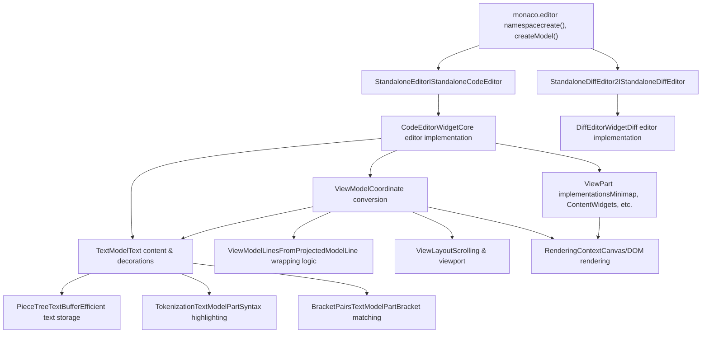
**Key Architecture Principles:**

| Layer | Responsibility | Key Classes |
| --- | --- | --- |
| **Public API** | Standalone editor creation and configuration | `monaco.editor.*`, `StandaloneEditor` |
| **Editor Widget** | User interaction, event handling, coordination | `CodeEditorWidget`, `DiffEditorWidget` |
| **Model** | Text storage, editing operations, decorations | `TextModel`, `PieceTreeTextBuffer` |
| **ViewModel** | Line wrapping, coordinate mapping, viewport management | `ViewModel`, `ViewModelLines`, `ViewLayout` |
| **View** | Rendering, visual elements, widgets | `ViewPart`, `Minimap`, `ContentWidgets` |

Sources: [src/vs/monaco.d.ts1-943](https://github.com/microsoft/vscode/blob/1be3088d/src/vs/monaco.d.ts#L1-L943) [src/vs/editor/browser/editorBrowser.ts1-100](https://github.com/microsoft/vscode/blob/1be3088d/src/vs/editor/browser/editorBrowser.ts#L1-L100) [src/vs/editor/common/model.ts1-50](https://github.com/microsoft/vscode/blob/1be3088d/src/vs/editor/common/model.ts#L1-L50) [src/vs/editor/common/viewModel/viewModelImpl.ts51-180](https://github.com/microsoft/vscode/blob/1be3088d/src/vs/editor/common/viewModel/viewModelImpl.ts#L51-L180) [src/vs/editor/standalone/browser/standaloneEditor.ts1-52](https://github.com/microsoft/vscode/blob/1be3088d/src/vs/editor/standalone/browser/standaloneEditor.ts#L1-L52)

## Public API and Editor Creation

The Monaco Editor exposes a public API through the `monaco.editor` namespace for creating and managing editor instances.

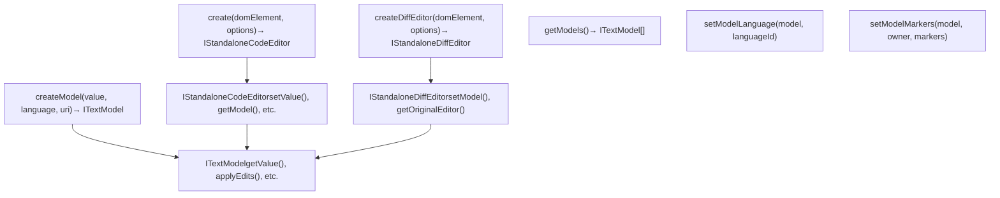
**Editor Creation Flow:**

1.  **Create Editor Instance**: Call `monaco.editor.create(domElement, options)` with a DOM container
2.  **Instantiation Services**: `StandaloneServices.initialize()` sets up dependency injection
3.  **Widget Construction**: Creates `StandaloneEditor` which wraps `CodeEditorWidget`
4.  **Model Creation**: Optionally create or attach an `ITextModel` via `createModel()` or constructor options
5.  **Configuration**: Apply `IStandaloneEditorConstructionOptions` including theme, language, layout settings

**Key API Functions:**

| Function | Purpose | Returns |
| --- | --- | --- |
| `create()` | Create code editor | `IStandaloneCodeEditor` |
| `createDiffEditor()` | Create diff editor | `IStandaloneDiffEditor` |
| `createModel()` | Create text model | `ITextModel` |
| `setModelLanguage()` | Change model language | `void` |
| `setTheme()` | Apply color theme | `void` |
| `getEditors()` | Get all editor instances | `readonly ICodeEditor[]` |
| `onDidCreateEditor()` | Listen for editor creation | `IDisposable` |

Sources: [src/vs/monaco.d.ts945-1156](https://github.com/microsoft/vscode/blob/1be3088d/src/vs/monaco.d.ts#L945-L1156) [src/vs/editor/standalone/browser/standaloneEditor.ts44-106](https://github.com/microsoft/vscode/blob/1be3088d/src/vs/editor/standalone/browser/standaloneEditor.ts#L44-L106) [src/vs/editor/standalone/browser/standaloneCodeEditor.ts48-91](https://github.com/microsoft/vscode/blob/1be3088d/src/vs/editor/standalone/browser/standaloneCodeEditor.ts#L48-L91)

## Text Model Architecture

The `TextModel` class manages the document's text content, decorations, and provides editing operations. It uses a piece tree data structure for efficient text manipulation.

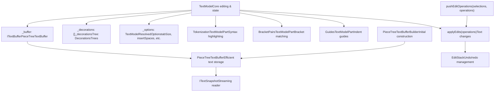
**TextModel Key Responsibilities:**

| Responsibility | Implementation | Location |
| --- | --- | --- |
| **Text Storage** | Piece tree for efficient inserts/deletes | `PieceTreeTextBuffer` |
| **Line Access** | Get line content, length, count | `getLineContent()`, `getLineCount()` |
| **Editing** | Apply text changes, track versions | `applyEdits()`, `pushEditOperations()` |
| **Decorations** | Visual annotations (highlights, errors, etc.) | `deltaDecorations()`, `_decorationsTree` |
| **Tokenization** | Syntax highlighting tokens | `TokenizationTextModelPart` |
| **Bracket Matching** | Bracket pair colorization | `BracketPairsTextModelPart` |
| **Undo/Redo** | Edit history management | `EditStack` |

**Text Buffer - Piece Tree:**

The `PieceTreeTextBuffer` class provides efficient text manipulation:

-   Stores text in immutable "pieces" forming a balanced tree
-   O(log n) insertion, deletion, and random access
-   Preserves original + added text buffers, references pieces
-   Supports efficient line-by-line access and full-text retrieval

Sources: [src/vs/editor/common/model/textModel.ts185-434](https://github.com/microsoft/vscode/blob/1be3088d/src/vs/editor/common/model/textModel.ts#L185-L434) [src/vs/editor/common/model.ts600-800](https://github.com/microsoft/vscode/blob/1be3088d/src/vs/editor/common/model.ts#L600-L800) [src/vs/editor/common/model/pieceTreeTextBuffer/pieceTreeTextBuffer.ts1-100](https://github.com/microsoft/vscode/blob/1be3088d/src/vs/editor/common/model/pieceTreeTextBuffer/pieceTreeTextBuffer.ts#L1-L100)

## View Model and Coordinate Conversion

The `ViewModel` sits between the `TextModel` and the rendering layer, handling line wrapping, hidden areas, and coordinate conversion between model positions and view positions.

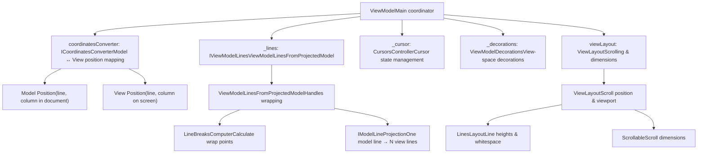
**ViewModel Responsibilities:**

| Responsibility | Component | Key Methods |
| --- | --- | --- |
| **Line Wrapping** | `ViewModelLinesFromProjectedModel` | `setWrappingSettings()`, `createLineBreaksComputer()` |
| **Coordinate Mapping** | `ICoordinatesConverter` | `convertModelPositionToViewPosition()`, `convertViewPositionToModelPosition()` |
| **Viewport Management** | `ViewLayout` | `getLinesViewportData()`, `getCurrentScrollTop()` |
| **Hidden Areas** | `ViewModelLines` | `setHiddenAreas()`, range folding |
| **View Decorations** | `ViewModelDecorations` | Maps model decorations to view coordinates |
| **Cursor Management** | `CursorsController` | Tracks cursor state in view coordinates |

**Line Breaking and Wrapping:**

Monaco supports two line breaking strategies:

1.  **Monospace Font Optimization** (`MonospaceLineBreaksComputer`):

    -   Fast character-width calculations for monospace fonts
    -   Uses fixed-width character measurements
    -   Breaks at character boundaries based on wrap column
2.  **DOM-Based Breaking** (`DOMLineBreaksComputerFactory`):

    -   Accurate for proportional fonts
    -   Measures actual rendered text width using hidden DOM elements
    -   Handles complex scripts, ligatures, variable fonts

Sources: [src/vs/editor/common/viewModel/viewModelImpl.ts51-169](https://github.com/microsoft/vscode/blob/1be3088d/src/vs/editor/common/viewModel/viewModelImpl.ts#L51-L169) [src/vs/editor/common/viewModel/viewModelLines.ts23-100](https://github.com/microsoft/vscode/blob/1be3088d/src/vs/editor/common/viewModel/viewModelLines.ts#L23-L100) [src/vs/editor/common/viewModel/monospaceLineBreaksComputer.ts15-40](https://github.com/microsoft/vscode/blob/1be3088d/src/vs/editor/common/viewModel/monospaceLineBreaksComputer.ts#L15-L40) [src/vs/browser/view/domLineBreaksComputer.ts20-35](https://github.com/microsoft/vscode/blob/1be3088d/src/vs/browser/view/domLineBreaksComputer.ts#L20-L35)

## Editor Configuration and Options

Monaco Editor provides extensive configuration through `IEditorOptions` with over 170 configurable properties.

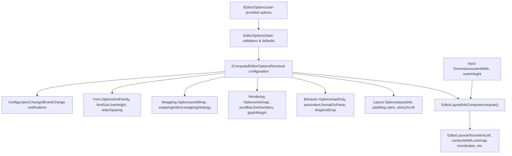
**Configuration Categories:**

| Category | Key Options | Purpose |
| --- | --- | --- |
| **Font** | `fontFamily`, `fontSize`, `fontWeight`, `lineHeight` | Typography settings |
| **Wrapping** | `wordWrap`, `wordWrapColumn`, `wrappingIndent` | Line breaking behavior |
| **Rendering** | `renderWhitespace`, `renderControlCharacters`, `renderLineHighlight` | Visual appearance |
| **Minimap** | `minimap.enabled`, `minimap.size`, `minimap.showSlider` | Minimap configuration |
| **Scrollbar** | `scrollbar.vertical`, `scrollbar.horizontal`, `scrollBeyondLastLine` | Scroll behavior |
| **Editing** | `autoIndent`, `formatOnPaste`, `tabSize`, `insertSpaces` | Edit behavior |
| **Accessibility** | `accessibilitySupport`, `ariaLabel`, `screenReaderAnnounceInlineSuggestion` | A11y features |

**Option Validation and Defaults:**

Each option in `EditorOptions` enum has an associated validator that:

-   Provides default values (e.g., `fontSize: 14`, `tabSize: 4`)
-   Validates user input (e.g., clamps `lineHeight` to reasonable range)
-   Computes derived values (e.g., `layoutInfo` computed from dimensions)
-   Tracks dependencies between options

Sources: [src/vs/editor/common/config/editorOptions.ts53-853](https://github.com/microsoft/vscode/blob/1be3088d/src/vs/editor/common/config/editorOptions.ts#L53-L853) [src/vs/editor/common/config/fontInfo.ts1-100](https://github.com/microsoft/vscode/blob/1be3088d/src/vs/editor/common/config/fontInfo.ts#L1-L100) [src/vs/editor/common/standalone/standaloneEnums.ts176-350](https://github.com/microsoft/vscode/blob/1be3088d/src/vs/editor/common/standalone/standaloneEnums.ts#L176-L350)

## Decorations System

Decorations are visual annotations that can be added to the editor to highlight ranges, show diagnostics, render inline widgets, and more.

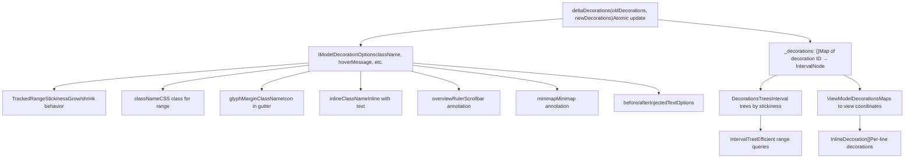
**Decoration Options:**

| Option | Type | Purpose |
| --- | --- | --- |
| `className` | `string` | CSS class for the text range |
| `inlineClassName` | `string` | CSS class inline with text (affects letter spacing) |
| `beforeContentClassName` | `string` | CSS class for pseudo-element before text |
| `afterContentClassName` | `string` | CSS class for pseudo-element after text |
| `glyphMarginClassName` | `string` | Icon in the glyph margin (left gutter) |
| `linesDecorationsClassName` | `string` | Icon in the line decorations area |
| `overviewRuler` | `IModelDecorationOverviewRulerOptions` | Annotation in the overview ruler (scrollbar) |
| `minimap` | `IModelDecorationMinimapOptions` | Annotation in the minimap |
| `hoverMessage` | `IMarkdownString[]` | Tooltip on hover |
| `isWholeLine` | `boolean` | Extend decoration to full line |
| `before` / `after` | `InjectedTextOptions` | Inject text before/after range |
| `stickiness` | `TrackedRangeStickiness` | How decoration grows when typing at edges |

**Tracked Range Stickiness:**

Controls how decorations respond to edits at their boundaries:

-   `AlwaysGrowsWhenTypingAtEdges`: Expands when typing at start or end
-   `NeverGrowsWhenTypingAtEdges`: Never expands
-   `GrowsOnlyWhenTypingBefore`: Expands only when typing before start
-   `GrowsOnlyWhenTypingAfter`: Expands only when typing after end

Sources: [src/vs/editor/common/model.ts91-314](https://github.com/microsoft/vscode/blob/1be3088d/src/vs/editor/common/model.ts#L91-L314) [src/vs/editor/common/model/textModel.ts1200-1500](https://github.com/microsoft/vscode/blob/1be3088d/src/vs/editor/common/model/textModel.ts#L1200-L1500) [src/vs/editor/common/viewModel/viewModelDecorations.ts1-100](https://github.com/microsoft/vscode/blob/1be3088d/src/vs/editor/common/viewModel/viewModelDecorations.ts#L1-L100)

## Widget System

Monaco provides three types of widgets for rendering custom UI elements: content widgets, overlay widgets, and glyph margin widgets.

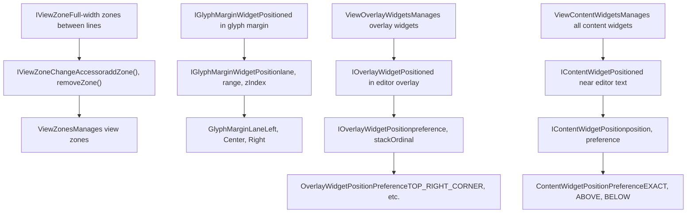
**Widget Types:**

| Widget Type | Use Case | Positioning | Examples |
| --- | --- | --- | --- |
| **Content Widget** | Elements near specific text positions | Relative to editor position (line, column) | IntelliSense widget, parameter hints |
| **Overlay Widget** | Editor-wide UI overlays | Fixed corners or coordinates | Find widget, suggest widget |
| **Glyph Margin Widget** | Icons in the left gutter | Glyph margin lanes (Left, Center, Right) | Breakpoint icons, code lens actions |
| **View Zone** | Full-width areas between lines | After specific line number | Diff decorations, peek view |

**Content Widget Positioning:**

Content widgets are positioned relative to an `IPosition` with preferences:

-   `EXACT`: Place exactly at the position
-   `ABOVE`: Place above the position (preferred for popups)
-   `BELOW`: Place below the position (alternative placement)

The editor attempts to honor preferences but may adjust based on viewport constraints.

**View Zones:**

View zones push content down by inserting full-width areas:

-   `afterLineNumber`: Line after which zone appears
-   `heightInLines` or `heightInPx`: Zone height
-   `domNode`: DOM element to render in zone
-   `suppressMouseDown`: Prevent mouse events from reaching editor

Sources: [src/vs/editor/browser/editorBrowser.ts36-354](https://github.com/microsoft/vscode/blob/1be3088d/src/vs/editor/browser/editorBrowser.ts#L36-L354) [src/vs/editor/browser/viewParts/contentWidgets/contentWidgets.ts25-120](https://github.com/microsoft/vscode/blob/1be3088d/src/vs/editor/browser/viewParts/contentWidgets/contentWidgets.ts#L25-L120) [src/vs/editor/browser/viewParts/overlayWidgets/overlayWidgets.ts1-100](https://github.com/microsoft/vscode/blob/1be3088d/src/vs/editor/browser/viewParts/overlayWidgets/overlayWidgets.ts#L1-L100) [src/vs/editor/browser/viewParts/viewZones/viewZones.ts1-100](https://github.com/microsoft/vscode/blob/1be3088d/src/vs/editor/browser/viewParts/viewZones/viewZones.ts#L1-L100)

## Minimap Rendering

The minimap provides a high-level overview of the entire document with efficient rendering using canvas.

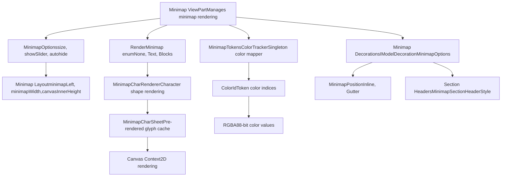
**Minimap Rendering Modes:**

| Mode | Description | Performance | Use Case |
| --- | --- | --- | --- |
| `None` | Minimap disabled | N/A | Maximize editing area |
| `Text` | Render actual characters | Slower, more detail | Small files, high-res displays |
| `Blocks` | Render color blocks | Faster, less detail | Large files, lower-res displays |

**Minimap Layout Computation:**

The minimap's position and size are computed by `EditorLayoutInfoComputer`:

-   `minimapLeft`: X position (right side of editor)
-   `minimapWidth`: Total width including gutter (default ~MINIMAP\_GUTTER\_WIDTH + char width \* max columns)
-   `minimapCanvasInnerWidth/Height`: Canvas backing store dimensions (scaled by `pixelRatio`)
-   `minimapScale`: Zoom factor for characters (0 to 1)
-   `minimapLineHeight`: Height per line in minimap

**Character Rendering:**

For `RenderMinimap.Text` mode:

1.  `MinimapCharRendererFactory.create()` creates renderer for current font scale
2.  Characters are pre-rendered to a cache (`MinimapCharSheet`)
3.  Cache is implemented as a 2D canvas with glyph sprites
4.  During rendering, sprites are copied to main minimap canvas

**Sampling Strategy:**

For very large files (`minimapIsSampling = true`):

-   Not every line is rendered to canvas
-   Lines are sampled at intervals to fit viewport
-   Provides performance optimization for files with thousands of lines

Sources: [src/vs/editor/browser/viewParts/minimap/minimap.ts50-180](https://github.com/microsoft/vscode/blob/1be3088d/src/vs/editor/browser/viewParts/minimap/minimap.ts#L50-L180) [src/vs/editor/browser/viewParts/minimap/minimapCharRenderer.ts1-50](https://github.com/microsoft/vscode/blob/1be3088d/src/vs/editor/browser/viewParts/minimap/minimapCharRenderer.ts#L1-L50) [src/vs/editor/common/config/editorOptions.ts859-900](https://github.com/microsoft/vscode/blob/1be3088d/src/vs/editor/common/config/editorOptions.ts#L859-L900)

## Standalone Editor Usage

Monaco can be embedded in web applications using the standalone API, independent of VS Code.

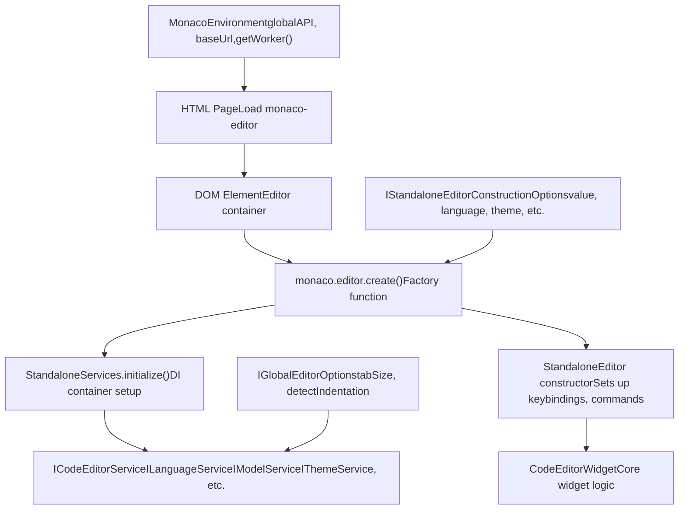
**Standalone Editor Setup:**

1.  **Include Monaco Editor:**

    ```
    <script src="monaco-editor/min/vs/loader.js"></script>
    ```

2.  **Configure Environment:**

    ```
    window.MonacoEnvironment = {
        getWorker: function(workerId, label) {
            return new Worker('monaco-editor/min/vs/base/worker/workerMain.js');
        }
    };
    ```

3.  **Create Editor:**

    ```
    require(['vs/editor/editor.main'], function() {
        const editor = monaco.editor.create(document.getElementById('container'), {
            value: 'console.log("hello");',
            language: 'javascript',
            theme: 'vs-dark'
        });
    });
    ```


**Standalone vs. Workbench:**

| Aspect | Standalone | Workbench (VS Code) |
| --- | --- | --- |
| **Services** | Minimal set (`StandaloneServices`) | Full set (file system, extensions, etc.) |
| **Keybindings** | `StandaloneKeybindingService` | `WorkbenchKeybindingService` |
| **Themes** | `StandaloneThemeService` | Full theme system with contributions |
| **Commands** | Basic command registry | Full command palette, menus |
| **Context** | Simple context key service | Rich context with extensions |
| **Size** | Smaller bundle (~2-3 MB minified) | Larger application |

**Web Worker Integration:**

Monaco uses web workers for expensive operations:

-   Language tokenization
-   Diff computation
-   Code formatting

The `getWorker()` function in `MonacoEnvironment` controls worker creation, allowing custom worker loaders or CDN paths.

Sources: [src/vs/editor/standalone/browser/standaloneEditor.ts44-300](https://github.com/microsoft/vscode/blob/1be3088d/src/vs/editor/standalone/browser/standaloneEditor.ts#L44-L300) [src/vs/editor/standalone/browser/standaloneCodeEditor.ts140-250](https://github.com/microsoft/vscode/blob/1be3088d/src/vs/editor/standalone/browser/standaloneCodeEditor.ts#L140-L250) [src/vs/editor/standalone/browser/standaloneServices.ts1-100](https://github.com/microsoft/vscode/blob/1be3088d/src/vs/editor/standalone/browser/standaloneServices.ts#L1-L100) [src/vs/monaco.d.ts7-86](https://github.com/microsoft/vscode/blob/1be3088d/src/vs/monaco.d.ts#L7-L86)

## Diff Editor

The Diff Editor displays side-by-side or inline comparison of two text models, highlighting changes.

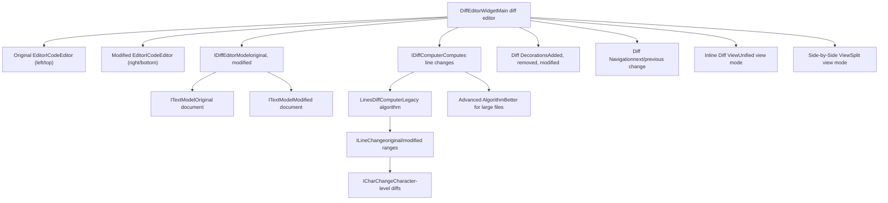
**Diff Editor Configuration:**

| Option | Values | Description |
| --- | --- | --- |
| `renderSideBySide` | `boolean` | Side-by-side vs. inline view |
| `ignoreTrimWhitespace` | `boolean` | Ignore leading/trailing whitespace |
| `renderIndicators` | `boolean` | Show +/- indicators for changes |
| `maxComputationTime` | `number` | Timeout for diff computation (ms) |
| `diffAlgorithm` | `'legacy'` | `'advanced'` | Algorithm choice |
| `originalEditable` | `boolean` | Allow editing original document |
| `diffCodeLens` | `boolean` | Show code lens in diff |
| `hideUnchangedRegions` | `object` | Collapse unchanged sections |

**Diff Computation:**

The diff algorithm operates in stages:

1.  **Line-level diff**: Identify added, removed, modified lines
2.  **Character-level diff**: Within modified lines, find exact character changes
3.  **Move detection** (experimental): Detect when code is moved rather than deleted+added
4.  **Unchanged region detection**: Collapse large sections without changes

**Diff Decorations:**

Different decoration classes mark changes:

-   `char-insert`: Character inserted
-   `char-delete`: Character deleted
-   `line-insert`: Line inserted
-   `line-delete`: Line deleted
-   `diff-moved-border`: Moved code detection

Sources: [src/vs/editor/browser/widget/diffEditor/diffEditorWidget.ts1-100](https://github.com/microsoft/vscode/blob/1be3088d/src/vs/editor/browser/widget/diffEditor/diffEditorWidget.ts#L1-L100) [src/vs/editor/common/config/editorOptions.ts861-998](https://github.com/microsoft/vscode/blob/1be3088d/src/vs/editor/common/config/editorOptions.ts#L861-L998) [src/vs/editor/common/diff/legacyLinesDiffComputer.ts1-50](https://github.com/microsoft/vscode/blob/1be3088d/src/vs/editor/common/diff/legacyLinesDiffComputer.ts#L1-L50)

## Rendering Pipeline

Monaco's rendering is optimized for performance with viewport-based rendering and incremental updates.

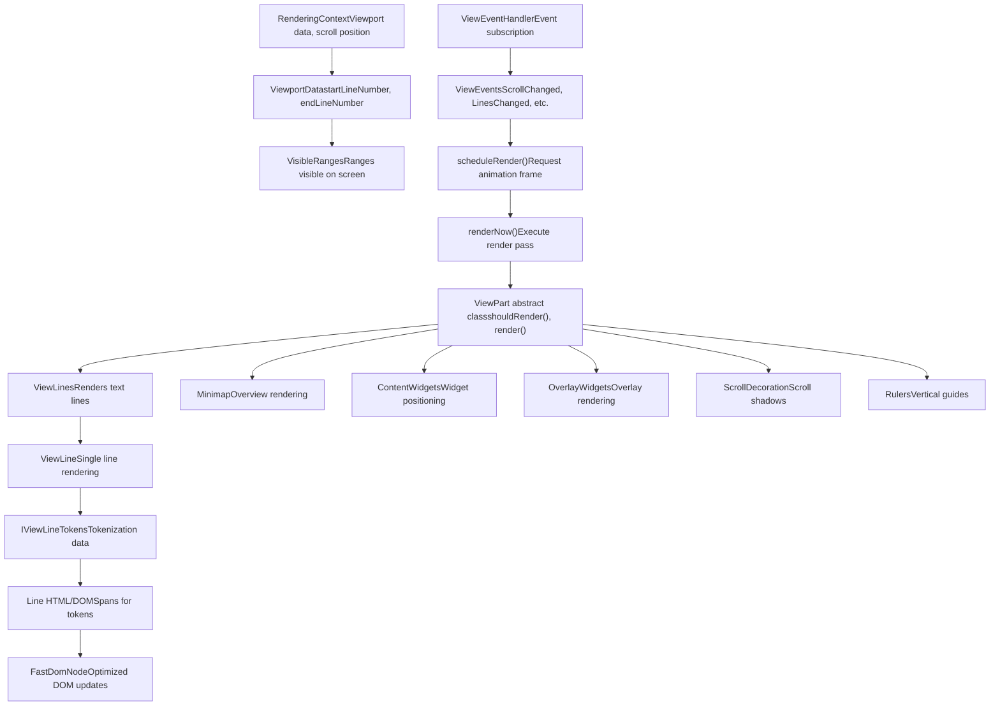
**Rendering Optimizations:**

| Optimization | Description | Benefit |
| --- | --- | --- |
| **Viewport Culling** | Only render visible lines | Handles files with millions of lines |
| **FastDomNode** | Batch DOM updates, cache attribute values | Minimize layout thrashing |
| **RAF Scheduling** | Use `requestAnimationFrame` for rendering | Smooth 60 FPS rendering |
| **Incremental Updates** | Only re-render changed parts | Fast updates on typing |
| **Canvas for Minimap** | Use 2D canvas instead of DOM | Efficient minimap rendering |
| **Line Caching** | Cache rendered line DOM | Avoid re-rendering unchanged lines |

**Rendering Pass:**

1.  **Event Reception**: View receives model/configuration change events
2.  **Invalidation**: Mark affected view parts for re-render (`setShouldRender()`)
3.  **Schedule**: Request animation frame for next render pass
4.  **Prepare**: Compute viewport data, line ranges, scroll positions
5.  **Render**: Each `ViewPart` renders its portion (lines, minimap, widgets, etc.)
6.  **DOM Update**: `FastDomNode` applies batched DOM changes
7.  **Complete**: Rendering complete, ready for next change

Sources: [src/vs/editor/browser/view/renderingContext.ts1-100](https://github.com/microsoft/vscode/blob/1be3088d/src/vs/editor/browser/view/renderingContext.ts#L1-L100) [src/vs/editor/browser/view/viewPart.ts1-50](https://github.com/microsoft/vscode/blob/1be3088d/src/vs/editor/browser/view/viewPart.ts#L1-L50) [src/vs/editor/common/viewEvents.ts1-100](https://github.com/microsoft/vscode/blob/1be3088d/src/vs/editor/common/viewEvents.ts#L1-L100) [src/vs/base/browser/fastDomNode.ts1-50](https://github.com/microsoft/vscode/blob/1be3088d/src/vs/base/browser/fastDomNode.ts#L1-L50)
