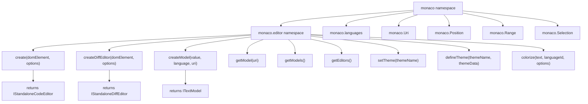
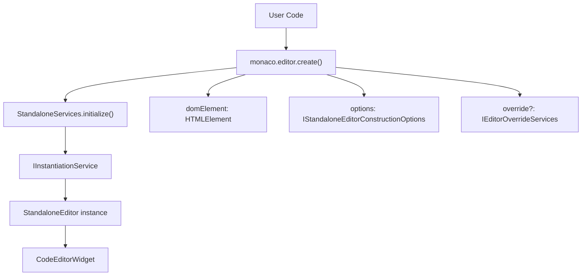
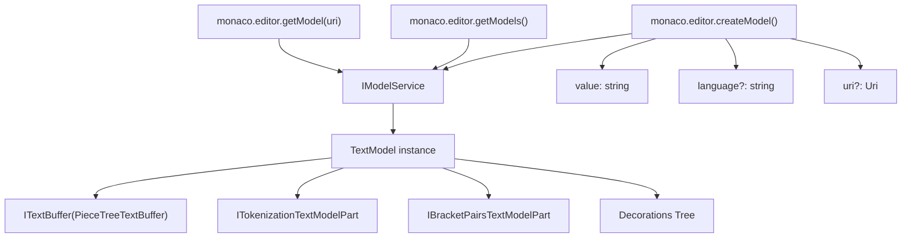
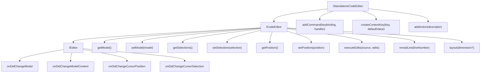
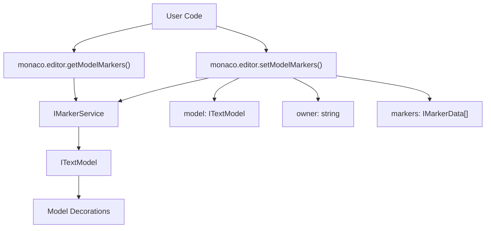
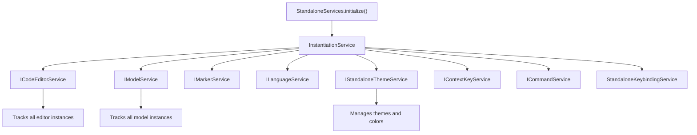

# Monaco Editor API and Standalone Usage

Relevant source files

-   [build/monaco/monaco.d.ts.recipe](https://github.com/microsoft/vscode/blob/1be3088d/build/monaco/monaco.d.ts.recipe)
-   [extensions/vscode-colorize-perf-tests/test/colorize-fixtures/test-treeView.ts](https://github.com/microsoft/vscode/blob/1be3088d/extensions/vscode-colorize-perf-tests/test/colorize-fixtures/test-treeView.ts)
-   [src/vs/editor/browser/config/charWidthReader.ts](https://github.com/microsoft/vscode/blob/1be3088d/src/vs/editor/browser/config/charWidthReader.ts)
-   [src/vs/editor/browser/editorBrowser.ts](https://github.com/microsoft/vscode/blob/1be3088d/src/vs/editor/browser/editorBrowser.ts)
-   [src/vs/editor/browser/view/domLineBreaksComputer.ts](https://github.com/microsoft/vscode/blob/1be3088d/src/vs/editor/browser/view/domLineBreaksComputer.ts)
-   [src/vs/editor/browser/view/renderingContext.ts](https://github.com/microsoft/vscode/blob/1be3088d/src/vs/editor/browser/view/renderingContext.ts)
-   [src/vs/editor/browser/viewParts/contentWidgets/contentWidgets.ts](https://github.com/microsoft/vscode/blob/1be3088d/src/vs/editor/browser/viewParts/contentWidgets/contentWidgets.ts)
-   [src/vs/editor/browser/viewParts/margin/margin.ts](https://github.com/microsoft/vscode/blob/1be3088d/src/vs/editor/browser/viewParts/margin/margin.ts)
-   [src/vs/editor/browser/viewParts/minimap/minimap.ts](https://github.com/microsoft/vscode/blob/1be3088d/src/vs/editor/browser/viewParts/minimap/minimap.ts)
-   [src/vs/editor/browser/viewParts/minimap/minimapCharRenderer.ts](https://github.com/microsoft/vscode/blob/1be3088d/src/vs/editor/browser/viewParts/minimap/minimapCharRenderer.ts)
-   [src/vs/editor/browser/viewParts/minimap/minimapCharRendererFactory.ts](https://github.com/microsoft/vscode/blob/1be3088d/src/vs/editor/browser/viewParts/minimap/minimapCharRendererFactory.ts)
-   [src/vs/editor/browser/viewParts/minimap/minimapCharSheet.ts](https://github.com/microsoft/vscode/blob/1be3088d/src/vs/editor/browser/viewParts/minimap/minimapCharSheet.ts)
-   [src/vs/editor/browser/viewParts/minimap/minimapPreBaked.ts](https://github.com/microsoft/vscode/blob/1be3088d/src/vs/editor/browser/viewParts/minimap/minimapPreBaked.ts)
-   [src/vs/editor/browser/viewParts/overlayWidgets/overlayWidgets.ts](https://github.com/microsoft/vscode/blob/1be3088d/src/vs/editor/browser/viewParts/overlayWidgets/overlayWidgets.ts)
-   [src/vs/editor/browser/viewParts/scrollDecoration/scrollDecoration.ts](https://github.com/microsoft/vscode/blob/1be3088d/src/vs/editor/browser/viewParts/scrollDecoration/scrollDecoration.ts)
-   [src/vs/editor/browser/viewParts/viewZones/viewZones.ts](https://github.com/microsoft/vscode/blob/1be3088d/src/vs/editor/browser/viewParts/viewZones/viewZones.ts)
-   [src/vs/editor/common/config/editorOptions.ts](https://github.com/microsoft/vscode/blob/1be3088d/src/vs/editor/common/config/editorOptions.ts)
-   [src/vs/editor/common/config/fontInfo.ts](https://github.com/microsoft/vscode/blob/1be3088d/src/vs/editor/common/config/fontInfo.ts)
-   [src/vs/editor/common/editorCommon.ts](https://github.com/microsoft/vscode/blob/1be3088d/src/vs/editor/common/editorCommon.ts)
-   [src/vs/editor/common/model.ts](https://github.com/microsoft/vscode/blob/1be3088d/src/vs/editor/common/model.ts)
-   [src/vs/editor/common/model/guidesTextModelPart.ts](https://github.com/microsoft/vscode/blob/1be3088d/src/vs/editor/common/model/guidesTextModelPart.ts)
-   [src/vs/editor/common/model/textModel.ts](https://github.com/microsoft/vscode/blob/1be3088d/src/vs/editor/common/model/textModel.ts)
-   [src/vs/editor/common/modelLineProjectionData.ts](https://github.com/microsoft/vscode/blob/1be3088d/src/vs/editor/common/modelLineProjectionData.ts)
-   [src/vs/editor/common/standalone/standaloneEnums.ts](https://github.com/microsoft/vscode/blob/1be3088d/src/vs/editor/common/standalone/standaloneEnums.ts)
-   [src/vs/editor/common/textModelGuides.ts](https://github.com/microsoft/vscode/blob/1be3088d/src/vs/editor/common/textModelGuides.ts)
-   [src/vs/editor/common/viewLayout/linesLayout.ts](https://github.com/microsoft/vscode/blob/1be3088d/src/vs/editor/common/viewLayout/linesLayout.ts)
-   [src/vs/editor/common/viewLayout/viewLayout.ts](https://github.com/microsoft/vscode/blob/1be3088d/src/vs/editor/common/viewLayout/viewLayout.ts)
-   [src/vs/editor/common/viewLayout/viewLinesViewportData.ts](https://github.com/microsoft/vscode/blob/1be3088d/src/vs/editor/common/viewLayout/viewLinesViewportData.ts)
-   [src/vs/editor/common/viewModel.ts](https://github.com/microsoft/vscode/blob/1be3088d/src/vs/editor/common/viewModel.ts)
-   [src/vs/editor/common/viewModel/minimapTokensColorTracker.ts](https://github.com/microsoft/vscode/blob/1be3088d/src/vs/editor/common/viewModel/minimapTokensColorTracker.ts)
-   [src/vs/editor/common/viewModel/modelLineProjection.ts](https://github.com/microsoft/vscode/blob/1be3088d/src/vs/editor/common/viewModel/modelLineProjection.ts)
-   [src/vs/editor/common/viewModel/monospaceLineBreaksComputer.ts](https://github.com/microsoft/vscode/blob/1be3088d/src/vs/editor/common/viewModel/monospaceLineBreaksComputer.ts)
-   [src/vs/editor/common/viewModel/viewModelDecorations.ts](https://github.com/microsoft/vscode/blob/1be3088d/src/vs/editor/common/viewModel/viewModelDecorations.ts)
-   [src/vs/editor/common/viewModel/viewModelImpl.ts](https://github.com/microsoft/vscode/blob/1be3088d/src/vs/editor/common/viewModel/viewModelImpl.ts)
-   [src/vs/editor/common/viewModel/viewModelLines.ts](https://github.com/microsoft/vscode/blob/1be3088d/src/vs/editor/common/viewModel/viewModelLines.ts)
-   [src/vs/editor/standalone/browser/standaloneCodeEditor.ts](https://github.com/microsoft/vscode/blob/1be3088d/src/vs/editor/standalone/browser/standaloneCodeEditor.ts)
-   [src/vs/editor/standalone/browser/standaloneEditor.ts](https://github.com/microsoft/vscode/blob/1be3088d/src/vs/editor/standalone/browser/standaloneEditor.ts)
-   [src/vs/editor/test/browser/view/minimapCharRenderer.test.ts](https://github.com/microsoft/vscode/blob/1be3088d/src/vs/editor/test/browser/view/minimapCharRenderer.test.ts)
-   [src/vs/editor/test/browser/viewModel/modelLineProjection.test.ts](https://github.com/microsoft/vscode/blob/1be3088d/src/vs/editor/test/browser/viewModel/modelLineProjection.test.ts)
-   [src/vs/editor/test/common/model/modelInjectedText.test.ts](https://github.com/microsoft/vscode/blob/1be3088d/src/vs/editor/test/common/model/modelInjectedText.test.ts)
-   [src/vs/editor/test/common/viewLayout/linesLayout.test.ts](https://github.com/microsoft/vscode/blob/1be3088d/src/vs/editor/test/common/viewLayout/linesLayout.test.ts)
-   [src/vs/editor/test/common/viewModel/lineBreakData.test.ts](https://github.com/microsoft/vscode/blob/1be3088d/src/vs/editor/test/common/viewModel/lineBreakData.test.ts)
-   [src/vs/editor/test/common/viewModel/monospaceLineBreaksComputer.test.ts](https://github.com/microsoft/vscode/blob/1be3088d/src/vs/editor/test/common/viewModel/monospaceLineBreaksComputer.test.ts)
-   [src/vs/monaco.d.ts](https://github.com/microsoft/vscode/blob/1be3088d/src/vs/monaco.d.ts)

This document covers the Monaco Editor's public API surface and standalone usage patterns. Monaco Editor is the core text editing engine that can be used independently of VS Code's workbench environment. This page focuses on the `monaco` namespace, editor creation, model management, and the standalone editor lifecycle.

For information about the internal text model and view model architecture, see [4.2](/microsoft/vscode/4.2-text-model-and-view-model-architecture). For editor configuration details, see [4.3](/microsoft/vscode/4.3-editor-configuration-and-options).

---

## Monaco Namespace Structure

The Monaco Editor exposes its API through the global `monaco` namespace. The primary entry point is `monaco.editor`, which provides factory functions and utilities for creating and managing editors and models.

**Monaco API Surface Organization**


**Sources:**

-   [src/vs/monaco.d.ts9-943](https://github.com/microsoft/vscode/blob/1be3088d/src/vs/monaco.d.ts#L9-L943)
-   [src/vs/monaco.d.ts945-1244](https://github.com/microsoft/vscode/blob/1be3088d/src/vs/monaco.d.ts#L945-L1244)
-   [src/vs/editor/standalone/browser/standaloneEditor.ts44-106](https://github.com/microsoft/vscode/blob/1be3088d/src/vs/editor/standalone/browser/standaloneEditor.ts#L44-L106)

---

## Editor Creation and Lifecycle

The Monaco Editor provides factory functions for creating standalone editor instances. The primary distinction is between single-file code editors and diff editors.

**Editor Creation Flow**


**Sources:**

-   [src/vs/editor/standalone/browser/standaloneEditor.ts49-52](https://github.com/microsoft/vscode/blob/1be3088d/src/vs/editor/standalone/browser/standaloneEditor.ts#L49-L52)
-   [src/vs/editor/standalone/browser/standaloneCodeEditor.ts186-232](https://github.com/microsoft/vscode/blob/1be3088d/src/vs/editor/standalone/browser/standaloneCodeEditor.ts#L186-L232)

### Creating a Code Editor

The `monaco.editor.create()` function creates a standalone code editor instance:

```
// From monaco.d.ts
function create(
    domElement: HTMLElement,
    options?: IStandaloneEditorConstructionOptions,
    override?: IEditorOverrideServices
): IStandaloneCodeEditor;
```
The function performs the following steps:

1.  Initializes the `StandaloneServices` singleton with any service overrides
2.  Uses the instantiation service to create a `StandaloneEditor` instance
3.  Attaches the editor to the provided DOM element
4.  Returns the `IStandaloneCodeEditor` interface

**Sources:**

-   [src/vs/monaco.d.ts948-952](https://github.com/microsoft/vscode/blob/1be3088d/src/vs/monaco.d.ts#L948-L952)
-   [src/vs/editor/standalone/browser/standaloneEditor.ts49-52](https://github.com/microsoft/vscode/blob/1be3088d/src/vs/editor/standalone/browser/standaloneEditor.ts#L49-L52)
-   [src/vs/editor/standalone/browser/standaloneCodeEditor.ts186-232](https://github.com/microsoft/vscode/blob/1be3088d/src/vs/editor/standalone/browser/standaloneCodeEditor.ts#L186-L232)

### Creating a Diff Editor

The `monaco.editor.createDiffEditor()` function creates a side-by-side diff editor:

```
// From monaco.d.ts
function createDiffEditor(
    domElement: HTMLElement,
    options?: IStandaloneDiffEditorConstructionOptions,
    override?: IEditorOverrideServices
): IStandaloneDiffEditor;
```
Diff editors display two models (original and modified) and compute differences between them.

**Sources:**

-   [src/vs/monaco.d.ts978-982](https://github.com/microsoft/vscode/blob/1be3088d/src/vs/monaco.d.ts#L978-L982)
-   [src/vs/editor/standalone/browser/standaloneEditor.ts98-101](https://github.com/microsoft/vscode/blob/1be3088d/src/vs/editor/standalone/browser/standaloneEditor.ts#L98-L101)

### Editor Event Listeners

The Monaco Editor provides global event listeners for tracking editor creation:

-   `monaco.editor.onDidCreateEditor()` - Fires when any code editor is created
-   `monaco.editor.onDidCreateDiffEditor()` - Fires when any diff editor is created

These events are managed by the `ICodeEditorService`:

**Sources:**

-   [src/vs/monaco.d.ts955-965](https://github.com/microsoft/vscode/blob/1be3088d/src/vs/monaco.d.ts#L955-L965)
-   [src/vs/editor/standalone/browser/standaloneEditor.ts59-75](https://github.com/microsoft/vscode/blob/1be3088d/src/vs/editor/standalone/browser/standaloneEditor.ts#L59-L75)

---

## Text Model Management

Text models (`ITextModel`) represent the document content and are central to the Monaco Editor architecture. Models can be created, retrieved, and managed through the `monaco.editor` namespace.

**Model Creation and Management Flow**


**Sources:**

-   [src/vs/editor/standalone/browser/standaloneEditor.ts175-217](https://github.com/microsoft/vscode/blob/1be3088d/src/vs/editor/standalone/browser/standaloneEditor.ts#L175-L217)
-   [src/vs/editor/common/model/textModel.ts185-418](https://github.com/microsoft/vscode/blob/1be3088d/src/vs/editor/common/model/textModel.ts#L185-L418)

### Creating Models

The `monaco.editor.createModel()` function creates a new text model:

```
// From monaco.d.ts
function createModel(
    value: string,
    language?: string,
    uri?: Uri
): ITextModel;
```
Models are registered with the `IModelService` and can be retrieved by their URI. The language parameter determines syntax highlighting and language-specific features.

**Sources:**

-   [src/vs/monaco.d.ts1031-1034](https://github.com/microsoft/vscode/blob/1be3088d/src/vs/monaco.d.ts#L1031-L1034)
-   [src/vs/editor/standalone/browser/standaloneEditor.ts175-188](https://github.com/microsoft/vscode/blob/1be3088d/src/vs/editor/standalone/browser/standaloneEditor.ts#L175-L188)

### Retrieving Models

Models can be retrieved by URI or enumerated:

-   `monaco.editor.getModel(uri)` - Returns the model with the specified URI, or `null`
-   `monaco.editor.getModels()` - Returns an array of all created models

**Sources:**

-   [src/vs/monaco.d.ts1069-1076](https://github.com/microsoft/vscode/blob/1be3088d/src/vs/monaco.d.ts#L1069-L1076)
-   [src/vs/editor/standalone/browser/standaloneEditor.ts203-211](https://github.com/microsoft/vscode/blob/1be3088d/src/vs/editor/standalone/browser/standaloneEditor.ts#L203-L211)

### Model Events

The Monaco Editor provides events for tracking model lifecycle:

-   `onDidCreateModel` - Fires when a model is created
-   `onWillDisposeModel` - Fires before a model is disposed
-   `onDidChangeModelLanguage` - Fires when a model's language is changed

**Sources:**

-   [src/vs/monaco.d.ts1078-1097](https://github.com/microsoft/vscode/blob/1be3088d/src/vs/monaco.d.ts#L1078-L1097)

---

## ITextModel Interface

The `ITextModel` interface is the core abstraction for document content. It provides methods for reading and modifying text, managing decorations, and handling events.

**ITextModel Core Capabilities**

```mermaid
flowchart TD
    ITextModel["ITextModel"]
    ContentAccess["Content Access"]
    Editing["Editing Operations"]
    Decorations["Decorations"]
    Events["Events"]
    Metadata["Metadata"]
    GetValue["getValue()"]
    GetLineContent["getLineContent(lineNumber)"]
    GetLineCount["getLineCount()"]
    GetValueInRange["getValueInRange(range)"]
    PushEditOperations["pushEditOperations()"]
    ApplyEdits["applyEdits()"]
    SetValue["setValue()"]
    DeltaDecorations["deltaDecorations()"]
    GetDecorations["getDecorations()"]
    OnDidChangeContent["onDidChangeContent"]
    OnDidChangeDecorations["onDidChangeDecorations"]
    OnDidChangeLanguage["onDidChangeLanguage"]
    GetLanguageId["getLanguageId()"]
    GetUri["uri"]
    GetVersionId["getVersionId()"]

    ITextModel --> ContentAccess
    ITextModel --> Editing
    ITextModel --> Decorations
    ITextModel --> Events
    ITextModel --> Metadata
    ContentAccess --> GetValue
    ContentAccess --> GetLineContent
    ContentAccess --> GetLineCount
    ContentAccess --> GetValueInRange
    Editing --> PushEditOperations
    Editing --> ApplyEdits
    Editing --> SetValue
    Decorations --> DeltaDecorations
    Decorations --> GetDecorations
    Events --> OnDidChangeContent
    Events --> OnDidChangeDecorations
    Events --> OnDidChangeLanguage
    Metadata --> GetLanguageId
    Metadata --> GetUri
    Metadata --> GetVersionId
```


**Sources:**

-   [src/vs/editor/common/model.ts517-1076](https://github.com/microsoft/vscode/blob/1be3088d/src/vs/editor/common/model.ts#L517-L1076)

### Content Reading

The `ITextModel` interface provides multiple methods for accessing document content:

| Method | Description |
| --- | --- |
| `getValue()` | Returns the entire document content as a string |
| `getLineContent(lineNumber)` | Returns the content of a specific line |
| `getLineCount()` | Returns the total number of lines |
| `getValueInRange(range, eol?)` | Returns text within a specific range |
| `getWordAtPosition(position)` | Returns the word at a given position |

Line numbers are 1-based, and columns are 1-based (column 1 is before the first character).

**Sources:**

-   [src/vs/editor/common/model.ts600-661](https://github.com/microsoft/vscode/blob/1be3088d/src/vs/editor/common/model.ts#L600-L661)

### Editing Operations

Text modifications are performed through edit operations. The primary method is `pushEditOperations()`, which accepts an array of edit operations and a cursor state computer:

```
interface IIdentifiedSingleEditOperation {
    range: IRange;
    text: string | null;
    forceMoveMarkers?: boolean;
}
```
The model automatically handles:

-   Undo/redo integration
-   Version tracking
-   Decoration updates
-   Event firing

**Sources:**

-   [src/vs/editor/common/model.ts725-771](https://github.com/microsoft/vscode/blob/1be3088d/src/vs/editor/common/model.ts#L725-L771)
-   [src/vs/editor/common/model/textModel.ts1154-1334](https://github.com/microsoft/vscode/blob/1be3088d/src/vs/editor/common/model/textModel.ts#L1154-L1334)

---

## IStandaloneCodeEditor Interface

The `IStandaloneCodeEditor` interface extends `ICodeEditor` with standalone-specific capabilities. This interface is returned by `monaco.editor.create()` and provides the primary API for interacting with the editor.

**Standalone Editor Structure**


**Sources:**

-   [src/vs/editor/browser/editorBrowser.ts1015-1138](https://github.com/microsoft/vscode/blob/1be3088d/src/vs/editor/browser/editorBrowser.ts#L1015-L1138)
-   [src/vs/editor/standalone/browser/standaloneCodeEditor.ts133-184](https://github.com/microsoft/vscode/blob/1be3088d/src/vs/editor/standalone/browser/standaloneCodeEditor.ts#L133-L184)

### Key Editor Methods

The editor provides methods for:

**Model Management:**

-   `getModel()` - Returns the current `ITextModel` or `null`
-   `setModel(model)` - Sets the editor's model

**Cursor and Selection:**

-   `getPosition()` - Returns the primary cursor position
-   `setPosition(position)` - Sets the cursor position
-   `getSelection()` - Returns the primary selection
-   `setSelection(range | selection)` - Sets the selection

**Viewport Control:**

-   `revealLine(lineNumber)` - Scrolls to reveal a line
-   `revealPosition(position)` - Scrolls to reveal a position
-   `revealRange(range)` - Scrolls to reveal a range

**Layout:**

-   `layout(dimension?)` - Triggers a layout computation and re-render

**Sources:**

-   [src/vs/editor/browser/editorBrowser.ts1015-1138](https://github.com/microsoft/vscode/blob/1be3088d/src/vs/editor/browser/editorBrowser.ts#L1015-L1138)

---

## Configuration Options

Standalone editors accept `IStandaloneEditorConstructionOptions` which extends `IEditorOptions` with standalone-specific settings.

**Configuration Categories**

| Category | Key Options |
| --- | --- |
| **Basic Settings** | `value`, `language`, `theme`, `readOnly` |
| **Layout** | `automaticLayout`, `dimension`, `wordWrap` |
| **Minimap** | `minimap.enabled`, `minimap.side`, `minimap.showSlider` |
| **Scrollbar** | `scrollbar.vertical`, `scrollbar.horizontal` |
| **Line Numbers** | `lineNumbers`, `lineNumbersMinChars` |
| **Indentation** | `tabSize`, `insertSpaces`, `detectIndentation` |
| **Suggestions** | `quickSuggestions`, `suggestOnTriggerCharacters` |
| **Rendering** | `renderWhitespace`, `renderControlCharacters` |

**Sources:**

-   [src/vs/editor/common/config/editorOptions.ts53-853](https://github.com/microsoft/vscode/blob/1be3088d/src/vs/editor/common/config/editorOptions.ts#L53-L853)
-   [src/vs/editor/standalone/browser/standaloneCodeEditor.ts96-132](https://github.com/microsoft/vscode/blob/1be3088d/src/vs/editor/standalone/browser/standaloneCodeEditor.ts#L96-L132)

### Global Editor Options

The `IGlobalEditorOptions` interface defines settings that apply across all editor instances:

```
interface IGlobalEditorOptions {
    tabSize?: number;
    insertSpaces?: boolean;
    detectIndentation?: boolean;
    trimAutoWhitespace?: boolean;
    largeFileOptimizations?: boolean;
    wordBasedSuggestions?: 'off' | 'currentDocument' | 'matchingDocuments' | 'allDocuments';
}
```
These are set through `monaco.editor.updateOptions()`.

**Sources:**

-   [src/vs/editor/standalone/browser/standaloneCodeEditor.ts96-132](https://github.com/microsoft/vscode/blob/1be3088d/src/vs/editor/standalone/browser/standaloneCodeEditor.ts#L96-L132)
-   [src/vs/editor/standalone/browser/standaloneEditor.ts248-273](https://github.com/microsoft/vscode/blob/1be3088d/src/vs/editor/standalone/browser/standaloneEditor.ts#L248-L273)

---

## Markers and Diagnostics

The Monaco Editor includes a marker (diagnostics) system for displaying errors, warnings, and other annotations.

**Marker Management**


**Sources:**

-   [src/vs/monaco.d.ts1042-1060](https://github.com/microsoft/vscode/blob/1be3088d/src/vs/monaco.d.ts#L1042-L1060)

### Setting Markers

Markers are set using `monaco.editor.setModelMarkers()`:

```
function setModelMarkers(
    model: ITextModel,
    owner: string,
    markers: IMarkerData[]
): void;

interface IMarkerData {
    severity: MarkerSeverity;
    message: string;
    startLineNumber: number;
    startColumn: number;
    endLineNumber: number;
    endColumn: number;
    code?: string;
    source?: string;
    relatedInformation?: IRelatedInformation[];
}
```
The `owner` parameter allows different systems to set markers independently. Markers are automatically rendered as decorations in the editor.

**Sources:**

-   [src/vs/monaco.d.ts1042-1044](https://github.com/microsoft/vscode/blob/1be3088d/src/vs/monaco.d.ts#L1042-L1044)

---

## Theming and Colorization

The Monaco Editor supports custom themes and provides utilities for syntax highlighting.

### Defining Themes

Custom themes are defined using `monaco.editor.defineTheme()`:

```
interface IStandaloneThemeData {
    base: 'vs' | 'vs-dark' | 'hc-black' | 'hc-light';
    inherit: boolean;
    rules: ITokenThemeRule[];
    colors: { [colorId: string]: string };
}
```
The theme defines:

-   Token colors through `rules` (foreground, background, font style)
-   Editor colors through `colors` (UI elements, backgrounds, borders)

**Sources:**

-   [src/vs/monaco.d.ts1127-1133](https://github.com/microsoft/vscode/blob/1be3088d/src/vs/monaco.d.ts#L1127-L1133)
-   [src/vs/editor/standalone/browser/standaloneEditor.ts286-302](https://github.com/microsoft/vscode/blob/1be3088d/src/vs/editor/standalone/browser/standaloneEditor.ts#L286-L302)

### Colorization Utilities

Monaco provides utilities for syntax highlighting without a full editor:

-   `monaco.editor.colorize(text, languageId, options)` - Returns HTML with syntax highlighting
-   `monaco.editor.colorizeElement(domNode, options)` - Colorizes a DOM element
-   `monaco.editor.colorizeModelLine(model, lineNumber, tabSize)` - Returns HTML for a single line

**Sources:**

-   [src/vs/monaco.d.ts1106-1118](https://github.com/microsoft/vscode/blob/1be3088d/src/vs/monaco.d.ts#L1106-L1118)

---

## Standalone Services Architecture

Standalone editors use a dependency injection system to provide services. The `StandaloneServices` singleton initializes core services that are shared across all standalone editor instances.

**Service Initialization**


**Sources:**

-   [src/vs/editor/standalone/browser/standaloneServices.ts95-432](https://github.com/microsoft/vscode/blob/1be3088d/src/vs/editor/standalone/browser/standaloneServices.ts#L95-L432)
-   [src/vs/editor/standalone/browser/standaloneEditor.ts50-51](https://github.com/microsoft/vscode/blob/1be3088d/src/vs/editor/standalone/browser/standaloneEditor.ts#L50-L51)

### Service Overrides

The `override` parameter in editor creation allows replacing default services:

```
interface IEditorOverrideServices {
    [serviceId: string]: any;
}
```
This enables customization of language features, themes, and other behaviors.

**Sources:**

-   [src/vs/editor/standalone/browser/standaloneCodeEditor.ts189-232](https://github.com/microsoft/vscode/blob/1be3088d/src/vs/editor/standalone/browser/standaloneCodeEditor.ts#L189-L232)

---

## Commands and Actions

The Monaco Editor supports extensibility through commands and actions.

### Adding Commands

Commands can be registered globally or per-editor:

```
// Global command
monaco.editor.addCommand({
    id: 'myCommand',
    run: (accessor, ...args) => { /* handler */ }
});

// Editor-specific command
editor.addCommand(
    monaco.KeyMod.CtrlCmd | monaco.KeyCode.KEY_K,
    (accessor, ...args) => { /* handler */ }
);
```
**Sources:**

-   [src/vs/monaco.d.ts1000-1003](https://github.com/microsoft/vscode/blob/1be3088d/src/vs/monaco.d.ts#L1000-L1003)
-   [src/vs/editor/standalone/browser/standaloneEditor.ts125-130](https://github.com/microsoft/vscode/blob/1be3088d/src/vs/editor/standalone/browser/standaloneEditor.ts#L125-L130)

### Adding Actions

Actions appear in the command palette and context menu:

```
interface IActionDescriptor {
    id: string;
    label: string;
    keybindings?: number[];
    precondition?: string;
    keybindingContext?: string;
    contextMenuGroupId?: string;
    contextMenuOrder?: number;
    run(editor: ICodeEditor, ...args: any[]): void | Promise<void>;
}
```
Actions integrate with the editor's context key system for conditional enablement.

**Sources:**

-   [src/vs/editor/standalone/browser/standaloneCodeEditor.ts51-91](https://github.com/microsoft/vscode/blob/1be3088d/src/vs/editor/standalone/browser/standaloneCodeEditor.ts#L51-L91)
-   [src/vs/editor/standalone/browser/standaloneEditor.ts135-162](https://github.com/microsoft/vscode/blob/1be3088d/src/vs/editor/standalone/browser/standaloneEditor.ts#L135-L162)

---

## Web Workers

The Monaco Editor supports offloading work to web workers through `monaco.editor.createWebWorker()`.

```
interface IInternalWebWorkerOptions {
    moduleId: string;
    label?: string;
    keepIdleModels?: boolean;
    createData?: any;
}

function createWebWorker<T>(opts: IInternalWebWorkerOptions): MonacoWebWorker<T>;
```
The web worker:

-   Automatically syncs model content
-   Provides a proxy to the worker's exported API
-   Manages the worker lifecycle

**Sources:**

-   [src/vs/monaco.d.ts1100-1103](https://github.com/microsoft/vscode/blob/1be3088d/src/vs/monaco.d.ts#L1100-L1103)
-   [src/vs/editor/standalone/browser/standaloneEditor.ts309-319](https://github.com/microsoft/vscode/blob/1be3088d/src/vs/editor/standalone/browser/standaloneEditor.ts#L309-L319)

---

## Standalone vs. Workbench Integration

The standalone Monaco Editor is a subset of the full VS Code editor. Key differences:

| Aspect | Standalone | Workbench |
| --- | --- | --- |
| **Services** | `StandaloneServices` singleton | Full workbench service collection |
| **Editor Class** | `StandaloneEditor` | `CodeEditorWidget` in workbench context |
| **Model Management** | Manual via `monaco.editor.createModel()` | Automatic via `ITextFileService` |
| **Configuration** | `IStandaloneEditorConstructionOptions` | Integrated with VS Code settings |
| **Extensions** | Limited to commands/actions | Full extension API |
| **Keybindings** | `StandaloneKeybindingService` | Full keybinding system |

The standalone editor focuses on embedding scenarios where the full workbench infrastructure is not needed.

**Sources:**

-   [src/vs/editor/standalone/browser/standaloneCodeEditor.ts186-232](https://github.com/microsoft/vscode/blob/1be3088d/src/vs/editor/standalone/browser/standaloneCodeEditor.ts#L186-L232)
-   [src/vs/editor/standalone/browser/standaloneServices.ts95-432](https://github.com/microsoft/vscode/blob/1be3088d/src/vs/editor/standalone/browser/standaloneServices.ts#L95-L432)
