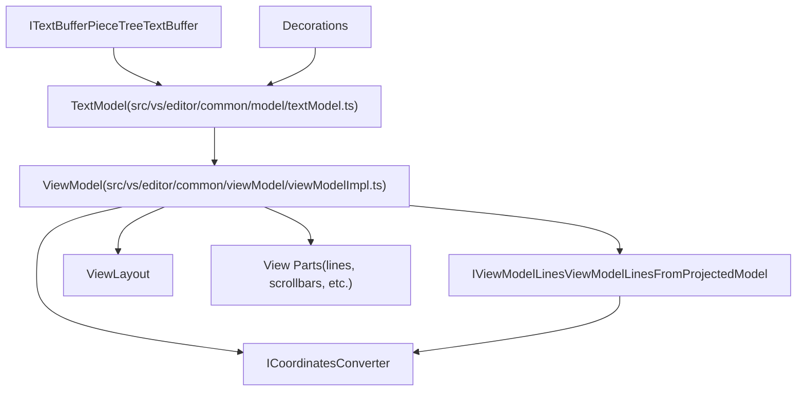
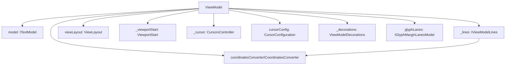
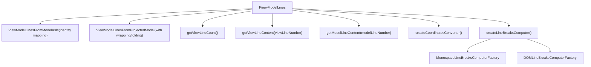
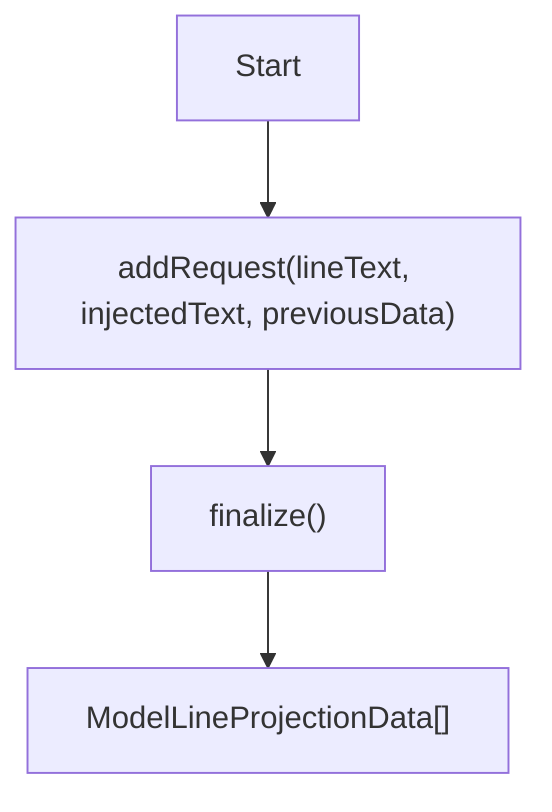
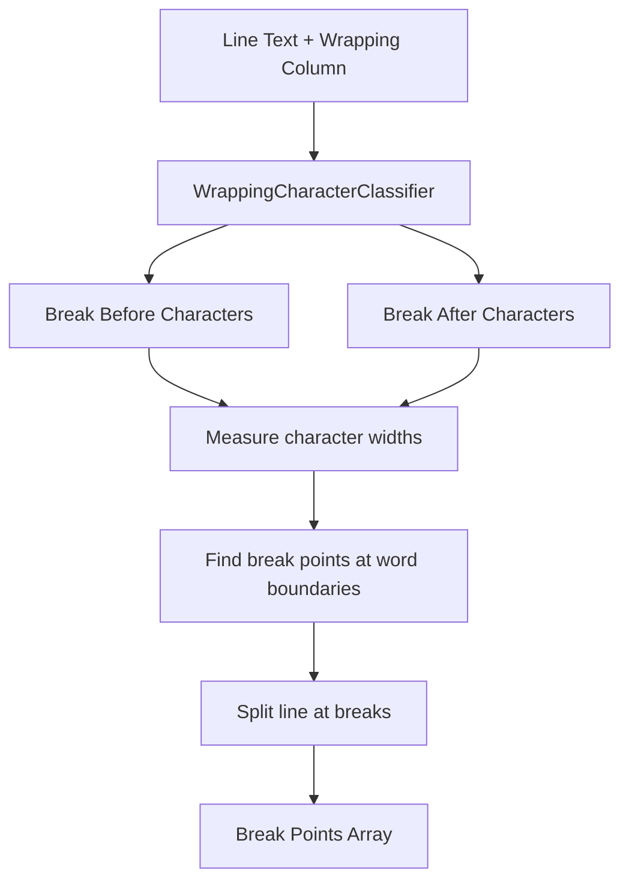
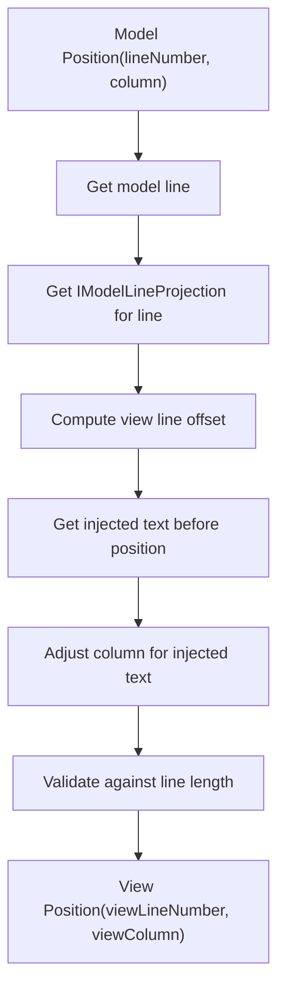
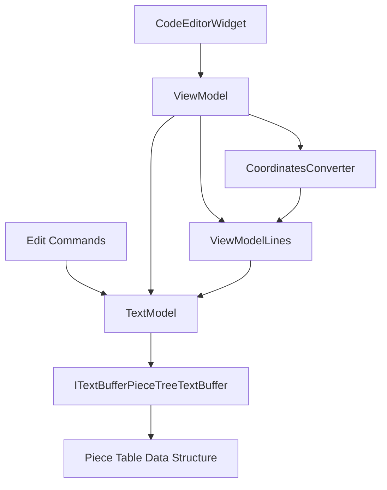

# Text Model and View Model Architecture

Relevant source files

-   [build/monaco/monaco.d.ts.recipe](https://github.com/microsoft/vscode/blob/1be3088d/build/monaco/monaco.d.ts.recipe)
-   [extensions/vscode-colorize-perf-tests/test/colorize-fixtures/test-treeView.ts](https://github.com/microsoft/vscode/blob/1be3088d/extensions/vscode-colorize-perf-tests/test/colorize-fixtures/test-treeView.ts)
-   [src/vs/editor/browser/config/charWidthReader.ts](https://github.com/microsoft/vscode/blob/1be3088d/src/vs/editor/browser/config/charWidthReader.ts)
-   [src/vs/editor/browser/editorBrowser.ts](https://github.com/microsoft/vscode/blob/1be3088d/src/vs/editor/browser/editorBrowser.ts)
-   [src/vs/editor/browser/view/domLineBreaksComputer.ts](https://github.com/microsoft/vscode/blob/1be3088d/src/vs/editor/browser/view/domLineBreaksComputer.ts)
-   [src/vs/editor/browser/view/renderingContext.ts](https://github.com/microsoft/vscode/blob/1be3088d/src/vs/editor/browser/view/renderingContext.ts)
-   [src/vs/editor/browser/viewParts/contentWidgets/contentWidgets.ts](https://github.com/microsoft/vscode/blob/1be3088d/src/vs/editor/browser/viewParts/contentWidgets/contentWidgets.ts)
-   [src/vs/editor/browser/viewParts/margin/margin.ts](https://github.com/microsoft/vscode/blob/1be3088d/src/vs/editor/browser/viewParts/margin/margin.ts)
-   [src/vs/editor/browser/viewParts/minimap/minimap.ts](https://github.com/microsoft/vscode/blob/1be3088d/src/vs/editor/browser/viewParts/minimap/minimap.ts)
-   [src/vs/editor/browser/viewParts/minimap/minimapCharRenderer.ts](https://github.com/microsoft/vscode/blob/1be3088d/src/vs/editor/browser/viewParts/minimap/minimapCharRenderer.ts)
-   [src/vs/editor/browser/viewParts/minimap/minimapCharRendererFactory.ts](https://github.com/microsoft/vscode/blob/1be3088d/src/vs/editor/browser/viewParts/minimap/minimapCharRendererFactory.ts)
-   [src/vs/editor/browser/viewParts/minimap/minimapCharSheet.ts](https://github.com/microsoft/vscode/blob/1be3088d/src/vs/editor/browser/viewParts/minimap/minimapCharSheet.ts)
-   [src/vs/editor/browser/viewParts/minimap/minimapPreBaked.ts](https://github.com/microsoft/vscode/blob/1be3088d/src/vs/editor/browser/viewParts/minimap/minimapPreBaked.ts)
-   [src/vs/editor/browser/viewParts/overlayWidgets/overlayWidgets.ts](https://github.com/microsoft/vscode/blob/1be3088d/src/vs/editor/browser/viewParts/overlayWidgets/overlayWidgets.ts)
-   [src/vs/editor/browser/viewParts/scrollDecoration/scrollDecoration.ts](https://github.com/microsoft/vscode/blob/1be3088d/src/vs/editor/browser/viewParts/scrollDecoration/scrollDecoration.ts)
-   [src/vs/editor/browser/viewParts/viewZones/viewZones.ts](https://github.com/microsoft/vscode/blob/1be3088d/src/vs/editor/browser/viewParts/viewZones/viewZones.ts)
-   [src/vs/editor/common/config/editorOptions.ts](https://github.com/microsoft/vscode/blob/1be3088d/src/vs/editor/common/config/editorOptions.ts)
-   [src/vs/editor/common/config/fontInfo.ts](https://github.com/microsoft/vscode/blob/1be3088d/src/vs/editor/common/config/fontInfo.ts)
-   [src/vs/editor/common/editorCommon.ts](https://github.com/microsoft/vscode/blob/1be3088d/src/vs/editor/common/editorCommon.ts)
-   [src/vs/editor/common/model.ts](https://github.com/microsoft/vscode/blob/1be3088d/src/vs/editor/common/model.ts)
-   [src/vs/editor/common/model/guidesTextModelPart.ts](https://github.com/microsoft/vscode/blob/1be3088d/src/vs/editor/common/model/guidesTextModelPart.ts)
-   [src/vs/editor/common/model/textModel.ts](https://github.com/microsoft/vscode/blob/1be3088d/src/vs/editor/common/model/textModel.ts)
-   [src/vs/editor/common/modelLineProjectionData.ts](https://github.com/microsoft/vscode/blob/1be3088d/src/vs/editor/common/modelLineProjectionData.ts)
-   [src/vs/editor/common/standalone/standaloneEnums.ts](https://github.com/microsoft/vscode/blob/1be3088d/src/vs/editor/common/standalone/standaloneEnums.ts)
-   [src/vs/editor/common/textModelGuides.ts](https://github.com/microsoft/vscode/blob/1be3088d/src/vs/editor/common/textModelGuides.ts)
-   [src/vs/editor/common/viewLayout/linesLayout.ts](https://github.com/microsoft/vscode/blob/1be3088d/src/vs/editor/common/viewLayout/linesLayout.ts)
-   [src/vs/editor/common/viewLayout/viewLayout.ts](https://github.com/microsoft/vscode/blob/1be3088d/src/vs/editor/common/viewLayout/viewLayout.ts)
-   [src/vs/editor/common/viewLayout/viewLinesViewportData.ts](https://github.com/microsoft/vscode/blob/1be3088d/src/vs/editor/common/viewLayout/viewLinesViewportData.ts)
-   [src/vs/editor/common/viewModel.ts](https://github.com/microsoft/vscode/blob/1be3088d/src/vs/editor/common/viewModel.ts)
-   [src/vs/editor/common/viewModel/minimapTokensColorTracker.ts](https://github.com/microsoft/vscode/blob/1be3088d/src/vs/editor/common/viewModel/minimapTokensColorTracker.ts)
-   [src/vs/editor/common/viewModel/modelLineProjection.ts](https://github.com/microsoft/vscode/blob/1be3088d/src/vs/editor/common/viewModel/modelLineProjection.ts)
-   [src/vs/editor/common/viewModel/monospaceLineBreaksComputer.ts](https://github.com/microsoft/vscode/blob/1be3088d/src/vs/editor/common/viewModel/monospaceLineBreaksComputer.ts)
-   [src/vs/editor/common/viewModel/viewModelDecorations.ts](https://github.com/microsoft/vscode/blob/1be3088d/src/vs/editor/common/viewModel/viewModelDecorations.ts)
-   [src/vs/editor/common/viewModel/viewModelImpl.ts](https://github.com/microsoft/vscode/blob/1be3088d/src/vs/editor/common/viewModel/viewModelImpl.ts)
-   [src/vs/editor/common/viewModel/viewModelLines.ts](https://github.com/microsoft/vscode/blob/1be3088d/src/vs/editor/common/viewModel/viewModelLines.ts)
-   [src/vs/editor/standalone/browser/standaloneCodeEditor.ts](https://github.com/microsoft/vscode/blob/1be3088d/src/vs/editor/standalone/browser/standaloneCodeEditor.ts)
-   [src/vs/editor/standalone/browser/standaloneEditor.ts](https://github.com/microsoft/vscode/blob/1be3088d/src/vs/editor/standalone/browser/standaloneEditor.ts)
-   [src/vs/editor/test/browser/view/minimapCharRenderer.test.ts](https://github.com/microsoft/vscode/blob/1be3088d/src/vs/editor/test/browser/view/minimapCharRenderer.test.ts)
-   [src/vs/editor/test/browser/viewModel/modelLineProjection.test.ts](https://github.com/microsoft/vscode/blob/1be3088d/src/vs/editor/test/browser/viewModel/modelLineProjection.test.ts)
-   [src/vs/editor/test/common/model/modelInjectedText.test.ts](https://github.com/microsoft/vscode/blob/1be3088d/src/vs/editor/test/common/model/modelInjectedText.test.ts)
-   [src/vs/editor/test/common/viewLayout/linesLayout.test.ts](https://github.com/microsoft/vscode/blob/1be3088d/src/vs/editor/test/common/viewLayout/linesLayout.test.ts)
-   [src/vs/editor/test/common/viewModel/lineBreakData.test.ts](https://github.com/microsoft/vscode/blob/1be3088d/src/vs/editor/test/common/viewModel/lineBreakData.test.ts)
-   [src/vs/editor/test/common/viewModel/monospaceLineBreaksComputer.test.ts](https://github.com/microsoft/vscode/blob/1be3088d/src/vs/editor/test/common/viewModel/monospaceLineBreaksComputer.test.ts)
-   [src/vs/monaco.d.ts](https://github.com/microsoft/vscode/blob/1be3088d/src/vs/monaco.d.ts)

## Purpose and Scope

This document describes the Model-View-ViewModel (MVVM) architecture in Monaco Editor, focusing on how the text model (`ITextModel`) represents document content and how the view model (`IViewModel`) transforms that content for display. This includes line projection, coordinate conversion, and the text buffer abstraction.

For information about the Monaco Editor API surface, see [Monaco Editor API and Standalone Usage](/microsoft/vscode/4.1-monaco-editor-api-and-standalone-usage). For details about editor configuration, see [Editor Configuration and Options](/microsoft/vscode/4.3-editor-configuration-and-options). For line breaking algorithms specifically, see [Line Breaking and Text Wrapping](/microsoft/vscode/4.4-line-breaking-and-text-wrapping).

## Architectural Overview

Monaco Editor implements a strict separation between the document model and the visual representation through the MVVM pattern. The **Text Model** represents the pure document state, while the **View Model** transforms that state for rendering by handling wrapping, folding, and coordinate transformations.


**Sources:** [src/vs/editor/common/model/textModel.ts185-434](https://github.com/microsoft/vscode/blob/1be3088d/src/vs/editor/common/model/textModel.ts#L185-L434) [src/vs/editor/common/viewModel/viewModelImpl.ts51-169](https://github.com/microsoft/vscode/blob/1be3088d/src/vs/editor/common/viewModel/viewModelImpl.ts#L51-L169)

## Text Model (ITextModel)

The `ITextModel` interface represents the document content with line-based access, decorations, and edit operations. The concrete implementation `TextModel` manages the underlying text buffer, versioning, tokenization, and bracket matching.

### Core Components

| Component | Class/Interface | Purpose |
| --- | --- | --- |
| Text Buffer | `ITextBuffer` | Low-level text storage using piece table |
| Text Model | `TextModel` | Line-based document API and state management |
| Decorations | `IntervalTree` | Visual annotations and markers |
| Tokenization | `TokenizationTextModelPart` | Syntax highlighting state |
| Bracket Pairs | `BracketPairsTextModelPart` | Bracket matching logic |

### TextModel Structure

```mermaid
flowchart TD
    TextModel["TextModel"]
    Buffer["_buffer: ITextBufferPieceTreeTextBuffer"]
    VersionId["_versionId: number"]
    AlternativeVersionId["_alternativeVersionId: number"]
    TokenizationPart["_tokenizationTextModelPartTokenizationTextModelPart"]
    BracketPairs["_bracketPairsBracketPairsTextModelPart"]
    Guides["_guidesTextModelPartGuidesTextModelPart"]
    DecorationsTree["_decorationsTreeDecorationsTrees"]
    DecorationProvider["_decorationProvider"]

    TextModel --> Buffer
    TextModel --> VersionId
    TextModel --> AlternativeVersionId
    TextModel --> TokenizationPart
    TextModel --> BracketPairs
    TextModel --> Guides
    TextModel --> DecorationsTree
    TextModel --> DecorationProvider
```


**Sources:** [src/vs/editor/common/model/textModel.ts185-434](https://github.com/microsoft/vscode/blob/1be3088d/src/vs/editor/common/model/textModel.ts#L185-L434) [src/vs/editor/common/model.ts1-31](https://github.com/microsoft/vscode/blob/1be3088d/src/vs/editor/common/model.ts#L1-L31)

### Text Buffer Abstraction

The `ITextBuffer` interface provides the low-level storage mechanism. Monaco uses `PieceTreeTextBuffer` for efficient insertions, deletions, and range queries. The buffer stores text content and provides:

-   Line-based access: `getLineContent(lineNumber)`, `getLineLength(lineNumber)`
-   Range operations: `getValueInRange(range, eol)`
-   Offset calculations: `getOffsetAt(lineNumber, column)`
-   Position calculations: `getPositionAt(offset)`

**Sources:** [src/vs/editor/common/model/textModel.ts334-336](https://github.com/microsoft/vscode/blob/1be3088d/src/vs/editor/common/model/textModel.ts#L334-L336) [src/vs/editor/common/model/textModel.ts461-464](https://github.com/microsoft/vscode/blob/1be3088d/src/vs/editor/common/model/textModel.ts#L461-L464)

### Line-Based Operations

`TextModel` exposes a line-oriented API built on top of the buffer:

-   `getLineCount()`: Returns total number of lines
-   `getLineContent(lineNumber)`: Returns text of a specific line
-   `getLineMaxColumn(lineNumber)`: Returns column count + 1 for a line
-   `getValueInRange(range, eol)`: Extracts text from a range
-   `getLineFirstNonWhitespaceColumn(lineNumber)`: First non-whitespace position

**Sources:** [src/vs/editor/common/model/textModel.ts461-464](https://github.com/microsoft/vscode/blob/1be3088d/src/vs/editor/common/model/textModel.ts#L461-L464) [src/vs/editor/common/model.ts400-600](https://github.com/microsoft/vscode/blob/1be3088d/src/vs/editor/common/model.ts#L400-L600)

## View Model (IViewModel)

The `ViewModel` transforms the text model for display, handling:

1.  **Line wrapping**: Converting long model lines into multiple view lines
2.  **Folding**: Hiding ranges of lines
3.  **Coordinate conversion**: Mapping between model and view positions
4.  **Viewport management**: Tracking visible lines for rendering
5.  **Decorations**: Transforming model decorations to view coordinates


**Sources:** [src/vs/editor/common/viewModel/viewModelImpl.ts51-169](https://github.com/microsoft/vscode/blob/1be3088d/src/vs/editor/common/viewModel/viewModelImpl.ts#L51-L169) [src/vs/editor/common/viewModel.ts26-52](https://github.com/microsoft/vscode/blob/1be3088d/src/vs/editor/common/viewModel.ts#L26-L52)

### ViewModel Initialization

The `ViewModel` constructor determines which line collection strategy to use:

-   **Identity mapping** (`ViewModelLinesFromModelAsIs`): Used for large files where tokenization is disabled. Each model line maps 1:1 to a view line.
-   **Projected mapping** (`ViewModelLinesFromProjectedModel`): Used for normal files. Handles line wrapping, folding, and injected text.

**Sources:** [src/vs/editor/common/viewModel/viewModelImpl.ts94-120](https://github.com/microsoft/vscode/blob/1be3088d/src/vs/editor/common/viewModel/viewModelImpl.ts#L94-L120)

### Coordinate Converter

The `ICoordinatesConverter` interface provides bidirectional conversion between model and view coordinates:

```
// Model to View
convertModelPositionToViewPosition(modelPosition: Position): Position
convertModelRangeToViewRange(modelRange: Range): Range

// View to Model
convertViewPositionToModelPosition(viewPosition: Position): Position
convertViewRangeToModelRange(viewRange: Range): Range
```
This is essential because a single model line may span multiple view lines when wrapped, or multiple model lines may be hidden in a fold.

**Sources:** [src/vs/editor/common/viewModel/viewModelImpl.ts122](https://github.com/microsoft/vscode/blob/1be3088d/src/vs/editor/common/viewModel/viewModelImpl.ts#L122-L122) [src/vs/editor/common/coordinatesConverter.ts1-50](https://github.com/microsoft/vscode/blob/1be3088d/src/vs/editor/common/coordinatesConverter.ts#L1-L50)

## Line Projection and Mapping

Line projection is the process of transforming model lines into view lines, accounting for wrapping and folding. This is managed by the `IViewModelLines` abstraction.

### IViewModelLines Interface


**Sources:** [src/vs/editor/common/viewModel/viewModelLines.ts23-80](https://github.com/microsoft/vscode/blob/1be3088d/src/vs/editor/common/viewModel/viewModelLines.ts#L23-L80)

### ViewModelLinesFromProjectedModel

This implementation maintains the projection from model lines to view lines using:

-   **Line projections**: An array of `IModelLineProjection` objects, one per model line
-   **Prefix sum computer**: Efficiently computes view line numbers from model line numbers
-   **Injected text**: Handles text injected via decorations

The class tracks which model lines have been split (wrapped) and maintains mappings:

| Model Line | View Lines | Projection Data |
| --- | --- | --- |
| 1 | 1 | No wrapping |
| 2 | 2-4 | Wrapped at columns 40, 80 |
| 3 | 5 | No wrapping |
| 4 (hidden) | \- | Folded |
| 5 | 6-7 | Wrapped at column 50 |

**Sources:** [src/vs/editor/common/viewModel/viewModelLines.ts200-400](https://github.com/microsoft/vscode/blob/1be3088d/src/vs/editor/common/viewModel/viewModelLines.ts#L200-L400)

### Model Line Projection

Each `IModelLineProjection` represents how a single model line projects to view lines. The interface provides:

-   `getViewLineCount()`: How many view lines this model line produces
-   `getViewLineContent(model, modelLineNumber, viewLineNumber)`: Content of a specific view line
-   `getViewLineMinColumn(model, modelLineNumber, viewLineNumber)`: Starting column
-   `getViewLineMaxColumn(model, modelLineNumber, viewLineNumber)`: Ending column
-   `getModelColumnOfViewPosition(viewLineNumber, viewColumn)`: Convert view column to model column

**Sources:** [src/vs/editor/common/viewModel/modelLineProjection.ts50-150](https://github.com/microsoft/vscode/blob/1be3088d/src/vs/editor/common/viewModel/modelLineProjection.ts#L50-L150)

## Line Breaking and Wrapping

Line breaking determines where long lines should wrap to fit the viewport width. Monaco supports two strategies:

### Line Breaking Strategies

| Strategy | Class | Use Case |
| --- | --- | --- |
| Monospace | `MonospaceLineBreaksComputerFactory` | Monospace fonts with character-width calculations |
| DOM-based | `DOMLineBreaksComputerFactory` | Proportional fonts requiring actual measurement |

### ILineBreaksComputer

The line breaking computer interface follows a batch processing pattern:


Each request includes:

-   `lineText`: The line content to break
-   `injectedText`: Text to inject via decorations
-   `previousLineBreakData`: Previous breaking data for optimization

The `finalize()` method returns an array of `ModelLineProjectionData` containing break points.

**Sources:** [src/vs/editor/common/modelLineProjectionData.ts100-150](https://github.com/microsoft/vscode/blob/1be3088d/src/vs/editor/common/modelLineProjectionData.ts#L100-L150) [src/vs/editor/common/viewModel/monospaceLineBreaksComputer.ts15-40](https://github.com/microsoft/vscode/blob/1be3088d/src/vs/editor/common/viewModel/monospaceLineBreaksComputer.ts#L15-L40)

### MonospaceLineBreaksComputer

For monospace fonts, breaking is computed using character widths:


The algorithm considers:

-   Wrapping column (target width)
-   Tab size (for expanding tabs to spaces)
-   Wrapping indent (how much to indent wrapped lines)
-   Character classification (where breaks are allowed)

**Sources:** [src/vs/editor/common/viewModel/monospaceLineBreaksComputer.ts15-200](https://github.com/microsoft/vscode/blob/1be3088d/src/vs/editor/common/viewModel/monospaceLineBreaksComputer.ts#L15-L200)

### DOMLineBreaksComputer

For proportional fonts, Monaco uses DOM measurement:

1.  Creates a hidden DOM element with the editor's font settings
2.  Inserts line text with special wrapping markers
3.  Measures element dimensions to find natural break points
4.  Extracts break positions from DOM layout

This approach handles complex text shaping, ligatures, and variable-width characters accurately.

**Sources:** [src/vs/editor/browser/view/domLineBreaksComputer.ts20-200](https://github.com/microsoft/vscode/blob/1be3088d/src/vs/editor/browser/view/domLineBreaksComputer.ts#L20-L200)

## Coordinate Conversion Details

Coordinate conversion is more complex than simple arithmetic because of:

1.  **Line wrapping**: One model line becomes multiple view lines
2.  **Folded regions**: Model lines may not have corresponding view lines
3.  **Injected text**: Decorations can inject text that affects column positions
4.  **Position affinity**: Whether a position prefers the left or right of ambiguous locations

### Position Conversion Algorithm


**Sources:** [src/vs/editor/common/viewModel/modelLineProjection.ts150-300](https://github.com/microsoft/vscode/blob/1be3088d/src/vs/editor/common/viewModel/modelLineProjection.ts#L150-L300)

### Range Conversion

Range conversion requires converting both start and end positions, accounting for:

-   The range may span multiple wrapped or folded lines
-   Start and end positions may have different affinity
-   Decorations may inject text within the range

The converter ensures:

-   Start position ≤ end position in the result
-   Empty ranges remain empty
-   Collapsed ranges at line boundaries are handled correctly

**Sources:** [src/vs/editor/common/coordinatesConverter.ts50-100](https://github.com/microsoft/vscode/blob/1be3088d/src/vs/editor/common/coordinatesConverter.ts#L50-L100)

## Integration with Text Buffer

The architecture maintains strict layering:


**Key invariants:**

-   View model always reflects current text model state
-   Coordinate converters remain valid until line structure changes
-   Text buffer handles all mutations atomically
-   Version IDs track document changes

**Sources:** [src/vs/editor/common/model/textModel.ts311-418](https://github.com/microsoft/vscode/blob/1be3088d/src/vs/editor/common/model/textModel.ts#L311-L418) [src/vs/editor/common/viewModel/viewModelImpl.ts69-169](https://github.com/microsoft/vscode/blob/1be3088d/src/vs/editor/common/viewModel/viewModelImpl.ts#L69-L169)

## ModelLineProjectionData

The `ModelLineProjectionData` class encapsulates line breaking information:

| Property | Type | Purpose |
| --- | --- | --- |
| `injectionOffsets` | `number[]` | Character offsets where text is injected |
| `injectionOptions` | `InjectedTextOptions[]` | Options for each injected text segment |
| `breakOffsets` | `number[]` | Character offsets where line breaks occur |
| `breakOffsetsVisibleColumn` | `number[]` | Visual column positions of breaks |
| `wrappedTextIndentLength` | `number` | Indentation for wrapped lines |

This data structure allows efficient queries:

-   How many view lines does this model line produce?
-   Where should the line break to fit the wrapping column?
-   What text is injected at each position?

**Sources:** [src/vs/editor/common/modelLineProjectionData.ts200-400](https://github.com/microsoft/vscode/blob/1be3088d/src/vs/editor/common/modelLineProjectionData.ts#L200-L400)

## Event Flow and Updates

When the text model changes, the view model must synchronize:

> **[Mermaid sequence]**
> *(图表结构无法解析)*

The view model processes model changes and translates them to view changes:

-   `ModelRawFlush` → `ViewFlushedEvent`
-   `ModelRawLinesInserted` → `ViewLinesInsertedEvent`
-   `ModelRawLinesDeleted` → `ViewLinesDeletedEvent`
-   `ModelRawLineChanged` → `ViewLinesChangedEvent`

**Sources:** [src/vs/editor/common/viewModel/viewModelImpl.ts314-450](https://github.com/microsoft/vscode/blob/1be3088d/src/vs/editor/common/viewModel/viewModelImpl.ts#L314-L450)

## Performance Considerations

The architecture optimizes for common cases:

1.  **Large file optimization**: Uses `ViewModelLinesFromModelAsIs` to avoid wrapping overhead
2.  **Incremental updates**: Recomputes only affected line projections
3.  **Cached coordinates**: Conversion results cached until structure changes
4.  **Batch line breaking**: Processes multiple lines in one DOM layout pass
5.  **Prefix sum computer**: O(log n) lookup for view line numbers

**Sources:** [src/vs/editor/common/viewModel/viewModelImpl.ts94-98](https://github.com/microsoft/vscode/blob/1be3088d/src/vs/editor/common/viewModel/viewModelImpl.ts#L94-L98) [src/vs/editor/common/viewModel/viewModelLines.ts94-120](https://github.com/microsoft/vscode/blob/1be3088d/src/vs/editor/common/viewModel/viewModelLines.ts#L94-L120)
