# Decorations and Rendering

Relevant source files

-   [build/monaco/monaco.d.ts.recipe](https://github.com/microsoft/vscode/blob/1be3088d/build/monaco/monaco.d.ts.recipe)
-   [extensions/vscode-colorize-perf-tests/test/colorize-fixtures/test-treeView.ts](https://github.com/microsoft/vscode/blob/1be3088d/extensions/vscode-colorize-perf-tests/test/colorize-fixtures/test-treeView.ts)
-   [src/vs/editor/browser/config/charWidthReader.ts](https://github.com/microsoft/vscode/blob/1be3088d/src/vs/editor/browser/config/charWidthReader.ts)
-   [src/vs/editor/browser/editorBrowser.ts](https://github.com/microsoft/vscode/blob/1be3088d/src/vs/editor/browser/editorBrowser.ts)
-   [src/vs/editor/browser/view/domLineBreaksComputer.ts](https://github.com/microsoft/vscode/blob/1be3088d/src/vs/editor/browser/view/domLineBreaksComputer.ts)
-   [src/vs/editor/browser/view/renderingContext.ts](https://github.com/microsoft/vscode/blob/1be3088d/src/vs/editor/browser/view/renderingContext.ts)
-   [src/vs/editor/browser/viewParts/contentWidgets/contentWidgets.ts](https://github.com/microsoft/vscode/blob/1be3088d/src/vs/editor/browser/viewParts/contentWidgets/contentWidgets.ts)
-   [src/vs/editor/browser/viewParts/margin/margin.ts](https://github.com/microsoft/vscode/blob/1be3088d/src/vs/editor/browser/viewParts/margin/margin.ts)
-   [src/vs/editor/browser/viewParts/minimap/minimap.ts](https://github.com/microsoft/vscode/blob/1be3088d/src/vs/editor/browser/viewParts/minimap/minimap.ts)
-   [src/vs/editor/browser/viewParts/minimap/minimapCharRenderer.ts](https://github.com/microsoft/vscode/blob/1be3088d/src/vs/editor/browser/viewParts/minimap/minimapCharRenderer.ts)
-   [src/vs/editor/browser/viewParts/minimap/minimapCharRendererFactory.ts](https://github.com/microsoft/vscode/blob/1be3088d/src/vs/editor/browser/viewParts/minimap/minimapCharRendererFactory.ts)
-   [src/vs/editor/browser/viewParts/minimap/minimapCharSheet.ts](https://github.com/microsoft/vscode/blob/1be3088d/src/vs/editor/browser/viewParts/minimap/minimapCharSheet.ts)
-   [src/vs/editor/browser/viewParts/minimap/minimapPreBaked.ts](https://github.com/microsoft/vscode/blob/1be3088d/src/vs/editor/browser/viewParts/minimap/minimapPreBaked.ts)
-   [src/vs/editor/browser/viewParts/overlayWidgets/overlayWidgets.ts](https://github.com/microsoft/vscode/blob/1be3088d/src/vs/editor/browser/viewParts/overlayWidgets/overlayWidgets.ts)
-   [src/vs/editor/browser/viewParts/scrollDecoration/scrollDecoration.ts](https://github.com/microsoft/vscode/blob/1be3088d/src/vs/editor/browser/viewParts/scrollDecoration/scrollDecoration.ts)
-   [src/vs/editor/browser/viewParts/viewZones/viewZones.ts](https://github.com/microsoft/vscode/blob/1be3088d/src/vs/editor/browser/viewParts/viewZones/viewZones.ts)
-   [src/vs/editor/common/config/editorOptions.ts](https://github.com/microsoft/vscode/blob/1be3088d/src/vs/editor/common/config/editorOptions.ts)
-   [src/vs/editor/common/config/fontInfo.ts](https://github.com/microsoft/vscode/blob/1be3088d/src/vs/editor/common/config/fontInfo.ts)
-   [src/vs/editor/common/editorCommon.ts](https://github.com/microsoft/vscode/blob/1be3088d/src/vs/editor/common/editorCommon.ts)
-   [src/vs/editor/common/model.ts](https://github.com/microsoft/vscode/blob/1be3088d/src/vs/editor/common/model.ts)
-   [src/vs/editor/common/model/guidesTextModelPart.ts](https://github.com/microsoft/vscode/blob/1be3088d/src/vs/editor/common/model/guidesTextModelPart.ts)
-   [src/vs/editor/common/model/textModel.ts](https://github.com/microsoft/vscode/blob/1be3088d/src/vs/editor/common/model/textModel.ts)
-   [src/vs/editor/common/modelLineProjectionData.ts](https://github.com/microsoft/vscode/blob/1be3088d/src/vs/editor/common/modelLineProjectionData.ts)
-   [src/vs/editor/common/standalone/standaloneEnums.ts](https://github.com/microsoft/vscode/blob/1be3088d/src/vs/editor/common/standalone/standaloneEnums.ts)
-   [src/vs/editor/common/textModelGuides.ts](https://github.com/microsoft/vscode/blob/1be3088d/src/vs/editor/common/textModelGuides.ts)
-   [src/vs/editor/common/viewLayout/linesLayout.ts](https://github.com/microsoft/vscode/blob/1be3088d/src/vs/editor/common/viewLayout/linesLayout.ts)
-   [src/vs/editor/common/viewLayout/viewLayout.ts](https://github.com/microsoft/vscode/blob/1be3088d/src/vs/editor/common/viewLayout/viewLayout.ts)
-   [src/vs/editor/common/viewLayout/viewLinesViewportData.ts](https://github.com/microsoft/vscode/blob/1be3088d/src/vs/editor/common/viewLayout/viewLinesViewportData.ts)
-   [src/vs/editor/common/viewModel.ts](https://github.com/microsoft/vscode/blob/1be3088d/src/vs/editor/common/viewModel.ts)
-   [src/vs/editor/common/viewModel/minimapTokensColorTracker.ts](https://github.com/microsoft/vscode/blob/1be3088d/src/vs/editor/common/viewModel/minimapTokensColorTracker.ts)
-   [src/vs/editor/common/viewModel/modelLineProjection.ts](https://github.com/microsoft/vscode/blob/1be3088d/src/vs/editor/common/viewModel/modelLineProjection.ts)
-   [src/vs/editor/common/viewModel/monospaceLineBreaksComputer.ts](https://github.com/microsoft/vscode/blob/1be3088d/src/vs/editor/common/viewModel/monospaceLineBreaksComputer.ts)
-   [src/vs/editor/common/viewModel/viewModelDecorations.ts](https://github.com/microsoft/vscode/blob/1be3088d/src/vs/editor/common/viewModel/viewModelDecorations.ts)
-   [src/vs/editor/common/viewModel/viewModelImpl.ts](https://github.com/microsoft/vscode/blob/1be3088d/src/vs/editor/common/viewModel/viewModelImpl.ts)
-   [src/vs/editor/common/viewModel/viewModelLines.ts](https://github.com/microsoft/vscode/blob/1be3088d/src/vs/editor/common/viewModel/viewModelLines.ts)
-   [src/vs/editor/standalone/browser/standaloneCodeEditor.ts](https://github.com/microsoft/vscode/blob/1be3088d/src/vs/editor/standalone/browser/standaloneCodeEditor.ts)
-   [src/vs/editor/standalone/browser/standaloneEditor.ts](https://github.com/microsoft/vscode/blob/1be3088d/src/vs/editor/standalone/browser/standaloneEditor.ts)
-   [src/vs/editor/test/browser/view/minimapCharRenderer.test.ts](https://github.com/microsoft/vscode/blob/1be3088d/src/vs/editor/test/browser/view/minimapCharRenderer.test.ts)
-   [src/vs/editor/test/browser/viewModel/modelLineProjection.test.ts](https://github.com/microsoft/vscode/blob/1be3088d/src/vs/editor/test/browser/viewModel/modelLineProjection.test.ts)
-   [src/vs/editor/test/common/model/modelInjectedText.test.ts](https://github.com/microsoft/vscode/blob/1be3088d/src/vs/editor/test/common/model/modelInjectedText.test.ts)
-   [src/vs/editor/test/common/viewLayout/linesLayout.test.ts](https://github.com/microsoft/vscode/blob/1be3088d/src/vs/editor/test/common/viewLayout/linesLayout.test.ts)
-   [src/vs/editor/test/common/viewModel/lineBreakData.test.ts](https://github.com/microsoft/vscode/blob/1be3088d/src/vs/editor/test/common/viewModel/lineBreakData.test.ts)
-   [src/vs/editor/test/common/viewModel/monospaceLineBreaksComputer.test.ts](https://github.com/microsoft/vscode/blob/1be3088d/src/vs/editor/test/common/viewModel/monospaceLineBreaksComputer.test.ts)
-   [src/vs/monaco.d.ts](https://github.com/microsoft/vscode/blob/1be3088d/src/vs/monaco.d.ts)

## Purpose and Scope

This page documents the Monaco Editor's decoration system and rendering pipeline. Decorations are visual annotations applied to text ranges (e.g., syntax highlighting, error squiggles, selection highlights), while the rendering system manages how these decorations and the editor's content are drawn to the screen.

For information about the text model that stores the underlying content, see [Text Model and View Model Architecture](/microsoft/vscode/4.2-text-model-and-view-model-architecture). For editor configuration options that control rendering behavior, see [Editor Configuration and Options](/microsoft/vscode/4.3-editor-configuration-and-options).

---

## Decoration System Overview

The decoration system operates at two levels: **model decorations** stored in the text buffer, and **view decorations** computed for the rendered view.

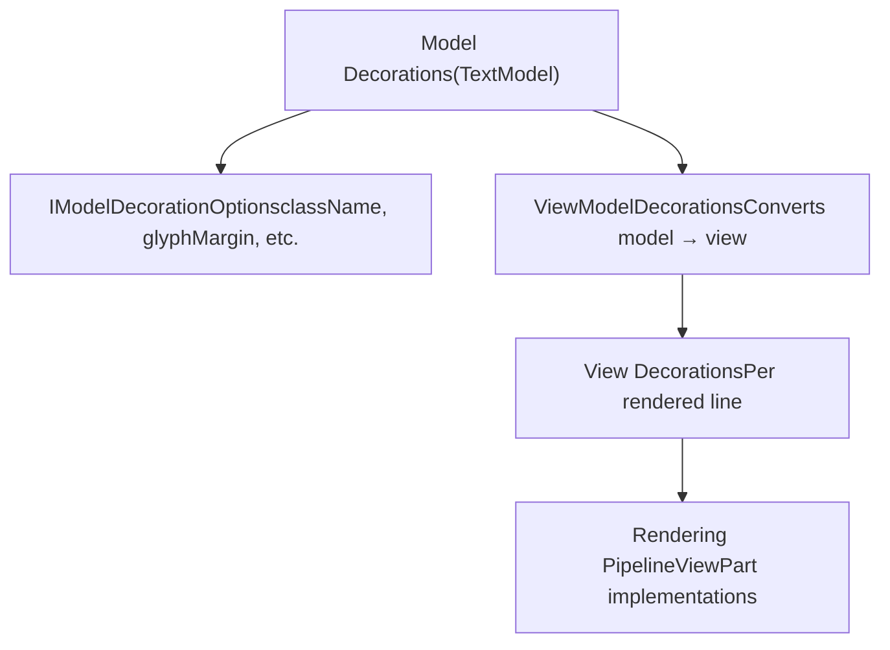
**Sources:** [src/vs/editor/common/model/textModel.ts185-299](https://github.com/microsoft/vscode/blob/1be3088d/src/vs/editor/common/model/textModel.ts#L185-L299) [src/vs/editor/common/viewModel/viewModelDecorations.ts1-19](https://github.com/microsoft/vscode/blob/1be3088d/src/vs/editor/common/viewModel/viewModelDecorations.ts#L1-L19)

---

## Model Decorations

### IModelDecoration Interface

Model decorations are stored in the `TextModel` and track ranges of text with associated visual options. Each decoration has:

-   **Range**: The text range it covers (`IRange`)
-   **Options**: Visual styling and behavior (`IModelDecorationOptions`)
-   **ID**: Unique identifier string
-   **Owner ID**: Optional owner identifier for grouping

The `IModelDecorationOptions` interface defines decoration appearance:

| Option | Purpose | Related Components |
| --- | --- | --- |
| `className` | CSS class for the text span | Inline rendering |
| `glyphMarginClassName` | CSS class for glyph margin icon | Glyph margin rendering |
| `overviewRuler` | Overview ruler decoration settings | Overview ruler lanes |
| `minimap` | Minimap decoration settings | Minimap rendering |
| `inlineClassName` | CSS affecting individual characters | Character-level styling |
| `beforeContentClassName` | CSS for pseudo-element before text | Inline decorations |
| `afterContentClassName` | CSS for pseudo-element after text | Inline decorations |
| `stickiness` | How decoration moves with edits | `TrackedRangeStickiness` enum |

**Sources:** [src/vs/editor/common/model.ts91-314](https://github.com/microsoft/vscode/blob/1be3088d/src/vs/editor/common/model.ts#L91-L314) [src/vs/editor/common/model/textModel.ts592-976](https://github.com/microsoft/vscode/blob/1be3088d/src/vs/editor/common/model/textModel.ts#L592-L976)

### Decoration Registration and Tracking

Decorations are managed through the `TextModel` using interval trees for efficient range queries:

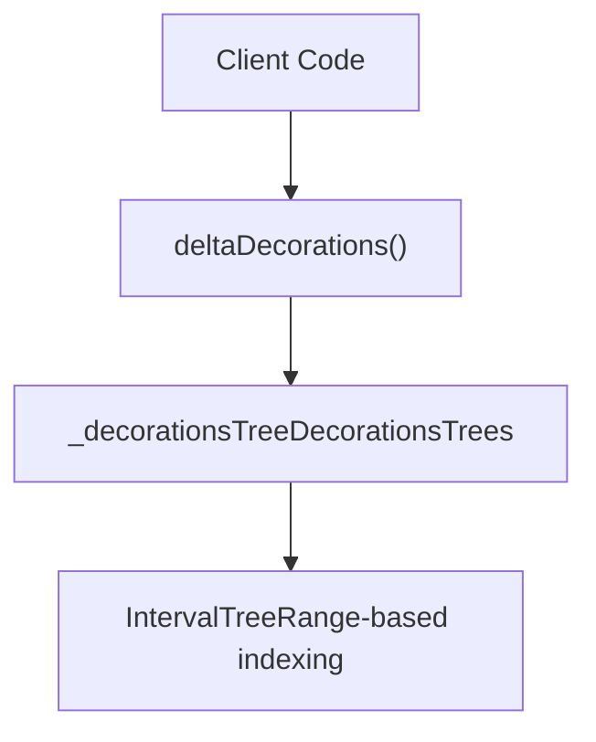
The `deltaDecorations` method is the primary interface for modifying decorations:

```
deltaDecorations(
  oldDecorations: string[],
  newDecorations: IModelDeltaDecoration[]
): string[]
```
It atomically removes old decorations and adds new ones, returning new decoration IDs.

**Sources:** [src/vs/editor/common/model/textModel.ts1219-1351](https://github.com/microsoft/vscode/blob/1be3088d/src/vs/editor/common/model/textModel.ts#L1219-L1351) [src/vs/editor/common/model/intervalTree.ts49-589](https://github.com/microsoft/vscode/blob/1be3088d/src/vs/editor/common/model/intervalTree.ts#L49-L589)

### Decoration Stickiness

The `TrackedRangeStickiness` enum controls how decorations behave when text is inserted at their boundaries:

| Stickiness | Start Behavior | End Behavior |
| --- | --- | --- |
| `AlwaysGrowsWhenTypingAtEdges` | Grows left | Grows right |
| `NeverGrowsWhenTypingAtEdges` | Stays fixed | Stays fixed |
| `GrowsOnlyWhenTypingBefore` | Grows left | Stays fixed |
| `GrowsOnlyWhenTypingAfter` | Stays fixed | Grows right |

**Sources:** [src/vs/editor/common/model.ts424-456](https://github.com/microsoft/vscode/blob/1be3088d/src/vs/editor/common/model.ts#L424-L456)

---

## View Model Decorations

The `ViewModelDecorations` class converts model decorations to view coordinates, accounting for line wrapping, hidden ranges, and injected text.

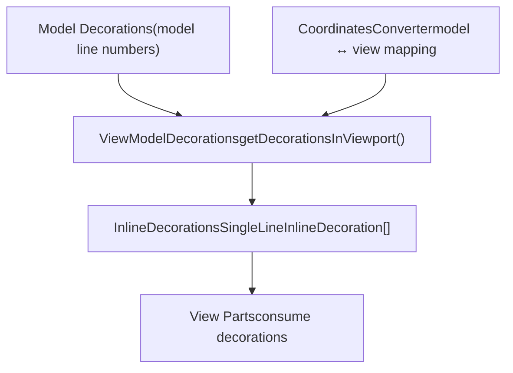
Key methods in `ViewModelDecorations`:

-   `getDecorationsInViewport(range)`: Returns decorations visible in a viewport range
-   `getInlineDecorationsOnLine(lineNumber)`: Returns inline decorations for a single line
-   `getDecorationsInRange(range)`: Returns all decorations in a range

**Sources:** [src/vs/editor/common/viewModel/viewModelDecorations.ts1-173](https://github.com/microsoft/vscode/blob/1be3088d/src/vs/editor/common/viewModel/viewModelDecorations.ts#L1-L173) [src/vs/editor/common/viewModel/viewModelImpl.ts146](https://github.com/microsoft/vscode/blob/1be3088d/src/vs/editor/common/viewModel/viewModelImpl.ts#L146-L146)

### Inline Decorations

Inline decorations are per-character styling information computed from model decorations. The `InlineDecoration` class represents a range within a line with specific styling:

```
class InlineDecoration {
  readonly range: Range;           // Character range
  readonly inlineClassName: string; // CSS class
  readonly type: InlineDecorationType;
}
```
Inline decoration types include:

-   `Regular`: Standard inline class
-   `Before`: Before-content pseudo-element
-   `After`: After-content pseudo-element

**Sources:** [src/vs/editor/common/viewModel/inlineDecorations.ts1-266](https://github.com/microsoft/vscode/blob/1be3088d/src/vs/editor/common/viewModel/inlineDecorations.ts#L1-L266)

---

## Rendering Pipeline

The rendering pipeline coordinates multiple view parts to draw the editor. Each view part extends the `ViewPart` base class and responds to view events.

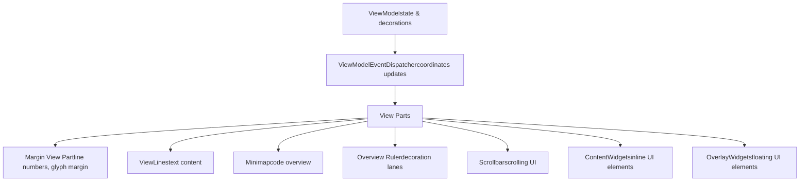
**Sources:** [src/vs/editor/browser/view/viewPart.ts1-85](https://github.com/microsoft/vscode/blob/1be3088d/src/vs/editor/browser/view/viewPart.ts#L1-L85) [src/vs/editor/common/viewModel/viewModelImpl.ts51-169](https://github.com/microsoft/vscode/blob/1be3088d/src/vs/editor/common/viewModel/viewModelImpl.ts#L51-L169)

### Rendering Context

The rendering pipeline uses two context types:

**RenderingContext** (full context for complete rendering):

-   `visibleRange`: Viewport range
-   `bigNumbersDelta`: Offset for large line numbers
-   `scrollWidth`, `scrollHeight`: Scroll dimensions
-   `viewportData`: Line viewport data including decorations
-   `getViewLineRenderingData(lineNumber)`: Retrieves rendering data for a line

**RestrictedRenderingContext** (limited context for partial updates):

-   Subset of `RenderingContext` for incremental rendering
-   Used when only specific properties changed

**Sources:** [src/vs/editor/browser/view/renderingContext.ts1-159](https://github.com/microsoft/vscode/blob/1be3088d/src/vs/editor/browser/view/renderingContext.ts#L1-L159)

### ViewPart Base Class

All view parts implement this lifecycle:

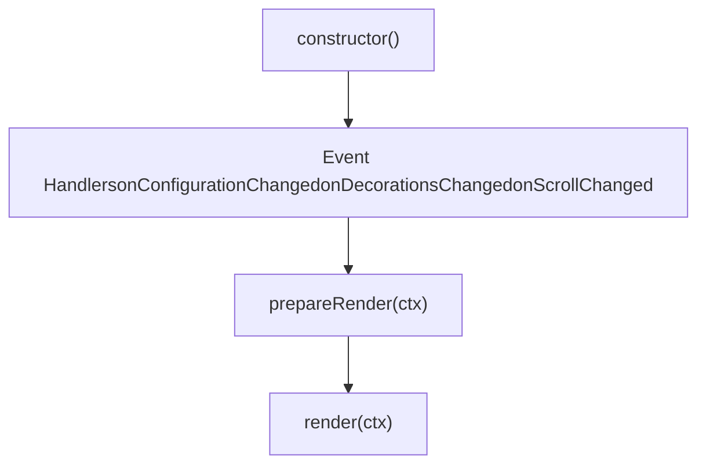
View parts override these methods:

-   `onConfigurationChanged(e)`: Respond to config changes
-   `onDecorationsChanged(e)`: Respond to decoration changes
-   `onScrollChanged(e)`: Respond to scroll changes
-   `prepareRender(ctx)`: Prepare rendering data
-   `render(ctx)`: Execute rendering to DOM

**Sources:** [src/vs/editor/browser/view/viewPart.ts14-85](https://github.com/microsoft/vscode/blob/1be3088d/src/vs/editor/browser/view/viewPart.ts#L14-L85)

---

## Glyph Margin and Decorations

The glyph margin displays icons to the left of line numbers. It supports three lanes:

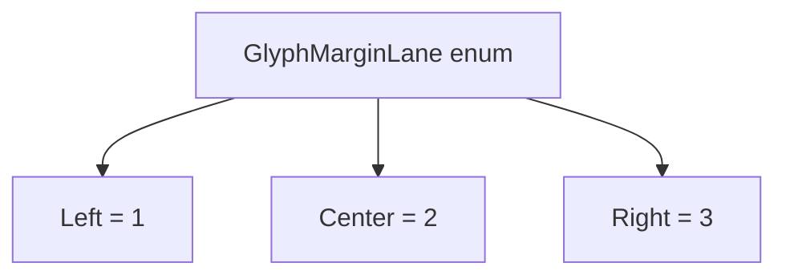
### Glyph Margin Options

Decorations specify glyph margin appearance via `IModelDecorationGlyphMarginOptions`:

```
interface IModelDecorationGlyphMarginOptions {
  position: GlyphMarginLane;  // Which lane
  persistLane?: boolean;       // Keep lane visible everywhere
}
```
The `IGlyphMarginLanesModel` manages lane visibility:

-   `requiredLanes`: Number of lanes to render
-   `getLanesAtLine(lineNumber)`: Get lanes for a line
-   `push(lane, range, persist)`: Register lane usage

**Sources:** [src/vs/editor/common/model.ts45-73](https://github.com/microsoft/vscode/blob/1be3088d/src/vs/editor/common/model.ts#L45-L73) [src/vs/editor/common/model.ts104-115](https://github.com/microsoft/vscode/blob/1be3088d/src/vs/editor/common/model.ts#L104-L115)

---

## Overview Ruler

The overview ruler displays a vertical strip showing decoration positions across the entire document. It uses multiple lanes for different decoration types.

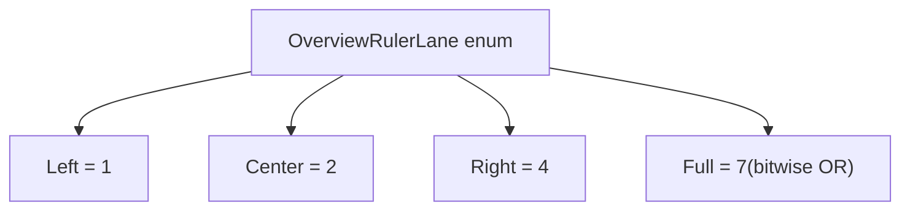
### Overview Ruler Decoration Options

```
interface IModelDecorationOverviewRulerOptions {
  color: string | ThemeColor;      // Decoration color
  darkColor?: string | ThemeColor;  // Dark theme color
  position: OverviewRulerLane;     // Which lane
}
```
The overview ruler renders decorations as colored bars proportional to document position.

**Sources:** [src/vs/editor/common/model.ts35-40](https://github.com/microsoft/vscode/blob/1be3088d/src/vs/editor/common/model.ts#L35-L40) [src/vs/editor/common/model.ts120-125](https://github.com/microsoft/vscode/blob/1be3088d/src/vs/editor/common/model.ts#L120-L125)

---

## Minimap

The minimap provides a scaled-down view of the entire document with syntax highlighting.

### Minimap Architecture

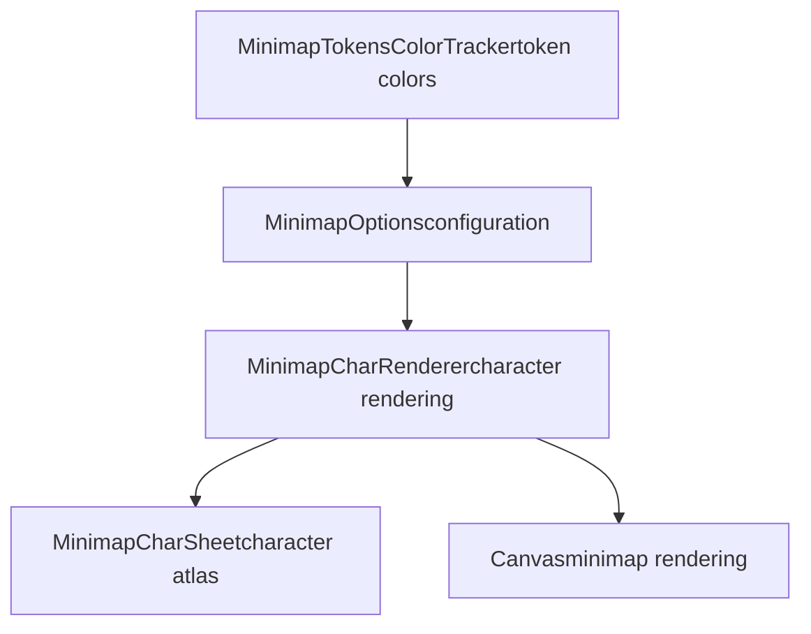
### Minimap Rendering Modes

The `RenderMinimap` enum defines rendering strategies:

| Mode | Description | Use Case |
| --- | --- | --- |
| `None` | No minimap | Disabled |
| `Text` | Render actual characters | High detail |
| `Blocks` | Render colored blocks | Performance |

**Sources:** [src/vs/editor/browser/viewParts/minimap/minimap.ts50-180](https://github.com/microsoft/vscode/blob/1be3088d/src/vs/editor/browser/viewParts/minimap/minimap.ts#L50-L180)

### Minimap Decoration Options

```
interface IModelDecorationMinimapOptions {
  color: string | ThemeColor;
  darkColor?: string | ThemeColor;
  position: MinimapPosition;           // Inline or Gutter
  sectionHeaderStyle?: MinimapSectionHeaderStyle;
  sectionHeaderText?: string;
}
```
`MinimapPosition` enum:

-   `Inline = 1`: Inline with code
-   `Gutter = 2`: In minimap gutter

`MinimapSectionHeaderStyle` enum:

-   `Normal = 1`: Regular rendering
-   `Underlined = 2`: With underline

**Sources:** [src/vs/editor/common/model.ts78-143](https://github.com/microsoft/vscode/blob/1be3088d/src/vs/editor/common/model.ts#L78-L143)

### Character Rendering

The `MinimapCharRenderer` interface defines character rendering:

```
interface MinimapCharRenderer {
  x2CharData: Uint8ClampedArray;  // Character pixel data
  renderChar(
    target: ImageData,
    dx: number, dy: number,
    chCode: number,
    color: RGBA8,
    backgroundColor: RGBA8,
    fontScale: number
  ): void;
}
```
The `MinimapCharRendererFactory` creates optimized renderers based on font scale.

**Sources:** [src/vs/editor/browser/viewParts/minimap/minimapCharRenderer.ts1-145](https://github.com/microsoft/vscode/blob/1be3088d/src/vs/editor/browser/viewParts/minimap/minimapCharRenderer.ts#L1-L145) [src/vs/editor/browser/viewParts/minimap/minimapCharRendererFactory.ts1-201](https://github.com/microsoft/vscode/blob/1be3088d/src/vs/editor/browser/viewParts/minimap/minimapCharRendererFactory.ts#L1-L201)

---

## Widgets

Monaco Editor supports three widget types for custom UI elements.

### Content Widgets

Content widgets are positioned relative to editor positions (e.g., parameter hints, suggestions).

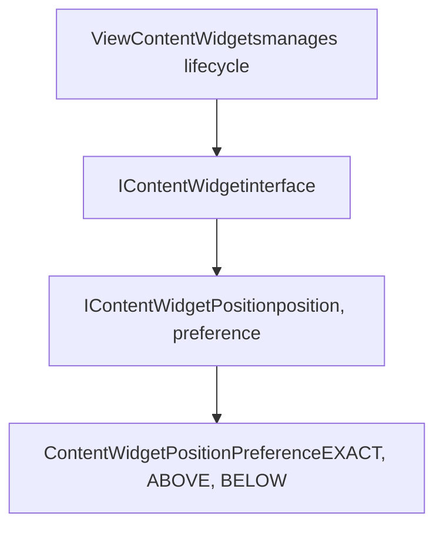
**IContentWidget Interface**:

```
interface IContentWidget {
  allowEditorOverflow?: boolean;    // Can overflow editor
  suppressMouseDown?: boolean;      // Prevent mouse events

  getId(): string;
  getDomNode(): HTMLElement;
  getPosition(): IContentWidgetPosition | null;

  beforeRender?(): IDimension | null;
  afterRender?(
    position: ContentWidgetPositionPreference | null,
    coordinate: IContentWidgetRenderedCoordinate | null
  ): void;
}
```
**IContentWidgetPosition**:

```
interface IContentWidgetPosition {
  position: IPosition | null;           // Primary position
  secondaryPosition?: IPosition | null; // Secondary anchor
  preference: ContentWidgetPositionPreference[];
  positionAffinity?: PositionAffinity;  // Injected text handling
}
```
**Sources:** [src/vs/editor/browser/editorBrowser.ts176-233](https://github.com/microsoft/vscode/blob/1be3088d/src/vs/editor/browser/editorBrowser.ts#L176-L233) [src/vs/editor/browser/viewParts/contentWidgets/contentWidgets.ts1-286](https://github.com/microsoft/vscode/blob/1be3088d/src/vs/editor/browser/viewParts/contentWidgets/contentWidgets.ts#L1-L286)

### Overlay Widgets

Overlay widgets float above the editor at fixed positions (e.g., find widget, message overlays).

```
interface IOverlayWidget {
  allowEditorOverflow?: boolean;
  onDidLayout?: Event<void>;

  getId(): string;
  getDomNode(): HTMLElement;
  getPosition(): IOverlayWidgetPosition | null;
  getMinContentWidthInPx?(): number;
}
```
**Overlay Widget Position**:

```
interface IOverlayWidgetPosition {
  preference:
    | OverlayWidgetPositionPreference  // Predefined position
    | IOverlayWidgetPositionCoordinates; // Custom coordinates
  stackOrdinal?: number;  // Stacking order
}

enum OverlayWidgetPositionPreference {
  TOP_RIGHT_CORNER,
  BOTTOM_RIGHT_CORNER,
  TOP_CENTER
}
```
**Sources:** [src/vs/editor/browser/editorBrowser.ts238-316](https://github.com/microsoft/vscode/blob/1be3088d/src/vs/editor/browser/editorBrowser.ts#L238-L316) [src/vs/editor/browser/viewParts/overlayWidgets/overlayWidgets.ts1-218](https://github.com/microsoft/vscode/blob/1be3088d/src/vs/editor/browser/viewParts/overlayWidgets/overlayWidgets.ts#L1-L218)

### Glyph Margin Widgets

Glyph margin widgets render custom elements in the glyph margin lanes.

```
interface IGlyphMarginWidget {
  getId(): string;
  getDomNode(): HTMLElement;
  getPosition(): IGlyphMarginWidgetPosition;
}

interface IGlyphMarginWidgetPosition {
  lane: GlyphMarginLane;  // Which lane
  zIndex: number;         // Display priority
  range: IRange;          // Associated range
}
```
**Sources:** [src/vs/editor/browser/editorBrowser.ts318-353](https://github.com/microsoft/vscode/blob/1be3088d/src/vs/editor/browser/editorBrowser.ts#L318-L353)

---

## View Zones

View zones are horizontal regions that push content down, used for diff decorations, debugging widgets, etc.

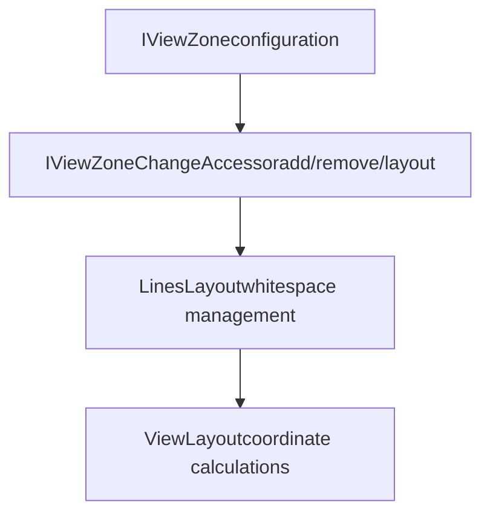
**IViewZone Interface**:

```
interface IViewZone {
  afterLineNumber: number;        // Line after which to insert
  afterColumn?: number;           // Column position
  afterColumnAffinity?: PositionAffinity;

  heightInLines?: number;         // Height in line units
  heightInPx?: number;            // Height in pixels
  minWidthInPx?: number;          // Minimum width

  domNode: HTMLElement;           // Content element
  marginDomNode?: HTMLElement;    // Margin element

  suppressMouseDown?: boolean;
  showInHiddenAreas?: boolean;    // Show in collapsed regions
  ordinal?: number;               // Tiebreaker for ordering

  onDomNodeTop?(top: number): void;
  onComputedHeight?(height: number): void;
}
```
View zones are managed through the `IViewZoneChangeAccessor`:

```
interface IViewZoneChangeAccessor {
  addZone(zone: IViewZone): string;    // Returns zone ID
  removeZone(id: string): void;
  layoutZone(id: string): void;         // Recalculate position
}
```
**Sources:** [src/vs/editor/browser/editorBrowser.ts32-121](https://github.com/microsoft/vscode/blob/1be3088d/src/vs/editor/browser/editorBrowser.ts#L32-L121) [src/vs/editor/browser/viewParts/viewZones/viewZones.ts1-388](https://github.com/microsoft/vscode/blob/1be3088d/src/vs/editor/browser/viewParts/viewZones/viewZones.ts#L1-L388)

---

## Line Rendering Data

The rendering system uses `ViewLineRenderingData` to package all information needed to render a line:

```
interface ViewLineRenderingData {
  content: string;                    // Line text
  continuesWithWrappedLine: boolean;  // Wrapping indicator
  minColumn: number;
  maxColumn: number;
  tokens: IViewLineTokens;            // Token information
  inlineDecorations: InlineDecoration[]; // Character-level styling
  tabSize: number;
}
```
**ViewLineData** (extended version):

```
interface ViewLineData {
  // ... ViewLineRenderingData fields
  modelLineNumber: number;
  lineNumber: number;
}
```
**Sources:** [src/vs/editor/common/viewModel.ts119-163](https://github.com/microsoft/vscode/blob/1be3088d/src/vs/editor/common/viewModel.ts#L119-L163)

---

## Rendering Coordination

The `ViewLayout` class coordinates scrolling, viewport management, and line heights.

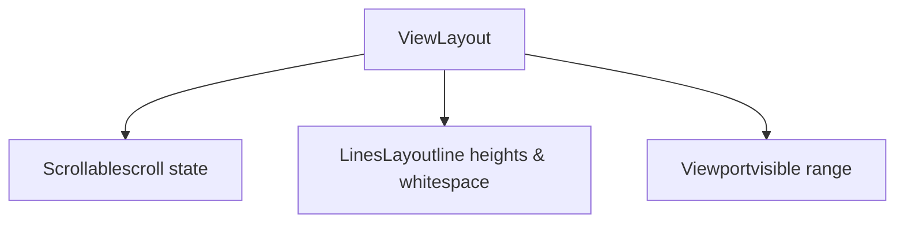
Key `ViewLayout` methods:

-   `getCurrentScrollTop()`: Current vertical scroll position
-   `getCurrentScrollLeft()`: Current horizontal scroll position
-   `getCurrentViewport()`: Currently visible viewport
-   `getLinesViewportData()`: Line data for visible range
-   `getWhitespaceViewportData()`: View zones in viewport

**Viewport Class**:

```
class Viewport {
  readonly top: number;           // Top pixel position
  readonly left: number;          // Left pixel position
  readonly width: number;
  readonly height: number;
}
```
**Sources:** [src/vs/editor/common/viewLayout/viewLayout.ts1-629](https://github.com/microsoft/vscode/blob/1be3088d/src/vs/editor/common/viewLayout/viewLayout.ts#L1-L629) [src/vs/editor/common/viewModel.ts53-82](https://github.com/microsoft/vscode/blob/1be3088d/src/vs/editor/common/viewModel.ts#L53-L82)

### Line Heights

The `LinesLayout` class manages variable line heights through the `LineHeightsManager`:

```
interface ICustomLineHeightData {
  decorationId: string;
  startLineNumber: number;
  endLineNumber: number;
  lineHeight: number;  // Multiplier of default height
}
```
Lines can have custom heights via the `lineHeight` decoration option. The `LineHeightsManager` tracks these efficiently using a segment tree structure.

**Sources:** [src/vs/editor/common/viewLayout/linesLayout.ts1-696](https://github.com/microsoft/vscode/blob/1be3088d/src/vs/editor/common/viewLayout/linesLayout.ts#L1-L696) [src/vs/editor/common/viewLayout/lineHeights.ts1-303](https://github.com/microsoft/vscode/blob/1be3088d/src/vs/editor/common/viewLayout/lineHeights.ts#L1-L303)

---

## Font and Line Height

Decorations can affect font rendering through font-specific options:

```
interface IModelDecorationOptions {
  fontFamily?: string | null;   // Custom font family
  fontSize?: string | null;     // Custom font size
  fontWeight?: string | null;   // Custom font weight
  fontStyle?: string | null;    // Custom font style
  lineHeight?: number | null;   // Line height multiplier
  affectsFont?: boolean | null; // Optimization hint
}
```
The `TokenizationFontDecorationProvider` manages font-affecting decorations and triggers `ModelFontChangedEvent` when decorations change fonts.

**Sources:** [src/vs/editor/common/model.ts228-243](https://github.com/microsoft/vscode/blob/1be3088d/src/vs/editor/common/model.ts#L228-L243) [src/vs/editor/common/model/tokens/tokenizationFontDecorationsProvider.ts1-201](https://github.com/microsoft/vscode/blob/1be3088d/src/vs/editor/common/model/tokens/tokenizationFontDecorationsProvider.ts#L1-L201)

---

## Summary Diagram

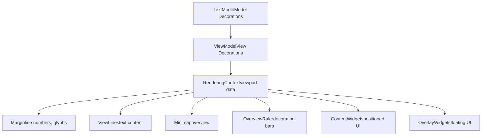
**Sources:** [src/vs/editor/common/model/textModel.ts185-433](https://github.com/microsoft/vscode/blob/1be3088d/src/vs/editor/common/model/textModel.ts#L185-L433) [src/vs/editor/common/viewModel/viewModelImpl.ts51-169](https://github.com/microsoft/vscode/blob/1be3088d/src/vs/editor/common/viewModel/viewModelImpl.ts#L51-L169) [src/vs/editor/browser/view/renderingContext.ts1-159](https://github.com/microsoft/vscode/blob/1be3088d/src/vs/editor/browser/view/renderingContext.ts#L1-L159)
