# Workbench Architecture

Relevant source files

-   [src/vs/platform/action/common/action.ts](https://github.com/microsoft/vscode/blob/1be3088d/src/vs/platform/action/common/action.ts)
-   [src/vs/platform/actions/browser/actionViewItemService.ts](https://github.com/microsoft/vscode/blob/1be3088d/src/vs/platform/actions/browser/actionViewItemService.ts)
-   [src/vs/platform/actions/browser/menuEntryActionViewItem.css](https://github.com/microsoft/vscode/blob/1be3088d/src/vs/platform/actions/browser/menuEntryActionViewItem.css)
-   [src/vs/platform/actions/browser/menuEntryActionViewItem.ts](https://github.com/microsoft/vscode/blob/1be3088d/src/vs/platform/actions/browser/menuEntryActionViewItem.ts)
-   [src/vs/platform/actions/browser/toolbar.ts](https://github.com/microsoft/vscode/blob/1be3088d/src/vs/platform/actions/browser/toolbar.ts)
-   [src/vs/platform/actions/common/actions.ts](https://github.com/microsoft/vscode/blob/1be3088d/src/vs/platform/actions/common/actions.ts)
-   [src/vs/platform/actions/common/menuService.ts](https://github.com/microsoft/vscode/blob/1be3088d/src/vs/platform/actions/common/menuService.ts)
-   [src/vs/platform/editor/common/editor.ts](https://github.com/microsoft/vscode/blob/1be3088d/src/vs/platform/editor/common/editor.ts)
-   [src/vs/platform/observable/common/platformObservableUtils.ts](https://github.com/microsoft/vscode/blob/1be3088d/src/vs/platform/observable/common/platformObservableUtils.ts)
-   [src/vs/workbench/browser/actions/layoutActions.ts](https://github.com/microsoft/vscode/blob/1be3088d/src/vs/workbench/browser/actions/layoutActions.ts)
-   [src/vs/workbench/browser/actions/quickAccessActions.ts](https://github.com/microsoft/vscode/blob/1be3088d/src/vs/workbench/browser/actions/quickAccessActions.ts)
-   [src/vs/workbench/browser/contextkeys.ts](https://github.com/microsoft/vscode/blob/1be3088d/src/vs/workbench/browser/contextkeys.ts)
-   [src/vs/workbench/browser/dnd.ts](https://github.com/microsoft/vscode/blob/1be3088d/src/vs/workbench/browser/dnd.ts)
-   [src/vs/workbench/browser/layout.ts](https://github.com/microsoft/vscode/blob/1be3088d/src/vs/workbench/browser/layout.ts)
-   [src/vs/workbench/browser/parts/auxiliarybar/auxiliaryBarActions.ts](https://github.com/microsoft/vscode/blob/1be3088d/src/vs/workbench/browser/parts/auxiliarybar/auxiliaryBarActions.ts)
-   [src/vs/workbench/browser/parts/editor/auxiliaryEditorPart.ts](https://github.com/microsoft/vscode/blob/1be3088d/src/vs/workbench/browser/parts/editor/auxiliaryEditorPart.ts)
-   [src/vs/workbench/browser/parts/editor/editor.contribution.ts](https://github.com/microsoft/vscode/blob/1be3088d/src/vs/workbench/browser/parts/editor/editor.contribution.ts)
-   [src/vs/workbench/browser/parts/editor/editor.ts](https://github.com/microsoft/vscode/blob/1be3088d/src/vs/workbench/browser/parts/editor/editor.ts)
-   [src/vs/workbench/browser/parts/editor/editorActions.ts](https://github.com/microsoft/vscode/blob/1be3088d/src/vs/workbench/browser/parts/editor/editorActions.ts)
-   [src/vs/workbench/browser/parts/editor/editorCommands.ts](https://github.com/microsoft/vscode/blob/1be3088d/src/vs/workbench/browser/parts/editor/editorCommands.ts)
-   [src/vs/workbench/browser/parts/editor/editorDropTarget.ts](https://github.com/microsoft/vscode/blob/1be3088d/src/vs/workbench/browser/parts/editor/editorDropTarget.ts)
-   [src/vs/workbench/browser/parts/editor/editorGroupView.ts](https://github.com/microsoft/vscode/blob/1be3088d/src/vs/workbench/browser/parts/editor/editorGroupView.ts)
-   [src/vs/workbench/browser/parts/editor/editorPart.ts](https://github.com/microsoft/vscode/blob/1be3088d/src/vs/workbench/browser/parts/editor/editorPart.ts)
-   [src/vs/workbench/browser/parts/editor/editorParts.ts](https://github.com/microsoft/vscode/blob/1be3088d/src/vs/workbench/browser/parts/editor/editorParts.ts)
-   [src/vs/workbench/browser/parts/panel/panelActions.ts](https://github.com/microsoft/vscode/blob/1be3088d/src/vs/workbench/browser/parts/panel/panelActions.ts)
-   [src/vs/workbench/browser/parts/titlebar/commandCenterControl.ts](https://github.com/microsoft/vscode/blob/1be3088d/src/vs/workbench/browser/parts/titlebar/commandCenterControl.ts)
-   [src/vs/workbench/browser/parts/titlebar/media/titlebarpart.css](https://github.com/microsoft/vscode/blob/1be3088d/src/vs/workbench/browser/parts/titlebar/media/titlebarpart.css)
-   [src/vs/workbench/browser/parts/titlebar/titlebarActions.ts](https://github.com/microsoft/vscode/blob/1be3088d/src/vs/workbench/browser/parts/titlebar/titlebarActions.ts)
-   [src/vs/workbench/browser/parts/titlebar/titlebarPart.ts](https://github.com/microsoft/vscode/blob/1be3088d/src/vs/workbench/browser/parts/titlebar/titlebarPart.ts)
-   [src/vs/workbench/browser/parts/titlebar/windowTitle.ts](https://github.com/microsoft/vscode/blob/1be3088d/src/vs/workbench/browser/parts/titlebar/windowTitle.ts)
-   [src/vs/workbench/browser/workbench.contribution.ts](https://github.com/microsoft/vscode/blob/1be3088d/src/vs/workbench/browser/workbench.contribution.ts)
-   [src/vs/workbench/browser/workbench.ts](https://github.com/microsoft/vscode/blob/1be3088d/src/vs/workbench/browser/workbench.ts)
-   [src/vs/workbench/common/contextkeys.ts](https://github.com/microsoft/vscode/blob/1be3088d/src/vs/workbench/common/contextkeys.ts)
-   [src/vs/workbench/common/editor.ts](https://github.com/microsoft/vscode/blob/1be3088d/src/vs/workbench/common/editor.ts)
-   [src/vs/workbench/contrib/chat/browser/widget/chatContentParts/chatInlineAnchorWidget.ts](https://github.com/microsoft/vscode/blob/1be3088d/src/vs/workbench/contrib/chat/browser/widget/chatContentParts/chatInlineAnchorWidget.ts)
-   [src/vs/workbench/contrib/chat/browser/widget/chatContentParts/chatMarkdownDecorationsRenderer.ts](https://github.com/microsoft/vscode/blob/1be3088d/src/vs/workbench/contrib/chat/browser/widget/chatContentParts/chatMarkdownDecorationsRenderer.ts)
-   [src/vs/workbench/contrib/chat/browser/widget/chatContentParts/media/chatInlineAnchorWidget.css](https://github.com/microsoft/vscode/blob/1be3088d/src/vs/workbench/contrib/chat/browser/widget/chatContentParts/media/chatInlineAnchorWidget.css)
-   [src/vs/workbench/contrib/debug/browser/statusbarColorProvider.ts](https://github.com/microsoft/vscode/blob/1be3088d/src/vs/workbench/contrib/debug/browser/statusbarColorProvider.ts)
-   [src/vs/workbench/services/actions/common/menusExtensionPoint.ts](https://github.com/microsoft/vscode/blob/1be3088d/src/vs/workbench/services/actions/common/menusExtensionPoint.ts)
-   [src/vs/workbench/services/editor/browser/editorService.ts](https://github.com/microsoft/vscode/blob/1be3088d/src/vs/workbench/services/editor/browser/editorService.ts)
-   [src/vs/workbench/services/editor/common/editorGroupsService.ts](https://github.com/microsoft/vscode/blob/1be3088d/src/vs/workbench/services/editor/common/editorGroupsService.ts)
-   [src/vs/workbench/services/editor/common/editorService.ts](https://github.com/microsoft/vscode/blob/1be3088d/src/vs/workbench/services/editor/common/editorService.ts)
-   [src/vs/workbench/services/editor/test/browser/editorGroupsService.test.ts](https://github.com/microsoft/vscode/blob/1be3088d/src/vs/workbench/services/editor/test/browser/editorGroupsService.test.ts)
-   [src/vs/workbench/services/editor/test/browser/editorService.test.ts](https://github.com/microsoft/vscode/blob/1be3088d/src/vs/workbench/services/editor/test/browser/editorService.test.ts)
-   [src/vs/workbench/services/layout/browser/layoutService.ts](https://github.com/microsoft/vscode/blob/1be3088d/src/vs/workbench/services/layout/browser/layoutService.ts)
-   [src/vs/workbench/test/browser/workbenchTestServices.ts](https://github.com/microsoft/vscode/blob/1be3088d/src/vs/workbench/test/browser/workbenchTestServices.ts)

## Purpose and Scope

This document describes the **Workbench Architecture**, which is the core UI framework of VS Code. The workbench is responsible for:

-   Organizing the application layout using a grid-based system
-   Managing UI **parts** (titlebar, sidebar, panel, editor area, status bar, etc.)
-   Coordinating editor lifecycle and groups
-   Providing context-aware actions and menus
-   Managing UI state through context keys

For information about the Monaco Editor (text editing engine), see [4](/microsoft/vscode/4-monaco-editor). For information about specific features built on top of the workbench (Terminal, Notebooks, Chat, etc.), see their respective sections.

---

## Layout System

The workbench uses a **grid-based layout** powered by `SerializableGrid` to organize the UI into flexible, resizable parts. The layout orchestrator is the `Layout` class, which manages all workbench parts and their positions.

### Layout Class and Grid Structure

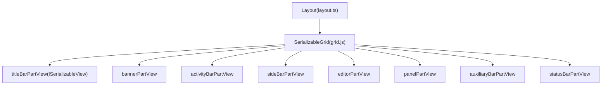
**Layout Grid Structure**

The `Layout` class maintains references to all part views and arranges them using `SerializableGrid`. Each part implements `ISerializableView` to participate in the grid layout system.

**Sources:** [src/vs/workbench/browser/layout.ts138-305](https://github.com/microsoft/vscode/blob/1be3088d/src/vs/workbench/browser/layout.ts#L138-L305)

### Part Types and Organization

Parts are classified into two categories:

| Part Type | Parts | Description |
| --- | --- | --- |
| **Single Window** | Titlebar, Banner, Editor Area, Status Bar | Exist only in the main window |
| **Multi Window** | Sidebar, Panel, Auxiliary Bar | Can exist in auxiliary windows |

The distinction is defined in constants:

-   `SINGLE_WINDOW_PARTS`: Parts that only appear in main window
-   `MULTI_WINDOW_PARTS`: Parts that can appear in auxiliary windows

**Sources:** [src/vs/workbench/services/layout/browser/layoutService.ts1-200](https://github.com/microsoft/vscode/blob/1be3088d/src/vs/workbench/services/layout/browser/layoutService.ts#L1-L200)

---

## Parts Architecture

Each part extends the `Part` base class and implements specific UI functionality. Parts are responsible for:

-   Rendering their UI elements
-   Managing their own size constraints
-   Responding to visibility changes
-   Persisting their state

### Part Class Hierarchy

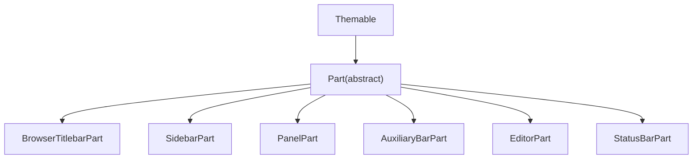
**Part Interface**

Each part must implement:

-   `minimumWidth`, `maximumWidth`, `minimumHeight`, `maximumHeight`: Size constraints
-   `layout(dimension: IDimension)`: Called when the part needs to relayout
-   `createContentArea(parent: HTMLElement)`: Creates the part's DOM structure

**Sources:** [src/vs/workbench/browser/part.ts1-200](https://github.com/microsoft/vscode/blob/1be3088d/src/vs/workbench/browser/part.ts#L1-L200)

### Titlebar Part

The titlebar displays the window title, menu bar (on some platforms), and window controls. It adapts to different title bar styles and platforms.

**Key Components:**

-   `WindowTitle`: Manages window title text and variables
-   `CustomMenubarControl`: Custom menu bar implementation (Windows/Linux)
-   `CommandCenterControl`: Quick pick search in title bar
-   Activity and account actions

**Sources:** [src/vs/workbench/browser/parts/titlebar/titlebarPart.ts88-310](https://github.com/microsoft/vscode/blob/1be3088d/src/vs/workbench/browser/parts/titlebar/titlebarPart.ts#L88-L310)

### Sidebar, Panel, and Auxiliary Bar

These parts host **view containers** using the pane composite system:

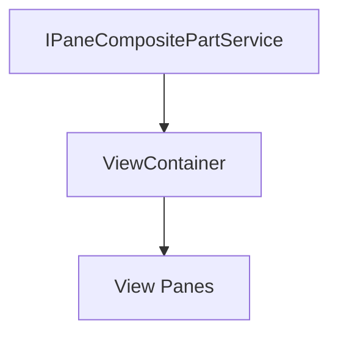
-   **Sidebar**: Primary side bar (typically on left, contains Explorer, Search, etc.)
-   **Panel**: Bottom panel (Terminal, Output, Problems, Debug Console)
-   **Auxiliary Bar**: Secondary side bar (opposite side from primary sidebar)

**Sources:** [src/vs/workbench/browser/parts/sidebar/sidebarPart.ts1-100](https://github.com/microsoft/vscode/blob/1be3088d/src/vs/workbench/browser/parts/sidebar/sidebarPart.ts#L1-L100) [src/vs/workbench/browser/parts/panel/panelPart.ts1-100](https://github.com/microsoft/vscode/blob/1be3088d/src/vs/workbench/browser/parts/panel/panelPart.ts#L1-L100) [src/vs/workbench/browser/parts/auxiliarybar/auxiliaryBarPart.ts1-100](https://github.com/microsoft/vscode/blob/1be3088d/src/vs/workbench/browser/parts/auxiliarybar/auxiliaryBarPart.ts#L1-L100)

---

## Editor Part Architecture

The **Editor Part** is the most complex workbench part, managing multiple editor groups and their lifecycle.

### Editor Part Components

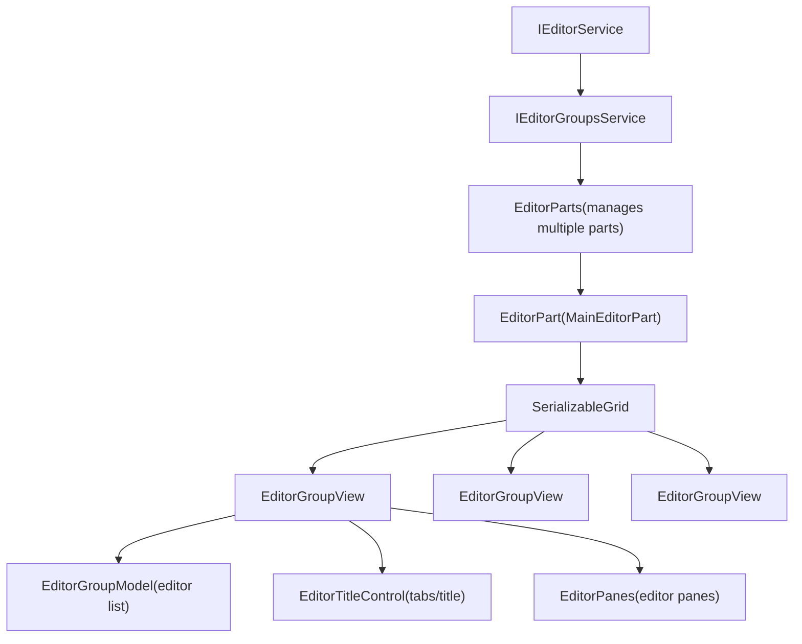
**Sources:** [src/vs/workbench/browser/parts/editor/editorPart.ts1-100](https://github.com/microsoft/vscode/blob/1be3088d/src/vs/workbench/browser/parts/editor/editorPart.ts#L1-L100) [src/vs/workbench/browser/parts/editor/editorParts.ts1-100](https://github.com/microsoft/vscode/blob/1be3088d/src/vs/workbench/browser/parts/editor/editorParts.ts#L1-L100)

### Editor Groups

Editor groups organize editors into tabbed containers. Multiple groups can be arranged in a grid layout (split editors).

**EditorGroupView** (`editorGroupView.ts`):

-   Manages a single editor group
-   Contains `EditorGroupModel` for editor state
-   Contains `EditorTitleControl` for tab rendering
-   Contains `EditorPanes` for editor pane rendering

**Key Properties:**

-   `id`: Unique `GroupIdentifier`
-   `label`: Human-readable label
-   `index`: Position in the groups order
-   `activeEditor`: Currently active editor in the group
-   `isLocked`: Whether the group is locked (prevents certain operations)

**Sources:** [src/vs/workbench/browser/parts/editor/editorGroupView.ts62-248](https://github.com/microsoft/vscode/blob/1be3088d/src/vs/workbench/browser/parts/editor/editorGroupView.ts#L62-L248)

### Editor Group Model

The `EditorGroupModel` manages the list of open editors within a group:

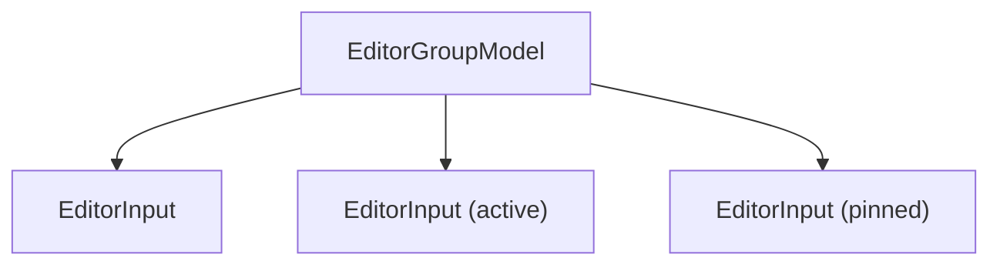
**Editor States:**

-   **Active**: The currently visible editor
-   **Pinned**: Editors that won't be replaced by preview editors
-   **Sticky**: Editors that stay at the start of the tab list
-   **Preview**: Temporary editors (shown in italics, replaced when opening new editors)

**Sources:** [src/vs/workbench/common/editor/editorGroupModel.ts1-300](https://github.com/microsoft/vscode/blob/1be3088d/src/vs/workbench/common/editor/editorGroupModel.ts#L1-L300)

### Editor Service vs Editor Groups Service

**IEditorGroupsService** (`editorGroupsService.ts`):

-   Manages editor group lifecycle (create, remove, move, merge)
-   Provides grid layout operations
-   Fires events for group changes

**IEditorService** (`editorService.ts`):

-   High-level editor opening API
-   Handles editor resolution and creation
-   Manages active editor and visible editors
-   Coordinates with `EditorResolverService` for custom editors

**Key Methods:**

| Service | Method | Description |
| --- | --- | --- |
| `IEditorGroupsService` | `addGroup(location, direction)` | Creates a new editor group |
| `IEditorGroupsService` | `moveGroup(group, location, direction)` | Moves an editor group |
| `IEditorGroupsService` | `mergeGroup(group, target)` | Merges two groups |
| `IEditorService` | `openEditor(editor, options, group)` | Opens an editor |
| `IEditorService` | `replaceEditors(editors, group)` | Replaces editors |
| `IEditorService` | `save(editors, options)` | Saves editors |

**Sources:** [src/vs/workbench/services/editor/common/editorGroupsService.ts1-300](https://github.com/microsoft/vscode/blob/1be3088d/src/vs/workbench/services/editor/common/editorGroupsService.ts#L1-L300) [src/vs/workbench/services/editor/common/editorService.ts1-200](https://github.com/microsoft/vscode/blob/1be3088d/src/vs/workbench/services/editor/common/editorService.ts#L1-L200) [src/vs/workbench/services/editor/browser/editorService.ts39-95](https://github.com/microsoft/vscode/blob/1be3088d/src/vs/workbench/services/editor/browser/editorService.ts#L39-L95)

---

## Layout State Management

The workbench persists and manages layout state through the `LayoutStateModel` class.

### Layout State Keys

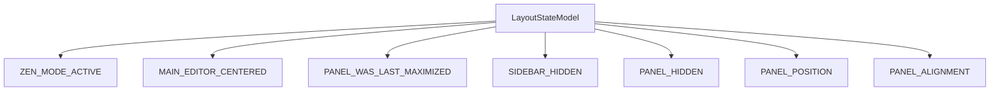
State is stored in:

-   **Storage Service**: Persisted across sessions (`StorageScope.PROFILE` or `StorageScope.WORKSPACE`)
-   **Configuration Service**: User/workspace settings
-   **Runtime Memory**: Temporary state during session

**Sources:** [src/vs/workbench/browser/layout.ts649-768](https://github.com/microsoft/vscode/blob/1be3088d/src/vs/workbench/browser/layout.ts#L649-L768)

### Part Visibility Control

Parts can be shown/hidden programmatically:

```
// Methods from IWorkbenchLayoutService
isVisible(part: Parts): boolean
setPartHidden(hidden: boolean, part: Parts): void
toggleMaximizedPanel(): void
toggleZenMode(): void
```
The layout tracks visibility through:

-   CSS classes (`LayoutClasses.SIDEBAR_HIDDEN`, etc.)
-   State model keys
-   Context keys for enabling/disabling commands

**Sources:** [src/vs/workbench/browser/layout.ts1100-1500](https://github.com/microsoft/vscode/blob/1be3088d/src/vs/workbench/browser/layout.ts#L1100-L1500)

---

## Context Keys and State

Context keys drive conditional UI rendering and command enablement throughout the workbench.

### Workbench Context Keys

```mermaid
flowchart TD
    IsAuxiliaryWindowContext["IsAuxiliaryWindowContext"]
    IsAuxiliaryWindowFocusedContext["IsAuxiliaryWindowFocusedContext"]
    ActiveEditorContext["ActiveEditorContext"]
    ActiveEditorDirtyContext["ActiveEditorDirtyContext"]
    ActiveEditorPinnedContext["ActiveEditorPinnedContext"]
    ActiveEditorStickyContext["ActiveEditorStickyContext"]
    EditorGroupEditorsCountContext["EditorGroupEditorsCountContext"]
    IsMainEditorCenteredLayoutContext["IsMainEditorCenteredLayoutContext"]
    InEditorZenModeContext["InEditorZenModeContext"]
    PanelPositionContext["PanelPositionContext"]
    PanelAlignmentContext["PanelAlignmentContext"]
    SideBarVisibleContext["SideBarVisibleContext"]
    PanelVisibleContext["PanelVisibleContext"]
    AuxiliaryBarVisibleContext["AuxiliaryBarVisibleContext"]
    EditorTabsVisibleContext["EditorTabsVisibleContext"]
```
**Context Key Binding:**

Context keys are bound at different scopes:

-   **Window-scoped**: Shared across all parts in a window
-   **Part-scoped**: Specific to a workbench part
-   **Group-scoped**: Specific to an editor group

Example from `EditorGroupView`:

```
// Scoped context keys for editor group
const groupActiveEditorDirtyContext =
    this.editorPartsView.bind(ActiveEditorDirtyContext, this);
const groupActiveEditorPinnedContext =
    this.editorPartsView.bind(ActiveEditorPinnedContext, this);
```
**Sources:** [src/vs/workbench/common/contextkeys.ts1-300](https://github.com/microsoft/vscode/blob/1be3088d/src/vs/workbench/common/contextkeys.ts#L1-L300) [src/vs/workbench/browser/contextkeys.ts1-200](https://github.com/microsoft/vscode/blob/1be3088d/src/vs/workbench/browser/contextkeys.ts#L1-L200) [src/vs/workbench/browser/parts/editor/editorGroupView.ts249-273](https://github.com/microsoft/vscode/blob/1be3088d/src/vs/workbench/browser/parts/editor/editorGroupView.ts#L249-L273)

### When Clauses

Actions and menus use context key expressions in `when` clauses:

```
// From editor actions
when: ContextKeyExpr.and(
    ActiveEditorContext,
    ActiveEditorDirtyContext.negate()
)
```
**Common Patterns:**

-   `ActiveEditorGroupEmptyContext`: No editors in active group
-   `MultipleEditorGroupsContext`: More than one editor group
-   `EditorPartMaximizedEditorGroupContext`: An editor group is maximized
-   `SideBySideEditorActiveContext`: Active editor is side-by-side

**Sources:** [src/vs/workbench/browser/parts/editor/editor.contribution.ts1-100](https://github.com/microsoft/vscode/blob/1be3088d/src/vs/workbench/browser/parts/editor/editor.contribution.ts#L1-L100)

---

## Actions and Menu System

The workbench uses a declarative menu system powered by `MenuRegistry` and `IMenuService`.

### Menu Architecture

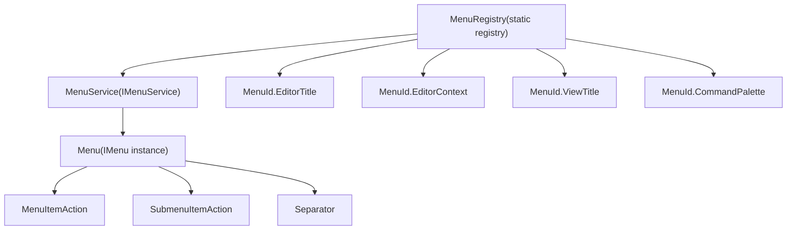
**Menu Registration:**

Menus are registered using `MenuRegistry.appendMenuItem`:

```
MenuRegistry.appendMenuItem(MenuId.EditorTitle, {
    command: {
        id: 'workbench.action.splitEditor',
        title: 'Split Editor'
    },
    when: ContextKeyExpr.not('isInDiffEditor'),
    group: 'navigation',
    order: 100
});
```
**Sources:** [src/vs/platform/actions/common/actions.ts1-450](https://github.com/microsoft/vscode/blob/1be3088d/src/vs/platform/actions/common/actions.ts#L1-L450) [src/vs/platform/actions/common/menuService.ts1-300](https://github.com/microsoft/vscode/blob/1be3088d/src/vs/platform/actions/common/menuService.ts#L1-L300)

### Action2 Pattern

Modern workbench actions use the `Action2` base class:

```
class ToggleSidebarAction extends Action2 {
    constructor() {
        super({
            id: 'workbench.action.toggleSidebarVisibility',
            title: localize2('toggleSidebar', "Toggle Primary Side Bar Visibility"),
            category: Categories.View,
            f1: true, // Show in command palette
            keybinding: {
                weight: KeybindingWeight.WorkbenchContrib,
                primary: KeyMod.CtrlCmd | KeyCode.KeyB
            },
            toggled: SideBarVisibleContext
        });
    }

    run(accessor: ServicesAccessor): void {
        const layoutService = accessor.get(IWorkbenchLayoutService);
        layoutService.setPartHidden(
            layoutService.isVisible(Parts.SIDEBAR_PART),
            Parts.SIDEBAR_PART
        );
    }
}
```
**Sources:** [src/vs/workbench/browser/actions/layoutActions.ts1-300](https://github.com/microsoft/vscode/blob/1be3088d/src/vs/workbench/browser/actions/layoutActions.ts#L1-L300)

### Menu Contribution Points

Key menu IDs for workbench UI:

| MenuId | Location | Example Actions |
| --- | --- | --- |
| `MenuId.EditorTitle` | Editor tab toolbar | Split, Close |
| `MenuId.EditorTitleContext` | Editor tab context menu | Close Others, Pin |
| `MenuId.ViewTitle` | View title bar | Refresh, Filter |
| `MenuId.ViewContainerTitle` | View container title | Add View |
| `MenuId.TitleBar` | Window title bar | Custom title actions |
| `MenuId.MenubarFileMenu` | File menu (menubar) | New File, Open |
| `MenuId.CommandPalette` | Command palette | All F1 commands |

**Sources:** [src/vs/platform/actions/common/actions.ts65-300](https://github.com/microsoft/vscode/blob/1be3088d/src/vs/platform/actions/common/actions.ts#L65-L300)

---

## Editor Lifecycle and Opening

### Editor Input Resolution

When opening an editor, the flow is:

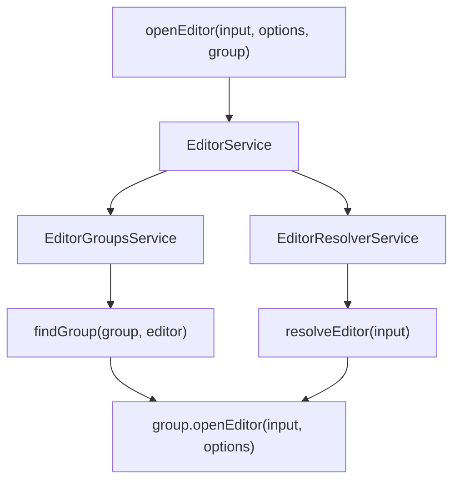
**Steps:**

1.  **Editor Resolution**: `EditorResolverService` converts untyped inputs to typed `EditorInput` instances
2.  **Group Finding**: Determines which group to open the editor in (active, side, new, etc.)
3.  **Opening**: `EditorGroupView.openEditor()` adds the editor to the group and activates it

**Sources:** [src/vs/workbench/services/editor/browser/editorService.ts232-450](https://github.com/microsoft/vscode/blob/1be3088d/src/vs/workbench/services/editor/browser/editorService.ts#L232-L450)

### Editor Pane Lifecycle

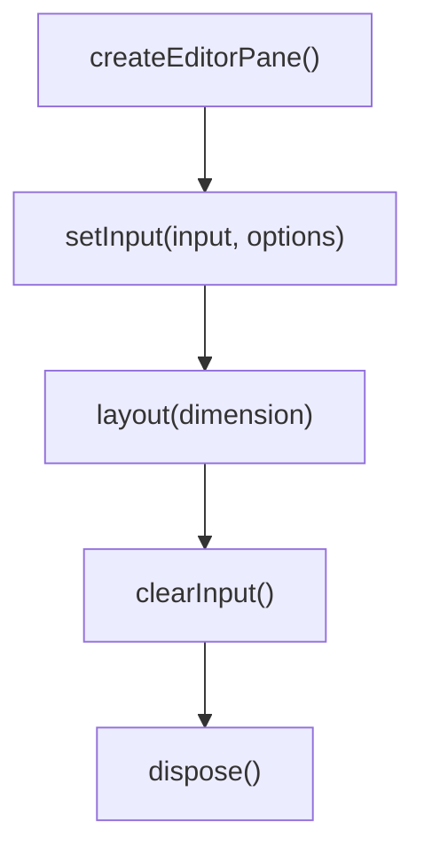
**Key Lifecycle Methods:**

-   `createEditorPane(descriptor, group)`: Instantiates the editor pane
-   `setInput(input, options)`: Loads content into the editor
-   `clearInput()`: Clears the editor before switching to a new input
-   `layout(dimension)`: Resizes the editor
-   `getControl()`: Returns the underlying editor control (e.g., `ICodeEditor`)

**Sources:** [src/vs/workbench/browser/parts/editor/editorPane.ts1-200](https://github.com/microsoft/vscode/blob/1be3088d/src/vs/workbench/browser/parts/editor/editorPane.ts#L1-L200) [src/vs/workbench/common/editor.ts86-210](https://github.com/microsoft/vscode/blob/1be3088d/src/vs/workbench/common/editor.ts#L86-L210)

---

## Layout Configuration

### Workbench Settings

The workbench behavior is controlled by numerous settings:

| Setting | Description | Default |
| --- | --- | --- |
| `workbench.editor.showTabs` | Editor tabs mode (multiple/single/none) | `multiple` |
| `workbench.sideBar.location` | Sidebar position (left/right) | `left` |
| `workbench.panel.defaultLocation` | Panel position (bottom/right/left) | `bottom` |
| `workbench.activityBar.location` | Activity bar position | `default` |
| `workbench.editor.centeredLayoutAutoResize` | Auto-resize centered layout | `true` |
| `window.titleBarStyle` | Title bar style (native/custom) | platform-specific |
| `workbench.layoutControl.enabled` | Show layout control | `true` |

**Sources:** [src/vs/workbench/browser/workbench.contribution.ts30-700](https://github.com/microsoft/vscode/blob/1be3088d/src/vs/workbench/browser/workbench.contribution.ts#L30-L700)

### Dynamic Configuration

The `DynamicWindowConfiguration` class monitors configuration changes and updates the UI:

```
class DynamicWindowConfiguration extends Disposable {
    private registerListeners(): void {
        this._register(this.configurationService.onDidChangeConfiguration(e => {
            if (TITLE_BAR_SETTINGS.some(setting => e.affectsConfiguration(setting))) {
                this.updateTitleBar();
            }
        }));
    }
}
```
**Title Bar Settings** that trigger layout updates:

-   `workbench.activityBar.location`
-   `workbench.commandCenter`
-   `workbench.editor.editorActionsLocation`
-   `window.titleBarStyle`
-   `window.menuBarVisibility`

**Sources:** [src/vs/workbench/browser/layout.ts118-134](https://github.com/microsoft/vscode/blob/1be3088d/src/vs/workbench/browser/layout.ts#L118-L134) [src/vs/workbench/browser/layout.ts385-418](https://github.com/microsoft/vscode/blob/1be3088d/src/vs/workbench/browser/layout.ts#L385-L418)

---

## Multi-Window Support

The workbench supports multiple windows, with auxiliary windows containing subset of parts.

### Window Architecture

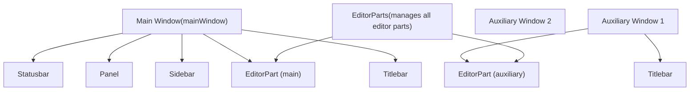
**Auxiliary Windows:**

-   Created via `IAuxiliaryWindowService`
-   Contain their own titlebar and editor part
-   Share services with main window (via scoped instantiation)
-   Can be created by dragging editor groups out of main window

**Context Keys:**

-   `IsAuxiliaryWindowContext`: True when in auxiliary window
-   `IsAuxiliaryWindowFocusedContext`: True when auxiliary window is focused

**Sources:** [src/vs/workbench/browser/parts/editor/editorParts.ts1-200](https://github.com/microsoft/vscode/blob/1be3088d/src/vs/workbench/browser/parts/editor/editorParts.ts#L1-L200) [src/vs/workbench/browser/parts/editor/auxiliaryEditorPart.ts1-100](https://github.com/microsoft/vscode/blob/1be3088d/src/vs/workbench/browser/parts/editor/auxiliaryEditorPart.ts#L1-L100) [src/vs/workbench/browser/layout.ts449-461](https://github.com/microsoft/vscode/blob/1be3088d/src/vs/workbench/browser/layout.ts#L449-L461)

---

## Zen Mode

Zen Mode is a distraction-free mode that hides most UI elements.

### Zen Mode State

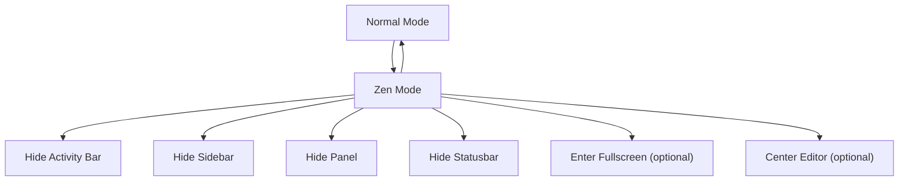
**Zen Mode Settings:**

-   `zenMode.fullScreen`: Enter fullscreen when entering zen mode
-   `zenMode.centerLayout`: Center the editor layout
-   `zenMode.hideActivityBar`: Hide the activity bar
-   `zenMode.hideStatusBar`: Hide the status bar
-   `zenMode.hideTabs`: Hide editor tabs
-   `zenMode.restore`: Restore zen mode on restart

**Implementation:** The layout stores the previous visibility state before entering zen mode and restores it when exiting:

```
interface IZenModeExitInfo {
    readonly transitionedToFullScreen: boolean;
    readonly transitionedToCenteredEditorLayout: boolean;
    readonly handleNotificationsDoNotDisturbMode: boolean;
    readonly wasVisible: {
        readonly auxiliaryBar: boolean;
        readonly panel: boolean;
        readonly sideBar: boolean;
    };
}
```
**Sources:** [src/vs/workbench/browser/layout.ts1800-2100](https://github.com/microsoft/vscode/blob/1be3088d/src/vs/workbench/browser/layout.ts#L1800-L2100)

---

## Drag and Drop System

The workbench supports drag and drop for editors, files, and UI elements.

### Editor Drag and Drop

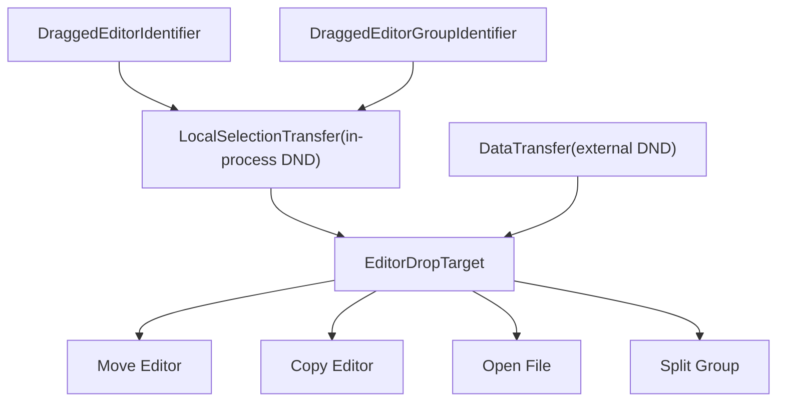
**EditorDropTarget** (`editorDropTarget.ts`):

-   Renders drop overlay showing split directions
-   Determines drop position (center, left, right, top, bottom)
-   Handles both internal editor moves and external file drops

**Drop Zones:**

-   **Center**: Replace/add to existing group
-   **Edge**: Create new group in that direction

**Sources:** [src/vs/workbench/browser/parts/editor/editorDropTarget.ts1-300](https://github.com/microsoft/vscode/blob/1be3088d/src/vs/workbench/browser/parts/editor/editorDropTarget.ts#L1-L300) [src/vs/workbench/browser/dnd.ts1-300](https://github.com/microsoft/vscode/blob/1be3088d/src/vs/workbench/browser/dnd.ts#L1-L300)

---

## Summary

The Workbench Architecture provides:

1.  **Grid-based Layout**: Flexible, resizable parts using `SerializableGrid`
2.  **Part System**: Modular UI components (titlebar, sidebar, panel, editor, status bar)
3.  **Editor Management**: Multi-group editor system with tabs, preview, and pinning
4.  **Service Coordination**: `IEditorService`, `IEditorGroupsService`, `IWorkbenchLayoutService`
5.  **Context-Driven UI**: Context keys control command enablement and menu visibility
6.  **Declarative Actions**: Menu system with when clauses and contribution points
7.  **Multi-Window Support**: Auxiliary windows with their own editor parts
8.  **State Persistence**: Layout state stored across sessions

The workbench serves as the foundation upon which all VS Code features are built, providing consistent UI patterns and lifecycle management.

**Sources:** [src/vs/workbench/browser/layout.ts1-2500](https://github.com/microsoft/vscode/blob/1be3088d/src/vs/workbench/browser/layout.ts#L1-L2500) [src/vs/workbench/browser/workbench.ts1-500](https://github.com/microsoft/vscode/blob/1be3088d/src/vs/workbench/browser/workbench.ts#L1-L500) [src/vs/workbench/services/layout/browser/layoutService.ts1-500](https://github.com/microsoft/vscode/blob/1be3088d/src/vs/workbench/services/layout/browser/layoutService.ts#L1-L500)
