# Layout System and Parts

Relevant source files

-   [src/vs/platform/action/common/action.ts](https://github.com/microsoft/vscode/blob/1be3088d/src/vs/platform/action/common/action.ts)
-   [src/vs/platform/actions/browser/actionViewItemService.ts](https://github.com/microsoft/vscode/blob/1be3088d/src/vs/platform/actions/browser/actionViewItemService.ts)
-   [src/vs/platform/actions/browser/menuEntryActionViewItem.css](https://github.com/microsoft/vscode/blob/1be3088d/src/vs/platform/actions/browser/menuEntryActionViewItem.css)
-   [src/vs/platform/actions/browser/menuEntryActionViewItem.ts](https://github.com/microsoft/vscode/blob/1be3088d/src/vs/platform/actions/browser/menuEntryActionViewItem.ts)
-   [src/vs/platform/actions/browser/toolbar.ts](https://github.com/microsoft/vscode/blob/1be3088d/src/vs/platform/actions/browser/toolbar.ts)
-   [src/vs/platform/actions/common/actions.ts](https://github.com/microsoft/vscode/blob/1be3088d/src/vs/platform/actions/common/actions.ts)
-   [src/vs/platform/actions/common/menuService.ts](https://github.com/microsoft/vscode/blob/1be3088d/src/vs/platform/actions/common/menuService.ts)
-   [src/vs/platform/editor/common/editor.ts](https://github.com/microsoft/vscode/blob/1be3088d/src/vs/platform/editor/common/editor.ts)
-   [src/vs/platform/observable/common/platformObservableUtils.ts](https://github.com/microsoft/vscode/blob/1be3088d/src/vs/platform/observable/common/platformObservableUtils.ts)
-   [src/vs/workbench/browser/actions/layoutActions.ts](https://github.com/microsoft/vscode/blob/1be3088d/src/vs/workbench/browser/actions/layoutActions.ts)
-   [src/vs/workbench/browser/actions/quickAccessActions.ts](https://github.com/microsoft/vscode/blob/1be3088d/src/vs/workbench/browser/actions/quickAccessActions.ts)
-   [src/vs/workbench/browser/contextkeys.ts](https://github.com/microsoft/vscode/blob/1be3088d/src/vs/workbench/browser/contextkeys.ts)
-   [src/vs/workbench/browser/dnd.ts](https://github.com/microsoft/vscode/blob/1be3088d/src/vs/workbench/browser/dnd.ts)
-   [src/vs/workbench/browser/layout.ts](https://github.com/microsoft/vscode/blob/1be3088d/src/vs/workbench/browser/layout.ts)
-   [src/vs/workbench/browser/parts/auxiliarybar/auxiliaryBarActions.ts](https://github.com/microsoft/vscode/blob/1be3088d/src/vs/workbench/browser/parts/auxiliarybar/auxiliaryBarActions.ts)
-   [src/vs/workbench/browser/parts/editor/auxiliaryEditorPart.ts](https://github.com/microsoft/vscode/blob/1be3088d/src/vs/workbench/browser/parts/editor/auxiliaryEditorPart.ts)
-   [src/vs/workbench/browser/parts/editor/editor.contribution.ts](https://github.com/microsoft/vscode/blob/1be3088d/src/vs/workbench/browser/parts/editor/editor.contribution.ts)
-   [src/vs/workbench/browser/parts/editor/editor.ts](https://github.com/microsoft/vscode/blob/1be3088d/src/vs/workbench/browser/parts/editor/editor.ts)
-   [src/vs/workbench/browser/parts/editor/editorActions.ts](https://github.com/microsoft/vscode/blob/1be3088d/src/vs/workbench/browser/parts/editor/editorActions.ts)
-   [src/vs/workbench/browser/parts/editor/editorCommands.ts](https://github.com/microsoft/vscode/blob/1be3088d/src/vs/workbench/browser/parts/editor/editorCommands.ts)
-   [src/vs/workbench/browser/parts/editor/editorDropTarget.ts](https://github.com/microsoft/vscode/blob/1be3088d/src/vs/workbench/browser/parts/editor/editorDropTarget.ts)
-   [src/vs/workbench/browser/parts/editor/editorGroupView.ts](https://github.com/microsoft/vscode/blob/1be3088d/src/vs/workbench/browser/parts/editor/editorGroupView.ts)
-   [src/vs/workbench/browser/parts/editor/editorPart.ts](https://github.com/microsoft/vscode/blob/1be3088d/src/vs/workbench/browser/parts/editor/editorPart.ts)
-   [src/vs/workbench/browser/parts/editor/editorParts.ts](https://github.com/microsoft/vscode/blob/1be3088d/src/vs/workbench/browser/parts/editor/editorParts.ts)
-   [src/vs/workbench/browser/parts/panel/panelActions.ts](https://github.com/microsoft/vscode/blob/1be3088d/src/vs/workbench/browser/parts/panel/panelActions.ts)
-   [src/vs/workbench/browser/parts/titlebar/commandCenterControl.ts](https://github.com/microsoft/vscode/blob/1be3088d/src/vs/workbench/browser/parts/titlebar/commandCenterControl.ts)
-   [src/vs/workbench/browser/parts/titlebar/media/titlebarpart.css](https://github.com/microsoft/vscode/blob/1be3088d/src/vs/workbench/browser/parts/titlebar/media/titlebarpart.css)
-   [src/vs/workbench/browser/parts/titlebar/titlebarActions.ts](https://github.com/microsoft/vscode/blob/1be3088d/src/vs/workbench/browser/parts/titlebar/titlebarActions.ts)
-   [src/vs/workbench/browser/parts/titlebar/titlebarPart.ts](https://github.com/microsoft/vscode/blob/1be3088d/src/vs/workbench/browser/parts/titlebar/titlebarPart.ts)
-   [src/vs/workbench/browser/parts/titlebar/windowTitle.ts](https://github.com/microsoft/vscode/blob/1be3088d/src/vs/workbench/browser/parts/titlebar/windowTitle.ts)
-   [src/vs/workbench/browser/workbench.contribution.ts](https://github.com/microsoft/vscode/blob/1be3088d/src/vs/workbench/browser/workbench.contribution.ts)
-   [src/vs/workbench/browser/workbench.ts](https://github.com/microsoft/vscode/blob/1be3088d/src/vs/workbench/browser/workbench.ts)
-   [src/vs/workbench/common/contextkeys.ts](https://github.com/microsoft/vscode/blob/1be3088d/src/vs/workbench/common/contextkeys.ts)
-   [src/vs/workbench/common/editor.ts](https://github.com/microsoft/vscode/blob/1be3088d/src/vs/workbench/common/editor.ts)
-   [src/vs/workbench/contrib/chat/browser/widget/chatContentParts/chatInlineAnchorWidget.ts](https://github.com/microsoft/vscode/blob/1be3088d/src/vs/workbench/contrib/chat/browser/widget/chatContentParts/chatInlineAnchorWidget.ts)
-   [src/vs/workbench/contrib/chat/browser/widget/chatContentParts/chatMarkdownDecorationsRenderer.ts](https://github.com/microsoft/vscode/blob/1be3088d/src/vs/workbench/contrib/chat/browser/widget/chatContentParts/chatMarkdownDecorationsRenderer.ts)
-   [src/vs/workbench/contrib/chat/browser/widget/chatContentParts/media/chatInlineAnchorWidget.css](https://github.com/microsoft/vscode/blob/1be3088d/src/vs/workbench/contrib/chat/browser/widget/chatContentParts/media/chatInlineAnchorWidget.css)
-   [src/vs/workbench/contrib/debug/browser/statusbarColorProvider.ts](https://github.com/microsoft/vscode/blob/1be3088d/src/vs/workbench/contrib/debug/browser/statusbarColorProvider.ts)
-   [src/vs/workbench/services/actions/common/menusExtensionPoint.ts](https://github.com/microsoft/vscode/blob/1be3088d/src/vs/workbench/services/actions/common/menusExtensionPoint.ts)
-   [src/vs/workbench/services/editor/browser/editorService.ts](https://github.com/microsoft/vscode/blob/1be3088d/src/vs/workbench/services/editor/browser/editorService.ts)
-   [src/vs/workbench/services/editor/common/editorGroupsService.ts](https://github.com/microsoft/vscode/blob/1be3088d/src/vs/workbench/services/editor/common/editorGroupsService.ts)
-   [src/vs/workbench/services/editor/common/editorService.ts](https://github.com/microsoft/vscode/blob/1be3088d/src/vs/workbench/services/editor/common/editorService.ts)
-   [src/vs/workbench/services/editor/test/browser/editorGroupsService.test.ts](https://github.com/microsoft/vscode/blob/1be3088d/src/vs/workbench/services/editor/test/browser/editorGroupsService.test.ts)
-   [src/vs/workbench/services/editor/test/browser/editorService.test.ts](https://github.com/microsoft/vscode/blob/1be3088d/src/vs/workbench/services/editor/test/browser/editorService.test.ts)
-   [src/vs/workbench/services/layout/browser/layoutService.ts](https://github.com/microsoft/vscode/blob/1be3088d/src/vs/workbench/services/layout/browser/layoutService.ts)
-   [src/vs/workbench/test/browser/workbenchTestServices.ts](https://github.com/microsoft/vscode/blob/1be3088d/src/vs/workbench/test/browser/workbenchTestServices.ts)

The Layout System is responsible for organizing and managing the visual structure of the VS Code workbench. It orchestrates the positioning, sizing, and visibility of the main UI components (called "parts") such as the titlebar, sidebar, editor area, panel, and statusbar. The system uses a flexible grid-based layout engine to arrange these parts dynamically based on user preferences and window dimensions.

For information about editor management within the editor part, see [Editor Service and Groups](/microsoft/vscode/5.2-editor-service-and-groups). For information about individual view containers and their content, see [View System and Contributions](/microsoft/vscode/5.4-view-system-and-contributions).

---

## Architecture Overview

The layout system is built on three main architectural layers: the Layout Service interface, the Layout implementation class, and the underlying SerializableGrid that manages the spatial arrangement.

### High-Level Layout Architecture

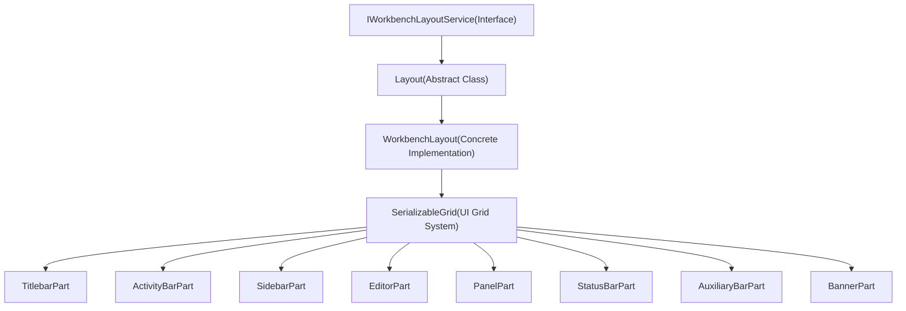
**Sources:** [src/vs/workbench/browser/layout.ts138-305](https://github.com/microsoft/vscode/blob/1be3088d/src/vs/workbench/browser/layout.ts#L138-L305) [src/vs/workbench/services/layout/browser/layoutService.ts1-200](https://github.com/microsoft/vscode/blob/1be3088d/src/vs/workbench/services/layout/browser/layoutService.ts#L1-L200) [src/vs/base/browser/ui/grid/grid.ts1-100](https://github.com/microsoft/vscode/blob/1be3088d/src/vs/base/browser/ui/grid/grid.ts#L1-L100)

---

## Layout Class and Service

The `Layout` class is the central orchestrator for the workbench layout. It implements `IWorkbenchLayoutService` and manages the lifecycle, visibility, and arrangement of all workbench parts.

### Layout Class Structure

```mermaid
flowchart TD
    mainContainer["mainContainer: HTMLElement"]
    workbenchGrid["workbenchGrid: SerializableGrid"]
    parts["parts: Map"]
    state["state: ILayoutState"]
    stateModel["stateModel: LayoutStateModel"]
    titleBarPartView["titleBarPartView: ISerializableView"]
    bannerPartView["bannerPartView: ISerializableView"]
    activityBarPartView["activityBarPartView: ISerializableView"]
    sideBarPartView["sideBarPartView: ISerializableView"]
    editorPartView["editorPartView: ISerializableView"]
    panelPartView["panelPartView: ISerializableView"]
    auxiliaryBarPartView["auxiliaryBarPartView: ISerializableView"]
    statusBarPartView["statusBarPartView: ISerializableView"]

    workbenchGrid --> titleBarPartView
    workbenchGrid --> bannerPartView
    workbenchGrid --> activityBarPartView
    workbenchGrid --> sideBarPartView
    workbenchGrid --> editorPartView
    workbenchGrid --> panelPartView
    workbenchGrid --> auxiliaryBarPartView
    workbenchGrid --> statusBarPartView
```
**Sources:** [src/vs/workbench/browser/layout.ts138-305](https://github.com/microsoft/vscode/blob/1be3088d/src/vs/workbench/browser/layout.ts#L138-L305) [src/vs/workbench/browser/layout.ts262-274](https://github.com/microsoft/vscode/blob/1be3088d/src/vs/workbench/browser/layout.ts#L262-L274)

### Key Responsibilities

The Layout class handles several critical responsibilities:

| Responsibility | Implementation | Key Methods |
| --- | --- | --- |
| **Part Visibility** | Manages show/hide state for all parts | `isVisible()`, `setPartHidden()` |
| **Part Positioning** | Controls sidebar position, panel position and alignment | `setSideBarPosition()`, `setPanelPosition()`, `setPanelAlignment()` |
| **Layout Orchestration** | Triggers layout calculations and DOM updates | `layout()`, `layoutGrid()` |
| **State Persistence** | Saves and restores layout configuration | `stateModel.save()`, `stateModel.load()` |
| **Special Modes** | Manages Zen mode and centered layout | `toggleZenMode()`, `centerMainEditorLayout()` |
| **Multi-Window** | Coordinates layout across multiple windows | `onDidAddContainer`, `containers` |

**Sources:** [src/vs/workbench/browser/layout.ts559-768](https://github.com/microsoft/vscode/blob/1be3088d/src/vs/workbench/browser/layout.ts#L559-L768) [src/vs/workbench/browser/layout.ts1006-1200](https://github.com/microsoft/vscode/blob/1be3088d/src/vs/workbench/browser/layout.ts#L1006-L1200)

### Layout Initialization Flow

> **[Mermaid sequence]**
> *(图表结构无法解析)*

**Sources:** [src/vs/workbench/browser/layout.ts307-337](https://github.com/microsoft/vscode/blob/1be3088d/src/vs/workbench/browser/layout.ts#L307-L337) [src/vs/workbench/browser/layout.ts649-768](https://github.com/microsoft/vscode/blob/1be3088d/src/vs/workbench/browser/layout.ts#L649-L768)

---

## SerializableGrid System

The layout uses `SerializableGrid` from the base UI library to manage the spatial arrangement of parts. This grid system provides flexible resizing, serialization, and dynamic reconfiguration of the layout.

### Grid Structure and Hierarchy

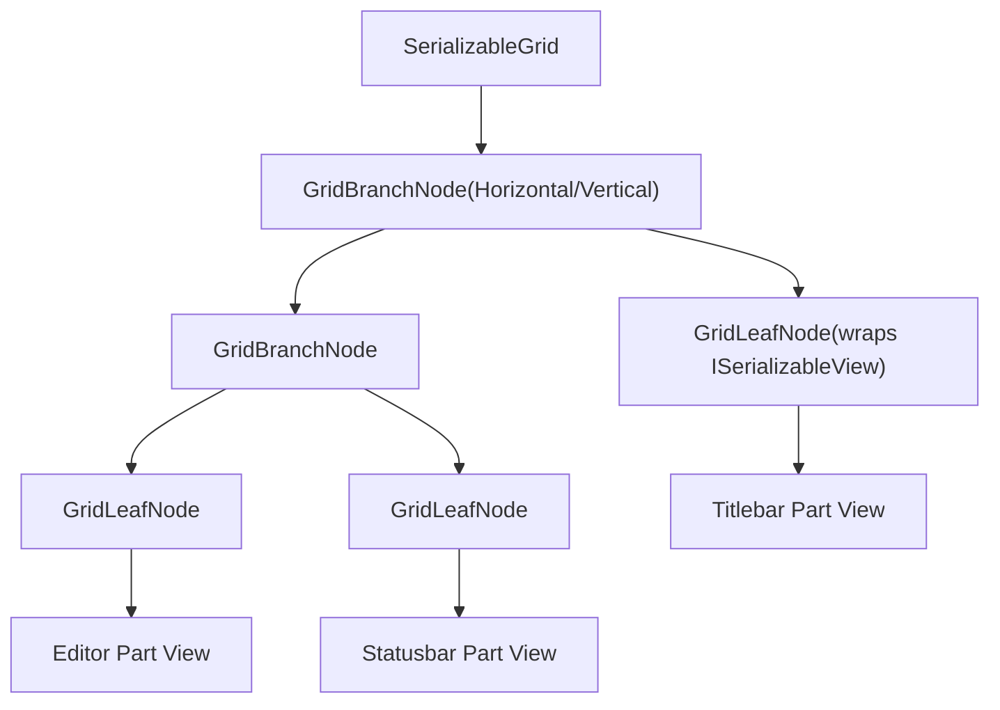
**Sources:** [src/vs/base/browser/ui/grid/grid.ts26-100](https://github.com/microsoft/vscode/blob/1be3088d/src/vs/base/browser/ui/grid/grid.ts#L26-L100) [src/vs/workbench/browser/layout.ts1300-1500](https://github.com/microsoft/vscode/blob/1be3088d/src/vs/workbench/browser/layout.ts#L1300-L1500)

### Grid Operations

The grid supports several key operations for managing the layout:

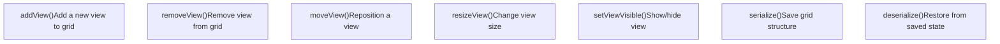
**Sources:** [src/vs/base/browser/ui/grid/grid.ts200-500](https://github.com/microsoft/vscode/blob/1be3088d/src/vs/base/browser/ui/grid/grid.ts#L200-L500) [src/vs/workbench/browser/layout.ts1584-1700](https://github.com/microsoft/vscode/blob/1be3088d/src/vs/workbench/browser/layout.ts#L1584-L1700)

---

## Workbench Parts

Each workbench part is a self-contained UI component that extends the `Part` base class. Parts implement `ISerializableView` to integrate with the grid system.

### Part Hierarchy

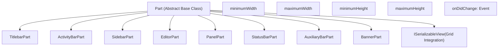
**Sources:** [src/vs/workbench/browser/part.ts1-100](https://github.com/microsoft/vscode/blob/1be3088d/src/vs/workbench/browser/part.ts#L1-L100) [src/vs/base/browser/ui/grid/grid.ts1-50](https://github.com/microsoft/vscode/blob/1be3088d/src/vs/base/browser/ui/grid/grid.ts#L1-L50)

### Part Identifiers (Parts Enum)

The layout system uses the `Parts` enum to identify different parts:

```
enum Parts {
    TITLEBAR_PART = 'workbench.parts.titlebar',
    BANNER_PART = 'workbench.parts.banner',
    ACTIVITYBAR_PART = 'workbench.parts.activitybar',
    SIDEBAR_PART = 'workbench.parts.sidebar',
    PANEL_PART = 'workbench.parts.panel',
    AUXILIARYBAR_PART = 'workbench.parts.auxiliarybar',
    EDITOR_PART = 'workbench.parts.editor',
    STATUSBAR_PART = 'workbench.parts.statusbar'
}
```
**Sources:** [src/vs/workbench/services/layout/browser/layoutService.ts50-100](https://github.com/microsoft/vscode/blob/1be3088d/src/vs/workbench/services/layout/browser/layoutService.ts#L50-L100)

### Part Characteristics

| Part | Position | Multi-Window | Resizable | Key Features |
| --- | --- | --- | --- | --- |
| **Titlebar** | Top | Yes (auxiliary) | No | Window title, menu bar, window controls |
| **Banner** | Below titlebar | No (main only) | No | Notifications, warnings |
| **Activity Bar** | Left/Right | No (main only) | No | View switcher icons |
| **Sidebar** | Left/Right | No (main only) | Yes | Primary side panel with views |
| **Editor** | Center | Yes (auxiliary) | Yes | Main content editing area |
| **Panel** | Bottom/Right/Left | No (main only) | Yes | Terminal, output, problems |
| **Auxiliary Bar** | Opposite of sidebar | No (main only) | Yes | Secondary side panel |
| **Statusbar** | Bottom | No (main only) | No | Status indicators |

**Sources:** [src/vs/workbench/services/layout/browser/layoutService.ts1-200](https://github.com/microsoft/vscode/blob/1be3088d/src/vs/workbench/services/layout/browser/layoutService.ts#L1-L200) [src/vs/workbench/browser/layout.ts262-274](https://github.com/microsoft/vscode/blob/1be3088d/src/vs/workbench/browser/layout.ts#L262-L274)

---

## Layout Configuration and State

The layout system maintains configuration through multiple mechanisms: user settings, persisted state in storage, and runtime state.

### Configuration Sources

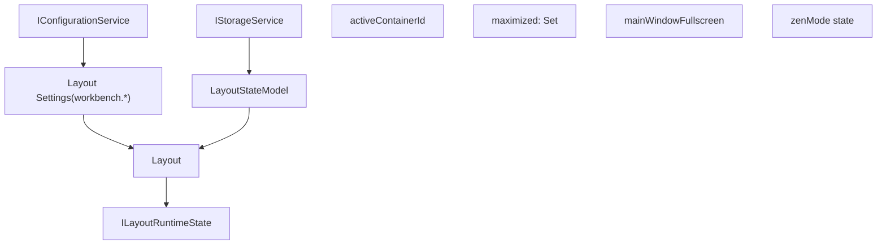
**Sources:** [src/vs/workbench/browser/layout.ts53-93](https://github.com/microsoft/vscode/blob/1be3088d/src/vs/workbench/browser/layout.ts#L53-L93) [src/vs/workbench/browser/layout.ts649-768](https://github.com/microsoft/vscode/blob/1be3088d/src/vs/workbench/browser/layout.ts#L649-L768)

### Key Layout Settings

| Setting | Type | Description | Default |
| --- | --- | --- | --- |
| `workbench.sideBar.location` | `'left' | 'right'` | Position of the sidebar | `'left'` |
| `workbench.panel.defaultLocation` | `'left' | 'right' | 'bottom'` | Position of the panel | `'bottom'` |
| `workbench.panel.opensMaximized` | `'always' | 'never' | 'preserve'` | Panel maximized on open | `'preserve'` |
| `workbench.editor.centeredLayoutAutoResize` | `boolean` | Auto-resize in centered mode | `true` |
| `zenMode.hideActivityBar` | `boolean` | Hide activity bar in Zen mode | `true` |
| `zenMode.hideStatusBar` | `boolean` | Hide status bar in Zen mode | `true` |
| `zenMode.hideLineNumbers` | `'on' | 'off' | 'relative'` | Line numbers in Zen mode | `'off'` |

**Sources:** [src/vs/workbench/browser/workbench.contribution.ts1-100](https://github.com/microsoft/vscode/blob/1be3088d/src/vs/workbench/browser/workbench.contribution.ts#L1-L100) [src/vs/workbench/services/layout/browser/layoutService.ts80-150](https://github.com/microsoft/vscode/blob/1be3088d/src/vs/workbench/services/layout/browser/layoutService.ts#L80-L150)

### Layout State Persistence

The layout state is persisted through `LayoutStateModel` which manages storage of part visibility, positions, and sizes:

> **[Mermaid sequence]**
> *(图表结构无法解析)*

**Sources:** [src/vs/workbench/browser/layout.ts649-680](https://github.com/microsoft/vscode/blob/1be3088d/src/vs/workbench/browser/layout.ts#L649-L680) [src/vs/workbench/browser/layout.ts1900-2100](https://github.com/microsoft/vscode/blob/1be3088d/src/vs/workbench/browser/layout.ts#L1900-L2100)

---

## Layout Operations

The layout service provides methods to control the visibility, position, and size of parts dynamically.

### Part Visibility Control

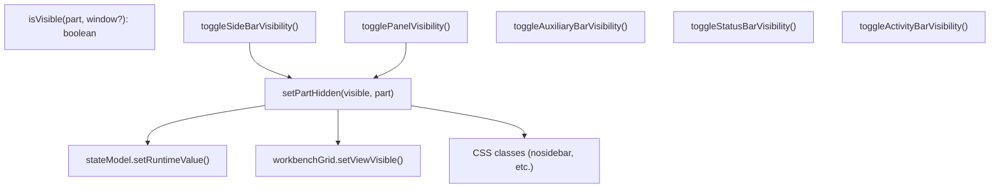
**Sources:** [src/vs/workbench/browser/layout.ts1006-1200](https://github.com/microsoft/vscode/blob/1be3088d/src/vs/workbench/browser/layout.ts#L1006-L1200) [src/vs/workbench/browser/layout.ts95-104](https://github.com/microsoft/vscode/blob/1be3088d/src/vs/workbench/browser/layout.ts#L95-L104)

### CSS Layout Classes

The layout system applies CSS classes to reflect the current state:

| CSS Class | Applied When | Purpose |
| --- | --- | --- |
| `.nosidebar` | Sidebar hidden | Hide sidebar, adjust layout |
| `.nopanel` | Panel hidden | Hide panel, adjust layout |
| `.noauxiliarybar` | Auxiliary bar hidden | Hide auxiliary bar |
| `.nostatusbar` | Statusbar hidden | Hide statusbar |
| `.nomaineditorarea` | Editor hidden | Hide editor (panel maximized) |
| `.fullscreen` | Window fullscreen | Fullscreen adjustments |
| `.maximized` | Group maximized | Maximized editor group |
| `.border` | Window border enabled | Show window border |

**Sources:** [src/vs/workbench/browser/layout.ts95-104](https://github.com/microsoft/vscode/blob/1be3088d/src/vs/workbench/browser/layout.ts#L95-L104)

### Position and Alignment Control

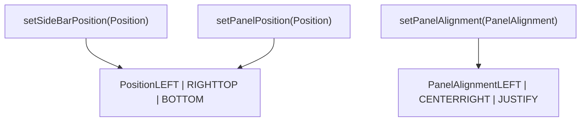
**Sources:** [src/vs/workbench/browser/layout.ts571-602](https://github.com/microsoft/vscode/blob/1be3088d/src/vs/workbench/browser/layout.ts#L571-L602) [src/vs/workbench/services/layout/browser/layoutService.ts30-80](https://github.com/microsoft/vscode/blob/1be3088d/src/vs/workbench/services/layout/browser/layoutService.ts#L30-L80)

---

## Special Layout Modes

The layout system supports special modes that dramatically alter the UI presentation.

### Zen Mode

Zen Mode is a distraction-free mode that hides most UI elements to focus on the editor.

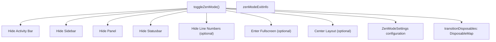
**Sources:** [src/vs/workbench/browser/layout.ts1400-1600](https://github.com/microsoft/vscode/blob/1be3088d/src/vs/workbench/browser/layout.ts#L1400-L1600) [src/vs/workbench/services/layout/browser/layoutService.ts100-150](https://github.com/microsoft/vscode/blob/1be3088d/src/vs/workbench/services/layout/browser/layoutService.ts#L100-L150)

### Centered Editor Layout

Centered layout mode adds horizontal margins around the editor to center it within the available space.

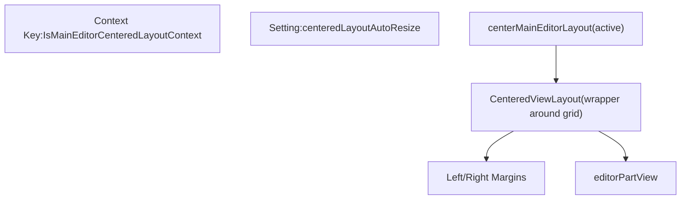
**Sources:** [src/vs/workbench/browser/layout.ts1244-1300](https://github.com/microsoft/vscode/blob/1be3088d/src/vs/workbench/browser/layout.ts#L1244-L1300) [src/vs/base/browser/ui/centered/centeredViewLayout.ts1-100](https://github.com/microsoft/vscode/blob/1be3088d/src/vs/base/browser/ui/centered/centeredViewLayout.ts#L1-L100)

### Maximized Parts

Panels and auxiliary bars can be maximized to hide the editor area:

> **[Mermaid sequence]**
> *(图表结构无法解析)*

**Sources:** [src/vs/workbench/browser/layout.ts1700-1850](https://github.com/microsoft/vscode/blob/1be3088d/src/vs/workbench/browser/layout.ts#L1700-L1850)

---

## Multi-Window Layout

VS Code supports auxiliary windows, each with their own layout instance (for titlebar and editor parts).

### Multi-Window Architecture

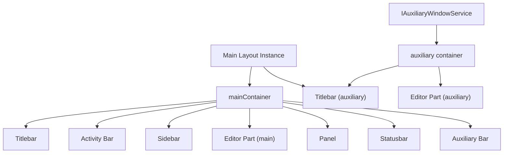
**Sources:** [src/vs/workbench/browser/layout.ts187-210](https://github.com/microsoft/vscode/blob/1be3088d/src/vs/workbench/browser/layout.ts#L187-L210) [src/vs/workbench/browser/layout.ts449-461](https://github.com/microsoft/vscode/blob/1be3088d/src/vs/workbench/browser/layout.ts#L449-L461) [src/vs/workbench/services/auxiliaryWindow/browser/auxiliaryWindowService.ts1-100](https://github.com/microsoft/vscode/blob/1be3088d/src/vs/workbench/services/auxiliaryWindow/browser/auxiliaryWindowService.ts#L1-L100)

### Multi-Window Parts

The layout distinguishes between parts that appear in all windows vs. only the main window:

```
// Parts that can exist in multiple windows
const MULTI_WINDOW_PARTS = [
    Parts.TITLEBAR_PART,
    Parts.EDITOR_PART
];

// Parts that only exist in the main window
const SINGLE_WINDOW_PARTS = [
    Parts.ACTIVITYBAR_PART,
    Parts.SIDEBAR_PART,
    Parts.PANEL_PART,
    Parts.AUXILIARYBAR_PART,
    Parts.STATUSBAR_PART,
    Parts.BANNER_PART
];
```
**Sources:** [src/vs/workbench/services/layout/browser/layoutService.ts150-200](https://github.com/microsoft/vscode/blob/1be3088d/src/vs/workbench/services/layout/browser/layoutService.ts#L150-L200)

### Container Management

The layout tracks multiple containers across windows:

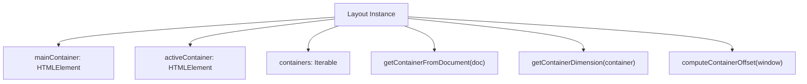
**Sources:** [src/vs/workbench/browser/layout.ts187-260](https://github.com/microsoft/vscode/blob/1be3088d/src/vs/workbench/browser/layout.ts#L187-L260)

---

## Layout Event Flow

The layout system emits various events to notify other parts of the system about layout changes.

### Key Layout Events

```mermaid
flowchart TD
    onDidChangeZenMode["onDidChangeZenModeEvent"]
    onDidChangeMainEditorCenteredLayout["onDidChangeMainEditorCenteredLayoutEvent"]
    onDidChangePanelAlignment["onDidChangePanelAlignmentEvent"]
    onDidChangeWindowMaximized["onDidChangeWindowMaximizedEvent<{windowId, maximized}>"]
    onDidChangePanelPosition["onDidChangePanelPositionEvent"]
    onDidChangePartVisibility["onDidChangePartVisibilityEvent"]
    onDidLayoutMainContainer["onDidLayoutMainContainerEvent"]
    onDidLayoutActiveContainer["onDidLayoutActiveContainerEvent"]
    onDidLayoutContainer["onDidLayoutContainerEvent<{container, dimension}>"]
    onDidAddContainer["onDidAddContainerEvent<{container, disposables}>"]
    onDidChangeActiveContainer["onDidChangeActiveContainerEvent"]
```
**Sources:** [src/vs/workbench/browser/layout.ts142-182](https://github.com/microsoft/vscode/blob/1be3088d/src/vs/workbench/browser/layout.ts#L142-L182)

### Event Subscription Pattern

> **[Mermaid sequence]**
> *(图表结构无法解析)*

**Sources:** [src/vs/workbench/browser/layout.ts142-182](https://github.com/microsoft/vscode/blob/1be3088d/src/vs/workbench/browser/layout.ts#L142-L182)

---

## Layout Lifecycle

The layout system goes through several phases during application lifecycle.

### Initialization and Startup

> **[Mermaid sequence]**
> *(图表结构无法解析)*

**Sources:** [src/vs/workbench/browser/layout.ts300-337](https://github.com/microsoft/vscode/blob/1be3088d/src/vs/workbench/browser/layout.ts#L300-L337) [src/vs/workbench/browser/layout.ts649-768](https://github.com/microsoft/vscode/blob/1be3088d/src/vs/workbench/browser/layout.ts#L649-L768) [src/vs/workbench/browser/layout.ts1584-1700](https://github.com/microsoft/vscode/blob/1be3088d/src/vs/workbench/browser/layout.ts#L1584-L1700)

### Shutdown and State Persistence

> **[Mermaid sequence]**
> *(图表结构无法解析)*

**Sources:** [src/vs/workbench/browser/layout.ts649-680](https://github.com/microsoft/vscode/blob/1be3088d/src/vs/workbench/browser/layout.ts#L649-L680) [src/vs/workbench/browser/layout.ts2300-2400](https://github.com/microsoft/vscode/blob/1be3088d/src/vs/workbench/browser/layout.ts#L2300-L2400)

---

## Layout Integration with Editor System

The layout system closely integrates with the editor system, as the editor part is the central focus of the workbench.

### Editor Part in Layout

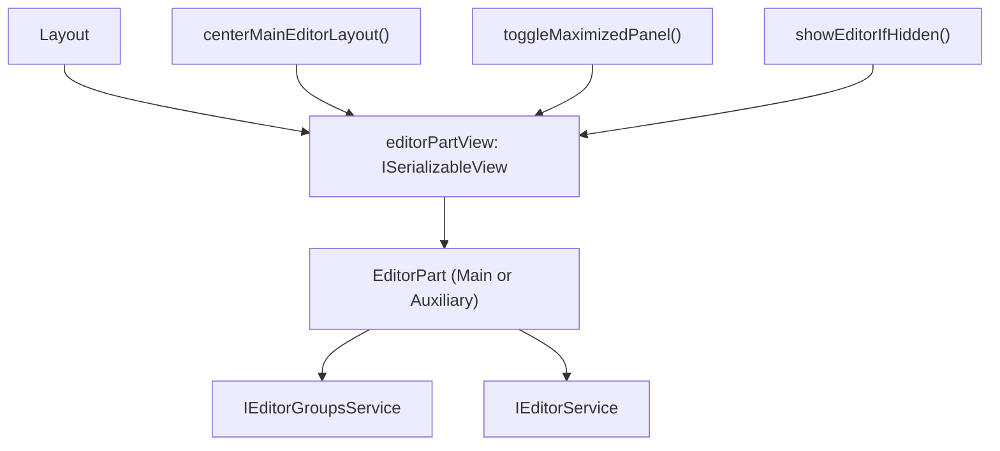
**Sources:** [src/vs/workbench/browser/layout.ts273](https://github.com/microsoft/vscode/blob/1be3088d/src/vs/workbench/browser/layout.ts#L273-L273) [src/vs/workbench/browser/layout.ts1244-1300](https://github.com/microsoft/vscode/blob/1be3088d/src/vs/workbench/browser/layout.ts#L1244-L1300) [src/vs/workbench/browser/parts/editor/editorPart.ts1-100](https://github.com/microsoft/vscode/blob/1be3088d/src/vs/workbench/browser/parts/editor/editorPart.ts#L1-L100)

---

## Layout and Theme Integration

The layout system applies theme colors to parts and manages visual styling.

### Theme Color Application

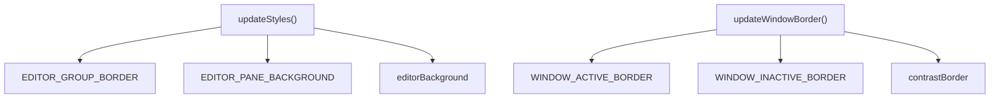
**Sources:** [src/vs/workbench/browser/layout.ts604-648](https://github.com/microsoft/vscode/blob/1be3088d/src/vs/workbench/browser/layout.ts#L604-L648) [src/vs/workbench/common/theme.ts1-100](https://github.com/microsoft/vscode/blob/1be3088d/src/vs/workbench/common/theme.ts#L1-L100)

---

## Summary

The Layout System is a sophisticated orchestration layer that manages the visual structure of VS Code's workbench. Key characteristics include:

-   **Flexible Grid System**: Uses `SerializableGrid` for dynamic, resizable layouts
-   **Part-Based Architecture**: Eight distinct parts (titlebar, activity bar, sidebar, editor, panel, auxiliary bar, statusbar, banner)
-   **Configuration and Persistence**: State is managed through configuration service and persisted to storage
-   **Special Modes**: Supports Zen mode and centered layout for focused editing
-   **Multi-Window Support**: Coordinates layout across main and auxiliary windows
-   **Event-Driven**: Emits events for layout changes to coordinate with other systems

The layout system is the foundation that enables VS Code's highly customizable and flexible user interface.
