# Editor Service and Groups

Relevant source files

-   [src/vs/platform/action/common/action.ts](https://github.com/microsoft/vscode/blob/1be3088d/src/vs/platform/action/common/action.ts)
-   [src/vs/platform/actions/browser/actionViewItemService.ts](https://github.com/microsoft/vscode/blob/1be3088d/src/vs/platform/actions/browser/actionViewItemService.ts)
-   [src/vs/platform/actions/browser/menuEntryActionViewItem.css](https://github.com/microsoft/vscode/blob/1be3088d/src/vs/platform/actions/browser/menuEntryActionViewItem.css)
-   [src/vs/platform/actions/browser/menuEntryActionViewItem.ts](https://github.com/microsoft/vscode/blob/1be3088d/src/vs/platform/actions/browser/menuEntryActionViewItem.ts)
-   [src/vs/platform/actions/browser/toolbar.ts](https://github.com/microsoft/vscode/blob/1be3088d/src/vs/platform/actions/browser/toolbar.ts)
-   [src/vs/platform/actions/common/actions.ts](https://github.com/microsoft/vscode/blob/1be3088d/src/vs/platform/actions/common/actions.ts)
-   [src/vs/platform/actions/common/menuService.ts](https://github.com/microsoft/vscode/blob/1be3088d/src/vs/platform/actions/common/menuService.ts)
-   [src/vs/platform/editor/common/editor.ts](https://github.com/microsoft/vscode/blob/1be3088d/src/vs/platform/editor/common/editor.ts)
-   [src/vs/platform/observable/common/platformObservableUtils.ts](https://github.com/microsoft/vscode/blob/1be3088d/src/vs/platform/observable/common/platformObservableUtils.ts)
-   [src/vs/workbench/browser/actions/layoutActions.ts](https://github.com/microsoft/vscode/blob/1be3088d/src/vs/workbench/browser/actions/layoutActions.ts)
-   [src/vs/workbench/browser/actions/quickAccessActions.ts](https://github.com/microsoft/vscode/blob/1be3088d/src/vs/workbench/browser/actions/quickAccessActions.ts)
-   [src/vs/workbench/browser/contextkeys.ts](https://github.com/microsoft/vscode/blob/1be3088d/src/vs/workbench/browser/contextkeys.ts)
-   [src/vs/workbench/browser/dnd.ts](https://github.com/microsoft/vscode/blob/1be3088d/src/vs/workbench/browser/dnd.ts)
-   [src/vs/workbench/browser/layout.ts](https://github.com/microsoft/vscode/blob/1be3088d/src/vs/workbench/browser/layout.ts)
-   [src/vs/workbench/browser/parts/auxiliarybar/auxiliaryBarActions.ts](https://github.com/microsoft/vscode/blob/1be3088d/src/vs/workbench/browser/parts/auxiliarybar/auxiliaryBarActions.ts)
-   [src/vs/workbench/browser/parts/editor/auxiliaryEditorPart.ts](https://github.com/microsoft/vscode/blob/1be3088d/src/vs/workbench/browser/parts/editor/auxiliaryEditorPart.ts)
-   [src/vs/workbench/browser/parts/editor/editor.contribution.ts](https://github.com/microsoft/vscode/blob/1be3088d/src/vs/workbench/browser/parts/editor/editor.contribution.ts)
-   [src/vs/workbench/browser/parts/editor/editor.ts](https://github.com/microsoft/vscode/blob/1be3088d/src/vs/workbench/browser/parts/editor/editor.ts)
-   [src/vs/workbench/browser/parts/editor/editorActions.ts](https://github.com/microsoft/vscode/blob/1be3088d/src/vs/workbench/browser/parts/editor/editorActions.ts)
-   [src/vs/workbench/browser/parts/editor/editorCommands.ts](https://github.com/microsoft/vscode/blob/1be3088d/src/vs/workbench/browser/parts/editor/editorCommands.ts)
-   [src/vs/workbench/browser/parts/editor/editorDropTarget.ts](https://github.com/microsoft/vscode/blob/1be3088d/src/vs/workbench/browser/parts/editor/editorDropTarget.ts)
-   [src/vs/workbench/browser/parts/editor/editorGroupView.ts](https://github.com/microsoft/vscode/blob/1be3088d/src/vs/workbench/browser/parts/editor/editorGroupView.ts)
-   [src/vs/workbench/browser/parts/editor/editorPart.ts](https://github.com/microsoft/vscode/blob/1be3088d/src/vs/workbench/browser/parts/editor/editorPart.ts)
-   [src/vs/workbench/browser/parts/editor/editorParts.ts](https://github.com/microsoft/vscode/blob/1be3088d/src/vs/workbench/browser/parts/editor/editorParts.ts)
-   [src/vs/workbench/browser/parts/panel/panelActions.ts](https://github.com/microsoft/vscode/blob/1be3088d/src/vs/workbench/browser/parts/panel/panelActions.ts)
-   [src/vs/workbench/browser/parts/titlebar/commandCenterControl.ts](https://github.com/microsoft/vscode/blob/1be3088d/src/vs/workbench/browser/parts/titlebar/commandCenterControl.ts)
-   [src/vs/workbench/browser/parts/titlebar/media/titlebarpart.css](https://github.com/microsoft/vscode/blob/1be3088d/src/vs/workbench/browser/parts/titlebar/media/titlebarpart.css)
-   [src/vs/workbench/browser/parts/titlebar/titlebarActions.ts](https://github.com/microsoft/vscode/blob/1be3088d/src/vs/workbench/browser/parts/titlebar/titlebarActions.ts)
-   [src/vs/workbench/browser/parts/titlebar/titlebarPart.ts](https://github.com/microsoft/vscode/blob/1be3088d/src/vs/workbench/browser/parts/titlebar/titlebarPart.ts)
-   [src/vs/workbench/browser/parts/titlebar/windowTitle.ts](https://github.com/microsoft/vscode/blob/1be3088d/src/vs/workbench/browser/parts/titlebar/windowTitle.ts)
-   [src/vs/workbench/browser/workbench.contribution.ts](https://github.com/microsoft/vscode/blob/1be3088d/src/vs/workbench/browser/workbench.contribution.ts)
-   [src/vs/workbench/browser/workbench.ts](https://github.com/microsoft/vscode/blob/1be3088d/src/vs/workbench/browser/workbench.ts)
-   [src/vs/workbench/common/contextkeys.ts](https://github.com/microsoft/vscode/blob/1be3088d/src/vs/workbench/common/contextkeys.ts)
-   [src/vs/workbench/common/editor.ts](https://github.com/microsoft/vscode/blob/1be3088d/src/vs/workbench/common/editor.ts)
-   [src/vs/workbench/contrib/chat/browser/widget/chatContentParts/chatInlineAnchorWidget.ts](https://github.com/microsoft/vscode/blob/1be3088d/src/vs/workbench/contrib/chat/browser/widget/chatContentParts/chatInlineAnchorWidget.ts)
-   [src/vs/workbench/contrib/chat/browser/widget/chatContentParts/chatMarkdownDecorationsRenderer.ts](https://github.com/microsoft/vscode/blob/1be3088d/src/vs/workbench/contrib/chat/browser/widget/chatContentParts/chatMarkdownDecorationsRenderer.ts)
-   [src/vs/workbench/contrib/chat/browser/widget/chatContentParts/media/chatInlineAnchorWidget.css](https://github.com/microsoft/vscode/blob/1be3088d/src/vs/workbench/contrib/chat/browser/widget/chatContentParts/media/chatInlineAnchorWidget.css)
-   [src/vs/workbench/contrib/debug/browser/statusbarColorProvider.ts](https://github.com/microsoft/vscode/blob/1be3088d/src/vs/workbench/contrib/debug/browser/statusbarColorProvider.ts)
-   [src/vs/workbench/services/actions/common/menusExtensionPoint.ts](https://github.com/microsoft/vscode/blob/1be3088d/src/vs/workbench/services/actions/common/menusExtensionPoint.ts)
-   [src/vs/workbench/services/editor/browser/editorService.ts](https://github.com/microsoft/vscode/blob/1be3088d/src/vs/workbench/services/editor/browser/editorService.ts)
-   [src/vs/workbench/services/editor/common/editorGroupsService.ts](https://github.com/microsoft/vscode/blob/1be3088d/src/vs/workbench/services/editor/common/editorGroupsService.ts)
-   [src/vs/workbench/services/editor/common/editorService.ts](https://github.com/microsoft/vscode/blob/1be3088d/src/vs/workbench/services/editor/common/editorService.ts)
-   [src/vs/workbench/services/editor/test/browser/editorGroupsService.test.ts](https://github.com/microsoft/vscode/blob/1be3088d/src/vs/workbench/services/editor/test/browser/editorGroupsService.test.ts)
-   [src/vs/workbench/services/editor/test/browser/editorService.test.ts](https://github.com/microsoft/vscode/blob/1be3088d/src/vs/workbench/services/editor/test/browser/editorService.test.ts)
-   [src/vs/workbench/services/layout/browser/layoutService.ts](https://github.com/microsoft/vscode/blob/1be3088d/src/vs/workbench/services/layout/browser/layoutService.ts)
-   [src/vs/workbench/test/browser/workbenchTestServices.ts](https://github.com/microsoft/vscode/blob/1be3088d/src/vs/workbench/test/browser/workbenchTestServices.ts)

## Purpose and Scope

This document describes the editor service and editor groups system in VS Code's workbench. It covers how editors are opened, closed, and organized into groups; how the grid-based layout system manages multiple editor groups; and how multi-window support enables auxiliary editor parts.

For information about individual editor panes and editor inputs, see [Editor Input and Pane System](/microsoft/vscode/4.3-editor-configuration-and-options). For the overall workbench layout system, see [Layout System and Parts](/microsoft/vscode/4.1-monaco-editor-api-and-standalone-usage).

## Architecture Overview

The editor service and groups system consists of several key components working together to manage the editor area:

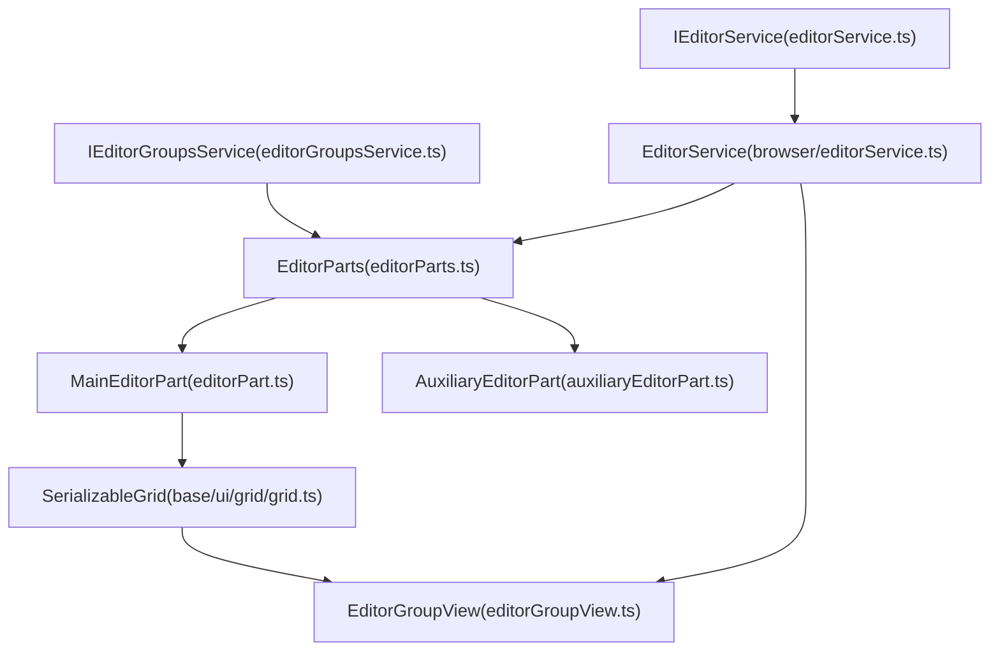
**Sources:**

-   [src/vs/workbench/services/editor/common/editorService.ts1-70](https://github.com/microsoft/vscode/blob/1be3088d/src/vs/workbench/services/editor/common/editorService.ts#L1-L70)
-   [src/vs/workbench/services/editor/common/editorGroupsService.ts1-100](https://github.com/microsoft/vscode/blob/1be3088d/src/vs/workbench/services/editor/common/editorGroupsService.ts#L1-L100)
-   [src/vs/workbench/services/editor/browser/editorService.ts1-96](https://github.com/microsoft/vscode/blob/1be3088d/src/vs/workbench/services/editor/browser/editorService.ts#L1-L96)
-   [src/vs/workbench/browser/parts/editor/editorParts.ts1-50](https://github.com/microsoft/vscode/blob/1be3088d/src/vs/workbench/browser/parts/editor/editorParts.ts#L1-L50)

## IEditorService - Editor Lifecycle Management

`IEditorService` is the primary service for opening, closing, and managing editors across all groups and windows. It provides a unified API for editor operations regardless of which group or window contains the editor.

### Key Responsibilities

| Responsibility | Key Methods |
| --- | --- |
| Opening editors | `openEditor()`, `openEditors()`, `replaceEditors()` |
| Closing editors | `closeEditor()`, `closeEditors()` |
| Active editor tracking | `activeEditor`, `activeEditorPane`, `onDidActiveEditorChange` |
| Visible editors | `visibleEditors`, `visibleEditorPanes`, `onDidVisibleEditorsChange` |
| Editor history | Most recently used editors, editor change events |
| Multi-group coordination | Finding editors across groups, moving/copying editors |

### Opening Editors

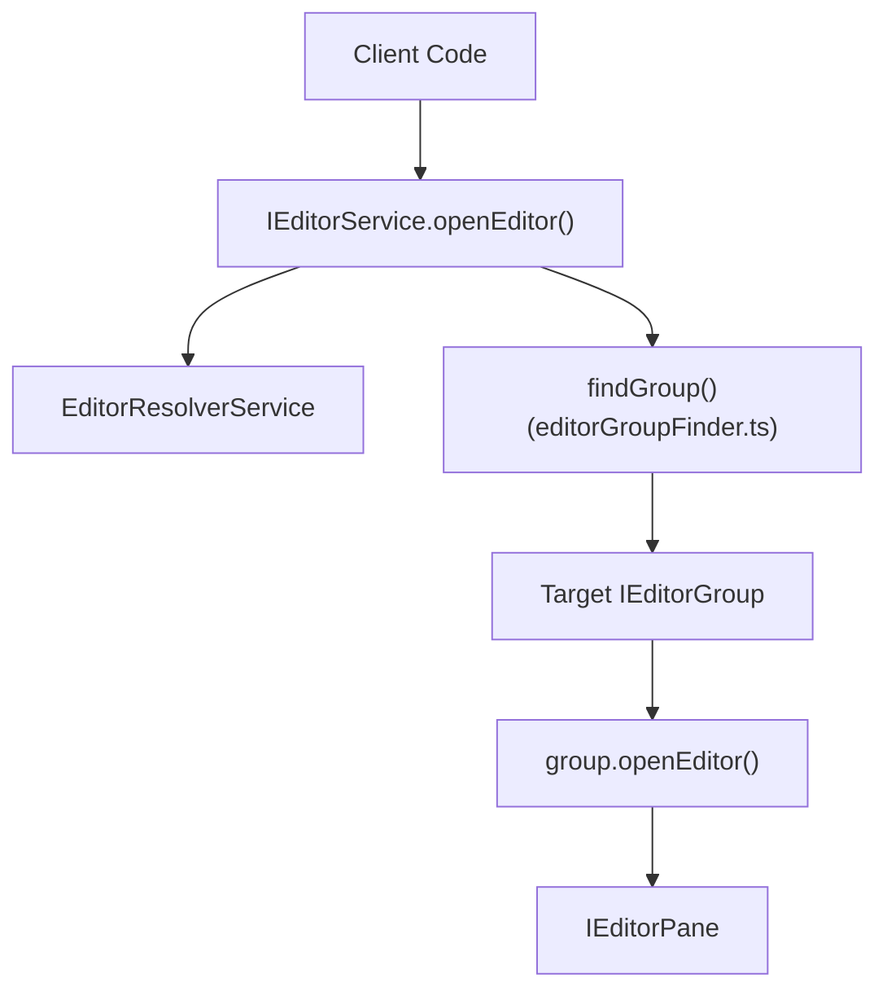
**Sources:**

-   [src/vs/workbench/services/editor/browser/editorService.ts308-450](https://github.com/microsoft/vscode/blob/1be3088d/src/vs/workbench/services/editor/browser/editorService.ts#L308-L450)
-   [src/vs/workbench/services/editor/common/editorService.ts1-100](https://github.com/microsoft/vscode/blob/1be3088d/src/vs/workbench/services/editor/common/editorService.ts#L1-L100)

### Group and Editor Targeting

The editor service supports multiple patterns for targeting where editors open:

-   **`ACTIVE_GROUP`** (-1): Opens in the currently active group
-   **`SIDE_GROUP`** (-2): Opens to the side of the active group
-   **`PreferredGroup`**: Union of ACTIVE\_GROUP, SIDE\_GROUP, or GroupIdentifier
-   **`GroupIdentifier`**: Specific numeric group ID
-   **`IEditorGroup`**: Direct group reference

**Sources:**

-   [src/vs/workbench/services/editor/common/editorService.ts18-35](https://github.com/microsoft/vscode/blob/1be3088d/src/vs/workbench/services/editor/common/editorService.ts#L18-L35)
-   [src/vs/workbench/services/editor/browser/editorService.ts308-350](https://github.com/microsoft/vscode/blob/1be3088d/src/vs/workbench/services/editor/browser/editorService.ts#L308-L350)

## IEditorGroupsService - Group Management

`IEditorGroupsService` manages the organization and lifecycle of editor groups. It controls how groups are created, arranged, split, merged, and navigated.

### Editor Groups Hierarchy

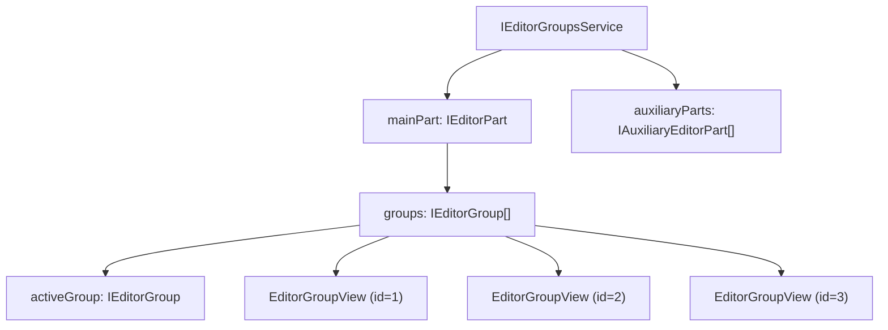
**Sources:**

-   [src/vs/workbench/services/editor/common/editorGroupsService.ts400-650](https://github.com/microsoft/vscode/blob/1be3088d/src/vs/workbench/services/editor/common/editorGroupsService.ts#L400-L650)
-   [src/vs/workbench/browser/parts/editor/editorParts.ts1-200](https://github.com/microsoft/vscode/blob/1be3088d/src/vs/workbench/browser/parts/editor/editorParts.ts#L1-L200)

### Group Operations

| Operation | Methods | Description |
| --- | --- | --- |
| **Creation** | `addGroup()`, `copyGroup()` | Create new groups with optional editors |
| **Splitting** | `createEditorDropTarget()` | Split in directions (UP, DOWN, LEFT, RIGHT) |
| **Merging** | `mergeGroup()`, `mergeAllGroups()` | Combine groups and their editors |
| **Navigation** | `getGroup()`, `findGroup()` | Find groups by location, direction, or identifier |
| **Arrangement** | `arrangeGroups()`, `setGroupOrientation()` | Change layout (horizontal/vertical) |
| **Closing** | `removeGroup()` | Close groups and optionally move editors |

**Sources:**

-   [src/vs/workbench/services/editor/common/editorGroupsService.ts400-750](https://github.com/microsoft/vscode/blob/1be3088d/src/vs/workbench/services/editor/common/editorGroupsService.ts#L400-L750)
-   [src/vs/workbench/browser/parts/editor/editorPart.ts400-800](https://github.com/microsoft/vscode/blob/1be3088d/src/vs/workbench/browser/parts/editor/editorPart.ts#L400-L800)

### Group Direction and Orientation

Groups are arranged in a grid with configurable orientation:

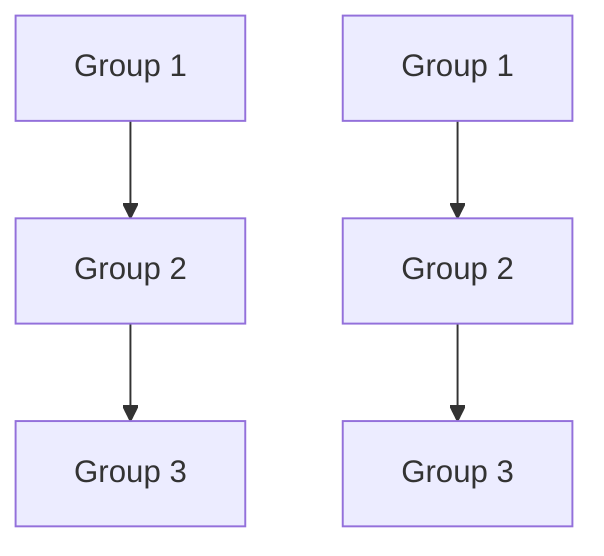
| Enum | Values | Description |
| --- | --- | --- |
| `GroupDirection` | UP, DOWN, LEFT, RIGHT | Direction relative to current group |
| `GroupOrientation` | HORIZONTAL, VERTICAL | Overall grid layout |
| `GroupLocation` | FIRST, LAST, NEXT, PREVIOUS | Named positions |

**Sources:**

-   [src/vs/workbench/services/editor/common/editorGroupsService.ts23-50](https://github.com/microsoft/vscode/blob/1be3088d/src/vs/workbench/services/editor/common/editorGroupsService.ts#L23-L50)
-   [src/vs/workbench/browser/parts/editor/editorPart.ts500-700](https://github.com/microsoft/vscode/blob/1be3088d/src/vs/workbench/browser/parts/editor/editorPart.ts#L500-L700)

## EditorPart - The Container

`EditorPart` is the physical part of the workbench that hosts editor groups. It extends `Part` and implements `IEditorGroupsView` to provide the grid-based layout system.

### EditorPart Structure

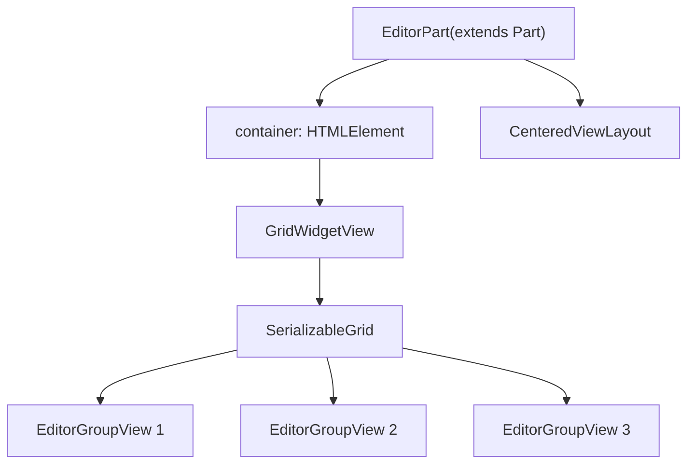
**Sources:**

-   [src/vs/workbench/browser/parts/editor/editorPart.ts91-200](https://github.com/microsoft/vscode/blob/1be3088d/src/vs/workbench/browser/parts/editor/editorPart.ts#L91-L200)
-   [src/vs/workbench/browser/parts/editor/editor.ts1-100](https://github.com/microsoft/vscode/blob/1be3088d/src/vs/workbench/browser/parts/editor/editor.ts#L1-L100)

### Main vs Auxiliary Editor Parts

VS Code supports multiple windows, each with its own editor part:

| Part Type | Class | Purpose |
| --- | --- | --- |
| **Main** | `MainEditorPart` | Primary editor part in main window |
| **Auxiliary** | `AuxiliaryEditorPart` | Additional editor parts in auxiliary windows |

Both implement `IEditorPart` and share the same grid-based architecture. The `EditorParts` class coordinates between them.

**Sources:**

-   [src/vs/workbench/browser/parts/editor/editorParts.ts50-300](https://github.com/microsoft/vscode/blob/1be3088d/src/vs/workbench/browser/parts/editor/editorParts.ts#L50-L300)
-   [src/vs/workbench/browser/parts/editor/auxiliaryEditorPart.ts1-100](https://github.com/microsoft/vscode/blob/1be3088d/src/vs/workbench/browser/parts/editor/auxiliaryEditorPart.ts#L1-L100)

### Grid Serialization and Restoration

The editor part persists its layout state to storage:

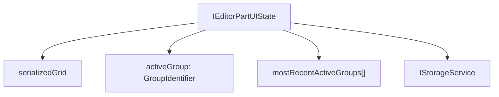
**Key Types:**

-   **`IEditorPartUIState`**: Contains serialized grid structure, active group, and MRU list
-   **`ISerializedGrid`**: Grid layout with orientation and nested nodes
-   Storage key: `'editorpart.state'`

**Sources:**

-   [src/vs/workbench/browser/parts/editor/editorPart.ts40-95](https://github.com/microsoft/vscode/blob/1be3088d/src/vs/workbench/browser/parts/editor/editorPart.ts#L40-L95)
-   [src/vs/workbench/browser/parts/editor/editorPart.ts200-400](https://github.com/microsoft/vscode/blob/1be3088d/src/vs/workbench/browser/parts/editor/editorPart.ts#L200-L400)

## EditorGroupView - Individual Groups

`EditorGroupView` represents a single editor group within an editor part. It manages the lifecycle of editors within that group and handles the tab UI.

### EditorGroupView Architecture

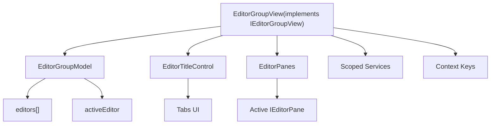
**Sources:**

-   [src/vs/workbench/browser/parts/editor/editorGroupView.ts62-250](https://github.com/microsoft/vscode/blob/1be3088d/src/vs/workbench/browser/parts/editor/editorGroupView.ts#L62-L250)
-   [src/vs/workbench/common/editor/editorGroupModel.ts1-100](https://github.com/microsoft/vscode/blob/1be3088d/src/vs/workbench/common/editor/editorGroupModel.ts#L1-L100)

### Group Properties and State

Each `EditorGroupView` maintains:

| Property | Type | Description |
| --- | --- | --- |
| `id` | `GroupIdentifier` | Unique numeric identifier |
| `label` | `string` | Display label (e.g., "Group 1") |
| `index` | `number` | Position in editor part |
| `activeEditor` | `EditorInput | undefined` | Currently active editor |
| `editors` | `EditorInput[]` | All editors in group |
| `count` | `number` | Number of editors |
| `isEmpty` | `boolean` | Whether group has no editors |
| `isLocked` | `boolean` | Whether group is locked (prevents certain operations) |

**Sources:**

-   [src/vs/workbench/browser/parts/editor/editorGroupView.ts62-150](https://github.com/microsoft/vscode/blob/1be3088d/src/vs/workbench/browser/parts/editor/editorGroupView.ts#L62-L150)
-   [src/vs/workbench/services/editor/common/editorGroupsService.ts100-250](https://github.com/microsoft/vscode/blob/1be3088d/src/vs/workbench/services/editor/common/editorGroupsService.ts#L100-L250)

### Editor Opening Flow in a Group

> **[Mermaid sequence]**
> *(图表结构无法解析)*

**Sources:**

-   [src/vs/workbench/browser/parts/editor/editorGroupView.ts800-1200](https://github.com/microsoft/vscode/blob/1be3088d/src/vs/workbench/browser/parts/editor/editorGroupView.ts#L800-L1200)
-   [src/vs/workbench/common/editor/editorGroupModel.ts200-500](https://github.com/microsoft/vscode/blob/1be3088d/src/vs/workbench/common/editor/editorGroupModel.ts#L200-L500)

### Context Keys

Each `EditorGroupView` manages scoped context keys for keybindings and menu visibility:

| Context Key | Value | Description |
| --- | --- | --- |
| `ActiveEditorContext` | Editor type ID | Active editor pane type |
| `ActiveEditorDirtyContext` | boolean | Whether active editor is dirty |
| `ActiveEditorPinnedContext` | boolean | Whether active editor is pinned |
| `ActiveEditorStickyContext` | boolean | Whether active editor is sticky |
| `ActiveEditorGroupLockedContext` | boolean | Whether group is locked |
| `EditorGroupEditorsCountContext` | number | Number of editors in group |
| `ActiveEditorGroupEmptyContext` | boolean | Whether group is empty |

**Sources:**

-   [src/vs/workbench/browser/parts/editor/editorGroupView.ts249-320](https://github.com/microsoft/vscode/blob/1be3088d/src/vs/workbench/browser/parts/editor/editorGroupView.ts#L249-L320)
-   [src/vs/workbench/common/contextkeys.ts1-150](https://github.com/microsoft/vscode/blob/1be3088d/src/vs/workbench/common/contextkeys.ts#L1-L150)

## Grid Layout System

The editor groups are arranged using a `SerializableGrid` from the base UI library. This provides flexible splitting, resizing, and persistence.

### Grid Structure

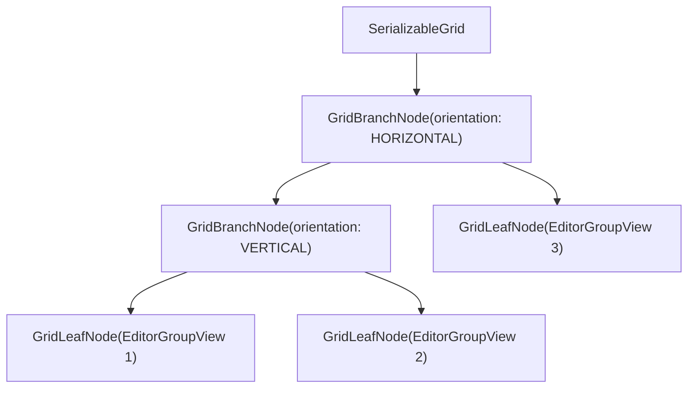
**Grid Concepts:**

-   **Branch Nodes**: Containers with orientation (HORIZONTAL or VERTICAL) and size
-   **Leaf Nodes**: Actual views (EditorGroupView instances)
-   **Orientation**: Determines split direction (horizontal = side-by-side, vertical = top-bottom)
-   **Sizing**: Each node has size, minimum, maximum constraints

**Sources:**

-   [src/vs/base/browser/ui/grid/grid.ts1-200](https://github.com/microsoft/vscode/blob/1be3088d/src/vs/base/browser/ui/grid/grid.ts#L1-L200)
-   [src/vs/workbench/browser/parts/editor/editorPart.ts400-600](https://github.com/microsoft/vscode/blob/1be3088d/src/vs/workbench/browser/parts/editor/editorPart.ts#L400-L600)

### Split Operations

When splitting a group, the grid is reorganized:

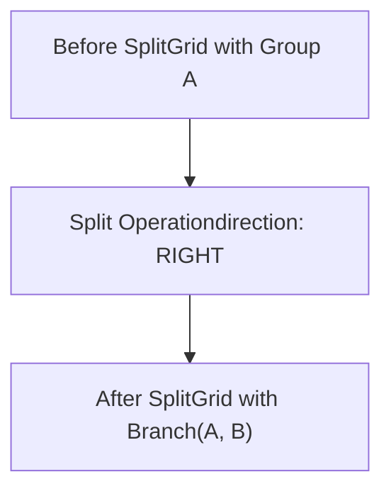
**Split Process:**

1.  Client calls `editorGroupService.addGroup(referenceGroup, direction)`
2.  `EditorPart` determines where to insert new group in grid
3.  Grid creates new branch node if needed with correct orientation
4.  New `EditorGroupView` is instantiated and added
5.  Grid is laid out with new dimensions

**Sources:**

-   [src/vs/workbench/browser/parts/editor/editorPart.ts700-900](https://github.com/microsoft/vscode/blob/1be3088d/src/vs/workbench/browser/parts/editor/editorPart.ts#L700-L900)
-   [src/vs/workbench/services/editor/common/editorGroupsService.ts400-500](https://github.com/microsoft/vscode/blob/1be3088d/src/vs/workbench/services/editor/common/editorGroupsService.ts#L400-L500)

### Merge Operations

Merging groups combines their editors:

| Mode | Enum Value | Behavior |
| --- | --- | --- |
| Copy editors to target | `COPY_EDITORS` | Copy source editors to target, keep source |
| Move editors to target | `MOVE_EDITORS` | Move source editors to target, close source |
| Move all to new group | `GROUP_TO_NEW_GROUP` | Create new group with all editors from both |

**Sources:**

-   [src/vs/workbench/browser/parts/editor/editorPart.ts1000-1200](https://github.com/microsoft/vscode/blob/1be3088d/src/vs/workbench/browser/parts/editor/editorPart.ts#L1000-L1200)
-   [src/vs/workbench/services/editor/common/editorGroupsService.ts60-90](https://github.com/microsoft/vscode/blob/1be3088d/src/vs/workbench/services/editor/common/editorGroupsService.ts#L60-L90)

## Multi-Window Support

VS Code supports opening editors in auxiliary windows through the `EditorParts` service, which coordinates between the main editor part and auxiliary editor parts.

### EditorParts Coordination

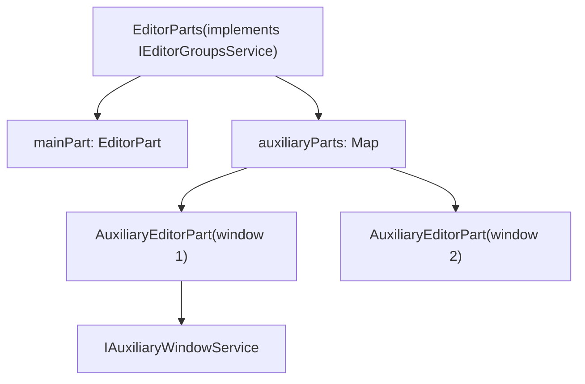
### Moving Editors Between Windows

Editors can be moved between main and auxiliary windows:

| Command | ID | Description |
| --- | --- | --- |
| Move to New Window | `MOVE_EDITOR_INTO_NEW_WINDOW_COMMAND_ID` | Move active editor to new auxiliary window |
| Copy to New Window | `COPY_EDITOR_INTO_NEW_WINDOW_COMMAND_ID` | Copy active editor to new auxiliary window |
| Move Group to New Window | `MOVE_EDITOR_GROUP_INTO_NEW_WINDOW_COMMAND_ID` | Move entire group to new window |
| Copy Group to New Window | `COPY_EDITOR_GROUP_INTO_NEW_WINDOW_COMMAND_ID` | Copy entire group to new window |

**Sources:**

-   [src/vs/workbench/browser/parts/editor/editorParts.ts100-500](https://github.com/microsoft/vscode/blob/1be3088d/src/vs/workbench/browser/parts/editor/editorParts.ts#L100-L500)
-   [src/vs/workbench/browser/parts/editor/editorCommands.ts1-100](https://github.com/microsoft/vscode/blob/1be3088d/src/vs/workbench/browser/parts/editor/editorCommands.ts#L1-L100)

### Auxiliary Editor Part Lifecycle

> **[Mermaid sequence]**
> *(图表结构无法解析)*

**Sources:**

-   [src/vs/workbench/browser/parts/editor/editorParts.ts200-400](https://github.com/microsoft/vscode/blob/1be3088d/src/vs/workbench/browser/parts/editor/editorParts.ts#L200-L400)
-   [src/vs/workbench/browser/parts/editor/auxiliaryEditorPart.ts1-200](https://github.com/microsoft/vscode/blob/1be3088d/src/vs/workbench/browser/parts/editor/auxiliaryEditorPart.ts#L1-L200)

## Editor Options and Configuration

Editor behavior is controlled through `IEditorPartOptions`, which are synchronized across all editor parts.

### Configuration Properties

| Setting | Type | Default | Description |
| --- | --- | --- | --- |
| `showTabs` | `EditorTabsMode` | `'multiple'` | How to show editor tabs (multiple, single, none) |
| `openPositioning` | `'left'|'right'|'first'|'last'` | `'right'` | Where new editors open |
| `enablePreview` | `boolean` | `true` | Whether preview mode is enabled |
| `tabCloseButton` | `'left'|'right'|'off'` | `'right'` | Tab close button position |
| `tabSizing` | `'fit'|'shrink'|'fixed'` | `'fit'` | How tab sizes are computed |
| `pinnedTabSizing` | `'normal'|'compact'|'shrink'` | `'normal'` | How pinned tabs are sized |
| `splitSizing` | `'auto'|'distribute'|'split'` | `'auto'` | How groups are sized when splitting |

**Sources:**

-   [src/vs/workbench/browser/parts/editor/editor.ts30-150](https://github.com/microsoft/vscode/blob/1be3088d/src/vs/workbench/browser/parts/editor/editor.ts#L30-L150)
-   [src/vs/workbench/browser/workbench.contribution.ts60-290](https://github.com/microsoft/vscode/blob/1be3088d/src/vs/workbench/browser/workbench.contribution.ts#L60-L290)

### Options Change Handling

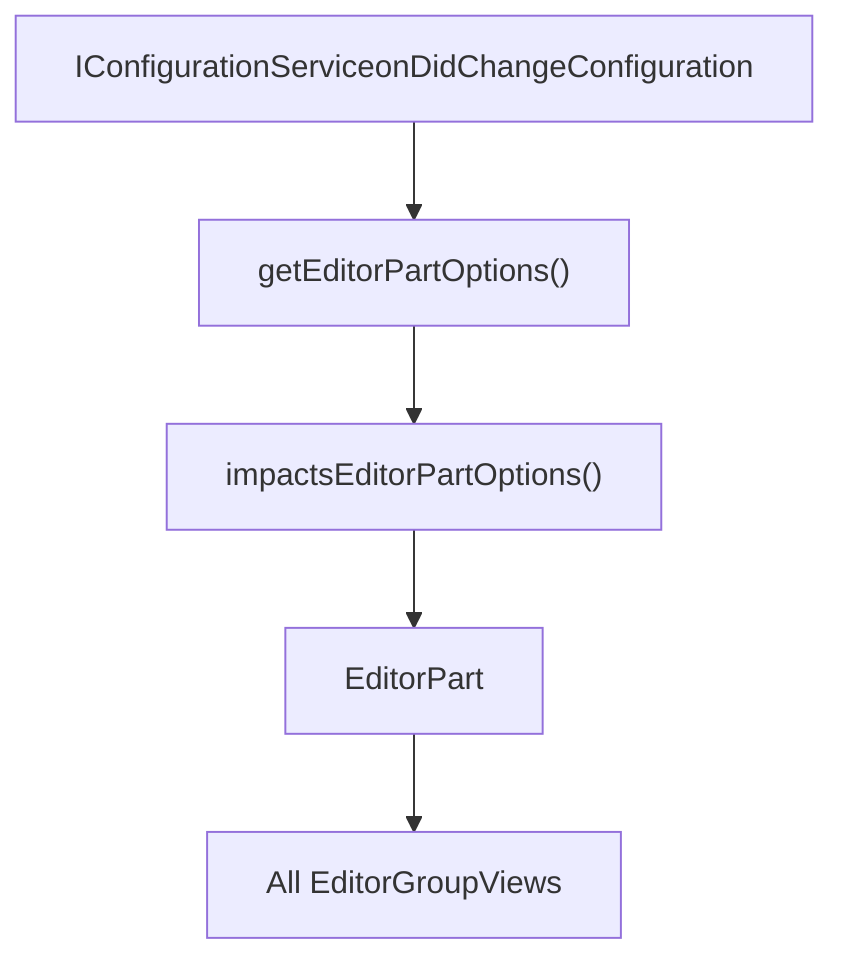
**Sources:**

-   [src/vs/workbench/browser/parts/editor/editor.ts200-350](https://github.com/microsoft/vscode/blob/1be3088d/src/vs/workbench/browser/parts/editor/editor.ts#L200-L350)
-   [src/vs/workbench/browser/parts/editor/editorPart.ts300-500](https://github.com/microsoft/vscode/blob/1be3088d/src/vs/workbench/browser/parts/editor/editorPart.ts#L300-L500)

## Summary

The editor service and groups system provides:

1.  **`IEditorService`** - Unified API for opening, closing, and managing editors across all groups and windows
2.  **`IEditorGroupsService`** - Management of editor groups, their arrangement, and lifecycle
3.  **`EditorPart`** - Physical container using a grid-based layout system for flexible editor organization
4.  **`EditorGroupView`** - Individual groups managing their own set of editors, tabs, and state
5.  **Multi-window support** - Auxiliary editor parts enabling editors in separate windows
6.  **Grid layout** - Flexible splitting, merging, and resizing of editor groups
7.  **Scoped services** - Each group has its own context keys and service scope

This architecture enables VS Code's flexible editor management while maintaining clean separation between UI (groups), lifecycle (service), and individual editors (panes).

**Sources:**

-   [src/vs/workbench/services/editor/common/editorService.ts1-100](https://github.com/microsoft/vscode/blob/1be3088d/src/vs/workbench/services/editor/common/editorService.ts#L1-L100)
-   [src/vs/workbench/services/editor/common/editorGroupsService.ts1-100](https://github.com/microsoft/vscode/blob/1be3088d/src/vs/workbench/services/editor/common/editorGroupsService.ts#L1-L100)
-   [src/vs/workbench/browser/parts/editor/editor.ts1-100](https://github.com/microsoft/vscode/blob/1be3088d/src/vs/workbench/browser/parts/editor/editor.ts#L1-L100)
-   [src/vs/workbench/browser/parts/editor/editorPart.ts1-200](https://github.com/microsoft/vscode/blob/1be3088d/src/vs/workbench/browser/parts/editor/editorPart.ts#L1-L200)
-   [src/vs/workbench/browser/parts/editor/editorGroupView.ts1-250](https://github.com/microsoft/vscode/blob/1be3088d/src/vs/workbench/browser/parts/editor/editorGroupView.ts#L1-L250)
