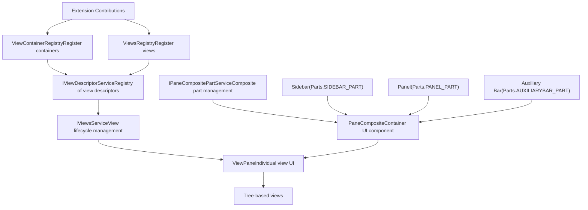
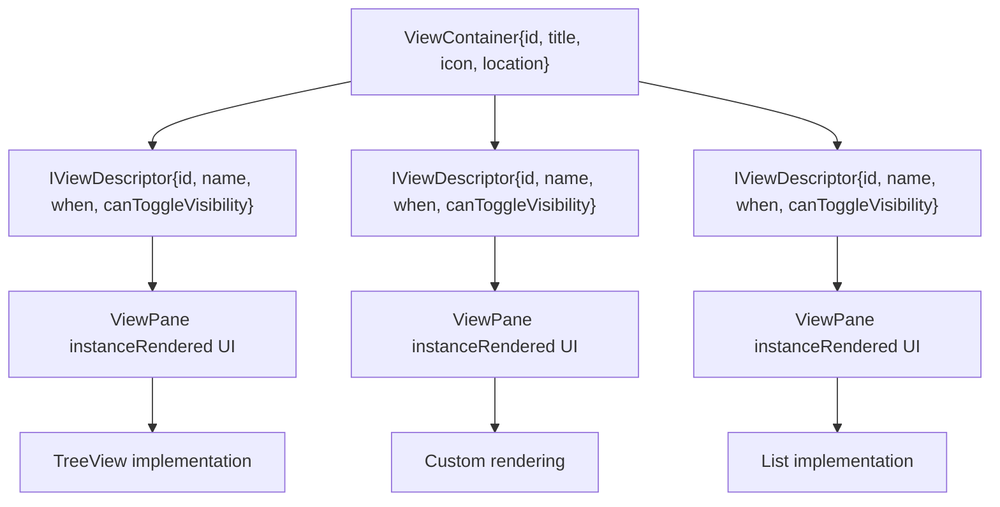
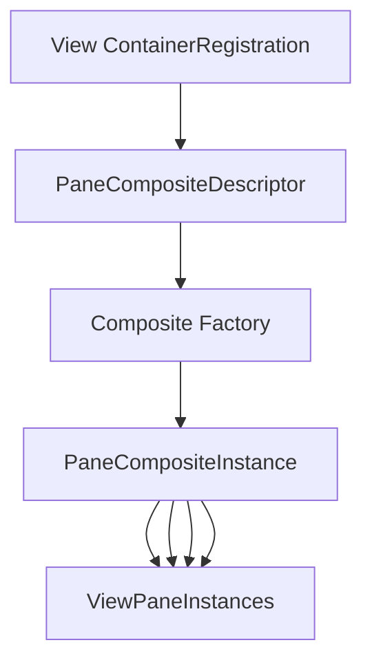
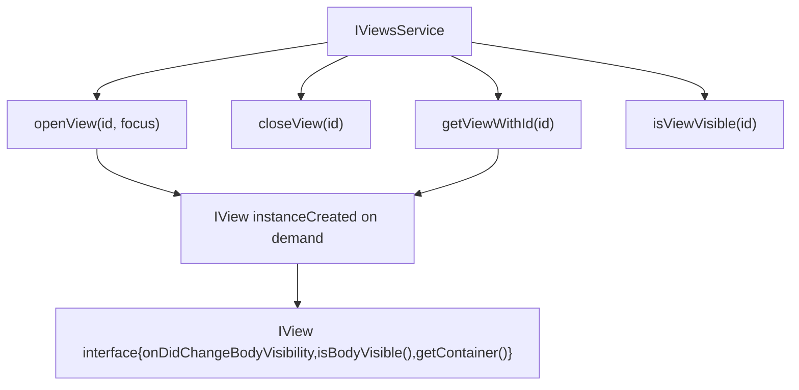
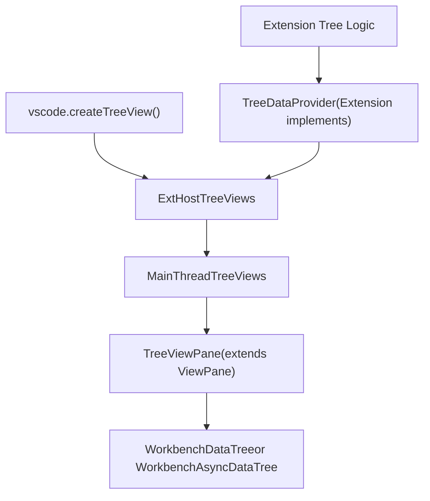
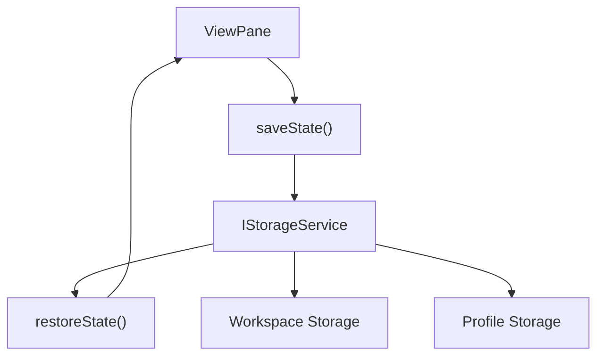
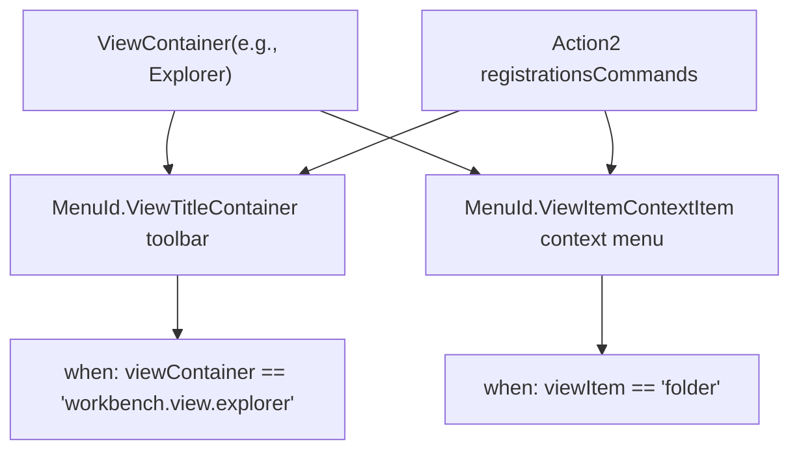
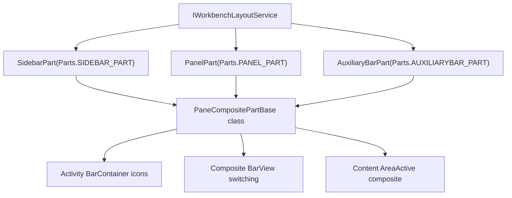

# View System and Contributions

Relevant source files

-   [src/vs/platform/action/common/action.ts](https://github.com/microsoft/vscode/blob/1be3088d/src/vs/platform/action/common/action.ts)
-   [src/vs/platform/actions/browser/actionViewItemService.ts](https://github.com/microsoft/vscode/blob/1be3088d/src/vs/platform/actions/browser/actionViewItemService.ts)
-   [src/vs/platform/actions/browser/menuEntryActionViewItem.css](https://github.com/microsoft/vscode/blob/1be3088d/src/vs/platform/actions/browser/menuEntryActionViewItem.css)
-   [src/vs/platform/actions/browser/menuEntryActionViewItem.ts](https://github.com/microsoft/vscode/blob/1be3088d/src/vs/platform/actions/browser/menuEntryActionViewItem.ts)
-   [src/vs/platform/actions/browser/toolbar.ts](https://github.com/microsoft/vscode/blob/1be3088d/src/vs/platform/actions/browser/toolbar.ts)
-   [src/vs/platform/actions/common/actions.ts](https://github.com/microsoft/vscode/blob/1be3088d/src/vs/platform/actions/common/actions.ts)
-   [src/vs/platform/actions/common/menuService.ts](https://github.com/microsoft/vscode/blob/1be3088d/src/vs/platform/actions/common/menuService.ts)
-   [src/vs/platform/editor/common/editor.ts](https://github.com/microsoft/vscode/blob/1be3088d/src/vs/platform/editor/common/editor.ts)
-   [src/vs/platform/observable/common/platformObservableUtils.ts](https://github.com/microsoft/vscode/blob/1be3088d/src/vs/platform/observable/common/platformObservableUtils.ts)
-   [src/vs/workbench/browser/actions/layoutActions.ts](https://github.com/microsoft/vscode/blob/1be3088d/src/vs/workbench/browser/actions/layoutActions.ts)
-   [src/vs/workbench/browser/actions/quickAccessActions.ts](https://github.com/microsoft/vscode/blob/1be3088d/src/vs/workbench/browser/actions/quickAccessActions.ts)
-   [src/vs/workbench/browser/contextkeys.ts](https://github.com/microsoft/vscode/blob/1be3088d/src/vs/workbench/browser/contextkeys.ts)
-   [src/vs/workbench/browser/dnd.ts](https://github.com/microsoft/vscode/blob/1be3088d/src/vs/workbench/browser/dnd.ts)
-   [src/vs/workbench/browser/layout.ts](https://github.com/microsoft/vscode/blob/1be3088d/src/vs/workbench/browser/layout.ts)
-   [src/vs/workbench/browser/parts/auxiliarybar/auxiliaryBarActions.ts](https://github.com/microsoft/vscode/blob/1be3088d/src/vs/workbench/browser/parts/auxiliarybar/auxiliaryBarActions.ts)
-   [src/vs/workbench/browser/parts/editor/auxiliaryEditorPart.ts](https://github.com/microsoft/vscode/blob/1be3088d/src/vs/workbench/browser/parts/editor/auxiliaryEditorPart.ts)
-   [src/vs/workbench/browser/parts/editor/editor.contribution.ts](https://github.com/microsoft/vscode/blob/1be3088d/src/vs/workbench/browser/parts/editor/editor.contribution.ts)
-   [src/vs/workbench/browser/parts/editor/editor.ts](https://github.com/microsoft/vscode/blob/1be3088d/src/vs/workbench/browser/parts/editor/editor.ts)
-   [src/vs/workbench/browser/parts/editor/editorActions.ts](https://github.com/microsoft/vscode/blob/1be3088d/src/vs/workbench/browser/parts/editor/editorActions.ts)
-   [src/vs/workbench/browser/parts/editor/editorCommands.ts](https://github.com/microsoft/vscode/blob/1be3088d/src/vs/workbench/browser/parts/editor/editorCommands.ts)
-   [src/vs/workbench/browser/parts/editor/editorDropTarget.ts](https://github.com/microsoft/vscode/blob/1be3088d/src/vs/workbench/browser/parts/editor/editorDropTarget.ts)
-   [src/vs/workbench/browser/parts/editor/editorGroupView.ts](https://github.com/microsoft/vscode/blob/1be3088d/src/vs/workbench/browser/parts/editor/editorGroupView.ts)
-   [src/vs/workbench/browser/parts/editor/editorPart.ts](https://github.com/microsoft/vscode/blob/1be3088d/src/vs/workbench/browser/parts/editor/editorPart.ts)
-   [src/vs/workbench/browser/parts/editor/editorParts.ts](https://github.com/microsoft/vscode/blob/1be3088d/src/vs/workbench/browser/parts/editor/editorParts.ts)
-   [src/vs/workbench/browser/parts/panel/panelActions.ts](https://github.com/microsoft/vscode/blob/1be3088d/src/vs/workbench/browser/parts/panel/panelActions.ts)
-   [src/vs/workbench/browser/parts/titlebar/commandCenterControl.ts](https://github.com/microsoft/vscode/blob/1be3088d/src/vs/workbench/browser/parts/titlebar/commandCenterControl.ts)
-   [src/vs/workbench/browser/parts/titlebar/media/titlebarpart.css](https://github.com/microsoft/vscode/blob/1be3088d/src/vs/workbench/browser/parts/titlebar/media/titlebarpart.css)
-   [src/vs/workbench/browser/parts/titlebar/titlebarActions.ts](https://github.com/microsoft/vscode/blob/1be3088d/src/vs/workbench/browser/parts/titlebar/titlebarActions.ts)
-   [src/vs/workbench/browser/parts/titlebar/titlebarPart.ts](https://github.com/microsoft/vscode/blob/1be3088d/src/vs/workbench/browser/parts/titlebar/titlebarPart.ts)
-   [src/vs/workbench/browser/parts/titlebar/windowTitle.ts](https://github.com/microsoft/vscode/blob/1be3088d/src/vs/workbench/browser/parts/titlebar/windowTitle.ts)
-   [src/vs/workbench/browser/workbench.contribution.ts](https://github.com/microsoft/vscode/blob/1be3088d/src/vs/workbench/browser/workbench.contribution.ts)
-   [src/vs/workbench/browser/workbench.ts](https://github.com/microsoft/vscode/blob/1be3088d/src/vs/workbench/browser/workbench.ts)
-   [src/vs/workbench/common/contextkeys.ts](https://github.com/microsoft/vscode/blob/1be3088d/src/vs/workbench/common/contextkeys.ts)
-   [src/vs/workbench/common/editor.ts](https://github.com/microsoft/vscode/blob/1be3088d/src/vs/workbench/common/editor.ts)
-   [src/vs/workbench/contrib/chat/browser/widget/chatContentParts/chatInlineAnchorWidget.ts](https://github.com/microsoft/vscode/blob/1be3088d/src/vs/workbench/contrib/chat/browser/widget/chatContentParts/chatInlineAnchorWidget.ts)
-   [src/vs/workbench/contrib/chat/browser/widget/chatContentParts/chatMarkdownDecorationsRenderer.ts](https://github.com/microsoft/vscode/blob/1be3088d/src/vs/workbench/contrib/chat/browser/widget/chatContentParts/chatMarkdownDecorationsRenderer.ts)
-   [src/vs/workbench/contrib/chat/browser/widget/chatContentParts/media/chatInlineAnchorWidget.css](https://github.com/microsoft/vscode/blob/1be3088d/src/vs/workbench/contrib/chat/browser/widget/chatContentParts/media/chatInlineAnchorWidget.css)
-   [src/vs/workbench/contrib/debug/browser/statusbarColorProvider.ts](https://github.com/microsoft/vscode/blob/1be3088d/src/vs/workbench/contrib/debug/browser/statusbarColorProvider.ts)
-   [src/vs/workbench/services/actions/common/menusExtensionPoint.ts](https://github.com/microsoft/vscode/blob/1be3088d/src/vs/workbench/services/actions/common/menusExtensionPoint.ts)
-   [src/vs/workbench/services/editor/browser/editorService.ts](https://github.com/microsoft/vscode/blob/1be3088d/src/vs/workbench/services/editor/browser/editorService.ts)
-   [src/vs/workbench/services/editor/common/editorGroupsService.ts](https://github.com/microsoft/vscode/blob/1be3088d/src/vs/workbench/services/editor/common/editorGroupsService.ts)
-   [src/vs/workbench/services/editor/common/editorService.ts](https://github.com/microsoft/vscode/blob/1be3088d/src/vs/workbench/services/editor/common/editorService.ts)
-   [src/vs/workbench/services/editor/test/browser/editorGroupsService.test.ts](https://github.com/microsoft/vscode/blob/1be3088d/src/vs/workbench/services/editor/test/browser/editorGroupsService.test.ts)
-   [src/vs/workbench/services/editor/test/browser/editorService.test.ts](https://github.com/microsoft/vscode/blob/1be3088d/src/vs/workbench/services/editor/test/browser/editorService.test.ts)
-   [src/vs/workbench/services/layout/browser/layoutService.ts](https://github.com/microsoft/vscode/blob/1be3088d/src/vs/workbench/services/layout/browser/layoutService.ts)
-   [src/vs/workbench/test/browser/workbenchTestServices.ts](https://github.com/microsoft/vscode/blob/1be3088d/src/vs/workbench/test/browser/workbenchTestServices.ts)

This document describes the view system architecture in VS Code, which provides the framework for rendering side panels, explorers, and other UI components in the workbench. The view system manages view containers (sidebar, panel, auxiliary bar), individual views, pane composites, and their lifecycle.

For information about editor management and editor groups, see [Editor Service and Groups](/microsoft/vscode/4.2-text-model-and-view-model-architecture). For layout management of parts, see [Layout System and Parts](/microsoft/vscode/4.1-monaco-editor-api-and-standalone-usage). For the action and menu system that integrates with views, see [Action and Menu System](/microsoft/vscode/4.4-line-breaking-and-text-wrapping).

## Overview and Core Concepts

The view system consists of several layers:

1.  **View Containers** - Top-level containers that can hold multiple views (e.g., the Explorer, Source Control containers)
2.  **Views** - Individual UI components within a container (e.g., the file tree, outline view)
3.  **Pane Composites** - The composite UI component that hosts views in a container
4.  **View Services** - Service layer managing view registration, lifecycle, and state

Views are declaratively registered through contribution points and instantiated on-demand when their container is shown.

**Sources:** [src/vs/workbench/common/views.ts1-150](https://github.com/microsoft/vscode/blob/1be3088d/src/vs/workbench/common/views.ts#L1-L150) [src/vs/workbench/test/browser/workbenchTestServices.ts130-180](https://github.com/microsoft/vscode/blob/1be3088d/src/vs/workbench/test/browser/workbenchTestServices.ts#L130-L180)

## View System Architecture


**Sources:** [src/vs/workbench/common/views.ts1-200](https://github.com/microsoft/vscode/blob/1be3088d/src/vs/workbench/common/views.ts#L1-L200) [src/vs/workbench/services/views/common/viewsService.ts1-100](https://github.com/microsoft/vscode/blob/1be3088d/src/vs/workbench/services/views/common/viewsService.ts#L1-L100) [src/vs/workbench/browser/parts/paneCompositePart.ts1-150](https://github.com/microsoft/vscode/blob/1be3088d/src/vs/workbench/browser/parts/paneCompositePart.ts#L1-L150)

## View Container Locations

Views are organized into containers, which can be placed in three primary locations within the workbench:

| Location | Enum Value | Description | Default Containers |
| --- | --- | --- | --- |
| Sidebar | `ViewContainerLocation.Sidebar` | Primary side bar on the left/right | Explorer, Search, SCM, Extensions |
| Panel | `ViewContainerLocation.Panel` | Bottom panel area | Terminal, Output, Problems, Debug Console |
| Auxiliary Bar | `ViewContainerLocation.AuxiliaryBar` | Secondary side bar opposite the primary | Additional views when enabled |

The location determines where the view container appears in the workbench layout. Containers can be moved between locations by users, and extensions can specify preferred locations when registering containers.

**Sources:** [src/vs/workbench/common/views.ts40-80](https://github.com/microsoft/vscode/blob/1be3088d/src/vs/workbench/common/views.ts#L40-L80) [src/vs/workbench/browser/layout.ts700-750](https://github.com/microsoft/vscode/blob/1be3088d/src/vs/workbench/browser/layout.ts#L700-L750) [src/vs/workbench/services/layout/browser/layoutService.ts100-200](https://github.com/microsoft/vscode/blob/1be3088d/src/vs/workbench/services/layout/browser/layoutService.ts#L100-L200)

## View Descriptors and View Containers

### View Container Structure


A `ViewContainer` is defined by:

-   **id**: Unique identifier (e.g., `'workbench.view.explorer'`)
-   **title**: Display name shown in the UI
-   **icon**: Icon shown in the activity bar
-   **location**: Where the container is placed (`Sidebar`, `Panel`, or `AuxiliaryBar`)

A `IViewDescriptor` defines an individual view within a container:

-   **id**: Unique identifier
-   **name**: Display name
-   **containerTitle**: Optional title when shown in the container
-   **when**: Context key expression determining visibility
-   **canToggleVisibility**: Whether users can hide/show the view
-   **canMoveView**: Whether the view can be moved to other containers
-   **order**: Display order within the container
-   **weight**: Size weight for layout

**Sources:** [src/vs/workbench/common/views.ts150-300](https://github.com/microsoft/vscode/blob/1be3088d/src/vs/workbench/common/views.ts#L150-L300) [src/vs/workbench/browser/parts/paneCompositePart.ts50-150](https://github.com/microsoft/vscode/blob/1be3088d/src/vs/workbench/browser/parts/paneCompositePart.ts#L50-L150)

## View Descriptor Service

The `IViewDescriptorService` is the central registry for all view containers and view descriptors:

```
interface IViewDescriptorService {
    // View containers
    readonly viewContainers: ReadonlyArray<ViewContainer>;
    getViewContainerById(id: string): ViewContainer | null;
    getViewContainerLocation(container: ViewContainer): ViewContainerLocation;
    getViewContainerModel(container: ViewContainer): IViewContainerModel;

    // View descriptors
    getViewDescriptorById(id: string): IViewDescriptor | null;
    getViewContainerByViewId(id: string): ViewContainer | null;
    getDefaultContainerById(id: string): ViewContainer | null;

    // Events
    onDidChangeContainer: Event<{ views: IViewDescriptor[]; from: ViewContainer; to: ViewContainer }>;
    onDidChangeLocation: Event<{ views: IViewDescriptor[]; from: ViewContainerLocation; to: ViewContainerLocation }>;
}
```
The service provides:

1.  **Registry access** - Query all registered containers and views
2.  **Location management** - Track where containers are placed
3.  **View container models** - Access the model for each container including its views
4.  **Change notifications** - Events when views move between containers or locations

**Sources:** [src/vs/workbench/common/views.ts300-450](https://github.com/microsoft/vscode/blob/1be3088d/src/vs/workbench/common/views.ts#L300-L450) [src/vs/workbench/test/browser/workbenchTestServices.ts180-220](https://github.com/microsoft/vscode/blob/1be3088d/src/vs/workbench/test/browser/workbenchTestServices.ts#L180-L220)

## Pane Composites (Viewlets)

A `PaneComposite` is the UI component that hosts views within a container. The term "viewlet" was historically used but has been superseded by "pane composite".

### Pane Composite Lifecycle


Key classes:

-   **`PaneComposite`** - Base class for all pane composites [src/vs/workbench/browser/panecomposite.ts1-100](https://github.com/microsoft/vscode/blob/1be3088d/src/vs/workbench/browser/panecomposite.ts#L1-L100)
-   **`PaneCompositeDescriptor`** - Descriptor for registering composites [src/vs/workbench/browser/panecomposite.ts100-150](https://github.com/microsoft/vscode/blob/1be3088d/src/vs/workbench/browser/panecomposite.ts#L100-L150)
-   **`IPaneCompositePartService`** - Service for managing composite parts [src/vs/workbench/services/panecomposite/browser/panecomposite.ts1-100](https://github.com/microsoft/vscode/blob/1be3088d/src/vs/workbench/services/panecomposite/browser/panecomposite.ts#L1-L100)

The `IPaneCompositePartService` provides methods to:

-   `openPaneComposite(id, location, focus?)` - Open a composite in a specific location
-   `getActivePaneComposite(location)` - Get the currently active composite
-   `getPaneComposite(id, location)` - Get a specific composite instance
-   `getPaneComposites(location)` - List all composites in a location
-   `getProgressIndicator(id, location)` - Get progress indicator for a composite

**Sources:** [src/vs/workbench/browser/panecomposite.ts1-200](https://github.com/microsoft/vscode/blob/1be3088d/src/vs/workbench/browser/panecomposite.ts#L1-L200) [src/vs/workbench/services/panecomposite/browser/panecomposite.ts1-150](https://github.com/microsoft/vscode/blob/1be3088d/src/vs/workbench/services/panecomposite/browser/panecomposite.ts#L1-L150) [src/vs/workbench/test/browser/workbenchTestServices.ts350-400](https://github.com/microsoft/vscode/blob/1be3088d/src/vs/workbench/test/browser/workbenchTestServices.ts#L350-L400)

## Views Service

The `IViewsService` manages the lifecycle of individual view instances:


The service coordinates with `IViewDescriptorService` to:

1.  Determine which views should be shown based on context keys
2.  Instantiate view panes when needed
3.  Track view visibility and state
4.  Handle view focus and activation
5.  Persist view state across sessions

Example usage:

```
// Open a view
await viewsService.openView('workbench.explorer.fileView', true);

// Get a view instance
const view = viewsService.getViewWithId('workbench.explorer.fileView');
if (view) {
    // Interact with the view
    view.focus();
}

// Check visibility
const isVisible = viewsService.isViewVisible('workbench.explorer.fileView');
```
**Sources:** [src/vs/workbench/services/views/common/viewsService.ts1-150](https://github.com/microsoft/vscode/blob/1be3088d/src/vs/workbench/services/views/common/viewsService.ts#L1-L150) [src/vs/workbench/common/views.ts400-500](https://github.com/microsoft/vscode/blob/1be3088d/src/vs/workbench/common/views.ts#L400-L500)

## Tree Views

Tree views are a specialized type of view that display hierarchical data. They are commonly used for file explorers, outlines, and extension-contributed trees.

### Tree View Architecture


Key components:

-   **`TreeDataProvider`** - Extension-implemented interface providing tree data
-   **`TreeViewPane`** - Main thread UI component rendering the tree
-   **`WorkbenchDataTree`** / **`WorkbenchAsyncDataTree`** - Underlying tree widget implementations
-   **`ExtHostTreeViews`** - Extension host side managing tree data providers
-   **`MainThreadTreeViews`** - Main thread side coordinating with UI

Tree views support:

-   **Lazy loading** - Children fetched on expand
-   **Drag and drop** - Custom handlers for d&d operations
-   **Decorations** - Icons, tooltips, badges on tree items
-   **Commands** - Actions on tree items
-   **Filtering** - Built-in search/filter capabilities
-   **Multi-select** - Selection of multiple items
-   **Context menus** - Right-click menus on items

**Sources:** [src/vs/workbench/common/views.ts500-700](https://github.com/microsoft/vscode/blob/1be3088d/src/vs/workbench/common/views.ts#L500-L700) [src/vs/workbench/browser/parts/editor/editorGroupView.ts200-250](https://github.com/microsoft/vscode/blob/1be3088d/src/vs/workbench/browser/parts/editor/editorGroupView.ts#L200-L250)

## View Contribution and Registration

Views and view containers are registered through contribution points. Both built-in and extension views use the same registration mechanism.

### Registration Flow

> **[Mermaid sequence]**
> *(图表结构无法解析)*

### View Container Registration

View containers are registered using the `ViewContainerRegistry`:

```
// Get the registry
const registry = Registry.as<IViewContainersRegistry>(ViewExtensions.ViewContainersRegistry);

// Register a container
const container = registry.registerViewContainer({
    id: 'workbench.view.myContainer',
    title: 'My Container',
    icon: myIcon,
    order: 5,
    ctorDescriptor: new SyncDescriptor(MyPaneComposite)
}, ViewContainerLocation.Sidebar);
```
### View Descriptor Registration

Individual views are registered to containers:

```
// Get the registry
const registry = Registry.as<IViewsRegistry>(ViewExtensions.ViewsRegistry);

// Register a view
registry.registerViews([{
    id: 'workbench.view.myView',
    name: 'My View',
    containerTitle: 'My Container',
    canToggleVisibility: true,
    canMoveView: true,
    when: ContextKeyExpr.equals('myCondition', true),
    order: 1,
    weight: 20
}], container);
```
### Context Key Integration

Views are shown/hidden based on context key expressions. The `when` clause in a view descriptor determines when the view is available:

```
// View only shown when in a Git repository
when: ContextKeyExpr.equals('gitOpenRepositoryCount', '> 0')

// View only shown in specific modes
when: ContextKeyExpr.and(
    ContextKeyExpr.equals('isInDiffEditor', true),
    ContextKeyExpr.equals('resourceScheme', 'file')
)
```
The view descriptor service automatically evaluates these expressions and fires change events when view visibility changes.

**Sources:** [src/vs/workbench/common/views.ts700-900](https://github.com/microsoft/vscode/blob/1be3088d/src/vs/workbench/common/views.ts#L700-L900) [src/vs/workbench/browser/layout.ts700-800](https://github.com/microsoft/vscode/blob/1be3088d/src/vs/workbench/browser/layout.ts#L700-L800) [src/vs/workbench/browser/contextkeys.ts50-100](https://github.com/microsoft/vscode/blob/1be3088d/src/vs/workbench/browser/contextkeys.ts#L50-L100)

## View State Persistence

View state is persisted across sessions through the storage service:


Key aspects:

-   **Workspace scope** - State specific to the current workspace (e.g., expanded tree nodes)
-   **Profile scope** - State shared across workspaces (e.g., view size, visibility preferences)
-   **Storage targets** - USER (synced) vs MACHINE (local only)

Each `ViewPane` can override:

-   `saveState()` - Called before disposal or window close
-   `restoreState()` - Called after creation to restore previous state

Common persisted state includes:

-   Tree expansion state
-   Scroll position
-   View dimensions
-   Filter/search text
-   Sort order
-   Selected items

**Sources:** [src/vs/workbench/browser/panecomposite.ts150-250](https://github.com/microsoft/vscode/blob/1be3088d/src/vs/workbench/browser/panecomposite.ts#L150-L250) [src/vs/workbench/browser/layout.ts630-680](https://github.com/microsoft/vscode/blob/1be3088d/src/vs/workbench/browser/layout.ts#L630-L680) [src/vs/platform/storage/common/storage.ts1-100](https://github.com/microsoft/vscode/blob/1be3088d/src/vs/platform/storage/common/storage.ts#L1-L100)

## View Actions and Toolbars

Views integrate with the action system to provide toolbars, context menus, and commands.

### Menu Contributions for Views


Common menu IDs for views:

-   `MenuId.ViewTitle` - Toolbar at the top of the view
-   `MenuId.ViewItemContext` - Right-click context menu on view items
-   `MenuId.ViewContainerTitle` - Actions on the container itself
-   `MenuId.ViewContainerTitleContext` - Context menu on container title

Actions specify targeting through context key expressions:

```
registerAction2(class extends Action2 {
    constructor() {
        super({
            id: 'myView.action',
            title: 'My Action',
            menu: {
                id: MenuId.ViewTitle,
                when: ContextKeyExpr.equals('view', 'workbench.view.myView'),
                group: 'navigation',
                order: 1
            }
        });
    }
});
```
The view system automatically:

1.  Queries the menu service for actions matching the view
2.  Renders toolbar buttons for `group: 'navigation'` actions
3.  Places other actions in overflow menus
4.  Updates action enablement based on context keys
5.  Handles action execution and result handling

**Sources:** [src/vs/workbench/browser/actions/layoutActions.ts170-220](https://github.com/microsoft/vscode/blob/1be3088d/src/vs/workbench/browser/actions/layoutActions.ts#L170-L220) [src/vs/workbench/browser/parts/editor/editorActions.ts40-100](https://github.com/microsoft/vscode/blob/1be3088d/src/vs/workbench/browser/parts/editor/editorActions.ts#L40-L100) [src/vs/platform/actions/common/actions.ts1-100](https://github.com/microsoft/vscode/blob/1be3088d/src/vs/platform/actions/common/actions.ts#L1-L100)

## View Sizing and Layout

Views within a container share space and can be resized by users. The layout system manages view dimensions and constraints.

### Size Constraints

Each view can specify:

-   **`minimumBodySize`** - Minimum height/width for the view content
-   **`maximumBodySize`** - Maximum height/width
-   **`weight`** - Relative size weight (used for initial sizing)
-   **`snap`** - Whether to snap to min/max sizes when close

```
class MyViewPane extends ViewPane {
    protected override get minimumBodySize(): number { return 100; }
    protected override get maximumBodySize(): number { return 500; }
    protected override get weight(): number { return 30; }
}
```
### Layout Algorithm

When a view container is resized:

1.  Each view's constraints are collected
2.  Available space is distributed according to weights
3.  Views are resized respecting their min/max constraints
4.  Sashes (resize handles) are positioned between views
5.  User resize actions update stored view sizes

The layout respects:

-   Fixed-size views (when min === max)
-   Collapsible views (can shrink to header only)
-   Priority views (weighted higher in space distribution)

**Sources:** [src/vs/workbench/browser/panecomposite.ts200-350](https://github.com/microsoft/vscode/blob/1be3088d/src/vs/workbench/browser/panecomposite.ts#L200-L350) [src/vs/workbench/browser/parts/editor/editorPart.ts150-250](https://github.com/microsoft/vscode/blob/1be3088d/src/vs/workbench/browser/parts/editor/editorPart.ts#L150-L250) [src/vs/base/browser/ui/grid/grid.ts1-100](https://github.com/microsoft/vscode/blob/1be3088d/src/vs/base/browser/ui/grid/grid.ts#L1-L100)

## Integration with Parts System

The view system integrates with the workbench parts system through specific part implementations:


Each part:

1.  Extends `Part` base class [src/vs/workbench/browser/part.ts1-100](https://github.com/microsoft/vscode/blob/1be3088d/src/vs/workbench/browser/part.ts#L1-L100)
2.  Implements `PaneCompositePart` for hosting composites
3.  Manages an activity bar or composite bar for switching
4.  Hosts the currently active pane composite
5.  Handles visibility, sizing, and state persistence

Part-specific features:

-   **SidebarPart** - Supports left/right positioning, toggle sidebar position action
-   **PanelPart** - Supports bottom/left/right positioning, panel alignment settings
-   **AuxiliaryBarPart** - Secondary sidebar, mirrors opposite of primary sidebar

**Sources:** [src/vs/workbench/browser/layout.ts550-650](https://github.com/microsoft/vscode/blob/1be3088d/src/vs/workbench/browser/layout.ts#L550-L650) [src/vs/workbench/browser/parts/panel/panelActions.ts1-100](https://github.com/microsoft/vscode/blob/1be3088d/src/vs/workbench/browser/parts/panel/panelActions.ts#L1-L100) [src/vs/workbench/browser/parts/auxiliarybar/auxiliaryBarActions.ts1-100](https://github.com/microsoft/vscode/blob/1be3088d/src/vs/workbench/browser/parts/auxiliarybar/auxiliaryBarActions.ts#L1-L100)
