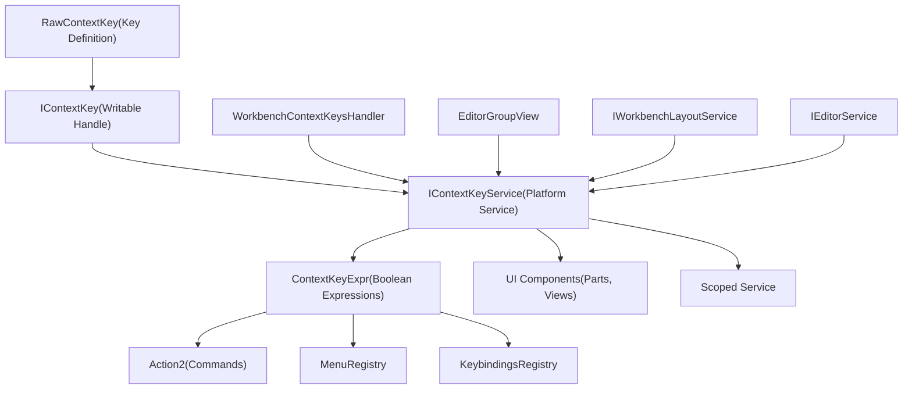
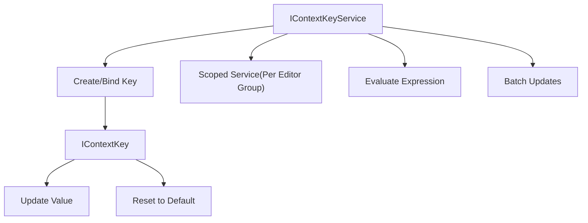
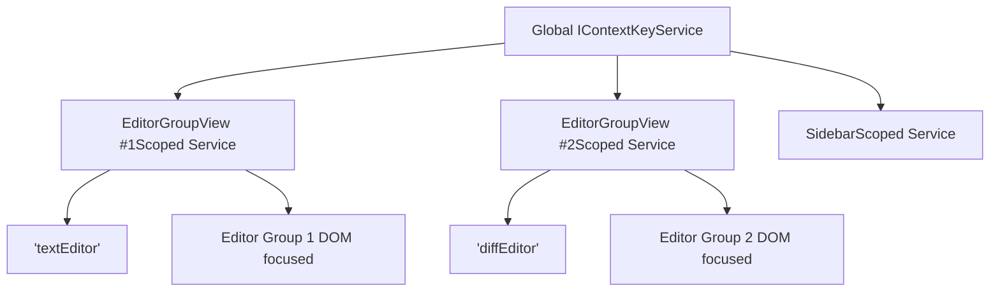
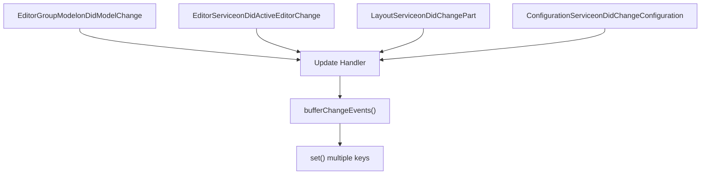

# Context Keys and State Management

Relevant source files

-   [src/vs/platform/action/common/action.ts](https://github.com/microsoft/vscode/blob/1be3088d/src/vs/platform/action/common/action.ts)
-   [src/vs/platform/actions/browser/actionViewItemService.ts](https://github.com/microsoft/vscode/blob/1be3088d/src/vs/platform/actions/browser/actionViewItemService.ts)
-   [src/vs/platform/actions/browser/menuEntryActionViewItem.css](https://github.com/microsoft/vscode/blob/1be3088d/src/vs/platform/actions/browser/menuEntryActionViewItem.css)
-   [src/vs/platform/actions/browser/menuEntryActionViewItem.ts](https://github.com/microsoft/vscode/blob/1be3088d/src/vs/platform/actions/browser/menuEntryActionViewItem.ts)
-   [src/vs/platform/actions/browser/toolbar.ts](https://github.com/microsoft/vscode/blob/1be3088d/src/vs/platform/actions/browser/toolbar.ts)
-   [src/vs/platform/actions/common/actions.ts](https://github.com/microsoft/vscode/blob/1be3088d/src/vs/platform/actions/common/actions.ts)
-   [src/vs/platform/actions/common/menuService.ts](https://github.com/microsoft/vscode/blob/1be3088d/src/vs/platform/actions/common/menuService.ts)
-   [src/vs/platform/editor/common/editor.ts](https://github.com/microsoft/vscode/blob/1be3088d/src/vs/platform/editor/common/editor.ts)
-   [src/vs/platform/observable/common/platformObservableUtils.ts](https://github.com/microsoft/vscode/blob/1be3088d/src/vs/platform/observable/common/platformObservableUtils.ts)
-   [src/vs/workbench/browser/actions/layoutActions.ts](https://github.com/microsoft/vscode/blob/1be3088d/src/vs/workbench/browser/actions/layoutActions.ts)
-   [src/vs/workbench/browser/actions/quickAccessActions.ts](https://github.com/microsoft/vscode/blob/1be3088d/src/vs/workbench/browser/actions/quickAccessActions.ts)
-   [src/vs/workbench/browser/contextkeys.ts](https://github.com/microsoft/vscode/blob/1be3088d/src/vs/workbench/browser/contextkeys.ts)
-   [src/vs/workbench/browser/dnd.ts](https://github.com/microsoft/vscode/blob/1be3088d/src/vs/workbench/browser/dnd.ts)
-   [src/vs/workbench/browser/layout.ts](https://github.com/microsoft/vscode/blob/1be3088d/src/vs/workbench/browser/layout.ts)
-   [src/vs/workbench/browser/parts/auxiliarybar/auxiliaryBarActions.ts](https://github.com/microsoft/vscode/blob/1be3088d/src/vs/workbench/browser/parts/auxiliarybar/auxiliaryBarActions.ts)
-   [src/vs/workbench/browser/parts/editor/auxiliaryEditorPart.ts](https://github.com/microsoft/vscode/blob/1be3088d/src/vs/workbench/browser/parts/editor/auxiliaryEditorPart.ts)
-   [src/vs/workbench/browser/parts/editor/editor.contribution.ts](https://github.com/microsoft/vscode/blob/1be3088d/src/vs/workbench/browser/parts/editor/editor.contribution.ts)
-   [src/vs/workbench/browser/parts/editor/editor.ts](https://github.com/microsoft/vscode/blob/1be3088d/src/vs/workbench/browser/parts/editor/editor.ts)
-   [src/vs/workbench/browser/parts/editor/editorActions.ts](https://github.com/microsoft/vscode/blob/1be3088d/src/vs/workbench/browser/parts/editor/editorActions.ts)
-   [src/vs/workbench/browser/parts/editor/editorCommands.ts](https://github.com/microsoft/vscode/blob/1be3088d/src/vs/workbench/browser/parts/editor/editorCommands.ts)
-   [src/vs/workbench/browser/parts/editor/editorDropTarget.ts](https://github.com/microsoft/vscode/blob/1be3088d/src/vs/workbench/browser/parts/editor/editorDropTarget.ts)
-   [src/vs/workbench/browser/parts/editor/editorGroupView.ts](https://github.com/microsoft/vscode/blob/1be3088d/src/vs/workbench/browser/parts/editor/editorGroupView.ts)
-   [src/vs/workbench/browser/parts/editor/editorPart.ts](https://github.com/microsoft/vscode/blob/1be3088d/src/vs/workbench/browser/parts/editor/editorPart.ts)
-   [src/vs/workbench/browser/parts/editor/editorParts.ts](https://github.com/microsoft/vscode/blob/1be3088d/src/vs/workbench/browser/parts/editor/editorParts.ts)
-   [src/vs/workbench/browser/parts/panel/panelActions.ts](https://github.com/microsoft/vscode/blob/1be3088d/src/vs/workbench/browser/parts/panel/panelActions.ts)
-   [src/vs/workbench/browser/parts/titlebar/commandCenterControl.ts](https://github.com/microsoft/vscode/blob/1be3088d/src/vs/workbench/browser/parts/titlebar/commandCenterControl.ts)
-   [src/vs/workbench/browser/parts/titlebar/media/titlebarpart.css](https://github.com/microsoft/vscode/blob/1be3088d/src/vs/workbench/browser/parts/titlebar/media/titlebarpart.css)
-   [src/vs/workbench/browser/parts/titlebar/titlebarActions.ts](https://github.com/microsoft/vscode/blob/1be3088d/src/vs/workbench/browser/parts/titlebar/titlebarActions.ts)
-   [src/vs/workbench/browser/parts/titlebar/titlebarPart.ts](https://github.com/microsoft/vscode/blob/1be3088d/src/vs/workbench/browser/parts/titlebar/titlebarPart.ts)
-   [src/vs/workbench/browser/parts/titlebar/windowTitle.ts](https://github.com/microsoft/vscode/blob/1be3088d/src/vs/workbench/browser/parts/titlebar/windowTitle.ts)
-   [src/vs/workbench/browser/workbench.contribution.ts](https://github.com/microsoft/vscode/blob/1be3088d/src/vs/workbench/browser/workbench.contribution.ts)
-   [src/vs/workbench/browser/workbench.ts](https://github.com/microsoft/vscode/blob/1be3088d/src/vs/workbench/browser/workbench.ts)
-   [src/vs/workbench/common/contextkeys.ts](https://github.com/microsoft/vscode/blob/1be3088d/src/vs/workbench/common/contextkeys.ts)
-   [src/vs/workbench/common/editor.ts](https://github.com/microsoft/vscode/blob/1be3088d/src/vs/workbench/common/editor.ts)
-   [src/vs/workbench/contrib/chat/browser/widget/chatContentParts/chatInlineAnchorWidget.ts](https://github.com/microsoft/vscode/blob/1be3088d/src/vs/workbench/contrib/chat/browser/widget/chatContentParts/chatInlineAnchorWidget.ts)
-   [src/vs/workbench/contrib/chat/browser/widget/chatContentParts/chatMarkdownDecorationsRenderer.ts](https://github.com/microsoft/vscode/blob/1be3088d/src/vs/workbench/contrib/chat/browser/widget/chatContentParts/chatMarkdownDecorationsRenderer.ts)
-   [src/vs/workbench/contrib/chat/browser/widget/chatContentParts/media/chatInlineAnchorWidget.css](https://github.com/microsoft/vscode/blob/1be3088d/src/vs/workbench/contrib/chat/browser/widget/chatContentParts/media/chatInlineAnchorWidget.css)
-   [src/vs/workbench/contrib/debug/browser/statusbarColorProvider.ts](https://github.com/microsoft/vscode/blob/1be3088d/src/vs/workbench/contrib/debug/browser/statusbarColorProvider.ts)
-   [src/vs/workbench/services/actions/common/menusExtensionPoint.ts](https://github.com/microsoft/vscode/blob/1be3088d/src/vs/workbench/services/actions/common/menusExtensionPoint.ts)
-   [src/vs/workbench/services/editor/browser/editorService.ts](https://github.com/microsoft/vscode/blob/1be3088d/src/vs/workbench/services/editor/browser/editorService.ts)
-   [src/vs/workbench/services/editor/common/editorGroupsService.ts](https://github.com/microsoft/vscode/blob/1be3088d/src/vs/workbench/services/editor/common/editorGroupsService.ts)
-   [src/vs/workbench/services/editor/common/editorService.ts](https://github.com/microsoft/vscode/blob/1be3088d/src/vs/workbench/services/editor/common/editorService.ts)
-   [src/vs/workbench/services/editor/test/browser/editorGroupsService.test.ts](https://github.com/microsoft/vscode/blob/1be3088d/src/vs/workbench/services/editor/test/browser/editorGroupsService.test.ts)
-   [src/vs/workbench/services/editor/test/browser/editorService.test.ts](https://github.com/microsoft/vscode/blob/1be3088d/src/vs/workbench/services/editor/test/browser/editorService.test.ts)
-   [src/vs/workbench/services/layout/browser/layoutService.ts](https://github.com/microsoft/vscode/blob/1be3088d/src/vs/workbench/services/layout/browser/layoutService.ts)
-   [src/vs/workbench/test/browser/workbenchTestServices.ts](https://github.com/microsoft/vscode/blob/1be3088d/src/vs/workbench/test/browser/workbenchTestServices.ts)

## Purpose and Scope

This page documents VS Code's context key system, which serves as the primary reactive state management mechanism for controlling UI behavior throughout the workbench. Context keys are boolean or string values that determine command availability, menu item visibility, keybinding activation, and other conditional behaviors based on the current application state.

For information about editor state and lifecycle, see [Editor Service and Groups](/microsoft/vscode/4.2-text-model-and-view-model-architecture). For action and command registration, see [Action and Menu System](/microsoft/vscode/4.4-line-breaking-and-text-wrapping).

## Architecture Overview


**Sources:** [src/vs/workbench/browser/contextkeys.ts1-290](https://github.com/microsoft/vscode/blob/1be3088d/src/vs/workbench/browser/contextkeys.ts#L1-L290) [src/vs/workbench/common/contextkeys.ts1-400](https://github.com/microsoft/vscode/blob/1be3088d/src/vs/workbench/common/contextkeys.ts#L1-L400) [src/vs/workbench/browser/parts/editor/editorGroupView.ts249-320](https://github.com/microsoft/vscode/blob/1be3088d/src/vs/workbench/browser/parts/editor/editorGroupView.ts#L249-L320)

## Context Key System Components

### IContextKeyService

The `IContextKeyService` is the platform service that manages all context keys. It provides methods to create scoped services, bind keys, and evaluate expressions.


**Sources:** [src/vs/platform/contextkey/common/contextkey.ts](https://github.com/microsoft/vscode/blob/1be3088d/src/vs/platform/contextkey/common/contextkey.ts) [src/vs/workbench/browser/contextkeys.ts27-290](https://github.com/microsoft/vscode/blob/1be3088d/src/vs/workbench/browser/contextkeys.ts#L27-L290)

### RawContextKey Definitions

Context keys are defined as `RawContextKey<T>` instances, which specify the key name, default value, and optional metadata:

| Key Definition | Type | Purpose |
| --- | --- | --- |
| `ActiveEditorContext` | `string | undefined` | ID of active editor |
| `ActiveEditorDirtyContext` | `boolean` | Whether active editor is dirty |
| `ActiveEditorGroupEmptyContext` | `boolean` | Whether active group has no editors |
| `MultipleEditorGroupsContext` | `boolean` | Whether multiple groups exist |
| `SideBarVisibleContext` | `boolean` | Whether sidebar is visible |
| `PanelVisibleContext` | `boolean` | Whether panel is visible |
| `IsMainEditorCenteredLayoutContext` | `boolean` | Whether centered layout is active |

**Sources:** [src/vs/workbench/common/contextkeys.ts20-400](https://github.com/microsoft/vscode/blob/1be3088d/src/vs/workbench/common/contextkeys.ts#L20-L400)

### Context Key Expressions

Context key expressions allow combining keys with boolean logic:

```
// Example from editorCommands.ts
const canSplitContext = ContextKeyExpr.and(
    ActiveEditorCanSplitInGroupContext,
    ActiveEditorGroupLockedContext.toNegated()
);

// Example from layoutActions.ts
const toggleCenteredLayoutWhen = ContextKeyExpr.and(
    IsAuxiliaryWindowFocusedContext.toNegated(),
    IsMainEditorCenteredLayoutContext
);
```
**Expression Types:**

-   `ContextKeyExpr.and()` - All conditions must be true
-   `ContextKeyExpr.or()` - Any condition must be true
-   `ContextKeyExpr.not()` / `.toNegated()` - Negation
-   `ContextKeyExpr.equals()` - Value equality
-   `ContextKeyExpr.has()` - Key existence

**Sources:** [src/vs/workbench/browser/parts/editor/editorCommands.ts29-116](https://github.com/microsoft/vscode/blob/1be3088d/src/vs/workbench/browser/parts/editor/editorCommands.ts#L29-L116) [src/vs/workbench/browser/actions/layoutActions.ts66-94](https://github.com/microsoft/vscode/blob/1be3088d/src/vs/workbench/browser/actions/layoutActions.ts#L66-L94)

## Major Context Key Categories

### Editor Context Keys

Editor-related context keys track the state of the active editor and editor groups:


These keys are updated in `EditorGroupView.handleGroupContextKeys()`:

**Sources:** [src/vs/workbench/browser/parts/editor/editorGroupView.ts249-320](https://github.com/microsoft/vscode/blob/1be3088d/src/vs/workbench/browser/parts/editor/editorGroupView.ts#L249-L320) [src/vs/workbench/common/contextkeys.ts100-180](https://github.com/microsoft/vscode/blob/1be3088d/src/vs/workbench/common/contextkeys.ts#L100-L180)

### Editor Group Context Keys

Group-level context keys track the state of editor groups:

| Context Key | Updated By | Purpose |
| --- | --- | --- |
| `ActiveEditorGroupEmptyContext` | EditorGroupView | No editors in active group |
| `ActiveEditorGroupIndexContext` | EditorGroupView | Index of active group |
| `ActiveEditorGroupLastContext` | EditorGroupView | Active group is last |
| `ActiveEditorGroupLockedContext` | EditorGroupView | Group is locked |
| `EditorGroupEditorsCountContext` | EditorGroupView | Number of editors in group |
| `MultipleEditorGroupsContext` | WorkbenchContextKeysHandler | More than one group exists |
| `EditorsVisibleContext` | WorkbenchContextKeysHandler | Any editors are visible |
| `MultipleEditorsSelectedInGroupContext` | EditorGroupView | Multiple editors selected |

**Sources:** [src/vs/workbench/browser/parts/editor/editorGroupView.ts249-273](https://github.com/microsoft/vscode/blob/1be3088d/src/vs/workbench/browser/parts/editor/editorGroupView.ts#L249-L273) [src/vs/workbench/browser/contextkeys.ts27-65](https://github.com/microsoft/vscode/blob/1be3088d/src/vs/workbench/browser/contextkeys.ts#L27-L65)

### Layout Context Keys

Layout context keys control visibility and state of workbench parts:

```mermaid
flowchart TD
    PanelPositionContext["PanelPositionContext(bottom/left/right)"]
    PanelAlignmentContext["PanelAlignmentContext(left/center/right/justify)"]
    PanelMaximizedContext["PanelMaximizedContext"]
    AuxiliaryBarMaximizedContext["AuxiliaryBarMaximizedContext"]
    SideBarVisibleContext["SideBarVisibleContext"]
    PanelVisibleContext["PanelVisibleContext"]
    AuxiliaryBarVisibleContext["AuxiliaryBarVisibleContext"]
    TitleBarVisibleContext["TitleBarVisibleContext"]
    MainEditorAreaVisibleContext["MainEditorAreaVisibleContext"]
    IsMainEditorCenteredLayoutContext["IsMainEditorCenteredLayoutContext"]
    InEditorZenModeContext["InEditorZenModeContext"]
    IsMainWindowFullscreenContext["IsMainWindowFullscreenContext"]
    EditorPartMaximizedEditorGroupContext["EditorPartMaximizedEditorGroupContext"]
    WorkbenchContextKeysHandler["WorkbenchContextKeysHandler"]

    WorkbenchContextKeysHandler --> SideBarVisibleContext
    WorkbenchContextKeysHandler --> PanelVisibleContext
    WorkbenchContextKeysHandler --> IsMainEditorCenteredLayoutContext
    WorkbenchContextKeysHandler --> InEditorZenModeContext
```


**Sources:** [src/vs/workbench/browser/contextkeys.ts66-165](https://github.com/microsoft/vscode/blob/1be3088d/src/vs/workbench/browser/contextkeys.ts#L66-L165) [src/vs/workbench/common/contextkeys.ts50-100](https://github.com/microsoft/vscode/blob/1be3088d/src/vs/workbench/common/contextkeys.ts#L50-L100)

### Resource Context Keys

The `ResourceContextKey` class manages context keys related to the active editor's resource:

```
// From contextkeys.ts
export class ResourceContextKey {
    private resourceKey: IContextKey<URI | undefined>;
    private folderKey: IContextKey<URI | undefined>;
    private nameKey: IContextKey<string | undefined>;
    private schemeKey: IContextKey<string | undefined>;
    private filenameKey: IContextKey<string | undefined>;
    private dirnameKey: IContextKey<string | undefined>;
    private pathKey: IContextKey<string | undefined>;
    private langIdKey: IContextKey<string | undefined>;
    private resourceExtKey: IContextKey<string | undefined>;

    set(resource: URI | null): void {
        // Updates all resource-related context keys
    }
}
```
**Resource Context Keys:**

-   `resource` - Full URI of the resource
-   `resourceScheme` - URI scheme (file, untitled, etc.)
-   `resourceFileName` - File name without extension
-   `resourceExtname` - File extension
-   `resourceDirname` - Directory name
-   `resourcePath` - Full path
-   `resourceLangId` - Language identifier

**Sources:** [src/vs/workbench/common/contextkeys.ts200-350](https://github.com/microsoft/vscode/blob/1be3088d/src/vs/workbench/common/contextkeys.ts#L200-L350)

## Context Key Scoping

### Global vs Scoped Services

Context keys can be scoped to specific parts of the UI, allowing different values in different contexts:


**Example from EditorGroupView:**

```
// Create scoped context key service for this editor group
this.scopedContextKeyService = this._register(
    this.contextKeyService.createScoped(this.element)
);

// Create scoped instantiation service
this.scopedInstantiationService = this._register(
    this.instantiationService.createChild(new ServiceCollection(
        [IContextKeyService, this.scopedContextKeyService]
    ))
);
```
**Sources:** [src/vs/workbench/browser/parts/editor/editorGroupView.ts178-204](https://github.com/microsoft/vscode/blob/1be3088d/src/vs/workbench/browser/parts/editor/editorGroupView.ts#L178-L204)

### Editor Group Context Key Provider

The `IEditorGroupContextKeyProvider` interface allows parts to bind context keys specific to their editor groups:

```
export interface IEditorGroupContextKeyProvider<T extends ContextKeyValue> {
    readonly contextKey: RawContextKey<T>;
    getGroupContextKeyValue(group: IEditorGroupView): T;
}

// Example usage in EditorPartsView
bind<T extends ContextKeyValue>(
    key: RawContextKey<T>,
    group: IEditorGroupView
): IContextKey<T> {
    const contextKeyService = this.getGroupContextKeyService(group);
    const contextKey = key.bindTo(contextKeyService);

    // Update when group becomes active
    this.onDidChangeActiveGroup(() => {
        if (this.activeGroup === group) {
            contextKey.set(value);
        }
    });

    return contextKey;
}
```
**Sources:** [src/vs/workbench/browser/parts/editor/editor.ts1-100](https://github.com/microsoft/vscode/blob/1be3088d/src/vs/workbench/browser/parts/editor/editor.ts#L1-L100) [src/vs/workbench/services/editor/common/editorGroupsService.ts500-550](https://github.com/microsoft/vscode/blob/1be3088d/src/vs/workbench/services/editor/common/editorGroupsService.ts#L500-L550)

## State Update Patterns

### Buffered Updates

Context key services support buffering changes to avoid excessive re-evaluation:

```
// From EditorGroupView.handleGroupContextKeys()
this.scopedContextKeyService.bufferChangeEvents(() => {
    const activeEditor = this.activeEditor;
    const activeEditorPane = this.activeEditorPane;

    // Set multiple context keys atomically
    this.resourceContext.set(
        EditorResourceAccessor.getOriginalUri(activeEditor, {
            supportSideBySide: SideBySideEditor.PRIMARY
        })
    );

    if (activeEditor) {
        groupActiveEditorCanSplitInGroupContext.set(
            activeEditor.hasCapability(EditorInputCapabilities.CanSplitInGroup)
        );
        groupActiveEditorIsSideBySideEditorContext.set(
            activeEditor.typeId === SideBySideEditorInput.ID
        );
        // ... more updates
    }

    // All changes fire as single event
});
```
**Sources:** [src/vs/workbench/browser/parts/editor/editorGroupView.ts276-320](https://github.com/microsoft/vscode/blob/1be3088d/src/vs/workbench/browser/parts/editor/editorGroupView.ts#L276-L320)

### Event-Driven Updates

Context keys are typically updated in response to model or service events:


**Example from WorkbenchContextKeysHandler:**

```
// Update context keys when editors change
this._register(this.editorService.onDidActiveEditorChange(() => {
    this.activeEditorGroupEmpty.set(
        !this.editorGroupService.activeGroup.activeEditor
    );
    this.editorsVisibleContext.set(
        this.editorService.visibleEditors.length > 0
    );
}));

// Update when layout changes
this._register(this.layoutService.onDidChangePartVisibility(() => {
    this.sideBarVisibleContext.set(this.layoutService.isVisible(Parts.SIDEBAR_PART));
    this.panelVisibleContext.set(this.layoutService.isVisible(Parts.PANEL_PART));
}));
```
**Sources:** [src/vs/workbench/browser/contextkeys.ts66-200](https://github.com/microsoft/vscode/blob/1be3088d/src/vs/workbench/browser/contextkeys.ts#L66-L200)

### Dirty State Tracking

Tracking dirty state requires listening to individual editor changes:

```
// From EditorGroupView
const activeEditorListener = this._register(new MutableDisposable());

const observeActiveEditor = () => {
    activeEditorListener.clear();

    const activeEditor = this.activeEditor;
    if (activeEditor) {
        // Set initial state
        groupActiveEditorDirtyContext.set(
            activeEditor.isDirty() && !activeEditor.isSaving()
        );

        // Listen for changes
        activeEditorListener.value = activeEditor.onDidChangeDirty(() => {
            groupActiveEditorDirtyContext.set(
                activeEditor.isDirty() && !activeEditor.isSaving()
            );
        });
    } else {
        groupActiveEditorDirtyContext.set(false);
    }
};

// Re-observe when active editor changes
this._register(this.onDidActiveEditorChange(() => {
    observeActiveEditor();
}));
```
**Sources:** [src/vs/workbench/browser/parts/editor/editorGroupView.ts274-299](https://github.com/microsoft/vscode/blob/1be3088d/src/vs/workbench/browser/parts/editor/editorGroupView.ts#L274-L299)

## Integration with Commands and Actions

### Command Preconditions

Actions can specify `precondition` expressions that must be satisfied for the command to be available:

```
// From layoutActions.ts
export class ToggleCenteredLayoutAction extends Action2 {
    constructor() {
        super({
            id: 'workbench.action.toggleCenteredLayout',
            title: localize2('toggleCenteredLayout', 'Toggle Centered Layout'),
            precondition: IsAuxiliaryWindowFocusedContext.toNegated(),
            toggled: IsMainEditorCenteredLayoutContext,
            category: Categories.View,
            f1: true
        });
    }
}

// From editorCommands.ts
registerAction2(class extends Action2 {
    constructor() {
        super({
            id: SPLIT_EDITOR_IN_GROUP,
            precondition: ContextKeyExpr.and(
                ActiveEditorCanSplitInGroupContext,
                ActiveEditorGroupLockedContext.toNegated()
            )
        });
    }
});
```
**Sources:** [src/vs/workbench/browser/actions/layoutActions.ts66-94](https://github.com/microsoft/vscode/blob/1be3088d/src/vs/workbench/browser/actions/layoutActions.ts#L66-L94) [src/vs/workbench/browser/parts/editor/editorCommands.ts82-116](https://github.com/microsoft/vscode/blob/1be3088d/src/vs/workbench/browser/parts/editor/editorCommands.ts#L82-L116)

### Menu Item Visibility

Menu items use `when` conditions to control visibility:

```
// From editor.contribution.ts
MenuRegistry.appendMenuItem(MenuId.EditorTitle, {
    command: {
        id: CLOSE_EDITOR_COMMAND_ID,
        title: localize('close', "Close")
    },
    when: ContextKeyExpr.and(
        ActiveEditorContext,
        ActiveEditorGroupLockedContext.toNegated()
    ),
    group: 'navigation',
    order: 1
});

MenuRegistry.appendMenuItem(MenuId.EditorTitleContext, {
    command: {
        id: PIN_EDITOR_COMMAND_ID,
        title: localize('pin', "Pin")
    },
    when: ContextKeyExpr.and(
        ActiveEditorPinnedContext.toNegated(),
        ActiveEditorStickyContext.toNegated()
    ),
    group: '1_close'
});
```
**Sources:** [src/vs/workbench/browser/parts/editor/editor.contribution.ts200-300](https://github.com/microsoft/vscode/blob/1be3088d/src/vs/workbench/browser/parts/editor/editor.contribution.ts#L200-L300)

### Keybinding Conditions

Keybindings use `when` clauses to activate only in specific contexts:

```
// From editorCommands.ts
KeybindingsRegistry.registerCommandAndKeybindingRule({
    id: CLOSE_EDITOR_COMMAND_ID,
    weight: KeybindingWeight.WorkbenchContrib,
    when: ContextKeyExpr.and(
        EditorContextKeys.editorTextFocus.toNegated(),
        ActiveEditorContext
    ),
    primary: KeyMod.CtrlCmd | KeyCode.KeyW,
    win: { primary: KeyMod.CtrlCmd | KeyCode.F4, secondary: [KeyMod.CtrlCmd | KeyCode.KeyW] },
    handler: (accessor) => {
        // Close active editor
    }
});
```
**Sources:** [src/vs/workbench/browser/parts/editor/editorCommands.ts164-600](https://github.com/microsoft/vscode/blob/1be3088d/src/vs/workbench/browser/parts/editor/editorCommands.ts#L164-L600)

## Testing Context Keys

### MockContextKeyService

The test infrastructure provides `MockContextKeyService` for testing context key behavior:

```
// From workbenchTestServices.ts
import { MockContextKeyService } from '../../../../platform/keybinding/test/common/mockKeybindingService.js';

const instantiationService = workbenchInstantiationService();
const contextKeyService = instantiationService.createInstance(MockContextKeyService);
instantiationService.stub(IContextKeyService, contextKeyService);

// Test context key evaluation
const when = ContextKeyExpr.and(
    ActiveEditorContext,
    ActiveEditorDirtyContext
);
const matches = contextKeyService.contextMatchesRules(when);
```
### MockScopableContextKeyService

For testing scoped context keys:

```
// From editorGroupsService.test.ts
import { MockScopableContextKeyService } from '../../../../../platform/keybinding/test/common/mockKeybindingService.js';

const scopedContextKeyService = new MockScopableContextKeyService();
const editorGroup = new EditorGroupView(
    /* ... */,
    scopedContextKeyService,
    /* ... */
);

// Verify context key values
assert.strictEqual(
    scopedContextKeyService.getContextKeyValue('activeEditorContext'),
    'textEditor'
);
```
**Sources:** [src/vs/workbench/test/browser/workbenchTestServices.ts268-282](https://github.com/microsoft/vscode/blob/1be3088d/src/vs/workbench/test/browser/workbenchTestServices.ts#L268-L282) [src/vs/workbench/services/editor/test/browser/editorGroupsService.test.ts1-100](https://github.com/microsoft/vscode/blob/1be3088d/src/vs/workbench/services/editor/test/browser/editorGroupsService.test.ts#L1-L100)

## Context Key Lifecycle

> **[Mermaid sequence]**
> *(图表结构无法解析)*

**Sources:** [src/vs/workbench/browser/contextkeys.ts27-290](https://github.com/microsoft/vscode/blob/1be3088d/src/vs/workbench/browser/contextkeys.ts#L27-L290) [src/vs/workbench/browser/parts/editor/editorGroupView.ts249-320](https://github.com/microsoft/vscode/blob/1be3088d/src/vs/workbench/browser/parts/editor/editorGroupView.ts#L249-L320)
