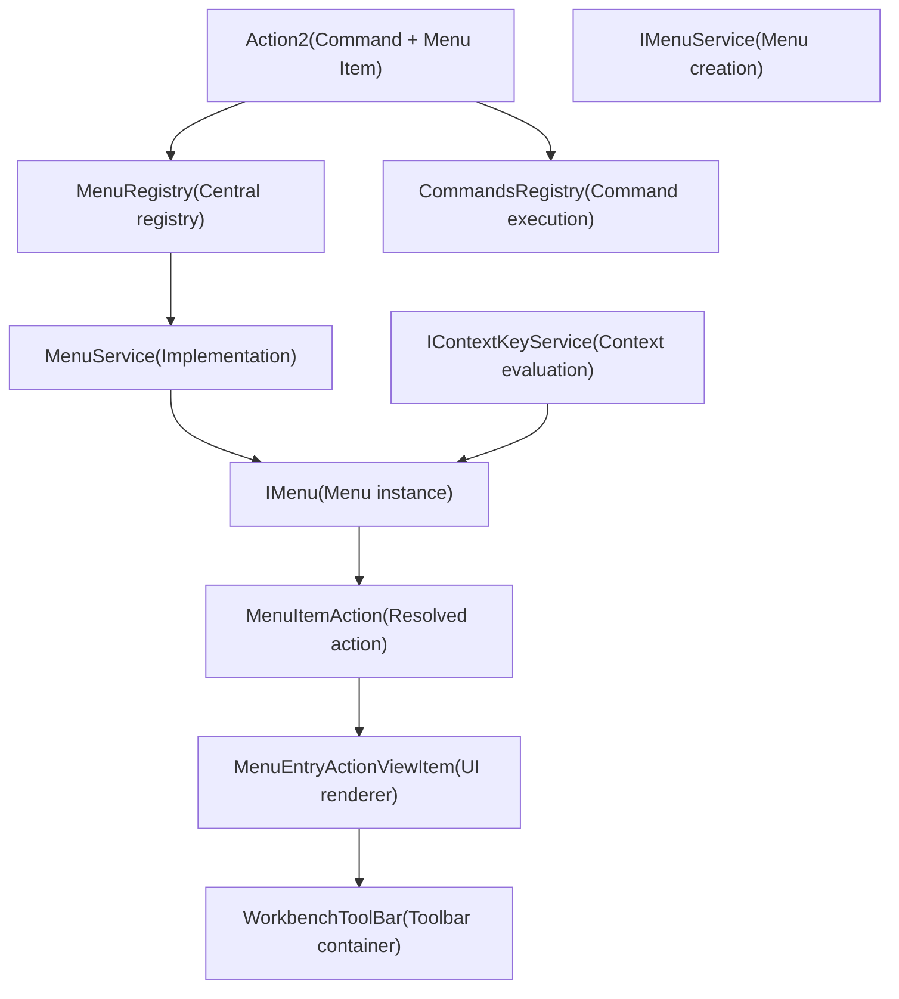
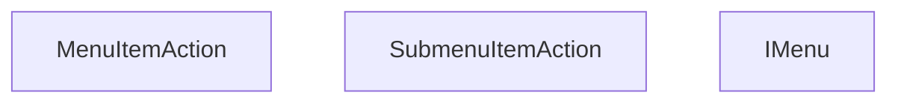
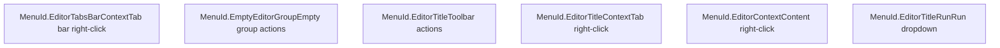
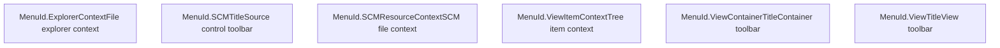
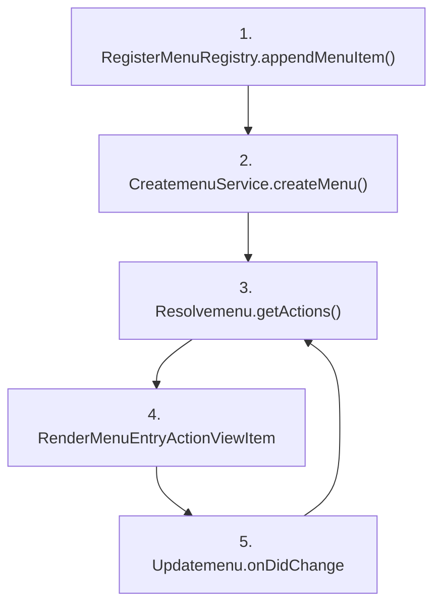

# Actions and Menu System

Relevant source files

-   [src/vs/platform/action/common/action.ts](https://github.com/microsoft/vscode/blob/1be3088d/src/vs/platform/action/common/action.ts)
-   [src/vs/platform/actions/browser/actionViewItemService.ts](https://github.com/microsoft/vscode/blob/1be3088d/src/vs/platform/actions/browser/actionViewItemService.ts)
-   [src/vs/platform/actions/browser/menuEntryActionViewItem.css](https://github.com/microsoft/vscode/blob/1be3088d/src/vs/platform/actions/browser/menuEntryActionViewItem.css)
-   [src/vs/platform/actions/browser/menuEntryActionViewItem.ts](https://github.com/microsoft/vscode/blob/1be3088d/src/vs/platform/actions/browser/menuEntryActionViewItem.ts)
-   [src/vs/platform/actions/browser/toolbar.ts](https://github.com/microsoft/vscode/blob/1be3088d/src/vs/platform/actions/browser/toolbar.ts)
-   [src/vs/platform/actions/common/actions.ts](https://github.com/microsoft/vscode/blob/1be3088d/src/vs/platform/actions/common/actions.ts)
-   [src/vs/platform/actions/common/menuService.ts](https://github.com/microsoft/vscode/blob/1be3088d/src/vs/platform/actions/common/menuService.ts)
-   [src/vs/platform/editor/common/editor.ts](https://github.com/microsoft/vscode/blob/1be3088d/src/vs/platform/editor/common/editor.ts)
-   [src/vs/platform/observable/common/platformObservableUtils.ts](https://github.com/microsoft/vscode/blob/1be3088d/src/vs/platform/observable/common/platformObservableUtils.ts)
-   [src/vs/workbench/browser/actions/layoutActions.ts](https://github.com/microsoft/vscode/blob/1be3088d/src/vs/workbench/browser/actions/layoutActions.ts)
-   [src/vs/workbench/browser/actions/quickAccessActions.ts](https://github.com/microsoft/vscode/blob/1be3088d/src/vs/workbench/browser/actions/quickAccessActions.ts)
-   [src/vs/workbench/browser/contextkeys.ts](https://github.com/microsoft/vscode/blob/1be3088d/src/vs/workbench/browser/contextkeys.ts)
-   [src/vs/workbench/browser/dnd.ts](https://github.com/microsoft/vscode/blob/1be3088d/src/vs/workbench/browser/dnd.ts)
-   [src/vs/workbench/browser/layout.ts](https://github.com/microsoft/vscode/blob/1be3088d/src/vs/workbench/browser/layout.ts)
-   [src/vs/workbench/browser/parts/auxiliarybar/auxiliaryBarActions.ts](https://github.com/microsoft/vscode/blob/1be3088d/src/vs/workbench/browser/parts/auxiliarybar/auxiliaryBarActions.ts)
-   [src/vs/workbench/browser/parts/editor/auxiliaryEditorPart.ts](https://github.com/microsoft/vscode/blob/1be3088d/src/vs/workbench/browser/parts/editor/auxiliaryEditorPart.ts)
-   [src/vs/workbench/browser/parts/editor/editor.contribution.ts](https://github.com/microsoft/vscode/blob/1be3088d/src/vs/workbench/browser/parts/editor/editor.contribution.ts)
-   [src/vs/workbench/browser/parts/editor/editor.ts](https://github.com/microsoft/vscode/blob/1be3088d/src/vs/workbench/browser/parts/editor/editor.ts)
-   [src/vs/workbench/browser/parts/editor/editorActions.ts](https://github.com/microsoft/vscode/blob/1be3088d/src/vs/workbench/browser/parts/editor/editorActions.ts)
-   [src/vs/workbench/browser/parts/editor/editorCommands.ts](https://github.com/microsoft/vscode/blob/1be3088d/src/vs/workbench/browser/parts/editor/editorCommands.ts)
-   [src/vs/workbench/browser/parts/editor/editorDropTarget.ts](https://github.com/microsoft/vscode/blob/1be3088d/src/vs/workbench/browser/parts/editor/editorDropTarget.ts)
-   [src/vs/workbench/browser/parts/editor/editorGroupView.ts](https://github.com/microsoft/vscode/blob/1be3088d/src/vs/workbench/browser/parts/editor/editorGroupView.ts)
-   [src/vs/workbench/browser/parts/editor/editorPart.ts](https://github.com/microsoft/vscode/blob/1be3088d/src/vs/workbench/browser/parts/editor/editorPart.ts)
-   [src/vs/workbench/browser/parts/editor/editorParts.ts](https://github.com/microsoft/vscode/blob/1be3088d/src/vs/workbench/browser/parts/editor/editorParts.ts)
-   [src/vs/workbench/browser/parts/panel/panelActions.ts](https://github.com/microsoft/vscode/blob/1be3088d/src/vs/workbench/browser/parts/panel/panelActions.ts)
-   [src/vs/workbench/browser/parts/titlebar/commandCenterControl.ts](https://github.com/microsoft/vscode/blob/1be3088d/src/vs/workbench/browser/parts/titlebar/commandCenterControl.ts)
-   [src/vs/workbench/browser/parts/titlebar/media/titlebarpart.css](https://github.com/microsoft/vscode/blob/1be3088d/src/vs/workbench/browser/parts/titlebar/media/titlebarpart.css)
-   [src/vs/workbench/browser/parts/titlebar/titlebarActions.ts](https://github.com/microsoft/vscode/blob/1be3088d/src/vs/workbench/browser/parts/titlebar/titlebarActions.ts)
-   [src/vs/workbench/browser/parts/titlebar/titlebarPart.ts](https://github.com/microsoft/vscode/blob/1be3088d/src/vs/workbench/browser/parts/titlebar/titlebarPart.ts)
-   [src/vs/workbench/browser/parts/titlebar/windowTitle.ts](https://github.com/microsoft/vscode/blob/1be3088d/src/vs/workbench/browser/parts/titlebar/windowTitle.ts)
-   [src/vs/workbench/browser/workbench.contribution.ts](https://github.com/microsoft/vscode/blob/1be3088d/src/vs/workbench/browser/workbench.contribution.ts)
-   [src/vs/workbench/browser/workbench.ts](https://github.com/microsoft/vscode/blob/1be3088d/src/vs/workbench/browser/workbench.ts)
-   [src/vs/workbench/common/contextkeys.ts](https://github.com/microsoft/vscode/blob/1be3088d/src/vs/workbench/common/contextkeys.ts)
-   [src/vs/workbench/common/editor.ts](https://github.com/microsoft/vscode/blob/1be3088d/src/vs/workbench/common/editor.ts)
-   [src/vs/workbench/contrib/chat/browser/widget/chatContentParts/chatInlineAnchorWidget.ts](https://github.com/microsoft/vscode/blob/1be3088d/src/vs/workbench/contrib/chat/browser/widget/chatContentParts/chatInlineAnchorWidget.ts)
-   [src/vs/workbench/contrib/chat/browser/widget/chatContentParts/chatMarkdownDecorationsRenderer.ts](https://github.com/microsoft/vscode/blob/1be3088d/src/vs/workbench/contrib/chat/browser/widget/chatContentParts/chatMarkdownDecorationsRenderer.ts)
-   [src/vs/workbench/contrib/chat/browser/widget/chatContentParts/media/chatInlineAnchorWidget.css](https://github.com/microsoft/vscode/blob/1be3088d/src/vs/workbench/contrib/chat/browser/widget/chatContentParts/media/chatInlineAnchorWidget.css)
-   [src/vs/workbench/contrib/debug/browser/statusbarColorProvider.ts](https://github.com/microsoft/vscode/blob/1be3088d/src/vs/workbench/contrib/debug/browser/statusbarColorProvider.ts)
-   [src/vs/workbench/services/actions/common/menusExtensionPoint.ts](https://github.com/microsoft/vscode/blob/1be3088d/src/vs/workbench/services/actions/common/menusExtensionPoint.ts)
-   [src/vs/workbench/services/editor/browser/editorService.ts](https://github.com/microsoft/vscode/blob/1be3088d/src/vs/workbench/services/editor/browser/editorService.ts)
-   [src/vs/workbench/services/editor/common/editorGroupsService.ts](https://github.com/microsoft/vscode/blob/1be3088d/src/vs/workbench/services/editor/common/editorGroupsService.ts)
-   [src/vs/workbench/services/editor/common/editorService.ts](https://github.com/microsoft/vscode/blob/1be3088d/src/vs/workbench/services/editor/common/editorService.ts)
-   [src/vs/workbench/services/editor/test/browser/editorGroupsService.test.ts](https://github.com/microsoft/vscode/blob/1be3088d/src/vs/workbench/services/editor/test/browser/editorGroupsService.test.ts)
-   [src/vs/workbench/services/editor/test/browser/editorService.test.ts](https://github.com/microsoft/vscode/blob/1be3088d/src/vs/workbench/services/editor/test/browser/editorService.test.ts)
-   [src/vs/workbench/services/layout/browser/layoutService.ts](https://github.com/microsoft/vscode/blob/1be3088d/src/vs/workbench/services/layout/browser/layoutService.ts)
-   [src/vs/workbench/test/browser/workbenchTestServices.ts](https://github.com/microsoft/vscode/blob/1be3088d/src/vs/workbench/test/browser/workbenchTestServices.ts)

## Purpose and Scope

This document describes VS Code's **Actions and Menu System**, which provides the infrastructure for registering actions, organizing them into menus, and rendering them throughout the UI. This system enables commands to appear in context menus, toolbars, title bars, and other UI locations based on declarative menu contributions.

For information about keybindings and command execution, see the Command System documentation. For information about specific UI parts that display menus (like the editor title bar), see [Workbench Architecture](/microsoft/vscode/5-workbench-architecture).

## Architecture Overview


**Menu System Architecture**

The menu system operates in three layers: registration (where actions are contributed), service (where menus are instantiated), and rendering (where UI elements are created).

Sources: [src/vs/platform/actions/common/actions.ts1-450](https://github.com/microsoft/vscode/blob/1be3088d/src/vs/platform/actions/common/actions.ts#L1-L450) [src/vs/platform/actions/common/menuService.ts1-300](https://github.com/microsoft/vscode/blob/1be3088d/src/vs/platform/actions/common/menuService.ts#L1-L300)

## Core Concepts

### MenuId

`MenuId` identifies specific menu locations throughout the workbench. Each static property represents a unique menu location.

```mermaid
flowchart TD
    PanelTitle["MenuId.PanelTitle"]
    TerminalContext["MenuId.TerminalInstanceContext"]
    CommandPalette["MenuId.CommandPalette"]
    MenubarFileMenu["MenuId.MenubarFileMenu"]
    MenubarEditMenu["MenuId.MenubarEditMenu"]
    ViewTitle["MenuId.ViewTitle"]
    ViewItemContext["MenuId.ViewItemContext"]
    EditorTitle["MenuId.EditorTitle"]
    EditorContext["MenuId.EditorContext"]
    EditorTitleContext["MenuId.EditorTitleContext"]
```


**Common MenuId Locations**

Common menu locations include:

-   `MenuId.CommandPalette` - Command palette entries
-   `MenuId.EditorTitle` - Editor title bar actions
-   `MenuId.EditorContext` - Editor context menu
-   `MenuId.ViewTitle` - View container title actions
-   `MenuId.MenubarFileMenu`, `MenuId.MenubarEditMenu`, etc. - Native menu bar

Sources: [src/vs/platform/actions/common/actions.ts65-300](https://github.com/microsoft/vscode/blob/1be3088d/src/vs/platform/actions/common/actions.ts#L65-L300)

### Menu Items and Submenus

Menu contributions are defined using `IMenuItem` or `ISubmenuItem` interfaces:

| Property | Type | Description |
| --- | --- | --- |
| `command` | `ICommandAction` | The command to execute (IMenuItem only) |
| `submenu` | `MenuId` | Nested submenu identifier (ISubmenuItem only) |
| `when` | `ContextKeyExpression` | Visibility condition |
| `group` | `string` | Grouping identifier (e.g., "navigation", "1\_modification") |
| `order` | `number` | Sort order within group |
| `alt` | `ICommandAction` | Alternative command (shown with modifier key) |
| `isHiddenByDefault` | `boolean` | Hidden until explicitly shown by user |

Sources: [src/vs/platform/actions/common/actions.ts18-55](https://github.com/microsoft/vscode/blob/1be3088d/src/vs/platform/actions/common/actions.ts#L18-L55)

### Action Registration

Actions are typically registered using `Action2`, which combines command registration with menu contributions:

```
// Example from layoutActions.ts
class ToggleCenteredLayoutAction extends Action2 {
    constructor() {
        super({
            id: 'workbench.action.toggleCenteredLayout',
            title: localize2('toggleCenteredLayout', "Toggle Centered Layout"),
            category: Categories.View,
            f1: true, // Show in command palette
            toggled: IsMainEditorCenteredLayoutContext,
            menu: [{
                id: MenuId.MenubarAppearanceMenu,
                group: '1_toggle_view',
                order: 3
            }]
        });
    }

    run(accessor: ServicesAccessor): void {
        // Implementation
    }
}
```
Sources: [src/vs/workbench/browser/actions/layoutActions.ts66-94](https://github.com/microsoft/vscode/blob/1be3088d/src/vs/workbench/browser/actions/layoutActions.ts#L66-L94) [src/vs/platform/actions/common/actions.ts428-500](https://github.com/microsoft/vscode/blob/1be3088d/src/vs/platform/actions/common/actions.ts#L428-L500)

## Menu Lifecycle

> **[Mermaid sequence]**
> *(图表结构无法解析)*

**Menu Creation and Update Flow**

Sources: [src/vs/platform/actions/common/menuService.ts50-200](https://github.com/microsoft/vscode/blob/1be3088d/src/vs/platform/actions/common/menuService.ts#L50-L200)

## MenuRegistry

The `MenuRegistry` is the central singleton that stores all menu contributions.

### Registration API

```
// Direct registration
MenuRegistry.appendMenuItem(MenuId.EditorTitle, {
    command: {
        id: 'myCommand',
        title: 'My Action',
        icon: Codicon.gear
    },
    when: ContextKeyExpr.equals('resourceScheme', 'file'),
    group: 'navigation',
    order: 1
});

// Multiple registrations
MenuRegistry.appendMenuItems([
    { id: MenuId.EditorTitle, item: { ... } },
    { id: MenuId.EditorContext, item: { ... } }
]);
```
### Menu Item Commands

Menu item commands extend `ICommandAction` with additional properties:

| Property | Description |
| --- | --- |
| `id` | Command identifier |
| `title` | Display text (string or ICommandActionTitle) |
| `icon` | Icon (ThemeIcon or URI) |
| `precondition` | Execution requirement (doesn't hide) |
| `toggled` | Toggle state expression or toggle info |
| `tooltip` | Tooltip text |

Sources: [src/vs/platform/actions/common/actions.ts426-500](https://github.com/microsoft/vscode/blob/1be3088d/src/vs/platform/actions/common/actions.ts#L426-L500)

## IMenuService

The `IMenuService` creates menu instances that resolve and filter menu items based on context.

### Creating Menus

```
interface IMenuService {
    // Create a menu instance
    createMenu(id: MenuId, contextKeyService: IContextKeyService, options?: IMenuCreateOptions): IMenu;

    // Quick helper: create, get actions, dispose
    getMenuActions(id: MenuId, contextKeyService: IContextKeyService, options?: IMenuActionOptions): [string, Array<MenuItemAction | SubmenuItemAction>][];

    // Get context keys this menu depends on
    getMenuContexts(id: MenuId): ReadonlySet<string>;
}
```
### Menu Options

| Option | Type | Description |
| --- | --- | --- |
| `emitEventsForSubmenuChanges` | `boolean` | Fire change events for nested submenus |
| `eventDebounceDelay` | `number` | Debounce delay for change events |
| `arg` | `unknown` | Argument passed to actions |
| `shouldForwardArgs` | `boolean` | Pass args to command execution |
| `renderShortTitle` | `boolean` | Use short title if available |

Sources: [src/vs/platform/actions/common/actions.ts348-388](https://github.com/microsoft/vscode/blob/1be3088d/src/vs/platform/actions/common/actions.ts#L348-L388)

## IMenu Interface

`IMenu` represents an instantiated menu that filters items based on the current context.

### Key Methods

```
interface IMenu {
    readonly onDidChange: Event<IMenuChangeEvent>;

    // Get grouped and sorted actions
    getActions(options?: IMenuActionOptions): [string, Array<MenuItemAction | SubmenuItemAction>][];

    dispose(): void;
}
```
### Menu Change Events

```
interface IMenuChangeEvent {
    readonly menu: IMenu;
    readonly isStructuralChange: boolean;  // Items added/removed
    readonly isToggleChange: boolean;      // Toggle state changed
    readonly isEnablementChange: boolean;  // Enabled/disabled changed
}
```
The menu fires change events when:

-   Context keys affecting `when` clauses change
-   Menu items are added/removed from the registry
-   Toggle states change
-   Enablement conditions change

Sources: [src/vs/platform/actions/common/actions.ts338-346](https://github.com/microsoft/vscode/blob/1be3088d/src/vs/platform/actions/common/actions.ts#L338-L346) [src/vs/platform/actions/common/menuService.ts100-250](https://github.com/microsoft/vscode/blob/1be3088d/src/vs/platform/actions/common/menuService.ts#L100-L250)

## MenuItemAction and SubmenuItemAction

These classes wrap menu items with resolved state.


**Menu Action Types**

`MenuItemAction` properties are computed from:

-   `IMenuItem.command` - Command definition
-   `IMenuItem.when` - Visibility (items filtered if false)
-   `IMenuItem.alt` - Alternative action (e.g., Alt+Click)
-   Context key evaluation at render time
-   Keybinding service for keyboard shortcuts

Sources: [src/vs/platform/actions/common/actions.ts502-700](https://github.com/microsoft/vscode/blob/1be3088d/src/vs/platform/actions/common/actions.ts#L502-L700)

## Menu Rendering

### WorkbenchToolBar

The `WorkbenchToolBar` is the primary container for rendering menu actions in toolbars.

```
class WorkbenchToolBar extends ToolBar {
    constructor(
        container: HTMLElement,
        options: IWorkbenchToolBarOptions,
        @IMenuService menuService: IMenuService,
        @IContextKeyService contextKeyService: IContextKeyService,
        @IContextMenuService contextMenuService: IContextMenuService,
        @IKeybindingService keybindingService: IKeybindingService
    )

    // Set actions from a menu
    setActions(actions: IAction[], secondary?: IAction[]): void;
}
```
The toolbar automatically:

-   Creates action view items
-   Updates when context changes
-   Handles primary/secondary action groups
-   Manages overflow for secondary actions

Sources: [src/vs/platform/actions/browser/toolbar.ts1-500](https://github.com/microsoft/vscode/blob/1be3088d/src/vs/platform/actions/browser/toolbar.ts#L1-L500)

### MenuEntryActionViewItem

This class renders individual menu items in the UI:

```
class MenuEntryActionViewItem extends ActionViewItem {
    // Renders icon, label, keybinding, submenu indicator
    render(container: HTMLElement): void;

    // Updates label, icon, tooltip based on action state
    updateLabel(): void;
    updateTooltip(): void;

    // Handles click, keyboard, hover
    onClick(event: MouseEvent): void;
}
```
Key rendering features:

-   Icon rendering (Codicons, URIs)
-   Keybinding display
-   Tooltip with keybinding
-   Toggle state visualization (checkmarks)
-   Disabled state styling
-   Alternative action support (Alt+Click)

Sources: [src/vs/platform/actions/browser/menuEntryActionViewItem.ts1-800](https://github.com/microsoft/vscode/blob/1be3088d/src/vs/platform/actions/browser/menuEntryActionViewItem.ts#L1-L800)

## Context-Based Visibility

Menu items use context key expressions to control visibility and enablement:

```
// Simple equality
when: ContextKeyExpr.equals('editorLangId', 'typescript')

// Boolean check
when: ContextKeyExpr.has('resourceScheme')

// Complex expressions
when: ContextKeyExpr.and(
    ContextKeyExpr.equals('view', 'workbench.explorer.fileView'),
    ContextKeyExpr.not('explorerResourceIsRoot')
)

// Precondition (doesn't hide, just disables)
precondition: ContextKeyExpr.has('editorIsOpen')
```
Common patterns:

| Pattern | Usage |
| --- | --- |
| `when: undefined` | Always visible |
| `when: ActiveEditorContext` | Requires active editor |
| `when: ResourceContextKey.Scheme.isEqualTo('file')` | File resources only |
| `when: EditorGroupEditorsCountContext.notEqualsTo('0')` | Has open editors |

Sources: [src/vs/workbench/common/contextkeys.ts1-300](https://github.com/microsoft/vscode/blob/1be3088d/src/vs/workbench/common/contextkeys.ts#L1-L300) [src/vs/platform/contextkey/common/contextkey.ts1-500](https://github.com/microsoft/vscode/blob/1be3088d/src/vs/platform/contextkey/common/contextkey.ts#L1-L500)

## Menu Groups and Ordering

Menu items are organized into groups that control:

1.  Grouping (items in same group appear together)
2.  Separator placement (groups separated by dividers)
3.  Ordering within groups

### Group Naming Convention

| Group Pattern | Description | Example |
| --- | --- | --- |
| `navigation` | Primary navigation actions (inline) | Editor tabs, view icons |
| `1_`, `2_`, `3_` | Numbered groups | `1_modification`, `2_workspace` |
| `inline` | Inline actions in trees/lists | File explorer inline actions |
| `z_commands` | Low priority (bottom) | Generic commands |

### Ordering Example

```
// First in navigation group
{ group: 'navigation', order: 1 }

// Second in navigation group
{ group: 'navigation', order: 2 }

// First in modification group (appears after navigation)
{ group: '1_modification', order: 1 }

// Second modification group item
{ group: '1_modification', order: 2 }
```
Sources: [src/vs/workbench/browser/parts/editor/editor.contribution.ts400-600](https://github.com/microsoft/vscode/blob/1be3088d/src/vs/workbench/browser/parts/editor/editor.contribution.ts#L400-L600) [src/vs/workbench/services/actions/common/menusExtensionPoint.ts200-400](https://github.com/microsoft/vscode/blob/1be3088d/src/vs/workbench/services/actions/common/menusExtensionPoint.ts#L200-L400)

## Extension API Integration

Extensions contribute menu items through the `package.json` manifest:

```
{
  "contributes": {
    "menus": {
      "editor/title": [
        {
          "command": "extension.myCommand",
          "when": "resourceLangId == javascript",
          "group": "navigation",
          "order": 1
        }
      ],
      "explorer/context": [
        {
          "command": "extension.contextCommand",
          "when": "resourceScheme == file",
          "group": "2_workspace"
        }
      ],
      "commandPalette": [
        {
          "command": "extension.paletteCommand",
          "when": "editorIsOpen"
        }
      ]
    }
  }
}
```
### Menu Location Identifiers

| Manifest ID | MenuId Constant | Location |
| --- | --- | --- |
| `editor/title` | `MenuId.EditorTitle` | Editor title bar |
| `editor/context` | `MenuId.EditorContext` | Editor right-click menu |
| `explorer/context` | `MenuId.ExplorerContext` | File explorer right-click |
| `view/title` | `MenuId.ViewTitle` | View container title |
| `view/item/context` | `MenuId.ViewItemContext` | Tree item right-click |
| `commandPalette` | `MenuId.CommandPalette` | Command palette |
| `touchBar` | `MenuId.TouchBarContext` | macOS Touch Bar |

Sources: [src/vs/workbench/services/actions/common/menusExtensionPoint.ts1-800](https://github.com/microsoft/vscode/blob/1be3088d/src/vs/workbench/services/actions/common/menusExtensionPoint.ts#L1-L800)

## Common Menu Locations

### Editor Menus


**Editor-Related Menus**

Sources: [src/vs/platform/actions/common/actions.ts83-100](https://github.com/microsoft/vscode/blob/1be3088d/src/vs/platform/actions/common/actions.ts#L83-L100)

### View Menus


**View-Related Menus**

Sources: [src/vs/platform/actions/common/actions.ts102-154](https://github.com/microsoft/vscode/blob/1be3088d/src/vs/platform/actions/common/actions.ts#L102-L154)

### Global Menus

The workbench provides menus for global actions:

-   `MenuId.CommandPalette` - All commands available via Cmd+Shift+P / Ctrl+Shift+P
-   `MenuId.MenubarFileMenu`, `MenuId.MenubarEditMenu`, etc. - Native menu bar sections
-   `MenuId.GlobalActivity` - Account/settings menu
-   `MenuId.TitleBar` - Window title bar actions
-   `MenuId.CommandCenter` - Command center in title bar

Sources: [src/vs/platform/actions/common/actions.ts69-133](https://github.com/microsoft/vscode/blob/1be3088d/src/vs/platform/actions/common/actions.ts#L69-L133)

## Practical Examples

### Example 1: Simple Editor Action

```
registerAction2(class extends Action2 {
    constructor() {
        super({
            id: 'editor.action.toggleWordWrap',
            title: localize2('toggleWordWrap', "Toggle Word Wrap"),
            f1: true, // Show in command palette
            menu: {
                id: MenuId.EditorTitle,
                when: ContextKeyExpr.equals('editorTextFocus', true),
                group: 'navigation',
                order: 10
            },
            keybinding: {
                primary: KeyMod.Alt | KeyCode.KeyZ,
                weight: KeybindingWeight.EditorContrib
            }
        });
    }

    run(accessor: ServicesAccessor): void {
        // Toggle word wrap
    }
});
```
Sources: [src/vs/workbench/browser/actions/layoutActions.ts1-100](https://github.com/microsoft/vscode/blob/1be3088d/src/vs/workbench/browser/actions/layoutActions.ts#L1-L100)

### Example 2: Conditional Submenu

```
MenuRegistry.appendMenuItem(MenuId.EditorTitle, {
    title: localize('splitEditor', "Split Editor"),
    submenu: MenuId.EditorSplitMoveSubmenu,
    icon: Codicon.splitHorizontal,
    group: 'navigation',
    order: 100,
    when: ContextKeyExpr.and(
        ActiveEditorCanSplitInGroupContext,
        ContextKeyExpr.not('isInDiffEditor')
    )
});

// Populate submenu
MenuRegistry.appendMenuItem(MenuId.EditorSplitMoveSubmenu, {
    command: {
        id: SPLIT_EDITOR_UP,
        title: localize('splitUp', "Split Up")
    },
    order: 1
});

MenuRegistry.appendMenuItem(MenuId.EditorSplitMoveSubmenu, {
    command: {
        id: SPLIT_EDITOR_DOWN,
        title: localize('splitDown', "Split Down")
    },
    order: 2
});
```
Sources: [src/vs/workbench/browser/parts/editor/editor.contribution.ts500-700](https://github.com/microsoft/vscode/blob/1be3088d/src/vs/workbench/browser/parts/editor/editor.contribution.ts#L500-L700)

### Example 3: Dynamic Menu Creation

```
class MyViewTitleActions {
    private menu: IMenu;
    private toolbar: WorkbenchToolBar;

    constructor(
        container: HTMLElement,
        @IMenuService menuService: IMenuService,
        @IContextKeyService contextKeyService: IContextKeyService
    ) {
        // Create menu for view title
        this.menu = menuService.createMenu(
            MenuId.ViewTitle,
            contextKeyService
        );

        // Create toolbar to render actions
        this.toolbar = new WorkbenchToolBar(container, {
            orientation: ActionsOrientation.HORIZONTAL
        });

        // Update toolbar when menu changes
        this.menu.onDidChange(() => this.updateActions());
        this.updateActions();
    }

    private updateActions(): void {
        const actions = this.menu.getActions();
        const primary: IAction[] = [];
        const secondary: IAction[] = [];

        // Separate primary (navigation) from secondary
        for (const [group, groupActions] of actions) {
            if (group === 'navigation') {
                primary.push(...groupActions);
            } else {
                secondary.push(...groupActions);
            }
        }

        this.toolbar.setActions(primary, secondary);
    }
}
```
Sources: [src/vs/workbench/browser/parts/titlebar/titlebarPart.ts600-900](https://github.com/microsoft/vscode/blob/1be3088d/src/vs/workbench/browser/parts/titlebar/titlebarPart.ts#L600-L900) [src/vs/platform/actions/browser/toolbar.ts100-300](https://github.com/microsoft/vscode/blob/1be3088d/src/vs/platform/actions/browser/toolbar.ts#L100-L300)

## Menu System Flow Summary


**Menu System Data Flow**

1.  **Registration**: Actions register menu contributions with `MenuRegistry`
2.  **Creation**: UI components create `IMenu` instances via `IMenuService`
3.  **Resolution**: Menu resolves items based on current context
4.  **Rendering**: `MenuEntryActionViewItem` creates UI elements
5.  **Updates**: Context changes trigger menu updates

Sources: [src/vs/platform/actions/common/actions.ts1-800](https://github.com/microsoft/vscode/blob/1be3088d/src/vs/platform/actions/common/actions.ts#L1-L800) [src/vs/platform/actions/common/menuService.ts1-400](https://github.com/microsoft/vscode/blob/1be3088d/src/vs/platform/actions/common/menuService.ts#L1-L400)
