# Extension Host Architecture and RPC Protocol

Relevant source files

-   [extensions/vscode-api-tests/package.json](https://github.com/microsoft/vscode/blob/1be3088d/extensions/vscode-api-tests/package.json)
-   [extensions/vscode-api-tests/src/singlefolder-tests/chat.test.ts](https://github.com/microsoft/vscode/blob/1be3088d/extensions/vscode-api-tests/src/singlefolder-tests/chat.test.ts)
-   [src/vs/editor/common/languages.ts](https://github.com/microsoft/vscode/blob/1be3088d/src/vs/editor/common/languages.ts)
-   [src/vs/platform/extensions/common/extensionsApiProposals.ts](https://github.com/microsoft/vscode/blob/1be3088d/src/vs/platform/extensions/common/extensionsApiProposals.ts)
-   [src/vs/workbench/api/browser/mainThreadChatAgents2.ts](https://github.com/microsoft/vscode/blob/1be3088d/src/vs/workbench/api/browser/mainThreadChatAgents2.ts)
-   [src/vs/workbench/api/browser/mainThreadChatStatus.ts](https://github.com/microsoft/vscode/blob/1be3088d/src/vs/workbench/api/browser/mainThreadChatStatus.ts)
-   [src/vs/workbench/api/browser/mainThreadLanguageFeatures.ts](https://github.com/microsoft/vscode/blob/1be3088d/src/vs/workbench/api/browser/mainThreadLanguageFeatures.ts)
-   [src/vs/workbench/api/common/extHost.api.impl.ts](https://github.com/microsoft/vscode/blob/1be3088d/src/vs/workbench/api/common/extHost.api.impl.ts)
-   [src/vs/workbench/api/common/extHost.protocol.ts](https://github.com/microsoft/vscode/blob/1be3088d/src/vs/workbench/api/common/extHost.protocol.ts)
-   [src/vs/workbench/api/common/extHostChatAgents2.ts](https://github.com/microsoft/vscode/blob/1be3088d/src/vs/workbench/api/common/extHostChatAgents2.ts)
-   [src/vs/workbench/api/common/extHostChatStatus.ts](https://github.com/microsoft/vscode/blob/1be3088d/src/vs/workbench/api/common/extHostChatStatus.ts)
-   [src/vs/workbench/api/common/extHostLanguageFeatures.ts](https://github.com/microsoft/vscode/blob/1be3088d/src/vs/workbench/api/common/extHostLanguageFeatures.ts)
-   [src/vs/workbench/api/common/extHostTypeConverters.ts](https://github.com/microsoft/vscode/blob/1be3088d/src/vs/workbench/api/common/extHostTypeConverters.ts)
-   [src/vs/workbench/api/common/extHostTypes.ts](https://github.com/microsoft/vscode/blob/1be3088d/src/vs/workbench/api/common/extHostTypes.ts)
-   [src/vs/workbench/contrib/chat/browser/actions/chatActions.ts](https://github.com/microsoft/vscode/blob/1be3088d/src/vs/workbench/contrib/chat/browser/actions/chatActions.ts)
-   [src/vs/workbench/contrib/chat/browser/actions/chatExecuteActions.ts](https://github.com/microsoft/vscode/blob/1be3088d/src/vs/workbench/contrib/chat/browser/actions/chatExecuteActions.ts)
-   [src/vs/workbench/contrib/chat/browser/actions/chatGettingStarted.ts](https://github.com/microsoft/vscode/blob/1be3088d/src/vs/workbench/contrib/chat/browser/actions/chatGettingStarted.ts)
-   [src/vs/workbench/contrib/chat/browser/chat.contribution.ts](https://github.com/microsoft/vscode/blob/1be3088d/src/vs/workbench/contrib/chat/browser/chat.contribution.ts)
-   [src/vs/workbench/contrib/chat/browser/chat.ts](https://github.com/microsoft/vscode/blob/1be3088d/src/vs/workbench/contrib/chat/browser/chat.ts)
-   [src/vs/workbench/contrib/chat/common/constants.ts](https://github.com/microsoft/vscode/blob/1be3088d/src/vs/workbench/contrib/chat/common/constants.ts)
-   [src/vs/workbench/contrib/chat/test/common/voiceChatService.test.ts](https://github.com/microsoft/vscode/blob/1be3088d/src/vs/workbench/contrib/chat/test/common/voiceChatService.test.ts)
-   [src/vscode-dts/vscode.d.ts](https://github.com/microsoft/vscode/blob/1be3088d/src/vscode-dts/vscode.d.ts)
-   [src/vscode-dts/vscode.proposed.chatParticipantAdditions.d.ts](https://github.com/microsoft/vscode/blob/1be3088d/src/vscode-dts/vscode.proposed.chatParticipantAdditions.d.ts)
-   [src/vscode-dts/vscode.proposed.chatStatusItem.d.ts](https://github.com/microsoft/vscode/blob/1be3088d/src/vscode-dts/vscode.proposed.chatStatusItem.d.ts)
-   [src/vscode-dts/vscode.proposed.defaultChatParticipant.d.ts](https://github.com/microsoft/vscode/blob/1be3088d/src/vscode-dts/vscode.proposed.defaultChatParticipant.d.ts)
-   [src/vscode-dts/vscode.proposed.inlineCompletionsAdditions.d.ts](https://github.com/microsoft/vscode/blob/1be3088d/src/vscode-dts/vscode.proposed.inlineCompletionsAdditions.d.ts)

## Purpose and Scope

This document describes VS Code's extension host architecture, which isolates third-party extension code in a separate process from the main workbench UI. It covers the RPC (Remote Procedure Call) protocol that enables communication between the extension host and the main renderer process, the type conversion system for marshalling data across process boundaries, and how the `vscode.*` extension API is implemented on top of this infrastructure.

For information about how the extension API surface is exposed to extensions, see [Extension API Implementation](/microsoft/vscode/5.2-editor-service-and-groups). For details on specific language feature providers, see [Language Features Provider System](/microsoft/vscode/5.3-editor-input-and-pane-system).

## Extension Host Process Isolation

VS Code runs extensions in a dedicated **Extension Host Process**, separate from the main UI (renderer) process. This architectural decision provides several critical benefits:

-   **Stability**: Extension crashes do not bring down the entire application
-   **Security**: Extensions have limited access to main process capabilities
-   **Performance**: Heavy extension operations don't block the UI thread
-   **Resource Management**: Extension memory and CPU usage can be monitored and limited

The extension host process communicates with the main process through an IPC channel, with all communication flowing through a strictly typed RPC protocol.

**Process Architecture Diagram:**

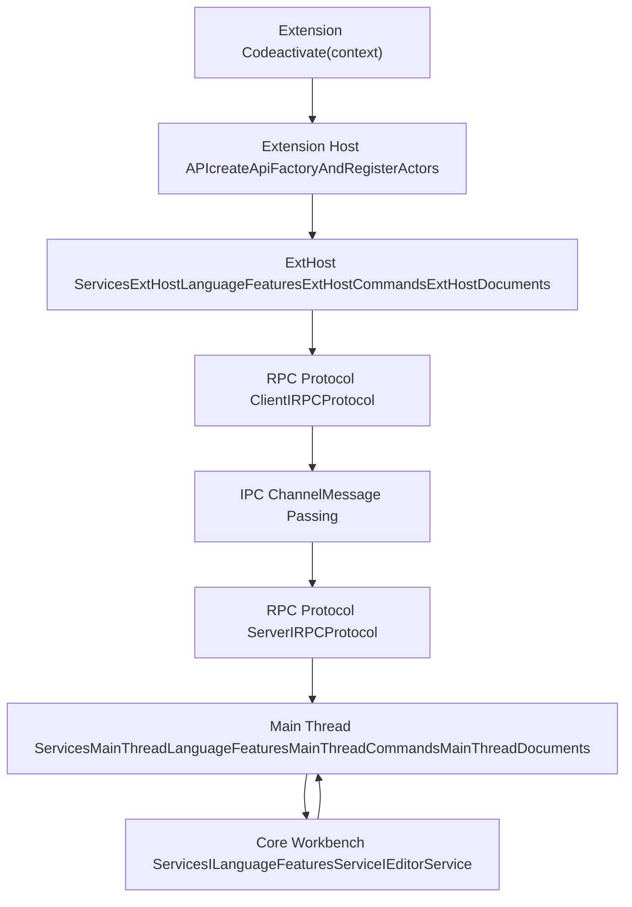
Sources: [src/vs/workbench/api/common/extHost.api.impl.ts132-244](https://github.com/microsoft/vscode/blob/1be3088d/src/vs/workbench/api/common/extHost.api.impl.ts#L132-L244) [src/vs/workbench/api/common/extHost.protocol.ts117-119](https://github.com/microsoft/vscode/blob/1be3088d/src/vs/workbench/api/common/extHost.protocol.ts#L117-L119)

## RPC Protocol Definition

The RPC protocol is defined in `extHost.protocol.ts`, which establishes a type-safe contract between the extension host and main thread. The protocol uses a **bidirectional proxy pattern** where both sides can initiate calls.

### Protocol Structure

The protocol defines two types of interfaces:

1.  **MainThread\*Shape**: Interfaces implemented in the renderer process, callable from extension host
2.  **ExtHost\*Shape**: Interfaces implemented in the extension host, callable from renderer process

Each interface extends `IDisposable` and declares methods that can be called across the process boundary. Methods are prefixed with `$` to indicate they are RPC-callable.

**Protocol Interface Pattern:**

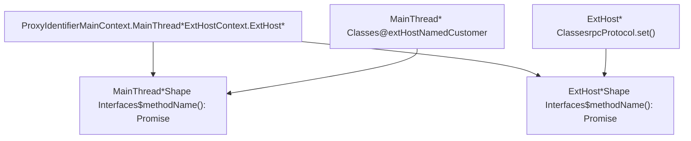
Sources: [src/vs/workbench/api/common/extHost.protocol.ts120-126](https://github.com/microsoft/vscode/blob/1be3088d/src/vs/workbench/api/common/extHost.protocol.ts#L120-L126) [src/vs/workbench/api/common/extHost.protocol.ts498-560](https://github.com/microsoft/vscode/blob/1be3088d/src/vs/workbench/api/common/extHost.protocol.ts#L498-L560)

### Key Protocol Interfaces

The protocol defines interfaces for major subsystems:

| Interface | Purpose | Key Methods |
| --- | --- | --- |
| `MainThreadLanguageFeaturesShape` | Language provider registration | `$registerCodeLensSupport`, `$registerCompletionsProvider` |
| `MainThreadCommandsShape` | Command execution | `$registerCommand`, `$executeCommand` |
| `MainThreadDocumentsShape` | Document operations | `$tryOpenDocument`, `$trySaveDocument` |
| `MainThreadTextEditorsShape` | Editor manipulation | `$tryShowTextDocument`, `$trySetDecorations` |
| `ExtHostDocumentsShape` | Document events | `$acceptModelChanged`, `$acceptModelSaved` |
| `ExtHostCommandsShape` | Command registration | `$executeContributedCommand` |

Sources: [src/vs/workbench/api/common/extHost.protocol.ts498-560](https://github.com/microsoft/vscode/blob/1be3088d/src/vs/workbench/api/common/extHost.protocol.ts#L498-L560) [src/vs/workbench/api/common/extHost.protocol.ts127-133](https://github.com/microsoft/vscode/blob/1be3088d/src/vs/workbench/api/common/extHost.protocol.ts#L127-L133) [src/vs/workbench/api/common/extHost.protocol.ts280-284](https://github.com/microsoft/vscode/blob/1be3088d/src/vs/workbench/api/common/extHost.protocol.ts#L280-L284)

### Proxy Identifier System

Each interface is associated with a unique `ProxyIdentifier<T>`, which acts as a typed key for routing RPC calls:

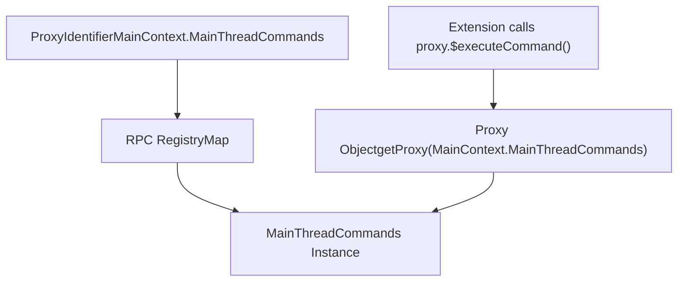
Sources: [src/vs/workbench/api/common/extHost.protocol.ts32](https://github.com/microsoft/vscode/blob/1be3088d/src/vs/workbench/api/common/extHost.protocol.ts#L32-L32) [src/vs/workbench/services/extensions/common/proxyIdentifier.ts](https://github.com/microsoft/vscode/blob/1be3088d/src/vs/workbench/services/extensions/common/proxyIdentifier.ts)

## Communication Flow

### Request-Response Pattern

RPC calls follow an asynchronous request-response pattern. The calling side serializes method arguments, sends them over IPC, and receives a promise that resolves when the remote side responds.

**Typical Communication Flow:**

> **[Mermaid sequence]**
> *(图表结构无法解析)*

Sources: [src/vs/workbench/api/common/extHost.api.impl.ts379-381](https://github.com/microsoft/vscode/blob/1be3088d/src/vs/workbench/api/common/extHost.api.impl.ts#L379-L381) [src/vs/workbench/api/common/extHost.protocol.ts131](https://github.com/microsoft/vscode/blob/1be3088d/src/vs/workbench/api/common/extHost.protocol.ts#L131-L131)

### Bidirectional Communication

The protocol supports calls in both directions. While extensions primarily call main thread methods, the main thread also calls into the extension host to notify of events or request provider results:

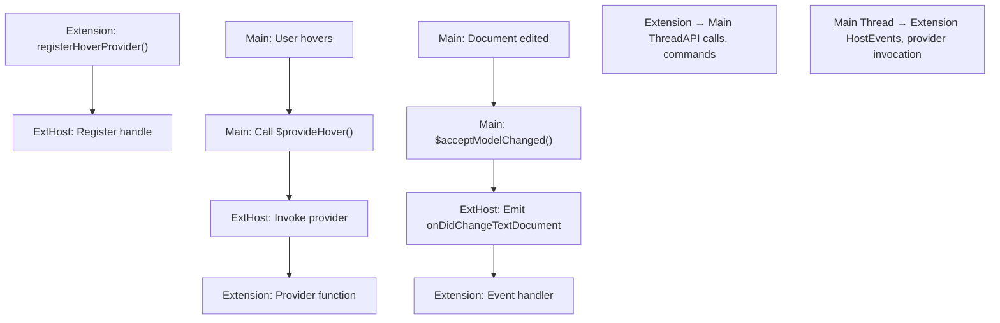
Sources: [src/vs/workbench/api/common/extHostLanguageFeatures.ts45-105](https://github.com/microsoft/vscode/blob/1be3088d/src/vs/workbench/api/common/extHostLanguageFeatures.ts#L45-L105) [src/vs/workbench/api/browser/mainThreadLanguageFeatures.ts45-98](https://github.com/microsoft/vscode/blob/1be3088d/src/vs/workbench/api/browser/mainThreadLanguageFeatures.ts#L45-L98)

## Type Conversion and Marshalling

Data crossing the process boundary must be serialized and deserialized. The `extHostTypeConverters.ts` module provides conversion functions between the `vscode.*` API types used by extensions and the internal types used by the core workbench.

### Conversion Patterns

Type converters follow naming conventions:

-   `from()`: Converts extension API types to internal types (for sending to main thread)
-   `to()`: Converts internal types to extension API types (for sending to extension host)

**Type Conversion Architecture:**

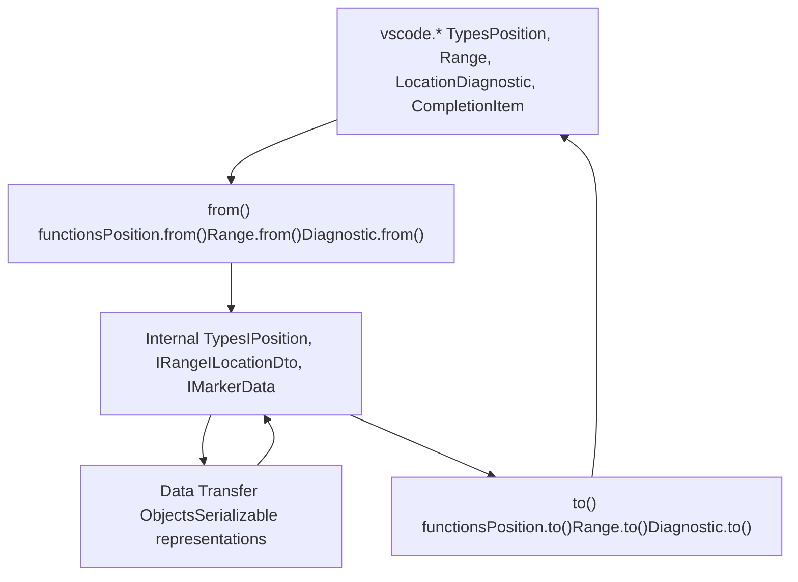
Sources: [src/vs/workbench/api/common/extHostTypeConverters.ts113-141](https://github.com/microsoft/vscode/blob/1be3088d/src/vs/workbench/api/common/extHostTypeConverters.ts#L113-L141) [src/vs/workbench/api/common/extHostTypeConverters.ts169-175](https://github.com/microsoft/vscode/blob/1be3088d/src/vs/workbench/api/common/extHostTypeConverters.ts#L169-L175)

### Common Conversions

| Extension Type | Internal Type | Converter |
| --- | --- | --- |
| `vscode.Position` | `IPosition` | `Position.from()` / `Position.to()` |
| `vscode.Range` | `IRange` | `Range.from()` / `Range.to()` |
| `vscode.Selection` | `ISelection` | `Selection.from()` / `Selection.to()` |
| `vscode.Location` | `languages.Location` | `Location.from()` / `Location.to()` |
| `vscode.Diagnostic` | `IMarkerData` | `Diagnostic.from()` / `Diagnostic.to()` |
| `vscode.CompletionItem` | `languages.CompletionItem` | Complex conversion in adapters |

Sources: [src/vs/workbench/api/common/extHostTypeConverters.ts168-175](https://github.com/microsoft/vscode/blob/1be3088d/src/vs/workbench/api/common/extHostTypeConverters.ts#L168-L175) [src/vs/workbench/api/common/extHostTypeConverters.ts237-270](https://github.com/microsoft/vscode/blob/1be3088d/src/vs/workbench/api/common/extHostTypeConverters.ts#L237-L270)

### Serialization Constraints

Not all objects can be directly serialized across the IPC boundary:

-   **Simple Types**: Primitives, strings, numbers, booleans pass through directly
-   **Structured Data**: Plain objects and arrays are serialized as JSON
-   **URIs**: `URI` objects are serialized to `UriComponents` and revived on the other side
-   **Complex Objects**: Rich objects (like `TextDocument`) are represented by handles or DTOs
-   **Functions**: Cannot be serialized; must use handle-based callbacks

**Handle-Based Pattern for Complex Objects:**

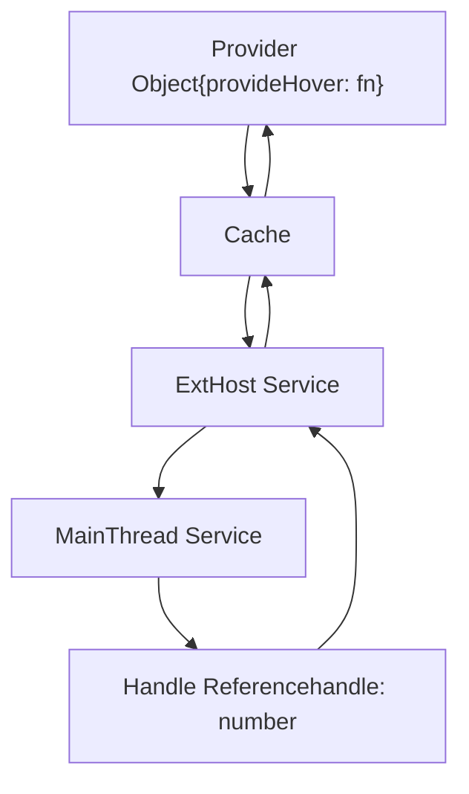
Sources: [src/vs/workbench/api/common/extHostLanguageFeatures.ts107-193](https://github.com/microsoft/vscode/blob/1be3088d/src/vs/workbench/api/common/extHostLanguageFeatures.ts#L107-L193) [src/vs/workbench/api/common/cache.ts](https://github.com/microsoft/vscode/blob/1be3088d/src/vs/workbench/api/common/cache.ts)

## API Implementation

The `vscode.*` API exposed to extensions is implemented as a facade over the RPC protocol. The `createApiFactoryAndRegisterActors` function in `extHost.api.impl.ts` is the entry point for creating the extension API surface.

### API Factory Pattern

Each extension receives its own API object when it activates. The factory function creates namespaces like `vscode.commands`, `vscode.window`, `vscode.languages` that wrap underlying ExtHost services:

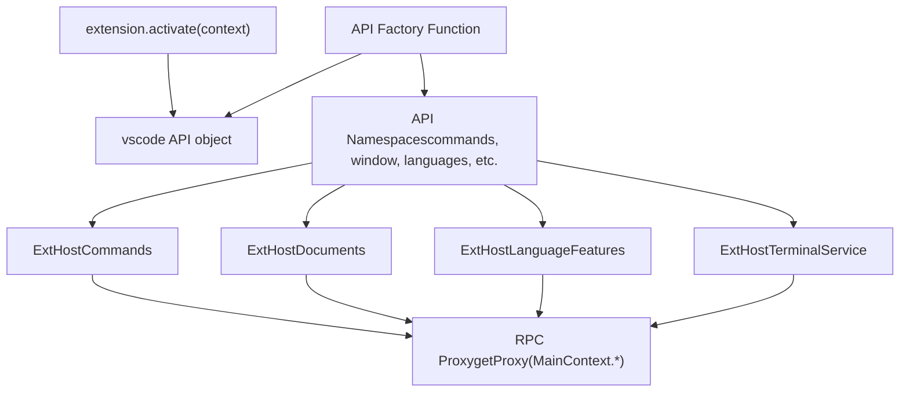
Sources: [src/vs/workbench/api/common/extHost.api.impl.ts132-255](https://github.com/microsoft/vscode/blob/1be3088d/src/vs/workbench/api/common/extHost.api.impl.ts#L132-L255) [src/vs/workbench/api/common/extHost.api.impl.ts342-385](https://github.com/microsoft/vscode/blob/1be3088d/src/vs/workbench/api/common/extHost.api.impl.ts#L342-L385)

### Example: Commands Namespace

The `vscode.commands` namespace demonstrates the pattern:

1.  **API Surface**: Extension calls `vscode.commands.executeCommand(id, ...args)`
2.  **ExtHost Service**: Call routes to `ExtHostCommands.executeCommand()`
3.  **RPC Call**: ExtHostCommands calls `proxy.$executeCommand(id, args)`
4.  **Main Thread**: `MainThreadCommands.$executeCommand()` receives the call
5.  **Core Service**: Delegates to `ICommandService.executeCommand()`

Sources: [src/vs/workbench/api/common/extHost.api.impl.ts379-381](https://github.com/microsoft/vscode/blob/1be3088d/src/vs/workbench/api/common/extHost.api.impl.ts#L379-L381) [src/vs/workbench/api/common/extHostCommands.ts](https://github.com/microsoft/vscode/blob/1be3088d/src/vs/workbench/api/common/extHostCommands.ts) [src/vs/workbench/api/browser/mainThreadCommands.ts](https://github.com/microsoft/vscode/blob/1be3088d/src/vs/workbench/api/browser/mainThreadCommands.ts)

## Key Components

### ExtHost Services

Each ExtHost service manages a specific domain of functionality and maintains extension-side state:

| Service | Responsibility | Protocol Interface |
| --- | --- | --- |
| `ExtHostCommands` | Command registration and execution | `ExtHostCommandsShape` |
| `ExtHostDocuments` | Document model synchronization | `ExtHostDocumentsShape` |
| `ExtHostLanguageFeatures` | Language provider registration | `ExtHostLanguageFeaturesShape` |
| `ExtHostTerminalService` | Terminal creation and management | `ExtHostTerminalServiceShape` |
| `ExtHostDiagnostics` | Diagnostic collection management | `ExtHostDiagnosticsShape` |
| `ExtHostTreeViews` | Tree view provider registration | `ExtHostTreeViewsShape` |

Each service is registered with the RPC protocol during initialization:

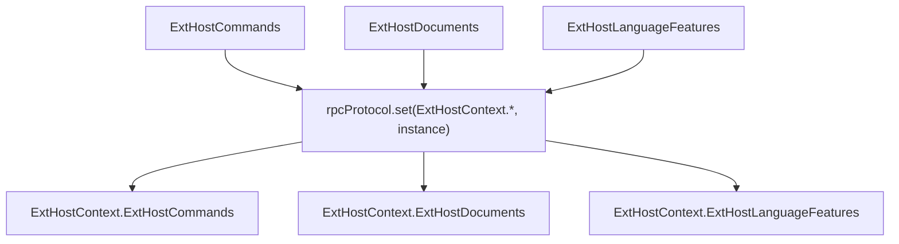
Sources: [src/vs/workbench/api/common/extHost.api.impl.ts184-244](https://github.com/microsoft/vscode/blob/1be3088d/src/vs/workbench/api/common/extHost.api.impl.ts#L184-L244)

### MainThread Services

MainThread services implement the main process side of the protocol and typically delegate to core workbench services:

**MainThread Service Pattern:**

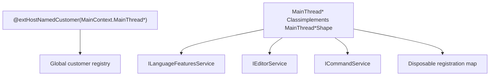
Sources: [src/vs/workbench/api/browser/mainThreadLanguageFeatures.ts45-98](https://github.com/microsoft/vscode/blob/1be3088d/src/vs/workbench/api/browser/mainThreadLanguageFeatures.ts#L45-L98) [src/vs/workbench/services/extensions/common/extHostCustomers.ts](https://github.com/microsoft/vscode/blob/1be3088d/src/vs/workbench/services/extensions/common/extHostCustomers.ts)

### Language Features Example

Language features (hover, completion, diagnostics, etc.) demonstrate the full RPC pattern:

**Provider Registration Flow:**

> **[Mermaid sequence]**
> *(图表结构无法解析)*

Sources: [src/vs/workbench/api/common/extHostLanguageFeatures.ts2565-2611](https://github.com/microsoft/vscode/blob/1be3088d/src/vs/workbench/api/common/extHostLanguageFeatures.ts#L2565-L2611) [src/vs/workbench/api/browser/mainThreadLanguageFeatures.ts276-328](https://github.com/microsoft/vscode/blob/1be3088d/src/vs/workbench/api/browser/mainThreadLanguageFeatures.ts#L276-L328)

## Protocol Message Format

While the RPC protocol abstracts away the low-level message format, understanding the structure helps debug communication issues:

### Message Structure

RPC calls are serialized as structured messages containing:

-   **Type**: Request, response, or notification
-   **Request ID**: Unique identifier for matching responses to requests
-   **Method**: The protocol method being invoked (`$methodName`)
-   **Arguments**: Serialized method parameters
-   **Proxy ID**: Identifier of the target service

**Message Flow:**

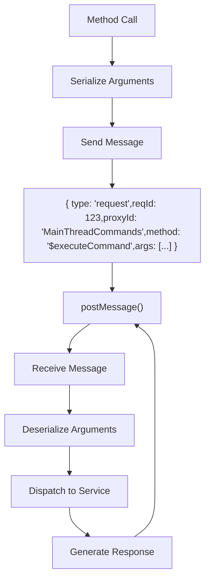
Sources: [src/vs/workbench/services/extensions/common/proxyIdentifier.ts](https://github.com/microsoft/vscode/blob/1be3088d/src/vs/workbench/services/extensions/common/proxyIdentifier.ts) [src/vs/workbench/services/extensions/common/rpcProtocol.ts](https://github.com/microsoft/vscode/blob/1be3088d/src/vs/workbench/services/extensions/common/rpcProtocol.ts)

### Special Handling

Certain types require special handling during serialization:

-   **URIs**: Converted to `UriComponents` and revived using `URI.revive()`
-   **Buffers**: Large data uses `VSBuffer` for efficient transfer
-   **SerializableObjectWithBuffers**: Allows mixing JSON-serializable data with binary buffers
-   **Revive Functions**: Nested objects with URIs use custom revivers

Sources: [src/vs/base/common/uri.ts](https://github.com/microsoft/vscode/blob/1be3088d/src/vs/base/common/uri.ts) [src/vs/workbench/services/extensions/common/proxyIdentifier.ts](https://github.com/microsoft/vscode/blob/1be3088d/src/vs/workbench/services/extensions/common/proxyIdentifier.ts)

## Performance Considerations

### Minimizing Round-Trips

Each RPC call incurs IPC overhead. Best practices:

-   **Batch Operations**: Combine multiple operations into single calls
-   **Cache Data**: Store frequently accessed data in the extension host
-   **Use Events**: Prefer event notifications over polling
-   **Lazy Loading**: Defer provider registration until needed

### Handle Management

Providers and complex objects use handle-based references to avoid sending large objects over IPC. The cache system maintains handle-to-object mappings:

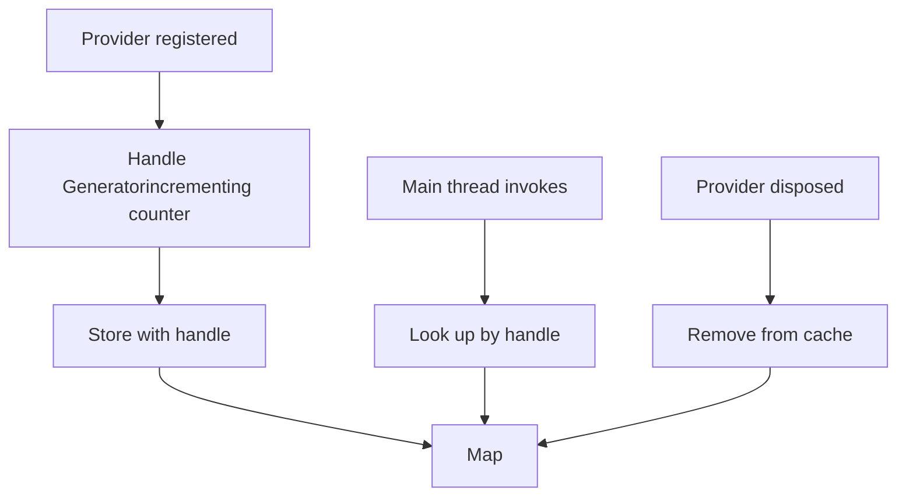
Sources: [src/vs/workbench/api/common/cache.ts](https://github.com/microsoft/vscode/blob/1be3088d/src/vs/workbench/api/common/cache.ts) [src/vs/workbench/api/common/extHostLanguageFeatures.ts107-130](https://github.com/microsoft/vscode/blob/1be3088d/src/vs/workbench/api/common/extHostLanguageFeatures.ts#L107-L130)

## Error Handling

### Remote Errors

Errors thrown in remote method calls are serialized and re-thrown on the calling side:

-   **SerializedError**: Errors are converted to a serializable format
-   **Stack Preservation**: Stack traces are preserved where possible
-   **Cancellation**: `CancellationToken` cancellation propagates across the boundary

### Disposed Providers

If a provider is disposed while an invocation is in progress:

1.  Main thread calls `$provideXYZ(handle, ...)`
2.  Extension host looks up handle in cache
3.  If not found (already disposed), returns `undefined`
4.  Main thread gracefully handles missing result

Sources: [src/vs/workbench/api/common/extHostLanguageFeatures.ts150-186](https://github.com/microsoft/vscode/blob/1be3088d/src/vs/workbench/api/common/extHostLanguageFeatures.ts#L150-L186) [src/vs/base/common/errors.ts](https://github.com/microsoft/vscode/blob/1be3088d/src/vs/base/common/errors.ts)

## Summary

The Extension Host Architecture provides a robust foundation for VS Code's extensibility through:

-   **Process Isolation**: Extensions run in a separate process for stability and security
-   **Type-Safe RPC**: The protocol uses TypeScript interfaces to define contracts
-   **Bidirectional Communication**: Both extension host and main thread can initiate calls
-   **Handle-Based References**: Complex objects avoid serialization overhead
-   **Type Conversion**: Seamless marshalling between extension API types and internal types
-   **Graceful Degradation**: Errors and disposed objects are handled gracefully

This architecture enables VS Code to support thousands of extensions while maintaining stability and performance.

Sources: [src/vs/workbench/api/common/extHost.protocol.ts1-103](https://github.com/microsoft/vscode/blob/1be3088d/src/vs/workbench/api/common/extHost.protocol.ts#L1-L103) [src/vs/workbench/api/common/extHost.api.impl.ts132-255](https://github.com/microsoft/vscode/blob/1be3088d/src/vs/workbench/api/common/extHost.api.impl.ts#L132-L255) [src/vs/workbench/api/common/extHostTypeConverters.ts72-175](https://github.com/microsoft/vscode/blob/1be3088d/src/vs/workbench/api/common/extHostTypeConverters.ts#L72-L175)
