# Extension Management UI

Relevant source files

-   [src/vs/platform/extensionManagement/common/abstractExtensionManagementService.ts](https://github.com/microsoft/vscode/blob/1be3088d/src/vs/platform/extensionManagement/common/abstractExtensionManagementService.ts)
-   [src/vs/platform/extensionManagement/common/extensionGalleryService.ts](https://github.com/microsoft/vscode/blob/1be3088d/src/vs/platform/extensionManagement/common/extensionGalleryService.ts)
-   [src/vs/platform/extensionManagement/common/extensionManagement.ts](https://github.com/microsoft/vscode/blob/1be3088d/src/vs/platform/extensionManagement/common/extensionManagement.ts)
-   [src/vs/platform/extensionManagement/common/extensionManagementIpc.ts](https://github.com/microsoft/vscode/blob/1be3088d/src/vs/platform/extensionManagement/common/extensionManagementIpc.ts)
-   [src/vs/platform/extensionManagement/common/extensionManagementUtil.ts](https://github.com/microsoft/vscode/blob/1be3088d/src/vs/platform/extensionManagement/common/extensionManagementUtil.ts)
-   [src/vs/platform/extensionManagement/node/extensionManagementService.ts](https://github.com/microsoft/vscode/blob/1be3088d/src/vs/platform/extensionManagement/node/extensionManagementService.ts)
-   [src/vs/workbench/contrib/extensions/browser/extensionEditor.ts](https://github.com/microsoft/vscode/blob/1be3088d/src/vs/workbench/contrib/extensions/browser/extensionEditor.ts)
-   [src/vs/workbench/contrib/extensions/browser/extensions.contribution.ts](https://github.com/microsoft/vscode/blob/1be3088d/src/vs/workbench/contrib/extensions/browser/extensions.contribution.ts)
-   [src/vs/workbench/contrib/extensions/browser/extensionsActions.ts](https://github.com/microsoft/vscode/blob/1be3088d/src/vs/workbench/contrib/extensions/browser/extensionsActions.ts)
-   [src/vs/workbench/contrib/extensions/browser/extensionsIcons.ts](https://github.com/microsoft/vscode/blob/1be3088d/src/vs/workbench/contrib/extensions/browser/extensionsIcons.ts)
-   [src/vs/workbench/contrib/extensions/browser/extensionsList.ts](https://github.com/microsoft/vscode/blob/1be3088d/src/vs/workbench/contrib/extensions/browser/extensionsList.ts)
-   [src/vs/workbench/contrib/extensions/browser/extensionsViewer.ts](https://github.com/microsoft/vscode/blob/1be3088d/src/vs/workbench/contrib/extensions/browser/extensionsViewer.ts)
-   [src/vs/workbench/contrib/extensions/browser/extensionsViewlet.ts](https://github.com/microsoft/vscode/blob/1be3088d/src/vs/workbench/contrib/extensions/browser/extensionsViewlet.ts)
-   [src/vs/workbench/contrib/extensions/browser/extensionsViews.ts](https://github.com/microsoft/vscode/blob/1be3088d/src/vs/workbench/contrib/extensions/browser/extensionsViews.ts)
-   [src/vs/workbench/contrib/extensions/browser/extensionsWidgets.ts](https://github.com/microsoft/vscode/blob/1be3088d/src/vs/workbench/contrib/extensions/browser/extensionsWidgets.ts)
-   [src/vs/workbench/contrib/extensions/browser/extensionsWorkbenchService.ts](https://github.com/microsoft/vscode/blob/1be3088d/src/vs/workbench/contrib/extensions/browser/extensionsWorkbenchService.ts)
-   [src/vs/workbench/contrib/extensions/browser/media/extension.css](https://github.com/microsoft/vscode/blob/1be3088d/src/vs/workbench/contrib/extensions/browser/media/extension.css)
-   [src/vs/workbench/contrib/extensions/browser/media/extensionActions.css](https://github.com/microsoft/vscode/blob/1be3088d/src/vs/workbench/contrib/extensions/browser/media/extensionActions.css)
-   [src/vs/workbench/contrib/extensions/browser/media/extensionEditor.css](https://github.com/microsoft/vscode/blob/1be3088d/src/vs/workbench/contrib/extensions/browser/media/extensionEditor.css)
-   [src/vs/workbench/contrib/extensions/browser/media/extensionsViewlet.css](https://github.com/microsoft/vscode/blob/1be3088d/src/vs/workbench/contrib/extensions/browser/media/extensionsViewlet.css)
-   [src/vs/workbench/contrib/extensions/browser/media/extensionsWidgets.css](https://github.com/microsoft/vscode/blob/1be3088d/src/vs/workbench/contrib/extensions/browser/media/extensionsWidgets.css)
-   [src/vs/workbench/contrib/extensions/common/extensions.ts](https://github.com/microsoft/vscode/blob/1be3088d/src/vs/workbench/contrib/extensions/common/extensions.ts)
-   [src/vs/workbench/services/extensionManagement/common/extensionManagement.ts](https://github.com/microsoft/vscode/blob/1be3088d/src/vs/workbench/services/extensionManagement/common/extensionManagement.ts)
-   [src/vs/workbench/services/extensionManagement/common/extensionManagementChannelClient.ts](https://github.com/microsoft/vscode/blob/1be3088d/src/vs/workbench/services/extensionManagement/common/extensionManagementChannelClient.ts)
-   [src/vs/workbench/services/extensionManagement/common/extensionManagementService.ts](https://github.com/microsoft/vscode/blob/1be3088d/src/vs/workbench/services/extensionManagement/common/extensionManagementService.ts)
-   [src/vs/workbench/services/extensionManagement/common/webExtensionManagementService.ts](https://github.com/microsoft/vscode/blob/1be3088d/src/vs/workbench/services/extensionManagement/common/webExtensionManagementService.ts)

This document describes the UI components and architecture for managing extensions in VS Code. This includes the Extensions viewlet (sidebar view), the extension detail editor, search functionality, and various views for browsing installed and marketplace extensions.

For the underlying extension management services and installation logic, see [Extension Management Service](/microsoft/vscode/6.4-extension-management-service). For the extension host architecture and API, see [Extension Host Architecture and RPC Protocol](/microsoft/vscode/6.1-extension-host-architecture-and-rpc-protocol).

## Overview

The Extension Management UI provides a comprehensive interface for users to discover, install, configure, and manage VS Code extensions. The system is built around several key components:

-   **Extensions View Container**: The main sidebar view (`ExtensionsViewPaneContainer`) that hosts multiple view panes
-   **View Panes**: Individual views for different extension categories (installed, recommended, marketplace search, etc.)
-   **Extension Editor**: A detailed view (`ExtensionEditor`) for individual extensions
-   **List Rendering**: Components for displaying extensions in lists with metadata
-   **Actions**: User-triggered operations like install, uninstall, enable/disable

**Sources:** [src/vs/workbench/contrib/extensions/browser/extensionsViewlet.ts1-1000](https://github.com/microsoft/vscode/blob/1be3088d/src/vs/workbench/contrib/extensions/browser/extensionsViewlet.ts#L1-L1000) [src/vs/workbench/contrib/extensions/browser/extensionEditor.ts1-100](https://github.com/microsoft/vscode/blob/1be3088d/src/vs/workbench/contrib/extensions/browser/extensionEditor.ts#L1-L100)

## Architecture Overview

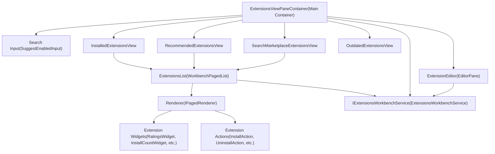
**Sources:** [src/vs/workbench/contrib/extensions/browser/extensionsViewlet.ts1-1000](https://github.com/microsoft/vscode/blob/1be3088d/src/vs/workbench/contrib/extensions/browser/extensionsViewlet.ts#L1-L1000) [src/vs/workbench/contrib/extensions/browser/extensionsViews.ts1-200](https://github.com/microsoft/vscode/blob/1be3088d/src/vs/workbench/contrib/extensions/browser/extensionsViews.ts#L1-L200)

## Extensions View Container

The `ExtensionsViewPaneContainer` class is the main container for the extensions view in the sidebar. It is registered as a view container with the ID `VIEWLET_ID` ('workbench.view.extensions').

### Key Responsibilities

| Responsibility | Implementation |
| --- | --- |
| Search management | `SuggestEnabledInput` with autocomplete for extension categories and commands |
| View pane coordination | Manages multiple child view panes and their visibility |
| Context key management | Updates context keys for search state, sort order, etc. |
| Drag and drop | Handles dropping VSIX files for installation |
| Notifications | Displays status messages and prompts for extension updates |

### View Container Registration

The container is registered in the view registry with specific configuration:

-   **Icon**: `extensionsViewIcon`
-   **Order**: 4 (in sidebar)
-   **Keybinding**: `Ctrl/Cmd + Shift + X`
-   **Location**: `ViewContainerLocation.Sidebar`

**Sources:** [src/vs/workbench/contrib/extensions/browser/extensions.contribution.ts114-129](https://github.com/microsoft/vscode/blob/1be3088d/src/vs/workbench/contrib/extensions/browser/extensions.contribution.ts#L114-L129) [src/vs/workbench/contrib/extensions/browser/extensionsViewlet.ts400-600](https://github.com/microsoft/vscode/blob/1be3088d/src/vs/workbench/contrib/extensions/browser/extensionsViewlet.ts#L400-L600)

### Search Input System

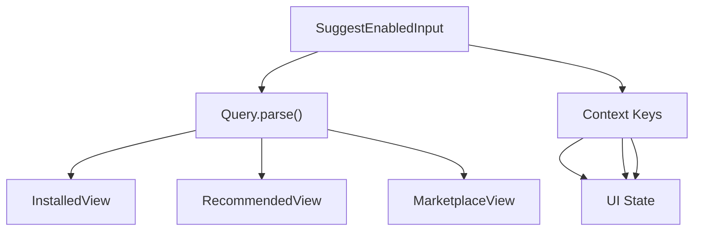
The search input uses `SuggestEnabledInput` which provides autocomplete suggestions for:

-   Categories (e.g., `@category:themes`)
-   Special filters (e.g., `@installed`, `@recommended`, `@builtin`)
-   Extension IDs and names
-   Sort options (e.g., `@sort:installs`)

**Sources:** [src/vs/workbench/contrib/extensions/browser/extensionsViewlet.ts600-800](https://github.com/microsoft/vscode/blob/1be3088d/src/vs/workbench/contrib/extensions/browser/extensionsViewlet.ts#L600-L800) [src/vs/workbench/contrib/extensions/common/extensionQuery.ts1-100](https://github.com/microsoft/vscode/blob/1be3088d/src/vs/workbench/contrib/extensions/common/extensionQuery.ts#L1-L100)

## View Panes

Multiple view panes are registered within the Extensions view container, each serving a specific purpose. These are implemented as classes extending `ExtensionsListView`.

### View Pane Architecture

```mermaid
flowchart TD
    BaseView["ExtensionsListView(abstract base)"]
    Installed["EnabledExtensionsViewDisabledExtensionsViewServerInstalledExtensionsView"]
    Recommended["RecommendedExtensionsViewWorkspaceRecommendedExtensionsViewDefaultRecommendedExtensionsView"]
    Search["SearchMarketplaceExtensionsViewDefaultPopularExtensionsView"]
    Special["OutdatedExtensionsViewDeprecatedExtensionsViewUntrustedWorkspaceUnsupportedExtensionsView"]
    WorkbenchPagedList["WorkbenchPagedList"]
    IExtensionsWorkbenchService["IExtensionsWorkbenchService"]

    BaseView --> Installed
    BaseView --> Recommended
    BaseView --> Search
    BaseView --> Special
    BaseView --> WorkbenchPagedList
    BaseView --> IExtensionsWorkbenchService
```
### Key View Pane Types

| View Class | Purpose | When Clause |
| --- | --- | --- |
| `EnabledExtensionsView` | Shows enabled extensions | `SearchEnabledExtensionsContext` |
| `DisabledExtensionsView` | Shows disabled extensions | `SearchDisabledExtensionsContext` |
| `RecommendedExtensionsView` | Shows all recommendations | `RecommendedExtensionsContext` |
| `WorkspaceRecommendedExtensionsView` | Workspace-specific recommendations | In workspace & has recommendations |
| `SearchMarketplaceExtensionsView` | Search results from marketplace | `SearchMarketplaceExtensionsContext` |
| `OutdatedExtensionsView` | Extensions with available updates | `HasOutdatedExtensionsContext` |
| `DeprecatedExtensionsView` | Deprecated extensions | `SearchDeprecatedExtensionsContext` |

**Sources:** [src/vs/workbench/contrib/extensions/browser/extensionsViews.ts100-500](https://github.com/microsoft/vscode/blob/1be3088d/src/vs/workbench/contrib/extensions/browser/extensionsViews.ts#L100-L500) [src/vs/workbench/contrib/extensions/browser/extensionsViewlet.ts100-300](https://github.com/microsoft/vscode/blob/1be3088d/src/vs/workbench/contrib/extensions/browser/extensionsViewlet.ts#L100-L300)

### View Registration Pattern

Views are registered dynamically through `ExtensionsViewletViewsContribution`:

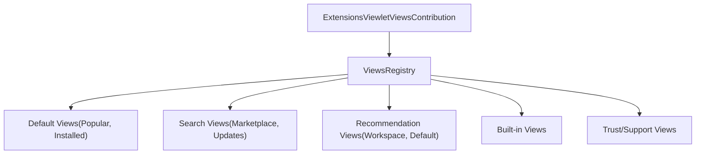
Each view descriptor includes:

-   `id`: Unique identifier
-   `name`: Localized display name
-   `ctorDescriptor`: `SyncDescriptor` for the view class
-   `when`: `ContextKeyExpr` defining when the view is visible
-   `order`: Display order within container

**Sources:** [src/vs/workbench/contrib/extensions/browser/extensionsViewlet.ts99-166](https://github.com/microsoft/vscode/blob/1be3088d/src/vs/workbench/contrib/extensions/browser/extensionsViewlet.ts#L99-L166) [src/vs/workbench/contrib/extensions/browser/extensions.contribution.ts114-129](https://github.com/microsoft/vscode/blob/1be3088d/src/vs/workbench/contrib/extensions/browser/extensions.contribution.ts#L114-L129)

## Extension Editor

The `ExtensionEditor` provides a detailed view of a single extension, displayed as a full editor pane. It opens when clicking on an extension from any list view.

### Extension Editor Structure

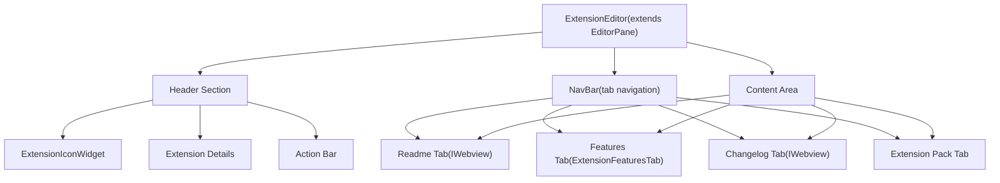
**Sources:** [src/vs/workbench/contrib/extensions/browser/extensionEditor.ts209-457](https://github.com/microsoft/vscode/blob/1be3088d/src/vs/workbench/contrib/extensions/browser/extensionEditor.ts#L209-L457)

### Header Components

The header displays key extension information and actions:

| Component | Widget Class | Purpose |
| --- | --- | --- |
| Icon | `ExtensionIconWidget` | Extension icon with badge overlay |
| Name | HTML element | Display name, preview/builtin labels |
| Version | `VersionWidget` | Shows "pre-release" badge if applicable |
| Publisher | `PublisherWidget` | Publisher name with verification icon |
| Install count | `InstallCountWidget` | Download statistics |
| Ratings | `RatingsWidget` | Star rating display |
| Description | HTML element | Short description text |

**Sources:** [src/vs/workbench/contrib/extensions/browser/extensionEditor.ts262-412](https://github.com/microsoft/vscode/blob/1be3088d/src/vs/workbench/contrib/extensions/browser/extensionEditor.ts#L262-L412) [src/vs/workbench/contrib/extensions/browser/extensionsWidgets.ts1-500](https://github.com/microsoft/vscode/blob/1be3088d/src/vs/workbench/contrib/extensions/browser/extensionsWidgets.ts#L1-L500)

### Action Bar

The extension editor's action bar contains primary actions based on extension state:

```mermaid
flowchart TD
    ActionBar["extensionActionBar(ActionBar)"]
    Install["InstallDropdownAction"]
    Update["UpdateAction"]
    Uninstall["UninstallAction(with dropdown)"]
    Enable["EnableDropDownAction"]
    Disable["DisableDropDownAction"]
    Theme["SetColorThemeActionSetFileIconThemeActionSetProductIconThemeAction"]
    Language["SetLanguageActionClearLanguageAction"]
    AutoUpdate["ToggleAutoUpdateForExtensionAction(checkbox)"]
    Manage["ExtensionEditorManageExtensionAction"]

    ActionBar --> Install
    ActionBar --> Update
    ActionBar --> Uninstall
    ActionBar --> Enable
    ActionBar --> Disable
    ActionBar --> Theme
    ActionBar --> Language
    ActionBar --> AutoUpdate
    ActionBar --> Manage
```
Actions are dynamically shown/hidden based on:

-   Extension state (installed, installing, uninstalled)
-   Extension type (user, builtin, workspace-scoped)
-   Extension capabilities (themes, language packs)
-   Enablement state

**Sources:** [src/vs/workbench/contrib/extensions/browser/extensionEditor.ts326-354](https://github.com/microsoft/vscode/blob/1be3088d/src/vs/workbench/contrib/extensions/browser/extensionEditor.ts#L326-L354) [src/vs/workbench/contrib/extensions/browser/extensionsActions.ts1-500](https://github.com/microsoft/vscode/blob/1be3088d/src/vs/workbench/contrib/extensions/browser/extensionsActions.ts#L1-L500)

### Navigation Tabs

The `NavBar` class manages tab navigation within the extension editor:

-   **Details (Readme)**: Markdown rendering of README.md
-   **Features**: List of contributed features (commands, settings, etc.)
-   **Changelog**: Markdown rendering of CHANGELOG.md
-   **Extension Pack**: List of included extensions (if applicable)
-   **Dependencies**: List of extension dependencies (if any)

Tabs are dynamically added based on available content. Content is loaded lazily using `Cache<T>` instances.

**Sources:** [src/vs/workbench/contrib/extensions/browser/extensionEditor.ts587-700](https://github.com/microsoft/vscode/blob/1be3088d/src/vs/workbench/contrib/extensions/browser/extensionEditor.ts#L587-L700)

## Extension List Rendering

Extensions are displayed in lists using `WorkbenchPagedList` with custom rendering.

### List Rendering Pipeline

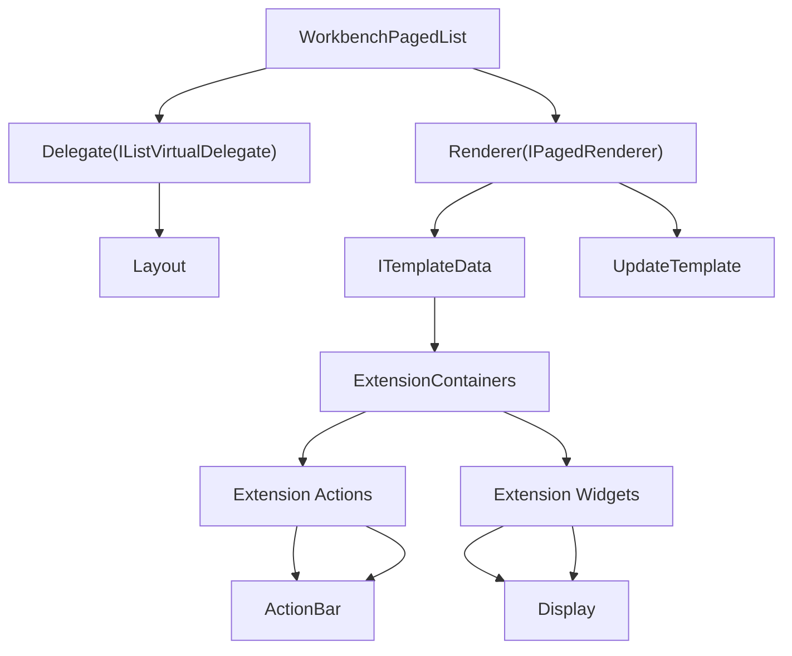
**Sources:** [src/vs/workbench/contrib/extensions/browser/extensionsList.ts1-300](https://github.com/microsoft/vscode/blob/1be3088d/src/vs/workbench/contrib/extensions/browser/extensionsList.ts#L1-L300) [src/vs/workbench/contrib/extensions/browser/extensionsViewer.ts1-500](https://github.com/microsoft/vscode/blob/1be3088d/src/vs/workbench/contrib/extensions/browser/extensionsViewer.ts#L1-L500)

### Template Structure

The `ITemplateData` interface defines the structure of each list item:

```
{
  root: HTMLElement,              // Container element
  element: HTMLElement,           // Main content element
  icon: ExtensionIconWidget,      // Extension icon
  name: HTMLElement,              // Extension name
  description: HTMLElement,       // Short description
  installCount: HTMLElement,      // Install count display
  ratings: HTMLElement,           // Rating stars
  extension: IExtension | null,   // Current extension data
  disposables: IDisposable[],     // Template-level disposables
  extensionDisposables: IDisposable[], // Extension-specific disposables
  actionbar: ActionBar            // Action buttons
}
```
**Sources:** [src/vs/workbench/contrib/extensions/browser/extensionsList.ts31-42](https://github.com/microsoft/vscode/blob/1be3088d/src/vs/workbench/contrib/extensions/browser/extensionsList.ts#L31-L42)

### List Item Actions

Each extension in the list has an action bar with context-appropriate actions:

| Action | When Visible | Purpose |
| --- | --- | --- |
| `InstallAction` | Extension not installed | Install from marketplace |
| `InstallingLabelAction` | Extension installing | Shows "Installing..." |
| `UpdateAction` | Extension outdated | Update to latest version |
| `ManageExtensionAction` | Extension installed | Gear menu with additional actions |
| `ExtensionStatusAction` | Various states | Shows warnings/errors |

**Sources:** [src/vs/workbench/contrib/extensions/browser/extensionsList.ts100-200](https://github.com/microsoft/vscode/blob/1be3088d/src/vs/workbench/contrib/extensions/browser/extensionsList.ts#L100-L200)

## Extension Actions

Extension actions are implemented as classes extending `ExtensionAction`, which implements `IAction` and `IExtensionContainer`.

### Action Architecture

```mermaid
flowchart TD
    BaseAction["ExtensionAction(abstract)"]
    Install["InstallActionInstallDropdownAction"]
    Update["UpdateAction"]
    Uninstall["UninstallAction"]
    Enable["EnableDropDownActionDisableDropDownAction"]
    Theme["SetColorThemeActionSetFileIconThemeAction"]
    Server["InstallInOtherServerActionRemoteInstallActionLocalInstallAction"]
    Manage["ManageExtensionActionExtensionEditorManageExtensionAction"]
    IExtension["IExtension"]
    State["Action State(enabled, visible, label)"]

    BaseAction --> Install
    BaseAction --> Update
    BaseAction --> Uninstall
    BaseAction --> Enable
    BaseAction --> Theme
    BaseAction --> Server
    BaseAction --> Manage
    BaseAction --> IExtension
    BaseAction --> State
```
**Sources:** [src/vs/workbench/contrib/extensions/browser/extensionsActions.ts285-318](https://github.com/microsoft/vscode/blob/1be3088d/src/vs/workbench/contrib/extensions/browser/extensionsActions.ts#L285-L318)

### Action State Management

Actions implement an `update()` method that determines visibility and enablement based on:

1.  **Extension State**: Installing, installed, uninstalling, uninstalled
2.  **Extension Type**: User, builtin, system, workspace-scoped
3.  **Server Location**: Local, remote, web
4.  **Enablement State**: Enabled globally, enabled for workspace, disabled
5.  **Gallery Information**: Available versions, pre-release status

Example from `InstallAction`:

```
- Hidden if extension is builtin
- Hidden if extension is already installed
- Hidden if extension is a language pack (handled separately)
- Enabled only if extension can be installed on current server
```
**Sources:** [src/vs/workbench/contrib/extensions/browser/extensionsActions.ts427-495](https://github.com/microsoft/vscode/blob/1be3088d/src/vs/workbench/contrib/extensions/browser/extensionsActions.ts#L427-L495)

### Button with Dropdown Pattern

Some actions use `ButtonWithDropDownExtensionAction` which displays a primary action with a dropdown menu for related actions:

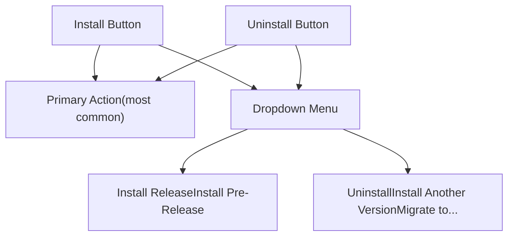
**Sources:** [src/vs/workbench/contrib/extensions/browser/extensionsActions.ts320-393](https://github.com/microsoft/vscode/blob/1be3088d/src/vs/workbench/contrib/extensions/browser/extensionsActions.ts#L320-L393) [src/vs/workbench/contrib/extensions/browser/extensionsActions.ts688-711](https://github.com/microsoft/vscode/blob/1be3088d/src/vs/workbench/contrib/extensions/browser/extensionsActions.ts#L688-L711)

## Search and Filtering

The extension search system uses the `Query` class to parse search text into structured criteria.

### Query Parsing

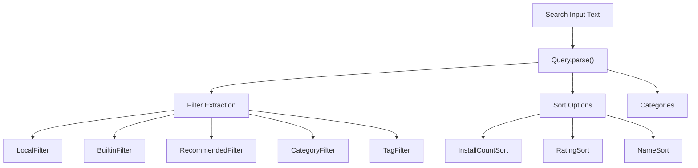
### Query Syntax

| Pattern | Purpose | Example |
| --- | --- | --- |
| `@installed` | Show installed extensions | `@installed` |
| `@builtin` | Show built-in extensions | `@builtin:themes` |
| `@recommended` | Show recommendations | `@recommended` |
| `@category:` | Filter by category | `@category:themes` |
| `@tag:` | Filter by tag | `@tag:python` |
| `@sort:` | Sort results | `@sort:installs` |
| `@id:` | Search by ID | `@id:ms-vscode.python` |
| Plain text | Search marketplace | `python language` |

**Sources:** [src/vs/workbench/contrib/extensions/common/extensionQuery.ts1-300](https://github.com/microsoft/vscode/blob/1be3088d/src/vs/workbench/contrib/extensions/common/extensionQuery.ts#L1-L300)

### View Selection Based on Query

The `ExtensionsViewPaneContainer` shows/hides view panes based on the parsed query:

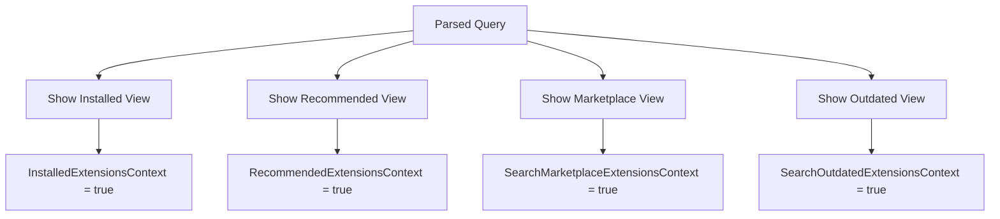
**Sources:** [src/vs/workbench/contrib/extensions/browser/extensionsViewlet.ts700-900](https://github.com/microsoft/vscode/blob/1be3088d/src/vs/workbench/contrib/extensions/browser/extensionsViewlet.ts#L700-L900)

## Extension Widgets

Reusable widgets display extension metadata throughout the UI. All widgets extend `ExtensionWidget` base class.

### Widget Hierarchy

```mermaid
flowchart TD
    Base["ExtensionWidget(abstract base)"]
    Icon["ExtensionIconWidget"]
    Ratings["RatingsWidget"]
    InstallCount["InstallCountWidget"]
    Publisher["PublisherWidget"]
    Recommendation["RecommendationWidget"]
    RemoteBadge["RemoteBadgeWidget"]
    SyncIgnored["SyncIgnoredWidget"]
    PreRelease["PreReleaseBookmarkWidget"]
    ExtensionPack["ExtensionPackCountWidget"]
    RuntimeStatus["ExtensionRuntimeStatusWidget"]
    Update["update() → render()"]

    Base --> Icon
    Base --> Ratings
    Base --> InstallCount
    Base --> Publisher
    Base --> Recommendation
    Base --> RemoteBadge
    Base --> SyncIgnored
    Base --> PreRelease
    Base --> ExtensionPack
    Base --> RuntimeStatus
    Base --> Update
```
**Sources:** [src/vs/workbench/contrib/extensions/browser/extensionsWidgets.ts54-60](https://github.com/microsoft/vscode/blob/1be3088d/src/vs/workbench/contrib/extensions/browser/extensionsWidgets.ts#L54-L60)

### Key Widget Implementations

| Widget | Display | Data Source |
| --- | --- | --- |
| `RatingsWidget` | Star rating (★★★★☆) + count | `extension.rating`, `extension.ratingCount` |
| `InstallCountWidget` | Download icon + formatted count | `extension.installCount` |
| `PublisherWidget` | Publisher name + verification icon | `extension.publisherDisplayName`, `extension.publisherDomain` |
| `RemoteBadgeWidget` | Remote/SSH/WSL indicator | `IExtensionManifestPropertiesService` |
| `PreReleaseBookmarkWidget` | Pre-release badge on icon | `extension.isPreReleaseVersion` |
| `SyncIgnoredWidget` | Sync disabled icon | Settings sync enablement |
| `ExtensionRuntimeStatusWidget` | Activation time/errors | `IExtensionService.getExtensionsStatus()` |

**Sources:** [src/vs/workbench/contrib/extensions/browser/extensionsWidgets.ts100-1000](https://github.com/microsoft/vscode/blob/1be3088d/src/vs/workbench/contrib/extensions/browser/extensionsWidgets.ts#L100-L1000)

### Widget Update Pattern

Widgets follow a consistent update pattern:

1.  Set `extension` property on widget instance
2.  Setter calls `update()` method
3.  `update()` calls `render()` to update DOM
4.  Some widgets use hover service for additional info

Example: `RatingsWidget.render()` implementation displays stars based on rating value (0-5), shows rating count, and adds hover text with detailed statistics.

**Sources:** [src/vs/workbench/contrib/extensions/browser/extensionsWidgets.ts200-400](https://github.com/microsoft/vscode/blob/1be3088d/src/vs/workbench/contrib/extensions/browser/extensionsWidgets.ts#L200-L400)

## State Management

Extension UI state is managed through context keys and the `ExtensionsViewState` class.

### Context Keys

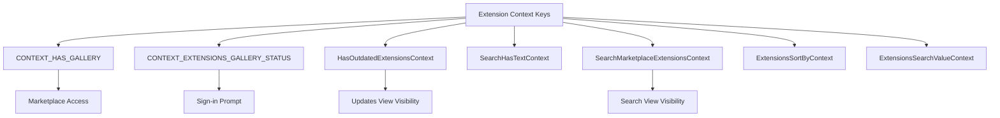
These context keys control:

-   Menu item visibility
-   View pane visibility
-   Action enablement
-   Welcome view content

**Sources:** [src/vs/workbench/contrib/extensions/common/extensions.ts1-100](https://github.com/microsoft/vscode/blob/1be3088d/src/vs/workbench/contrib/extensions/common/extensions.ts#L1-L100) [src/vs/workbench/contrib/extensions/browser/extensionsViewlet.ts74-92](https://github.com/microsoft/vscode/blob/1be3088d/src/vs/workbench/contrib/extensions/browser/extensionsViewlet.ts#L74-L92)

### Extensions View State

The `ExtensionsViewState` class tracks UI state within views:

```
interface IExtensionsViewState {
  onFocus: Event<IExtension>;
  onBlur: Event<IExtension>;
  filters: { featureId?: string };
  onFocusChange(extensions: IExtension[]): void;
}
```
This state is used to:

-   Track which extension is currently focused
-   Apply filters (e.g., filter by specific feature)
-   Coordinate between list views and detail editor

**Sources:** [src/vs/workbench/contrib/extensions/browser/extensionsViews.ts64-83](https://github.com/microsoft/vscode/blob/1be3088d/src/vs/workbench/contrib/extensions/browser/extensionsViews.ts#L64-L83) [src/vs/workbench/contrib/extensions/common/extensions.ts150-160](https://github.com/microsoft/vscode/blob/1be3088d/src/vs/workbench/contrib/extensions/common/extensions.ts#L150-L160)

### Service Integration

The UI components communicate with the backend through `IExtensionsWorkbenchService`:

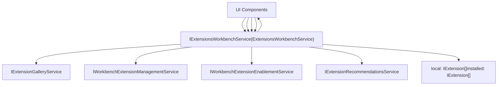
The workbench service maintains a unified view of extensions by combining:

-   Installed local extensions
-   Gallery information from marketplace
-   Recommendation data
-   Enablement state
-   Runtime status

**Sources:** [src/vs/workbench/contrib/extensions/browser/extensionsWorkbenchService.ts1-500](https://github.com/microsoft/vscode/blob/1be3088d/src/vs/workbench/contrib/extensions/browser/extensionsWorkbenchService.ts#L1-L500) [src/vs/workbench/contrib/extensions/common/extensions.ts100-200](https://github.com/microsoft/vscode/blob/1be3088d/src/vs/workbench/contrib/extensions/common/extensions.ts#L100-L200)
