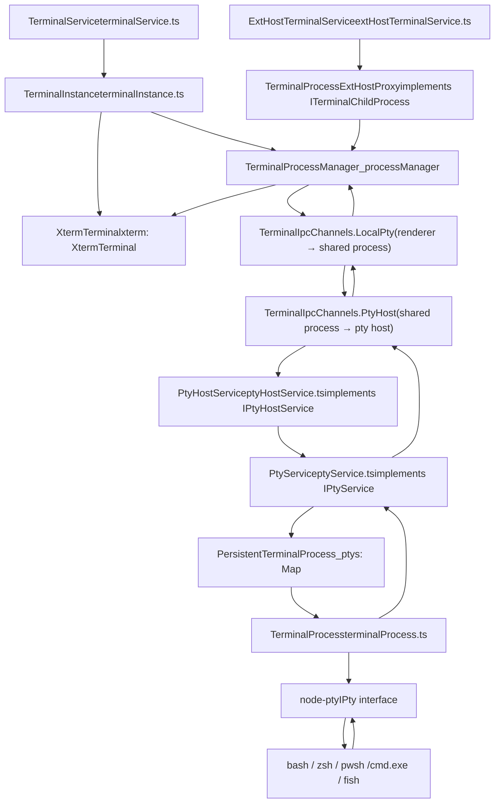
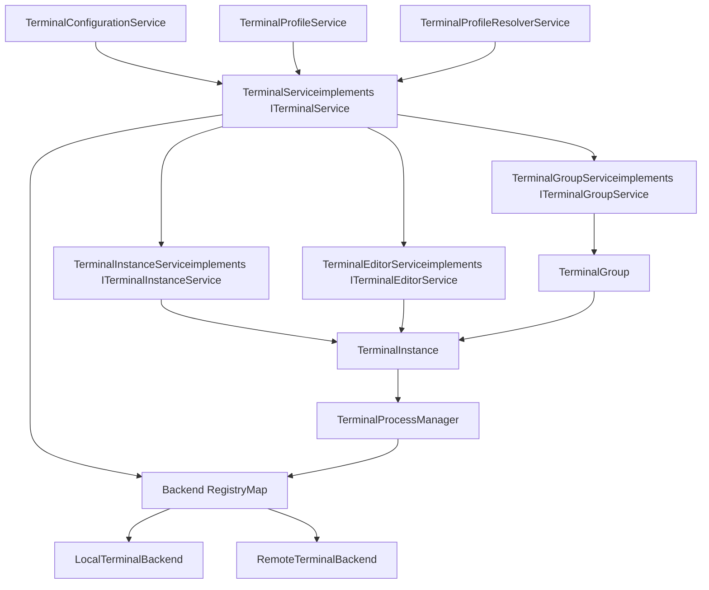
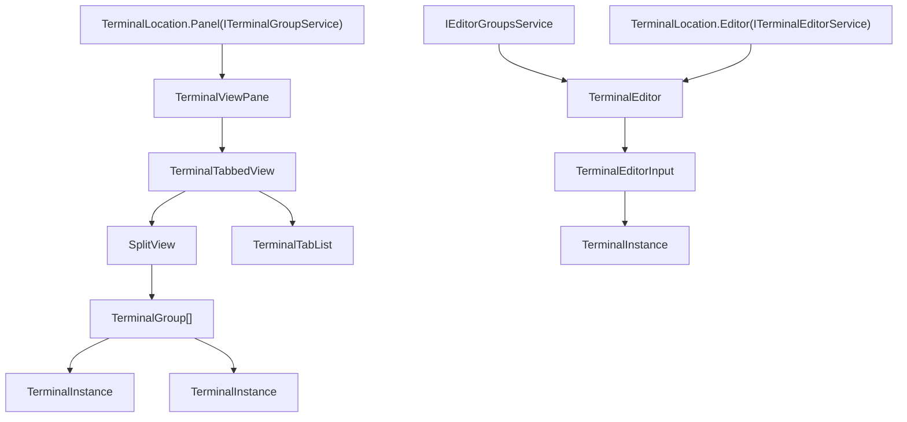
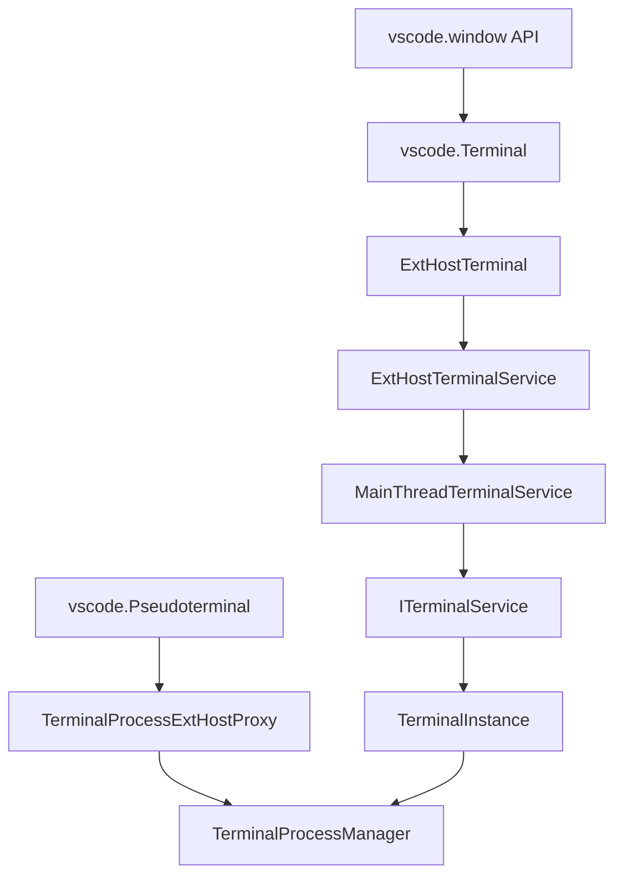
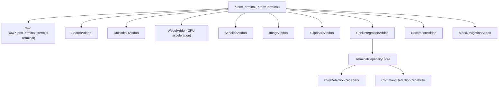
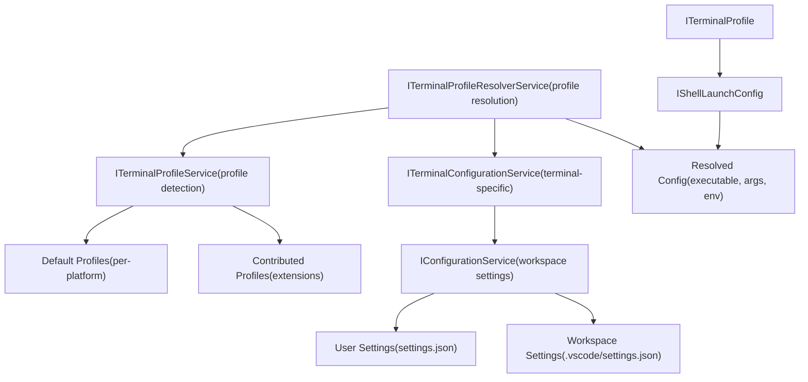

# Terminal Architecture Overview

Relevant source files

-   [src/vs/platform/terminal/common/terminal.ts](https://github.com/microsoft/vscode/blob/1be3088d/src/vs/platform/terminal/common/terminal.ts)
-   [src/vs/platform/terminal/common/terminalEnvironment.ts](https://github.com/microsoft/vscode/blob/1be3088d/src/vs/platform/terminal/common/terminalEnvironment.ts)
-   [src/vs/platform/terminal/common/terminalRecorder.ts](https://github.com/microsoft/vscode/blob/1be3088d/src/vs/platform/terminal/common/terminalRecorder.ts)
-   [src/vs/platform/terminal/node/ptyHostMain.ts](https://github.com/microsoft/vscode/blob/1be3088d/src/vs/platform/terminal/node/ptyHostMain.ts)
-   [src/vs/platform/terminal/node/ptyHostService.ts](https://github.com/microsoft/vscode/blob/1be3088d/src/vs/platform/terminal/node/ptyHostService.ts)
-   [src/vs/platform/terminal/node/ptyService.ts](https://github.com/microsoft/vscode/blob/1be3088d/src/vs/platform/terminal/node/ptyService.ts)
-   [src/vs/platform/terminal/node/terminalProcess.ts](https://github.com/microsoft/vscode/blob/1be3088d/src/vs/platform/terminal/node/terminalProcess.ts)
-   [src/vs/platform/terminal/test/common/terminalEnvironment.test.ts](https://github.com/microsoft/vscode/blob/1be3088d/src/vs/platform/terminal/test/common/terminalEnvironment.test.ts)
-   [src/vs/platform/terminal/test/common/terminalProfiles.test.ts](https://github.com/microsoft/vscode/blob/1be3088d/src/vs/platform/terminal/test/common/terminalProfiles.test.ts)
-   [src/vs/platform/terminal/test/common/terminalRecorder.test.ts](https://github.com/microsoft/vscode/blob/1be3088d/src/vs/platform/terminal/test/common/terminalRecorder.test.ts)
-   [src/vs/workbench/api/browser/mainThreadTerminalService.ts](https://github.com/microsoft/vscode/blob/1be3088d/src/vs/workbench/api/browser/mainThreadTerminalService.ts)
-   [src/vs/workbench/api/common/extHostTerminalService.ts](https://github.com/microsoft/vscode/blob/1be3088d/src/vs/workbench/api/common/extHostTerminalService.ts)
-   [src/vs/workbench/api/node/extHostTerminalService.ts](https://github.com/microsoft/vscode/blob/1be3088d/src/vs/workbench/api/node/extHostTerminalService.ts)
-   [src/vs/workbench/contrib/terminal/browser/media/terminal.css](https://github.com/microsoft/vscode/blob/1be3088d/src/vs/workbench/contrib/terminal/browser/media/terminal.css)
-   [src/vs/workbench/contrib/terminal/browser/media/xterm.css](https://github.com/microsoft/vscode/blob/1be3088d/src/vs/workbench/contrib/terminal/browser/media/xterm.css)
-   [src/vs/workbench/contrib/terminal/browser/remotePty.ts](https://github.com/microsoft/vscode/blob/1be3088d/src/vs/workbench/contrib/terminal/browser/remotePty.ts)
-   [src/vs/workbench/contrib/terminal/browser/terminal.contribution.ts](https://github.com/microsoft/vscode/blob/1be3088d/src/vs/workbench/contrib/terminal/browser/terminal.contribution.ts)
-   [src/vs/workbench/contrib/terminal/browser/terminal.ts](https://github.com/microsoft/vscode/blob/1be3088d/src/vs/workbench/contrib/terminal/browser/terminal.ts)
-   [src/vs/workbench/contrib/terminal/browser/terminalActions.ts](https://github.com/microsoft/vscode/blob/1be3088d/src/vs/workbench/contrib/terminal/browser/terminalActions.ts)
-   [src/vs/workbench/contrib/terminal/browser/terminalEditor.ts](https://github.com/microsoft/vscode/blob/1be3088d/src/vs/workbench/contrib/terminal/browser/terminalEditor.ts)
-   [src/vs/workbench/contrib/terminal/browser/terminalEditorInput.ts](https://github.com/microsoft/vscode/blob/1be3088d/src/vs/workbench/contrib/terminal/browser/terminalEditorInput.ts)
-   [src/vs/workbench/contrib/terminal/browser/terminalEditorService.ts](https://github.com/microsoft/vscode/blob/1be3088d/src/vs/workbench/contrib/terminal/browser/terminalEditorService.ts)
-   [src/vs/workbench/contrib/terminal/browser/terminalGroup.ts](https://github.com/microsoft/vscode/blob/1be3088d/src/vs/workbench/contrib/terminal/browser/terminalGroup.ts)
-   [src/vs/workbench/contrib/terminal/browser/terminalGroupService.ts](https://github.com/microsoft/vscode/blob/1be3088d/src/vs/workbench/contrib/terminal/browser/terminalGroupService.ts)
-   [src/vs/workbench/contrib/terminal/browser/terminalInstance.ts](https://github.com/microsoft/vscode/blob/1be3088d/src/vs/workbench/contrib/terminal/browser/terminalInstance.ts)
-   [src/vs/workbench/contrib/terminal/browser/terminalInstanceService.ts](https://github.com/microsoft/vscode/blob/1be3088d/src/vs/workbench/contrib/terminal/browser/terminalInstanceService.ts)
-   [src/vs/workbench/contrib/terminal/browser/terminalMenus.ts](https://github.com/microsoft/vscode/blob/1be3088d/src/vs/workbench/contrib/terminal/browser/terminalMenus.ts)
-   [src/vs/workbench/contrib/terminal/browser/terminalProcessExtHostProxy.ts](https://github.com/microsoft/vscode/blob/1be3088d/src/vs/workbench/contrib/terminal/browser/terminalProcessExtHostProxy.ts)
-   [src/vs/workbench/contrib/terminal/browser/terminalProcessManager.ts](https://github.com/microsoft/vscode/blob/1be3088d/src/vs/workbench/contrib/terminal/browser/terminalProcessManager.ts)
-   [src/vs/workbench/contrib/terminal/browser/terminalService.ts](https://github.com/microsoft/vscode/blob/1be3088d/src/vs/workbench/contrib/terminal/browser/terminalService.ts)
-   [src/vs/workbench/contrib/terminal/browser/terminalStatusList.ts](https://github.com/microsoft/vscode/blob/1be3088d/src/vs/workbench/contrib/terminal/browser/terminalStatusList.ts)
-   [src/vs/workbench/contrib/terminal/browser/terminalTabbedView.ts](https://github.com/microsoft/vscode/blob/1be3088d/src/vs/workbench/contrib/terminal/browser/terminalTabbedView.ts)
-   [src/vs/workbench/contrib/terminal/browser/terminalTabsList.ts](https://github.com/microsoft/vscode/blob/1be3088d/src/vs/workbench/contrib/terminal/browser/terminalTabsList.ts)
-   [src/vs/workbench/contrib/terminal/browser/terminalView.ts](https://github.com/microsoft/vscode/blob/1be3088d/src/vs/workbench/contrib/terminal/browser/terminalView.ts)
-   [src/vs/workbench/contrib/terminal/browser/xterm/xtermTerminal.ts](https://github.com/microsoft/vscode/blob/1be3088d/src/vs/workbench/contrib/terminal/browser/xterm/xtermTerminal.ts)
-   [src/vs/workbench/contrib/terminal/common/terminal.ts](https://github.com/microsoft/vscode/blob/1be3088d/src/vs/workbench/contrib/terminal/common/terminal.ts)
-   [src/vs/workbench/contrib/terminal/common/terminalColorRegistry.ts](https://github.com/microsoft/vscode/blob/1be3088d/src/vs/workbench/contrib/terminal/common/terminalColorRegistry.ts)
-   [src/vs/workbench/contrib/terminal/common/terminalConfiguration.ts](https://github.com/microsoft/vscode/blob/1be3088d/src/vs/workbench/contrib/terminal/common/terminalConfiguration.ts)
-   [src/vs/workbench/contrib/terminal/common/terminalEnvironment.ts](https://github.com/microsoft/vscode/blob/1be3088d/src/vs/workbench/contrib/terminal/common/terminalEnvironment.ts)
-   [src/vs/workbench/contrib/terminal/common/terminalStrings.ts](https://github.com/microsoft/vscode/blob/1be3088d/src/vs/workbench/contrib/terminal/common/terminalStrings.ts)
-   [src/vs/workbench/contrib/terminal/test/browser/terminalStatusList.test.ts](https://github.com/microsoft/vscode/blob/1be3088d/src/vs/workbench/contrib/terminal/test/browser/terminalStatusList.test.ts)
-   [src/vs/workbench/contrib/terminal/test/common/terminalEnvironment.test.ts](https://github.com/microsoft/vscode/blob/1be3088d/src/vs/workbench/contrib/terminal/test/common/terminalEnvironment.test.ts)

## Overview

VS Code's terminal system implements a **multi-process, multi-server architecture** with three foundational aspects:

### 1\. Service Hierarchy

The terminal system uses a layered service architecture:

-   **`ITerminalService`** ([terminalService.ts66](https://github.com/microsoft/vscode/blob/1be3088d/terminalService.ts#L66-L66)): Top-level orchestrator managing all terminal operations, backend registry, and cross-cutting concerns
-   **`ITerminalGroupService`** / **`ITerminalEditorService`**: Location-specific managers for panel and editor terminals
-   **`ITerminalInstanceService`** ([terminalInstanceService.ts](https://github.com/microsoft/vscode/blob/1be3088d/terminalInstanceService.ts)): Factory service for creating `TerminalInstance` objects and managing backend registry
-   **`ITerminalConfigurationService`**: Configuration access with caching and derived properties

### 2\. Multi-Server Support

The `ITerminalBackend` abstraction ([terminal.ts299](https://github.com/microsoft/vscode/blob/1be3088d/terminal.ts#L299-L299)) enables terminals to work across different environments:

-   **Local Backend**: PTY host process on local machine
-   **Remote Backend**: PTY host on remote SSH/WSL machine
-   **Web Backend**: Server-side PTY host for browser-based VS Code

Backend selection is transparent via `getBackend(remoteAuthority)` ([terminalInstanceService.ts99](https://github.com/microsoft/vscode/blob/1be3088d/terminalInstanceService.ts#L99-L99)), enabling seamless local/remote/web operation.

### 3\. Core Abstractions

Key abstractions provide stability and extensibility:

-   **`ITerminalInstance`** ([terminal.ts424](https://github.com/microsoft/vscode/blob/1be3088d/terminal.ts#L424-L424)): Individual terminal session abstraction
-   **`ITerminalProcessManager`** ([terminal.ts280](https://github.com/microsoft/vscode/blob/1be3088d/terminal.ts#L280-L280)): Process lifecycle management with IPC isolation
-   **`ITerminalBackend`** ([terminal.ts299](https://github.com/microsoft/vscode/blob/1be3088d/terminal.ts#L299-L299)): Backend abstraction for pty operations
-   **`ITerminalCapabilityStore`** ([capabilities.ts](https://github.com/microsoft/vscode/blob/1be3088d/capabilities.ts)): Feature detection (shell integration, command detection, etc.)

### Multi-Process Architecture Benefits

The process isolation architecture provides:

-   Shell crashes don't affect workbench stability
-   Terminals persist across window reloads via `PtyService._ptys` registry
-   Backend abstraction unifies local/remote/web implementations
-   Clean separation enables independent service evolution

**Related pages:**

-   7.2: Terminal Instance and Process Management
-   7.3: XTerm.js Integration and Rendering
-   7.4: PTY Host and Multi-Server Support
-   7.5: Shell Integration and Capabilities
-   7.6: Terminal UI and Layout
-   7.7: Terminal Extension API

**Sources:**

-   [src/vs/workbench/contrib/terminal/browser/terminalService.ts66-240](https://github.com/microsoft/vscode/blob/1be3088d/src/vs/workbench/contrib/terminal/browser/terminalService.ts#L66-L240)
-   [src/vs/workbench/contrib/terminal/browser/terminal.ts39-104](https://github.com/microsoft/vscode/blob/1be3088d/src/vs/workbench/contrib/terminal/browser/terminal.ts#L39-L104)
-   [src/vs/workbench/contrib/terminal/browser/terminalInstanceService.ts1-102](https://github.com/microsoft/vscode/blob/1be3088d/src/vs/workbench/contrib/terminal/browser/terminalInstanceService.ts#L1-L102)
-   [src/vs/platform/terminal/common/terminal.ts221-300](https://github.com/microsoft/vscode/blob/1be3088d/src/vs/platform/terminal/common/terminal.ts#L221-L300)

---

## Multi-Process Architecture

**Diagram: Process Architecture and IPC Communication**


**Process Isolation Strategy:**

| Aspect | Code Entity | Purpose |
| --- | --- | --- |
| **Shell Process Isolation** | PTY host process spawned by `PtyHostService` | Prevents shell crashes from affecting workbench; enables CPU-intensive operations without blocking UI |
| **IPC Channels** | `TerminalIpcChannels` enum ([terminal.ts221-242](https://github.com/microsoft/vscode/blob/1be3088d/terminal.ts#L221-L242)): `LocalPty`, `PtyHost`, `PtyHostWindow` | Type-safe bidirectional communication between renderer and PTY host |
| **Backend Abstraction** | `ITerminalBackend` interface with `getBackend(remoteAuthority?)` | Unified API for local, remote (SSH), and WSL terminals |
| **Process Registry** | `PtyService._ptys: Map<number, PersistentTerminalProcess>` ([ptyService.ts80](https://github.com/microsoft/vscode/blob/1be3088d/ptyService.ts#L80-L80)) | Persists terminal processes across window reloads; enables reconnection |
| **State Machine** | `ProcessState` enum ([terminal.ts316-333](https://github.com/microsoft/vscode/blob/1be3088d/terminal.ts#L316-L333)): `Uninitialized` → `Launching` → `Running` → `Killed*` | Tracks process lifecycle; distinguishes launch failures from normal exits |

**IPC Message Flow:**

```
User types in terminal → XtermTerminal.onData → TerminalInstance._handleOnData()
  → TerminalProcessManager.write() → IPC.$sendProcessData(id, data)
  → PtyService.processSendData() → TerminalProcess.input()
  → node-pty IPty.write() → shell stdin

Shell stdout → node-pty onData → TerminalProcess._onProcessData
  → PtyService._onProcessData → IPC.onProcessData event
  → TerminalProcessManager.onProcessData → TerminalInstance writes to XtermTerminal
```
**Sources:**

-   [src/vs/workbench/contrib/terminal/browser/terminalService.ts66-239](https://github.com/microsoft/vscode/blob/1be3088d/src/vs/workbench/contrib/terminal/browser/terminalService.ts#L66-L239)
-   [src/vs/workbench/contrib/terminal/browser/terminalInstance.ts130-651](https://github.com/microsoft/vscode/blob/1be3088d/src/vs/workbench/contrib/terminal/browser/terminalInstance.ts#L130-L651)
-   [src/vs/workbench/contrib/terminal/browser/terminalProcessManager.ts74-167](https://github.com/microsoft/vscode/blob/1be3088d/src/vs/workbench/contrib/terminal/browser/terminalProcessManager.ts#L74-L167)
-   [src/vs/platform/terminal/node/ptyService.ts77-350](https://github.com/microsoft/vscode/blob/1be3088d/src/vs/platform/terminal/node/ptyService.ts#L77-L350)
-   [src/vs/platform/terminal/node/terminalProcess.ts1-500](https://github.com/microsoft/vscode/blob/1be3088d/src/vs/platform/terminal/node/terminalProcess.ts#L1-L500)
-   [src/vs/platform/terminal/common/terminal.ts221-333](https://github.com/microsoft/vscode/blob/1be3088d/src/vs/platform/terminal/common/terminal.ts#L221-L333)

---

## Core Service Architecture

**Diagram: Service Layer and Dependencies**


**Service Responsibilities:**

| Service Interface | Implementation | Key Members | Responsibility |
| --- | --- | --- | --- |
| `ITerminalService` ([terminal.ts39](https://github.com/microsoft/vscode/blob/1be3088d/terminal.ts#L39-L39)) | `TerminalService` ([terminalService.ts66](https://github.com/microsoft/vscode/blob/1be3088d/terminalService.ts#L66-L66)) | `instances`, `activeInstance`, `connectionState`, `createTerminal()`, `getPrimaryBackend()` | Main coordinator for all terminal operations; manages lifecycle, backends, and cross-cutting concerns |
| `ITerminalGroupService` ([terminal.ts43](https://github.com/microsoft/vscode/blob/1be3088d/terminal.ts#L43-L43)) | `TerminalGroupService` | `groups: ITerminalGroup[]`, `activeGroup`, `showPanel()`, `hidePanel()` | Manages terminal panel groups, tabs, and split panes in the panel view |
| `ITerminalEditorService` ([terminal.ts41](https://github.com/microsoft/vscode/blob/1be3088d/terminal.ts#L41-L41)) | `TerminalEditorService` | `instances`, `activeInstance`, `openEditor()`, `detachInstance()` | Manages terminals in editor area; bridges terminal and editor systems |
| `ITerminalInstanceService` ([terminal.ts44](https://github.com/microsoft/vscode/blob/1be3088d/terminal.ts#L44-L44)) | `TerminalInstanceService` | `createInstance()`, `getBackend(remoteAuthority)`, `onDidCreateInstance` | Factory for `TerminalInstance`; manages backend registry; low-level service |
| `ITerminalConfigurationService` ([terminal.ts40](https://github.com/microsoft/vscode/blob/1be3088d/terminal.ts#L40-L40)) | `TerminalConfigurationService` | `config: ITerminalConfiguration`, cached derived values | Provides configuration access with caching and computed properties |
| `ITerminalProfileService` (common/[terminal.ts73](https://github.com/microsoft/vscode/blob/1be3088d/terminal.ts#L73-L73)) | `TerminalProfileService` | `availableProfiles`, `contributedProfiles`, `getDefaultProfile()` | Detects shell profiles; manages extension-contributed profiles |
| `ITerminalProfileResolverService` (common/[terminal.ts45](https://github.com/microsoft/vscode/blob/1be3088d/terminal.ts#L45-L45)) | Platform-specific | `resolveShellLaunchConfig()`, `getDefaultProfile()`, `getDefaultShell()` | Resolves shell paths and profiles per platform (Windows/macOS/Linux) |

**Service Registration:**

Services are registered as singletons in [terminal.contribution.ts](https://github.com/microsoft/vscode/blob/1be3088d/terminal.contribution.ts) using `registerSingleton()`:

```
// Eager initialization (needed early in startup)
registerSingleton(ITerminalInstanceService, TerminalInstanceService, InstantiationType.Eager);

// Delayed initialization (lazy-loaded on first use)
registerSingleton(ITerminalService, TerminalService, InstantiationType.Delayed);
registerSingleton(ITerminalGroupService, TerminalGroupService, InstantiationType.Delayed);
registerSingleton(ITerminalEditorService, TerminalEditorService, InstantiationType.Delayed);
registerSingleton(ITerminalConfigurationService, TerminalConfigurationService, InstantiationType.Delayed);
```
**Dependency Graph**: `ITerminalService` depends on most other terminal services via constructor injection. Services request dependencies using `@IServiceName` decorators, creating a graph with `TerminalService` as the main orchestrator.

**Sources:**

-   [src/vs/workbench/contrib/terminal/browser/terminalService.ts66-239](https://github.com/microsoft/vscode/blob/1be3088d/src/vs/workbench/contrib/terminal/browser/terminalService.ts#L66-L239)
-   [src/vs/workbench/contrib/terminal/browser/terminal.ts39-788](https://github.com/microsoft/vscode/blob/1be3088d/src/vs/workbench/contrib/terminal/browser/terminal.ts#L39-L788)
-   [src/vs/workbench/contrib/terminal/browser/terminalGroupService.ts1-100](https://github.com/microsoft/vscode/blob/1be3088d/src/vs/workbench/contrib/terminal/browser/terminalGroupService.ts#L1-L100)
-   [src/vs/workbench/contrib/terminal/browser/terminalEditorService.ts1-100](https://github.com/microsoft/vscode/blob/1be3088d/src/vs/workbench/contrib/terminal/browser/terminalEditorService.ts#L1-L100)
-   [src/vs/workbench/contrib/terminal/browser/terminalInstanceService.ts1-100](https://github.com/microsoft/vscode/blob/1be3088d/src/vs/workbench/contrib/terminal/browser/terminalInstanceService.ts#L1-L100)
-   [src/vs/workbench/contrib/terminal/browser/terminal.contribution.ts1-100](https://github.com/microsoft/vscode/blob/1be3088d/src/vs/workbench/contrib/terminal/browser/terminal.contribution.ts#L1-L100)

---

## Terminal Instance Structure

**Diagram: TerminalInstance Class Structure**

```mermaid
flowchart TD
    InstanceCore["Core Properties_instanceId: number_resource: URI_shellLaunchConfig: IShellLaunchConfig_wrapperElement: HTMLElement"]
    ProcessManager["_processManagerTerminalProcessManager"]
    XtermWrapper["xterm?: XtermTerminal"]
    WidgetMgr["_widgetManagerTerminalWidgetManager"]
    StatusList["statusListTerminalStatusList"]
    Capabilities["capabilitiesTerminalCapabilityStoreMultiplexer"]
    DimensionState["_cols: number_rows: number_fixedCols?: number_fixedRows?: number"]
    ProcessState["_exitCode?: number_exitReason?: TerminalExitReason_isVisible: boolean"]
    TitleState["_title: string_titleSource: TitleEventSource_cwd?: string_initialCwd?: string"]
    FocusKey["_terminalFocusContextKeyTerminalContextKeys.focus"]
    HasTextKey["_terminalHasTextContextKeyTerminalContextKeys.textSelected"]
    AltBufferKey["_terminalAltBufferActiveContextKey"]
    ShellIntKey["_terminalShellIntegrationEnabledContextKey"]
    ConfigSvc["ITerminalConfigurationService"]
    InstSvc["IInstantiationService"]
    ContextKeySvc["IContextKeyService"]
    ThemeSvc["IThemeService"]

    InstanceCore --> ProcessManager
    InstanceCore --> XtermWrapper
    InstanceCore --> WidgetMgr
    InstanceCore --> StatusList
    InstanceCore --> Capabilities
    ProcessManager --> Capabilities
    XtermWrapper --> Capabilities
    InstanceCore --> DimensionState
    InstanceCore --> ProcessState
    InstanceCore --> TitleState
    InstanceCore --> FocusKey
    InstanceCore --> HasTextKey
    InstanceCore --> AltBufferKey
    InstanceCore --> ShellIntKey
    InstanceCore --> ConfigSvc
    InstanceCore --> InstSvc
    InstanceCore --> ContextKeySvc
    InstanceCore --> ThemeSvc
```


**Key Instance Properties:**

| Category | Property | Type | Description |
| --- | --- | --- | --- |
| **Identity** | `instanceId` | `number` | Unique ID from `static _instanceIdCounter` ([terminalInstance.ts132](https://github.com/microsoft/vscode/blob/1be3088d/terminalInstance.ts#L132-L132)) |
|  | `sessionId` | `string` | Generated UUID for session tracking ([terminalInstance.ts363](https://github.com/microsoft/vscode/blob/1be3088d/terminalInstance.ts#L363-L363)) |
|  | `resource` | `URI` | Terminal URI via `getTerminalUri(workspaceId, instanceId, title)` ([terminalInstance.ts414](https://github.com/microsoft/vscode/blob/1be3088d/terminalInstance.ts#L414-L414)) |
| **Process** | `_processManager` | `TerminalProcessManager` | Manages shell process lifecycle and IPC ([terminalInstance.ts136](https://github.com/microsoft/vscode/blob/1be3088d/terminalInstance.ts#L136-L136)) |
|  | `processId` | `number | undefined` | Shell process PID from `_processManager.shellProcessId` ([terminalInstance.ts263](https://github.com/microsoft/vscode/blob/1be3088d/terminalInstance.ts#L263-L263)) |
|  | `processReady` | `Promise<void>` | Resolves when PTY spawns (`_processManager.ptyProcessReady`) ([terminalInstance.ts266](https://github.com/microsoft/vscode/blob/1be3088d/terminalInstance.ts#L266-L266)) |
| **UI** | `xterm` | `XtermTerminal | undefined` | xterm.js wrapper (undefined until `_createXterm()` completes) ([terminalInstance.ts214](https://github.com/microsoft/vscode/blob/1be3088d/terminalInstance.ts#L214-L214)) |
|  | `_wrapperElement` | `HTMLElement` | DOM container with class `terminal-wrapper` ([terminalInstance.ts161-162](https://github.com/microsoft/vscode/blob/1be3088d/terminalInstance.ts#L161-L162)) |
|  | `domElement` | `HTMLElement` (getter) | Returns `_wrapperElement` ([terminalInstance.ts162](https://github.com/microsoft/vscode/blob/1be3088d/terminalInstance.ts#L162-L162)) |
| **Capabilities** | `capabilities` | `TerminalCapabilityStoreMultiplexer` | Aggregates capabilities from process and xterm ([terminalInstance.ts205](https://github.com/microsoft/vscode/blob/1be3088d/terminalInstance.ts#L205-L205)) |
|  | `statusList` | `ITerminalStatusList` | Status indicators (e.g., disconnected, readonly) ([terminalInstance.ts206](https://github.com/microsoft/vscode/blob/1be3088d/terminalInstance.ts#L206-L206)) |
| **State** | `cols`/`rows` | `number` | Current dimensions; respects `_fixedCols`/`_fixedRows` if set ([terminalInstance.ts233-256](https://github.com/microsoft/vscode/blob/1be3088d/terminalInstance.ts#L233-L256)) |
|  | `title` | `string` | Computed from process/API/config via `_setTitle()` ([terminalInstance.ts281](https://github.com/microsoft/vscode/blob/1be3088d/terminalInstance.ts#L281-L281)) |
|  | `exitCode` | `number | undefined` | Process exit code ([terminalInstance.ts271](https://github.com/microsoft/vscode/blob/1be3088d/terminalInstance.ts#L271-L271)) |
|  | `target` | `TerminalLocation | undefined` | Current location (Panel/Editor) ([terminalInstance.ts225](https://github.com/microsoft/vscode/blob/1be3088d/terminalInstance.ts#L225-L225)) |

**Key Instance Methods:**

**Key Methods:**

```
// From TerminalInstance class (terminalInstance.ts:129-1800)
class TerminalInstance extends Disposable implements ITerminalInstance {
  // Lifecycle initialization
  constructor(_terminalShellTypeContextKey, _shellLaunchConfig, /* 20+ injected services */);
  private async _createXterm(): Promise<XtermTerminal | undefined>;  // Creates xterm.js wrapper
  private async _createProcess(): Promise<void>;  // Spawns shell via TerminalProcessManager

  // User interaction
  async sendText(text: string, addNewLine?: boolean, bracketedPasteMode?: boolean): Promise<void>;
  async sendPath(uri: URI, addNewLine: boolean): Promise<void>;  // Sends file path to terminal
  async runCommand(commandLine: string, shouldExecute: boolean): Promise<void>;  // Shell integration command

  // Focus and layout
  async focusWhenReady(force?: boolean): Promise<void>;  // Waits for xterm before focusing
  layout(dimension: dom.IDimension): void;  // Resizes terminal to fit container
  setVisible(visible: boolean): void;  // Shows/hides terminal

  // Disposal
  dispose(reason?: TerminalExitReason): void;  // Kills process and cleans up
  async detachProcessAndDispose(reason: TerminalExitReason): Promise<void>;  // Preserves process for reconnection
}
```
**Sources:**

-   [src/vs/workbench/contrib/terminal/browser/terminalInstance.ts129-1800](https://github.com/microsoft/vscode/blob/1be3088d/src/vs/workbench/contrib/terminal/browser/terminalInstance.ts#L129-L1800)
-   [src/vs/workbench/contrib/terminal/browser/terminal.ts390-600](https://github.com/microsoft/vscode/blob/1be3088d/src/vs/workbench/contrib/terminal/browser/terminal.ts#L390-L600)
-   [src/vs/workbench/contrib/terminal/browser/terminalProcessManager.ts74-500](https://github.com/microsoft/vscode/blob/1be3088d/src/vs/workbench/contrib/terminal/browser/terminalProcessManager.ts#L74-L500)

---

## Terminal Locations and Layout

Terminals can exist in multiple locations within VS Code, each managed by different services.


**Location Types:**

| Location | Managed By | UI Container | Use Case |
| --- | --- | --- | --- |
| `TerminalLocation.Panel` | `ITerminalGroupService` | `TerminalViewPane` | Default location, supports tabs and groups |
| `TerminalLocation.Editor` | `ITerminalEditorService` | `TerminalEditor` | Integrated with editor area, full layout support |

**Sources:**

-   [src/vs/workbench/contrib/terminal/browser/terminalView.ts57-400](https://github.com/microsoft/vscode/blob/1be3088d/src/vs/workbench/contrib/terminal/browser/terminalView.ts#L57-L400)
-   [src/vs/workbench/contrib/terminal/browser/terminalTabbedView.ts43-500](https://github.com/microsoft/vscode/blob/1be3088d/src/vs/workbench/contrib/terminal/browser/terminalTabbedView.ts#L43-L500)
-   [src/vs/workbench/contrib/terminal/browser/terminalEditor.ts1-200](https://github.com/microsoft/vscode/blob/1be3088d/src/vs/workbench/contrib/terminal/browser/terminalEditor.ts#L1-L200)
-   [src/vs/platform/terminal/common/terminal.ts1-100](https://github.com/microsoft/vscode/blob/1be3088d/src/vs/platform/terminal/common/terminal.ts#L1-L100)

---

## Process Management Flow

The process management architecture handles the complete lifecycle from creation to exit.

> **[Mermaid sequence]**
> *(图表结构无法解析)*

**Process States:**

```
// From ProcessState enum
enum ProcessState {
  Uninitialized = 1,    // Not yet started
  Launching = 2,        // Being created
  Running = 3,          // Active
  KilledDuringLaunch = 4,
  KilledByUser = 5,
  KilledByProcess = 6
}
```
**Sources:**

-   [src/vs/workbench/contrib/terminal/browser/terminalProcessManager.ts74-600](https://github.com/microsoft/vscode/blob/1be3088d/src/vs/workbench/contrib/terminal/browser/terminalProcessManager.ts#L74-L600)
-   [src/vs/platform/terminal/node/ptyService.ts77-600](https://github.com/microsoft/vscode/blob/1be3088d/src/vs/platform/terminal/node/ptyService.ts#L77-L600)
-   [src/vs/platform/terminal/node/terminalProcess.ts1-500](https://github.com/microsoft/vscode/blob/1be3088d/src/vs/platform/terminal/node/terminalProcess.ts#L1-L500)
-   [src/vs/platform/terminal/common/terminal.ts244-333](https://github.com/microsoft/vscode/blob/1be3088d/src/vs/platform/terminal/common/terminal.ts#L244-L333)

---

## Extension Integration Architecture

Extensions integrate with the terminal system through the Extension Host RPC layer.


**Extension Terminal Types:**

| Type | Creation | Process | Use Case |
| --- | --- | --- | --- |
| Normal Terminal | `createTerminal(options)` | Real PTY | Standard shell terminals |
| Extension Terminal | `createTerminal({ pty })` | `Pseudoterminal` | Custom implementations |
| Task Terminal | Task system | Real PTY | Task execution |

**RPC Protocol Methods:**

```
// Main thread API (ExtHost → Main)
interface MainThreadTerminalServiceShape {
  $createTerminal(extHostTerminalId: ExtHostTerminalIdentifier, launchConfig: TerminalLaunchConfig): Promise<void>;
  $sendText(terminalId: number, text: string, shouldExecute: boolean): void;
  $show(terminalId: number, preserveFocus: boolean): void;
  $hide(terminalId: number): void;
  $dispose(terminalId: number): void;
}

// Extension host callbacks (Main → ExtHost)
interface ExtHostTerminalServiceShape {
  $acceptProcessId(terminalId: number, processId: number): void;
  $acceptProcessData(terminalId: number, data: string): void;
  $acceptProcessExit(terminalId: number, exitCode: number | undefined): void;
  $acceptProcessReady(terminalId: number, pid: number, cwd: string): void;
}
```
**Sources:**

-   [src/vs/workbench/api/common/extHostTerminalService.ts33-800](https://github.com/microsoft/vscode/blob/1be3088d/src/vs/workbench/api/common/extHostTerminalService.ts#L33-L800)
-   [src/vs/workbench/api/browser/mainThreadTerminalService.ts1-600](https://github.com/microsoft/vscode/blob/1be3088d/src/vs/workbench/api/browser/mainThreadTerminalService.ts#L1-L600)
-   [src/vs/workbench/contrib/terminal/browser/terminalProcessExtHostProxy.ts1-200](https://github.com/microsoft/vscode/blob/1be3088d/src/vs/workbench/contrib/terminal/browser/terminalProcessExtHostProxy.ts#L1-L200)
-   [src/vs/workbench/api/common/extHost.protocol.ts1-100](https://github.com/microsoft/vscode/blob/1be3088d/src/vs/workbench/api/common/extHost.protocol.ts#L1-L100)

---

## XTerm.js Integration

The `XtermTerminal` class wraps xterm.js and manages addons, themes, and terminal rendering.


**Key XtermTerminal Members:**

```
// From XtermTerminal class (xtermTerminal.ts:200-1500)
class XtermTerminal extends Disposable implements IXtermTerminal {
  readonly raw: RawXtermTerminal;  // Underlying xterm.js Terminal instance
  readonly shellIntegration: IShellIntegration;  // Shell integration state

  // Addon management
  async loadAddon(addon: ITerminalAddon): Promise<void>;  // Dynamically loads addons

  // Appearance
  updateTheme(theme: IColorTheme): void;  // Updates colors from theme
  updateConfig(): void;  // Applies configuration changes

  // I/O operations
  write(data: string | Uint8Array): Promise<void>;  // Writes to terminal
  resize(cols: number, rows: number): void;  // Changes dimensions
  clearBuffer(): void;  // Clears scrollback

  // Search
  findNext(term: string, options?: ISearchOptions): Promise<boolean>;
  findPrevious(term: string, options?: ISearchOptions): Promise<boolean>;

  // Shell integration
  markTracker: IMarkTracker;  // Command decoration tracking
}
```
**Sources:**

-   [src/vs/workbench/contrib/terminal/browser/xterm/xtermTerminal.ts1-1500](https://github.com/microsoft/vscode/blob/1be3088d/src/vs/workbench/contrib/terminal/browser/xterm/xtermTerminal.ts#L1-L1500)
-   [src/vs/platform/terminal/common/xterm/shellIntegrationAddon.ts1-500](https://github.com/microsoft/vscode/blob/1be3088d/src/vs/platform/terminal/common/xterm/shellIntegrationAddon.ts#L1-L500)
-   [src/vs/workbench/contrib/terminal/browser/xterm/decorationAddon.ts1-300](https://github.com/microsoft/vscode/blob/1be3088d/src/vs/workbench/contrib/terminal/browser/xterm/decorationAddon.ts#L1-L300)
-   [src/vs/workbench/contrib/terminal/browser/xterm/markNavigationAddon.ts1-200](https://github.com/microsoft/vscode/blob/1be3088d/src/vs/workbench/contrib/terminal/browser/xterm/markNavigationAddon.ts#L1-L200)

---

## Configuration and Profiles

Terminal configuration is hierarchical and supports multiple shell profiles per platform.


**Key Configuration Settings:**

| Setting ID (TerminalSettingId) | Type | Description |
| --- | --- | --- |
| `ProfilesWindows`, `ProfilesMacOs`, `ProfilesLinux` | `ITerminalProfiles` | Shell profiles per platform ([terminal.ts33-38](https://github.com/microsoft/vscode/blob/1be3088d/terminal.ts#L33-L38)) |
| `DefaultProfileWindows`, `DefaultProfileMacOs`, `DefaultProfileLinux` | `string | null` | Default profile name per platform ([terminal.ts36-38](https://github.com/microsoft/vscode/blob/1be3088d/terminal.ts#L36-L38)) |
| `Cwd` | `string` | Default working directory ([terminal.ts79](https://github.com/microsoft/vscode/blob/1be3088d/terminal.ts#L79-L79)) |
| `EnvWindows`, `EnvMacOs`, `EnvLinux` | `ITerminalEnvironment` | Per-platform environment variables ([terminal.ts88-90](https://github.com/microsoft/vscode/blob/1be3088d/terminal.ts#L88-L90)) |
| `ShellIntegrationEnabled` | `boolean` | Enable shell integration ([terminal.ts110](https://github.com/microsoft/vscode/blob/1be3088d/terminal.ts#L110-L110)) |
| `FontFamily`, `FontSize`, `LineHeight` | `string`, `number`, `number` | Font configuration ([terminal.ts55-58](https://github.com/microsoft/vscode/blob/1be3088d/terminal.ts#L55-L58)) |

**Sources:**

-   [src/vs/workbench/contrib/terminal/common/terminalConfiguration.ts1-600](https://github.com/microsoft/vscode/blob/1be3088d/src/vs/workbench/contrib/terminal/common/terminalConfiguration.ts#L1-L600)
-   [src/vs/workbench/contrib/terminal/browser/terminalProfileService.ts1-300](https://github.com/microsoft/vscode/blob/1be3088d/src/vs/workbench/contrib/terminal/browser/terminalProfileService.ts#L1-L300)
-   [src/vs/platform/terminal/common/terminal.ts22-132](https://github.com/microsoft/vscode/blob/1be3088d/src/vs/platform/terminal/common/terminal.ts#L22-L132)
-   [src/vs/workbench/contrib/terminal/common/terminal.ts102-217](https://github.com/microsoft/vscode/blob/1be3088d/src/vs/workbench/contrib/terminal/common/terminal.ts#L102-L217)

---

## Terminal Lifecycle Summary

The complete lifecycle of a terminal from creation to disposal:

> **[Mermaid stateDiagram]**
> *(图表结构无法解析)*

**Key Lifecycle Events:**

| Event | Source | When Fired | Line Reference |
| --- | --- | --- | --- |
| `onDidCreateInstance` | `ITerminalService` | After `TerminalInstance` constructed | [terminalService.ts129](https://github.com/microsoft/vscode/blob/1be3088d/terminalService.ts#L129-L129) |
| `onProcessReady` | `TerminalInstance` | After PTY spawns with PID | [terminalInstance.ts313](https://github.com/microsoft/vscode/blob/1be3088d/terminalInstance.ts#L313-L313) |
| `onProcessData` | `TerminalProcessManager` | On stdout/stderr data | [terminalProcessManager.ts117](https://github.com/microsoft/vscode/blob/1be3088d/terminalProcessManager.ts#L117-L117) |
| `onProcessExit` | `TerminalProcessManager` | When shell exits | [terminalProcessManager.ts125](https://github.com/microsoft/vscode/blob/1be3088d/terminalProcessManager.ts#L125-L125) |
| `onDisposed` | `TerminalInstance` | After cleanup complete | [terminalInstance.ts311](https://github.com/microsoft/vscode/blob/1be3088d/terminalInstance.ts#L311-L311) |

**Sources:**

-   [src/vs/workbench/contrib/terminal/browser/terminalInstance.ts366-650](https://github.com/microsoft/vscode/blob/1be3088d/src/vs/workbench/contrib/terminal/browser/terminalInstance.ts#L366-L650)
-   [src/vs/workbench/contrib/terminal/browser/terminalService.ts129-240](https://github.com/microsoft/vscode/blob/1be3088d/src/vs/workbench/contrib/terminal/browser/terminalService.ts#L129-L240)
-   [src/vs/workbench/contrib/terminal/browser/terminalProcessManager.ts106-167](https://github.com/microsoft/vscode/blob/1be3088d/src/vs/workbench/contrib/terminal/browser/terminalProcessManager.ts#L106-L167)
