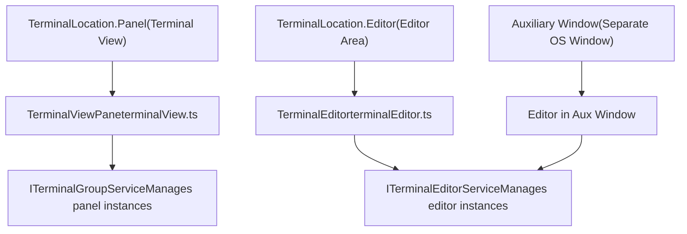
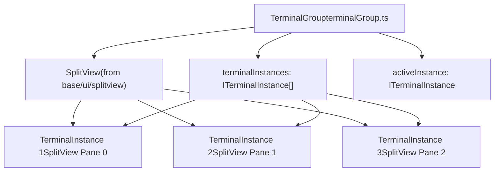
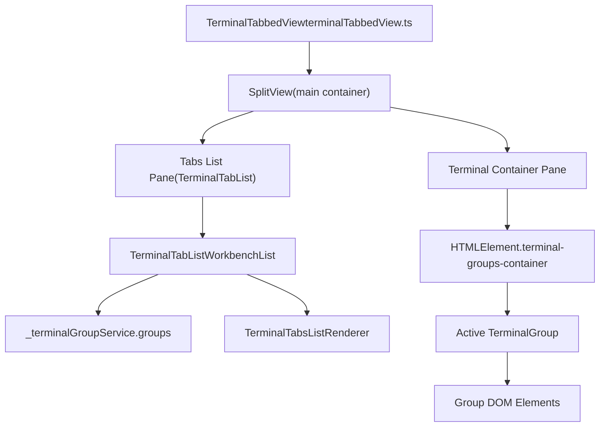
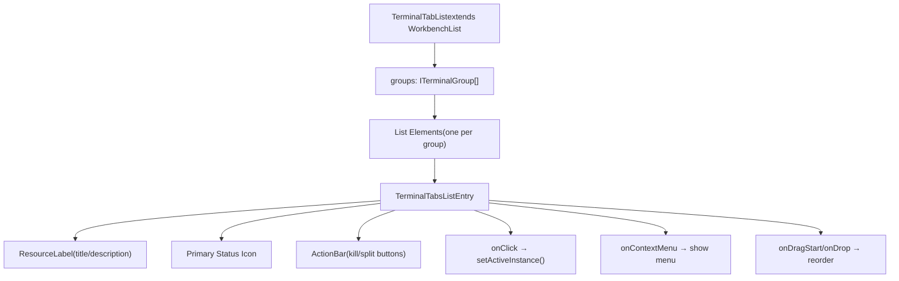
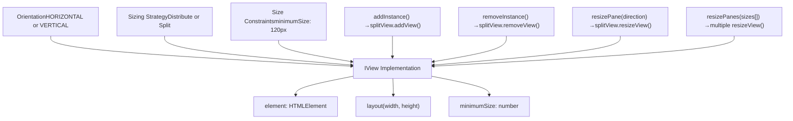
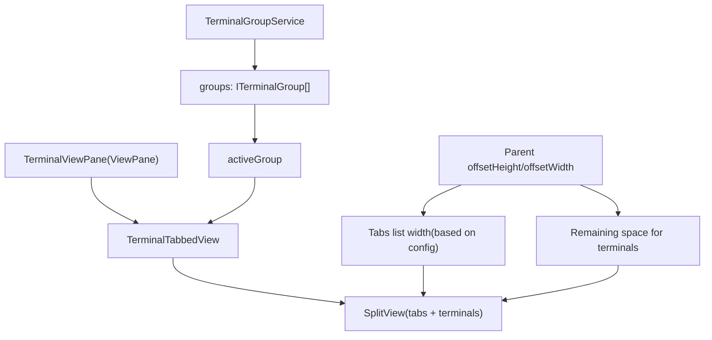
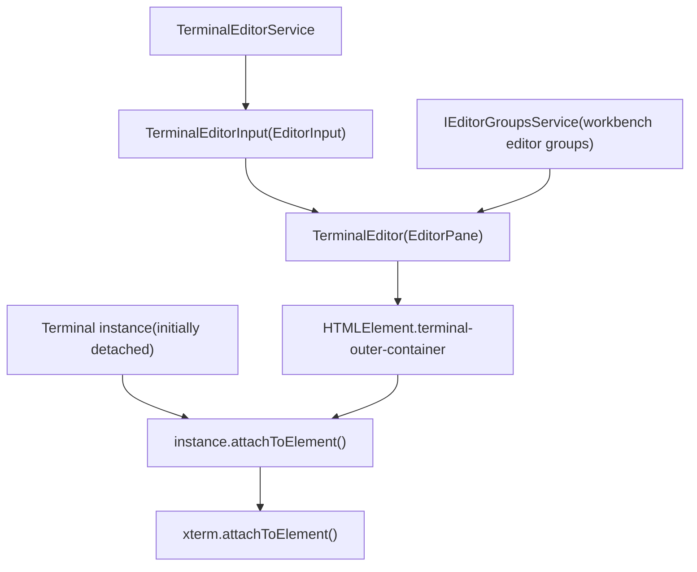

# Terminal UI and Layout

Relevant source files

-   [src/vs/platform/terminal/common/terminal.ts](https://github.com/microsoft/vscode/blob/1be3088d/src/vs/platform/terminal/common/terminal.ts)
-   [src/vs/platform/terminal/common/terminalEnvironment.ts](https://github.com/microsoft/vscode/blob/1be3088d/src/vs/platform/terminal/common/terminalEnvironment.ts)
-   [src/vs/platform/terminal/common/terminalRecorder.ts](https://github.com/microsoft/vscode/blob/1be3088d/src/vs/platform/terminal/common/terminalRecorder.ts)
-   [src/vs/platform/terminal/node/ptyHostMain.ts](https://github.com/microsoft/vscode/blob/1be3088d/src/vs/platform/terminal/node/ptyHostMain.ts)
-   [src/vs/platform/terminal/node/ptyHostService.ts](https://github.com/microsoft/vscode/blob/1be3088d/src/vs/platform/terminal/node/ptyHostService.ts)
-   [src/vs/platform/terminal/node/ptyService.ts](https://github.com/microsoft/vscode/blob/1be3088d/src/vs/platform/terminal/node/ptyService.ts)
-   [src/vs/platform/terminal/node/terminalProcess.ts](https://github.com/microsoft/vscode/blob/1be3088d/src/vs/platform/terminal/node/terminalProcess.ts)
-   [src/vs/platform/terminal/test/common/terminalEnvironment.test.ts](https://github.com/microsoft/vscode/blob/1be3088d/src/vs/platform/terminal/test/common/terminalEnvironment.test.ts)
-   [src/vs/platform/terminal/test/common/terminalProfiles.test.ts](https://github.com/microsoft/vscode/blob/1be3088d/src/vs/platform/terminal/test/common/terminalProfiles.test.ts)
-   [src/vs/platform/terminal/test/common/terminalRecorder.test.ts](https://github.com/microsoft/vscode/blob/1be3088d/src/vs/platform/terminal/test/common/terminalRecorder.test.ts)
-   [src/vs/workbench/api/browser/mainThreadTerminalService.ts](https://github.com/microsoft/vscode/blob/1be3088d/src/vs/workbench/api/browser/mainThreadTerminalService.ts)
-   [src/vs/workbench/api/common/extHostTerminalService.ts](https://github.com/microsoft/vscode/blob/1be3088d/src/vs/workbench/api/common/extHostTerminalService.ts)
-   [src/vs/workbench/api/node/extHostTerminalService.ts](https://github.com/microsoft/vscode/blob/1be3088d/src/vs/workbench/api/node/extHostTerminalService.ts)
-   [src/vs/workbench/contrib/terminal/browser/media/terminal.css](https://github.com/microsoft/vscode/blob/1be3088d/src/vs/workbench/contrib/terminal/browser/media/terminal.css)
-   [src/vs/workbench/contrib/terminal/browser/media/xterm.css](https://github.com/microsoft/vscode/blob/1be3088d/src/vs/workbench/contrib/terminal/browser/media/xterm.css)
-   [src/vs/workbench/contrib/terminal/browser/remotePty.ts](https://github.com/microsoft/vscode/blob/1be3088d/src/vs/workbench/contrib/terminal/browser/remotePty.ts)
-   [src/vs/workbench/contrib/terminal/browser/terminal.contribution.ts](https://github.com/microsoft/vscode/blob/1be3088d/src/vs/workbench/contrib/terminal/browser/terminal.contribution.ts)
-   [src/vs/workbench/contrib/terminal/browser/terminal.ts](https://github.com/microsoft/vscode/blob/1be3088d/src/vs/workbench/contrib/terminal/browser/terminal.ts)
-   [src/vs/workbench/contrib/terminal/browser/terminalActions.ts](https://github.com/microsoft/vscode/blob/1be3088d/src/vs/workbench/contrib/terminal/browser/terminalActions.ts)
-   [src/vs/workbench/contrib/terminal/browser/terminalEditor.ts](https://github.com/microsoft/vscode/blob/1be3088d/src/vs/workbench/contrib/terminal/browser/terminalEditor.ts)
-   [src/vs/workbench/contrib/terminal/browser/terminalEditorInput.ts](https://github.com/microsoft/vscode/blob/1be3088d/src/vs/workbench/contrib/terminal/browser/terminalEditorInput.ts)
-   [src/vs/workbench/contrib/terminal/browser/terminalEditorService.ts](https://github.com/microsoft/vscode/blob/1be3088d/src/vs/workbench/contrib/terminal/browser/terminalEditorService.ts)
-   [src/vs/workbench/contrib/terminal/browser/terminalGroup.ts](https://github.com/microsoft/vscode/blob/1be3088d/src/vs/workbench/contrib/terminal/browser/terminalGroup.ts)
-   [src/vs/workbench/contrib/terminal/browser/terminalGroupService.ts](https://github.com/microsoft/vscode/blob/1be3088d/src/vs/workbench/contrib/terminal/browser/terminalGroupService.ts)
-   [src/vs/workbench/contrib/terminal/browser/terminalInstance.ts](https://github.com/microsoft/vscode/blob/1be3088d/src/vs/workbench/contrib/terminal/browser/terminalInstance.ts)
-   [src/vs/workbench/contrib/terminal/browser/terminalInstanceService.ts](https://github.com/microsoft/vscode/blob/1be3088d/src/vs/workbench/contrib/terminal/browser/terminalInstanceService.ts)
-   [src/vs/workbench/contrib/terminal/browser/terminalMenus.ts](https://github.com/microsoft/vscode/blob/1be3088d/src/vs/workbench/contrib/terminal/browser/terminalMenus.ts)
-   [src/vs/workbench/contrib/terminal/browser/terminalProcessExtHostProxy.ts](https://github.com/microsoft/vscode/blob/1be3088d/src/vs/workbench/contrib/terminal/browser/terminalProcessExtHostProxy.ts)
-   [src/vs/workbench/contrib/terminal/browser/terminalProcessManager.ts](https://github.com/microsoft/vscode/blob/1be3088d/src/vs/workbench/contrib/terminal/browser/terminalProcessManager.ts)
-   [src/vs/workbench/contrib/terminal/browser/terminalService.ts](https://github.com/microsoft/vscode/blob/1be3088d/src/vs/workbench/contrib/terminal/browser/terminalService.ts)
-   [src/vs/workbench/contrib/terminal/browser/terminalStatusList.ts](https://github.com/microsoft/vscode/blob/1be3088d/src/vs/workbench/contrib/terminal/browser/terminalStatusList.ts)
-   [src/vs/workbench/contrib/terminal/browser/terminalTabbedView.ts](https://github.com/microsoft/vscode/blob/1be3088d/src/vs/workbench/contrib/terminal/browser/terminalTabbedView.ts)
-   [src/vs/workbench/contrib/terminal/browser/terminalTabsList.ts](https://github.com/microsoft/vscode/blob/1be3088d/src/vs/workbench/contrib/terminal/browser/terminalTabsList.ts)
-   [src/vs/workbench/contrib/terminal/browser/terminalView.ts](https://github.com/microsoft/vscode/blob/1be3088d/src/vs/workbench/contrib/terminal/browser/terminalView.ts)
-   [src/vs/workbench/contrib/terminal/browser/xterm/xtermTerminal.ts](https://github.com/microsoft/vscode/blob/1be3088d/src/vs/workbench/contrib/terminal/browser/xterm/xtermTerminal.ts)
-   [src/vs/workbench/contrib/terminal/common/terminal.ts](https://github.com/microsoft/vscode/blob/1be3088d/src/vs/workbench/contrib/terminal/common/terminal.ts)
-   [src/vs/workbench/contrib/terminal/common/terminalColorRegistry.ts](https://github.com/microsoft/vscode/blob/1be3088d/src/vs/workbench/contrib/terminal/common/terminalColorRegistry.ts)
-   [src/vs/workbench/contrib/terminal/common/terminalConfiguration.ts](https://github.com/microsoft/vscode/blob/1be3088d/src/vs/workbench/contrib/terminal/common/terminalConfiguration.ts)
-   [src/vs/workbench/contrib/terminal/common/terminalEnvironment.ts](https://github.com/microsoft/vscode/blob/1be3088d/src/vs/workbench/contrib/terminal/common/terminalEnvironment.ts)
-   [src/vs/workbench/contrib/terminal/common/terminalStrings.ts](https://github.com/microsoft/vscode/blob/1be3088d/src/vs/workbench/contrib/terminal/common/terminalStrings.ts)
-   [src/vs/workbench/contrib/terminal/test/browser/terminalStatusList.test.ts](https://github.com/microsoft/vscode/blob/1be3088d/src/vs/workbench/contrib/terminal/test/browser/terminalStatusList.test.ts)
-   [src/vs/workbench/contrib/terminal/test/common/terminalEnvironment.test.ts](https://github.com/microsoft/vscode/blob/1be3088d/src/vs/workbench/contrib/terminal/test/common/terminalEnvironment.test.ts)

This document describes how terminal instances are displayed and organized in the VS Code UI, including terminal groups, split panes, tabs, and the integration with both the terminal panel and editor areas.

For information about terminal instance lifecycle and process management, see [Terminal Instance and Process Management](/microsoft/vscode/6.2-extension-api-implementation). For details on the xterm.js integration and rendering, see [XTerm.js Integration and Rendering](/microsoft/vscode/6.3-language-features-provider-system).

## Overview

The terminal UI in VS Code supports multiple organizational paradigms:

-   **Terminal Panel**: Terminals displayed in the bottom panel with a tabs list sidebar
-   **Terminal Editors**: Terminals opened as editors in the editor area
-   **Auxiliary Windows**: Terminals in separate OS windows
-   **Split Panes**: Multiple terminals side-by-side within a single group
-   **Groups**: Collections of split terminals treated as a single tab

The architecture separates layout concerns into several key components that work together to provide a flexible terminal experience.

Sources: [src/vs/workbench/contrib/terminal/browser/terminal.ts39-46](https://github.com/microsoft/vscode/blob/1be3088d/src/vs/workbench/contrib/terminal/browser/terminal.ts#L39-L46) [src/vs/workbench/contrib/terminal/common/terminal.ts24](https://github.com/microsoft/vscode/blob/1be3088d/src/vs/workbench/contrib/terminal/common/terminal.ts#L24-L24)

## Terminal Location Types

Terminals can exist in three primary locations, each with different UI characteristics:


The `TerminalLocation` enum defines where a terminal instance lives:

-   **Panel**: Managed by `ITerminalGroupService`, displayed in `TerminalViewPane`
-   **Editor**: Managed by `ITerminalEditorService`, displayed as `TerminalEditor` input
-   Terminals can be moved between locations via commands like "Move to Editor" or "Move to Terminal Panel"

Sources: [src/vs/platform/terminal/common/terminal.ts1-800](https://github.com/microsoft/vscode/blob/1be3088d/src/vs/platform/terminal/common/terminal.ts#L1-L800) [src/vs/workbench/contrib/terminal/browser/terminalView.ts57-134](https://github.com/microsoft/vscode/blob/1be3088d/src/vs/workbench/contrib/terminal/browser/terminalView.ts#L57-L134) [src/vs/workbench/contrib/terminal/browser/terminalEditor.ts1-300](https://github.com/microsoft/vscode/blob/1be3088d/src/vs/workbench/contrib/terminal/browser/terminalEditor.ts#L1-L300)

## Terminal Groups and Split Panes

A `TerminalGroup` represents a collection of terminal instances displayed as split panes. Each group appears as a single tab in the tabs list, but can contain multiple terminals side-by-side.


### Key Responsibilities

The `TerminalGroup` class [src/vs/workbench/contrib/terminal/browser/terminalGroup.ts1-800](https://github.com/microsoft/vscode/blob/1be3088d/src/vs/workbench/contrib/terminal/browser/terminalGroup.ts#L1-L800) provides:

-   **Split Management**: Uses `SplitView` with `Orientation.HORIZONTAL` or `Orientation.VERTICAL` to arrange terminals
-   **Pane Navigation**: `focusPreviousPane()` and `focusNextPane()` to switch between splits
-   **Resizing**: `resizePane(direction: Direction)` and `resizePanes(relativeSizes: number[])`
-   **Instance Management**: `addInstance()`, `removeInstance()`, `moveInstance()`

### Splitting Behavior

When splitting a terminal:

1.  User triggers split command (e.g., `TerminalCommandId.Split`)
2.  `TerminalGroup.split(shellLaunchConfig)` is called [src/vs/workbench/contrib/terminal/browser/terminalGroup.ts300-400](https://github.com/microsoft/vscode/blob/1be3088d/src/vs/workbench/contrib/terminal/browser/terminalGroup.ts#L300-L400)
3.  A new `TerminalInstance` is created with the same or new shell config
4.  Instance is added to the group's `SplitView` with equal sizing
5.  The new pane is focused automatically

Sources: [src/vs/workbench/contrib/terminal/browser/terminalGroup.ts1-800](https://github.com/microsoft/vscode/blob/1be3088d/src/vs/workbench/contrib/terminal/browser/terminalGroup.ts#L1-L800) [src/vs/workbench/contrib/terminal/browser/terminalActions.ts431-445](https://github.com/microsoft/vscode/blob/1be3088d/src/vs/workbench/contrib/terminal/browser/terminalActions.ts#L431-L445)

## Tabbed View Architecture

The `TerminalTabbedView` is the primary UI component for terminals in the panel, combining a tabs list sidebar with the terminal display area.


### Layout Configuration

The tabbed view supports configurable layouts controlled by settings:

| Setting | Values | Description |
| --- | --- | --- |
| `terminal.integrated.tabs.location` | `'left'`, `'right'` | Position of tabs list |
| `terminal.integrated.tabs.enabled` | `boolean` | Show tabs as list vs dropdown |
| `terminal.integrated.tabs.hideCondition` | `'never'`, `'singleTerminal'`, `'singleGroup'` | When to hide tabs |

The `SplitView` orientation is determined by:

-   **Panel horizontal**: Tabs on left/right, terminal on right/left
-   **Panel vertical**: Tabs on top, terminal below

Sources: [src/vs/workbench/contrib/terminal/browser/terminalTabbedView.ts1-700](https://github.com/microsoft/vscode/blob/1be3088d/src/vs/workbench/contrib/terminal/browser/terminalTabbedView.ts#L1-L700) [src/vs/workbench/contrib/terminal/common/terminalConfiguration.ts107-116](https://github.com/microsoft/vscode/blob/1be3088d/src/vs/workbench/contrib/terminal/common/terminalConfiguration.ts#L107-L116)

## Tabs List Implementation

The tabs list displays all terminal groups and provides navigation, context menus, and drag-and-drop reordering.


### Tab Entry Composition

Each tab entry [src/vs/workbench/contrib/terminal/browser/terminalTabsList.ts200-500](https://github.com/microsoft/vscode/blob/1be3088d/src/vs/workbench/contrib/terminal/browser/terminalTabsList.ts#L200-L500) displays:

1.  **Icon**: Terminal icon (customizable via `changeIcon` command)
2.  **Color indicator**: Optional color bar (customizable via `changeColor` command)
3.  **Label**: Title computed from `terminal.integrated.tabs.title` template
4.  **Description**: Secondary text from `terminal.integrated.tabs.description` template
5.  **Status icon**: Primary status (e.g., bell, disconnected) from `ITerminalStatusList`
6.  **Action buttons**: Kill and split buttons (when enabled)

### Tab Focus Modes

The setting `terminal.integrated.tabs.focusMode` controls focus behavior:

-   **`'singleClick'`**: Focus terminal on single click
-   **`'doubleClick'`**: Focus terminal only on double click (default)

This is implemented in the tab list's click handler [src/vs/workbench/contrib/terminal/browser/terminalTabsList.ts600-700](https://github.com/microsoft/vscode/blob/1be3088d/src/vs/workbench/contrib/terminal/browser/terminalTabsList.ts#L600-L700)

Sources: [src/vs/workbench/contrib/terminal/browser/terminalTabsList.ts1-1000](https://github.com/microsoft/vscode/blob/1be3088d/src/vs/workbench/contrib/terminal/browser/terminalTabsList.ts#L1-L1000) [src/vs/workbench/contrib/terminal/common/terminalConfiguration.ts127-136](https://github.com/microsoft/vscode/blob/1be3088d/src/vs/workbench/contrib/terminal/common/terminalConfiguration.ts#L127-L136)

## Split Pane Layout System

Terminal groups use a `SplitView` to manage split panes. The split view handles sizing, resizing, and layout of individual terminal instances.

### SplitView Integration


### Pane Sizing

When adding a new pane to a split group [src/vs/workbench/contrib/terminal/browser/terminalGroup.ts400-500](https://github.com/microsoft/vscode/blob/1be3088d/src/vs/workbench/contrib/terminal/browser/terminalGroup.ts#L400-L500):

1.  Calculate available space in the split view
2.  Determine sizing strategy:
    -   **Split existing**: If splitting from an active terminal, use `Sizing.Split` to divide the active pane
    -   **Distribute**: Otherwise use `Sizing.Distribute` to equally size all panes
3.  Add the new view to the split view with constraints (minimum 120px width/height)
4.  Layout is automatically recalculated by the split view

### Resize Operations

The group provides several resize methods:

-   **`resizePane(direction: Direction)`**: Grows/shrinks current pane by 20px in the specified direction
-   **`resizePanes(relativeSizes: number[])`**: Sets specific relative sizes for all panes (used during layout restoration)
-   Keyboard shortcuts (e.g., `Ctrl+Cmd+Left/Right/Up/Down` on Mac) trigger these operations

Sources: [src/vs/workbench/contrib/terminal/browser/terminalGroup.ts300-700](https://github.com/microsoft/vscode/blob/1be3088d/src/vs/workbench/contrib/terminal/browser/terminalGroup.ts#L300-L700) [src/vs/workbench/contrib/terminal/browser/terminalActions.ts447-495](https://github.com/microsoft/vscode/blob/1be3088d/src/vs/workbench/contrib/terminal/browser/terminalActions.ts#L447-L495)

## Panel vs Editor Layout Differences

Terminals behave differently depending on their location:

### Panel Terminal Layout


Panel terminals [src/vs/workbench/contrib/terminal/browser/terminalView.ts100-300](https://github.com/microsoft/vscode/blob/1be3088d/src/vs/workbench/contrib/terminal/browser/terminalView.ts#L100-L300):

-   Managed by `TerminalGroupService`
-   Display in `TerminalViewPane` with tabs list
-   Support panel-specific settings (e.g., `hideOnLastClosed`)
-   Can be hidden via `hidePanel()` command

### Editor Terminal Layout


Editor terminals [src/vs/workbench/contrib/terminal/browser/terminalEditor.ts1-300](https://github.com/microsoft/vscode/blob/1be3088d/src/vs/workbench/contrib/terminal/browser/terminalEditor.ts#L1-L300):

-   Managed by `TerminalEditorService`
-   Display as `TerminalEditor` panes in editor groups
-   No tabs list (use standard editor tabs)
-   Support editor group features (split, move to side, move to new window)
-   Can be reopened after closing (unlike panel terminals)

Sources: [src/vs/workbench/contrib/terminal/browser/terminalView.ts144-300](https://github.com/microsoft/vscode/blob/1be3088d/src/vs/workbench/contrib/terminal/browser/terminalView.ts#L144-L300) [src/vs/workbench/contrib/terminal/browser/terminalEditor.ts100-250](https://github.com/microsoft/vscode/blob/1be3088d/src/vs/workbench/contrib/terminal/browser/terminalEditor.ts#L100-L250) [src/vs/workbench/contrib/terminal/browser/terminalEditorService.ts1-400](https://github.com/microsoft/vscode/blob/1be3088d/src/vs/workbench/contrib/terminal/browser/terminalEditorService.ts#L1-L400)

## Layout and Rendering Flow

The terminal layout process involves multiple levels of coordination:

> **[Mermaid sequence]**
> *(图表结构无法解析)*

### Layout Trigger Points

Layout is triggered by [src/vs/workbench/contrib/terminal/browser/terminalView.ts300-400](https://github.com/microsoft/vscode/blob/1be3088d/src/vs/workbench/contrib/terminal/browser/terminalView.ts#L300-L400):

1.  **Panel resize**: User drags panel sash
2.  **Window resize**: Entire workbench layout changes
3.  **Tab changes**: Switching between terminal groups
4.  **Split operations**: Adding/removing panes
5.  **Settings changes**: Font size, line height, etc.

### Dimension Calculation

Terminal dimensions are calculated in `TerminalInstance._getDimension()` [src/vs/workbench/contrib/terminal/browser/terminalInstance.ts700-850](https://github.com/microsoft/vscode/blob/1be3088d/src/vs/workbench/contrib/terminal/browser/terminalInstance.ts#L700-L850):

1.  Get available pixel dimensions from container
2.  Get xterm rendering dimensions from `getXtermScaledDimensions()` using current font metrics
3.  Calculate cols = floor(width / charWidth)
4.  Calculate rows = floor(height / charHeight)
5.  Apply any fixed dimensions or overrides
6.  Cache last known dimensions for restoration

Sources: [src/vs/workbench/contrib/terminal/browser/terminalInstance.ts700-900](https://github.com/microsoft/vscode/blob/1be3088d/src/vs/workbench/contrib/terminal/browser/terminalInstance.ts#L700-L900) [src/vs/workbench/contrib/terminal/browser/terminalView.ts100-400](https://github.com/microsoft/vscode/blob/1be3088d/src/vs/workbench/contrib/terminal/browser/terminalView.ts#L100-L400) [src/vs/workbench/contrib/terminal/browser/terminalTabbedView.ts500-700](https://github.com/microsoft/vscode/blob/1be3088d/src/vs/workbench/contrib/terminal/browser/terminalTabbedView.ts#L500-L700)

## CSS Layout Structure

The terminal UI uses a flex-based layout with specific CSS classes:

### Panel Structure

```
.pane-body.integrated-terminal              (flex column container)
├── .terminal-outer-container                (background, full height)
│   └── .terminal-groups-container           (groups wrapper)
│       └── .terminal-group                  (individual group)
│           └── .split-view-container        (SplitView root)
│               ├── .split-view-view         (pane 1)
│               │   └── .terminal-wrapper    (terminal container)
│               │       └── .xterm           (xterm.js element)
│               └── .split-view-view         (pane 2)
│                   └── .terminal-wrapper
│                       └── .xterm
```
### Editor Structure

```
.terminal-editor
└── .terminal-outer-container
    └── .terminal-wrapper
        └── .xterm
```
### Key CSS Classes

-   **`.terminal-wrapper`**: Direct container for xterm, handles sizing and scrollbar
-   **`.terminal-wrapper.fixed-dims`**: Applied when terminal has fixed dimensions (uses static positioning)
-   **`.xterm`**: 20px left padding for gutter, absolutely positioned at bottom
-   **`.terminal-side-view .xterm`**: Top-aligned when panel is vertical
-   **`.split-view-view`**: Each split pane, has border styling

Sources: [src/vs/workbench/contrib/terminal/browser/media/terminal.css1-300](https://github.com/microsoft/vscode/blob/1be3088d/src/vs/workbench/contrib/terminal/browser/media/terminal.css#L1-L300)

## Responsive Behavior

The terminal UI adapts to narrow layouts:

### Narrow Detection

The `TerminalContextKeys.isTabsNarrow` context key is set when:

-   Tabs width < 120px (configured minimum)
-   Controlled by `_terminalIsTabsNarrowContextKey` in `TerminalTabbedView`

### Narrow Mode Adaptations

When in narrow mode [src/vs/workbench/contrib/terminal/browser/terminalTabbedView.ts200-300](https://github.com/microsoft/vscode/blob/1be3088d/src/vs/workbench/contrib/terminal/browser/terminalTabbedView.ts#L200-L300):

-   Tab labels may be hidden, showing only icons
-   `showActiveTerminal` setting controls if active terminal info is shown
-   `showActions` setting controls if split/kill buttons are visible
-   Dropdown selector can be used instead of full tabs list

### Settings Impact

| Setting | Effect in Narrow Mode |
| --- | --- |
| `tabs.showActiveTerminal: 'singleTerminalOrNarrow'` | Shows active terminal info |
| `tabs.showActions: 'singleTerminalOrNarrow'` | Shows action buttons |
| `tabs.hideCondition: 'singleTerminal'` | Hides tabs list entirely |

Sources: [src/vs/workbench/contrib/terminal/browser/terminalTabbedView.ts150-350](https://github.com/microsoft/vscode/blob/1be3088d/src/vs/workbench/contrib/terminal/browser/terminalTabbedView.ts#L150-L350) [src/vs/workbench/contrib/terminal/common/terminalConfiguration.ts83-106](https://github.com/microsoft/vscode/blob/1be3088d/src/vs/workbench/contrib/terminal/common/terminalConfiguration.ts#L83-L106)

## Drag and Drop Support

Terminals support comprehensive drag-and-drop operations for reorganization:

### Supported Operations

1.  **Tab reordering**: Drag tab within tabs list to reorder groups
2.  **Tab to editor**: Drag tab to editor area to open as terminal editor
3.  **Editor to panel**: Drag terminal editor to panel to move back
4.  **Cross-window**: Drag terminal to another VS Code window
5.  **Split drop zones**: Drop on split target overlays to create new split

### Drop Zone Overlays

When dragging a terminal, drop overlays appear [src/vs/workbench/contrib/terminal/browser/terminalGroup.ts200-400](https://github.com/microsoft/vscode/blob/1be3088d/src/vs/workbench/contrib/terminal/browser/terminalGroup.ts#L200-L400):

-   **Center**: Merge into existing group
-   **Top/Bottom/Left/Right**: Create new split in that direction
-   Overlays use `.terminal-drop-overlay` CSS class with semi-transparent background

### Data Transfer Format

Terminals use `TerminalDataTransfers.Terminals` as the data transfer type, containing:

-   Terminal URI (parseable via `parseTerminalUri()`)
-   Instance ID
-   Group information

Sources: [src/vs/workbench/contrib/terminal/browser/terminalGroup.ts600-900](https://github.com/microsoft/vscode/blob/1be3088d/src/vs/workbench/contrib/terminal/browser/terminalGroup.ts#L600-L900) [src/vs/workbench/contrib/terminal/browser/terminalTabbedView.ts400-600](https://github.com/microsoft/vscode/blob/1be3088d/src/vs/workbench/contrib/terminal/browser/terminalTabbedView.ts#L400-L600) [src/vs/workbench/contrib/terminal/browser/terminal.ts1-100](https://github.com/microsoft/vscode/blob/1be3088d/src/vs/workbench/contrib/terminal/browser/terminal.ts#L1-L100)
