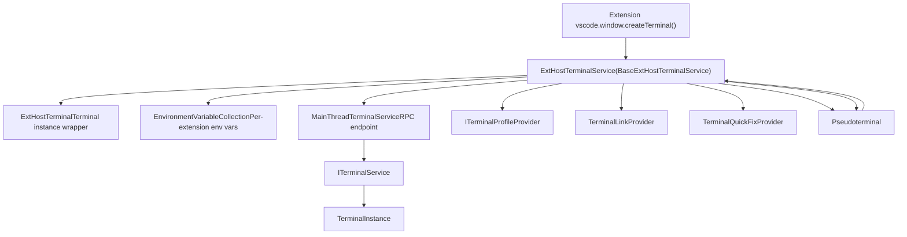
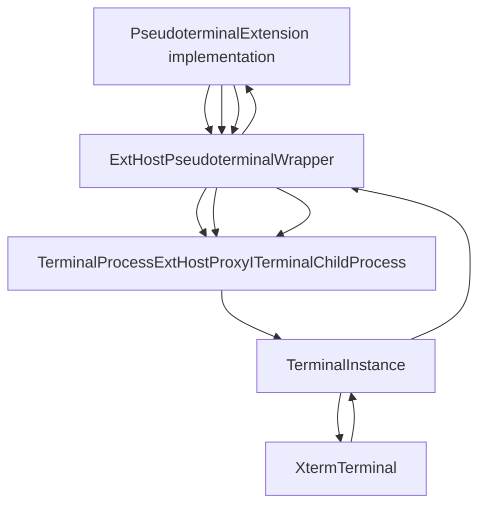
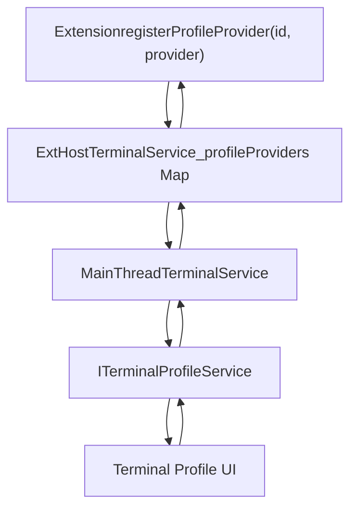
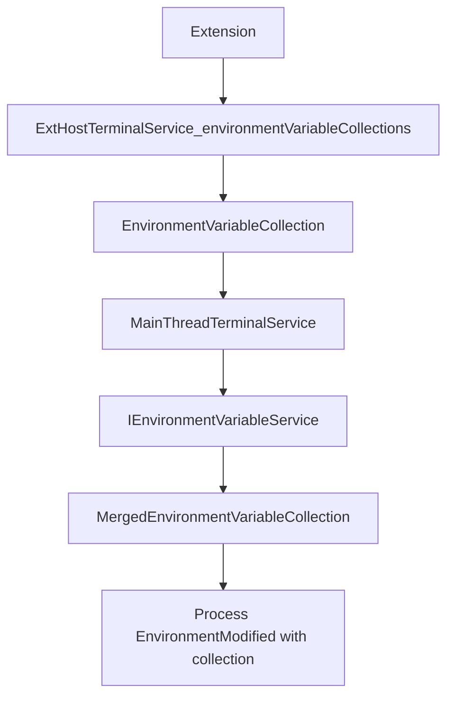
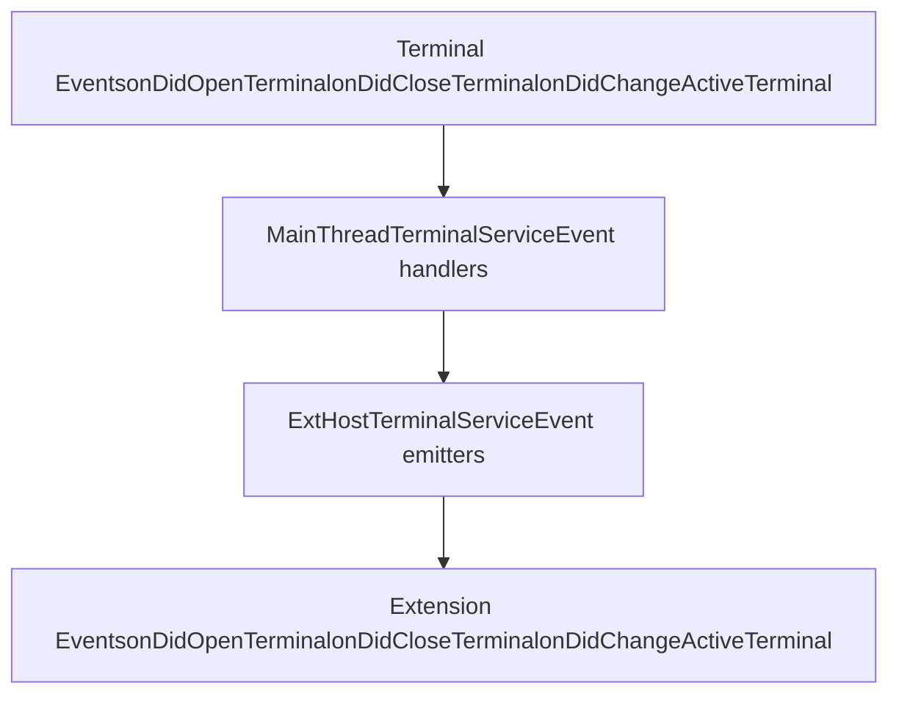
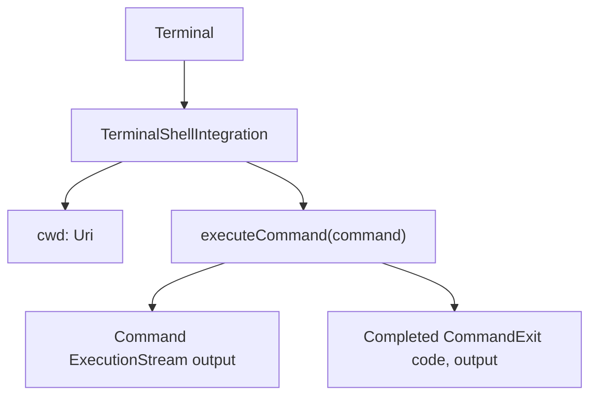

# Terminal Extension API

Relevant source files

-   [src/vs/platform/terminal/common/terminal.ts](https://github.com/microsoft/vscode/blob/1be3088d/src/vs/platform/terminal/common/terminal.ts)
-   [src/vs/platform/terminal/common/terminalEnvironment.ts](https://github.com/microsoft/vscode/blob/1be3088d/src/vs/platform/terminal/common/terminalEnvironment.ts)
-   [src/vs/platform/terminal/common/terminalRecorder.ts](https://github.com/microsoft/vscode/blob/1be3088d/src/vs/platform/terminal/common/terminalRecorder.ts)
-   [src/vs/platform/terminal/node/ptyHostMain.ts](https://github.com/microsoft/vscode/blob/1be3088d/src/vs/platform/terminal/node/ptyHostMain.ts)
-   [src/vs/platform/terminal/node/ptyHostService.ts](https://github.com/microsoft/vscode/blob/1be3088d/src/vs/platform/terminal/node/ptyHostService.ts)
-   [src/vs/platform/terminal/node/ptyService.ts](https://github.com/microsoft/vscode/blob/1be3088d/src/vs/platform/terminal/node/ptyService.ts)
-   [src/vs/platform/terminal/node/terminalProcess.ts](https://github.com/microsoft/vscode/blob/1be3088d/src/vs/platform/terminal/node/terminalProcess.ts)
-   [src/vs/platform/terminal/test/common/terminalEnvironment.test.ts](https://github.com/microsoft/vscode/blob/1be3088d/src/vs/platform/terminal/test/common/terminalEnvironment.test.ts)
-   [src/vs/platform/terminal/test/common/terminalProfiles.test.ts](https://github.com/microsoft/vscode/blob/1be3088d/src/vs/platform/terminal/test/common/terminalProfiles.test.ts)
-   [src/vs/platform/terminal/test/common/terminalRecorder.test.ts](https://github.com/microsoft/vscode/blob/1be3088d/src/vs/platform/terminal/test/common/terminalRecorder.test.ts)
-   [src/vs/workbench/api/browser/mainThreadTerminalService.ts](https://github.com/microsoft/vscode/blob/1be3088d/src/vs/workbench/api/browser/mainThreadTerminalService.ts)
-   [src/vs/workbench/api/common/extHostTerminalService.ts](https://github.com/microsoft/vscode/blob/1be3088d/src/vs/workbench/api/common/extHostTerminalService.ts)
-   [src/vs/workbench/api/node/extHostTerminalService.ts](https://github.com/microsoft/vscode/blob/1be3088d/src/vs/workbench/api/node/extHostTerminalService.ts)
-   [src/vs/workbench/contrib/terminal/browser/media/terminal.css](https://github.com/microsoft/vscode/blob/1be3088d/src/vs/workbench/contrib/terminal/browser/media/terminal.css)
-   [src/vs/workbench/contrib/terminal/browser/media/xterm.css](https://github.com/microsoft/vscode/blob/1be3088d/src/vs/workbench/contrib/terminal/browser/media/xterm.css)
-   [src/vs/workbench/contrib/terminal/browser/remotePty.ts](https://github.com/microsoft/vscode/blob/1be3088d/src/vs/workbench/contrib/terminal/browser/remotePty.ts)
-   [src/vs/workbench/contrib/terminal/browser/terminal.contribution.ts](https://github.com/microsoft/vscode/blob/1be3088d/src/vs/workbench/contrib/terminal/browser/terminal.contribution.ts)
-   [src/vs/workbench/contrib/terminal/browser/terminal.ts](https://github.com/microsoft/vscode/blob/1be3088d/src/vs/workbench/contrib/terminal/browser/terminal.ts)
-   [src/vs/workbench/contrib/terminal/browser/terminalActions.ts](https://github.com/microsoft/vscode/blob/1be3088d/src/vs/workbench/contrib/terminal/browser/terminalActions.ts)
-   [src/vs/workbench/contrib/terminal/browser/terminalEditor.ts](https://github.com/microsoft/vscode/blob/1be3088d/src/vs/workbench/contrib/terminal/browser/terminalEditor.ts)
-   [src/vs/workbench/contrib/terminal/browser/terminalEditorInput.ts](https://github.com/microsoft/vscode/blob/1be3088d/src/vs/workbench/contrib/terminal/browser/terminalEditorInput.ts)
-   [src/vs/workbench/contrib/terminal/browser/terminalEditorService.ts](https://github.com/microsoft/vscode/blob/1be3088d/src/vs/workbench/contrib/terminal/browser/terminalEditorService.ts)
-   [src/vs/workbench/contrib/terminal/browser/terminalGroup.ts](https://github.com/microsoft/vscode/blob/1be3088d/src/vs/workbench/contrib/terminal/browser/terminalGroup.ts)
-   [src/vs/workbench/contrib/terminal/browser/terminalGroupService.ts](https://github.com/microsoft/vscode/blob/1be3088d/src/vs/workbench/contrib/terminal/browser/terminalGroupService.ts)
-   [src/vs/workbench/contrib/terminal/browser/terminalInstance.ts](https://github.com/microsoft/vscode/blob/1be3088d/src/vs/workbench/contrib/terminal/browser/terminalInstance.ts)
-   [src/vs/workbench/contrib/terminal/browser/terminalInstanceService.ts](https://github.com/microsoft/vscode/blob/1be3088d/src/vs/workbench/contrib/terminal/browser/terminalInstanceService.ts)
-   [src/vs/workbench/contrib/terminal/browser/terminalMenus.ts](https://github.com/microsoft/vscode/blob/1be3088d/src/vs/workbench/contrib/terminal/browser/terminalMenus.ts)
-   [src/vs/workbench/contrib/terminal/browser/terminalProcessExtHostProxy.ts](https://github.com/microsoft/vscode/blob/1be3088d/src/vs/workbench/contrib/terminal/browser/terminalProcessExtHostProxy.ts)
-   [src/vs/workbench/contrib/terminal/browser/terminalProcessManager.ts](https://github.com/microsoft/vscode/blob/1be3088d/src/vs/workbench/contrib/terminal/browser/terminalProcessManager.ts)
-   [src/vs/workbench/contrib/terminal/browser/terminalService.ts](https://github.com/microsoft/vscode/blob/1be3088d/src/vs/workbench/contrib/terminal/browser/terminalService.ts)
-   [src/vs/workbench/contrib/terminal/browser/terminalStatusList.ts](https://github.com/microsoft/vscode/blob/1be3088d/src/vs/workbench/contrib/terminal/browser/terminalStatusList.ts)
-   [src/vs/workbench/contrib/terminal/browser/terminalTabbedView.ts](https://github.com/microsoft/vscode/blob/1be3088d/src/vs/workbench/contrib/terminal/browser/terminalTabbedView.ts)
-   [src/vs/workbench/contrib/terminal/browser/terminalTabsList.ts](https://github.com/microsoft/vscode/blob/1be3088d/src/vs/workbench/contrib/terminal/browser/terminalTabsList.ts)
-   [src/vs/workbench/contrib/terminal/browser/terminalView.ts](https://github.com/microsoft/vscode/blob/1be3088d/src/vs/workbench/contrib/terminal/browser/terminalView.ts)
-   [src/vs/workbench/contrib/terminal/browser/xterm/xtermTerminal.ts](https://github.com/microsoft/vscode/blob/1be3088d/src/vs/workbench/contrib/terminal/browser/xterm/xtermTerminal.ts)
-   [src/vs/workbench/contrib/terminal/common/terminal.ts](https://github.com/microsoft/vscode/blob/1be3088d/src/vs/workbench/contrib/terminal/common/terminal.ts)
-   [src/vs/workbench/contrib/terminal/common/terminalColorRegistry.ts](https://github.com/microsoft/vscode/blob/1be3088d/src/vs/workbench/contrib/terminal/common/terminalColorRegistry.ts)
-   [src/vs/workbench/contrib/terminal/common/terminalConfiguration.ts](https://github.com/microsoft/vscode/blob/1be3088d/src/vs/workbench/contrib/terminal/common/terminalConfiguration.ts)
-   [src/vs/workbench/contrib/terminal/common/terminalEnvironment.ts](https://github.com/microsoft/vscode/blob/1be3088d/src/vs/workbench/contrib/terminal/common/terminalEnvironment.ts)
-   [src/vs/workbench/contrib/terminal/common/terminalStrings.ts](https://github.com/microsoft/vscode/blob/1be3088d/src/vs/workbench/contrib/terminal/common/terminalStrings.ts)
-   [src/vs/workbench/contrib/terminal/test/browser/terminalStatusList.test.ts](https://github.com/microsoft/vscode/blob/1be3088d/src/vs/workbench/contrib/terminal/test/browser/terminalStatusList.test.ts)
-   [src/vs/workbench/contrib/terminal/test/common/terminalEnvironment.test.ts](https://github.com/microsoft/vscode/blob/1be3088d/src/vs/workbench/contrib/terminal/test/common/terminalEnvironment.test.ts)

## Purpose and Scope

This page documents the terminal extension API exposed through the `vscode` namespace, which enables extensions to create terminals, provide custom terminal implementations (pseudoterminals), contribute terminal profiles, modify environment variables, and enhance terminal functionality. The API bridges the extension host process with VS Code's core terminal infrastructure.

For information about the core terminal architecture and instance management, see [Terminal Architecture Overview](/microsoft/vscode/7.1-terminal-architecture-overview) and [Terminal Instance and Process Management](/microsoft/vscode/7.2-terminal-instance-and-process-management). For details on shell integration features, see [Shell Integration and Capabilities](/microsoft/vscode/7.5-shell-integration-and-capabilities).

---

## API Surface Overview

The terminal extension API is exposed through `IExtHostTerminalService` and provides the following capabilities:

| API Category | Primary Interface | Purpose |
| --- | --- | --- |
| Terminal Creation | `createTerminal`, `createTerminalFromOptions` | Create standard terminals with shell processes |
| Custom Terminals | `createExtensionTerminal`, `Pseudoterminal` | Provide custom terminal implementations |
| Profile Providers | `registerProfileProvider`, `TerminalProfileProvider` | Contribute terminal profiles to the UI |
| Link Providers | `registerLinkProvider`, `TerminalLinkProvider` | Detect and handle custom links in terminal output |
| Quick Fix Providers | `registerTerminalQuickFixProvider` | Provide command error corrections |
| Completion Providers | `registerTerminalCompletionProvider` | Provide shell command completions |
| Environment Variables | `EnvironmentVariableCollection` | Modify terminal environment per extension |

**Sources:** [src/vs/workbench/api/common/extHostTerminalService.ts33-62](https://github.com/microsoft/vscode/blob/1be3088d/src/vs/workbench/api/common/extHostTerminalService.ts#L33-L62)

---

## Extension Host Terminal Service Architecture


The `ExtHostTerminalService` maintains all terminal instances created by extensions and coordinates with the main thread through RPC. Each `ExtHostTerminal` represents a terminal visible to the extension and forwards operations to the main thread.

**Sources:** [src/vs/workbench/api/common/extHostTerminalService.ts83-254](https://github.com/microsoft/vscode/blob/1be3088d/src/vs/workbench/api/common/extHostTerminalService.ts#L83-L254) [src/vs/workbench/api/browser/mainThreadTerminalService.ts1-50](https://github.com/microsoft/vscode/blob/1be3088d/src/vs/workbench/api/browser/mainThreadTerminalService.ts#L1-L50)

---

## Terminal Creation APIs

### Standard Terminal Creation

Extensions can create terminals using three primary methods:

```
// Simple terminal with name only
createTerminal(name?: string, shellPath?: string, shellArgs?: string[]): Terminal

// Terminal with full options
createTerminalFromOptions(options: TerminalOptions, internalOptions?: ITerminalInternalOptions): Terminal

// Custom pseudoterminal
createExtensionTerminal(options: ExtensionTerminalOptions): Terminal
```
**Terminal Creation Flow:**

> **[Mermaid sequence]**
> *(图表结构无法解析)*

The `ExtHostTerminal` class provides the extension-facing API while the actual terminal instance exists in the main thread. The `$createTerminal` RPC call transfers the `IShellLaunchConfigDto` to create the real terminal.

**Sources:** [src/vs/workbench/api/common/extHostTerminalService.ts255-295](https://github.com/microsoft/vscode/blob/1be3088d/src/vs/workbench/api/common/extHostTerminalService.ts#L255-L295) [src/vs/workbench/api/browser/mainThreadTerminalService.ts166-201](https://github.com/microsoft/vscode/blob/1be3088d/src/vs/workbench/api/browser/mainThreadTerminalService.ts#L166-L201)

---

## Pseudoterminal Interface

Extensions can provide custom terminal implementations by implementing the `Pseudoterminal` interface. This allows complete control over terminal input/output without an actual shell process.

### Pseudoterminal Contract


### Key Pseudoterminal Methods

| Method | Direction | Purpose |
| --- | --- | --- |
| `open(initialDimensions)` | ExtHost → Extension | Initialize the pseudoterminal |
| `close()` | ExtHost → Extension | Clean up the pseudoterminal |
| `handleInput(data)` | ExtHost → Extension | Process user input |
| `setDimensions(dimensions)` | ExtHost → Extension | Handle terminal resize |
| `onDidWrite` | Extension → ExtHost | Send data to terminal display |
| `onDidClose` | Extension → ExtHost | Signal terminal exit |
| `onDidChangeName` | Extension → ExtHost | Change terminal title |

The `TerminalProcessExtHostProxy` class in the main thread implements `ITerminalChildProcess` and bridges to the extension host, allowing pseudoterminals to integrate seamlessly with the terminal infrastructure.

**Sources:** [src/vs/workbench/api/common/extHostTerminalService.ts489-650](https://github.com/microsoft/vscode/blob/1be3088d/src/vs/workbench/api/common/extHostTerminalService.ts#L489-L650) [src/vs/workbench/contrib/terminal/browser/terminalProcessExtHostProxy.ts1-250](https://github.com/microsoft/vscode/blob/1be3088d/src/vs/workbench/contrib/terminal/browser/terminalProcessExtHostProxy.ts#L1-L250)

---

## Terminal Profile Providers

Extensions can contribute terminal profiles that appear in the terminal profile dropdown and can be selected by users or used as default profiles.

### Profile Provider Registration


### Profile Provider Interface

The `TerminalProfileProvider` interface requires:

```
interface TerminalProfileProvider {
    provideTerminalProfile(token: CancellationToken): ProviderResult<TerminalProfile>;
}
```
When a user creates a terminal using a contributed profile, the extension's `provideTerminalProfile` method is called to resolve the actual shell launch configuration.

**Sources:** [src/vs/workbench/api/common/extHostTerminalService.ts722-768](https://github.com/microsoft/vscode/blob/1be3088d/src/vs/workbench/api/common/extHostTerminalService.ts#L722-L768) [src/vs/workbench/api/browser/mainThreadTerminalService.ts202-238](https://github.com/microsoft/vscode/blob/1be3088d/src/vs/workbench/api/browser/mainThreadTerminalService.ts#L202-L238)

---

## Environment Variable Collections

Extensions can modify the environment of terminals through `EnvironmentVariableCollection`, which provides scoped environment variable mutations.

### Environment Variable Collection Architecture


### Mutator Types

| Type | Description | Example |
| --- | --- | --- |
| `Replace` | Replace variable value entirely | `PATH=/new/path` |
| `Append` | Append to existing value | `PATH=$PATH:/added/path` |
| `Prepend` | Prepend to existing value | `PATH=/added/path:$PATH` |

Environment variable collections support scoping to specific workspace folders, allowing fine-grained control over which terminals receive which modifications.

**Sources:** [src/vs/workbench/api/common/extHostTerminalService.ts774-923](https://github.com/microsoft/vscode/blob/1be3088d/src/vs/workbench/api/common/extHostTerminalService.ts#L774-L923) [src/vs/platform/terminal/common/environmentVariableShared.ts1-100](https://github.com/microsoft/vscode/blob/1be3088d/src/vs/platform/terminal/common/environmentVariableShared.ts#L1-L100)

---

## Terminal Link Providers

Extensions can register link providers to detect and handle custom patterns in terminal output.

### Link Provider Flow

> **[Mermaid sequence]**
> *(图表结构无法解析)*

Link providers implement:

-   `provideTerminalLinks(context)` - Detect links in a terminal line
-   `handleTerminalLink(link)` - Handle link activation (optional)

**Sources:** [src/vs/workbench/api/common/extHostTerminalService.ts696-720](https://github.com/microsoft/vscode/blob/1be3088d/src/vs/workbench/api/common/extHostTerminalService.ts#L696-L720) [src/vs/workbench/api/browser/mainThreadTerminalService.ts293-353](https://github.com/microsoft/vscode/blob/1be3088d/src/vs/workbench/api/browser/mainThreadTerminalService.ts#L293-L353)

---

## RPC Communication Protocol

All communication between the extension host and main thread uses a strongly-typed RPC protocol defined by `ExtHostTerminalServiceShape` and `MainThreadTerminalServiceShape`.

### Main RPC Methods

**Extension Host → Main Thread:**

| Method | Purpose |
| --- | --- |
| `$createTerminal` | Create a new terminal instance |
| `$dispose` | Dispose a terminal instance |
| `$show` | Show a terminal instance |
| `$hide` | Hide a terminal instance |
| `$sendText` | Send text to terminal input |
| `$setEnvironmentVariableCollection` | Update environment variables |

**Main Thread → Extension Host:**

| Method | Purpose |
| --- | --- |
| `$acceptTerminalOpened` | Notify that terminal was created |
| `$acceptTerminalClosed` | Notify that terminal was closed |
| `$acceptTerminalProcessId` | Report terminal process ID |
| `$acceptTerminalDimensions` | Report terminal dimensions changed |
| `$acceptProcessInput` | Forward user input to pseudoterminal |
| `$acceptProcessResize` | Forward resize event to pseudoterminal |
| `$startExtensionTerminal` | Start a pseudoterminal implementation |

### Event Propagation


The RPC protocol ensures terminal state synchronization between processes and allows extensions to observe and control terminals even though they run in a separate process.

**Sources:** [src/vs/workbench/api/common/extHost.protocol.ts1-50](https://github.com/microsoft/vscode/blob/1be3088d/src/vs/workbench/api/common/extHost.protocol.ts#L1-L50) [src/vs/workbench/api/browser/mainThreadTerminalService.ts51-165](https://github.com/microsoft/vscode/blob/1be3088d/src/vs/workbench/api/browser/mainThreadTerminalService.ts#L51-L165) [src/vs/workbench/api/common/extHostTerminalService.ts170-254](https://github.com/microsoft/vscode/blob/1be3088d/src/vs/workbench/api/common/extHostTerminalService.ts#L170-L254)

---

## Terminal Instance Lifecycle

### ExtHostTerminal Lifecycle

The `ExtHostTerminal` class wraps terminal instances for extension consumption:

> **[Mermaid stateDiagram]**
> *(图表结构无法解析)*

### Key Properties

The extension-visible `Terminal` object exposes:

-   `name` - Terminal display name
-   `processId` - Promise resolving to shell process ID
-   `creationOptions` - Frozen creation options
-   `exitStatus` - Exit code and reason (when closed)
-   `state` - Interaction state and shell type
-   `shellIntegration` - Shell integration API (when available)

**Sources:** [src/vs/workbench/api/common/extHostTerminalService.ts83-164](https://github.com/microsoft/vscode/blob/1be3088d/src/vs/workbench/api/common/extHostTerminalService.ts#L83-L164)

---

## Shell Integration Extension API

When shell integration is active, extensions can access additional APIs through `Terminal.shellIntegration`:


This API allows extensions to:

-   Access the current working directory
-   Execute commands with output capture
-   Monitor command execution lifecycle
-   Retrieve command history

**Sources:** [src/vs/workbench/api/common/extHostTerminalService.ts165-169](https://github.com/microsoft/vscode/blob/1be3088d/src/vs/workbench/api/common/extHostTerminalService.ts#L165-L169)

---

## Summary

The Terminal Extension API provides a comprehensive interface for extensions to create, customize, and interact with integrated terminals. The architecture separates extension code in the extension host from the main terminal infrastructure, communicating through a well-defined RPC protocol. Key capabilities include standard terminal creation, custom pseudoterminal implementations, profile contributions, environment variable modifications, and link providers, all designed to enable rich terminal experiences without compromising stability or security.
