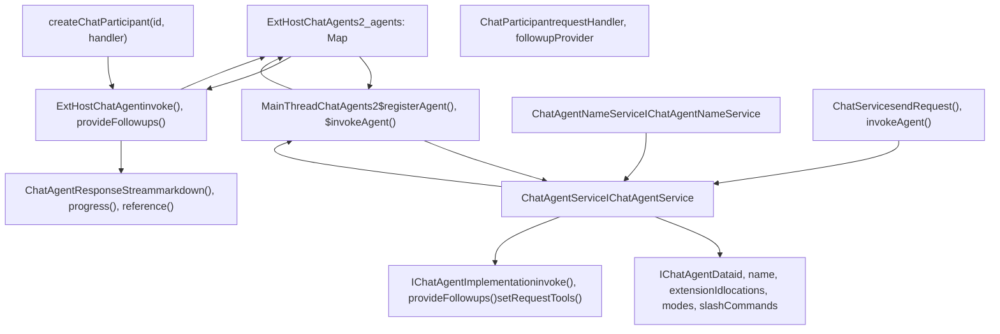
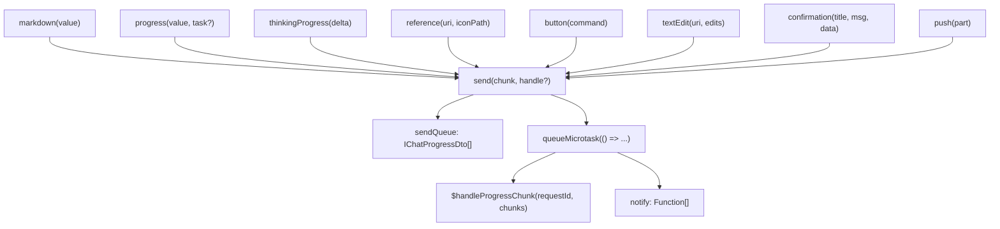
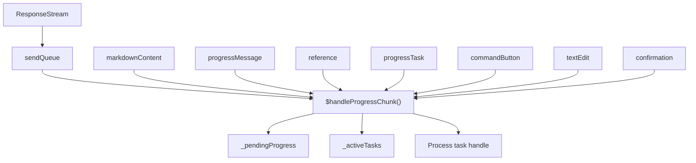
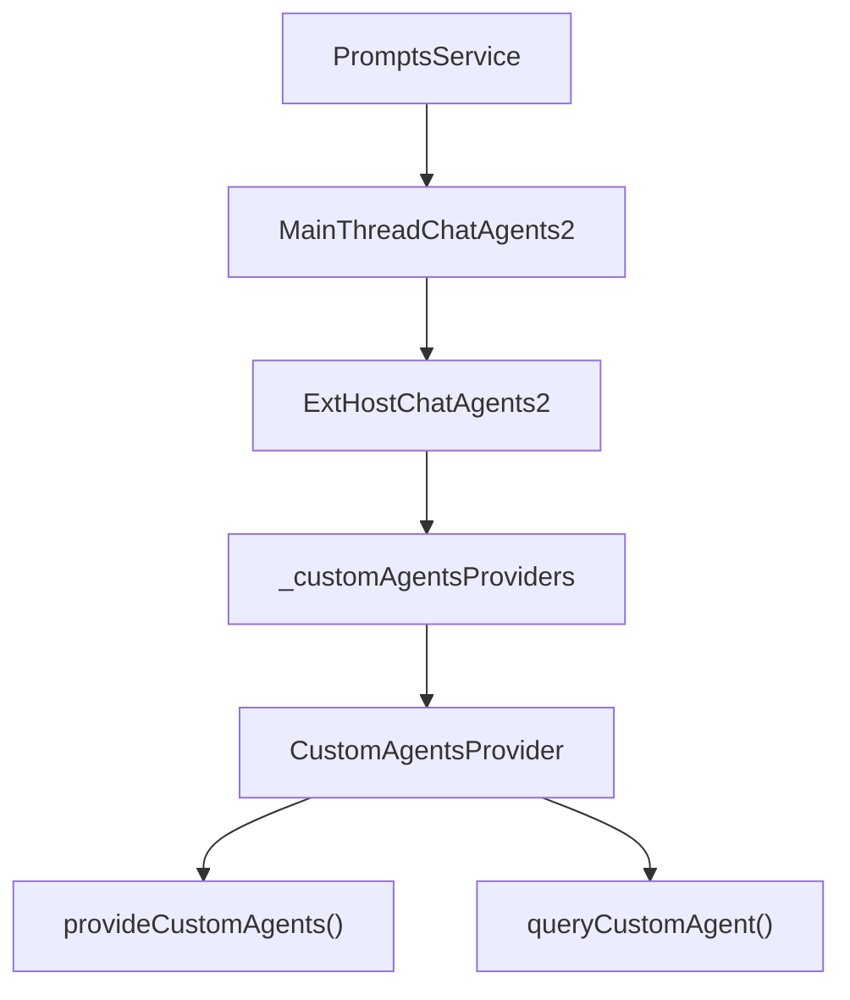
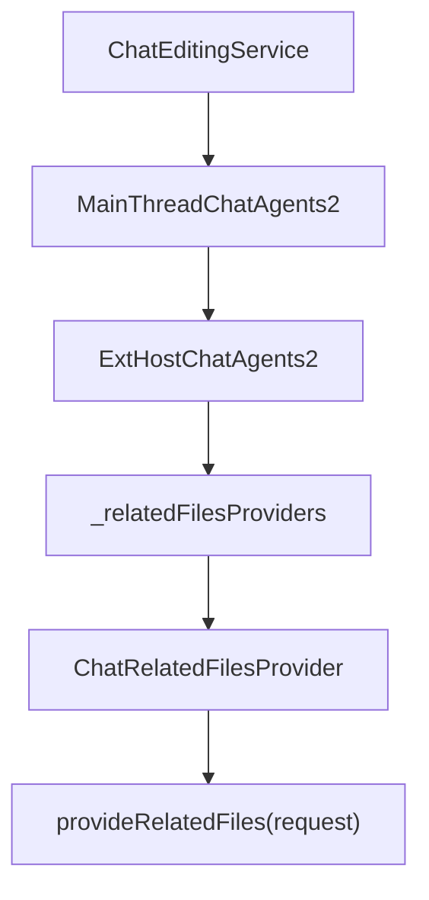

# Chat Agents and Participants

Relevant source files

-   [extensions/vscode-api-tests/package.json](https://github.com/microsoft/vscode/blob/1be3088d/extensions/vscode-api-tests/package.json)
-   [extensions/vscode-api-tests/src/singlefolder-tests/chat.test.ts](https://github.com/microsoft/vscode/blob/1be3088d/extensions/vscode-api-tests/src/singlefolder-tests/chat.test.ts)
-   [src/vs/editor/common/languages.ts](https://github.com/microsoft/vscode/blob/1be3088d/src/vs/editor/common/languages.ts)
-   [src/vs/platform/extensions/common/extensionsApiProposals.ts](https://github.com/microsoft/vscode/blob/1be3088d/src/vs/platform/extensions/common/extensionsApiProposals.ts)
-   [src/vs/workbench/api/browser/mainThreadChatAgents2.ts](https://github.com/microsoft/vscode/blob/1be3088d/src/vs/workbench/api/browser/mainThreadChatAgents2.ts)
-   [src/vs/workbench/api/browser/mainThreadChatStatus.ts](https://github.com/microsoft/vscode/blob/1be3088d/src/vs/workbench/api/browser/mainThreadChatStatus.ts)
-   [src/vs/workbench/api/browser/mainThreadLanguageFeatures.ts](https://github.com/microsoft/vscode/blob/1be3088d/src/vs/workbench/api/browser/mainThreadLanguageFeatures.ts)
-   [src/vs/workbench/api/common/extHost.api.impl.ts](https://github.com/microsoft/vscode/blob/1be3088d/src/vs/workbench/api/common/extHost.api.impl.ts)
-   [src/vs/workbench/api/common/extHost.protocol.ts](https://github.com/microsoft/vscode/blob/1be3088d/src/vs/workbench/api/common/extHost.protocol.ts)
-   [src/vs/workbench/api/common/extHostChatAgents2.ts](https://github.com/microsoft/vscode/blob/1be3088d/src/vs/workbench/api/common/extHostChatAgents2.ts)
-   [src/vs/workbench/api/common/extHostChatStatus.ts](https://github.com/microsoft/vscode/blob/1be3088d/src/vs/workbench/api/common/extHostChatStatus.ts)
-   [src/vs/workbench/api/common/extHostLanguageFeatures.ts](https://github.com/microsoft/vscode/blob/1be3088d/src/vs/workbench/api/common/extHostLanguageFeatures.ts)
-   [src/vs/workbench/api/common/extHostTypeConverters.ts](https://github.com/microsoft/vscode/blob/1be3088d/src/vs/workbench/api/common/extHostTypeConverters.ts)
-   [src/vs/workbench/api/common/extHostTypes.ts](https://github.com/microsoft/vscode/blob/1be3088d/src/vs/workbench/api/common/extHostTypes.ts)
-   [src/vs/workbench/contrib/chat/browser/actions/chatActions.ts](https://github.com/microsoft/vscode/blob/1be3088d/src/vs/workbench/contrib/chat/browser/actions/chatActions.ts)
-   [src/vs/workbench/contrib/chat/browser/actions/chatExecuteActions.ts](https://github.com/microsoft/vscode/blob/1be3088d/src/vs/workbench/contrib/chat/browser/actions/chatExecuteActions.ts)
-   [src/vs/workbench/contrib/chat/browser/actions/chatGettingStarted.ts](https://github.com/microsoft/vscode/blob/1be3088d/src/vs/workbench/contrib/chat/browser/actions/chatGettingStarted.ts)
-   [src/vs/workbench/contrib/chat/browser/chat.contribution.ts](https://github.com/microsoft/vscode/blob/1be3088d/src/vs/workbench/contrib/chat/browser/chat.contribution.ts)
-   [src/vs/workbench/contrib/chat/browser/chat.ts](https://github.com/microsoft/vscode/blob/1be3088d/src/vs/workbench/contrib/chat/browser/chat.ts)
-   [src/vs/workbench/contrib/chat/common/constants.ts](https://github.com/microsoft/vscode/blob/1be3088d/src/vs/workbench/contrib/chat/common/constants.ts)
-   [src/vs/workbench/contrib/chat/test/common/voiceChatService.test.ts](https://github.com/microsoft/vscode/blob/1be3088d/src/vs/workbench/contrib/chat/test/common/voiceChatService.test.ts)
-   [src/vscode-dts/vscode.d.ts](https://github.com/microsoft/vscode/blob/1be3088d/src/vscode-dts/vscode.d.ts)
-   [src/vscode-dts/vscode.proposed.chatParticipantAdditions.d.ts](https://github.com/microsoft/vscode/blob/1be3088d/src/vscode-dts/vscode.proposed.chatParticipantAdditions.d.ts)
-   [src/vscode-dts/vscode.proposed.chatStatusItem.d.ts](https://github.com/microsoft/vscode/blob/1be3088d/src/vscode-dts/vscode.proposed.chatStatusItem.d.ts)
-   [src/vscode-dts/vscode.proposed.defaultChatParticipant.d.ts](https://github.com/microsoft/vscode/blob/1be3088d/src/vscode-dts/vscode.proposed.defaultChatParticipant.d.ts)
-   [src/vscode-dts/vscode.proposed.inlineCompletionsAdditions.d.ts](https://github.com/microsoft/vscode/blob/1be3088d/src/vscode-dts/vscode.proposed.inlineCompletionsAdditions.d.ts)

This document describes the **Chat Agents and Participants** system in VS Code. Chat agents (also called chat participants) are extension-contributed entities that handle chat requests from users. Extensions register agents that can respond to queries, execute commands, and interact with the language model.

For information about the chat UI and widget system, see [Chat System Architecture](/microsoft/vscode/10.1-scm-framework-architecture). For details on language models and tool integration, see [Language Models and Tool Integration](#10.7). For the extension API for contributing agents, see [Chat Extension API](#10.8).

## Architecture Overview

The chat agent system follows VS Code's standard extension architecture with a clear separation between the extension host process (where agent implementations run) and the main thread (where agent orchestration occurs).

#### Architecture Diagram


**Sources:** [src/vs/workbench/api/common/extHostChatAgents2.ts406-478](https://github.com/microsoft/vscode/blob/1be3088d/src/vs/workbench/api/common/extHostChatAgents2.ts#L406-L478) [src/vs/workbench/api/browser/mainThreadChatAgents2.ts91-249](https://github.com/microsoft/vscode/blob/1be3088d/src/vs/workbench/api/browser/mainThreadChatAgents2.ts#L91-L249) [src/vs/workbench/contrib/chat/browser/chat.contribution.ts34-44](https://github.com/microsoft/vscode/blob/1be3088d/src/vs/workbench/contrib/chat/browser/chat.contribution.ts#L34-L44)

## Agent Registration and Lifecycle

### Agent Registration Flow

When an extension creates a chat participant, the following registration sequence occurs:

#### Agent Registration Sequence

> **[Mermaid sequence]**
> *(图表结构无法解析)*

**Sources:** [src/vs/workbench/api/common/extHostChatAgents2.ts462-469](https://github.com/microsoft/vscode/blob/1be3088d/src/vs/workbench/api/common/extHostChatAgents2.ts#L462-L469) [src/vs/workbench/api/browser/mainThreadChatAgents2.ts168-249](https://github.com/microsoft/vscode/blob/1be3088d/src/vs/workbench/api/browser/mainThreadChatAgents2.ts#L168-L249)

### Agent Data Structure

Each agent is represented by two key interfaces defined in the `chatAgents.ts` module:

**IChatAgentData** - Static metadata about the agent:

-   `id`: Unique identifier (e.g., "github.copilot.workspace")
-   `name`: Display name (e.g., "workspace")
-   `extensionId`: Contributing extension (`ExtensionIdentifier`)
-   `extensionVersion`: Extension version string
-   `extensionDisplayName`: Display name of the contributing extension
-   `extensionPublisherId`: Publisher identifier
-   `publisherDisplayName`: Publisher display name
-   `locations`: Array of `ChatAgentLocation` values (Chat, Terminal, Notebook, EditorInline)
-   `modes`: Array of `ChatModeKind` values (Ask, Edit, Agent)
-   `slashCommands`: Array of `IChatAgentCommand` objects
-   `disambiguation`: Array of disambiguation entries with category, description, examples
-   `metadata`: `IChatAgentMetadata` with properties like `isSticky`, `isDefault`, `requiresCopilotPlan`

**IChatAgentImplementation** - Runtime behavior interface:

-   `invoke(request, progress, history, token)`: Handles chat requests, returns `Promise<IChatAgentResult>`
-   `provideFollowups(request, result, history, token)`: Returns `Promise<IChatFollowup[]>`
-   `provideChatTitle(history, token)`: Returns `Promise<string | undefined>`
-   `provideChatSummary(history, token)`: Returns `Promise<string | undefined>`
-   `setRequestTools(requestId, tools)`: Updates available tools for a specific request

**Sources:** [src/vs/workbench/contrib/chat/common/participants/chatAgents.ts70-160](https://github.com/microsoft/vscode/blob/1be3088d/src/vs/workbench/contrib/chat/common/participants/chatAgents.ts#L70-L160) [src/vs/workbench/api/browser/mainThreadChatAgents2.ts182-211](https://github.com/microsoft/vscode/blob/1be3088d/src/vs/workbench/api/browser/mainThreadChatAgents2.ts#L182-L211)

### Static vs Dynamic Agents

**Static Agents** are declared in `package.json` via the `chatParticipants` contribution point. The `ChatAgentService` reads these contributions on startup and calls `registerAgent()` to register their metadata.

```
{
  "contributes": {
    "chatParticipants": [{
      "id": "myextension.myagent",
      "name": "myagent",
      "description": "My custom agent",
      "isDefault": true,
      "locations": ["panel", "terminal"]
    }]
  }
}
```
**Dynamic Agents** are registered at runtime using `createDynamicChatAgent()`. The implementation:

1.  Creates an `ExtHostChatAgent` with a new handle
2.  Calls `$registerAgent()` with `dynamicProps` parameter
3.  Main thread calls `registerDynamicAgent()` instead of `registerAgentImplementation()`
4.  The dynamic agent is fully registered with both data and implementation

```
// Extension code using proposed API
const agent = vscode.chat.createDynamicChatParticipant(
  "myextension.dynamic",
  {
    name: "custom",
    description: "Runtime agent",
    publisherName: "MyPublisher",
    fullName: "My Custom Agent"
  },
  handler
);
```
**Sources:** [src/vs/workbench/api/common/extHostChatAgents2.ts471-478](https://github.com/microsoft/vscode/blob/1be3088d/src/vs/workbench/api/common/extHostChatAgents2.ts#L471-L478) [src/vs/workbench/api/browser/mainThreadChatAgents2.ts219-238](https://github.com/microsoft/vscode/blob/1be3088d/src/vs/workbench/api/browser/mainThreadChatAgents2.ts#L219-L238)

## Agent Implementation (Extension Host Side)

### ExtHostChatAgents2

The `ExtHostChatAgents2` class manages all agent-related functionality on the extension host side:

#### ExtHostChatAgents2 Class Structure

```mermaid
flowchart TD
    StaticIDPool["static _idPool = 0"]
    AgentsMap["_agents: Map"]
    DetectionProviders["_participantDetectionProvidersMap"]
    RelatedFilesProviders["_relatedFilesProvidersMap"]
    PromptFileProviders["_promptFileProvidersMap"]
    InFlightRequests["_inFlightRequestsSet"]
    SessionDisposables["_sessionDisposablesDisposableResourceMap"]
    Emitters["onDidChangeChatRequestToolsonDidDisposeChatSession"]
    CreateAgent["createChatAgent(extension, id, handler)"]
    CreateDynamic["createDynamicChatAgent(extension, id, props, handler)"]
    RegisterDetection["registerChatParticipantDetectionProvider()"]
    RegisterRelatedFiles["registerRelatedFilesProvider()"]
    RegisterPromptFile["registerPromptFileProvider()"]
    InvokeAgent["$invokeAgent(handle, request, context, token)"]
    ProvideFollowups["$provideFollowups(request, handle, result, context, token)"]
    ProvideChatTitle["$provideChatTitle(handle, history, token)"]
    ReleaseSession["$releaseSession(sessionResource)"]

    CreateAgent --> AgentsMap
    CreateDynamic --> AgentsMap
    InvokeAgent --> AgentsMap
    ProvideFollowups --> AgentsMap
    InvokeAgent --> InFlightRequests
    InvokeAgent --> SessionDisposables
```


**Key responsibilities:**

1.  **Agent Registration**: Maintains `_agents` map with handle as key, `ExtHostChatAgent` as value
2.  **Request Routing**: `$invokeAgent()` routes requests to appropriate agent's `invoke()` method
3.  **Session Management**: `_sessionDisposables` tracks disposables per session URI
4.  **Provider Coordination**: Manages participant detection, related files, and prompt file providers
5.  **Progress Streaming**: Coordinates streaming via `ChatAgentResponseStream.apiObject`

**Sources:** [src/vs/workbench/api/common/extHostChatAgents2.ts406-457](https://github.com/microsoft/vscode/blob/1be3088d/src/vs/workbench/api/common/extHostChatAgents2.ts#L406-L457) [src/vs/workbench/api/common/extHostChatAgents2.ts504-617](https://github.com/microsoft/vscode/blob/1be3088d/src/vs/workbench/api/common/extHostChatAgents2.ts#L504-L617)

### ChatAgentResponseStream

The `ChatAgentResponseStream` class provides a fluent interface for agents to send incremental responses. It batches progress items in a microtask queue and sends them to the main thread.

#### Response Stream Architecture


**Key implementation details:**

-   **Batching**: Progress items pushed to `sendQueue`, sent in microtask
-   **Task Tracking**: `taskHandlePool` increments for each task with callbacks
-   **Error Handling**: `throwIfDone()` prevents writes after stream closure
-   **Type Conversion**: Uses `typeConvert.*Part.from()` to convert API types to DTOs

**Sources:** [src/vs/workbench/api/common/extHostChatAgents2.ts43-398](https://github.com/microsoft/vscode/blob/1be3088d/src/vs/workbench/api/common/extHostChatAgents2.ts#L43-L398)

### Agent Request Handling

When an agent request arrives:

> **[Mermaid sequence]**
> *(图表结构无法解析)*

**Sources:** [src/vs/workbench/api/common/extHostChatAgents2.ts504-617](https://github.com/microsoft/vscode/blob/1be3088d/src/vs/workbench/api/common/extHostChatAgents2.ts#L504-L617)

## Agent Service (Main Thread)

### ChatAgentService

The `ChatAgentService` (`IChatAgentService`) is the central registry for all chat agents in the main thread. It is registered as a singleton in `chat.contribution.ts`.

#### ChatAgentService Architecture

```mermaid
flowchart TD
    AgentData["_agentDataMap"]
    AgentImpls["_agentImplsMap"]
    DefaultAgent["_defaultAgentData"]
    OnDidChangeAgents["onDidChangeAgents: Event"]
    registerAgent["registerAgent(id, data)→ IDisposable"]
    registerAgentImpl["registerAgentImplementation(id, impl)→ IDisposable"]
    registerDynamic["registerDynamicAgent(data, impl)→ IDisposable"]
    updateAgent["updateAgent(id, metadata)"]
    getAgent["getAgent(id)→ IChatAgentData | undefined"]
    getAgentsByName["getAgentsByName(name)→ IChatAgentData[]"]
    getDefaultAgent["getDefaultAgent(location, mode)→ IChatAgent | undefined"]
    getActivatedAgents["getActivatedAgents()→ IChatAgent[]"]
    agentHasDupeName["agentHasDupeName(id)→ boolean"]
    invokeAgent["invokeAgent(id, request, progress, history, token)→ Promise"]
    setRequestTools["setRequestTools(agent, requestId, tools)"]
    getFollowups["getFollowups(id, request, result, history, token)→ Promise"]
    getChatTitle["getChatTitle(id, history, token)→ Promise"]
    getChatSummary["getChatSummary(id, history, token)→ Promise"]

    registerAgent --> AgentData
    registerAgentImpl --> AgentImpls
    registerDynamic --> AgentData
    registerDynamic --> AgentImpls
    getAgent --> AgentData
    invokeAgent --> AgentImpls
```


**Key responsibilities:**

-   **Agent Registry**: Maintains separate maps for agent data (`_agentData`) and implementations (`_agentImpls`)
-   **Default Agent Resolution**: `getDefaultAgent()` finds appropriate agent for location/mode combination
-   **Name Management**: Works with `IChatAgentNameService` to handle duplicate names
-   **Invocation**: `invokeAgent()` delegates to stored `IChatAgentImplementation.invoke()`

**Sources:** [src/vs/workbench/contrib/chat/common/participants/chatAgents.ts203-279](https://github.com/microsoft/vscode/blob/1be3088d/src/vs/workbench/contrib/chat/common/participants/chatAgents.ts#L203-L279) [src/vs/workbench/contrib/chat/browser/chat.contribution.ts34](https://github.com/microsoft/vscode/blob/1be3088d/src/vs/workbench/contrib/chat/browser/chat.contribution.ts#L34-L34)

### MainThreadChatAgents2

The `MainThreadChatAgents2` class acts as the RPC proxy between the main thread and extension host:

**Key state:**

-   `_agents: Map<handle, AgentData>`: Maps RPC handles to agent metadata
-   `_pendingProgress: Map<requestId, { progress, chatSession }>`: Tracks in-flight requests
-   `_activeTasks: Map<requestId, IChatTask>`: Manages long-running tasks
-   `_unresolvedAnchors: Map<requestId, Map<anchorId, ref>>`: Tracks async anchor resolution

**Key methods:**

-   `$registerAgent()`: Handles agent registration from extension host
-   `$updateAgent()`: Updates agent metadata
-   `$handleProgressChunk()`: Receives progress from extension host
-   `$invokeAgent()`: Invokes agent in extension host

**Sources:** [src/vs/workbench/api/browser/mainThreadChatAgents2.ts88-500](https://github.com/microsoft/vscode/blob/1be3088d/src/vs/workbench/api/browser/mainThreadChatAgents2.ts#L88-L500)

## Agent Invocation Flow

### Complete Request Flow

> **[Mermaid sequence]**
> *(图表结构无法解析)*

**Sources:** [src/vs/workbench/api/browser/mainThreadChatAgents2.ts176-191](https://github.com/microsoft/vscode/blob/1be3088d/src/vs/workbench/api/browser/mainThreadChatAgents2.ts#L176-L191) [src/vs/workbench/api/common/extHostChatAgents2.ts504-617](https://github.com/microsoft/vscode/blob/1be3088d/src/vs/workbench/api/common/extHostChatAgents2.ts#L504-L617)

### Request Context

Agents receive rich context with each request:

| Context Field | Type | Description |
| --- | --- | --- |
| `prompt` | `string` | User's input text |
| `command` | `string | undefined` | Slash command invoked |
| `variables` | `ChatVariableMap` | Attached variables (e.g., #file references) |
| `attempt` | `number` | Retry attempt number |
| `enableCommandDetection` | `boolean` | Whether to detect commands |
| `location` | `ChatAgentLocation` | Where request originated |
| `acceptedConfirmationData` | `any[]` | Confirmed actions |
| `rejectedConfirmationData` | `any[]` | Rejected actions |

**Sources:** [src/vs/workbench/contrib/chat/common/participants/chatAgents.ts](https://github.com/microsoft/vscode/blob/1be3088d/src/vs/workbench/contrib/chat/common/participants/chatAgents.ts) (IChatAgentRequest interface)

### Progress Handling

The main thread buffers and processes progress chunks:


**Task handling:** When an agent sends a progress task with a callback, the main thread:

1.  Creates a `MainThreadChatTask` to track it
2.  Stores it in `_activeTasks` by task handle
3.  Allows the extension to report incremental progress
4.  Resolves the task when complete

**Sources:** [src/vs/workbench/api/browser/mainThreadChatAgents2.ts50-86](https://github.com/microsoft/vscode/blob/1be3088d/src/vs/workbench/api/browser/mainThreadChatAgents2.ts#L50-L86) [src/vs/workbench/api/browser/mainThreadChatAgents2.ts256-334](https://github.com/microsoft/vscode/blob/1be3088d/src/vs/workbench/api/browser/mainThreadChatAgents2.ts#L256-L334)

## Agent Features

### Slash Commands

Agents can define slash commands that users can invoke:

```
// Extension API
const agent = vscode.chat.createChatParticipant("myagent", handler);
agent.slashCommands = [
  {
    name: "explain",
    description: "Explain the code"
  },
  {
    name: "fix",
    description: "Fix issues in the code"
  }
];
```
Slash commands are:

-   Registered via `IChatAgentData.slashCommands`
-   Parsed from user input by `ChatRequestParser`
-   Passed to agent in `IChatAgentRequest.command`

**Sources:** [src/vs/workbench/contrib/chat/common/requestParser/chatRequestParser.ts](https://github.com/microsoft/vscode/blob/1be3088d/src/vs/workbench/contrib/chat/common/requestParser/chatRequestParser.ts)

### Follow-up Suggestions

Agents can suggest follow-up questions after completing a response:

> **[Mermaid sequence]**
> *(图表结构无法解析)*

Follow-ups can be:

-   Simple text prompts
-   Commands to execute
-   Links to open

**Sources:** [src/vs/workbench/api/browser/mainThreadChatAgents2.ts192-198](https://github.com/microsoft/vscode/blob/1be3088d/src/vs/workbench/api/browser/mainThreadChatAgents2.ts#L192-L198)

### Title and Summary Generation

Agents can generate titles and summaries for chat sessions:

**provideChatTitle()**: Generates a concise title for the session based on history **provideChatSummary()**: Generates a longer summary of the conversation

Both are optional and invoked by the `ChatService` to improve session management.

**Sources:** [src/vs/workbench/api/browser/mainThreadChatAgents2.ts199-205](https://github.com/microsoft/vscode/blob/1be3088d/src/vs/workbench/api/browser/mainThreadChatAgents2.ts#L199-L205)

### Confirmations

Agents can request user confirmation for actions:

```
// In agent handler
stream.confirmation(
  "Delete Files",
  "This will delete 3 files. Continue?",
  { files: ["a.txt", "b.txt", "c.txt"] },
  ["Yes", "No"]
);
```
The confirmation data is returned in the next request if accepted:

```
if (request.acceptedConfirmationData) {
  // User confirmed - proceed with action
  const data = request.acceptedConfirmationData[0];
  // Delete files: data.files
}
```
**Sources:** [src/vscode-dts/vscode.proposed.chatParticipantAdditions.d.ts68-74](https://github.com/microsoft/vscode/blob/1be3088d/src/vscode-dts/vscode.proposed.chatParticipantAdditions.d.ts#L68-L74) [src/vscode-dts/vscode.proposed.chatParticipantAdditions.d.ts390-400](https://github.com/microsoft/vscode/blob/1be3088d/src/vscode-dts/vscode.proposed.chatParticipantAdditions.d.ts#L390-L400)

## Agent Locations and Modes

### Locations

The `ChatAgentLocation` enum defines where agents can be used throughout VS Code:

| Location | Enum Value | Raw Value | Description |
| --- | --- | --- | --- |
| Chat Panel/Editor/Quick Chat | `ChatAgentLocation.Chat` | `'panel'` | Main chat view in sidebar, editor, or quick chat |
| Terminal | `ChatAgentLocation.Terminal` | `'terminal'` | Integrated terminal chat |
| Notebook | `ChatAgentLocation.Notebook` | `'notebook'` | Notebook cell chat |
| Inline Editor | `ChatAgentLocation.EditorInline` | `'editor'` | Inline chat in text editor |

The `ChatAgentLocation.fromRaw()` method converts raw string values (from package.json) to enum values:

```
// Agent metadata in IChatAgentData
{
  id: "myagent",
  locations: [ChatAgentLocation.Chat, ChatAgentLocation.Terminal]
}
```
**Sources:** [src/vs/workbench/contrib/chat/common/constants.ts79-103](https://github.com/microsoft/vscode/blob/1be3088d/src/vs/workbench/contrib/chat/common/constants.ts#L79-L103)

### Modes

The `ChatModeKind` enum defines interaction styles. Agents declare supported modes in their `modes` array:

| Mode | Enum Value | Description |
| --- | --- | --- |
| Ask | `ChatModeKind.Ask` (`'ask'`) | Question-answer mode, read-only responses |
| Edit | `ChatModeKind.Edit` (`'edit'`) | Multi-file editing mode with working set |
| Agent | `ChatModeKind.Agent` (`'agent'`) | Autonomous agent with tool execution |

**Mode affects:**

-   **Tool availability**: Agent mode enables tools with side effects
-   **UI rendering**: Different execute buttons (`ChatSubmitAction` vs `ChatEditingSessionSubmitAction`)
-   **Auto-approval**: Configuration in `ChatConfiguration.AutoApproveEdits` applies differently per mode
-   **Request handling**: `handleModeSwitch()` checks if session clear is needed when switching modes

```
// Agent metadata
{
  id: "myagent",
  modes: [ChatModeKind.Ask, ChatModeKind.Agent]
}
```
The `validateChatMode()` and `isChatMode()` utility functions validate mode values.

**Sources:** [src/vs/workbench/contrib/chat/common/constants.ts43-62](https://github.com/microsoft/vscode/blob/1be3088d/src/vs/workbench/contrib/chat/common/constants.ts#L43-L62) [src/vs/workbench/contrib/chat/browser/actions/chatExecuteActions.ts242-328](https://github.com/microsoft/vscode/blob/1be3088d/src/vs/workbench/contrib/chat/browser/actions/chatExecuteActions.ts#L242-L328)

## Dynamic Agents and Custom Agents

### Dynamic Agent Registration

Dynamic agents are registered at runtime without package.json contributions:

```
// Extension creates dynamic agent
const agent = createDynamicChatAgent(
  "myextension.dynamic",
  {
    name: "dynamic",
    description: "Runtime registered agent",
    publisherName: "My Publisher",
    fullName: "My Dynamic Agent"
  },
  handler
);
```
This allows:

-   Runtime discovery of agents
-   User-defined custom agents
-   Conditional agent registration

**Sources:** [src/vs/workbench/api/common/extHostChatAgents2.ts453-460](https://github.com/microsoft/vscode/blob/1be3088d/src/vs/workbench/api/common/extHostChatAgents2.ts#L453-L460) [src/vs/workbench/api/browser/mainThreadChatAgents2.ts213-232](https://github.com/microsoft/vscode/blob/1be3088d/src/vs/workbench/api/browser/mainThreadChatAgents2.ts#L213-L232)

### Custom Agents Provider

Extensions can provide custom agents dynamically:


Custom agent providers enable:

-   User-defined agents from settings/config
-   Repository-specific agents
-   Team-shared agent configurations

**Sources:** [src/vs/workbench/api/common/extHostChatAgents2.ts482-502](https://github.com/microsoft/vscode/blob/1be3088d/src/vs/workbench/api/common/extHostChatAgents2.ts#L482-L502) [src/vs/workbench/api/common/extHostChatAgents2.ts622-678](https://github.com/microsoft/vscode/blob/1be3088d/src/vs/workbench/api/common/extHostChatAgents2.ts#L622-L678)

## Agent Detection and Disambiguation

### Participant Detection

The system can automatically detect which agent should handle a request via the `IChatParticipantDetectionProvider` interface:

#### Participant Detection Flow

> **[Mermaid sequence]**
> *(图表结构无法解析)*

Extensions register detection providers via `registerChatParticipantDetectionProvider()`:

```
// Extension code
const provider: vscode.ChatParticipantDetectionProvider = {
  provideParticipant(request, context, token) {
    // Analyze request and return appropriate agent
    if (request.prompt.toLowerCase().includes("workspace")) {
      return { participant: "workspace" };
    }
    return undefined;
  }
};

const disposable = vscode.chat.registerChatParticipantDetectionProvider(provider);
```
The `ExtHostChatAgents2` class maintains `_participantDetectionProviders` map and routes requests to registered providers via `$detectAgentOrCommand()`.

**Sources:** [src/vs/workbench/api/common/extHostChatAgents2.ts480-488](https://github.com/microsoft/vscode/blob/1be3088d/src/vs/workbench/api/common/extHostChatAgents2.ts#L480-L488) [src/vs/workbench/api/common/extHostChatAgents2.ts714-733](https://github.com/microsoft/vscode/blob/1be3088d/src/vs/workbench/api/common/extHostChatAgents2.ts#L714-L733) [src/vs/workbench/contrib/chat/common/participants/chatAgents.ts281-283](https://github.com/microsoft/vscode/blob/1be3088d/src/vs/workbench/contrib/chat/common/participants/chatAgents.ts#L281-L283)

### Agent Name Service

The `ChatAgentNameService` manages agent naming and disambiguation:

**Key responsibilities:**

-   Maintains registry of agent names
-   Detects name collisions
-   Generates unique display names
-   Handles agent disambiguation entries

When multiple agents have similar names, the service ensures they have unique display names.

**Sources:** [src/vs/workbench/contrib/chat/browser/chat.contribution.ts34](https://github.com/microsoft/vscode/blob/1be3088d/src/vs/workbench/contrib/chat/browser/chat.contribution.ts#L34-L34)

### Disambiguation

Agents can provide disambiguation metadata to help users choose:

```
{
  id: "myagent",
  disambiguation: [
    {
      category: "code",
      description: "Helps with code questions",
      examples: ["explain function", "find bugs"]
    }
  ]
}
```
This metadata is used in agent selection UI and detection.

**Sources:** [src/vs/workbench/contrib/chat/common/participants/chatAgents.ts](https://github.com/microsoft/vscode/blob/1be3088d/src/vs/workbench/contrib/chat/common/participants/chatAgents.ts) (IChatAgentData interface)

## Related Files Provider

Extensions can provide related files that might be useful context for chat requests:


Related files providers allow extensions to:

-   Suggest relevant files based on request content
-   Provide workspace context
-   Include dependencies automatically

**Sources:** [src/vs/workbench/api/common/extHostChatAgents2.ts472-480](https://github.com/microsoft/vscode/blob/1be3088d/src/vs/workbench/api/common/extHostChatAgents2.ts#L472-L480) [src/vs/workbench/api/common/extHostChatAgents2.ts504-556](https://github.com/microsoft/vscode/blob/1be3088d/src/vs/workbench/api/common/extHostChatAgents2.ts#L504-L556)

## Agent Sessions and History

### Session Management

Chat sessions maintain history that is passed to agents:

```
interface IChatAgentHistoryEntry {
  request: IChatAgentRequest;
  response: IChatContentResponse;
  result: IChatAgentResult;
}
```
Agents receive the full conversation history, allowing them to:

-   Maintain context across turns
-   Reference previous responses
-   Adapt behavior based on conversation flow

**Sources:** [src/vs/workbench/contrib/chat/common/participants/chatAgents.ts](https://github.com/microsoft/vscode/blob/1be3088d/src/vs/workbench/contrib/chat/common/participants/chatAgents.ts) (IChatAgentHistoryEntry interface)

### Session Disposal

When a chat session is disposed:

> **[Mermaid sequence]**
> *(图表结构无法解析)*

This ensures proper cleanup of:

-   Progress handlers
-   Active tasks
-   Session-specific state

**Sources:** [src/vs/workbench/api/browser/mainThreadChatAgents2.ts126-131](https://github.com/microsoft/vscode/blob/1be3088d/src/vs/workbench/api/browser/mainThreadChatAgents2.ts#L126-L131) [src/vs/workbench/api/common/extHostChatAgents2.ts404](https://github.com/microsoft/vscode/blob/1be3088d/src/vs/workbench/api/common/extHostChatAgents2.ts#L404-L404)

## Agent Metadata and Configuration

### Agent Metadata

Agents can specify various metadata properties:

| Property | Type | Description |
| --- | --- | --- |
| `isSticky` | `boolean` | Agent persists as default in session |
| `isDefault` | `boolean` | Default agent for location/mode |
| `requiresCopilotPlan` | `boolean` | Requires paid plan |
| `supportIssueReporting` | `boolean` | Supports issue reporting |
| `supportsSlowVariables` | `boolean` | Can handle slow variable resolution |

**Sources:** [src/vs/workbench/contrib/chat/common/participants/chatAgents.ts](https://github.com/microsoft/vscode/blob/1be3088d/src/vs/workbench/contrib/chat/common/participants/chatAgents.ts) (IChatAgentMetadata interface)

### User Actions and Feedback

Agents receive feedback when users interact with responses:

```
// Agent receives feedback
agent.onDidPerformAction((e: ChatUserActionEvent) => {
  if (e.action.kind === 'vote') {
    // User voted on response
    const direction = e.action.direction; // up or down
  } else if (e.action.kind === 'command') {
    // User executed a command
  }
});
```
This enables agents to:

-   Learn from user feedback
-   Track which responses are helpful
-   Improve over time

**Sources:** [src/vs/workbench/api/browser/mainThreadChatAgents2.ts132-144](https://github.com/microsoft/vscode/blob/1be3088d/src/vs/workbench/api/browser/mainThreadChatAgents2.ts#L132-L144) [src/vscode-dts/vscode.proposed.chatParticipantAdditions.d.ts8-10](https://github.com/microsoft/vscode/blob/1be3088d/src/vscode-dts/vscode.proposed.chatParticipantAdditions.d.ts#L8-L10)
