# Chat UI Components

Relevant source files

-   [extensions/vscode-api-tests/package.json](https://github.com/microsoft/vscode/blob/1be3088d/extensions/vscode-api-tests/package.json)
-   [extensions/vscode-api-tests/src/singlefolder-tests/chat.test.ts](https://github.com/microsoft/vscode/blob/1be3088d/extensions/vscode-api-tests/src/singlefolder-tests/chat.test.ts)
-   [src/vs/editor/common/languages.ts](https://github.com/microsoft/vscode/blob/1be3088d/src/vs/editor/common/languages.ts)
-   [src/vs/platform/extensions/common/extensionsApiProposals.ts](https://github.com/microsoft/vscode/blob/1be3088d/src/vs/platform/extensions/common/extensionsApiProposals.ts)
-   [src/vs/workbench/api/browser/mainThreadChatAgents2.ts](https://github.com/microsoft/vscode/blob/1be3088d/src/vs/workbench/api/browser/mainThreadChatAgents2.ts)
-   [src/vs/workbench/api/browser/mainThreadChatStatus.ts](https://github.com/microsoft/vscode/blob/1be3088d/src/vs/workbench/api/browser/mainThreadChatStatus.ts)
-   [src/vs/workbench/api/browser/mainThreadLanguageFeatures.ts](https://github.com/microsoft/vscode/blob/1be3088d/src/vs/workbench/api/browser/mainThreadLanguageFeatures.ts)
-   [src/vs/workbench/api/common/extHost.api.impl.ts](https://github.com/microsoft/vscode/blob/1be3088d/src/vs/workbench/api/common/extHost.api.impl.ts)
-   [src/vs/workbench/api/common/extHost.protocol.ts](https://github.com/microsoft/vscode/blob/1be3088d/src/vs/workbench/api/common/extHost.protocol.ts)
-   [src/vs/workbench/api/common/extHostChatAgents2.ts](https://github.com/microsoft/vscode/blob/1be3088d/src/vs/workbench/api/common/extHostChatAgents2.ts)
-   [src/vs/workbench/api/common/extHostChatStatus.ts](https://github.com/microsoft/vscode/blob/1be3088d/src/vs/workbench/api/common/extHostChatStatus.ts)
-   [src/vs/workbench/api/common/extHostLanguageFeatures.ts](https://github.com/microsoft/vscode/blob/1be3088d/src/vs/workbench/api/common/extHostLanguageFeatures.ts)
-   [src/vs/workbench/api/common/extHostTypeConverters.ts](https://github.com/microsoft/vscode/blob/1be3088d/src/vs/workbench/api/common/extHostTypeConverters.ts)
-   [src/vs/workbench/api/common/extHostTypes.ts](https://github.com/microsoft/vscode/blob/1be3088d/src/vs/workbench/api/common/extHostTypes.ts)
-   [src/vs/workbench/contrib/chat/browser/actions/chatActions.ts](https://github.com/microsoft/vscode/blob/1be3088d/src/vs/workbench/contrib/chat/browser/actions/chatActions.ts)
-   [src/vs/workbench/contrib/chat/browser/actions/chatExecuteActions.ts](https://github.com/microsoft/vscode/blob/1be3088d/src/vs/workbench/contrib/chat/browser/actions/chatExecuteActions.ts)
-   [src/vs/workbench/contrib/chat/browser/actions/chatGettingStarted.ts](https://github.com/microsoft/vscode/blob/1be3088d/src/vs/workbench/contrib/chat/browser/actions/chatGettingStarted.ts)
-   [src/vs/workbench/contrib/chat/browser/chat.contribution.ts](https://github.com/microsoft/vscode/blob/1be3088d/src/vs/workbench/contrib/chat/browser/chat.contribution.ts)
-   [src/vs/workbench/contrib/chat/browser/chat.ts](https://github.com/microsoft/vscode/blob/1be3088d/src/vs/workbench/contrib/chat/browser/chat.ts)
-   [src/vs/workbench/contrib/chat/common/constants.ts](https://github.com/microsoft/vscode/blob/1be3088d/src/vs/workbench/contrib/chat/common/constants.ts)
-   [src/vs/workbench/contrib/chat/test/common/voiceChatService.test.ts](https://github.com/microsoft/vscode/blob/1be3088d/src/vs/workbench/contrib/chat/test/common/voiceChatService.test.ts)
-   [src/vscode-dts/vscode.d.ts](https://github.com/microsoft/vscode/blob/1be3088d/src/vscode-dts/vscode.d.ts)
-   [src/vscode-dts/vscode.proposed.chatParticipantAdditions.d.ts](https://github.com/microsoft/vscode/blob/1be3088d/src/vscode-dts/vscode.proposed.chatParticipantAdditions.d.ts)
-   [src/vscode-dts/vscode.proposed.chatStatusItem.d.ts](https://github.com/microsoft/vscode/blob/1be3088d/src/vscode-dts/vscode.proposed.chatStatusItem.d.ts)
-   [src/vscode-dts/vscode.proposed.defaultChatParticipant.d.ts](https://github.com/microsoft/vscode/blob/1be3088d/src/vscode-dts/vscode.proposed.defaultChatParticipant.d.ts)
-   [src/vscode-dts/vscode.proposed.inlineCompletionsAdditions.d.ts](https://github.com/microsoft/vscode/blob/1be3088d/src/vscode-dts/vscode.proposed.inlineCompletionsAdditions.d.ts)

## Purpose and Scope

This document describes the user interface components that make up VS Code's chat experience. It covers the widget architecture, input handling, message rendering, and UI actions that enable users to interact with chat agents.

For information about the underlying chat service and session management, see [Chat System Architecture](/microsoft/vscode/8.1-chat-system-architecture). For details about chat request/response processing, see [Chat Request and Response Flow](/microsoft/vscode/8.3-chat-request-and-response-flow). For extension API surface, see [Chat Extension API](/microsoft/vscode/8.6-chat-extension-api).

## Component Architecture

The chat UI is built around a core widget architecture that can be embedded in different hosting contexts (panel, editor, quick chat). The main components include the chat widget, input handling, message rendering, and action system.

### Core Widget Hierarchy

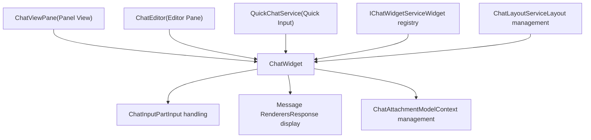
**Diagram: Chat Widget Component Structure**

The widget architecture separates hosting concerns from core functionality, allowing the same chat widget to be used in multiple contexts.

Sources: [src/vs/workbench/contrib/chat/browser/chat.ts1-300](https://github.com/microsoft/vscode/blob/1be3088d/src/vs/workbench/contrib/chat/browser/chat.ts#L1-L300) [src/vs/workbench/contrib/chat/browser/widget/chatWidget.ts1-200](https://github.com/microsoft/vscode/blob/1be3088d/src/vs/workbench/contrib/chat/browser/widget/chatWidget.ts#L1-L200)

## IChatWidget Interface

The `IChatWidget` interface defines the contract for all chat widget implementations. Key responsibilities include:

| Capability | Description |
| --- | --- |
| **Input Management** | Provides access to `ChatInputPart` for text input and mode selection |
| **View Model** | Exposes `IChatViewModel` for accessing chat session state |
| **Attachments** | Manages `ChatAttachmentModel` for context items |
| **Actions** | Methods like `acceptInput()`, `setInput()`, `focusInput()` |
| **Events** | `onDidChangeViewModel`, `onDidAcceptInput`, `onDidSubmitAgent` |

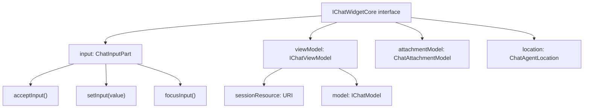
**Diagram: IChatWidget Interface Structure**

Sources: [src/vs/workbench/contrib/chat/browser/chat.ts93-213](https://github.com/microsoft/vscode/blob/1be3088d/src/vs/workbench/contrib/chat/browser/chat.ts#L93-L213)

## ChatWidget Implementation

The `ChatWidget` class is the main implementation of `IChatWidget`. It orchestrates several sub-components and manages the complete lifecycle of a chat session.

### Widget Initialization

The widget is constructed with:

-   **Location**: `ChatAgentLocation` (Panel, Editor, Terminal, Notebook, etc.)
-   **View Model**: `IChatViewModel` representing the chat session
-   **Container**: DOM element for rendering
-   **Services**: Dependency injection of required services

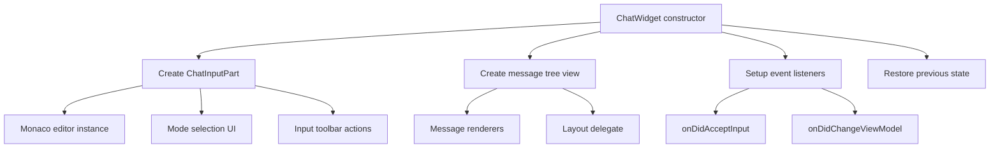
**Diagram: ChatWidget Initialization Flow**

Sources: [src/vs/workbench/contrib/chat/browser/widget/chatWidget.ts100-500](https://github.com/microsoft/vscode/blob/1be3088d/src/vs/workbench/contrib/chat/browser/widget/chatWidget.ts#L100-L500)

### Key Widget Properties

The `ChatWidget` class maintains several critical properties:

-   `input`: Instance of `ChatInputPart` for user input
-   `viewModel`: The `IChatViewModel` representing current session
-   `attachmentModel`: `ChatAttachmentModel` for managing context
-   `location`: The `ChatAgentLocation` where widget is displayed
-   `parsedInput`: Cached `IParsedChatRequest` from current input

Sources: [src/vs/workbench/contrib/chat/browser/widget/chatWidget.ts150-300](https://github.com/microsoft/vscode/blob/1be3088d/src/vs/workbench/contrib/chat/browser/widget/chatWidget.ts#L150-L300)

## Chat Input Handling

The `ChatInputPart` class manages all aspects of user input, including text entry, mode selection, and attachment management.

### Input Part Structure

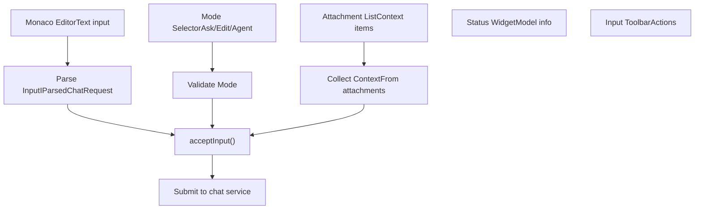
**Diagram: Input Processing Pipeline**

Sources: [src/vs/workbench/contrib/chat/browser/widget/input/chatInputPart.ts1-400](https://github.com/microsoft/vscode/blob/1be3088d/src/vs/workbench/contrib/chat/browser/widget/input/chatInputPart.ts#L1-L400)

### Input Acceptance Flow

When the user submits input (via Enter or submit button):

1.  **Parse Input**: Convert text to `IParsedChatRequest` with variables and commands
2.  **Validate**: Check current mode is valid, agent exists, etc.
3.  **Collect Context**: Gather all attached context items (files, selections, tools)
4.  **Create Request**: Build `IChatSendRequestOptions` with all data
5.  **Submit**: Call `IChatService.sendRequest()` to process

> **[Mermaid sequence]**
> *(图表结构无法解析)*

**Diagram: Input Submission Sequence**

Sources: [src/vs/workbench/contrib/chat/browser/widget/chatWidget.ts600-800](https://github.com/microsoft/vscode/blob/1be3088d/src/vs/workbench/contrib/chat/browser/widget/chatWidget.ts#L600-L800) [src/vs/workbench/contrib/chat/browser/actions/chatExecuteActions.ts50-200](https://github.com/microsoft/vscode/blob/1be3088d/src/vs/workbench/contrib/chat/browser/actions/chatExecuteActions.ts#L50-L200)

## Message Rendering

Chat responses are rendered using a tree-based UI with custom renderers for different content types.

### Response Content Types

The chat system supports multiple response part types:

| Part Type | Description | Renderer |
| --- | --- | --- |
| `IChatMarkdownContent` | Markdown text with syntax highlighting | `ChatMarkdownContentPart` |
| `IChatResponseCodeblockUriPart` | Code blocks with file references | `ChatCodeBlockPart` |
| `IChatCommandButton` | Actionable command buttons | `ChatCommandButtonContentPart` |
| `IChatTextEdit` | Text edits/diffs | `ChatTextEditContentPart` |
| `IChatProgressMessage` | Progress indicators | `ChatProgressContentPart` |
| `IChatContentInlineReference` | Inline file/symbol references | Rendered inline |
| `IChatTaskDto` | Task status (running/completed) | `ChatTaskContentPart` |
| `IChatToolInvocationSerialized` | Tool invocations | `ChatToolInvocationPart` |

### Rendering Pipeline

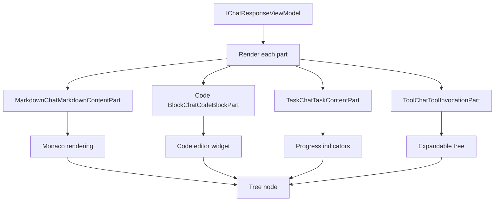
**Diagram: Response Rendering Pipeline**

Sources: [src/vs/workbench/contrib/chat/browser/widget/chatContentParts/](https://github.com/microsoft/vscode/blob/1be3088d/src/vs/workbench/contrib/chat/browser/widget/chatContentParts/)

### Code Block Rendering

Code blocks are rendered with special handling:

1.  **Syntax Highlighting**: Full Monaco editor for code
2.  **Actions**: Copy, insert, apply diff actions
3.  **File References**: Links to files when available via `IChatResponseCodeblockUriPart`
4.  **Diff View**: Side-by-side or inline diff for edits

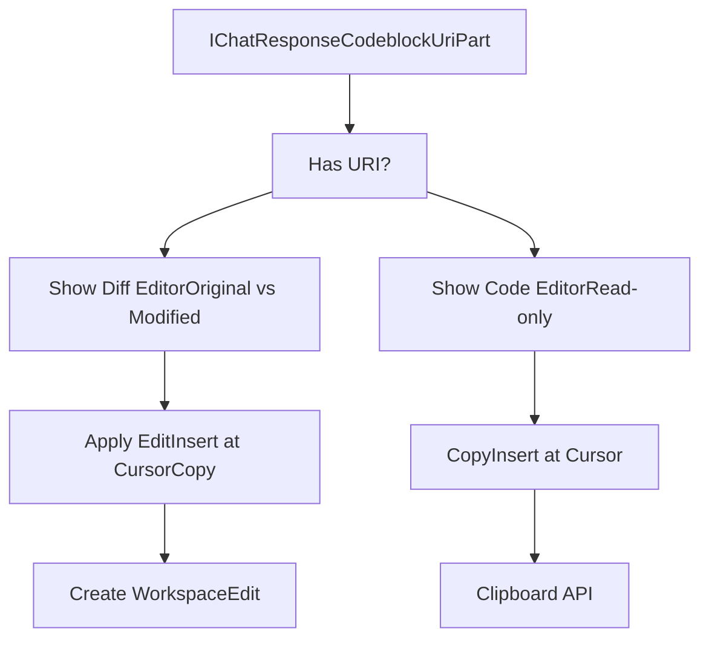
**Diagram: Code Block Rendering Logic**

Sources: [src/vs/workbench/contrib/chat/browser/widget/chatContentParts/codeBlockPart.ts1-500](https://github.com/microsoft/vscode/blob/1be3088d/src/vs/workbench/contrib/chat/browser/widget/chatContentParts/codeBlockPart.ts#L1-L500)

## Widget Service and Management

The `IChatWidgetService` manages all chat widget instances across different hosting contexts.

### Widget Registry

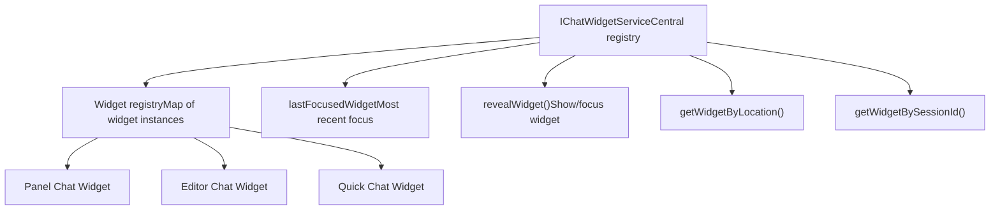
**Diagram: Chat Widget Service Architecture**

The service provides:

-   **Registration**: Widgets register on creation, deregister on disposal
-   **Lookup**: Find widgets by location, session ID, or input URI
-   **Focus Tracking**: Track most recently focused widget
-   **Reveal**: Show and focus widgets programmatically

Sources: [src/vs/workbench/contrib/chat/browser/widget/chatWidgetService.ts1-300](https://github.com/microsoft/vscode/blob/1be3088d/src/vs/workbench/contrib/chat/browser/widget/chatWidgetService.ts#L1-L300)

## Chat Actions

User interactions are implemented as actions registered through VS Code's action system.

### Primary Actions

| Action ID | Description | Keybinding |
| --- | --- | --- |
| `workbench.action.chat.open` | Open chat in panel | Ctrl/Cmd+Alt+I |
| `workbench.action.chat.newChat` | Start new chat session | Ctrl/Cmd+L |
| `workbench.action.chat.acceptInput` | Submit chat input | Enter |
| `workbench.action.quickchat.toggle` | Toggle quick chat | Ctrl/Cmd+Shift+I |

### Action Implementation Pattern

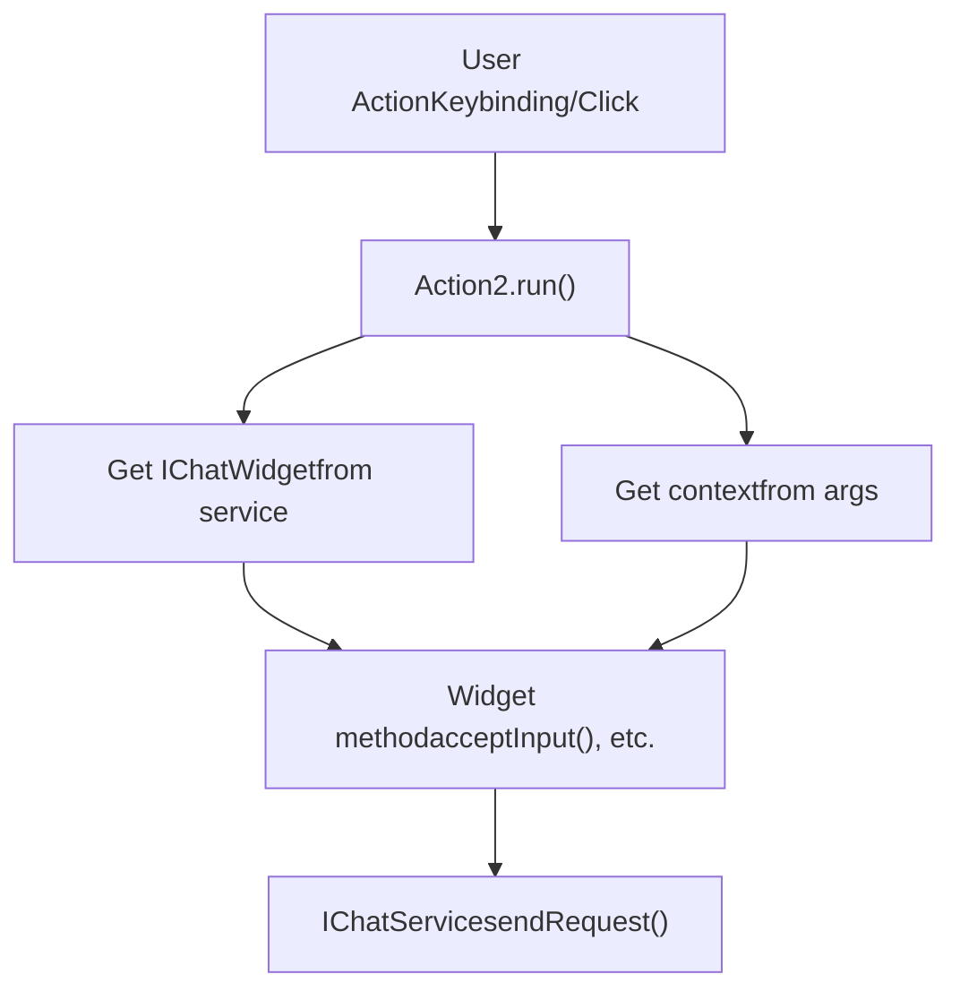
**Diagram: Chat Action Execution Flow**

Sources: [src/vs/workbench/contrib/chat/browser/actions/chatActions.ts163-400](https://github.com/microsoft/vscode/blob/1be3088d/src/vs/workbench/contrib/chat/browser/actions/chatActions.ts#L163-L400) [src/vs/workbench/contrib/chat/browser/actions/chatExecuteActions.ts50-200](https://github.com/microsoft/vscode/blob/1be3088d/src/vs/workbench/contrib/chat/browser/actions/chatExecuteActions.ts#L50-L200)

### Submit Action Details

The `ChatSubmitAction` handles input submission:

> **[Mermaid sequence]**
> *(图表结构无法解析)*

**Diagram: Submit Action with Edit Handling**

When submitting in edit mode, the action checks for pending edits and prompts user before undoing them.

Sources: [src/vs/workbench/contrib/chat/browser/actions/chatExecuteActions.ts50-170](https://github.com/microsoft/vscode/blob/1be3088d/src/vs/workbench/contrib/chat/browser/actions/chatExecuteActions.ts#L50-L170)

## Chat Attachment Model

The `ChatAttachmentModel` manages context items that can be attached to chat requests.

### Attachment Types

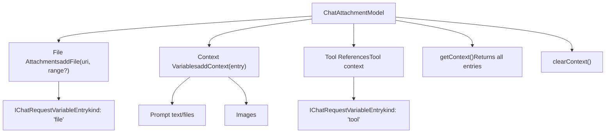
**Diagram: Attachment Model Structure**

### Context Entry Types

Each attachment is represented as an `IChatRequestVariableEntry`:

-   **id**: Unique identifier
-   **name**: Display name
-   **value**: URI, text, or undefined
-   **kind**: Type discriminator (file, tool, prompt, image, etc.)
-   **icon**: Optional ThemeIcon
-   **isDynamic**: Whether it's dynamically resolved

Sources: [src/vs/workbench/contrib/chat/browser/attachments/chatAttachmentModel.ts1-200](https://github.com/microsoft/vscode/blob/1be3088d/src/vs/workbench/contrib/chat/browser/attachments/chatAttachmentModel.ts#L1-L200) [src/vs/workbench/contrib/chat/common/attachments/chatVariableEntries.ts1-300](https://github.com/microsoft/vscode/blob/1be3088d/src/vs/workbench/contrib/chat/common/attachments/chatVariableEntries.ts#L1-L300)

## Widget Hosting Contexts

Chat widgets can be hosted in multiple UI locations, each with slightly different behavior.

### Hosting Context Comparison

| Location | Class | Characteristics |
| --- | --- | --- |
| **Panel** | `ChatViewPane` | Primary chat location, persistent |
| **Editor** | `ChatEditor` | Editor pane with chat session |
| **Quick Chat** | `QuickChatService` | Quick input overlay |
| **Terminal** | Terminal integration | Inline terminal chat |
| **Notebook** | Notebook integration | Notebook cell chat |

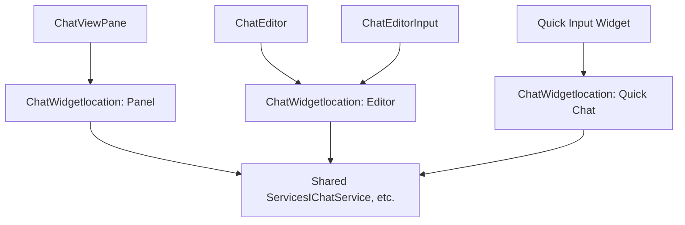
**Diagram: Widget Hosting Architecture**

Sources: [src/vs/workbench/contrib/chat/browser/widgetHosts/](https://github.com/microsoft/vscode/blob/1be3088d/src/vs/workbench/contrib/chat/browser/widgetHosts/)

### Panel Chat (ChatViewPane)

The primary chat interface, located in the panel area:

-   **Persistent**: Session survives view hide/show
-   **Full Features**: All chat capabilities available
-   **Session List**: Shows previous sessions in sidebar
-   **Toolbar**: Full action toolbar with mode switcher

Sources: [src/vs/workbench/contrib/chat/browser/widgetHosts/panel/chatViewPane.ts1-300](https://github.com/microsoft/vscode/blob/1be3088d/src/vs/workbench/contrib/chat/browser/widgetHosts/panel/chatViewPane.ts#L1-L300)

### Editor Chat (ChatEditor)

Chat sessions opened as editor panes:

-   **Multi-Instance**: Multiple chat editors can be open
-   **Editor Integration**: Uses standard editor input/pane system
-   **Session Binding**: Each editor bound to specific session URI
-   **Tab Management**: Appears in editor tabs like files

Sources: [src/vs/workbench/contrib/chat/browser/widgetHosts/editor/chatEditor.ts1-200](https://github.com/microsoft/vscode/blob/1be3088d/src/vs/workbench/contrib/chat/browser/widgetHosts/editor/chatEditor.ts#L1-L200) [src/vs/workbench/contrib/chat/browser/widgetHosts/editor/chatEditorInput.ts1-300](https://github.com/microsoft/vscode/blob/1be3088d/src/vs/workbench/contrib/chat/browser/widgetHosts/editor/chatEditorInput.ts#L1-L300)

### Quick Chat

Overlay chat for quick interactions:

-   **Modal**: Appears above other content
-   **Keyboard-First**: Optimized for keyboard navigation
-   **Quick Dismiss**: Easily dismissed with Escape
-   **Reduced UI**: Minimal chrome for speed

Sources: [src/vs/workbench/contrib/chat/browser/widgetHosts/chatQuick.ts1-400](https://github.com/microsoft/vscode/blob/1be3088d/src/vs/workbench/contrib/chat/browser/widgetHosts/chatQuick.ts#L1-L400)

## Chat Layout Service

The `IChatLayoutService` manages layout state and preferences for chat widgets.

### Layout State

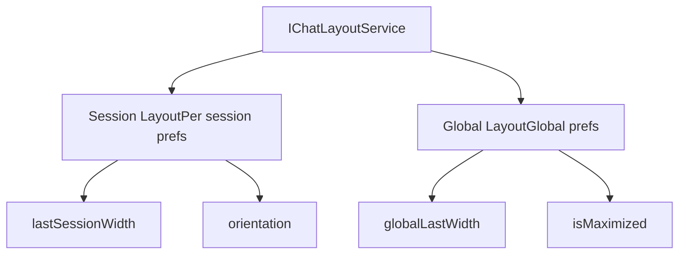
**Diagram: Chat Layout Service State**

The service maintains:

-   **Session-specific**: Width, orientation per chat session
-   **Global**: Default width, maximization state
-   **Events**: Notify widgets of layout changes

Sources: [src/vs/workbench/contrib/chat/browser/widget/chatLayoutService.ts1-200](https://github.com/microsoft/vscode/blob/1be3088d/src/vs/workbench/contrib/chat/browser/widget/chatLayoutService.ts#L1-L200)

## Widget Lifecycle

Understanding the widget lifecycle is important for proper resource management.

### Lifecycle Stages

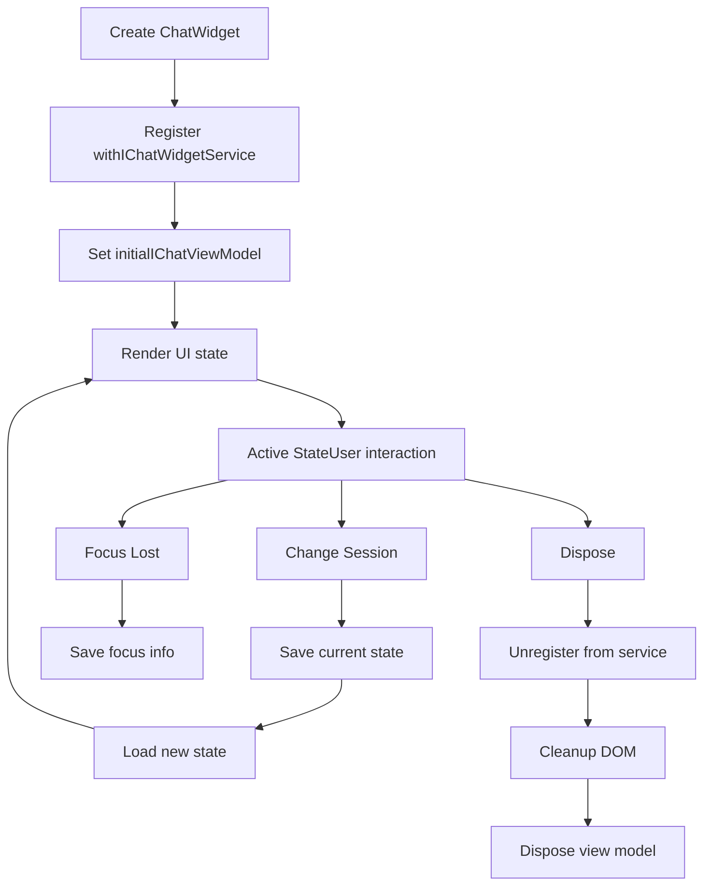
**Diagram: Chat Widget Lifecycle**

Key lifecycle events:

-   **onDidChangeViewModel**: Fired when session changes
-   **onDidAcceptInput**: Fired when user submits
-   **onDidSubmitAgent**: Fired when agent command submitted
-   **onDidHide/onDidShow**: Visibility changes

Sources: [src/vs/workbench/contrib/chat/browser/widget/chatWidget.ts300-600](https://github.com/microsoft/vscode/blob/1be3088d/src/vs/workbench/contrib/chat/browser/widget/chatWidget.ts#L300-L600)

## Extension API Integration

Chat widgets integrate with the extension API through the proxy pattern.

### API Surface

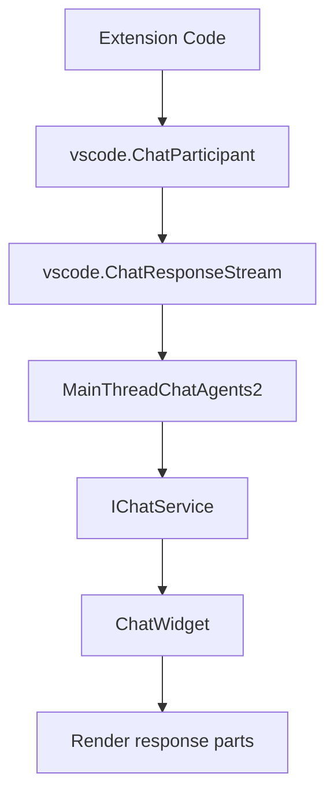
**Diagram: Extension API to UI Flow**

When an extension provides chat responses:

1.  Extension returns `ChatResponseStream` parts
2.  Parts sent via RPC to main thread
3.  `MainThreadChatAgents2` converts to internal format
4.  `IChatService` processes and stores
5.  `ChatWidget` renders in UI

Sources: [src/vs/workbench/api/common/extHostChatAgents2.ts1-200](https://github.com/microsoft/vscode/blob/1be3088d/src/vs/workbench/api/common/extHostChatAgents2.ts#L1-L200) [src/vs/workbench/api/browser/mainThreadChatAgents2.ts1-300](https://github.com/microsoft/vscode/blob/1be3088d/src/vs/workbench/api/browser/mainThreadChatAgents2.ts#L1-L300)

## Key Interfaces Summary

### IChatWidget

Primary interface for chat widget implementations. Provides input handling, view model access, and action methods.

Sources: [src/vs/workbench/contrib/chat/browser/chat.ts93-213](https://github.com/microsoft/vscode/blob/1be3088d/src/vs/workbench/contrib/chat/browser/chat.ts#L93-L213)

### IChatWidgetService

Service for managing chat widget instances, focus tracking, and widget lookup.

Sources: [src/vs/workbench/contrib/chat/browser/chat.ts303-337](https://github.com/microsoft/vscode/blob/1be3088d/src/vs/workbench/contrib/chat/browser/chat.ts#L303-L337)

### ChatInputPart

Manages user input including text entry, mode selection, and attachment UI.

Sources: [src/vs/workbench/contrib/chat/browser/widget/input/chatInputPart.ts1-100](https://github.com/microsoft/vscode/blob/1be3088d/src/vs/workbench/contrib/chat/browser/widget/input/chatInputPart.ts#L1-L100)

### ChatAttachmentModel

Manages context items (files, tools, variables) attached to chat requests.

Sources: [src/vs/workbench/contrib/chat/browser/attachments/chatAttachmentModel.ts1-100](https://github.com/microsoft/vscode/blob/1be3088d/src/vs/workbench/contrib/chat/browser/attachments/chatAttachmentModel.ts#L1-L100)

### IChatLayoutService

Manages layout state and preferences for chat widgets.

Sources: [src/vs/workbench/contrib/chat/browser/widget/chatLayoutService.ts1-100](https://github.com/microsoft/vscode/blob/1be3088d/src/vs/workbench/contrib/chat/browser/widget/chatLayoutService.ts#L1-L100)
