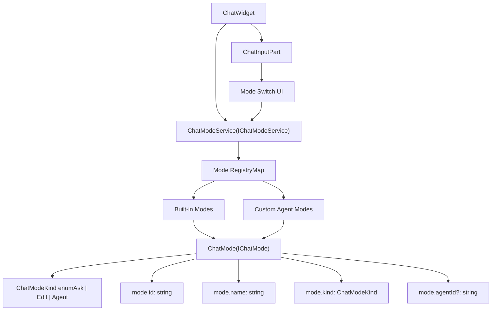
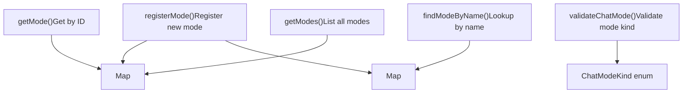
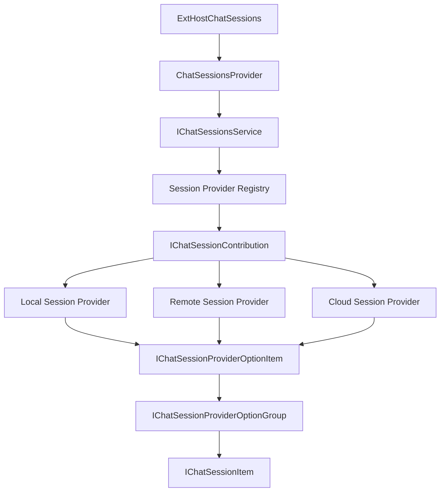
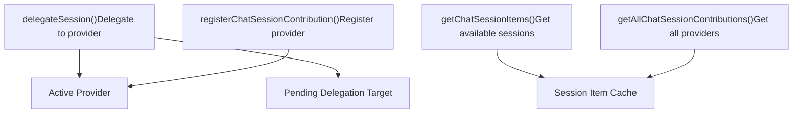
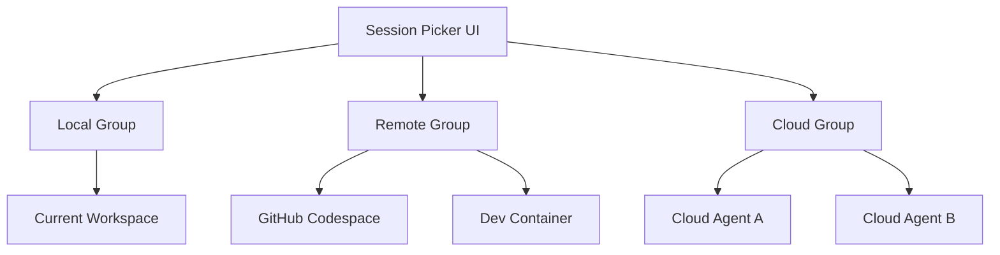
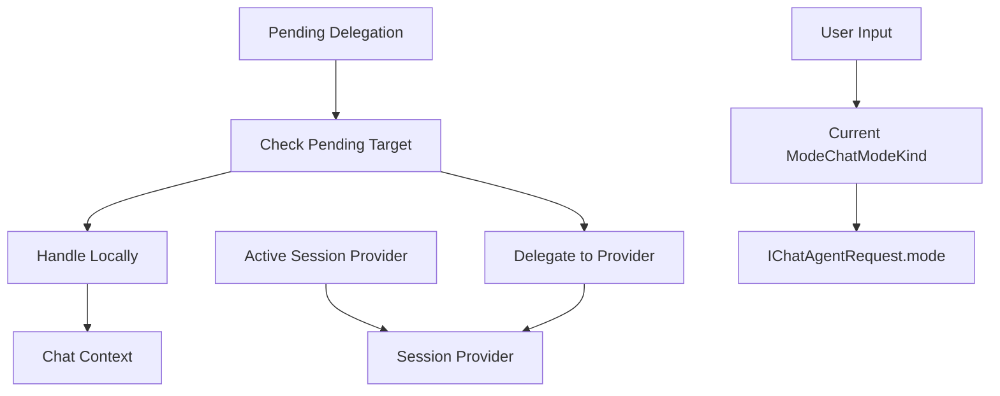
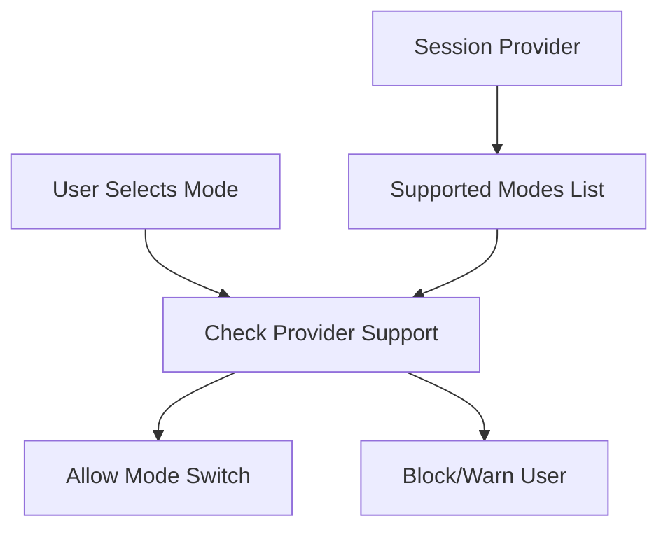
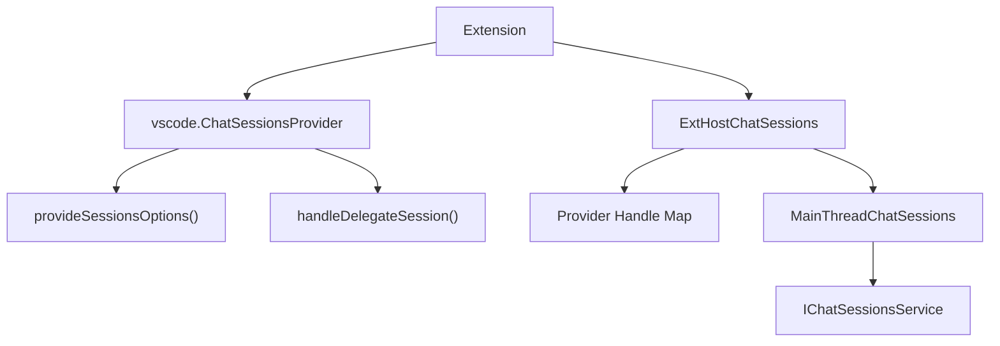
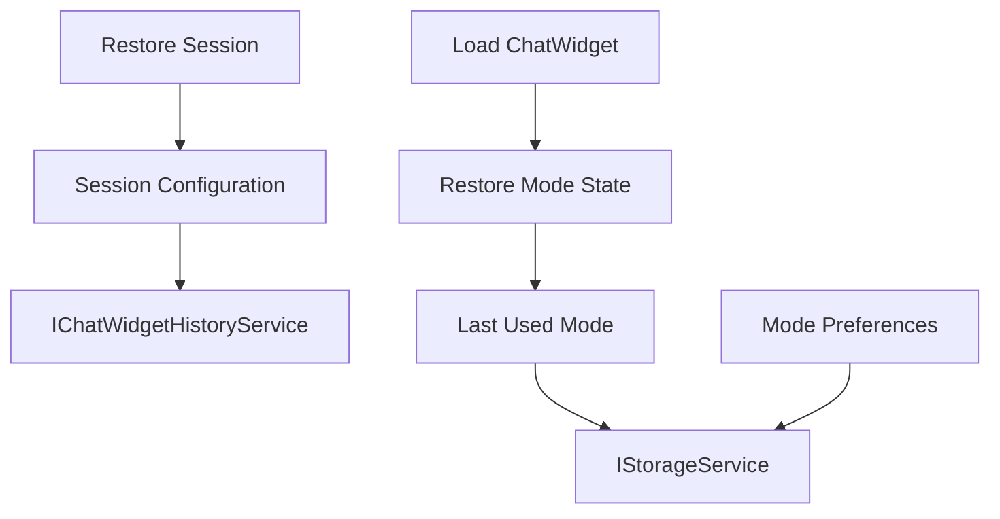

# Chat Modes and Sessions

Relevant source files

-   [extensions/vscode-api-tests/package.json](https://github.com/microsoft/vscode/blob/1be3088d/extensions/vscode-api-tests/package.json)
-   [extensions/vscode-api-tests/src/singlefolder-tests/chat.test.ts](https://github.com/microsoft/vscode/blob/1be3088d/extensions/vscode-api-tests/src/singlefolder-tests/chat.test.ts)
-   [src/vs/editor/common/languages.ts](https://github.com/microsoft/vscode/blob/1be3088d/src/vs/editor/common/languages.ts)
-   [src/vs/platform/extensions/common/extensionsApiProposals.ts](https://github.com/microsoft/vscode/blob/1be3088d/src/vs/platform/extensions/common/extensionsApiProposals.ts)
-   [src/vs/workbench/api/browser/mainThreadChatAgents2.ts](https://github.com/microsoft/vscode/blob/1be3088d/src/vs/workbench/api/browser/mainThreadChatAgents2.ts)
-   [src/vs/workbench/api/browser/mainThreadChatStatus.ts](https://github.com/microsoft/vscode/blob/1be3088d/src/vs/workbench/api/browser/mainThreadChatStatus.ts)
-   [src/vs/workbench/api/browser/mainThreadLanguageFeatures.ts](https://github.com/microsoft/vscode/blob/1be3088d/src/vs/workbench/api/browser/mainThreadLanguageFeatures.ts)
-   [src/vs/workbench/api/common/extHost.api.impl.ts](https://github.com/microsoft/vscode/blob/1be3088d/src/vs/workbench/api/common/extHost.api.impl.ts)
-   [src/vs/workbench/api/common/extHost.protocol.ts](https://github.com/microsoft/vscode/blob/1be3088d/src/vs/workbench/api/common/extHost.protocol.ts)
-   [src/vs/workbench/api/common/extHostChatAgents2.ts](https://github.com/microsoft/vscode/blob/1be3088d/src/vs/workbench/api/common/extHostChatAgents2.ts)
-   [src/vs/workbench/api/common/extHostChatStatus.ts](https://github.com/microsoft/vscode/blob/1be3088d/src/vs/workbench/api/common/extHostChatStatus.ts)
-   [src/vs/workbench/api/common/extHostLanguageFeatures.ts](https://github.com/microsoft/vscode/blob/1be3088d/src/vs/workbench/api/common/extHostLanguageFeatures.ts)
-   [src/vs/workbench/api/common/extHostTypeConverters.ts](https://github.com/microsoft/vscode/blob/1be3088d/src/vs/workbench/api/common/extHostTypeConverters.ts)
-   [src/vs/workbench/api/common/extHostTypes.ts](https://github.com/microsoft/vscode/blob/1be3088d/src/vs/workbench/api/common/extHostTypes.ts)
-   [src/vs/workbench/contrib/chat/browser/actions/chatActions.ts](https://github.com/microsoft/vscode/blob/1be3088d/src/vs/workbench/contrib/chat/browser/actions/chatActions.ts)
-   [src/vs/workbench/contrib/chat/browser/actions/chatExecuteActions.ts](https://github.com/microsoft/vscode/blob/1be3088d/src/vs/workbench/contrib/chat/browser/actions/chatExecuteActions.ts)
-   [src/vs/workbench/contrib/chat/browser/actions/chatGettingStarted.ts](https://github.com/microsoft/vscode/blob/1be3088d/src/vs/workbench/contrib/chat/browser/actions/chatGettingStarted.ts)
-   [src/vs/workbench/contrib/chat/browser/chat.contribution.ts](https://github.com/microsoft/vscode/blob/1be3088d/src/vs/workbench/contrib/chat/browser/chat.contribution.ts)
-   [src/vs/workbench/contrib/chat/browser/chat.ts](https://github.com/microsoft/vscode/blob/1be3088d/src/vs/workbench/contrib/chat/browser/chat.ts)
-   [src/vs/workbench/contrib/chat/common/constants.ts](https://github.com/microsoft/vscode/blob/1be3088d/src/vs/workbench/contrib/chat/common/constants.ts)
-   [src/vs/workbench/contrib/chat/test/common/voiceChatService.test.ts](https://github.com/microsoft/vscode/blob/1be3088d/src/vs/workbench/contrib/chat/test/common/voiceChatService.test.ts)
-   [src/vscode-dts/vscode.d.ts](https://github.com/microsoft/vscode/blob/1be3088d/src/vscode-dts/vscode.d.ts)
-   [src/vscode-dts/vscode.proposed.chatParticipantAdditions.d.ts](https://github.com/microsoft/vscode/blob/1be3088d/src/vscode-dts/vscode.proposed.chatParticipantAdditions.d.ts)
-   [src/vscode-dts/vscode.proposed.chatStatusItem.d.ts](https://github.com/microsoft/vscode/blob/1be3088d/src/vscode-dts/vscode.proposed.chatStatusItem.d.ts)
-   [src/vscode-dts/vscode.proposed.defaultChatParticipant.d.ts](https://github.com/microsoft/vscode/blob/1be3088d/src/vscode-dts/vscode.proposed.defaultChatParticipant.d.ts)
-   [src/vscode-dts/vscode.proposed.inlineCompletionsAdditions.d.ts](https://github.com/microsoft/vscode/blob/1be3088d/src/vscode-dts/vscode.proposed.inlineCompletionsAdditions.d.ts)

## Purpose and Scope

This document describes the chat modes and sessions system in VS Code, which provides structured interaction patterns for AI-powered conversations. Chat modes define how users interact with the system (Ask, Edit, or Agent modes), while chat sessions enable delegation of work to different execution environments (local, remote, or cloud-based). For information about chat agents and participants, see [8.2](/microsoft/vscode/8.2-chat-agents-and-participants). For the chat service architecture, see [8.1](/microsoft/vscode/8.1-chat-system-architecture).

---

## Chat Modes Overview

Chat modes represent different interaction patterns available to users when working with chat functionality. The system defines three core mode types through the `ChatModeKind` enum.

### Mode Types

| Mode Kind | Value | Purpose |
| --- | --- | --- |
| `Ask` | `'ask'` | Standard question-answering mode |
| `Edit` | `'edit'` | Code editing and modification mode |
| `Agent` | `'agent'` | Custom agent-driven interactions |

**Sources:** [src/vs/workbench/contrib/chat/common/constants.ts51-55](https://github.com/microsoft/vscode/blob/1be3088d/src/vs/workbench/contrib/chat/common/constants.ts#L51-L55)

### Mode Architecture


**Sources:** [src/vs/workbench/contrib/chat/common/chatModes.ts](https://github.com/microsoft/vscode/blob/1be3088d/src/vs/workbench/contrib/chat/common/chatModes.ts) [src/vs/workbench/contrib/chat/common/constants.ts51-67](https://github.com/microsoft/vscode/blob/1be3088d/src/vs/workbench/contrib/chat/common/constants.ts#L51-L67)

### IChatMode Interface

The `IChatMode` interface defines the structure of a chat mode:

```
interface IChatMode {
    id: string;                    // Unique mode identifier
    name: string;                  // Display name
    kind: ChatModeKind;           // Mode type (ask/edit/agent)
    agentId?: string;             // Associated agent for agent mode
    // Additional mode-specific metadata
}
```
**Sources:** [src/vs/workbench/contrib/chat/common/chatModes.ts](https://github.com/microsoft/vscode/blob/1be3088d/src/vs/workbench/contrib/chat/common/chatModes.ts)

### ChatModeService

The `ChatModeService` (`IChatModeService`) manages mode registration, lookup, and lifecycle:


**Sources:** [src/vs/workbench/contrib/chat/common/chatModes.ts](https://github.com/microsoft/vscode/blob/1be3088d/src/vs/workbench/contrib/chat/common/chatModes.ts) [src/vs/workbench/contrib/chat/common/constants.ts57-67](https://github.com/microsoft/vscode/blob/1be3088d/src/vs/workbench/contrib/chat/common/constants.ts#L57-L67)

### Mode Switching

Mode switching occurs through the `OpenChatGlobalAction` and related action handlers:

> **[Mermaid sequence]**
> *(图表结构无法解析)*

**Sources:** [src/vs/workbench/contrib/chat/browser/actions/chatActions.ts163-207](https://github.com/microsoft/vscode/blob/1be3088d/src/vs/workbench/contrib/chat/browser/actions/chatActions.ts#L163-L207) [src/vs/workbench/contrib/chat/browser/actions/chatExecuteActions.ts50-166](https://github.com/microsoft/vscode/blob/1be3088d/src/vs/workbench/contrib/chat/browser/actions/chatExecuteActions.ts#L50-L166)

---

## Chat Sessions

Chat sessions enable delegation of chat requests to different execution environments. This system supports local execution, remote workspaces, and cloud-based agents.

### Session Provider Types

The system uses the `AgentSessionProviders` enum to distinguish provider types:

| Provider Type | Description |
| --- | --- |
| `Local` | Local execution in the current workspace |
| `Remote` | Remote workspace or Codespace execution |
| `Cloud` | Cloud-based agent execution |

**Sources:** [src/vs/workbench/contrib/chat/browser/agentSessions/agentSessions.ts](https://github.com/microsoft/vscode/blob/1be3088d/src/vs/workbench/contrib/chat/browser/agentSessions/agentSessions.ts)

### Session Architecture


**Sources:** [src/vs/workbench/contrib/chat/common/chatSessionsService.ts](https://github.com/microsoft/vscode/blob/1be3088d/src/vs/workbench/contrib/chat/common/chatSessionsService.ts) [src/vs/workbench/api/common/extHostChatSessions.ts](https://github.com/microsoft/vscode/blob/1be3088d/src/vs/workbench/api/common/extHostChatSessions.ts)

### IChatSessionsService Interface


**Sources:** [src/vs/workbench/contrib/chat/common/chatSessionsService.ts](https://github.com/microsoft/vscode/blob/1be3088d/src/vs/workbench/contrib/chat/common/chatSessionsService.ts)

### Session Delegation Flow

Session delegation allows transferring a chat request from one execution environment to another:

> **[Mermaid sequence]**
> *(图表结构无法解析)*

**Sources:** [src/vs/workbench/contrib/chat/browser/actions/chatExecuteActions.ts50-166](https://github.com/microsoft/vscode/blob/1be3088d/src/vs/workbench/contrib/chat/browser/actions/chatExecuteActions.ts#L50-L166) [src/vs/workbench/contrib/chat/browser/widget/input/chatInputPart.ts](https://github.com/microsoft/vscode/blob/1be3088d/src/vs/workbench/contrib/chat/browser/widget/input/chatInputPart.ts)

### IChatSessionProviderOptionItem Structure

Session options define available execution targets:

| Property | Type | Description |
| --- | --- | --- |
| `id` | `string` | Unique identifier |
| `label` | `string` | Display label |
| `detail` | `string` | Additional description |
| `icon` | `ThemeIcon` | Visual icon |
| `provider` | `AgentSessionProviders` | Provider type |
| `enabled` | `boolean` | Whether selectable |

**Sources:** [src/vs/workbench/api/common/extHost.protocol.ts1073-1084](https://github.com/microsoft/vscode/blob/1be3088d/src/vs/workbench/api/common/extHost.protocol.ts#L1073-L1084)

### Session Groups and Organization

Session options can be organized into groups for better UX:


**Sources:** [src/vs/workbench/api/common/extHost.protocol.ts1066-1084](https://github.com/microsoft/vscode/blob/1be3088d/src/vs/workbench/api/common/extHost.protocol.ts#L1066-L1084) [src/vs/workbench/contrib/chat/common/chatSessionsService.ts](https://github.com/microsoft/vscode/blob/1be3088d/src/vs/workbench/contrib/chat/common/chatSessionsService.ts)

---

## Mode and Session Integration

Modes and sessions work together to provide flexible chat interactions. The integration occurs at the request submission and delegation points.

### Request Context with Mode and Session


**Sources:** [src/vs/workbench/contrib/chat/browser/actions/chatExecuteActions.ts50-166](https://github.com/microsoft/vscode/blob/1be3088d/src/vs/workbench/contrib/chat/browser/actions/chatExecuteActions.ts#L50-L166) [src/vs/workbench/contrib/chat/common/participants/chatAgents.ts](https://github.com/microsoft/vscode/blob/1be3088d/src/vs/workbench/contrib/chat/common/participants/chatAgents.ts)

### Mode Validation with Sessions

Different session providers may support different modes:


**Sources:** [src/vscode-dts/vscode.d.ts19180-19234](https://github.com/microsoft/vscode/blob/1be3088d/src/vscode-dts/vscode.d.ts#L19180-L19234) [extensions/vscode-api-tests/package.json74-90](https://github.com/microsoft/vscode/blob/1be3088d/extensions/vscode-api-tests/package.json#L74-L90)

### Configuration: chat.viewSessions.enabled

The `ChatConfiguration.ChatViewSessionsEnabled` setting controls session visibility:

```
chat.viewSessions.enabled: boolean
  - true: Show sessions in UI (default)
  - false: Hide session selection

Related settings:
  - chat.viewSessions.showPendingOnly
  - chat.viewSessions.orientation
```
**Sources:** [src/vs/workbench/contrib/chat/common/constants.ts36-39](https://github.com/microsoft/vscode/blob/1be3088d/src/vs/workbench/contrib/chat/common/constants.ts#L36-L39) [src/vs/workbench/contrib/chat/browser/chat.contribution.ts410-429](https://github.com/microsoft/vscode/blob/1be3088d/src/vs/workbench/contrib/chat/browser/chat.contribution.ts#L410-L429)

---

## Extension API

Extensions can interact with modes and sessions through the proposed API surface.

### Chat Participant Mode Declaration

Chat participants declare which modes they support in their contribution point:

```
{
  "contributes": {
    "chatParticipants": [{
      "id": "example.participant",
      "name": "Example",
      "modes": ["agent", "ask", "edit"]
    }]
  }
}
```
**Sources:** [extensions/vscode-api-tests/package.json73-96](https://github.com/microsoft/vscode/blob/1be3088d/extensions/vscode-api-tests/package.json#L73-L96)

### ChatSessionsProvider API

Extensions can register session providers using the `chatSessionsProvider` proposed API:


**Sources:** [src/vs/workbench/api/common/extHostChatSessions.ts1-133](https://github.com/microsoft/vscode/blob/1be3088d/src/vs/workbench/api/common/extHostChatSessions.ts#L1-L133) [src/vscode-dts/vscode.proposed.chatSessionsProvider.d.ts](https://github.com/microsoft/vscode/blob/1be3088d/src/vscode-dts/vscode.proposed.chatSessionsProvider.d.ts)

### ExtHostChatSessions Implementation

The `ExtHostChatSessions` class bridges the extension API to the main thread:

| Method | Purpose |
| --- | --- |
| `registerChatSessionsProvider()` | Register a session provider |
| `$handleSessionDelegation()` | Handle delegation from main thread |
| `$provideSessionsOptions()` | Provide available session options |

**Sources:** [src/vs/workbench/api/common/extHostChatSessions.ts29-133](https://github.com/microsoft/vscode/blob/1be3088d/src/vs/workbench/api/common/extHostChatSessions.ts#L29-L133)

### Session Delegation Handler

Extensions implement session delegation through the provider interface:

```
interface ChatSessionsProvider {
  provideSessionsOptions(
    context: ChatContext,
    token: CancellationToken
  ): ProviderResult<ChatSessionProviderOptionGroup[]>;

  handleDelegateSession?(
    session: ChatSession,
    context: ChatContext,
    token: CancellationToken
  ): ProviderResult<void>;
}
```
**Sources:** [src/vscode-dts/vscode.proposed.chatSessionsProvider.d.ts1-142](https://github.com/microsoft/vscode/blob/1be3088d/src/vscode-dts/vscode.proposed.chatSessionsProvider.d.ts#L1-L142)

### Chat Request with Mode Context

When a chat request is made, the current mode is included in the request structure:

> **[Mermaid sequence]**
> *(图表结构无法解析)*

**Sources:** [src/vs/workbench/api/common/extHostChatAgents2.ts100-556](https://github.com/microsoft/vscode/blob/1be3088d/src/vs/workbench/api/common/extHostChatAgents2.ts#L100-L556) [src/vs/workbench/contrib/chat/common/participants/chatAgents.ts](https://github.com/microsoft/vscode/blob/1be3088d/src/vs/workbench/contrib/chat/common/participants/chatAgents.ts)

---

## Mode and Session State Management

### State Tracking

The system tracks several pieces of state related to modes and sessions:

| State | Location | Description |
| --- | --- | --- |
| Current Mode | `ChatWidget.input.currentModeKind` | Active mode for widget |
| Active Provider | `IChatSessionsService` | Currently active session provider |
| Pending Target | `ChatInputPart.pendingDelegationTarget` | Target for next submission |
| Session History | `ChatModel` | Previous session items |

**Sources:** [src/vs/workbench/contrib/chat/browser/widget/chatWidget.ts](https://github.com/microsoft/vscode/blob/1be3088d/src/vs/workbench/contrib/chat/browser/widget/chatWidget.ts) [src/vs/workbench/contrib/chat/browser/widget/input/chatInputPart.ts](https://github.com/microsoft/vscode/blob/1be3088d/src/vs/workbench/contrib/chat/browser/widget/input/chatInputPart.ts)

### Mode Persistence

Mode state persists across chat sessions:


**Sources:** [src/vs/workbench/contrib/chat/common/widget/chatWidgetHistoryService.ts](https://github.com/microsoft/vscode/blob/1be3088d/src/vs/workbench/contrib/chat/common/widget/chatWidgetHistoryService.ts) [src/vs/workbench/contrib/chat/browser/chat.contribution.ts42](https://github.com/microsoft/vscode/blob/1be3088d/src/vs/workbench/contrib/chat/browser/chat.contribution.ts#L42-L42)

### Session Lifecycle Events

> **[Mermaid sequence]**
> *(图表结构无法解析)*

**Sources:** [src/vs/workbench/contrib/chat/common/chatSessionsService.ts](https://github.com/microsoft/vscode/blob/1be3088d/src/vs/workbench/contrib/chat/common/chatSessionsService.ts) [src/vs/workbench/api/common/extHostChatSessions.ts](https://github.com/microsoft/vscode/blob/1be3088d/src/vs/workbench/api/common/extHostChatSessions.ts)

---

This document has covered the chat modes and sessions architecture in VS Code, including the mode types (Ask, Edit, Agent), session providers (Local, Remote, Cloud), delegation mechanisms, and the extension API surface. The system provides a flexible framework for different interaction patterns and execution environments while maintaining a consistent user experience.
