# Chat Extension API

Relevant source files

-   [extensions/vscode-api-tests/package.json](https://github.com/microsoft/vscode/blob/1be3088d/extensions/vscode-api-tests/package.json)
-   [extensions/vscode-api-tests/src/singlefolder-tests/chat.test.ts](https://github.com/microsoft/vscode/blob/1be3088d/extensions/vscode-api-tests/src/singlefolder-tests/chat.test.ts)
-   [src/vs/editor/common/languages.ts](https://github.com/microsoft/vscode/blob/1be3088d/src/vs/editor/common/languages.ts)
-   [src/vs/platform/extensions/common/extensionsApiProposals.ts](https://github.com/microsoft/vscode/blob/1be3088d/src/vs/platform/extensions/common/extensionsApiProposals.ts)
-   [src/vs/workbench/api/browser/mainThreadChatAgents2.ts](https://github.com/microsoft/vscode/blob/1be3088d/src/vs/workbench/api/browser/mainThreadChatAgents2.ts)
-   [src/vs/workbench/api/browser/mainThreadChatStatus.ts](https://github.com/microsoft/vscode/blob/1be3088d/src/vs/workbench/api/browser/mainThreadChatStatus.ts)
-   [src/vs/workbench/api/browser/mainThreadLanguageFeatures.ts](https://github.com/microsoft/vscode/blob/1be3088d/src/vs/workbench/api/browser/mainThreadLanguageFeatures.ts)
-   [src/vs/workbench/api/common/extHost.api.impl.ts](https://github.com/microsoft/vscode/blob/1be3088d/src/vs/workbench/api/common/extHost.api.impl.ts)
-   [src/vs/workbench/api/common/extHost.protocol.ts](https://github.com/microsoft/vscode/blob/1be3088d/src/vs/workbench/api/common/extHost.protocol.ts)
-   [src/vs/workbench/api/common/extHostChatAgents2.ts](https://github.com/microsoft/vscode/blob/1be3088d/src/vs/workbench/api/common/extHostChatAgents2.ts)
-   [src/vs/workbench/api/common/extHostChatStatus.ts](https://github.com/microsoft/vscode/blob/1be3088d/src/vs/workbench/api/common/extHostChatStatus.ts)
-   [src/vs/workbench/api/common/extHostLanguageFeatures.ts](https://github.com/microsoft/vscode/blob/1be3088d/src/vs/workbench/api/common/extHostLanguageFeatures.ts)
-   [src/vs/workbench/api/common/extHostTypeConverters.ts](https://github.com/microsoft/vscode/blob/1be3088d/src/vs/workbench/api/common/extHostTypeConverters.ts)
-   [src/vs/workbench/api/common/extHostTypes.ts](https://github.com/microsoft/vscode/blob/1be3088d/src/vs/workbench/api/common/extHostTypes.ts)
-   [src/vs/workbench/contrib/chat/browser/actions/chatActions.ts](https://github.com/microsoft/vscode/blob/1be3088d/src/vs/workbench/contrib/chat/browser/actions/chatActions.ts)
-   [src/vs/workbench/contrib/chat/browser/actions/chatExecuteActions.ts](https://github.com/microsoft/vscode/blob/1be3088d/src/vs/workbench/contrib/chat/browser/actions/chatExecuteActions.ts)
-   [src/vs/workbench/contrib/chat/browser/actions/chatGettingStarted.ts](https://github.com/microsoft/vscode/blob/1be3088d/src/vs/workbench/contrib/chat/browser/actions/chatGettingStarted.ts)
-   [src/vs/workbench/contrib/chat/browser/chat.contribution.ts](https://github.com/microsoft/vscode/blob/1be3088d/src/vs/workbench/contrib/chat/browser/chat.contribution.ts)
-   [src/vs/workbench/contrib/chat/browser/chat.ts](https://github.com/microsoft/vscode/blob/1be3088d/src/vs/workbench/contrib/chat/browser/chat.ts)
-   [src/vs/workbench/contrib/chat/common/constants.ts](https://github.com/microsoft/vscode/blob/1be3088d/src/vs/workbench/contrib/chat/common/constants.ts)
-   [src/vs/workbench/contrib/chat/test/common/voiceChatService.test.ts](https://github.com/microsoft/vscode/blob/1be3088d/src/vs/workbench/contrib/chat/test/common/voiceChatService.test.ts)
-   [src/vscode-dts/vscode.d.ts](https://github.com/microsoft/vscode/blob/1be3088d/src/vscode-dts/vscode.d.ts)
-   [src/vscode-dts/vscode.proposed.chatParticipantAdditions.d.ts](https://github.com/microsoft/vscode/blob/1be3088d/src/vscode-dts/vscode.proposed.chatParticipantAdditions.d.ts)
-   [src/vscode-dts/vscode.proposed.chatStatusItem.d.ts](https://github.com/microsoft/vscode/blob/1be3088d/src/vscode-dts/vscode.proposed.chatStatusItem.d.ts)
-   [src/vscode-dts/vscode.proposed.defaultChatParticipant.d.ts](https://github.com/microsoft/vscode/blob/1be3088d/src/vscode-dts/vscode.proposed.defaultChatParticipant.d.ts)
-   [src/vscode-dts/vscode.proposed.inlineCompletionsAdditions.d.ts](https://github.com/microsoft/vscode/blob/1be3088d/src/vscode-dts/vscode.proposed.inlineCompletionsAdditions.d.ts)

This document describes the Chat Extension API, which enables extensions to create chat participants (also called agents) that can respond to user queries in VS Code's chat interface. Chat participants can process natural language requests, invoke tools, and return structured responses including text, code blocks, file references, and more.

For information about the chat user interface and widget implementation, see [8.4](/microsoft/vscode/8.4-chat-ui-components). For details about the language model API that chat participants typically use, see the language model documentation.

## Architecture Overview

The Chat Extension API follows VS Code's dual-process extension architecture. Extensions run in an isolated Extension Host process and communicate with the main UI process through an RPC protocol.

### Dual-Process Communication

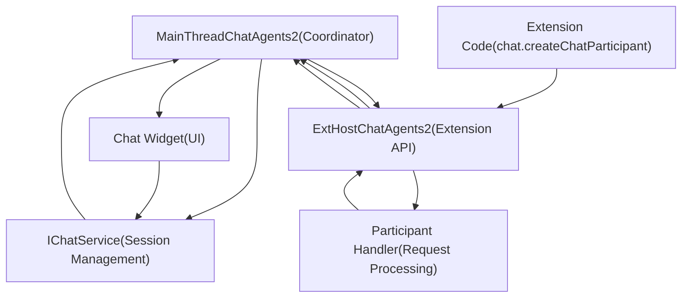
**Sources**: [src/vs/workbench/api/common/extHostChatAgents2.ts1-900](https://github.com/microsoft/vscode/blob/1be3088d/src/vs/workbench/api/common/extHostChatAgents2.ts#L1-L900) [src/vs/workbench/api/browser/mainThreadChatAgents2.ts1-500](https://github.com/microsoft/vscode/blob/1be3088d/src/vs/workbench/api/browser/mainThreadChatAgents2.ts#L1-L500) [src/vs/workbench/api/common/extHost.protocol.ts57-67](https://github.com/microsoft/vscode/blob/1be3088d/src/vs/workbench/api/common/extHost.protocol.ts#L57-L67)

The communication flow is bidirectional:

-   **Main → ExtHost**: Request invocation (`$invokeAgent`), followup requests, vote events
-   **ExtHost → Main**: Agent registration (`$registerAgent`), progress chunks (`$handleProgressChunk`), completion results

## Chat Participant Registration

### Registration Process

Extensions register chat participants using the `chat.createChatParticipant` API. The `ExtHostChatAgents2` class manages the registration lifecycle.

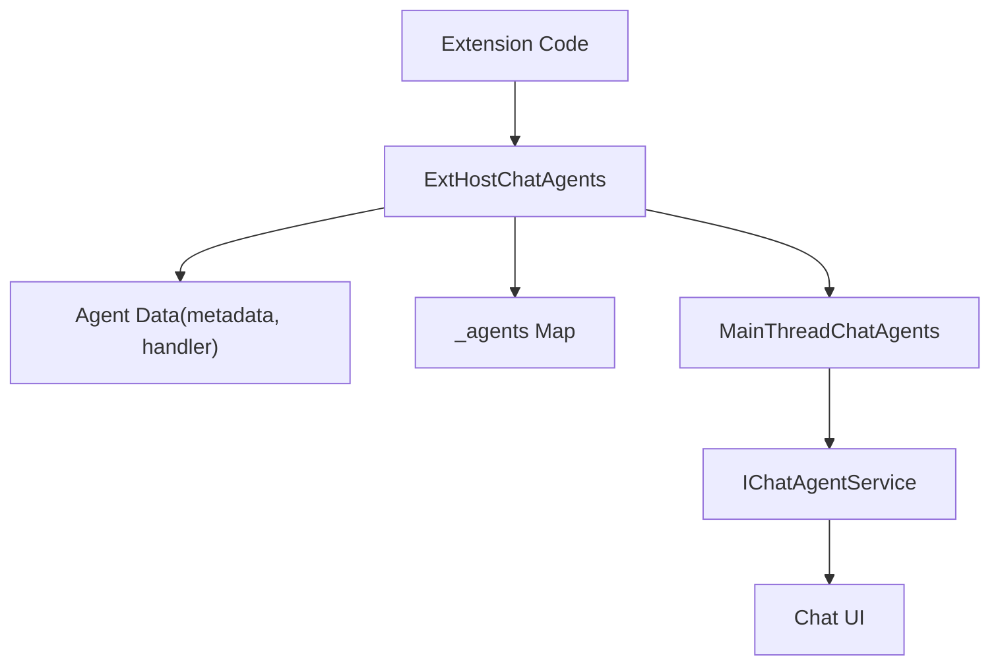
**Sources**: [src/vs/workbench/api/common/extHostChatAgents2.ts254-344](https://github.com/microsoft/vscode/blob/1be3088d/src/vs/workbench/api/common/extHostChatAgents2.ts#L254-L344) [src/vs/workbench/api/browser/mainThreadChatAgents2.ts112-141](https://github.com/microsoft/vscode/blob/1be3088d/src/vs/workbench/api/browser/mainThreadChatAgents2.ts#L112-L141)

### Key Registration Types

| Component | Type | Description |
| --- | --- | --- |
| **Handle** | `number` | Unique identifier for RPC communication |
| **Agent ID** | `string` | Public identifier (e.g., "workspace") |
| **Metadata** | `IExtensionChatAgentMetadata` | Name, description, locations, commands |
| **Handler** | `vscode.ChatRequestHandler` | Function that processes requests |

**Sources**: [src/vs/workbench/api/common/extHost.protocol.ts2226-2243](https://github.com/microsoft/vscode/blob/1be3088d/src/vs/workbench/api/common/extHost.protocol.ts#L2226-L2243) [src/vs/workbench/api/common/extHostChatAgents2.ts254-280](https://github.com/microsoft/vscode/blob/1be3088d/src/vs/workbench/api/common/extHostChatAgents2.ts#L254-L280)

### Agent Metadata Structure

Extensions provide metadata when registering a participant:

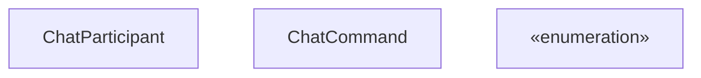
**Sources**: [src/vscode-dts/vscode.d.ts18965-19029](https://github.com/microsoft/vscode/blob/1be3088d/src/vscode-dts/vscode.d.ts#L18965-L19029) [src/vs/workbench/api/common/extHost.protocol.ts2226-2243](https://github.com/microsoft/vscode/blob/1be3088d/src/vs/workbench/api/common/extHost.protocol.ts#L2226-L2243)

## Request Handling

### Request Flow

When a user submits a chat request, the system routes it to the appropriate participant based on the participant ID in the request.

> **[Mermaid sequence]**
> *(图表结构无法解析)*

**Sources**: [src/vs/workbench/api/common/extHostChatAgents2.ts464-605](https://github.com/microsoft/vscode/blob/1be3088d/src/vs/workbench/api/common/extHostChatAgents2.ts#L464-L605) [src/vs/workbench/api/browser/mainThreadChatAgents2.ts295-390](https://github.com/microsoft/vscode/blob/1be3088d/src/vs/workbench/api/browser/mainThreadChatAgents2.ts#L295-L390)

### Request Object Structure

The `ChatRequest` object passed to the participant handler contains:

| Property | Type | Description |
| --- | --- | --- |
| `prompt` | `string` | The user's input text |
| `command` | `string | undefined` | Slash command if used |
| `references` | `ChatPromptReference[]` | Attached context (files, symbols, etc.) |
| `location` | `ChatLocation` | Where the request originated |
| `model` | `LanguageModelChat` | Language model to use |

**Sources**: [src/vscode-dts/vscode.d.ts19064-19099](https://github.com/microsoft/vscode/blob/1be3088d/src/vscode-dts/vscode.d.ts#L19064-L19099) [src/vs/workbench/api/common/extHostChatAgents2.ts514-550](https://github.com/microsoft/vscode/blob/1be3088d/src/vs/workbench/api/common/extHostChatAgents2.ts#L514-L550)

### Context Object

The `ChatContext` provides conversation history and additional state:

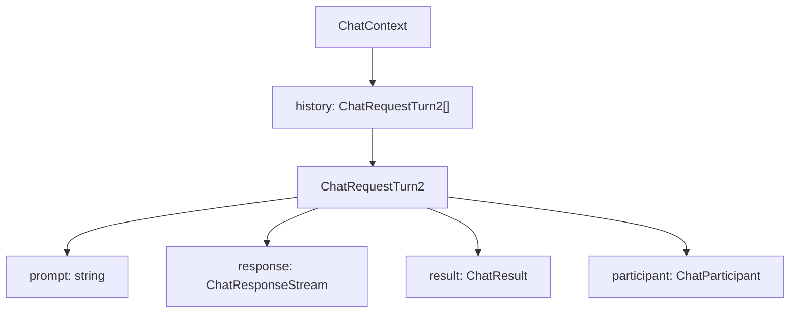
**Sources**: [src/vscode-dts/vscode.d.ts19241-19250](https://github.com/microsoft/vscode/blob/1be3088d/src/vscode-dts/vscode.d.ts#L19241-L19250) [src/vs/workbench/api/common/extHostChatAgents2.ts522-548](https://github.com/microsoft/vscode/blob/1be3088d/src/vs/workbench/api/common/extHostChatAgents2.ts#L522-L548)

## Response Streaming

The `ChatResponseStream` API allows participants to progressively send different types of content to the UI.

### Response Stream API Surface

```mermaid
flowchart TD
    ChatResponseStream["ChatResponseStream"]
    Markdown["markdown(value)Text content"]
    Reference["reference(value)File/URI reference"]
    Button["button(command)Action button"]
    Progress["progress(value)Status message"]
    Push["push(part)Generic part"]
    Anchor["anchor(value)URI link"]
    Thinking["thinking(value)Reasoning content"]
    TextEdit["textEdit(uri, edits)Code changes"]
    Confirmation["confirmation(data)User confirmation"]

    ChatResponseStream --> Markdown
    ChatResponseStream --> Reference
    ChatResponseStream --> Button
    ChatResponseStream --> Progress
    ChatResponseStream --> Push
    ChatResponseStream --> Anchor
    ChatResponseStream --> Thinking
    ChatResponseStream --> TextEdit
    ChatResponseStream --> Confirmation
```
**Sources**: [src/vscode-dts/vscode.d.ts19168-19225](https://github.com/microsoft/vscode/blob/1be3088d/src/vscode-dts/vscode.d.ts#L19168-L19225) [src/vs/workbench/api/common/extHostChatAgents2.ts69-361](https://github.com/microsoft/vscode/blob/1be3088d/src/vs/workbench/api/common/extHostChatAgents2.ts#L69-L361)

### Response Part Types

The system supports multiple response part types, each serialized differently for RPC:

| Part Type | API Method | DTO Type | Description |
| --- | --- | --- | --- |
| `ChatResponseMarkdownPart` | `markdown()` | `IChatMarkdownContent` | Markdown text content |
| `ChatResponseFileTreePart` | `filetree()` | `IChatTreeData` | File tree structure |
| `ChatResponseAnchorPart` | `anchor()` | `IChatContentReference` | URI reference |
| `ChatResponseCommandButtonPart` | `button()` | `IChatCommandButton` | Clickable command |
| `ChatResponseReferencePart` | `reference()` | `IChatContentReference` | File/symbol reference |
| `ChatResponseProgressPart` | `progress()` | `IChatProgressMessage` | Status message |
| `ChatResponseThinkingPart` | `thinking()` | `IChatThinkingPart` | Reasoning content |
| `ChatResponseTextEditPart` | `textEdit()` | `IChatTextEdit` | Code edits |
| `ChatResponseConfirmationPart` | `confirmation()` | `IChatConfirmation` | User confirmation |

**Sources**: [src/vs/workbench/api/common/extHostTypeConverters.ts2832-3062](https://github.com/microsoft/vscode/blob/1be3088d/src/vs/workbench/api/common/extHostTypeConverters.ts#L2832-L3062) [src/vs/workbench/api/common/extHostChatAgents2.ts90-350](https://github.com/microsoft/vscode/blob/1be3088d/src/vs/workbench/api/common/extHostChatAgents2.ts#L90-L350)

### Progress Chunk Batching

The response stream batches multiple chunks together in microtasks for efficiency:

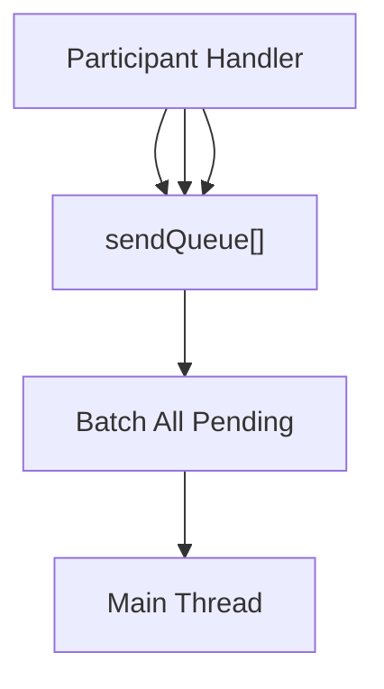
**Sources**: [src/vs/workbench/api/common/extHostChatAgents2.ts90-110](https://github.com/microsoft/vscode/blob/1be3088d/src/vs/workbench/api/common/extHostChatAgents2.ts#L90-L110)

This batching mechanism prevents excessive RPC calls by collecting multiple progress updates and sending them together.

## Variables and References

Chat requests can include context in the form of variables (e.g., `#file`, `#selection`) and references.

### Variable Resolution

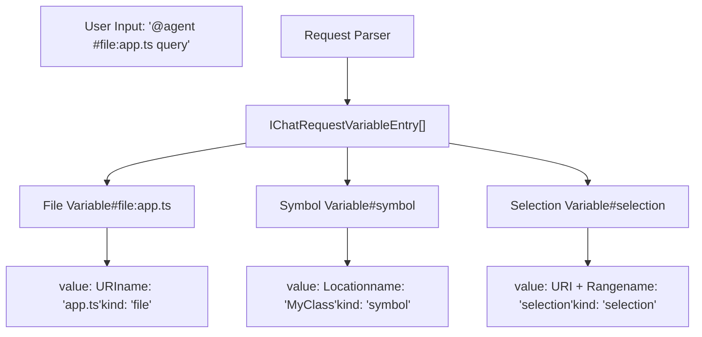
**Sources**: [src/vs/workbench/contrib/chat/common/attachments/chatVariableEntries.ts1-200](https://github.com/microsoft/vscode/blob/1be3088d/src/vs/workbench/contrib/chat/common/attachments/chatVariableEntries.ts#L1-L200) [src/vs/workbench/api/common/extHostTypeConverters.ts2760-2830](https://github.com/microsoft/vscode/blob/1be3088d/src/vs/workbench/api/common/extHostTypeConverters.ts#L2760-L2830)

### Reference Types

The `ChatPromptReference` type passed to handlers can include:

-   **File references**: URI to a file
-   **Symbol references**: Location with symbol information
-   **Variable values**: Resolved variable data
-   **Tools**: Tool references with `canBeReferencedInPrompt`

**Sources**: [src/vscode-dts/vscode.d.ts19100-19122](https://github.com/microsoft/vscode/blob/1be3088d/src/vscode-dts/vscode.d.ts#L19100-L19122) [src/vs/workbench/api/common/extHostChatAgents2.ts551-570](https://github.com/microsoft/vscode/blob/1be3088d/src/vs/workbench/api/common/extHostChatAgents2.ts#L551-L570)

## Tools and Actions

Chat participants can invoke tools and receive tool results during request processing.

### Tool Reference Structure

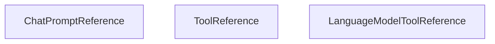
**Sources**: [src/vscode-dts/vscode.d.ts19100-19122](https://github.com/microsoft/vscode/blob/1be3088d/src/vscode-dts/vscode.d.ts#L19100-L19122) [src/vs/workbench/api/common/extHostChatAgents2.ts559-570](https://github.com/microsoft/vscode/blob/1be3088d/src/vs/workbench/api/common/extHostChatAgents2.ts#L559-L570)

### Tool Invocation Flow

When a participant uses a tool, the flow involves:

1.  Participant references tool in request
2.  Language model invokes tool via `LanguageModelToolsService`
3.  Tool result returned to model
4.  Model incorporates result in response

**Sources**: [src/vs/workbench/api/common/extHostLanguageModelTools.ts1-500](https://github.com/microsoft/vscode/blob/1be3088d/src/vs/workbench/api/common/extHostLanguageModelTools.ts#L1-L500) [src/vs/workbench/contrib/chat/common/tools/languageModelToolsService.ts1-300](https://github.com/microsoft/vscode/blob/1be3088d/src/vs/workbench/contrib/chat/common/tools/languageModelToolsService.ts#L1-L300)

## User Actions and Feedback

The system provides mechanisms for participants to receive feedback about their responses.

### Vote Actions

Users can vote on chat responses:

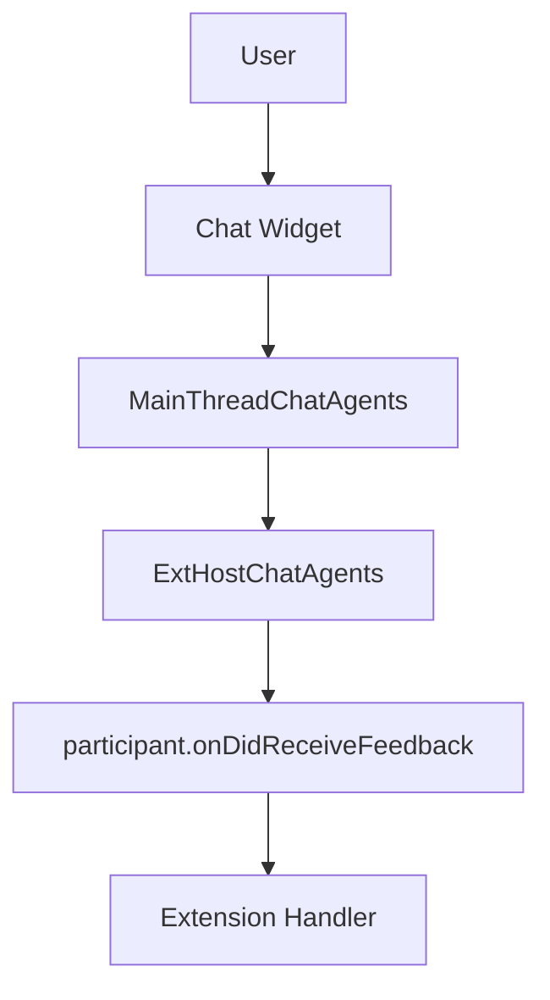
**Sources**: [src/vs/workbench/api/common/extHostChatAgents2.ts724-747](https://github.com/microsoft/vscode/blob/1be3088d/src/vs/workbench/api/common/extHostChatAgents2.ts#L724-L747) [src/vs/workbench/api/browser/mainThreadChatAgents2.ts233-245](https://github.com/microsoft/vscode/blob/1be3088d/src/vs/workbench/api/browser/mainThreadChatAgents2.ts#L233-L245)

### User Action Events

The system tracks various user interactions:

| Action Type | Description |
| --- | --- |
| `vote` | User voted on response quality |
| `command` | User executed a command button |
| `followUp` | User selected a followup |
| `bug` | User reported a bug |

**Sources**: [src/vs/workbench/contrib/chat/common/chatService/chatService.ts610-628](https://github.com/microsoft/vscode/blob/1be3088d/src/vs/workbench/contrib/chat/common/chatService/chatService.ts#L610-L628) [src/vscode-dts/vscode.d.ts19291-19316](https://github.com/microsoft/vscode/blob/1be3088d/src/vscode-dts/vscode.d.ts#L19291-L19316)

## Followup Requests

Participants can suggest followup questions that appear as quick actions after a response completes.

### Followup Provider API

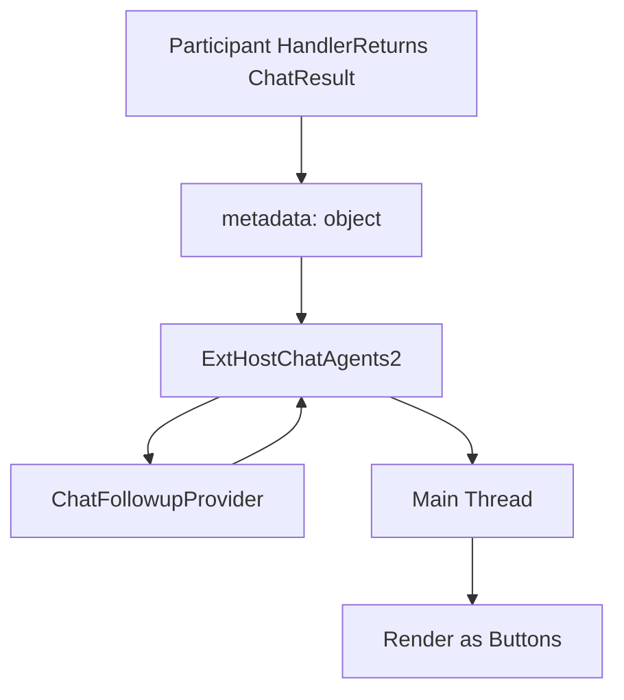
**Sources**: [src/vs/workbench/api/common/extHostChatAgents2.ts648-707](https://github.com/microsoft/vscode/blob/1be3088d/src/vs/workbench/api/common/extHostChatAgents2.ts#L648-L707) [src/vscode-dts/vscode.d.ts19318-19340](https://github.com/microsoft/vscode/blob/1be3088d/src/vscode-dts/vscode.d.ts#L19318-L19340)

### Followup Types

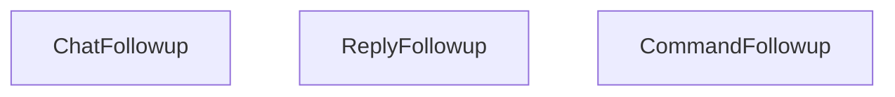
**Sources**: [src/vscode-dts/vscode.d.ts19342-19387](https://github.com/microsoft/vscode/blob/1be3088d/src/vscode-dts/vscode.d.ts#L19342-L19387) [src/vs/workbench/api/common/extHostTypeConverters.ts2690-2720](https://github.com/microsoft/vscode/blob/1be3088d/src/vs/workbench/api/common/extHostTypeConverters.ts#L2690-L2720)

## Language Model Integration

Chat participants typically use language models to generate responses. The integration is straightforward through the `ChatRequest.model` property.

### Model Usage Pattern

> **[Mermaid sequence]**
> *(图表结构无法解析)*

**Sources**: [src/vs/workbench/api/common/extHostLanguageModels.ts1-800](https://github.com/microsoft/vscode/blob/1be3088d/src/vs/workbench/api/common/extHostLanguageModels.ts#L1-L800) [src/vscode-dts/vscode.d.ts19064-19099](https://github.com/microsoft/vscode/blob/1be3088d/src/vscode-dts/vscode.d.ts#L19064-L19099)

The `LanguageModelChat` object provides methods like:

-   `sendRequest()`: Send messages to the model
-   `countTokens()`: Count tokens in text
-   Supports streaming and non-streaming modes

**Sources**: [src/vscode-dts/vscode.d.ts17980-18035](https://github.com/microsoft/vscode/blob/1be3088d/src/vscode-dts/vscode.d.ts#L17980-L18035)

## RPC Protocol Definitions

The communication between Extension Host and Main Thread uses strongly-typed protocol interfaces.

### Main Protocol Methods

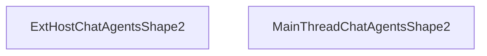
**Sources**: [src/vs/workbench/api/common/extHost.protocol.ts1985-2050](https://github.com/microsoft/vscode/blob/1be3088d/src/vs/workbench/api/common/extHost.protocol.ts#L1985-L2050) [src/vs/workbench/api/common/extHost.protocol.ts2051-2089](https://github.com/microsoft/vscode/blob/1be3088d/src/vs/workbench/api/common/extHost.protocol.ts#L2051-L2089)

### Key DTO Types

| DTO Type | Purpose | Key Fields |
| --- | --- | --- |
| `IChatAgentRequest` | Request data | `prompt`, `command`, `variables`, `location` |
| `IChatProgressDto` | Progress update | Union type of all progress part DTOs |
| `IChatAgentHistoryEntryDto` | History entry | `request`, `response`, `result` |
| `IExtensionChatAgentMetadata` | Agent metadata | `id`, `name`, `description`, `locations` |

**Sources**: [src/vs/workbench/api/common/extHost.protocol.ts2190-2290](https://github.com/microsoft/vscode/blob/1be3088d/src/vs/workbench/api/common/extHost.protocol.ts#L2190-L2290)

### Progress DTO Types

The `IChatProgressDto` is a discriminated union of various progress types:

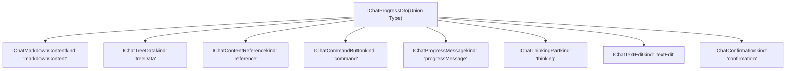
**Sources**: [src/vs/workbench/contrib/chat/common/chatService/chatService.ts402-560](https://github.com/microsoft/vscode/blob/1be3088d/src/vs/workbench/contrib/chat/common/chatService/chatService.ts#L402-L560) [src/vs/workbench/api/common/extHost.protocol.ts2100-2150](https://github.com/microsoft/vscode/blob/1be3088d/src/vs/workbench/api/common/extHost.protocol.ts#L2100-L2150)

## Session Management

Chat participants interact with sessions that maintain conversation state.

### Session Context Structure

Each request receives context about the current session:

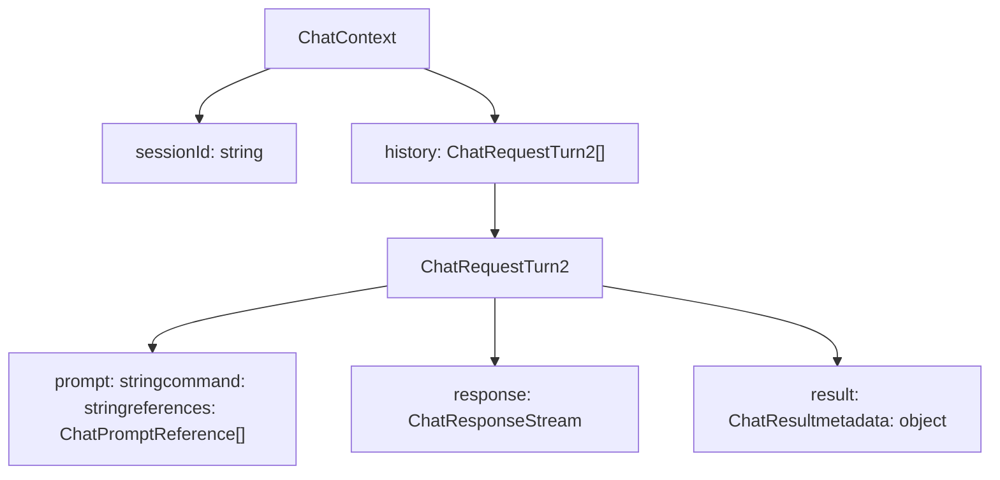
**Sources**: [src/vscode-dts/vscode.d.ts19241-19250](https://github.com/microsoft/vscode/blob/1be3088d/src/vscode-dts/vscode.d.ts#L19241-L19250) [src/vs/workbench/api/common/extHostChatAgents2.ts522-548](https://github.com/microsoft/vscode/blob/1be3088d/src/vs/workbench/api/common/extHostChatAgents2.ts#L522-L548)

### Session Lifecycle

Sessions are created and managed by the `IChatService` on the main thread. Each session:

1.  Has a unique URI identifying it
2.  Maintains conversation history
3.  Can be associated with editing sessions
4.  Persists across UI refresh (if saved)

**Sources**: [src/vs/workbench/contrib/chat/common/chatService/chatService.ts1-1000](https://github.com/microsoft/vscode/blob/1be3088d/src/vs/workbench/contrib/chat/common/chatService/chatService.ts#L1-L1000) [src/vs/workbench/contrib/chat/common/model/chatModel.ts1-800](https://github.com/microsoft/vscode/blob/1be3088d/src/vs/workbench/contrib/chat/common/model/chatModel.ts#L1-L800)

## Error Handling

The chat extension API includes comprehensive error handling mechanisms.

### Error Reporting in Responses

Participants can report errors through the result object:

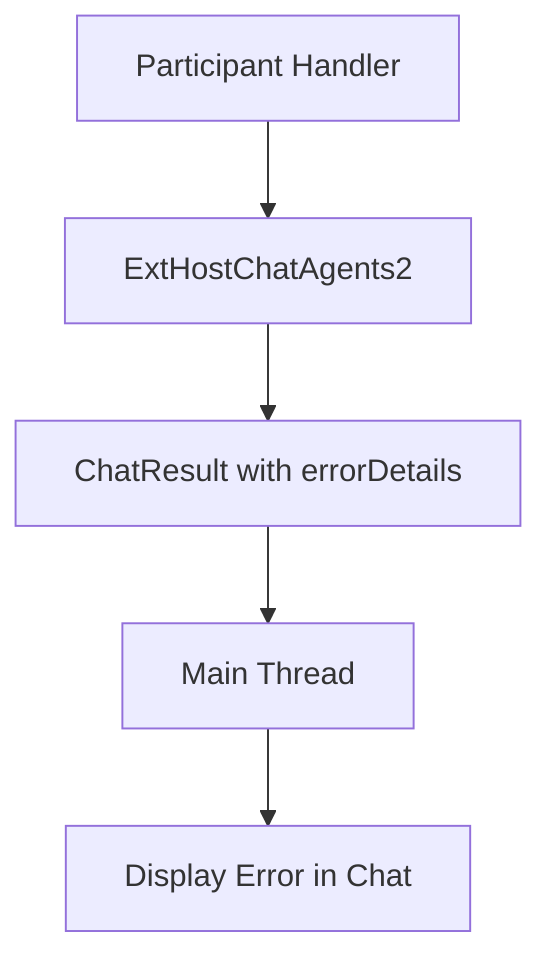
**Sources**: [src/vs/workbench/api/common/extHostChatAgents2.ts575-605](https://github.com/microsoft/vscode/blob/1be3088d/src/vs/workbench/api/common/extHostChatAgents2.ts#L575-L605) [src/vscode-dts/vscode.d.ts19130-19148](https://github.com/microsoft/vscode/blob/1be3088d/src/vscode-dts/vscode.d.ts#L19130-L19148)

### Error Detail Types

The `ChatResultErrorDetails` interface supports:

| Property | Type | Description |
| --- | --- | --- |
| `message` | `string` | Human-readable error message |
| `responseIsIncomplete` | `boolean` | Whether partial response was generated |
| `responseIsFiltered` | `boolean` | Whether response was filtered |
| `responseIsRedacted` | `boolean` | Whether response was redacted |

**Sources**: [src/vscode-dts/vscode.d.ts19130-19148](https://github.com/microsoft/vscode/blob/1be3088d/src/vscode-dts/vscode.d.ts#L19130-L19148)

## Extension Examples

### Basic Chat Participant

A minimal chat participant implementation:

```
// Register participant
const participant = vscode.chat.createChatParticipant('example', async (request, context, response, token) => {
    // Stream markdown response
    response.markdown('Hello! You asked: ' + request.prompt);

    // Return result with metadata
    return { metadata: { command: request.command } };
});

// Configure metadata
participant.description = 'An example chat participant';
participant.iconPath = vscode.Uri.file('icon.png');
```
**Sources**: [src/vscode-dts/vscode.d.ts18965-19029](https://github.com/microsoft/vscode/blob/1be3088d/src/vscode-dts/vscode.d.ts#L18965-L19029)

### Using Language Models

```
const participant = vscode.chat.createChatParticipant('lm-example', async (request, context, response, token) => {
    // Use the provided language model
    const model = request.model;

    // Send request to model
    const modelRequest = await model.sendRequest([
        vscode.LanguageModelChatMessage.User(request.prompt)
    ], {}, token);

    // Stream model response to chat
    for await (const chunk of modelRequest.text) {
        response.markdown(chunk);
    }

    return {};
});
```
**Sources**: [src/vscode-dts/vscode.d.ts19064-19099](https://github.com/microsoft/vscode/blob/1be3088d/src/vscode-dts/vscode.d.ts#L19064-L19099) [extensions/vscode-api-tests/src/singlefolder-tests/chat.test.ts1-300](https://github.com/microsoft/vscode/blob/1be3088d/extensions/vscode-api-tests/src/singlefolder-tests/chat.test.ts#L1-L300)

## Testing Infrastructure

The codebase includes comprehensive tests for the chat extension API.

### Test Coverage

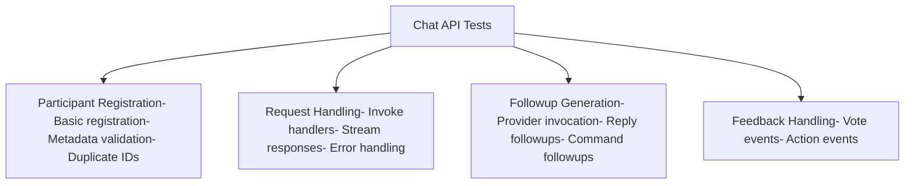
**Sources**: [extensions/vscode-api-tests/src/singlefolder-tests/chat.test.ts1-300](https://github.com/microsoft/vscode/blob/1be3088d/extensions/vscode-api-tests/src/singlefolder-tests/chat.test.ts#L1-L300)

The test suite validates:

-   Participant registration and lifecycle
-   Request routing and invocation
-   Response streaming and progress
-   Followup generation
-   User action event handling
-   Error scenarios

**Sources**: [extensions/vscode-api-tests/src/singlefolder-tests/chat.test.ts13-300](https://github.com/microsoft/vscode/blob/1be3088d/extensions/vscode-api-tests/src/singlefolder-tests/chat.test.ts#L13-L300)
