# Notebooks

Relevant source files

-   [extensions/markdown-language-features/notebook/index.ts](https://github.com/microsoft/vscode/blob/1be3088d/extensions/markdown-language-features/notebook/index.ts)
-   [src/vs/workbench/api/browser/mainThreadNotebook.ts](https://github.com/microsoft/vscode/blob/1be3088d/src/vs/workbench/api/browser/mainThreadNotebook.ts)
-   [src/vs/workbench/api/common/extHostNotebook.ts](https://github.com/microsoft/vscode/blob/1be3088d/src/vs/workbench/api/common/extHostNotebook.ts)
-   [src/vs/workbench/contrib/notebook/browser/media/notebook.css](https://github.com/microsoft/vscode/blob/1be3088d/src/vs/workbench/contrib/notebook/browser/media/notebook.css)
-   [src/vs/workbench/contrib/notebook/browser/notebook.contribution.ts](https://github.com/microsoft/vscode/blob/1be3088d/src/vs/workbench/contrib/notebook/browser/notebook.contribution.ts)
-   [src/vs/workbench/contrib/notebook/browser/notebookBrowser.ts](https://github.com/microsoft/vscode/blob/1be3088d/src/vs/workbench/contrib/notebook/browser/notebookBrowser.ts)
-   [src/vs/workbench/contrib/notebook/browser/notebookEditor.ts](https://github.com/microsoft/vscode/blob/1be3088d/src/vs/workbench/contrib/notebook/browser/notebookEditor.ts)
-   [src/vs/workbench/contrib/notebook/browser/notebookEditorWidget.ts](https://github.com/microsoft/vscode/blob/1be3088d/src/vs/workbench/contrib/notebook/browser/notebookEditorWidget.ts)
-   [src/vs/workbench/contrib/notebook/browser/view/notebookCellList.ts](https://github.com/microsoft/vscode/blob/1be3088d/src/vs/workbench/contrib/notebook/browser/view/notebookCellList.ts)
-   [src/vs/workbench/contrib/notebook/browser/view/renderers/backLayerWebView.ts](https://github.com/microsoft/vscode/blob/1be3088d/src/vs/workbench/contrib/notebook/browser/view/renderers/backLayerWebView.ts)
-   [src/vs/workbench/contrib/notebook/browser/view/renderers/cellRenderer.ts](https://github.com/microsoft/vscode/blob/1be3088d/src/vs/workbench/contrib/notebook/browser/view/renderers/cellRenderer.ts)
-   [src/vs/workbench/contrib/notebook/browser/view/renderers/webviewMessages.ts](https://github.com/microsoft/vscode/blob/1be3088d/src/vs/workbench/contrib/notebook/browser/view/renderers/webviewMessages.ts)
-   [src/vs/workbench/contrib/notebook/browser/view/renderers/webviewPreloads.ts](https://github.com/microsoft/vscode/blob/1be3088d/src/vs/workbench/contrib/notebook/browser/view/renderers/webviewPreloads.ts)
-   [src/vs/workbench/contrib/notebook/browser/viewModel/baseCellViewModel.ts](https://github.com/microsoft/vscode/blob/1be3088d/src/vs/workbench/contrib/notebook/browser/viewModel/baseCellViewModel.ts)
-   [src/vs/workbench/contrib/notebook/browser/viewModel/codeCellViewModel.ts](https://github.com/microsoft/vscode/blob/1be3088d/src/vs/workbench/contrib/notebook/browser/viewModel/codeCellViewModel.ts)
-   [src/vs/workbench/contrib/notebook/browser/viewModel/markupCellViewModel.ts](https://github.com/microsoft/vscode/blob/1be3088d/src/vs/workbench/contrib/notebook/browser/viewModel/markupCellViewModel.ts)
-   [src/vs/workbench/contrib/notebook/common/model/notebookCellTextModel.ts](https://github.com/microsoft/vscode/blob/1be3088d/src/vs/workbench/contrib/notebook/common/model/notebookCellTextModel.ts)
-   [src/vs/workbench/contrib/notebook/common/model/notebookTextModel.ts](https://github.com/microsoft/vscode/blob/1be3088d/src/vs/workbench/contrib/notebook/common/model/notebookTextModel.ts)
-   [src/vs/workbench/contrib/notebook/common/notebookCommon.ts](https://github.com/microsoft/vscode/blob/1be3088d/src/vs/workbench/contrib/notebook/common/notebookCommon.ts)
-   [src/vs/workbench/contrib/notebook/common/notebookEditorModel.ts](https://github.com/microsoft/vscode/blob/1be3088d/src/vs/workbench/contrib/notebook/common/notebookEditorModel.ts)
-   [src/vs/workbench/contrib/notebook/common/notebookService.ts](https://github.com/microsoft/vscode/blob/1be3088d/src/vs/workbench/contrib/notebook/common/notebookService.ts)

## Purpose and Scope

This document describes the notebook editor system in VS Code, which provides interactive document editing with support for code and markup cells. The notebook editor enables users to create documents that combine executable code, rich text, and dynamic outputs in a single interface.

This page covers the notebook editor architecture, cell management, output rendering, and the core data models. For information about the extension API surface exposed to extensions, see the Extension System documentation ([#6](https://github.com/microsoft/vscode/blob/1be3088d/#6)). For details about kernel management and execution, see the related kernel service interfaces.

---

## Architecture Overview

The notebook system is built on a multi-layered architecture that separates data models, view models, UI rendering, and output presentation through a webview.

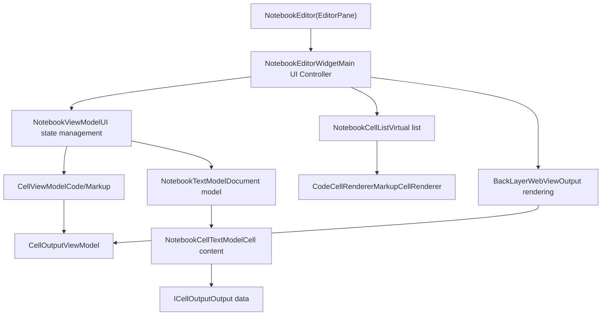
**Diagram: Notebook System Architecture**

The architecture follows a clear separation of concerns:

-   **Editor Layer**: Integrates with VS Code's editor infrastructure
-   **View Model Layer**: Manages UI state and cell view models
-   **Model Layer**: Stores document data and cell content
-   **Rendering Layer**: Handles UI presentation and output display

**Sources:**

-   [src/vs/workbench/contrib/notebook/browser/notebookEditorWidget.ts142-476](https://github.com/microsoft/vscode/blob/1be3088d/src/vs/workbench/contrib/notebook/browser/notebookEditorWidget.ts#L142-L476)
-   [src/vs/workbench/contrib/notebook/browser/notebookEditor.ts55-106](https://github.com/microsoft/vscode/blob/1be3088d/src/vs/workbench/contrib/notebook/browser/notebookEditor.ts#L55-L106)
-   [src/vs/workbench/contrib/notebook/browser/viewModel/notebookViewModelImpl.ts](https://github.com/microsoft/vscode/blob/1be3088d/src/vs/workbench/contrib/notebook/browser/viewModel/notebookViewModelImpl.ts)
-   [src/vs/workbench/contrib/notebook/common/model/notebookTextModel.ts1-100](https://github.com/microsoft/vscode/blob/1be3088d/src/vs/workbench/contrib/notebook/common/model/notebookTextModel.ts#L1-L100)

---

## Core Components

### NotebookEditorWidget

The `NotebookEditorWidget` is the central UI component that orchestrates the notebook editing experience. It manages the cell list, webview, toolbars, and coordinates interactions between different parts of the system.

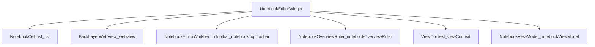
**Diagram: NotebookEditorWidget Component Structure**

Key responsibilities:

-   **Cell List Management**: Maintains a `NotebookCellList` for displaying cells
-   **WebView Coordination**: Creates and manages `BackLayerWebView` for output rendering
-   **Event Handling**: Processes user interactions and model changes
-   **Layout Management**: Calculates and updates cell dimensions
-   **Focus Management**: Tracks active cell and editor focus state

The widget exposes several important properties and methods:

| Property/Method | Description |
| --- | --- |
| `viewModel` | The current `NotebookViewModel` instance |
| `textModel` | The underlying `NotebookTextModel` |
| `activeCodeEditor` | Currently focused `ICodeEditor` |
| `visibleRanges` | Currently visible cell ranges |
| `focusNotebookCell()` | Focus a specific cell |
| `executeNotebookCells()` | Execute selected cells |

**Sources:**

-   [src/vs/workbench/contrib/notebook/browser/notebookEditorWidget.ts142-476](https://github.com/microsoft/vscode/blob/1be3088d/src/vs/workbench/contrib/notebook/browser/notebookEditorWidget.ts#L142-L476)
-   [src/vs/workbench/contrib/notebook/browser/notebookEditorWidget.ts614-641](https://github.com/microsoft/vscode/blob/1be3088d/src/vs/workbench/contrib/notebook/browser/notebookEditorWidget.ts#L614-L641)
-   [src/vs/workbench/contrib/notebook/browser/notebookBrowser.ts514-567](https://github.com/microsoft/vscode/blob/1be3088d/src/vs/workbench/contrib/notebook/browser/notebookBrowser.ts#L514-L567)

### NotebookViewModel

The `NotebookViewModel` bridges the text model and the view layer, managing UI-specific state such as cell selection, folding, and visibility.

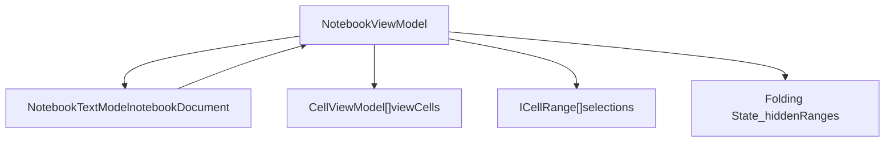
**Diagram: NotebookViewModel Structure**

The view model maintains:

-   **View Cells**: Array of `CellViewModel` instances (code or markup)
-   **Selection State**: Current cell selection and focus
-   **Folding State**: Hidden/collapsed cell ranges
-   **Tracked Ranges**: Range tracking with stickiness behavior

**Sources:**

-   [src/vs/workbench/contrib/notebook/browser/viewModel/notebookViewModelImpl.ts](https://github.com/microsoft/vscode/blob/1be3088d/src/vs/workbench/contrib/notebook/browser/viewModel/notebookViewModelImpl.ts)
-   [src/vs/workbench/contrib/notebook/browser/notebookBrowser.ts491-511](https://github.com/microsoft/vscode/blob/1be3088d/src/vs/workbench/contrib/notebook/browser/notebookBrowser.ts#L491-L511)

### NotebookTextModel

The `NotebookTextModel` is the core data model representing a notebook document. It manages cells, metadata, and document-level operations.

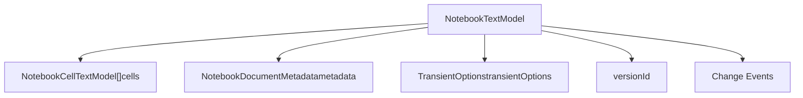
**Diagram: NotebookTextModel Data Structure**

Key operations:

| Operation | Description |
| --- | --- |
| `applyEdits()` | Apply cell edits (insert, delete, modify) |
| `createSnapshot()` | Create snapshot for serialization |
| `reset()` | Reset with new cell data |
| `undo/redo` | Integrated with VS Code's undo/redo system |

The model uses `StackOperation` for undo/redo grouping and fires `NotebookTextModelChangedEvent` for all modifications.

**Sources:**

-   [src/vs/workbench/contrib/notebook/common/model/notebookTextModel.ts96-250](https://github.com/microsoft/vscode/blob/1be3088d/src/vs/workbench/contrib/notebook/common/model/notebookTextModel.ts#L96-L250)
-   [src/vs/workbench/contrib/notebook/common/notebookCommon.ts295-310](https://github.com/microsoft/vscode/blob/1be3088d/src/vs/workbench/contrib/notebook/common/notebookCommon.ts#L295-L310)

---

## Cell Types and Rendering

### Cell Kinds

The notebook system supports two primary cell types defined by the `CellKind` enum:

```
enum CellKind {
    Markup = 1,  // Markdown/text cells
    Code = 2     // Executable code cells
}
```
### Code Cells

Code cells contain executable code and display outputs. They are rendered using `CodeCellRenderer` and managed by `CodeCellViewModel`.

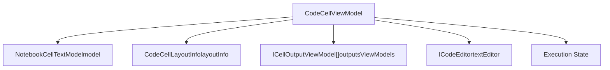
**Diagram: Code Cell Structure**

Code cell layout includes:

-   **Editor Part**: Monaco editor for code input
-   **Output Container**: Displays execution results
-   **Status Bar**: Shows execution state, duration, etc.
-   **Toolbar**: Cell-level actions

The `CodeCellLayoutInfo` tracks dimensions:

-   `editorHeight`: Height of the code editor
-   `outputTotalHeight`: Combined height of all outputs
-   `outputContainerOffset`: Y-offset for output container
-   `totalHeight`: Complete cell height including margins

**Sources:**

-   [src/vs/workbench/contrib/notebook/browser/viewModel/codeCellViewModel.ts30-100](https://github.com/microsoft/vscode/blob/1be3088d/src/vs/workbench/contrib/notebook/browser/viewModel/codeCellViewModel.ts#L30-L100)
-   [src/vs/workbench/contrib/notebook/browser/notebookBrowser.ts202-219](https://github.com/microsoft/vscode/blob/1be3088d/src/vs/workbench/contrib/notebook/browser/notebookBrowser.ts#L202-L219)
-   [src/vs/workbench/contrib/notebook/browser/view/renderers/cellRenderer.ts237-254](https://github.com/microsoft/vscode/blob/1be3088d/src/vs/workbench/contrib/notebook/browser/view/renderers/cellRenderer.ts#L237-L254)

### Markup Cells

Markup cells contain Markdown content that can be edited or rendered. They use `MarkupCellRenderer` and `MarkupCellViewModel`.

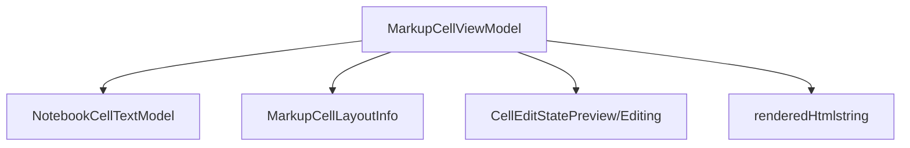
**Diagram: Markup Cell Structure**

Markup cells have two states:

-   **Preview Mode**: Rendered HTML displayed in webview
-   **Edit Mode**: Monaco editor for editing markdown source

The `MarkupCellLayoutInfo` includes:

-   `editorHeight`: Height when in edit mode
-   `previewHeight`: Height of rendered preview
-   `totalHeight`: Complete cell height

**Sources:**

-   [src/vs/workbench/contrib/notebook/browser/viewModel/markupCellViewModel.ts22-100](https://github.com/microsoft/vscode/blob/1be3088d/src/vs/workbench/contrib/notebook/browser/viewModel/markupCellViewModel.ts#L22-L100)
-   [src/vs/workbench/contrib/notebook/browser/notebookBrowser.ts221-235](https://github.com/microsoft/vscode/blob/1be3088d/src/vs/workbench/contrib/notebook/browser/notebookBrowser.ts#L221-L235)
-   [src/vs/workbench/contrib/notebook/browser/view/renderers/cellRenderer.ts112-209](https://github.com/microsoft/vscode/blob/1be3088d/src/vs/workbench/contrib/notebook/browser/view/renderers/cellRenderer.ts#L112-L209)

### Cell Rendering Pipeline

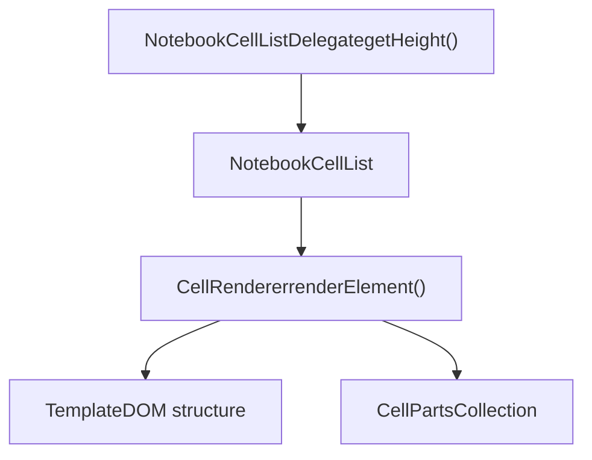
**Diagram: Cell Rendering Flow**

The rendering system uses:

-   `NotebookCellListDelegate`: Computes cell heights for virtual scrolling
-   `CodeCellRenderer` / `MarkupCellRenderer`: Render cells into DOM templates
-   `CellPartsCollection`: Manages reusable cell UI components (toolbar, status bar, decorations)

**Sources:**

-   [src/vs/workbench/contrib/notebook/browser/view/renderers/cellRenderer.ts57-110](https://github.com/microsoft/vscode/blob/1be3088d/src/vs/workbench/contrib/notebook/browser/view/renderers/cellRenderer.ts#L57-L110)
-   [src/vs/workbench/contrib/notebook/browser/view/notebookCellList.ts80-132](https://github.com/microsoft/vscode/blob/1be3088d/src/vs/workbench/contrib/notebook/browser/view/notebookCellList.ts#L80-L132)

---

## Output Rendering System

### BackLayerWebView Architecture

Notebook outputs (charts, images, HTML, etc.) are rendered in an isolated webview to provide security and support custom renderers from extensions.

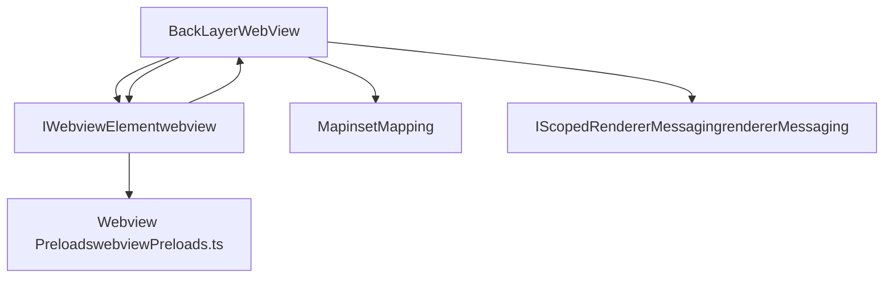
**Diagram: BackLayerWebView Components**

Key responsibilities:

-   **Output Management**: Maps output view models to rendered insets
-   **Renderer Loading**: Loads and activates notebook renderers
-   **Message Passing**: Bidirectional communication with webview
-   **Dimension Tracking**: Reports output sizes back to main thread

The webview content is generated in `generateContent()` which includes:

-   Base HTML structure with CSP (Content Security Policy)
-   Tokenization CSS for syntax highlighting
-   Preload scripts that initialize the rendering environment
-   Renderer metadata and static preloads

**Sources:**

-   [src/vs/workbench/contrib/notebook/browser/view/renderers/backLayerWebView.ts129-226](https://github.com/microsoft/vscode/blob/1be3088d/src/vs/workbench/contrib/notebook/browser/view/renderers/backLayerWebView.ts#L129-L226)
-   [src/vs/workbench/contrib/notebook/browser/view/renderers/backLayerWebView.ts290-500](https://github.com/microsoft/vscode/blob/1be3088d/src/vs/workbench/contrib/notebook/browser/view/renderers/backLayerWebView.ts#L290-L500)

### Webview Communication Protocol

> **[Mermaid sequence]**
> *(图表结构无法解析)*

**Diagram: Output Rendering Communication Flow**

Message types sent to webview:

| Message Type | Purpose |
| --- | --- |
| `ICreationRequestMessage` | Create new output element |
| `IShowMarkupMessage` | Render markup cell preview |
| `IClearMessage` | Clear specific outputs |
| `IScrollAckMessage` | Acknowledge scroll position |
| `notebookStyles` | Update CSS variables |

Message types from webview:

| Message Type | Purpose |
| --- | --- |
| `IDimensionMessage` | Report output dimensions |
| `IOutputFocusMessage` | Output element focused |
| `IClickedLinkMessage` | Link clicked in output |
| `IWheelMessage` | Mouse wheel event |

**Sources:**

-   [src/vs/workbench/contrib/notebook/browser/view/renderers/webviewMessages.ts10-300](https://github.com/microsoft/vscode/blob/1be3088d/src/vs/workbench/contrib/notebook/browser/view/renderers/webviewMessages.ts#L10-L300)
-   [src/vs/workbench/contrib/notebook/browser/view/renderers/backLayerWebView.ts605-800](https://github.com/microsoft/vscode/blob/1be3088d/src/vs/workbench/contrib/notebook/browser/view/renderers/backLayerWebView.ts#L605-L800)
-   [src/vs/workbench/contrib/notebook/browser/view/renderers/webviewPreloads.ts92-500](https://github.com/microsoft/vscode/blob/1be3088d/src/vs/workbench/contrib/notebook/browser/view/renderers/webviewPreloads.ts#L92-L500)

### Output View Models

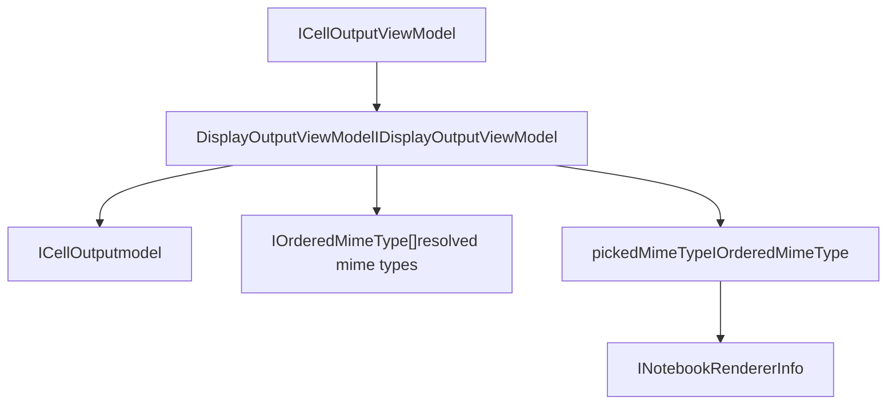
**Diagram: Output View Model Structure**

Output view models:

-   Wrap `ICellOutput` data models
-   Resolve appropriate MIME types based on available renderers
-   Track picked renderer and MIME type
-   Manage visibility state for performance (lazy rendering)

**Sources:**

-   [src/vs/workbench/contrib/notebook/browser/notebookBrowser.ts103-122](https://github.com/microsoft/vscode/blob/1be3088d/src/vs/workbench/contrib/notebook/browser/notebookBrowser.ts#L103-L122)
-   [src/vs/workbench/contrib/notebook/browser/viewModel/cellOutputViewModel.ts](https://github.com/microsoft/vscode/blob/1be3088d/src/vs/workbench/contrib/notebook/browser/viewModel/cellOutputViewModel.ts)

### Custom Renderers

Extensions can provide custom notebook renderers through the `INotebookRendererInfo` interface:

```
interface INotebookRendererInfo {
    id: string;
    displayName: string;
    entrypoint: NotebookRendererEntrypoint;
    mimeTypes: readonly string[];
    messaging: RendererMessagingSpec;
    matches(mimeType: string, kernelProvides: ReadonlyArray<string>): NotebookRendererMatch;
}
```
Renderer activation:

1.  Extension registers renderer in `package.json`
2.  `NotebookService` discovers and caches renderer metadata
3.  When output is rendered, system selects best matching renderer
4.  Renderer script loaded into webview via `entrypoint.path`
5.  Renderer receives output data through `renderOutputItem()` API

**Sources:**

-   [src/vs/workbench/contrib/notebook/common/notebookCommon.ts189-203](https://github.com/microsoft/vscode/blob/1be3088d/src/vs/workbench/contrib/notebook/common/notebookCommon.ts#L189-L203)
-   [src/vs/workbench/contrib/notebook/browser/view/renderers/backLayerWebView.ts502-522](https://github.com/microsoft/vscode/blob/1be3088d/src/vs/workbench/contrib/notebook/browser/view/renderers/backLayerWebView.ts#L502-L522)

---

## Cell Execution and Kernel Integration

### Execution Flow

> **[Mermaid sequence]**
> *(图表结构无法解析)*

**Diagram: Cell Execution Sequence**

The execution system coordinates:

-   **Kernel Selection**: Via `INotebookKernelService`
-   **Execution State**: Tracked by `INotebookExecutionStateService`
-   **Output Updates**: Applied to cell model as execution progresses
-   **Error Handling**: Errors stored in `internalMetadata.error`

**Sources:**

-   [src/vs/workbench/contrib/notebook/common/notebookExecutionService.ts](https://github.com/microsoft/vscode/blob/1be3088d/src/vs/workbench/contrib/notebook/common/notebookExecutionService.ts)
-   [src/vs/workbench/contrib/notebook/common/notebookKernelService.ts](https://github.com/microsoft/vscode/blob/1be3088d/src/vs/workbench/contrib/notebook/common/notebookKernelService.ts)
-   [src/vs/workbench/contrib/notebook/browser/viewModel/codeCellViewModel.ts36-45](https://github.com/microsoft/vscode/blob/1be3088d/src/vs/workbench/contrib/notebook/browser/viewModel/codeCellViewModel.ts#L36-L45)

---

## Data Model Details

### NotebookCellTextModel

The `NotebookCellTextModel` represents individual cell content and metadata:

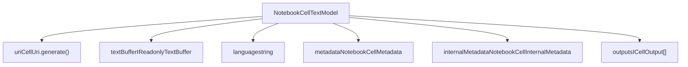
**Diagram: NotebookCellTextModel Structure**

Key properties:

| Property | Description |
| --- | --- |
| `uri` | Unique URI for the cell (vscode-notebook-cell scheme) |
| `handle` | Numeric identifier within notebook |
| `textBuffer` | Piece tree text buffer for cell content |
| `language` | Language mode identifier |
| `metadata` | User-editable metadata |
| `internalMetadata` | System metadata (execution order, timing, etc.) |
| `outputs` | Array of cell outputs |

**Sources:**

-   [src/vs/workbench/contrib/notebook/common/model/notebookCellTextModel.ts26-150](https://github.com/microsoft/vscode/blob/1be3088d/src/vs/workbench/contrib/notebook/common/model/notebookCellTextModel.ts#L26-L150)
-   [src/vs/workbench/contrib/notebook/common/notebookCommon.ts269-287](https://github.com/microsoft/vscode/blob/1be3088d/src/vs/workbench/contrib/notebook/common/notebookCommon.ts#L269-L287)

### Cell Outputs

Cell outputs are modeled as `ICellOutput` with multiple output items:

```
interface ICellOutput {
    outputs: IOutputItemDto[];  // Multiple MIME representations
    outputId: string;            // Unique identifier
    metadata?: Record<string, any>;
}

interface IOutputItemDto {
    mime: string;     // MIME type (text/plain, image/png, etc.)
    data: VSBuffer;   // Binary data
}
```
Output lifecycle:

1.  Kernel produces output items with various MIME types
2.  `NotebookCellOutputTextModel` wraps raw output data
3.  View model resolves best MIME type based on available renderers
4.  Selected output rendered in webview or as text

**Sources:**

-   [src/vs/workbench/contrib/notebook/common/notebookCommon.ts218-245](https://github.com/microsoft/vscode/blob/1be3088d/src/vs/workbench/contrib/notebook/common/notebookCommon.ts#L218-L245)
-   [src/vs/workbench/contrib/notebook/common/model/notebookCellOutputTextModel.ts](https://github.com/microsoft/vscode/blob/1be3088d/src/vs/workbench/contrib/notebook/common/model/notebookCellOutputTextModel.ts)

### Transient Options

The `TransientOptions` interface controls which data is persisted:

```
interface TransientOptions {
    transientOutputs: boolean;                           // Don't save outputs
    transientCellMetadata: TransientCellMetadata;        // Which metadata to exclude
    transientDocumentMetadata: TransientDocumentMetadata; // Document metadata exclusions
}
```
This allows notebooks to:

-   Exclude large outputs from version control
-   Strip execution-specific metadata
-   Customize serialization behavior per notebook type

**Sources:**

-   [src/vs/workbench/contrib/notebook/common/notebookCommon.ts156-161](https://github.com/microsoft/vscode/blob/1be3088d/src/vs/workbench/contrib/notebook/common/notebookCommon.ts#L156-L161)

---

## Editor Integration

### NotebookEditor (EditorPane)

The `NotebookEditor` class extends `EditorPane` to integrate notebooks into VS Code's editor framework:

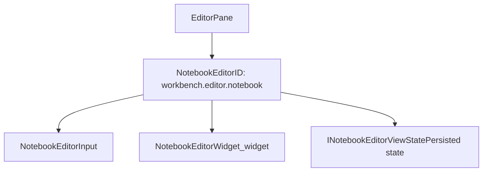
**Diagram: NotebookEditor Integration**

Key methods:

| Method | Purpose |
| --- | --- |
| `setInput()` | Load notebook document into editor |
| `getControl()` | Return underlying `NotebookEditorWidget` |
| `setOptions()` | Apply editor options (cell selection, reveal) |
| `saveEditorViewState()` | Persist editor state for reopening |

The editor coordinates with:

-   `INotebookEditorService`: Registry of active notebook editors
-   `INotebookEditorModelResolverService`: Resolves notebook documents
-   `INotebookKernelService`: Manages kernel selection

**Sources:**

-   [src/vs/workbench/contrib/notebook/browser/notebookEditor.ts55-200](https://github.com/microsoft/vscode/blob/1be3088d/src/vs/workbench/contrib/notebook/browser/notebookEditor.ts#L55-L200)
-   [src/vs/workbench/contrib/notebook/browser/notebookBrowser.ts424-437](https://github.com/microsoft/vscode/blob/1be3088d/src/vs/workbench/contrib/notebook/browser/notebookBrowser.ts#L424-L437)

### Editor Options and State

```
interface INotebookEditorOptions {
    cellOptions?: ITextResourceEditorInput;
    cellRevealType?: CellRevealType;
    cellSelections?: ICellRange[];
    viewState?: INotebookEditorViewState;
}

interface INotebookEditorViewState {
    editingCells: { [key: number]: boolean };
    collapsedInputCells: { [key: number]: boolean };
    collapsedOutputCells: { [key: number]: boolean };
    editorViewStates: { [key: number]: ICodeEditorViewState };
    scrollPosition?: { left: number; top: number };
    focus?: number;
}
```
View state preservation enables:

-   Restoring cell editing state
-   Maintaining scroll position
-   Preserving cell collapse state
-   Restoring Monaco editor state per cell

**Sources:**

-   [src/vs/workbench/contrib/notebook/browser/notebookBrowser.ts384-437](https://github.com/microsoft/vscode/blob/1be3088d/src/vs/workbench/contrib/notebook/browser/notebookBrowser.ts#L384-L437)
-   [src/vs/workbench/contrib/notebook/browser/notebookEditor.ts102-106](https://github.com/microsoft/vscode/blob/1be3088d/src/vs/workbench/contrib/notebook/browser/notebookEditor.ts#L102-L106)

---

## Extension API

### ExtHostNotebook

The extension host side manages notebook API surface for extensions:

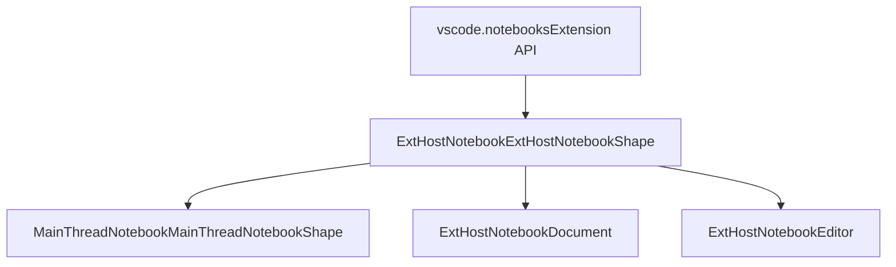
**Diagram: Extension Host Notebook Architecture**

Key extension API objects:

| API Object | Purpose |
| --- | --- |
| `NotebookDocument` | Represents notebook document with cells |
| `NotebookEditor` | Active notebook editor instance |
| `NotebookCell` | Individual cell in document |
| `NotebookCellOutput` | Cell execution output |
| `NotebookController` | Kernel/execution provider |
| `NotebookSerializer` | Custom serialization format |

**Sources:**

-   [src/vs/workbench/api/common/extHostNotebook.ts43-116](https://github.com/microsoft/vscode/blob/1be3088d/src/vs/workbench/api/common/extHostNotebook.ts#L43-L116)
-   [src/vs/workbench/api/browser/mainThreadNotebook.ts30-50](https://github.com/microsoft/vscode/blob/1be3088d/src/vs/workbench/api/browser/mainThreadNotebook.ts#L30-L50)

### Notebook Serialization

Extensions provide serializers to support custom file formats:

```
interface INotebookSerializer {
    dataToNotebook(data: VSBuffer): Promise<NotebookData>;
    notebookToData(data: NotebookData): Promise<VSBuffer>;
}
```
Registration flow:

1.  Extension calls `vscode.notebooks.registerNotebookSerializer(viewType, serializer)`
2.  `ExtHostNotebook` forwards to `MainThreadNotebook`
3.  `NotebookService` registers serializer for view type
4.  When opening files, serializer converts between file format and `NotebookData`

**Sources:**

-   [src/vs/workbench/contrib/notebook/common/notebookService.ts33-37](https://github.com/microsoft/vscode/blob/1be3088d/src/vs/workbench/contrib/notebook/common/notebookService.ts#L33-L37)
-   [src/vs/workbench/api/browser/mainThreadNotebook.ts52-82](https://github.com/microsoft/vscode/blob/1be3088d/src/vs/workbench/api/browser/mainThreadNotebook.ts#L52-L82)

### Cell Status Bar Items

Extensions can contribute status bar items to cells:

```
interface INotebookCellStatusBarItemProvider {
    viewType: string;
    onDidChangeStatusBarItems?: Event<void>;
    provideCellStatusBarItems(
        uri: URI,
        index: number,
        token: CancellationToken
    ): Promise<INotebookCellStatusBarItem[]>;
}
```
Status bar items display:

-   Execution timing
-   Language mode
-   Cell-specific actions
-   Custom extension indicators

**Sources:**

-   [src/vs/workbench/contrib/notebook/common/notebookCellStatusBarService.ts](https://github.com/microsoft/vscode/blob/1be3088d/src/vs/workbench/contrib/notebook/common/notebookCellStatusBarService.ts)
-   [src/vs/workbench/api/browser/mainThreadNotebook.ts140-170](https://github.com/microsoft/vscode/blob/1be3088d/src/vs/workbench/api/browser/mainThreadNotebook.ts#L140-L170)

---

## Services and Registration

### Service Architecture

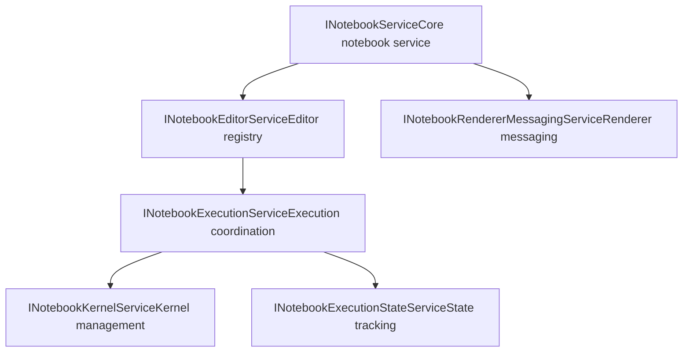
**Diagram: Notebook Services**

Service registration occurs in `notebook.contribution.ts`:

```
registerSingleton(INotebookService, NotebookService, InstantiationType.Delayed);
registerSingleton(INotebookEditorService, NotebookEditorWidgetService, InstantiationType.Delayed);
registerSingleton(INotebookKernelService, NotebookKernelService, InstantiationType.Delayed);
// ... additional services
```
**Sources:**

-   [src/vs/workbench/contrib/notebook/browser/notebook.contribution.ts1-150](https://github.com/microsoft/vscode/blob/1be3088d/src/vs/workbench/contrib/notebook/browser/notebook.contribution.ts#L1-L150)
-   [src/vs/workbench/contrib/notebook/common/notebookService.ts24-50](https://github.com/microsoft/vscode/blob/1be3088d/src/vs/workbench/contrib/notebook/common/notebookService.ts#L24-L50)

### Editor Pane Registration

```
Registry.as<IEditorPaneRegistry>(EditorExtensions.EditorPane).registerEditorPane(
    EditorPaneDescriptor.create(
        NotebookEditor,
        NotebookEditor.ID,
        'Notebook Editor'
    ),
    [new SyncDescriptor(NotebookEditorInput)]
);
```
This registers:

-   `NotebookEditor` as editor pane for notebook inputs
-   Serializer for persisting/restoring editor state
-   File association mappings for notebook file types

**Sources:**

-   [src/vs/workbench/contrib/notebook/browser/notebook.contribution.ts140-183](https://github.com/microsoft/vscode/blob/1be3088d/src/vs/workbench/contrib/notebook/browser/notebook.contribution.ts#L140-L183)

---

## Summary

The notebook system in VS Code is a sophisticated multi-layered architecture that provides:

1.  **Flexible Data Model**: `NotebookTextModel` and `NotebookCellTextModel` for document structure
2.  **Rich View Layer**: View models separate UI concerns from data
3.  **Efficient Rendering**: Virtual list with cell templates and webview for outputs
4.  **Extensibility**: Extension API for custom renderers, kernels, and serializers
5.  **Integration**: Seamless integration with VS Code's editor infrastructure

Key design principles:

-   **Separation of Concerns**: Model, view model, and view layers clearly separated
-   **Performance**: Virtual scrolling, lazy output rendering, idle callbacks
-   **Security**: Isolated webview for untrusted output content
-   **Extensibility**: Rich API surface for notebook extensions

**Sources:**

-   [src/vs/workbench/contrib/notebook/browser/notebookEditorWidget.ts1-900](https://github.com/microsoft/vscode/blob/1be3088d/src/vs/workbench/contrib/notebook/browser/notebookEditorWidget.ts#L1-L900)
-   [src/vs/workbench/contrib/notebook/common/notebookCommon.ts1-800](https://github.com/microsoft/vscode/blob/1be3088d/src/vs/workbench/contrib/notebook/common/notebookCommon.ts#L1-L800)
-   [src/vs/workbench/contrib/notebook/browser/notebookBrowser.ts1-700](https://github.com/microsoft/vscode/blob/1be3088d/src/vs/workbench/contrib/notebook/browser/notebookBrowser.ts#L1-L700)
