# Source Control Management

Relevant source files

-   [extensions/git/src/historyProvider.ts](https://github.com/microsoft/vscode/blob/1be3088d/extensions/git/src/historyProvider.ts)
-   [src/vs/workbench/api/browser/mainThreadSCM.ts](https://github.com/microsoft/vscode/blob/1be3088d/src/vs/workbench/api/browser/mainThreadSCM.ts)
-   [src/vs/workbench/api/common/extHostSCM.ts](https://github.com/microsoft/vscode/blob/1be3088d/src/vs/workbench/api/common/extHostSCM.ts)
-   [src/vs/workbench/contrib/scm/browser/activity.ts](https://github.com/microsoft/vscode/blob/1be3088d/src/vs/workbench/contrib/scm/browser/activity.ts)
-   [src/vs/workbench/contrib/scm/browser/media/scm.css](https://github.com/microsoft/vscode/blob/1be3088d/src/vs/workbench/contrib/scm/browser/media/scm.css)
-   [src/vs/workbench/contrib/scm/browser/menus.ts](https://github.com/microsoft/vscode/blob/1be3088d/src/vs/workbench/contrib/scm/browser/menus.ts)
-   [src/vs/workbench/contrib/scm/browser/scm.contribution.ts](https://github.com/microsoft/vscode/blob/1be3088d/src/vs/workbench/contrib/scm/browser/scm.contribution.ts)
-   [src/vs/workbench/contrib/scm/browser/scmHistory.ts](https://github.com/microsoft/vscode/blob/1be3088d/src/vs/workbench/contrib/scm/browser/scmHistory.ts)
-   [src/vs/workbench/contrib/scm/browser/scmHistoryViewPane.ts](https://github.com/microsoft/vscode/blob/1be3088d/src/vs/workbench/contrib/scm/browser/scmHistoryViewPane.ts)
-   [src/vs/workbench/contrib/scm/browser/scmRepositoriesViewPane.ts](https://github.com/microsoft/vscode/blob/1be3088d/src/vs/workbench/contrib/scm/browser/scmRepositoriesViewPane.ts)
-   [src/vs/workbench/contrib/scm/browser/scmRepositoryRenderer.ts](https://github.com/microsoft/vscode/blob/1be3088d/src/vs/workbench/contrib/scm/browser/scmRepositoryRenderer.ts)
-   [src/vs/workbench/contrib/scm/browser/scmViewPane.ts](https://github.com/microsoft/vscode/blob/1be3088d/src/vs/workbench/contrib/scm/browser/scmViewPane.ts)
-   [src/vs/workbench/contrib/scm/browser/scmViewService.ts](https://github.com/microsoft/vscode/blob/1be3088d/src/vs/workbench/contrib/scm/browser/scmViewService.ts)
-   [src/vs/workbench/contrib/scm/browser/util.ts](https://github.com/microsoft/vscode/blob/1be3088d/src/vs/workbench/contrib/scm/browser/util.ts)
-   [src/vs/workbench/contrib/scm/browser/workingSet.ts](https://github.com/microsoft/vscode/blob/1be3088d/src/vs/workbench/contrib/scm/browser/workingSet.ts)
-   [src/vs/workbench/contrib/scm/common/history.ts](https://github.com/microsoft/vscode/blob/1be3088d/src/vs/workbench/contrib/scm/common/history.ts)
-   [src/vs/workbench/contrib/scm/common/scm.ts](https://github.com/microsoft/vscode/blob/1be3088d/src/vs/workbench/contrib/scm/common/scm.ts)
-   [src/vs/workbench/contrib/scm/test/browser/scmHistory.test.ts](https://github.com/microsoft/vscode/blob/1be3088d/src/vs/workbench/contrib/scm/test/browser/scmHistory.test.ts)
-   [src/vscode-dts/vscode.proposed.scmHistoryProvider.d.ts](https://github.com/microsoft/vscode/blob/1be3088d/src/vscode-dts/vscode.proposed.scmHistoryProvider.d.ts)

The Source Control Management (SCM) system provides a unified abstraction layer for integrating version control systems into VS Code. It enables extensions like Git, SVN, or other source control providers to display repository changes, history graphs, and commit interfaces through a standardized API. The SCM system consists of core provider abstractions, view components (Changes, Repositories, History), an extension API bridge, and a menu system.

For information about the Git extension's specific implementation, see [Git Extension](/microsoft/vscode/11-git-extension). For details on how the extension API works generally, see [Extension System](/microsoft/vscode/6-extension-system).

## Architecture Overview

The SCM system operates across three layers: the core workbench services, the extension host bridge (RPC), and provider extensions that implement the SCM API.

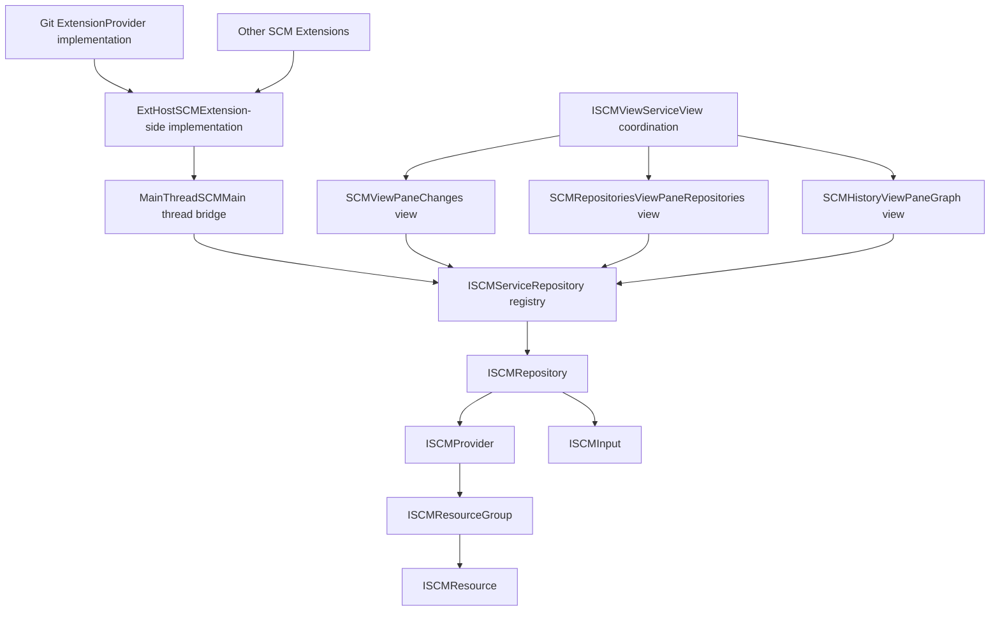
**Sources:** [src/vs/workbench/contrib/scm/common/scm.ts1-267](https://github.com/microsoft/vscode/blob/1be3088d/src/vs/workbench/contrib/scm/common/scm.ts#L1-L267) [src/vs/workbench/api/browser/mainThreadSCM.ts1-100](https://github.com/microsoft/vscode/blob/1be3088d/src/vs/workbench/api/browser/mainThreadSCM.ts#L1-L100) [src/vs/workbench/api/common/extHostSCM.ts1-100](https://github.com/microsoft/vscode/blob/1be3088d/src/vs/workbench/api/common/extHostSCM.ts#L1-L100)

## Core Abstractions

The SCM system defines a hierarchy of interfaces that represent source control concepts:

### Provider Hierarchy

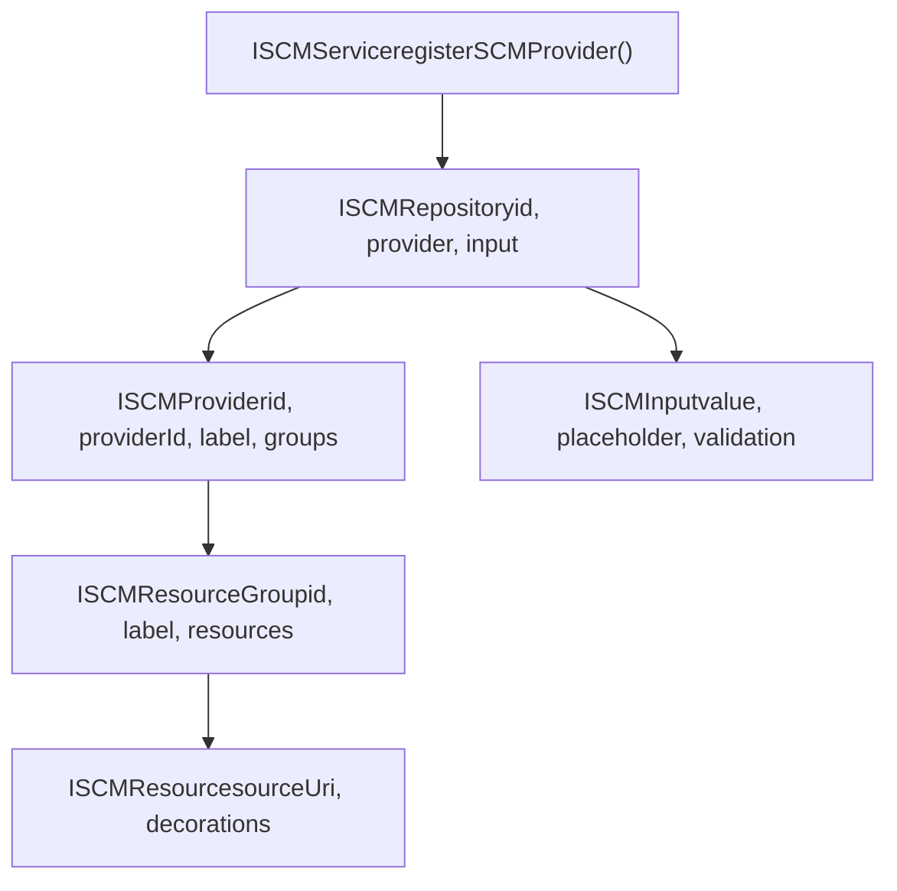
**Sources:** [src/vs/workbench/contrib/scm/common/scm.ts35-178](https://github.com/microsoft/vscode/blob/1be3088d/src/vs/workbench/contrib/scm/common/scm.ts#L35-L178)

### ISCMService

The `ISCMService` is the central registry for all SCM providers. Extensions register providers through this service, which creates `ISCMRepository` instances and fires events when repositories are added or removed.

| Method | Description |
| --- | --- |
| `registerSCMProvider(provider: ISCMProvider)` | Registers a provider and returns an `ISCMRepository` |
| `getRepository(id: string)` | Retrieves a repository by ID |
| `getRepository(resource: URI)` | Retrieves the repository for a given resource URI |

**Sources:** [src/vs/workbench/contrib/scm/common/scm.ts179-191](https://github.com/microsoft/vscode/blob/1be3088d/src/vs/workbench/contrib/scm/common/scm.ts#L179-L191)

### ISCMProvider

The `ISCMProvider` interface represents a single source control provider (e.g., Git for a specific repository). It contains:

-   **Resource Groups**: Collections of changed files (e.g., "Staged Changes", "Changes")
-   **Root URI**: The repository's root location
-   **Observables**: Count badge, commit template, status bar commands
-   **History Provider**: Optional history/graph provider
-   **Action Button**: Optional primary action (e.g., "Commit")

**Sources:** [src/vs/workbench/contrib/scm/common/scm.ts72-97](https://github.com/microsoft/vscode/blob/1be3088d/src/vs/workbench/contrib/scm/common/scm.ts#L72-L97)

### ISCMResource

An `ISCMResource` represents a single changed file with:

-   **sourceUri**: The file's URI
-   **resourceGroup**: Parent group containing this resource
-   **decorations**: Visual indicators (icon, tooltip, strike-through, faded)
-   **command**: Optional command to execute when opened
-   **multiDiffEditor URIs**: Optional URIs for multi-file diff editor

**Sources:** [src/vs/workbench/contrib/scm/common/scm.ts45-54](https://github.com/microsoft/vscode/blob/1be3088d/src/vs/workbench/contrib/scm/common/scm.ts#L45-L54)

### ISCMInput

The `ISCMInput` interface manages the commit message input box with validation, placeholder text, visibility, and history navigation.

**Sources:** [src/vs/workbench/contrib/scm/common/scm.ts141-171](https://github.com/microsoft/vscode/blob/1be3088d/src/vs/workbench/contrib/scm/common/scm.ts#L141-L171)

## Extension API Bridge

The SCM system uses a dual-process architecture where extensions run in an isolated Extension Host（扩展主机） process and communicate with the main UI thread through RPC.

### RPC Communication Flow

> **[Mermaid sequence]**
> *(图表结构无法解析)*

**Sources:** [src/vs/workbench/api/browser/mainThreadSCM.ts281-470](https://github.com/microsoft/vscode/blob/1be3088d/src/vs/workbench/api/browser/mainThreadSCM.ts#L281-L470) [src/vs/workbench/api/common/extHostSCM.ts575-850](https://github.com/microsoft/vscode/blob/1be3088d/src/vs/workbench/api/common/extHostSCM.ts#L575-L850)

### MainThreadSCM Classes

The main thread side creates proxy objects that implement the core interfaces:

| Class | Purpose |
| --- | --- |
| `MainThreadSCMProvider` | Implements `ISCMProvider`, bridges to extension |
| `MainThreadSCMResourceGroup` | Implements `ISCMResourceGroup`, manages resources |
| `MainThreadSCMResource` | Implements `ISCMResource`, represents changed file |
| `MainThreadSCMHistoryProvider` | Implements `ISCMHistoryProvider`, bridges history API |

**Sources:** [src/vs/workbench/api/browser/mainThreadSCM.ts81-470](https://github.com/microsoft/vscode/blob/1be3088d/src/vs/workbench/api/browser/mainThreadSCM.ts#L81-L470)

### ExtHostSCM Classes

The extension host side provides the extension API:

| Class | Purpose |
| --- | --- |
| `ExtHostSCMInputBox` | Implements `vscode.SourceControlInputBox` |
| `ExtHostSourceControlResourceGroup` | Implements `vscode.SourceControlResourceGroup` |
| `ExtHostSourceControl` | Implements `vscode.SourceControl` |
| `ExtHostSCM` | Main coordinator, creates source control instances |

**Sources:** [src/vs/workbench/api/common/extHostSCM.ts277-850](https://github.com/microsoft/vscode/blob/1be3088d/src/vs/workbench/api/common/extHostSCM.ts#L277-L850)

## View System

The SCM system provides three main views that can be arranged in different layouts:

### Changes View (SCMViewPane)

The Changes view displays repositories, input boxes, action buttons, resource groups, and individual resources in a tree structure.

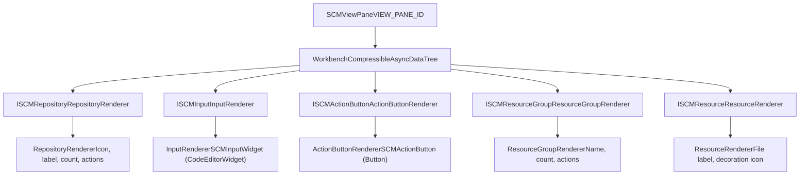
**Tree Element Types:**

-   **Repository**: Shows repository icon, name, count badge, and toolbar actions
-   **Input**: Embeds a `CodeEditorWidget` for commit messages with validation
-   **Action Button**: Primary action button (e.g., "Commit", "Sync Changes")
-   **Resource Group**: Collapsible groups like "Staged Changes" or "Changes"
-   **Resource**: Individual file with status decoration and actions

**View Modes:**

-   **List Mode**: Flat list of resources
-   **Tree Mode**: Hierarchical folder structure using `ResourceTree`

**Sources:** [src/vs/workbench/contrib/scm/browser/scmViewPane.ts115-2640](https://github.com/microsoft/vscode/blob/1be3088d/src/vs/workbench/contrib/scm/browser/scmViewPane.ts#L115-L2640)

### Repositories View (SCMRepositoriesViewPane)

The Repositories view shows all available SCM repositories and allows switching between them. In single-selection mode, it can also display repository artifacts (e.g., CI/CD pipeline results).

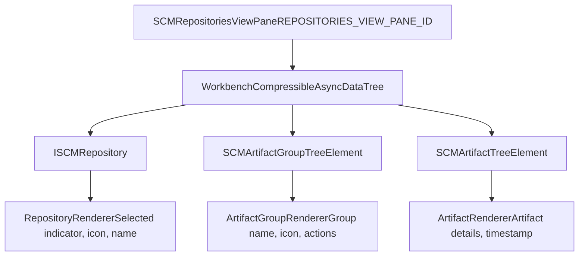
**Selection Modes:**

-   **Multiple**: Select multiple repositories to show in Changes view
-   **Single**: Select one repository, optionally show artifacts

**Sources:** [src/vs/workbench/contrib/scm/browser/scmRepositoriesViewPane.ts1-650](https://github.com/microsoft/vscode/blob/1be3088d/src/vs/workbench/contrib/scm/browser/scmRepositoriesViewPane.ts#L1-L650)

### History View (SCMHistoryViewPane)

The History view displays commit history as a graph with visual swimlanes showing branch and merge relationships.

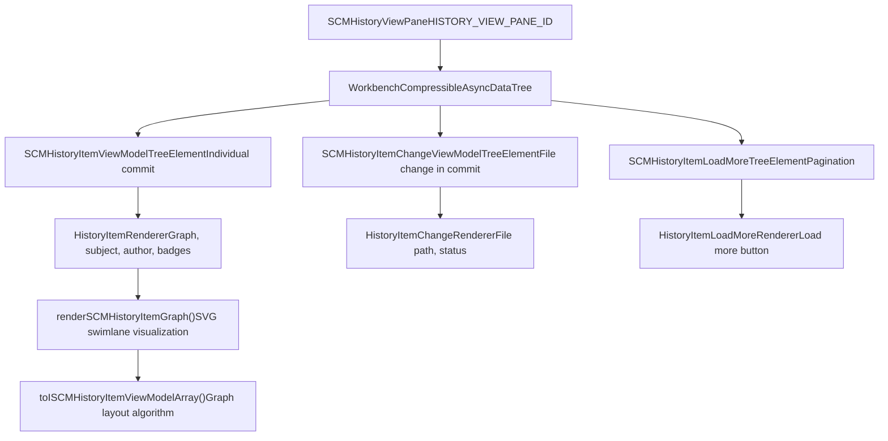
**Graph Visualization:**

-   **Swimlanes**: Vertical lines representing branches
-   **Nodes**: Circles representing commits
-   **Colors**: Automatically assigned to distinguish branches
-   **Special Commits**: "Incoming Changes" and "Outgoing Changes" pseudo-commits

**Sources:** [src/vs/workbench/contrib/scm/browser/scmHistoryViewPane.ts1-1200](https://github.com/microsoft/vscode/blob/1be3088d/src/vs/workbench/contrib/scm/browser/scmHistoryViewPane.ts#L1-L1200) [src/vs/workbench/contrib/scm/browser/scmHistory.ts1-800](https://github.com/microsoft/vscode/blob/1be3088d/src/vs/workbench/contrib/scm/browser/scmHistory.ts#L1-L800)

## History Provider System

The history provider system enables extensions to provide commit history and graph visualization.

### History Provider Interface

```mermaid
flowchart TD
    ISCMHistoryProvider["ISCMHistoryProvider"]
    historyItemRef["historyItemRefCurrent branch/ref"]
    historyItemRemoteRef["historyItemRemoteRefUpstream branch"]
    historyItemBaseRef["historyItemBaseRefBase branch"]
    historyItemRefChanges["historyItemRefChangesRef update events"]
    provideHistoryItemRefs["provideHistoryItemRefs()List branches/tags"]
    provideHistoryItems["provideHistoryItems()Get commits"]
    provideHistoryItemChanges["provideHistoryItemChanges()Get file changes"]
    resolveHistoryItem["resolveHistoryItem()Get commit details"]
    resolveHistoryItemRefsCommonAncestor["resolveHistoryItemRefsCommonAncestor()Find merge base"]

    ISCMHistoryProvider --> historyItemRef
    ISCMHistoryProvider --> historyItemRemoteRef
    ISCMHistoryProvider --> historyItemBaseRef
    ISCMHistoryProvider --> historyItemRefChanges
    ISCMHistoryProvider --> provideHistoryItemRefs
    ISCMHistoryProvider --> provideHistoryItems
    ISCMHistoryProvider --> provideHistoryItemChanges
    ISCMHistoryProvider --> resolveHistoryItem
    ISCMHistoryProvider --> resolveHistoryItemRefsCommonAncestor
```
**Key Observables:**

-   **historyItemRef**: Current HEAD (local branch, tag, or detached commit)
-   **historyItemRemoteRef**: Upstream tracking branch (if exists)
-   **historyItemBaseRef**: Computed merge base for three-way comparisons

**Sources:** [src/vs/workbench/contrib/scm/common/history.ts17-31](https://github.com/microsoft/vscode/blob/1be3088d/src/vs/workbench/contrib/scm/common/history.ts#L17-L31)

### History Item Structure

An `ISCMHistoryItem` contains:

| Field | Description |
| --- | --- |
| `id` | Commit hash |
| `parentIds` | Array of parent commit hashes |
| `subject` | First line of commit message |
| `message` | Full commit message |
| `author` | Author name |
| `authorEmail` | Author email |
| `authorIcon` | Avatar URI or ThemeIcon |
| `timestamp` | Commit timestamp |
| `statistics` | Files changed, insertions, deletions |
| `references` | Branches/tags pointing to this commit |
| `tooltip` | Markdown hover content |

**Sources:** [src/vs/workbench/contrib/scm/common/history.ts63-76](https://github.com/microsoft/vscode/blob/1be3088d/src/vs/workbench/contrib/scm/common/history.ts#L63-L76)

### Graph Layout Algorithm

The graph layout is computed by `toISCMHistoryItemViewModelArray()` which:

1.  Processes commits in topological order
2.  Assigns each branch path to a swimlane (column)
3.  Computes input/output swimlanes for each commit
4.  Handles merges by drawing curves between swimlanes
5.  Colors swimlanes using a rotating palette

**Sources:** [src/vs/workbench/contrib/scm/browser/scmHistory.ts119-420](https://github.com/microsoft/vscode/blob/1be3088d/src/vs/workbench/contrib/scm/browser/scmHistory.ts#L119-L420)

### Special History Items

The system supports two pseudo-commits for showing uncommitted changes:

-   **Incoming Changes** (`SCMIncomingHistoryItemId`): Changes from remote to local
-   **Outgoing Changes** (`SCMOutgoingHistoryItemId`): Changes from local to remote

These are rendered with special icons (down/up arrows) and colors.

**Sources:** [src/vs/workbench/contrib/scm/common/history.ts14-15](https://github.com/microsoft/vscode/blob/1be3088d/src/vs/workbench/contrib/scm/common/history.ts#L14-L15)

## Resource Management

Resources represent changed files and are organized in groups. The system uses efficient delta algorithms to update resources.

### Resource Tree

In tree view mode, resources are organized in a hierarchical folder structure using `ResourceTree`:

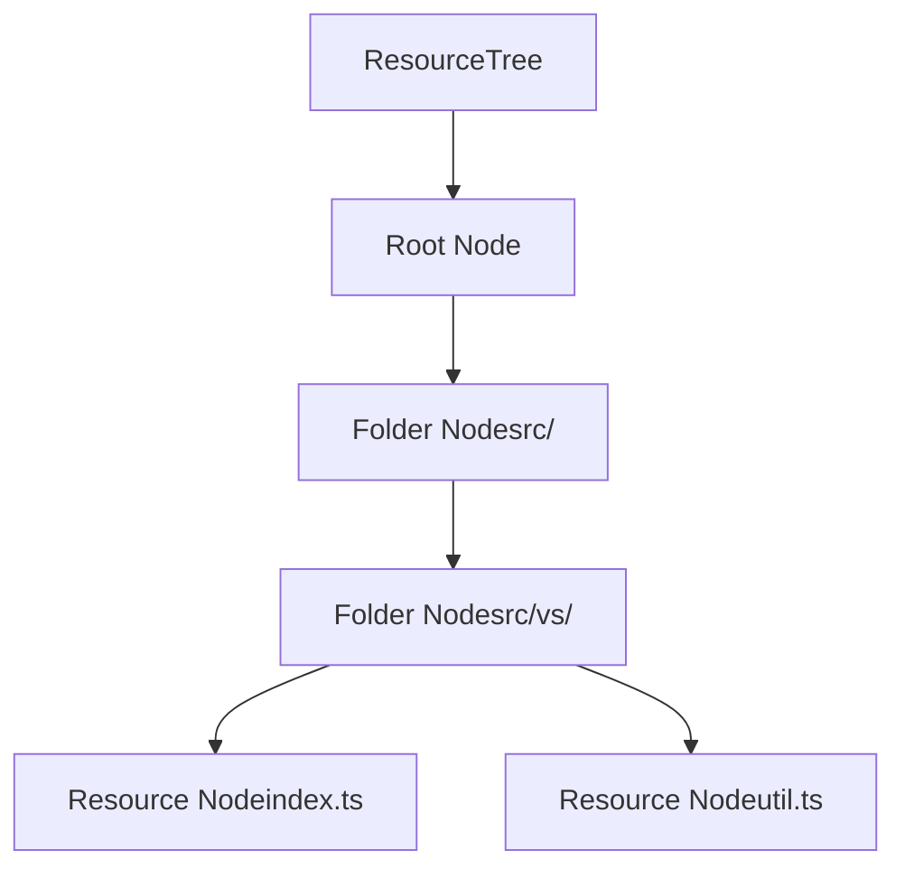
**Compression:** The tree automatically compresses single-child folders (e.g., "src/vs/workbench" becomes one node).

**Sources:** [src/vs/workbench/contrib/scm/browser/scmViewPane.ts739-750](https://github.com/microsoft/vscode/blob/1be3088d/src/vs/workbench/contrib/scm/browser/scmViewPane.ts#L739-L750) [src/vs/base/common/resourceTree.ts](https://github.com/microsoft/vscode/blob/1be3088d/src/vs/base/common/resourceTree.ts)

### Resource Updates via RPC

Resource updates from extensions use delta splicing for efficiency:

```
// Extension side (ExtHostSCM)
class ExtHostSourceControlResourceGroup {
  set resourceStates(resources: vscode.SourceControlResourceState[]) {
    // Compute splice operations
    const splices = sortedDiff(
      this._resourceStates,
      resources,
      compareResourceStates
    );

    // Send delta to main thread
    this._proxy.$spliceResourceStates(handle, splices);
  }
}
```
**Sources:** [src/vs/workbench/api/common/extHostSCM.ts397-550](https://github.com/microsoft/vscode/blob/1be3088d/src/vs/workbench/api/common/extHostSCM.ts#L397-L550)

### Resource Decorations

Each resource has decorations that control its visual appearance:

| Decoration | Effect |
| --- | --- |
| `icon` / `iconDark` | Custom icon (URI or ThemeIcon) |
| `tooltip` | Hover tooltip text |
| `strikeThrough` | Strike-through text style |
| `faded` | Reduced opacity (70%) |

**Sources:** [src/vs/workbench/contrib/scm/common/scm.ts37-43](https://github.com/microsoft/vscode/blob/1be3088d/src/vs/workbench/contrib/scm/common/scm.ts#L37-L43)

## Menu and Action System

The SCM system uses VS Code（Visual Studio Code）'s menu contribution system extensively, with many menu IDs for different contexts.

### Menu IDs

```mermaid
flowchart TD
    MenuId["MenuId (enum)"]
    SCMTitle["MenuId.SCMTitleChanges view title"]
    SCMRepositoriesTitle["MenuId.SCMRepositoriesTitleRepositories view title"]
    SCMHistoryTitle["MenuId.SCMHistoryTitleHistory view title"]
    SCMResourceGroupContext["MenuId.SCMResourceGroupContextResource group context"]
    SCMResourceContext["MenuId.SCMResourceContextResource context"]
    SCMResourceFolderContext["MenuId.SCMResourceFolderContextFolder context"]
    SCMHistoryItemContext["MenuId.SCMHistoryItemContextHistory item context"]
    SCMHistoryItemChangeContext["MenuId.SCMHistoryItemChangeContextHistory item change context"]
    SCMInputBox["MenuId.SCMInputBoxInput box toolbar"]

    MenuId --> SCMTitle
    MenuId --> SCMRepositoriesTitle
    MenuId --> SCMHistoryTitle
    MenuId --> SCMResourceGroupContext
    MenuId --> SCMResourceContext
    MenuId --> SCMResourceFolderContext
    MenuId --> SCMHistoryItemContext
    MenuId --> SCMHistoryItemChangeContext
    MenuId --> SCMInputBox
```
**Sources:** [src/vs/workbench/contrib/scm/browser/menus.ts1-260](https://github.com/microsoft/vscode/blob/1be3088d/src/vs/workbench/contrib/scm/browser/menus.ts#L1-L260)

### Context Keys

The SCM system defines many context keys for controlling menu visibility:

| Context Key | Purpose |
| --- | --- |
| `scmRepository` | Current repository ID |
| `scmProvider` | Provider ID (e.g., "git") |
| `scmProviderCount` | Number of providers |
| `scmResourceGroup` | Current resource group ID |
| `scmResourceState` | Resource context value |
| `scmActiveResourceHasChanges` | Whether active editor has changes |
| `scmActiveResourceRepository` | Repository of active editor resource |

**Sources:** [src/vs/workbench/contrib/scm/browser/activity.ts27-30](https://github.com/microsoft/vscode/blob/1be3088d/src/vs/workbench/contrib/scm/browser/activity.ts#L27-L30) [src/vs/workbench/contrib/scm/browser/scmViewPane.ts2771-2900](https://github.com/microsoft/vscode/blob/1be3088d/src/vs/workbench/contrib/scm/browser/scmViewPane.ts#L2771-L2900)

### Action Button

Providers can define a primary action button that appears prominently in the view:

```
interface ISCMActionButtonDescriptor {
  command: Command & { shortTitle?: string };
  secondaryCommands?: Command[][];  // Dropdown sections
  enabled: boolean;
}
```
The action button is rendered as a `ButtonWithDropdown` if secondary commands are provided.

**Sources:** [src/vs/workbench/contrib/scm/common/scm.ts129-133](https://github.com/microsoft/vscode/blob/1be3088d/src/vs/workbench/contrib/scm/common/scm.ts#L129-L133) [src/vs/workbench/contrib/scm/browser/scmViewPane.ts173-233](https://github.com/microsoft/vscode/blob/1be3088d/src/vs/workbench/contrib/scm/browser/scmViewPane.ts#L173-L233)

## SCM View Service

The `ISCMViewService` coordinates view state across all SCM views.

### Repository Selection

```mermaid
flowchart TD
    ISCMViewService["ISCMViewService"]
    repositories["repositoriesAll registered repositories"]
    visibleRepositories["visibleRepositoriesShown in Changes view"]
    focusedRepository["focusedRepositoryCurrently focused"]
    activeRepository["activeRepositoryObservable<{repository, pinned}>"]
    SingleMode["Single ModeOne repository at a time"]
    MultipleMode["Multiple ModeSelect multiple repos"]
    toggleVisibility["toggleVisibility()Show/hide repository"]
    toggleSortKey["toggleSortKey()Change sort order"]
    toggleSelectionMode["toggleSelectionMode()Switch mode"]
    pinActiveRepository["pinActiveRepository()Pin active repository"]

    ISCMViewService --> repositories
    ISCMViewService --> visibleRepositories
    ISCMViewService --> focusedRepository
    ISCMViewService --> activeRepository
    ISCMViewService --> SingleMode
    ISCMViewService --> MultipleMode
    ISCMViewService --> toggleVisibility
    ISCMViewService --> toggleSortKey
    ISCMViewService --> toggleSelectionMode
    ISCMViewService --> pinActiveRepository
```
**Active Repository Logic:**

-   In multiple-selection mode: determined by focused repository or active editor
-   In single-selection mode: explicitly selected repository
-   Shown in status bar with repository icon and name

**Sources:** [src/vs/workbench/contrib/scm/browser/scmViewService.ts1-570](https://github.com/microsoft/vscode/blob/1be3088d/src/vs/workbench/contrib/scm/browser/scmViewService.ts#L1-L570) [src/vs/workbench/contrib/scm/common/scm.ts226-266](https://github.com/microsoft/vscode/blob/1be3088d/src/vs/workbench/contrib/scm/common/scm.ts#L226-L266)

### Repository Sorting

The service supports three sort orders:

| Sort Key | Behavior |
| --- | --- |
| `DiscoveryTime` | Order repositories were discovered |
| `Name` | Alphabetical by repository name |
| `Path` | Alphabetical by root path |

**Sources:** [src/vs/workbench/contrib/scm/browser/scmViewService.ts280-350](https://github.com/microsoft/vscode/blob/1be3088d/src/vs/workbench/contrib/scm/browser/scmViewService.ts#L280-L350)

## Input Box Widget

The commit message input is implemented as a full `CodeEditorWidget` with syntax highlighting, completions, and validation.

### SCMInputWidget

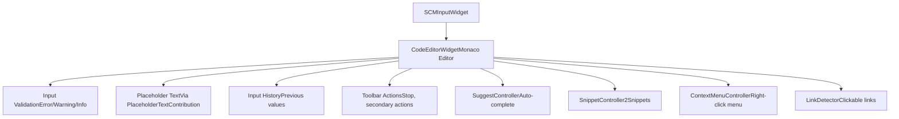
**Editor Options:**

-   Language mode: "scminput"
-   Simple editor mode (no gutter, no line numbers)
-   Word wrap enabled
-   Custom font family/size from settings
-   Auto-grow between min/max line counts

**Sources:** [src/vs/workbench/contrib/scm/browser/scmViewPane.ts296-416](https://github.com/microsoft/vscode/blob/1be3088d/src/vs/workbench/contrib/scm/browser/scmViewPane.ts#L296-L416)

### Validation Display

Validation messages appear below the input box with colored borders:

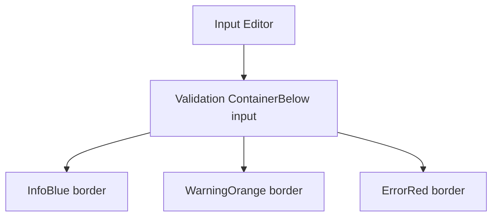
**Sources:** [src/vs/workbench/contrib/scm/browser/scmViewPane.ts411-416](https://github.com/microsoft/vscode/blob/1be3088d/src/vs/workbench/contrib/scm/browser/scmViewPane.ts#L411-L416) [src/vs/workbench/contrib/scm/browser/media/scm.css453-495](https://github.com/microsoft/vscode/blob/1be3088d/src/vs/workbench/contrib/scm/browser/media/scm.css#L453-L495)

## Activity and Status Bar Integration

The SCM system integrates with the Activity Bar (badge count) and Status Bar (repository info, commands).

### Count Badge Logic

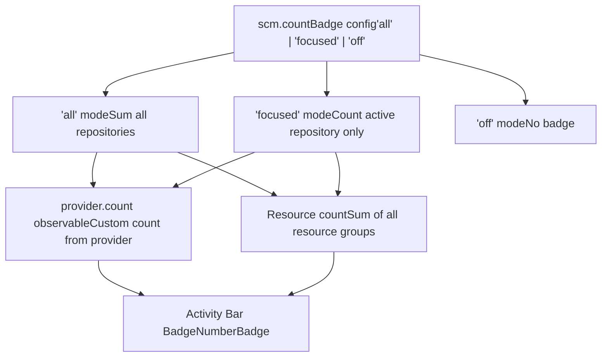
Providers can either specify a custom `count` observable or the system falls back to counting all resources.

**Sources:** [src/vs/workbench/contrib/scm/browser/activity.ts42-136](https://github.com/microsoft/vscode/blob/1be3088d/src/vs/workbench/contrib/scm/browser/activity.ts#L42-L136)

### Status Bar Commands

The active repository's `statusBarCommands` observable populates the status bar:

```
provider.statusBarCommands = observableValue([
  {
    id: 'git.sync',
    title: '$(sync) 2↓ 3↑',
    tooltip: 'Synchronize Changes'
  },
  {
    id: 'git.pull',
    title: 'Pull',
    tooltip: 'Pull from remote'
  }
]);
```
Commands appear left-to-right with the first having priority positioning.

**Sources:** [src/vs/workbench/contrib/scm/browser/activity.ts138-179](https://github.com/microsoft/vscode/blob/1be3088d/src/vs/workbench/contrib/scm/browser/activity.ts#L138-L179)

## Configuration

The SCM system provides extensive configuration options:

| Setting | Purpose |
| --- | --- |
| `scm.defaultViewMode` | Default view mode (list/tree) |
| `scm.defaultViewSortKey` | Default sort order (name/path/status) |
| `scm.autoReveal` | Auto-reveal files in SCM view |
| `scm.inputFontFamily` | Font family for input box |
| `scm.inputFontSize` | Font size for input box |
| `scm.inputMinLineCount` / `scm.inputMaxLineCount` | Input box height range |
| `scm.alwaysShowRepositories` | Always show repository headers |
| `scm.repositories.sortOrder` | Repository sort order |
| `scm.repositories.selectionMode` | Single or multiple selection |
| `scm.countBadge` | Activity bar badge mode |
| `scm.providerCountBadge` | Repository count badge visibility |
| `scm.showActionButton` | Show action button |
| `scm.compactFolders` | Compress single-child folders |
| `scm.graph.pageOnScroll` | Auto-load more history on scroll |
| `scm.graph.pageSize` | Number of commits per page |
| `scm.graph.badges` | Which badges to show in graph |
| `scm.graph.showIncomingChanges` | Show incoming changes pseudo-commit |
| `scm.graph.showOutgoingChanges` | Show outgoing changes pseudo-commit |

**Sources:** [src/vs/workbench/contrib/scm/browser/scm.contribution.ts178-431](https://github.com/microsoft/vscode/blob/1be3088d/src/vs/workbench/contrib/scm/browser/scm.contribution.ts#L178-L431)

## Drag and Drop

The SCM system supports dragging resources to external applications:

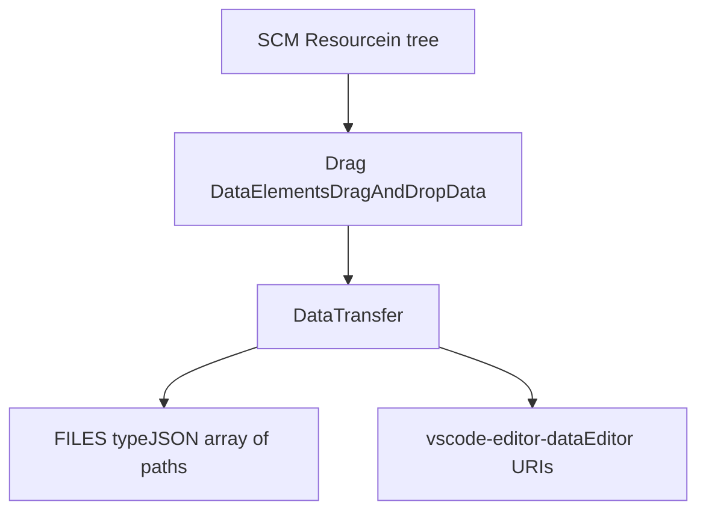
When dragging:

1.  Collects all selected resources
2.  Populates `DataTransfer` with file paths
3.  Calls `fillEditorsDragData()` to add editor data
4.  Enables dragging to file explorer, other editors, etc.

**Sources:** [src/vs/workbench/contrib/scm/browser/scmViewPane.ts236-287](https://github.com/microsoft/vscode/blob/1be3088d/src/vs/workbench/contrib/scm/browser/scmViewPane.ts#L236-L287)

## Working Set Controller

The Working Set Controller (experimental) preserves editor working sets when switching between branches:

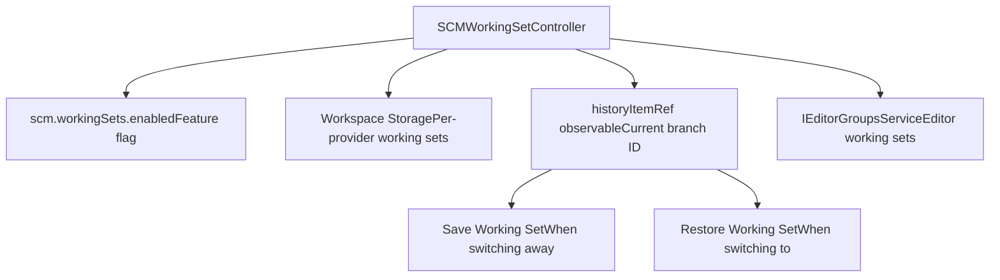
When the current branch changes:

1.  Saves open editors for the old branch
2.  Restores open editors for the new branch (if previously saved)
3.  Falls back to empty or current set (configurable)

**Sources:** [src/vs/workbench/contrib/scm/browser/workingSet.ts1-180](https://github.com/microsoft/vscode/blob/1be3088d/src/vs/workbench/contrib/scm/browser/workingSet.ts#L1-L180)
