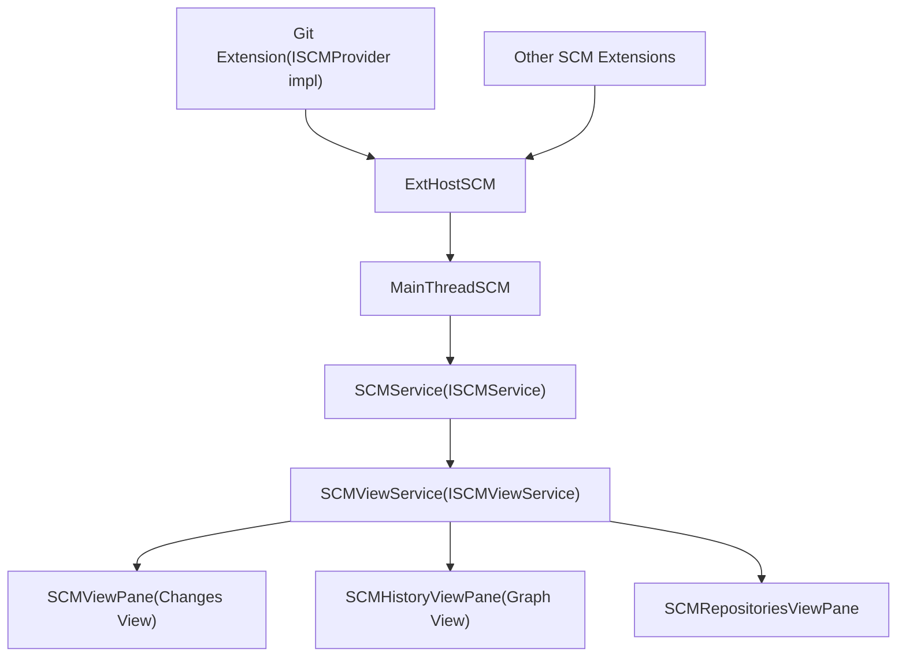
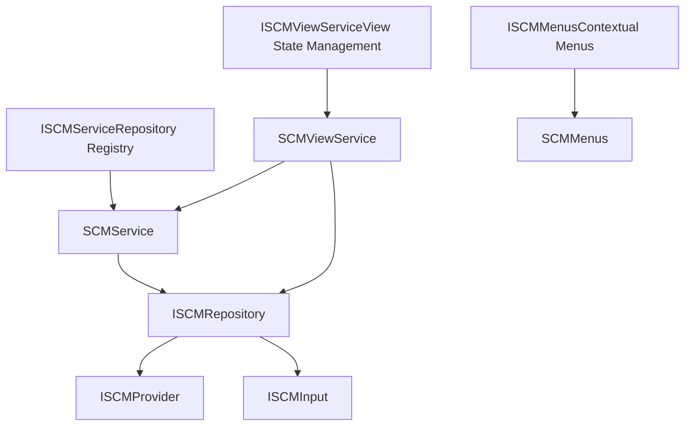
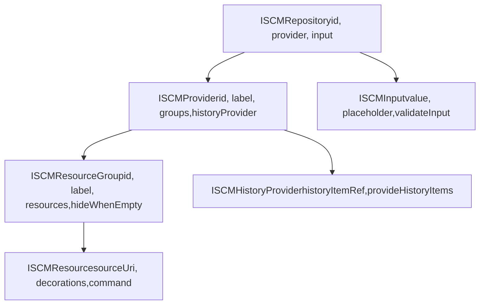
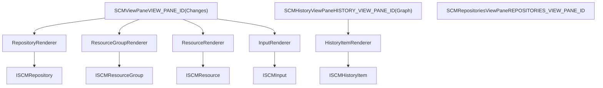
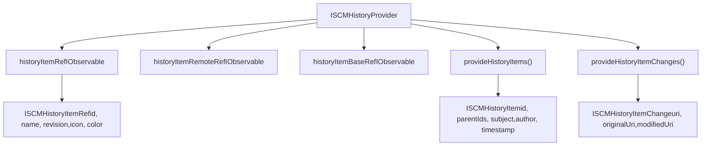
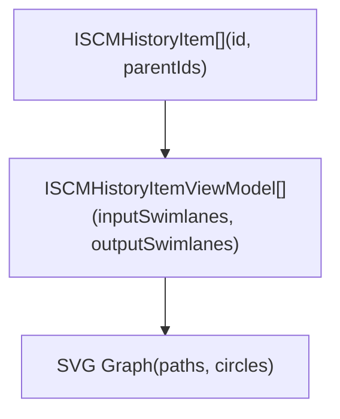
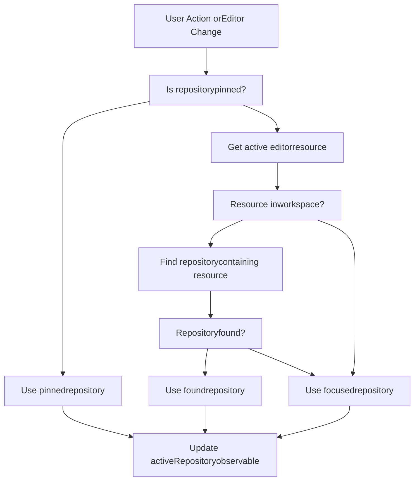

# SCM Framework Architecture

Relevant source files

-   [extensions/git/src/historyProvider.ts](https://github.com/microsoft/vscode/blob/1be3088d/extensions/git/src/historyProvider.ts)
-   [src/vs/workbench/api/browser/mainThreadSCM.ts](https://github.com/microsoft/vscode/blob/1be3088d/src/vs/workbench/api/browser/mainThreadSCM.ts)
-   [src/vs/workbench/api/common/extHostSCM.ts](https://github.com/microsoft/vscode/blob/1be3088d/src/vs/workbench/api/common/extHostSCM.ts)
-   [src/vs/workbench/contrib/scm/browser/activity.ts](https://github.com/microsoft/vscode/blob/1be3088d/src/vs/workbench/contrib/scm/browser/activity.ts)
-   [src/vs/workbench/contrib/scm/browser/media/scm.css](https://github.com/microsoft/vscode/blob/1be3088d/src/vs/workbench/contrib/scm/browser/media/scm.css)
-   [src/vs/workbench/contrib/scm/browser/menus.ts](https://github.com/microsoft/vscode/blob/1be3088d/src/vs/workbench/contrib/scm/browser/menus.ts)
-   [src/vs/workbench/contrib/scm/browser/scm.contribution.ts](https://github.com/microsoft/vscode/blob/1be3088d/src/vs/workbench/contrib/scm/browser/scm.contribution.ts)
-   [src/vs/workbench/contrib/scm/browser/scmHistory.ts](https://github.com/microsoft/vscode/blob/1be3088d/src/vs/workbench/contrib/scm/browser/scmHistory.ts)
-   [src/vs/workbench/contrib/scm/browser/scmHistoryViewPane.ts](https://github.com/microsoft/vscode/blob/1be3088d/src/vs/workbench/contrib/scm/browser/scmHistoryViewPane.ts)
-   [src/vs/workbench/contrib/scm/browser/scmRepositoriesViewPane.ts](https://github.com/microsoft/vscode/blob/1be3088d/src/vs/workbench/contrib/scm/browser/scmRepositoriesViewPane.ts)
-   [src/vs/workbench/contrib/scm/browser/scmRepositoryRenderer.ts](https://github.com/microsoft/vscode/blob/1be3088d/src/vs/workbench/contrib/scm/browser/scmRepositoryRenderer.ts)
-   [src/vs/workbench/contrib/scm/browser/scmViewPane.ts](https://github.com/microsoft/vscode/blob/1be3088d/src/vs/workbench/contrib/scm/browser/scmViewPane.ts)
-   [src/vs/workbench/contrib/scm/browser/scmViewService.ts](https://github.com/microsoft/vscode/blob/1be3088d/src/vs/workbench/contrib/scm/browser/scmViewService.ts)
-   [src/vs/workbench/contrib/scm/browser/util.ts](https://github.com/microsoft/vscode/blob/1be3088d/src/vs/workbench/contrib/scm/browser/util.ts)
-   [src/vs/workbench/contrib/scm/browser/workingSet.ts](https://github.com/microsoft/vscode/blob/1be3088d/src/vs/workbench/contrib/scm/browser/workingSet.ts)
-   [src/vs/workbench/contrib/scm/common/history.ts](https://github.com/microsoft/vscode/blob/1be3088d/src/vs/workbench/contrib/scm/common/history.ts)
-   [src/vs/workbench/contrib/scm/common/scm.ts](https://github.com/microsoft/vscode/blob/1be3088d/src/vs/workbench/contrib/scm/common/scm.ts)
-   [src/vs/workbench/contrib/scm/test/browser/scmHistory.test.ts](https://github.com/microsoft/vscode/blob/1be3088d/src/vs/workbench/contrib/scm/test/browser/scmHistory.test.ts)
-   [src/vscode-dts/vscode.proposed.scmHistoryProvider.d.ts](https://github.com/microsoft/vscode/blob/1be3088d/src/vscode-dts/vscode.proposed.scmHistoryProvider.d.ts)

## Purpose and Scope

This document describes the Source Control Management (SCM) framework architecture in VS Code. The SCM framework provides an extensible, provider-based system that allows extensions to integrate any source control system (Git, SVN, Mercurial, etc.) into the VS Code UI.

This page covers the core abstractions, service architecture, and extension integration points of the SCM framework. For information about the Git extension's specific implementation, see [Git Extension](/microsoft/vscode/11-git-extension). For the history/graph visualization system, see the History Provider System section below.

**Sources:** [src/vs/workbench/contrib/scm/common/scm.ts1-267](https://github.com/microsoft/vscode/blob/1be3088d/src/vs/workbench/contrib/scm/common/scm.ts#L1-L267)

---

## High-Level Architecture

The SCM framework follows VS Code's standard extension architecture with a provider-based model. Extensions implement `ISCMProvider` to register their source control functionality, which is then exposed through a consistent UI across different SCM systems.


**Sources:** [src/vs/workbench/api/browser/mainThreadSCM.ts1-650](https://github.com/microsoft/vscode/blob/1be3088d/src/vs/workbench/api/browser/mainThreadSCM.ts#L1-L650) [src/vs/workbench/api/common/extHostSCM.ts1-900](https://github.com/microsoft/vscode/blob/1be3088d/src/vs/workbench/api/common/extHostSCM.ts#L1-L900) [src/vs/workbench/contrib/scm/browser/scm.contribution.ts1-53](https://github.com/microsoft/vscode/blob/1be3088d/src/vs/workbench/contrib/scm/browser/scm.contribution.ts#L1-L53)

---

## Core Service Architecture

The SCM framework is built around two primary services that manage the lifecycle and presentation of SCM providers.


**Sources:** [src/vs/workbench/contrib/scm/common/scm.ts35-266](https://github.com/microsoft/vscode/blob/1be3088d/src/vs/workbench/contrib/scm/common/scm.ts#L35-L266) [src/vs/workbench/contrib/scm/browser/scmViewService.ts1-650](https://github.com/microsoft/vscode/blob/1be3088d/src/vs/workbench/contrib/scm/browser/scmViewService.ts#L1-L650)

### ISCMService

`ISCMService` is the central registry for SCM providers. It maintains the collection of all registered repositories and provides events for repository lifecycle changes.

**Key Responsibilities:**

-   Repository registration via `registerSCMProvider(provider: ISCMProvider): ISCMRepository`
-   Repository lookup by ID or resource URI
-   Events: `onDidAddRepository`, `onDidRemoveRepository`
-   Maintains `repositories: Iterable<ISCMRepository>` and `repositoryCount: number`

**Sources:** [src/vs/workbench/contrib/scm/common/scm.ts179-191](https://github.com/microsoft/vscode/blob/1be3088d/src/vs/workbench/contrib/scm/common/scm.ts#L179-L191) [src/vs/workbench/contrib/scm/common/scmService.ts1-150](https://github.com/microsoft/vscode/blob/1be3088d/src/vs/workbench/contrib/scm/common/scmService.ts#L1-L150)

### ISCMViewService

`ISCMViewService` manages the presentation and visibility of SCM repositories in the UI, including repository selection, sorting, and the active repository concept.

**Key Responsibilities:**

-   Manages `repositories` (all repositories) and `visibleRepositories` (user-selected subset)
-   Provides `activeRepository: IObservable<{repository, pinned}>` - the repository shown in status bar
-   Repository visibility toggling: `toggleVisibility(repository, visible?)`
-   Repository sorting: `toggleSortKey(sortKey: ISCMRepositorySortKey)`
-   Selection mode: `toggleSelectionMode(mode: ISCMRepositorySelectionMode)` - single vs. multiple selection
-   Focus tracking: `focusedRepository` and `onDidFocusRepository`

**Sources:** [src/vs/workbench/contrib/scm/common/scm.ts226-266](https://github.com/microsoft/vscode/blob/1be3088d/src/vs/workbench/contrib/scm/common/scm.ts#L226-L266) [src/vs/workbench/contrib/scm/browser/scmViewService.ts100-650](https://github.com/microsoft/vscode/blob/1be3088d/src/vs/workbench/contrib/scm/browser/scmViewService.ts#L100-L650)

---

## Core Abstractions

The SCM framework defines a hierarchy of interfaces that model source control concepts.


**Sources:** [src/vs/workbench/contrib/scm/common/scm.ts37-177](https://github.com/microsoft/vscode/blob/1be3088d/src/vs/workbench/contrib/scm/common/scm.ts#L37-L177)

### ISCMProvider

`ISCMProvider` is the core interface that extensions implement to integrate a source control system. Each provider represents a single source control instance (e.g., one Git repository).

**Key Properties:**

| Property | Type | Description |
| --- | --- | --- |
| `id` | `string` | Unique identifier for this provider instance |
| `providerId` | `string` | Type identifier (e.g., "git", "svn") |
| `label` | `string` | Display name shown in UI |
| `rootUri` | `URI?` | Workspace folder root |
| `groups` | `readonly ISCMResourceGroup[]` | Resource groups (e.g., "Changes", "Staged") |
| `inputBoxTextModel` | `ITextModel` | Text model for commit message input |
| `count` | `IObservable<number?>` | Badge count for activity bar |
| `commitTemplate` | `IObservable<string>` | Default commit message template |
| `actionButton` | `IObservable<ISCMActionButtonDescriptor?>` | Primary action button |
| `statusBarCommands` | `IObservable<readonly Command[]>` | Status bar commands |
| `historyProvider` | `IObservable<ISCMHistoryProvider?>` | Optional history provider |

**Sources:** [src/vs/workbench/contrib/scm/common/scm.ts72-97](https://github.com/microsoft/vscode/blob/1be3088d/src/vs/workbench/contrib/scm/common/scm.ts#L72-L97)

### ISCMResourceGroup

Resource groups organize related changes (e.g., "Working Tree Changes" vs "Index Changes" in Git).

**Key Properties:**

-   `id: string` - Unique identifier within the provider
-   `label: string` - Display name
-   `resources: readonly ISCMResource[]` - Array of resources
-   `resourceTree: ResourceTree<ISCMResource, ISCMResourceGroup>` - Tree representation
-   `hideWhenEmpty: boolean` - Whether to hide when no resources
-   `multiDiffEditorEnableViewChanges: boolean` - Enable multi-file diff editor

**Sources:** [src/vs/workbench/contrib/scm/common/scm.ts56-70](https://github.com/microsoft/vscode/blob/1be3088d/src/vs/workbench/contrib/scm/common/scm.ts#L56-L70) [src/vs/workbench/api/browser/mainThreadSCM.ts81-143](https://github.com/microsoft/vscode/blob/1be3088d/src/vs/workbench/api/browser/mainThreadSCM.ts#L81-L143)

### ISCMResource

Represents a single file or resource with changes.

**Key Properties:**

| Property | Type | Description |
| --- | --- | --- |
| `resourceGroup` | `ISCMResourceGroup` | Parent group |
| `sourceUri` | `URI` | Resource location |
| `decorations` | `ISCMResourceDecorations` | Icons, tooltip, strikethrough, faded |
| `command` | `Command?` | Action when clicked |
| `multiDiffEditorOriginalUri` | `URI?` | Original URI for multi-diff |
| `multiDiffEditorModifiedUri` | `URI?` | Modified URI for multi-diff |

**Sources:** [src/vs/workbench/contrib/scm/common/scm.ts45-54](https://github.com/microsoft/vscode/blob/1be3088d/src/vs/workbench/contrib/scm/common/scm.ts#L45-L54) [src/vs/workbench/api/browser/mainThreadSCM.ts145-173](https://github.com/microsoft/vscode/blob/1be3088d/src/vs/workbench/api/browser/mainThreadSCM.ts#L145-L173)

### ISCMInput

The input box interface for commit messages, with validation and history support.

**Key Properties and Methods:**

| Member | Type | Description |
| --- | --- | --- |
| `value` | `string` | Current input text |
| `setValue(value, fromKeyboard)` | `void` | Set input value |
| `placeholder` | `string` | Placeholder text |
| `validateInput` | `IInputValidator` | Async validation function |
| `enabled` | `boolean` | Input enablement state |
| `visible` | `boolean` | Input visibility |
| `showValidationMessage(message, type)` | `void` | Display validation message |
| `showNextHistoryValue()` | `void` | Navigate commit history |
| `showPreviousHistoryValue()` | `void` | Navigate commit history |

**Sources:** [src/vs/workbench/contrib/scm/common/scm.ts141-171](https://github.com/microsoft/vscode/blob/1be3088d/src/vs/workbench/contrib/scm/common/scm.ts#L141-L171) [src/vs/workbench/api/common/extHostSCM.ts277-388](https://github.com/microsoft/vscode/blob/1be3088d/src/vs/workbench/api/common/extHostSCM.ts#L277-L388)

---

## Extension Integration via RPC

Extensions register SCM providers through an RPC (Remote Procedure Call) mechanism that bridges the Extension Host and Main Thread processes.

> **[Mermaid sequence]**
> *(图表结构无法解析)*

**Sources:** [src/vs/workbench/api/common/extHostSCM.ts700-800](https://github.com/microsoft/vscode/blob/1be3088d/src/vs/workbench/api/common/extHostSCM.ts#L700-L800) [src/vs/workbench/api/browser/mainThreadSCM.ts400-500](https://github.com/microsoft/vscode/blob/1be3088d/src/vs/workbench/api/browser/mainThreadSCM.ts#L400-L500)

### ExtHostSCM

`ExtHostSCM` implements the extension-facing API (`vscode.scm` namespace) and manages the extension host side of SCM providers.

**Key Classes:**

| Class | Purpose |
| --- | --- |
| `ExtHostSCM` | Main extension host SCM service |
| `ExtHostSourceControl` | Extension's `vscode.SourceControl` implementation |
| `ExtHostSourceControlResourceGroup` | Extension's resource group implementation |
| `ExtHostSCMInputBox` | Extension's input box implementation |

**Key Methods:**

-   `createSourceControl(id, label, rootUri?): vscode.SourceControl` - Creates a new SCM provider
-   `$executeResourceCommand(handle, groupHandle, resourceHandle)` - Executes resource command
-   `$validateInput(handle, value, cursorPosition)` - Validates commit message input

**Sources:** [src/vs/workbench/api/common/extHostSCM.ts670-900](https://github.com/microsoft/vscode/blob/1be3088d/src/vs/workbench/api/common/extHostSCM.ts#L670-L900)

### MainThreadSCM

`MainThreadSCM` receives provider registrations from extensions and creates corresponding main thread representations.

**Key Classes:**

| Class | Purpose |
| --- | --- |
| `MainThreadSCM` | Main thread SCM bridge |
| `MainThreadSCMProvider` | Main thread provider implementation |
| `MainThreadSCMResourceGroup` | Main thread resource group |
| `MainThreadSCMResource` | Main thread resource |
| `MainThreadSCMHistoryProvider` | Main thread history provider |

**Key RPC Methods:**

-   `$registerSourceControl(handle, id, label, rootUri)` - Register new provider
-   `$updateSourceControl(handle, features)` - Update provider properties
-   `$unregisterSourceControl(handle)` - Unregister provider
-   `$registerGroups(handle, groups, splices)` - Update resource groups
-   `$spliceResourceStates(handle, splices)` - Update resources in groups

**Sources:** [src/vs/workbench/api/browser/mainThreadSCM.ts350-650](https://github.com/microsoft/vscode/blob/1be3088d/src/vs/workbench/api/browser/mainThreadSCM.ts#L350-L650)

---

## View Components

The SCM framework provides three main view components that present SCM data to users.


**Sources:** [src/vs/workbench/contrib/scm/browser/scmViewPane.ts1-100](https://github.com/microsoft/vscode/blob/1be3088d/src/vs/workbench/contrib/scm/browser/scmViewPane.ts#L1-L100) [src/vs/workbench/contrib/scm/browser/scmHistoryViewPane.ts1-100](https://github.com/microsoft/vscode/blob/1be3088d/src/vs/workbench/contrib/scm/browser/scmHistoryViewPane.ts#L1-L100) [src/vs/workbench/contrib/scm/browser/scmRepositoriesViewPane.ts1-100](https://github.com/microsoft/vscode/blob/1be3088d/src/vs/workbench/contrib/scm/browser/scmRepositoriesViewPane.ts#L1-L100)

### SCMViewPane (Changes View)

The primary SCM view that displays repositories, input boxes, resource groups, and changed files in a hierarchical tree.

**Tree Structure:**

```
├─ ISCMRepository (if multiple repositories)
│  ├─ ISCMInput (commit message input)
│  ├─ ISCMActionButton (primary action button)
│  ├─ ISCMResourceGroup (e.g., "Changes")
│  │  ├─ ISCMResource (file1.txt)
│  │  ├─ ISCMResource (file2.txt)
│  │  └─ IResourceNode (folder/)
│  │     └─ ISCMResource (file3.txt)
│  └─ ISCMResourceGroup (e.g., "Staged Changes")
```
**Key Renderers:**

| Renderer | Template ID | Renders |
| --- | --- | --- |
| `RepositoryRenderer` | `"repository"` | Repository headers with icon and actions |
| `InputRenderer` | `"input"` | Commit message input boxes |
| `ActionButtonRenderer` | `"actionButton"` | Primary action buttons (e.g., "Commit") |
| `ResourceGroupRenderer` | `"resource group"` | Resource group headers with count badges |
| `ResourceRenderer` | `"resource"` | Individual file resources with decorations |

**View Modes:**

-   `ViewMode.List` - Flat list of all resources
-   `ViewMode.Tree` - Hierarchical tree by folder structure

**Sources:** [src/vs/workbench/contrib/scm/browser/scmViewPane.ts115-750](https://github.com/microsoft/vscode/blob/1be3088d/src/vs/workbench/contrib/scm/browser/scmViewPane.ts#L115-L750) [src/vs/workbench/contrib/scm/browser/scmViewPane.ts179-233](https://github.com/microsoft/vscode/blob/1be3088d/src/vs/workbench/contrib/scm/browser/scmViewPane.ts#L179-L233) [src/vs/workbench/contrib/scm/browser/scmViewPane.ts296-416](https://github.com/microsoft/vscode/blob/1be3088d/src/vs/workbench/contrib/scm/browser/scmViewPane.ts#L296-L416) [src/vs/workbench/contrib/scm/browser/scmViewPane.ts426-482](https://github.com/microsoft/vscode/blob/1be3088d/src/vs/workbench/contrib/scm/browser/scmViewPane.ts#L426-L482) [src/vs/workbench/contrib/scm/browser/scmViewPane.ts524-706](https://github.com/microsoft/vscode/blob/1be3088d/src/vs/workbench/contrib/scm/browser/scmViewPane.ts#L524-L706)

### SCMHistoryViewPane (Graph View)

Displays source control history as a graph with commits, branches, and tags. This view is only visible when a repository's `historyProvider` is available.

**Tree Structure:**

```
├─ SCMHistoryItemViewModelTreeElement (commit 1)
│  ├─ SCMHistoryItemChangeViewModelTreeElement (file1.txt)
│  └─ SCMHistoryItemChangeViewModelTreeElement (file2.txt)
├─ SCMHistoryItemViewModelTreeElement (commit 2)
├─ SCMHistoryItemLoadMoreTreeElement (load more...)
```
**Key Components:**

-   `HistoryItemRenderer` - Renders commit nodes with graph visualization
-   `HistoryItemChangeRenderer` - Renders file changes within commits
-   Graph rendering via `renderSCMHistoryItemGraph()` - SVG-based swimlane visualization
-   Supports filtering by history item refs (branches, tags)
-   Supports search/filter text

**Sources:** [src/vs/workbench/contrib/scm/browser/scmHistoryViewPane.ts1-1000](https://github.com/microsoft/vscode/blob/1be3088d/src/vs/workbench/contrib/scm/browser/scmHistoryViewPane.ts#L1-L1000) [src/vs/workbench/contrib/scm/browser/scmHistoryViewPane.ts410-427](https://github.com/microsoft/vscode/blob/1be3088d/src/vs/workbench/contrib/scm/browser/scmHistoryViewPane.ts#L410-L427) [src/vs/workbench/contrib/scm/browser/scmHistoryViewPane.ts439-639](https://github.com/microsoft/vscode/blob/1be3088d/src/vs/workbench/contrib/scm/browser/scmHistoryViewPane.ts#L439-L639)

### SCMRepositoriesViewPane

Lists all registered SCM repositories for selection and management. Primarily used when multiple repositories are available.

**Tree Structure:**

```
├─ ISCMRepository (Git - projectA)
├─ ISCMRepository (Git - projectB)
└─ ISCMRepository (SVN - projectC)
```
**Features:**

-   Repository selection (single or multiple mode via `ISCMRepositorySelectionMode`)
-   Repository sorting by discovery time, name, or path
-   Count badges showing resource counts
-   Repository-specific contextual actions

**Sources:** [src/vs/workbench/contrib/scm/browser/scmRepositoriesViewPane.ts1-500](https://github.com/microsoft/vscode/blob/1be3088d/src/vs/workbench/contrib/scm/browser/scmRepositoriesViewPane.ts#L1-L500) [src/vs/workbench/contrib/scm/browser/scmRepositoryRenderer.ts1-200](https://github.com/microsoft/vscode/blob/1be3088d/src/vs/workbench/contrib/scm/browser/scmRepositoryRenderer.ts#L1-L200)

---

## History Provider System

The history provider system enables SCM providers to expose commit history, branches, tags, and graph visualization.


**Sources:** [src/vs/workbench/contrib/scm/common/history.ts1-100](https://github.com/microsoft/vscode/blob/1be3088d/src/vs/workbench/contrib/scm/common/history.ts#L1-L100)

### ISCMHistoryProvider

The history provider interface that extensions implement to expose commit history.

**Observable References:**

| Property | Type | Description |
| --- | --- | --- |
| `historyItemRef` | `IObservable<ISCMHistoryItemRef?>` | Current branch/commit (HEAD) |
| `historyItemRemoteRef` | `IObservable<ISCMHistoryItemRef?>` | Upstream remote reference |
| `historyItemBaseRef` | `IObservable<ISCMHistoryItemRef?>` | Base reference for comparisons |
| `historyItemRefChanges` | `IObservable<ISCMHistoryItemRefsChangeEvent>` | Ref changes (added/modified/removed) |

**Provider Methods:**

| Method | Returns | Description |
| --- | --- | --- |
| `provideHistoryItemRefs(refs?, token)` | `ISCMHistoryItemRef[]?` | List all branches, tags, etc. |
| `provideHistoryItems(options, token)` | `ISCMHistoryItem[]?` | Load commit history with paging |
| `provideHistoryItemChanges(id, parentId, token)` | `ISCMHistoryItemChange[]?` | Get file changes for a commit |
| `resolveHistoryItem(id, token)` | `ISCMHistoryItem?` | Resolve full commit details |
| `resolveHistoryItemRefsCommonAncestor(refs, token)` | `string?` | Find merge base commit |

**Sources:** [src/vs/workbench/contrib/scm/common/history.ts17-31](https://github.com/microsoft/vscode/blob/1be3088d/src/vs/workbench/contrib/scm/common/history.ts#L17-L31) [extensions/git/src/historyProvider.ts42-500](https://github.com/microsoft/vscode/blob/1be3088d/extensions/git/src/historyProvider.ts#L42-L500)

### ISCMHistoryItem

Represents a single commit or history entry.

**Properties:**

| Property | Type | Description |
| --- | --- | --- |
| `id` | `string` | Commit hash/identifier |
| `parentIds` | `string[]` | Parent commit IDs |
| `subject` | `string` | First line of commit message |
| `message` | `string` | Full commit message |
| `displayId` | `string?` | Short hash for display |
| `author` | `string?` | Author name |
| `authorEmail` | `string?` | Author email |
| `authorIcon` | `URI | ThemeIcon?` | Author avatar |
| `timestamp` | `number?` | Commit timestamp (ms) |
| `statistics` | `ISCMHistoryItemStatistics?` | File change counts |
| `references` | `ISCMHistoryItemRef[]?` | Associated branches/tags |

**Sources:** [src/vs/workbench/contrib/scm/common/history.ts63-76](https://github.com/microsoft/vscode/blob/1be3088d/src/vs/workbench/contrib/scm/common/history.ts#L63-L76)

### Graph Visualization

The history graph is rendered using SVG swimlanes to visualize commit relationships and branches.

**Graph Model Transformation:**


**Graph Algorithm:**

-   `toISCMHistoryItemViewModelArray()` processes the parent/child relationships
-   Assigns color-coded swimlanes to different branches
-   Tracks swimlane continuity and merges
-   Special handling for incoming/outgoing changes (`SCMIncomingHistoryItemId`, `SCMOutgoingHistoryItemId`)

**Rendering:**

-   `SWIMLANE_WIDTH = 11px` - Width of each branch lane
-   `SWIMLANE_HEIGHT = 22px` - Height of each commit row
-   `renderSCMHistoryItemGraph()` generates SVG with paths and circles
-   Color palette: `colorRegistry` array of theme-independent colors

**Sources:** [src/vs/workbench/contrib/scm/browser/scmHistory.ts1-800](https://github.com/microsoft/vscode/blob/1be3088d/src/vs/workbench/contrib/scm/browser/scmHistory.ts#L1-L800) [src/vs/workbench/contrib/scm/browser/scmHistory.ts20-24](https://github.com/microsoft/vscode/blob/1be3088d/src/vs/workbench/contrib/scm/browser/scmHistory.ts#L20-L24) [src/vs/workbench/contrib/scm/browser/scmHistory.ts100-600](https://github.com/microsoft/vscode/blob/1be3088d/src/vs/workbench/contrib/scm/browser/scmHistory.ts#L100-L600)

---

## Menu System

The SCM framework uses VS Code's menu system to provide contextual actions at different levels.

**Menu IDs:**

| Menu ID | Location | Context |
| --- | --- | --- |
| `MenuId.SCMTitle` | SCM view titlebar | Global SCM actions |
| `MenuId.SCMResourceGroupContext` | Resource group header | Group-specific actions |
| `MenuId.SCMResourceContext` | Individual resource | Resource-specific actions |
| `MenuId.SCMResourceFolderContext` | Folder nodes in tree | Folder actions |
| `MenuId.SCMHistoryTitle` | History view titlebar | History view actions |
| `MenuId.SCMHistoryItemContext` | Commit item | Commit actions |
| `MenuId.SCMHistoryItemChangeContext` | File change in commit | File change actions |

**Menu Management:**

`ISCMMenus` provides a unified interface for accessing menus:

```
interface ISCMRepositoryMenus {
  readonly titleMenu: ISCMTitleMenu;
  getRepositoryMenu(repository): IMenu;
  getRepositoryContextMenu(repository): IMenu;
  getResourceGroupMenu(group): IMenu;
  getResourceMenu(resource): IMenu;
  getResourceFolderMenu(group): IMenu;
}
```
The `SCMMenus` class implements this interface and caches menu instances based on context values, creating specialized menus via context key overlays (e.g., `scmResourceState` context key).

**Sources:** [src/vs/workbench/contrib/scm/browser/menus.ts1-300](https://github.com/microsoft/vscode/blob/1be3088d/src/vs/workbench/contrib/scm/browser/menus.ts#L1-L300) [src/vs/workbench/contrib/scm/common/scm.ts193-213](https://github.com/microsoft/vscode/blob/1be3088d/src/vs/workbench/contrib/scm/common/scm.ts#L193-L213)

---

## Repository Lifecycle

The complete lifecycle of an SCM repository from extension registration to disposal.

> **[Mermaid sequence]**
> *(图表结构无法解析)*

**Sources:** [src/vs/workbench/api/common/extHostSCM.ts700-800](https://github.com/microsoft/vscode/blob/1be3088d/src/vs/workbench/api/common/extHostSCM.ts#L700-L800) [src/vs/workbench/api/browser/mainThreadSCM.ts400-600](https://github.com/microsoft/vscode/blob/1be3088d/src/vs/workbench/api/browser/mainThreadSCM.ts#L400-L600) [src/vs/workbench/contrib/scm/common/scmService.ts1-150](https://github.com/microsoft/vscode/blob/1be3088d/src/vs/workbench/contrib/scm/common/scmService.ts#L1-L150)

---

## Active Repository Selection

The active repository concept determines which repository is shown in the status bar and receives default actions.

**Selection Logic:**


**Implementation:**

The `SCMViewService` maintains an observable `activeRepository` that automatically updates based on:

1.  **Pinned repository** - User explicitly selected via repository picker
2.  **Editor-associated repository** - Repository containing the active editor's file
3.  **Focused repository** - Last repository that received focus

The observable is derived from editor service events and repository changes.

**Sources:** [src/vs/workbench/contrib/scm/browser/scmViewService.ts200-400](https://github.com/microsoft/vscode/blob/1be3088d/src/vs/workbench/contrib/scm/browser/scmViewService.ts#L200-L400) [src/vs/workbench/contrib/scm/browser/activity.ts1-230](https://github.com/microsoft/vscode/blob/1be3088d/src/vs/workbench/contrib/scm/browser/activity.ts#L1-L230)

---

## Configuration

The SCM framework exposes numerous configuration options to customize behavior and appearance.

**Key Configuration Settings:**

| Setting | Type | Default | Description |
| --- | --- | --- | --- |
| `scm.defaultViewMode` | `"tree" | "list"` | `"list"` | Default resource view mode |
| `scm.defaultViewSortKey` | `"name" | "path" | "status"` | `"path"` | Default sorting order |
| `scm.repositories.sortOrder` | `"discovery time" | "name" | "path"` | `"discovery time"` | Repository sorting |
| `scm.repositories.selectionMode` | `"single" | "multiple"` | `"multiple"` | Repository selection mode |
| `scm.autoReveal` | `boolean` | `true` | Auto-reveal files in SCM view |
| `scm.countBadge` | `"all" | "focused" | "off"` | `"all"` | Activity bar count badge |
| `scm.alwaysShowActions` | `boolean` | `false` | Always show inline actions |
| `scm.graph.pageSize` | `number` | `50` | History items per page |
| `scm.graph.badges` | `"all" | "filter"` | `"filter"` | History item ref badges |

**Sources:** [src/vs/workbench/contrib/scm/browser/scm.contribution.ts178-431](https://github.com/microsoft/vscode/blob/1be3088d/src/vs/workbench/contrib/scm/browser/scm.contribution.ts#L178-L431)

---

## Summary

The SCM Framework Architecture provides a comprehensive, extensible system for source control integration:

1.  **Provider-Based Model**: Extensions implement `ISCMProvider` to expose any SCM system
2.  **Process Isolation**: Extension Host and Main Thread separation via RPC for stability
3.  **Hierarchical Data Model**: Repository → ResourceGroup → Resource structure
4.  **Observable State**: Reactive updates using `IObservable` for UI synchronization
5.  **Flexible UI**: Multiple views (Changes, History, Repositories) with customizable rendering
6.  **History System**: Optional commit history with graph visualization
7.  **Menu Integration**: Contextual actions at all levels
8.  **Multi-Repository Support**: Single and multiple selection modes

The framework successfully abstracts source control concepts while remaining flexible enough to accommodate different SCM systems' unique features.

**Sources:** [src/vs/workbench/contrib/scm/common/scm.ts1-267](https://github.com/microsoft/vscode/blob/1be3088d/src/vs/workbench/contrib/scm/common/scm.ts#L1-L267) [src/vs/workbench/contrib/scm/browser/scm.contribution.ts1-600](https://github.com/microsoft/vscode/blob/1be3088d/src/vs/workbench/contrib/scm/browser/scm.contribution.ts#L1-L600) [src/vs/workbench/api/browser/mainThreadSCM.ts1-650](https://github.com/microsoft/vscode/blob/1be3088d/src/vs/workbench/api/browser/mainThreadSCM.ts#L1-L650) [src/vs/workbench/api/common/extHostSCM.ts1-900](https://github.com/microsoft/vscode/blob/1be3088d/src/vs/workbench/api/common/extHostSCM.ts#L1-L900)
