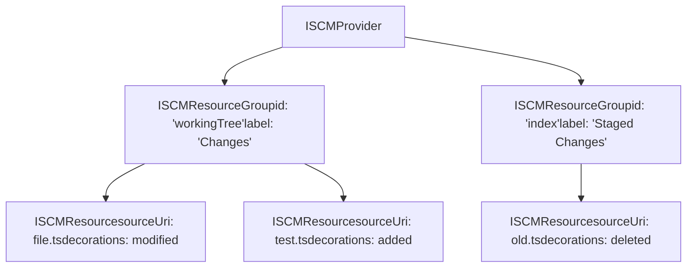
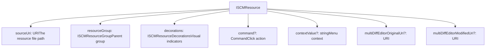
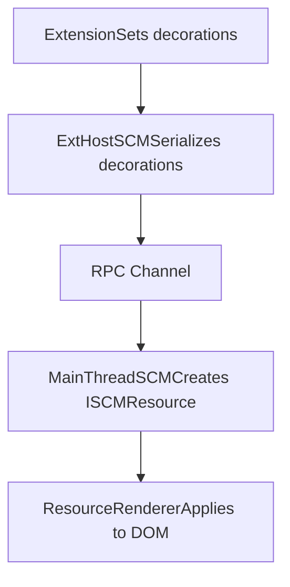
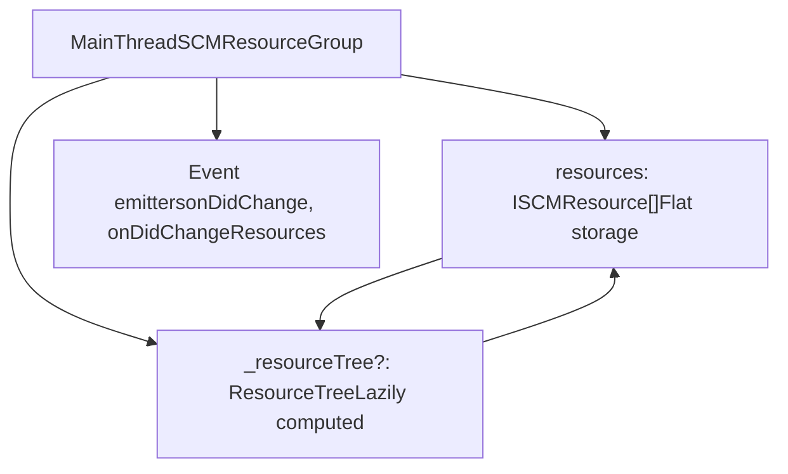
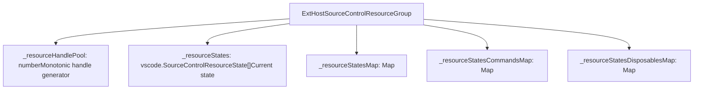
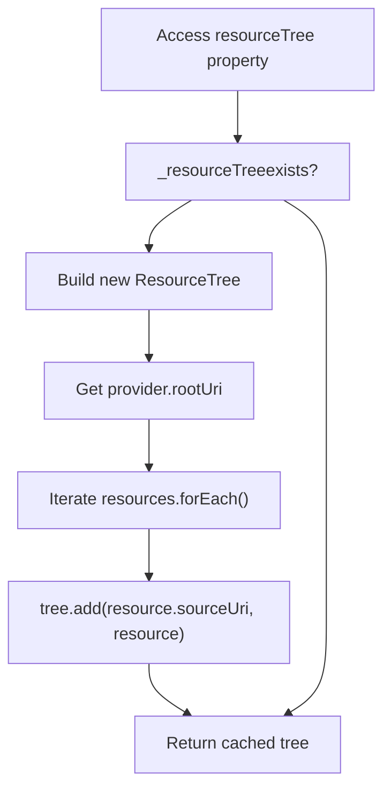
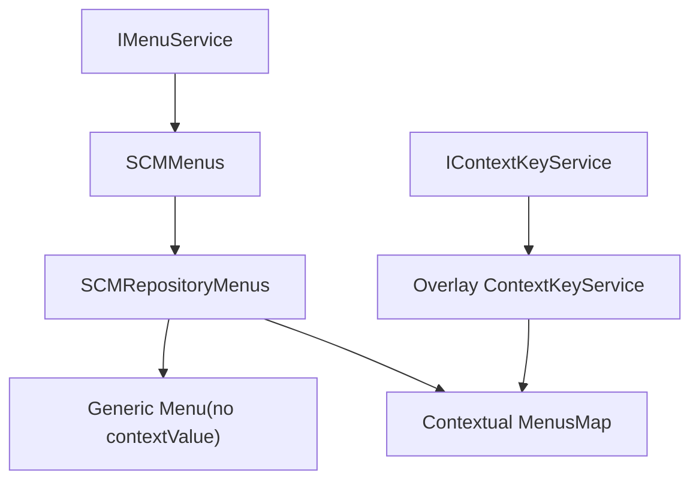
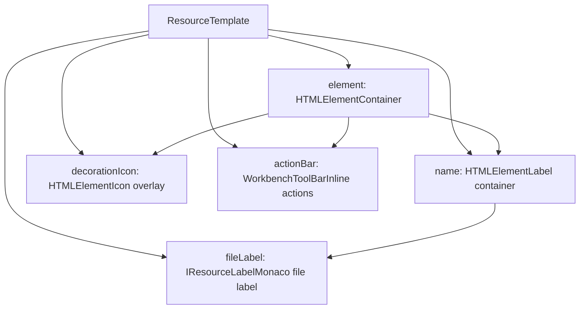
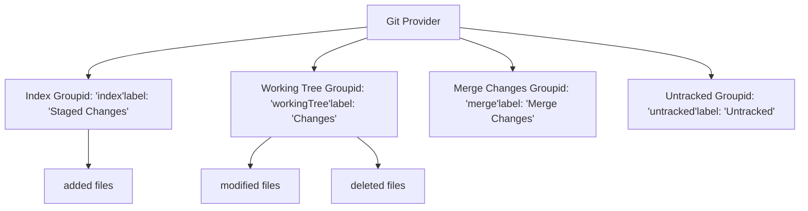

# SCM Provider System

Relevant source files

-   [extensions/git/src/historyProvider.ts](https://github.com/microsoft/vscode/blob/1be3088d/extensions/git/src/historyProvider.ts)
-   [src/vs/workbench/api/browser/mainThreadSCM.ts](https://github.com/microsoft/vscode/blob/1be3088d/src/vs/workbench/api/browser/mainThreadSCM.ts)
-   [src/vs/workbench/api/common/extHostSCM.ts](https://github.com/microsoft/vscode/blob/1be3088d/src/vs/workbench/api/common/extHostSCM.ts)
-   [src/vs/workbench/contrib/scm/browser/activity.ts](https://github.com/microsoft/vscode/blob/1be3088d/src/vs/workbench/contrib/scm/browser/activity.ts)
-   [src/vs/workbench/contrib/scm/browser/media/scm.css](https://github.com/microsoft/vscode/blob/1be3088d/src/vs/workbench/contrib/scm/browser/media/scm.css)
-   [src/vs/workbench/contrib/scm/browser/menus.ts](https://github.com/microsoft/vscode/blob/1be3088d/src/vs/workbench/contrib/scm/browser/menus.ts)
-   [src/vs/workbench/contrib/scm/browser/scm.contribution.ts](https://github.com/microsoft/vscode/blob/1be3088d/src/vs/workbench/contrib/scm/browser/scm.contribution.ts)
-   [src/vs/workbench/contrib/scm/browser/scmHistory.ts](https://github.com/microsoft/vscode/blob/1be3088d/src/vs/workbench/contrib/scm/browser/scmHistory.ts)
-   [src/vs/workbench/contrib/scm/browser/scmHistoryViewPane.ts](https://github.com/microsoft/vscode/blob/1be3088d/src/vs/workbench/contrib/scm/browser/scmHistoryViewPane.ts)
-   [src/vs/workbench/contrib/scm/browser/scmRepositoriesViewPane.ts](https://github.com/microsoft/vscode/blob/1be3088d/src/vs/workbench/contrib/scm/browser/scmRepositoriesViewPane.ts)
-   [src/vs/workbench/contrib/scm/browser/scmRepositoryRenderer.ts](https://github.com/microsoft/vscode/blob/1be3088d/src/vs/workbench/contrib/scm/browser/scmRepositoryRenderer.ts)
-   [src/vs/workbench/contrib/scm/browser/scmViewPane.ts](https://github.com/microsoft/vscode/blob/1be3088d/src/vs/workbench/contrib/scm/browser/scmViewPane.ts)
-   [src/vs/workbench/contrib/scm/browser/scmViewService.ts](https://github.com/microsoft/vscode/blob/1be3088d/src/vs/workbench/contrib/scm/browser/scmViewService.ts)
-   [src/vs/workbench/contrib/scm/browser/util.ts](https://github.com/microsoft/vscode/blob/1be3088d/src/vs/workbench/contrib/scm/browser/util.ts)
-   [src/vs/workbench/contrib/scm/browser/workingSet.ts](https://github.com/microsoft/vscode/blob/1be3088d/src/vs/workbench/contrib/scm/browser/workingSet.ts)
-   [src/vs/workbench/contrib/scm/common/history.ts](https://github.com/microsoft/vscode/blob/1be3088d/src/vs/workbench/contrib/scm/common/history.ts)
-   [src/vs/workbench/contrib/scm/common/scm.ts](https://github.com/microsoft/vscode/blob/1be3088d/src/vs/workbench/contrib/scm/common/scm.ts)
-   [src/vs/workbench/contrib/scm/test/browser/scmHistory.test.ts](https://github.com/microsoft/vscode/blob/1be3088d/src/vs/workbench/contrib/scm/test/browser/scmHistory.test.ts)
-   [src/vscode-dts/vscode.proposed.scmHistoryProvider.d.ts](https://github.com/microsoft/vscode/blob/1be3088d/src/vscode-dts/vscode.proposed.scmHistoryProvider.d.ts)

## Purpose and Scope

This document details the SCM (Source Control Management) provider data model, including resource groups, resources, decorations, and the resource tree structure that providers use to represent their state. For information about the overall SCM framework and service architecture, see [SCM Framework Architecture](/microsoft/vscode/10.1-scm-framework-architecture). For UI rendering and view components, see [SCM Views and UI Components](/microsoft/vscode/10.3-scm-views-and-ui-components). For history provider functionality, see [SCM History Provider](/microsoft/vscode/10.4-scm-history-provider).

## Core Concepts

The SCM provider system organizes source control data into a three-level hierarchy:

1.  **Provider**: Represents a source control system (e.g., Git, SVN)
2.  **Resource Groups**: Collections of resources sharing common characteristics (e.g., "Staged Changes", "Working Tree")
3.  **Resources**: Individual files or URIs with source control state and decorations


Sources: [src/vs/workbench/contrib/scm/common/scm.ts56-97](https://github.com/microsoft/vscode/blob/1be3088d/src/vs/workbench/contrib/scm/common/scm.ts#L56-L97)

## Resource Group Interface

The `ISCMResourceGroup` interface defines a collection of resources with common characteristics.

### Properties and Structure

| Property | Type | Description |
| --- | --- | --- |
| `id` | `string` | Unique identifier within provider |
| `label` | `string` | Display name (e.g., "Changes") |
| `provider` | `ISCMProvider` | Parent provider reference |
| `resources` | `readonly ISCMResource[]` | Flat array of resources |
| `resourceTree` | `ResourceTree<ISCMResource, ISCMResourceGroup>` | Hierarchical tree representation |
| `hideWhenEmpty` | `boolean` | Hide group when no resources |
| `contextValue` | `string | undefined` | Context for menu contributions |
| `multiDiffEditorEnableViewChanges` | `boolean` | Enable multi-diff features |

### Event Emitters

-   `onDidChange`: Fires when group properties (label, contextValue) change
-   `onDidChangeResources`: Fires when resources are added, removed, or modified

Sources: [src/vs/workbench/contrib/scm/common/scm.ts56-70](https://github.com/microsoft/vscode/blob/1be3088d/src/vs/workbench/contrib/scm/common/scm.ts#L56-L70)

## Resource Interface

The `ISCMResource` interface represents an individual file or URI with source control state.

### Core Properties


### Methods

-   `open(preserveFocus: boolean): Promise<void>`: Opens the resource, typically showing a diff editor

Sources: [src/vs/workbench/contrib/scm/common/scm.ts45-54](https://github.com/microsoft/vscode/blob/1be3088d/src/vs/workbench/contrib/scm/common/scm.ts#L45-L54)

## Decorations System

The `ISCMResourceDecorations` interface provides visual indicators for resource states.

### Decoration Properties

| Property | Type | Purpose | Example |
| --- | --- | --- | --- |
| `icon` | `URI | ThemeIcon` | Light theme icon | `$(file-modified)` |
| `iconDark` | `URI | ThemeIcon` | Dark theme icon | Modified icon (dark variant) |
| `tooltip` | `string` | Hover text | "Modified", "Untracked" |
| `strikeThrough` | `boolean` | Strike through text | Deleted files |
| `faded` | `boolean` | Reduce opacity | Ignored files |

### Decoration Flow


Sources: [src/vs/workbench/contrib/scm/common/scm.ts37-43](https://github.com/microsoft/vscode/blob/1be3088d/src/vs/workbench/contrib/scm/common/scm.ts#L37-L43) [src/vs/workbench/api/common/extHostSCM.ts49-61](https://github.com/microsoft/vscode/blob/1be3088d/src/vs/workbench/api/common/extHostSCM.ts#L49-L61)

## Main Thread Implementation

### MainThreadSCMResourceGroup

The `MainThreadSCMResourceGroup` class manages resource groups in the main (UI) process.

**Key Implementation Details:**


**Update Methods:**

| Method | Parameters | Purpose |
| --- | --- | --- |
| `splice(start, deleteCount, toInsert)` | Start index, delete count, new resources | Updates resources array |
| `$updateGroup(features)` | `SCMGroupFeatures` | Updates hideWhenEmpty, contextValue |
| `$updateGroupLabel(label)` | `string` | Updates display label |

The resource tree is cached and invalidated on changes for performance:

```
get resourceTree(): ResourceTree<ISCMResource, ISCMResourceGroup> {
    if (!this._resourceTree) {
        const rootUri = this.provider.rootUri ?? URI.file('/');
        this._resourceTree = new ResourceTree<ISCMResource, ISCMResourceGroup>(
            this, rootUri, this._uriIdentService.extUri
        );
        for (const resource of this.resources) {
            this._resourceTree.add(resource.sourceUri, resource);
        }
    }
    return this._resourceTree;
}
```
Sources: [src/vs/workbench/api/browser/mainThreadSCM.ts81-143](https://github.com/microsoft/vscode/blob/1be3088d/src/vs/workbench/api/browser/mainThreadSCM.ts#L81-L143)

### MainThreadSCMResource

The `MainThreadSCMResource` class represents a single resource on the main thread.

**Constructor Signature:**

```
constructor(
    private readonly proxy: ExtHostSCMShape,
    private readonly sourceControlHandle: number,
    private readonly groupHandle: number,
    private readonly handle: number,
    readonly sourceUri: URI,
    readonly resourceGroup: ISCMResourceGroup,
    readonly decorations: ISCMResourceDecorations,
    readonly contextValue: string | undefined,
    readonly command: Command | undefined,
    readonly multiDiffEditorOriginalUri: URI | undefined,
    readonly multiDiffEditorModifiedUri: URI | undefined
)
```
**RPC Delegation:**

The `open()` method delegates back to the extension host:

```
open(preserveFocus: boolean): Promise<void> {
    return this.proxy.$executeResourceCommand(
        this.sourceControlHandle,
        this.groupHandle,
        this.handle,
        preserveFocus
    );
}
```
Sources: [src/vs/workbench/api/browser/mainThreadSCM.ts145-173](https://github.com/microsoft/vscode/blob/1be3088d/src/vs/workbench/api/browser/mainThreadSCM.ts#L145-L173)

## Extension Host Implementation

### ExtHostSourceControlResourceGroup

The `ExtHostSourceControlResourceGroup` class manages resource groups on the extension host side.

**State Management:**


**Resource States Property:**

When extensions set `resourceStates`, the implementation:

1.  Compares new states with existing states using `compareResourceStates()`
2.  Computes a sorted diff using `sortedDiff()`
3.  Generates `SCMRawResourceSplices` describing changes
4.  Sends splices to main thread via `$spliceResourceStates()`

Sources: [src/vs/workbench/api/common/extHostSCM.ts390-455](https://github.com/microsoft/vscode/blob/1be3088d/src/vs/workbench/api/common/extHostSCM.ts#L390-L455)

### Resource Comparison Logic

The `compareResourceStates()` function ensures stable ordering by comparing:

1.  **URI path**: Using `comparePaths()` (case-sensitive on Linux)
2.  **Command**: If both resources have commands, compares command properties
3.  **Decorations**: Compares icon paths, tooltip, strikethrough, faded
4.  **Multi-diff URIs**: Compares original and modified URIs

This multi-level comparison ensures that identical resources maintain their order, enabling efficient splice detection through binary search.

Sources: [src/vs/workbench/api/common/extHostSCM.ts198-250](https://github.com/microsoft/vscode/blob/1be3088d/src/vs/workbench/api/common/extHostSCM.ts#L198-L250)

## Resource Splicing System

The SCM system uses splice operations to efficiently update resources with minimal data transfer.

### Splice Generation and Transmission

> **[Mermaid sequence]**
> *(图表结构无法解析)*

**Splice Structure:**

```
interface SCMRawResourceSplice {
    start: number;           // Start index
    deleteCount: number;     // Number to remove
    rawResources: SCMRawResource[]; // Items to insert
}
```
**Optimization Benefits:**

-   Minimal data transfer over RPC channel
-   Array updates in O(n) time per splice
-   Enables incremental UI updates
-   Preserves resource identity across updates

Sources: [src/vs/workbench/api/common/extHostSCM.ts505-579](https://github.com/microsoft/vscode/blob/1be3088d/src/vs/workbench/api/common/extHostSCM.ts#L505-L579) [src/vs/workbench/api/browser/mainThreadSCM.ts392-437](https://github.com/microsoft/vscode/blob/1be3088d/src/vs/workbench/api/browser/mainThreadSCM.ts#L392-L437)

## Resource Tree Construction

For tree view mode, resources are organized into a hierarchical folder structure.

### Tree Building Algorithm


**ResourceTree Features:**

-   **Path-based organization**: Resources organized by URI path segments
-   **Lazy initialization**: Tree built on first access
-   **Folder nodes**: Created for path segments containing child resources
-   **Compression support**: Single-child folders can be combined
-   **Context preservation**: Each node stores reference to parent `ISCMResourceGroup`

**Invalidation Strategy:**

The tree is invalidated (set to `undefined`) whenever:

-   Resources are added via `splice()`
-   Resources are removed via `splice()`
-   Resources are reordered

This ensures the tree is rebuilt with fresh data on next access.

Sources: [src/vs/workbench/api/browser/mainThreadSCM.ts86-96](https://github.com/microsoft/vscode/blob/1be3088d/src/vs/workbench/api/browser/mainThreadSCM.ts#L86-L96) [src/vs/base/common/resourceTree.ts](https://github.com/microsoft/vscode/blob/1be3088d/src/vs/base/common/resourceTree.ts)

## Provider Lifecycle

### Resource Group Creation and Updates

> **[Mermaid sequence]**
> *(图表结构无法解析)*

Sources: [src/vs/workbench/api/common/extHostSCM.ts628-683](https://github.com/microsoft/vscode/blob/1be3088d/src/vs/workbench/api/common/extHostSCM.ts#L628-L683) [src/vs/workbench/api/browser/mainThreadSCM.ts392-437](https://github.com/microsoft/vscode/blob/1be3088d/src/vs/workbench/api/browser/mainThreadSCM.ts#L392-L437)

### Resource Update Flow

Typical update cycle when provider state changes:

1.  **State Change**: External event (e.g., file save, git operation)
2.  **Query**: Extension queries SCM system (e.g., `git status`)
3.  **Create States**: Extension creates `SourceControlResourceState[]` objects
4.  **Assign**: Extension assigns to `resourceGroup.resourceStates`
5.  **Compare**: `ExtHostSourceControlResourceGroup` compares with previous
6.  **Generate Splices**: Differences computed as splice operations
7.  **RPC Transfer**: Splices sent to main thread
8.  **Apply**: Main thread updates resources and fires events
9.  **Render**: UI observes events and re-renders views

Sources: [src/vs/workbench/api/common/extHostSCM.ts505-579](https://github.com/microsoft/vscode/blob/1be3088d/src/vs/workbench/api/common/extHostSCM.ts#L505-L579)

## Context Values and Menu Contributions

Resource groups and resources support `contextValue` strings that enable conditional menu contributions.

### Context Value Usage Pattern

**Extension Code:**

```
// Set context values
resourceGroup.id = 'workingTree';
resource.contextValue = 'git.fileStatus.modified';
```
**package.json Menu Contribution:**

```
{
  "menus": {
    "scm/resourceGroup/context": [
      {
        "command": "git.stageAll",
        "when": "scmResourceGroup == workingTree",
        "group": "inline"
      }
    ],
    "scm/resourceState/context": [
      {
        "command": "git.stage",
        "when": "scmResourceState == git.fileStatus.modified",
        "group": "inline"
      }
    ]
  }
}
```
### Menu System Architecture


The `SCMMenusItem` class creates separate menu instances for each unique `contextValue`:

-   **Generic menu**: Used when `contextValue === undefined`
-   **Contextual menus**: Lazily created map, one per unique context value
-   **Overlay context**: Each contextual menu gets an overlay context key service with the resource state set

This enables precise menu contributions based on resource state.

Sources: [src/vs/workbench/contrib/scm/browser/menus.ts72-154](https://github.com/microsoft/vscode/blob/1be3088d/src/vs/workbench/contrib/scm/browser/menus.ts#L72-L154)

## Multi-Diff Editor Integration

Resources can specify URIs for multi-file diff editor integration.

### Multi-Diff Properties

| Property | Purpose |
| --- | --- |
| `multiDiffEditorOriginalUri` | "Before" state URI for diff |
| `multiDiffEditorModifiedUri` | "After" state URI for diff |

**Group-Level Control:**

```
interface ISCMResourceGroup {
    multiDiffEditorEnableViewChanges: boolean;
}
```
When enabled, the multi-diff editor can:

-   Show multiple file diffs in a single editor
-   Navigate between file changes
-   Apply changes across multiple files

### URI Construction Example

Git extension constructs multi-diff URIs using custom schemes:

```
const originalUri = resource.original.with({ scheme: 'git', query: 'HEAD' });
const modifiedUri = resource.resourceUri;
```
Sources: [src/vs/workbench/contrib/scm/common/scm.ts51-52](https://github.com/microsoft/vscode/blob/1be3088d/src/vs/workbench/contrib/scm/common/scm.ts#L51-L52) [src/vs/workbench/contrib/scm/common/scm.ts69](https://github.com/microsoft/vscode/blob/1be3088d/src/vs/workbench/contrib/scm/common/scm.ts#L69-L69)

## Resource Rendering

The `ResourceRenderer` class renders resources in the SCM view.

### Rendering Template


### Rendering Process

1.  **Extract Decoration**: Get icon, tooltip, strikethrough, faded from `decorations`
2.  **Theme Selection**: Choose light/dark icon based on current theme
3.  **File Label**: Render using `IResourceLabel` with path, name, highlights
4.  **Decoration Icon**: Apply as background image or ThemeIcon CSS classes
5.  **Strikethrough**: Add CSS class to name element
6.  **Faded**: Apply opacity to entire element
7.  **Action Bar**: Populate with menu actions based on context

**Icon Rendering Logic:**

```
if (ThemeIcon.isThemeIcon(icon)) {
    // Use CSS classes for theme icons
    decorationIcon.className = `decoration-icon ${ThemeIcon.asClassName(icon)}`;
    if (icon.color) {
        decorationIcon.style.color = theme.getColor(icon.color.id)?.toString();
    }
} else {
    // Use background image for URI icons
    decorationIcon.style.backgroundImage = asCSSUrl(icon);
}
```
Sources: [src/vs/workbench/contrib/scm/browser/scmViewPane.ts524-706](https://github.com/microsoft/vscode/blob/1be3088d/src/vs/workbench/contrib/scm/browser/scmViewPane.ts#L524-L706)

## Example: Git Extension

The Git extension demonstrates a complete SCM provider implementation.

### Resource Group Organization


### Status Code Mapping

Git status codes are mapped to decorations:

| Git Status | Context Value | Icon | Tooltip |
| --- | --- | --- | --- |
| `M` | `git.fileStatus.modified` | `$(diff-modified)` | "Modified" |
| `A` | `git.fileStatus.added` | `$(diff-added)` | "Added" |
| `D` | `git.fileStatus.deleted` | `$(diff-removed)` | "Deleted" |
| `?` | `git.fileStatus.untracked` | `$(question)` | "Untracked" |
| `C` | `git.fileStatus.conflict` | `$(alert)` | "Conflict" |

### Update Trigger

When repository state changes:

```
async update(): Promise<void> {
    const status = await this.repository.getStatus();

    // Update working tree group
    this.workingTreeGroup.resourceStates = status.workingTree.map(
        file => this.toResourceState(file, 'workingTree')
    );

    // Update index group
    this.indexGroup.resourceStates = status.index.map(
        file => this.toResourceState(file, 'index')
    );
}
```
Sources: [extensions/git/src/repository.ts](https://github.com/microsoft/vscode/blob/1be3088d/extensions/git/src/repository.ts) [extensions/git/src/model.ts](https://github.com/microsoft/vscode/blob/1be3088d/extensions/git/src/model.ts)

## Summary

The SCM Provider System provides a structured, efficient architecture for representing source control state:

**Key Components:**

-   `ISCMResourceGroup`: Organizes resources by category with tree support
-   `ISCMResource`: Represents individual files with decorations and commands
-   `ISCMResourceDecorations`: Visual indicators (icons, tooltip, styling)
-   Splice-based updates for efficient RPC communication
-   Context values for conditional menu contributions
-   Multi-diff integration for batch change review

**Communication Flow:**

-   Extension host maintains resource state
-   Splice operations minimize RPC traffic
-   Main thread maintains resource groups and trees
-   UI observes events and renders changes

This architecture enables diverse source control systems to present their data consistently while maintaining performance through lazy evaluation and incremental updates.

Sources: [src/vs/workbench/contrib/scm/common/scm.ts](https://github.com/microsoft/vscode/blob/1be3088d/src/vs/workbench/contrib/scm/common/scm.ts) [src/vs/workbench/api/browser/mainThreadSCM.ts](https://github.com/microsoft/vscode/blob/1be3088d/src/vs/workbench/api/browser/mainThreadSCM.ts) [src/vs/workbench/api/common/extHostSCM.ts](https://github.com/microsoft/vscode/blob/1be3088d/src/vs/workbench/api/common/extHostSCM.ts)
