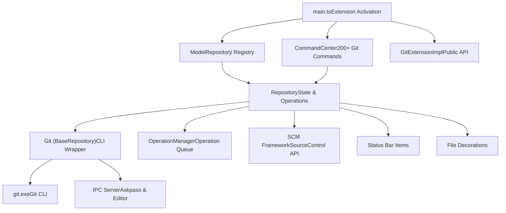
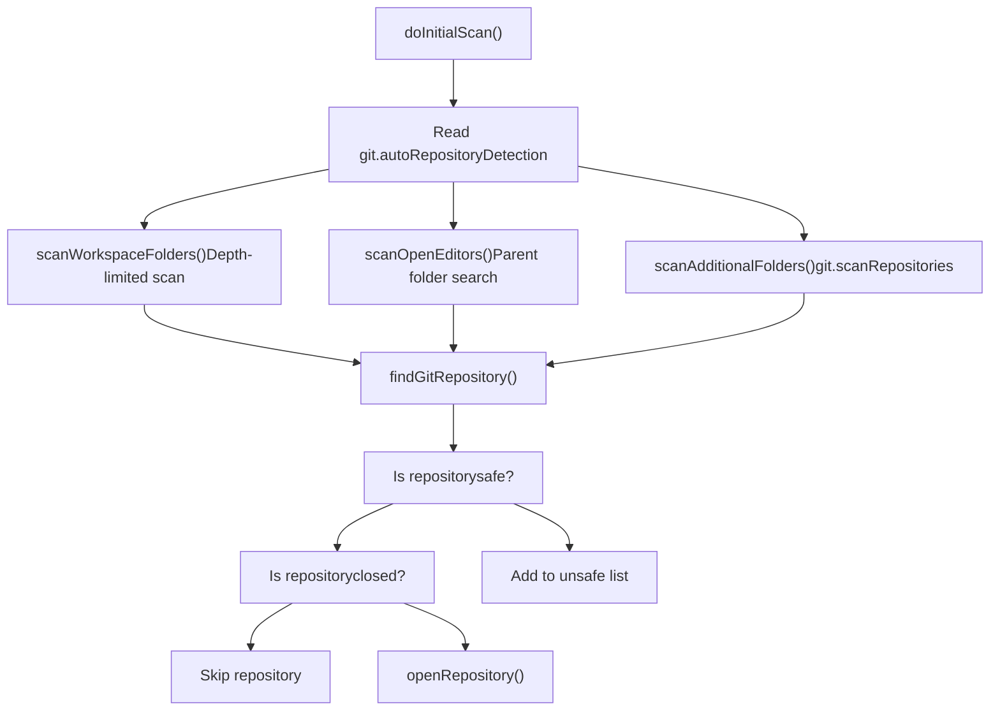
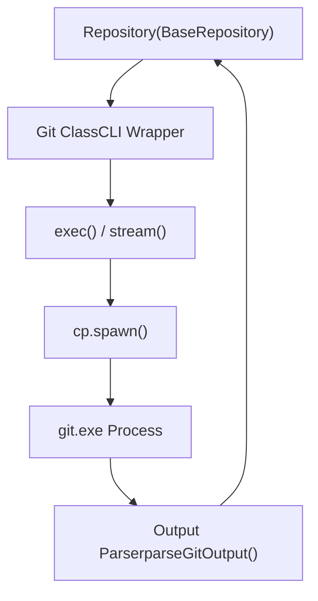
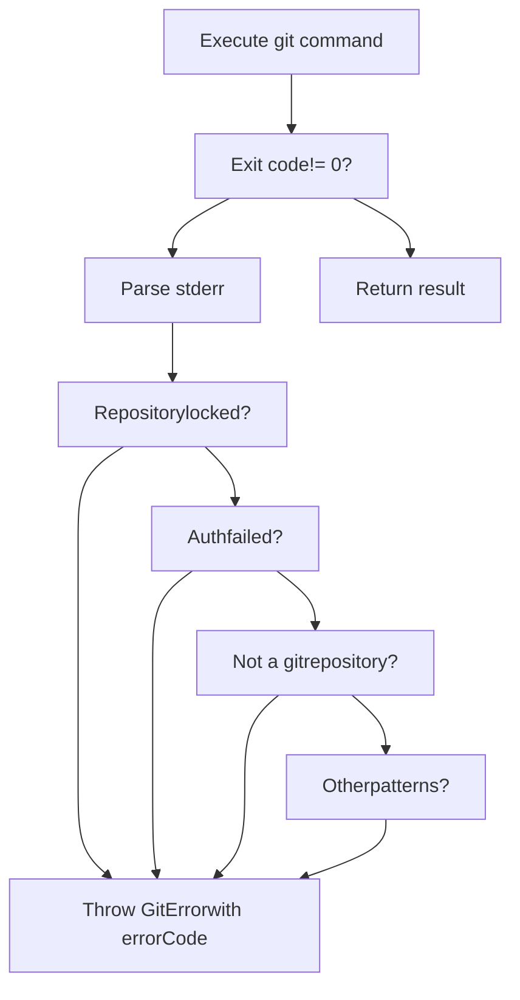
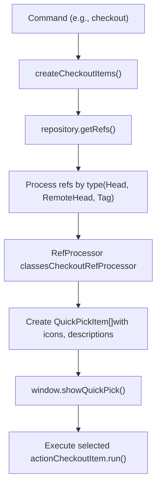
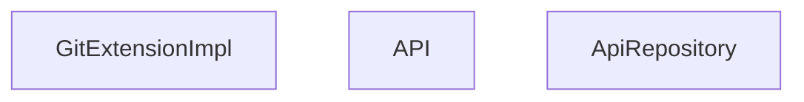
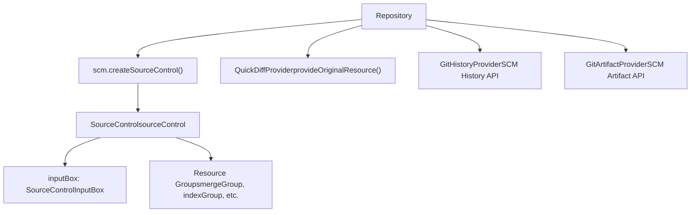
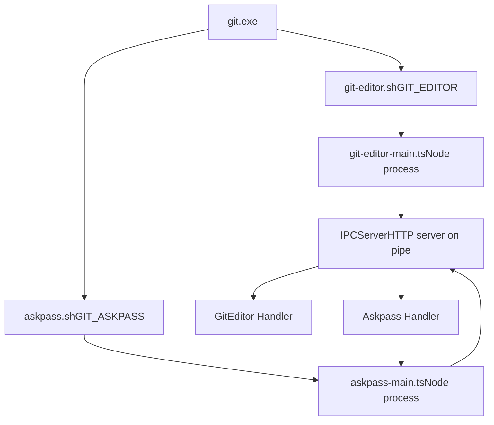

# Git Extension

Relevant source files

-   [extensions/git/package.json](https://github.com/microsoft/vscode/blob/1be3088d/extensions/git/package.json)
-   [extensions/git/package.nls.json](https://github.com/microsoft/vscode/blob/1be3088d/extensions/git/package.nls.json)
-   [extensions/git/src/actionButton.ts](https://github.com/microsoft/vscode/blob/1be3088d/extensions/git/src/actionButton.ts)
-   [extensions/git/src/api/api1.ts](https://github.com/microsoft/vscode/blob/1be3088d/extensions/git/src/api/api1.ts)
-   [extensions/git/src/api/git.d.ts](https://github.com/microsoft/vscode/blob/1be3088d/extensions/git/src/api/git.d.ts)
-   [extensions/git/src/askpass-empty.sh](https://github.com/microsoft/vscode/blob/1be3088d/extensions/git/src/askpass-empty.sh)
-   [extensions/git/src/askpass-main.ts](https://github.com/microsoft/vscode/blob/1be3088d/extensions/git/src/askpass-main.ts)
-   [extensions/git/src/askpass.sh](https://github.com/microsoft/vscode/blob/1be3088d/extensions/git/src/askpass.sh)
-   [extensions/git/src/askpass.ts](https://github.com/microsoft/vscode/blob/1be3088d/extensions/git/src/askpass.ts)
-   [extensions/git/src/autofetch.ts](https://github.com/microsoft/vscode/blob/1be3088d/extensions/git/src/autofetch.ts)
-   [extensions/git/src/cloneManager.ts](https://github.com/microsoft/vscode/blob/1be3088d/extensions/git/src/cloneManager.ts)
-   [extensions/git/src/commands.ts](https://github.com/microsoft/vscode/blob/1be3088d/extensions/git/src/commands.ts)
-   [extensions/git/src/git.ts](https://github.com/microsoft/vscode/blob/1be3088d/extensions/git/src/git.ts)
-   [extensions/git/src/gitEditor.ts](https://github.com/microsoft/vscode/blob/1be3088d/extensions/git/src/gitEditor.ts)
-   [extensions/git/src/ipc/ipcClient.ts](https://github.com/microsoft/vscode/blob/1be3088d/extensions/git/src/ipc/ipcClient.ts)
-   [extensions/git/src/ipc/ipcServer.ts](https://github.com/microsoft/vscode/blob/1be3088d/extensions/git/src/ipc/ipcServer.ts)
-   [extensions/git/src/main.ts](https://github.com/microsoft/vscode/blob/1be3088d/extensions/git/src/main.ts)
-   [extensions/git/src/model.ts](https://github.com/microsoft/vscode/blob/1be3088d/extensions/git/src/model.ts)
-   [extensions/git/src/operation.ts](https://github.com/microsoft/vscode/blob/1be3088d/extensions/git/src/operation.ts)
-   [extensions/git/src/postCommitCommands.ts](https://github.com/microsoft/vscode/blob/1be3088d/extensions/git/src/postCommitCommands.ts)
-   [extensions/git/src/protocolHandler.ts](https://github.com/microsoft/vscode/blob/1be3088d/extensions/git/src/protocolHandler.ts)
-   [extensions/git/src/repository.ts](https://github.com/microsoft/vscode/blob/1be3088d/extensions/git/src/repository.ts)
-   [extensions/git/src/repositoryCache.ts](https://github.com/microsoft/vscode/blob/1be3088d/extensions/git/src/repositoryCache.ts)
-   [extensions/git/src/ssh-askpass-empty.sh](https://github.com/microsoft/vscode/blob/1be3088d/extensions/git/src/ssh-askpass-empty.sh)
-   [extensions/git/src/ssh-askpass.sh](https://github.com/microsoft/vscode/blob/1be3088d/extensions/git/src/ssh-askpass.sh)
-   [extensions/git/src/statusbar.ts](https://github.com/microsoft/vscode/blob/1be3088d/extensions/git/src/statusbar.ts)
-   [extensions/git/src/terminal.ts](https://github.com/microsoft/vscode/blob/1be3088d/extensions/git/src/terminal.ts)
-   [extensions/git/src/test/repositoryCache.test.ts](https://github.com/microsoft/vscode/blob/1be3088d/extensions/git/src/test/repositoryCache.test.ts)
-   [extensions/git/src/util.ts](https://github.com/microsoft/vscode/blob/1be3088d/extensions/git/src/util.ts)
-   [extensions/git/tsconfig.json](https://github.com/microsoft/vscode/blob/1be3088d/extensions/git/tsconfig.json)
-   [test/automation/src/statusbar.ts](https://github.com/microsoft/vscode/blob/1be3088d/test/automation/src/statusbar.ts)

## Purpose and Scope

The Git Extension is a built-in VS Code extension that provides comprehensive Git integration. It wraps the Git command-line interface to provide source control operations, repository management, and a rich UI for Git workflows. The extension runs in the Extension Host process and communicates with VS Code's SCM framework (see [#10](https://github.com/microsoft/vscode/blob/1be3088d/#10)) to display repository state, changes, and history.

This document covers the Git extension's architecture, core components, command implementation, and extension API. For information about the general SCM framework that the Git extension integrates with, see [Source Control Management](/microsoft/vscode/10-source-control-management).

---

## Architecture Overview

### System Diagram


**Sources:** [extensions/git/src/main.ts192-264](https://github.com/microsoft/vscode/blob/1be3088d/extensions/git/src/main.ts#L192-L264) [extensions/git/src/model.ts186-308](https://github.com/microsoft/vscode/blob/1be3088d/extensions/git/src/model.ts#L186-L308) [extensions/git/src/repository.ts699-1500](https://github.com/microsoft/vscode/blob/1be3088d/extensions/git/src/repository.ts#L699-L1500)

---

## Extension Activation

The extension activates through the `activate` function in `main.ts`, which performs the following steps:

1.  **Git Discovery**: Finds the git executable using `findGit` with configurable paths
2.  **IPC Setup**: Creates an IPC server for askpass and git editor communication
3.  **Model Creation**: Instantiates the `Model` class which manages all repositories
4.  **Command Registration**: Creates `CommandCenter` and registers 200+ commands
5.  **Provider Registration**: Sets up file system provider, decorations, timeline, etc.
6.  **API Exposure**: Returns `GitExtensionImpl` for other extensions to use

**Sources:** [extensions/git/src/main.ts192-264](https://github.com/microsoft/vscode/blob/1be3088d/extensions/git/src/main.ts#L192-L264) [extensions/git/src/main.ts41-141](https://github.com/microsoft/vscode/blob/1be3088d/extensions/git/src/main.ts#L41-L141) [extensions/git/src/git.ts158-180](https://github.com/microsoft/vscode/blob/1be3088d/extensions/git/src/git.ts#L158-L180)

---

## Model: Repository Registry and Lifecycle

The `Model` class is the central coordinator for all Git repositories in the workspace. It implements `IRepositoryResolver` and manages repository detection, opening, and closing.

### Responsibilities

| Responsibility | Implementation |
| --- | --- |
| Repository Scanning | Scans workspace folders and open editors for git repositories |
| Repository Lifecycle | Opens and closes repositories, tracks state changes |
| Unsafe Repository Management | Detects and manages repositories with dubious ownership |
| Parent Repository Detection | Finds repositories in parent folders |
| Extension API Registry | Manages credentials providers, remote publishers, etc. |

### Repository Detection Flow


**Sources:** [extensions/git/src/model.ts310-350](https://github.com/microsoft/vscode/blob/1be3088d/extensions/git/src/model.ts#L310-L350) [extensions/git/src/model.ts357-404](https://github.com/microsoft/vscode/blob/1be3088d/extensions/git/src/model.ts#L357-L404) [extensions/git/src/model.ts533-707](https://github.com/microsoft/vscode/blob/1be3088d/extensions/git/src/model.ts#L533-L707)

---

## Repository: State and Resource Management

The `Repository` class represents a single Git repository and manages its state, resources, and operations.

### Resource Groups

Each repository organizes changed files into four resource groups:

| Resource Group | Type | Description | Source Control Group |
| --- | --- | --- | --- |
| `mergeGroup` | `ResourceGroupType.Merge` | Files with merge conflicts | "Merge Changes" |
| `indexGroup` | `ResourceGroupType.Index` | Staged changes | "Staged Changes" |
| `workingTreeGroup` | `ResourceGroupType.WorkingTree` | Modified tracked files | "Changes" |
| `untrackedGroup` | `ResourceGroupType.Untracked` | Untracked files | "Changes" |

### Repository State Structure


**Sources:** [extensions/git/src/repository.ts699-1000](https://github.com/microsoft/vscode/blob/1be3088d/extensions/git/src/repository.ts#L699-L1000) [extensions/git/src/repository.ts52-343](https://github.com/microsoft/vscode/blob/1be3088d/extensions/git/src/repository.ts#L52-L343) [extensions/git/src/repository.ts345-354](https://github.com/microsoft/vscode/blob/1be3088d/extensions/git/src/repository.ts#L345-L354)

### Status Tracking and Updates

The repository tracks its status through periodic polling and file system watching:

1.  **Status Updates**: `updateModelState()` calls `git status` and updates resource groups
2.  **File Watching**: Watches `.git` directory and working tree for changes
3.  **Operation Tracking**: `OperationManager` ensures operations don't conflict
4.  **Debouncing**: Status updates are debounced to reduce overhead

**Sources:** [extensions/git/src/repository.ts1500-2000](https://github.com/microsoft/vscode/blob/1be3088d/extensions/git/src/repository.ts#L1500-L2000) [extensions/git/src/repository.ts449-499](https://github.com/microsoft/vscode/blob/1be3088d/extensions/git/src/repository.ts#L449-L499)

---

## Git CLI Wrapper

The `Git` class (in `git.ts`) provides a low-level wrapper around the Git command-line interface.

### Command Execution Architecture


### Key Classes and Methods

| Class/Method | Purpose | Location |
| --- | --- | --- |
| `Git.exec()` | Execute git command and return result | [extensions/git/src/git.ts591-598](https://github.com/microsoft/vscode/blob/1be3088d/extensions/git/src/git.ts#L591-L598) |
| `Git.stream()` | Stream git command output | [extensions/git/src/git.ts600-612](https://github.com/microsoft/vscode/blob/1be3088d/extensions/git/src/git.ts#L600-L612) |
| `Repository` (BaseRepository) | High-level git operations (commit, stage, etc.) | [extensions/git/src/git.ts900-3000](https://github.com/microsoft/vscode/blob/1be3088d/extensions/git/src/git.ts#L900-L3000) |
| `GitError` | Git-specific error with error codes | [extensions/git/src/git.ts282-319](https://github.com/microsoft/vscode/blob/1be3088d/extensions/git/src/git.ts#L282-L319) |
| `getGitErrorCode()` | Parse stderr to determine error type | [extensions/git/src/git.ts328-363](https://github.com/microsoft/vscode/blob/1be3088d/extensions/git/src/git.ts#L328-L363) |

### Error Handling

The Git wrapper detects error conditions by parsing stderr output:


**Sources:** [extensions/git/src/git.ts328-363](https://github.com/microsoft/vscode/blob/1be3088d/extensions/git/src/git.ts#L328-L363) [extensions/git/src/git.ts614-700](https://github.com/microsoft/vscode/blob/1be3088d/extensions/git/src/git.ts#L614-L700)

---

## Command Center: Git Operations

The `CommandCenter` class implements over 200 Git commands using a decorator-based registration system.

### Command Registration Pattern

Commands are registered using the `@command` decorator:

```
@command('git.commit', { repository: true })
async commit(repository: Repository): Promise<void> {
    // Implementation
}
```
The decorator collects metadata about each command (ID, options, method) which is then used to register VS Code commands in the constructor.

### Command Categories

| Category | Examples | Count |
| --- | --- | --- |
| **Staging** | stage, unstage, stageAll, clean | ~20 |
| **Committing** | commit, commitStaged, commitAmend, commitSigned | ~15 |
| **Branching** | checkout, branch, deleteBranch, merge, rebase | ~20 |
| **Remote Operations** | push, pull, fetch, sync, publish | ~15 |
| **Stashing** | stash, stashPop, stashApply, stashDrop | ~10 |
| **History** | viewCommit, copyCommitId, timeline operations | ~15 |
| **Tagging** | createTag, deleteTag | ~5 |
| **Worktrees** | createWorktree, deleteWorktree, openWorktree | ~5 |
| **Repository Management** | init, clone, open, close, refresh | ~10 |
| **Advanced** | cherryPick, rebase, mergeAbort, blame | ~15 |

### Command Execution Flow

> **[Mermaid sequence]**
> *(图表结构无法解析)*

**Sources:** [extensions/git/src/commands.ts780-799](https://github.com/microsoft/vscode/blob/1be3088d/extensions/git/src/commands.ts#L780-L799) [extensions/git/src/commands.ts1200-1400](https://github.com/microsoft/vscode/blob/1be3088d/extensions/git/src/commands.ts#L1200-L1400) [extensions/git/src/commands.ts694-778](https://github.com/microsoft/vscode/blob/1be3088d/extensions/git/src/commands.ts#L694-L778)

### Quick Pick UI Patterns

Many commands use quick pick UIs for branch/ref selection:


**Sources:** [extensions/git/src/commands.ts412-440](https://github.com/microsoft/vscode/blob/1be3088d/extensions/git/src/commands.ts#L412-L440) [extensions/git/src/commands.ts470-625](https://github.com/microsoft/vscode/blob/1be3088d/extensions/git/src/commands.ts#L470-L625)

---

## Extension API

The Git extension exposes a public API that other extensions can use through `vscode.extensions.getExtension('vscode.git')?.exports`.

### API Surface


### Extension Points

The API provides several extension points for other extensions:

| Extension Point | Interface | Purpose |
| --- | --- | --- |
| Credentials Provider | `CredentialsProvider` | Provide credentials for git operations |
| Remote Source Publisher | `RemoteSourcePublisher` | Publish repositories to remote hosting services |
| Remote Source Provider | `RemoteSourceProvider` | Provide remote repository sources for cloning |
| Post-Commit Commands | `PostCommitCommandsProvider` | Add commands to run after commit |
| Push Error Handler | `PushErrorHandler` | Handle push errors (e.g., force push) |
| Branch Protection | `BranchProtectionProvider` | Define protected branches |
| History Item Details | `SourceControlHistoryItemDetailsProvider` | Provide avatars and links for commits |

**Sources:** [extensions/git/src/api/git.d.ts1-420](https://github.com/microsoft/vscode/blob/1be3088d/extensions/git/src/api/git.d.ts#L1-L420) [extensions/git/src/api/api1.ts1-350](https://github.com/microsoft/vscode/blob/1be3088d/extensions/git/src/api/api1.ts#L1-L350) [extensions/git/src/api/extension.ts1-100](https://github.com/microsoft/vscode/blob/1be3088d/extensions/git/src/api/extension.ts#L1-L100)

---

## SCM Framework Integration

The Git extension integrates with VS Code's Source Control Management (SCM) framework by implementing the SCM provider interface.

### Integration Points


### Source Control Features

| Feature | Implementation | File |
| --- | --- | --- |
| **Input Box** | Commit message input with validation | [extensions/git/src/repository.ts800-900](https://github.com/microsoft/vscode/blob/1be3088d/extensions/git/src/repository.ts#L800-L900) |
| **Resource Groups** | Merge, Index, Working Tree, Untracked | [extensions/git/src/repository.ts345-354](https://github.com/microsoft/vscode/blob/1be3088d/extensions/git/src/repository.ts#L345-L354) |
| **Quick Diff** | Show diff in gutter | [extensions/git/src/repository.ts2500-2600](https://github.com/microsoft/vscode/blob/1be3088d/extensions/git/src/repository.ts#L2500-L2600) |
| **History Provider** | Commit history and graph | [extensions/git/src/historyProvider.ts1-500](https://github.com/microsoft/vscode/blob/1be3088d/extensions/git/src/historyProvider.ts#L1-L500) |
| **Action Button** | Commit/Sync/Publish button | [extensions/git/src/actionButton.ts1-300](https://github.com/microsoft/vscode/blob/1be3088d/extensions/git/src/actionButton.ts#L1-L300) |
| **Status Bar** | Branch and sync status | [extensions/git/src/statusbar.ts1-200](https://github.com/microsoft/vscode/blob/1be3088d/extensions/git/src/statusbar.ts#L1-L200) |

**Sources:** [extensions/git/src/repository.ts699-1000](https://github.com/microsoft/vscode/blob/1be3088d/extensions/git/src/repository.ts#L699-L1000) [extensions/git/src/historyProvider.ts1-100](https://github.com/microsoft/vscode/blob/1be3088d/extensions/git/src/historyProvider.ts#L1-L100) [extensions/git/src/actionButton.ts43-140](https://github.com/microsoft/vscode/blob/1be3088d/extensions/git/src/actionButton.ts#L43-L140)

---

## IPC and Helper Processes

The Git extension uses Inter-Process Communication (IPC) to handle git authentication and editor requests.

### IPC Architecture


### Askpass Flow

When git needs credentials (e.g., for `git push`), it invokes the askpass script:

1.  **Environment Setup**: Repository sets `GIT_ASKPASS` to `askpass.sh`
2.  **Script Execution**: Git calls askpass script with prompt
3.  **IPC Request**: Script spawns `askpass-main.ts` which makes HTTP request to IPC server
4.  **UI Prompt**: Askpass handler shows `window.showInputBox()` for credentials
5.  **Response**: Credentials are returned through IPC pipe to git process

**Sources:** [extensions/git/src/askpass.ts13-150](https://github.com/microsoft/vscode/blob/1be3088d/extensions/git/src/askpass.ts#L13-L150) [extensions/git/src/askpass-main.ts1-44](https://github.com/microsoft/vscode/blob/1be3088d/extensions/git/src/askpass-main.ts#L1-L44) [extensions/git/src/ipc/ipcServer.ts1-100](https://github.com/microsoft/vscode/blob/1be3088d/extensions/git/src/ipc/ipcServer.ts#L1-L100)

### Git Editor Integration

Similar to askpass, the git editor integration allows git to open files in VS Code:

1.  **Commit Message**: Git opens commit message file in VS Code
2.  **Rebase Interactive**: Git opens rebase todo file for editing
3.  **Document Tracking**: Extension tracks open git editor documents
4.  **Completion**: Extension signals git when editing is complete

**Sources:** [extensions/git/src/gitEditor.ts1-200](https://github.com/microsoft/vscode/blob/1be3088d/extensions/git/src/gitEditor.ts#L1-L200) [extensions/git/src/ipc/ipcServer.ts50-100](https://github.com/microsoft/vscode/blob/1be3088d/extensions/git/src/ipc/ipcServer.ts#L50-L100)

---

## Configuration and Settings

The Git extension provides extensive configuration through VS Code settings.

### Key Configuration Categories

| Category | Key Settings | Default |
| --- | --- | --- |
| **Enabling** | `git.enabled` | `true` |
| **Git Path** | `git.path` | Auto-detected |
| **Auto Detect** | `git.autoRepositoryDetection` | `true` |
| **Auto Fetch** | `git.autofetch` | `false` |
| **Auto Refresh** | `git.autorefresh` | `true` |
| **Commit** | `git.enableSmartCommit`
`git.useEditorAsCommitInput` | `false`
`false` |
| **Push/Pull** | `git.confirmSync`
`git.autofetch`
`git.pullBeforeCheckout` | `true`
`false`
`false` |
| **Branch Protection** | `git.branchProtection`
`git.branchProtectionPrompt` | `[]`
`alwaysPrompt` |
| **Diff** | `git.openDiffOnClick`
`git.mergeEditor` | `true`
`false` |

### Configuration Usage Pattern

Settings are accessed using `workspace.getConfiguration()`:

```
const config = workspace.getConfiguration('git', Uri.file(repository.root));
const enabled = config.get<boolean>('enabled', true);
```
**Sources:** [extensions/git/package.json160-300](https://github.com/microsoft/vscode/blob/1be3088d/extensions/git/package.json#L160-L300) [extensions/git/src/repository.ts1200-1300](https://github.com/microsoft/vscode/blob/1be3088d/extensions/git/src/repository.ts#L1200-L1300)

---

## Operation Management

The `OperationManager` class ensures Git operations are executed safely and provides progress tracking.

### Operation Queue and Blocking

> **[Mermaid stateDiagram]**
> *(图表结构无法解析)*

### Operation Types

Operations are categorized by their characteristics:

-   **Blocking**: Cannot run concurrently with other blocking operations (e.g., commit, checkout)
-   **Read-Only**: Does not modify repository state (e.g., log, diff, blame)
-   **Remote**: Involves network communication (e.g., fetch, push, pull)
-   **Retry**: Can be retried on failure (e.g., fetch)
-   **Show Progress**: Should display progress indicator

**Sources:** [extensions/git/src/operation.ts1-300](https://github.com/microsoft/vscode/blob/1be3088d/extensions/git/src/operation.ts#L1-L300) [extensions/git/src/operation.ts185-450](https://github.com/microsoft/vscode/blob/1be3088d/extensions/git/src/operation.ts#L185-L450)

---

## Repository Cache

The `RepositoryCache` class maintains a cache of recently accessed repositories to optimize cloning.

### Cache Structure


The cache is used during cloning to:

1.  Check if a repository is already cloned
2.  Suggest alternative clone locations
3.  Auto-select destination based on repository URL

**Sources:** [extensions/git/src/repositoryCache.ts1-200](https://github.com/microsoft/vscode/blob/1be3088d/extensions/git/src/repositoryCache.ts#L1-L200) [extensions/git/src/cloneManager.ts1-300](https://github.com/microsoft/vscode/blob/1be3088d/extensions/git/src/cloneManager.ts#L1-L300)

---

## Summary

The Git Extension is a comprehensive integration layer between VS Code and Git, providing:

-   **Repository Management**: Automatic detection, lifecycle management, and multi-repository support
-   **Rich UI**: Source control views, status bar integration, file decorations, and quick picks
-   **200+ Commands**: Complete Git operation coverage with user-friendly UI flows
-   **Extension API**: Allows other extensions to integrate with Git functionality
-   **IPC Integration**: Secure credential handling and editor integration
-   **Performance**: Operation queuing, caching, and optimized status updates

The extension follows a layered architecture where the `Git` class provides low-level CLI access, `Repository` manages state and operations, `Model` coordinates multiple repositories, and `CommandCenter` provides the command interface.

**Sources:** [extensions/git/src/main.ts1-270](https://github.com/microsoft/vscode/blob/1be3088d/extensions/git/src/main.ts#L1-L270) [extensions/git/package.json1-100](https://github.com/microsoft/vscode/blob/1be3088d/extensions/git/package.json#L1-L100)
