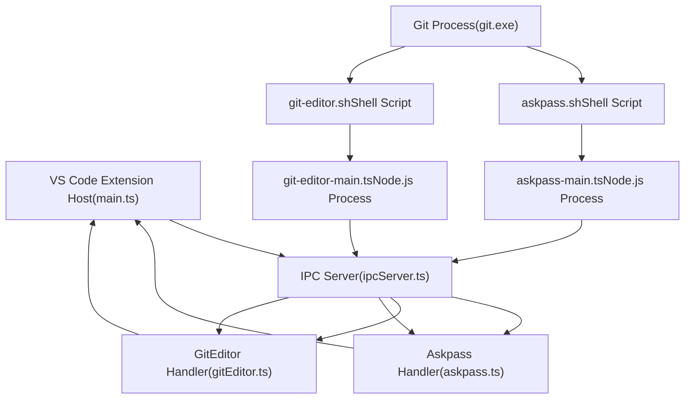
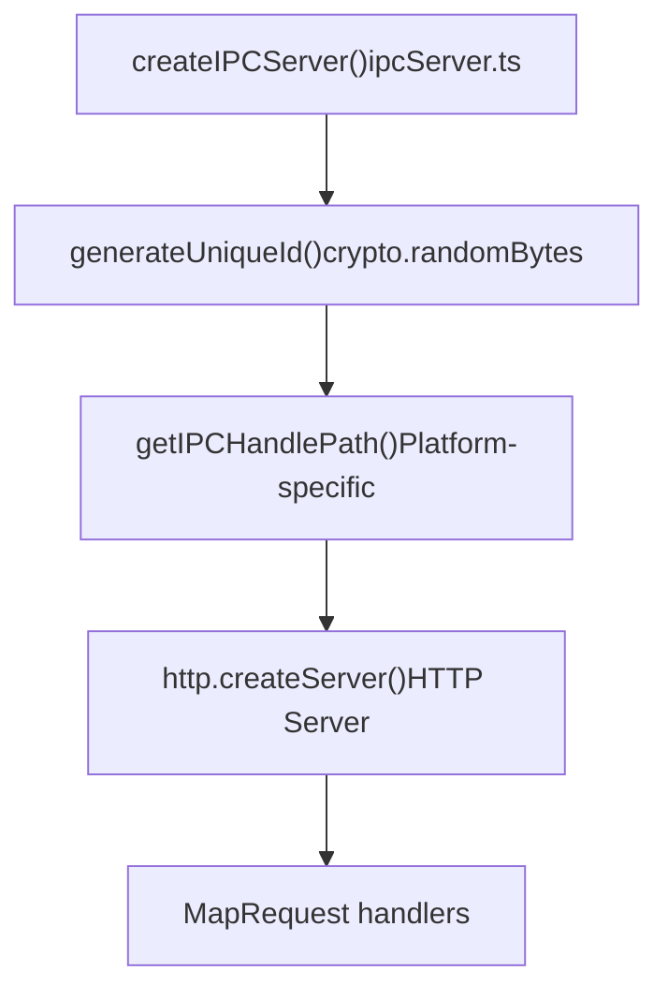
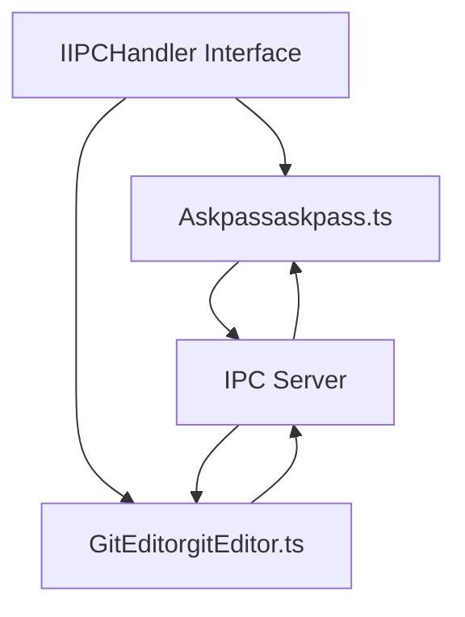
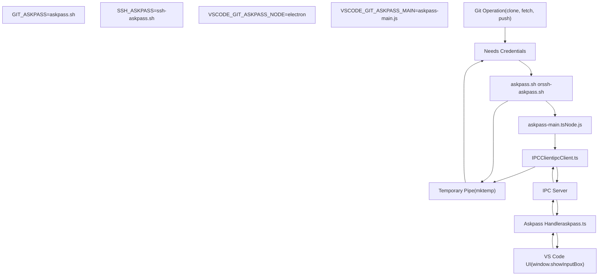
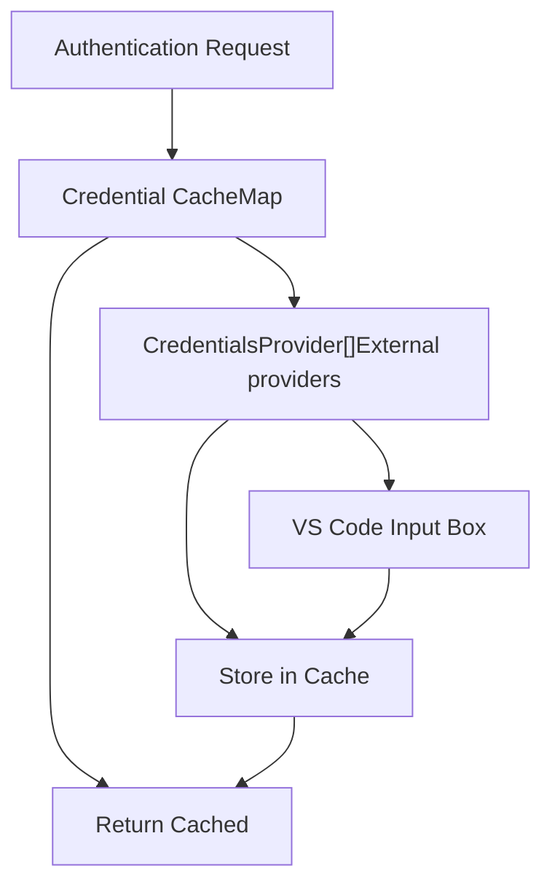
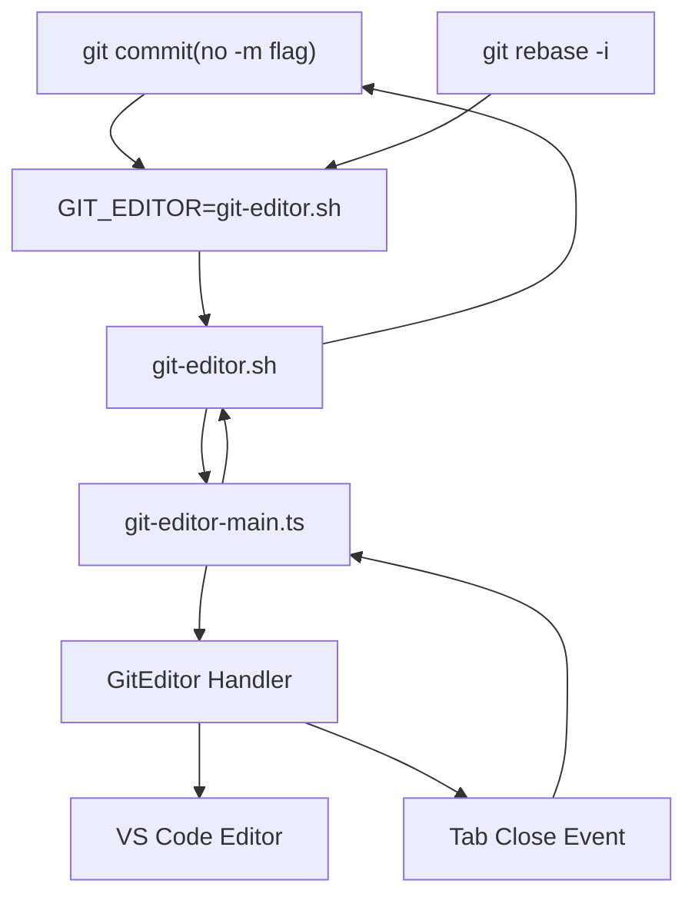
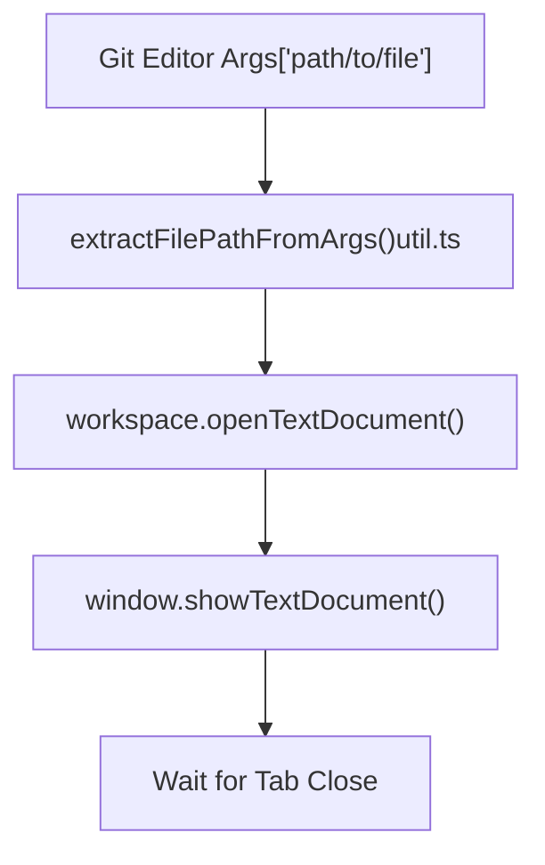
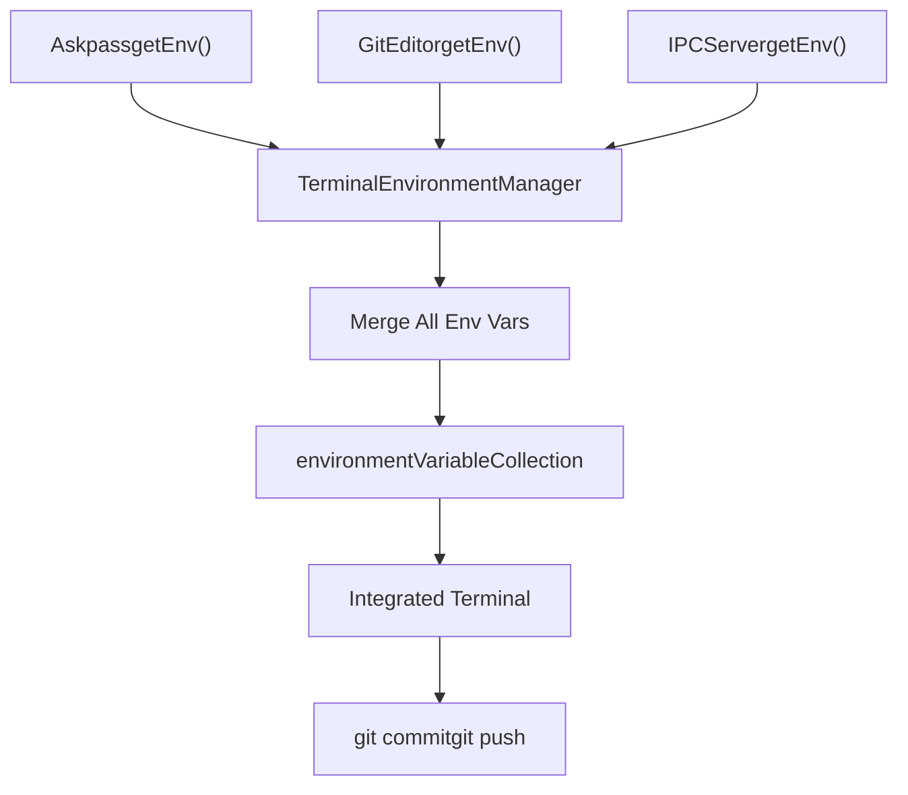

# Git IPC and Helper Processes

Relevant source files

-   [extensions/git/package.json](https://github.com/microsoft/vscode/blob/1be3088d/extensions/git/package.json)
-   [extensions/git/package.nls.json](https://github.com/microsoft/vscode/blob/1be3088d/extensions/git/package.nls.json)
-   [extensions/git/src/actionButton.ts](https://github.com/microsoft/vscode/blob/1be3088d/extensions/git/src/actionButton.ts)
-   [extensions/git/src/api/api1.ts](https://github.com/microsoft/vscode/blob/1be3088d/extensions/git/src/api/api1.ts)
-   [extensions/git/src/api/git.d.ts](https://github.com/microsoft/vscode/blob/1be3088d/extensions/git/src/api/git.d.ts)
-   [extensions/git/src/askpass-empty.sh](https://github.com/microsoft/vscode/blob/1be3088d/extensions/git/src/askpass-empty.sh)
-   [extensions/git/src/askpass-main.ts](https://github.com/microsoft/vscode/blob/1be3088d/extensions/git/src/askpass-main.ts)
-   [extensions/git/src/askpass.sh](https://github.com/microsoft/vscode/blob/1be3088d/extensions/git/src/askpass.sh)
-   [extensions/git/src/askpass.ts](https://github.com/microsoft/vscode/blob/1be3088d/extensions/git/src/askpass.ts)
-   [extensions/git/src/autofetch.ts](https://github.com/microsoft/vscode/blob/1be3088d/extensions/git/src/autofetch.ts)
-   [extensions/git/src/cloneManager.ts](https://github.com/microsoft/vscode/blob/1be3088d/extensions/git/src/cloneManager.ts)
-   [extensions/git/src/commands.ts](https://github.com/microsoft/vscode/blob/1be3088d/extensions/git/src/commands.ts)
-   [extensions/git/src/git.ts](https://github.com/microsoft/vscode/blob/1be3088d/extensions/git/src/git.ts)
-   [extensions/git/src/gitEditor.ts](https://github.com/microsoft/vscode/blob/1be3088d/extensions/git/src/gitEditor.ts)
-   [extensions/git/src/ipc/ipcClient.ts](https://github.com/microsoft/vscode/blob/1be3088d/extensions/git/src/ipc/ipcClient.ts)
-   [extensions/git/src/ipc/ipcServer.ts](https://github.com/microsoft/vscode/blob/1be3088d/extensions/git/src/ipc/ipcServer.ts)
-   [extensions/git/src/main.ts](https://github.com/microsoft/vscode/blob/1be3088d/extensions/git/src/main.ts)
-   [extensions/git/src/model.ts](https://github.com/microsoft/vscode/blob/1be3088d/extensions/git/src/model.ts)
-   [extensions/git/src/operation.ts](https://github.com/microsoft/vscode/blob/1be3088d/extensions/git/src/operation.ts)
-   [extensions/git/src/postCommitCommands.ts](https://github.com/microsoft/vscode/blob/1be3088d/extensions/git/src/postCommitCommands.ts)
-   [extensions/git/src/protocolHandler.ts](https://github.com/microsoft/vscode/blob/1be3088d/extensions/git/src/protocolHandler.ts)
-   [extensions/git/src/repository.ts](https://github.com/microsoft/vscode/blob/1be3088d/extensions/git/src/repository.ts)
-   [extensions/git/src/repositoryCache.ts](https://github.com/microsoft/vscode/blob/1be3088d/extensions/git/src/repositoryCache.ts)
-   [extensions/git/src/ssh-askpass-empty.sh](https://github.com/microsoft/vscode/blob/1be3088d/extensions/git/src/ssh-askpass-empty.sh)
-   [extensions/git/src/ssh-askpass.sh](https://github.com/microsoft/vscode/blob/1be3088d/extensions/git/src/ssh-askpass.sh)
-   [extensions/git/src/statusbar.ts](https://github.com/microsoft/vscode/blob/1be3088d/extensions/git/src/statusbar.ts)
-   [extensions/git/src/terminal.ts](https://github.com/microsoft/vscode/blob/1be3088d/extensions/git/src/terminal.ts)
-   [extensions/git/src/test/repositoryCache.test.ts](https://github.com/microsoft/vscode/blob/1be3088d/extensions/git/src/test/repositoryCache.test.ts)
-   [extensions/git/src/util.ts](https://github.com/microsoft/vscode/blob/1be3088d/extensions/git/src/util.ts)
-   [extensions/git/tsconfig.json](https://github.com/microsoft/vscode/blob/1be3088d/extensions/git/tsconfig.json)
-   [test/automation/src/statusbar.ts](https://github.com/microsoft/vscode/blob/1be3088d/test/automation/src/statusbar.ts)

## Purpose and Scope

This document describes the IPC (Inter-Process Communication) infrastructure and helper processes that enable VS Code's Git extension to integrate with Git's external credential and editor interfaces. This system allows VS Code to handle Git authentication prompts and commit message editing within the VS Code UI rather than in external terminal windows.

For general Git extension architecture, see [11.1](/microsoft/vscode/11.1-git-extension-architecture). For Git command execution, see [11.2](/microsoft/vscode/11.2-repository-and-operation-management).

## System Overview

Git supports external programs for authentication (via `GIT_ASKPASS`) and editing (via `GIT_EDITOR`). VS Code implements these interfaces through a multi-process architecture:


**Sources:** [extensions/git/src/main.ts67-84](https://github.com/microsoft/vscode/blob/1be3088d/extensions/git/src/main.ts#L67-L84) [extensions/git/src/ipc/ipcServer.ts1-100](https://github.com/microsoft/vscode/blob/1be3088d/extensions/git/src/ipc/ipcServer.ts#L1-L100) [extensions/git/src/askpass.ts13-49](https://github.com/microsoft/vscode/blob/1be3088d/extensions/git/src/askpass.ts#L13-L49) [extensions/git/src/gitEditor.ts1-120](https://github.com/microsoft/vscode/blob/1be3088d/extensions/git/src/gitEditor.ts#L1-L120)

## IPC Server Architecture

### Server Creation and Configuration

The `IIPCServer` provides the communication backbone between Git helper processes and VS Code. It creates an HTTP server listening on a platform-specific named pipe or Unix socket.


The server path varies by platform:

-   **Windows**: `\\.\pipe\vscode-git-{id}-sock`
-   **Linux with XDG**: `$XDG_RUNTIME_DIR/vscode-git-{id}.sock`
-   **macOS/Other**: `/tmp/vscode-git-{id}.sock`

**Sources:** [extensions/git/src/ipc/ipcServer.ts15-26](https://github.com/microsoft/vscode/blob/1be3088d/extensions/git/src/ipc/ipcServer.ts#L15-L26) [extensions/git/src/ipc/ipcServer.ts28-78](https://github.com/microsoft/vscode/blob/1be3088d/extensions/git/src/ipc/ipcServer.ts#L28-L78)

### Handler Registration

Handlers implement the `IIPCHandler` interface and are registered by name:

| Handler Name | Implementation | Purpose |
| --- | --- | --- |
| `askpass` | `Askpass` | Handle Git credential prompts |
| `git-editor` | `GitEditor` | Handle Git editor requests |


**Sources:** [extensions/git/src/ipc/ipcServer.ts80-95](https://github.com/microsoft/vscode/blob/1be3088d/extensions/git/src/ipc/ipcServer.ts#L80-L95) [extensions/git/src/askpass.ts13-30](https://github.com/microsoft/vscode/blob/1be3088d/extensions/git/src/askpass.ts#L13-L30) [extensions/git/src/gitEditor.ts15-30](https://github.com/microsoft/vscode/blob/1be3088d/extensions/git/src/gitEditor.ts#L15-L30)

### Environment Variable Injection

The IPC server provides environment variables that Git helper scripts need to communicate back to VS Code:

```
{
  VSCODE_GIT_IPC_HANDLE: '/tmp/vscode-git-abc123.sock'
}
```
**Sources:** [extensions/git/src/ipc/ipcServer.ts97-102](https://github.com/microsoft/vscode/blob/1be3088d/extensions/git/src/ipc/ipcServer.ts#L97-L102) [extensions/git/src/main.ts82](https://github.com/microsoft/vscode/blob/1be3088d/extensions/git/src/main.ts#L82-L82)

## Askpass Authentication System

### 概览

The askpass system intercepts Git's authentication prompts and presents them in the VS Code UI. It supports both HTTPS and SSH authentication methods.


**Sources:** [extensions/git/src/askpass.sh1-6](https://github.com/microsoft/vscode/blob/1be3088d/extensions/git/src/askpass.sh#L1-L6) [extensions/git/src/askpass-main.ts15-41](https://github.com/microsoft/vscode/blob/1be3088d/extensions/git/src/askpass-main.ts#L15-L41) [extensions/git/src/askpass.ts51-128](https://github.com/microsoft/vscode/blob/1be3088d/extensions/git/src/askpass.ts#L51-L128)

### HTTPS Authentication

When Git needs HTTPS credentials, it calls the askpass script twice - once for username, once for password:

> **[Mermaid sequence]**
> *(图表结构无法解析)*

**Sources:** [extensions/git/src/askpass.ts67-128](https://github.com/microsoft/vscode/blob/1be3088d/extensions/git/src/askpass.ts#L67-L128) [extensions/git/src/askpass-main.ts15-41](https://github.com/microsoft/vscode/blob/1be3088d/extensions/git/src/askpass-main.ts#L15-L41)

### SSH Authentication

SSH authentication uses a similar flow but with `SSH_ASKPASS` environment variable:

```
// Environment variables for SSH
{
  SSH_ASKPASS: 'ssh-askpass.sh',
  SSH_ASKPASS_REQUIRE: 'force'  // Force SSH to use askpass even with terminal
}
```
The handler parses SSH prompts like:

-   `Enter passphrase for key '/home/user/.ssh/id_rsa':`
-   `Enter passphrase:`

**Sources:** [extensions/git/src/askpass.ts44-48](https://github.com/microsoft/vscode/blob/1be3088d/extensions/git/src/askpass.ts#L44-L48) [extensions/git/src/askpass.ts130-150](https://github.com/microsoft/vscode/blob/1be3088d/extensions/git/src/askpass.ts#L130-L150) [extensions/git/src/ssh-askpass.sh1-6](https://github.com/microsoft/vscode/blob/1be3088d/extensions/git/src/ssh-askpass.sh#L1-L6)

### Credential Caching and Providers

The `Askpass` class maintains a credential cache and supports external credential providers:


**Sources:** [extensions/git/src/askpass.ts18-19](https://github.com/microsoft/vscode/blob/1be3088d/extensions/git/src/askpass.ts#L18-L19) [extensions/git/src/askpass.ts85-120](https://github.com/microsoft/vscode/blob/1be3088d/extensions/git/src/askpass.ts#L85-L120)

### Shell Script Implementation

The askpass shell scripts create a temporary named pipe for communication:

```
#!/bin/sh
VSCODE_GIT_ASKPASS_PIPE=`mktemp`
ELECTRON_RUN_AS_NODE="1" \
  VSCODE_GIT_ASKPASS_PIPE="$VSCODE_GIT_ASKPASS_PIPE" \
  VSCODE_GIT_ASKPASS_TYPE="https" \
  "$VSCODE_GIT_ASKPASS_NODE" "$VSCODE_GIT_ASKPASS_MAIN" $*
cat $VSCODE_GIT_ASKPASS_PIPE
rm $VSCODE_GIT_ASKPASS_PIPE
```
**Sources:** [extensions/git/src/askpass.sh1-6](https://github.com/microsoft/vscode/blob/1be3088d/extensions/git/src/askpass.sh#L1-L6) [extensions/git/src/ssh-askpass.sh1-6](https://github.com/microsoft/vscode/blob/1be3088d/extensions/git/src/ssh-askpass.sh#L1-L6)

## Git Editor Integration

### 目的

When Git needs to open an editor (e.g., for commit messages, interactive rebase), the `GitEditor` class intercepts this and opens the file in VS Code's editor instead of an external text editor.


**Sources:** [extensions/git/src/gitEditor.ts15-120](https://github.com/microsoft/vscode/blob/1be3088d/extensions/git/src/gitEditor.ts#L15-L120) [extensions/git/src/main.ts79-80](https://github.com/microsoft/vscode/blob/1be3088d/extensions/git/src/main.ts#L79-L80)

### File Path Handling

The editor integration handles various Git file paths:

| File Pattern | Purpose |
| --- | --- |
| `COMMIT_EDITMSG` | Commit message editing |
| `MERGE_MSG` | Merge commit messages |
| `git-rebase-todo` | Interactive rebase |

The `GitEditor.handle()` method extracts the file path from arguments and opens it in VS Code:


**Sources:** [extensions/git/src/gitEditor.ts40-70](https://github.com/microsoft/vscode/blob/1be3088d/extensions/git/src/gitEditor.ts#L40-L70) [extensions/git/src/util.ts693-728](https://github.com/microsoft/vscode/blob/1be3088d/extensions/git/src/util.ts#L693-L728)

### Environment Variables

The Git editor provides these environment variables:

```
{
  GIT_EDITOR: 'git-editor.sh',
  VSCODE_GIT_EDITOR_NODE: process.execPath,
  VSCODE_GIT_EDITOR_MAIN: '/path/to/git-editor-main.js'
}
```
**Sources:** [extensions/git/src/gitEditor.ts30-38](https://github.com/microsoft/vscode/blob/1be3088d/extensions/git/src/gitEditor.ts#L30-L38)

## Terminal Environment Management

### TerminalEnvironmentManager

The `TerminalEnvironmentManager` class coordinates environment variable injection for integrated terminals, ensuring that Git commands run in the terminal also use VS Code's helper processes.


**Sources:** [extensions/git/src/terminal.ts15-60](https://github.com/microsoft/vscode/blob/1be3088d/extensions/git/src/terminal.ts#L15-L60) [extensions/git/src/main.ts83-84](https://github.com/microsoft/vscode/blob/1be3088d/extensions/git/src/main.ts#L83-L84)

### ITerminalEnvironmentProvider Interface

Each component that needs to inject environment variables implements this interface:

```
interface ITerminalEnvironmentProvider {
  featureDescription?: string;
  getTerminalEnv(): { [key: string]: string };
}
```
**Sources:** [extensions/git/src/terminal.ts10-13](https://github.com/microsoft/vscode/blob/1be3088d/extensions/git/src/terminal.ts#L10-L13) [extensions/git/src/askpass.ts22](https://github.com/microsoft/vscode/blob/1be3088d/extensions/git/src/askpass.ts#L22-L22) [extensions/git/src/gitEditor.ts10](https://github.com/microsoft/vscode/blob/1be3088d/extensions/git/src/gitEditor.ts#L10-L10) [extensions/git/src/ipc/ipcServer.ts7](https://github.com/microsoft/vscode/blob/1be3088d/extensions/git/src/ipc/ipcServer.ts#L7-L7)

### Configuration-Based Enablement

The environment variables are only injected when `git.enabled` is true:

```
private refresh(): void {
  const config = workspace.getConfiguration('git', null);
  this.context.environmentVariableCollection.clear();

  if (!config.get<boolean>('enabled', true)) {
    return;
  }

  // Merge environment variables from all providers
  for (const envProvider of this.envProviders) {
    const terminalEnv = envProvider?.getTerminalEnv();
    // ...
  }
}
```
**Sources:** [extensions/git/src/terminal.ts26-47](https://github.com/microsoft/vscode/blob/1be3088d/extensions/git/src/terminal.ts#L26-L47)

## Complete Process Flow

### Authentication Flow (HTTPS)

> **[Mermaid sequence]**
> *(图表结构无法解析)*

**Sources:** [extensions/git/src/askpass.sh1-6](https://github.com/microsoft/vscode/blob/1be3088d/extensions/git/src/askpass.sh#L1-L6) [extensions/git/src/askpass-main.ts15-41](https://github.com/microsoft/vscode/blob/1be3088d/extensions/git/src/askpass-main.ts#L15-L41) [extensions/git/src/askpass.ts51-128](https://github.com/microsoft/vscode/blob/1be3088d/extensions/git/src/askpass.ts#L51-L128)

### Editor Integration Flow

> **[Mermaid sequence]**
> *(图表结构无法解析)*

**Sources:** [extensions/git/src/gitEditor.ts40-120](https://github.com/microsoft/vscode/blob/1be3088d/extensions/git/src/gitEditor.ts#L40-L120)

## Error Handling and Edge Cases

### Disabled Git Extension

When `git.enabled` is false, empty askpass scripts are used to avoid prompting:

```
#!/bin/sh
echo ''
```
This prevents Git from hanging waiting for credentials when the extension is disabled.

**Sources:** [extensions/git/src/askpass-empty.sh1-2](https://github.com/microsoft/vscode/blob/1be3088d/extensions/git/src/askpass-empty.sh#L1-L2) [extensions/git/src/ssh-askpass-empty.sh1-2](https://github.com/microsoft/vscode/blob/1be3088d/extensions/git/src/ssh-askpass-empty.sh#L1-L2) [extensions/git/src/askpass.ts32-33](https://github.com/microsoft/vscode/blob/1be3088d/extensions/git/src/askpass.ts#L32-L33)

### Silent Fetch Operations

The askpass script checks for silent fetch operations and fails fast:

```
if (process.env['VSCODE_GIT_COMMAND'] === 'fetch' &&
    !!process.env['VSCODE_GIT_FETCH_SILENT']) {
  return fatal('Skip silent fetch commands');
}
```
This prevents credential prompts during background auto-fetch operations.

**Sources:** [extensions/git/src/askpass-main.ts28-30](https://github.com/microsoft/vscode/blob/1be3088d/extensions/git/src/askpass-main.ts#L28-L30)

### IPC Server Failure

If the IPC server fails to create, the system gracefully degrades:

```
let ipcServer: IPCServer | undefined = undefined;

try {
  ipcServer = await createIPCServer(context.storagePath);
} catch (err) {
  logger.error(`[main] Failed to create git IPC: ${err}`);
}

// Askpass and GitEditor still created but with undefined ipcServer
const askpass = new Askpass(ipcServer, logger, askpassPaths);
```
**Sources:** [extensions/git/src/main.ts67-77](https://github.com/microsoft/vscode/blob/1be3088d/extensions/git/src/main.ts#L67-L77)

## Key Implementation Classes

### Class Hierarchy

| Class | File | Purpose |
| --- | --- | --- |
| `IIPCServer` | `ipc/ipcServer.ts` | HTTP server for IPC communication |
| `IPCClient` | `ipc/ipcClient.ts` | Client for helper processes |
| `Askpass` | `askpass.ts` | Credential prompt handler |
| `GitEditor` | `gitEditor.ts` | Editor integration handler |
| `TerminalEnvironmentManager` | `terminal.ts` | Environment variable injection |

**Sources:** [extensions/git/src/ipc/ipcServer.ts80-102](https://github.com/microsoft/vscode/blob/1be3088d/extensions/git/src/ipc/ipcServer.ts#L80-L102) [extensions/git/src/ipc/ipcClient.ts10-35](https://github.com/microsoft/vscode/blob/1be3088d/extensions/git/src/ipc/ipcClient.ts#L10-L35) [extensions/git/src/askpass.ts13-150](https://github.com/microsoft/vscode/blob/1be3088d/extensions/git/src/askpass.ts#L13-L150) [extensions/git/src/gitEditor.ts15-120](https://github.com/microsoft/vscode/blob/1be3088d/extensions/git/src/gitEditor.ts#L15-L120) [extensions/git/src/terminal.ts15-60](https://github.com/microsoft/vscode/blob/1be3088d/extensions/git/src/terminal.ts#L15-L60)
