# Settings Editor

Relevant source files

-   [src/vs/platform/action/common/action.ts](https://github.com/microsoft/vscode/blob/1be3088d/src/vs/platform/action/common/action.ts)
-   [src/vs/platform/actions/browser/actionViewItemService.ts](https://github.com/microsoft/vscode/blob/1be3088d/src/vs/platform/actions/browser/actionViewItemService.ts)
-   [src/vs/platform/actions/browser/menuEntryActionViewItem.css](https://github.com/microsoft/vscode/blob/1be3088d/src/vs/platform/actions/browser/menuEntryActionViewItem.css)
-   [src/vs/platform/actions/browser/menuEntryActionViewItem.ts](https://github.com/microsoft/vscode/blob/1be3088d/src/vs/platform/actions/browser/menuEntryActionViewItem.ts)
-   [src/vs/platform/actions/browser/toolbar.ts](https://github.com/microsoft/vscode/blob/1be3088d/src/vs/platform/actions/browser/toolbar.ts)
-   [src/vs/platform/actions/common/actions.ts](https://github.com/microsoft/vscode/blob/1be3088d/src/vs/platform/actions/common/actions.ts)
-   [src/vs/platform/actions/common/menuService.ts](https://github.com/microsoft/vscode/blob/1be3088d/src/vs/platform/actions/common/menuService.ts)
-   [src/vs/platform/editor/common/editor.ts](https://github.com/microsoft/vscode/blob/1be3088d/src/vs/platform/editor/common/editor.ts)
-   [src/vs/platform/observable/common/platformObservableUtils.ts](https://github.com/microsoft/vscode/blob/1be3088d/src/vs/platform/observable/common/platformObservableUtils.ts)
-   [src/vs/workbench/browser/actions/layoutActions.ts](https://github.com/microsoft/vscode/blob/1be3088d/src/vs/workbench/browser/actions/layoutActions.ts)
-   [src/vs/workbench/browser/actions/quickAccessActions.ts](https://github.com/microsoft/vscode/blob/1be3088d/src/vs/workbench/browser/actions/quickAccessActions.ts)
-   [src/vs/workbench/browser/contextkeys.ts](https://github.com/microsoft/vscode/blob/1be3088d/src/vs/workbench/browser/contextkeys.ts)
-   [src/vs/workbench/browser/dnd.ts](https://github.com/microsoft/vscode/blob/1be3088d/src/vs/workbench/browser/dnd.ts)
-   [src/vs/workbench/browser/layout.ts](https://github.com/microsoft/vscode/blob/1be3088d/src/vs/workbench/browser/layout.ts)
-   [src/vs/workbench/browser/parts/auxiliarybar/auxiliaryBarActions.ts](https://github.com/microsoft/vscode/blob/1be3088d/src/vs/workbench/browser/parts/auxiliarybar/auxiliaryBarActions.ts)
-   [src/vs/workbench/browser/parts/editor/auxiliaryEditorPart.ts](https://github.com/microsoft/vscode/blob/1be3088d/src/vs/workbench/browser/parts/editor/auxiliaryEditorPart.ts)
-   [src/vs/workbench/browser/parts/editor/editor.contribution.ts](https://github.com/microsoft/vscode/blob/1be3088d/src/vs/workbench/browser/parts/editor/editor.contribution.ts)
-   [src/vs/workbench/browser/parts/editor/editor.ts](https://github.com/microsoft/vscode/blob/1be3088d/src/vs/workbench/browser/parts/editor/editor.ts)
-   [src/vs/workbench/browser/parts/editor/editorActions.ts](https://github.com/microsoft/vscode/blob/1be3088d/src/vs/workbench/browser/parts/editor/editorActions.ts)
-   [src/vs/workbench/browser/parts/editor/editorCommands.ts](https://github.com/microsoft/vscode/blob/1be3088d/src/vs/workbench/browser/parts/editor/editorCommands.ts)
-   [src/vs/workbench/browser/parts/editor/editorDropTarget.ts](https://github.com/microsoft/vscode/blob/1be3088d/src/vs/workbench/browser/parts/editor/editorDropTarget.ts)
-   [src/vs/workbench/browser/parts/editor/editorGroupView.ts](https://github.com/microsoft/vscode/blob/1be3088d/src/vs/workbench/browser/parts/editor/editorGroupView.ts)
-   [src/vs/workbench/browser/parts/editor/editorPart.ts](https://github.com/microsoft/vscode/blob/1be3088d/src/vs/workbench/browser/parts/editor/editorPart.ts)
-   [src/vs/workbench/browser/parts/editor/editorParts.ts](https://github.com/microsoft/vscode/blob/1be3088d/src/vs/workbench/browser/parts/editor/editorParts.ts)
-   [src/vs/workbench/browser/parts/panel/panelActions.ts](https://github.com/microsoft/vscode/blob/1be3088d/src/vs/workbench/browser/parts/panel/panelActions.ts)
-   [src/vs/workbench/browser/parts/titlebar/commandCenterControl.ts](https://github.com/microsoft/vscode/blob/1be3088d/src/vs/workbench/browser/parts/titlebar/commandCenterControl.ts)
-   [src/vs/workbench/browser/parts/titlebar/media/titlebarpart.css](https://github.com/microsoft/vscode/blob/1be3088d/src/vs/workbench/browser/parts/titlebar/media/titlebarpart.css)
-   [src/vs/workbench/browser/parts/titlebar/titlebarActions.ts](https://github.com/microsoft/vscode/blob/1be3088d/src/vs/workbench/browser/parts/titlebar/titlebarActions.ts)
-   [src/vs/workbench/browser/parts/titlebar/titlebarPart.ts](https://github.com/microsoft/vscode/blob/1be3088d/src/vs/workbench/browser/parts/titlebar/titlebarPart.ts)
-   [src/vs/workbench/browser/parts/titlebar/windowTitle.ts](https://github.com/microsoft/vscode/blob/1be3088d/src/vs/workbench/browser/parts/titlebar/windowTitle.ts)
-   [src/vs/workbench/browser/workbench.contribution.ts](https://github.com/microsoft/vscode/blob/1be3088d/src/vs/workbench/browser/workbench.contribution.ts)
-   [src/vs/workbench/browser/workbench.ts](https://github.com/microsoft/vscode/blob/1be3088d/src/vs/workbench/browser/workbench.ts)
-   [src/vs/workbench/common/contextkeys.ts](https://github.com/microsoft/vscode/blob/1be3088d/src/vs/workbench/common/contextkeys.ts)
-   [src/vs/workbench/common/editor.ts](https://github.com/microsoft/vscode/blob/1be3088d/src/vs/workbench/common/editor.ts)
-   [src/vs/workbench/contrib/chat/browser/widget/chatContentParts/chatInlineAnchorWidget.ts](https://github.com/microsoft/vscode/blob/1be3088d/src/vs/workbench/contrib/chat/browser/widget/chatContentParts/chatInlineAnchorWidget.ts)
-   [src/vs/workbench/contrib/chat/browser/widget/chatContentParts/chatMarkdownDecorationsRenderer.ts](https://github.com/microsoft/vscode/blob/1be3088d/src/vs/workbench/contrib/chat/browser/widget/chatContentParts/chatMarkdownDecorationsRenderer.ts)
-   [src/vs/workbench/contrib/chat/browser/widget/chatContentParts/media/chatInlineAnchorWidget.css](https://github.com/microsoft/vscode/blob/1be3088d/src/vs/workbench/contrib/chat/browser/widget/chatContentParts/media/chatInlineAnchorWidget.css)
-   [src/vs/workbench/contrib/debug/browser/statusbarColorProvider.ts](https://github.com/microsoft/vscode/blob/1be3088d/src/vs/workbench/contrib/debug/browser/statusbarColorProvider.ts)
-   [src/vs/workbench/services/actions/common/menusExtensionPoint.ts](https://github.com/microsoft/vscode/blob/1be3088d/src/vs/workbench/services/actions/common/menusExtensionPoint.ts)
-   [src/vs/workbench/services/editor/browser/editorService.ts](https://github.com/microsoft/vscode/blob/1be3088d/src/vs/workbench/services/editor/browser/editorService.ts)
-   [src/vs/workbench/services/editor/common/editorGroupsService.ts](https://github.com/microsoft/vscode/blob/1be3088d/src/vs/workbench/services/editor/common/editorGroupsService.ts)
-   [src/vs/workbench/services/editor/common/editorService.ts](https://github.com/microsoft/vscode/blob/1be3088d/src/vs/workbench/services/editor/common/editorService.ts)
-   [src/vs/workbench/services/editor/test/browser/editorGroupsService.test.ts](https://github.com/microsoft/vscode/blob/1be3088d/src/vs/workbench/services/editor/test/browser/editorGroupsService.test.ts)
-   [src/vs/workbench/services/editor/test/browser/editorService.test.ts](https://github.com/microsoft/vscode/blob/1be3088d/src/vs/workbench/services/editor/test/browser/editorService.test.ts)
-   [src/vs/workbench/services/layout/browser/layoutService.ts](https://github.com/microsoft/vscode/blob/1be3088d/src/vs/workbench/services/layout/browser/layoutService.ts)
-   [src/vs/workbench/test/browser/workbenchTestServices.ts](https://github.com/microsoft/vscode/blob/1be3088d/src/vs/workbench/test/browser/workbenchTestServices.ts)

## Purpose and Scope

The Settings Editor is a graphical interface for viewing and editing VS Code configuration. It is implemented in the `SettingsEditor2` class and presents settings as a searchable tree with type-specific editing controls.

This page covers the Settings Editor UI implementation. For the JSON editor, see page 11.2. For keybindings, see page 11.3. For the preferences service layer, see page 11.4.

---

## 概览

The Settings Editor presents configuration options as a hierarchical tree with a table of contents, search capabilities, and specialized widgets for different value types (boolean, string, enum, array, object).

**Core Functionality:**

-   Settings organized into category groups
-   Table of contents (TOC) for navigation
-   Search with multiple providers (string matching, TF-IDF, AI)
-   Type-specific rendering (boolean toggles, text inputs, dropdowns, etc.)
-   Extension settings integration
-   Policy and workspace trust indicators
-   Configuration scope selection (User, Workspace, Folder)

**Component Architecture:**

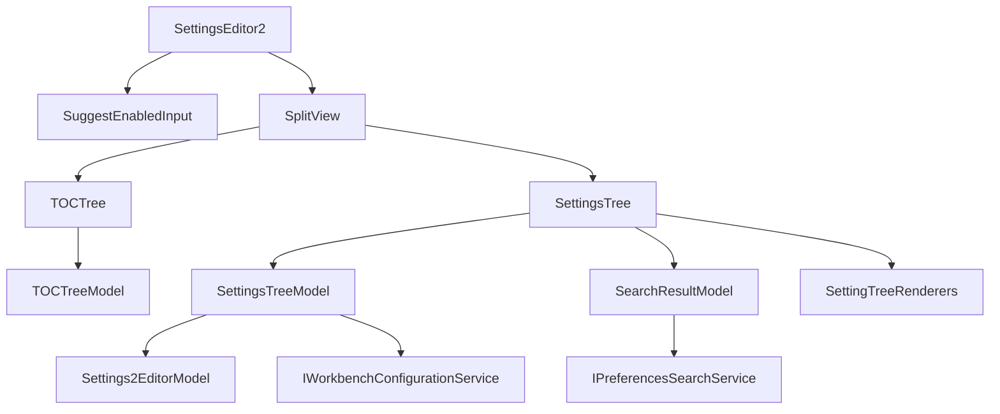
**Sources:** [src/vs/workbench/contrib/preferences/browser/settingsEditor2.ts108-456](https://github.com/microsoft/vscode/blob/1be3088d/src/vs/workbench/contrib/preferences/browser/settingsEditor2.ts#L108-L456) [src/vs/workbench/contrib/preferences/browser/settingsTree.ts760-900](https://github.com/microsoft/vscode/blob/1be3088d/src/vs/workbench/contrib/preferences/browser/settingsTree.ts#L760-L900) [src/vs/workbench/contrib/preferences/browser/tocTree.ts29-94](https://github.com/microsoft/vscode/blob/1be3088d/src/vs/workbench/contrib/preferences/browser/tocTree.ts#L29-L94)

---

## SettingsEditor2

The `SettingsEditor2` class extends `EditorPane` and coordinates the Settings Editor UI components.

**Class Structure:**

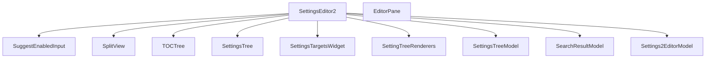
**Key Members:**

| Member | Type | Description |
| --- | --- | --- |
| `searchWidget` | `SuggestEnabledInput` | Search input box |
| `splitView` | `SplitView` | Two-pane layout |
| `tocTree` | `TOCTree` | Table of contents |
| `settingsTree` | `SettingsTree` | Main settings display |
| `settingsTreeModel` | `SettingsTreeModel` | Settings data |
| `searchResultModel` | `SearchResultModel` | Search results |
| `defaultSettingsEditorModel` | `Settings2EditorModel` | Default settings |
| `settingRenderers` | `SettingTreeRenderers` | Type-specific renderers |

**Sources:** [src/vs/workbench/contrib/preferences/browser/settingsEditor2.ts108-346](https://github.com/microsoft/vscode/blob/1be3088d/src/vs/workbench/contrib/preferences/browser/settingsEditor2.ts#L108-L346)

### Initialization

**Initialization Sequence:**

> **[Mermaid sequence]**
> *(图表结构无法解析)*

**Sources:** [src/vs/workbench/contrib/preferences/browser/settingsEditor2.ts482-523](https://github.com/microsoft/vscode/blob/1be3088d/src/vs/workbench/contrib/preferences/browser/settingsEditor2.ts#L482-L523) [src/vs/workbench/contrib/preferences/browser/settingsEditor2.ts843-943](https://github.com/microsoft/vscode/blob/1be3088d/src/vs/workbench/contrib/preferences/browser/settingsEditor2.ts#L843-L943)

### Layout

The editor uses a `SplitView` with two panes:

**Layout Configuration:**

-   **Left Pane (TOC):** 200px default, 100px minimum, hidden if total width < 700px
-   **Right Pane (Settings):** Flexible, 500px minimum

**Layout Structure:**

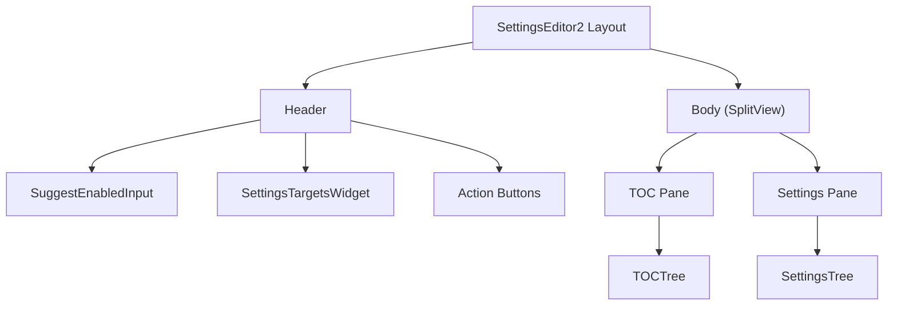
**Sources:** [src/vs/workbench/contrib/preferences/browser/settingsEditor2.ts592-607](https://github.com/microsoft/vscode/blob/1be3088d/src/vs/workbench/contrib/preferences/browser/settingsEditor2.ts#L592-L607) [src/vs/workbench/contrib/preferences/browser/settingsEditor2.ts1148-1210](https://github.com/microsoft/vscode/blob/1be3088d/src/vs/workbench/contrib/preferences/browser/settingsEditor2.ts#L1148-L1210)

---

## Settings Data Models

### SettingsTreeModel

The `SettingsTreeModel` class organizes settings into a hierarchical structure.

**Element Hierarchy:**

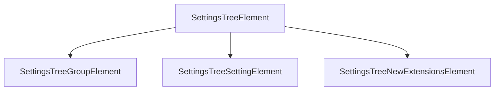
**Key Methods:**

| Method | Description |
| --- | --- |
| `update()` | Refreshes from configuration |
| `updateWorkspaceTrust()` | Updates restricted indicators |
| `getElementsByName()` | Finds settings by key |
| `treeElementsBySettingName` | Setting key to element map |

**Sources:** [src/vs/workbench/contrib/preferences/browser/settingsTreeModels.ts648-784](https://github.com/microsoft/vscode/blob/1be3088d/src/vs/workbench/contrib/preferences/browser/settingsTreeModels.ts#L648-L784) [src/vs/workbench/contrib/preferences/browser/settingsTreeModels.ts40-105](https://github.com/microsoft/vscode/blob/1be3088d/src/vs/workbench/contrib/preferences/browser/settingsTreeModels.ts#L40-L105)

### SettingsTreeSettingElement

The `SettingsTreeSettingElement` class represents an individual setting.

**Properties:**

| Property | Type | Description |
| --- | --- | --- |
| `setting` | `ISetting` | Setting definition |
| `value` | `any` | Effective value |
| `scopeValue` | `any` | Value in current scope |
| `defaultValue` | `any` | Default value |
| `isConfigured` | `boolean` | User has modified |
| `hasPolicyValue` | `boolean` | Policy controlled |
| `valueType` | `SettingValueType` | Rendering type |
| `overriddenScopeList` | `string[]` | Conflicting scopes |

**Sources:** [src/vs/workbench/contrib/preferences/browser/settingsTreeModels.ts113-390](https://github.com/microsoft/vscode/blob/1be3088d/src/vs/workbench/contrib/preferences/browser/settingsTreeModels.ts#L113-L390)

### SearchResultModel

The `SearchResultModel` class extends `SettingsTreeModel` for filtered results. It merges results from multiple search providers.

**Search Providers:**

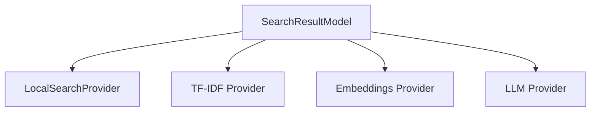
**Provider IDs:**

| ID | Description |
| --- | --- |
| `STRING_MATCH_SEARCH_PROVIDER_NAME` | Text matching |
| `TF_IDF_SEARCH_PROVIDER_NAME` | TF-IDF ranking |
| `EMBEDDINGS_SEARCH_PROVIDER_NAME` | AI embeddings |
| `LLM_RANKED_SEARCH_PROVIDER_NAME` | LLM ranking |
| `FILTER_MODEL_SEARCH_PROVIDER_NAME` | Extension filters |

**Sources:** [src/vs/workbench/contrib/preferences/browser/settingsTreeModels.ts786-1004](https://github.com/microsoft/vscode/blob/1be3088d/src/vs/workbench/contrib/preferences/browser/settingsTreeModels.ts#L786-L1004) [src/vs/workbench/contrib/preferences/common/preferences.ts130-190](https://github.com/microsoft/vscode/blob/1be3088d/src/vs/workbench/contrib/preferences/common/preferences.ts#L130-L190)

---

## Tree Rendering

### SettingsTree and Renderers

The `SettingsTree` class is a `WorkbenchObjectTree` that uses type-specific renderers from `SettingTreeRenderers`.

**Renderer Types:**

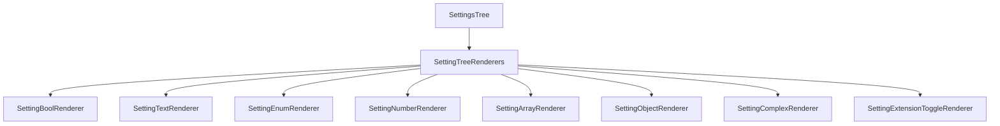
**Template IDs:**

| Constant | Value |
| --- | --- |
| `SETTINGS_BOOL_TEMPLATE_ID` | `'settings.bool.template'` |
| `SETTINGS_TEXT_TEMPLATE_ID` | `'settings.text.template'` |
| `SETTINGS_ENUM_TEMPLATE_ID` | `'settings.enum.template'` |
| `SETTINGS_NUMBER_TEMPLATE_ID` | `'settings.number.template'` |
| `SETTINGS_ARRAY_TEMPLATE_ID` | `'settings.array.template'` |
| `SETTINGS_OBJECT_TEMPLATE_ID` | `'settings.object.template'` |
| `SETTINGS_COMPLEX_TEMPLATE_ID` | `'settings.complex.template'` |

**Sources:** [src/vs/workbench/contrib/preferences/browser/settingsTree.ts760-776](https://github.com/microsoft/vscode/blob/1be3088d/src/vs/workbench/contrib/preferences/browser/settingsTree.ts#L760-L776) [src/vs/workbench/contrib/preferences/browser/settingsTree.ts1655-1750](https://github.com/microsoft/vscode/blob/1be3088d/src/vs/workbench/contrib/preferences/browser/settingsTree.ts#L1655-L1750)

### Renderer Templates

Each renderer creates a template for rendering settings.

**Template Structure:**

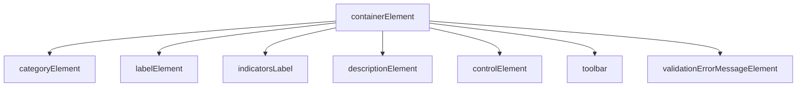
**ISettingItemTemplate Interface:**

```
interface ISettingItemTemplate<T = any> {
    onChange?: (value: T) => void;
    context?: SettingsTreeSettingElement;
    containerElement: HTMLElement;
    categoryElement: HTMLElement;
    labelElement: SimpleIconLabel;
    descriptionElement: HTMLElement;
    controlElement: HTMLElement;
    deprecationWarningElement: HTMLElement;
    indicatorsLabel: SettingsTreeIndicatorsLabel;
    toolbar: ToolBar;
    elementDisposables: DisposableStore;
}
```
**Sources:** [src/vs/workbench/contrib/preferences/browser/settingsTree.ts686-703](https://github.com/microsoft/vscode/blob/1be3088d/src/vs/workbench/contrib/preferences/browser/settingsTree.ts#L686-L703) [src/vs/workbench/contrib/preferences/browser/settingsTree.ts1779-1904](https://github.com/microsoft/vscode/blob/1be3088d/src/vs/workbench/contrib/preferences/browser/settingsTree.ts#L1779-L1904)

### Type-Specific Renderers

#### SettingBoolRenderer

Renders boolean settings as toggles.

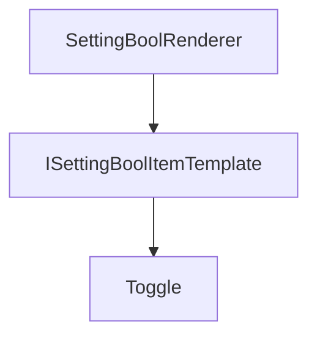
-   Uses `Toggle` widget
-   Clicking description toggles value
-   Disabled when policy-controlled

**Sources:** [src/vs/workbench/contrib/preferences/browser/settingsTree.ts1968-2089](https://github.com/microsoft/vscode/blob/1be3088d/src/vs/workbench/contrib/preferences/browser/settingsTree.ts#L1968-L2089)

#### SettingEnumRenderer

Renders enum settings as dropdowns.

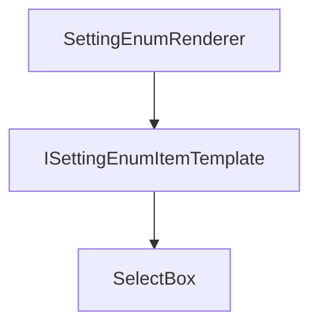
-   Shows enum option descriptions
-   Supports `markdownEnumDescriptions`

**Sources:** [src/vs/workbench/contrib/preferences/browser/settingsTree.ts2091-2336](https://github.com/microsoft/vscode/blob/1be3088d/src/vs/workbench/contrib/preferences/browser/settingsTree.ts#L2091-L2336)

#### Complex Type Renderers

For arrays and objects:

| Widget | Purpose |
| --- | --- |
| `ObjectSettingDropdownWidget` | Key-value pairs |
| `ObjectSettingCheckboxWidget` | Boolean properties |
| `ListSettingWidget` | String/enum arrays |
| `IncludeSettingWidget` | File globs (include) |
| `ExcludeSettingWidget` | File globs (exclude) |

**Sources:** [src/vs/workbench/contrib/preferences/browser/settingsTree.ts2698-2935](https://github.com/microsoft/vscode/blob/1be3088d/src/vs/workbench/contrib/preferences/browser/settingsTree.ts#L2698-L2935) [src/vs/workbench/contrib/preferences/browser/settingsWidgets.ts151-434](https://github.com/microsoft/vscode/blob/1be3088d/src/vs/workbench/contrib/preferences/browser/settingsWidgets.ts#L151-L434)

---

## Search

### Search Flow

**Search Sequence:**

> **[Mermaid sequence]**
> *(图表结构无法解析)*

**Sources:** [src/vs/workbench/contrib/preferences/browser/settingsEditor2.ts769-773](https://github.com/microsoft/vscode/blob/1be3088d/src/vs/workbench/contrib/preferences/browser/settingsEditor2.ts#L769-L773) [src/vs/workbench/contrib/preferences/browser/settingsEditor2.ts1366-1573](https://github.com/microsoft/vscode/blob/1be3088d/src/vs/workbench/contrib/preferences/browser/settingsEditor2.ts#L1366-L1573)

### Search Providers

#### LocalSearchProvider

String matching against keys, descriptions, and values.

**Match Type Scores:**

| Type | Score | Description |
| --- | --- | --- |
| `ExactMatch` | `1 << 8` | Exact key |
| `AllWordsInSettingsLabel` | `1 << 7` | All words in label |
| `ContiguousQueryInSettingId` | `1 << 6` | Contiguous in key |
| `ContiguousWordsInSettingsLabel` | `1 << 5` | Contiguous in label |
| `NonContiguousWordsInSettingsLabel` | `1 << 4` | Non-contiguous in label |
| `DescriptionOrValueMatch` | `1 << 3` | Description/value |
| `NonContiguousQueryInSettingId` | `1 << 2` | Non-contiguous in key |

**Sources:** [src/vs/workbench/contrib/preferences/browser/preferencesSearch.ts79-134](https://github.com/microsoft/vscode/blob/1be3088d/src/vs/workbench/contrib/preferences/browser/preferencesSearch.ts#L79-L134) [src/vs/workbench/services/preferences/common/preferences.ts135-152](https://github.com/microsoft/vscode/blob/1be3088d/src/vs/workbench/services/preferences/common/preferences.ts#L135-L152)

#### TF-IDF Provider

Term frequency-inverse document frequency ranking.

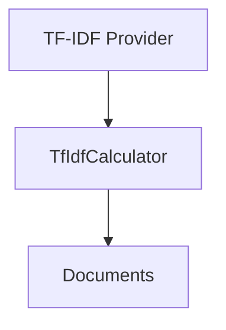
-   Each setting is a document
-   Document = key + description
-   Boost for key matches

**Sources:** [src/vs/workbench/contrib/preferences/browser/preferencesSearch.ts239-357](https://github.com/microsoft/vscode/blob/1be3088d/src/vs/workbench/contrib/preferences/browser/preferencesSearch.ts#L239-L357)

#### AI Providers

Two AI strategies:

1.  **Embeddings** - Vector similarity
2.  **LLM** - Language model ranking

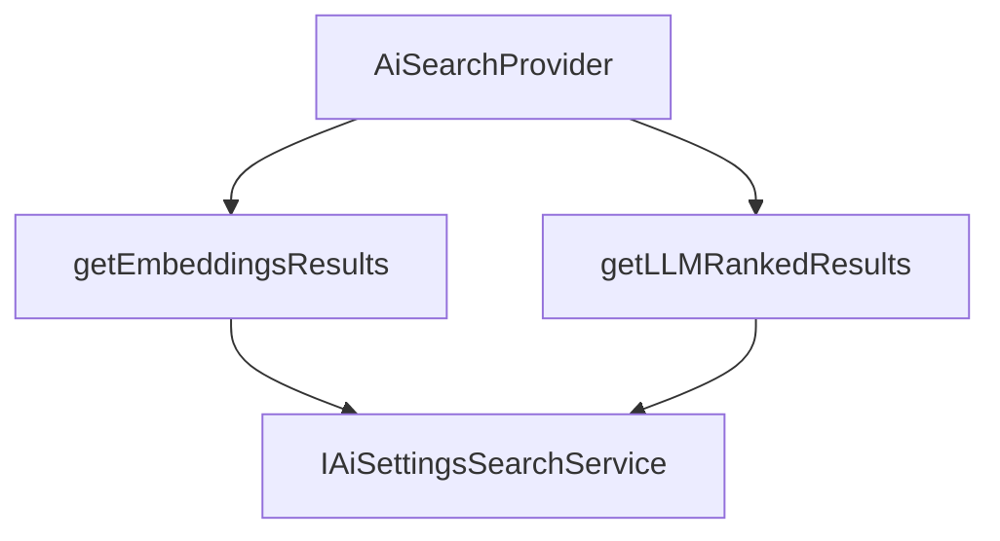
**Sources:** [src/vs/workbench/contrib/preferences/browser/preferencesSearch.ts359-455](https://github.com/microsoft/vscode/blob/1be3088d/src/vs/workbench/contrib/preferences/browser/preferencesSearch.ts#L359-L455) [src/vs/workbench/services/aiSettingsSearch/common/aiSettingsSearch.ts1-49](https://github.com/microsoft/vscode/blob/1be3088d/src/vs/workbench/services/aiSettingsSearch/common/aiSettingsSearch.ts#L1-L49)

### Query Filters

Special filter syntax:

| Filter | Example | Purpose |
| --- | --- | --- |
| `@modified` | `@modified` | Modified settings |
| `@tag:` | `@tag:accessibility` | By tag |
| `@id:` | `@id:editor.fontSize` | By ID |
| `@ext:` | `@ext:vscode.git` | By extension |
| `@feature:` | `@feature:terminal` | By feature |
| `@lang:` | `@lang:javascript` | By language |

**Sources:** [src/vs/workbench/contrib/preferences/browser/settingsTreeModels.ts1034-1191](https://github.com/microsoft/vscode/blob/1be3088d/src/vs/workbench/contrib/preferences/browser/settingsTreeModels.ts#L1034-L1191) [src/vs/workbench/contrib/preferences/common/preferences.ts122-151](https://github.com/microsoft/vscode/blob/1be3088d/src/vs/workbench/contrib/preferences/common/preferences.ts#L122-L151)

---

## Table of Contents

### TOC Structure

The TOC provides category navigation.

**TOC Organization:**

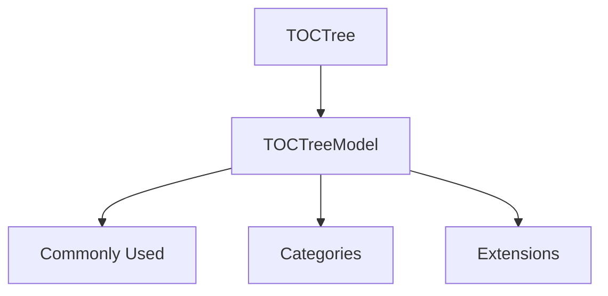
**Sources:** [src/vs/workbench/contrib/preferences/browser/tocTree.ts29-94](https://github.com/microsoft/vscode/blob/1be3088d/src/vs/workbench/contrib/preferences/browser/tocTree.ts#L29-L94)

### TOC Synchronization

The TOC syncs with visible settings.

**Sync Sequence:**

> **[Mermaid sequence]**
> *(图表结构无法解析)*

**Sources:** [src/vs/workbench/contrib/preferences/browser/settingsEditor2.ts1899-1975](https://github.com/microsoft/vscode/blob/1be3088d/src/vs/workbench/contrib/preferences/browser/settingsEditor2.ts#L1899-L1975)

### Search Mode

In search mode:

-   Shows result count badges
-   Hides/dims empty categories
-   Click scrolls to first match

**Sources:** [src/vs/workbench/contrib/preferences/browser/tocTree.ts95-180](https://github.com/microsoft/vscode/blob/1be3088d/src/vs/workbench/contrib/preferences/browser/tocTree.ts#L95-L180) [src/vs/workbench/contrib/preferences/browser/media/settingsEditor2.css294-328](https://github.com/microsoft/vscode/blob/1be3088d/src/vs/workbench/contrib/preferences/browser/media/settingsEditor2.css#L294-L328)

---

## Indicators

### SettingsTreeIndicatorsLabel

Displays metadata badges.

**Indicator Types:**

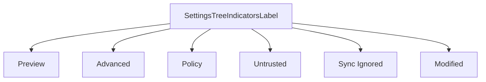
**Priority:**

-   Policy (highest)
-   Preview/Advanced
-   Sync ignored
-   Modified/overridden

**Sources:** [src/vs/workbench/contrib/preferences/browser/settingsEditorSettingIndicators.ts66-193](https://github.com/microsoft/vscode/blob/1be3088d/src/vs/workbench/contrib/preferences/browser/settingsEditorSettingIndicators.ts#L66-L193)

### Scope Overrides

Shows where overrides exist:

```
Setting Name (Also modified in: workspace, remote)
```
Clicking opens that scope. Emits `ISettingOverrideClickEvent`.

**Sources:** [src/vs/workbench/contrib/preferences/browser/settingsEditorSettingIndicators.ts195-362](https://github.com/microsoft/vscode/blob/1be3088d/src/vs/workbench/contrib/preferences/browser/settingsEditorSettingIndicators.ts#L195-L362)

---

## Widgets

### ListSettingWidget

Editable list with drag-drop reordering.

**Components:**

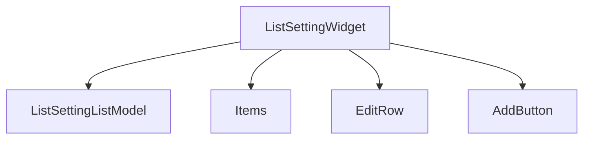
**Events:**

-   `ISettingListAddEvent`
-   `ISettingListChangeEvent`
-   `ISettingListRemoveEvent`
-   `ISettingListMoveEvent`

**Sources:** [src/vs/workbench/contrib/preferences/browser/settingsWidgets.ts453-732](https://github.com/microsoft/vscode/blob/1be3088d/src/vs/workbench/contrib/preferences/browser/settingsWidgets.ts#L453-L732)

### ObjectSettingDropdownWidget

Key-value editor for objects.

**Value Inputs:**

| Type | Widget |
| --- | --- |
| `boolean` | `Toggle` |
| `enum` | `SelectBox` |
| `string` | `InputBox` |
| `number` | `InputBox` |

**Sources:** [src/vs/workbench/contrib/preferences/browser/settingsWidgets.ts734-1490](https://github.com/microsoft/vscode/blob/1be3088d/src/vs/workbench/contrib/preferences/browser/settingsWidgets.ts#L734-L1490)

### Include/Exclude Widgets

For file glob patterns (`files.exclude`, etc.):

-   Pattern field
-   When clause
-   Source indicator

**Sources:** [src/vs/workbench/contrib/preferences/browser/settingsWidgets.ts1492-1640](https://github.com/microsoft/vscode/blob/1be3088d/src/vs/workbench/contrib/preferences/browser/settingsWidgets.ts#L1492-L1640)

---

## Configuration Updates

### Value Changes

**Update Flow:**

> **[Mermaid sequence]**
> *(图表结构无法解析)*

**Debounce Delays:**

-   Fast (200ms): Boolean, Enum, Array, Object
-   Slow (1000ms): String, Number

**Sources:** [src/vs/workbench/contrib/preferences/browser/settingsEditor2.ts153-166](https://github.com/microsoft/vscode/blob/1be3088d/src/vs/workbench/contrib/preferences/browser/settingsEditor2.ts#L153-L166) [src/vs/workbench/contrib/preferences/browser/settingsEditor2.ts1577-1650](https://github.com/microsoft/vscode/blob/1be3088d/src/vs/workbench/contrib/preferences/browser/settingsEditor2.ts#L1577-L1650)

### Reset

**Reset Flow:**

> **[Mermaid sequence]**
> *(图表结构无法解析)*

**Sources:** [src/vs/workbench/contrib/preferences/browser/settingsTree.ts1379-1406](https://github.com/microsoft/vscode/blob/1be3088d/src/vs/workbench/contrib/preferences/browser/settingsTree.ts#L1379-L1406)

---

## Target Selection

### SettingsTargetsWidget

Controls which configuration scope to edit.

**Targets:**

| Target | Constant | Description |
| --- | --- | --- |
| User | `ConfigurationTarget.USER_LOCAL` | User settings |
| Remote | `ConfigurationTarget.USER_REMOTE` | Remote user |
| Workspace | `ConfigurationTarget.WORKSPACE` | Workspace |
| Folder | URI-based | Folder |
| Application | `ConfigurationTarget.APPLICATION` | Application |

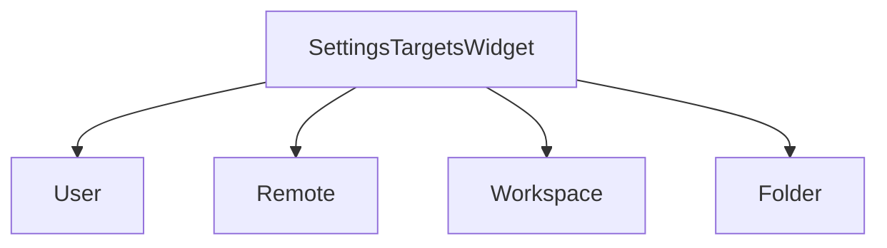
**Sources:** [src/vs/workbench/contrib/preferences/browser/preferencesWidgets.ts1-300](https://github.com/microsoft/vscode/blob/1be3088d/src/vs/workbench/contrib/preferences/browser/preferencesWidgets.ts#L1-L300) [src/vs/workbench/contrib/preferences/browser/settingsEditor2.ts777-795](https://github.com/microsoft/vscode/blob/1be3088d/src/vs/workbench/contrib/preferences/browser/settingsEditor2.ts#L777-L795)

### Target Change

On target switch:

1.  Clear model
2.  Create new `SettingsTreeModel`
3.  Re-render
4.  Update TOC
5.  Preserve search

**Sources:** [src/vs/workbench/contrib/preferences/browser/settingsEditor2.ts841-876](https://github.com/microsoft/vscode/blob/1be3088d/src/vs/workbench/contrib/preferences/browser/settingsEditor2.ts#L841-L876)

---

## Extension Integration

### Extension Settings

Extensions contribute via `package.json`.

**Contribution Flow:**

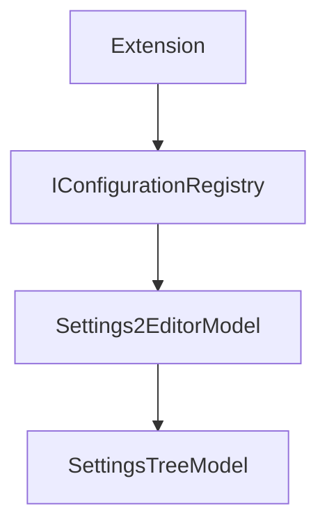
**Metadata:**

| Field | Purpose |
| --- | --- |
| `extensionInfo.id` | Extension ID |
| `extensionInfo.displayName` | Display name |
| `setting.extensionName` | Extension name |
| `setting.extensionPublisher` | Publisher |

**Sources:** [src/vs/workbench/contrib/preferences/browser/settingsTree.ts475-566](https://github.com/microsoft/vscode/blob/1be3088d/src/vs/workbench/contrib/preferences/browser/settingsTree.ts#L475-L566) [src/vs/workbench/services/preferences/common/preferencesModels.ts1130-1243](https://github.com/microsoft/vscode/blob/1be3088d/src/vs/workbench/services/preferences/common/preferencesModels.ts#L1130-L1243)

### Extension Toggles

For `extensions.{id}.enabled` settings.

`SettingExtensionToggleRenderer` provides:

-   Enable/Disable button
-   Name and publisher
-   Dismiss button

**Sources:** [src/vs/workbench/contrib/preferences/browser/settingsTree.ts3240-3470](https://github.com/microsoft/vscode/blob/1be3088d/src/vs/workbench/contrib/preferences/browser/settingsTree.ts#L3240-L3470) [src/vs/workbench/contrib/preferences/common/preferences.ts175-226](https://github.com/microsoft/vscode/blob/1be3088d/src/vs/workbench/contrib/preferences/common/preferences.ts#L175-L226)

---

## Keyboard Navigation

### Focus Contexts

**Context States:**

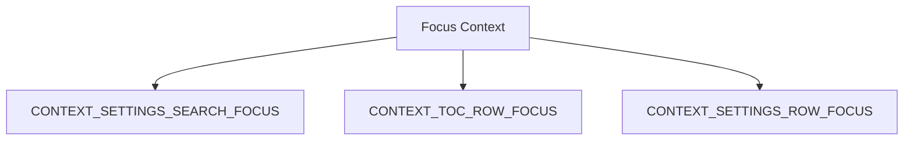
**Navigation:**

-   `Tab`/`Shift+Tab` - Cycle
-   `↑`/`↓` - Navigate
-   `Enter` - Focus control
-   `Escape` - Return to tree

**Sources:** [src/vs/workbench/contrib/preferences/browser/settingsEditor2.ts76-81](https://github.com/microsoft/vscode/blob/1be3088d/src/vs/workbench/contrib/preferences/browser/settingsEditor2.ts#L76-L81) [src/vs/workbench/contrib/preferences/browser/settingsEditor2.ts609-632](https://github.com/microsoft/vscode/blob/1be3088d/src/vs/workbench/contrib/preferences/browser/settingsEditor2.ts#L609-L632)

---

## Styling

### Color Tokens

| Token | Purpose |
| --- | --- |
| `settings.headerForeground` | Headers |
| `settings.modifiedItemIndicator` | Modified bar |
| `settings.focusedRowBackground` | Focused row |
| `settings.rowHoverBackground` | Hover |
| `settings.focusedRowBorder` | Border |
| `settings.checkboxBackground` | Checkbox |
| `settings.checkboxBorder` | Checkbox border |
| `settings.textInputBorder` | Text input |
| `settings.numberInputBorder` | Number input |

**Sources:** [src/vs/workbench/contrib/preferences/common/settingsEditorColorRegistry.ts1-100](https://github.com/microsoft/vscode/blob/1be3088d/src/vs/workbench/contrib/preferences/common/settingsEditorColorRegistry.ts#L1-L100)

### CSS Classes

Main structure:

-   `.settings-editor`
    -   `.settings-header`
    -   `.settings-body`
        -   `.settings-toc-container`
        -   `.settings-tree-container`

**Sources:** [src/vs/workbench/contrib/preferences/browser/media/settingsEditor2.css10-383](https://github.com/microsoft/vscode/blob/1be3088d/src/vs/workbench/contrib/preferences/browser/media/settingsEditor2.css#L10-L383)

---

## Performance

### Optimizations

**Virtualization:**

-   Virtual scrolling for TOC and tree
-   Only visible items rendered
-   Template recycling

**Debouncing:**

-   200ms search debounce
-   Batched configuration updates

**Lazy Loading:**

-   Extension settings on demand
-   Async AI search

**Sources:** [src/vs/workbench/contrib/preferences/browser/settingsEditor2.ts112-114](https://github.com/microsoft/vscode/blob/1be3088d/src/vs/workbench/contrib/preferences/browser/settingsEditor2.ts#L112-L114) [src/vs/workbench/contrib/preferences/browser/settingsEditor2.ts273-280](https://github.com/microsoft/vscode/blob/1be3088d/src/vs/workbench/contrib/preferences/browser/settingsEditor2.ts#L273-L280)

### Update Batching

**Batching Sequence:**

> **[Mermaid sequence]**
> *(图表结构无法解析)*

**Sources:** [src/vs/workbench/contrib/preferences/browser/settingsEditor2.ts1577-1650](https://github.com/microsoft/vscode/blob/1be3088d/src/vs/workbench/contrib/preferences/browser/settingsEditor2.ts#L1577-L1650)

---

## Related Systems

-   **Keybindings Editor** [11.3](/microsoft/vscode/11.3-git-commands-and-actions) - Similar tree-based editor for keyboard shortcuts
-   **Preferences Service** [11.4](/microsoft/vscode/11.4-git-history-provider) - Underlying service layer for settings access
-   **Configuration Service** - Platform-level configuration management
-   **Extension System** [5](/microsoft/vscode/5-workbench-architecture) - Extension contribution mechanism

**Sources:** [src/vs/workbench/contrib/preferences/browser/preferences.contribution.ts1-100](https://github.com/microsoft/vscode/blob/1be3088d/src/vs/workbench/contrib/preferences/browser/preferences.contribution.ts#L1-L100) [src/vs/workbench/services/preferences/browser/preferencesService.ts1-100](https://github.com/microsoft/vscode/blob/1be3088d/src/vs/workbench/services/preferences/browser/preferencesService.ts#L1-L100)
